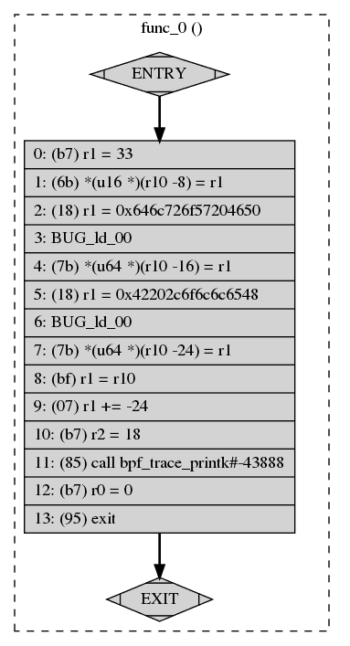

# 第五章：BPF 实用工具

迄今为止，我们已经讨论了如何编写 BPF 程序来提高系统内的可见性。多年来，许多开发人员使用 BPF 构建了同样目的的工具。在本章中，我们讨论了几种您可以每天使用的现成工具。其中许多工具是您已经见过的某些 BPF 程序的高级版本。其他工具将帮助您直接查看自己的 BPF 程序。

本章涵盖了一些工具，这些工具将帮助您在日常工作中使用 BPF。我们首先介绍了 BPFTool，这是一个命令行实用程序，可提供有关您的 BPF 程序更多信息。我们还介绍了 BPFTrace 和`kubectl-trace`，这些工具将帮助您使用简洁的特定领域语言（DSL）更有效地编写 BPF 程序。最后，我们讨论了 eBPF Exporter，这是一个将 BPF 与 Prometheus 集成的开源项目。

# BPFTool

BPFTool 是一个内核实用程序，用于检查 BPF 程序和映射。此工具不会默认安装在任何 Linux 发行版上，并且正在大力开发中，因此您需要编译最适合您的 Linux 内核的版本。我们涵盖了与 Linux 内核版本 5.1 分发的 BPFTool 版本。

在接下来的章节中，我们将讨论如何将 BPFTool 安装到您的系统上，并如何使用它从终端观察和更改您的 BPF 程序和映射的行为。

## 安装

要安装 BPFTool，您需要下载内核源代码的副本。您的特定 Linux 发行版可能有一些在线包，但我们将介绍如何从源代码安装，因为这并不太复杂。

1.  使用**`git clone https://github.com/torvalds/linux`**命令从 GitHub 克隆存储库。

1.  使用`git checkout v5.1`命令检出特定的内核版本标签。

1.  在内核源代码中，使用`cd tools/bpf/bpftool`命令导航到存储 BPFTool 源代码的目录。

1.  使用`make && sudo make install`命令编译并安装此工具。

检查 BPFTool 是否正确安装，可以通过检查其版本来确认：

```
# bpftool --version
bpftool v5.1.0
```

## 特性展示

使用 BPFTool 的基本操作之一是扫描系统，以了解您可以访问哪些 BPF 特性。当您不记得内核的哪个版本引入了哪种程序类型或 BPF JIT 编译器是否已启用时，这非常有用。要找出这些问题的答案及其他问题，请运行以下命令：

```
# bpftool feature
```

您将获得有关系统中所有支持的 BPF 特性的详细信息的长输出。为了简洁起见，我们在此展示了其剪裁版本：

```
Scanning system configuration...
bpf() syscall for unprivileged users is enabled
JIT compiler is enabled
...
Scanning eBPF program types...
eBPF program_type socket_filter is available
eBPF program_type kprobe is NOT available
...
Scanning eBPF map types...
eBPF map_type hash is available
eBPF map_type array is available
```

在此输出中，您可以看到我们的系统允许非特权用户执行`bpf`系统调用，此调用受限于某些操作。您还可以看到 JIT 已启用。内核的新版本默认启用此 JIT，在编译 BPF 程序时非常有用。如果您的系统未启用此功能，可以运行以下命令来启用它：

```
# echo 1 > /proc/sys/net/core/bpf_jit_enable
```

特性输出还显示了在你的系统中启用了哪些程序类型和映射类型。该命令公开的信息比我们这里展示的要多得多，例如，程序类型支持的 BPF 助手及许多其他配置指令。在探索系统时，可以随意深入了解它们。

知道你可以使用哪些功能非常有用，尤其是当你需要深入了解一个未知的系统时。接下来，我们准备介绍其他有趣的 BPFTool 功能，比如检查已加载的程序。

## 检查 BPF 程序

BPFTool 直接提供有关内核中 BPF 程序的信息。它允许你调查系统中已经运行的内容。它还允许你加载和固定之前从命令行编译的新 BPF 程序。

学习如何使用 BPFTool 与程序一起工作的最佳起点是检查系统中正在运行的内容。为此，你可以运行`bpftool prog show`命令。如果你使用 Systemd 作为启动系统，你可能已经加载了一些 BPF 程序并将其附加到一些 cgroups 上；我们稍后会详细讨论这些。运行该命令的输出如下所示：

```
52: cgroup_skb  tag 7be49e3934a125ba
        loaded_at 2019-03-28T16:46:04-0700  uid 0
        xlated 296B  jited 229B  memlock 4096B  map_ids 52,53
53: cgroup_skb  tag 2a142ef67aaad174
        loaded_at 2019-03-28T16:46:04-0700  uid 0
        xlated 296B  jited 229B  memlock 4096B  map_ids 52,53
54: cgroup_skb  tag 7be49e3934a125ba
        loaded_at 2019-03-28T16:46:04-0700  uid 0
        xlated 296B  jited 229B  memlock 4096B  map_ids 54,55
```

冒号前面的左侧数字是程序标识符；稍后我们会使用它们来调查这些程序的具体内容。从这个输出中，你还可以了解你的系统正在运行哪些类型的程序。在这种情况下，系统正在运行附加到 cgroup 套接字缓冲区的三个 BPF 程序。如果这些程序确实是由 Systemd 启动的，加载时间可能与你启动系统时相匹配。你还可以看到这些程序当前正在使用多少内存以及与它们相关联的映射的标识符。所有这些信息一目了然，并且因为我们有程序标识符，所以我们可以进一步深入了解。

你可以将程序标识符作为额外参数添加到前一个命令中：`bpftool prog show id 52`。这样，BPFTool 会显示与 ID 52 对应的相同信息，这样你就可以过滤掉不需要的信息。此命令还支持`--json`标志以生成一些 JSON 输出。如果你想操作输出，这个 JSON 输出非常方便。例如，像`jq`这样的工具可以为这些数据提供更结构化的格式化：

```
# bpftool prog show --json id 52 | jq
{
  "id": 52,
  "type": "cgroup_skb",
  "tag": "7be49e3934a125ba",
  "gpl_compatible": false,
  "loaded_at": 1553816764,
  "uid": 0,
  "bytes_xlated": 296,
  "jited": true,
  "bytes_jited": 229,
  "bytes_memlock": 4096,
  "map_ids": [
    52,
    53
  ]
}
```

你还可以执行更高级的操作，并且仅筛选你感兴趣的信息。在下一个例子中，我们只关心知道 BPF 程序标识符、程序类型以及它何时加载到内核中：

```
# bpftool prog show --json id 52 | jq -c '[.id, .type, .loaded_at]'
[52,"cgroup_skb",1553816764]
```

当你知道一个程序标识符时，你还可以使用 BPFTool 获取整个程序的转储；当你需要调试编译器生成的 BPF 字节码时，这可能会很方便：

```
# bpftool prog dump xlated id 52
   0: (bf) r6 = r1
   1: (69) r7 = *(u16 *)(r6 +192)
   2: (b4) w8 = 0
   3: (55) if r7 != 0x8 goto pc+14
   4: (bf) r1 = r6
   5: (b4) w2 = 16
   6: (bf) r3 = r10
   7: (07) r3 += -4
   8: (b4) w4 = 4
   9: (85) call bpf_skb_load_bytes#7151872
   ...
```

我们的 Systemd 加载的这个程序正在使用`bpf_skb_load_bytes`助手检查数据包数据。

如果您希望以更直观的方式表示此程序，包括指令跳转，可以在此命令中使用`visual`关键字。这将以一种可以使用`dotty`等工具转换为图形表示的格式生成输出：

```
# bpftool prog dump xlated id 52 visual &> output.out
# dot -Tpng output.out -o visual-graph.png
```

您可以在图 5-1 中看到一个小型 Hello World 程序的可视表示。



###### 图 5-1\. BPF 程序的可视表示

如果您正在运行内核的 5.1 版本或更新版本，您还可以访问运行时统计信息。这些信息告诉您内核在运行您的 BPF 程序时花费了多少时间。此功能可能不会在您的系统中默认启用；您需要先运行此命令，让内核知道需要显示这些数据：

```
# sysctl -w kernel.bpf_stats_enabled=1
```

启用统计信息后，运行 BPFTool 时，您将获得两个额外的信息片段：内核运行该程序所花费的总时间(`run_time_ns`)以及运行次数(`run_cnt`)：

```
52: cgroup_skb  tag 7be49e3934a125ba  run_time_ns 14397 run_cnt 39
        loaded_at 2019-03-28T16:46:04-0700  uid 0
        xlated 296B  jited 229B  memlock 4096B  map_ids 52,53
```

但是 BPFTool 不仅允许您检查程序的执行情况；它还允许您将新程序加载到内核中，并将其中一些程序附加到套接字和 cgroups。例如，我们可以加载先前的程序之一并将其固定到 BPF 文件系统中，使用以下命令：

```
# bpftool prog load bpf_prog.o /sys/fs/bpf/bpf_prog
```

因为程序被固定到文件系统，运行后不会终止，我们可以看到它仍然加载在前面的`show`命令中：

```
# bpftool prog show
52: cgroup_skb  tag 7be49e3934a125ba
        loaded_at 2019-03-28T16:46:04-0700  uid 0
        xlated 296B  jited 229B  memlock 4096B  map_ids 52,53
53: cgroup_skb  tag 2a142ef67aaad174
        loaded_at 2019-03-28T16:46:04-0700  uid 0
        xlated 296B  jited 229B  memlock 4096B  map_ids 52,53
54: cgroup_skb  tag 7be49e3934a125ba
        loaded_at 2019-03-28T16:46:04-0700  uid 0
        xlated 296B  jited 229B  memlock 4096B  map_ids 54,55
60: perf_event  name bpf_prog  tag c6e8e35bea53af79
        loaded_at 2019-03-28T20:46:32-0700  uid 0
        xlated 112B  jited 115B  memlock 4096B
```

正如您所见，BPFTool 为您提供了有关加载在内核中的程序的大量信息，而无需编写和编译任何代码。接下来让我们看看如何使用 BPF 映射。

## 检查 BPF 映射

除了让您访问检查和操作 BPF 程序外，BPFTool 还可以让您访问这些程序正在使用的 BPF 映射。列出所有映射并按其标识符过滤的命令类似于您之前看到的`show`命令。而不是要求 BPFTool 显示`prog`的信息，让我们要求它显示`map`的信息：

```
# bpftool map show
52: lpm_trie  flags 0x1
        key 8B  value 8B  max_entries 1  memlock 4096B
53: lpm_trie  flags 0x1
        key 20B  value 8B  max_entries 1  memlock 4096B
54: lpm_trie  flags 0x1
        key 8B  value 8B  max_entries 1  memlock 4096B
55: lpm_trie  flags 0x1
        key 20B  value 8B  max_entries 1  memlock 4096B
```

这些映射与您早期在程序中看到的标识符匹配。您还可以按照它们的 ID 过滤映射，就像我们早期按照程序的 ID 过滤程序一样。

使用 BPFTool 可以创建和更新映射，并列出映射中的所有元素。创建新映射需要与初始化映射时提供的相同信息，以及您的程序之一。我们需要指定要创建的映射类型、键和值的大小以及其名称。因为我们没有与程序一起初始化映射，所以我们还需要将其固定到 BPF 文件系统，以便稍后使用：

```
# bpftool map create /sys/fs/bpf/counter
    type array key 4 value 4 entries 5 name counter
```

在运行该命令后，如果列出系统中的映射，您将在列表底部看到新映射：

```
52: lpm_trie  flags 0x1
        key 8B  value 8B  max_entries 1  memlock 4096B
53: lpm_trie  flags 0x1
        key 20B  value 8B  max_entries 1  memlock 4096B
54: lpm_trie  flags 0x1
        key 8B  value 8B  max_entries 1  memlock 4096B
55: lpm_trie  flags 0x1
        key 20B  value 8B  max_entries 1  memlock 4096B
56: lpm_trie  flags 0x1
        key 8B  value 8B  max_entries 1  memlock 4096B
57: lpm_trie  flags 0x1
        key 20B  value 8B  max_entries 1  memlock 4096B
58: array  name counter  flags 0x0
        key 4B  value 4B  max_entries 5  memlock 4096B
```

创建映射后，您可以更新和删除元素，就像我们在 BPF 程序内部所做的那样。

###### 提示

请记住，你不能从固定大小的数组中删除元素；你只能更新它们。但是你可以完全删除其他地图中的元素，例如哈希地图。

如果你想向地图中添加新元素或更新现有元素，可以使用`map update`命令。你可以从前面的示例中获取地图标识符：

```
# bpftool map update id 58 key 1 0 0 0 value 1 0 0 0
```

如果尝试使用无效的键或值更新元素，BPFTool 将返回错误：

```
# bpftool map update id 58 key 1 0 0 0 value 1 0 0
Error: value expected 4 bytes got 3
```

如果需要检查其值，BPFTool 可以为你提供地图中所有元素的转储。当你创建固定大小数组地图时，你可以看到 BPF 如何将所有元素初始化为 null 值：

```
# bpftool map dump id 58
key: 00 00 00 00  value: 00 00 00 00
key: 01 00 00 00  value: 01 00 00 00
key: 02 00 00 00  value: 00 00 00 00
key: 03 00 00 00  value: 00 00 00 00
key: 04 00 00 00  value: 00 00 00 00
```

BPFTool 给你提供的最强大选项之一是你可以将预先创建的地图附加到新程序上，并用这些预分配的地图替换它们将初始化的地图。这样，即使你没有编写程序从 BPF 文件系统读取地图，也可以在程序加载时给程序访问保存的数据。为此，你需要在使用 BPFTool 加载程序时设置要初始化的地图。你可以通过地图的有序标识符指定地图，例如第一个地图为 0，第二个为 1，依此类推。你也可以通过地图的名称指定地图，这通常更方便：

```
# bpftool prog load bpf_prog.o /sys/fs/bpf/bpf_prog_2 \
    map name counter /sys/fs/bpf/counter
```

在这个例子中，我们将刚创建的地图附加到一个新程序中。在这种情况下，我们通过地图名称替换地图，因为我们知道该程序初始化了一个名为`counter`的地图。如果你觉得更容易记忆，你也可以使用关键词`idx`来使用地图的索引位置，例如`idx 0`。

直接从命令行访问 BPF 地图在需要实时调试消息传递时非常有用。BPFTool 以方便的方式为你提供直接访问。除了检查程序和地图之外，你还可以使用 BPFTool 从内核中提取更多信息。接下来让我们看看如何访问特定接口。

## 检查连接到特定接口的程序

有时你会想知道哪些程序连接到特定接口。BPF 可以加载在 cgroups、Perf 事件和网络数据包之上运行的程序。子命令`cgroup`、`perf`和`net`可以帮助你跟踪这些接口上的附件。

`perf`子命令列出系统中跟踪点（如 kprobes、uprobes 和 tracepoints）附加的所有程序；你可以通过运行`bpftool perf show`查看此列表。

`net`子命令列出连接到 XDP 和 Traffic Control 的程序。像套接字过滤器和复用端口程序这样的其他附件只能通过使用`iproute2`访问。你可以像查看其他 BPF 对象一样，使用`bpftool net show`列出连接到 XDP 和 TC 的附件。

最后，`cgroup` 子命令列出附加到 cgroups 的所有程序。这个子命令与您看到的其他命令有点不同。`bpftool cgroup show` 需要指定要检查的 cgroup 的路径。如果要列出系统中所有 cgroups 中的所有附件，您需要使用 `bpftool cgroup tree`，如本例所示：

```
# bpftool cgroup tree
CgroupPath
ID       AttachType      AttachFlags     Name
/sys/fs/cgroup/unified/system.slice/systemd-udevd.service
    5        ingress
    4        egress
/sys/fs/cgroup/unified/system.slice/systemd-journald.service
    3        ingress
    2        egress
/sys/fs/cgroup/unified/system.slice/systemd-logind.service
    7        ingress
    6        egress
```

有了 BPFTool，您可以验证程序是否正确附加到内核中的任何接口，从而快速访问 cgroups、Perf 和网络接口。

到目前为止，我们已经讨论了如何在终端中输入不同的命令来调试您的 BPF 程序的行为。然而，在您最需要它们时，记住所有这些命令可能会很麻烦。接下来我们描述如何从纯文本文件中加载多个命令，以便您可以建立一组脚本，而无需记住我们讨论过的每个选项。

## 批处理模式加载命令

在您试图分析一个或多个系统的行为时，运行多个命令多次是很常见的。您可能会最终得到一组您在工具链中经常使用的命令集合。如果您不想每次都输入这些命令，BPFTool 的批处理模式就是为您准备的。

使用批处理模式，您可以将想要执行的所有命令写入一个文件中，并一次性运行它们。您还可以通过在行首添加 # 来在此文件中编写注释。然而，这种执行模式不是原子性的。BPFTool 逐行执行命令，并且如果其中一个命令失败，它将中止执行，使系统保持在最新成功命令运行后的状态。

这是批处理模式可以处理的文件的一个简短示例：

```
# Create a new hash map
map create /sys/fs/bpf/hash_map type hash key 4 value 4 entries 5 name hash_map
# Now show all the maps in the system
map show
```

如果你将这些命令保存在名为 */tmp/batch_example.txt* 的文件中，你可以使用 `bpftool batch file /tmp/batch_example.txt` 加载它。当你第一次运行此命令时，将会得到类似以下片段的输出，但如果你尝试再次运行它，由于系统中已经有一个名为 `hash_map` 的映射，命令将会退出而不产生输出，并且批处理执行将在第一行失败：

```
# bpftool batch file /tmp/batch_example.txt
2: lpm_trie  flags 0x1
	key 8B  value 8B  max_entries 1  memlock 4096B
3: lpm_trie  flags 0x1
	key 20B  value 8B  max_entries 1  memlock 4096B
18: hash  name hash_map  flags 0x0
	key 4B  value 4B  max_entries 5  memlock 4096B
processed 2 commands
```

批处理模式是我们在 BPFTool 中最喜欢的选项之一。我们建议将这些批处理文件存储在版本控制系统中，以便您可以与团队共享，创建自己的一套实用工具。在跳转到我们下一个最喜欢的实用程序之前，让我们看看 BPFTool 如何帮助您更好地理解 BPF 类型格式。

## 显示 BTF 信息

当存在时，BPFTool 可以显示任何给定二进制对象的 BPF 类型格式（BTF）信息。正如我们在第二章中提到的，BTF 用元数据信息注释程序结构，以帮助您调试程序。

例如，当您向 `prog dump` 添加关键字 `linum` 时，它可以为 BPF 程序中的每条指令提供源文件和行号。

较新版本的 BPFTool 包括一个新的`btf`子命令，帮助您深入了解程序。该命令的初始重点是可视化结构类型。例如，`bpftool btf dump id 54`显示了加载 ID 为 54 的程序的所有 BFT 类型。

使用 BPFTool 的一些用途。这是一个低摩擦的入口点，尤其是如果你不是每天在该系统上工作的话。

# BPFTrace

BPFTrace 是一种面向 BPF 的高级跟踪语言。它允许您使用简洁的 DSL 编写 BPF 程序，并将它们保存为脚本，无需手动编译和加载到内核中。这种语言受其他知名工具的启发，如 awk 和 DTrace。如果您熟悉 DTrace，并且一直想在 Linux 上使用它，那么在 BPFTrace 中您会找到一个很好的替代品。

使用 BPFTrace 而不是直接用 BCC 或其他 BPF 工具编写程序的一个优点是，BPFTrace 提供了许多不需要您自己实现的内置功能，例如聚合信息和创建直方图。另一方面，BPFTrace 使用的语言更加有限，如果尝试实现高级程序可能会受到限制。在本节中，我们展示了语言的最重要方面。我们建议访问[Github 上的 BPFTrace 存储库](https://github.com/iovisor/bpftrace)来了解更多信息。

## 安装

您可以通过多种方式安装 BPFTrace，尽管其开发人员建议您使用适合您特定 Linux 发行版的预构建软件包之一。他们还在其存储库中维护了一份包含所有安装选项和系统前提条件的文档。在那里，您会找到关于[安装文档](https://oreil.ly/h9Pha)的说明。

## 语言参考

BPFTrace 执行的程序具有简洁的语法。我们可以将它们分为三个部分：头部、动作块和尾部。头部是 BPFTrace 加载程序时执行的特殊块；通常用于在输出顶部打印一些信息，如序言。同样，尾部是 BPFTrace 在终止程序之前执行的特殊块。头部和尾部都是 BPFTrace 程序中可选的部分。BPFTrace 程序必须至少有一个*动作块*。动作块是我们指定要跟踪的探针及内核触发这些探针事件时执行的操作的地方。下一段代码片段展示了一个基本示例中的这三个部分：

```
BEGIN
{
  printf("starting BPFTrace program\n")
}

kprobe:do_sys_open
{
  printf("opening file descriptor: %s\n", str(arg1))
}

END
{
  printf("exiting BPFTrace program\n")
}
```

头部区域始终用关键字`BEGIN`标记，尾部区域始终用关键字`END`标记。这些关键字是 BPFTrace 保留的。动作块标识符定义了要将 BPF 动作附加到的探针。在前面的示例中，我们每次内核打开文件时都会打印一条日志行。

除了识别程序段之外，我们已经在之前的示例中看到了有关语言语法的一些更多细节。当程序编译时，BPFTrace 提供一些帮助器，这些帮助器会被转换为 BPF 代码。帮助器`printf`是 C 函数`printf`的包装器，用于在需要时打印程序细节。`str`是一个内置帮助器，将 C 指针转换为其字符串表示。许多内核函数接收字符指针作为参数；此帮助器会将这些指针转换为字符串。

BPFTrace 在某种意义上可以被视为动态语言，因为它不知道内核在执行时可能接收到的参数数量。这就是为什么 BPFTrace 提供参数帮助器来访问内核处理的信息。BPFTrace 根据块接收的参数数量动态生成这些帮助器，并且您可以通过参数在参数列表中的位置访问信息。在上一个示例中，`arg1`是`open`系统调用中第二个参数的引用，该参数是文件路径的引用。

要执行此示例，您可以将其保存到文件中，并使用文件路径作为第一个参数运行 BPFTrace：

```
# bpftrace /tmp/example.bt
```

BPFTrace 的语言设计考虑到了脚本编写。在前面的示例中，您已经看到了该语言的简洁版本，因此您可以熟悉它。但是，您可以用 BPFTrace 编写的许多程序都可以放在一行中。您无需将这些单行程序存储在文件中以执行它们；在执行 BPFTrace 时，可以使用`-e`选项来运行它们。例如，前面的计数器示例可以通过将动作块折叠成一行来变成一行代码：

```
# bpftrace -e "kprobe:do_sys_open { @opens[str(arg1)] = count() }"
```

现在您对 BPFTrace 的语言有了更多了解，让我们看看如何在几种场景中使用它。

## 过滤

当您运行上一个示例时，您可能会得到一个流，显示系统正在不断打开的文件，直到您按 Ctrl-C 退出程序。这是因为我们告诉 BPF 打印内核打开的每个文件描述符。有些情况下，您只想针对特定条件执行动作块。BPFTrace 称之为*过滤*。

您可以将一个过滤器与每个动作块关联起来。它们像动作块一样进行评估，但如果过滤器返回 false 值，则动作不会执行。它们还可以访问语言的其余部分，包括探针参数和帮助器。这些过滤器在动作头部之后用两条斜线封装起来：

```
kprobe:do_sys_open /str(arg1) == "/tmp/example.bt"/
{
  printf("opening file descriptor: %s\n", str(arg1))
}
```

在这个例子中，我们将我们的动作块细化为仅在内核打开的文件是我们用来存储此示例的文件时执行。如果你使用新的过滤器运行程序，你会看到它打印页眉，但在那里停止打印。这是因为以前触发我们动作的每个文件现在都被跳过了，多亏了我们的新过滤器。如果你在不同的终端中多次打开示例文件，你会看到内核在过滤器匹配我们文件路径时如何执行动作：

```
# bpftrace /tmp/example.bt
Attaching 3 probes...
starting BPFTrace program
opening file descriptor: /tmp/example.bt
opening file descriptor: /tmp/example.bt
opening file descriptor: /tmp/example.bt
^Cexiting BPFTrace program
```

BPFTrace 的过滤功能非常有助于隐藏不需要的信息，并将数据范围限定在真正关心的内容上。接下来我们将讨论 BPFTrace 如何实现与映射的无缝工作。

## 动态映射

BPFTrace 实现的一个方便功能是动态映射关联。它可以动态生成你可以用于本书中许多操作的 BPF 映射。所有映射关联都以字符 `@` 开头，后跟你想要创建的映射的名称。你还可以通过为这些映射分配值来关联更新元素。

如果我们采用本节开始时的示例，我们可以聚合系统打开特定文件的频率。为此，我们需要计算内核在特定文件上运行 `open` 系统调用的次数，然后将这些计数器存储在映射中。为了识别这些聚合，我们可以使用文件路径作为映射的键。在这种情况下，我们的动作块将如何看起来：

```
kprobe:do_sys_open
{
  @opens[str(arg1)] = count()
}
```

如果你再次运行你的程序，你会得到类似于这样的输出：

```
# bpftrace /tmp/example.bt
Attaching 3 probes...
starting BPFTrace program
^Cexiting BPFTrace program

@opens[/var/lib/snapd/lib/gl/haswell/libdl.so.2]: 1
@opens[/var/lib/snapd/lib/gl32/x86_64/libdl.so.2]: 1
...
@opens[/usr/lib/locale/en.utf8/LC_TIME]: 10
@opens[/usr/lib/locale/en_US/LC_TIME]: 10
@opens[/usr/share/locale/locale.alias]: 12
@opens[/proc/8483/cmdline]: 12
```

正如你所见，当 BPFTrace 停止程序执行时，它会打印映射的内容。正如我们预期的那样，它正在聚合内核在我们系统中打开文件的频率。默认情况下，当 BPFTrace 终止时，它总是会打印每个映射的内容。你不需要指定要打印映射；它总是假设你想要这样做。你可以通过在 `END` 块内使用内置函数 `clear` 来更改这种行为来清除映射。这有效是因为打印映射始终发生在页脚块执行之后。

BPFTrace 的动态映射非常方便。它消除了使用映射所需的大量样板，并专注于帮助你轻松收集数据。

BPFTrace 是你日常任务中强大的工具。其脚本语言提供了足够的灵活性，使你能够在不需要手动编译和加载 BPF 程序到内核的情况下访问系统的各个方面，从而帮助你从一开始就跟踪和调试系统中的问题。请查看其 GitHub 仓库中的参考指南，了解如何充分利用其内置功能，如自动直方图和堆栈跟踪聚合。

在下一节中，我们将探讨如何在 Kubernetes 中使用 BPFTrace。

# kubectl-trace

`kubectl-trace` 是 Kubernetes 命令行工具 `kubectl` 的一个出色插件。它帮助你在 Kubernetes 集群中调度 BPFTrace 程序，而无需安装任何额外的包或模块。它通过调度一个 Kubernetes 任务来实现，任务使用已经安装了运行程序所需一切的容器镜像。这个镜像称为 `trace-runner`，并且也可以在公共 Docker 注册表中找到。

## 安装

你需要使用 Go 的工具链从其源代码仓库安装 `kubectl-trace`，因为它的开发者没有提供二进制包：

```
go get -u github.com/iovisor/kubectl-trace/cmd/kubectl-trace
```

在 Go 工具链编译程序并将其放入路径后，`kubectl` 的插件系统会自动检测到这个新插件。`kubectl-trace` 在第一次执行时会自动下载它在集群中运行所需的 Docker 镜像。

## 检查 Kubernetes 节点

你可以使用 `kubectl-trace` 来定位运行容器的节点和 Pod，也可以用它来定位运行在这些容器上的进程。在第一种情况下，你几乎可以运行任何你想要的 BPF 程序。但是，在第二种情况下，你只能运行将用户空间探针附加到这些进程的程序。

如果你想在特定节点上运行 BPF 程序，你需要一个适当的标识符，以便 Kubernetes 将任务调度到合适的地方。获取了标识符后，运行程序的方式与之前所见的程序类似。这是我们运行一个用于计算文件打开次数的单行程序的方法：

```
# kubectl trace run node/node_identifier -e \
  "kprobe:do_sys_open { @opens[str(arg1)] = count() }"
```

如你所见，程序完全相同，但我们使用 `kubectl trace run` 命令将其调度到特定的集群节点上。我们使用 `node/...` 语法告诉 `kubectl-trace` 我们要定位集群中的一个节点。如果我们想要定位特定的 Pod，我们将 `node/` 替换为 `pod/`。

在特定容器上运行程序需要更长的语法；让我们先看一个例子并逐步分解它：

```
# kubectl trace run pod/pod_identifier -n application_name -e <<PROGRAM
uretprobe:/proc/$container_pid/exe:"main.main" {
  printf("exit: %d\n", retval)
}
PROGRAM
```

这个命令中有两个值得关注的地方。首先是我们需要应用程序在容器中运行的名称，以便找到其进程；在我们的示例中对应的是 `application_name`。你需要使用在容器中执行的二进制文件的名称，例如 `nginx` 或 `memcached`。通常情况下，容器只运行一个进程，但这样做可以确保我们将程序附加到正确的进程上。第二个需要强调的方面是在我们的 BPF 程序中包含的 `$container_pid`。这不是一个 BPFTrace 助手，而是 `kubectl-trace` 用作进程标识符替换的占位符。在运行 BPF 程序之前，跟踪运行器会用正确的标识符替换占位符，并将我们的程序附加到正确的进程上。

如果你在生产环境中运行 Kubernetes，`kubectl-trace` 在需要分析容器行为时将极大地简化你的工作。

在这一节和前面的章节中，我们专注于帮助您在容器环境中更有效地运行 BPF 程序的工具。在下一节中，我们将介绍一个很好的工具，用于将从 BPF 程序收集的数据集成到 Prometheus，这是一个知名的开源监控系统。

# eBPF Exporter

eBPF Exporter 是一个工具，允许您将自定义的 BPF 跟踪指标导出到 Prometheus。Prometheus 是一个高度可扩展的监控和警报系统。使 Prometheus 不同于其他监控系统的一个关键因素是它使用拉取策略来获取指标，而不是期望客户端将指标推送给它。这使用户可以编写自定义导出器，从任何系统收集指标，并使用定义良好的 API 模式由 Prometheus 拉取它们。eBPF Exporter 实现了这个 API，从 BPF 程序中获取跟踪指标并将其导入 Prometheus。

## 安装

尽管 eBPF Exporter 提供二进制包，我们建议从源代码安装，因为通常没有新的发布版本。从源代码构建还可以让您使用基于现代版本的 BCC（BPF 编译器集合）构建的新功能。

要从源代码安装 eBPF Exporter，您需要在计算机上已经安装了 BCC 和 Go 的工具链。有了这些先决条件，您可以使用 Go 下载并构建二进制文件：

```
go get -u github.com/cloudflare/ebpf_exporter/...
```

## 从 BPF 导出指标

eBPF Exporter 使用 YAML 文件进行配置，您可以在其中指定要从系统收集的指标、生成这些指标的 BPF 程序以及它们如何转换为 Prometheus。当 Prometheus 发送请求给 eBPF Exporter 拉取指标时，这个工具将 BPF 程序正在收集的信息转换为指标值。幸运的是，eBPF Exporter 捆绑了许多程序，可以从您的系统收集非常有用的信息，如每周期指令数（IPC）和 CPU 缓存命中率。

eBPF Exporter 的简单配置文件包括三个主要部分。在第一部分中，您定义希望 Prometheus 从系统中拉取的指标。这里是将在 BPF 映射中收集的数据转换为 Prometheus 理解的指标的地方。以下是项目示例中这些转换的示例：

```
programs:
  - name: timers
    metrics:
      counters:
        - name: timer_start_total
          help: Timers fired in the kernel
          table: counts
          labels:
            - name: function
              size: 8
              decoders:
                - name: ksym
```

我们正在定义一个名为 `timer_start_total` 的指标，它汇总内核启动定时器的频率。我们还指定，我们希望从名为 `counts` 的 BPF 映射收集此信息。最后，我们为映射键定义了一个转换函数。这是必要的，因为映射键通常是指向信息的指针，而我们希望将实际的函数名称发送给 Prometheus。

此示例的第二节描述了我们要将 BPF 程序附加到的探针。在这种情况下，我们想要跟踪定时器启动调用；我们使用追踪点 `timer:timer_start` 实现此目的：

```
    tracepoints:
      timer:timer_start: tracepoint__timer__timer_start
```

在这里，我们告诉 eBPF Exporter，我们希望将 BPF 函数`tracepoint__timer__timer_start`附加到这个特定的跟踪点。接下来让我们看看如何声明这个函数：

```
    code: |
      BPF_HASH(counts, u64);
      // Generates function tracepoint__timer__timer_start
      TRACEPOINT_PROBE(timer, timer_start) {
          counts.increment((u64) args->function);
          return 0;
      }
```

BPF 程序是内联在 YAML 文件中的。这可能是我们这个工具中较不喜欢的部分之一，因为 YAML 对空白格特别敏感，但对于像这样的小程序来说，它是有效的。eBPF Exporter 使用 BCC 来编译程序，因此我们可以使用其所有宏和助手。前面的代码片段使用宏`TRACEPOINT_PROBE`生成我们将附加到跟踪点的最终函数，其名称为`tracepoint__timer__timer_start`。

Cloudflare 使用 eBPF Exporter 来监控其所有数据中心的指标。公司确保捆绑了您希望从系统导出的最常见指标。但正如您所见，扩展新指标相对容易。

# 结论

在本章中，我们讨论了一些我们喜欢的系统分析工具。这些工具足够通用，以便在您需要调试系统中任何异常情况时随时使用。正如您所见，所有这些工具都抽象了我们在前几章中看到的概念，以帮助您在环境尚未准备好使用 BPF 时使用它。这是 BPF 在其他分析工具之前的许多优势之一；因为任何现代 Linux 内核都包括 BPF 虚拟机，您可以在其上构建利用这些强大功能的新工具。

还有许多其他工具也使用 BPF 来实现类似的目的，如 Cilium 和 Sysdig，我们鼓励您去尝试它们。

本章和第四章主要涉及系统分析和跟踪，但是你可以利用 BPF 做更多事情。在接下来的章节中，我们将深入探讨其网络能力。我们将向您展示如何分析任何网络中的流量，以及如何使用 BPF 控制网络中的消息。
