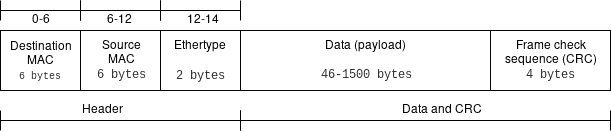
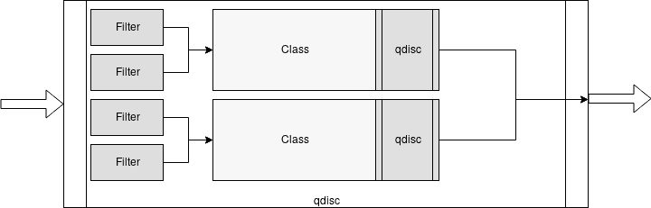
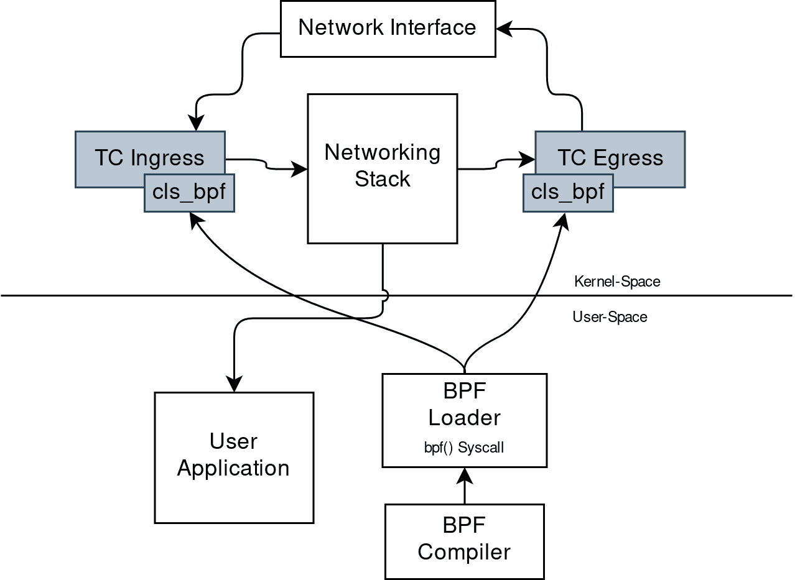

# 第六章：Linux 网络和 BPF

从网络角度来看，我们主要使用 BPF 程序的两个主要用例：数据包捕获和过滤。

这意味着用户空间程序可以将过滤器附加到任何套接字，并提取通过它流动的数据包的信息，并在检测到它们时允许/禁止/重定向某些类型的数据包。

本章的目标是解释 BPF 程序如何在 Linux 内核网络堆栈中的不同数据路径阶段与套接字缓冲结构进行交互。我们正在识别两种常见用例程序：

+   与*套接字*相关的程序类型

+   针对基于 BPF 的*流量控制*分类器编写的程序。

###### 注意

套接字缓冲结构，也称为 SKB 或`sk_buff`，是内核中为每个发送或接收的数据包创建和使用的结构。通过读取 SKB，您可以传递或丢弃数据包，并填充 BPF 映射以创建有关当前流量的统计信息和流量度量。

此外，一些 BPF 程序允许您操作 SKB 及其扩展，以转换最终数据包的重定向或更改其基本结构。例如，在仅支持 IPv6 的系统上，您可以编写一个程序，将所有接收到的 IPv4 数据包转换为 IPv6，这可以通过对数据包的 SKB 进行操作来完成。

了解我们可以编写的不同类型程序之间的区别，以及不同程序如何达到相同目标是理解网络中的 BPF 和 eBPF 的关键；在下一节中，我们将看看在套接字级别进行过滤的前两种方法：通过使用经典 BPF 过滤器和通过附加到套接字的 eBPF 程序。

# BPF 和数据包过滤

如所述，BPF 过滤器和 eBPF 程序是在网络上下文中使用 BPF 程序的主要用例；然而，最初，BPF 程序与数据包过滤是同义词。

数据包过滤仍然是最重要的用例之一，并且已从经典 BPF（cBPF）扩展到现代 eBPF，在 Linux 3.19 中增加了与过滤程序类型`BPF_PROG_TYPE_SOCKET_FILTER`相关的映射函数。

过滤器主要可以在三种高级场景中使用：

+   实时流量丢弃（例如，只允许用户数据报协议[UDP]流量，并丢弃其他任何内容）。

+   直接在实时系统中观察一组经过过滤的数据包的实时流动。

+   对在实时系统上捕获的网络流量进行回顾性分析，例如使用*pcap 格式*。

###### 注意

术语*pcap*来自两个词的结合：数据包和捕获。 pcap 格式实现为用于在名为数据包捕获库（*libpcap*）中捕获数据包的特定领域 API。在调试场景中，当您想要保存在实时系统上捕获的一组数据包以便稍后使用能够读取以 pcap 格式导出的数据包流的工具进行分析时，这种格式非常有用。

在接下来的几节中，我们展示了两种使用 BPF 程序应用数据包过滤概念的不同方法。首先，我们展示了一个常见且广泛使用的工具`tcpdump`如何作为 BPF 程序的高级接口用于过滤。然后，我们编写并加载我们自己的程序，使用`BPF_PROG_TYPE_SOCKET_FILTER` BPF 程序类型。

## tcpdump 和 BPF 表达式

谈论实时流量分析和观察时，几乎每个人都知道的一个命令行工具是`tcpdump`。本质上是`libpcap`的一个前端，它允许用户定义高级过滤表达式。`tcpdump`的作用是从你选择的网络接口（或任何接口）读取数据包，然后将接收到的数据包内容写入标准输出或文件中。可以使用 pcap 过滤语法来过滤数据包流。pcap 过滤语法是一种 DSL，用于使用一组原语来过滤数据包，这些原语通常比 BPF 汇编更易记。本章的范围不包括解释 pcap 过滤语法中所有可能的原语和表达式，因为完整的集合可以在`man 7 pcap-filter`中找到，但我们会通过一些示例让你了解其强大之处。

场景是我们位于一个 Linux 系统上，在端口 8080 上暴露了一个 Web 服务器；这个 Web 服务器没有记录它接收到的请求，而我们真的想知道它是否收到了任何请求，以及这些请求是如何流入的，因为应用服务的客户正在抱怨在浏览产品页面时无法得到任何响应。此时，我们只知道客户正在使用我们的 Web 应用程序连接到我们的产品页面之一，由该 Web 服务器提供服务，并且通常情况下，我们不知道问题的根本原因，因为最终用户通常不会为您调试服务，并且不幸的是，我们没有在这个系统中部署任何日志记录或错误报告策略，所以在调查问题时我们完全是盲目的。幸运的是，有一个工具可以帮助我们！它就是`tcpdump`，可以仅过滤在我们系统中使用传输控制协议（TCP）在端口 8080 上的 IPv4 数据包。因此，我们将能够分析 Web 服务器的流量并理解哪些是有问题的请求。

这是使用`tcpdump`进行过滤的命令：

```
# tcpdump -n 'ip and tcp port 8080'
```

让我们看看这条命令中发生了什么：

+   `-n` 参数告诉`tcpdump`不要将地址转换为相应的名称，我们希望看到源地址和目标地址。

+   `ip and tcp port 8080` 是 `tcpdump` 将用于过滤数据包的 pcap 过滤表达式。`ip` 表示 `IPv4`，`and` 是一个连接词，用于表达更复杂的过滤条件以允许添加更多表达式以匹配，然后我们指定我们只对来自或到达端口 `8080` 的 TCP 数据包感兴趣。在这种特定情况下，更好的过滤器应该是 `tcp dst port 8080`，因为我们只对目的端口为 `8080` 的数据包感兴趣，而不是来自该端口的数据包。

其输出将类似于这样（去除冗余部分，如完整的 TCP 握手）：

```
tcpdump: verbose output suppressed, use -v or -vv for full protocol decode
listening on wlp4s0, link-type EN10MB (Ethernet), capture size 262144 bytes
12:04:29.593703 IP 192.168.1.249.44206 > 192.168.1.63.8080: Flags [P.],
   seq 1:325, ack 1, win 343,
   options [nop,nop,TS val 25580829 ecr 595195678],
   length 324: HTTP: GET / HTTP/1.1
12:04:29.596073 IP 192.168.1.63.8080 > 192.168.1.249.44206: Flags [.],
   seq 1:1449, ack 325, win 507,
   options [nop,nop,TS val 595195731 ecr 25580829],
   length 1448: HTTP: HTTP/1.1 200 OK
12:04:29.596139 IP 192.168.1.63.8080 > 192.168.1.249.44206: Flags [P.],
   seq 1449:2390, ack 325, win 507,
   options [nop,nop,TS val 595195731 ecr 25580829],
   length 941: HTTP
12:04:46.242924 IP 192.168.1.249.44206 > 192.168.1.63.8080: Flags [P.],
   seq 660:996, ack 4779, win 388,
   options [nop,nop,TS val 25584934 ecr 595204802],
   length 336: HTTP: GET /api/products HTTP/1.1
12:04:46.243594 IP 192.168.1.63.8080 > 192.168.1.249.44206: Flags [P.],
   seq 4779:4873, ack 996, win 503,
   options [nop,nop,TS val 595212378 ecr 25584934],
   length 94: HTTP: HTTP/1.1 500 Internal Server Error
12:04:46.329245 IP 192.168.1.249.44234 > 192.168.1.63.8080: Flags [P.],
   seq 471:706, ack 4779, win 388,
   options [nop,nop,TS val 25585013 ecr 595205622],
   length 235: HTTP: GET /favicon.ico HTTP/1.1
12:04:46.331659 IP 192.168.1.63.8080 > 192.168.1.249.44234: Flags [.],
   seq 4779:6227, ack 706, win 506,
   options [nop,nop,TS val 595212466 ecr 25585013],
   length 1448: HTTP: HTTP/1.1 200 OK
12:04:46.331739 IP 192.168.1.63.8080 > 192.168.1.249.44234: Flags [P.],
   seq 6227:7168, ack 706, win 506,
   options [nop,nop,TS val 595212466 ecr 25585013],
   length 941: HTTP
```

现在情况清楚了！我们有一堆请求成功进行，返回了 `200 OK` 状态码，但在 `/api/products` 终端点上还有一个返回了 `500 Internal Server Error` 状态码的请求。我们的客户是对的；我们在列出产品时遇到了问题！

在这一点上，你可能会问自己，这些 pcap 过滤和 `tcpdump` 的东西与 BPF 程序有什么关系，因为它们有自己的语法？在 Linux 上，Pcap 过滤器被编译成 BPF 程序！由于 `tcpdump` 使用 pcap 过滤器进行过滤，这意味着每次你使用带有过滤器的 `tcpdump` 时，实际上都在编译和加载一个 BPF 程序来过滤你的数据包。幸运的是，通过传递 `-d` 标志给 `tcpdump`，你可以转储它将在使用指定过滤器时加载的 BPF 指令：

```
tcpdump  -d  'ip and tcp port 8080'
```

过滤器与之前示例中使用的相同，但现在的输出是一组 BPF 汇编指令，因为使用了 `-d` 标志。

这里是输出结果：

```
(000) ldh      [12]
(001) jeq      #0x800           jt 2    jf 12
(002) ldb      [23]
(003) jeq      #0x6             jt 4    jf 12
(004) ldh      [20]
(005) jset     #0x1fff          jt 12   jf 6
(006) ldxb     4*([14]&0xf)
(007) ldh      [x + 14]
(008) jeq      #0x1f90          jt 11   jf 9
(009) ldh      [x + 16]
(010) jeq      #0x1f90          jt 11   jf 12
(011) ret      #262144
(012) ret      #0
```

让我们分析一下：

`ldh [12]`

(`ld`) 从累加器中偏移量为 12 的地方加载一个半字（`h`），该地方是以太网 II 帧的以太类型字段，如图 6-1 所示。

`jeq #0x800 jt 2 jf 12`

(`j`) 条件跳转相等; 检查前一条指令中的以太类型值是否等于 `0x800`—这是 IPv4 的标识符—如果是，使用条件为真时跳转到第 `2` 条指令 (`jt`)，为假时跳转到第 `12` 条指令 (`jf`)，所以如果是 Internet 协议为 IPv4，将继续执行下一条指令—否则将跳转到结尾并返回零。

`ldb [23]`

通过 (`ldb`) 加载一个字节，从 IP 帧中加载高层协议字段，该字段位于偏移量 `23`—偏移量 `23` 来自以太网第二层帧头部的 14 字节（参见图 6-1），加上协议在 IPv4 头部的位置，即第 9 个字节，因此为 14 + 9 = 23。

`jeq #0x6 jt 4 jf 12`

再次是条件相等的跳转。在这种情况下，我们检查之前提取的协议是否是 `0x6`，即 TCP。如果是，则跳转到下一条指令 (`4`)，否则跳转到结尾 (`12`)—如果不是，则丢弃该数据包。

`ldh [20]`

这是另一条加载半字指令—在这种情况下，是加载 IPv4 头部中数据包偏移量 + 片偏移的值。

`jset #0x1fff jt 12 6`

如果片段偏移中找到的任何数据为真，则此`jset`指令将跳转到`12`——否则，前往`6`，即下一个指令。指令后的偏移量`0x1fff`告诉`jset`指令仅查看数据的最后 13 个字节。（扩展后变成`0001 1111 1111 1111`。）

`ldxb 4*([14]&0xf)`

（`ld`）加载到`x`中（`x`）的是（`b`）。此指令将 IP 头长度的值加载到`x`中。

`ldh [x + 14]`

另一个加载半字指令，将获取偏移量为（`x` + `14`），即 IP 头长度加 14，这是数据包中源端口的位置。

`jeq #0x1f90 jt 11 jf 9`

如果（`x` + `14`）处的值等于`0x1f90`（十进制为 8080），这意味着源端口将是`8080`，则继续到`11`或通过继续到`9`检查目的地是否位于端口`8080`。

`ldh [x + 16]`

这是另一条加载半字指令，将获取偏移量为（`x` + `16`）的值，这是数据包中目标端口的位置。

`jeq #0x1f90 jt 11 jf 12`

这是另一个等于跳转，这次用于检查目的地是否是`8080`，前往`11`；如果不是，则前往`12`丢弃数据包。

`ret #262144`

当达到此指令时，找到匹配项——因此返回匹配的抓取长度。默认情况下，此值为 262,144 字节。可以使用`tcpdump`中的`-s`参数进行调整。



###### 图 6-1\. 第 2 层以太网帧结构

这是“正确”的示例，因为正如我们在我们的 Web 服务器的情况下所说的，我们只需要考虑数据包的目标是 8080，而不是源端口，所以`tcpdump`过滤器可以使用`dst`目标字段指定它：

```
tcpdump -d 'ip and tcp dst port 8080'
```

在这种情况下，所转储的指令集与前面的示例类似，但正如您所见，它缺少与源端口为 8080 匹配数据包的整个部分。事实上，没有`ldh [x + 14]`和相关的`jeq #0x1f90 jt 11 jf 9`。

```
(000) ldh      [12]
(001) jeq      #0x800           jt 2    jf 10
(002) ldb      [23]
(003) jeq      #0x6             jt 4    jf 10
(004) ldh      [20]
(005) jset     #0x1fff          jt 10   jf 6
(006) ldxb     4*([14]&0xf)
(007) ldh      [x + 16]
(008) jeq      #0x1f90          jt 9    jf 10
(009) ret      #262144
(010) ret      #0
```

除了仅分析从`tcpdump`生成的汇编之外，正如我们所做的那样，您可能希望编写自己的代码来过滤网络数据包。事实证明，在这种情况下，实际上调试代码的执行以确保其符合我们的预期是最大的挑战；在内核源树中，有一个名为`tools/bpf`的工具，在其中有一个称为`bpf_dbg.c`的工具，它实质上是一个调试器，允许您逐步加载程序和 pcap 文件以测试执行步骤。

###### 提示

`tcpdump`也可以直接从`.pcap`文件中读取，并对其应用 BPF 过滤器。

## 原始套接字的数据包过滤

`BPF_PROG_TYPE_SOCKET_FILTER`程序类型允许您将 BPF 程序附加到套接字上。所有由其接收的数据包将以`sk_buff`结构的形式传递给程序，然后程序可以决定是否丢弃或允许它们。这种程序还具有访问和操作映射的能力。

让我们看一个示例，看看这种类型的 BPF 程序如何使用。

我们示例程序的目的是计算接口下流动的 TCP、UDP 和 Internet 控制消息协议（ICMP）数据包的数量。为此，我们需要以下内容：

+   能够查看流动数据包的 BPF 程序

+   加载程序并将其附加到网络接口的代码

+   编译程序并启动加载程序的脚本

此时，我们可以用两种方式编写我们的 BPF 程序：一种是将 C 代码编译成*ELF*文件，另一种是直接作为 BPF 汇编。在本例中，我们选择使用 C 代码来展示更高层次的抽象和如何使用 Clang 编译程序。需要注意的是，为了编写这个程序，我们使用了仅在 Linux 内核源代码树中可用的头文件和帮助程序，因此首先要做的是使用 Git 获取一份副本。为了避免差异，您可以检出我们在此示例中使用的相同提交 SHA：

```
export KERNEL_SRCTREE=/tmp/linux-stable
git clone  git://git.kernel.org/pub/scm/linux/kernel/git/stable/linux-stable.git
  $KERNEL_SRCTREE
cd $KERNEL_SRCTREE
git checkout 4b3c31c8d4dda4d70f3f24a165f3be99499e0328
```

###### 提示

要支持 BPF，您需要`clang >= 3.4.0`和`llvm >= 3.7.1`。要验证您的安装中是否支持 BPF，请使用命令`llc -version`并查看是否有 BPF 目标。

现在您了解了套接字过滤，我们可以着手编写一个类型为`socket`的 BPF 程序。

### BPF 程序

这里 BPF 程序的主要任务是访问其接收到的数据包；检查其协议是否为 TCP、UDP 或 ICMP，然后在找到的协议的特定键上递增映射数组中的计数器。

对于这个程序，我们将利用使用位于内核源代码树中的*samples/bpf/bpf_load.c*中的帮助程序解析 ELF 文件的加载机制。`load_bpf_file`函数能够识别一些特定的 ELF 节头，并可以将它们关联到相应的程序类型。以下是代码的示例：

```
	bool is_socket = strncmp(event, "socket", 6) == 0;
	bool is_kprobe = strncmp(event, "kprobe/", 7) == 0;
	bool is_kretprobe = strncmp(event, "kretprobe/", 10) == 0;
	bool is_tracepoint = strncmp(event, "tracepoint/", 11) == 0;
	bool is_raw_tracepoint = strncmp(event, "raw_tracepoint/", 15) == 0;
	bool is_xdp = strncmp(event, "xdp", 3) == 0;
	bool is_perf_event = strncmp(event, "perf_event", 10) == 0;
	bool is_cgroup_skb = strncmp(event, "cgroup/skb", 10) == 0;
	bool is_cgroup_sk = strncmp(event, "cgroup/sock", 11) == 0;
	bool is_sockops = strncmp(event, "sockops", 7) == 0;
	bool is_sk_skb = strncmp(event, "sk_skb", 6) == 0;
	bool is_sk_msg = strncmp(event, "sk_msg", 6) == 0;
```

代码首先要做的是创建标头部分与内部变量之间的关联，例如对于`SEC("socket")`，我们将得到`bool is_socket=true`。

在同一文件的后面，我们看到一组`if`指令，它们创建了标头和实际`prog_type`之间的关联，因此对于`is_socket`，我们最终得到`BPF_PROG_TYPE_SOCKET_FILTER`：

```
	if (is_socket) {
		prog_type = BPF_PROG_TYPE_SOCKET_FILTER;
	} else if (is_kprobe || is_kretprobe) {
		prog_type = BPF_PROG_TYPE_KPROBE;
	} else if (is_tracepoint) {
		prog_type = BPF_PROG_TYPE_TRACEPOINT;
	} else if (is_raw_tracepoint) {
		prog_type = BPF_PROG_TYPE_RAW_TRACEPOINT;
	} else if (is_xdp) {
		prog_type = BPF_PROG_TYPE_XDP;
	} else if (is_perf_event) {
		prog_type = BPF_PROG_TYPE_PERF_EVENT;
	} else if (is_cgroup_skb) {
		prog_type = BPF_PROG_TYPE_CGROUP_SKB;
	} else if (is_cgroup_sk) {
		prog_type = BPF_PROG_TYPE_CGROUP_SOCK;
	} else if (is_sockops) {
		prog_type = BPF_PROG_TYPE_SOCK_OPS;
	} else if (is_sk_skb) {
		prog_type = BPF_PROG_TYPE_SK_SKB;
	} else if (is_sk_msg) {
		prog_type = BPF_PROG_TYPE_SK_MSG;
	} else {
		printf("Unknown event '%s'\n", event);
		return -1;
	}
```

很好，因此因为我们想编写一个`BPF_PROG_TYPE_SOCKET_FILTER`程序，我们需要在我们的函数中指定一个`SEC("socket")`作为 ELF 头。

如列表所示，与套接字和一般网络操作相关的各种程序类型。在本章中，我们展示了`BPF_PROG_TYPE_SOCKET_FILTER`的示例；然而，您可以在第二章找到所有其他程序类型的定义。此外，在第七章中，我们讨论了具有程序类型`BPF_PROG_TYPE_XDP`的 XDP 程序。

因为我们希望为遇到的每种协议存储数据包计数，所以需要创建一个键/值映射，其中协议是键，数据包计数是值。为此，我们可以使用`BPF_MAP_TYPE_ARRAY`：

```
struct bpf_map_def SEC("maps") countmap = {
    .type = BPF_MAP_TYPE_ARRAY,
    .key_size = sizeof(int),
    .value_size = sizeof(int),
    .max_entries = 256,
};
```

使用`bpf_map_def`结构定义映射，并将其命名为`countmap`以供程序引用。

在此时，我们可以编写一些代码来实际计算数据包的数量。我们知道`BPF_PROG_TYPE_SOCKET_FILTER`类型的程序是我们的一个选择，因为通过使用这样的程序，我们可以看到流经接口的所有数据包。因此，我们使用`SEC("socket")`将程序附加到正确的头部：

```
SEC("socket")
int socket_prog(struct __sk_buff *skb) {
  int proto = load_byte(skb, ETH_HLEN + offsetof(struct iphdr, protocol));
  int one = 1;
  int *el = bpf_map_lookup_elem(&countmap, &proto);
  if (el) {
    (*el)++;
  } else {
    el = &one;
  }
  bpf_map_update_elem(&countmap, &proto, el, BPF_ANY);
  return 0;
}
```

在 ELF 头附加之后，我们可以使用`load_byte`函数从`sk_buff`结构中提取协议部分。然后，我们使用协议 ID 作为键执行`bpf_map_lookup_elem`操作，从我们的`countmap`中提取当前计数器值，以便我们可以增加它或者如果是第一个数据包则设置为 1。现在我们可以使用`bpf_map_update_elem`更新映射的增加值。

要将程序编译成*ELF*文件，我们只需使用带有`-target bpf`的 Clang。此命令将创建一个`bpf_program.o`文件，我们将使用加载器加载它：

```
clang -O2 -target bpf -c bpf_program.c -o bpf_program.o
```

### 加载并附加到网络接口

加载器是打开我们编译的 BPF ELF 二进制文件`bpf_program.o`并将定义的 BPF 程序及其映射附加到一个套接字的程序。该套接字是针对监视接口创建的，本例中为`lo`，即环回接口。

加载器最重要的部分是实际加载*ELF*文件：

```
  if (load_bpf_file(filename)) {
    printf("%s", bpf_log_buf);
    return 1;
  }

  sock = open_raw_sock("lo");

  if (setsockopt(sock, SOL_SOCKET, SO_ATTACH_BPF, prog_fd,
                 sizeof(prog_fd[0]))) {
    printf("setsockopt %s\n", strerror(errno));
    return 0;
  }
```

这将通过添加一个元素来填充`prog_fd`数组，该元素是我们加载的程序的文件描述符，现在我们可以将其附加到使用`open_raw_sock`打开的环回接口`lo`的套接字描述符上。

通过将选项`SO_ATTACH_BPF`设置为为接口打开的原始套接字完成附加。

此时，我们的用户空间加载器能够在内核发送它们时查找映射元素：

```
  for (i = 0; i < 10; i++) {
    key = IPPROTO_TCP;
    assert(bpf_map_lookup_elem(map_fd[0], &key, &tcp_cnt) == 0);

    key = IPPROTO_UDP;
    assert(bpf_map_lookup_elem(map_fd[0], &key, &udp_cnt) == 0);

    key = IPPROTO_ICMP;
    assert(bpf_map_lookup_elem(map_fd[0], &key, &icmp_cnt) == 0);

    printf("TCP %d UDP %d ICMP %d packets\n", tcp_cnt, udp_cnt, icmp_cnt);
    sleep(1);
  }
```

要进行查找，我们使用`for`循环和`bpf_map_lookup_elem`附加到数组映射，以便我们可以读取和打印 TCP、UDP 和 ICMP 数据包计数器的值。

唯一剩下的就是编译程序！

因为这个程序使用*libbpf*，所以我们需要从刚刚克隆的内核源代码树中编译它：

```
$ cd $KERNEL_SRCTREE/tools/lib/bpf
$ make
```

现在我们有了*libbpf*，我们可以使用这个脚本编译加载器：

```
KERNEL_SRCTREE=$1
LIBBPF=${KERNEL_SRCTREE}/tools/lib/bpf/libbpf.a
clang -o loader-bin -I${KERNEL_SRCTREE}/tools/lib/bpf/ \
  -I${KERNEL_SRCTREE}/tools/lib -I${KERNEL_SRCTREE}/tools/include \
  -I${KERNEL_SRCTREE}/tools/perf -I${KERNEL_SRCTREE}/samples \
  ${KERNEL_SRCTREE}/samples/bpf/bpf_load.c \
  loader.c "${LIBBPF}" -lelf
```

如您所见，脚本包含了一堆标头和内核自带的*libbpf*库，因此必须知道在哪里找到内核源代码。为此，您可以在其中替换`$KERNEL_SRCTREE`，或者将该脚本写入文件并使用它：

```
$ ./build-loader.sh /tmp/linux-stable
```

此时，加载器将创建一个`loader-bin`文件，最终可以与 BPF 程序的*ELF*文件一起启动（需要 root 权限）：

```
# ./loader-bin bpf_program.o
```

程序加载并启动后，将进行 10 次转储，每秒钟显示三个考虑的协议的数据包计数。由于程序附加到回环设备`lo`上，您可以同时运行`ping`并查看增加的 ICMP 计数。

因此运行`ping`以生成发往本地主机的 ICMP 流量：

```
$ ping -c 100 127.0.0.1
```

这将开始向本地主机发送 100 次 ping，并输出类似以下内容：

```
PING 127.0.0.1 (127.0.0.1) 56(84) bytes of data.
64 bytes from 127.0.0.1: icmp_seq=1 ttl=64 time=0.100 ms
64 bytes from 127.0.0.1: icmp_seq=2 ttl=64 time=0.107 ms
64 bytes from 127.0.0.1: icmp_seq=3 ttl=64 time=0.093 ms
64 bytes from 127.0.0.1: icmp_seq=4 ttl=64 time=0.102 ms
64 bytes from 127.0.0.1: icmp_seq=5 ttl=64 time=0.105 ms
64 bytes from 127.0.0.1: icmp_seq=6 ttl=64 time=0.093 ms
64 bytes from 127.0.0.1: icmp_seq=7 ttl=64 time=0.104 ms
64 bytes from 127.0.0.1: icmp_seq=8 ttl=64 time=0.142 ms
```

然后，在另一个终端中，我们最终可以运行我们的 BPF 程序：

```
# ./loader-bin bpf_program.o
```

它开始输出以下内容：

```
TCP 0 UDP 0 ICMP 0 packets
TCP 0 UDP 0 ICMP 4 packets
TCP 0 UDP 0 ICMP 8 packets
TCP 0 UDP 0 ICMP 12 packets
TCP 0 UDP 0 ICMP 16 packets
TCP 0 UDP 0 ICMP 20 packets
TCP 0 UDP 0 ICMP 24 packets
TCP 0 UDP 0 ICMP 28 packets
TCP 0 UDP 0 ICMP 32 packets
TCP 0 UDP 0 ICMP 36 packets
```

现在，您已经了解了使用基于套接字过滤器的 eBPF 程序在 Linux 上过滤数据包所需的大部分内容。这里有一个重要消息：这不是唯一的方法！您可能希望通过使用内核而不是直接在套接字上进行操作来在现有的数据包调度子系统中进行仪表化。只需阅读下一节，了解如何操作即可。

# 基于 BPF 的流量控制分类器

流量控制是内核包调度子系统的架构。它由机制和排队系统组成，可以决定数据包如何流动以及它们如何被接受。

流量控制的一些用例包括但不限于以下内容：

+   优先处理某些类型的数据包

+   丢弃特定类型的数据包

+   带宽分配

鉴于一般情况下，流量控制是在需要在系统中重新分配网络资源时的方法，为了从中获得最佳效果，应基于想要运行的应用程序类型部署特定的流量控制配置。流量控制提供了一个可编程分类器，称为`cls_bpf`，允许在调度操作的不同级别进行挂钩，从而可以读取和更新套接字缓冲区和数据包元数据，以执行诸如流量整形、跟踪、预处理等操作。

在内核 4.1 中实现了对`cls_bpf`中 eBPF 的支持，这意味着这种类型的程序可以访问 eBPF 映射、具有尾调用支持、可以访问 IPv4/IPv6 隧道元数据，并且通常使用 eBPF 附带的辅助工具和实用程序。

用于与与流量控制相关的网络配置交互的工具是[iproute2](https://oreil.ly/SYGwI)套件的一部分，其中包含用于操作网络接口和流量控制配置的`ip`和`tc`。

此时，在没有适当的术语参考的情况下，学习流量控制可能会很困难。接下来的部分可以提供帮助。

## 术语

如前所述，在 Traffic Control 和 BPF 程序之间存在交互点，因此您需要了解一些 Traffic Control 的概念。如果您已经掌握了 Traffic Control，可以跳过术语部分，直接进入示例。

### 队列调度

队列调度（qdisc）定义了用于改变发送到接口的数据包的调度对象的方式；这些对象可以是无类的或有类的。

默认的 qdisc 是 `pfifo_fast`，它是无类的，并在三个 FIFO（先进先出）队列上排队数据包，根据它们的优先级出队；对于像回环（`lo`）或虚拟以太网设备（`veth`）这样的虚拟设备，此 qdisc 不适用，而是使用 `noqueue`。除了其调度算法的良好默认设置外，`pfifo_fast` 也不需要任何配置即可工作。

可以通过询问 */sys* 伪文件系统来区分虚拟接口与物理接口（设备）：

```
ls -la /sys/class/net
total 0
drwxr-xr-x  2 root root 0 Feb 13 21:52 .
drwxr-xr-x 64 root root 0 Feb 13 18:38 ..
lrwxrwxrwx  1 root root 0 Feb 13 23:26 docker0 ->
../../devices/virtual/net/docker0
lrwxrwxrwx  1 root root 0 Feb 13 23:26 enp0s31f6 ->
../../devices/pci0000:00/0000:00:1f.6/net/enp0s31f6
lrwxrwxrwx  1 root root 0 Feb 13 23:26 lo -> ../../devices/virtual/net/lo
```

此时，有些混淆是正常的。如果您从未听说过 qdiscs，您可以使用 `ip a` 命令来显示当前系统中配置的网络接口列表：

```
ip a
1: lo: <LOOPBACK,UP,LOWER_UP> mtu 65536 qdisc noqueue
state UNKNOWN group default qlen 1000
    link/loopback 00:00:00:00:00:00 brd 00:00:00:00:00:00
    inet 127.0.0.1/8 scope host lo
    valid_lft forever preferred_lft forever
    inet6 ::1/128 scope host
    valid_lft forever preferred_lft forever
2: enp0s31f6: <NO-CARRIER,BROADCAST,MULTICAST,UP> mtu 1500 qdisc
fq_codel stateDOWN group default
qlen 1000
link/ether 8c:16:45:00:a7:7e brd ff:ff:ff:ff:ff:ff
6: docker0: <NO-CARRIER,BROADCAST,MULTICAST,UP> mtu 1500 qdisc
noqueue state DOWN group default
link/ether 02:42:38:54:3c:98 brd ff:ff:ff:ff:ff:ff
inet 172.17.0.1/16 brd 172.17.255.255 scope global docker0
   valid_lft forever preferred_lft forever
inet6 fe80::42:38ff:fe54:3c98/64 scope link
   valid_lft forever preferred_lft forever
```

此列表已经告诉我们一些信息。你能在里面找到 `qdisc` 这个词吗？让我们分析一下情况：

+   在这个系统中，我们有三个网络接口：`lo`，`enp0s31f6` 和 `docker0`。

+   `lo` 接口是一个虚拟接口，因此它具有 `noqueue` qdisc。

+   `enp0s31f6` 是一个物理接口。等等，这里为什么是 `fq_codel`（公平队列控制延迟）的 qdisc？难道不是默认的 `pfifo_fast` 吗？事实证明，我们正在测试命令的系统正在运行 Systemd，它使用内核参数 `net.core.default_qdisc` 设置默认的 qdisc。

+   `docker0` 接口是一个桥接口，因此它使用了一个 `虚拟` 设备，并具有 `noqueue` qdisc。

`noqueue` qdisc 没有类、调度程序或分类器。它的作用是尝试立即发送数据包。正如所述，虚拟设备默认使用 `noqueue`，但也是在删除当前关联的 qdisc 时变为有效的 qdisc。

`fq_codel` 是一个无类 qdisc，它使用随机模型对传入的数据包进行分类，以便能够以公平的方式排队流量。

现在情况应该更清楚了；我们使用 `ip` 命令查找关于 `qdiscs` 的信息，但事实证明在 `iproute2` 工具包中还有一个称为 `tc` 的工具，它有一个专门的子命令用于列出它们：

```
tc qdisc ls
qdisc noqueue 0: dev lo root refcnt 2
qdisc fq_codel 0: dev enp0s31f6 root refcnt 2 limit 10240p flows 1024 quantum 1514
target 5.0ms interval 100.0ms memory_limit 32Mb ecn
qdisc noqueue 0: dev docker0 root refcnt 2
```

在这里发生了更多的事情！对于 `docker0` 和 `lo`，我们基本上看到与 `ip a` 相同的信息，但对于 `enp0s31f6`，例如，它具有以下内容：

+   它可以处理的入站数据包的上限是 10,240。

+   如前所述，由 `fq_codel` 使用的随机模型希望将流量排队到不同的流中，此输出包含了我们有多少个流的信息，即 1,024。

现在已经介绍了队列的关键概念，我们可以在接下来的部分更仔细地研究类型化和无类别队列，以了解它们的区别以及哪些适合 BPF 程序。

### 类型化队列（Classful qdiscs）、过滤器和类别

类型化队列允许为不同类型的流量定义类别，以便对它们应用不同的规则。对于一个队列，如果有类别存在，则它可以包含进一步的队列。有了这种层次结构，我们可以使用一个过滤器（分类器）通过确定下一个数据包应该入队的类别来对流量进行分类。

*过滤器* 用于根据其类型将数据包分配到特定的类别。在类型化队列内部使用过滤器来确定数据包应该入队的类别，而且两个或更多个过滤器可以映射到同一个类别，如图 6-2 所示。每个过滤器都使用分类器根据其信息对数据包进行分类。



###### 图 6-2 类型化队列带有过滤器

如前所述，`cls_bpf`是我们想要使用来为 Traffic Control 编写 BPF 程序的分类器——在接下来的部分中，我们将展示如何使用具体示例。

*类别* 是只能存在于类型化队列中的对象；在 Traffic Control 中，类别用于创建层次结构。通过附加到类别的过滤器，复杂的层次结构成为可能，这些过滤器可以作为另一个类别或队列的入口点使用。

### 无类别队列（Classless qdiscs）

无类别队列是一种不能有子级的队列，因为它们不允许与任何类别相关联。这意味着无法向无类别队列添加过滤器。由于无类别队列不能有子级，因此无法向其添加过滤器和分类器，因此从 BPF 的角度来看，无类别队列并不具有吸引力，但对于简单的 Traffic Control 需求仍然有用。

在了解了一些关于队列、过滤器和类别的知识后，我们现在将向您展示如何为`cls_bpf`分类器编写 BPF 程序。

## 使用`cls_bpf`进行 Traffic Control 分类器程序

Traffic Control（流量控制）是一个强大的机制，得益于分类器（classifiers），其功能更加强大；然而，在所有的分类器中，有一种特殊的分类器能够编程网络数据路径——`cls_bpf`分类器。这个分类器之所以特殊，是因为它可以运行 BPF 程序，那么这意味着什么呢？这意味着`cls_bpf`允许你将你的 BPF 程序直接挂接在入口（ingress）和出口（egress）层，而运行挂接在这些层上的 BPF 程序意味着它们可以访问相应数据包的`sk_buff`结构。

要更好地理解 Traffic Control 和 BPF 程序之间的这种关系，请参见图 6-3，显示了如何加载针对`cls_bpf`分类器的 BPF 程序。您还会注意到这些程序被挂接到 ingress 和 egress qdisc 中。还描述了上下文中的所有其他交互。通过将网络接口作为网络流量的入口点，您将看到以下内容：

+   流量首先进入 Traffic Control 的 ingress 挂钩。

+   然后内核将对每个传入请求执行从用户空间加载到 ingress 的 BPF 程序。

+   在执行入站程序后，控制权交给了通知用户应用程序有关网络事件的网络堆栈。

+   应用程序给出响应后，使用另一个执行的 BPF 程序将控制权传递给 Traffic Control 的 egress，并在完成后将控制权交还给内核。

+   客户端收到了响应。

您可以使用 C 语言为 Traffic Control 编写 BPF 程序，并使用 LLVM/Clang 和 BPF 后端进行编译。



###### 图 6-3\. 使用 Traffic Control 加载 BPF 程序

###### 提示

Ingress 和 egress qdisc 允许您将 Traffic Control 挂接到入站（ingress）和出站（egress）流量中。

要使此示例正常工作，您需要在已直接或作为模块编译了`cls_bpf`的内核上运行它。为了验证您拥有所需的一切，您可以执行以下操作：

```
cat /proc/config.gz| zcat  | grep -i BPF
```

确保您至少使用`y`或`m`得到以下输出：

```
CONFIG_BPF=y
CONFIG_BPF_SYSCALL=y
CONFIG_NET_CLS_BPF=m
CONFIG_BPF_JIT=y
CONFIG_HAVE_EBPF_JIT=y
CONFIG_BPF_EVENTS=y
```

现在让我们看看如何编写分类器：

```
SEC("classifier")
static inline int classification(struct __sk_buff *skb) {
  void *data_end = (void *)(long)skb->data_end;
  void *data = (void *)(long)skb->data;
  struct ethhdr *eth = data;

  __u16 h_proto;
  __u64 nh_off = 0;
  nh_off = sizeof(*eth);

  if (data + nh_off > data_end) {
    return TC_ACT_OK;
  }
```

我们分类器的“主要”部分是`classification`函数。此函数用`classifier`作为部分标头进行了注释，以便`tc`知道这是要使用的分类器。

此时，我们需要从`skb`中提取一些信息；`data`成员包含当前数据包及其协议详细信息的所有数据。为了让我们的程序知道其中的内容，我们需要将其强制转换为以太网帧（在我们的情况下是使用`*eth`变量）。为了让静态验证程序满意，我们需要检查数据与`data_end`之间的空间，不超过`eth`指针大小的和。之后，我们可以向内再进一步，并从`*eth`中的`h_proto`成员获取协议类型：

```
  if (h_proto == bpf_htons(ETH_P_IP)) {
    if (is_http(skb, nh_off) == 1) {
      trace_printk("Yes! It is HTTP!\n");
    }
  }

  return TC_ACT_OK;
}
```

有了协议后，我们需要将其从主机转换，以检查它是否等于 IPv4 协议，这是我们感兴趣的协议，如果是，则使用我们自己的`is_http`函数检查内部数据包是否为 HTTP。如果是，则打印调试消息表明我们发现了一个 HTTP 数据包：

```
  void *data_end = (void *)(long)skb->data_end;
  void *data = (void *)(long)skb->data;
  struct iphdr *iph = data + nh_off;

  if (iph + 1 > data_end) {
    return 0;
  }

  if (iph->protocol != IPPROTO_TCP) {
    return 0;
  }
  __u32 tcp_hlen = 0;
```

`is_http` 函数与我们的分类器函数类似，但它将从 `skb` 开始，已知 IPv4 协议数据的起始偏移量。与之前一样，在访问 IP 协议数据之前，我们需要通过 `*iph` 变量进行检查，以让静态验证器了解我们的意图。

当完成上述操作后，我们只需检查 IPv4 头部是否包含 TCP 数据包，以便进一步操作。如果数据包的协议类型为 `IPPROTO_TCP`，我们需要再次执行一些检查，以获取 `*tcph` 变量中的实际 TCP 头部：

```
  plength = ip_total_length - ip_hlen - tcp_hlen;
  if (plength >= 7) {
    unsigned long p[7];
    int i = 0;
    for (i = 0; i < 7; i++) {

      p[i] = load_byte(skb, poffset + i);
    }
    int *value;
    if ((p[0] == 'H') && (p[1] == 'T') && (p[2] == 'T') && (p[3] == 'P')) {
      return 1;
    }
  }

  return 0;
}
```

现在我们拥有了 TCP 头部，我们可以继续从 `skb` 结构的 TCP 负载 `poffset` 偏移量加载前七个字节。此时，我们可以检查字节数组是否为表示 `HTTP` 的序列；然后我们知道第 7 层协议是 HTTP，我们可以返回 1 —— 否则，返回零。

正如您所见，我们的程序很简单。它基本上允许一切，当接收到 HTTP 数据包时，将通过调试消息通知我们。

您可以使用 Clang 编译该程序，使用 `bpf` 目标，就像我们在套接字过滤示例中所做的那样。我们无法以相同方式为流量控制编译此程序；这将生成一个 *ELF* 文件 `classifier.o`，这次将由 `tc` 而不是我们自己的自定义加载器加载：

```
clang -O2 -target bpf -c classifier.c -o classifier.o
```

现在，我们可以在希望程序操作的接口上安装程序；在我们的情况下，它是 `eth0`。

第一个命令将替换 `eth0` 设备的默认 qdisc，第二个命令实际上将我们的 `cls_bpf` 分类器加载到该 `ingress` 类别 qdisc 中。这意味着我们的程序将处理进入该接口的所有流量。如果我们想处理出站流量，我们需要使用 `egress` qdisc：

```
# tc qdisc add dev eth0 handle 0: ingress
# tc filter add dev eth0 ingress bpf obj classifier.o flowid 0:
```

现在我们的程序已加载完成 —— 我们需要做的是向该接口发送一些 HTTP 流量。

为此，您需要在该接口上拥有任何 HTTP 服务器。然后，您可以 `curl` 该接口 IP。

如果您没有一个，您可以使用 Python 3 的 `http.server` 模块获取一个测试 HTTP 服务器。它将使用当前工作目录的目录列表在端口 8000 打开：

```
python3 -m http.server
```

此时，您可以使用 `curl` 调用服务器：

```
$ curl http://192.168.1.63:8080
```

完成后，您应该能够看到来自 HTTP 服务器的 HTTP 响应。现在，您可以通过使用专用的 `tc` 命令获取调试消息（使用 `trace_printk` 创建）来确认：

```
# tc exec bpf dbg
```

输出将类似于以下内容：

```
Running! Hang up with ^C!

         python3-18456 [000] ..s1 283544.114997: 0: Yes! It is HTTP!
         python3-18754 [002] ..s1 283566.008163: 0: Yes! It is HTTP!
```

恭喜！您刚刚创建了您的第一个 BPF 流量控制分类器。

###### 提示

与本示例中使用调试消息不同，您可以使用映射来向用户空间通信，指示接口刚刚接收到 HTTP 数据包。我们把这留给您作为练习。如果查看之前示例中的 `classifier.c`，您可以通过查看我们如何在那里使用映射 `countmap` 来了解如何做到这一点。

此时，你可能想要卸载分类器。您可以通过删除您刚刚附加到接口的入口 qdisc 来实现这一点：

```
# tc qdisc del dev eth0 ingress
```

### 关于 act_bpf 和 cls_bpf 之间的区别的注意事项

您可能已经注意到另一个称为 `act_bpf` 的 BPF 程序对象存在。事实证明，`act_bpf` 是一个操作，而不是一个分类器。这使得它在操作上有所不同，因为操作是附加到过滤器的对象，因此它无法直接执行过滤，而需要 Traffic Control 先考虑所有数据包。基于这个特性，通常更倾向于使用 `cls_bpf` 分类器而不是 `act_bpf` 操作。

但是，因为 `act_bpf` 可以附加到任何分类器，可能会有一些情况您发现只需重用您已经拥有的分类器并将 BPF 程序附加到它会很有用。

## Differences Between Traffic Control and XDP

即使 Traffic Control 的 `cls_bpf` 和 XDP 程序看起来非常相似，它们实际上有很大的不同。XDP 程序在进入主内核网络堆栈之前在入口数据路径中更早执行，因此我们的程序不像 `tc` 那样可以访问套接字缓冲结构 `sk_buff`。相反，XDP 程序采用一种名为 `xdp_buff` 的不同结构，这是一个没有元数据的数据包的即时表示。所有这些都有优缺点。例如，由于在内核代码之前执行，XDP 程序可以高效地丢弃数据包。与 Traffic Control 程序相比，XDP 程序只能附加到系统入口流量。

此时，您可能会问自己何时使用其中一种而不是另一种的优势。答案是，由于它们的特性不包含所有内核增强的数据结构和元数据，因此 XDP 程序更适合覆盖 OSI 层直到第四层的用例。但让我们不要提前泄露下一章的所有内容！

# 结论

现在您应该很清楚 BPF 程序在获取网络数据路径不同级别的可见性和控制方面的用途。您已经看到如何利用它们来使用生成 BPF 汇编的高级工具来过滤数据包。然后我们将程序加载到网络套接字，并最终将我们的程序附加到 Traffic Control 入口 qdisc 以使用 BPF 程序进行流量分类。在本章中，我们还简要讨论了 XDP，但请准备好，因为在第七章中，我们将详细探讨该主题，扩展讨论 XDP 程序的构建方式、有哪些类型的 XDP 程序以及如何编写和测试它们。
