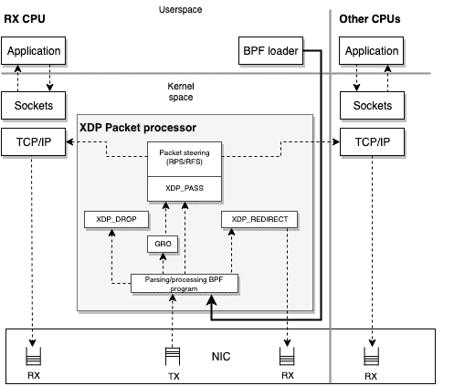
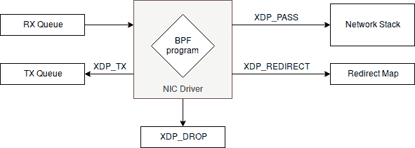

# 第七章： Express Data Path

Express Data Path（XDP）是 Linux 网络数据路径中的安全、可编程、高性能、与内核集成的数据包处理器，当 NIC 驱动程序接收数据包时，它执行 BPF 程序。这使得 XDP 程序能够在最早可能的时间点决定接收到的数据包的处理方式（丢弃、修改或允许通过）。

执行点并不是使 XDP 程序快速的唯一因素；其他设计决策也起着重要作用：

+   在使用 XDP 进行数据包处理时不会进行内存分配。

+   XDP 程序仅适用于线性、非分段数据包，并具有数据包的起始和结束指针。

+   这种程序接收的输入上下文类型为 `xdp_buff`，而不是在 第六章 中遇到的 `sk_buff` 结构，因此无法访问完整的数据包元数据。

+   因为它们是 eBPF 程序，所以 XDP 程序有有限的执行时间，因此它们在网络管道中的使用具有固定的成本。

当谈论 XDP 时，重要的是记住它不是内核绕过机制；它被设计成与其他内核组件和内部 Linux 安全模型集成。

###### 注意

`xdp_buff` 结构用于向使用 XDP 框架提供的直接数据包访问机制的 BPF 程序呈现数据包上下文。可以将其视为“轻量级”版本的 `sk_buff`。

`sk_buff` 与 `xdp_buff` 的区别在于，`sk_buff` 还包含并允许您处理数据包的元数据（协议、标记、类型），这些数据只在网络管道的更高级别中才可用。`xdp_buff` 之所以更快获取和处理数据包，一是因为它早期创建且不依赖于其他内核层；另一原因是 `xdp_buff` 不保留与路由、流量控制钩子或其他类型的数据包元数据相关的引用。

在本章中，我们探讨了 XDP 程序的特性、不同类型的 XDP 程序以及它们的编译和加载方式。此外，为了提供更多背景信息，我们还讨论了其实际用例。

# XDP 程序概述

XDP 程序的基本功能是确定接收到的数据包，然后可以编辑接收到的数据包内容或仅返回结果代码。结果代码用于确定数据包在操作形式上的处理方式。可以丢弃数据包，可以通过同一接口传输它，也可以将其传递给网络堆栈的其他部分。此外，为了与网络堆栈合作，XDP 程序可以推送和拉取数据包的标头；例如，如果当前内核不支持封装格式或协议，XDP 程序可以对其进行解封装或转换协议，并将结果发送给内核进行处理。

但是，请等等，XDP 和 eBPF 之间有什么关联呢？

原来 XDP 程序是通过 `bpf` 系统调用进行控制，并使用程序类型 `BPF_PROG_TYPE_XDP` 进行加载。此外，执行驱动钩子执行 BPF 字节码。

在编写 XDP 程序时理解的一个重要概念是，它们将运行的上下文也称为*操作模式*。

## 操作模式

XDP 有三种操作模式，以便轻松测试功能、使用厂商定制硬件以及常见内核的构建而无需定制硬件。让我们分别介绍每种模式。

### 本机 XDP

这是默认模式。在此模式下，XDP BPF 程序直接在网络驱动程序的早期接收路径中运行。使用此模式时，重要的是要检查驱动程序是否支持。你可以通过对给定内核版本的源代码树执行以下命令来检查：

```
# Clone the linux-stable repository
git clone git://git.kernel.org/pub/scm/linux/kernel/git/stable/linux-stable.git\
linux-stable

# Checkout the tag for your current kernel version
cd linux-stable
git checkout tags/v4.18

# Check the available drivers
git grep -l XDP_SETUP_PROG drivers/
```

那会产生类似这样的输出：

```
drivers/net/ethernet/broadcom/bnxt/bnxt_xdp.c
drivers/net/ethernet/cavium/thunder/nicvf_main.c
drivers/net/ethernet/intel/i40e/i40e_main.c
drivers/net/ethernet/intel/ixgbe/ixgbe_main.c
drivers/net/ethernet/intel/ixgbevf/ixgbevf_main.c
drivers/net/ethernet/mellanox/mlx4/en_netdev.c
drivers/net/ethernet/mellanox/mlx5/core/en_main.c
drivers/net/ethernet/netronome/nfp/nfp_net_common.c
drivers/net/ethernet/qlogic/qede/qede_filter.c
drivers/net/netdevsim/bpf.c
drivers/net/tun.c
drivers/net/virtio_net.c
```

从我们所看到的，内核 4.18 支持以下内容：

+   Broadcom NetXtreme-C/E 网络驱动程序 `bnxt`

+   Cavium `thunderx` 驱动程序

+   Intel `i40` 驱动程序

+   Intel `ixgbe` 和 `ixgvevf` 驱动程序

+   Mellanox `mlx4` 和 `mlx5` 驱动程序

+   Netronome Network Flow Processor

+   QLogic `qede` NIC 驱动程序

+   TUN/TAP

+   Virtio

现在我们对本机操作模式有了清晰的概念，我们可以继续看看如何通过使用离线 XDP，网络卡直接处理 XDP 程序职责。

### 离线 XDP

在此模式下，XDP BPF 程序直接被卸载到 NIC 中，而不是在主机 CPU 上执行。通过将执行任务从 CPU 转移到 NIC，该模式相比本机 XDP 具有高性能增益。

我们可以重用刚刚克隆的内核源代码树来检查 4.18 版本中哪些 NIC 驱动程序支持硬件卸载，方法是搜索 `XDP_SETUP_PROG_HW`：

```
git grep -l XDP_SETUP_PROG_HW drivers/
```

那应该输出类似这样的内容：

```
include/linux/netdevice.h
866:    XDP_SETUP_PROG_HW,

net/core/dev.c
8001:           xdp.command = XDP_SETUP_PROG_HW;

drivers/net/netdevsim/bpf.c
200:    if (bpf->command == XDP_SETUP_PROG_HW && !ns->bpf_xdpoffload_accept) {
205:    if (bpf->command == XDP_SETUP_PROG_HW) {
560:    case XDP_SETUP_PROG_HW:

drivers/net/ethernet/netronome/nfp/nfp_net_common.c
3476:   case XDP_SETUP_PROG_HW:
```

这只显示了 Netronome Network Flow Processor (`nfp`)，这意味着它可以通过同时支持硬件卸载和本机 XDP 运行。

现在，对你自己来说一个很好的问题可能是，当我没有网络卡和驱动程序来尝试我的 XDP 程序时，我该怎么办呢？答案很简单，通用 XDP！

### 通用 XDP

这是为了那些想要编写和运行 XDP 程序但又没有本地或离线 XDP 能力的开发者提供的测试模式。通用 XDP 自内核版本 4.12 起已得到支持。例如，你可以在 `veth` 设备上使用这种模式——我们在随后的示例中使用这种模式来展示 XDP 的能力，而无需你购买特定的硬件设备以便跟进。

但是，谁是负责协调所有组件和操作模式之间关系的行动者呢？继续下一节以了解数据包处理器。

## 数据包处理器

使得在 XDP 数据包上执行 BPF 程序并协调它们与网络堆栈之间的交互成为可能的是 XDP 数据包处理器。数据包处理器是处理 XDP 程序的内核组件，它直接在由 NIC 呈现的接收（RX）队列上处理数据包。它确保数据包可读可写，并允许您附加后处理的决策作为数据包处理器的动作形式。可以在运行时执行原子程序更新和新程序加载到数据包处理器，而不会因网络和相关流量方面的服务中断。在操作时，XDP 可以在“忙碌轮询”模式下使用，允许您保留将处理每个 RX 队列的 CPU；这避免了上下文切换，并允许在数据包到达时立即做出反应，无论 IRQ 亲和性如何。XDP 还可以使用“中断驱动”模式，该模式不会保留 CPU，但会指示一个中断作为事件介质，通知 CPU 它必须处理一个新事件，同时继续进行正常处理。

在 图 7-1 中，您可以看到 RX/TX、应用程序、数据包处理器以及应用于其数据包的 BPF 程序之间的交互点。

注意到在 图 7-1 中有几个以 `XDP_` 开头的字符串的方块。这些是 XDP 结果代码，我们接下来会介绍它们。



###### 图 7-1\. 数据包处理器

### XDP 结果代码（包处理器的动作）

在数据包处理器中对数据包做出决策之后，可以使用五个返回代码之一来表达这一决策，然后这些代码可以指示网络驱动程序如何处理数据包。让我们深入了解数据包处理器执行的操作：

丢弃 (`XDP_DROP`)

丢弃数据包。这发生在驱动程序的最早 RX 阶段；丢弃数据包简单地意味着将其回收到刚“到达”的 RX 环队列中。在拒绝服务（DoS）缓解用例中，尽早丢弃数据包至关重要。这样一来，丢弃的数据包使用的 CPU 处理时间和功耗尽可能少。

转发 (`XDP_TX`)

转发数据包。这可以在数据包被修改之前或之后发生。转发数据包意味着将接收到的数据包页反弹回到它所在的同一个网卡上。

重定向 (`XDP_REDIRECT`)

与`XDP_TX`类似，它能够通过另一个网卡或者 BPF `cpumap`来传输 XDP 数据包。在 BPF `cpumap`的情况下，服务于网卡接收队列上的 CPU 可以继续执行此操作，并将数据包推送到远程 CPU 以进行上层内核栈的处理。这类似于`XDP_PASS`，但有一个特点是 XDP BPF 程序可以继续处理传入的高负载，而不是临时处理当前数据包以推送到上层。

传递（`XDP_PASS`）

将数据包传递到正常的网络栈进行处理。这相当于没有 XDP 时的默认数据包处理行为。可以通过以下两种方式之一实现：

+   *正常接收*分配元数据（`sk_buff`），接收数据包到栈上，并将数据包传递到另一个 CPU 进行处理。它允许原始接口到用户空间的传输。这可以在数据包修改前或修改后发生。

+   *通用接收卸载*（GRO）可以接收大数据包并合并相同连接的数据包。在处理后，GRO 最终将数据包通过“正常接收”流程传递。

代码错误（`XDP_ABORTED`）

表示 eBPF 程序错误并导致数据包被丢弃。这不是功能程序应该使用的返回代码。例如，如果程序除以零，则会返回`XDP_ABORTED`。`XDP_ABORTED`的值将始终为零。它通过`trace_xdp_exception`跟踪点传递，可以额外监控以检测不当行为。

这些动作代码在`linux/bpf.h`头文件中表示如下：

```
enum xdp_action {
    XDP_ABORTED = 0,
    XDP_DROP,
    XDP_PASS,
    XDP_TX,
    XDP_REDIRECT,
};
```

因为 XDP 动作决定了不同的行为，并且是数据包处理器的内部机制，你可以查看关于返回动作的简化版本的图 7-1（参见图 7-2）。



###### 图 7-2\. XDP 动作代码

关于 XDP 程序的一个有趣事实是，通常不需要编写加载器来加载它们。大多数 Linux 机器上都有一个良好的加载器，由`ip`命令实现。下一节描述如何使用它。

## XDP 和 iproute2 作为加载器

可在[iproute2](https://oreil.ly/65zuT)中使用的`ip`命令具有作为加载 XDP 程序的前端的能力，该程序已编译为 ELF 文件，并且完全支持映射、映射重定位、尾调用和对象固定。

因为加载 XDP 程序可以表达为现有网络接口的配置，加载器实现为`ip link`命令的一部分，它是执行网络设备配置的命令。

加载 XDP 程序的语法很简单：

```
# ip link set dev eth0 xdp obj program.o sec mysection
```

让我们逐个分析这个命令的参数：

`ip`

这会调用`ip`命令。

`link`

配置网络接口。

`set`

更改设备属性。

`dev eth0`

指定我们要操作和加载 XDP 程序的网络设备。

`xdp obj program.o`

从名为 `program.o` 的 ELF 文件（对象）加载 XDP 程序。此命令中的 `xdp` 部分告诉系统在可用时使用本地驱动程序，否则回退到通用驱动程序。您可以通过使用更具体的选择器来强制使用某种模式：

+   `xdpgeneric` 用于使用通用 XDP

+   `xdpdrv` 用于使用本地 XDP

+   `xdpoffload` 用于使用卸载的 XDP

`sec mysection`

指定包含要从 ELF 文件中使用的 BPF 程序的部分名称 `mysection`；如果未指定，则将使用名为 `prog` 的部分。如果程序中未指定部分，则必须在 `ip` 调用中指定 `sec .text`。

让我们看一个实际的例子。

情景是我们有一个带有 Web 服务器的系统，端口为 8000，我们希望通过禁止所有对其页面的访问来阻止服务器公共面向的 NIC 上的任何 TCP 连接。

我们首先需要的是相关的 Web 服务器；如果您还没有一个，您可以通过 `python3` 启动一个。

```
$ python3 -m http.server
```

在启动 Web 服务器之后，可以通过 `ss` 显示其开放端口的开放套接字。正如您所见，Web 服务器绑定到任何接口，`*:8000`，因此目前任何外部调用者都可以访问其内容！

```
$  ss -tulpn
Netid  State      Recv-Q Send-Q Local Address:Port   Peer Address:Port
tcp    LISTEN     0      5      *:8000                *:*
```

###### 注意

套接字统计，终端中的 `ss` 是一个用于在 Linux 中调查网络套接字的命令行实用程序。它有效地是 `netstat` 的现代版本，其用户体验类似于 Netstat，这意味着您可以传递相同的参数并获得可比较的结果。

此时，我们可以检查运行我们的 HTTP 服务器的机器上的网络接口：

```
$ ip a
1: lo: <LOOPBACK,UP,LOWER_UP> mtu 65536 qdisc noqueue state UNKNOWN group defau
lt qlen 1000
    link/loopback 00:00:00:00:00:00 brd 00:00:00:00:00:00
    inet 127.0.0.1/8 scope host lo
       valid_lft forever preferred_lft forever
    inet6 ::1/128 scope host
       valid_lft forever preferred_lft forever
2: enp0s3: <BROADCAST,MULTICAST,UP,LOWER_UP> mtu 1500 qdisc fq_codel state UP g
roup default qlen 1000
    link/ether 02:1e:30:9c:a3:c0 brd ff:ff:ff:ff:ff:ff
    inet 10.0.2.15/24 brd 10.0.2.255 scope global dynamic enp0s3
       valid_lft 84964sec preferred_lft 84964sec
    inet6 fe80::1e:30ff:fe9c:a3c0/64 scope link
       valid_lft forever preferred_lft forever
3: enp0s8: <BROADCAST,MULTICAST,UP,LOWER_UP> mtu 1500 qdisc fq_codel state UP g
roup default qlen 1000
    link/ether 08:00:27:0d:15:7d brd ff:ff:ff:ff:ff:ff
    inet 192.168.33.11/24 brd 192.168.33.255 scope global enp0s8
       valid_lft forever preferred_lft forever
    inet6 fe80::a00:27ff:fe0d:157d/64 scope link
       valid_lft forever preferred_lft forever
```

请注意，此机器有三个接口，网络拓扑很简单：

`lo`

这只是用于内部通信的环回接口。

`enp0s3`

这是管理网络层；管理员将使用此接口连接到 Web 服务器进行操作。

`enp0s8`

这是向公众开放的接口，我们的 Web 服务器需要隐藏在这个接口之外。

现在，在加载任何 XDP 程序之前，我们可以从能够访问其网络接口的另一台服务器上检查服务器的开放端口，在我们的情况下，使用 IPv4 `192.168.33.11`。

您可以通过以下方式使用 `nmap` 检查远程主机的开放端口：

```
# nmap -sS 192.168.33.11
Starting Nmap 7.70 ( https://nmap.org ) at 2019-04-06 23:57 CEST
Nmap scan report for 192.168.33.11
Host is up (0.0034s latency).
Not shown: 998 closed ports
PORT     STATE SERVICE
22/tcp   open  ssh
8000/tcp open  http-alt
```

很好！端口 8000 就在那里，此时我们需要阻止它！

###### 注意

网络映射器 (`nmap`) 是一种网络扫描器，可以进行主机、服务、网络和端口的发现，以及操作系统的检测。其主要用途是安全审计和网络扫描。在扫描主机的开放端口时，`nmap` 会尝试指定（或全部）范围内的每个端口。

我们的程序将由一个名为 *program.c* 的单一源文件组成，让我们看看我们需要写什么。

需要使用 IPv4 的`iphdr`和以太网帧`ethhdr`头结构以及协议常量和其他结构体。让我们包含所需的头文件，如下所示：

```
#include <linux/bpf.h>
#include <linux/if_ether.h>
#include <linux/in.h>
#include <linux/ip.h>
```

头文件包含完毕后，我们可以声明之前章节中已经遇到的`SEC`宏，用于声明 ELF 属性。

```
#define SEC(NAME) __attribute__((section(NAME), used))
```

现在我们可以声明我们程序的主入口点，`myprogram`，以及它的 ELF 节名称，`mysection`。我们的程序以`xdp_md`结构体指针作为输入上下文，这是驱动中`xdp_buff`的 BPF 等效物。通过使用它作为上下文，接着我们定义接下来将要使用的变量，比如数据指针、以太网和 IP 层结构体：

```
SEC("mysection")
int myprogram(struct xdp_md *ctx) {
  int ipsize = 0;
  void *data = (void *)(long)ctx->data;
  void *data_end = (void *)(long)ctx->data_end;
  struct ethhdr *eth = data;
  struct iphdr *ip;
```

因为`data`包含以太网帧，我们现在可以从中提取 IPv4 层。我们还要检查我们寻找 IPv4 层的偏移量是否超出了整个指针空间，以使静态验证器保持满意。当地址空间超出时，我们只需丢弃数据包：

```
  ipsize = sizeof(*eth);
  ip = data + ipsize;
  ipsize += sizeof(struct iphdr);
  if (data + ipsize > data_end) {
    return XDP_DROP;
  }
```

现在，在所有验证和设置之后，我们可以实现程序的实际逻辑，基本上是丢弃每个 TCP 数据包，同时允许其他所有数据包通过：

```
  if (ip->protocol == IPPROTO_TCP) {
    return XDP_DROP;
  }

  return XDP_PASS;
}
```

现在我们的程序完成了，可以将其保存为*program.c*。

下一步是使用 Clang 将 ELF 文件*program.o*编译出我们的程序。我们可以在目标机器之外执行此编译步骤，因为 BPF ELF 二进制文件不依赖于平台：

```
$ clang -O2 -target bpf -c program.c -o program.o
```

现在回到托管我们 Web 服务器的机器上，我们最终可以使用`ip`实用程序和`set`命令，如前所述，针对公共网络接口`enp0s8`加载`program.o`：

```
# ip link set dev enp0s8 xdp obj program.o sec mysection
```

如您所见，我们选择`mysection`节作为程序的入口点。

在此阶段，如果该命令以零作为退出代码返回且没有错误，则我们可以检查网络接口，看看程序是否已正确加载：

```
# ip a show enp0s8
3: enp0s8: <BROADCAST,MULTICAST,UP,LOWER_UP> mtu 1500 xdpgeneric/id:32
    qdisc fq_codel state UP group default qlen 1000
    link/ether 08:00:27:0d:15:7d brd ff:ff:ff:ff:ff:ff
    inet 192.168.33.11/24 brd 192.168.33.255 scope global enp0s8
       valid_lft forever preferred_lft forever
    inet6 fe80::a00:27ff:fe0d:157d/64 scope link
       valid_lft forever preferred_lft forever
```

正如您所看到的，我们的`ip a`输出现在有一个新的细节；在 MTU 之后，它显示`xdpgeneric/id:32`，显示了两个有趣的信息：

+   使用的驱动程序是`xdpgeneric`

+   XDP 程序的 ID 是`32`

最后一步是验证加载的程序确实在做它应该做的事情。我们可以通过在外部机器上再次执行`nmap`来观察端口 8000 是否不再可达：

```
# nmap -sS 192.168.33.11
Starting Nmap 7.70 ( https://nmap.org ) at 2019-04-07 01:07 CEST
Nmap scan report for 192.168.33.11
Host is up (0.00039s latency).
Not shown: 998 closed ports
PORT    STATE SERVICE
22/tcp  open  ssh
```

另一个验证它是否工作的测试可以尝试通过浏览器访问程序或进行任何 HTTP 请求。任何类型的测试应该在将目标定为`192.168.33.11`时失败。干得好，祝贺您成功加载第一个 XDP 程序！

如果您在需要将机器恢复到原始状态的机器上完成了所有这些步骤，您可以随时分离程序并关闭设备的 XDP：

```
# ip link set dev enp0s8 xdp off
```

有趣！加载 XDP 程序看起来很容易，不是吗？

至少在使用`iproute2`作为加载器时，你可以跳过自己编写加载器的部分。在这个例子中，我们的重点是`iproute2`，它已经为 XDP 程序实现了一个加载器。然而，这些程序实际上是 BPF 程序，所以即使`iproute2`有时可能很方便，你应该始终记住，你可以像下一节中展示的那样使用 BCC 加载你的程序，或者你可以直接使用`bpf`系统调用。拥有自定义加载器的优势在于可以管理程序的生命周期及其与用户空间的交互。

# XDP 和 BCC

与任何其他 BPF 程序一样，XDP 程序可以使用 BCC 进行编译、加载和运行。以下示例展示了一个类似于我们用于`iproute2`的 XDP 程序，但具有使用 BCC 制作的自定义用户空间加载器。在这种情况下，加载器是必需的，因为我们还想计数我们在丢弃 TCP 数据包时遇到的数据包数。

与之前一样，我们首先创建一个名为*program.c*的内核空间程序。

在`iproute2`的例子中，我们的程序需要导入与 BPF 和协议相关的结构体和函数定义所需的头文件。在这里我们做了相同的事情，但我们还使用`BPF_TABLE`宏声明了一个类型为`BPF_MAP_TYPE_PERCPU_ARRAY`的映射。这个映射将包含每个 IP 协议索引的数据包计数器，这也是大小为`256`的原因（IP 规范只包含 256 个值）。我们想使用`BPF_MAP_TYPE_PERCPU_ARRAY`类型，因为它保证了在 CPU 级别上计数器的原子性，无需锁定：

```
#define KBUILD_MODNAME "program"
#include <linux/bpf.h>
#include <linux/in.h>
#include <linux/ip.h>

BPF_TABLE("percpu_array", uint32_t, long, packetcnt, 256);
```

然后，我们声明我们的主函数`myprogram`，它以`xdp_md`结构体作为参数。这个结构体首先需要包含以太网 IPv4 帧的变量声明：

```
int myprogram(struct xdp_md *ctx) {
  int ipsize = 0;
  void *data = (void *)(long)ctx->data;
  void *data_end = (void *)(long)ctx->data_end;
  struct ethhdr *eth = data;
  struct iphdr *ip;
  long *cnt;
  __u32 idx;

  ipsize = sizeof(*eth);
  ip = data + ipsize;
  ipsize += sizeof(struct iphdr);
```

在我们完成所有变量声明并可以访问现在包含以太网帧的数据指针和 IPv4 数据包的`ip`指针后，我们可以检查内存空间是否越界。如果是，我们丢弃数据包。如果内存空间正常，则提取协议并查找`packetcnt`数组以获取当前协议的数据包计数器的先前值，存储在变量`idx`中。然后我们将计数器增加一。处理增量后，我们可以继续检查协议是否为 TCP。如果是，则无条件丢弃数据包；否则，允许其通过：

```
  if (data + ipsize > data_end) {
    return XDP_DROP;
  }

  idx = ip->protocol;
  cnt = packetcnt.lookup(&idx);
  if (cnt) {
    *cnt += 1;
  }

  if (ip->protocol == IPPROTO_TCP) {
    return XDP_DROP;
  }

  return XDP_PASS;
}
```

现在让我们写加载器：`loader.py`。

它由两部分组成：实际的加载逻辑和打印数据包计数的循环。

对于加载逻辑，我们通过读取文件*program.c*打开我们的程序。使用`load_func`，我们指示`bpf`系统调用将`myprogram`函数作为“main”使用程序类型`BPF.XDP`。这代表`BPF_PROG_TYPE_XDP`。

加载完成后，我们可以使用`get_table`访问名为`packetcnt`的 BPF 映射。

###### 警告

确保将`device`变量从`enp0s8`更改为你要操作的接口。

```
#!/usr/bin/python

from bcc import BPF
import time
import sys

device = "enp0s8"
b = BPF(src_file="program.c")
fn = b.load_func("myprogram", BPF.XDP)
b.attach_xdp(device, fn, 0)
packetcnt = b.get_table("packetcnt")
```

我们还需要编写的剩余部分是实际循环以打印数据包计数。没有这个，我们的程序已经能够丢弃数据包，但我们想要看看那里发生了什么。我们有两个循环。外部循环获取键盘事件，并在有中断程序的信号时终止。当外部循环中断时，会调用 `remove_xdp` 函数，并且接口会从 XDP 程序中释放。

在外部循环内，内部循环的职责是从 `packetcnt` 映射中获取值，并以 `*protocol*: *counter* pkt/s` 的格式打印出来：

```
prev = [0] * 256
print("Printing packet counts per IP protocol-number, hit CTRL+C to stop")
while 1:
    try:
        for k in packetcnt.keys():
            val = packetcnt.sum(k).value
            i = k.value
            if val:
                delta = val - prev[i]
                prev[i] = val
                print("{}: {} pkt/s".format(i, delta))
        time.sleep(1)
    except KeyboardInterrupt:
        print("Removing filter from device")
        break

b.remove_xdp(device, 0)
```

很好！现在我们可以通过以 root 权限执行加载器来测试该程序：

```
# python program.py
```

这将每秒输出一行带有数据包计数器的信息：

```
Printing packet counts per IP protocol-number, hit CTRL+C to stop
6: 10 pkt/s
17: 3 pkt/s
^CRemoving filter from device
```

我们遇到的数据包类型只有两种：`6` 代表 TCP，`17` 代表 UDP。

在这一点上，你的大脑可能已经开始思考关于使用 XDP 的想法和项目，这非常好！但像在软件工程中一样，如果你想要写出一个好程序，写测试是非常重要的——或者至少要写测试！接下来的部分将介绍如何对 XDP 程序进行单元测试。

# 测试 XDP 程序

在开发 XDP 程序时，最困难的部分是为了测试实际的数据包流，需要重现一个所有组件都对齐以提供正确数据包的环境。虽然现在使用虚拟化技术可以很容易地创建工作环境，但复杂的设置也会限制测试环境的可重复性和可编程性。此外，当在虚拟化环境中分析高频率 XDP 程序的性能方面时，虚拟化的成本使得测试效果不佳，因为其比实际数据包处理成本更高。

幸运的是，内核开发者有一个解决方案。他们实现了一个命令，可以用来测试 XDP 程序，名为 `BPF_PROG_TEST_RUN`。

`BPF_PROG_TEST_RUN` 本质上是让一个 XDP 程序执行，还有一个输入数据包和一个输出数据包。当程序执行时，输出数据包变量被填充，返回的 XDP 代码也随之返回。这意味着你可以在你的测试断言中使用输出数据包和返回码！这种技术也可以用于 `skb` 程序。

为了完整起见，并且让这个例子简单化，我们使用 Python 和它的单元测试框架。

## 使用 Python 单元测试框架进行 XDP 测试

使用 `BPF_PROG_TEST_RUN` 编写 XDP 测试并将其集成到 Python 的单元测试框架 `unittest` 中是一个很好的主意，有几个原因：

+   你可以使用 Python 的 *BCC* 库来加载和执行 BPF 程序。

+   Python 拥有最好的数据包构造和内省库之一：`scapy`。

+   Python 使用 `ctypes` 与 C 结构体集成。

正如所说，我们需要导入所有必要的库；这是我们将在一个名为*test_xdp.py*的文件中做的第一件事：

```
from bcc import BPF, libbcc
from scapy.all import Ether, IP, raw, TCP, UDP

import ctypes
import unittest

class XDPExampleTestCase(unittest.TestCase):
    SKB_OUT_SIZE = 1514  # mtu 1500 + 14 ethernet size
    bpf_function = None
```

导入所有必要的库之后，我们可以继续创建一个名为`XDPExampleTestCase`的测试用例类。这个测试类将包含所有我们的测试用例和一个成员方法（`_xdp_test_run`），我们将在其中进行断言并调用`bpf_prog_test_run`。

在下面的代码中，您可以看到`_xdp_test_run`的样子：

```
    def _xdp_test_run(self, given_packet, expected_packet, expected_return):
        size = len(given_packet)

        given_packet = ctypes.create_string_buffer(raw(given_packet), size)
        packet_output = ctypes.create_string_buffer(self.SKB_OUT_SIZE)

        packet_output_size = ctypes.c_uint32()
        test_retval = ctypes.c_uint32()
        duration = ctypes.c_uint32()
        repeat = 1
        ret = libbcc.lib.bpf_prog_test_run(self.bpf_function.fd,
                                           repeat,
                                           ctypes.byref(given_packet),
                                           size,
                                           ctypes.byref(packet_output),
                                           ctypes.byref(packet_output_size),
                                           ctypes.byref(test_retval),
                                           ctypes.byref(duration))
        self.assertEqual(ret, 0)
        self.assertEqual(test_retval.value, expected_return)

        if expected_packet:
            self.assertEqual(
                packet_output[:packet_output_size.value], raw(expected_packet))
```

它需要三个参数：

`given_packet`

这是我们针对我们的 XDP 程序进行测试的数据包；这是接口接收到的原始数据包。

`expected_packet`

这是我们期望在 XDP 程序处理后收到的数据包；当 XDP 程序返回`XDP_DROP`或`XDP_ABORT`时，我们期望这个数据包为`None`；在所有其他情况下，数据包保持与`given_packet`相同或可能被修改。

`expected_return`

这是在处理我们的`given_packet`后 XDP 程序的预期返回。

除了参数之外，这个方法的主体很简单。它使用*ctypes*库进行 C 类型转换，然后调用`libbcc`的`BPF_PROG_TEST_RUN`等效方法，`libbcc.lib.bpf_prog_test_run`，使用我们的数据包和它们的元数据作为测试参数。然后根据测试调用的结果以及给定的值进行所有断言。

有了那个函数之后，我们基本上只需通过制作不同的数据包来编写测试用例，以测试它们在通过我们的 XDP 程序时的行为，但在这样做之前，我们需要为我们的测试做一个`setUp`方法。

这部分非常关键，因为设置实际加载我们的名为`myprogram`的 BPF 程序，通过打开和编译一个名为*program.c*的源文件（这是我们的 XDP 代码将在其中的文件）：

```
    def setUp(self):
        bpf_prog = BPF(src_file=b"program.c")
        self.bpf_function = bpf_prog.load_func(b"myprogram", BPF.XDP)
```

设置完成后，下一步是编写我们想要观察的第一个行为。不要想得太过丰富，我们只想测试我们将丢弃所有 TCP 数据包。

因此，我们在`given_packet`中制作一个数据包，这只是一个 IPv4 上的 TCP 数据包。然后，使用我们的断言方法`_xdp_test_run`，我们只需验证，根据我们的数据包，我们将得到一个带有没有返回数据包的`XDP_DROP`：

```
    def test_drop_tcp(self):
        given_packet = Ether() / IP() / TCP()
        self._xdp_test_run(given_packet, None, BPF.XDP_DROP)
```

因为这还不够，我们还想明确测试所有 UDP 数据包都是允许的。然后，我们制作两个 UDP 数据包，一个用于`given_packet`，一个用于`expected_packet`，它们本质上是相同的。这样，我们还在测试 UDP 数据包在被允许通过`XDP_PASS`时不被修改：

```
    def test_pass_udp(self):
        given_packet = Ether() / IP() / UDP()
        expected_packet = Ether() / IP() / UDP()
        self._xdp_test_run(given_packet, expected_packet, BPF.XDP_PASS)
```

为了让事情变得更加复杂，我们决定这个系统将允许 TCP 数据包，条件是它们要去端口 9090。当它们这样做时，它们还将被重写，将它们的目标 MAC 地址更改为重定向到具有地址`08:00:27:dd:38:2a`的特定网络接口。

这是执行此操作的测试用例。`given_packet`的目的端口为`9090`，我们要求`expected_packet`具有新的目标和端口`9090`：

```
    def test_transform_dst(self):
        given_packet = Ether() / IP() / TCP(dport=9090)
        expected_packet = Ether(dst='08:00:27:dd:38:2a') / \
            IP() / TCP(dport=9090)
        self._xdp_test_run(given_packet, expected_packet, BPF.XDP_TX)
```

现在我们有了大量的测试用例，我们现在编写测试程序的入口点，它将只调用 `unittest.main()`，然后加载并执行我们的测试：

```
if __name__ == '__main__':
    unittest.main()
```

现在我们已经为我们的 XDP 程序编写了测试！现在我们有了测试作为我们想要拥有的特定示例，我们可以编写实现它的 XDP 程序，方法是创建一个名为 *program.c* 的文件。

我们的程序很简单。它只包含了具有我们刚刚测试过的逻辑的 `myprogram` XDP 函数。与往常一样，我们需要做的第一件事是包含所需的头文件。这些头文件是自我解释的。我们有一个 BPF 程序，它将处理以太网上传输的 TCP/IP：

```
#define KBUILD_MODNAME "kmyprogram"

#include <linux/bpf.h>
#include <linux/if_ether.h>
#include <linux/tcp.h>
#include <linux/in.h>
#include <linux/ip.h>
```

正如本章中的其他程序一样，我们需要检查偏移量并为我们数据包的三个层（分别为以太网、IPv4 和 TCP 的 `ethhdr`、`iphdr` 和 `tcphdr`）填充变量：

```
int myprogram(struct xdp_md *ctx) {
  int ipsize = 0;
  void *data = (void *)(long)ctx->data;
  void *data_end = (void *)(long)ctx->data_end;
  struct ethhdr *eth = data;
  struct iphdr *ip;
  struct tcphdr *th;

  ipsize = sizeof(*eth);
  ip = data + ipsize;
  ipsize += sizeof(struct iphdr);
  if (data + ipsize > data_end) {
    return XDP_DROP;
  }
```

一旦我们有了这些值，我们就可以实现我们的逻辑。

我们做的第一件事是检查协议是否为 TCP `ip->protocol == IPPROTO_TCP`。当它是时，我们总是执行 `XDP_DROP`；否则，我们对其他所有情况执行 `XDP_PASS`。

在检查 TCP 协议时，我们还进行另一个控制以检查目标端口是否为 `9090`，`th->dest == htons(9090)`；如果是，则在以太网层更改目标 MAC 地址并返回 `XDP_TX` 通过同一网卡反弹数据包：

```
  if (ip->protocol == IPPROTO_TCP) {
    th = (struct tcphdr *)(ip + 1);
    if ((void *)(th + 1) > data_end) {
      return XDP_DROP;
    }

    if (th->dest == htons(9090)) {
      eth->h_dest[0] = 0x08;
      eth->h_dest[1] = 0x00;
      eth->h_dest[2] = 0x27;
      eth->h_dest[3] = 0xdd;
      eth->h_dest[4] = 0x38;
      eth->h_dest[5] = 0x2a;
      return XDP_TX;
    }

    return XDP_DROP;
  }

  return XDP_PASS;
}
```

太棒了！现在我们可以运行我们的测试：

```
sudo python test_xdp.py
```

它的输出将只报告这三个测试通过：

```
...
--------------------------------
Ran 3 tests in 4.676s

OK
```

此时，破坏事物变得更容易！我们可以只需在 *program.c* 中将最后一个 `XDP_PASS` 更改为 `XDP_DROP` 并观察发生的情况：

```
.F.
======================================================================
FAIL: test_pass_udp (__main__.XDPExampleTestCase)
----------------------------------------------------------------------
Traceback (most recent call last):
  File "test_xdp.py", line 48, in test_pass_udp
    self._xdp_test_run(given_packet, expected_packet, BPF.XDP_PASS)
  File "test_xdp.py", line 31, in _xdp_test_run
    self.assertEqual(test_retval.value, expected_return)
AssertionError: 1 != 2

----------------------------------------------------------------------
Ran 3 tests in 4.667s

FAILED (failures=1)
```

我们的测试失败了——状态码不匹配，测试框架报告了一个错误。这正是我们想要的！这是一个有效的测试框架，可以自信地编写 XDP 程序。现在，我们有能力对特定步骤进行断言并相应地更改它们以获得我们想要的行为。然后，我们编写匹配的代码来表达该行为，形成 XDP 程序。

###### 注意

MAC 地址是介质访问控制地址的简称。它是一个由两组十六进制数字组成的唯一标识符，每个网络接口都有，并且用于数据链路层（OSI 模型中的第 2 层），用于连接以太网、蓝牙和 WiFi 等技术的设备。

# XDP 使用案例

在接近 XDP 时，理解它被全球各地的各种组织采用的用例肯定是有用的。这可以帮助您想象为什么在某些情况下使用 XDP 比其他技术如套接字过滤或流量控制更好。

让我们从一个常见的例子开始：监控。

## 监控

如今，大多数网络监控系统要么通过编写内核模块，要么通过从用户空间访问 proc 文件来实现。编写、分发和编译内核模块并非人人能做的任务；这是一项危险的操作。它们也不容易维护和调试。然而，另一种选择可能更糟。要获取类似的信息，例如一秒钟内卡接收了多少个数据包，你需要打开和解析一个文件，比如 */sys/class/net/eth0/statistics/rx_packets*。这可能看起来是个不错的主意，但这需要大量计算资源，因为在某些情况下使用 open 系统调用并不便宜。

因此，我们需要一种解决方案，可以在不损失性能的情况下实现类似内核模块功能的特性。XDP 就非常适合这种情况，因为我们可以使用 XDP 程序将要提取的数据发送到一个映射中。然后，这个映射被一个加载器消费，可以将指标存储到后端存储中，并对其应用算法或将结果绘制成图表。

## DDoS 缓解

能够在网卡级别查看数据包确保在系统还没有花费足够的计算资源来判断数据包是否对系统有用之前拦截任何可能的数据包。在典型场景中，一个 `bpf` 映射可以指示 XDP 程序从特定来源的数据包执行 `XDP_DROP` 操作。该数据包列表可以在分析通过另一个映射接收的数据包后，在用户空间生成。一旦 XDP 程序接收到的数据包与列表中的某个元素匹配，就会执行这种缓解操作。数据包被丢弃，内核甚至不需要花费 CPU 周期来处理它。这使得攻击者的目标变得更难实现，因为在这种情况下，它无法浪费任何昂贵的计算资源。

## 负载均衡

XDP 程序的一个有趣用例是负载均衡；然而，XDP 只能在接收到数据包的同一网卡上重传数据包。这意味着 XDP 并不是实现经典负载均衡器（位于所有服务器前面并将流量转发到它们）的最佳选择。然而，这并不意味着 XDP 对这种用例不适用。如果我们将负载均衡从外部服务器移动到为应用服务的同一台机器上，你立即会看到它们的网卡可以用来完成这项任务。

通过这种方式，我们可以创建一个分布式负载均衡器，在托管应用程序的每台机器上帮助将流量分发到适当的服务器。

## 防火墙

当人们谈论 Linux 上的防火墙时，通常会想到`iptables`或`netfilter`。通过 XDP，您可以以完全可编程的方式直接在网卡或其驱动程序中获得相同的功能。通常，防火墙是昂贵的机器，位于网络堆栈的顶部或节点之间，以控制其通信的外观。然而，使用 XDP 时，很明显，因为 XDP 程序非常便宜和快速，我们可以将防火墙逻辑直接实现到节点的网卡中，而不是使用一组专用机器。一个常见的用例是有一个控制具有通过远程过程调用 API 更改的一组规则的映射的 XDP 加载器。然后，这些规则集动态传递给加载到每台特定机器上的 XDP 程序，以控制它可以接收什么，来自谁以及在哪种情况下。

这种替代方案不仅使防火墙成本更低，而且允许每个节点部署自己的防火墙级别，而无需依赖用户空间软件或内核来完成。当使用卸载的 XDP 作为操作模式部署时，我们可以获得最大的优势，因为处理甚至不是由主节点 CPU 完成的。

# 结论

现在你拥有了多么了不起的技能！我向你保证，XDP 将帮助你从现在开始以完全不同的方式思考网络流量。在处理网络数据包时，必须依赖诸如`iptables`或其他用户空间工具通常令人沮丧且缓慢。XDP 之所以有趣，是因为它由于其直接的数据包处理能力而更快，并且你可以编写自己的逻辑来处理网络数据包。因为所有这些任意代码都可以与映射交互，并与其他 BPF 程序互动，所以你有一个完整的可能用例世界可以为自己的架构发明和探索！

尽管这不涉及网络，下一章再次回顾了这里和第六章中涵盖的许多概念。再次强调，基于给定输入条件，BPF 用于过滤某些条件并过滤程序可以执行的操作。不要忘记 BPF 中的*F*代表过滤器！
