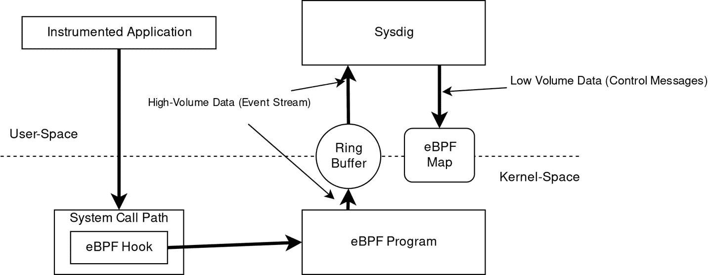
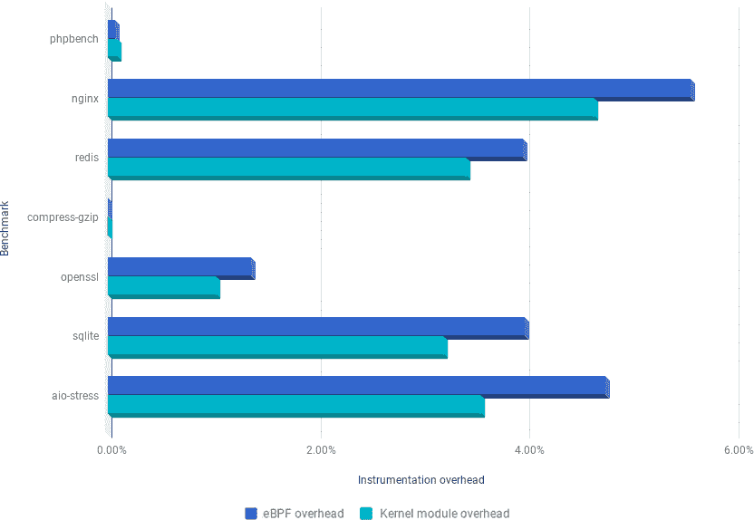

# 第九章：实际应用案例

在实施新技术时，最重要的问题是：“在实际应用中这有什么用途？”这就是为什么我们决定采访一些最激动人心的 BPF 项目的创建者来分享他们的想法的原因。

# Sysdig eBPF 的神模式

Sysdig，这家制造同名开源 Linux 故障排除工具的公司，从 2017 年开始在内核 4.11 下开始尝试 eBPF。

历史上它一直在使用一个内核模块来提取和执行所有内核端的工作，但随着用户基数的增加以及越来越多的公司开始进行实验，公司认识到这对于大多数外部参与者来说是一个限制，有很多方面：

+   越来越多的用户无法在其计算机上加载内核模块。云原生平台越来越严格限制运行时程序可以做什么。

+   新的贡献者（甚至老的）不理解内核模块的架构。这降低了贡献者的总体数量，也是项目自身增长的一个限制因素。

+   内核模块的维护很困难，不仅因为编写代码的原因，还因为需要保证其安全性和良好组织性所需的工作量。

出于这些动机，Sysdig 决定尝试采用使用 eBPF 程序而不是模块的方式来编写相同功能集的方法。从采用 eBPF 自动获取的另一个好处是 Sysdig 进一步利用其他出色的 eBPF 跟踪功能的可能性。例如，可以相对容易地使用用户探针将 eBPF 程序附加到用户空间应用程序中的特定执行点，如 “用户空间探针” 中所述。

此外，该项目现在可以利用 eBPF 程序中的本地辅助功能来捕获运行进程的堆栈跟踪，以增强典型的系统调用事件流。这为用户提供了更多的故障排除信息。

尽管现在一切都很顺利，但 Sysdig 最初在开始时面临了一些挑战，原因是 eBPF 虚拟机的一些限制，因此项目的首席架构师 Gianluca Borello 决定通过向内核贡献上游补丁来改进它，包括：

+   能够在 eBPF 程序中原生地处理字符串 [natively](https://oreil.ly/ZJ09y)

+   多个补丁以改进 eBPF 程序中参数的语义 [1](https://oreil.ly/lPcGT), [2](https://oreil.ly/5S_tR), 和 [3](https://oreil.ly/HLrEu)

后者对处理系统调用参数特别重要，可能是工具中最重要的数据源。

图 9-1 展示了 Sysdig 中 eBPF 模式的架构。

###### 图 9-1 Sysdig 的 eBPF 架构

实现的核心是一组定制的 eBPF 程序，负责仪器化。这些程序是用 C 语言的一个子集编写的。它们使用最近版本的 Clang 和 LLVM 进行编译，将高级 C 代码转换为 eBPF 字节码。

对于 Sysdig 仪器化内核的每个不同执行点，都有一个 eBPF 程序。目前，eBPF 程序附加到以下静态跟踪点：

+   系统调用进入路径

+   系统调用退出路径

+   进程上下文切换

+   进程终止

+   小页错误和大页错误

+   进程信号传递

每个程序接收执行点数据（例如对于系统调用，调用进程传递的参数），并开始处理它们。处理取决于系统调用的类型。对于简单的系统调用，参数仅直接复制到用于临时存储的 eBPF 映射中，直到整个事件帧形成。对于其他更复杂的调用，eBPF 程序包括转换或增强参数的逻辑。这使得用户空间中的 Sysdig 应用程序能够充分利用数据。

一些附加数据包括以下内容：

+   与网络连接相关的数据（TCP/UDP IPv4/IPv6 元组，UNIX 套接字名称等）

+   关于进程的高度粒度度量（内存计数器，页错误，套接字队列长度等）

+   特定于容器的数据，例如发出系统调用的进程所属的 cgroups，以及进程所在的命名空间

如图 9-1 所示，在 eBPF 程序捕获特定系统调用的所有所需数据后，它使用特殊的本机 BPF 函数将数据推送到一组每 CPU 环形缓冲区，用户空间应用程序可以以非常高的吞吐量读取。这是 Sysdig 中使用 eBPF 的使用方式与使用 eBPF 映射在内核空间与用户空间之间共享“小数据”的典型范例不同的地方。要了解有关映射及如何在用户空间和内核空间之间进行通信的更多信息，请参阅第 3 章。

从性能角度来看，结果很好！在图 9-2 中，您可以看到 Sysdig 的 eBPF 工具的仪器化开销仅比“经典”内核模块仪器化略高。

###### 图 9-2\. Sysdig eBPF 性能比较

您可以按照[使用说明](https://oreil.ly/luHKp)玩转 Sysdig 及其 eBPF 支持，但同时也要查看[BPF 驱动程序的代码](https://oreil.ly/AJddM)。

# Flowmill

Flowmill 是一家可观察性初创公司，起源于创始人 Jonathan Perry 的学术研究项目 [Flowtune](https://oreil.ly/e9heR)。Flowtune 研究了如何在拥塞的数据中心网络中高效调度单个数据包。在这项工作中所需的核心技术之一是一种以极低开销收集网络遥测数据的方法。最终，Flowmill 将这项技术调整为观察、聚合和分析分布式应用程序中每个组件之间的连接。

+   提供一个准确的视图，展示分布式系统中服务之间的交互方式。

+   识别在流量速率、错误或延迟方面发生了统计显著变化的区域。

Flowmill 使用 eBPF 内核探针周期性地跟踪每个打开的套接字，并捕获它们的操作系统指标。由于多种原因，这是一项复杂的任务：

+   必须同时仪表化新连接和已经打开的现有连接，这些连接在 eBPF 探针建立时已经存在。此外，还必须考虑通过内核的 TCP 和 UDP 以及 IPv4 和 IPv6 代码路径。

+   对于基于容器的系统，每个套接字必须归属于适当的 cgroup，并且与来自平台（如 Kubernetes 或 Docker）的编排器元数据相结合。

+   通过 conntrack 执行的网络地址转换必须进行仪表化，以建立套接字与其外部可见 IP 地址之间的映射。例如，在 Docker 中，一种常见的网络模型使用源地址转换（Source NAT）来伪装位于主机 IP 地址后面的容器；而在 Kubernetes 中，服务虚拟 IP 地址用于表示一组容器。

+   eBPF 程序收集的数据必须进行后处理，以提供按服务聚合的数据，并且匹配连接两端收集的数据。

然而，添加 eBPF 内核探针提供了一种更加高效和健壮的方式来收集这些数据。它完全消除了漏掉连接的风险，并且可以在亚秒级间隔内对每个套接字进行低开销的操作。Flowmill 的方法依赖于一个代理，结合了一组 eBPF kprobes 和用户空间指标收集，以及离线聚合和后处理。该实现大量使用 Perf 环来将每个套接字收集的指标传递给用户空间进行进一步处理。此外，它使用哈希映射来跟踪打开的 TCP 和 UDP 套接字。

Flowmill 发现通常有两种设计 eBPF 仪器的策略。"简易" 方法找到每个仪器化事件上调用的一到两个内核函数，但要求 BPF 代码维护更多状态并在每次调用时执行更多工作，这个仪器化点经常被调用。为了缓解对仪器化对生产工作负载的影响的担忧，Flowmill 采用了另一种策略：仪器更具体的功能，这些功能调用较少，并且表示重要事件。这种方法的开销明显较低，但在覆盖所有重要代码路径方面需要更多的工作，特别是在内核版本演变时。

例如，`tcp_v4_do_rcv` 捕获所有已建立的 TCP RX 流量，并访问 `struct sock`，但调用量极高。用户可以改用处理 ACK、无序数据包处理、RTT 估算等功能的仪表化函数，以处理影响已知度量标准的特定事件。

通过跨 TCP、UDP、进程、容器、连接跟踪和其他子系统的这种方法，系统在几乎不可测量的低开销下实现了极好的性能。CPU 开销通常为每核心 0.1% 到 0.25%，包括 eBPF 和用户空间组件，主要取决于新套接字创建速率。

关于 Flowmill 和 Flowtune 的更多信息，请访问它们的[网站](https://www.flowmill.com)。

Sysdig 和 Flowmill 是使用 BPF 构建监控和可观测性工具的先驱，但并非唯一。在本书中，我们提到了其他像 Cillium 和 Facebook 这样的公司，它们采用 BPF 作为首选框架来提供高度安全和高性能的网络基础设施。我们对 BPF 及其社区未来充满期待，并迫不及待地想看看你们用它建立了什么。
