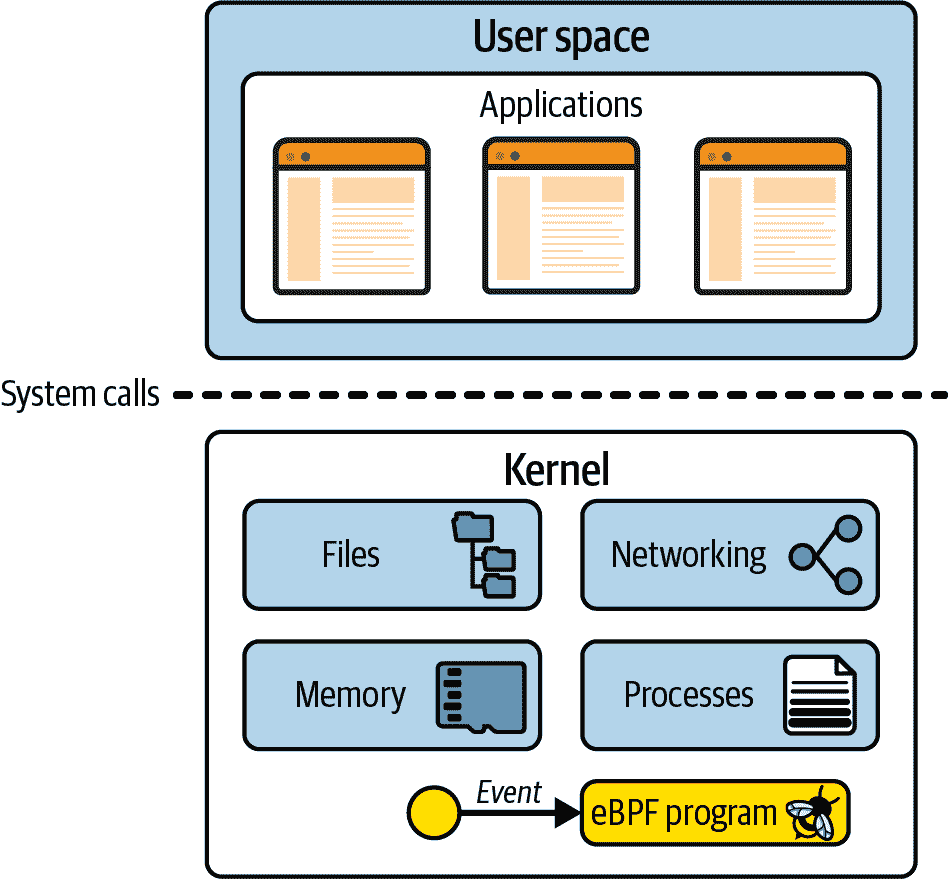
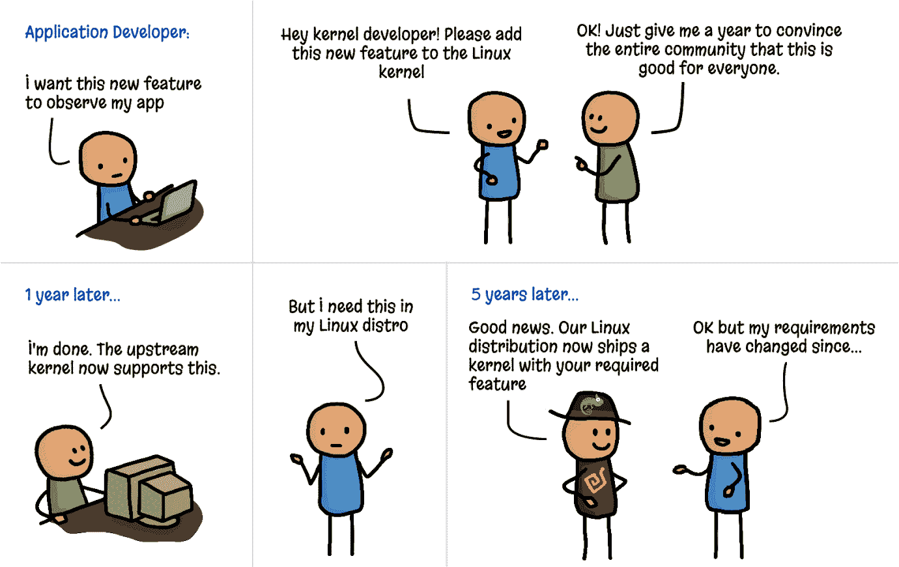
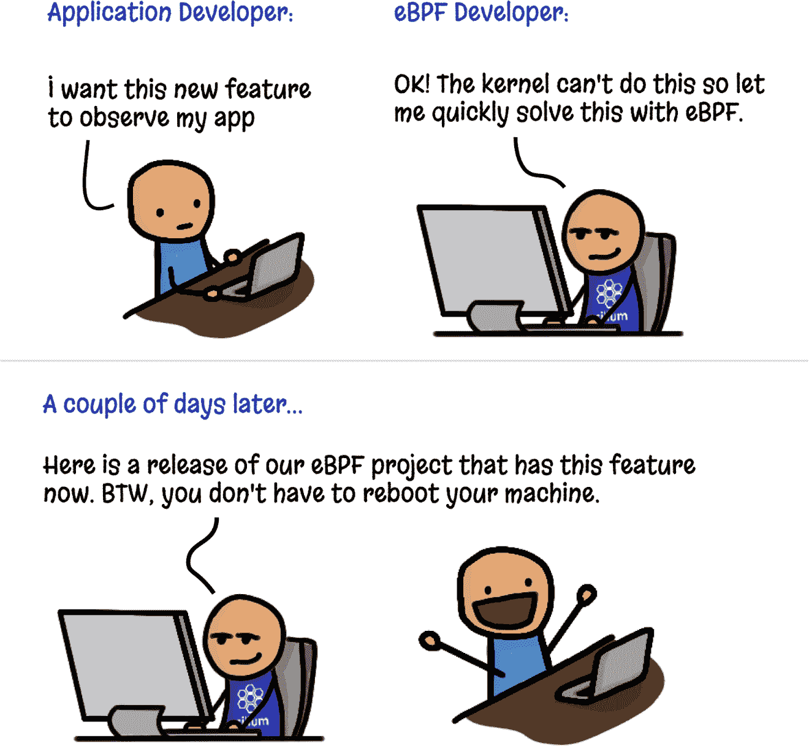
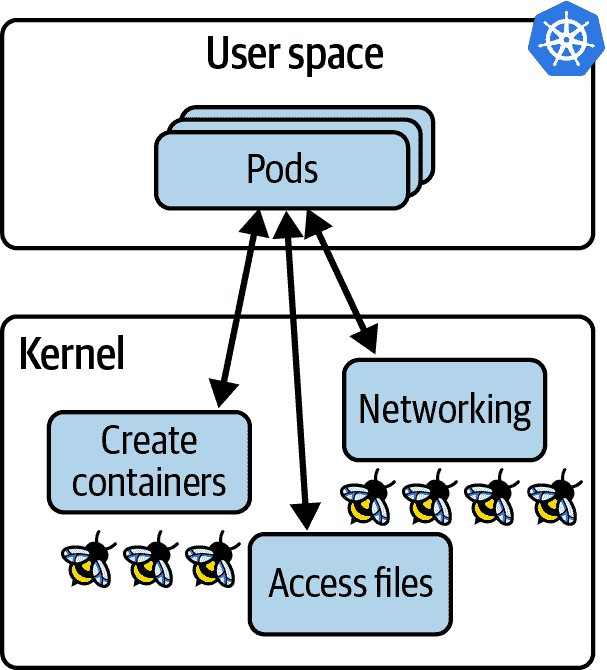

# 第一章：什么是 eBPF，它为什么重要？

eBPF 是一种革命性的内核技术，允许开发人员编写自定义代码，可以动态加载到内核中，改变内核的行为方式。（如果你对内核不太了解，不用担心，我们很快就会在本章中讨论到。）

这使得一代新的高性能网络、可观察性和安全工具得以实现。正如你将看到的，如果你想要用这些基于 eBPF 的工具来对一个应用进行仪器化，你不需要以任何方式修改或重新配置应用，这要归功于 eBPF 在内核中的优势位置。

eBPF 可以做的一些事情包括：

+   对系统的几乎任何方面进行性能跟踪

+   高性能网络，内置可见性

+   检测和（可选地）防止恶意活动

让我们简要地回顾一下 eBPF 的历史，从伯克利数据包过滤器开始。

# eBPF 的起源：伯克利数据包过滤器

我们今天所说的“eBPF”在 1993 年由劳伦斯伯克利国家实验室的 Steven McCanne 和 Van Jacobson 撰写的一篇论文¹中首次提出。这篇论文讨论了一个伪机器，可以运行*过滤器*，这些过滤器是用来确定是否接受或拒绝网络数据包的程序。这些程序是用 BPF 指令集编写的，这是一个类似汇编语言的通用 32 位指令集。以下是直接从那篇论文中摘取的一个例子：

```cpp
ldh     [12] 
jeq     #ETHERTYPE IP, L1, L2 
L1:     ret     #TRUE 
L2:     ret     #0
```

这段小代码过滤掉不是互联网协议（IP）数据包的数据包。这个过滤器的输入是一个以太网数据包，第一条指令（`ldh`）加载了这个数据包中从第 12 个字节开始的一个 2 字节值。在下一条指令（`jeq`）中，这个值与代表 IP 数据包的值进行比较。如果匹配，执行跳转到标记为`L1`的指令，并且通过返回一个非零值（这里标识为`#TRUE`）来接受数据包。如果不匹配，数据包不是 IP 数据包，并且通过返回`0`来拒绝。

你可以想象（或者确实参考论文找到更复杂的过滤程序的例子），更复杂的过滤程序可以根据数据包的其他方面做出决定。重要的是，过滤器的作者可以编写自己的自定义程序在内核中执行，这是 eBPF 所能实现的核心。

BPF 最初代表“伯克利数据包过滤器”，它首次出现在 1997 年的 Linux 内核版本 2.1.75 中，²，它在 tcpdump 实用程序中被用作捕获要被跟踪的数据包的高效方式。

快进到 2012 年，seccomp-bpf 在内核版本 3.5 中被引入。这使得可以使用 BPF 程序来决定是否允许或拒绝用户空间应用程序进行系统调用。我们将在第十章中更详细地探讨这一点。这是将 BPF 从数据包过滤的狭窄范围发展为今天的通用平台的第一步。从这一点开始，名称中的*数据包过滤器*开始变得不那么合理了！

# 从 BPF 到 eBPF

BPF 在 2014 年的内核版本 3.18 中演变为我们今天所说的“扩展 BPF”或“eBPF”。这涉及到了一些重大的改变：

+   BPF 指令集被彻底改写，以在 64 位机器上更加高效，并且解释器被完全重写。

+   eBPF *映射*被引入，这是可以被 BPF 程序和用户空间应用程序访问的数据结构，允许它们之间共享信息。你将在第二章中了解到映射。

+   `bpf()`系统调用被添加，以便用户空间程序可以与内核中的 eBPF 程序进行交互。你将在第四章中了解到这个系统调用。

+   新增了几个 BPF 辅助函数。您将在第二章中看到一些示例，并在第六章中看到更多细节。

+   eBPF 验证器被添加以确保 eBPF 程序的安全运行。这在第六章中讨论。

这为 eBPF 奠定了基础，但开发并没有放缓！从那时起，eBPF 已经显著发展。

# eBPF 演变为生产系统

自 2005 年以来，Linux 内核中存在一种称为*kprobes*（内核探针）的功能，允许在内核代码中的几乎任何指令上设置陷阱。开发人员可以编写附加到 kprobes 的内核模块，用于调试或性能测量目的。³

2015 年添加了将 eBPF 程序附加到 kprobes 的功能，这是 Linux 系统跟踪方式革命的起点。与此同时，内核的网络堆栈中开始添加钩子，允许 eBPF 程序处理网络功能的更多方面。我们将在第八章中看到更多内容。

到 2016 年，基于 eBPF 的工具已经在生产系统中使用。[Brendan Gregg](https://www.brendangregg.com)在 Netflix 上的跟踪工作在基础设施和运维领域广为人知，以及[他的声明](https://oreil.ly/stV6v)称 eBPF“为 Linux 带来了超能力”。同年，Cilium 项目宣布成立，成为第一个使用 eBPF 来替换容器环境中整个数据路径的网络项目。

次年，Facebook（现在的 Meta）开源了[Katran](https://oreil.ly/X-WsL)项目。Katran 是一个第 4 层负载均衡器，满足了 Facebook 对[高可扩展和快速解决方案](https://oreil.ly/zl4yX)的需求。自 2017 年以来，每个发送到[Facebook.com](http://Facebook.com)的数据包都经过了 eBPF/XDP。⁴ 对我个人来说，这一年点燃了我对这项技术所带来的可能性的兴奋，因为我在德克萨斯州奥斯汀的 DockerCon 上看到了[Thomas Graf 的演讲](https://oreil.ly/g9ya0)关于 eBPF 和[Cilium 项目](https://oreil.ly/doKbd)。

2018 年，eBPF 成为 Linux 内核中的一个独立子系统，由 Isovalent 的[Daniel Borkmann](http://borkmann.ch)和 Meta 的[Alexei Starovoitov](https://oreil.ly/K8nXI)担任维护者（后来他们又加入了来自 Meta 的[Andrii Nakryiko](https://nakryiko.com)）。同年，引入了 BPF 类型格式（BTF），使 eBPF 程序更具可移植性。我们将在第五章中探讨这一点。

2020 年引入了 LSM BPF，允许将 eBPF 程序附加到 Linux 安全模块（LSM）内核接口。这表明已经确定了 eBPF 的第三个主要用途：除了网络和可观察性外，eBPF 还是一个出色的安全工具平台。

多年来，由于 300 多名内核开发人员的工作以及许多相关用户空间工具（如`bpftool`）的贡献者，编译器和编程语言库，eBPF 的功能大大增强。程序曾经限制在 4,096 条指令，但这个限制已经增长到了 100 万条经过验证的指令⁵，并且通过对尾调用和函数调用的支持，这个限制已经变得无关紧要（您将在第 2 和第 3 章中看到）。

###### 注意

要深入了解 eBPF 的历史，最好向从一开始就一直在开发它的维护者们咨询。

Alexei Starovoitov 就 BPF 的历史做了一次引人入胜的演讲，从软件定义网络（SDN）的根源开始。在这次演讲中，他讨论了用于使早期 eBPF 补丁被内核接受的策略，并透露了 eBPF 的官方生日是 2014 年 9 月 26 日，这标志着第一批覆盖验证器、BPF 系统调用和映射的补丁被接受。

Daniel Borkmann 还讨论了 BPF 的历史及其演变以支持网络和跟踪功能。我强烈推荐他的演讲[“eBPF 和 Kubernetes：扩展微服务的小助手”](https://youtu.be/99jUcLt3rSk)，其中充满了有趣的信息。

# 命名很难

eBPF 的应用范围远远超出了数据包过滤，因此这个首字母缩略词现在基本上没有意义，它已经成为一个独立的术语。由于当今广泛使用的 Linux 内核都支持“扩展”部分，因此术语*eBPF*和*BPF*基本上是可以互换使用的。在内核源代码和 eBPF 编程中，常用的术语是*BPF*。例如，正如我们将在第四章中看到的，与 eBPF 交互的系统调用是`bpf()`，辅助函数以`bpf_`开头，不同类型的(e)BPF 程序的标识名称以`BPF_PROG_TYPE`开头。在内核社区之外，“eBPF”这个名字似乎已经流行起来，例如在社区网站[ebpf.io](https://ebpf.io)和[eBPF Foundation](http://ebpf.foundation)的名字中。

# Linux 内核

要理解 eBPF，您需要对 Linux 中内核和用户空间之间的区别有一个扎实的理解。我在我的报告“什么是 eBPF？”⁶中涵盖了这一点，并且我已经为接下来的几段内容调整了一些内容。

Linux 内核是应用程序和它们运行的硬件之间的软件层。应用程序在一个称为*用户空间*的非特权层中运行，无法直接访问硬件。相反，应用程序使用系统调用（syscall）接口发出请求，请求内核代表其采取行动。硬件访问可能涉及读写文件，发送或接收网络流量，甚至只是访问内存。内核还负责协调并发进程，使许多应用程序可以同时运行。这在图 1-1 中有所体现。

作为应用程序开发人员，我们通常不直接使用系统调用接口，因为编程语言为我们提供了高级抽象和标准库，这些是更容易编程的接口。因此，很多人对内核在我们程序运行时所做的工作一无所知。如果您想了解内核被调用的频率，您可以使用`strace`实用程序来显示应用程序所做的所有系统调用。



###### 图 1-1\. 用户空间中的应用程序使用系统调用接口向内核发出请求

这是一个例子，使用`cat`来将单词*hello*回显到屏幕上涉及超过 100 个系统调用：

```cpp
$ strace -c echo "hello"
hello
% time     seconds  usecs/call     calls    errors syscall
------ ----------- ----------- --------- --------- ----------------
 24.62    0.001693          56        30        12 openat
 17.49    0.001203          60        20           mmap
 15.92    0.001095          57        19           newfstatat
 15.66    0.001077          53        20           close
 10.35    0.000712         712         1           execve
  3.04    0.000209          52         4           mprotect
  2.52    0.000173          57         3           read
  2.33    0.000160          53         3           brk
  2.09    0.000144          48         3           munmap
  1.11    0.000076          76         1           write
  0.96    0.000066          66         1         1 faccessat
  0.76    0.000052          52         1           getrandom
  0.68    0.000047          47         1           rseq
  0.65    0.000045          45         1           set_robust_list
  0.63    0.000043          43         1           prlimit64
  0.61    0.000042          42         1           set_tid_address
  0.58    0.000040          40         1           futex
------ ----------- ----------- --------- --------- ----------------
100.00    0.006877          61       111        13 total
```

由于应用程序如此严重依赖内核，这意味着如果我们能观察应用程序与内核的交互，我们就可以了解应用程序的行为。使用 eBPF，我们可以在内核中添加仪器来获得这些见解。

例如，如果您能拦截打开文件的系统调用，您可以准确地看到任何应用程序访问的文件。但是如何进行拦截呢？让我们考虑一下，如果我们想要修改内核，添加新的代码来在调用该系统调用时创建某种输出，会涉及什么。

# 向内核添加新功能

在撰写本文时，Linux 内核非常复杂，大约有 3000 万行代码。⁷对任何代码库进行更改都需要对现有代码有一定的了解，因此，除非您已经是内核开发人员，否则这可能会带来挑战。

此外，如果您想向上游贡献您的更改，您将面临的挑战不仅仅是技术上的。Linux 是一个通用操作系统，用于各种环境和情况。这意味着，如果您希望您的更改成为官方 Linux 发布的一部分，这不仅仅是编写可工作的代码的问题。代码必须被社区（更具体地说是 Linux 的创始人和主要开发者 Linus Torvalds）接受为对所有人都有益的更改。这并非是一定会发生的事情——只有三分之一的提交的内核补丁被接受。⁸

假设您已经找到了拦截打开文件系统调用的良好技术方法。经过几个月的讨论和您的一些艰苦开发工作，让我们假设更改已经被内核接受。太好了！但是它会在每个人的机器上到达需要多长时间？

Linux 内核每两三个月就会有一个新版本，但即使更改已经包含在其中一个版本中，它距离在大多数人的生产环境中可用还需要一些时间。这是因为我们大多数人不仅仅直接使用 Linux 内核——我们使用像 Debian、Red Hat、Alpine 和 Ubuntu 这样的 Linux 发行版，它们会打包一个版本的 Linux 内核和各种其他组件。您可能会发现您喜欢的发行版使用的内核版本已经过去了好几年。

例如，许多企业用户使用 Red Hat Enterprise Linux（RHEL）。在撰写本文时，当前版本是 RHEL 8.5，日期为 2021 年 11 月，它使用 Linux 内核的 4.18 版本。这个内核是在 2018 年 8 月发布的。

正如在图 1-2 中的漫画所示，从想法阶段到生产环境的 Linux 内核中获得新功能实际上需要数年的时间。⁹



###### 图 1-2：向内核添加功能（由 Vadim Shchekoldin，Isovalent 绘制的漫画）

# 内核模块

如果您不想等待多年才能使您的更改进入内核，还有另一种选择。Linux 内核被设计为接受内核模块，这些模块可以根据需要加载和卸载。如果您想更改或扩展内核行为，编写一个模块当然是一种方法。内核模块可以被分发供其他人使用，而不必被接受为主要上游代码库的一部分。

这里最大的挑战是这仍然是全面的内核编程。用户一直对使用内核模块非常谨慎，一个简单的原因是：如果内核代码崩溃，它会导致机器和其中运行的所有内容都崩溃。用户如何能确信内核模块是安全的？

“安全运行”不仅意味着不崩溃——用户还想知道内核模块在安全方面是安全的。它是否包含攻击者可以利用的漏洞？我们是否相信模块的作者不会在其中放入恶意代码？因为内核是特权代码，它可以访问机器上的所有内容，包括所有数据，所以内核中的恶意代码将是一个严重的问题。这也适用于内核模块。

内核的安全性是 Linux 发行版需要很长时间才能合并新版本的一个重要原因。如果其他人在各种情况下运行了一个内核版本数月甚至数年，这应该已经解决了问题。发行版维护者可以相当有信心他们向用户/客户提供的内核是*经过加固*的-也就是说，它是安全的。

eBPF 提供了一种非常不同的安全方法：*eBPF 验证器*，它确保只有在安全运行时才加载 eBPF 程序-它不会使机器崩溃或陷入死循环，并且不会允许数据被泄露。我们将在第六章中更详细地讨论验证过程。

# eBPF 程序的动态加载

eBPF 程序可以动态加载到内核中，并且可以从内核中移除。一旦它们附加到一个事件上，它们将被该事件触发，无论是什么导致了该事件的发生。例如，如果您将程序附加到打开文件的系统调用上，那么每当任何进程尝试打开文件时，它都会被触发。无论在加载程序时该进程是否已经运行，都不重要。这与升级内核然后必须重新启动机器以使用其新功能相比是一个巨大的优势。

这导致了使用 eBPF 的可观察性或安全工具的一个巨大优势-它立即获得对机器上发生的一切的可见性。在运行容器的环境中，这包括对容器内运行的所有进程以及主机机器上发生的所有进程的可见性。我将在本章后面更详细地探讨这对云原生部署的影响。

此外，正如图 1-3 所示，人们可以通过 eBPF 非常快速地创建新的内核功能，而无需要求其他 Linux 用户接受相同的更改。



###### 图 1-3\. 使用 eBPF 添加内核功能（Vadim Shchekoldin，Isovalent 绘制的漫画）

# eBPF 程序的高性能

eBPF 程序是一种非常高效的添加仪器的方法。一旦加载并进行即时编译（您将在第三章中看到），程序将作为 CPU 上的本机机器指令运行。此外，无需承担在内核和用户空间之间转换的成本（这是一项昂贵的操作）来处理每个事件。

描述 eXpress 数据路径（XDP）的 2018 年论文¹⁰包括一些说明 eBPF 在网络中实现的性能改进的示例。例如，在 XDP 中实现路由“性能提高了 2.5 倍”，与常规 Linux 内核实现相比，“XDP 在负载均衡方面提供了 4.3 倍的性能增益”。

对于性能跟踪和安全可观察性，eBPF 的另一个优势是在产生成本之前可以在内核内部对相关事件进行过滤。毕竟，原始 BPF 实现的目的就是仅过滤特定的网络数据包。今天，eBPF 程序可以收集有关系统各种事件的信息，并且它们可以使用复杂的、定制的程序过滤器，仅将相关信息的子集发送到用户空间。

# 云原生环境中的 eBPF

这些天，许多组织选择不直接在服务器上执行程序来运行应用程序。相反，许多人使用云原生方法：容器，编排器（如 Kubernetes 或 ECS），或无服务器方法，如 Lambda，云函数，Fargate 等。这些方法都使用自动化来选择每个工作负载将在哪台服务器上运行；在无服务器中，我们甚至不知道哪台服务器正在运行每个工作负载。

然而，涉及到服务器，每台服务器（无论是虚拟机还是裸机）都运行着一个内核。在容器中运行应用程序时，如果它们运行在同一（虚拟）机器上，它们将共享相同的内核。在 Kubernetes 环境中，这意味着给定节点上所有 Pod 中的所有容器都使用相同的内核。当我们用 eBPF 程序装备该内核时，所有该节点上的容器化工作负载对这些 eBPF 程序都是可见的，如图 1-4 所示。



###### 图 1-4：内核中的 eBPF 程序可以看到在 Kubernetes 节点上运行的所有应用程序

内核中的 eBPF 程序可以看到在 Kubernetes 节点上运行的所有应用程序

+   我们不需要改变我们的应用程序，甚至不需要改变它们的配置方式，就可以用 eBPF 工具装备它们。

+   一旦加载到内核并附加到事件，eBPF 程序就可以开始观察现有的应用程序进程。

与*边车模型*相比，边车模型已被用于将日志记录、跟踪、安全和服务网格功能添加到 Kubernetes 应用程序中。在边车方法中，仪器运行为一个“注入”到每个应用程序 Pod 中的容器。这个过程涉及修改定义应用程序 Pod 的 YAML，添加边车容器的定义。这种方法当然比将仪器添加到应用程序源代码中更方便（这是我们在边车方法之前必须做的事情；例如，在我们的应用程序中包含一个日志库，并在代码中的适当位置调用该库）。然而，边车方法也有一些缺点：

+   应用程序 Pod 必须重新启动才能添加边车。

+   必须有东西来修改应用程序的 YAML。这通常是一个自动化的过程，但如果出了问题，边车就不会被添加，这意味着 Pod 不会被装备。例如，一个部署可能被注释，指示准入控制器应该向该部署的 Pod 规范添加边车 YAML。但如果部署没有正确标记，边车就不会被添加，因此也不会被仪器所看到。

+   当一个 Pod 中有多个容器时，它们可能在不同的时间达到就绪状态，其顺序可能是不可预测的。边车的注入可能会显著减慢 Pod 的启动时间，或者更糟糕的是，可能会导致竞争条件或其他不稳定性。例如，[Open Service Mesh 文档](https://oreil.ly/z80Q5)描述了应用程序容器必须对所有流量被丢弃直到 Envoy 代理容器准备就绪的情况具有韧性。

+   当网络功能（如服务网格）作为边车实现时，这必然意味着所有进出应用程序容器的流量都必须通过内核中的网络堆栈到达网络代理容器，从而增加了流量的延迟；这在图 1-5 中有所说明。我们将在第九章中讨论如何使用 eBPF 来提高网络效率。


###### 图 1-5：使用服务网格代理边车容器的网络数据包路径

所有这些问题都是侧车模型固有的问题。 幸运的是，现在 eBPF 作为一个平台可用，我们有了一个可以避免这些问题的新模型。此外，由于基于 eBPF 的工具可以看到（虚拟）机器上发生的一切，因此对于坏人来说更难以规避。 例如，如果攻击者设法在您的主机上部署加密货币挖矿应用程序，他们可能不会给您一个礼貌，让您在应用程序工作负载上使用的侧车上进行仪器化。 如果您依赖基于侧车的安全工具来防止应用程序进行意外的网络连接，那么如果未注入侧车，该工具将无法发现挖矿应用程序连接到其挖矿池。 相反，eBPF 中实施的网络安全可以监管主机上的所有流量，因此可以轻松地停止这种加密货币挖矿操作。出于安全原因丢弃网络数据包的能力是我们将在第八章中回顾的内容。

# 总结

希望本章让您对 eBPF 作为一个平台为何如此强大有所了解。 它使我们能够改变内核的行为，为我们提供了构建定制工具或自定义策略的灵活性。 基于 eBPF 的工具可以观察内核中的任何事件，因此可以观察（虚拟）机器上运行的所有应用程序，无论它们是否被容器化。 eBPF 程序也可以动态部署，允许在运行时更改行为。

到目前为止，我们已经在相对概念水平上讨论了 eBPF。在下一章中，我们将使其更加具体，并探讨基于 eBPF 的应用程序的组成部分。

¹ [“The BSD Packet Filter: A New Architecture for User-level Packet Capture”](https://oreil.ly/4GpgQ) 由 Steven McCanne 和 Van Jacobson。

² 这些和其他细节来自 Alexei Starovoitov 的 2015 年 NetDev 演示，题为[“BPF – in-kernel virtual machine”](https://oreil.ly/hISe1)。

³ 在[内核文档](https://oreil.ly/Ue6Ii)中有关 kprobes 工作原理的良好描述。

⁴ 这个精彩的事实来自 Daniel Borkmann 的 KubeCon 2020 演讲，题为[“eBPF and Kubernetes: Little Helper Minions for Scaling Microservices”](https://oreil.ly/tIR9o)。

⁵ 有关指令限制和“复杂性限制”的更多详细信息，请参阅[*https://oreil.ly/0iVer*](https://oreil.ly/0iVer)。

⁶ 从 Liz Rice 的“What Is eBPF?”中提取。 版权所有 © 2022 O’Reilly Media。经许可使用。

⁷ [“Linux 5.12 Coming In At Around 28.8 Million Lines”](https://oreil.ly/9zJP2). Phoronix, March 2021.

⁸ Jiang Y, Adams B, German DM. 2013。[“Will My Patch Make It? And How Fast?”](https://oreil.ly/rj2P4) (2013)。根据这篇研究论文，33%的补丁被接受，大多数需要三到六个月。

⁹ 幸运的是，对现有功能的安全补丁更快地提供。

¹⁰ Høiland-Jørgensen T, Brouer JD, Borkmann D, 等。[“The eXpress data path: fast programmable packet processing in the operating system kernel”](https://oreil.ly/qyhLK)。 *第 14 届新兴网络实验和技术国际会议* (CoNEXT ’18)。 计算机协会; 2018:54–66。
