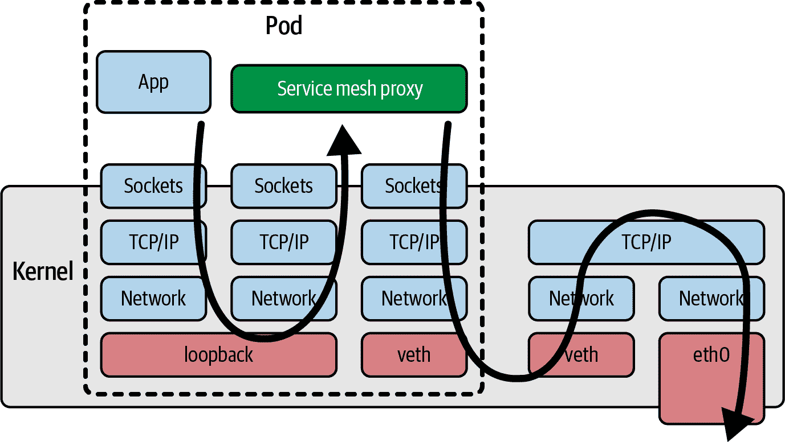

# 第一章：什么是 eBPF，为什么它重要？

eBPF 是一项革命性的内核技术，允许开发人员编写可以动态加载到内核中的自定义代码，改变内核行为的方式。（如果你对内核不是很自信，不用担心，我们稍后在本章将详细介绍。）

这使得新一代高性能的网络、可观察性和安全工具成为可能。正如你将看到的那样，如果你想用这些基于 eBPF 的工具来仪表化一个应用程序，你无需修改或重新配置该应用程序，这要归功于 eBPF 在内核中的优势位置。

你可以用 eBPF 做的一些事情包括：

+   几乎可以对系统的任何方面进行性能跟踪

+   高性能网络，具有内置的可见性

+   检测和（可选地）防止恶意活动

让我们简要回顾一下 eBPF 的历史，从伯克利数据包过滤器开始。

# eBPF 的起源：伯克利数据包过滤器

我们今天称之为“eBPF”的东西，其根源于 1993 年由劳伦斯伯克利国家实验室的 Steven McCanne 和 Van Jacobson 编写的一篇论文^(1)，该论文讨论了一个伪机器，可以运行 *过滤器*，这些程序编写用于确定是否接受或拒绝网络数据包。这些程序是用 BPF 指令集编写的，这是一组通用的 32 位指令，与汇编语言非常接近。以下是直接摘自该论文的一个例子：

```
ldh     [12] 
jeq     #ETHERTYPE IP, L1, L2 
L1:     ret     #TRUE 
L2:     ret     #0
```

这段小小的代码过滤掉不是 Internet 协议（IP）数据包的数据。这个过滤器的输入是一个以太网数据包，第一条指令（`ldh`）加载从数据包的第 12 字节开始的一个 2 字节的值。在下一条指令（`jeq`）中，将这个值与表示 IP 数据包的值进行比较。如果匹配，执行跳转到标记为 `L1` 的指令，并且通过返回一个非零值（这里被标识为 `#TRUE`）接受数据包。如果不匹配，则数据包不是 IP 数据包，通过返回 `0` 被拒绝。

你可以想象（或者确实参考论文找到例子），更复杂的过滤程序，这些程序基于数据包的其他方面做出决策。重要的是，过滤器的作者可以编写自己的自定义程序在内核中执行，这正是 eBPF 能实现的核心。

BPF 的含义被改为“伯克利数据包过滤器”，最早在 1997 年被引入 Linux 内核版本 2.1.75 中，^(2) 它被用作 tcpdump 实用程序中高效捕获要跟踪的数据包的方式。

快进到 2012 年，seccomp-bpf 在内核版本 3.5 中引入。这使得可以使用 BPF 程序来决定是否允许或拒绝用户空间应用程序进行系统调用。我们将在第十章中详细探讨这一点。这是将 BPF 从仅限于数据包过滤演变为如今通用平台的第一步。从这一点开始，名称中的“数据包过滤器”一词开始变得不那么合理了！

# 从 BPF 到 eBPF

从 2014 年的内核版本 3.18 开始，BPF 演变为我们所称的“扩展 BPF”或“eBPF”。这涉及了几个重大改变：

+   BPF 指令集在 64 位机器上进行了彻底改进，使其更高效，并且解释器也进行了完全重写。

+   引入了 eBPF *映射*，这是可以由 BPF 程序和用户空间应用程序访问的数据结构，允许它们之间共享信息。您将在第二章中了解映射。

+   添加了`bpf()`系统调用，以便用户空间程序可以与内核中的 eBPF 程序进行交互。您将在第四章中了解此系统调用。

+   添加了几个 BPF 辅助函数。您将在第二章看到一些示例，并在第六章中看到更多细节。

+   添加了 eBPF 验证器，以确保 eBPF 程序的安全运行。这在第六章中讨论。

这为 eBPF 奠定了基础，但开发并未放缓！自那时以来，eBPF 已经显著发展。

# eBPF 向生产系统的演变

自 2005 年以来，Linux 内核中存在名为*kprobes*（内核探测点）的特性，允许在内核代码中的几乎任何指令上设置陷阱。开发人员可以编写内核模块，将函数附加到 kprobes 以进行调试或性能测量目的。^(3)

2015 年添加了将 eBPF 程序附加到 kprobes 的能力，这是在 Linux 系统中进行跟踪革命的起点。同时，开始在内核的网络堆栈中添加钩子，允许 eBPF 程序处理更多的网络功能。我们将在第八章中看到更多内容。

到 2016 年，基于 eBPF 的工具已经开始在生产系统中使用。[Brendan Gregg](https://www.brendangregg.com) 在 Netflix 上关于跟踪的工作变得广为人知，正如他在基础设施和运维领域所说，eBPF“为 Linux 带来了超能力”。同年，宣布了 Cilium 项目，这是第一个在容器环境中使用 eBPF 来替换整个数据路径的网络项目。

2023 年，Facebook（现在的 Meta）将[Katran](https://oreil.ly/X-WsL)开源。Katran 作为第四层负载均衡器，满足了 Facebook 对[高可扩展性和快速解决方案](https://oreil.ly/zl4yX)的需求。自 2017 年以来，每个发送到[Facebook.com](http://Facebook.com)的数据包都经过 eBPF/XDP 的处理。^(4)对我个人而言，这一年点燃了我对这项技术可能性的激情，特别是在德克萨斯州奥斯汀市 DockerCon 上看到[Thomas Graf 的演讲](https://oreil.ly/g9ya0)，讲述了 eBPF 和[Cilium 项目](https://oreil.ly/doKbd)。

2018 年，eBPF 成为 Linux 内核中的一个独立子系统，由 Isovalent 的[Daniel Borkmann](http://borkmann.ch)和 Meta 的[Alexei Starovoitov](https://oreil.ly/K8nXI)负责维护（后来还有来自 Meta 的[Andrii Nakryiko](https://nakryiko.com)加入）。同年还引入了 BPF 类型格式（BTF），极大地提升了 eBPF 程序的可移植性。我们将在第五章中探讨这一点。

2020 年，引入了 LSM BPF，允许将 eBPF 程序附加到 Linux 安全模块（LSM）内核接口上。这表明 eBPF 已经确定了第三个重要用例：除了网络和可观测性外，它还成为了一个出色的安全工具平台。

多年来，由于 300 多名内核开发人员的工作以及许多贡献者对关联用户空间工具（如我们将在第三章中介绍的`bpftool`）的贡献，eBPF 的能力显著增强。程序曾经限制在 4096 条指令，但现在已经增长到 100 万条经过验证的指令^(5)，并且通过对尾调用和函数调用的支持，这一限制实际上已经变得不再重要（这些内容将在第二章和 3 章中介绍）。

###### 注意

想要深入了解 eBPF 的历史，最好去咨询那些从一开始就在这项技术上工作的维护者们。

Alexei Starovoitov 对[BPF 的历史](https://youtu.be/DAvZH13725I)进行了一次引人入胜的演讲，从软件定义网络（SDN）的根源开始。在这次演讲中，他讨论了早期 eBPF 补丁被接受进内核的策略，并透露了 eBPF 的官方生日是 2014 年 9 月 26 日，标志着第一批涵盖验证器、BPF 系统调用和映射的补丁被接受。

Daniel Borkmann 还讨论了 BPF 的历史以及其演变支持网络和跟踪功能。我强烈推荐他的演讲[“eBPF 和 Kubernetes：扩展微服务的小助手”](https://youtu.be/99jUcLt3rSk)，其中充满了有趣的信息片段。

# 命名是困难的。

eBPF 的应用远远超出了数据包过滤的范围，以至于这个缩写现在基本上没有意义，它已经成为一个独立的术语。由于目前广泛使用的 Linux 内核都支持“扩展”部分，因此 *eBPF* 和 *BPF* 这两个术语基本上可以互换使用。在内核源代码和 eBPF 编程中，通用术语是 *BPF*。例如，正如我们将在 第四章 中看到的那样，与 eBPF 交互的系统调用是 `bpf()`，辅助函数以 `bpf_` 开头，而不同类型的 (e)BPF 程序则以 `BPF_PROG_TYPE` 开头命名。在内核社区之外，“eBPF” 这个名字似乎已经被接受，例如在社区网站 [ebpf.io](https://ebpf.io) 和 [eBPF Foundation](http://ebpf.foundation) 的名称中。

# Linux 内核

要理解 eBPF，你需要对 Linux 中内核和用户空间的区别有深入的了解。我在我的报告 “What Is eBPF?”^(6) 中已经涵盖了这一点，并且我已经为接下来的几段内容做了一些调整。

Linux 内核是应用程序和它们运行在的硬件之间的软件层。应用程序运行在一个称为 *用户空间* 的非特权层中，不能直接访问硬件。相反，应用程序使用系统调用（syscall）接口向内核请求代表其执行操作。硬件访问可以涉及读写文件、发送或接收网络流量，甚至只是访问内存。内核还负责协调并发进程，使许多应用程序可以同时运行。这在 图 1-1 中有所体现。

作为应用程序开发者，我们通常不直接使用系统调用接口，因为编程语言提供了高级抽象和标准库，这些更容易编程的接口。因此，很多人对内核在我们程序运行时所做的工作一无所知。如果你想了解内核被调用的频率，可以使用 `strace` 实用程序显示应用程序进行的所有系统调用。


###### 图 1-1\. 用户空间中的应用程序使用系统调用接口向内核发出请求。

这里有一个例子，使用 `cat` 将单词 *hello* 回显到屏幕上涉及超过 100 次系统调用：

```
$ strace -c echo "hello"
hello
% time     seconds  usecs/call     calls    errors syscall
------ ----------- ----------- --------- --------- ----------------
 24.62    0.001693          56        30        12 openat
 17.49    0.001203          60        20           mmap
 15.92    0.001095          57        19           newfstatat
 15.66    0.001077          53        20           close
 10.35    0.000712         712         1           execve
  3.04    0.000209          52         4           mprotect
  2.52    0.000173          57         3           read
  2.33    0.000160          53         3           brk
  2.09    0.000144          48         3           munmap
  1.11    0.000076          76         1           write
  0.96    0.000066          66         1         1 faccessat
  0.76    0.000052          52         1           getrandom
  0.68    0.000047          47         1           rseq
  0.65    0.000045          45         1           set_robust_list
  0.63    0.000043          43         1           prlimit64
  0.61    0.000042          42         1           set_tid_address
  0.58    0.000040          40         1           futex
------ ----------- ----------- --------- --------- ----------------
100.00    0.006877          61       111        13 total
```

因为应用程序在很大程度上依赖于内核，这意味着如果我们能观察应用程序与内核的交互，我们就可以了解应用程序的行为方式。使用 eBPF，我们可以在内核中添加仪表，以获得这些见解。

例如，如果你能拦截打开文件的系统调用，你可以精确地看到任何应用程序访问的文件。但是你如何进行这种拦截？让我们考虑一下，如果我们想要修改内核，添加新代码以在调用该系统调用时创建某种输出，会涉及到什么。

# 向内核添加新功能

Linux 内核在撰写本文时非常复杂，大约有 3000 万行代码。^(7) 对任何代码库进行更改都需要对现有代码有一定的了解，因此，除非你已经是一个内核开发人员，否则这可能会是一个挑战。

此外，如果你想要向上游贡献你的变更，你将面临一个不仅仅是技术上的挑战。Linux 是一个通用操作系统，在各种环境和情况下使用。这意味着，如果你希望你的变更成为官方 Linux 发布的一部分，这不仅仅是编写有效代码的问题。代码必须被社区接受（更具体地说是被 Linux 的创始人和主要开发者 Linus Torvalds 接受），作为对所有人都有利的变更。这并非是理所当然的事情——只有三分之一的提交的内核补丁被接受。^(8)

假设你已经想出了一个良好的技术方法来拦截打开文件的系统调用。经过几个月的讨论和你的一些艰苦开发工作后，想象一下这个变更被内核接受了。太棒了！但是它会在所有人的机器上到达之前需要多长时间呢？

Linux 内核每两三个月就会有一个新版本发布，但即使某个变更已经包含在这些版本中，它仍需一段时间才能在大多数人的生产环境中可用。这是因为我们大多数人不直接使用 Linux 内核，而是使用像 Debian、Red Hat、Alpine 和 Ubuntu 这样的 Linux 发行版，这些发行版将 Linux 内核与各种其他组件打包在一起。你很可能会发现你喜爱的发行版使用的内核版本已经几年前的了。

例如，很多企业用户采用 Red Hat Enterprise Linux（RHEL）。截至撰写本文时，当前版本为 RHEL 8.5，发布日期为 2021 年 11 月，使用的 Linux 内核版本为 4.18。该内核发布于 2018 年 8 月。

正如在第 Figure 1-2 中的漫画所示，将新功能从想法阶段引入生产环境的 Linux 内核需要几乎数年时间。^(9)


###### 图 1-2\. 向内核添加功能（由 Isovalent 的 Vadim Shchekoldin 绘制的漫画）

# 内核模块

如果你不想等待数年才能让你的改动进入内核，还有另一种选择。Linux 内核设计成可以接受内核模块，这些模块可以按需加载和卸载。如果你想改变或扩展内核行为，编写一个模块当然是一种方法。内核模块可以分发给其他人使用，独立于官方 Linux 内核版本，因此不需要被合并到主要上游代码库中。

最大的挑战在于这仍然是完整的内核编程。用户在使用内核模块时历来非常谨慎，一个简单的原因是：如果内核代码崩溃，将导致整个机器和运行在上面的所有东西都崩溃。用户如何确信一个内核模块是安全可运行的？

“安全运行”不仅意味着不崩溃—用户还想知道一个内核模块从安全性角度是否安全。它是否包含攻击者可能利用的漏洞？我们是否信任模块的作者没有在其中放入恶意代码？因为内核是特权代码，它可以访问机器上的一切，包括所有数据，因此内核中的恶意代码将是一个严重的问题。这也适用于内核模块。

内核安全性是 Linux 发行版需要很长时间才能整合新版本的一个重要原因。如果其他人在各种情况下运行了一个内核版本数月甚至数年，这应该能够找出其中的问题。发行版维护者可以相信他们向用户/客户发布的内核已经经过*强化*—即，可以安全运行。

eBPF 提供了一种非常不同的安全方式：*eBPF 验证器*，它确保只有在安全的情况下才加载 eBPF 程序—这不会使机器崩溃或者陷入死循环，并且不会允许数据被泄漏。我们将在第六章中详细讨论验证过程。

# eBPF 程序的动态加载

eBPF 程序可以动态加载到内核中，并且可以随时卸载。一旦它们附加到一个事件上，它们将被该事件触发，不论是什么导致了该事件的发生。例如，如果你将一个程序附加到打开文件的系统调用上，那么无论何时任何进程尝试打开文件，它都会被触发。这与升级内核然后必须重新启动机器以使用其新功能相比是一个巨大的优势。

这导致使用 eBPF 的可观测性或安全工具的一大优势—它立即获得对机器上发生的所有事情的可见性。在运行容器的环境中，这包括对所有运行在这些容器内及主机上的进程的可见性。我将在本章后面深入探讨这对云原生部署的影响。

此外，正如在图 1-3 中所示，人们可以通过 eBPF 快速创建新的内核功能，而无需让每个 Linux 用户都接受相同的更改。


###### 图 1-3\. 通过 eBPF 添加内核功能（Vadim Shchekoldin, Isovalent 提供的漫画）

# eBPF 程序的高性能

eBPF 程序是增加仪表化的一种非常高效的方式。一旦加载并进行即时编译（您将在第三章中看到），程序将作为本机机器指令在 CPU 上运行。此外，无需承担每个事件处理时内核和用户空间之间转换的成本（这是一项昂贵的操作）。

描述 eXpress Data Path (XDP)的 2018 年论文^(10)包括一些插图，展示了 eBPF 在网络中带来的性能改进。例如，在 XDP 中实现路由“相比常规 Linux 内核实现提升了 2.5 倍性能”，并且“XDP 相比于 IPVS 提供了 4.3 倍的性能增益”用于负载平衡。

对于性能跟踪和安全可观察性，eBPF 的另一个优势是，在将相关事件发送到用户空间的成本之前，可以在内核中对其进行过滤。毕竟，最初的 BPF 实现的目的就是仅过滤特定的网络数据包。如今，eBPF 程序可以收集系统中各种事件的信息，并可以使用复杂的、定制的程序化过滤器，仅向用户空间发送相关的信息子集。

# 云原生环境中的 eBPF

如今，许多组织选择不直接在服务器上执行程序来运行应用程序。相反，许多使用云原生方法：容器、诸如 Kubernetes 或 ECS 的编排器，或者像 Lambda、云函数、Fargate 等的无服务器方法。这些方法都使用自动化来选择每个工作负载将运行的服务器；在无服务器中，我们甚至不知道每个工作负载在哪台服务器上运行。

尽管涉及到服务器，每个服务器（无论是虚拟机还是裸机）都运行着一个内核。在容器中运行应用程序时，如果它们在同一（虚拟）机器上运行，则共享同一个内核。在 Kubernetes 环境中，这意味着在给定节点上的所有 pod 中的所有容器都在使用同一个内核。当我们用 eBPF 程序进行内核仪表化时，那个节点上的所有容器化工作负载对这些 eBPF 程序都是可见的，正如图 1-4 所示。


###### 图 1-4\. eBPF 程序在内核中具有对运行在 Kubernetes 节点上所有应用程序的可见性

节点上所有进程的可见性，加上能够动态加载 eBPF 程序的能力，使我们在云原生计算中使用基于 eBPF 的工具具备真正的超能力：

+   我们不需要更改应用程序，甚至不需要更改它们的配置方式来使用 eBPF 工具。

+   一旦加载到内核并附加到事件，eBPF 程序就可以开始观察现有的应用程序进程。

与 *旁车模型* 相对比，该模型已被用于将日志记录、跟踪、安全性和服务网格功能等功能添加到 Kubernetes 应用程序中。在旁车方法中，工具化作为一个“注入”到每个应用程序 pod 中的容器运行。这个过程涉及修改定义应用程序 pod 的 YAML，增加旁车容器的定义。这种方法确实比将工具化添加到应用程序源代码中更为方便（这是我们在旁车方法之前必须做的事情；例如，在应用程序中包含日志记录库，并在代码中适当位置调用该库）。然而，旁车方法也有一些缺点：

+   应用程序 pod 必须重新启动以添加旁车。

+   必须有某种方式修改应用程序 YAML。通常这是一个自动化的过程，但如果出现问题，旁车将无法添加，这意味着 pod 不会被工具化。例如，部署可以被注释以指示准入控制器应该向该部署的 pod 规范中添加旁车 YAML。但如果部署没有正确标记，旁车就不会被添加，因此不会被工具化。

+   当一个 pod 中有多个容器时，它们可能在不同的时间到达就绪状态，其顺序可能是不可预测的。通过注入旁车，pod 的启动时间可能会显著延长，或者更糟糕的是，可能会导致竞争条件或其他不稳定性。例如，[Open Service Mesh 文档](https://oreil.ly/z80Q5)描述了应用程序容器必须能够处理所有流量被丢弃，直到 Envoy 代理容器准备就绪的情况。

+   在像服务网格这样的网络功能实现为旁车时，这必然意味着所有与应用程序容器之间的流量都必须通过内核中的网络堆栈到达网络代理容器，从而增加了流量的延迟；这在图 1-5 中有所体现。我们将在第九章中讨论如何使用 eBPF 改善网络效率。



###### 图 1-5\. 网络包路径使用服务网格代理旁车容器

所有这些问题都是侧车模型固有的问题。幸运的是，现在 eBPF 作为一个平台可用，我们有了一个可以避免这些问题的新模型。此外，由于基于 eBPF 的工具可以查看（虚拟）机器上发生的一切，它们对于恶意行为者来说更难以规避。例如，如果攻击者成功在您的主机上部署了一个加密货币挖掘应用程序，他们可能不会在您的应用工作负载上使用的侧车工具中加入它。如果您依赖于基于侧车的安全工具来防止应用程序进行意外的网络连接，那么如果未注入侧车，该工具将无法发现挖掘应用连接到其挖掘池。相比之下，基于 eBPF 实施的网络安全可以监管主机上的所有流量，因此这种加密货币挖掘操作很容易被阻止。有关出于安全原因丢弃网络数据包的能力，我们将在第八章中回到这个问题。

# 总结

希望本章为您解释了 eBPF 作为平台如此强大的原因。它允许我们改变内核的行为，为我们提供构建定制工具或自定义策略的灵活性。基于 eBPF 的工具可以观察（虚拟）机器上发生的任何事件，因此可以观察到所有正在运行的应用程序，无论它们是否容器化。eBPF 程序还可以动态部署，允许在运行时更改行为。

到目前为止，我们在相对概念化的层次上讨论了 eBPF。在下一章中，我们将使其更加具体，并探索基于 eBPF 的应用程序的组成部分。

^(1) 由 Steven McCanne 和 Van Jacobson 撰写的[“The BSD Packet Filter: A New Architecture for User-level Packet Capture”](https://oreil.ly/4GpgQ)。

^(2) 这些以及其他细节来自于 Alexei Starovoitov 在 2015 年 NetDev 会议上的演示，[“BPF – in-kernel virtual machine”](https://oreil.ly/hISe1)。

^(3) 在[内核文档](https://oreil.ly/Ue6Ii)中有关 kprobes 工作方式的良好描述。

^(4) 这个令人惊叹的事实来自 Daniel Borkmann 在 KubeCon 2020 上的演讲，题为[“eBPF and Kubernetes: Little Helper Minions for Scaling Microservices”](https://oreil.ly/tIR9o)。

^(5) 关于指令限制和“复杂性限制”的更多细节，请参阅[*https://oreil.ly/0iVer*](https://oreil.ly/0iVer)。

^(6) 摘自 Liz Rice 的“What Is eBPF?”。版权所有 © 2022 O’Reilly Media，已授权使用。

^(7) [“Linux 5.12 Coming In At Around 28.8 Million Lines”](https://oreil.ly/9zJP2). Phoronix, March 2021.

^(8) 江宇，亚当斯，德国人 DM。2013 年。[“我的补丁会通过吗？以及有多快？”](https://oreil.ly/rj2P4)（2013）。根据这篇研究论文，有 33%的补丁被接受，大多数需要三到六个月的时间。

^(9) 幸运的是，对现有功能的安全补丁更快地提供。

^(10) Høiland-Jørgensen T，Brouer JD，Borkmann D 等。[“eXpress 数据路径：操作系统内核中快速可编程数据包处理”](https://oreil.ly/qyhLK)。*第 14 届新兴网络实验与技术国际会议论文集*（CoNEXT ’18）。计算机协会；2018：54–66。
