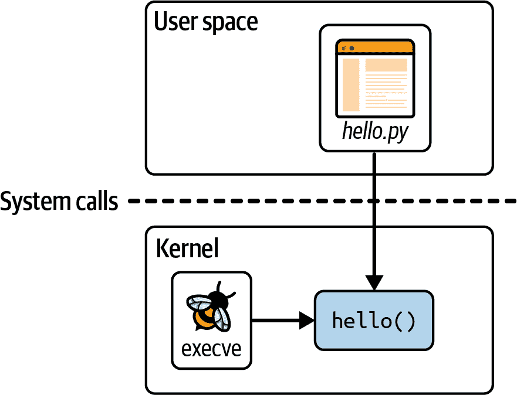
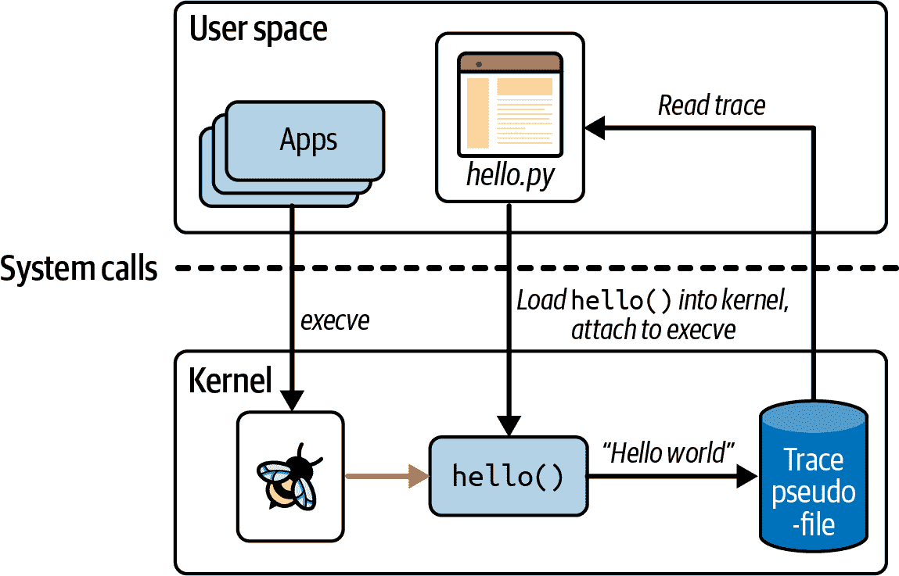
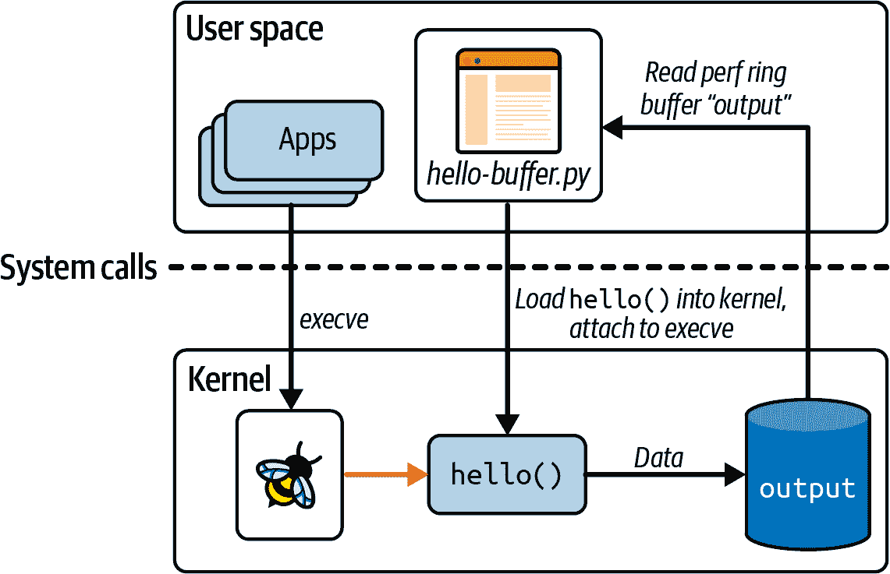
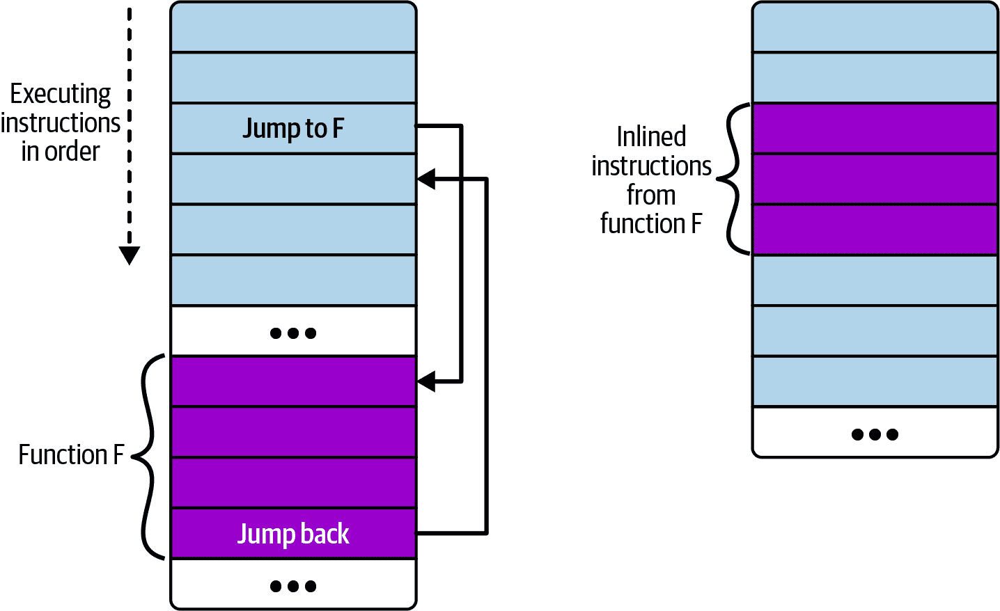

# 第二章：eBPF 的“Hello World”

在上一章中，我讨论了为什么 eBPF 如此强大，但如果你还没有真正掌握运行 eBPF 程序的含义，也没关系。在本章中，我将使用一个简单的“Hello World”示例来让你更好地理解它。

当你阅读本书时，你会发现有几种不同的库和框架可以用来编写 eBPF 应用程序。作为一个热身，我将向你展示从编程角度来看可能是最容易接触的方法：[BCC Python 框架](https://github.com/iovisor/bcc)。这提供了一个非常简单的方式来编写基本的 eBPF 程序。出于我将在第五章中介绍的原因，这不一定是我现在推荐用于生产应用程序的方法，因为你打算分发给其他用户，但对于你的第一步来说，这是一个很好的选择。

###### 注意

如果你想自己尝试这段代码，可以在[*https://github.com/lizrice/learning-ebpf*](https://github.com/lizrice/learning-ebpf)的*chapter2*目录中找到它。

你可以在[*https://github.com/iovisor/bcc*](https://github.com/iovisor/bcc)找到 BCC 项目，并且安装 BCC 的说明在[*https://github.com/iovisor/bcc/blob/master/INSTALL.md*](https://github.com/iovisor/bcc/blob/master/INSTALL.md)。

# BCC 的“Hello World”

以下是*hello.py*的完整源代码，这是一个使用 BCC 的 Python 库编写的 eBPF“Hello World”应用程序。

```cpp
#!/usr/bin/python 
from bcc import BPF

program = r"""
int hello(void *ctx) {
 bpf_trace_printk("Hello World!");
 return 0;
}
"""

b = BPF(text=program)
syscall = b.get_syscall_fnname("execve")
b.attach_kprobe(event=syscall, fn_name="hello")

b.trace_print()
```

这段代码包括两部分：eBPF 程序本身将在内核中运行，以及一些用户空间代码，用于将 eBPF 程序加载到内核中并读取它生成的跟踪。如你在图 2-1 中所见，*hello.py*是这个应用程序的用户空间部分，`hello()`是在内核中运行的 eBPF 程序。



###### 图 2-1： “Hello World”的用户空间和内核组件

让我们深入了解源代码的每一行，以便更好地理解它。

第一行告诉你这是 Python 代码，可以运行它的程序是 Python 解释器（*/usr/bin/python*）。

eBPF 程序本身是用 C 代码编写的，就是这部分：

```cpp
int hello(void *ctx) { `bpf_trace_printk``(``"Hello World!"``);` ``return` `0``;` ``}```

```cpp

 ```整个 eBPF 程序只是使用一个辅助函数`bpf_trace_printk()`来写入一条消息。辅助函数是区分“扩展”BPF 和其“经典”前身的另一个特性。它们是 eBPF 程序可以调用与系统交互的一组函数；我将在第五章中进一步讨论它们。现在你可以把它看作是打印一行文本。

整个 eBPF 程序被定义为 Python 代码中的一个名为`program`的字符串。这个 C 程序需要在执行之前进行编译，但 BCC 会为你处理这一切。（你将在下一章中看到如何自己编译 eBPF 程序。）你只需要在创建 BPF 对象时将这个字符串作为参数传递，就像下面这行代码一样：

```cpp
b = BPF(text=program)
```

eBPF 程序需要附加到一个事件上，对于这个示例，我选择了附加到系统调用`execve`，这是用于执行程序的系统调用。每当这台机器上的任何东西或任何人启动一个新程序执行时，都会调用`execve()`，这将触发 eBPF 程序。虽然“execve()”名称是 Linux 中的一个标准接口，但在内核中实现它的函数名称取决于芯片架构，但 BCC 为我们提供了一种方便的方法来查找我们正在运行的机器的函数名称：

```cpp
syscall = b.get_syscall_fnname("execve")
```

现在，`syscall`代表了我要使用 kprobe 附加到的内核函数的名称（你在第一章中已经介绍了 kprobe 的概念）。你可以将`hello`函数附加到该事件上，就像这样：

```cpp
b.attach_kprobe(event=syscall, fn_name="hello")
```

此时，eBPF 程序已加载到内核中，并附加到事件，因此每当在机器上启动新的可执行文件时，程序都会被触发。在 Python 代码中所剩的就是读取内核输出的跟踪并将其写入屏幕：

```cpp
b.trace_print()
```

此`trace_print()`函数将无限循环（直到您停止程序，可能使用 Ctrl+C），显示任何跟踪。

图 2-2 说明了此代码。Python 程序编译 C 代码，将其加载到内核中，并将其附加到`execve`系统调用 kprobe。每当此（虚拟）机器上的任何应用程序调用`execve()`时，它都会触发 eBPF `hello()`程序，该程序会将一行跟踪写入特定的伪文件。（我将在本章后面介绍该伪文件的位置。）Python 程序从伪文件中读取跟踪消息并将其显示给用户。



###### 图 2-2：运行“Hello World”```cpp  ```# Running “Hello World”

运行此程序，根据您所使用的（虚拟）机器上正在发生的情况，您可能会立即看到生成的跟踪，因为其他进程可能正在使用`execve`系统调用执行程序³。如果您没有看到任何内容，请打开第二个终端并执行任何您喜欢的命令，⁴，您将看到“Hello World”生成的相应跟踪：

```cpp
$ hello.py
b'     bash-5412    [001] .... 90432.904952: 0: bpf_trace_printk: Hello World'
```

###### 注意

由于 eBPF 非常强大，因此需要特殊权限才能使用它。特权会自动分配给 root 用户，因此运行 eBPF 程序的最简单方法是作为 root 用户运行，可能使用`sudo`。为了清晰起见，我不会在本书的示例命令中包含`sudo`，但是如果您看到“操作不允许”错误，首先要检查的是您是否尝试以非特权用户身份运行 eBPF 程序。

`CAP_BPF`是在内核版本 5.8 中引入的，它提供了足够的特权来执行某些 eBPF 操作，例如创建某些类型的映射。但是，您可能需要额外的特权：

+   加载跟踪程序需要`CAP_PERFMON`和`CAP_BPF`。

+   加载网络程序需要`CAP_NET_ADMIN`和`CAP_BPF`。

有关此内容的更多详细信息，请参阅 Milan Landaverde 的博客文章[“Introduction to CAP_BPF”](https://oreil.ly/G2zFO)。

一旦*hello* eBPF 程序加载并附加到事件，它就会被从现有进程生成的事件触发。这应该加强您在第一章中学到的一些要点：

+   eBPF 程序可用于动态更改系统的行为。无需重新启动机器或重新启动现有进程。一旦将 eBPF 代码附加到事件，它就会立即生效。

+   无需更改其他应用程序的任何内容，它们就可以对 eBPF 可见。只要您在该机器上有终端访问权限，如果在其中运行可执行文件，那将使用`execve()`系统调用，如果您将*hello*程序附加到该系统调用，它将被触发以生成跟踪输出。同样，如果您有一个运行可执行文件的脚本，那也将触发*hello* eBPF 程序。您无需更改终端的 shell、脚本或正在运行的可执行文件的任何内容。

跟踪输出不仅显示了“Hello World”字符串，还显示了触发*hello* eBPF 程序运行的事件的一些额外上下文信息。在本节开头显示的示例输出中，进行了`execve`系统调用的进程的进程 ID 为 5412，它正在运行`bash`命令。对于跟踪消息，这些上下文信息是作为内核跟踪基础设施的一部分添加的（这并不特定于 eBPF），但正如本章后面将看到的，也可以在 eBPF 程序本身中检索到这样的上下文信息。

您可能想知道 Python 代码如何知道从哪里读取跟踪输出。答案并不是很复杂——内核中的`bpf_trace_printk()`辅助函数总是将输出发送到同一个预定义的伪文件位置：*/sys/kernel/debug/tracing/trace_pipe*。您可以使用`cat`来查看其内容来确认这一点；您需要 root 权限才能访问它。

对于简单的“Hello World”示例或基本的调试目的，单个跟踪管道位置是可以的，但它非常有限。输出格式的灵活性很小，它只支持字符串的输出，因此对于传递结构化信息并不是非常有用。也许最重要的是，在（虚拟）机器上只有这一个位置。如果同时运行多个 eBPF 程序，它们都会将跟踪输出写入同一个跟踪管道，这对于人类操作员来说可能会非常混乱。

有一种更好的方法可以从 eBPF 程序中获取信息：使用 eBPF 映射。

# BPF Maps

*映射*是一种可以从 eBPF 程序和用户空间访问的数据结构。映射是区分扩展 BPF 与其经典前身的一个非常重要的特性之一。 （您可能会认为这意味着它们通常被称为“eBPF 映射”，但您经常会看到“BPF 映射”。通常情况下，这两个术语是可以互换使用的。）

映射可用于在多个 eBPF 程序之间共享数据，或者在用户空间应用程序和在内核中运行的 eBPF 代码之间进行通信。典型的用途包括以下内容：

+   用户空间编写配置信息，以便由 eBPF 程序检索

+   一个 eBPF 程序存储状态，以便稍后由另一个 eBPF 程序检索（或者同一个程序的将来运行）

+   一个 eBPF 程序将结果或指标写入映射，以便用户空间应用程序呈现结果时检索

在 Linux 的[*uapi/linux/bpf.h*文件](https://oreil.ly/1s1GM)中定义了各种类型的 BPF 映射，并且在[内核文档](https://oreil.ly/5oUW7)中有一些关于它们的信息。总的来说，它们都是键-值存储，本章中将看到哈希表、性能和环形缓冲区以及 eBPF 程序数组的映射示例。

有些映射类型被定义为数组，它们的键类型始终为 4 字节索引；其他映射是可以使用任意数据类型作为键的哈希表。

有一些映射类型针对特定类型的操作进行了优化，例如[先进先出队列](https://oreil.ly/VSoEp)、[先进后出堆栈](https://oreil.ly/VSoEp)、[最近最少使用的数据存储](https://oreil.ly/vpsun)、[最长前缀匹配](https://oreil.ly/hZ5aM)和[布隆过滤器](https://oreil.ly/DzCTK)（一种设计用于在元素存在时提供非常快速结果的概率数据结构）。

一些 eBPF 映射类型保存特定类型对象的信息。例如，[sockmaps](https://oreil.ly/UUTHO)和[devmaps](https://oreil.ly/jzKYh)保存关于套接字和网络设备的信息，并被网络相关的 eBPF 程序用于重定向流量。程序数组映射存储一组索引的 eBPF 程序，并且（正如您将在本章后面看到的）这用于实现尾调用，其中一个程序可以调用另一个程序。甚至还有一个[映射类型的映射](https://oreil.ly/038tN)来支持存储关于映射的信息。

一些映射类型有每 CPU 变体，也就是说内核为每个 CPU 核心的版本使用不同的内存块。这可能让您对*不*是每 CPU 的映射的并发性问题产生疑问，多个 CPU 核心可能同时访问同一个映射。内核版本 5.1 中添加了（一些）映射的自旋锁支持，我们将在第五章中返回到这个主题。

下一个示例（[GitHub 存储库](https://github.com/lizrice/learning-ebpf)中的*chapter2/hello-map.py*）展示了使用哈希表映射的一些基本操作。它还演示了 BCC 的一些方便的抽象，使其非常容易使用映射。

## 哈希表映射

与本章中的前一个示例一样，这个 eBPF 程序将附加到`execve`系统调用的入口处。它将使用键-值对填充哈希表，其中键是用户 ID，值是进程在该用户 ID 下运行时调用`execve`的次数的计数器。在实践中，此示例将显示每个不同用户运行程序的次数。

首先，让我们看看 eBPF 程序本身的 C 代码：

```cpp
BPF_HASH(counter_table);                                     // ①

int hello(void *ctx) {
  u64 uid;                                                  
  u64 counter = 0;
  u64 *p;

  uid = bpf_get_current_uid_gid() & 0xFFFFFFFF;              // ②
  p = counter_table.lookup(&uid);                            // ③
  if (p != 0) {                                              // ④
     counter = *p;
  }
  counter++;                                                 // ⑤
  counter_table.update(&uid, &counter);                      // ⑥
  return 0;
}
```

①

`BPF_HASH()`是一个定义哈希表映射的 BCC 宏。

②

`bpf_get_current_uid_gid()`是一个辅助函数，用于获取触发此 kprobe 事件的进程的用户 ID。用户 ID 保存在返回的 64 位值的最低 32 位中。（最高 32 位保存组 ID，但该部分被屏蔽。）

③

查找哈希表中键匹配用户 ID 的条目。它返回指向哈希表中相应值的指针。

④

如果存在此用户 ID 的条目，则将`counter`变量设置为哈希表中当前值（由`p`指向）。如果哈希表中不存在此用户 ID 的条目，则指针将为`0`，计数器值将保持为`0`。

⑤

无论当前的计数器值是多少，它都会增加一。

// ⑥

使用新的计数器值更新哈希表中的值。

仔细看一下访问哈希表的代码行：

```cpp
  p = counter_table.lookup(&uid);
```

`稍后：

```cpp
  counter_table.update(&uid, &counter);
```

`如果您认为“这不是正确的 C 代码！”您是绝对正确的。C 不支持像那样在结构上定义方法。⁵这是一个很好的例子，BCC 的 C 版本非常宽松地类似于 C 语言，BCC 在将代码发送到编译器之前会对其进行重写。BCC 提供了一些方便的快捷方式和宏，它将其转换为“正确”的 C。

就像在前面的例子中一样，C 代码被定义为一个名为`program`的字符串。程序被编译，加载到内核中，并附加到`execve` kprobe 上，与之前的“Hello World”示例完全相同。

```cpp
b = BPF(text=program)
syscall = b.get_syscall_fnname("execve")
b.attach_kprobe(event=syscall, fn_name="hello")
```

这次在 Python 端需要更多的工作来从哈希表中读取信息：

```cpp
while True:                                       // ①
  sleep(2)                                         
  s = ""
  for k,v in b["counter_table"].items():          // ②
    s += f"ID {k.value}: {v.value}\t"
  print(s)
```

①

代码的这一部分无限循环，每两秒查找要显示的输出。

②

BCC 自动创建一个 Python 对象来表示哈希表。此代码循环遍历任何值并将它们打印到屏幕上。

当你运行这个示例时，你会想要一个第二个终端窗口，你可以在其中运行一些命令。这是我得到的一些示例输出，右侧带有我在另一个终端中运行的命令的注释：

```cpp
Terminal 1                          Terminal 2
$ ./hello-map.py 
                                    [blank line(s) until I run something]
ID 501: 1                           ls 
ID 501: 1
ID 501: 2                           ls
ID 501: 3       ID 0: 1             sudo ls
ID 501: 4       ID 0: 1             ls
ID 501: 4       ID 0: 1
ID 501: 5       ID 0: 2             sudo ls
```

这个示例每两秒生成一行输出，无论发生了什么。在这个输出的结尾，哈希表包含了两个条目：

+   `key=501, value=5`

+   `key=0, value=2`

在第二个终端中，我有用户 ID 为 501。使用这个用户 ID 运行`ls`命令会增加`execve`计数器。当我运行`sudo ls`时，这将导致两次`execve`调用：一次是在用户 ID 为 501 的情况下执行`sudo`，另一次是在 root 用户 ID 为 0 的情况下执行`ls`。

在这个示例中，我使用了哈希表将数据从 eBPF 程序传递到用户空间。（我也可以在这里使用数组类型的映射，因为键是整数；哈希表允许你使用任意类型作为键。）当数据自然地以键-值对存在时，哈希表非常方便，但用户空间代码必须定期轮询表。Linux 内核已经支持了[perf 子系统](https://oreil.ly/nTvvH)用于从内核向用户空间发送数据，而 eBPF 包括了使用 perf 缓冲区及其后继者 BPF 环形缓冲区的支持。让我们来看一下。``  ``## Perf and Ring Buffer Maps

在这一部分，我将描述一个稍微复杂的“Hello World”版本，它使用了 BCC 的`BPF_PERF_OUTPUT`功能，让你可以将数据以你选择的结构写入 perf 环形缓冲区映射。

###### 注意

现在有一个称为“BPF 环形缓冲区”的新构造，它现在通常比 BPF perf 缓冲区更受欢迎，如果你的内核版本是 5.8 或更高。Andrii Nakryiko 在他的[BPF 环形缓冲区](https://oreil.ly/ARRyV)博客文章中讨论了两者的区别。你将在第四章中看到 BCC 的`BPF_RINGBUF_OUTPUT`的示例。

你会在*Learning eBPF* [GitHub repository](http://github.com/lizrice/learning-ebpf)的*chapter2/hello-buffer.py*中找到这个示例的源代码。就像你在本章开头看到的第一个“Hello World”示例一样，这个版本将在每次使用`execve()`系统调用时将字符串`"Hello World"`写入屏幕。它还将查找每个`execve()`调用的进程 ID 和命令的名称，以便你可以得到与第一个示例类似的输出。这给了我机会向你展示 BPF 辅助函数的另外两个示例。

这是将加载到内核中的 eBPF 程序：

```cpp
BPF_PERF_OUTPUT(output);                                                // ①

struct data_t {                                                         // ②
   int pid;
   int uid;
   char command[16];
   char message[12];
};

int hello(void *ctx) {
   struct data_t data = {};                                             // ③
   char message[12] = "Hello World";

   data.pid = bpf_get_current_pid_tgid() >> 32;                         // ④
   data.uid = bpf_get_current_uid_gid() & 0xFFFFFFFF;                   // ⑤

   bpf_get_current_comm(&data.command, sizeof(data.command));           // ⑥ 
   bpf_probe_read_kernel(&data.message, sizeof(data.message), message); // ⑦

   output.perf_submit(ctx, &data, sizeof(data));                        // ⑧

   return 0;
}
```

①

BCC 为创建一个将消息从内核传递到用户空间的映射定义了宏`BPF_PERF_OUTPUT`。我将这个映射称为`output`。

②

每次运行`hello()`时，代码都会写入一个结构的数据。这是该结构的定义，它包含了进程 ID、当前运行命令的名称和一个文本消息。

③

`data`是一个保存要提交的数据结构的局部变量，`message`保存`"Hello World"`字符串。

④

`bpf_get_current_pid_tgid()`是一个辅助函数，用于获取触发此 eBPF 程序运行的进程的 ID。它返回一个 64 位值，其中进程 ID 在前 32 位中。

⑤

`bpf_get_current_uid_gid()`是你在前面示例中看到的用于获取用户 ID 的辅助函数。

// ⑥

类似地，`bpf_get_current_comm()`是一个辅助函数，用于获取执行`execve`系统调用的进程中正在运行的可执行文件（或“命令”）的名称。这是一个字符串，不像进程和用户 ID 那样是一个数值，而在 C 中，您不能简单地使用`=`分配一个字符串。您必须将字符串应该写入的字段的地址`&data.command`作为辅助函数的参数传递。

// ⑦

对于这个示例，消息每次都是“Hello World”。`bpf_probe_read_kernel()`将其复制到数据结构的正确位置。

// ⑧

此时，数据结构已填充有进程 ID、命令名称和消息。调用`output.perf_submit()`将该数据放入映射中。

就像第一个“Hello World”示例中一样，这个 C 程序在 Python 代码中被分配给一个名为`program`的字符串。接下来是 Python 代码的其余部分：

```cpp
b = BPF(text=program)                                // ①
syscall = b.get_syscall_fnname("execve")
b.attach_kprobe(event=syscall, fn_name="hello")

def print_event(cpu, data, size):                    // ②
   data = b["output"].event(data)
   print(f"{data.pid} {data.uid} {data.command.decode()} " + \
         f"{data.message.decode()}")

b["output"].open_perf_buffer(print_event)            // ③
while True:                                          // ④
   b.perf_buffer_poll()
```

①

编译 C 代码，将其加载到内核中，并将其附加到系统调用事件的行与您之前看到的“Hello World”版本相同。

②

`print_event`是一个回调函数，将在屏幕上输出一行数据。BCC 做了一些繁重的工作，以便我可以简单地将映射称为`b["output"]`，并使用`b["output"].event()`从中获取数据。

③

`b["output"].open_perf_buffer()`打开性能环形缓冲区。该函数将`print_event`作为参数，以定义每当有数据从缓冲区中读取时要使用的回调函数。

④

程序现在将无限循环，⁷轮询性能环形缓冲区。如果有任何可用数据，将调用`print_event`。

运行此代码会给我们输出，与原始的“Hello World”非常相似：

```cpp
$ sudo ./hello-buffer.py
11654 node Hello World
11655 sh Hello World
...
```

与之前一样，您可能需要打开第二个终端到同一（虚拟）机器，并运行一些命令来触发一些输出。

这个与原始“Hello World”示例的主要区别在于，现在数据不再通过单一的中央跟踪管道传递，而是通过一个称为`output`的环形缓冲区映射传递，该映射由此程序为自己的使用而创建，如图 2-4 所示。



###### 图 2-4：使用性能环形缓冲区将数据从内核传递到用户空间

您可以通过使用`cat /sys/kernel/debug/tracing/trace_pipe`来验证信息是否不会发送到跟踪管道。

除了演示环形缓冲区映射的使用之外，这个示例还展示了一些 eBPF 辅助函数，用于检索触发 eBPF 程序运行的事件的上下文信息。在这里，您已经看到了一些辅助函数获取用户 ID、进程 ID 和当前命令的名称。正如您将在第七章中看到的那样，可用的上下文信息集和可以用于检索它的有效辅助函数集取决于程序的类型以及触发它的事件。

eBPF 代码可以获得这样的上下文信息，这就是使其对可观察性如此有价值的原因。每当事件发生时，eBPF 程序不仅可以报告事件发生的事实，还可以报告有关触发事件发生的相关信息。它还具有高性能，因为所有这些信息都可以在内核中收集，而无需进行任何同步的上下文切换到用户空间。

在本书中，您将看到更多的示例，其中 eBPF 辅助函数用于收集其他上下文数据，以及 eBPF 程序改变上下文数据或甚至阻止事件发生的示例。

## 函数调用

您已经看到 eBPF 程序可以调用内核提供的辅助函数，但如果您想将自己编写的代码拆分为函数，该怎么办呢？通常，在软件开发中，将通用代码放入一个函数中，以便从多个地方调用，而不是一遍又一遍地复制相同的行，被认为是一种良好的做法⁸。但在早期，eBPF 程序不允许调用除辅助函数之外的其他函数。为了解决这个问题，程序员们已经指示编译器“始终内联”它们的函数，就像这样：

```cpp
static __always_inline void my_function(void *ctx, int val)
```

`通常，源代码中的函数会导致编译器发出跳转指令，这会导致执行跳转到构成所调用函数的一组指令（然后在该函数完成后再次跳回）。您可以在图 2-5 的左侧看到这一点。右侧显示了内联函数的情况：没有跳转指令；相反，函数指令的副本直接在调用函数中发出。



###### 图 2-5\. 未内联和内联函数指令的布局

如果从多个地方调用该函数，则在编译后的可执行文件中会有该函数指令的多个副本。（有时编译器可能会选择内联函数以进行优化，这就是为什么您可能无法将 kprobe 附加到某些内核函数的原因之一。我会在第七章中回到这一点。）

从 Linux 内核 4.16 和 LLVM 6.0 开始，解除了要求函数内联的限制，以便 eBPF 程序员可以更自然地编写函数调用。但是，BCC 框架目前不支持称为“BPF 到 BPF 函数调用”或“BPF 子程序”的功能，因此让我们在下一章中回到这个问题。（当然，如果内联了函数，您仍然可以继续使用 BCC。）

在 eBPF 中，还有另一种将复杂功能分解为较小部分的机制：尾调用。## 尾调用

如[ebpf.io](https://oreil.ly/Loyuz)所述，“尾调用可以调用和执行另一个 eBPF 程序，并替换执行上下文，类似于`execve()`系统调用对常规进程的操作。”换句话说，尾调用完成后，执行不会返回给调用者。

###### 注意

[尾调用](https://oreil.ly/cOA1r)绝不是 eBPF 编程的专属功能。尾调用的一般动机是避免在函数递归调用时一遍又一遍地向堆栈添加帧，这最终可能导致堆栈溢出错误。如果您可以安排代码在调用递归函数作为其最后一件事时，与调用函数相关联的堆栈帧实际上并没有做任何有用的事情。尾调用允许调用一系列函数而不会增加堆栈。这在 eBPF 中特别有用，因为[堆栈限制为 512 字节](https://oreil.ly/SZmkd)。

尾调用是使用`bpf_tail_call()`辅助函数进行的，其具有以下签名：

```cpp
long bpf_tail_call(void **`ctx`*, struct bpf_map **`prog_array_map`*, u32 *`index`*)
```

该函数的三个参数具有以下含义：

+   `ctx`允许将上一个 eBPF 程序的上下文传递给被调用者。

+   `prog_array_map`是`BPF_MAP_TYPE_PROG_ARRAY`类型的 eBPF 映射，其中保存了标识 eBPF 程序的一组文件描述符。

+   `index`表示应调用哪个 eBPF 程序集。

这个辅助函数有点不同寻常，如果成功，它就不会返回。当前运行的 eBPF 程序会被要调用的程序替换在堆栈上。辅助函数可能会失败，例如，如果映射中指定的程序不存在，那么调用程序将继续执行。

用户空间代码必须将所有的 eBPF 程序加载到内核中（与往常一样），并设置程序数组映射。

让我们看一个使用 BCC 编写的简单示例，你可以在[GitHub 存储库](http://github.com/lizrice/learning-ebpf)中找到代码，文件名为*chapter2/hello-tail.py*。主 eBPF 程序附加到了一个常见的系统调用入口点的跟踪点。该程序使用尾调用来跟踪特定系统调用操作码的特定消息。如果给定操作码没有尾调用，程序将跟踪一个通用消息。

如果你正在使用 BCC 框架，可以使用稍微简单的形式来进行[尾调用](https://oreil.ly/rT9e1)。

```cpp
prog_array_map.call(ctx, index)
```

`在将代码传递给编译步骤之前，BCC 将重写前一行为：

```cpp
bpf_tail_call(ctx, prog_array_map, index)
```

`这是 eBPF 程序及其尾调用的源代码：

```cpp
BPF_PROG_ARRAY(syscall, 300);                                   // ①

int hello(struct bpf_raw_tracepoint_args *ctx) {                // ②
   int opcode = ctx->args[1];                                   // ③
   syscall.call(ctx, opcode);                                   // ④
   bpf_trace_printk("Another syscall: %d", opcode);             // ⑤
   return 0;
}

int hello_execve(void *ctx) {                                   // ⑥
   bpf_trace_printk("Executing a program");
   return 0;
}

int hello_timer(struct bpf_raw_tracepoint_args *ctx) {          // ⑦
   if (ctx->args[1] == 222) {
       bpf_trace_printk("Creating a timer");
   } else if (ctx->args[1] == 226) {
       bpf_trace_printk("Deleting a timer");
   } else {
       bpf_trace_printk("Some other timer operation");
   }
   return 0;
}

int ignore_opcode(void *ctx) {                                  // ⑧
   return 0;
}
```

①

BCC 提供了一个`BPF_PROG_ARRAY`宏，用于轻松定义`BPF_MAP_TYPE_PROG_ARRAY`类型的映射。我将映射称为`syscall`，并允许 300 个条目，这对于本例来说足够了。

②

在接下来即将看到的用户空间代码中，我将把这个 eBPF 程序附加到`sys_enter`原始跟踪点，每次进行系统调用时都会触发。附加到原始跟踪点的 eBPF 程序传递的上下文采用`bpf_raw_tracepoint_args`结构的形式。

③

对于`sys_enter`，原始跟踪点参数包括标识正在进行哪个系统调用的操作码。

④

在这里，我们对与操作码匹配的程序数组中的条目进行尾调用。这行代码将被 BCC 重写为调用`bpf_tail_call()`辅助函数，然后将源代码传递给编译器。

⑤

如果尾调用成功，这行跟踪操作码值的代码将永远不会被触发。我使用这个来为映射中没有程序条目的操作码提供默认的跟踪行。

// ⑥

`hello_exec()`是一个将加载到系统调用程序数组映射中的程序，当操作码指示为`execve()`系统调用时将作为尾调用执行。它只会生成一行跟踪，告诉用户正在执行一个新程序。

// ⑦

`hello_timer()`是另一个将加载到系统调用程序数组中的程序。在这种情况下，它将被多个程序数组中的条目引用。

// ⑧

`ignore_opcode()`是一个尾调用程序，什么也不做。我将用它来处理那些我不希望生成任何跟踪的系统调用。

现在让我们看一下加载和管理这组 eBPF 程序的用户空间代码：

```cpp
b = BPF(text=program)                                              
b.attach_raw_tracepoint(tp="sys_enter", fn_name="hello")           // ①

ignore_fn = b.load_func("ignore_opcode", BPF.RAW_TRACEPOINT)       // ②
exec_fn = b.load_func("hello_exec", BPF.RAW_TRACEPOINT)
timer_fn = b.load_func("hello_timer", BPF.RAW_TRACEPOINT)

prog_array = b.get_table("syscall")                                // ③
prog_array[ct.c_int(59)] = ct.c_int(exec_fn.fd)
prog_array[ct.c_int(222)] = ct.c_int(timer_fn.fd)
prog_array[ct.c_int(223)] = ct.c_int(timer_fn.fd)
prog_array[ct.c_int(224)] = ct.c_int(timer_fn.fd)
prog_array[ct.c_int(225)] = ct.c_int(timer_fn.fd)
prog_array[ct.c_int(226)] = ct.c_int(timer_fn.fd)

# Ignore some syscalls that come up a lot // ④
prog_array[ct.c_int(21)] = ct.c_int(ignore_fn.fd)
prog_array[ct.c_int(22)] = ct.c_int(ignore_fn.fd)
prog_array[ct.c_int(25)] = ct.c_int(ignore_fn.fd)
...

b.trace_print()                                                    // ⑤
```

①

与之前看到的附加到 kprobe 不同，这次用户空间代码将主 eBPF 程序附加到`sys_enter`跟踪点。

②

这些对`b.load_func()`的调用会为每个尾调用程序返回一个文件描述符。请注意，尾调用需要与其父程序具有相同的程序类型——在这种情况下是`BPF.RAW_TRACEPOINT`。另外，需要指出的是，每个尾调用程序本身也是一个 eBPF 程序。

③

用户空间代码在`syscall`映射中创建条目。该映射不必为每个可能的操作码完全填充；如果某个特定操作码没有条目，这意味着不会执行任何尾调用。此外，指向相同 eBPF 程序的多个条目也是完全可以的。在这种情况下，我希望`hello_timer()`尾调用在一组与定时器相关的系统调用中执行。

④

有些系统调用在系统中运行得如此频繁，以至于每个系统调用的跟踪输出都会使跟踪输出变得难以阅读。我已经为几个系统调用使用了`ignore_opcode()`尾调用。

⑤

将跟踪输出打印到屏幕，直到用户终止程序。

运行此程序会为在（虚拟）机器上运行的每个系统调用生成跟踪输出，除非操作码具有将其链接到`ignore_opcode()`尾调用的条目。以下是在另一个终端上运行`ls`时的一些示例输出（为了可读性，某些细节已被省略）：

```cpp
./hello-tail.py 
b'   hello-tail.py-2767    ... Another syscall: 62'
b'   hello-tail.py-2767    ... Another syscall: 62'
...
b'            bash-2626    ... Executing a program'
b'            bash-2626    ... Another syscall: 220'
...
b'           <...>-2774    ... Creating a timer'
b'           <...>-2774    ... Another syscall: 48'
b'           <...>-2774    ... Deleting a timer'
...
b'              ls-2774    ... Another syscall: 61'
b'              ls-2774    ... Another syscall: 61'
...
```

正在执行的特定系统调用并不重要，但您可以看到不同的尾调用正在被调用并生成跟踪消息。您还可以看到对于在尾调用程序映射中没有条目的操作码，会看到默认消息`Another syscall`。

###### 注意

查看 Paul Chaignon 关于不同内核版本上 BPF 尾调用成本的博文。

自内核版本 4.2 以来，eBPF 已支持尾调用，但很长一段时间它们与进行 BPF 到 BPF 函数调用不兼容。这一限制在内核 5.10 中被取消。¹⁰

您可以将多达 33 个尾调用链接在一起，再加上每个 eBPF 程序的指令复杂性限制为 100 万条指令，这意味着今天的 eBPF 程序员有很大的灵活性来编写完全在内核中运行的非常复杂的代码。```cpp``  ```

$ ./hello-map.py

ID 104: 6     ID 0: 225

ID 104: 6     ID 101: 34    ID 100: 45    ID 0: 332     ID 501: 19

ID 104: 6     ID 101: 34    ID 100: 45    ID 0: 368     ID 501: 38

ID 104: 6     ID 101: 34    ID 100: 45    ID 0: 533     ID 501: 57

```cpp
    $ ./hello-map.py 
    ID 104: 6     ID 0: 225
    ID 104: 6     ID 101: 34    ID 100: 45    ID 0: 332     ID 501: 19
    ID 104: 6     ID 101: 34    ID 100: 45    ID 0: 368     ID 501: 38
    ID 104: 6     ID 101: 34    ID 100: 45    ID 0: 533     ID 501: 57
    `````
