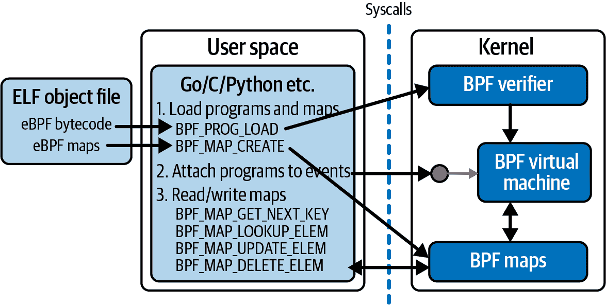

# 第四章：`bpf()`系统调用

正如您在第一章中看到的，当用户空间应用程序希望内核代表它们执行某些操作时，它们使用系统调用 API 发出请求。因此，如果用户空间应用程序希望将 eBPF 程序加载到内核中，必须涉及一些系统调用。实际上，有一个名为`bpf()`的系统调用，在本章中我将向您展示如何使用它来加载和与 eBPF 程序和映射交互。

值得注意的是，运行在内核中的 eBPF 代码不使用系统调用来访问映射。系统调用接口仅由用户空间应用程序使用。相反，eBPF 程序使用辅助函数来读取和写入映射；您已经在前两章中看到了这方面的示例。

如果您继续编写自己的 eBPF 程序，有很大的机会您不会直接调用这些`bpf()`系统调用。本书后面将讨论提供更高级抽象以简化操作的库。尽管如此，这些抽象通常相当直接地映射到您将在本章中看到的底层系统调用命令。无论使用哪种库，您都需要掌握底层操作——加载程序、创建和访问映射等——这些操作将在本章中看到。

在我向您展示`bpf()`系统调用示例之前，让我们考虑一下[`bpf()`的 man 页面中写着](https://oreil.ly/NJdIM)，`bpf()`用于“在扩展 BPF 映射或程序上执行命令”。它还告诉我们，`bpf()`的签名如下：

```
int bpf(int cmd, union bpf_attr *attr, unsigned int size);
```

`bpf()`的第一个参数`cmd`指定要执行的命令。`bpf()`系统调用不只是做一件事情——有很多不同的命令可以用来操作 eBPF 程序和映射。图 4-1 展示了用户空间代码可能用来加载 eBPF 程序、创建映射、将程序附加到事件以及访问映射中键值对的一些常见命令概述。



###### 图 4-1\. 用户空间程序通过系统调用与内核中的 eBPF 程序和映射交互

`bpf()`系统调用的`attr`参数包含用于指定命令参数的任何数据，`size`指示`attr`中有多少字节的数据。

您已经在第一章中遇到了`strace`，我在那里使用它来展示用户空间代码如何通过系统调用 API 发出许多请求。在本章中，我将使用它来演示如何使用`bpf()`系统调用。`strace`的输出包括每个系统调用的参数，但为了保持本章中示例输出的简洁性，我将省略`attr`参数的许多细节，除非它们特别有趣。

###### 注意

您将在[*github.com/lizrice/learning-ebpf*](https://github.com/lizrice/learning-ebpf)找到代码，以及设置运行环境的说明。本章的代码位于 *chapter4* 目录中。

对于这个示例，我将使用一个名为 *hello-buffer-config.py* 的 BCC 程序，它构建在您在第 2 章看到的示例基础之上。与 *hello-buffer.py* 示例类似，此程序在每次运行时都将消息发送到性能缓冲区，从内核向用户空间传递有关 `execve()` 系统调用事件的信息。这个版本的新功能是允许为每个用户 ID 配置不同的消息。

这是 eBPF 源代码：

```
struct user_msg_t {                                          
  char message[12];
};

BPF_HASH(config, u32, struct user_msg_t);                    

BPF_PERF_OUTPUT(output);                                     

struct data_t {                                              
  int pid;
  int uid;
  char command[16];
  char message[12];
};

int hello(void *ctx) {                                       
  struct data_t data = {};
  struct user_msg_t *p;
  char message[12] = "Hello World";

  data.pid = bpf_get_current_pid_tgid() >> 32;
  data.uid = bpf_get_current_uid_gid() & 0xFFFFFFFF;

  bpf_get_current_comm(&data.command, sizeof(data.command));

  p = config.lookup(&data.uid);                              
  if (p != 0) {
     bpf_probe_read_kernel(&data.message, sizeof(data.message), p->message);      
  } else {
     bpf_probe_read_kernel(&data.message, sizeof(data.message), message);
  }

  output.perf_submit(ctx, &data, sizeof(data));
  return 0;
}
```


此行指示存在一个结构定义 `user_msg_t`，用于保存一个 12 字符消息。


BCC 宏 `BPF_HASH` 用于定义一个名为 `config` 的哈希表映射。它将以 `u32` 类型的键索引类型为 `user_msg_t` 的值，这对于用户 ID 来说是正确大小的。（如果您不指定键和值的类型，BCC 默认为 `u64`）


性能缓冲输出的定义方式与第 2 章完全相同。您可以向缓冲区提交任意数据，因此这里无需指定任何数据类型…


…尽管在实践中，在此示例中程序总是提交一个 `data_t` 结构。这与第 2 章的示例也没有变化。


大部分 eBPF 程序其余部分与您之前看到的 `hello()` 版本没有变化。


唯一的区别在于使用了一个帮助函数来获取用户 ID 后，代码查找 `config` 哈希映射中具有该用户 ID 作为键的条目。如果有匹配的条目，该值包含一个替代默认“Hello World”的消息。

Python 代码有两行额外内容：

```
b["config"][ct.c_int(0)] = ct.create_string_buffer(b"Hey root!")
b["config"][ct.c_int(501)] = ct.create_string_buffer(b"Hi user 501!")
```

这些为 `config` 哈希表中的用户 ID 0 和 501 定义了消息，分别对应于根用户和我在此虚拟机上的用户 ID。此代码使用 Python 的 `ctypes` 包确保键和值的类型与 `user_msg_t` 的 C 定义中使用的类型相同。

这是这个示例的一些说明性输出，以及我在第二个终端中运行的命令：

```
Terminal 1                             Terminal 2
$ ./hello-buffer-config.py 
37926 501 bash Hi user 501!            ls 
37927 501 bash Hi user 501!            sudo ls
37929 0 sudo Hey root!
37931 501 bash Hi user 501!            sudo -u daemon ls
37933 1 sudo Hello World
```

现在您已经了解了这个程序的功能，我想展示一下运行时使用的 `bpf()` 系统调用。我将再次使用 `strace` 运行它，并指定 `-e bpf` 表示我只关心看到 `bpf()` 系统调用：

```
$ strace -e bpf ./hello-buffer-config.py
```

如果你自己尝试，你将看到输出中显示了几次对此系统调用的调用。对于每次调用，你将看到指示`bpf()`系统调用应执行什么操作的命令。大致概述如下：

```
bpf(BPF_BTF_LOAD, ...) = 3
bpf(BPF_MAP_CREATE, {map_type=BPF_MAP_TYPE_PERF_EVENT_ARRAY…) = 4
bpf(BPF_MAP_CREATE, {map_type=BPF_MAP_TYPE_HASH...) = 5
bpf(BPF_PROG_LOAD, {prog_type=BPF_PROG_TYPE_KPROBE,...prog_name="hello",...) = 6
bpf(BPF_MAP_UPDATE_ELEM, ...}
...
```

让我们逐一检查它们。既然你和我都没有无限耐心，我不会讨论每个调用的每个参数！我将专注于那些我认为真正有助于讲述当用户空间程序与 eBPF 程序交互时发生了什么的部分。

# 加载 BTF 数据

我看到的第一个`bpf()`调用如下：

```
bpf(BPF_BTF_LOAD, {btf="\237\353\1\0...}, 128) = 3
```

在这种情况下，你可以在输出中看到的命令是`BPF_BTF_LOAD`。这只是一组有效命令中的一个（至少在撰写本文时是如此），这些命令在内核源代码中得到了最全面的文档记录。^(1)

如果你使用的是相对较旧的 Linux 内核，可能不会看到此命令的调用，因为它涉及到 BTF 或 BPF 类型格式。^(2) BTF 允许 eBPF 程序在不同的内核版本之间可移植，因此你可以在一台机器上编译程序，然后在另一台机器上使用，即使它使用的是不同的内核版本，因此具有不同的内核数据结构。我将在第五章中详细讨论这个问题。

此次`bpf()`调用正在将一块 BTF 数据加载到内核中，而`bpf()`系统调用的返回代码（在我的示例中为`3`）是一个文件描述符，指向该数据。

###### 注意

*文件描述符*是打开文件（或类似文件对象）的标识符。如果你使用`open()`或`openat()`系统调用打开一个文件，返回的代码就是文件描述符，然后可以将其作为参数传递给其他系统调用，如`read()`或`write()`，以执行对该文件的操作。这里的数据块并不完全是文件，但它确实获得了文件描述符作为标识符，以便将来引用它时使用。

# 创建映射

接下来的`bpf()`创建了`output`性能缓冲映射：

```
bpf(BPF_MAP_CREATE, {map_type=BPF_MAP_TYPE_PERF_EVENT_ARRAY, , key_size=4, 
value_size=4, max_entries=4, ... map_name="output", ...}, 128) = 4
```

你可以从命令名称`BPF_MAP_CREATE`推测出，此调用创建了一个 eBPF 映射。你可以看到，这个映射的类型是`PERF_EVENT_ARRAY`，名为`output`。在这个性能事件映射中，键和值都是 4 字节长。此映射最多可以容纳四对键-值，由`max_entries`字段定义；我稍后会解释为什么这个映射中有四个条目。返回值`4`是用户空间代码访问`output`映射的文件描述符。

输出中的下一个`bpf()`系统调用创建了`config`映射：

```
bpf(BPF_MAP_CREATE, {map_type=BPF_MAP_TYPE_HASH, key_size=4, value_size=12,
max_entries=10240... map_name="config", ...btf_fd=3,...}, 128) = 5
```

此映射被定义为哈希表映射，键长为 4 字节（对应于可以用于保存用户 ID 的 32 位整数），值长为 12 字节（与`msg_t`结构的长度相匹配）。我没有指定表的大小，因此它使用了 BCC 的默认大小，即 10,240 个条目。

这个 `bpf()` 系统调用也返回一个文件描述符，`5`，它将被用来在未来的系统调用中引用这个 `config` 映射。

你还可以看到 `btf_fd=3` 字段，它告诉内核要使用之前获取的 BTF 文件描述符 `3`。正如你将在第五章看到的那样，BTF 信息描述了数据结构的布局，并且将其包含在映射的定义中意味着关于在该映射中使用的键和值类型布局的信息。这些信息由像 `bpftool` 这样的工具用来打印映射转储，使其更易读——你在第三章中已经看到了一个示例。

# 加载程序

到目前为止，你已经看到了示例程序使用系统调用将 BTF 数据加载到内核并创建了一些 eBPF 映射。接下来要做的是使用以下 `bpf()` 系统调用加载正在加载到内核中的 eBPF 程序：

```
bpf(BPF_PROG_LOAD, {prog_type=BPF_PROG_TYPE_KPROBE, insn_cnt=44,
insns=0xffffa836abe8, license="GPL", ... prog_name="hello", ... 
expected_attach_type=BPF_CGROUP_INET_INGRESS, prog_btf_fd=3,...}, 128) = 6
```

这里有一些字段非常有趣：

+   `prog_type` 字段描述了程序类型，这里指示它是要附加到 kprobe。你将在第七章中进一步了解程序类型。

+   `insn_cnt` 字段表示“指令计数”。这是程序中的字节码指令数。

+   组成这个 eBPF 程序的字节码指令保存在 `insns` 字段指定的内存地址中。

+   此程序被指定为 GPL 许可，因此它可以使用 GPL 许可的 BPF 辅助函数。

+   程序名称是 `hello`。

+   `expected_attach_type` 是 `BPF_CGROUP_INET_INGRESS`，这可能听起来令人惊讶，因为它听起来与入口网络流量有关，但你知道这个 eBPF 程序将要附加到一个 kprobe 上。实际上，`expected_attach_type` 字段仅用于某些程序类型，并且 `BPF_PROG_TYPE_KPROBE` 不在其中。`BPF_CGROUP_INET_INGRESS` 恰好是 BPF 附加类型列表中的第一个，^(3) 因此它的值是 `0`。

+   `prog_btf_fd` 字段告诉内核要使用之前加载的 BTF 数据块来执行这个程序。这里的值 `3` 对应于从 `BPF_BTF_LOAD` 系统调用返回的文件描述符（而且这与 `config` 映射使用的同一个 BTF 数据块相同）。

如果程序验证失败（我将在第六章中讨论），此系统调用将返回一个负值，但在这里你可以看到它返回了文件描述符 `6`。总结一下，此时文件描述符的含义如表 4-1 所示。

表 4-1\. 运行 hello-buffer-config.py 时的文件描述符

| 文件描述符 | 代表 |
| --- | --- |
| `3` | BTF 数据 |
| `4` | `output` 性能缓冲区映射 |
| `5` | `config` 哈希表映射 |
| `6` | `hello` eBPF 程序 |

# 修改用户空间中的映射

您已经在 Python 用户空间源代码中看到了一行，该行配置了将显示给根用户（用户 ID 0）和用户 ID 501 的特殊消息：

```
b["config"][ct.c_int(0)] = ct.create_string_buffer(b"Hey root!")
b["config"][ct.c_int(501)] = ct.create_string_buffer(b"Hi user 501!")
```

您可以通过这样的系统调用看到这些条目是如何在映射中定义的：

```
bpf(BPF_MAP_UPDATE_ELEM, {map_fd=5, key=0xffffa7842490, value=0xffffa7a2b410,
flags=BPF_ANY}, 128) = 0
```

`BPF_MAP_UPDATE_ELEM` 命令更新映射中的键值对。 `BPF_ANY` 标志表示，如果该映射中不存在该键，则应创建它。 这两个调用对应于为两个不同用户 ID 配置的两个条目。

`map_fd` 字段标识正在操作的映射。 您可以看到在这种情况下它是 `5`，这是早些时候创建 `config` 映射时返回的文件描述符值。

文件描述符由内核为特定进程分配，因此 `5` 的这个值仅对运行 Python 程序的特定用户空间进程有效。 但是，多个用户空间程序（以及内核中的多个 eBPF 程序）都可以访问相同的映射。 两个访问内核中同一映射结构的用户空间程序可能会被分配不同的文件描述符值；同样，两个用户空间程序可能会对完全不同的映射使用相同的文件描述符值。

键和值都是指针，因此无法从此 `strace` 输出中知道键或值的数值。 但是，您可以使用 `bpftool` 查看映射的内容，并看到类似以下的内容：

```
$ bpftool map dump name config
[{
        "key": 0,
        "value": {
            "message": "Hey root!"
        }
    },{
        "key": 501,
        "value": {
            "message": "Hi user 501!"
        }
    }
]
```

`bpftool` 如何知道如何格式化此输出呢？ 例如，它如何知道值是一个结构，其中有一个名为 `message` 的字段，其中包含一个字符串？ 答案是它使用 BPF_MAP_CREATE 系统调用中包含的 BTF 信息中定义的定义。 在下一章节中，您将看到有关 BTF 如何传达此信息的更多详细信息。

您现在已经看到用户空间如何与内核交互以加载程序和映射，并更新映射中的信息。 在您到目前为止看到的系统调用序列中，程序尚未附加到事件。 这一步必须发生；否则，程序将永远不会被触发。

公平警告：不同类型的 eBPF 程序以各种不同的方式附加到不同事件上！ 在本例中，稍后我将向您展示用于附加到 kprobe 事件的示例中使用的系统调用，而在这种情况下它不涉及 `bpf()`。 相比之下，在本章末尾的练习中，我将向您展示另一个示例，在该示例中使用 `bpf()` 系统调用将程序附加到原始跟踪点事件。

在我们深入探讨这些细节之前，我想讨论一下当您停止运行程序时会发生什么。 您会发现程序和映射会自动卸载，这是因为内核使用 *引用计数* 来跟踪它们。

# BPF 程序和映射引用

你知道使用 `bpf()` 系统调用将 BPF 程序加载到内核中会返回一个文件描述符。在内核中，这个文件描述符是对程序的 *引用*。进行此系统调用的用户空间进程拥有此文件描述符；当该进程退出时，文件描述符将被释放，程序的引用计数将减少。当没有引用指向 BPF 程序时，内核将删除该程序。

*固定* 程序到文件系统时会创建额外的引用。

## 固定

在 第三章 中，你已经看到了固定的示例，具体命令如下：

```
bpftool prog load hello.bpf.o /sys/fs/bpf/hello
```

###### 注意

这些固定的对象并不是真实存储在磁盘上的文件。它们是在 *伪文件系统* 上创建的，其行为类似于具有目录和文件的常规基于磁盘的文件系统。但它们保存在内存中，这意味着它们在系统重启后不会保持原位。

如果 `bpftool` 允许你在不固定的情况下加载程序，那将毫无意义，因为当 `bpftool` 退出时文件描述符会释放，如果引用计数为零，程序会被删除，因此没有实现任何有用的功能。但是将其固定到文件系统意味着程序有了额外的引用，因此程序在命令完成后仍然加载。

当将 BPF 程序附加到触发它的钩子上时，引用计数器也会增加。这些引用计数的行为取决于 BPF 程序的类型。关于这些程序类型，你将在 第七章 中了解更多，但有些与跟踪相关（如 kprobes 和 tracepoints），总是与用户空间进程相关联；对于这些类型的 eBPF 程序，内核的引用计数在该进程退出时会减少。附加在网络堆栈或 cgroups（“控制组”）中的程序与任何用户空间进程无关联，因此即使加载它们的用户空间程序退出后，它们也会保持在原位。当使用 `ip link` 命令加载 XDP 程序时，你已经看到了这种情况的一个例子：

```
ip link set dev eth0 xdp obj hello.bpf.o sec xdp
```

`ip` 命令已完成，并没有固定位置的定义，但是 `bpftool` 将显示 XDP 程序已加载到内核中：

```
$ bpftool prog list
… 
1255: xdp  name hello  tag 9d0e949f89f1a82c  gpl
        loaded_at 2022-11-01T19:21:14+0000  uid 0
        xlated 48B  jited 108B  memlock 4096B  map_ids 612
```

由于连接到 XDP 钩子后，此程序的引用计数不为零，即使 `ip link` 命令完成后也是如此。

eBPF 映射也有引用计数器，当其引用计数降至零时会进行清理。每个使用映射的 eBPF 程序都会增加计数器，用户空间程序持有的每个文件描述符也会增加计数器。

有可能 eBPF 程序的源代码定义了一个程序实际上不引用的映射。假设您想存储关于程序的一些元数据；您可以将其定义为全局变量，并且正如您在上一章中看到的那样，这些信息会存储在一个映射中。如果 eBPF 程序对该映射什么也不做，则程序到映射之间不会自动存在引用计数。有一个`BPF(BPF_PROG_BIND_MAP)`系统调用将一个映射与一个程序关联起来，以便在用户空间加载程序退出并且不再持有映射的文件描述符引用时，映射不会立即被清除。

映射也可以固定到文件系统，并且用户空间程序可以通过知道映射的路径来访问该映射。

###### 注意

Alexei Starovoitov 在他的博客文章[“BPF 对象的生命周期”](https://oreil.ly/vofxH)中对 BPF 引用计数器和文件描述符进行了很好的描述。

另一种创建对 BPF 程序的引用的方式是使用 BPF 链接。

## BPF 链接

BPF 链接为 eBPF 程序和其附加的事件之间提供了一层抽象。BPF 链接本身可以固定到文件系统上，这样会为程序创建一个额外的引用。这意味着加载程序将 eBPF 程序加载到内核中的用户空间进程可以终止，但是程序仍然保持加载状态。用户空间加载程序的文件描述符被释放，减少对程序的引用计数，但由于 BPF 链接的存在，引用计数将不为零。

如果您在本章结束后跟随练习，您将有机会看到 BPF 链接的实际操作。现在，让我们回到*hello-buffer-config.py*中使用的`bpf()`系统调用序列。

# eBPF 涉及的其他系统调用

总结一下，到目前为止您已经看到了用于向内核添加 BTF 数据、程序和映射以及映射数据的`bpf()`系统调用。接下来，`strace`输出显示的下一步与设置性能缓冲区有关。

###### 注意

本章的其余部分将相对深入地探讨在使用性能缓冲区、环形缓冲区、kprobes 和映射迭代时涉及的系统调用序列。并非所有的 eBPF 程序都需要执行这些操作，所以如果您赶时间或者感觉内容有点过于详细，可以直接跳到章节总结部分，我不会介意的！

## 初始化性能缓冲区

您已经看到了`bpf(BPF_MAP_UPDATE_ELEM)`调用，该调用将条目添加到`config`映射中。接下来，输出显示了一些类似以下的调用：

```
bpf(BPF_MAP_UPDATE_ELEM, {map_fd=4, key=0xffffa7842490, value=0xffffa7a2b410,
flags=BPF_ANY}, 128) = 0
```

这些看起来与定义`config`映射条目的调用非常相似，不同之处在于此时映射的文件描述符为`4`，代表了`output`性能缓冲区映射。

与之前一样，键和值都是指针，因此你无法从这个 `strace` 输出中得知键或值的数值。我看到这个系统调用重复了四次，所有参数的值都相同，尽管无法知道指针所持有的值在每次调用之间是否有变化。查看这些 `BPF_MAP_UPDATE_ELEM bpf()` 调用留下了一些关于如何设置和使用缓冲区的未解答问题：

+   为什么会有四次调用 `BPF_MAP_UPDATE_ELEM`？这是否与 `output` map 创建时最多四个条目有关？

+   在这四个 `BPF_MAP_UPDATE_ELEM` 实例之后，`strace` 输出中不再出现更多的 `bpf()` 系统调用。这可能看起来有点奇怪，因为这个映射存在的目的是使 eBPF 程序每次触发时能够写入数据，而你已经看到用户空间代码显示了数据。显然，这些数据并未通过 `bpf()` 系统调用从映射中检索，那么它是如何获取的？

你还没有看到任何证据表明 eBPF 程序是如何附加到触发它的 kprobe 事件上的。要解释所有这些问题，我需要 `strace` 在运行这个例子时显示更多的系统调用，就像这样：

```
$ strace -e bpf,perf_event_open,ioctl,ppoll ./hello-buffer-config.py
```

为简洁起见，我将忽略那些与这个例子的 eBPF 功能不相关的 `ioctl()` 调用。

## 附加到 Kprobe 事件上

你已经看到文件描述符 6 被分配来代表内核中加载的 eBPF 程序 *hello*。为了将 eBPF 程序附加到事件上，你还需要一个文件描述符来代表特定的事件。`strace` 输出中的以下行显示了为 `execve()` kprobe 创建文件描述符的过程：

```
perf_event_open({type=0x6 /* PERF_TYPE_??? */, ...},...) = 7
```

根据 [manpage for the `perf_event_open()` syscall](https://oreil.ly/xpRJs) 所述，“创建一个文件描述符，允许测量性能信息。” 你可以从输出中看到 `strace` 不知道如何解释类型参数值为 `6`，但如果进一步查看该 manpage，它描述了 Linux 支持性能测量单元的动态类型：

> …在 */sys/bus/event_source/devices* 下每个 PMU 实例都有一个子目录。在每个子目录中，有一个类型文件，其内容是一个整数，可以在类型字段中使用。

如果你确实在该目录下查找，你会找到一个 *kprobe/type* 文件：

```
$ cat /sys/bus/event_source/devices/kprobe/type
6
```

从这里，你可以看到 `perf_event_open()` 的调用设置了类型值为 `6`，表示它是一种 kprobe 类型的性能事件。

`strace` 并没有输出详细信息来确切显示 kprobe 已经附加到 `execve()` 系统调用上，但我希望这里的证据足以说服你，这个文件描述符返回的是这个。

`perf_event_open()`的返回代码是`7`，这表示了 kprobe 的性能事件的文件描述符，你知道文件描述符`6`表示*eBPF*程序的*hello*。`perf_event_open()`的手册还解释了如何使用`ioctl()`来创建两者之间的附加关系：

> `PERF_EVENT_IOC_SET_BPF` [...] 允许将一个伯克利数据包过滤（BPF）程序附加到一个已存在的 kprobe 跟踪点事件上。该参数是通过先前的`bpf(2)`系统调用创建的 BPF 程序文件描述符。

这解释了你会在`strace`输出中看到的以下`ioctl()`系统调用，其参数涉及两个文件描述符：

```
ioctl(7, PERF_EVENT_IOC_SET_BPF, 6)     = 0
```

还有另一个`ioctl()`调用来启用 kprobe 事件：

```
ioctl(7, PERF_EVENT_IOC_ENABLE, 0)      = 0
```

有了这个设置，每当在这台机器上运行`execve()`时，eBPF 程序就应该会被触发。

## 设置和读取性能事件

我已经提到了，我看到了四次调用`bpf(BPF_MAP_UPDATE_ELEM)`与输出性能缓冲相关联。随着额外的系统调用被跟踪，`strace`输出显示了四个序列，如下所示：

```
perf_event_open({type=PERF_TYPE_SOFTWARE, size=0 /* PERF_ATTR_SIZE_??? */, 
config=PERF_COUNT_SW_BPF_OUTPUT, ...}, -1, X, -1, PERF_FLAG_FD_CLOEXEC) = Y

ioctl(Y, PERF_EVENT_IOC_ENABLE, 0)      = 0

bpf(BPF_MAP_UPDATE_ELEM, {map_fd=4, key=0xffffa7842490, value=0xffffa7a2b410,
flags=BPF_ANY}, 128) = 0
```

我在这里使用了`X`来指示输出在四个此调用实例中显示值`0`、`1`、`2`和`3`的位置。参考`perf_event_open()`系统调用的手册页面，你会看到这是`cpu`，而它之前的字段是`pid`或进程 ID。从手册页面来看：

> pid == -1 且 cpu >= 0
> 
> 这会测量指定 CPU 上的所有进程/线程。

这个序列发生四次的事实对应于我笔记本电脑中存在四个 CPU 核心。这最终解释了为什么“output”性能缓冲区映射中有四个条目的原因：每个 CPU 核心都有一个。这也解释了映射类型名称`BPF_MAP_TYPE_PERF_EVENT_ARRAY`中“array”的部分，因为该映射不仅仅表示一个性能环缓冲区，而是一个缓冲区数组，每个核心一个。

如果你编写 eBPF 程序，你不需要担心如何处理核心数量等细节，因为在第十章讨论的任何 eBPF 库中，这些细节都会为你处理，但我认为这是在使用`strace`分析该程序时看到的系统调用的一个有趣方面。

每个`perf_event_open()`调用都返回一个文件描述符，我将它们表示为`Y`；它们的值分别是`8`、`9`、`10`和`11`。`ioctl()`系统调用使得每个 CPU 核心的性能输出启用了对应的性能环缓冲区的映射条目以指示可以提交数据的位置。

用户空间代码可以随后在这四个输出流文件描述符上使用`ppoll()`，以便在任何给定的`execve()` kprobe 事件触发*eBPF*程序*hello*时获取数据输出。这是对`ppoll()`的系统调用：

```
ppoll([{fd=8, events=POLLIN}, {fd=9, events=POLLIN}, {fd=10, events=POLLIN},
{fd=11, events=POLLIN}], 4, NULL, NULL, 0) = 1 ([{fd=8, revents=POLLIN}])
```

如果你自己尝试运行示例程序，你会发现这些`ppoll()`调用会阻塞，直到有文件描述符有数据可读。只有在触发`execve()`时，才会将返回码写入屏幕，这会导致 eBPF 程序使用这个`ppoll()`调用从用户空间检索数据。

在第二章中，我提到如果你的内核版本是 5.8 或以上，BPF 环形缓冲区现在优先于性能缓冲区。^(4) 让我们看一下使用环形缓冲区的同一示例代码的修改版本。

# 环形缓冲区

如[内核文档](https://oreil.ly/RN_RA)中所述，环形缓冲区比性能缓冲区更受欢迎，部分原因是性能，但也确保数据的顺序性保持，即使数据由不同 CPU 核心提交。只有一个缓冲区，跨所有核心共享。

转换*hello-buffer-config.py*以使用环形缓冲区几乎不需要进行太多更改。在附带的 GitHub 仓库中，你会找到这个示例作为*chapter4/hello-ring-buffer-config.py*。表 4-2 展示了差异。

表 4-2\. 使用性能缓冲区和环形缓冲区的示例 BCC 代码之间的差异

| *hello-buffer-config.py* | *hello-ring-buffer-config.py* |
| --- | --- |
| `BPF_PERF_OUTPUT(output);` | `BPF_RINGBUF_OUTPUT(output, 1);` |
| `output.perf_submit(ctx, &data, sizeof(data));` | `output.ringbuf_output(&data, sizeof(data), 0);` |
| `b["output"]. open_perf_buffer(print_event)` | `b["output"]. open_ring_buffer(print_event)` |
| `b.perf_buffer_poll()` | `b.ring_buffer_poll()` |

正如你所预期的那样，由于这些变化仅涉及`output`缓冲区，加载程序和`config`映射以及将程序附加到 kprobe 事件相关的系统调用都保持不变。

创建`output`环形缓冲区映射的`bpf()`系统调用如下：

```
bpf(BPF_MAP_CREATE, {map_type=BPF_MAP_TYPE_RINGBUF, key_size=0, value_size=0,
max_entries=4096, ... map_name="output", ...}, 128) = 4
```

`strace`输出中的主要差异在于，在设置性能缓冲区时，你观察到的四个不同的`perf_event_open()`、`ioctl()`和`bpf(BPF_MAP_UPDATE_ELEM)`系统调用序列不再存在。对于环形缓冲区，只有一个文件描述符被所有 CPU 核心共享。

在撰写本文时，BCC 正在使用我之前展示的`ppoll`机制来进行性能缓冲区，但它使用更新的`epoll`机制来等待环形缓冲区的数据。让我们利用这个机会来理解`ppoll`和`epoll`之间的区别。

在性能缓冲区示例中，我展示了*hello-buffer-config.py*生成`ppoll()`系统调用，如下所示：

```
ppoll([{fd=8, events=POLLIN}, {fd=9, events=POLLIN}, {fd=10, events=POLLIN},
{fd=11, events=POLLIN}], 4, NULL, NULL, 0) = 1 ([{fd=8, revents=POLLIN}])
```

请注意，此处传入了文件描述符集 `8`、`9`、`10` 和 `11`，用户空间进程希望从中检索数据。每次此轮询事件返回数据时，必须再次调用 `ppoll()` 来设置相同的文件描述符集。在使用 `epoll` 时，文件描述符集由内核对象管理。

当 *hello-ring-buffer-config.py* 设置访问 `output` 环形缓冲区时，您可以在以下 `epoll` 相关系统调用序列中看到这一点。

首先，用户空间程序请求在内核中创建一个新的 `epoll` 实例：

```
epoll_create1(EPOLL_CLOEXEC) = 8
```

这返回文件描述符 `8`。然后调用 `epoll_ctl()`，告知内核将文件描述符 `4`（`output` 缓冲区）添加到该 `epoll` 实例的文件描述符集中：

```
epoll_ctl(8, EPOLL_CTL_ADD, 4, {events=EPOLLIN, data={u32=0, u64=0}}) = 0
```

用户空间程序使用 `epoll_pwait()` 等待环形缓冲区中有数据可用。此调用仅在数据可用时返回：

```
epoll_pwait(8,  [{events=EPOLLIN, data={u32=0, u64=0}}], 1, -1, NULL, 8) = 1
```

当然，如果您使用像 BCC（或 *libbpf* 或本书后面将描述的任何其他库）这样的框架编写代码，您实际上不需要了解如何通过 perf 或环形缓冲区从内核获取信息的这些底层细节。我希望您发现了解这些工作原理的底层细节很有趣。

但是，您可能会发现自己编写访问用户空间映射的代码，看到如何实现这一点可能会很有帮助。在本章前面，我使用 `bpftool` 检查了 `config` 映射的内容。由于它是在用户空间运行的实用程序，让我们使用 `strace` 看看它调用内核以检索此信息的过程。

# 从映射中读取信息

以下命令显示 `bpftool` 在读取 `config` 映射内容时所做的 `bpf()` 系统调用的摘录：

```
$ strace -e bpf bpftool map dump name config
```

如您所见，该序列包括两个主要步骤：

+   迭代所有映射，寻找任何名称为 `config` 的映射。

+   如果找到匹配的映射，请迭代该映射中的所有元素。

## 寻找映射

输出以类似调用的重复序列开始，因为 `bpftool` 浏览所有映射，寻找任何名称为 `config` 的映射：

```
bpf(BPF_MAP_GET_NEXT_ID, {start_id=0,...}, 12) = 0             
bpf(BPF_MAP_GET_FD_BY_ID, {map_id=48...}, 12) = 3              
bpf(BPF_OBJ_GET_INFO_BY_FD, {info={bpf_fd=3, ...}}, 16) = 0    

bpf(BPF_MAP_GET_NEXT_ID, {start_id=48, ...}, 12) = 0           
bpf(BPF_MAP_GET_FD_BY_ID, {map_id=116, ...}, 12) = 3
bpf(BPF_OBJ_GET_INFO_BY_FD, {info={bpf_fd=3...}}, 16) = 0
```


`BPF_MAP_GET_NEXT_ID` 获取指定 `start_id` 后下一个映射的 ID。


`BPF_MAP_GET_FD_BY_ID` 返回指定映射 ID 的文件描述符。


`BPF_OBJ_GET_INFO_BY_FD` 检索有关文件描述符引用的对象（在本例中是映射）的信息。此信息包括其名称，因此 `bpftool` 可以检查这是否是它正在寻找的映射。


序列重复，在步骤 1 中的下一个映射的 ID。

对于加载到内核中的每个映射，都有这三个系统调用的一组。您还应该看到 `start_id` 和 `map_id` 的值与这些映射的 ID 匹配。当没有更多映射可查看时，重复模式会结束，这导致 `BPF_MAP_GET_NEXT_ID` 返回 `ENOENT`，如下所示：

```
bpf(BPF_MAP_GET_NEXT_ID, {start_id=133,...}, 12) = -1 ENOENT (No such file or
directory)
```

如果找到了匹配的映射，`bpftool` 将持有其文件描述符，以便可以从该映射中读取元素。

## 读取映射元素

此时，`bpftool` 拥有映射的文件描述符引用，它将从中读取。让我们看看用于读取该信息的系统调用序列：

```
bpf(BPF_MAP_GET_NEXT_KEY, {map_fd=3, key=NULL,                    
next_key=0xaaaaf7a63960}, 24) = 0
bpf(BPF_MAP_LOOKUP_ELEM, {map_fd=3, key=0xaaaaf7a63960,           
value=0xaaaaf7a63980, flags=BPF_ANY}, 32) = 0
{                                                                
next_key=0xaaaaf7a63960}, 24) = 0
bpf(BPF_MAP_LOOKUP_ELEM, {map_fd=3, key=0xaaaaf7a63960, 
value=0xaaaaf7a63980, flags=BPF_ANY}, 32) = 0
    },{                                                   
        "key": 501,
        "value": {
            "message": "Hi user 501!"
        }
bpf(BPF_MAP_GET_NEXT_KEY, {map_fd=3, key=0xaaaaf7a63960,          
next_key=0xaaaaf7a63960}, 24) = -1 ENOENT (No such file or directory)
    }                                                             
]
+++ exited with 0 +++
```


首先，应用程序需要找到映射中存在的有效键。它使用 `bpf()` 系统调用的 `BPF_MAP_GET_NEXT_KEY` 类型。`key` 参数是一个指向键的指针，系统调用将返回此键之后的下一个有效键。通过传递 NULL 指针，应用程序请求映射中的第一个有效键。内核将键写入由 `next_key` 指针指定的位置。


给定一个键，应用程序请求关联的值，并将其写入由 `value` 指定的内存位置。


此时，`bpftool` 拥有第一个键-值对的内容，并将此信息写入屏幕。


在这里，`bpftool` 继续移动到映射中的下一个键，检索其值，并将此键-值对写入屏幕。


对 `BPF_MAP_GET_NEXT_KEY` 的下一次调用返回 `ENOENT`，以指示映射中没有更多条目。


在这里，`bpftool` 完成了写入屏幕的最终输出并退出。

注意，在这里，`bpftool` 已被分配文件描述符 `3`，对应于 `config` 映射。这是 *hello-buffer-config.py* 使用文件描述符 `4` 引用的同一个映射。正如我之前提到的，文件描述符是进程特定的。

分析显示了 `bpftool` 的行为方式，展示了用户空间程序如何迭代可用映射及映射中存储的键-值对。

# 摘要

在本章中，您看到了用户空间代码如何使用 `bpf()` 系统调用加载 eBPF 程序和映射。您看到了使用 `BPF_PROG_LOAD` 和 `BPF_MAP_CREATE` 命令创建程序和映射。

您了解到内核跟踪对 eBPF 程序和映射的引用计数，当引用计数降至零时释放它们。还介绍了将 BPF 对象固定到文件系统并使用 BPF 链接创建附加引用的概念。

您看到了一个示例，展示了如何使用`BPF_MAP_UPDATE_ELEM`来从用户空间创建映射条目。类似的命令还有`BPF_MAP_LOOKUP_ELEM`和`BPF_MAP_DELETE_ELEM`，用于从映射中检索和删除值。还有一个命令`BPF_MAP_GET_NEXT_KEY`，用于查找映射中下一个存在的键。您可以使用它来遍历所有有效的条目。

您看到了用户空间程序示例，这些程序利用`perf_event_open()`和`ioctl()`来将 eBPF 程序附加到 kprobe 事件。对于其他类型的 eBPF 程序，附加方法可能大不相同，有些甚至使用`bpf()`系统调用。例如，有一个`bpf(BPF_PROG_ATTACH)`系统调用可用于附加 cgroup 程序，以及一个`bpf(BPF_RAW_TRACEPOINT_OPEN)`用于原始 tracepoint（见本章末尾的练习 5）。

我还展示了如何使用`BPF_MAP_GET_NEXT_ID`、`BPF_MAP_GET_FD_BY_ID`和`BPF_OBJ_GET_INFO_BY_FD`来定位内核持有的映射（和其他）对象。

本章中还有一些其他`bpf()`命令我没有涵盖，但您在这里看到的已经足以提供一个良好的概述。

您还看到了一些 BTF 数据被加载到内核中，我提到`bpftool`使用这些信息来理解数据结构的格式，以便能够漂亮地打印出它们。我还没有解释 BTF 数据的外观或者它如何用于使 eBPF 程序在内核版本之间可移植。这将在下一章中详细介绍。

# 练习

如果您想进一步探索`bpf()`系统调用，可以尝试以下几件事情：

1.  确认通过`bpftool`转储已加载程序的翻译后的 eBPF 字节码时，`BPF_PROG_LOAD`系统调用的`insn_cnt`字段是否对应于输出的指令数量（如`bpf()`系统调用的手册页所述）。

1.  运行两个示例程序的实例，以便有两个名为`config`的映射。如果运行`bpftool map dump name config`，输出将包括关于两个不同映射以及它们内容的信息。在`strace`下运行，并通过系统调用输出跟踪不同的文件描述符使用情况。您能看到它从哪里检索映射信息以及从中检索键-值对存储的地方吗？

1.  使用`bpftool map update`来修改正在运行的示例程序之一中的`config`映射。使用`sudo -u username`来检查这些配置更改是否被 eBPF 程序接受。

1.  当*hello-buffer-config.py*正在运行时，使用`bpftool`将程序固定到 BPF 文件系统，方法如下：

    ```
    bpftool prog pin name hello /sys/fs/bpf/hi
    ```

    退出运行中的程序，并检查内核中是否仍加载了*hello*程序，使用`bpftool prog list`。您可以通过`rm /sys/fs/bpf/hi`来清理链接。

1.  在系统调用级别上，与挂载到 kprobe 相比，直接附加到原始 tracepoint 要简单得多，因为它只涉及一个 `bpf()` 系统调用。尝试将 *hello-buffer-config.py* 转换为使用 BCC 的 `RAW_TRACEPOINT_PROBE` 宏来附加到 `sys_enter` 的原始 tracepoint （如果你在 第二章 中完成了练习，你已经有一个适合的程序可以使用）。你不需要在 Python 代码中显式附加程序，因为 BCC 会替你处理。在 `strace` 下运行，你应该会看到类似这样的系统调用：

    ```
    bpf(BPF_RAW_TRACEPOINT_OPEN, {raw_tracepoint={name="sys_enter",
    prog_fd=6}}, 128) = 7
    ```

    内核中的 tracepoint 名称为 `sys_enter`，文件描述符为 `6` 的 eBPF 程序被附加到它。从现在开始，每当内核中的执行达到该 tracepoint 时，它都会触发 eBPF 程序。

1.  运行来自 [BCC 的 *libbpf 工具集*](https://oreil.ly/D31R4) 中的 opensnoop 应用程序。该工具会设置一些你可以用 `bpftool` 看到的 BPF 链接，如下所示：

    ```
    $ bpftool link list
    116: perf_event  prog 1849  
            bpf_cookie 0
            pids opensnoop(17711)
    117: perf_event  prog 1851  
            bpf_cookie 0
            pids opensnoop(17711)
    ```

    确认程序 ID（1849 和 1851 在我这里的示例输出中）与列出的加载的 eBPF 程序的输出相匹配：

    ```
    $ bpftool prog list
    ...
    1849: tracepoint  name tracepoint__syscalls__sys_enter_openat
            tag 8ee3432dcd98ffc3  gpl run_time_ns 95875 run_cnt 121
            loaded_at 2023-01-08T15:49:54+0000  uid 0
            xlated 240B  jited 264B  memlock 4096B  map_ids 571,568
            btf_id 710
            pids opensnoop(17711)
    1851: tracepoint  name tracepoint__syscalls__sys_exit_openat
            tag 387291c2fb839ac6  gpl run_time_ns 8515669 run_cnt 120
            loaded_at 2023-01-08T15:49:54+0000  uid 0
            xlated 696B  jited 744B  memlock 4096B  map_ids 568,571,569
            btf_id 710
            pids opensnoop(17711)
    ```

1.  当 opensnoop 在运行时，尝试使用 `bpftool link pin id 116 /sys/fs/bpf/mylink` 将其中一个链接固定住（使用 `bpftool link list` 输出的链接 ID 之一）。你应该看到，即使终止 opensnoop，链接和相应的程序仍然加载在内核中。

1.  如果你跳到 第五章 的示例代码，你会发现使用 *libbpf* 库编写的 *hello-buffer-config.py* 版本。这个库会自动为加载到内核中的程序设置一个 BPF 链接。使用 `strace` 检查它所做的 `bpf()` 系统调用，以及查看 `bpf(BPF_LINK_CREATE)` 系统调用。

^(1) 如果你想查看完整的 BPF 命令集，它们在 [*linux/bpf.h*](https://oreil.ly/Pyy7U) 头文件中有文档。

^(2) BTF 在 5.1 内核中被引入，但已在一些 Linux 发行版上进行了回移，你可以从 [这个讨论](https://oreil.ly/LjcPN) 中看到。

^(3) 这些在 [*linux/bpf.h*](https://oreil.ly/AO1rc)*.* 中的 `bpf_attach_type` 枚举中定义。

^(4) 提醒你，如果想了解更多差异的信息，请阅读安德烈·纳克里科的 [“BPF 环形缓冲区”](https://oreil.ly/XkpUF) 博客文章。
