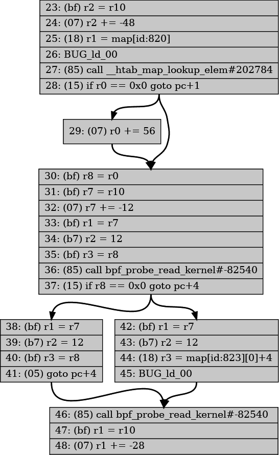

# 第六章：eBPF 验证器

我已经提到了几次验证步骤，因此您已经知道，当您将 eBPF 程序加载到内核时，此验证过程确保程序是安全的。在本章中，我们将深入探讨验证器如何工作以实现这一目标。

验证涉及检查程序中的每条可能执行路径，并确保每条指令都是安全的。验证器还对字节码进行了一些更新，以准备执行。在本章中，我将通过从一个有效的示例开始并进行修改来显示一些验证失败的示例，这些修改使该代码对验证器无效。

###### 注意

本章的示例代码位于[*github.com/lizrice/learning-ebpf*](https://github.com/lizrice/learning-ebpf)存储库的*chapter6*目录中。

本章并不试图涵盖验证器进行的每种可能检查。它旨在概述，并提供一些示例，这些示例将帮助您处理编写自己的 eBPF 代码时可能遇到的验证错误。

要记住的一件事是，验证器是在 eBPF 字节码上工作的，而不是直接在源代码上工作。该字节码取决于编译器的输出。由于编译器优化等原因，源代码的更改可能并不总是会导致字节码中的预期结果，因此相应地，它可能不会给出您在验证器的判断中所期望的结果。例如，验证器将拒绝不可达指令，但编译器在验证器看到它们之前可能会将它们优化掉。

# 验证过程

验证器分析程序以评估所有可能的执行路径。它按顺序逐步执行指令，而不是实际执行它们。在进行过程中，它在一个称为`bpf_reg_state`的结构中跟踪每个寄存器的状态。（我在这里提到的寄存器是您在第三章中遇到的 eBPF 虚拟机中的寄存器。）该结构包括一个称为`bpf_reg_type`的字段，描述了该寄存器中保存的值的类型。有几种可能的类型，包括这些：

+   `NOT_INIT`，表示寄存器尚未设置为值。

+   `SCALAR_VALUE`，表示寄存器已设置为不代表指针的值。

+   几种`PTR_TO_*`类型，表示寄存器保存指向某物的指针。例如：

+   `PTR_TO_CTX`：寄存器保存指向作为 BPF 程序参数传递的上下文的指针。

+   `PTR_TO_PACKET`：寄存器指向网络数据包（在内核中保存为`skb->data`）。

+   `PTR_TO_MAP_KEY`或`PTR_TO_MAP_VALUE`：我相信您可以猜到这些意味着什么。

还有几种其他`PTR_TO_*`类型，您可以在[*linux/bpf.h*头文件](https://oreil.ly/aWb50)中找到完整的枚举集。

`bpf_reg_state`结构还跟踪寄存器可能保存的可能值范围。验证器使用这些信息来确定何时尝试执行无效操作。

每次验证器到达一个分支时，需要决定是按顺序继续还是跳转到不同的指令时，验证器会将当前所有寄存器的当前状态的副本推送到堆栈上，并探索其中一条可能的路径。它继续评估指令，直到达到程序末尾的返回（或达到它将处理的指令数量上限，目前为一百万条指令¹），然后弹出堆栈上的一个分支以进行下一个评估。如果它发现可能导致无效操作的指令，它将无法通过验证。

验证每一种可能性可能会变得计算昂贵，因此在实践中有一些优化称为*状态修剪*，可以避免重新评估程序中本质上等效的路径。当验证器通过程序工作时，它记录程序内某些指令处所有寄存器的状态。如果它以匹配状态的相同指令到达，就不需要继续验证该路径的其余部分，因为已知它是有效的。

[已经进行了大量工作来优化验证器](https://oreil.ly/pQDES)及其修剪过程。验证器以前在每个跳转指令之前和之后存储修剪状态，但分析表明，这导致平均每四条指令存储一次状态，而其中绝大多数修剪状态永远不会匹配。结果表明，无论分支如何，每 10 条指令存储修剪状态更有效。

###### 注意

您可以在[内核文档](https://oreil.ly/atNda)中阅读有关验证工作原理的更多详细信息。

# 验证器日志

当程序的验证失败时，验证器会生成一个日志，显示它是如何得出程序无效的结论的。如果您使用`bpftool prog load`，验证器日志将输出到 stderr。当您使用*libbpf*编写程序时，您可以使用函数`libbpf_set_print()`来设置一个处理程序，该处理程序将显示（或对任何错误进行其他有用的操作）。（您将在本章的*hello-verifier.c*源代码中看到一个示例。）

###### 注意

如果您真的想深入了解验证器的工作原理，可以让它在成功和失败时生成日志。*hello-verifier.c*文件中也有一个基本示例。它涉及将一个将保存验证器日志内容的缓冲区传递给将程序加载到内核中的*libbpf*调用，然后将该日志内容写入屏幕。

验证器日志包括验证器完成的工作总结，大致如下：

```cpp
processed 61 insns (limit 1000000) max_states_per_insn 0 total_states 4
peak_states 4 mark_read 3
```

在这个例子中，验证器处理了 61 条指令，包括通过不同路径到达同一指令可能多次处理相同指令。请注意，一百万的复杂性限制是程序中指令数量的上限；在实践中，如果代码中有分支，验证器将多次处理一些指令。

存储的状态总数为 4，对于这个简单的程序，这与存储状态的峰值数量相匹配。如果一些状态已被修剪，峰值数量可能低于总数。

日志输出包括验证器分析的 BPF 指令，以及相应的 C 源代码行（如果对象文件使用`-g`标志构建以包含调试信息），以及验证器状态信息的摘要。以下是与*hello-verifier.bpf.c*程序的前几行相关的验证器日志的示例提取：

```cpp
0: (bf) r6 = r1
; data.counter = c;                                              ①
1: (18) r1 = 0xffff800008178000
3: (61) r2 = *(u32 *)(r1 +0)
 R1_w=map_value(id=0,off=0,ks=4,vs=16,imm=0) R6_w=ctx(id=0,off=0,imm=0) 
 R10=fp0                                                         ②
; c++; 
4: (bf) r3 = r2
5: (07) r3 += 1
6: (63) *(u32 *)(r1 +0) = r3
 R1_w=map_value(id=0,off=0,ks=4,vs=16,imm=0) R2_w=inv(id=1,umax_value=4294967295,
 var_off=(0x0; 0xffffffff)) R3_w=inv(id=0,umin_value=1,umax_value=4294967296,
 var_off=(0x0; 0x1ffffffff)) R6_w=ctx(id=0,off=0,imm=0) R10=fp0  ③
```

①

日志包括源代码行，以便更容易理解输出与源代码的关系。这个源代码是可用的，因为在编译步骤中使用了`-g`标志来构建调试信息。

②

这是日志中输出的一些寄存器状态信息的示例。它告诉我们，在这个阶段，寄存器 1 包含一个映射值，寄存器 6 保存上下文，寄存器 10 是保存局部变量的帧（或堆栈）指针。

③

这是另一个寄存器状态信息的示例。在这里，您不仅可以看到每个（初始化的）寄存器中保存的值的类型，还可以看到寄存器 2 和寄存器 3 可能值的范围。

让我们进一步了解一下这些细节。我说寄存器 6 保存上下文，验证器日志用`R6_w=ctx(id=0,off=0,imm=0)`表示了这一点。这是在字节码的第一行中设置的，寄存器 1 被复制到寄存器 6。当调用 eBPF 程序时，寄存器 1 始终保存传递给程序的上下文参数。为什么要将其复制到寄存器 6 呢？嗯，当调用 BPF 辅助函数时，该调用的参数通过寄存器 1 到 5 传递。辅助函数不修改寄存器 6 到 9 的内容，因此将上下文保存到寄存器 6 意味着代码可以调用辅助函数而不会失去对上下文的访问。

寄存器 0 用于从辅助函数和 eBPF 程序中返回值。寄存器 10 始终保存指向 eBPF 堆栈帧的指针（eBPF 程序不能修改它）。

让我们看看指令 6 后寄存器 2 和 3 的寄存器状态信息：

```cpp
R2_w=inv(id=1,umax_value=4294967295,var_off=(0x0; 0xffffffff))
R3_w=inv(id=0,umin_value=1,umax_value=4294967296,var_off=(0x0; 0x1ffffffff))
```

寄存器 2 没有最小值，在这里显示的`umax_value`对应于 0xFFFFFFFF，这是一个 8 字节寄存器中可以保存的最大值。换句话说，在这一点上，寄存器可以保存任何可能的值。

在指令 4 中，寄存器 2 的内容被复制到寄存器 3 中，然后指令 5 将该值加 1。因此，寄存器 3 可以具有大于 1 的任何值。您可以在寄存器 3 的状态信息中看到这一点，其中`umin_value`设置为`1`，`umax_value`设置为`0xFFFFFFFF`。

验证器使用有关每个寄存器状态的信息以及每个寄存器可能包含的值范围，来确定程序的可能路径。这也用于我之前提到的状态修剪：如果验证器在代码中的相同位置，具有相同类型和每个寄存器可能值范围的状态，那么就没有必要进一步评估这条路径。而且，如果当前状态是先前看到的状态的子集，那么它也可以被修剪。

# 可视化控制流

验证器探索 eBPF 程序的所有可能路径，如果您试图调试问题，看到这些路径可能会有所帮助。`bpftool`实用程序可以通过生成程序的[DOT 格式](https://oreil.ly/V-1WN)的控制流图来帮助您，然后您可以将其转换为图像格式，就像这样：

```cpp
$ bpftool prog dump xlated name kprobe_exec visual > out.dot
$ dot -Tpng out.dot > out.png
```

这产生了一个控制流的可视化表示，就像图 6-1 中所示的那样。



###### 图 6-1：从控制流图中提取（完整图像可以在本书的[GitHub 存储库](http://github.com/lizrice/learning-ebpf)的 chapter6/kprobe_exec.png 中找到）

# 验证辅助函数

不允许从 eBPF 程序直接调用任何内核函数（除非它已经注册为 kfunc，这将在下一章中介绍），但是 eBPF 提供了许多辅助函数，使程序能够访问内核中的信息。有一个[bpf-helpers manpage](https://oreil.ly/pdLGW)试图记录它们所有。

不同的辅助函数适用于不同的 BPF 程序类型。例如，辅助函数`bpf_get_current_pid_tgid()`检索当前用户空间进程 ID 和线程 ID，但是从由网络接口接收数据包触发的 XDP 程序中调用它是没有意义的，因为这里没有涉及用户空间进程。通过将*hello* eBPF 程序在*hello-verifier.bpf.c*中的`SEC()`定义从`kprobe`更改为`xdp`，可以看到这一点。尝试加载此程序时，验证器输出给出以下消息：

```cpp
...
16: (85) call bpf_get_current_pid_tgid#14
unknown func bpf_get_current_pid_tgid#14
```

`unknown func`并不意味着该函数完全未知，只是对于这种 BPF 程序类型是未知的。（BPF 程序类型是下一章的主题；现在你可以将它们视为适用于不同类型事件的程序。）

# 辅助函数参数

例如，你可以在[*kernel/bpf/helpers.c*](https://oreil.ly/tjjVR)中找到，每个辅助函数都有一个类似于辅助函数`bpf_map_lookup_elem()`的`bpf_func_proto`结构：

```cpp
conststruct`bpf_func_proto``bpf_map_lookup_elem_proto`={.`func`=`bpf_map_lookup_elem`,.`gpl_only`=`false`,.`pkt_access`=`true`,.`ret_type`=`RET_PTR_TO_MAP_VALUE_OR_NULL`,.`arg1_type`=`ARG_CONST_MAP_PTR`,.`arg2_type`=`ARG_PTR_TO_MAP_KEY`,};
```

该结构定义了对辅助函数的参数和返回值的约束。因为验证程序正在跟踪每个寄存器中保存的值的类型，所以它可以发现你尝试向辅助函数传递错误类型的参数。例如，尝试更改*hello*程序中对`bpf_map_lookup_elem()`的调用的参数，如下所示：

```cpp
p=bpf_map_lookup_elem(&data,&uid);
```

`现在不是传递`&my_config`，而是传递`&data`，这是指向本地变量结构的指针。从编译器的角度来看，这是有效的，因此可以构建 BPF 对象文件*hello-verifier.bpf.o*，但是当你尝试将程序加载到内核时，你会在验证器日志中看到这样的错误：

```cpp
27: (85) call bpf_map_lookup_elem#1
R1 type=fp expected=map_ptr
```

这里，`fp`代表*frame pointer*，它是存储局部变量的栈上内存区域。寄存器 1 加载了名为`data`的局部变量的地址，但该函数期望一个指向映射的指针（如前面显示的`bpf_func_proto`结构中的`arg1_type`字段所示）。通过跟踪每个寄存器中存储的值的类型，验证程序能够发现这种差异。`# 检查许可证

验证程序还检查，如果你使用的是 GPL 许可的 BPF 辅助函数，你的程序也必须具有 GPL 兼容的许可。第六章示例代码*hello-verifier.bpf.c*中的最后一行定义了一个包含字符串`Dual BSD/GPL`的“license”部分。如果删除此行，验证程序的输出将以这样结束：

```cpp
...
37: (85) call bpf_probe_read_kernel#113
cannot call GPL-restricted function from non-GPL compatible program
```

这是因为`bpf_probe_read_kernel()`辅助函数的`gpl_only`字段设置为`true`。在这个 eBPF 程序中之前调用了其他辅助函数，但它们没有 GPL 许可，所以验证程序不会反对它们的使用。

BCC 项目维护着一个[辅助函数列表](https://oreil.ly/mCpvB)，指示它们是否具有 GPL 许可。如果你对辅助函数的实现细节感兴趣，可以在[BPF 和 XDP 参考指南](https://oreil.ly/kVd6j)中找到相关部分。

# 检查内存访问

验证程序执行了许多检查，以确保 BPF 程序只访问它们应该访问的内存。

例如，在处理网络数据包时，XDP 程序只允许访问构成该网络数据包的内存位置。大多数 XDP 程序都以以下非常相似的内容开头：

```cpp
SEC("xdp") `int``xdp_load_balancer``(``struct``xdp_md``*``ctx``)` ``{` ``void``*``data``=``(``void``*``)(``long``)``ctx``->``data``;` ``void``*``data_end``=``(``void``*``)(``long``)``ctx``->``data_end``;` ``...`````

```cpp

 ```作为传递给程序的上下文的`xdp_md`结构描述了已接收的网络数据包。该结构中的`ctx->data`字段是数据包开始的内存位置，`ctx->data_end`是数据包的最后位置。验证程序将确保程序不会超出这些边界。

例如，*hello_verifier.bpf.c*中的以下程序是有效的：

```cpp
SEC("xdp") `int``xdp_hello``(``struct``xdp_md``*``ctx``)``{` ``void``*``data``=``(``void``*``)(``long``)``ctx``->``data``;` ``void``*``data_end``=``(``void``*``)(``long``)``ctx``->``data_end``;` ``bpf_printk``(``"%x"``,``data_end``);` ``return``XDP_PASS``;` ``}``````cpp
```

```cppThe variables `data` and `data_end` are very similar, but the verifier is smart enough to recognize that `data_end` relates to the end of a packet. Your program is required to check that any values read from the packet aren’t from beyond that location, and it won’t let you “cheat” by modifying the `data_end` value. Try adding the following line just before the `bpf_printk()` call:

```

data_end++;

```cpp

 `The verifier will complain, like this:

```

; data_end++;

1: (07) r3 += 1

R3 禁止在 pkt_end 上进行指针算术运算

```cpp

In another example, when accessing an array you need to make sure there’s no possibility of accessing an index that is beyond the bounds of that array. In the example code there is a section that reads a character out of the `message` array, like this:

```

如果(c<sizeof(message)){ `char``a``=``message``[``c``];` ``bpf_printk``(``"%c"``,``a``);` ``}```cpp
```

```cppThis is fine because of the explicit check to ensure that the counter variable `c` is no bigger than the size of the message array. Making a simple “off by one” error like the following renders it invalid:

```

如果(c<=sizeof(message)){ `char``a``=``message``[``c``];` ``bpf_printk``(``"%c"``,``a``);` ``}```cpp
```

```cppThe verifier will fail this with an error message similar to this:

```

对映值的无效访问，value_size=16 off=16 size=1

R2 的最大值超出了允许的内存范围

```cpp

It’s fairly clear from this message that there is an invalid access to a map value because Register 2 might hold a value that’s too large for indexing the map. If you were debugging this error, you’d want to dig into the log to see what line in the source code was responsible. The log ends like this just before emitting the error message (I have removed some of the state information for clarity):

```

如果(c <= sizeof(message)) {

30: (25) if r1 > 0xc goto pc+10                                ③

R0_w=map_value_or_null(id=2,off=0,ks=4,vs=12,imm=0) R1_w=inv(id=0,

umax_value=12,var_off=(0x0; 0xf)) R6=ctx(id=0,off=0,imm=0) ...

; char a = message[c];

31: (18) r2 = 0xffff800008e00004                               ②

33: (0f) r2 += r1

last_idx 33 first_idx 19

寄存器=2 堆栈=0 在 31 之前：(18) r2 = 0xffff800008e00004

寄存器=2 堆栈=0 在 30 之前：(25) if r1 > 0xc goto pc+10

寄存器=2 堆栈=0 在 29 之前：(61) r1 = *(u32 *)(r8 +0)

34: (71) r3 = *(u8 *)(r2 +0)                                   ①

R0_w=map_value_or_null(id=2,off=0,ks=4,vs=12,imm=0) R1_w=invP(id=0,

umax_value=12,var_off=(0x0; 0xf)) R2_w=map_value(id=0,off=4,ks=4,vs=16,

umax_value=12,var_off=(0x0; 0xf),s32_max_value=15,u32_max_value=15)

R6=ctx(id=0,off=0,imm=0) ...

```cpp

①

Working backward from the error, the last register state information shows that Register 2 could have a maximum value of `12`.

②

At instruction 31, Register 2 is set to an address in memory and then is incremented by the value of Register 1\. The output shows that this corresponds to the line of code accessing `message[c]`, so it stands to reason that Register 2 is set to point to the message array and then to be incremented by the value of `c`, which is held in the Register 1 register.

③

Working further back to find the value of Register 1, the log shows that it has a maximum value of `12` (which is hex 0x0c). However, `message` is defined as a 12-byte character array, so only indexes 0 through 11 are within its bounds. From this, you can see that the error springs from the source code testing for `c <= sizeof(message)`.

At step 2, I have inferred the relationship between some registers and the source code variables they represent, from the lines of source code the verifier has helpfully included in the log. You could work back through the verifier log to check that this is true, and indeed you might have to if the code was compiled without debug information. Given the debug information is present, it makes sense to use it.

The `message` array is declared as a global variable, and you might recall from [Chapter 3](ch03.html#anatomy_of_an_ebpf_program) that global variables are implemented using maps. This explains why the error message talks about “invalid access to a map value.”``````cpp```````cpp  ```# Checking Pointers Before Dereferencing Them

One easy way to make a C program crash is to dereference a pointer when the pointer has a zero value (also known as *null*). Pointers indicate where in memory a value is being held, and zero is not a valid memory location. The eBPF verifier requires all pointers to be checked before they are dereferenced so that this type of crash can’t happen.

The example code in *hello-verifier.bpf.c* looks for a custom message that might exist in the `my_config` hash table map for a user, with the following line:

```cpp
p=bpf_map_lookup_elem(&my_config,&uid);
```

 `If there’s no entry in this map corresponding to `uid`, this will set `p` (which is a pointer to the message structure `msg_t`) to zero. Here’s a little bit of additional code that attempts to dereference this potentially null pointer:

```cpp
chara=p->message[0]; `bpf_printk``(``"%c"``,``a``);`
```

 ``This compiles fine, but the verifier rejects it as follows:

```cpp
; p = bpf_map_lookup_elem(&my_config, &uid); 
25: (18) r1 = 0xffff263ec2fe5000
27: (85) call bpf_map_lookup_elem#1
28: (bf) r7 = r0                                ①
; char a = p->message[0];
29: (71) r3 = *(u8 *)(r7 +0)                    ②
R7 invalid mem access 'map_value_or_null'
```

①

The return value from a helper function call gets stored in Register 0\. Here, that value is being stored in Register 7\. This means Register 7 now holds the value of the local variable `p`.

②

This instruction attempts to dereference the pointer value `p`. The verifier has been keeping track of the state of Register 7 and knows that it may hold a pointer to a map value, or it might be null.

The verifier rejects this attempt to dereference a null pointer, but the program will pass if there is an explicit check, like this:

```cpp
if(p!=0){ `char``a``=``p``->``message``[``0``];` ``bpf_printk``(``"%d"``,``cc``);` ``}```
```cpp

 ```Some helper functions incorporate the pointer check for you. For example, if you look at the manpage for bpf-helpers, you’ll find the function signature for `bpf_probe_read_kernel()` is as follows:

```cpp
longbpf_probe_read_kernel(void**`dst`*,u32*`size`*,constvoid**`unsafe_ptr`*)
```

The third argument to this function is called `unsafe_ptr`. This is an example of a BPF helper function that helps programmers write safe code by handling checks for you. You’re allowed to pass a potentially null pointer—but only as the third argument called `unsafe_ptr`—and the helper function will check that it’s not null before attempting to deference it.```cpp```  ``# Accessing Context

Every eBPF program is passed some context information as an argument, but depending on the program and attachment type, it may be allowed to access only some of that context information. For example, [tracepoint programs](https://oreil.ly/6RFFI) receive a pointer to some tracepoint data. The format of that data depends on the particular tracepoint, but they all start with some common fields—yet those common fields are not accessible to eBPF programs. Only the tracepoint-specific fields that follow can be accessed. Attempting to read or write the wrong fields leads to an `invalid bpf_context access` error. There is an example of this in the exercises at the end of this chapter.

# Running to Completion

The verifier ensures that the eBPF program will run to completion; otherwise, there is a risk that it might consume resources indefinitely. It does this by having a limit on the total number of instructions that it will process, which, as I mentioned earlier, is set at one million instructions at the time of this writing. That limit is [hard-coded into the kernel](https://oreil.ly/IucYm); it’s not a configurable option. If the verifier hasn’t reached the end of the BPF program before it has processed this many instructions, it rejects the program.

One easy way to create a program that never completes is to write a loop that never ends. Let’s see how loops can be created in eBPF programs.

# Loops

To guarantee completion, until kernel version 5.3 there was a restriction on loops.³ Looping through the same instructions requires a jump backward to earlier instructions, and it used to be the case that the verifier would not permit this. eBPF programmers worked around this by using the `#pragma unroll` compiler directive to tell the compiler to write out a set of identical (or very similar) bytecode instructions for each time around the loop. This saved the programmer typing in the same lines many times, but you would see repeated instructions in the emitted bytecode.

From version 5.3 onward the verifier follows branches backward as well as forward as part of its process of checking all the possible execution paths. This means it can accept some loops, provided the execution path remains within the limit of one million instructions.

You can see an example of a loop in the example *xdp_hello* program. A version of the loop that passes verification looks like this:

```
for(inti=0;i<10;i++){ `bpf_printk``(``"Looping %d"``,``i``);` ``}``
```cpp

 ```The (successful) verifier log will show that it has followed the execution path around this loop 10 times. In doing so, it doesn’t hit the complexity limit of one million instructions. In the exercises for this chapter, there’s another version of this loop that will hit that limit and will fail verification.

In version 5.17 a new helper function, `bpf_loop()`, was introduced that makes it much easier for the verifier not only to accept loops but also to do it in a much more efficient way. This helper takes the maximum number of iterations as its first argument, and it is also passed a function that is called for each iteration. The verifier only has to validate the BPF instructions in that function once, however many times it might be called. That function can return a nonzero value to indicate that there is no need to call it again, which is used to terminate a loop early once the desired result is achieved.

There’s also a helper function [`bpf_for_each_map_elem()`](https://oreil.ly/Yg_oQ) that calls a provided callback function for each item in a map.```cpp  ```# Checking the Return Code

The return code from an eBPF program is stored in Register 0 (`R0`). If the program leaves `R0` uninitialized, the verifier will fail, like this:

```cpp
R0 !read_ok
```

You can try this by commenting out all the code in a function; for example, modify the `xdp_hello` example to be like this:

```cpp
SEC("xdp") `int``xdp_hello``(``struct``xdp_md``*``ctx``)``{` ``void``*``data``=``(``void``*``)(``long``)``ctx``->``data``;` ``void``*``data_end``=``(``void``*``)(``long``)``ctx``->``data_end``;` ``// bpf_printk("%x", data_end);`
`// return XDP_PASS;`
`}````

```cpp

 ```这将使验证器失败。但是，如果您将带有辅助函数`bpf_printf()`的行放回去，验证器就不会抱怨，尽管源代码中没有明确设置返回值！

这是因为寄存器 0 也用于保存辅助函数的返回代码。在 eBPF 程序中从辅助函数返回后，寄存器 0 将不再是未初始化的。```cpp  ```# 无效指令

正如您从第三章对 eBPF（虚拟）机器的讨论中所了解的，eBPF 程序由一组字节码指令组成。验证器检查程序中的指令是否是有效的字节码指令，例如，只使用已知的操作码。

如果编译器发出无效的字节码，那将被视为编译器的错误，因此除非您选择（出于某种原因最了解自己），手动编写 eBPF 字节码，否则不太可能看到这种类型的验证器错误。但是，最近添加了一些指令，例如原子操作。如果您的编译字节码使用这些指令，则它们将在旧内核上失败验证。

# 不可达指令

验证器还会拒绝具有不可达指令的程序。通常情况下，这些指令会被编译器优化掉。

# 总结

当我开始对 eBPF 感兴趣时，通过验证器的代码似乎是一种黑暗的艺术，看似有效的代码会被拒绝，引发看似是任意的错误。随着时间的推移，验证器已经有了*很多*改进，在本章中，您已经看到了几个示例，其中验证器日志提供了提示，帮助您找出问题所在。

当您对 eBPF（虚拟）机器的工作原理有一个心智模型时，这些提示会更有帮助，该机器使用一组寄存器作为临时值存储，以便在 eBPF 程序中进行步进。验证器会跟踪每个寄存器的类型和可能的值范围，以确保 eBPF 程序的安全运行。

如果您尝试编写自己的 eBPF 代码，您可能会发现自己需要帮助来解决验证器错误。[eBPF 社区 Slack 频道](http://ebpf.io/slack)是一个寻求帮助的好地方，许多人也在[StackOverflow](https://oreil.ly/nu_0v)上找到了建议。

# 练习

以下是导致验证器错误的更多方法。看看您是否能将验证器日志输出与您收到的错误相关联：

1.  在“检查内存访问”中，您看到验证器拒绝访问全局`message`数组末尾之外的访问。在示例代码中，有一部分以类似方式访问本地变量`data.message`：

```cpp
    if(c<sizeof(data.message)){ `char``a``=``data``.``message``[``c``];` ``bpf_printk``(``"%c"``,``a``);` ``}```

```cpp

     ```尝试调整代码，通过用`<=`替换`<`来制造相同的偏差错误，您将看到关于`从堆栈 R2 读取的无效变量偏移`的错误消息。```cpp 
```* 在示例代码的*xdp_hello*中找到被注释掉的循环。尝试添加第一个看起来像这样的循环：

```cpp
    for(inti=0;i<10;i++){ `bpf_printk``(``"Looping %d"``,``i``);` ``}``
    ```

```cppYou should see in the verifier log a repeated series of lines that look something like this:

    ```

42: (18) r1 = 0xffff800008e10009

44: (b7) r2 = 11

45: (b7) r3 = 8

46: (85) 调用 bpf_trace_printk#6

R0=inv(id=0) R1_w=map_value(id=0,off=9,ks=4,vs=26,imm=0) R2_w=inv11

R3_w=inv8 R6=pkt_end(id=0,off=0,imm=0) R7=pkt(id=0,off=0,r=0,imm=0)

R10=fp0

last_idx 46 first_idx 42

regs=4 stack=0 在 45 之前：(b7) r3 = 8

regs=4 stack=0 在 44 之前：(b7) r2 = 11

```cpp

    From the log, work out which register is tracking the loop variable `i`.``` ```cpp*   Now try adding in a loop that will fail, which looks like this:

    ```

for(inti=0;i<c;i++){ `bpf_printk``(``"Looping %d"``,``i``);` ``}``

```cpp

     ```你应该看到验证器试图探索这个循环直到结束，但在完成之前达到了指令复杂性限制（因为全局变量`c`没有上限）。```cpp ```*编写一个附加到跟踪点的程序。（您可能已经在第四章的练习中完成了这个。）预览[“跟踪点”](ch07.html#tracepoints)，您可以看到一个以这些字段开始的上下文参数的结构定义：

```cpp
    unsignedshortcommon_type; `unsigned``char``common_flags``;` ``unsigned``char``common_preempt_count``;` ``int``common_pid``;```

```cpp

     ```创建自己的版本，以这样开始的结构，并使程序中的上下文参数指向这个结构的指针。在程序中，尝试访问任何这些字段，并查看验证器失败并显示“无效的 bpf_context 访问”。```cpp```````cpp`` 

 ```¹ For a long time the limit was 4,096 instructions, which imposed significant restrictions on the complexity of eBPF programs. This limit still applies to unprivileged users running BPF programs.

² Helper functions are also defined in some other places in the source code, for example, [*kernel/trace/bpf_trace.c*](https://oreil.ly/cY8y9) and [*net/core/filter.c*](https://oreil.ly/qww-b).

³ This release brought a number of significant optimizations and improvements to the BPF verifier, which are summarized nicely in the LWN article [“Bounded loops in BPF for the 5.3 kernel”](https://oreil.ly/50BoD).```cpp```````cpp```
