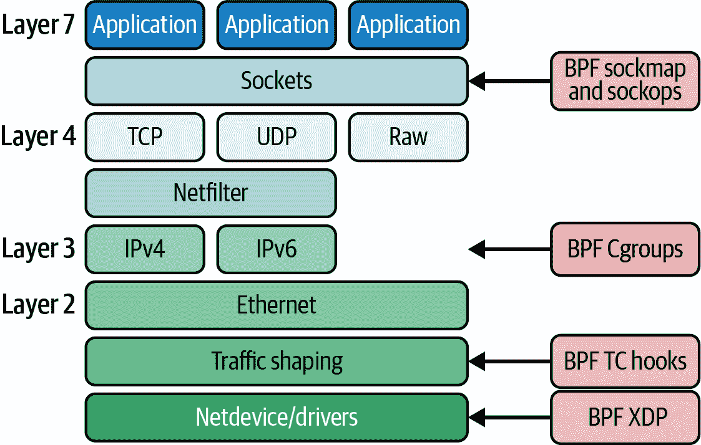

# 第七章：eBPF 程序和附着类型

在前面的章节中，你看到了很多 eBPF 程序的例子，可能注意到它们附着在不同类型的事件上。我展示的一些例子附着在 kprobe 上，但在其他例子中，我展示了处理新到达的网络数据包的 XDP 程序。这些只是内核中许多附着点中的两个。在本章中，我们将深入探讨不同的程序类型以及它们如何附着到不同的事件上。

###### 注意

你可以使用 [*github.com/lizrice/learning-ebpf*](https://github.com/lizrice/learning-ebpf) 上的代码和指导来构建和运行本章的示例。本章的代码位于 *chapter7* 目录中。

在撰写本文时，一些示例在 ARM 处理器上不受支持。请查看 *chapter7* 目录下的 *README* 文件以获取更多详细信息和建议。

目前在 [*uapi/linux/bpf.h*](https://oreil.ly/6dNIW) 中列出了大约 30 种程序类型，以及超过 40 种附着类型。附着类型更具体地定义了程序附着的位置；对于许多程序类型，附着类型可以从程序类型推断出来，但某些程序类型可以附着到内核中多个不同的点，因此还必须指定附着类型。

如你所知，本书不是一本参考手册，因此我不会详细介绍每一种 eBPF 程序类型。不过，在你阅读本书时，很可能已经新增了新的类型！

# 程序上下文参数

所有 eBPF 程序都需要一个指针类型的上下文参数，但它所指向的结构取决于触发它的事件类型。eBPF 程序员需要编写能够接受适当类型上下文的程序；如果事件是跟踪点，那么假装上下文参数指向网络数据包是没有意义的。定义不同类型的程序允许验证器确保上下文信息被适当处理，并强制执行关于哪些辅助函数是允许的规则。

###### 注意

要深入了解传递给不同 BPF 程序类型的上下文数据的详细信息，请查看 Alan Maguire 在 Oracle 博客上的[这篇文章](https://oreil.ly/6dNIW)。

# 辅助函数和返回代码

如前一章所示，验证器检查程序使用的所有辅助函数是否与其程序类型兼容。前一章的示例表明，在 XDP 程序中不允许使用 `bpf_get_current_pid_tgid()` 辅助函数。在接收数据包并触发 XDP 钩子时，并没有涉及用户空间的进程或线程，因此在这种情况下调用获取当前进程和线程 ID 的函数是没有意义的。

程序类型还确定了程序的返回代码的含义。再以 XDP 为例，返回代码告诉内核在 eBPF 程序完成处理后应该如何处理数据包——包括传递到网络堆栈、丢弃或重定向到另一个接口。当 eBPF 程序由于某种情况，比如命中特定的 tracepoint 时，这些返回代码就没有意义了，因为这时候没有涉及到网络数据包。

[助手函数的 man 页面](https://oreil.ly/e8K73)（带有合理的免责声明，由于 BPF 子系统的持续开发，该页面可能不完整）。

您可以使用`bpftool feature`命令获取您内核版本中每种程序类型可用的助手函数列表。该命令显示系统配置，并列出所有可用的程序类型和映射类型，甚至列出了每种程序类型支持的所有助手函数。

助手函数被视为*UAPI*的一部分，即 Linux 内核的外部稳定接口。因此，一旦在内核中定义了助手函数，即使内核的内部函数和数据结构可能会发生变化，助手函数也不应该在将来发生变化。

尽管内核版本之间可能发生变化，但 eBPF 程序员需要能够访问一些内部函数。这可以通过称为*BPF 内核函数*或[*kfuncs*](https://oreil.ly/gKSEx)*.*的机制来实现。

# Kfuncs

Kfuncs 允许将内部内核函数注册到 BPF 子系统中，以便验证器允许它们从 eBPF 程序中调用。对于每种允许调用特定 kfunc 的 eBPF 程序类型都有一个注册。

与助手函数不同，kfuncs 不提供兼容性保证，因此 eBPF 程序员必须考虑内核版本之间的变化可能性。

有一组[“核心”BPF kfuncs](https://oreil.ly/06qoi)，目前包括允许 eBPF 程序获取和释放任务及 cgroup 内核引用的函数。

总结一下，eBPF 程序的类型决定了它可以附加到哪些事件，从而定义了它接收的上下文信息的类型。程序类型还定义了它可以调用的助手函数和 kfuncs 集合。

程序类型通常分为两类：跟踪（或 perf）程序类型和与网络相关的程序类型。我们来看一些例子。

# 跟踪

附加到 kprobes、tracepoints、原始 tracepoints、fentry/fexit probes 和性能事件的程序，都旨在为内核中的 eBPF 程序提供一种有效的方式，将关于事件的跟踪信息报告到用户空间。这些与跟踪相关的类型并不预期会影响内核对它们附加的事件的响应方式（尽管正如你在 第九章 中看到的，这方面确实有一些创新！）。

这些有时被称为“与性能相关的”程序。例如，`bpftool perf` 子命令允许你查看附加到类似性能事件的程序：

```
$ sudo bpftool perf show
pid 232272  fd 16: prog_id 392  kprobe  func __x64_sys_execve  offset 0
pid 232272  fd 17: prog_id 394  kprobe  func do_execve  offset 0
pid 232272  fd 19: prog_id 396  tracepoint  sys_enter_execve
pid 232272  fd 20: prog_id 397  raw_tracepoint  sched_process_exec
pid 232272  fd 21: prog_id 398  raw_tracepoint  sched_process_exec
```

上述输出是我在 *chapter7* 目录中运行 *hello.bpf.c* 文件中的示例代码时看到的。这些代码附加到与 `execve()` 相关的各种事件，我将在本节中讨论所有这些类型，但作为概述，这些程序包括：

+   一个附加到 `execve()` 系统调用入口点的 kprobe。

+   一个附加到内核函数 `do_execve()` 的 kprobe。

+   一个放置在 `execve()` 系统调用入口处的 tracepoint。

+   在处理 `execve()` 过程中调用的两个原始 tracepoint 的版本。你将在本节中看到，其中一个是启用了 BTF 的版本。

要使用与跟踪相关的 eBPF 程序类型，你需要 `CAP_PERFMON` 和 `CAP_BPF` 或 `CAP_SYS_ADMIN` 权限。

## Kprobes 和 Kretprobes

我在 第一章 中讨论了 kprobes 的概念。你几乎可以将 kprobe 程序附加到内核的任何位置。^(1) 通常，它们使用 kprobes 附加到函数的入口点，使用 kretprobes 附加到函数的出口点，但你也可以使用 kprobes 附加到函数入口后指定偏移量处的指令。如果你选择这样做，^(2) 你需要确信你运行的内核版本确实有你想要附加到的指令！附加到内核函数的入口和出口点可能相对稳定，但任意代码行可能会在不同版本之间轻易修改。

###### 注意

在 `bpftool perf list` 的示例输出中，你可以看到两个 kprobe 的偏移量都为 0。

当内核编译时，也有可能编译器选择“内联”任何给定的内核函数；也就是说，而不是从调用函数处跳转，编译器可能会生成机器代码来实现函数在调用函数内部的操作。如果一个函数被内联了，你的 eBPF 程序就无法附加到 kprobe 的入口点。

### 附加 kprobes 到系统调用入口点

本章的第一个示例 eBPF 程序称为 `kprobe_sys_execve`，它是附加到 `execve()` 系统调用的 kprobe。该函数及其段定义如下：

```
SEC("ksyscall/execve")
int BPF_KPROBE_SYSCALL(kprobe_sys_execve, char *pathname)
```

这与你在第五章中看到的内容相同。

附加到系统调用的一个原因是它们是稳定的接口，在内核版本之间不会改变（跟踪点也是如此，我们马上就会讲到）。然而，出于详细的安全工具原因，不应依赖于系统调用 kprobes，我将在第九章中详细讨论。

### 将 kprobes 附加到其他内核函数

您可以找到很多例子，eBPF 基础工具使用 kprobes 附加到系统调用，但正如前面提到的，kprobes 也可以附加到内核中任何非内联函数。我在*hello.bpf.c*中提供了一个示例，它将 kprobe 附加到函数`do_execve()`，并且定义如下：

```
SEC("kprobe/do_execve")
int BPF_KPROBE(kprobe_do_execve, struct filename *filename)
```

因为`do_execve()`不是一个系统调用，所以这与前面的例子有一些区别：

+   SEC 名称的格式与附加到系统调用入口点的先前版本相同，但无需定义特定于平台的变体，因为像大多数内核函数一样，`do_execve()`对所有平台都是通用的。

+   我使用了`BPF_KPROBE`宏而不是`BPF_KPROBE_SYSCALL`。意图完全相同，只是后者处理系统调用参数。

+   另一个重要的区别是系统调用的`pathname`参数是一个指向字符串的指针`(char *)`，但对于这个函数，该参数称为`filename`，它是指向内核中使用的数据结构`struct filename`的指针。

你可能想知道我是如何知道要为这个参数使用这种类型的。我会给你看。内核中的`do_execve()`函数具有以下签名：

```
int `do_execve`(struct `filename` *`filename`,
    const char `__user` *const `__user` *__argv,
    const char `__user` *const `__user` *__envp)
```

我选择忽略`do_execve()`的参数`__argv`和`__envp`，仅声明`filename`参数，使用类型`struct filename *`以匹配内核函数的定义。鉴于参数按顺序排列在内存中的方式，忽略最后的*n*个参数是可以的，但如果要使用后面的参数，则不能忽略列表中较早的参数。

这个`filename`结构在内核内部定义，这说明了 eBPF 编程是内核编程的一部分：我不得不查找`do_execve()`的定义以找到其参数的定义，以及`struct filename`的定义。即将运行的可执行文件的名称由`filename->name`指向。在示例代码中，我使用以下代码行检索此名称：

```
const char *name = BPF_CORE_READ(filename, name);
bpf_probe_read_kernel(&data.command, sizeof(data.command), name);
```

因此，总结一下：系统调用 kprobe 的上下文参数是一个表示用户空间传递给系统调用的值的结构体。“常规”（非系统调用）kprobe 的上下文参数是一个表示由调用它的内核代码传递给被调用函数的参数的结构体，因此结构体取决于函数定义。

Kretprobes 与 kprobes 非常相似，不同之处在于它们在函数返回时触发，并且可以访问返回值而不是参数。

如果您正在运行在最新内核上，那么 kprobes 和 kretprobes 是连接到内核函数的合理方式，但是如果您要考虑的是较新的选项，则有一个新的选项。

## Fentry/Fexit

在内核版本 5.5 引入了一种更高效的机制，用于跟踪进入和退出内核函数的想法与*x86 处理器上的 BPF 跳板*一起引入（ARM 处理器上的 BPF 跳板支持直到 Linux 6.0 才到来）。如果您使用的是足够新的内核，fentry/fexit 现在是跟踪内核函数进入或退出的首选方法。您可以在 kprobe 或 fentry 类型程序中编写相同的代码。

在*chapter7/hello.bpf.c*中有一个名为`fentry_execve()`的示例 fentry 程序。我使用*libbpf*的宏`BPF_PROG`声明了这个 kprobe 的 eBPF 程序，这是另一个方便的包装器，提供了对类型化参数的访问，而不是通用的上下文指针，但是此版本用于 fentry、fexit 和 tracepoint 程序类型。定义如下：

```
SEC("fentry/do_execve")
int BPF_PROG(fentry_execve, struct filename *filename)
```

部分名称告诉*libbpf*在`d⁠o⁠_​e⁠x⁠e⁠c⁠v⁠e⁠(⁠)`内核函数的开始处附加 fentry 挂钩。就像 kprobe 示例中一样，上下文参数反映了您想要附加此 eBPF 程序的内核函数传递的参数。

Fentry 和 fexit 附加点的设计目的是比 kprobes 更高效，但是当您想在函数结束时生成事件时，还有另一个优势：fexit 挂钩可以访问函数的输入参数，而 kretprobe 则不能。您可以在[*libbpf-bootstrap*的示例](https://oreil.ly/6HDh_)中看到一个例子。*kprobe.bpf.c*和*fentry.bpf.c*是钩入`do_unlinkat()`内核函数的等效示例。附加到 kretprobe 的 eBPF 程序具有以下签名：

```
SEC("kretprobe/do_unlinkat")
int BPF_KRETPROBE(do_unlinkat_exit, long ret)
```

`BPF_KRETPROBE`宏扩展以在从`do_unlinkat()`退出时创建一个 kretprobe 程序。eBPF 程序仅接收`ret`参数，该参数保存了从`do_unlinkat()`返回的值。与 fexit 版本进行比较：

```
SEC("fexit/do_unlinkat")
int BPF_PROG(do_unlinkat_exit, int dfd, struct filename *name, long ret)
```

在这个版本中，程序不仅可以访问返回值`ret`，还可以访问传递给`do_unlinkat()`的输入参数，这些参数是`dfd`和`name`。

## Tracepoints

[Tracepoints](https://oreil.ly/yXk_L)是内核代码中标记的位置（我们稍后在本章讨论用户空间 tracepoints）。它们并不专属于 eBPF，并且长期以来已被用于生成内核跟踪输出并被诸如[SystemTap](https://oreil.ly/bLmQL)之类的工具使用。与使用 kprobes 连接到任意指令不同，tracepoints 在内核发布之间是稳定的（尽管旧内核可能没有新增到新内核中的完整 tracepoint 集）。

您可以通过查看*/sys/kernel/tracing/available_events*来查看内核上可用的跟踪子系统，如下所示：

```
$ cat /sys/kernel/tracing/available_events 
tls:tls_device_offload_set
tls:tls_device_decrypted
...
syscalls:sys_exit_execveat
syscalls:sys_enter_execveat
syscalls:sys_exit_execve
syscalls:sys_enter_execve
...
```

我的 5.15 内核版本在此列表中定义了超过 1,400 个追踪点。追踪点 eBPF 程序的部分定义应该匹配其中的一个项目，以便*libbpf*可以自动将其附加到追踪点上。定义的形式为`SEC("tp/tracing subsystem/tracepoint name")`。

您可以在*chapter7/hello.bpf.c*文件中找到一个示例，匹配`syscalls:sys_enter_execve`追踪点，当内核开始处理`execve()`调用时就会触发。该部分定义告诉*libbpf*这是一个追踪点程序，并且它应该附加在哪里，就像这样：

```
SEC("tp/syscalls/sys_enter_execve")
```

针对追踪点的上下文参数怎么样呢？稍后我将来详细介绍，BTF 可以在这里帮助我们，但首先让我们考虑当 BTF 不可用时需要什么。每个追踪点都有一个格式，描述从中追踪出的字段。举个例子，这是`execve()`系统调用进入时的追踪点格式：

```
$ cat /sys/kernel/tracing/events/syscalls/sys_enter_execve/format
name: sys_enter_execve
ID: 622
format:
  field:unsigned short common_type;         offset:0;  size:2; signed:0;
  field:unsigned char common_flags;         offset:2;  size:1; signed:0;
  field:unsigned char common_preempt_count; offset:3;  size:1; signed:0;
  field:int common_pid;                     offset:4;  size:4; signed:1;

  field:int __syscall_nr;                   offset:8;  size:4; signed:1;
  field:const char * filename;              offset:16; size:8; signed:0;
  field:const char *const * argv;           offset:24; size:8; signed:0;
  field:const char *const * envp;           offset:32; size:8; signed:0;

print fmt: "filename: 0x%08lx, argv: 0x%08lx, envp: 0x%08lx", 
((unsigned long)(REC->filename)), ((unsigned long)(REC->argv)), 
((unsigned long)(REC->envp))
```

我使用这些信息在*chapter7/hello.bpf.c*中定义了一个匹配的结构，称为`my_syscalls_enter_execve`：

```
struct my_syscalls_enter_execve {
   unsigned short common_type;
   unsigned char common_flags;
   unsigned char common_preempt_count;
   int common_pid;

   long syscall_nr;
   long filename_ptr;
   long argv_ptr;
   long envp_ptr;
};
```

eBPF 程序不允许访问这四个字段中的前四个。如果尝试访问它们，程序将因为`invalid bpf_context access`错误而验证失败。

我的示例 eBPF 程序连接到此追踪点时，可以使用指向此类型的指针作为其上下文参数，如下所示：

```
int tp_sys_enter_execve(struct my_syscalls_enter_execve *ctx) {
```

然后，您可以访问此结构的内容。例如，您可以获取文件名指针如下：

```
bpf_probe_read_user_str(&data.command, sizeof(data.command), ctx->filename_ptr);
```

当您使用追踪点程序类型时，传递给 eBPF 程序的结构体已经从一组原始参数映射而来。为了提高性能，您可以直接访问这些原始参数，使用原始追踪点 eBPF 程序类型。该部分定义应该以`raw_tp`（或`raw_tracepoint`）开头，而不是`tp`。您需要将这些参数从`__u64`转换为追踪点结构体使用的任何类型（当追踪点是系统调用的入口时，这些参数依赖于芯片架构）。

## 启用了 BTF 的追踪点

在前面的示例中，我编写了一个名为`my_syscalls_enter_execve`的结构，来定义我的 eBPF 程序的上下文参数。但是，当您在您的 eBPF 代码中定义一个结构或解析原始参数时，存在代码可能与其运行的内核不匹配的风险。好消息是，您在第五章中遇到的 BTF 也解决了这个问题。

使用 BTF 支持时，在*vmlinux.h*中将定义一个与传递给追踪点 eBPF 程序的上下文结构匹配的结构。您的 eBPF 程序应该使用部分定义`SEC("tp_btf/*tracepoint name*")`，其中追踪点名称是*sys/kernel/tracing/available_events*中列出的可用事件之一。在*chapter7/hello.bpf.c*中的示例程序如下：

```
SEC("tp_btf/sched_process_exec")
int handle_exec(struct trace_event_raw_sched_process_exec *ctx)
```

正如您所见，结构名称与追踪点名称匹配，并且前缀为`trace_event_raw_`。

## 用户空间附件

到目前为止，我展示了 eBPF 程序附加到内核源代码中定义的事件的示例。在用户空间代码中也有类似的附加点：uprobes 和 uretprobes 用于附加到用户空间函数的入口和出口，以及用户静态定义的跟踪点（USDTs）用于附加到应用程序代码或用户空间库中指定的跟踪点。所有这些都使用 `BPF_PROG_TYPE_KPROBE` 程序类型。

###### 注意

有许多公开的示例程序附加到用户空间事件。以下是来自 BCC 项目的一些示例：

+   [bashreadline](https://oreil.ly/gDkaQ) 和 [funclatency 工具](https://oreil.ly/zLT54) 附加到 `uretprobe`。

+   [BCC 中的 USDT 示例](https://oreil.ly/o894f)。

如果您使用 *libbpf*，`SEC()` 宏可以让您定义这些用户空间探针的自动附加点。您可以在 [*libbpf* 文档](https://oreil.ly/o0CBQ) 中找到所需的节名称格式。例如，要将 uprobe 附加到 OpenSSL 中 `SSL_write()` 函数的开头，您需要使用以下定义的 eBPF 程序节：

```
SEC("uprobe/usr/lib/aarch64-linux-gnu/libssl.so.3/SSL_write")
```

在工具化用户空间代码时，需要注意一些要点：

+   请注意，此示例中共享库的路径是特定于架构的，因此您可能需要相应的架构特定定义。

+   除非您控制运行代码的机器，否则无法确定安装了哪些用户空间库和应用程序。

+   一个应用程序可以作为一个独立的二进制文件构建，因此它不会触发你可能在共享库中附加的任何探针。

+   容器通常运行在自己的文件系统副本上，并安装了自己的依赖项集。容器使用的共享库路径与主机上的共享库路径不同。

+   您的 eBPF 程序可能需要了解应用程序的编程语言。例如，在 C 中，函数的参数通常使用寄存器传递，但在 Go 中则使用堆栈，^(3) 因此保存寄存器信息的 `pt_args` 结构可能不太有用。

也就是说，有许多有用的工具可以使用 eBPF 为用户空间应用程序进行工具化。例如，您可以钩入 SSL 库以跟踪加密信息的解密版本 —— 我们将在下一章节详细探讨这一点。另一个例子是连续分析您的应用程序，使用诸如 [Parca](https://www.parca.dev) 等工具。

## LSM

`BPF_PROG_TYPE_LSM` 程序附加到 *Linux Security Module (LSM) API*，这是内核中的一个稳定接口，最初用于内核模块以强制执行安全策略。正如您将在 第九章 中详细讨论的那样，现在 eBPF 安全工具也可以使用这个接口。

`BPF_PROG_TYPE_LSM` 程序通过 `bpf(BPF_RAW_TRACEPOINT_OPEN)` 进行挂载，并且在很多方面它们被视为跟踪程序。`BPF_PROG_TYPE_LSM` 程序的一个有趣特性是返回值会影响内核的行为方式。非零的返回码表示安全检查未通过，因此内核不会继续完成所请求的操作。这与与性能相关的程序类型有显著不同，后者会忽略返回码。

###### 注意

Linux 内核文档涵盖[LSM BPF 程序](https://oreil.ly/vcPHY)。

LSM 程序类型并非在安全性方面扮演的唯一角色。您将在下一节中看到许多与网络相关的程序类型，这些程序类型可以用于网络安全，允许或拒绝网络流量或与网络相关的操作。在第 9 章中，您还将看到更多关于 eBPF 用于安全目的的内容。

到目前为止，在本章中，您已经看到了一组内核和用户空间跟踪程序类型，它们能够实现对整个系统的可见性。接下来要考虑的一组 eBPF 程序类型是让我们能够钩入网络堆栈的程序类型，不仅可以观察数据的传输，还可以影响内核处理发送和接收数据的方式。

# 网络

有许多不同的 eBPF 程序类型，旨在处理网络消息，当它们通过网络堆栈中的各个点时。图 7-1 展示了一些常用程序类型的挂载点。所有这些程序类型都需要 `CAP_NET_ADMIN` 和 `CAP_BPF`，或者 `CAP_SYS_ADMIN` 权限才能允许。

传递给这些程序类型的上下文是相关网络消息，尽管结构类型取决于内核在网络堆栈相关点处的数据。在堆栈底部，数据以 Layer 2 网络数据包的形式保存，这些数据包基本上是一系列即将或已经准备好通过“电线”传输的字节。在堆栈顶部，应用程序使用套接字，并且内核创建套接字缓冲区来处理从这些套接字发送和接收的数据。



###### 图 7-1\. BPF 程序类型钩入网络堆栈中的各个点

###### 注意

网络层模型超出了本书的范围，但它在许多其他书籍、文章和培训课程中有所涵盖。我在[*Container Security*](https://www.oreilly.com/library/view/container-security/9781492056690/)（O’Reilly）的第 10 章中讨论过它。对于本书的目的，知道 Layer 7 涵盖供应用程序使用的格式，如 HTTP、DNS 或 gRPC；TCP 位于 Layer 4；IP 位于 Layer 3；以太网和 WiFi 位于 Layer 2 是足够的。网络堆栈的一个作用是在这些不同格式之间转换消息。

网络程序类型与本章前面讨论的跟踪相关类型之间的一个重要区别在于，它们通常旨在允许定制网络行为。这涉及两个主要特点：

1.  使用 eBPF 程序的返回代码告知内核如何处理网络数据包——这可能包括像往常一样处理、丢弃或重定向到不同的目的地。

1.  允许 eBPF 程序修改网络数据包、套接字配置参数等等

你将在下一章看到这些特征如何用于构建强大的网络功能的一些示例，但现在，这里是 eBPF 程序类型的概述。

## 套接字

在栈的顶部，一部分与套接字及套接字操作相关的网络程序类型：

+   `BPF_PROG_TYPE_SOCKET_FILTER`是添加到内核中的第一个程序类型。你可能从名称中猜到了它用于套接字过滤，但不那么明显的是，这并不意味着过滤应用程序发送或接收的数据。它用于过滤可以发送到像 tcpdump 这样的观测工具的套接字数据的*副本*。

+   套接字是特定于第 4 层（TCP）连接的。`BPF_PROG_TYPE_SOCK_OPS`允许 eBPF 程序拦截发生在套接字上的各种操作和动作，并为该套接字设置参数，如 TCP 超时值。套接字仅存在于连接的端点上，而不在它们可能经过的任何中间盒上。

+   `BPF_PROG_TYPE_SK_SKB`程序与一种特殊的映射类型结合使用，该映射类型保存了一组引用套接字，以提供所谓的[*sockmap*操作](https://oreil.ly/0Enuo)：将流量重定向到套接字层的不同目的地。

## 流量控制

在网络栈的更深层次是“TC”或流量控制。Linux 内核中有一个与 TC 相关的完整子系统，查看[`tc`命令的 man 页面](https://oreil.ly/kfyg5)将让你了解其复杂性以及在计算中拥有深层灵活性和配置方式的重要性。

eBPF 程序可以附加以为网络数据包提供自定义过滤器和分类器，用于入口和出口流量。这是 Cilium 项目的构建块之一，我将在下一章节中介绍一些示例。如果你等不及，可以在[Quentin Monnet 的博客](https://oreil.ly/heQ2D)上找到一些很好的例子。这可以通过编程方式实现，但你也可以选择使用`tc`命令来操作这些类型的 eBPF 程序。

## XDP

在第三章中简要介绍了 XDP（eXpress 数据路径）eBPF 程序。在那个例子中，我加载了 eBPF 程序，并使用以下命令将其附加到`eth0`接口：

```
bpftool prog load hello.bpf.o /sys/fs/bpf/hello
bpftool net attach xdp id 540 dev eth0
```

值得注意的是，XDP 程序附加到特定的接口（或虚拟接口），您很可能会在不同的接口上附加不同的 XDP 程序。在第八章中，您将更多地了解 XDP 程序如何被卸载到网络卡或由网络驱动程序执行的内容。

XDP 程序是可以使用 Linux 网络实用程序管理的另一个示例—在这种情况下，使用[iproute2 的 ip 的 link 子命令](https://oreil.ly/8Isau)。加载并附加程序到 `eth0` 的大致等效命令如下：

```
$ ip link set dev eth0 xdp obj hello.bpf.o sec xdp
```

此命令从 `hello.bpf.o` 对象读取标记为 `xdp` 部分的 eBPF 程序，并将其附加到 `eth0` 网络接口。此接口的 `ip link show` 命令现在包含有关附加到其上的 XDP 程序的一些信息：

```
2: eth0: <BROADCAST,MULTICAST,UP,LOWER_UP> mtu 1500 xdpgeneric qdisc fq_codel
state UP mode DEFAULT group default qlen 1000
    link/ether 52:55:55:3a:1b:a2 brd ff:ff:ff:ff:ff:ff
    prog/xdp id 1255 tag 9d0e949f89f1a82c jited
```

使用 `ip link` 删除 XDP 程序可以像这样进行：

```
$ ip link set dev eth0 xdp off
```

在下一章节中，您将看到更多关于 XDP 程序及其应用的内容。

## 流分析器

流分析器在网络堆栈的各个点上用于从数据包头部提取详细信息。类型为 `BPF_PROG_TYPE_FLOW_DISSECTOR` 的 eBPF 程序可以实现自定义数据包解析。在这篇 LWN 文章中有一篇关于[使用 BPF 编写网络流分析器](https://oreil.ly/nFKLV)的详细介绍。

## 轻量级隧道

`BPF_PROG_TYPE_LWT_*` 程序类型系列可用于在 eBPF 程序中实现网络封装。这些程序类型也可以使用 `ip` 命令进行操作，但这次是涉及到 `route` 子命令。在实践中，这些用法并不常见。

## Cgroups

eBPF 程序可以附加到 cgroups（即“控制组”）。*Cgroups* 是 Linux 内核中的一个概念，它限制了给定进程或一组进程可以访问的资源集。Cgroups 是隔离一个容器（或一个 Kubernetes Pod）与另一个容器之间的机制之一。将 eBPF 程序附加到 cgroup 允许对该 cgroup 的进程应用仅适用于其自身的自定义行为。所有进程都与一个 cgroup 相关联，包括没有运行在容器内的进程。

还有几种与 cgroup 相关的程序类型，以及更多它们可以附加的钩子。至少在撰写本文时，它们几乎全部与网络相关，尽管也有一个 `BPF_CGROUP_SYSCTL` 程序类型，可以附加到影响特定 cgroup 的 sysctl 命令上。

例如，与 cgroups 特定的与套接字相关的程序类型有关 `BPF_PROG_TYPE_CGROUP_SOCK` 和 `BPF_PROG_TYPE_CGROUP_SKB`。eBPF 程序可以确定特定 cgroup 是否被允许执行请求的套接字操作或数据传输。这对于网络安全策略执行（将在下一章节中介绍）非常有用。套接字程序还可以欺骗调用进程，使其认为它们正在连接到特定的目标地址。

## 红外控制器

类型为 [BPF_PROG_TYPE_LIRC_MODE2](https://oreil.ly/AwG1C) 的程序可以附加到红外控制器设备的文件描述符上，提供红外协议的解码。在撰写本文时，此程序类型需要 `CAP_NET_ADMIN`，但我认为这说明了将程序类型分为跟踪相关和网络相关并不能完全表达 eBPF 可以解决的不同应用范围。

# BPF 附加类型

附加类型为程序在系统中附加位置提供了更精细的控制。对于某些程序类型，其与可以附加的挂接类型有一对一的关系，因此附加类型由程序类型隐含定义。例如，XDP 程序附加到网络堆栈中的 XDP 挂接点。对于少数程序类型，还必须指定附加类型。

附加类型涉及决定哪些辅助函数是有效的，它还在某些情况下限制对上下文信息的访问。本章早些时候有一个例子，在该例子中，验证器给出了 `invalid bpf_context access` 错误。

你还可以在内核函数 [bpf_prog_load_check_attach](https://oreil.ly/0LqCQ)（定义在 [*bpf/syscall.c*](https://oreil.ly/7OrYS) 中）中看到需要指定附加类型的程序类型，以及哪些附加类型是有效的。

例如，这里是检查 `CGROUP_SOCK` 程序附加类型的代码：

```
case `BPF_PROG_TYPE_CGROUP_SOCK`:
    `switch` (`expected_attach_type`) {
    case `BPF_CGROUP_INET_SOCK_CREATE`:
    case `BPF_CGROUP_INET_SOCK_RELEASE`:
    case `BPF_CGROUP_INET4_POST_BIND`:
    case `BPF_CGROUP_INET6_POST_BIND`:
        return 0;
    default:
        return -`EINVAL`;
    }
```

此程序类型可以附加在多个位置：在套接字创建时、在套接字释放时或在完成 IPv4 或 IPv6 中的绑定后。

另一个查找程序有效附加类型列表的地方是 [*libbpf* 文档](https://oreil.ly/jraLh)，你还将找到 *libbpf* 为每个程序和附加类型理解的章节名称。

# 总结

在本章中，你看到各种 eBPF 程序类型被用于附加到内核中的不同挂接点。如果你想编写响应特定事件的代码，你需要确定适合挂接到该事件的程序类型。传递到程序中的上下文取决于程序类型，而内核对程序的返回码也可能因其类型不同而有不同的响应。

本章的示例代码大多集中在与性能相关的（跟踪）事件上。在接下来的两章中，你将看到更多关于用于网络和安全应用的不同 eBPF 程序类型的详细信息。

# 练习

本章的示例代码包括 kprobe、fentry、tracepoint、raw tracepoint 和 BTF-enabled tracepoint 程序，它们都附加到相同系统调用的入口。正如你所知，eBPF 跟踪程序除了系统调用之外还可以附加到许多其他位置。

1.  运行示例代码时，使用 `strace` 来捕获 `bpf()` 系统调用，如下所示：

    ```
    strace -e bpf -o outfile ./hello
    ```

    这将记录每个 `bpf()` 系统调用的信息到名为 *outfile* 的文件中。查找文件中的 `BPF_PROG_LOAD` 指令，并查看 `prog_type` 文件在不同程序中的变化。您可以通过跟踪中的 `prog_name` 字段识别每个程序，并将其与 *chapter7/hello.bpf.c* 中的源代码匹配。

1.  *hello.c* 中的示例用户空间代码加载了 `hello.bpf.o` 中定义的所有程序对象。作为编写 *libbpf* 用户空间代码的练习，修改示例代码以加载并附加一个 eBPF 程序（选择您喜欢的任何一个），而不从 *hello.bpf.c* 中删除这些程序。

1.  编写一个 kprobe 和/或 fentry 程序，当调用其他内核函数时触发。您可以通过查看 */proc/kallsyms* 来找到您内核版本中可用的函数。

1.  编写一个常规、原始或启用了 BTF 的 tracepoint 程序，附加到其他内核 tracepoint 上。您可以在 `/sys/kernel/tracing/available_events` 中找到可用的 tracepoint。

1.  尝试将多个 XDP 程序附加到给定接口，并确认您无法这样做！您应该看到类似以下错误：

    ```
    libbpf: Kernel error message: XDP program already attached
    Error: interface xdpgeneric attach failed: Device or resource busy
    ```

^(1) 除了出于安全原因，在某些内核部分 kprobe 不被允许。这些列在 `/sys/kernel/debug/kprobes/blacklist` 中。

^(2) 我迄今为止看到的唯一示例是在 [cilium/ebpf 测试套件](https://oreil.ly/rL5E8) 中。

^(3) 直到 Go 版本 1.17，引入了新的基于寄存器的调用约定。尽管如此，我认为还将有使用旧版本构建的 Go 可执行文件在未来一段时间内继续流通。
