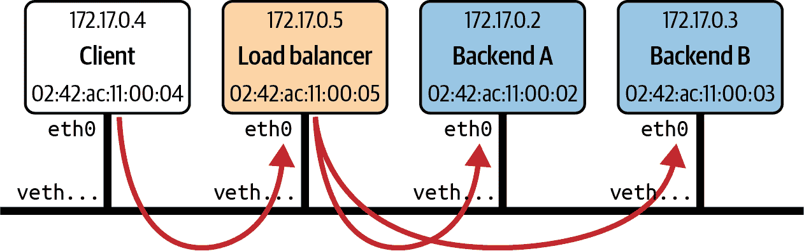
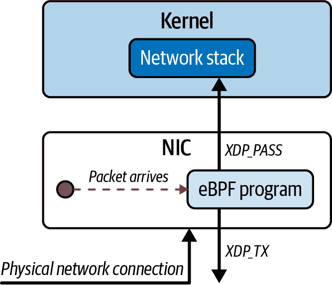
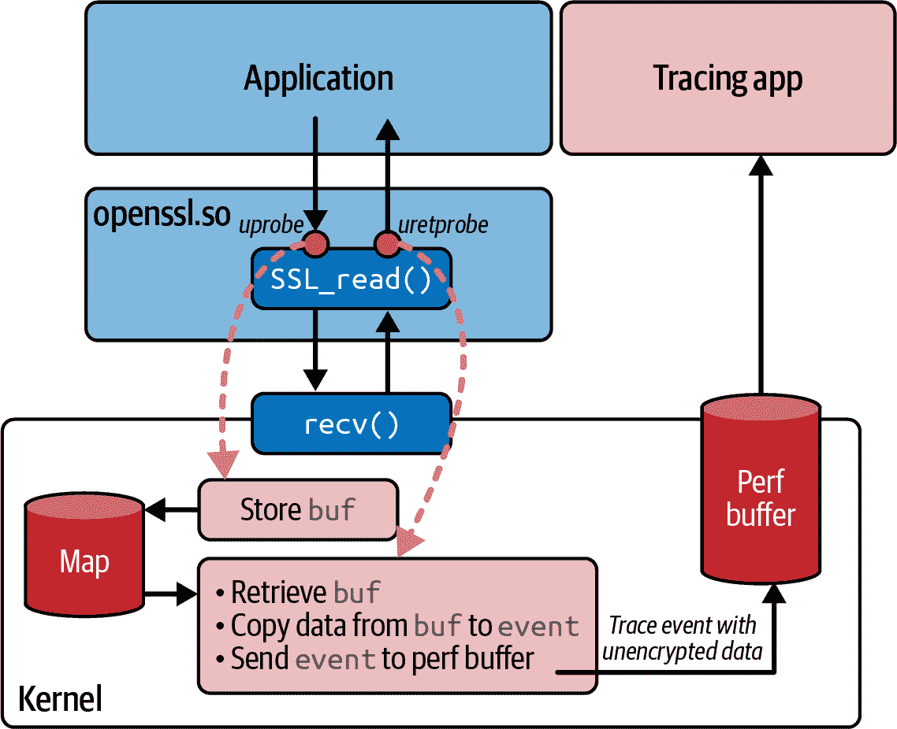

# 第八章：网络的 eBPF

正如您在第一章中看到的，eBPF 的动态特性允许我们定制内核的行为。在网络世界中，有许多取决于应用程序的理想行为。例如，电信运营商可能需要与 SRv6 等电信特定协议进行接口交互；Kubernetes 环境可能需要与传统应用程序集成；专用硬件负载均衡器可以被运行在通用硬件上的 XDP 程序所取代。eBPF 允许程序员构建网络功能以满足特定需求，而无需强加给所有上游内核用户。

基于 eBPF 的网络工具现在被广泛使用，并已被证明在大规模下非常有效。例如，CNCF 的[Cilium 项目](http://cilium.io)将 eBPF 用作 Kubernetes 网络、独立负载均衡等的平台，并且被云原生采用者在各种行业垂直领域广泛使用。¹ Meta 自 2017 年以来一直在大规模使用 eBPF——自 Facebook 以来的每个数据包都经过了 XDP 程序。另一个公开且超大规模的例子是 Cloudflare 使用 eBPF 进行 DDoS（分布式拒绝服务）防护。

这些是复杂的、可投入生产的解决方案，它们的细节远远超出了本书的范围，但通过阅读本章的示例，您可以感受到像这样的 eBPF 网络解决方案是如何构建的。

###### 注

本章的代码示例位于[*github.com/lizrice/learning-ebpf*](https://github.com/lizrice/learning-ebpf)存储库的*chapter8*目录中。

# 数据包丢弃

有几个网络安全功能涉及丢弃某些传入数据包并允许其他数据包。这些功能包括防火墙、DDoS 防护和减轻致命数据包漏洞：

+   防火墙涉及基于每个数据包的源和目标 IP 地址和/或端口号决定是否允许数据包通过。

+   DDoS 防护增加了一些复杂性，也许需要跟踪从特定来源到达的数据包的速率和/或检测数据包内容的某些特征，以确定攻击者或一组攻击者是否试图用流量淹没接口。

+   数据包致命漏洞是一类内核漏洞，内核在处理特定方式构造的数据包时无法安全处理。发送具有这种特定格式的数据包的攻击者可以利用这个漏洞，这可能导致内核崩溃。传统上，当发现这样的内核漏洞时，需要安装带有修复的新内核，这又需要机器停机。但是，可以动态安装检测并丢弃这些恶意数据包的 eBPF 程序，立即保护主机，而不影响机器上运行的任何应用程序。

这些功能的决策算法超出了本书的范围，但让我们探讨一下如何通过附加到网络接口的 XDP 挂钩的 eBPF 程序丢弃某些数据包，这是实现这些用例的基础。

## XDP 程序返回代码

XDP 程序是由网络数据包到达时触发的。程序检查数据包，当完成时，返回代码给出了一个*决定*，指示下一步该如何处理该数据包：

+   `XDP_PASS`表示数据包应该以正常方式发送到网络堆栈（如果没有 XDP 程序的话）。

+   `XDP_DROP`导致数据包立即被丢弃。

+   `XDP_TX`将数据包发送回到它到达的同一接口。

+   `XDP_REDIRECT`用于将数据包发送到不同的网络接口。

+   `XDP_ABORTED`导致数据包被丢弃，但其使用意味着错误情况或意外情况，而不是“正常”决定丢弃数据包。

对于一些用例（如防火墙），XDP 程序只需决定是传递数据包还是丢弃数据包。决定是否丢弃数据包的 XDP 程序概述如下：

```cpp
SEC("xdp")   
int hello(struct xdp_md *ctx) {   
    bool drop; `drop` `=` `<``examine` `packet` `and` `decide` `whether` `to` `drop` `it``>``;` ``if` `(``drop``)` 
        `return` `XDP_DROP``;` ``else` ``return` `XDP_PASS``;` ``}`````

```cpp

 ```XDP 程序还可以操作数据包内容，但我会在本章后面讨论这个问题。

每当入站网络数据包到达其所连接的接口时，XDP 程序就会被触发。`ctx`参数是指向`xdp_md`结构的指针，该结构保存了有关传入数据包的元数据。让我们看看如何使用这个结构来检查数据包的内容，以便做出判断。```cpp  ```## XDP 数据包解析

以下是`xdp_md`结构的定义：

```cpp
struct `xdp_md` {
    `__u32` data;
    `__u32` `data_end`;
    `__u32` `data_meta`;
    /* Below access go through struct xdp_rxq_info */
    `__u32` `ingress_ifindex`; /* rxq->dev->ifindex */
    `__u32` `rx_queue_index`;  /* rxq->queue_index  */

    `__u32` `egress_ifindex`;  /* txq->dev->ifindex */
};
```

不要被前三个字段的`__u32`类型所迷惑，因为它们实际上是指针。`data`字段指示数据包开始的内存位置，`data_end`显示数据包结束的位置。正如您在第六章中看到的，为了通过 eBPF 验证器，您必须明确检查对数据包内容的任何读取或写入是否在`data`到`data_end`范围内。

数据包之前的内存区域，即`data_meta`和`data`之间，用于存储有关此数据包的元数据。这可用于协调多个 eBPF 程序之间的协作，这些程序可能会在数据包通过堆栈的各个位置进行处理。

为了说明解析网络数据包的基础知识，示例代码中有一个名为`ping()`的 XDP 程序，它在检测到 ping（ICMP）数据包时会生成一行跟踪。以下是该程序的代码：

```cpp
SEC("xdp") `int` `ping``(``struct` `xdp_md` `*``ctx``)` `{` ``long` `protocol` `=` `lookup_protocol``(``ctx``);` ``if` `(``protocol` `==` `1``)` `// ICMP`
   `{` ``bpf_printk``(``"Hello ping"``);` ``}` ``return` `XDP_PASS``;` ``}``````cpp`
```

```cppYou can see this program in action by following these steps:

1.  Run `make` in the *chapter8* directory. This doesn’t just build the code; it also attaches the XDP program to the loopback interface (called `lo`).

2.  Run `ping localhost` in one terminal window.

3.  In another terminal window, watch the output generated in the trace pipe by running `cat /sys/kernel/tracing/trace_pipe`.

You should see two lines of trace being generated approximately every second, and they should look like this:

```

ping-26622   [000] d.s11 276880.862408: bpf_trace_printk: 你好 ping

ping-26622   [000] d.s11 276880.862459: bpf_trace_printk: 你好 ping

ping-26622   [000] d.s11 276881.889575: bpf_trace_printk: 你好 ping

ping-26622   [000] d.s11 276881.889676: bpf_trace_printk: 你好 ping

ping-26622   [000] d.s11 276882.910777: bpf_trace_printk: 你好 ping

ping-26622   [000] d.s11 276882.910930: bpf_trace_printk: 你好 ping

```cpp

There are two lines of trace per second because the loopback interface is receiving both the ping requests and the ping responses.

You can easily modify this code to drop ping packets by adding a line of code to return `XDP_DROP` when the protocol matches, like this:

```

if(protocol==1)// ICMP

{ `bpf_printk``(``"Hello ping"``);` ``return``XDP_DROP``;` ``}` ``return``XDP_PASS``;```cpp`
```

```cppIf you try this, you’ll see that output resembling the following is only generated in the trace output once per second:

```

ping-26639   [002] d.s11 277050.589356: bpf_trace_printk: 你好 ping

ping-26639   [002] d.s11 277051.615329: bpf_trace_printk: 你好 ping

ping-26639   [002] d.s11 277052.637708: bpf_trace_printk: 你好 ping

```cpp

The loopback interface receives a ping request, and the XDP program drops it, so the request never gets far enough through the network stack to elicit a response.

Most of the work in this XDP program is being done in a function called `lookup_protocol()` that determines the Layer 4 protocol type. It’s just an example, not a production-quality implementation of parsing a network packet! But it’s sufficient to give you an idea of how parsing in eBPF works.

The network packet that has been received consists of a string of bytes that are laid out as shown in [Figure 8-1](#layout_of_an_ip_network_packetcomma_sta).


###### Figure 8-1\. Layout of an IP network packet, starting with an Ethernet header, followed by an IP header, and then the Layer 4 data

The `lookup_protocol()` function takes the `ctx` structure that holds information about where this network packet is in memory and returns the protocol type that it finds in the IP header. The code is as follows:

```

unsignedcharlookup_protocol(structxdp_md*ctx){unsignedcharprotocol=0;void*data=(void*)(long)ctx->data;①void*data_end=(void*)(long)ctx->data_end;structethhdr*eth=data;②if(data+sizeof(structethhdr)>data_end)③return0;// 检查是否为 IP 数据包

if(bpf_ntohs(eth->h_proto)==ETH_P_IP)④{// 返回此数据包的协议}}

// 1 = ICMP

// 6 = TCP

// 17 = UDP

structiphdr*iph=data+sizeof(structethhdr);⑤if(data+sizeof(structethhdr)+sizeof(structiphdr)<=data_end)// ⑥protocol=iph->protocol;// ⑦}returnprotocol;}

```cpp

[// ①](#code_id_8_1)

The local variables `data` and `data_end` point to the start and end of the network packet.

[// ②](#code_id_8_2)

The network packet should start with an Ethernet header.

[// ③](#code_id_8_3)

But you can’t simply assume this network packet is big enough to hold that Ethernet header! The verifier requires that you check this explicitly.

[// ④](#code_id_8_4)

The Ethernet header contains a 2-byte field that tells us the Layer 3 protocol.

[// ⑤](#code_id_8_5)

If the protocol type indicates that it’s an IP packet, the IP header immediately follows the Ethernet header.

[// ⑥](#code_id_8_6)

You can’t just assume there’s enough room for that IP header in the network packet. Again the verifier requires that you check explicitly.

[// ⑦](#code_id_8_7)

The IP header contains the protocol byte the function will return to its caller.

The `bpf_ntohs()` function used by this program ensures that the two bytes are in the order expected on this host. Network protocols are big-endian, but most processors are little-endian, meaning they hold multibyte values in a different order. This function converts (if necessary) from network ordering to host ordering. You should use this function whenever you extract a value from a field in a network packet that’s more than one byte long.

The simple example here shows how just a few lines of eBPF code can have a dramatic impact on networking functionality. It’s not hard to imagine how more complex rules about which packets to pass and which packets to drop could result in the features I described at the start of this section: firewalling, DDoS protection, and packet-of-death vulnerability mitigation. Now let’s consider how even more functionality can be provided given the power to modify network packets within eBPF programs.``````cpp```  ``# 负载均衡和转发

XDP 程序不仅限于检查数据包的内容。它们还可以修改数据包的内容。如果您想构建一个简单的负载均衡器，以便接收发送到特定 IP 地址的数据包，并将这些请求传递给能够满足请求的多个后端，那么就需要考虑其中的内容。

在 GitHub 存储库中有一个示例。这里的设置是一组运行在同一主机上的容器。有一个客户端、一个负载均衡器和两个后端，每个后端都在自己的容器中运行。如图 8-2 所示，负载均衡器接收来自客户端的流量，并将其转发到两个后端容器中的一个。



###### 图 8-2：示例负载均衡器设置

负载均衡功能被实现为一个附加到负载均衡器 eth0 网络接口的 XDP 程序。这个程序的返回代码是`XDP_TX`，表示数据包应该被发送回来自的接口。但在这之前，程序必须更新数据包头部中的地址信息。

尽管我认为这是一个很有用的学习练习，但这个示例代码离生产就非常非常远；例如，它使用了硬编码的地址，假设 IP 地址的确切设置如图 8-2 所示。它假设它将收到的 TCP 流量只是来自客户端的请求或者发往客户端的响应。它还通过利用 Docker 设置虚拟 MAC 地址的方式作弊，使用每个容器的 IP 地址作为每个容器的虚拟以太网接口的 MAC 地址的最后四个字节。从容器的角度来看，这个虚拟以太网接口被称为 eth0。

以下是示例负载均衡器代码中的 XDP 程序：

```# Load Balancing and Forwarding

XDP programs aren’t limited to inspecting the contents of a packet. They can also modify the packet’s contents. Let’s consider what’s involved if you want to build a simple load balancer that takes packets sent to a given IP address and fans those requests to a number of backends that can fulfill the request.

There’s an example of this in the GitHub repo.^([2](ch08.xhtml#ch08fn2)) The setup here is a set of containers that run on the same host. There’s a client, a load balancer, and two backends, each running in their own container. As illustrated in [Figure 8-2](#example_load_balancer_setup), the load balancer receives traffic from the client and forwards it to one of the two backend containers.


###### Figure 8-2\. Example load balancer setup

The load balancing function is implemented as an XDP program attached to the load balancer’s eth0 network interface. The return code from this program is `XDP_TX`, indicating that the packet should be sent back out of the interface it came in on. But before that happens, the program has to update the address information in the packet headers.

Although I think it’s useful as a learning exercise, this example code is very, very far from being production ready; for example, it uses hard-coded addresses that assume the exact setup of IP addresses shown in [Figure 8-2](#example_load_balancer_setup). It assumes that the only TCP traffic it will ever receive is requests from the client or responses to the client. It also cheats by taking advantage of the way Docker sets up virtual MAC addresses, using each container’s IP address as the last four bytes of the MAC address for the virtual Ethernet interface for each container. That virtual Ethernet interface is called eth0 from the perspective of the container.

Here’s the XDP program from the example load balancer code:

```cpp

①

这个函数的第一部分实际上与前面的例子几乎相同：它在数据包中定位以太网头部，然后是 IP 头部。

②

这次它只处理 TCP 数据包，将接收到的其他任何内容传递到堆栈上，就好像什么都没有发生过一样。

③

这里检查源 IP 地址。如果这个数据包不是来自客户端的，我会假设它是发往客户端的响应。

④

这段代码在后端 A 和 B 之间生成一个伪随机选择。

⑤

目标 IP 和 MAC 地址将被更新以匹配所选择的后端…

// ⑥

…或者如果这是来自后端的响应（如果不是来自客户端的话，这里是假设），目标 IP 和 MAC 地址将被更新以匹配客户端。

// ⑦

无论这个数据包去哪里，源地址都需要更新，以便看起来像是由负载均衡器发起的。

// ⑧

IP 头部包括对其内容计算的校验和，由于源和目标 IP 地址都已经被更新，校验和也需要被重新计算并替换在这个数据包中。

###### 注意

由于这是一本关于 eBPF 而不是网络的书，我没有深入探讨 IP 和 MAC 地址需要更新的原因，或者如果它们没有被更新会发生什么。如果你感兴趣，我在我的[eBPF 峰会演讲的 YouTube 视频](https://oreil.ly/mQxtT)中对此进行了更多的介绍，我最初是在那里编写了这个示例代码。

与前面的例子类似，Makefile 包括了指令，不仅构建代码，还使用`bpftool`将 XDP 程序加载并附加到接口上，就像这样：

```

[// ①](#code_id_8_8)

The first part of this function is practically the same as in the previous example: it locates the Ethernet header and then the IP header in the packet.

[// ②](#code_id_8_9)

This time it will process only TCP packets, passing anything else it receives on up the stack as if nothing had happened.

[// ③](#code_id_8_10)

Here the source IP address is checked. If this packet didn’t come from the client, I will assume it is a response going to the client.

[// ④](#code_id_8_11)

This code generates a pseudorandom choice between backends A and B.

[// ⑤](#code_id_8_12)

The destination IP and MAC addresses are updated to match whichever backend was chosen…

[// ⑥](#code_id_8_13)

…or if this is a response from a backend (which is the assumption here if it didn’t come from a client), the destination IP and MAC addresses are updated to match the client.

[// ⑦](#code_id_8_14)

Wherever this packet is going, the source addresses need to be updated so that it looks as though the packet originated from the load balancer.

[// ⑧](#code_id_8_15)

The IP header includes a checksum calculated over its contents, and since the source and destination IP addresses have both been updated, the checksum also needs to be recalculated and replaced in this packet.

###### Note

Since this is a book on eBPF and not networking, I haven’t delved into details such as why the IP and MAC addresses need to be updated or what happens if they aren’t. If you’re interested, I cover this some more in my [YouTube video of the eBPF Summit talk](https://oreil.ly/mQxtT) where I originally wrote this example code.

Much like the previous example, the Makefile includes instructions to not only build the code but also use `bpftool` to load and attach the XDP program to the interface, like this:

```cpp

这个`make`指令需要在负载均衡器容器*内部*运行，以便 eth0 对应其虚拟以太网接口。这导致一个有趣的问题：一个 eBPF 程序被加载到内核中，只有一个；然而附着点可能在特定的网络命名空间内，并且只在该网络命名空间内可见。³

# XDP 卸载

XDP 的想法源自一次对话，推测如果可以在网络卡上运行 eBPF 程序来在数据包到达内核网络堆栈之前做出决策，那将会有多么有用。⁴ 有一些网络接口卡支持完整的*XDP 卸载*功能，它们确实可以在自己的处理器上运行入站数据包的 eBPF 程序。这在图 8-3 中有所说明。



###### 图 8-3：支持 XDP 卸载的网络接口卡可以处理、丢弃和重传数据包，而无需主机 CPU 执行任何工作

这意味着被丢弃或重定向回同一物理接口的数据包——就像本章前面的数据包丢弃和负载均衡示例一样——从不会被主机的内核看到，并且主机机器上的 CPU 周期从未被用于处理它们，因为所有的工作都是在网络卡上完成的。

即使物理网络接口卡不支持完整的 XDP 卸载，许多网卡驱动程序支持 XDP 钩子，这最小化了 eBPF 程序处理数据包所需的内存复制。⁵

这可以带来显著的性能优势，并允许像负载均衡这样的功能在通用硬件上运行得非常高效。⁶

您已经看到了 XDP 如何用于处理入站网络数据包，尽快访问它们，因为它们到达机器。eBPF 也可以用于处理网络堆栈中的其他点的流量，无论流向如何。让我们继续思考一下附加在 TC 子系统中的 eBPF 程序。

# 流量控制（TC）

我在上一章中提到了流量控制。当网络数据包到达这一点时，它将以[`sk_buff`](https://oreil.ly/TKDCF)的形式存在于内核内存中。这是一个在整个内核网络堆栈中使用的数据结构。附加在 TC 子系统中的 eBPF 程序接收`sk_buff`结构的指针作为上下文参数。

###### 注意

你可能会想为什么 XDP 程序不也使用相同的结构来进行上下文。答案是 XDP 钩子发生在网络数据到达网络堆栈之前，也发生在`sk_buff`结构被设置之前。

TC 子系统旨在调节网络流量的调度。例如，您可能希望限制每个应用程序可用的带宽，以便它们都有公平的机会。但是，当您查看调度单个数据包时，“带宽”并不是一个非常有意义的术语，因为它用于发送或接收的平均数据量。给定的应用程序可能非常突发，或者另一个应用程序可能对网络延迟非常敏感，因此 TC 可以更精细地控制数据包的处理和优先级。⁷

eBPF 程序被引入这里是为了对 TC 中使用的算法进行自定义控制。但是，通过操纵、丢弃或重定向数据包的能力，附加在 TC 中的 eBPF 程序也可以用作复杂网络行为的构建模块。

堆栈中的给定网络数据流向两个方向之一：*入口*（从网络接口进入）或*出口*（向网络接口外发出）。eBPF 程序可以附加在任一方向，并且只会影响该方向的流量。与 XDP 不同，可以附加多个 eBPF 程序，这些程序将按顺序处理。

传统的流量控制分为*分类器*，根据某些规则对数据包进行分类，以及单独的*操作*，根据分类器的输出采取操作，并确定对数据包的处理方式。可以有一系列分类器，所有这些都被定义为*qdisc*或排队规则的一部分。

eBPF 程序被附加为分类器，但它们也可以在同一个程序中确定要采取的操作。操作由程序的返回代码指示（其值在*linux/pkt_cls.h*中定义）：

+   `TC_ACT_SHOT`告诉内核丢弃数据包。

+   `TC_ACT_UNSPEC`的行为就像 eBPF 程序没有运行在这个数据包上一样（因此它将被传递到序列中的下一个分类器，如果有的话）。

+   `TC_ACT_OK` 告诉内核将数据包传递给堆栈中的下一层。

+   `TC_ACT_REDIRECT` 将数据包发送到不同网络设备的入口或出口路径。

让我们看一些可以附加在 TC 中的简单程序的示例。第一个简单地生成一行跟踪，然后告诉内核丢弃数据包：

```

This `make` instruction needs to be run *inside* the load balancer container so that eth0 corresponds to its virtual Ethernet interface. This leads to an interesting point: an eBPF program is loaded into the kernel, of which there is only one; yet the attachment point may be within a particular network namespace and visible only within that network namespace.^([3](ch08.xhtml#ch08fn3))

# XDP Offloading

The idea for XDP originated from a conversation speculating how useful it would be if you could run eBPF programs on a network card to make decisions about individual packets before they even reach the kernel’s networking stack.^([4](ch08.xhtml#ch08fn4)) There are some network interface cards that support this full *XDP offload* capability where they can indeed run eBPF programs on inbound packets on their own processor. This is illustrated in [Figure 8-3](#network_interface_cards_that_support_xd).


###### Figure 8-3\. Network interface cards that support XDP offload can process, drop, and retransmit packets without any work required from the host CPU

This means a packet that gets dropped or redirected back out of the same physical interface—like the packet drop and load balancing examples earlier in this chapter—is never seen by the host’s kernel, and no CPU cycles on the host machine are ever spent processing them, as all the work is done on the network card.

Even if the physical network interface card doesn’t support full XDP offload, many NIC drivers support XDP hooks, which minimizes the memory copying required for an eBPF program to process a packet.^([5](ch08.xhtml#ch08fn5))

This can result in significant performance benefits and allows functionality like load balancing to run very efficiently on commodity hardware.^([6](ch08.xhtml#ch08fn6))

You’ve seen how XDP can be used to process inbound network packets, accessing them as soon as possible as they arrive on a machine. eBPF can also be used to process traffic at other points in the network stack, in whatever direction it is flowing. Let’s move on and think about eBPF programs attached within the TC subsystem.

# Traffic Control (TC)

I mentioned traffic control in the previous chapter. By the time a network packet reaches this point it will be in kernel memory in the form of an [`sk_buff`](https://oreil.ly/TKDCF). This is a data structure that’s used throughout the kernel’s network stack. eBPF programs attached within the TC subsystem receive a pointer to the `sk_buff` structure as the context parameter.

###### Note

You might be wondering why XDP programs don’t also use this same structure for their context. The answer is that the XDP hook happens before the network data reaches the network stack and before the `sk_buff` structure has been set up.

The TC subsystem is intended to regulate how network traffic is scheduled. For example, you might want to limit the bandwidth available to each application so that they all get a fair chance. But when you’re looking at scheduling individual packets, *bandwidth* isn’t a terribly meaningful term, as it’s used for the average amount of data being sent or received. A given application might be very bursty, or another application might be very sensitive to network latency, so TC gives much finer control over the way packets are handled and prioritized.^([7](ch08.xhtml#ch08fn7))

eBPF programs were introduced here to give custom control over the algorithms used within TC. But with the power to manipulate, drop, or redirect packets, eBPF programs attached within TC can also be used as the building blocks for complex network behaviors.

A given piece of network data in the stack flows in one of two directions: *ingress* (inbound from the network interface) or *egress* (outbound toward the network interface). eBPF programs can be attached in either direction and will affect traffic only in that direction. Unlike XDP, it’s possible to attach multiple eBPF programs that will be processed in sequence.

Traditional traffic control is split into *classifiers*, which classify packets based on some rule, and separate *actions*, which are taken based on the output from a classifier and determine what to do with a packet. There can be a series of classifiers, all defined as part of a *qdisc* or queuing discipline.

eBPF programs are attached as a classifier, but they can also determine what action to take within the same program. The action is indicated by the program’s return code (whose values are defined in *linux/pkt_cls.h*):

*   `TC_ACT_SHOT` tells the kernel to drop the packet.

*   `TC_ACT_UNSPEC` behaves as if the eBPF program hadn’t been run on this packet (so it would be passed to the next classifier in the sequence, if there is one).

*   `TC_ACT_OK` tells the kernel to pass the packet to the next layer in the stack.

*   `TC_ACT_REDIRECT` sends the packet to the ingress or egress path of a different network device.

Let’s take a look at a few simple examples of programs that can be attached within TC. The first simply generates a line of trace and then tells the kernel to drop the packet:

```cpp

```
```cpp 现在让我们考虑如何仅丢弃数据包的子集。此示例丢弃 ICMP（ping）请求数据包，与本章前面看到的 XDP 示例非常相似：

```Now let’s consider how to drop only a subset of packets. This example drops ICMP (ping) request packets and is very similar to the XDP example you saw earlier in this chapter:

```cpp``````cpp`````
```cpp

 ```The `sk_buff` structure has pointers to the start and end of the packet data, very much like the `xdp_md` structure, and packet parsing proceeds in very much the same way. Again, to pass verification you have to explicitly check that any access to data is within the range between `data` and `data_end`.

You might be wondering why you would want to implement something like this at the TC layer when you have already seen the same kind of functionality implemented with XDP. One good reason is that you can use TC programs for egress traffic, where XDP can only process ingress traffic. Another is that because XDP is triggered as soon as the packet arrives, there is no `sk_buff` kernel data structure related to the packet at that point. If the eBPF program is interested in or wants to manipulate the `sk_buff` the kernel creates for this packet, the TC attachment point is suitable.

###### Note

To better understand the differences between XDP and TC eBPF programs, read the “Program Types” section in the [BPF and XDP Reference Guide](https://oreil.ly/MWAJL) from the Cilium project.

Now let’s consider an example that doesn’t just drop certain packets. This example identifies a ping request being received and responds with a ping response:

```cpp
int tc_pingpong(struct __sk_buff *skb) {
  void *data = (void *)(long)skb->data;
  void *data_end = (void *)(long)skb->data_end;

  if (!is_icmp_ping_request(data, data_end)) {      // ①
    return TC_ACT_OK;
  }

  struct iphdr *iph = data + sizeof(struct ethhdr);
  struct icmphdr *icmp = data + sizeof(struct ethhdr) + sizeof(struct iphdr);

  swap_mac_addresses(skb);                          // ②
  swap_ip_addresses(skb);

  // Change the type of the ICMP packet to 0 (ICMP Echo Reply) 
  // (was 8 for ICMP Echo request)
  update_icmp_type(skb, 8, 0);                      // ③

  // Redirecting a clone of the modified skb back to the interface 
  // it arrived on
  bpf_clone_redirect(skb, skb->ifindex, 0);         // ④

  return TC_ACT_SHOT;                               // ⑤
}
```

[// ①](#code_id_8_16)

The `is_icmp_ping_request()` function parses the packet and checks not only that it’s an ICMP message, but also that it’s an echo (ping) request.

[// ②](#code_id_8_17)

Since this function is going to send a response to the sender, the source and destination addresses need to be swapped. (You can read the example code if you want to see the nitty-gritty details of this, which also includes updating the IP header checksum.)

[// ③](#code_id_8_18)

This is converted to an echo response by changing the type field in the ICMP header.

[// ④](#code_id_8_19)

This helper function sends a clone of the packet back through the interface (`skb->ifindex`) on which it was received.

[// ⑤](#code_id_8_20)

Since the helper function cloned the packet before sending out the response, the original packet should be dropped.

In normal circumstances, a ping request would be handled later by the kernel’s network stack, but this small example demonstrates how network functionality more generally can be replaced by an eBPF implementation.

Lots of networking capabilities today are handled by user space services, but where they can be replaced by eBPF programs, it’s likely to be great for performance. A packet that’s processed within the kernel doesn’t have to complete its journey through the rest of the stack; there is no need for it to transition to user space for processing, and the response doesn’t require a transition back into the kernel. What’s more, the two could run in parallel—an eBPF program can return `TC_ACT_OK` for any packet that requires complex processing that it can’t handle so that it gets passed up to the user space service as normal.

For me, this is an important aspect of implementing network functionality in eBPF. As the eBPF platform develops (e.g., more recent kernels allowing programs of one million instructions), it’s possible to implement increasingly complex aspects of networking in the kernel. The parts that are not yet implemented in eBPF can still be handled either by the traditional stack within the kernel or in user space. Over time, more and more features can be moved from user space into the kernel, with the flexibility and dynamic nature of eBPF meaning you won’t have to wait for them to be part of the kernel distribution itself. You can load eBPF implementations immediately, just as I discussed in [Chapter 1](ch01.xhtml#what_is_ebpf_and_why_is_it_importantque).

I’ll return to the implementation of networking features in [“eBPF and Kubernetes Networking”](#ebpf_and_kubernetes_networking). But first, let’s consider another use case that eBPF enables: inspecting the decrypted contents of encrypted traffic.```cpp```  ```# Packet Encryption and Decryption

If an application uses encryption to secure data it sends or receives, there will be a point before it’s encrypted or after it’s decrypted where the data is in the clear. Recall that eBPF can attach programs pretty much anywhere on a machine, so if you can hook into a point where data is being passed and isn’t yet encrypted, or just after it has been decrypted, that would allow your eBPF program to observe that data in the clear. There’s no need to supply any certificates to decrypt the traffic, as you would in a traditional SSL inspection tool.

In many cases an application will encrypt data using a library like OpenSSL or BoringSSL that lives in user space. In this case the traffic will already be encrypted by the time it reaches the socket, which is the user space/kernel boundary for network traffic. If you want to trace out this data in its unencrypted form, you can use an eBPF program attached to the right place in the user space code.

## User Space SSL Libraries

One common way to trace out the decrypted content of encrypted packets is to hook into calls made to user space libraries like OpenSSL or BoringSSL. An application using OpenSSL sends data to be encrypted by making a call to a function called `SSL_write()` and retrieves cleartext data that was received over the network in encrypted form using `SSL_read()`. Hooking eBPF programs into these functions with uprobes allows an application to observe the data *from any application that uses this shared library* in the clear, before it is encrypted or after it has been decrypted. And there is no need for any keys, because those are already being provided by the application.

There is a fairly straightforward example called [openssl-tracer in the Pixie project](https://oreil.ly/puDp9),^([8](ch08.xhtml#ch08fn8)) within which the eBPF programs are in a file called *openssl_tracer_bpf_funcs.c*. Here’s the part of that code that sends data to user space, using a perf buffer (similar to examples you have seen earlier in this book):

```cpp
static int process_SSL_data(struct pt_regs* ctx, uint64_t id, enum  
ssl_data_event_type type, const char* buf) { `...` ``bpf_probe_read``(``event``->``data``,` `event``->``data_len``,` `buf``);` ``tls_events``.``perf_submit``(``ctx``,` `event``,` `sizeof``(``struct` `ssl_data_event_t``));` ``return` `0``;` ``}`````
```cpp

 ```You can see that data from `buf` gets read into an `event` structure using the helper function `bpf_probe_read()`, and then that `event` structure is submitted to a perf buffer.

If this data is being sent to user space, it’s reasonable to assume this must be the data in unencrypted format. So where is this buffer of data obtained? You can work that out by seeing where the `process_SSL_data()` function is called. It’s called in two places: one for data being read and one for data being written. [Figure 8-4](#ebpf_programs_are_hooked_to_uprobes_at_) illustrates what is happening in the case of reading data that arrives on this machine in encrypted form.

When you’re reading data, you supply a pointer to a buffer to `SSL_read()`, and when the function returns, that buffer will contain the unencrypted data. Much like kprobes, the input parameters to a function—including that buffer pointer—are only available to a uprobe attached to the entry point, as the registers they’re held in might well get overwritten during the function’s execution. But the data won’t be available in the buffer until the function exits, when you can read it using a uretprobe.


###### Figure 8-4\. eBPF programs are hooked to uprobes at the entry to and exit from `SSL_read()` so that the unencrypted data can be read from the buffer pointer

So this example follows a common pattern for kprobes and uprobes, illustrated in [Figure 8-4](#ebpf_programs_are_hooked_to_uprobes_at_), where the entry probe temporarily stores input parameters using a map, from which the exit probe can retrieve them. Let’s look at the code that does this, starting with the eBPF program attached to the start of `SSL_read()`:

```cpp
// Function signature being probed: // int SSL_read(SSL *s, void *buf, int num) int probe_entry_SSL_read(struct pt_regs* ctx) {
  uint64_t current_pid_tgid = bpf_get_current_pid_tgid(); 
  ...

  const char* buf = (const char*)PT_REGS_PARM2(ctx);         // ①

  active_ssl_read_args_map.update(&current_pid_tgid, &buf);  // ②
  return 0;
}
```

[// ①](#code_id_8_21)

As described in the comment for this function, the buffer pointer is the second parameter passed into the `SSL_read()` function to which this probe will be attached. The `PT_REGS_PARM2` macro gets this parameter from the context.

[// ②](#code_id_8_22)

The buffer pointer is stored in a hash map, for which the key is the current process and thread ID, obtained at the start of the function using the helper `bpf_get_current_pid_tgif()`.

Here’s the corresponding program for the exit probe:

```cpp
int probe_ret_SSL_read(struct pt_regs* ctx) {
  uint64_t current_pid_tgid = bpf_get_current_pid_tgid();

  ...
  const char** buf = active_ssl_read_args_map.lookup(&current_pid_tgid);   // ①
  if (buf != NULL) {
    process_SSL_data(ctx, current_pid_tgid, kSSLRead, *buf);               // ②
  }

  active_ssl_read_args_map.delete(&current_pid_tgid);                      // ③
  return 0;
}
```

[// ①](#code_id_8_23)

Having looked up the current process and thread ID, use this as the key to retrieve the buffer pointer from the hash map.

[// ②](#code_id_8_24)

If this isn’t a null pointer, call `process_SSL_data()`, which is the function you saw earlier that sends the data from that buffer to user space using the perf buffer.

[// ③](#code_id_8_25)

Clean up the entry in the hash map, since every entry call should be paired with an exit.

This example shows how to trace out the cleartext version of encrypted data that gets sent and received by a user space application. The tracing itself is attached to a user space library, and there’s no guarantee that every application will use a given SSL library. The BCC project includes a utility called [*sslsniff*](https://oreil.ly/tFT9p) that also supports GnuTLS and NSS. But if someone’s application uses some other encryption library (or even, heaven forbid, they chose to “roll their own crypto”), the uprobes simply won’t have the right places to hook to and these tracing tools won’t work.

There are even more common reasons why this uprobe-based approach might not be successful. Unlike the kernel (of which there is only one per [virtual] machine), there can be multiple copies of user space library code. If you’re using containers, each one is likely to have its own set of all library dependencies. You can hook into uprobes in these libraries, but you’d have to identify the right copy for the particular container you want to trace. Another possibility is that rather than using a shared, dynamically linked library, an application might be statically linked so that it’s a single standalone executable.```cpp  ```# eBPF and Kubernetes Networking

Although this book isn’t about Kubernetes, eBPF is so widely used for Kubernetes networking that it’s a great illustration of using the platform to customize the networking stack.

In Kubernetes environments, applications are deployed in *pods*. Each pod is a group of one or more containers that share kernel namespaces and cgroups, isolating pods from each other and from the host machine they are running on.

In particular (for the purposes of this chapter), a pod typically has its own network namespace and its own IP address.^([9](ch08.xhtml#ch08fn9)) This means the kernel has a set of network stack structures for that namespace, separated from the host’s and from other pods. As shown in [Figure 8-5](#network_path_in_kubernetes), the pod is connected to the host by a virtual Ethernet connection, and it is allocated its own IP address.


###### Figure 8-5\. Network path in Kubernetes

You can see from [Figure 8-5](#network_path_in_kubernetes) that a packet coming from outside the machine destined for an application pod has to travel through the network stack on the host, across the virtual Ethernet connection, and into the pod’s network namespace, and then it has to traverse the network stack again to reach the application.

Those two network stacks are running in the same kernel, so the packet is really running through the same processing twice. The more code a network packet has to pass through, the higher the latency, so if it’s possible to shorten the network path, that will likely bring about performance improvements.

An eBPF-based networking solution like Cilium can hook into the network stack to override the kernel’s native networking behavior, as shown in [Figure 8-6](#bypassing_iptables_and_conntrack_proces).


###### Figure 8-6\. Bypassing iptables and conntrack processing with eBPF

In particular, eBPF enables replacing iptables and conntrack with a more efficient solution for managing network rules and connection tracking. Let’s discuss why this results in a significant performance improvement in Kubernetes.

## Avoiding iptables

Kubernetes has a component called kube-proxy that implements load balancing behavior, allowing multiple pods to fulfill requests to a service. This has been implemented using iptables rules.

Kubernetes offers users the choice of which networking solution to use through the use of the Container Network Interface (CNI). Some CNI plug-ins use iptables rules to implement L3/L4 network policy in Kubernetes; that is, the iptables rules indicate whether to drop a packet because it doesn’t meet the network policy.

Although iptables was effective for traditional (precontainer) networking, it has some weaknesses when it’s used in Kubernetes. In this environment, pods—and their IP addresses—come and go dynamically, and each time a pod is added or removed, the iptables rules have to be rewritten in their entirety, and this impacts performance at scale. (A [talk](https://oreil.ly/BO0-8) by Haibin Xie and Quinton Hoole at KubeCon in 2017 described how making a single rule update to iptables rules for 20,000 services could take five hours.)

Updates to iptables aren’t the only performance issues: looking up a rule requires a linear search through the table, which is an O(n) operation, growing linearly with the number of rules.

Cilium uses eBPF hash table maps to store network policy rules, connection tracking, and load balancer lookup tables, which can replace iptables for kube-proxy. Both looking up an entry in a hash table and inserting a new one are approximately O(1) operations, which means they scale much, much better.

You can read about the benchmarked performance improvements this achieves on the Cilium [blog](https://oreil.ly/9NV99). In the same post you’ll see that Calico, another CNI that has an eBPF option, also achieves better performance when you pick its eBPF implementation over iptables. eBPF offers the most performant mechanisms for scalable, dynamic Kubernetes deployments.

## Coordinated Network Programs

A complex networking implementation like Cilium can’t be written as a single eBPF program. As shown in [Figure 8-7](#cilium_consists_of_multiple_coordinated), it provides several different eBPF programs that are hooked into different parts of the kernel and its network stack.


###### Figure 8-7\. Cilium consists of multiple coordinated eBPF programs that hook into different points in the kernel

As a general principle, Cilium intercepts traffic as soon as it can in order to shorten the processing path for each packet. Messages flowing out from an application pod are intercepted at the socket layer, as close to the application as possible. Inbound packets from the external network are intercepted using XDP. But what about the additional attachment points?

Cilium supports different networking modes that suit different environments. A full description of this is beyond the scope of this book (you can find more information at [Cilium.io](https://cilium.io)), but I’ll give a brief overview here so that you can see why there are so many different eBPF programs!

There is a simple, flat networking mode, in which Cilium allocates IP addresses for all the pods in a cluster from the same CIDR and directly routes traffic between them. There are also a couple of different tunneling modes, in which traffic intended for a pod on a different node gets encapsulated in a message addressed to that destination node’s IP address and decapsulated on that destination node for the final hop into the pod. Different eBPF programs get invoked to handle traffic depending on whether a packet is destined for a local container, the local host, another host on this network, or a tunnel.

In [Figure 8-7](#cilium_consists_of_multiple_coordinated) you can see multiple TC programs that handle traffic to and from different devices. These devices represent the possible different real and virtual network interfaces where a packet might be flowing:

*   The interface to a pod’s network (one end of the virtual Ethernet connection between the pod and the host)

*   The interface to a network tunnel

*   The interface to a physical network device on the host

*   The host’s own network interface

###### Note

If you’re interested in learning more about how packets flow through Cilium, Arthur Chiao wrote this detailed and interesting blog post: [“Life of a Packet in Cilium: Discovering the Pod-to-Service Traffic Path and BPF Processing Logics”](https://oreil.ly/toxsM).

The different eBPF programs attached at these various points in the kernel communicate using eBFP maps and using the metadata that can be attached to network packets as they flow through the stack (which I mentioned when I discussed accessing network packets in the XDP example). These programs don’t just route packets to their destination; they’re also used to drop packets—just like you saw in earlier examples—based on network policies.

## Network Policy Enforcement

You saw at the start of this chapter how eBPF programs can drop packets, and that means they simply won’t reach their destination. This is the basis of network policy enforcement, and conceptually it’s essentially the same whether we are thinking about “traditional” or cloud native firewalling. A policy determines whether a packet should be dropped or not, based on information about its source and/or destination.

In traditional environments, IP addresses are assigned to a particular server for a long period of time, but in Kubernetes, IP addresses come and go dynamically, and the address assigned today for a particular application pod might very well be reused for a completely different application tomorrow. This is why traditional firewalling isn’t terribly effective in cloud native environments. It would be impractical to redefine firewall rules manually every time IP addresses change.

Instead, Kubernetes supports the concept of a NetworkPolicy resource, which defines firewalling rules based on the labels applied to particular pods rather than based on their IP address. Although the resource type is native to Kubernetes, it’s not implemented by Kubernetes itself. Instead, this functionality is delegated to whatever CNI plug-in you’re using. If you choose a CNI that doesn’t support NetworkPolicy resources, any rules you might configure are simply ignored. On the flip side, CNIs are free to configure custom resources that allow for more sophisticated network policy configurations than the native Kubernetes definition allows. For example, Cilium supports features like DNS-based network policy rules, so you can define whether traffic is or isn’t allowed not based on an IP address but based on the DNS name (e.g., “*example.com*”). You can also define policies for various Layer 7 protocols, for example, allowing or denying traffic for HTTP GET calls but not for POST calls to a particular URL.

###### Note

Isovalent’s free hands-on lab [“Getting Started with Cilium”](https://oreil.ly/afdeh) walks you through defining network policies at Layers 3/4 and Layer 7\. Another very useful resource is the Network Policy Editor at [*networkpolicy.io*](http://networkpolicy.io), which visually presents the effects of a network policy.

As I discussed earlier in this chapter, it’s possible to use iptables rules to drop traffic, and that’s an approach some CNIs have taken to implement Kubernetes NetworkPolicy rules. Cilium uses eBPF programs to drop traffic that doesn’t match the set of rules currently in place. Having seen examples of dropping packets earlier in this chapter, I hope you have a rough mental model for how this would work.

Cilium uses Kubernetes identities to determine whether a given network policy rule applies. In the same way labels define which pods are part of a service in Kubernetes, labels also define Cilium’s security identity for the pod. eBPF hash tables, indexed by these service identities, make for very efficient rule lookups.

## Encrypted Connections

Many organizations have requirements to protect their deployments and their users’ data by encrypting traffic between applications. This can be achieved by writing code in each application to ensure that it sets up secure connections, typically using mutual Traffic Layer Security (mTLS) underpinning an HTTP or gRPC connection. Setting up these connections requires first establishing the identities of the apps at either end of the connection (which is usually achieved by exchanging certificates) and then encrypting the data that flows between them.

In Kubernetes, it’s possible to offload the requirement from the application, either to a service mesh layer or to the underlying network itself. A full discussion of service mesh is beyond the scope of this book, but you might be interested in a piece I wrote on the new stack: [“How eBPF Streamlines the Service Mesh”](https://oreil.ly/5ayvF). Let’s concentrate here on the network layer and how eBPF makes it possible to push the encryption requirement into the kernel.

The simplest option to ensure that traffic is encrypted within a Kubernetes cluster is to use *transparent encryption*. It’s called “transparent” because it takes place entirely at the network layer and it’s extremely lightweight from an operational point of view. The applications themselves don’t need to be aware of the encryption at all, and they don’t need to set up HTTPS connections; nor does this approach require any additional infrastructure components running under Kubernetes.

There are two in-kernel encryption protocols in common usage, IPsec and WireGuard^((R)), and they’re both supported in Kubernetes networking by Cilium and Calico CNIs. It’s beyond the scope of this book to discuss the differences between these two protocols, but the key point is that they set up a secure tunnel between two machines. The CNI can choose to connect the eBPF endpoint for a pod via this secure tunnel.

###### Note

There is a nice write-up on the [Cilium blog](https://oreil.ly/xjpGP) of how Cilium uses WireGuard^((R)) as well as IPsec to provide encrypted traffic between nodes. The post also gives a brief overview of the performance characteristics of both.

The secure tunnel is set up using the identities of the nodes at either end. These identities are managed by Kubernetes anyway, so the administrative burden for an operator is minimal. For many purposes this is sufficient as it ensures that all network traffic in a cluster is encrypted. Transparent encryption can also be used unmodified with NetworkPolicy that uses Kubernetes identities to manage whether traffic can flow between different endpoints in the cluster.

Some organizations operate a multitenant environment where there’s a need for strong multitenant boundaries and where it’s essential to use certificates to identify every application endpoint. Handling this within every application is a significant burden, so it’s something that more recently has been offloaded to a service mesh layer, but this requires a whole extra set of components to be deployed, causing additional resource consumption, latency, and operational complexity.

eBPF is now enabling a [new approach](https://oreil.ly/DSnLZ) that builds on transparent encryption but uses TLS for the initial certificate exchange and endpoint authentication so that the identities can represent individual applications rather than the nodes they are running on, as depicted in [Figure 8-8](#transparent_encryption_between_authenti).


###### Figure 8-8\. Transparent encryption between authenticated application identities

Once the authentication step has taken place, IPsec or WireGuard^((R)) within the kernel is used to encrypt the traffic that flows between those applications. This has a number of advantages. It allows third-party certificate and identity management tools like cert-manager or SPIFFE/SPIRE to handle the identity part, and the network takes care of encryption so that it’s all entirely transparent to the application. Cilium supports NetworkPolicy definitions that specify endpoints by their SPIFFE ID rather than just by their Kubernetes labels. And perhaps most importantly, this approach can be used with any protocol that travels in IP packets. That’s a big step up from mTLS, which works only for TCP-based connections.

There’s not enough room in this book to dive deep into all the internals of Cilium, but I hope this section helped you understand how eBPF is a powerful platform for building complex networking functionality like a fully featured Kubernetes CNI.

# Summary

In this chapter you saw eBPF programs attached at a variety of different points in the network stack. I showed examples of basic packet processing, and I hope these gave you an indication of how eBPF can create powerful networking features. You also saw some real-life examples of these networking features, including load balancing, firewalling, security mitigation, and Kubernetes networking.

# Exercises and Further Reading

Here are some ways to learn more about the range of networking use cases for eBPF:

1.  Modify the example XDP program `ping()` so that it generates different trace messages for ping responses and ping requests. The ICMP header immediately follows the IP header in the network packet (just like the IP header follows the Ethernet header). You’ll likely want to use `struct icmphdr` from *linux/icmp.h* and look at whether the type field shows `ICMP_ECHO` or `ICMP_ECHOREPLY`.

2.  If you want to dive further into XDP programming, I recommend the xdp-project’s [xdp-tutorial](https://oreil.ly/UmJMF).

3.  Use [sslsniff](https://oreil.ly/Zuww7) from the BCC project to view the contents of encrypted traffic.

4.  Explore Cilium by using tutorials and labs linked to from the [Cilium website](https://cilium.io/get-started).

5.  Use the editor at [*networkpolicy.io*](https://networkpolicy.io) to visualize the effect of network policies in a Kubernetes deployment.

^([1](ch08.xhtml#ch08fn1-marker)) At the time of this writing, around 100 organizations have publicly announced their use of Cilium in its [*USERS.md* file](https://oreil.ly/PC7-G), though this number is growing quickly. Cilium has also been adopted by AWS, Google, and Microsoft.

^([2](ch08.xhtml#ch08fn2-marker)) This example is based on a talk I gave at eBPF Summit 2021 called [“A Load Balancer from scratch”](https://oreil.ly/mQxtT). Build an eBPF load balancer in just over 15 minutes!

^([3](ch08.xhtml#ch08fn3-marker)) If you want to explore this, try [CTF Challenge 3 from eBPF Summit 2022](https://oreil.ly/YIh_t). I won’t give spoilers here in the book, but you can see the solution in [a walkthrough given by Duffie Cooley and me here](https://oreil.ly/_51rC).

^([4](ch08.xhtml#ch08fn4-marker)) See Daniel Borkmann’s presentation [“Little Helper Minions for Scaling Microservices”](https://oreil.ly/_8ZuF) that includes a history of eBPF, where he tells this anecdote.

^([5](ch08.xhtml#ch08fn5-marker)) Cilium maintains a [list of drivers that support XDP](https://oreil.ly/wCMjB) within the [BPF and XDP Reference Guide](https://oreil.ly/eB7vL).

^([6](ch08.xhtml#ch08fn6-marker)) Ceznam shared data about the performance boost its team saw when experimenting with an eBPF-based load balancer in [this blog post](https://oreil.ly/0cbCx).

^([7](ch08.xhtml#ch08fn7-marker)) For a more complete overview of TC and its concepts, I recommend Quentin Monnet’s post [“Understanding tc “direct action” mode for BPF”](https://oreil.ly/7gU2A).

^([8](ch08.xhtml#ch08fn8-marker)) There is also a blog post that accompanies this example at [*https://blog.px.dev/ebpf-openssl-tracing*](https://blog.px.dev/ebpf-openssl-tracing).

^([9](ch08.xhtml#ch08fn9-marker)) It’s possible for pods to be run in the host’s network namespace so that they share the IP address of the host, but this isn’t usually done unless there’s a good reason for an application running in the pod to require it.```cpp``````cpp  ``# 数据包加密和解密

如果应用程序使用加密来保护其发送或接收的数据，则在加密之前或解密之后将存在数据处于明文状态。回想一下，eBPF 可以几乎在机器的任何地方附加程序，因此如果您可以钩入数据传递并且尚未加密的点，或者刚刚解密后，那么您的 eBPF 程序就可以观察到明文数据。无需提供任何证书来解密流量，就像传统的 SSL 检查工具中需要的那样。

在许多情况下，应用程序将使用像 OpenSSL 或 BoringSSL 这样的库对数据进行加密，这些库位于用户空间。在这种情况下，流量在到达套接字之前已经被加密，而套接字是网络流量的用户空间/内核边界。如果您想以未加密形式跟踪这些数据，可以使用附加到用户空间代码中正确位置的 eBPF 程序。

## 用户空间 SSL 库

跟踪加密数据包的解密内容的一种常见方法是钩入对用户空间库（如 OpenSSL 或 BoringSSL）的调用。使用 OpenSSL 的应用程序通过调用名为 `SSL_write()` 的函数发送要加密的数据，并使用 `SSL_read()` 从以加密形式接收的网络中检索明文数据。使用 uprobes 将 eBPF 程序钩入这些函数，允许应用程序观察*使用此共享库的任何应用程序*中的明文数据，在其加密之前或解密之后。而且无需任何密钥，因为这些已经由应用程序提供。

Pixie 项目中有一个相当简单的示例称为 [Pixie 项目中的 openssl-tracer](https://oreil.ly/puDp9)，其中 eBPF 程序位于名为 *openssl_tracer_bpf_funcs.c* 的文件中。以下是该代码的一部分，它使用性能缓冲区将数据发送到用户空间（类似于本书中之前看到的示例）：

[PRE19]cpp``

[PRE20]cpp 您可以看到使用辅助函数 `bpf_probe_read()` 将 `buf` 中的数据读入 `event` 结构，然后将该 `event` 结构提交到性能缓冲区。

如果此数据被发送到用户空间，可以合理地假设这必须是未加密格式的数据。那么这个数据缓冲区是在哪里获取的？您可以通过查看 `process_SSL_data()` 函数的调用位置来解决这个问题。它在两个位置被调用：一个用于读取数据，一个用于写入数据。图 8-4 说明了在加密形式到达此机器的数据被读取时发生了什么。

当您读取数据时，您向 `SSL_read()` 提供一个指向缓冲区的指针，当函数返回时，该缓冲区将包含未加密的数据。与 kprobes 类似，函数的输入参数（包括缓冲区指针）仅在附加到入口点的 uprobe 中可用，因为它们所在的寄存器在函数执行期间可能会被覆盖。但是在函数退出时，数据将不会在缓冲区中可用，此时您可以使用 uretprobe 读取它。



###### 图 8-4：eBPF 程序在`SSL_read()`的入口和出口处挂钩，以便从缓冲指针中读取未加密数据

因此，这个例子遵循了 kprobes 和 uprobes 的常见模式，如图 8-4 所示，入口探针临时使用映射存储输入参数，退出探针可以从中检索这些参数。让我们看看执行此操作的代码，从附加到`SSL_read()`开头的 eBPF 程序开始：

[PRE21]cpp

①

如此函数的注释所述，缓冲指针是传递给`SSL_read()`函数的第二个参数，该探针将附加到该函数。`PT_REGS_PARM2`宏从上下文中获取此参数。

②

缓冲指针存储在哈希映射中，其键是在函数开始时使用辅助函数`bpf_get_current_pid_tgid()`获取的当前进程和线程 ID。

这是退出探针的相应程序：

[PRE22]cpp

①

查找当前进程和线程 ID，将其用作键从哈希映射中检索缓冲指针。

②

如果这不是空指针，则调用`process_SSL_data()`，这是您之前看到的将数据从该缓冲区发送到用户空间的函数，使用 perf 缓冲区。

③

清理哈希映射中的条目，因为每个条目调用都应该与一个退出配对。

这个例子展示了如何跟踪用户空间应用程序发送和接收的加密数据的明文版本。跟踪本身附加到用户空间库，不能保证每个应用程序都会使用给定的 SSL 库。BCC 项目包括一个名为[*sslsniff*](https://oreil.ly/tFT9p)的实用程序，还支持 GnuTLS 和 NSS。但是，如果某人的应用程序使用其他加密库（甚至，天哪，他们选择“自己编写加密”），uprobes 就无法找到正确的挂钩位置，这些跟踪工具就无法工作。

甚至有更常见的原因可能导致这种基于 uprobes 的方法不成功。与内核不同（每台[虚拟]机器只有一个内核），用户空间库代码可以有多个副本。如果您使用容器，每个容器可能都有自己的所有库依赖项。您可以在这些库中挂钩 uprobes，但您必须识别要跟踪的特定容器的正确副本。另一种可能性是，应用程序可能不是使用共享的动态链接库，而是静态链接，因此它是一个单独的可执行文件。[PRE23]```
