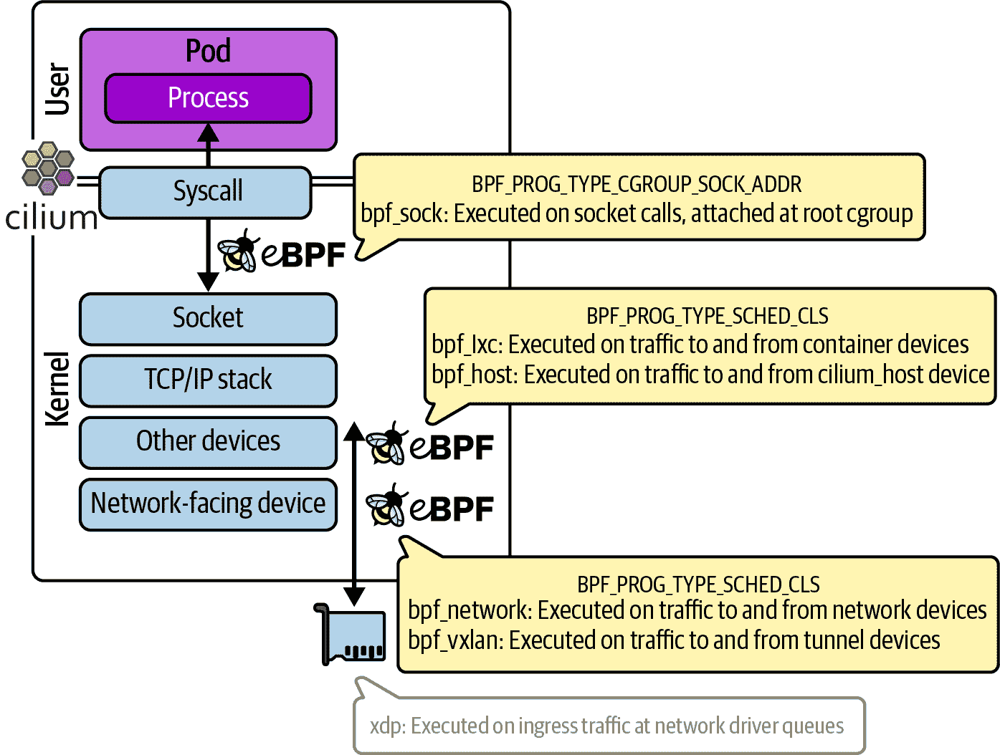
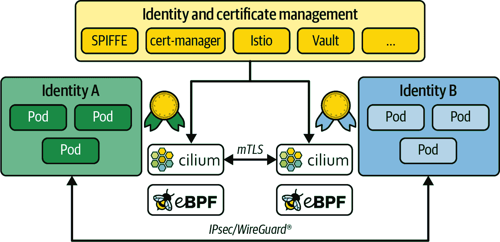

# 第八章：网络中的 eBPF

正如您在第一章中看到的，eBPF 的动态特性使我们能够定制内核的行为。在网络世界中，有大量依赖于应用的理想行为。例如，电信运营商可能需要与 SRv6 等电信特定协议进行接口；Kubernetes 环境可能需要与旧有应用集成；专用硬件负载均衡器可以由在通用硬件上运行的 XDP 程序替代。eBPF 允许程序员构建满足特定需求的网络功能，而无需将它们强加于所有上游内核用户。

基于 eBPF 的网络工具现在被广泛应用，并且已被证明在大规模上非常有效。例如，CNCF 的[Cilium 项目](http://cilium.io)将 eBPF 作为 Kubernetes 网络、独立负载均衡等平台，并被云原生采纳者在各行业垂直领域广泛使用。^(1) 自 2017 年以来，Meta 一直在大规模使用 eBPF——Facebook 来往的每个数据包都经过了 XDP 程序。另一个公共且高扩展的例子是 Cloudflare 利用 eBPF 进行 DDoS（分布式拒绝服务）防护。

这些都是复杂的、可投入生产的解决方案，其详细内容远超出本书的范围，但通过阅读本章中的示例，您可以感受到像这样的 eBPF 网络解决方案是如何构建的。

###### 注意

本章的代码示例位于[*github.com/lizrice/learning-ebpf*](https://github.com/lizrice/learning-ebpf)的*chapter8*目录中。

# 数据包丢弃

有几个网络安全功能涉及丢弃某些传入数据包并允许其他数据包通过。这些功能包括防火墙、DDoS 防护和减轻“死亡数据包”漏洞：

+   防火墙涉及根据源 IP 地址和/或目标 IP 地址及端口号逐个数据包地决定是否允许数据包通过。

+   DDoS 防护增加了一些复杂性，也许需要跟踪从特定来源到达的数据包速率和/或检测数据包内容的某些特征，以确定攻击者或一组攻击者是否试图通过流量淹没接口。

+   “死亡数据包”漏洞是一类内核漏洞，其中内核未能安全处理以特定方式构造的数据包。发送这种特定格式的数据包的攻击者可以利用这一漏洞，这可能导致内核崩溃。传统上，当发现这样的内核漏洞时，需要安装带有修复程序的新内核，这又需要机器停机。但是，安装检测并丢弃这些恶意数据包的 eBPF 程序可以动态安装，立即保护主机，而不影响正在运行的任何应用程序。

这些功能的决策算法超出了本书的范围，但让我们探讨一下如何通过附加到网络接口 XDP 钩子上的 eBPF 程序来丢弃某些数据包，这是实现这些用例的基础。

## XDP 程序返回码

当网络数据包到达时，XDP 程序会被触发。程序检查数据包，完成后，返回码给出了一个 *决策*，指示下一步该如何处理该数据包：

+   `XDP_PASS` 表示应该将数据包以正常方式发送到网络堆栈（就像没有 XDP 程序时那样）。

+   `XDP_DROP` 导致数据包立即被丢弃。

+   `XDP_TX` 将数据包发送回它到达的同一接口。

+   `XDP_REDIRECT` 用于将其发送到不同的网络接口。

+   `XDP_ABORTED` 导致数据包被丢弃，但其使用暗示着错误情况或意外情况，而不是正常的丢弃数据包的决策。

对于某些用例（如防火墙），XDP 程序只需在传递数据包和丢弃数据包之间做出决策。决定是否丢弃数据包的 XDP 程序大纲看起来像这样：

```
SEC("xdp")   
int hello(struct xdp_md *ctx) {   
    bool drop;

    drop = <examine packet and decide whether to drop it>;

    if (drop) 
        return XDP_DROP;
    else
        return XDP_PASS;
}
```

XDP 程序还可以操作数据包内容，但我稍后会讲到这一点。

每当入站网络数据包到达其附加的接口时，XDP 程序会被触发。`ctx` 参数是指向一个 `xdp_md` 结构体的指针，它保存了关于传入数据包的元数据。让我们看看如何使用这个结构体来检查数据包的内容以做出决策。

## XDP 数据包解析

这里是 `xdp_md` 结构体的定义：

```
struct `xdp_md` {
    `__u32` data;
    `__u32` `data_end`;
    `__u32` `data_meta`;
    /* Below access go through struct xdp_rxq_info */
    `__u32` `ingress_ifindex`; /* rxq->dev->ifindex */
    `__u32` `rx_queue_index`;  /* rxq->queue_index  */

    `__u32` `egress_ifindex`;  /* txq->dev->ifindex */
};
```

不要被前三个字段的 `__u32` 类型所误导，它们实际上是指针。`data` 字段指示数据包开始的内存位置，`data_end` 显示其结束位置。正如您在 第六章 中看到的，为了通过 eBPF 验证器，您必须明确检查对数据包内容的任何读取或写入是否在 `data` 到 `data_end` 的范围内。

数据包之前的内存区域还有一个 `data_meta` 到 `data` 之间的区域，用于存储有关该数据包的元数据。这可以用于多个可能在数据包通过堆栈的不同位置处理相同数据包的 eBPF 程序之间的协调。

为了说明解析网络数据包的基础知识，在示例代码中有一个名为 `ping()` 的 XDP 程序，它只是在检测到 ping（ICMP）数据包时生成一行跟踪信息。以下是该程序的代码：

```
SEC("xdp")
int ping(struct xdp_md *ctx) {
   long protocol = lookup_protocol(ctx);
   if (protocol == 1) // ICMP
   {
       bpf_printk("Hello ping");
   }
   return XDP_PASS;
}
```

您可以按照以下步骤查看此程序的运行情况：

1.  在 *chapter8* 目录中运行 `make`。这不仅会构建代码，还会将 XDP 程序附加到回环接口（称为 `lo`）上。

1.  在一个终端窗口中运行 `ping localhost`。

1.  在另一个终端窗口中，通过运行 `cat /sys/kernel/tracing/trace_pipe` 观察生成的跟踪管道输出。

每秒应生成大约两行跟踪信息，并且它们应该是这个样子：

```
ping-26622   [000] d.s11 276880.862408: bpf_trace_printk: Hello ping
ping-26622   [000] d.s11 276880.862459: bpf_trace_printk: Hello ping
ping-26622   [000] d.s11 276881.889575: bpf_trace_printk: Hello ping
ping-26622   [000] d.s11 276881.889676: bpf_trace_printk: Hello ping
ping-26622   [000] d.s11 276882.910777: bpf_trace_printk: Hello ping
ping-26622   [000] d.s11 276882.910930: bpf_trace_printk: Hello ping
```

每秒会有两行跟踪信息，因为环回接口既接收 ping 请求也接收 ping 响应。

你可以轻松地修改此代码，通过添加一行代码在协议匹配时返回`XDP_DROP`来丢弃 ping 数据包，如下所示：

```
if (protocol == 1) // ICMP
{
  bpf_printk("Hello ping");
  return XDP_DROP;
}
return XDP_PASS;
```

如果你尝试这样做，你会看到类似以下输出只在跟踪输出中每秒生成一次：

```
ping-26639   [002] d.s11 277050.589356: bpf_trace_printk: Hello ping
ping-26639   [002] d.s11 277051.615329: bpf_trace_printk: Hello ping
ping-26639   [002] d.s11 277052.637708: bpf_trace_printk: Hello ping
```

环回接口收到一个 ping 请求，并且 XDP 程序丢弃它，因此请求不会通过网络堆栈远到足以引发响应。

在这个 XDP 程序中，大部分工作都在一个名为`lookup_protocol()`的函数中完成，该函数确定第 4 层协议类型。这只是一个示例，不是一个高质量的网络数据包解析实现！但足以让你了解 eBPF 中解析的工作原理。

收到的网络数据包由一系列字节组成，布局如图 8-1 所示。


###### 图 8-1\. 以太网头部开始的 IP 网络数据包的布局，随后是 IP 头部，然后是第 4 层数据

`lookup_protocol()`函数接受包含有关此网络数据包在内存中位置的信息的`ctx`结构，并返回在 IP 头部中找到的协议类型。代码如下：

```
unsigned char lookup_protocol(struct xdp_md *ctx)
{
   unsigned char protocol = 0;

   void *data = (void *)(long)ctx->data;                                    
   void *data_end = (void *)(long)ctx->data_end;
   struct ethhdr *eth = data;                                               
   if (data + sizeof(struct ethhdr) > data_end)                             
       return 0;

   // Check that it's an IP packet
   if (bpf_ntohs(eth->h_proto) == ETH_P_IP)                                 
   {
       // Return the protocol of this packet
       // 1 = ICMP
       // 6 = TCP
       // 17 = UDP       
       struct iphdr *iph = data + sizeof(struct ethhdr);                     
       if (data + sizeof(struct ethhdr) + sizeof(struct iphdr) <= data_end) 
           protocol = iph->protocol;                                        
   }
   return protocol;
}
```


局部变量`data`和`data_end`指向网络数据包的起始和结束位置。


网络数据包应该以以太网头部开始。


但是你不能简单地假设这个网络数据包足够大，可以容纳以太网头部！验证程序要求你明确检查这一点。


以太网头部包含一个 2 字节的字段，告诉我们第 3 层协议。


如果协议类型表明这是一个 IP 数据包，则紧随以太网头部的是 IP 头部。


你不能简单地假设网络数据包中有足够的空间来容纳那个 IP 头部。再次，验证程序要求你明确检查这一点。


IP 头部包含协议字节，该函数将返回给其调用者。

由该程序使用的`bpf_ntohs()`函数确保两个字节按此主机期望的顺序排序。网络协议是大端序的，但大多数处理器是小端序的，这意味着它们以不同的顺序保存多字节值。此函数将（如有必要）从网络顺序转换为主机顺序。当你从网络数据包的字段中提取一个超过一个字节长的值时，应使用此函数。

此简单示例显示了几行 eBPF 代码如何对网络功能产生巨大影响。不难想象，关于哪些数据包通过和哪些数据包丢弃的更复杂规则可能导致我在本节开头描述的功能：防火墙、DDoS 保护和包死亡漏洞的缓解。现在让我们考虑，在 eBPF 程序内部修改网络数据包的能力下，如何提供更多功能。

# 负载均衡和转发

XDP 程序不仅限于检查数据包内容，还可以修改数据包内容。我们来看看如果要构建一个简单的负载均衡器，将发送到特定 IP 地址的数据包转发到可以满足请求的多个后端时会涉及哪些内容。

GitHub 仓库中有一个示例。^(2) 这里的设置是在同一主机上运行的一组容器。有一个客户端、一个负载均衡器和两个后端，每个后端在自己的容器中运行。如图 8-2 所示，负载均衡器接收来自客户端的流量并将其转发到两个后端容器中的一个。


###### 图 8-2\. 示例负载均衡器设置

负载均衡功能实现为附加到负载均衡器的 eth0 网络接口的 XDP 程序。此程序的返回码为`XDP_TX`，表示数据包应通过原接口发送回去。但在此之前，程序必须更新数据包头中的地址信息。

虽然我认为这个例子作为学习练习很有用，但实际上这个代码离投入生产还有很大距离；例如，它使用硬编码的地址，假设 IP 地址的确切设置如图 8-2 所示。它假定它将接收的唯一 TCP 流量是来自客户端的请求或发送到客户端的响应。它还通过利用 Docker 设置虚拟 MAC 地址的方式作弊，使用每个容器的 IP 地址作为每个容器虚拟以太网接口的 MAC 地址的最后四个字节。从容器的角度来看，该虚拟以太网接口称为 eth0。

以下是示例负载均衡器代码中的 XDP 程序：

```
SEC("xdp_lb")
int xdp_load_balancer(struct xdp_md *ctx)
{
    void *data = (void *)(long)ctx->data;           
    void *data_end = (void *)(long)ctx->data_end;

    struct ethhdr *eth = data;
    if (data + sizeof(struct ethhdr) > data_end)
        return XDP_ABORTED;

    if (bpf_ntohs(eth->h_proto) != ETH_P_IP)
        return XDP_PASS;

    struct iphdr *iph = data + sizeof(struct ethhdr);
    if (data + sizeof(struct ethhdr) + sizeof(struct iphdr) > data_end)
        return XDP_ABORTED;

    if (iph->protocol != IPPROTO_TCP)               
        return XDP_PASS;

    if (iph->saddr == IP_ADDRESS(CLIENT))           
    {
        char be = BACKEND_A;                        
        if (bpf_get_prandom_u32() % 2)                
            be = BACKEND_B;

        iph->daddr = IP_ADDRESS(be);                
        eth->h_dest[5] = be;
    }
    else
    {
        iph->daddr = IP_ADDRESS(CLIENT);            
        eth->h_dest[5] = CLIENT;
    }
    iph->saddr = IP_ADDRESS(LB);                    
    eth->h_source[5] = LB;

    iph->check = iph_csum(iph);                     

    return XDP_TX;
}
```


此函数的前半部分与前面示例中的几乎相同：定位数据包中的以太网头部，然后是 IP 头部。


这次它将仅处理 TCP 数据包，将收到的其他任何内容原样上交给栈处理，就好像什么都没有发生一样。


此处检查源 IP 地址。如果该数据包不是来自客户端的，则假设它是发送到客户端的响应。


此代码生成在 A 和 B 后端之间的伪随机选择。


目标 IP 和 MAC 地址已更新，以匹配选择的后端…


…或者如果这是来自后端的响应（这是本文的假设，如果它不是来自客户端），则目标 IP 和 MAC 地址将更新以匹配客户端。


无论这个数据包去往何处，源地址都需要更新，以便看起来像数据包来自负载均衡器。


IP 头部包括计算其内容的校验和，由于源和目标 IP 地址都已更新，因此此数据包的校验和也需要重新计算和替换。

###### 注意

由于这是一本关于 eBPF 而不是网络的书，我没有深入探讨 IP 和 MAC 地址为什么需要更新或如果它们没有更新会发生什么。如果你感兴趣，我在我的[YouTube 视频的 eBPF 峰会演讲](https://oreil.ly/mQxtT)中更详细地介绍了这个例子代码。

就像前面的例子一样，Makefile 包括了不仅构建代码，还使用`bpftool`加载和附加 XDP 程序到接口的说明，就像这样：

```
xdp: $(BPF_OBJ)
   bpftool net detach xdpgeneric dev eth0
   rm -f /sys/fs/bpf/$(TARGET)
   bpftool prog load $(BPF_OBJ) /sys/fs/bpf/$(TARGET)
   bpftool net attach xdpgeneric pinned /sys/fs/bpf/$(TARGET) dev eth0
```

这个`make`指令需要在负载均衡器容器*内部*运行，以便 eth0 对应其虚拟以太网接口。这带来了一个有趣的观点：一个 eBPF 程序被加载到内核中，只有一个；然而附着点可能在特定的网络命名空间内，并且只在该网络命名空间内可见。^(3)

# XDP 卸载

XDP 的想法源自一场关于如果你可以在网络卡上运行 eBPF 程序来在它们甚至到达内核网络堆栈之前对单个数据包做出决策会有多有用的对话。^(4) 有一些网络接口卡支持完整的*XDP 卸载*功能，在这些接口卡上确实可以在其自己的处理器上运行 eBPF 程序处理入站数据包。这在图 8-3 中有所说明。


###### 图 8-3\. 支持 XDP 卸载的网络接口卡可以处理、丢弃和重新传输数据包，而无需主机 CPU 执行任何工作

这意味着被丢弃或重定向回同一物理接口的数据包——就像本章前面的数据包丢弃和负载均衡示例一样——从未被主机内核看到，主机机器上的任何 CPU 周期也不会花费在处理它们上，因为所有工作都在网络卡上完成。

即使物理网络接口卡不支持完整的 XDP 卸载，许多网卡驱动程序支持 XDP 钩子，这样可以最小化 eBPF 程序处理数据包所需的内存复制。^(5)

这可以带来显著的性能优势，并且允许像负载均衡这样的功能在普通硬件上运行得非常高效。^(6)

您已经看到 XDP 如何用于处理入站网络数据包，尽快访问它们到达机器时。eBPF 也可以用于处理网络堆栈中其他点的流量，在流向如何流动的任何方向。让我们继续思考在 TC 子系统内附加的 eBPF 程序。

# 流量控制（TC）

我在上一章提到了流量控制。当一个网络数据包到达这一点时，它将以`sk_buff`的形式存在于内核内存中。这是内核网络堆栈中广泛使用的数据结构。附加在 TC 子系统内的 eBPF 程序将接收`sk_buff`结构作为上下文参数的指针。

###### 注意

您可能想知道为什么 XDP 程序不使用相同的结构作为它们的上下文。答案是，XDP 钩子发生在网络数据到达网络堆栈之前，也在`sk_buff`结构设置完成之前。

TC 子系统旨在调度网络流量的方式。例如，您可能希望限制每个应用程序可用的带宽，以便它们都有公平的机会。但是，在调度单个数据包时，“带宽”并不是一个非常有意义的术语，因为它用于发送或接收的平均数据量。某个应用程序可能非常突发，或者另一个应用程序可能对网络延迟非常敏感，因此 TC 可以更精细地控制数据包的处理和优先级。^(7)

这里介绍了 eBPF 程序，以便对 TC 内使用的算法进行自定义控制。但是，通过操纵、丢弃或重定向数据包的能力，附加在 TC 内的 eBPF 程序也可以用作复杂网络行为的构建块。

堆栈中给定的网络数据在两个方向中流动：*入口*（从网络接口入站）或*出口*（朝向网络接口出站）。eBPF 程序可以附加在任一方向，并且只会影响该方向的流量。与 XDP 不同，可以附加多个按顺序处理的 eBPF 程序。

传统的流量控制分为*分类器*，根据某些规则对数据包进行分类，以及单独的*操作*，根据分类器的输出确定对数据包的处理方式。可以作为*qdisc*（排队策略）的一部分定义一系列分类器。

eBPF 程序作为分类器附加，但它们也可以在同一个程序中确定采取的操作。操作由程序的返回代码指示（其值在 *linux/pkt_cls.h* 中定义）：

+   `TC_ACT_SHOT` 指示内核丢弃该数据包。

+   `TC_ACT_UNSPEC` 表现得好像 eBPF 程序并未在此数据包上运行过（因此将其传递给序列中的下一个分类器，如果有的话）。

+   `TC_ACT_OK` 指示内核将数据包传递给堆栈中的下一层。

+   `TC_ACT_REDIRECT` 将数据包发送到不同网络设备的 ingress 或 egress 路径。

让我们来看几个可以附加在 TC 内的简单程序示例。第一个简单地生成一行跟踪，并告诉内核丢弃该数据包：

```
int tc_drop(struct __sk_buff *skb) {
  bpf_trace_printk("[tc] dropping packet\n");
  return TC_ACT_SHOT;
}
```

现在让我们考虑如何仅丢弃数据包的子集。这个示例会丢弃 ICMP（ping）请求数据包，与本章早些时候介绍的 XDP 示例非常相似：

```
int tc(struct __sk_buff *skb) {
  void *data = (void *)(long)skb->data;
  void *data_end = (void *)(long)skb->data_end;

  if (is_icmp_ping_request(data, data_end)) {
    struct iphdr *iph = data + sizeof(struct ethhdr);
    struct icmphdr *icmp = data + sizeof(struct ethhdr) + sizeof(struct iphdr);
    bpf_trace_printk("[tc] ICMP request for %x type %x\n", iph->daddr,
                     icmp->type);
    return TC_ACT_SHOT;
  }
  return TC_ACT_OK;
}
```

`sk_buff` 结构体具有指向数据包数据起始和结束的指针，非常类似于 `xdp_md` 结构体，数据包解析过程也非常相似。再次强调，为了通过验证，必须明确检查对数据的任何访问是否在 `data` 和 `data_end` 之间的范围内。

或许你会想知道为什么在已经看到 XDP 实现了类似功能的情况下，你还想在 TC 层实现类似的东西。一个很好的理由是，你可以在 egress 流量上使用 TC 程序，而 XDP 只能处理 ingress 流量。另一个理由是，因为 XDP 在数据包到达时立即触发，此时与数据包相关的 `sk_buff` 内核数据结构还不存在。如果 eBPF 程序对内核为该数据包创建的 `sk_buff` 感兴趣或希望操纵它，TC 附加点是合适的选择。

###### 注意

要更好地理解 XDP 和 TC eBPF 程序之间的区别，请阅读 Cilium 项目的 [BPF 和 XDP 参考指南](https://oreil.ly/MWAJL) 中的“程序类型”部分。

现在让我们考虑一个不仅仅丢弃某些数据包的示例。这个示例识别到收到了一个 ping 请求，并且会以 ping 响应进行响应：

```
int tc_pingpong(struct __sk_buff *skb) {
  void *data = (void *)(long)skb->data;
  void *data_end = (void *)(long)skb->data_end;

  if (!is_icmp_ping_request(data, data_end)) {      
    return TC_ACT_OK;
  }

  struct iphdr *iph = data + sizeof(struct ethhdr);
  struct icmphdr *icmp = data + sizeof(struct ethhdr) + sizeof(struct iphdr);

  swap_mac_addresses(skb);                          
  swap_ip_addresses(skb);

  // Change the type of the ICMP packet to 0 (ICMP Echo Reply) 
  // (was 8 for ICMP Echo request)
  update_icmp_type(skb, 8, 0);                      

  // Redirecting a clone of the modified skb back to the interface 
  // it arrived on
  bpf_clone_redirect(skb, skb->ifindex, 0);         

  return TC_ACT_SHOT;                               
}
```


`is_icmp_ping_request()` 函数解析数据包，不仅检查它是否是 ICMP 消息，还检查它是否是回显（ping）请求。


由于这个函数将向发送方发送响应，所以需要交换源和目标地址。（如果你想看看这个例子的具体代码，包括更新 IP 标头校验和的细节，可以阅读示例代码。）


通过更改 ICMP 标头中的类型字段，将其转换为回显响应。


这个辅助函数通过接口（`skb->ifindex`）将数据包的克隆发送回去。


由于辅助函数在发送响应之前克隆了数据包，原始数据包应该被丢弃。

在正常情况下，ping 请求将由内核的网络堆栈稍后处理，但这个小例子演示了如何通过 eBPF 实现替换更广泛的网络功能。

今天许多网络功能由用户空间服务处理，但如果可以用 eBPF 程序替代，对性能可能会有很大帮助。在内核中处理的数据包无需完全经过堆栈的其余部分；不需要将其传输到用户空间进行处理，响应也无需再次返回内核。更重要的是，这两者可以并行运行——对于需要复杂处理但 eBPF 无法处理的任何数据包，eBPF 程序可以返回 `TC_ACT_OK`，以便正常地将其传递到用户空间服务。

对我来说，这是在 eBPF 中实现网络功能的一个重要方面。随着 eBPF 平台的发展（例如，最新内核允许一百万条指令的程序），可以在内核中实现越来越复杂的网络功能。目前尚未在 eBPF 中实现的部分仍可以由内核中的传统堆栈或用户空间来处理。随着时间的推移，越来越多的功能可以从用户空间移到内核中，eBPF 的灵活性和动态特性意味着你不必等待它们成为内核分发的一部分。你可以立即加载 eBPF 实现，就像我在 第一章 中讨论的那样。

我将在 “eBPF 和 Kubernetes 网络” 的实现中返回到网络功能的实现。但首先，让我们考虑 eBPF 另一个能够实现的用例：检查加密流量的解密内容。

# 数据包加密与解密

如果应用程序使用加密来保护发送或接收的数据，那么在加密之前或解密之后会有一个明文数据的点。回想一下，eBPF 可以几乎在机器的任何地方附加程序，因此如果可以钩入数据传递但尚未加密或刚刚解密的点，那么你的 eBPF 程序可以观察到这些明文数据。不需要提供任何证书来解密流量，就像在传统的 SSL 检查工具中那样。

在许多情况下，应用程序会使用像 OpenSSL 或 BoringSSL 这样的库来加密数据，这些库存在于用户空间。在这种情况下，数据到达套接字时已经是加密的，而这是网络流量的用户空间/内核边界。如果要以未加密形式跟踪这些数据，可以在用户空间代码中合适的位置使用 eBPF 程序。

## 用户空间 SSL 库

跟踪解密后的加密数据包的一种常见方法是挂接到用户空间库（如 OpenSSL 或 BoringSSL）调用中。使用 OpenSSL 的应用程序通过调用称为`SSL_write()`的函数发送要加密的数据，并使用`SSL_read()`从网络接收到的以加密形式接收的明文数据。使用 uprobes 将 eBPF 程序挂接到这些函数中，允许应用程序在加密或解密之前以及之后观察到从*使用该共享库的任何应用程序*中的数据。而且无需任何密钥，因为这些已经由应用程序提供。

在 Pixie 项目中有一个相当简单的示例叫做[openssl-tracer](https://oreil.ly/puDp9)^(8)，其中 eBPF 程序位于名为*openssl_tracer_bpf_funcs.c*的文件中。以下是该代码将数据发送到用户空间的部分，使用了类似于本书早期示例的 perf 缓冲区：

```
static int process_SSL_data(struct pt_regs* ctx, uint64_t id, enum  
ssl_data_event_type type, const char* buf) {
 ...
  bpf_probe_read(event->data, event->data_len, buf);
  tls_events.perf_submit(ctx, event, sizeof(struct ssl_data_event_t));

  return 0;
}
```

您可以看到`buf`中的数据通过帮助函数`bpf_probe_read()`读入`event`结构，然后将该`event`结构提交到 perf 缓冲区。

如果此数据正在发送到用户空间，可以合理地假设这必须是未加密格式的数据。那么这个数据缓冲区从哪里获得？通过查看调用`process_SSL_data()`函数的位置可以找到答案。在读取到达此计算机的加密数据时，图 8-4 说明了正在发生的情况。

当您读取数据时，将指针指向`SSL_read()`的缓冲区，当函数返回时，该缓冲区将包含未加密数据。与 kprobes 类似，函数的输入参数（包括该缓冲区指针）仅在附加到入口点的 uprobe 中可用，因为它们所在的寄存器可能在函数执行期间被覆盖。但在函数退出时，直到通过 uretprobe 可以读取数据，该数据将不会在缓冲区中可用。


###### 图 8-4\. eBPF 程序在 SSL_read()的入口和出口处钩入 uprobes，以便从缓冲指针中读取未加密数据

所以这个示例遵循了 kprobes 和 uprobes 的常见模式，如图 8-4 所示，入口探针临时使用映射存储输入参数，退出探针可以从中检索。让我们看看执行此操作的代码，从`SSL_read()`的 eBPF 程序开始：

```
// Function signature being probed: // int SSL_read(SSL *s, void *buf, int num) int probe_entry_SSL_read(struct pt_regs* ctx) {
  uint64_t current_pid_tgid = bpf_get_current_pid_tgid(); 
  ...

  const char* buf = (const char*)PT_REGS_PARM2(ctx);         

  active_ssl_read_args_map.update(&current_pid_tgid, &buf);  
  return 0;
}
```


正如此函数的注释所描述的，缓冲区指针是传递给`SSL_read()`函数的第二个参数，这个探测器将附加到这个参数上。`PT_REGS_PARM2`宏从上下文中获取此参数。


缓冲区指针存储在哈希映射中，其键是在函数开始时使用`bpf_get_current_pid_tgid()`辅助函数获取的当前进程和线程 ID。

这是退出探测器的相应程序：

```
int probe_ret_SSL_read(struct pt_regs* ctx) {
  uint64_t current_pid_tgid = bpf_get_current_pid_tgid();

  ...
  const char** buf = active_ssl_read_args_map.lookup(&current_pid_tgid);   
  if (buf != NULL) {
    process_SSL_data(ctx, current_pid_tgid, kSSLRead, *buf);               
  }

  active_ssl_read_args_map.delete(&current_pid_tgid);                      
  return 0;
}
```


已查找当前进程和线程 ID，将其用作从哈希映射中检索缓冲区指针的键。


如果这不是空指针，请调用`process_SSL_data()`函数，这个函数之前你看到过，它将数据从缓冲区发送到用户空间，使用 perf 缓冲区。


清理哈希映射中的条目，因为每个条目调用都应该与一个退出对应。

此示例展示了如何跟踪用户空间应用程序发送和接收的加密数据的明文版本。跟踪本身附加到用户空间库，并不能保证每个应用程序都使用给定的 SSL 库。BCC 项目包括一个名为[*sslsniff*](https://oreil.ly/tFT9p)的实用工具，也支持 GnuTLS 和 NSS。但如果某人的应用程序使用其他加密库（甚至更糟糕的是，选择“自己实现加密”），uprobes 根本无法找到正确的挂接点，这些跟踪工具将无法正常工作。

这种基于 uprobes 的方法可能不成功的常见原因还有更多。与只有一个（虚拟）机器的内核不同，用户空间库代码可以存在多个副本。如果使用容器，每个容器很可能有自己的所有库依赖集合。您可以在这些库中挂接 uprobes，但必须确定要跟踪的特定容器的正确副本。另一种可能性是，应用程序可能不是使用共享的动态链接库，而是静态链接，因此它是一个单独的可执行文件。

# eBPF 和 Kubernetes 网络

尽管本书不是关于 Kubernetes 的，但 eBPF 在 Kubernetes 网络中被广泛使用，这是使用该平台自定义网络堆栈的一个很好的例证。

在 Kubernetes 环境中，应用程序部署在*pods*中。每个 pod 是一个或多个容器的组合，它们共享内核命名空间和 cgroups，将 pod 与其他 pod 以及它们所在的主机机器隔离开来。

特别是（在本章节的目的上），一个 Pod 通常有自己的网络命名空间和 IP 地址。^(9)这意味着内核为该命名空间拥有一组网络堆栈结构，与主机及其他 Pod 分开。如图 8-5 所示，Pod 通过虚拟以太网连接与主机连接，并分配了自己的 IP 地址。


###### 图 8-5\. Kubernetes 中的网络路径

从图 8-5 可以看出，从机器外部发送给应用 Pod 的数据包必须经过主机的网络堆栈，跨越虚拟以太网连接进入 Pod 的网络命名空间，然后再次经过网络堆栈到达应用程序。

这两个网络堆栈在同一个内核中运行，因此数据包实际上会通过相同的处理两次。网络数据包经过的代码越多，延迟就越高，因此如果可能缩短网络路径，可能会带来性能改进。

基于 eBPF 的网络解决方案如 Cilium 可以钩入网络堆栈，覆盖内核的原生网络行为，如图 8-6 所示。


###### 图 8-6\. 使用 eBPF 绕过 iptables 和 conntrack 处理

特别是，eBPF 能够用更高效的解决方案替代 iptables 和 conntrack，用于管理网络规则和连接跟踪。让我们讨论为什么这在 Kubernetes 中会显著提高性能。

## 避免使用 iptables

Kubernetes 有一个名为 kube-proxy 的组件，实现负载均衡行为，允许多个 Pod 来处理对服务的请求。这是通过 iptables 规则来实现的。

Kubernetes 为用户提供了通过容器网络接口（CNI）选择网络解决方案的选项。一些 CNI 插件使用 iptables 规则来实现 Kubernetes 中的 L3/L4 网络策略，即 iptables 规则指示是否丢弃不符合网络策略的数据包。

虽然 iptables 在传统的（容器前）网络中很有效，但在 Kubernetes 中使用时存在一些弱点。在这个环境中，Pod 及其 IP 地址动态地出现和消失，每次添加或删除 Pod 时，iptables 规则必须完全重写，这会影响大规模的性能。（在 2017 年 KubeCon 上，Haibin Xie 和 Quinton Hoole 的[演讲](https://oreil.ly/BO0-8)描述了为 20,000 个服务更新 iptables 规则需要五个小时。）

对 iptables 的更新并不是唯一的性能问题：查找规则需要通过表进行线性搜索，这是一个 O(n)的操作，随着规则数量线性增长。

Cilium 使用 eBPF 哈希表映射来存储网络策略规则、连接跟踪和负载均衡器查找表，这可以替代 kube-proxy 的 iptables。在哈希表中查找和插入条目都是大约 O(1) 的操作，这意味着它们具有更好的扩展性。

你可以在 Cilium 的 [博客](https://oreil.ly/9NV99) 中阅读关于其实现的性能改进的基准测试结果。在同一篇文章中，你会看到另一个 CNI —— Calico，它也有一个 eBPF 选项，选择其 eBPF 实现而不是 iptables 时性能更好。eBPF 为可扩展、动态的 Kubernetes 部署提供了最高性能的机制。

## 协调网络程序

像 Cilium 这样复杂的网络实现不能被写成单个 eBPF 程序。如图 8-7 所示，它提供了几个不同的 eBPF 程序，这些程序挂钩到内核及其网络堆栈的不同部分。



###### 图 8-7\. Cilium 由多个协调的 eBPF 程序组成，这些程序挂钩到内核的不同点

作为一个一般原则，Cilium 尽早拦截流量，以缩短每个数据包的处理路径。从应用程序 Pod 流出的消息在接近应用程序的套接字层被拦截。使用 XDP 拦截来自外部网络的入站数据包。但是附加点呢？

Cilium 支持适合不同环境的不同网络模式。本书不涵盖其全面描述（你可以在 [Cilium.io](https://cilium.io) 找到更多信息），但我会在这里简要概述一下，以便你了解为什么会有这么多不同的 eBPF 程序！

存在一种简单的扁平网络模式，在这种模式下，Cilium 为集群中所有的 Pod 分配相同的 CIDR IP 地址，并直接在它们之间路由流量。还有几种不同的隧道模式，其中用于不同节点上 Pod 的流量被封装在一个寻址到目标节点 IP 地址的消息中，并在目标节点上解封装以进行最终的 Pod 内部跳转。根据数据包的目的地，不同的 eBPF 程序被调用来处理流量，无论是本地容器、本地主机、本网络上的另一台主机还是隧道。

在 图 8-7 中，你可以看到处理来自不同设备流量的多个 TC 程序。这些设备代表了可能的不同真实和虚拟网络接口，数据包可能会流经这些接口：

+   Pod 网络的接口（连接 Pod 和主机之间的虚拟以太网连接的一端）

+   网络隧道的接口

+   主机上物理网络设备的接口

+   主机自身的网络接口

###### 注意

如果您有兴趣了解更多关于数据包如何流经 Cilium 的信息，Arthur Chiao 写了这篇详细且有趣的博客文章：[“Cilium 中数据包的生命周期：发现 Pod 到 Service 流量路径和 BPF 处理逻辑”](https://oreil.ly/toxsM)。

附加在内核中的不同 eBPF 程序使用 eBPF map 进行通信，并使用可以附加到网络数据包的元数据来流经堆栈（在讨论访问 XDP 示例中提到时）。这些程序不仅仅将数据包路由到其目的地；它们还根据网络策略丢弃数据包，就像您在早期示例中看到的那样。

## 网络策略执行

在本章的开头，您看到 eBPF 程序如何丢弃数据包，这意味着它们根本不会到达其目的地。这是网络策略执行的基础，从概念上讲，无论我们是在考虑“传统”的防火墙还是云原生防火墙，它本质上都是相同的。策略根据数据包的源和/或目的地的信息决定是否丢弃数据包。

在传统环境中，IP 地址长期分配给特定服务器，但在 Kubernetes 中，IP 地址是动态分配的，今天分配给特定应用程序 Pod 的地址可能明天完全被重新分配给另一个应用程序使用。这就是为什么传统的防火墙在云原生环境中效果不佳的原因。每次 IP 地址变化时手动重新定义防火墙规则是不现实的。

相反，Kubernetes 支持 NetworkPolicy 资源的概念，该资源基于特定 Pod 上应用的标签定义防火墙规则，而不是基于它们的 IP 地址。尽管资源类型是 Kubernetes 本地支持的，但它并非由 Kubernetes 本身实现。相反，这个功能被委托给您正在使用的 CNI 插件。如果选择不支持 NetworkPolicy 资源的 CNI，则可能会忽略您配置的任何规则。另一方面，CNI 可以自由配置自定义资源，允许比本地 Kubernetes 定义更复杂的网络策略配置。例如，Cilium 支持基于 DNS 的网络策略规则，因此您可以根据 DNS 名称（例如，“*example.com*”）而不是 IP 地址定义是否允许流量。您还可以为各种第 7 层协议定义策略，例如允许或拒绝特定 URL 的 HTTP GET 调用的流量，但不允许 POST 调用。

###### 注意

Isovalent 的免费实验室 [“Cilium 入门”](https://oreil.ly/afdeh) 会指导您在第 3/4 层和第 7 层定义网络策略。另一个非常有用的资源是 [*networkpolicy.io*](http://networkpolicy.io) 上的 Network Policy 编辑器，它以可视化方式展示网络策略的影响。

正如我在本章早些时候讨论过的，可以使用 iptables 规则来丢弃流量，这是一些 CNIs 用来实现 Kubernetes NetworkPolicy 规则的方法。Cilium 使用 eBPF 程序来丢弃不符合当前规则集的流量。希望通过本章前面丢包示例的看法，你对此如何工作有一个初步的心理模型。

Cilium 使用 Kubernetes 身份来确定特定网络策略规则是否适用。就像标签定义 Kubernetes 中哪些 Pod 是服务的一部分一样，标签也定义了 Cilium 中 Pod 的安全标识。通过这些服务标识索引的 eBPF 哈希表，使规则查找非常高效。

## 加密连接

许多组织需要通过在应用程序中编写代码来加密应用程序之间的流量，以保护其部署和用户数据。通常情况下，这可以通过在每个应用程序中设置安全连接来实现，使用互为流量层安全 (mTLS) 作为 HTTP 或 gRPC 连接的基础。建立这些连接需要首先确认连接双方应用程序的身份（通常通过交换证书来实现），然后加密它们之间流动的数据。

在 Kubernetes 中，可以将应用程序的需求转移到服务网格层或底层网络本身。本书不涵盖完整的服务网格讨论，但你可能对我在新堆栈上写的一篇文章感兴趣：[“如何通过 eBPF 简化服务网格”](https://oreil.ly/5ayvF)。让我们集中在网络层以及 eBPF 如何使将加密需求推入内核成为可能。

在 Kubernetes 集群内确保流量加密的最简单选项是使用*透明加密*。之所以称为“透明”，是因为它完全在网络层进行，从操作角度来看非常轻量级。应用程序本身完全不需要意识到加密的存在，也不需要建立 HTTPS 连接；此方法也不需要在 Kubernetes 下运行任何额外的基础设施组件。

在当前常见的内核中有两种加密协议，即 IPsec 和 WireGuard^((R))，它们都由 Cilium 和 Calico CNIs 支持在 Kubernetes 网络中使用。本书不讨论这两种协议之间的差异，但关键点在于它们建立了两台机器之间的安全隧道。CNI 可选择通过此安全隧道连接 Pod 的 eBPF 端点。

###### 注意

Cilium 博客有一篇很好的文章，介绍了 Cilium 如何使用 WireGuard^((R)) 和 IPsec 在节点之间提供加密流量。文章还简要概述了两者的性能特征。[Cilium 博客](https://oreil.ly/xjpGP)

使用节点末端的身份验证来建立安全隧道。这些身份验证由 Kubernetes 管理，因此操作员的管理负担很小。对于许多目的来说，这已经足够了，因为它确保集群中的所有网络流量都是加密的。透明加密也可以与使用 Kubernetes 身份验证来管理集群中不同端点之间的流量流动的 NetworkPolicy 无缝使用。

一些组织在多租户环境中运作，在这种环境中需要强大的租户边界，并且必须使用证书来标识每个应用端点。在每个应用程序内部处理这些工作是一个重大负担，因此最近已经将其转移到服务网格层，但这需要部署整套额外的组件，增加了资源消耗、延迟和操作复杂性。

现在 eBPF 正在启用一种 [新方法](https://oreil.ly/DSnLZ)，基于透明加密，但使用 TLS 进行初始证书交换和端点认证，以便身份可以表示个别应用程序，而不是它们运行的节点，如 图 8-8 所示。



###### 图 8-8. 验证应用身份之间的透明加密

一旦完成身份验证步骤，内核中的 IPsec 或 WireGuard^(R) 用于加密应用程序之间流动的流量。这带来了许多优势。它允许第三方证书和身份管理工具（如 cert-manager 或 SPIFFE/SPIRE）处理身份部分，网络负责加密，因此对应用程序来说完全透明。Cilium 支持 NetworkPolicy 定义，可以通过其 SPIFFE ID 指定端点，而不仅仅是通过其 Kubernetes 标签。也许最重要的是，这种方法可以与在 IP 数据包中传输的任何协议一起使用。这比仅适用于基于 TCP 连接的 mTLS 更进了一步。

这本书没有足够的篇幅深入讨论 Cilium 的所有内部细节，但我希望本节帮助你理解 eBPF 如何成为构建复杂网络功能（如完全功能的 Kubernetes CNI）的强大平台。

# 总结

在本章中，您看到了 eBPF 程序附加到网络堆栈中的各种不同点。我展示了基本数据包处理的示例，希望这些示例能让您了解 eBPF 如何创建强大的网络功能。您还看到了一些这些网络功能的实际示例，包括负载平衡、防火墙、安全缓解和 Kubernetes 网络。

# 练习和进一步阅读

以下是了解 eBPF 的各种网络用例的一些方法：

1.  修改示例 XDP 程序 `ping()`，使其为 ping 响应和 ping 请求生成不同的跟踪消息。ICMP 标头紧随网络数据包中的 IP 标头之后（就像 IP 标头紧随以太网标头之后一样）。你可能想使用 `linux/icmp.h` 中的 `struct icmphdr`，并查看类型字段是否显示 `ICMP_ECHO` 或 `ICMP_ECHOREPLY`。

1.  如果你想进一步探索 XDP 编程，我推荐 xdp-project 的 [xdp-tutorial](https://oreil.ly/UmJMF)。

1.  使用 [sslsniff](https://oreil.ly/Zuww7) 来查看 BCC 项目中加密流量的内容。

1.  通过在 [Cilium 网站](https://cilium.io/get-started) 中链接的教程和实验来探索 Cilium。

1.  使用 [*networkpolicy.io*](https://networkpolicy.io) 上的编辑器来可视化 Kubernetes 部署中网络策略的影响。

^(1) 截至撰写本文时，约有 100 家组织公开宣布在其 [*USERS.md* 文件](https://oreil.ly/PC7-G) 中使用 Cilium，尽管这一数字正在迅速增长。AWS、Google 和 Microsoft 也采用了 Cilium。

^(2) 此示例基于我在 eBPF Summit 2021 上的演讲 [“A Load Balancer from scratch”](https://oreil.ly/mQxtT)。在 15 分钟内构建一个 eBPF 负载均衡器！

^(3) 如果你想探索这一点，请尝试来自 eBPF Summit 2022 的 CTF 挑战 3 [“CTF Challenge 3 from eBPF Summit 2022”](https://oreil.ly/YIh_t)。我不会在这本书中透露剧透，但你可以在由 Duffie Cooley 和我提供的 [这里的解决方案中](https://oreil.ly/_51rC) 查看。

^(4) 查看丹尼尔·博克曼的演示 [“Little Helper Minions for Scaling Microservices”](https://oreil.ly/_8ZuF)，其中包括 eBPF 的历史，他在此时讲述了这个轶事。

^(5) Cilium 在 [BPF 和 XDP 参考指南](https://oreil.ly/eB7vL) 中维护了一个支持 XDP 的驱动程序列表。

^(6) Ceznam 在 [这篇博客文章中](https://oreil.ly/0cbCx) 分享了关于团队在使用基于 eBPF 的负载均衡器时看到的性能提升数据。

^(7) 要更全面地了解 TC 及其概念，我推荐 Quentin Monnet 的文章 [“Understanding tc “direct action” mode for BPF”](https://oreil.ly/7gU2A)。

^(8) 这个示例还有一个博客文章，可以在 [*https://blog.px.dev/ebpf-openssl-tracing*](https://blog.px.dev/ebpf-openssl-tracing) 中找到。

^(9) 可以将 Pod 运行在主机的网络命名空间中，以共享主机的 IP 地址，但除非应用程序在 Pod 中需要这样做，否则通常不会这样做。
