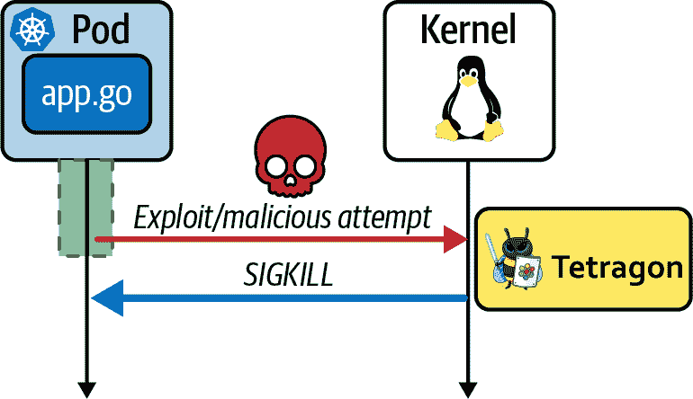

# 第九章：eBPF 用于安全

您已经看到 eBPF 如何用于观察系统中的事件，并向用户空间工具报告有关这些事件的信息。在本章中，您将考虑如何在事件检测的概念基础上构建基于 eBPF 的安全工具，以检测甚至预防恶意活动。我将从帮助您理解安全性与其他类型可观察性的不同之处开始。

###### 注意

本章的示例代码位于[GitHub 仓库](http://github.com/lizrice/learning-ebpf)的 *chapter9* 目录中。

# 安全可观察性需要政策和上下文

安全工具与报告事件的可观察性工具之间的区别在于，安全工具需要能够区分正常情况下预期的事件和表明可能存在恶意活动的事件。例如，假设您有一个应用程序作为正常处理的一部分向本地文件写入数据。假设该应用程序预计会写入 */home/<用户名>/<文件名>*，因此这种活动从安全角度来看并不重要。然而，如果该应用程序写入 Linux 中的许多敏感文件位置之一，则您希望收到通知。例如，它不太可能需要修改 */etc/passwd* 中存储的密码信息。

政策必须考虑的不仅是系统完全正常运行时的正常行为，还包括预期的错误路径行为。例如，如果物理磁盘变满，应用程序可能会开始发送网络消息以警示此情况。这些网络消息不应被视为安全事件——尽管它们不寻常，但并不可疑。考虑错误路径可能会使创建有效政策变得具有挑战性，我们稍后在本章将回到这个挑战。

定义预期行为与非预期行为是政策的工作。安全工具将活动与政策进行比较，并在活动超出政策范围时采取某些行动，使其具有可疑性。这种行动通常涉及生成安全事件日志，通常会发送到安全信息事件管理（SIEM）平台。这可能还会导致向需要调查发生情况的人员发送警报。

调查员可用的上下文信息越多，他们就越有可能找出事件的根本原因，并确定它是否是攻击，哪些组件受到影响，攻击是如何进行的，以及谁负有责任。正如在图 9-1 中所说明的那样，能够回答这类问题需要一种工具从仅仅是日志记录升级为应当被称为“安全可观察性”的命名。


###### 图 9-1\. 安全可观察性的异常事件检测需要上下文信息

让我们探讨一些使用 eBPF 程序检测和执行安全事件的方法。如你所知，eBPF 程序可以附加到各种事件，多年来用于安全的一组事件之一是系统调用。我们将从系统调用开始讨论，但正如你将看到的，系统调用可能不是用 eBPF 实现安全工具的最有效方式。稍后在本章中我们将看到一些更新和更复杂的方法。

# 使用系统调用进行安全事件

系统调用（或 syscalls）是用户空间应用程序与内核之间的接口。如果可以限制应用程序可以进行的系统调用集合，那将限制其能力。例如，如果阻止应用程序进行 `open*()` 系列的系统调用，它将无法打开文件。如果有一个应用程序你从不希望打开文件，你可能希望创建这种限制，以便即使应用程序被入侵，它也无法恶意打开文件。如果你在过去几年中使用 Docker 或 Kubernetes，那么你很有可能已经接触过使用 BPF 来限制系统调用的安全工具：seccomp*.*

## Seccomp

*seccomp* 的名称缩写自“SECure COMPuting”。在其原始或“严格”形式中，seccomp 用于将进程可以使用的系统调用集限制为非常小的子集：`read()`、`write()`、`_exit()` 和 `sigreturn()`。这种严格模式的目的是允许用户运行不受信任的代码（也许是从互联网下载的程序），而不可能使该代码执行恶意操作。

严格模式非常限制，许多应用程序需要使用更大的系统调用集，但这并不意味着它们需要全部 400 多个系统调用。允许更灵活的方法来限制任何给定应用程序可以使用的系统调用集是有道理的。这就是我们从容器世界大多数人遇到的 seccomp 变种背后的推理，更确切地说是称为 seccomp-bpf 的形式。与允许一组固定系统调用不同，这种 seccomp 模式使用 BPF 代码来过滤允许和禁止的系统调用。

在 seccomp-bpf 中，加载一组作为过滤器的 BPF 指令。每次调用系统调用时，都会触发过滤器。过滤器代码可以访问传递给系统调用的参数，以便根据系统调用本身和传递给它的参数做出决策。结果是可能的一组操作之一，包括：

+   允许系统调用继续执行

+   将错误代码返回给用户空间应用程序

+   终止线程

+   通知用户空间应用程序（seccomp-unotify*）*（截至内核版本 5.0）

###### 注意

如果你想探索编写自己的 BPF 过滤器代码，Michael Kerrisk 在 [*https://oreil.ly/cJ6HL*](https://oreil.ly/cJ6HL) 上有一些很好的示例。

一些传递给系统调用的参数是指针，而 seccomp-bpf 中的 BPF 代码不能解引用这些指针。这限制了 seccomp 配置文件的灵活性，因为它只能在决策过程中使用值参数。此外，它必须在进程启动时应用——你不能修改正在应用于给定应用程序进程的配置文件。

你很可能已经在不编写 BPF 代码的情况下使用了 seccomp-bpf，因为该代码通常是从可读的 seccomp 配置文件派生出来的。[Docker 的默认配置文件](https://oreil.ly/IT_Bf) 就是一个很好的例子。这是一个通用的配置文件，旨在与几乎任何常规的容器化应用程序兼容。这意味着它允许大多数系统调用，并仅禁止一些在任何应用程序中不太可能合适的调用，`reboot()` 就是一个很好的例子。

根据 Aqua Security 的说法（https://oreil.ly/1xWmn），大多数容器化应用程序使用了大约 40 到 70 个系统调用。为了更好的安全性，最好使用一个更加限制性的配置文件，针对每个具体应用程序，只允许实际使用的系统调用。

## 生成 Seccomp 配置文件

如果你要求普通应用开发人员告诉你他们的某个程序调用了哪些系统调用，你可能会看到一脸茫然的表情。这并不是有意冒犯。只是因为大多数开发人员使用的编程语言为他们提供了远离系统调用细节的高级抽象。例如，他们可能知道他们的应用程序打开了哪些文件，但他们不太可能告诉你它们是使用 `open()` 还是 `openat()`。这使得如果你要求开发人员在他们的应用程序代码中手工制作一个合适的 seccomp 配置文件，你可能得不到积极的回应。

自动化是未来的趋势：使用工具记录应用程序调用的系统调用集合。在早期，seccomp 配置文件通常使用 `strace` 编译，以收集应用程序调用的系统调用集合。^(1) 在云原生时代，这不是一个理想的解决方案，因为没有简单的方法来指定 `strace` 对特定的容器或 Kubernetes Pod 进行跟踪。最好生成配置文件不仅作为系统调用列表，而是采用 Kubernetes 和 OCI 兼容容器运行时可以接受的 JSON 格式。有一些工具可以做到这一点，使用 eBPF 收集所有调用的系统调用信息：

+   [Inspektor Gadget](https://www.inspektor-gadget.io) 包括一个 seccomp 分析器，允许你为 Kubernetes Pod 中的容器生成自定义 seccomp 配置文件。^(2)

+   Red Hat 创建了一个 seccomp 分析器，采用了 [OCI 运行时钩子](https://oreil.ly/nC8vM) 的形式。

使用这些分析工具，您需要运行应用程序一段任意时间，以生成包括其可能合法调用的完整系统调用列表的性能分析。如本章前述，此列表需要包括错误路径。如果您的应用程序在错误条件下无法正确执行因为需要调用的系统调用被阻止，这可能会引起更大的问题。由于 seccomp 配置文件处理比大多数开发者熟悉的抽象层次更低，手动审查它们以确认是否覆盖了所有正确的情况是困难的。

以 OCI 运行时挂钩为例，eBPF 程序会附加到`syscall_enter`原始跟踪点，并维护一个 eBPF 映射，跟踪已见过的系统调用。此工具的用户空间部分使用 Go 编写，并使用[*iovisor/gobpf*库](https://oreil.ly/sYCT3)。（我将在第十章中讨论此及其他用于 eBPF 的 Golang 库。）

下面是来自 OCI 运行时挂钩的代码行，加载 eBPF 程序到内核并将其附加到跟踪点（为了简洁起见，省略了几行）：

```
src := strings.Replace(source, "$PARENT_PID", strconv.Itoa(pid), -1)           
m := bcc.NewModule(src, []string{})
defer m.Close()

...
enterTrace, err := m.LoadTracepoint("enter_trace")                             
...
if err := m.AttachTracepoint("raw_syscalls:sys_enter", enterTrace); err != nil 
    {                                                                       
    return fmt.Errorf("error attaching to tracepoint: %v", err)
}
```


这一行有非常有趣的作用：它用 eBPF 源代码中名为`$PARENT_PID`的变量替换了一个数值进程 ID。这是一个常见的模式，表明此工具将为每个被检测的进程加载单独的 eBPF 程序。


在这里，一个名为`enter_trace`的 eBPF 程序被加载到内核中。


`enter_trace`程序附加到`raw_syscalls:sys_enter`跟踪点。这是任何系统调用入口点的跟踪点，在先前的示例中已经遇到过。每当用户空间代码进行系统调用时，将触发此跟踪点。

这些分析工具使用 eBPF 代码附加到`sys_enter`以跟踪已使用的系统调用集，并生成一个 seccomp 配置文件，该配置文件将用于实施配置。接下来我们将考虑的 eBPF 工具类别也会附加到`sys_enter`，但它们使用系统调用来跟踪应用程序的行为并将其与安全策略进行比较。

## 系统调用跟踪安全工具

这类众所周知的工具中，属于系统调用跟踪安全工具的最佳项目是 CNCF 项目[Falco](https://falco.org)，它提供安全警报。默认情况下，Falco 作为内核模块安装，但也有一个 eBPF 版本。用户可以定义[规则](https://oreil.ly/enufu)来确定哪些事件与安全相关，并且当发生不符合这些规则定义的事件时，Falco 可以以各种格式生成警报。

内核模块驱动程序和基于 eBPF 的驱动程序都会附加到系统调用。如果您检查 [GitHub 上的 Falco eBPF 程序](https://oreil.ly/Q_cBD)，您会看到像以下这样的行，它们会附加探测器到原始系统调用的入口和退出点（以及一些其他事件，如页面错误）：

```
BPF_PROBE("raw_syscalls/", sys_enter, sys_enter_args)

BPF_PROBE("raw_syscalls/", sys_exit, sys_exit_args)
```

由于 eBPF 程序可以动态加载并可以检测由预先存在的进程触发的事件，像 Falco 这样的工具可以对已运行的应用工作负载应用策略。用户可以修改正在应用的规则集，而无需修改应用程序或其配置。这与必须在应用程序启动时应用的 seccomp 配置文件形成对比。

不幸的是，使用系统调用入口点作为安全工具的方法存在问题：存在时间检查到使用时间（TOCTOU）问题。

当 eBPF 程序在系统调用入口点触发时，它可以访问用户空间传递给该系统调用的参数。如果这些参数是指针，则内核将需要将指向的数据复制到自己的数据结构中，然后再对数据进行操作。正如在 图 9-2 中所示，攻击者有机会在 eBPF 程序检查完数据后但内核复制之前修改这些数据。因此，正在处理的数据可能与 eBPF 程序捕获的数据不同。^(3)


###### 图 9-2\. 攻击者可以在内核访问系统调用参数之前更改它们。

对于 seccomp-bpf，同样的问题将适用，除非事实上在 seccomp-bpf 中不允许程序解引用用户空间指针，因此根本无法检查数据。

TOCTOU 问题确实适用于 seccomp_unotify，这是 seccomp 的最新添加模式，其中违规操作可以报告给用户空间。[seccomp_unotify 手册](https://oreil.ly/cwpki) 明确指出：“因此应该完全清楚，seccomp 用户空间通知机制 *不能* 用于实施安全策略！”

系统调用入口点可能非常方便用于可观察性目的，但对于严肃的安全工具来说确实不够。

[Linux 的 Sysmon 工具](https://oreil.ly/pbtF3)通过附加到系统调用的入口和退出点来解决 TOCTOU 窗口问题。一旦调用完成，它会查看内核的数据结构以获取准确的视图。例如，如果系统调用返回一个文件描述符，附加到退出点的 eBPF 程序可以通过查看相关进程的文件描述符表获取关于该文件描述符表示的对象的正确信息。虽然这种方法可以生成安全相关活动的准确记录，但它无法阻止操作的执行，因为在进行检查时系统调用已经完成。

为确保检查的是内核将要操作的相同信息，eBPF 程序应附加到参数已复制到内核内存之后发生的事件上。不幸的是，在内核中没有单一通用的地方可以这样做，因为数据在特定于系统调用的代码中处理方式不同。然而，存在一个明确定义的接口，eBPF 程序可以安全地附加到其中：Linux 安全模块（LSM）API。这需要一个相对较新的 eBPF 特性：BPF LSM。

# BPF LSM

LSM（Linux 安全模块）接口提供了一组钩子，每个钩子都在内核即将操作内核数据结构之前触发。由钩子调用的函数可以决定是否允许操作继续进行。最初提供此接口是为了允许以[内核模块](https://oreil.ly/mF_OD)形式实现安全工具；[BPF LSM](https://oreil.ly/KzaMT)将其扩展，使得 eBPF 程序可以附加到相同的钩子点上，如图 9-3 所示。


###### 图 9-3\. 使用 LSM BPF，eBPF 程序可以通过 LSM 钩子事件触发

有数百个 LSM 钩子，并且它们在内核源代码中有相当不错的[文档记录](https://oreil.ly/dO8jT)。需要明确的是，系统调用与 LSM 钩子之间并没有一对一的映射，但如果系统调用从安全角度看有趣的潜力，则处理该系统调用将触发一个或多个钩子。

下面是一个 eBPF 程序附加到 LSM 钩子的简单示例。此示例在处理`chmod`命令（`chmod`代表“改变模式”，主要用于更改文件的访问权限）期间被调用：

```
SEC("lsm/path_chmod")
int BPF_PROG(path_chmod, const struct path *path, umode_t mode)
{
   bpf_printk("Change mode of file name %s\n", path->dentry->d_iname);
   return 0;
}
```

此示例简单地跟踪文件名并始终返回`0`，但您可以想象一个真实的实现会利用参数来决定是否允许此模式更改。返回非零值将拒绝此更改的权限，因此内核不会继续执行它。值得注意的是，完全在内核中进行此类策略检查非常高效。

`BPF_PROG()`函数的`path`参数是表示文件的内核数据结构，`mode`参数是所需的新模式值。你可以从`path->dentry->d_iname`字段看到正在访问的文件名称。

LSM BPF 是在内核版本 5.7 中添加的，这意味着（至少在撰写本文时）它尚未在许多支持的 Linux 发行版上可用，但我预计在接下来的几年里，许多供应商将开发利用此接口的安全工具。在 LSM BPF 广泛可用之前，还有另一种可能的方法，正如 Cilium Tetragon 的开发人员所使用的。

# Cilium Tetragon

[四边形](https://oreil.ly/p-bdc)是 Cilium 项目的一部分（也是 CNCF 的一部分）。与附加到 LSM API 挂钩不同，四边形的方法是构建一个框架，将 eBPF 程序附加到 Linux 内核中任意函数。

四边形专为在 Kubernetes 环境中使用设计，并且该项目定义了一个名为*TracingPolicy*的自定义 Kubernetes 资源类型。用于定义应将 eBPF 程序附加到的一组事件、由 eBPF 代码需要检查的条件以及条件满足时要执行的操作。以下是样本 TracingPolicy 的摘录：

```
spec:
 kprobes:
 - call: "fd_install"
...
     matchArgs:
     - index: 1
       operator: "Prefix"
       values:
       - "/etc/"
...
```

此策略定义了一组 kprobes 以附加程序，其中第一个是内核函数`fd_install`。这是内核中的内部函数。让我们探讨为什么你可能选择附加到这样一个函数。

## 附加到内部内核函数

系统调用接口和 LSM 接口被定义为 Linux 内核中的稳定接口；也就是说，它们不会以不向后兼容的方式进行更改。如果您今天编写使用这些接口中的函数的代码，它们将继续在将来的内核版本中工作。这些接口仅代表构成 Linux 内核的 3000 万行代码的一小部分。即使它们尚未正式声明为稳定，这些代码库的部分长期没有更改，并且未来也不太可能更改。

完全可以编写 eBPF 程序，将其附加到官方未稳定的内核函数，预计它们将在相当长的时间内继续工作。此外，考虑到新内核版本通常需要几年时间才能被广泛部署，可以放心地认为将有足够的时间来解决可能出现的任何不兼容性问题。

Tetragon 的贡献者包括许多内核开发人员，他们利用对内核内部的知识，识别出一些适合用于有用安全目的的 eBPF 程序的安全位置。有几个[示例 TracingPolicy 定义](https://oreil.ly/51yRN)利用了这些知识。这些示例监控涵盖文件操作、网络活动、程序执行以及权限更改等安全事件，这些都是恶意行为者在攻击中可能会做的事情。

让我们回到附加到`fd_install`的示例策略定义。这里的“fd”代表“文件描述符”，而[该函数源代码的注释](https://oreil.ly/Tm6MN)告诉我们该函数“在 fd 数组中安装一个文件指针”。这发生在文件被打开时，并且在文件的数据结构在内核中被填充之后调用。这是一个安全检查文件名的地方——在早期的 TracingPolicy 示例中，只有当文件名以“/etc/”开头时才有兴趣。

就像 LSM BPF 程序一样，Tetragon 的 eBPF 程序可以访问上下文信息，使它们能够完全在内核内做出安全决策。与其将给定类型的所有事件报告给用户空间，安全相关事件可以在内核内被过滤，以便只有超出策略的事件才报告给用户空间。

## 预防安全措施

大多数基于 eBPF 的安全工具使用 eBPF 程序来检测恶意事件，然后通知一个用户空间应用程序来采取行动。正如你可以在图 9-4 中看到的，用户空间应用程序采取的任何操作都是异步进行的，可能会来不及——也许数据已经外泄，或者攻击者已经将恶意代码持久化到磁盘上。


###### 图 9-4\. 内核到用户空间的异步通知允许攻击继续一段时间

在内核版本 5.3 及更高版本中，有一个名为`b⁠p⁠f⁠_⁠s⁠e⁠n⁠d⁠_​s⁠i⁠g⁠n⁠a⁠l⁠(⁠)`的 BPF 辅助函数。Tetragon 使用此函数来实现预防安全措施。如果策略定义了 Sigkill 动作，任何匹配的事件都会导致 Tetragon 的 eBPF 代码生成一个 SIGKILL 信号，终止试图执行超出策略动作的进程。正如在图 9-5 中所示，这是同步进行的；也就是说，内核正在执行的活动被 eBPF 代码确定为超出策略的活动将被阻止完成。



###### 图 9-5\. Tetragon 通过内核发送 SIGKILL 信号同步终止恶意进程

**Sigkill 策略**需要谨慎使用，因为配置不正确的策略可能会不必要地终止应用程序，但这对于安全目的来说是非常强大的 eBPF 使用。您可以通过运行“审计”模式来开始，生成安全事件，但不应用 SIGKILL 执行，直到您确信该策略不会出问题。

如果您有兴趣了解如何使用 Cilium Tetragon 来检测安全事件的更多信息，有一份名为“[使用 eBPF 进行安全可观察性](https://www.oreilly.com/library/view/security-observability-with/9781492096719/)”的报告，由 Natália Réka Ivánkó和 Jed Salazar 详细介绍。

# 网络安全

第八章讨论了如何利用 eBPF 非常有效地实现网络安全机制。总结一下：

+   防火墙和 DDoS 保护是早期附加在网络数据包入口路径的 eBPF 程序的自然选择。而且随着 XDP 程序被卸载到硬件的可能性，恶意数据包甚至可能根本不会到达 CPU！

+   对于实施更复杂的网络策略，例如 Kubernetes 策略确定哪些服务允许彼此通信，如果判断数据包违反策略，附加到网络堆栈中的 eBPF 程序可以丢弃这些数据包。

网络安全工具往往以预防模式使用，而不仅仅是审核恶意活动。这是因为对于恶意行为者来说很容易发动与网络相关的攻击；如果您给一个设备一个暴露在互联网上的公共 IP 地址，那么不久之后您就会开始看到可疑的流量，因此组织被迫采取预防措施。

相比之下，许多组织在审计模式下使用入侵检测工具，并依靠取证确定可疑事件是否真的恶意以及需要采取什么补救措施。如果某个安全工具过于粗糙且容易产生误报，那么它需要在审计模式而不是预防模式下运行并不奇怪。我相信 eBPF 正在实现更复杂的安全工具，具有更精细的、准确的控制。正如我们今天认为防火墙足够准确以在预防模式下使用一样，我们将看到更多使用预防性工具的情况，这些工具针对其他非网络事件采取行动。这甚至可能包括作为应用产品的一部分打包的基于 eBPF 的控制，以便提供自己的运行时安全性。

# 总结

在本章中，您看到 eBPF 在安全领域的使用已经从系统调用的低级检查发展到更复杂的用途，如安全策略检查、内核事件过滤和运行时强制执行。

在使用 eBPF 用于安全目的的领域仍然有很多积极的发展。我相信在未来几年内，我们将看到这一领域的工具不断发展，并被广泛采纳。

^(1) 例如，可以参考 Jess Frazelle 的这篇文章，她为 Docker 开发了默认的 seccomp 配置文件：“[如何使用新的 Docker Seccomp 配置文件](https://oreil.ly/EcpnM)”。

^(2) Inspektor Gadget 的 seccomp 分析工具的文档相当枯燥，但[Jose Blanquicet 的这段视频概述](https://oreil.ly/0bYaa)更易于理解。

^(3) 这个窗口的利用在 DEFCON 29 的讲座中有所讨论，题为“[Phantom Attack: Evading System Call Monitoring](https://oreil.ly/WguKq)”由 Rex Guo 和 Junyuan Zeng 主讲，以及在“[LSM BPF Change Everything](https://oreil.ly/17c-3)”由 Leo Di Donato 和 KP Singh 更详细地讨论了其对 Falco 的影响。
