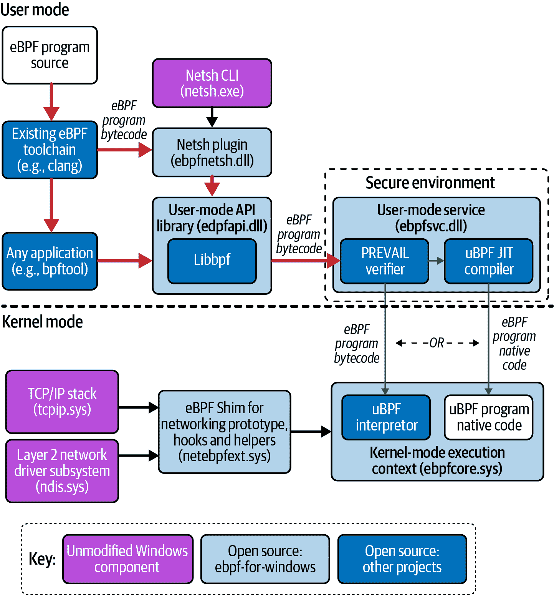

# 第十一章：eBPF 的未来演进

eBPF 还没有完全成熟！与大多数软件一样，它在 Linux 内核中不断发展，并且正在被添加到 Windows 操作系统中。在这一章中，我们将探讨该技术未来可能的发展路径。

自从在 Linux 内核中引入以来，BPF 已经发展成为具有自己的子系统、邮件列表和维护者。^(1) 随着 eBPF 的流行和兴趣超出 Linux 内核社区，创建一个中立机构来协调各方之间的合作是很有意义的。这个机构就是 eBPF 基金会。

# eBPF 基金会

[eBPF 基金会](https://ebpf.io/foundation) 由 Google、Isovalent、Meta（当时称为 Facebook）、Microsoft 和 Netflix 在 Linux 基金会的支持下于 2021 年成立。该基金会作为一个中立机构，可以持有资金和知识产权，各商业公司可以在此基础上进行合作。

这并不意味着要改变 Linux 内核社区和 Linux BPF 子系统的开发方式。基金会的活动由 BPF 领导委员会指导，该委员会完全由技术专家组成，包括 Linux 内核 BPF 维护者和其他核心 eBPF 项目的代表。

eBPF 基金会专注于 eBPF 作为技术平台及其生态系统中支持 eBPF 开发的工具。构建在 eBPF 之上的项目若寻求中立的管理，可能会在其他基金会中找到更合适的归属。例如，Cilium、Pixie 和 Falco 都是 CNCF 的一部分，这是有道理的，因为它们都旨在用于云原生环境。

在现有的 Linux 维护者之外，推动此次合作的关键驱动力是微软对在 Windows 操作系统中发展 eBPF 的兴趣。这带来了制定 eBPF 标准的需求，以便可以在不同操作系统上使用相同的程序。这项工作在 eBPF 基金会的支持下进行。

# Windows 上的 eBPF

微软正在积极支持 [Windows 上的 eBPF](https://oreil.ly/ArwkR)。在我写下这些文字的 2022 年末，已经有 [功能演示](https://oreil.ly/H-0dv) 显示 Cilium 第四层负载均衡和基于 eBPF 的连接跟踪在 Windows 上的运行。

我之前说过，eBPF 编程就是内核编程，乍一看，似乎不太可能写一个程序在 Linux 内核中运行，并且访问 Linux 内核数据结构，然后它能在完全不同的操作系统中运行。但实际上，特别是在网络方面，所有操作系统都有很多共同之处。无论是在 Windows 还是 Linux 机器上创建的网络数据包，其结构都是相同的，网络堆栈的处理方式也是一样的。

你还记得 eBPF 程序由一组字节码指令组成，由内核中实现的虚拟机（VM）处理。在 Windows 中也可以实现这个 VM！

图 11-1 展示了 eBPF for Windows 的架构概述，来源于 [项目的 GitHub 仓库](https://oreil.ly/Ii4j2)。从这张图中可以看出，eBPF for Windows 重用了现有 eBPF 生态系统中的一些开源组件，比如 *libbpf*，以及 Clang 支持生成 eBPF 字节码。Linux 内核采用 GPL 许可，而 Windows 是专有的，因此 Windows 项目无法重用 Linux 内核的验证器实现。^(3) 反而，它使用了 [PREVAIL 验证器](https://vbpf.github.io) 和 [uBPF JIT 编译器](https://oreil.ly/btrkJ)（两者都采用宽松许可，以便更广泛地被项目和组织使用）。

###### 图 11-1\. eBPF for Windows 的架构概述，改编自 [*https://oreil.ly/HxKsu*](https://oreil.ly/HxKsu)

一个有趣的区别是，在 Windows 安全环境中，eBPF 代码是在用户空间进行验证和 JIT 编译的，而不是在内核中（在 图 11-1 中显示的 uBPF 解释器仅用于调试构建，而非生产环境）。

期望每一个在 Linux 上运行的 eBPF 程序都能在 Windows 上工作是不现实的。但这与使 eBPF 程序在不同 Linux 内核版本上运行的挑战并没有太大不同：即使有了 CO-RE 支持，内部内核数据结构在版本之间也可能会被更改、添加或删除。处理这些可能性，是 eBPF 程序员的工作。

谈到 Linux 内核的变更，我们可以期待 eBPF 在未来几年的哪些变化？

# Linux eBPF 演进

自 3.15 版以来，eBPF 的能力随着每个内核发布而演进。如果你想了解每个版本提供了哪些功能，请查看 BCC 项目维护的 [有用列表](https://oreil.ly/4H5hU)。我确实期待未来会有更多的新增功能。

要预测未来的最佳方法就是简单地听取那些正在从事相关工作的人的意见。例如，在 2022 年 Linux 管道会议上，eBPF 维护者 Alexei Starovoitov 发表了一篇演讲，讨论了他对 eBPF 程序中使用的 C 语言未来演变的期望。^(4) 我们已经看到 eBPF 从支持几千条指令逐步演变为支持几乎无限复杂性，添加了对循环的支持和日益增加的 BPF 助手函数集。随着支持的 C 语言增加了额外的功能，以及验证器的支持，eBPF C 语言可能会演变成允许像开发内核模块一样灵活，但具备 eBPF 的安全性和动态加载特性。

正在讨论和开发的其他一些新 eBPF 特性和功能包括：

签名的 eBPF 程序

软件供应链安全是过去几年的热门话题，关键元素之一是能够检查您考虑运行的程序来自预期来源并且未被篡改。一种通用的方法是验证程序伴随的加密签名。你可能认为这是内核可以为 eBPF 程序做的事情之一，也许作为验证步骤的一部分，但不幸的是这并不简单！正如您在本书中看到的，用户空间加载器会动态调整程序，并提供有关地图位置以及从签名角度来看难以区分的恶意修改，这是一个问题，eBPF 社区正[急于找到解决方案](https://oreil.ly/ns03-)。

长期存活的内核指针

一个 eBPF 程序可以使用助手函数或 kfunc 检索指向内核对象的指针，但指针仅在程序的执行期间有效。不能将指针存储在地图中以供以后检索。支持[类型化指针](https://oreil.ly/fWVdo)的想法将在这一领域提供更多的灵活性。

内存分配

对于 eBPF 程序来说，简单调用像`kmalloc()`这样的内存分配函数是不安全的，但有[一个建议提议](https://oreil.ly/Yxxc5)了 eBPF 特定的替代方案。

当新的 eBPF 功能出现时，您将能够利用它们吗？作为最终用户，您能够利用的功能取决于您在生产中运行的内核版本，在第一章中我讨论过，Linux 内核发布稳定版本可能需要数年时间才能到达。作为个人，您可能会选择一个最新的内核，但是大多数运行服务器部署的组织使用的是稳定且受支持的版本。eBPF 程序员必须考虑到，如果他们编写的代码利用了内核中添加的最新功能，这些功能在大多数生产环境中可能几年内还不能使用。一些组织可能会有足够紧急的需求，值得更快地推出新的内核版本，以便早日采用新的 eBPF 功能。

例如，在另一个展望未来的讲话中，Daniel Borkmann 讨论了一个名为 *Big TCP* 的功能，该功能在 Linux 5.19 版本中添加，通过批处理网络数据包以在内核中处理，实现了 100 GBit/s（甚至更快）的网络速度。大多数 Linux 发行版几年内不会支持这么新的内核，但对于处理大量网络流量的专业组织来说，可能更快升级是值得的。现在将 Big TCP 支持加入 eBPF 和 Cilium，这意味着对于那些大规模用户而言，即使大多数人暂时无法启用它，它也是可用的。

由于 eBPF 允许动态调整内核代码，因此合理地预期它将用于解决“现场”问题。在第九章中，您可以了解到使用 eBPF 缓解内核漏洞的情况；还在进行使用 eBPF 支持硬件设备，例如[人机界面设备](https://oreil.ly/JVYcY)，如鼠标、键盘和游戏控制器。这是基于我在第七章中提到的支持解码红外控制器使用的协议的现有支持。

# eBPF 是一个平台，而不是一个功能。

将近十年前，热门的新技术是容器，似乎每个人都在谈论它们及其带来的优势。今天，我们在 eBPF 领域也处于类似的阶段，有许多会议演讲和博客文章——其中本书中引用了几篇——赞扬 eBPF 的好处。今天，对于许多开发人员来说，容器已经成为日常生活的一部分，无论是使用 Docker 或其他容器运行时在本地运行代码，还是将代码部署到 Kubernetes 环境中。eBPF 是否也会成为每个人的常规工具包呢？

我相信答案是否定的，或者至少不是直接的。大多数用户不会直接编写 eBPF 程序，也不会使用类似`bpftool`的实用程序手动操作它们。但他们会定期与使用 eBPF 构建的工具进行交互，无论是性能测量、调试、网络、安全、跟踪，还是其他许多尚未使用 eBPF 实现的功能。用户可能并不知道他们在使用 eBPF，就像他们可能不知道使用容器时使用了像命名空间和控制组这样的内核特性一样。

如今，具备 eBPF 知识的项目和供应商因其强大性能和许多优势而突显其使用。随着基于 eBPF 的项目和产品在市场上占据越来越大的份额，eBPF 正在成为基础设施工具的事实标准技术平台。

eBPF 编程的知识是一种仍然很抢手但相对稀有的技能，就像今天内核开发比起开发业务应用或游戏来说要少得多一样。如果你喜欢深入系统的底层并且想要构建基础设施工具，eBPF 技能将对你大有裨益。我希望本书对你的 eBPF 之旅有所帮助！

# 结论

恭喜你完成了本书的阅读！

我希望通过阅读《学习 eBPF》使你深入了解 eBPF 的强大之处。也许它已经激发了你自己编写 eBPF 代码或尝试我讨论过的一些工具的兴趣。如果你已经决定进行一些 eBPF 编程，希望本书能给你一些开始的信心。如果你在阅读本书时完成了练习，那就太棒了！

如果你对 eBPF 感到兴奋，有很多参与社区的方式。最好的起点是访问网站[ebpf.io](http://ebpf.io)。这将引导你了解最新的新闻、项目、活动，还有[eBPF Slack](http://ebpf.io/slack)频道，你很可能会在那里找到专家来回答你可能有的任何问题。

我欢迎你的反馈、评论以及对本文的任何更正。你可以通过附带本书的 GitHub 仓库提供你的意见：[*github.com/lizrice/learning-ebpf*](https://github.com/lizrice/learning-ebpf)。我也很乐意直接听取你的意见。你可以在互联网的许多地方找到我，我的用户名是@lizrice。

^(1) 向 Meta 的 Alexei Starovoitov 和 Andrii Nakryiko，以及 Isovalent 的 Daniel Borkmann 致敬，他们在 Linux 内核中维护 BPF 子树。

^(2) [Dave Thaler 在 Linux Plumbers Conference 上介绍了这项标准化工作的进展](https://oreil.ly/4bo6Y)。

^(3) 嗯，的确可以，但这样做需要微软也以 GPL 许可证发布 Windows 源代码。

^(4) Alexei Starovoitov 讨论了 BPF 从受限 C 语言到扩展和安全 C 的发展过程，[视频链接在此](https://oreil.ly/xunKW)。
