## 第一部分\. 让 Linux 运行起来

《一个月午餐学 Linux》的前六章旨在让你开始使用 Linux。本节旨在让你快速了解 Linux 是什么，并让它为你运行。将这一节视为你对 Linux 的入门介绍，重点是让你尽可能快、尽可能容易地使用它。你将学习

+   Linux 是什么以及它是如何工作的

+   如何安装 Linux

+   如何了解您的系统

+   桌面环境是如何工作的，以及如何使用这些新界面

## 第一章\. 开始之前

当被要求列举一个操作系统时，大多数人可能首先想到的是 Windows 和 OS X。这两个是家庭和工作场所最常用的桌面操作系统。但 Linux 一直存在，不如其他操作系统那么显眼。Linux 为互联网上的许多服务器和 Android 移动操作系统提供动力。Linux 也可以用于桌面工作，世界各地的人们用它来做从文字处理到音频编辑，再到普通的网页浏览等各种事情。

虽然常见的形象是一位系统管理员坐在数百个终端屏幕前，疯狂地在命令行中输入，但现实是大多数人可以学会用它来处理日常的工作。这本书是为对 Linux 感兴趣的人设计的。一些读者可能从这本书中获得了技能和愿望，想要进入技术领域，如系统管理。其他人可能只想将 Linux 用于日常工作。两种结果都很好，而且两种结果都是可能的，因为 Linux 的灵活性。

### 1.1\. 为什么 Linux 重要

我们与电脑的关系是亲密的。这是我们许多人大部分时间都在的地方。你可能在平板电脑上消费内容，但如果你在做严肃的工作，比如编辑照片或撰写文章，你很可能会在笔记本电脑或台式机上做。OS X 和 Windows 正在向移动方向发展，允许用户通过触摸屏与应用程序和图标交互，但并不一定支持严肃的工作或定制。能够定制并打造个性化的体验是 Linux 的亮点。

Linux 是由林纳斯·托瓦兹在 20 世纪 90 年代初开发的。当时是计算机科学研究生的托瓦兹，希望在他的电脑上运行 UNIX 操作系统，因此开发了 Linux 内核（关于内核的更多信息请参阅第二章)，作为 UNIX 的替代形式。UNIX 有不同的版本——OS X 也是基于它的。当托瓦兹使 Linux 可用时，他采用了宽松的许可证，允许任何人下载底层代码并对其进行修改。

托瓦兹还允许任何人向内核贡献代码，这使得 Linux 如此灵活和可定制。全球各地的人和公司都为这个项目做出贡献。这使得为 Linux 进行各种软件开发成为可能，因为底层代码库对任何人开放，而 Windows 和 OS X 则由公司分发，这些公司只将代码库的访问权限授予他们的员工。

Linux 是一个开放的生态系统，这种开放性使得各种软件项目得以涌现。因此，许多人选择使用它，因为它允许他们以其他操作系统无法实现的方式自定义他们的工作流程。实际上，大多数 Windows 和 OS X 程序都有某种 Linux 等价物。随着基于云的软件（通过网页浏览器与之交互的软件）的兴起，在软件方面，底层操作系统的意义越来越小。

使用 Linux，你对自己的系统拥有一种在其他操作系统中技术上不可能达到的控制水平。这就像驾驶自动挡汽车与手动挡汽车之间的区别。用户可以选择他们的系统外观、为每个任务使用的程序，甚至如何与系统交互。Linux 不像其他操作系统那样要求用户遵守界面，而是允许用户选择自己的路径，这也是为什么许多人用它来处理日常桌面工作。Linux 允许用户访问不同的桌面界面和大量软件，其中大部分是免费的。

我是因为对 Windows 的挫败感而转向 Linux 的。Windows 从未做到我需要它做到的事情，无论是速度上还是移动电脑方面。我从大学室友那里听说过 Linux，也玩过它，但从未超过短暂的实验。最终我达到了一个转折点，决定在我的笔记本电脑上安装 Linux，旁边是 Windows，这样我就可以访问两个操作系统。突然间，我的世界变得有意义。我有一个快速响应的系统，它以我想要的方式工作。我可以选择我的操作系统如何表现，并且我可以访问一个全新的软件世界。这是一个相当典型的 Linux 故事，甚至可能（或将成为）你的故事。

Linux 不仅仅关于可定制性。有些人使用 Linux 是因为它是免费的，因为它在旧硬件上运行良好。其他人使用它是因为他们认同免费和开源软件的美学。

### 1.2. 这本书适合你吗？

许多对 Linux 感兴趣的人都在寻求成为系统管理员，与服务器一起工作。这些是高度技术性的工作，需要复杂的技能集。这本书并不是为这个受众设计的，尽管如果你对成为系统管理员感兴趣，这本书无疑是一个坚实的第一步。相反，*《一个月午餐时间学会 Linux》* 是为对过渡到 Linux 感兴趣的用户设计的。也许你想要为自己运行一个小型网络服务器。或者也许你想要在你的家用电脑上运行 Linux。或者也许你已经在运行它了，但你不确定下一步该做什么。

我认为 Linux 适合每个人。尽管它需要一定程度的专业技术，但任何对 Linux 感兴趣的人都可以学习如何有效地使用它作为他们的日常操作系统。这为软件和工作流程提供了广阔的机会，使生活比使用封闭源代码操作系统时更加轻松。Linux 被艺术家、记者、音乐家和教育工作者等各行各业的人使用。换句话说，它对任何需要使用计算机来完成工作的人来说都是有用的。这本书是为那些想要学习如何使用 Linux 的人准备的，无论是为了在工作中完成更多任务，还是作为系统管理员职业道路的一部分。

这本书将逐步向您展示如何利用 Linux，而无需具备广泛的技术或编程技能。它将解释 Linux 的概念和术语，以及如何使用图形用户界面（GUI），这是大多数人使用 Linux 的方式。它还将向您展示如何使用命令行，这并不像听起来那么困难。Linux 可能看起来令人畏惧，但通过这本书的学习应该能让您足够舒适地全职使用它。

此外，这本书并不是详尽的。Linux 是一个巨大的主题，需要超过一个月的时间才能掌握。我的目标是让你在月底能够熟练地使用它。我的希望是到月底，你将准备好更深入地探索 Linux。

### 1.3\. 使用本书

*《一个月午餐时间学会 Linux》* 的理念是每天阅读一章。你不必在午餐时阅读（我无法确定你何时阅读），但每章应该花费你大约 40 分钟来阅读，剩下的 20 分钟可以用来匆匆吃完午餐或练习本章展示的内容。尽量每天只专注于一章。集中精力。让你的大脑吸收它。然后，第二天，你将准备好阅读下一章，精神焕发，准备好学习更多。

#### 1.3.1\. 主要章节

本书的大部分内容，从 第二章 到 第二十三章，代表了帮助你学习 Linux 的主要内容。这意味着你应该能够在大约一个月内通过每天阅读一章来完成这本书。尽量坚持这个时间表，每天真正学习一章并练习所学内容。尽量不要一天内快速浏览多个章节。并且记住，不是每个章节都需要整整一个小时，这意味着有些日子你会有额外的时间进行练习（和用餐），然后再回去工作。

这些章节分为三个部分：

+   第一部分 教你如何运行 Linux 以及如何与之交互

+   第二部分 教你如何作为用户使用 Linux

+   第三部分 教你如何维护和管理你的 Linux 系统

#### 1.3.2. 实践实验室

大多数主要内容章节都包含一个简短的实验室供你完成。你会得到指示，也许还有一两个提示来引导你走向正确的方向。答案可以在书的后面和网上找到，在 [www.manning.com/books/learn-linux-in-a-month-of-lunches](http://www.manning.com/books/learn-linux-in-a-month-of-lunches)，但尽量在不查看它们的情况下完成每个实验室。

#### 1.3.3. 进一步探索

本书中的几章只是简要介绍了 Linux 的一些酷炫潜力，我会在结尾处给出一些建议，告诉你如何自己探索 Linux 的这些部分。我会指出一些额外的资源，包括你可以根据需要使用的免费资源，以扩展你的技能集。

### 1.4. 设置你的实验室环境

我将在 第三章 中讨论安装 Linux，所以现在你不需要做任何事情。

Linux 有许多不同的版本，被称为 *发行版*。每个发行版都可以使用不同的桌面环境。这意味着 Linux 的外观并不一致。即使是使用两个不同版本的 Ubuntu 的两个人，他们的屏幕上可能看到的也不一样。为了本书的目的，我使用的是 Ubuntu 14.04。如果你对 Linux 非常陌生，我也建议你使用它。这是一个长期支持版本，这意味着它将更新到 2019 年。这意味着你不必担心相当长一段时间内的安全更新。图 1.1 展示了默认的 Ubuntu 14.04 桌面外观。

##### 图 1.1. 默认的 Ubuntu 14.04 桌面。如果你之前没有尝试过 Linux，这是一个很好的起点。

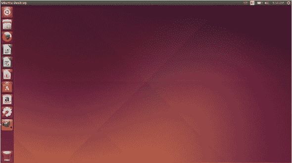

如果您更喜欢另一个发行版，或者如果您想使用 Ubuntu 的不同版本，本书对此没有问题！只是请注意，我的一些截图可能与您的不一样。事物可能位于略微不同的位置。在不同的发行版上，一些命令和程序也可能不同。Linux 的美丽之处在于它为用户提供自由，但代价是人们可能会以不同的方式体验它。当您学习即将到来的章节时，您会看到这是为这个奇妙强大的工具所付出的微小代价。

### 1.5\. 在线资源

我希望您能抽出时间访问[www.manning.com/books/learn-linux-in-a-month-of-lunches](http://www.manning.com/books/learn-linux-in-a-month-of-lunches)。它提供了本书的补充资源：

+   每章末尾实验的示例答案

+   链接到讨论论坛，您可以在那里提出关于本书的问题或提交反馈

我对 Linux 充满热情，我喜欢听到其他人对其的热情。您随时可以通过 Twitter（@steven_ovadia）联系我。我很乐意听到您对我们可能添加到本书网站（[www.manning.com/books/learn-linux-in-a-month-of-lunches](http://www.manning.com/books/learn-linux-in-a-month-of-lunches)）以及本书未来版本的反馈。此外，如果您正在阅读这本书，您可能会喜欢我的网站 My Linux Rig（[www.mylinuxrig.com](http://www.mylinuxrig.com)），该网站每周都会采访关于人们 Linux 配置的人。也许您甚至会提交您的配置！

### 1.6\. 立即用 Linux 变得有效

我写这本书的目标是让您立即变得有效。尽可能多地将每一章聚焦于您可以在真实 Linux 环境中立即使用的某些内容。这意味着我有时会略过一些细节，但在必要时，我会回头在适当的时候讲解它们。在许多情况下，我必须在 20 页的理论和直接动手实现某事而不解释所有细微差别、注意事项和细节之间做出选择。当这些选择出现时，我几乎总是选择直接动手，目标是让您立即变得有效。但所有这些重要的细节和细微差别仍将在本书的另一个时间点进行解释。

背景介绍已经足够。现在是时候开始立即变得有效了。您的第一堂午餐课程正在等待。

## 第二章. 了解 Linux

上一章是本书的介绍，现在介绍已经完成，我们可以开始愉快地学习 Linux 了！本章将向您介绍发行版和仓库的概念。我们谈论 Linux 时将其视为一个统一的概念，但实际上它是在一个共同的核心——Linux 内核——之上构建的几种不同类型的结构。在今天的午餐结束时，您将理解所有这些，使我们能够在本书的剩余部分使用我们的特定系统。

### 2.1\. 发行版

*发行版*，或称*distros*，是 Linux 的不同版本。发行版基于 Linux 内核（我稍后会谈到内核）进行构建，为用户提供体验，选择特定的软件并做出某些技术选择。这包括

+   那个发行版的存储库中包含哪些软件（相当于 Windows 应用商店或 Mac 的 iTunes 商店）

+   那些存储库中可用的软件版本

+   那些软件如何在用户的系统中实现

这意味着尽管 Linux 是 Linux，但并非所有发行版都可以互换。如果你正在使用一个发行版并想切换到另一个，你不能简单地切换开关。相反，你需要完全安装新的发行版。如果你正在运行一个发行版并想要另一个发行版存储库中的软件，你不能连接到另一个存储库。如果你在网上找到一个发行版的软件包，你也不能保证能在你的系统上安装它。

不同的发行版可能看起来相同，但它们之间存在技术差异，阻止它们相互替换。发行版是生态系统。Linux 的大优势在于它不是一个封闭的生态系统。它提供了很多选择和灵活性，所以如果你不喜欢你的发行版默认选择的音乐播放器，移除它并用你喜欢的替换它是非常简单的。如果你想要的软件不在存储库中，通常有安装它的方法。

发行版也有个性。有些发行版更喜欢拥有软件的最新版本，而有些则更重视稳定性。有些发行版努力为用户提供有意的旅程，选择特定的软件和实施特定的设计，目标是让用户以某种方式与软件互动。其他发行版更喜欢保持相对原始的状态，这样用户就可以根据自己的系统做出选择。选择发行版是一个个人选择，大多数人通过*distro-hopping*（尝试不同发行版的过程），就像金发姑娘一样，直到找到最合适的一个。

**免费和开源软件**

你经常会听到与 Linux 一起使用的术语*免费和开源软件*。这个术语意味着任何人都可以访问 Linux 的底层代码，这也是项目能够快速高效增长的原因。免费和开源项目不是从头开始，而是使用现有的代码，并对其进行增强和以新的方式改变。除了 Linux 之外，还有很多其他使用类似哲学的项目，这通常通过某种开放许可证来表示。例如，Firefox 是免费和开源软件。任何人都可以下载代码并更改它，或者创建自己的 Firefox 版本。

你经常会听到与 Linux 相关的 *免费* 这个词。在社区中，成员们谈论“免费如啤酒”，意味着免费，以及“免费如自由”，意味着开源软件。并非所有免费软件都是开源的，也并非所有开源软件都是免费的。一些公司通过为开源工具增加价值来赚钱。例如，WordPress，一个博客工具，是免费且开源的，但他们提供付费托管免费软件的服务。一些出于政治原因使用 Linux 的人不想与封闭的非免费格式互动。其他人则希望能够做一些像观看 YouTube 视频这样的事情，这可能需要专有软件。

虽然并非所有 Linux 软件都是免费和开源的。一些公司为 Linux 开发专有软件，这意味着虽然软件可以在 Linux 系统上运行，甚至在仓库中找到，但底层代码是不可用且不可见的。Linux 中最常见的此类例子是 Flash，这是一种有时用于在网站上观看视频的软件。但还有更多例子。Google 的 Chrome 浏览器不是开源的，但有一个名为 Chromium 的开源项目版本。

如果你来到 Linux 是为了支持免费和开源软件及项目，这些区别很重要。但许多人使用 Linux 是因为它可定制（部分原因是因为其许多组件的开源性质）并且表现良好。当然，许多人出于实际原因而来，最终却因为政治原因而留下。

### 2.2\. Ubuntu

由于本书中我们将使用 Ubuntu (图 2.1)，让我们花几分钟时间来谈谈它作为一个发行版的情况。Ubuntu 以用户友好著称。它有一个简单的安装过程，正如你在第三章中将会看到的，并且旨在让用户的使用变得简单。然而，为了这种便利，Ubuntu 为用户做了很多决定，有些人欣赏这一点，但有些人则不然。作为易用性的一部分，Ubuntu 通常会提供较旧但更稳定的软件版本，但不一定是最新版本，有时这些版本可能不稳定，甚至可能破坏你的系统中的某些东西。Ubuntu 有一个称为 *长期稳定* 版本的概念，简称 LTS：

+   LTS 版本支持五年。

+   非 LTS 版本支持九个月。

##### 图 2.1\. Ubuntu 标志。Ubuntu 是本书中将使用的发行版。

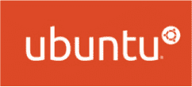

如果你打算长时间使用桌面系统，而不需要升级到 Ubuntu 的新版本，那么我们在这里使用的 LTS 版本就是你的选择。

*Ubuntu 基于 Debian 发行版*。这是你在 Linux 发行版中会注意到的事情之一——它们通常建立在其他发行版的基础上。在 Ubuntu 的例子中，开发者使用 Debian 作为基础，然后在其之上添加自己的软件和设计决策。由于没有人拥有 Linux，这种合作可以在没有复杂的谈判或合同的情况下进行。

#### 2.2.1\. Debian

Debian (图 2.2) 是 Ubuntu 基于的发行版。Debian 追求稳定性，其哲学是“准备好就发布”。这意味着新版本不是与特定日历相关联。相反，社区将保持发布，直到它们被认为足够稳定可以上线。图 2.3 显示了 Debian 桌面。

##### 图 2.2\. Debian 标志的图片。Ubuntu 基于 Debian。

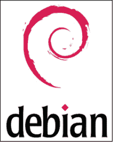

##### 图 2.3\. 一个 Debian 桌面。

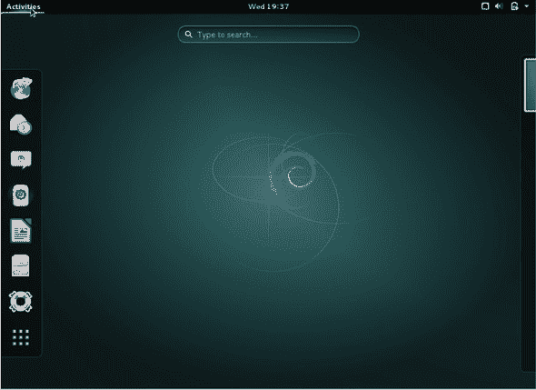

在 Linux 世界中，你会听到很多关于稳定性的讨论。稳定性是可预测性的另一个词。它表示软件在没有问题的情况下运行。通常，这意味着使用较旧的软件，这些软件比新软件经过了更广泛的测试。由于 Linux 通常用于服务器，这些服务器用于各种重要应用，因此稳定性是一个重要的特性——通常被认为比软件的新版本更重要。稳定性对于桌面 Linux 也是一个重要的特性。你总是希望能够访问和使用你的桌面系统。

Debian 有三个版本：

+   ***稳定版—*** 当前发布版本

+   ***测试版—*** 正在考虑用于稳定版的软件版本

+   ***不稳定版—*** 开发者在其中工作，在将其放入测试版和最终稳定版的仓库之前测试软件

如其名所示，稳定版是稳定的，但许多人日常工作中使用测试版而没有出现任何问题。Debian 也更有一种自由和开源的精神，尽管有软件包帮助用户查看如 Flash 这样的闭源格式，但它并没有像其他发行版那样在安装过程中被深度集成。正因为如此，许多出于政治原因使用 Linux 的人倾向于选择 Debian。

#### 2.2.2\. Fedora

Fedora (图 2.4) 是 Red Hat Enterprise Linux 的社区版本。Red Hat 是一家上市公司，它向公司销售自己的 Linux 版本。Fedora 是免费版本，允许它测试想法和概念。然而，Fedora 项目由一个委员会领导，其中一些成员是由社区选举产生的。这种治理模式存在于许多自由和开源项目中，并且对于 Fedora 特别有效，因为它在项目中保持了平衡，防止它成为 Red Hat 的另一个版本。

##### 图 2.4\. Fedora 标志。Fedora 与 Red Hat Linux 有关，但是一个社区驱动的项目。

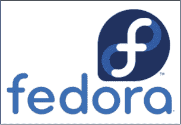

Fedora 通常拥有更近版本的软件，因此对于新用户来说，有时可能会更具挑战性。Fedora 大约每 6 个月发布一个新版本，并为每个版本提供 13 个月的支持，这意味着（理论上）你每年需要更新一次你的 Fedora 安装，尽管在实践中，许多人会保持更长时间。Fedora 桌面如图 2.5 所示。

##### 图 2.5\. Fedora 桌面，看起来与 Debian 的桌面非常相似（它们使用相同的桌面管理器）

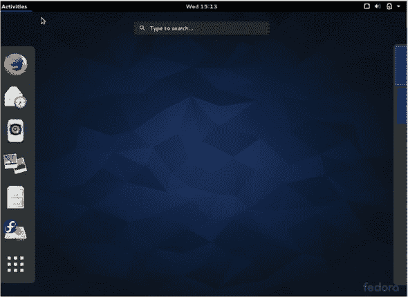

#### 2.2.3\. Linux Mint

Linux Mint（见图 2.6）是另一个被认为对初学者友好的发行版。Linux Mint 建立在 Ubuntu 之上，因此如果你在家中跟随，它距离 Debian 有两步之遥。有一个基于 Debian 的 Linux Mint 版本，即 Linux Mint Debian Edition，但大部分情况下，它被认为是一个 Ubuntu 变体。

##### 图 2.6\. Linux Mint 标志。Linux Mint 基于 Ubuntu，而 Ubuntu 又基于 Debian。许多发行版都是这样相互关联的。

Linux Mint 是发行版如何基于管理选择而非技术选择而有所不同的一个很好的例子。Linux Mint 有自己的外观，其中一部分是基于桌面环境的选择（见图 2.7），其中一些是基于像其调色板这样的东西。它包括易于安装的非免费多媒体支持，与 Debian 不同，但用户可以决定是否需要这种支持。非免费多媒体意味着专有格式，如 Adobe Flash 和 MP3。

##### 图 2.7\. Linux Mint 桌面——它的两个默认桌面环境之一

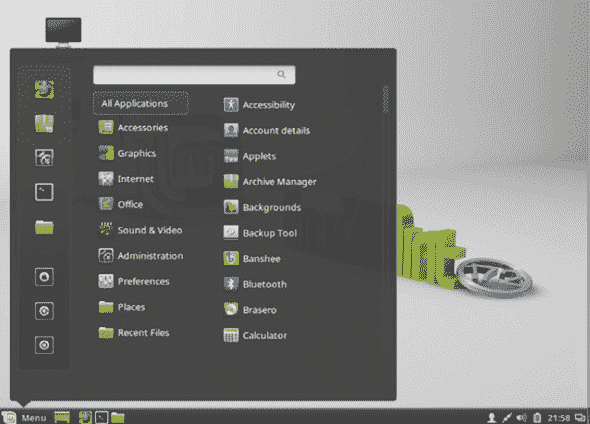

关于 Linux Mint 的一个最后说明。虽然大多数发行版鼓励用户更新到最新版本，但 Linux Mint 建议用户停留在对他们来说正在工作的版本上。

#### 2.2.4\. Arch

Arch（见图 2.8）是用户友好性最差的发行版之一，尽管 Arch 社区的人不会这样描述它。Arch 的哲学是给予用户对其 Linux 桌面的完全控制权，从安装的软件到更新的频率。这种灵活性的代价是，由于发行版没有考虑这些事情，最终用户需要（见图 2.9）。

##### 图 2.8\. archlinux 标志。Arch 总是拥有最新的软件版本，这使得它有时难以管理。

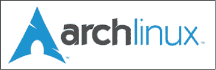

##### 图 2.9\. Arch 没有默认设置，因此它可以看起来像用户想要的任何样子。

Arch 的安装比较复杂。它不使用 Fedora、Ubuntu 和 Mint 等发行版中看到的图形安装程序。Arch 的所有内容都有很好的文档记录，但更新有时会导致系统崩溃。在 Arch 社区中，崩溃被认为是一件好事，因为它帮助用户通过找出如何修复它们来了解他们的系统。但并不是每个人都想以那种程度了解他们的系统。使 Arch 比其他发行版更易变的一个因素是它使用软件的最新版本。所以正如 Debian 因其稳定性而受到重视，以使用较旧但经过验证和可靠的软件版本为代价一样，Arch 因拥有最新的软件而受到重视，但以牺牲稳定性为代价。

#### 2.2.5. 其他发行版

有许多其他的发行版。有些是完全原创的项目，例如 OpenSUSE。其他则是基于现有项目的变体。例如，你刚刚了解到 Ubuntu 和 Mint 是 Debian 的变体。Manjaro Linux 是 Arch 的一个变体。了解变体对于找到适合你的发行版很有帮助。表 2.1 比较了我们在这里提到的五个发行版在稳定性和开源精神方面的特点——这是我们迄今为止提到的两个比较点。你可能会在阅读本书的过程中保留一个比较点的清单，并为此表添加你自己的参考。

##### 表 2.1. 比较发行版在稳定性和开源精神方面的特点

| 发行版 | 稳定性 | 开源精神 |
| --- | --- | --- |
| Arch | 最前沿的软件 | 完全由用户决定 |
| Debian | Debian Stable 稳定；Testing 有更新的软件。 | 由用户决定，但优先考虑自由和开源精神 |
| Fedora | 更新的软件，但相对稳定 | 默认不包含专有软件 |
| Mint | 建立起来的软件 | 包含一些专有软件 |
| Ubuntu | 建立起来的软件 | 包含一些专有软件 |

一些人对他们喜欢基于 Debian 的发行版有所了解，这有助于你找到潜在的分发版。你还会看到基于桌面环境的分发版变体（我将在第五章中更多地讨论桌面环境）。但到目前为止，请注意，当你看到像 Lubuntu 这样的东西时，它是一个在顶部具有不同界面的 Ubuntu 版本。

### 2.3. 选择发行版

为了本书的目的，我们使用的是 Ubuntu 14.04，所以在选择你自己的发行版方面你并没有太多的选择。但一个月后你将完成这本书，你可能想尝试一些除了 Ubuntu 之外的东西。选择发行版是个人化的，但有一些一般性的事情需要考虑。在了解 Linux 的早期阶段就承诺一个发行版还为时尚早，但考虑一下什么可能适合你和你的工作流程并不算太早。我们将更详细地探讨这里讨论的许多想法，但现在，以下是一些关于发行版需要考虑的事项：

+   ***界面对你来说是否合理？*** 我们将在第五章讨论桌面环境，但就大部分内容而言，你几乎可以使用任何发行版你想要的桌面环境。

+   ***思考软件。*** 你是想使用最新版本的软件，还是更关心保持你的系统稳定运行？Arch 会为你提供最新的软件。Debian Stable 使用较旧的软件，提供更稳定的系统。但对于一些人来说，Debian Testing 是一个不错的折衷方案。

+   ***考虑你的政治立场。*** 你是来 Linux 支持免费和开源软件的吗？你是试图避免专有软件吗？像 Debian 和 Arch 这样的发行版在广泛的意义上更支持这种使用，没有假设用户会想与专有软件一起工作。你的政治立场可能会影响你选择的发行版。

+   ***考虑社区。*** 每个发行版都有自己的社区。哪个在支持和文档方面感觉更合适？Arch 具有挑战性，但文档非常出色。而且由于 Ubuntu 是一个非常常见的发行版，支持论坛中有很多帮助。

选择一个发行版并不是终身的承诺，但它可能是一种时间上的承诺——尤其是对于 Linux 的新手来说。Ubuntu 14.04 在接下来的一个月里会为你服务得很好，但随着我们这本书的进展，我会定期让你反思哪些 Linux 的部分最适合你。

### 2.4\. 仓库

由于我们在谈论软件，让我们快速概述一下软件是如何与 Linux 一起工作的。大部分情况下，你从你的发行版维护的 *仓库* 中下载软件。你很少需要导航到网站，下载一个程序，然后安装它。仓库是一个软件集合。它是一个单一的地方，所有发行版的软件都保存在那里。把它想象成一个带有额外规则的 app store。事实上，你可以通过一个名为 Ubuntu Software Center 的应用商店界面来访问 Ubuntu 仓库，如图 2.10 所示。

##### 图 2.10\. Ubuntu 的应用商店看起来可能就像你在手机上访问的那样。

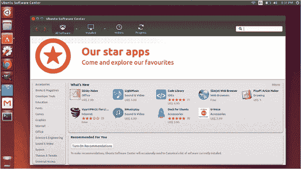

通常，仓库有不同的软件版本。一些仓库倾向于有较新的软件版本；其他可能有的版本较旧。由于软件总是在变化，没有标准的版本。相反，你使用的软件版本取决于仓库中可用的内容。

+   仓库是针对特定发行版的，所以如果某个发行版的仓库中有某个软件，它可能不在另一个发行版的仓库中。

+   仓库也是版本特定的，所以如果一个软件在 Ubuntu 12.04 的仓库中，它可能不在更新的 Ubuntu 14.04 仓库中。这就是同一发行版的版本之间相互区分的原因。

仓库是使不同发行版彼此不同的因素之一。软件是由为发行版工作或志愿工作的人添加到仓库中的。大多数发行版在软件被添加到或更新到仓库之前都会对其进行某种测试。

| |
| --- |

##### 注意

当我说软件时，我不仅仅是指为人类设计的程序，比如 Firefox。仓库还处理安全更新以及 Linux 内核的更新。

| |
| --- |

我们将在第十七章章节 17 中更详细地讨论仓库。

### 2.5\. Linux 内核

Linux 就像 Windows、OS X、iOS、Android 和其他操作系统一样，是一个操作系统。操作系统是控制整个设备从硬件到软件的东西，而操作系统的核心是*内核*。这控制着操作系统，处理诸如进程和内存等问题。如果操作系统是一个人，那么内核就是大脑。

内核相当小——图形桌面和应用程序占据了所有空间——并且可以在除了桌面、笔记本电脑和平板电脑之外的大量设备上使用。这就像你在你的汽车、割草机和滑板车上都有一个引擎，但它们的大小非常不同——尽管它们都以相同的方式工作。

操作系统和内核不仅仅是我们在笔记本电脑和设备上看到的可见进程。它们还以我们看不见的方式运行，控制着从家用电器到医疗设备的一切。许多这些设备使用 Linux 内核来运行。我们看不到我们的电视是如何使用 Linux 内核的，但它确实在使用。

我们将要使用的 Linux 是基于 Linux 内核构建的，但添加了大量的软件，使其对人类交互有用。Linux 内核是我们 Linux 操作系统的最基本级别。它是 Linux 之所以为 Linux 的原因。但是，为了使它成为我们日常工作中可用的东西，许多软件被添加到基本内核中，如图 2.11 图 2.11 所示。

##### 图 2.11\. Linux 内核是操作系统的核心，负责协调其外观、声音、硬件操作以及通过网络和互联网与其他设备通信。

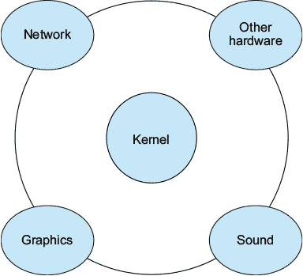

同样，一辆汽车由除了引擎之外的其他许多部件组成。然而，就像没有引擎的汽车无法工作一样，没有内核的 Linux 桌面也无法工作。如果我们车库里有汽车引擎，我们无法做很多事情。为了使其有用，我们需要添加像轮子、变速箱和方向盘这样的东西。Linux 内核是关键，但仅仅写文档或玩游戏是不够的。你需要添加其他软件来使其成为桌面操作系统。

| |
| --- |

##### 注意

如果你进入更技术性的领域，Linux 可能仅仅指内核。在这本书的其余部分，当我讨论 Linux 时，我指的是内核以及添加到内核中的软件，这使得我们人类能够与我们的机器交互。

| |
| --- |

### 2.6\. 总结

这顿午餐花在学习 Linux 的概念上。现在你了解了发行版和仓库，你开始对 Linux 系统的工作方式有了感觉。有了这些知识，你就可以更深入地了解你的系统了，这是我们下次要做的。

#### 术语表

在本章中我解释了：

##### 发行版

在 Linux 内核的基础上构建，为用户提供体验，选择某些软件并做出某些技术选择的 Linux 版本。

##### 自由和开源软件

任何人都可以访问底层代码的软件。

##### 内核

操作系统中处理诸如进程和内存等事务的部分。

### 2.7\. 实验室

我们在这一章的大部分时间里都在谈论不同的发行版。

> **1**. 如果你想要软件的最新版本，你会选择哪个发行版？
> 
> **2**. 如果你想要预装了专有软件，如 Flash，你会选择哪个发行版？
> 
> **3**. 你会推荐哪个版本的 Debian 给那些寻找经过良好测试的东西的人？

现在我要求你进行自己的研究。选择我们在这里讨论的发行版之一，访问其网站。阅读一下那些对你来说听起来有趣的非 Ubuntu 发行版。然后，前往 DistroWatch ([www.distrowatch.com](http://www.distrowatch.com))，这是一个跟踪 Linux 发行版的网站。访问页面点击排名，它根据每个发行版访问 DistroWatch 页面的次数对发行版进行排名。探索一下 DistroWatch 认为流行的（但在这里没有讨论的）发行版。

## 第三章\. 安装 Linux

现在你对 Linux 和发行版有了些背景知识，你就可以继续前进到有趣（也是最令人畏惧）的部分了——*安装它*！有一件事让这个过程不那么可怕，那就是安装程序每年都在变得更好。那些多年前尝试安装 Linux 的人通常会惊讶于这个过程变得多么容易。

正如我在 第一章 中提到的，我们将使用 Ubuntu 14.04。Ubuntu 是发行版，14.04 是版本。这意味着 14.04 有自己的软件仓库。正如我之前提到的，14.04 是一个长期支持版本，这意味着仓库中的软件将在五年内得到更新。

我在这里也使用了“安装”这个词的宽松定义。我实际上将讨论三种不同的方法来运行 Ubuntu：

> **1**. 将 Linux 写入你的本地计算机。
> 
> **2**. 运行一个 *live image*，它可以从 DVD 或 USB 驱动器运行，而不接触你的本地硬盘。
> 
> **3**. 在虚拟机中运行 Linux，就像在你的电脑中安装它一样。我将在最后的实验室部分详细讨论。

本章的目标是通过某种方式将 Ubuntu 安装到您的机器上。如果您安装后遇到问题，请不要担心。问题正是学习的机会！随着您阅读本书，您将学会如何解决在初始安装过程中遇到的任何不完美之处。所以，实际上，在本章结束时，您应该能够启动进入 Ubuntu。不多也不少。

### 3.1. 实时与安装

您应该选择哪种方法？这是一个个人选择。

本节实验室将指导您将 Ubuntu 安装到虚拟机中。我们将在第十五章（kindle_split_024.html#ch15）中更多地讨论虚拟化。将 Ubuntu 安装到虚拟机是学习 Linux 的绝佳选择。您可以在现有的操作系统内运行自己的 Linux 机器。这是两者的最佳结合，因为您可以方便地访问两个操作系统。

实时镜像方法可能是最安全的安装选项。它根本不会改变您的计算机。然而，根据您如何设置您的实时环境，您可能无法保存文件和设置，每次启动时都从全新的 Ubuntu 环境开始。这并不总是方便，但应该适合本书的目的。

如果您只有一台计算机，或者您与他人共享一台计算机（并且那些其他人没有与您一起学习本书），那么虚拟化和实时会话都是很好的选择。如果您使用的计算机不是自己的，这两个选项也是极好的。例如，如果您的雇主为您提供了计算机，如果您返回时安装了新的操作系统，可能会不太受欢迎。Ubuntu 在苹果硬件上安装也可能很棘手，所以如果您考虑擦除苹果机器，您可能现在想使用实时镜像或虚拟安装，并在完成本书后迁移到永久安装。

如果您手头有一台备用计算机，通过现有操作系统安装是一个很好的选择。这是一个低风险的选择，并让您可以轻松访问 Linux 计算机。但问题随之而来，是选择在所有内容上安装 Ubuntu 还是选择双启动计算机，留下两个操作系统。这也是一个个人选择。如果您可以方便地访问另一台 Windows 计算机，并且对定期使用 Ubuntu 感到相当自信，我会建议您选择安装 Ubuntu 并从系统中移除 Windows。这将为您留下一个空间充足的机器。根据您的硬盘大小，Ubuntu 和另一个操作系统一起可能不会给您留下太多空间用于其他文件。而且，如果您依赖于特定于操作系统的软件来完成某些任务，并且您不知道任何 Linux 等价物，您可能想要保留一个分区——硬盘上运行另一个操作系统的部分，无论是什么操作系统。

### 3.2. 创建 Linux 启动镜像

安装 Ubuntu 的第一步是从 Ubuntu 网站下载镜像 ([www.ubuntu.com](http://www.ubuntu.com))。镜像是一个操作系统的完整版本。您正在寻找下载 Ubuntu 桌面版本，而不是云或服务器版本，后者不是为桌面工作设计的。我们正在使用 14.04，尽管有更新的版本。14.04 版本是我撰写本文时支持最好的版本。您还可以选择下载 32 位版本或 64 位版本。如果您不确定您的计算机是哪种类型，您可以通过 Windows 的控制面板或 OS X 下的“关于本机”查看您的计算机的系统信息。

在选择正确的架构后，您将被提示捐赠给 Ubuntu，但您可以跳过该屏幕并免费下载（许多发行版使用下载区域来鼓励对项目的捐赠）。Ubuntu 将是一个大的 .iso 文件。.iso 文件是一个镜像。到目前为止，当您烧录 DVD 和 CD 时，您可能只处理过媒体文件，即图片和声音，或者两者都有。但 .iso 文件不同，所以您不能像烧录 CD 那样烧录它们。

### 3.3. 将镜像烧录到 DVD

文件下载完成后，您需要将其烧录为镜像。无论您是想有一个 live Ubuntu 会话还是想将其安装到硬盘上，您都需要这样做。您要么将其烧录到 DVD，要么烧录到 USB 驱动器。如果您使用 DVD，您使用的任何烧录软件中都应该有一个烧录镜像选项（OS X 和一些 Windows 版本内置了镜像烧录器）。如果您的 Windows 安装中没有工具，ImgBurn ([www.imgburn.com/](http://www.imgburn.com/)) 是一个免费选项。

### 3.4. 将镜像安装到 USB

如果您打算使用 USB 驱动器，您还需要下载一个名为 Universal USB Installer 的软件。从 [www.pendrivelinux.com](http://www.pendrivelinux.com) 下载它，并在您的 Windows 计算机上安装。完成这些后，将您的 USB 驱动器插入计算机。它至少需要 2 GB 的空间。此外，您 USB 驱动器上的所有内容都将被清除，所以请确保上面没有重要文件。Universal USB Installer 将基本上问您三个问题：您使用的是哪个发行版（Ubuntu），.iso 文件在哪里，您的 USB 驱动器在哪里？图 3.1 展示了配置后的样子。您也可以通过点击“下载链接打开”选项（见 图 3.2）自动下载 Ubuntu 镜像。

##### 图 3.1. Universal USB 安装程序的界面

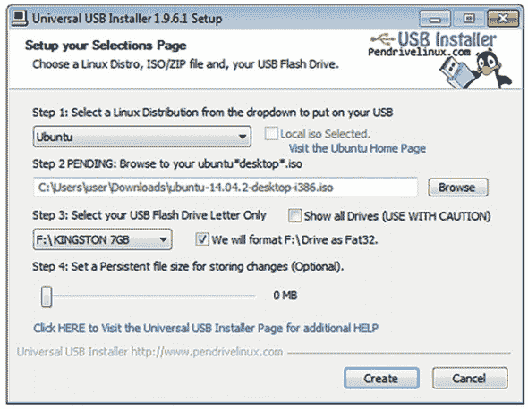

##### 图 3.2. Universal USB Installer 可以为您下载 Ubuntu 镜像。

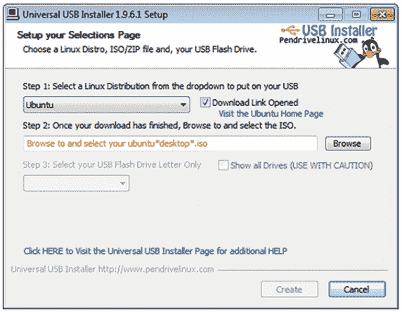

你会注意到有一个询问存储持久文件大小的步骤 4 (图 3.3)。这个选项允许你保存对安装所做的更改（包括你保存的文件），这样你就不必总是从一个干净、未配置的版本开始。这是一个好选项，但也有一些注意事项：

+   这并不适用于每个发行版（但它适用于 Ubuntu）。

+   它需要大量的 USB 空间。我会选择最大 4 GB，以确保安全。

+   并非所有设置都会保存，但很难预测哪些可能不起作用。

##### 图 3.3\. 持久存储允许你在登录之间保存大多数自定义设置。

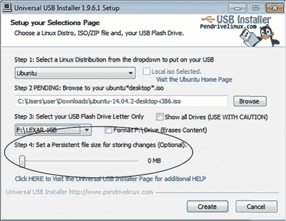

尽管存在这些潜在问题，但如果你有一个大 USB 驱动器，这仍然是一个好选择。

一旦你决定了要做什么并回答了问题，点击创建按钮并等待任务完成。镜像与常规文件不同，这就是为什么你不能像处理 MP3 文件那样将其拖到 USB 驱动器上。你需要 Universal USB Installer 来格式化你的 USB 驱动器，以便你的计算机能够识别该文件为镜像。

在此之后，你就可以开始了。插入 USB 或 DVD，重新启动你的计算机。你的计算机应该会识别镜像并启动你插入的那个。如果不行，只需再次重新启动，在计算机启动时按 F12 或 Esc，这将给你一个启动菜单，你可以手动选择你的启动驱动器。你的 DVD 驱动器通常会有“DVD”这个词，你的 USB 驱动器将会有它的名字。手动选择它，你应该就能启动 Ubuntu。有时，由于某种原因，启动可能不会立即发生，所以你可能需要尝试多次。

安装比以前容易得多，但仍需要一些脑力。确保你第一次尝试时给自己留出时间。不要在午餐休息结束前五分钟做这件事。相反，给自己留出时间缓冲，这样如果出了任何问题，你将更有能力处理。

给它一点时间，等待欢迎屏幕出现。

### 3.5\. 从镜像启动

Ubuntu 启动后，你有两个选择：尝试 Ubuntu 或安装 Ubuntu，如图 3.4 所示。图 3.4。如果你只是想运行 Live 会话，点击尝试按钮，你将能够完全访问 Ubuntu。然而，你保存的任何内容在下一次都不会存在，所以不要花太多时间调整或配置（除非你设置了持久存储）。Live 会话的好处是你不能破坏它。你做的任何事在下一次启动时都会被撤销。这有点像 *Groundhog Day*。尝试运行 Live 会话一段时间。这将让你看到 Ubuntu 如何与你的硬件协同工作，尽管一般来说，旧硬件比新硬件表现更好，因为旧硬件的驱动程序在内核中，而新驱动程序通常不在。

##### 图 3.4\. Ubuntu 的启动屏幕。在这里你可以选择以 Live 会话运行或安装它。

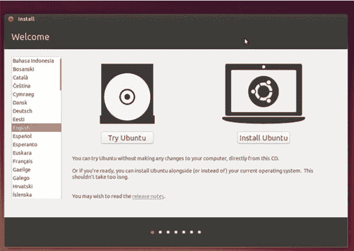

我理解安装对于许多用户来说是一个巨大的心理障碍。如果您还不舒服，坚持使用实时会话是完全可以的。事情会稍微慢一些，但体验将是相同的。我希望您在迁移到 Linux 时感到轻松和舒适，而不是害怕和紧张。信任需要时间。我们会到达那里的。

#### 3.5.1. 安装准备

如果您要安装 Ubuntu，您会点击“安装”并看到图 3.5 中的准备屏幕。Ubuntu 会确保您有足够的磁盘空间。它还会提醒您在安装过程中将计算机连接上电源，因为突然断电可能会损坏安装。它还会询问您是否想安装第三方软件。我们将在第四章中更多地讨论这个问题，但现在，除非您反对专有软件，否则请勾选复选框。请记住，如果没有安装这些软件，做一些像看电影和听音乐这样的事情可能会变得困难，仅仅是因为您没有关于这类软件的选择权，Windows 和 OS X 都是如此。

##### 图 3.5。安装准备屏幕。这里是 Ubuntu 推荐在您的硬盘上安装的最佳方式。

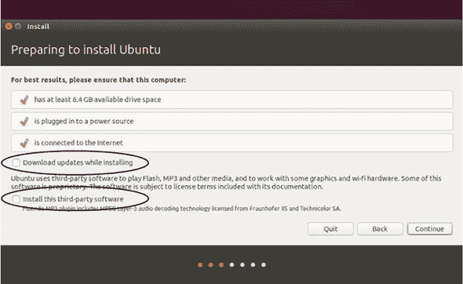

如果您有互联网连接，您可以在安装时让 Ubuntu 下载更新，但如果没有连接也不是什么大问题。然后，点击“下一步”。

#### 3.5.2. 安装类型

在下一屏，安装类型（图 3.6），如果您有多个硬盘或硬盘上的多个分区，Ubuntu 会询问您想在哪里安装它。

##### 图 3.6。这是您决定 Ubuntu 是否将成为您的唯一操作系统，或者它是否会与其他操作系统共享空间的地方。

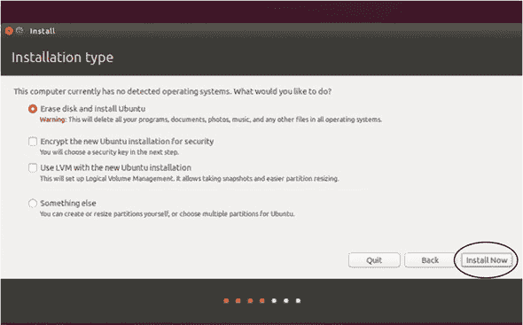

您必须选择是想将它与当前的操作系统一起安装，还是替换当前的操作系统。

如果您打算在另一个操作系统的旁边安装它，它会要求您指定您希望两个系统的大小。Ubuntu 仅运行就需要大约 5 GB 的空间。Windows 占用很多空间，所以不要设置得太小——尤其是如果您打算继续使用它。如果您最初只是想浏览并在 Ubuntu 分区上写作，我会选择 10 GB 的安装，并将剩余的空间留给其他操作系统。

您可以随时调整分区大小，或者甚至可以回过头来删除您的其他操作系统。当然，如果您打算覆盖那个其他操作系统，您不需要分配空间。

注意，在这个屏幕上，如果您想调整目录大小，您可以自定义安装。如果您正在阅读这本书，您现在可能不想这样做，但最终您可能会，所以这是一个值得记住的好选项。

这个屏幕还有一些关于加密安装和使用 LVM（逻辑卷管理）的问题。我们稍后会讨论这些，但现实是，你的第一次 Linux 安装并不是长期的事情。你将想要升级并探索其他发行版，所以虽然当你对 Linux 发行版做出更长期的承诺时，你可能想要考虑这些选项，但我现在会忽略它们并点击立即安装。

#### 3.5.3\. 你在哪里？

下一个屏幕（图 3.7），你在哪里，会要求你选择你的时区。

##### 图 3.7\. 安装过程中较容易的部分之一——选择你的位置。

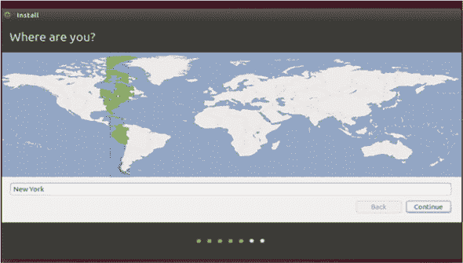

#### 3.5.4\. 键盘布局

下一个屏幕（图 3.8）会要求你选择你的键盘布局。有一个小型的打字区域，以确保你选择了正确的键盘。你还可以查看 Ubuntu 是否能为你检测到它。

##### 图 3.8\. 这是你选择键盘布局的地方，这通常取决于你来自哪里或你住在哪里。

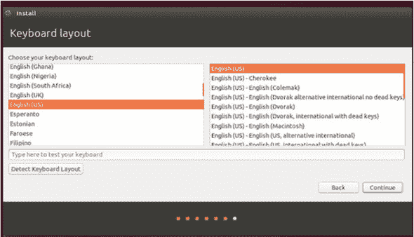

#### 3.5.5\. 你是谁？

图 3.9 屏幕是下一个。输入你的名字（只要一个名字就可以），给你的电脑选择一个名字，为自己设置一个登录名，并选择一个密码（别忘了它！）我总是要求登录时输入密码，这样就没有人能访问我的文件，但请随意做你认为正确的事情。加密你的家目录，这是你的个人文件夹，包含你所有的个人文件和配置，总是一个好主意，但你不需要现在就做，原因我在前面讨论过了。我们将在第十九章（kindle_split_029.html#ch19）中更多地讨论安全性。

##### 图 3.9\. 你告诉 Ubuntu 你是谁的那个屏幕。别忘了你的密码！

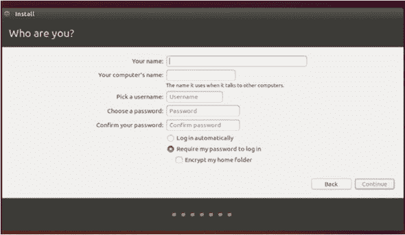

点击继续，你就完成了！只需等待它安装完成。你将被提示重新启动计算机（见图 3.10），当它再次启动时，它将要么启动到 Ubuntu，要么启动到一个屏幕，让你选择是否启动到 Ubuntu。恭喜！

##### 图 3.10\. 在你启动新安装的 Ubuntu 系统之前收到的最后一条消息。

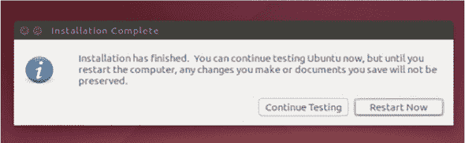

### 3.6\. 常见问题

最常见的安装问题是镜像损坏。损坏可能发生在两个阶段——从 Ubuntu 网站下载或将其移动到你的媒体（DVD 或 USB 驱动器）。为了确保你的下载没有损坏，你可以使用校验和来验证文件的完整性。你使用一个程序从镜像中提取字母/数字组合。然后你在 Ubuntu 网站上查找这个数字。如果数字匹配，你就有了整个镜像。WinMD5Free ([`winmd5.com/`](http://winmd5.com/)) 是一个免费的 Windows 程序，可以完成这个任务。下载它，安装它，并将其指向你的 Ubuntu 镜像。它将给你一个散列值或代码，然后你可以到 Ubuntu 网站上查找（只需搜索 Ubuntu 散列值）。如果数字匹配，你的下载没有问题，这意味着问题可能出在你的 DVD/USB 上，你应该再次尝试烧录镜像。而且正如我之前提到的，有时你不得不尝试启动几次，直到它“捕捉”到。

另一个问题是将电脑设置为从正确的驱动器启动。如果你的镜像没有损坏，并且你已经烧录了几次，你可能需要研究一下你的电脑。我曾经有一台笔记本电脑，只能从其中一个 USB 端口启动，这从未让我想到这是一个问题！所以，有些微小的硬件问题可能会让你对你的电脑了解得比你想要的更多。好事是，一旦你解决了这样的问题，你就永远不会忘记解决方案！时至今日，我还会检查我的设备可以从哪个 USB 端口启动。

| |
| --- |

**对于高级用户：统一可扩展固件接口**

另一个常见问题是，一些较新的 Windows 电脑使用统一可扩展固件接口（Unified Extensible Firmware Interface，简称 UEFI），它取代了启动电脑所用的软件 BIOS。如果我们回到我们的汽车比喻，BIOS（以及现在的 UEFI）是启动一切的钥匙。如果你遇到这个问题，解决方案通常是进入 UEFI 并禁用任何快速启动/快速启动选项。Windows 有一个高级启动设置，它提供了启动到 UEFI 并禁用该选项的选项。

| |
| --- |

### 3.7. 购买预装 Linux 的硬件

在本章结束之前，我想提供另一种安装 Linux 的方法：购买已经预装 Linux 的电脑。像戴尔这样的公司出售预装 Ubuntu 的电脑。还有一些电脑供应商出售已经预装 Linux 的机器。大多数 Linux 用户喜欢这些机器，因为它们有助于支持 Linux 和 Linux 社区，同时也因为这意味着这些机器的硬件与 Linux 兼容性很好（我们将在下一章中详细介绍）。

如果你感兴趣 Linux，你可能想对你的机器进行一些调整——包括硬件和软件。但如果这对你没有吸引力，考虑购买已经预装 Linux 的系统。System76 ([www.system76.com](http://www.system76.com)) 和 ZaReason ([www.zareason.com](http://www.zareason.com)) 是 Linux 社区中较为知名的供应商。

### 3.8\. 总结

现在你已经知道了安装 Linux 和通过实时媒体运行 Linux 之间的区别。接下来的实验将指导你如何在虚拟机中安装 Ubuntu。现在你可以决定哪个选项最适合你！

如果你依赖于一台机器，你现在可能仍然坚持使用实时或虚拟方法。但如果你有一台旧电脑，或者有多台机器（尤其是 Windows 机器，安装 Linux 更容易），那么为什么不真正安装 Linux 呢？你可以双启动，这样你就有了一个分区，或者你可以将 Ubuntu 安装到整个硬盘上，这会强迫你（以好的方式）承诺使用 Linux。

#### 术语表

在本章中，我解释了：

##### 图像

操作系统的完整版本

##### 活动会话

从媒体（如 DVD 或 USB）运行操作系统，而不是安装到硬盘上

##### 注意

这些步骤非常具体于 Ubuntu 14.04，但它们适用于大多数具有图形安装程序的发行版。基本上，安装程序总是提出问题，而你回答。所以即使这些屏幕在 Ubuntu 16.04 或 18.04 上看起来不同，你也应该能够使用这些步骤来安装它。

一些发行版，如 Fedora 和 Debian，有一个图形安装程序，虽然与 Ubuntu 的不完全相同，但在概念上是相似的。其他，如 Arch，有一个更复杂的安装过程，不太用户友好。随着你对 Linux 的使用越来越多，你会对哪种安装过程最适合你有一个感觉。

### 3.9\. 实验室

你已经了解了将 Linux 安装到电脑上的不同方法。现在选择一种并执行它！如果你要将 Ubuntu 安装到硬盘上，你可能不想在午餐时间完成（这是唯一一个我会这么说的地方），但除此之外，下载 Ubuntu，刻录到光盘，你就可以准备出发了。为了练习现在安装它，你将在虚拟机中安装 Ubuntu：

> **1**.  下载一个虚拟化工具。VirtualBox 是免费的，适用于 Windows 和 OS X：[`www.virtualbox.org`](https://www.virtualbox.org)。下载并安装它。
> 
> **2**.  也要下载 Ubuntu 的.iso 文件。确保它是 32 位的版本。
> 
> **3**.  一旦安装了 VirtualBox，通过点击新建按钮创建一个新的虚拟机。打开向导。将其命名为 Linux 午餐。选择操作系统为 Linux，版本为 Ubuntu，然后点击下一步。
> 
> **4**. VirtualBox 会要求你输入基本内存大小。默认为 512MB。这应该足够我们使用了，尽管如果你有大量 RAM 的机器，你可以设置得更高。
> 
> **5**. 对于虚拟硬盘，创建一个新的，并勾选启动盘。然后点击下一步。
> 
> **6**. 对于文件类型选择 VDI 并点击下一步。
> 
> **7**. 对于存储细节，选择动态分配并点击下一步。
> 
> **8**. 对于大小，VirtualBox 应该默认为 8GB。现在这应该足够了。点击下一步。
> 
> **9**. 查看摘要，确保其正确无误，然后点击创建。你现在在你的电脑上有一个虚拟电脑了。
> 
> **10**. 要安装 Ubuntu，双击 Linux Lunches 虚拟机。将打开一个向导。
> 
> **11**. 点击下一步。
> 
> **12**. 对于媒体源，选择你刚刚下载的 Ubuntu .iso 文件。
> 
> **13**. 点击下一步并开始安装 Ubuntu。安装完成后，你将有一个装有 Ubuntu 的虚拟电脑。

## 第四章. 了解你的系统

Linux 的乐趣之一在于你可以学习你的电脑是如何真正工作的。过了一段时间，你会感到修复电脑的乐趣和你完成一个拼图或一个大型乐高项目的乐趣一样。这就像手动挡和自动挡汽车的区别。有了手动挡，你真的感觉你了解你的车辆。而在 Linux 上使用了一段时间之后，你真的会感觉你了解你的电脑。

当你把车带到修车行，只能模糊地描述问题，可能发出声音或使用不精确的术语告诉修车工问题可能是什么时，这很困难。Linux 是自我支持的，从某种意义上说，你——用户——负责修复系统中的任何问题。没有支持台可以打电话或发邮件。

对于新 Linux 用户来说，最难学的事情之一是，他们能越好的理解和描述他们的问题，问题被解决的机会就越大。这并不是说你需要学习编程来使用 Linux。这仅仅意味着你需要学习一些基本的过程，这将帮助你理解你的系统可能存在的问题。

现在你已经运行了 Linux，无论是作为 Live 系统还是安装了，现在是时候了解你的系统了，学习硬件和软件是如何协同工作来完成你的要求的！这一章将帮助你完成这个过程，教你如何识别你电脑使用的所有硬件。我还会谈到驱动程序，它们帮助操作系统与硬件通信，以及编解码器，它们用于使音乐和视频在我们的电脑上可播放。可以这样想，*驱动程序解锁硬件，编解码器解锁音频和视频*。如果你的驱动程序正在工作，那么你知道你只需要找到解锁那个特定文件的编解码器即可。

最后，我将转向日志，它们跟踪你的系统正在发生的事情。到本章结束时，你将对系统正在发生的事情有一个清晰的了解，这将允许你在事情没有按预期工作的情况下找到帮助。

### 4.1\. 识别硬件

当你的系统出现问题时，可能是硬件问题，软件问题，或者两者的结合。如果你的 Ubuntu 笔记本电脑无法连接到 WiFi 网络，并且问题不是网络本身的问题（请确保问题不是像路由器已关闭这样的问题！），那么你需要找出问题所在。

+   如果问题是软件相关，可能它没有正确配置。

    +   或者可能是正确的无线软件没有安装。

+   如果问题是硬件相关，可能你的笔记本电脑无线网卡坏了。

    +   或者可能它没有开启。

但最常见的问题，尤其是在新安装的 Linux 系统中，是你的发行版在与无线网卡通信时遇到麻烦。在我们能够修复它之前，我们需要知道你的笔记本电脑是什么类型的无线网卡。虽然这可能在你的笔记本电脑手册中，或者在你笔记本电脑制造商的支持网站上，但现实是笔记本电脑通常由不同的部件组成。两款相同类型的笔记本电脑可能因为制造的时间和地点不同而使用不同的无线网卡。

Linux 提供了一种相对直接的方式来获取这些信息。这涉及到我们第一次进入命令行，我们将通过终端来访问它。我们将在第十章中详细讨论这个问题。第十章。现在，只需知道命令行是另一种与计算机交互的方式。而不是用鼠标点击打开一个程序来获取系统信息，你将打开你的终端，这将允许你直接向计算机输入命令。你正在省略图形中间人。

要访问终端，点击屏幕左上角的 Ubuntu 图标。一个搜索栏将打开，你可以输入单词`终端`（见图 4.1）。你会在应用程序下看到“终端”一词。点击单词或图标，终端将打开。

##### 图 4.1\. 在 Ubuntu 中输入单词`终端`将打开一个终端。

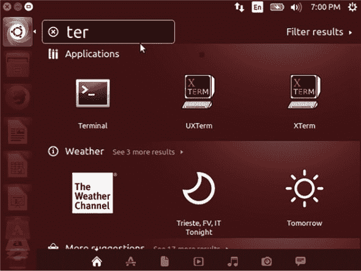

一旦进入终端，输入命令`lspci -v`。这个命令（见图 4.2）将显示你系统中使用的所有硬件，从无线网卡到内存再到显卡。

##### 图 4.2\. 终端中的`lspci`命令

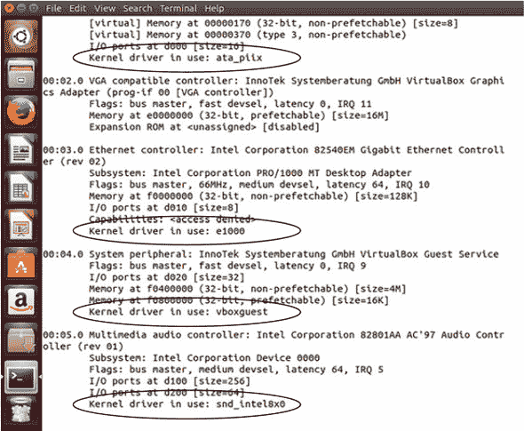

阅读起来并不容易，但如果您滚动列表，可以寻找像 *network* 或 *802.1* 这样的单词，这通常表示无线协议。阅读输出中的该部分，您可以获取无线卡的品牌和型号。如果您遇到问题，现在您有了一种更具体的方式来搜索解决方案。与其进行像 *“Ubuntu 中无线无法工作”* 这样的搜索，这可能会在多个型号上引发各种问题，您现在可以搜索您的无线卡，这将仅显示有助于您特定问题的信息。

您还会看到一行写着 *正在使用内核驱动程序*。我们在 第二章 中讨论了内核，以及它是最基本的系统部分——其他所有东西都是建立在其上的。但驱动程序是什么？我们将在下一节中介绍。

### 4.2\. 驱动程序

驱动程序是一种软件，它允许 Linux 内核与您的硬件进行通信。我在 `lspci` 命令的输出中指出了内核驱动程序行。所有操作系统都存在驱动程序，但它们通常由硬件制造商安装。在 Ubuntu 的例子中，它会自动处理驱动程序的安装，查看您拥有的硬件并安装所需的驱动程序。但有时，安装了错误的驱动程序，这就是导致技术问题的原因。

驱动程序的另一个问题是，并非每个硬件制造商都为 Linux 提供驱动程序，这意味着有时需要逆向工程驱动程序。提供自己驱动程序的公司往往能产生更好的结果。这就是为什么有时人们会建议不要在 Linux 系统中使用某些显卡——如果驱动程序不好，操作系统与硬件通信会更困难。

在一个完美的世界里，您的内核位于系统中间，试图与计算机周围的各个硬件组件进行通信——比如显卡、无线卡，甚至是您的计算机主板。驱动程序是内核和这些不同硬件之间的桥梁，如图 4.3 所示。再次强调，这是所有计算机的工作方式。但与 Linux 一样，驱动程序问题更加透明，这使得修复出现的问题更容易。Linux 的一个优点是，它不仅仅是一种运行计算机的方式——它还教会了您计算机是如何工作的。

##### 图 4.3\. 驱动程序帮助内核与您的硬件通信。

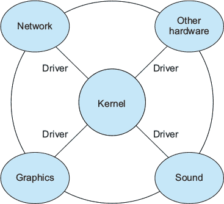

如果驱动程序有任何问题，您已经知道如何查看哪些驱动程序控制哪些硬件：使用`lspci -v`命令，它不仅包括硬件，还包括与硬件交互的驱动程序。这对于故障排除很有帮助，因为您可以研究是否存在与某些驱动程序和某些硬件相关的已知问题。有趣的是，但也许并不令人惊讶，Linux 通常与旧硬件配合得更好，因为驱动程序问题已经在发行版或内核中得到了解决。新设备未经充分测试，可能会引起更多复杂问题。

驱动程序的一个复杂问题是并非所有驱动程序都是开源的。一些驱动程序由制造商贡献给内核，但源代码仍然是封闭的，这使得在内核到驱动程序再到硬件的链中出现通信问题时，更难以对其进行调整。因此，您有时会看到对*专有驱动程序*的引用，这意味着它们是封闭源代码并由硬件制造商提供的，以及*开源驱动程序*，它们要么是由开发人员逆向工程以与硬件交互，要么是由制造商提供的，底层代码可供任何人修改和查看。根据对免费和开源软件的承诺程度，一些用户试图避免专有驱动程序，而另一些用户则选择最适合他们软件的驱动程序。

如果您的系统默认没有安装最佳驱动程序，有几个选项可以安装正确的驱动程序。

一种方法是研究您当前驱动程序和硬件的任何问题。我在本章末尾提供了一些开始研究的地方。修复驱动程序就像安装正确的驱动程序一样简单。通常只需要一两分钟。`lspci -v`命令会提供您所需的所有信息——您的硬件以及与之关联的驱动程序。然后，一些快速的在线搜索应该会揭示问题以及正确的驱动程序，您将在第七章（chapter 7）中学习如何安装。

大多数时候，正确的驱动程序在发行版的软件仓库中，您可以从中自行安装。有时您需要从制造商的网站上获取正确的驱动程序。这通常是打印机驱动程序的情况，因为打印机的种类繁多，任何操作系统都难以跟踪所有驱动程序。本书将在稍后讨论 Linux 上的打印。

一些发行版提供自动化的驱动程序管理。例如，您可以要求 Ubuntu 帮助您管理驱动程序。

| |
| --- |

**让 Ubuntu 检查您的驱动程序**

> **1**. 点击左上角的图标并输入“软件与更新”
> 
> **2**. 点击“附加驱动程序”标签

这将导致 Ubuntu 检查你机器上的驱动程序，看看是否有其他可能更好的驱动程序。如果你的系统运行良好，你可以忽略这个区域。但如果你遇到了挑战，这个区域是值得探索的。通常 Ubuntu 可以为你找到所需的驱动程序。

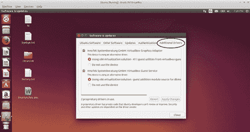

Ubuntu 会检查你的驱动程序，看看是否有其他驱动程序可能适合你的需求。

| |
| --- |

其他发行版，如 Linux Mint，也具有驱动程序管理组件（见图 4.4）。

##### 图 4.4\. 基于 Ubuntu 的 Linux Mint 也会自动为你检查驱动程序。

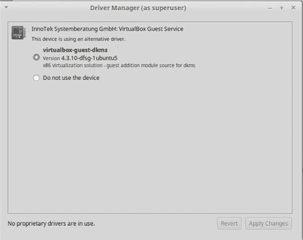

| |
| --- |

##### Linux 软件和功能

不同的发行版有不同的功能。像 Ubuntu 和 Mint 这样的发行版具有更自动化的驱动程序管理组件，而其他发行版则没有。不同的发行版有共同元素和独特元素。用我们的汽车比喻来说，如果你在 1995 年的本田雅阁上学会了驾驶，那么你驾驶 2012 年的宝马 5 系系列应该不会有任何问题。它们是不同的车，有不同的功能，但概念上是相同的。所以如果你没有使用 Ubuntu 来阅读这本书，不要担心你在 Ubuntu 中看到的软件没有在你的电脑上。在 Linux 中，总有多种方法来应对挑战。

| |
| --- |

尽管如此，你只需要了解这么多关于驱动程序的知识。它们就像钥匙，可以解锁你电脑周围的不同硬件。Windows 和 OS X 可以高效地处理驱动程序，因为它们将操作系统安装在特定的硬件上，所以它们知道需要包含哪些驱动程序。而在 Linux 中，你几乎可以在任何硬件上安装操作系统，因此系统需要确定使用哪些驱动程序。

驱动程序问题严重到许多人会在安装 Linux 之前研究硬件问题。这让你对潜在的驱动程序挑战有所了解。实时安装方法也适用于排查这类驱动程序问题。如果你的显卡在实时会话中无法工作，那么很可能你有驱动程序问题。

### 4.3. 编解码器

编解码器是另一种在大多数其他操作系统中在后台运行但可以在 Linux 中变得可见的技术。这部分的功劳在于编解码器所扮演的角色——它们编码和解码（因此得名编解码器——*enCODe\DECode*）音频和视频。大多数发行版默认安装标准编解码器。这些编解码器允许你做诸如听 MP3 和看电影之类的事情。一些发行版为了避免国际软件专利问题（不同国家有不同的专利规则）而避免安装编解码器。Debian 曾经是这样的发行版，但现在它默认包含各种多媒体编解码器。但编解码器在 Linux 中仍然不是一个简单的过程。

例如，你经常会听到一个名为 *GStreamer* 的多媒体框架。大多数发行版默认都安装了它。尽管安装了 GStreamer，但某些多媒体内容仍然无法工作。在某些情况下，你需要安装一组称为类似 *gstreamer-ugly* 的编解码器集合。例如，在 Ubuntu 上，它们被称为 *gstreamer1.0-plugins-ugly*，而在 Arch 上，它们被称为 *gst-plugins-ugly*。不同的发行版以略有不同的名称来命名编解码器。你可以通过包管理器来安装它们。你将在 第七章 中学习如何使用它。

有些编解码器可能会给发行版带来法律问题，因此发行版以“不问，不说”的方式提供它们，但不会默认安装。

你唯一需要考虑编解码器的情况是，如果你正在尝试处理音频和/或视频内容，但它们对你不起作用。如果你的驱动程序工作正常，那么你就知道你需要找到能够解锁文件格式的编解码器。记住：驱动程序解锁硬件，编解码器解锁音频和视频。两者都在后台工作——直到它们不起作用，这就是为什么了解它们的基本概念是有用的。

### 4.4. 使用日志文件

想想当一架飞机坠毁时（我知道这不是一个愉快的想法）。人们首先会问关于坠毁的什么？他们总是询问黑匣子。黑匣子是一种记录飞机上所有情况的设备。黑匣子允许调查人员找出飞机出了什么问题以及为什么它会坠毁。日志文件起到相同的作用。它们记录了计算机上不同系统中发生的一切，让你可以看到可能未报告给你的错误。

日志文件不易阅读，但它们经常提供有用的线索，以错误消息的形式出现，当你的系统出现问题时。很多时候，如果某件事出了问题，你会得到一个有用且清晰的错误消息，然后你可以继续在网上进行搜索。困难的是当某件事不起作用，但没有错误消息来引导你时。日志文件是获取可以研究的错误消息的另一种方式。

日志文件并不仅仅是 Linux 的特性。它们存在于 Windows 和 OS X 上，甚至存在于你的手机上。问题是它们并不总是对最终用户可访问，或者容易访问。有时它们被深深埋藏在系统中，几乎无法找到。它们也不是大多数人知道要寻找的东西。但一旦你养成了查看日志文件的习惯，你就会发现没有日志文件的系统在故障排除时非常令人沮丧。

Ubuntu 自带一个工具，可以帮助您查看日志。它被称为*系统日志*。要访问它，请点击左上角的 Ubuntu 图标，然后输入系统日志。系统日志将在一个单独的界面中显示某些日志文件（图 4.5）。系统日志的左侧导航栏显示了您可以访问的不同日志文件。例如，syslog 是来自您系统的消息。Xorg.0.log 是关于您的显示软件的消息。这些并不一定是失败——相反，它们记录了给定系统中发生的一切。

##### 图 4.5. Ubuntu 系统日志工具使日志处理变得*稍微*容易一些。

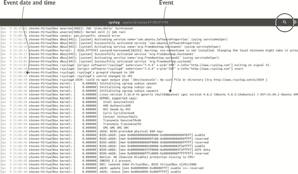

日志是发生事件的运行列表。当您向下滚动列表时，事件将变得更加近期。当您在日志中时，您正在寻找可能发生错误的线索。例如，如果您的系统在 10 分钟前突然自行重启，您可以在系统日志中查找任何在错误发生时发生的事件。很难确切地说您在寻找什么，但您在看到它时会知道（尤其是如果您寻找像*失败*和*警告*这样的词）。系统日志也可以通过放大镜图标进行搜索。所以，如果您怀疑某个原因导致了错误，您可以在日志文件中搜索该术语。

随着系统和协议的变化，日志文件名可能会改变，但概念保持不变：日志文件是操作系统报告正在发生的事情的地方。因此，即使 syslog 消失了，它可能会消失，也总会有另一个日志可以查看，并提供相同的信息。所以，不必太在意日志文件的名字。相反，只需考虑它们的作用和使用方式。

系统日志不会显示您所有可用的日志，但它允许您轻松地添加更多。为此，请点击右上角的齿轮图标并选择打开。文件导航器将在存储所有日志文件的目录中打开。您可以将任何文件添加到系统日志中。您通常可以从文件名中了解日志文件监控的内容。例如，kern.log 包含与内核相关的消息。

正如我提到的，所有日志文件都在一个单独的目录中。我们将在第十四章中更详细地讨论 Linux 目录结构，但就目前而言，只需知道，如果您导航到/var/log 目录，您就可以看到所有日志文件，然后使用任何文本编辑器打开它们——它们只是可以被各种程序读取的文本文件。系统日志很方便，但它不是一款通用的软件，所以如果您从 Ubuntu 迁移，您可能想熟悉查看各种日志文件的方法。

### 4.5. 寻找帮助

Linux，大部分情况下，并不提供支持。尤其是对于个人用户来说（一些公司，如 Canonical，Ubuntu 背后的公司，提供支持订阅服务，但它们针对的是小型企业，而不是个人——家庭用户）。这可能会让一些用户感到害怕，但如果你仔细想想，你有没有曾经给微软或苹果打电话寻求支持？他们帮助你了吗？或者你是在网上搜索直到你找到答案或者学会忍受问题？

正如我们在本章中看到的，Linux 为我们提供了很多工具来理解为什么我们的系统不工作。但当然，知道问题和知道答案是非常不同的事情。

在追踪答案方面，有一些特定的网站你可以访问。Unix 和 Linux Stack Exchange 是一个很好的资源：[`unix.stackexchange.com/`](http://unix.stackexchange.com/)。这是一个免费网站，注册用户可以发布问题和答案，用户会对回答的质量进行投票。为了对答案进行投票，你必须在 Linux 和 Unix Stack Exchange 社区中拥有一定的声誉，通过回答问题和进行编辑等方式获得积分。但你甚至不需要账户就可以搜索它，看看你的问题是否已经被提出过。

The Manning forums ([`forums.manning.com/`](https://forums.manning.com/))也是一个寻求帮助的好地方。

其他发行版也有自己的现场文档和论坛。通常在发行版主页的社区、支持或帮助等部分突出显示。然而，由于 Ubuntu 在 Linux 社区中非常普遍，因此有很多在线支持。Linux Mint 也很受欢迎，但由于它基于 Ubuntu，很多 Mint 的答案也会适用于 Ubuntu 的问题（反之亦然）。Ubuntu 的帮助区域可以在[`help.ubuntu.com/`](https://help.ubuntu.com/)找到。你还可以在 Ubuntu 中通过点击左上角的 Ubuntu 图标并搜索帮助来获得帮助。这将显示 Ubuntu 桌面指南（见图 4.6），这是 Ubuntu 的一个不错的概述，但它不会深入到你可能在与系统相关的更技术性的问题。

##### 图 4.6。Ubuntu 桌面指南是对你的系统的一个很好的概述，但不是详细技术帮助的好选择。

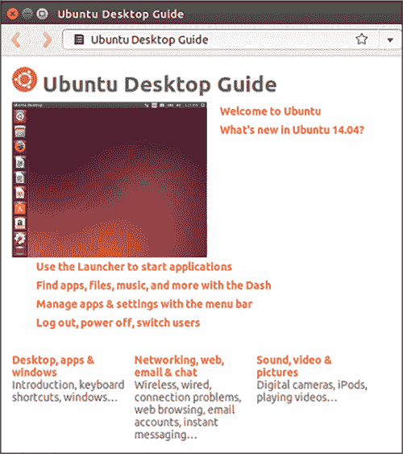

Ubuntu 有自己的官方论坛，位于[`ubuntuforums.org/`](http://ubuntuforums.org/)，但看起来越来越多的人去 Ask Ubuntu([`askubuntu.com/`](http://askubuntu.com/))，它位于 Unix 和 Linux Stack Exchange 相同的平台上，并且工作方式完全一样。

但在阅读网站和文档之前，你可能想花几分钟时间在网上搜索你的问题。如果你在声卡上遇到错误，尝试搜索声卡型号和 Ubuntu 14.04，这是我们特定的 Ubuntu 版本。如果这不起作用，通过删除 14.04 来扩大搜索范围，如果这还不起作用，就用 Linux 替换 Ubuntu。从具体到一般。这些搜索将显示来自 Ask Ubuntu 等信息来源的信息，但也会揭示其他发行版的博客文章和论坛。通常，发行版并不重要，重要的是答案。一个在 Fedora 上修复问题的配置也可能在 Ubuntu 上修复它。

通常，论坛上的回答都是出于好意，但要注意不要运行你不理解的命令。错误的命令可能会完全删除你的系统。我建议你在完成这本书之后再进行这种故障排除。但在仅仅几章之后，你将能够查找命令，了解它们的功能以及它们是如何工作的。像 Ask Ubuntu 和 Unix 和 Linux Stack Exchange 这样的网站，它们更重视经验丰富的用户的建议，在评估答案质量方面也很有帮助。

### 4.6\. 总结

本章的目标是让你熟悉 Linux 系统中那些最有可能以你意想不到的方式（或不能）工作的各种组件。现在，你应该准备好识别问题，然后去网上寻找自己的解决方案。现实是，尽管有很多 Linux 用户能够阅读日志文件并确切知道问题是什么以及如何修复它，但同样常见的是，Linux 用户在日志中找到问题，然后需要在网上寻找答案。无论你如何找到答案——只要你能找到它就行。

#### 术语表

在本章中，我解释了：

##### 编解码器

用于编码和解码音频和视频的软件

##### 驱动程序

一款允许 Linux 内核与你的硬件通信的软件

##### 日志文件

记录你电脑上不同系统发生的所有事件的文件，让你能够看到可能未向最终用户报告的错误

### 4.7\. 实验室

现在是时候了解*你的*硬件了：

> **1**. 你会如何找出你电脑上有什么类型的无线网卡？
> 
> **2**. 你在哪里找到你电脑的日志文件？
> 
> **3**. 进入你的附加驱动程序区域，看看是否有为你系统提供的额外驱动程序。如果一切正常，就别动驱动程序，但如果你的系统有任何问题，看看新驱动程序是否有帮助。
> 
> **4**. 看一下你的 syslog 文件。它最后报告了什么？
> 
> **5**. 使用系统日志，你能确定/var/log 中的不同日志文件的作用吗？

## 第五章\. 桌面环境

桌面环境（有时也称为桌面管理器）的概念是 Linux 中较为难以理解的部分之一。大多数用户熟悉 Windows 和 OS X。这些操作系统只有一个桌面界面。用户可以在一定程度上调整这些桌面，但本质上你只能接受苹果或微软决定的做法。菜单总是位于某些位置，快捷键组合与特定任务和程序相关联。用户无法对工作环境的设计发表意见，也无法进行很大程度的改变。而且，这些系统的用户通常被训练接受这种限制。这也是为什么你经常看到有些人多年没有更新他们的系统——他们喜欢现有的界面，不想转向不同的东西。这也可能是 Windows XP 能够存活 12 年（以及为什么它仍然在野外可见）的原因。

这种选择界面的自由和灵活性对于严肃的桌面用户尤为重要，他们花了很多时间在电脑前做严肃的工作，从写作、研究到沟通。OS X 和 Windows 的用户可能已经注意到这些界面变得越来越像平板电脑，有图标、触摸屏和应用程序。这些是平板电脑或手机用户，或者使用笔记本电脑或桌面来消费内容用户的美好工具。但对于我们这些做更多内容消费以外的事情的人来说，这些界面可能感觉过于简单且令人沮丧。许多 Linux 桌面环境，一旦掌握，将允许你在 Windows 或 OS X 通用界面上更高效地工作。这些桌面有学习曲线，但许多人发现，最初的投入时间在后期会带来相当大的生产力。

此外，因为我们中的许多人花了很多时间在电脑前，我们希望有一定的可定制性，因为我们的个人电脑关系变得几乎亲密。就像我们中的大多数人会根据照片、家具或纸张摆放来定制我们的办公室或工作空间一样，我们也希望有能力创建一个反映我们个人工作风格的计算环境，从菜单位置到程序的启动和显示方式。

本章将探讨 GNOME、KDE 和 Xfce，这三种最受欢迎的桌面环境。它还将讨论 Unity，这是 Ubuntu 的默认桌面环境（不要与用于制作视频游戏的 Unity 游戏引擎混淆；这两个项目无关）。还有许多其他桌面环境，但这四个足以让你开始。

### 5.1. 桌面环境

桌面环境是操作系统 GUI 的外观和感觉。在 OS X 和 Windows 的世界中没有等效物，因为那些操作系统每个只有一个桌面环境。可以说，OS X 和 Windows 的不同版本可能有不同的外观和不同的界面，但无法在 Windows 10 上获得 Windows 7 的界面。

如前所述，Linux 是一个内核。它控制操作系统，但桌面环境是您系统的外观和感觉。除了像界面上的日期和时间位置这样的小事情之外，它还控制着窗口的呈现方式。其他桌面环境元素包括：

+   ***如何关闭窗口。*** 关闭按钮在右上角吗？还是左上角？桌面环境决定了这一点。

+   ***导航元素。*** 有 dock 吗？任务栏？它们在哪里？

+   ***你在应用程序之间如何切换。*** 当你使用 Alt-Tab 时会发生什么？它是动画的吗？是否有平面图像？

设计师会做出关于他们希望桌面环境看起来和感觉如何的选择。桌面环境是你在电脑上的体验。在 Windows 和 OS X 的情况下，只有一个桌面环境。Linux 没有这种限制。

Linux 的界面不仅倾向于更可定制，而且用户甚至可以选择不同的桌面范式。例如，GNOME 和 Unity，我们将在几分钟内讨论，它们不依赖于传统的导航菜单。相反，它们使用启动器，允许用户输入他们想要启动的程序名称。对于许多用户来说，这是一个新的桌面模型。在 Linux 上，你可以在登录电脑时切换界面，这意味着如果你不能在两个桌面之间选择，你可以在它们之间交替，而无需重新安装软件或在电脑的两个部分之间复制文件。相反，这只是一个从桌面环境注销并登录到另一个环境的问题（见图 5.1）。

##### 图 5.1\. 当你第一次登录到你的电脑时，你可以选择你的桌面管理器。

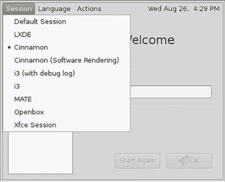

大多数发行版支持多个桌面环境，所以如果你不喜欢默认的，你可以安装一个新的。例如，Debian 在安装时为用户提供桌面环境的选择，而 Ubuntu 默认安装 Unity。如果你想安装带有除 Unity 之外桌面环境的 Ubuntu，你需要选择一个不同的版本，比如 Xubuntu，它带有 Xfce 桌面环境，或者从软件仓库安装一个新的桌面环境。我们将在第七章中介绍如何安装新的桌面环境。

所有 Linux 程序都可以在所有 Linux 桌面上使用，所以你永远不必担心某个程序与特定的桌面环境不兼容。这不像 Windows 程序在 OS X 中无法运行。你在 Unity 中的最爱程序在 Xfce 中也会为你准备好。不同的桌面环境有不同的默认软件选择，但在 Linux 中，最终用户总是可以更改这些默认设置，所以它们实际上更多的是建议而不是命令。

现在，我们将讨论一些适用于 Linux 的特定桌面环境。

### 5.2. GNOME

GNOME 是一个流行的桌面环境，作为许多发行版的默认环境。当前版本被称为 GNOME 3，这使其与看起来和操作方式非常像 Windows XP 的 GNOME 2 区分开来。

#### 5.2.1. 接口

GNOME 3 拥有更现代的外观，使用启动器概念来打开程序和文件。你不需要使用菜单来打开程序，而是在启动器区域输入你想要打开的内容，就像我们在 Unity 中做的那样，这是我们一直在 Ubuntu 中使用的。从概念上讲，GNOME 界面可能会让人联想到 OS X 的 Spotlight 实用工具或 Windows 的开始菜单搜索，两者都可以用来查找和启动文件和应用程序。它也可能让你想起 Unity。

GNOME 不像你可能习惯的那样依赖于菜单。例如，在 Windows 中，大多数用户通过使用左下角的托盘来与界面交互，导航到他们想要打开的文件或程序（如此之多，以至于 Windows 10 中备受喜爱的开始菜单变得更加突出）。GNOME 有一个菜单概念，但大多数情况下，你被期望打开启动器并输入你正在寻找的内容，或者从左侧的菜单中选择一个图标，如图 5.2 所示。你还可以使用 Windows 键启动菜单，而不需要点击任何东西（Windows 键也被称为*元键*或*超级键*）。一些用户发现这个启动器非常方便，因为程序和文件可以轻松打开，而无需将手指从键盘上移开。但一些用户发现这非常令人沮丧，更喜欢通过菜单导航来查找和启动文件。

##### 图 5.2. GNOME 启动区域较为稀疏。你输入你想要查找的内容，桌面环境会为你找到它。

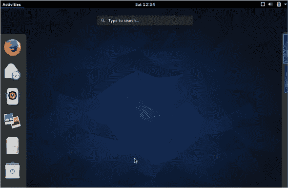

GNOME 与大多数 Linux 桌面环境和 OS X 一样，具有多个桌面概念，用户可以在不同的桌面中打开不同的程序，几乎就像他们在多台机器上工作一样，但都在单个显示器范围内。这种功能特别适合桌面工作，因为桌面工作通常需要用户在图形程序之间切换。有些人使用 Alt-Tab 在窗口和程序之间切换，但试图保持事物分离的用户，可以通过在另一个桌面中打开字处理器和网页浏览器以及 PDF 阅读器，在桌面之间切换而不是在程序之间切换。这种工作流程允许某些程序在一个工作空间中全屏显示，而另一组程序在另一个工作空间中共享同一个窗口。

许多计算机用户充分利用他们的桌面，用它来存放文件和图标。GNOME 有桌面文件路径，但桌面本身默认不显示文件。一些用户觉得这很令人困惑。其他人则欣赏它给他们的电脑带来的整洁外观。保存在桌面上的文件始终可以通过文件管理器访问，但习惯于导航到桌面以打开文件和文件夹的用户可能需要通过安装 *GNOME Tweak Tool* 来调整这个特定的默认设置，这是一个程序，允许你从 GUI 中轻松更改某些 GNOME 设置。

#### 5.2.2\. 自定义

GNOME 也很有趣，尽管本章的介绍性陈述，它本身并不是非常可配置。然而，有许多扩展可以自定义 GNOME 界面。有趣的是，这些扩展是通过网页浏览器访问的，而不是像许多人预期的那样通过设置菜单。可用的扩展列表在 [`extensions.gnome.org/`](https://extensions.gnome.org/)。用户找到他们想要的扩展，并在浏览器中激活它，更改在 GNOME 内部完成（见 图 5.3）。这允许你自定义一切，比如添加一个更传统的菜单来启动应用程序，或者更改 GNOME 的默认 Alt-Tab 行为，它不像大多数其他操作系统和桌面环境那样在窗口之间循环。扩展按流行度排序，让新的 GNOME 用户了解可以如何调整界面。

##### 图 5.3\. GNOME 扩展是通过网页浏览器处理的，而不是像大多数其他桌面环境那样通过控制面板。

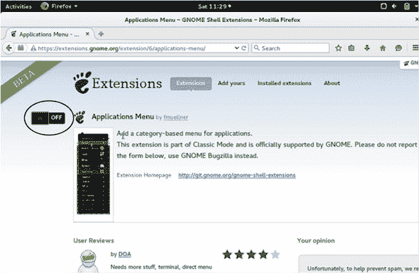

#### 5.2.3\. 软件

虽然 GNOME 是一个桌面环境，但该项目背后的开发者们也在开发与桌面环境相配套的软件。这些项目包括 gedit 文本编辑器；Epiphany 网络浏览器；以及 Notes 笔记应用。这些程序可以在不同的桌面环境中运行，但它们被设计成与 GNOME 的外观和感觉相整合。

GNOME 感觉与传统桌面不同，但一旦您适应了其背后的概念——您不是在菜单中搜索，而是在召唤程序和文件——您可能会发现很难回到更传统的桌面。

### 5.3\. KDE

KDE，最初代表 K 桌面环境，是另一个流行的 Linux 桌面环境。技术上，桌面是 KDE Plasma，KDE 是一个更大的项目，除了创建 Plasma 外，还创建应用程序。但口语上，大多数人将 KDE Plasma 称为 KDE。

#### 5.3.1\. 接口

KDE 使用传统菜单，但同时也拥有启动器。界面对大多数用户来说应该相当熟悉。使 KDE 显著并受欢迎的是，几乎它的每个部分都可以自定义，因此它可以看起来像您想要的样子。

由于 KDE 有点复杂，您选择的发行版比其他桌面环境更为重要。预配置的 KDE 越好，使用起来就越容易——尤其是对于新用户来说。例如，OpenSUSE 被认为是 KDE 友好的发行版。Netrunner 也被认为是一个强大的 KDE 实现。Ubuntu 有一个使用 KDE 桌面的版本，称为 Kubuntu。Linux Mint 也有一个 KDE 版本。

从一个更精心策划的 KDE 版本开始，带有预配置的选项和功能，将使新用户能够了解它的可能性，这使新用户更容易上手。在类似 Arch 这样的标准 KDE 环境中工作，即使是经验丰富的 KDE 用户也可能具有挑战性，因为用户对桌面环境所有可能性的认识并不强烈。

#### 5.3.2\. 自定义

对于桌面用户来说，他们可能最感兴趣的是 KDE 的 *活动* 功能，该功能允许您为不同类型的任务配置不同的桌面。因此，您可能有一个包含文字处理器和引用管理器桌面快捷方式的写作活动。也可能有一个包含网络浏览器和 PDF 阅读器快捷方式的研究活动。从事数据工作的人可能有一个包含打开数据文件夹和 R 统计工具快捷方式的数据活动。

活动类似于虚拟桌面，但根据桌面使用方式预先选择了软件和文件夹。对于大多数用户，尤其是不太技术性的用户，他们可能大部分时间都在网络浏览器中，也许在电子邮件客户端中，这个概念似乎有些过度。但对于任何想要真正调整桌面体验的人来说，尤其是如果他们的桌面工作很复杂，活动具有很大的潜力。

假设我想设置一个写作活动。这个活动将给我一个打开写作文件夹和文字处理器快捷方式的桌面。

> **1**.  首先，我将在右上角点击“新建活动”，然后点击“活动”（见图 5.4）。
> 
> ##### 图 5.4\. KDE 允许您为不同类型的工作以不同的方式设置您的桌面。
> ##### 
> 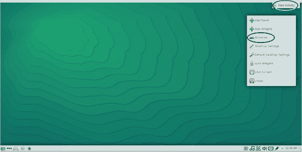
> 
> **2**. 然后，点击扳手来命名活动（见图 5.5）。
> 
> ##### 图 5.5。为您的活动提供一个有意义的名称，这样您就可以轻松找到它。
> ##### 
> 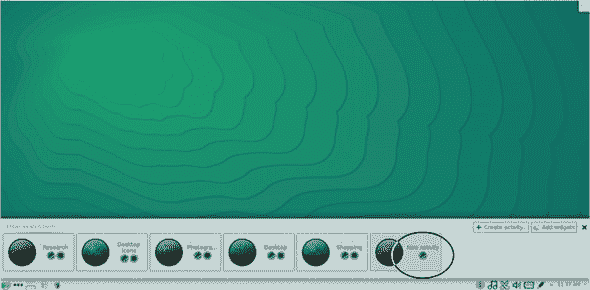
> 
> **3**. 最后，设置您的桌面。图 5.6 显示了我在 KDE 中的写作活动。
> 
> ##### 图 5.6。此活动有一个文件夹已打开，以及一个指向文字处理器的快捷方式。
> ##### 
> 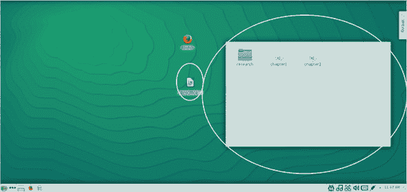
> 
> **4**. 要切换到另一个活动，再次点击右上角，然后再次点击活动（见图 5.7）。
> 
> ##### 图 5.7。点击您的活动名称以返回活动菜单。
> ##### 
> 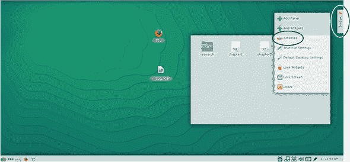
> 
> **5**. 最后，点击您想要启动的新活动（见图 5.8）。
> 
> ##### 图 5.8。将程序和文件夹组合成活动，然后在不同活动之间切换，而不是打开和关闭程序。
> ##### 
> 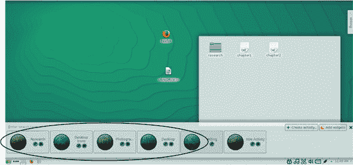

现在，您将看到一个新桌面，已为您的新任务配置（见图 5.9）。

##### 图 5.9。切换到新活动会为您提供一个全新的桌面，具有不同的文件夹和快捷方式。

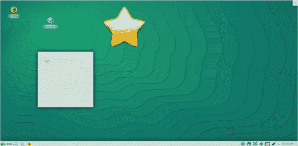

大多数 Linux 桌面项目在某个时候都会进行重大改版。KDE 在其生命周期中经历了一些重大的改造，并不是所有用户都欣赏新的方向。（我不确定是否有过桌面环境重设计被所有用户普遍喜爱的。）幸运的是，对于那些不满意的 KDE 用户，有一些项目旨在捕捉 KDE 的早期版本。KDE 目前处于版本 5，但 Trinity 桌面是基于 KDE 3 的。大多数新的 Linux 用户可能对 Trinity 不感兴趣，但它提醒我们 Linux 桌面永远不会真正消失。相反，它们通常以较小、特定领域的项目形式继续存在。

#### 5.3.3. 软件

如前所述，Linux 应用程序可以在所有桌面环境中运行。但 KDE 有一套自己的应用程序，它们通常以字母 K 开头。因此，Kate 是默认的 KDE 文本编辑器，KRunner 是默认的 KDE 应用程序启动器。KDE 甚至有自己的网页浏览器，称为 Konqueror（见图 5.10）。这并不是说这些程序在 GNOME 上无法成功运行。这只是意味着 KDE 有自己的软件生态系统。

##### 图 5.10。KDE 有自己的网页浏览器，称为 Konqueror。

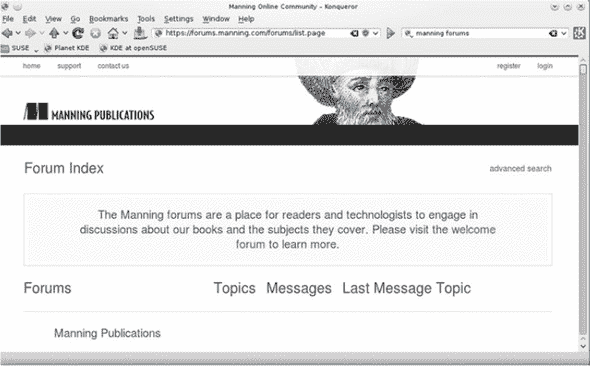

KDE，比本章讨论的任何桌面环境，对某些人来说点击一下就成功了，而对另一些人来说则不然。一些用户，甚至新用户，尝试了 KDE 后立刻被所有配置选项所吸引，并乐于花时间和精力将桌面设置得恰到好处。其他人发现这个过程令人沮丧，希望不要让用户做出如此多的决定。这就像是 GNOME 的反面，GNOME 可以自定义，但不是以明显的方式。对某些人来说，KDE 可能过于可自定义。但对于那些想要拥有非常个性化、专注的桌面体验的用户来说，可能没有比 KDE 更好的桌面环境了。

### 5.4. Unity

Unity 是 Ubuntu 特有的，作为该发行版的默认桌面环境。它基于 GNOME 3，实际上看起来和行为非常相似。当 Unity 首次推出时，它有一些 bug，就像早期的软件一样。Linux 社区中的许多人因为 Ubuntu 背后的公司 Canonical 没有直接与 GNOME 合作而感到不满，因为 Ubuntu 之前与其他版本有过合作。然而，Unity 随着时间的推移稳步改进，尽管 Linux 社区中仍有不满。

Unity 最紧密地与 Ubuntu 联系在一起，但一些发行版有安装它的方法。例如，Arch Linux 在其仓库中就有 Unity。

#### 5.4.1. 界面

Unity 与 GNOME 的主要区别在于 Lens/Scope 概念。*Lenses*类似于 GNOME 应用程序启动器，但可以限制搜索特定类型的内容，从音乐到 Google Books，再到网络、购物网站，甚至文本。Lenses 是限制你在 Unity 仪表板区域（或 Dash，按照 Unity 的说法）内搜索的方式。*scopes*是 lenses 搜索的内容。这种功能对专注于特定任务的用户有影响，他们可能希望搜索文件和集合，而不必 necessarily 进入文件夹或访问网站。

你可以通过使用 Unity Dash 上的“过滤结果”按钮来查看可用的 scopes 和 lenses（见图 5.11）。这让你在 Dash 中输入内容时可以选择搜索的来源。例如，你可以用它来搜索 eBay，而无需访问 eBay。

##### 图 5.11. Dash 区域让你可以选择从哪里搜索。你可以搜索本地机器上的文件之外的内容。

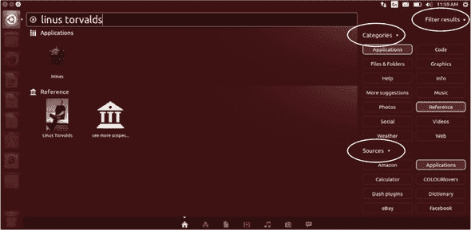

#### 5.4.2. 自定义

Unity 界面不太可配置。这与 Canonical 希望在不同设备上保持一致的用户体验有关，这样 Unity 在手机、桌面和平板电脑上看起来都一样。如果你喜欢 Unity 界面，这不是问题，但对于只喜欢其某些方面的用户来说，这却是一个挑战。然而，Unity 自 2010 年开始，逐年稳步改进。许多对 Unity 有异议的用户是早期采用者，他们在桌面环境仍在定义和开发时就开始使用它。而且还有一些波折，最值得注意的是，Unity 设置自动将用户设置为在 Dash 搜索结果中显示亚马逊结果。然而，该设置已被更改为可选。

值得一提的是，还有一个*Unity Tweak Tool*，它提供了一个图形界面来更改 Unity 的一些特定方面。Tweak Tool 默认不安装，但可在 Ubuntu 仓库中找到。我们将在第七章中讨论如何安装类似的东西。

#### 5.4.3. 软件

与 GNOME 和 KDE 不同，Unity 没有与之关联的软件，尽管它倾向于使用 GNOME 的默认软件作为自己的默认设置。大多数人使用 Unity 是因为它是 Ubuntu 的默认选项，但实际上它是一个强大的桌面选项。它与 GNOME 非常相似，主要区别在于 Lens/Scope 概念。如果你已经在使用 Ubuntu，花些时间熟悉 Unity 是值得的。

### 5.5\. Xfce

Xfce 可能被认为是桌面环境中的罗德尼·丹泽菲尔德，因为它很少受到尊重。它在 Linux 桌面环境中占据一个有趣的位置。

#### 5.5.1\. 界面

在系统资源消耗方面，Xfce 比 KDE、GNOME 和 Unity 更轻量。然而，与此同时，它也不是特别创新或功能齐全。它只是一个使用熟悉的菜单启动程序的桌面环境，虽然 Xfce 也允许多个工作空间，因此你不会受到单个窗口所能容纳内容的限制。

对许多人来说，Xfce 缺乏创新是一个特点。你不需要学习如何使用它，因为你已经知道如何使用它。有一个菜单你可以用来打开程序。还有一个内置的启动器/应用程序查找器，对于那些想要更类似于 GNOME 或 Unity 界面的用户。它还有一个不错的底栏，或带有软件图标的底部面板。这会让很多人想起 OS X，而对于喜欢点击图标打开程序的用户来说，Xfce 的底栏是一个优秀且视觉上吸引人的选项（见图 5.12）。使用 Xfce 很简单。它不会挑战你或让你重新思考你的工作流程，但它将允许几乎所有用户快速有效地工作，而无需大量调整。

##### 图 5.12\. Xfce 虽然不是特别创新，但它有很多不错的功能，包括屏幕底部的类似 OS X 的底栏。

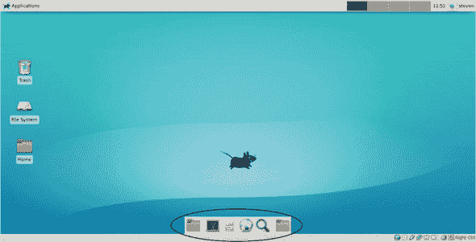

#### 5.5.2\. 自定义

对于那些想要调整的用户来说，Xfce 非常可定制。你可以选择任务栏出现的位置以及程序如何分组。任务栏还可以通过显示电池电量到天气等应用程序进行自定义。Xfce 还使得创建快捷键变得容易，这样某个特定的键组合就会打开某个特定的程序。

尽管 Xfce 以其平淡但坚固的声誉而闻名，但它是在各种发行版中常见的选项。Linux Mint 有一个 Xfce 版本，Ubuntu（Xubuntu）也是如此。Debian 曾短暂地将 Xfce 作为默认桌面环境，然后又切换回 GNOME。大多数主要发行版都有某种 Xfce 实现，而没有的也会在它们的仓库中提供。

#### 5.5.3\. 软件

与 Unity 一样，Xfce 没有自己的软件生态系统。因为 Xfce 在旧硬件上运行良好，一些发行版会默认安装更轻量级的程序版本。例如，你可能会看到 AbiWord 作为默认的字处理程序，而不是更系统密集的 LibreOffice。幸运的是，默认程序并不重要，正如你将在下一章中看到的，下一章将展示如何安装和删除程序。

不带偏见地，我感到有必要透露，我在我的主要笔记本电脑上使用 Xfce 作为桌面环境。它运行良好，不会妨碍我，这正是我在桌面环境中所寻找的。它并不特别耀眼或创新，但它让你可以调整到足够的程度，让你感觉好像有人为你设计了一个桌面。

### 5.6. 选择桌面环境

那么，你究竟如何选择桌面环境呢？首先要注意的是，桌面环境不需要是长期承诺。如前一章所述，桌面环境可以共存，无需移动文件。所以如果桌面不适合你，你可以轻松地安装另一个，保留前一个或删除它。这不会影响工作文件。

但在达到那个阶段之前，花些时间与听起来或看起来最有趣的桌面环境相处可能是有用的。如果 KDE 看起来很有趣，花几周时间使用它，强迫自己使用它。当你遇到问题时，研究它们，看看是否有办法改变它们。

Linux 的强大之处和美丽之处在于，在其核心，它是可变的。大多数用户已经习惯了接受他们操作系统的限制。按钮不能移动，行为不能改变。但与 Linux 相比，这通常不是一个问题。所以虽然你可能无法对桌面环境进行任何更改——至少不是不需要一些严肃的编程——但你可能足以改变桌面，使其适合你的个人风格。根据桌面环境的不同，这些更改可能通过图形菜单、通过命令或通过文件编辑来完成。

在选择桌面方面，也要注意关注你的工作流程，而不仅仅是使用的桌面环境。从概念上讲，这与 Windows 和 OS X 有很大的不同，后者要求用户与操作系统设计者选择的桌面范式一起工作。由于这些桌面的锁定性质，最终用户可以在一定程度上进行调整，但必须在特定的约束内工作。Linux 桌面通常也有类似的约束，但由于桌面环境的多样性，用户通常可以找到*某种*更符合他们个人偏好的东西。因此，当选择 Linux 桌面时，尝试几个，然后找出哪些方面最有吸引力。

硬件也可能在你的桌面选择中发挥作用。旧硬件可能无法处理更复杂的桌面环境，如 KDE 或 Unity。如果你想要从旧机器中获得最大效益，你可能需要考虑使用资源消耗较少的桌面，如 Xfce。

如前所述，软件在桌面环境之间是完全可互换的。与 KDE 相关的程序可以在 Unity 或其他任何桌面环境中运行。然而，如果你发现自己正在使用许多 KDE 程序，使用 KDE 可能值得，这样可以在节省磁盘空间和系统资源方面有所帮助。

随着桌面界面越来越像移动界面，对于在电脑上做的不只是检查电子邮件的用户来说，选择桌面外观和行为的能力变得更加重要。

表 5.1 查看了我们在这里讨论的桌面环境，并将它们分解为几个主要话题。

##### 表 5.1\. 桌面环境概述

| 桌面环境 | 接口 | 自定义 | 软件生态系统 | 学习曲线 |
| --- | --- | --- | --- | --- |
| GNOME | 启动器 | 通过第三方工具和扩展 | 自有生态系统 | 一般 |
| KDE | 启动器和菜单 | 内置 | 自有生态系统 | 复杂 |
| Unity | 启动器 | 通过第三方工具 | 倾向于使用 GNOME 程序 | 一般 |
| Xfce | 启动器、菜单和/或 Dock | 内置 | 倾向于使用轻量级程序，但缺乏自己的生态系统 | 简单 |
|  |

**一切都在变化……？**

值得重复的是，本章中提到的某些桌面环境有一定的学习曲线。即使是像 Xfce 这样简单直接的桌面环境，也需要在功能和功能方面做一些工作才能熟练掌握。花在学习桌面环境上的时间越多，用户从中获得的（可能）就越多，但对于那些可能不想调整桌面体验每个方面的普通用户来说，简单的在线搜索就能找到某些自定义问题的答案。

正如本书其他地方提到的，Linux 是一个动态的环境。软件总是在变化和更新。桌面环境也不例外——它们有时会发生变化。这并不意味着正在运行 KDE 的用户有一天会醒来发现桌面体验完全不同。然而，迁移到新的发行版或发行版的新的版本的用户可能会发现 KDE 自上次安装以来已经发生了变化。

这就是选择再次成为重要变量的地方。你可以选择一个更类似于之前桌面版本的桌面，或者找到一个能满足你需求的新环境，或者你可能发现他们桌面环境的新版本正是你所需要的。这就是为什么理解自己的工作流程对于 Linux 来说如此重要——通过了解你的需求，你就知道你的桌面是否在按照你的需求工作。因此，你在理解桌面和工作流程上所做的努力不是一次性的体验。从这个过程中学到的信息将在你使用 Linux 的整个过程中，以及在使用其他操作系统和界面的整个过程中都有所帮助。

### 5.7\. 总结

桌面环境是 Linux 体验的重要组成部分。虽然发行版控制着诸如可用软件之类的事情，但桌面环境是你将如何与你的电脑交互的方式。

使用你选择的发行版附带的默认桌面没有问题。事实上，这有一定的逻辑，因为默认桌面环境通常在项目中得到最多的关注。你还应该记住，你不会被默认桌面环境所束缚。即使你决定保持默认设置，你仍然可以从尝试不同的桌面环境和桌面环境的不同实现中获得许多想法和调整。很多时候，这些想法可以在某种方式下在另一个桌面中实现。

认真的工作需要一个认真的桌面。普通用户可能只需要一个网络浏览器来做他们需要的一切，但许多人都需要从他们的电脑中获得更多。Linux 是一种创造符合我们意愿而不是我们屈服于界面意愿的体验的方式。

#### 术语表

在本章中，我解释了：

##### 桌面环境

操作系统 GUI 的外观和感觉

### 5.8\. 实验室

现在，你将尝试另一种桌面环境，无论是作为实时镜像还是作为你电脑上的第二个虚拟机。*不要在这些之上安装你的现有 Ubuntu 安装！* 我们将在这本书的剩余部分继续使用 Ubuntu。

想想本章，除了 Unity 之外，哪个桌面环境听起来很有趣。

+   你想尝试哪一个？

+   如果你感兴趣 Xfce，请下载并安装 Xubuntu ([`xubuntu.org/`](http://xubuntu.org/))。

+   如果你感兴趣 KDE，请下载并安装 Kubuntu ([`www.kubuntu.org/`](http://www.kubuntu.org/))。

+   如果你感兴趣 GNOME，请下载并安装 Ubuntu GNOME ([`ubuntugnome.org/`](http://ubuntugnome.org/))——见侧边栏。

要么虚拟安装其他桌面环境，要么作为实时镜像（过程将与第三章 chapter 3 相同），并使用它 10 分钟。

+   你如何关闭窗口？

+   你如何启动程序？

+   你能将文件保存到桌面吗？

+   它与 Unity 相比如何？

+   它与你的当前操作系统相比如何？

**虚拟安装 GNOME**

如果你虚拟安装 GNOME 遇到麻烦，你可能需要禁用 3D 加速。要这样做：

> **1**.  右键点击你的虚拟机并点击设置。
> 
> **2**.  点击显示。
> 
> **3**.  取消勾选启用 3D 加速。
> 
> **4**.  点击确定并再次尝试安装。
> 
> 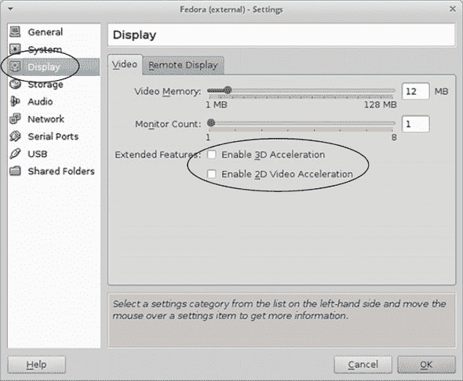
> 
> 如果你发现无法在虚拟机中运行 GNOME，请尝试禁用 3D 加速。

## 第六章\. 操纵你的桌面

现在是时候开始探索您的桌面了！我们在上一章讨论了一些桌面环境，今天我们将专注于使用 Linux 桌面进行基本任务。我将使用 Unity，Ubuntu 的默认桌面环境，作为许多示例，但我也会向您展示其他桌面环境的工作方式。此外，我们在这里讨论的大部分内容对于您作为一个普通计算机用户来说应该相当熟悉。我将要做的是，将您在当前操作系统中所做的基本、日常事情展示如何用 Linux 来完成。

### 6.1. 使用程序

在本节中，我将向您展示如何在 Ubuntu 系统中查找、启动和关闭程序。我认为大多数读者会发现这个过程很熟悉。它与使用其他操作系统并没有太大的不同，但不同之处足以值得进行一次演示。这样，我们都在同一页面上。

#### 6.1.1. 查找程序

我们已经对此进行了一些讨论，但要找到 Unity 中的程序，您需要使用左侧的导航栏（或 Windows/Super 键）并输入您希望启动的程序名称到 Dash，Unity 的启动器（见图 6.1）。

##### 图 6.1。这是 Unity 的 Dash 区域。圆圈区域是您输入要启动的程序或文件名称的地方。

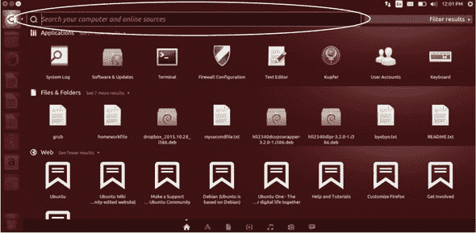

但如果您不知道您想要使用的程序的名称怎么办？首先要注意的是，Unity 在程序名称上做了一些别名处理，所以与命令行不同，您需要精确，在 Unity（以及大多数其他桌面应用程序启动器）中，您不一定需要输入程序的准确名称。相反，您只需输入程序类别即可。例如，如果您想启动 Firefox 网络浏览器，您可以输入`Firefox`并点击 Firefox 图标，或者当它在列表中出现时按 Enter 键。 

但如果您不确定哪个浏览器，或者哪些浏览器与您的发行版一起提供？在这种情况下，您可以输入`web browser`，您将看到 Firefox 出现。如果您继续安装另一个网络浏览器，它也会出现（见图 6.2）。

##### 图 6.2。在 Dash 中输入`web browser`将显示您电脑上安装的所有网络浏览器。

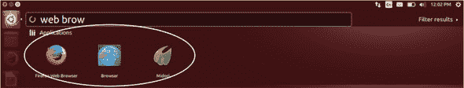

但如果您找不到需要的程序怎么办？Unity 将允许您查看电脑上安装的所有程序，尽管与其它桌面环境不同，它们不会按任何特定顺序排列。

要浏览所有这些程序：

> **1**. 打开 Dash（可以通过点击任务栏左上角的图标或使用 Windows/Super 键）。
> 
> **2**. 切换到屏幕底部的应用范围。

此范围会让 Unity 只搜索您的应用程序，而不是您的程序、文件以及您激活的任何范围（见图 6.3）。

##### 图 6.3。您可以使用 Dash 屏幕上的应用范围让 Unity 只搜索您电脑上的程序。

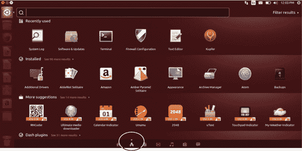

其他桌面环境，特别是更多基于菜单驱动的环境，通过使用菜单标题将程序排序到大致的主题顺序中，使其更容易找到程序。例如，在 KDE 中，如果你想找到你的网络浏览器：

> **1**. 在左下角打开 KDE 菜单
> 
> **2**. 点击应用程序
> 
> **3**. 点击互联网
> 
> **4**. 点击网络浏览器

KDE 将显示机器上安装的所有网络浏览器（见图 6.4）。你会点击你想要启动的一个。

##### 图 6.4\. KDE 按功能对应用程序进行排序。

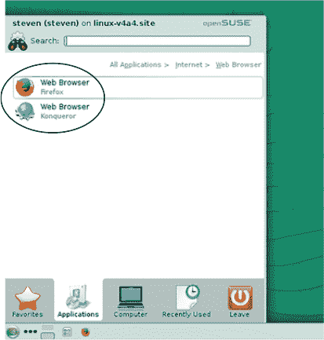

如你所见，在各个桌面环境中查找程序就像输入或使用菜单一样简单——这可能是你已经习惯的。

在下一节中，我们将进一步探讨在 Linux 中使用程序，从默认的 Ubuntu/GNOME 文件管理器 Nautilus 开始。

#### 6.1.2\. 启动程序

要打开 Nautilus，启动 Dash 并输入 *file*。有趣的是，你会注意到如果你输入 file manager，它不会被选中。这是因为 Ubuntu 将其文件管理器称为 *Files*。Files 的“真实”名称是 Nautilus。Files 是 Nautilus 的别名。所以如果你输入 file 或 files 没问题，但如果你输入更多，应用程序将无法找到。你也可以通过在 Dash 中输入 Nautilus 来找到它。

你还会在 Dash 区域的文本下方看到一个 Nautilus 图标。如果你查看左侧的导航坞，你会看到相同的图标（见图 6.5）。程序也可以从导航坞启动。GNOME 在屏幕左侧有一个类似的导航坞，而 Xfce 在底部（见图 6.6）。这些导航坞的技巧通常只是识别图标的问题。

##### 图 6.5\. 如果你不确定一个图标的意思，Unity Dash 会显示给你。

##### 图 6.6\. 其他桌面环境，包括 Xfce，也定义了图标。

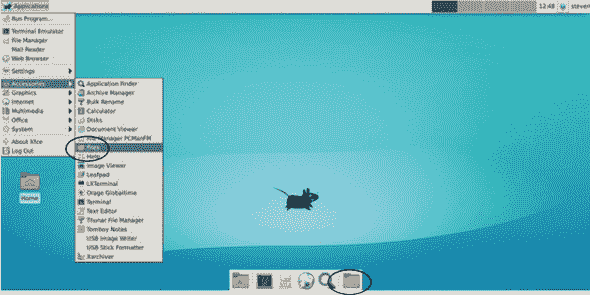

#### 6.1.3\. 关闭程序

在 Unity 中，关闭应用程序按钮位于屏幕顶部左侧（见图 6.7）。KDE、GNOME 和 Xfce 都在右上角有关闭按钮。

##### 图 6.7\. Unity 的窗口控制位于顶部左侧，像 OS X 一样。其他桌面环境使用顶部右侧。

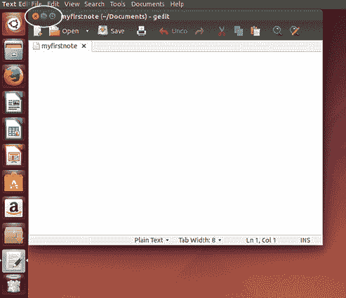

#### 6.1.4\. 顶部菜单栏

你可能已经注意到程序缺少在其他操作系统中看到的顶部菜单栏（见图 6.8）。

##### 图 6.8\. Unity 默认不显示这样的顶部菜单。

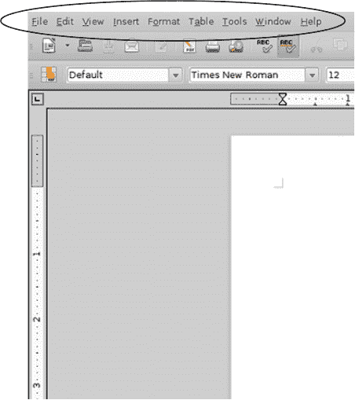

这是另一个 Unity 设计选择——菜单集成到那个顶部面板中。对于没有想到向上看那么远的用户来说，有时会感到困惑。要使顶部菜单出现，将光标移到顶部面板（它是有时钟的面板）。见图 6.9。

##### 图 6.9\. 在 Unity 中，将光标移到屏幕顶部会导致顶部菜单栏出现。

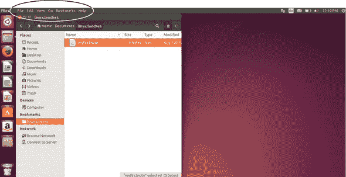

一旦你的光标触碰到那个面板，你会注意到菜单出现。

#### 6.1.5. 自定义你的磁贴

拥有磁贴概念的每个发行版都允许对其进行自定义，包括添加和删除程序。

在 Unity 中，每次你打开一个程序，它的图标都会出现在左侧磁贴上，小三角形表示它是活动的程序（见图 6.10）。

##### 图 6.10. Unity 通过在其程序图标两侧的两个小三角形来显示其左侧磁贴上哪个程序是活动的。

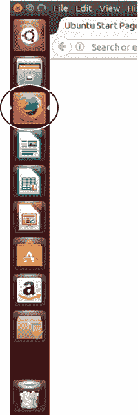

要添加或删除磁贴上的程序：

> **1**. 右键点击磁贴图标（见图 6.11）
> 
> ##### 图 6.11. 可以从 Unity 磁贴中添加和删除程序。
> ##### 
> 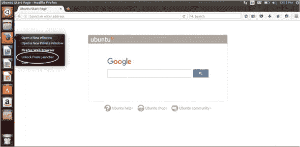
> 
> **2**. 点击“从启动器解锁”

当程序打开时，图标将保持可见，但当程序关闭时将消失。这对于你不太常用的程序来说是个好功能。

要添加程序到磁贴：

> **1**. 右键点击磁贴图标
> 
> **2**. 点击“锁定到启动器”

然后图标将始终存在。这对于你经常使用的程序来说是个好功能。

这个过程对于 GNOME 来说基本上是相同的，除了 GNOME 使用浅蓝色下划线来指示活动程序（见图 6.12），并且将其磁贴称为“收藏夹”而不是 Unity 中的“启动器”（见图 6.13）。

##### 图 6.12. GNOME 使用微妙的蓝色下划线来指示其磁贴上的活动程序。

##### 图 6.13. GNOME 将其磁贴称为“收藏夹”，就像 Unity 一样，允许你添加和删除程序。

不同分布和桌面环境在添加和删除程序到或从磁贴、任务栏和面板的过程中会有不同的处理流程，但大多数情况下，你都是通过在图标上右键点击来完成这一操作的。

现在，以你选择的方式打开 Nautilus，然后我们将继续在 Linux 桌面上处理文件。

### 6.2. 工作于文件和文件夹

就像在其他操作系统一样，几乎每个 Linux 桌面环境都有三种打开文件的方式：

> **1**. 双击文件以打开它。
> 
> **2**. 通过应用程序打开文件。
> 
> **3**. 通过启动器打开文件。

文件在文件夹中，所以让我们先暂时处理一下文件夹。

#### 6.2.1. 创建文件夹

首先，我们需要一个工作文件夹。

**创建文件夹**

> **1**. 进入 Nautilus 并双击你的文档文件夹。
> 
> **2**. 你现在在这个文件夹内。这应该对你来说很熟悉。Linux 桌面与其他操作系统非常相似。
> 
> **3**. 在文档文件夹的空白、白色区域右键点击，然后点击 *新建文件夹*。
> 
> 
> 
> 将文件夹添加到 Nautilus 的操作就像右键点击一样简单。
> 
> **4**. 将此文件夹命名为 linux.lunches。你现在在你的文档文件夹中有一个文件夹了。
> 
> 
> 
> 你的 Nautilus 文件夹

双击进入这个新文件夹，将你置于 linux.lunches 文件夹内。

#### 6.2.2. 创建文件

现在我们将在这个文件夹中放置一个文件。再次右键单击，就像我们创建文件夹时做的那样，但这次点击新建文档，然后点击空白文档。将创建一个新文件，你可以将其命名为 myfirstnote。

你会注意到我没有包括文件扩展名。一些用户可能习惯于将所有内容都保存为带有文件扩展名（如果你不这样做，一些操作系统会为你添加一个）。文件扩展名是位于文件名末尾点后面的两个、三个或四个字母后缀。文件扩展名帮助一些操作系统了解它正在处理什么类型的文件以及打开它需要什么。所以当它看到.docx 文件扩展名时，系统假设它正在处理一个 Word 文件。没有文件扩展名，一些操作系统会要求你选择一个用于打开该文件的程序。但 Linux 不需要以同样的方式使用扩展名。它可以不使用文件扩展名就建立关联。

所以，如果你有这个习惯和偏好，你可以将文件保存为 myfirstnote.txt。但 Linux 系统会假设空文件是文本文件——即使没有扩展名。正因为如此，你可以将文件保存为 myfirstnote。无论哪种方式，文件都将使用你的默认文本编辑器打开。并且请注意，你没有打开文本编辑器就创建了一个文本文件，这有点令人印象深刻！

#### 6.2.3\. 打开文件

现在让我们练习打开文件。双击 myfirstnote 来打开它，就像在任何操作系统上一样。正如你所期望的，文件打开了。打开它的程序被称为 gedit（见图 6.14）。它是一种在许多桌面环境中默认的文本编辑器，包括 Unity 和 GNOME。我们将在第九章中更多地讨论 gedit。

##### 图 6.14\. gedit 是 Unity 和 GNOME 中常见的简单文本编辑器。

现在关闭 gedit。

现在打开 gedit。这次打开 gedit，你将使用 Unity 启动器并输入`gedit`或`text editor`。另一种打开文件的方式是使用 gedit 中的打开对话框并导航到文件。这在所有操作系统中都很常见。gedit 方便地在顶部导航菜单中有一个打开按钮。使用顶部导航打开 myfirstnote（见图 6.15）。然后，再次关闭 gedit。

##### 图 6.15\. 文件可以通过应用程序打开。这在桌面环境和操作系统中都是通用的。

打开文件的最后一种方式是使用 Dash。你不需要输入应用程序的名称，而是可以输入文件的名称（见图 6.16）。输入`myfirstnote`，文件就会出现在 Dash 中（如果你使用的是应用程序范围，则不会出现，因为应用程序范围只搜索程序而不是文件）。GNOME 和 KDE 都具备这种功能（见图 6.17 和 6.18）。

##### 图 6.16\. Unity Dash 搜索文件。

##### 图 6.17\. KDE 是另一个提供无需通过文件夹导航即可轻松访问文件的桌面环境。

##### 图 6.18\. GNOME 可以搜索文件以及应用程序。

然而，许多人更喜欢通过文件管理器或应用程序导航到文件。一旦您养成通过键入文件名打开文件的习惯，您会发现这是一种更快、更有效的工作方式——跨发行版和操作系统。

#### 6.2.4\. 移动文件夹和文件

在各个发行版中移动文件夹和文件是标准的。只需单击一次文件以选择它，然后将它拖动到您希望它出现的位置的目录。Nautilus 允许您像其他文件管理器一样书签目录。书签目录的优点是它使得将文件移动到常用目录变得更加容易。让我们将 linux.lunches 目录书签，然后将一个文件拖入其中。

首先，打开我们在本章前面提到的 Nautilus 文件管理器。然后，导航到我们之前创建的 linux.lunches 目录（它在文档中）。要访问 Nautilus 书签区域，您需要将光标移到屏幕顶部，即顶部面板，其中包含时钟（见图 6.19）。

##### 图 6.19\. 要访问 Nautilus 书签菜单，您需要使用顶部的 Unity 面板激活它。

当您的鼠标移到顶部时，您可以点击书签菜单，然后书签此位置。现在您将在 Nautlius 的左侧导航区域下的书签中看到 linux.lunches（见图 6.20）。

##### 图 6.20\. 大多数文件管理器，包括 Nautilus，都允许您书签常用目录。

现在，使用 Nautilus 导航到桌面文件夹，创建一个名为 mysecondnote 的空文档。单击一次，然后将其拖入 linux.lunches（见图 6.21）。

##### 图 6.21\. 您可以将文件拖动到目录中，这有助于您组织它们。

#### 6.2.5\. 复制文件夹和文件

要复制文件夹或文件：

> **1**.  右键单击它以获取上下文菜单（见图 6.22）。
> 
> ##### 图 6.22\. 右键单击文件以获取其上下文菜单。
> ##### 
> 
> 
> **2**.  如果您想使用文件管理器将其复制到另一个目录，请选择“复制到”，该文件管理器将在您选择此选项后打开（见图 6.23）。
> 
> ##### 图 6.23\. “复制到”会调用文件管理器。
> ##### 
> 
> 
> **3**.  如果您想手动将其粘贴到文件夹中，请选择“复制”。
> 
> **4**.  要将它粘贴到文件夹中，导航到目标文件夹，然后在文件夹中右键单击。上下文菜单中会出现“粘贴”选项（见图 6.24）。
> 
> ##### 图 6.24\. 在目标文件夹中右键单击以粘贴复制的文件。
> ##### 
> 

#### 6.2.6\. 删除文件夹和文件

到目前为止，可能不会令人惊讶，删除文件夹和文件的操作也与其他操作系统类似。您可以通过点击文件夹或文件并按下键盘上的 Delete 键，或者通过右键点击并使用上下文菜单将其移动到回收站（图 6.25）。

##### 图 6.25\. 右键点击文件将其移动到回收站。

#### 6.2.7\. 更改文件夹和文件的外观

您可能已经注意到 Nautilus 文件图标很大，占用的空间很多。

如果您更喜欢更简洁的视图，您可以在 Nautilus 中轻松更改。首先，转到顶部面板，这将使 Nautilus 面板出现。然后，转到编辑菜单并选择首选项。从那里，您可以自定义 Nautilus 的一些行为。例如，如果您不喜欢将文件和文件夹表示为粗大的图标，您可以将它们切换到列表视图，这可以在“视图”选项卡下找到（见图 6.26）。首选项区域允许您更改一些事情，例如，如果您想通过单击而不是双击来打开文件夹，您可以选择这样做。更改将在您下次打开 Nautilus 时生效。图 6.27 显示了我们的文件夹在更紧凑的列表视图中。

##### 图 6.26\. 您可以通过切换到列表视图来简化 Nautilus 界面。

##### 图 6.27\. 在 Nautlius 列表视图中，文件夹和文件占用的屏幕空间更少。

这种配置在文件管理器中是标准的。例如，您可以使用 Dolphin，默认的 KDE 文件管理器（见图 6.28）做类似的事情。

##### 图 6.28\. 大多数 Linux 文件管理器提供不同的视图选项，包括 KDE 的 Dolphin。

### 6.3\. 总结

现在您应该对如何在桌面上导航有了很好的感觉。本书假设您正在使用 Ubuntu 上的 Unity。如果您在不同的发行版或 Ubuntu 中的不同桌面环境中使用不同的环境，这里我们讨论的所有概念都将适用——您的桌面环境或发行版中的某些事物可能看起来略有不同。

我希望您会关注通过启动器启动文件的能力，无论是像 KDE 那样的菜单区域，还是像 Unity 和 GNOME 那样的 Dash/启动器区域。无需深入文件夹即可打开文件可以节省大量时间。尽管并非每个桌面环境都支持该功能，但像 GNOME 和 KDE 这样的主要桌面环境都支持。没有这种能力的桌面可以通过安装启动器来实现，我们将在第十六章中讨论。拥有复杂文件文件夹层次结构的用户将喜欢能够立即调用所需文件的能力。然而，喜欢传统点击打开文件访问的用户在 Linux 中始终有这个选项。

但总的来说，我希望你现在看到，Linux 并不像其他操作系统那样不同。Linux 非常可定制，正如我们通过不同桌面环境中打开文件的不同方式所看到的，但在其核心，GUI 应该感觉非常熟悉。

#### 术语表

在本章中，我解释了以下内容：

##### 上下文菜单

显示额外选项的菜单。通常通过右键单击文件或文件夹来找到它们。

##### 超级键

键盘上的 Windows 标志键。

### 6.4. 实验室

本章重点介绍了 Ubuntu 和 Unity，但正如你所看到的，在不同桌面环境之间导航和文件操作基本上是相同的。对于你的作业：

> **1**. 在您的文档文件夹中创建一个名为 homework 的文件夹。
> 
> **2**. 在作业文件夹中创建一个名为 homeworkfile 的文档。
> 
> **3**. 将作业文件夹添加到书签。
> 
> **4**. 将作业移动到 linux.lunches。
> 
> **5**. 当你访问作业书签时会发生什么？homeworkfile 是否随它一起移动？

完成这些操作有多种方法。只要文件夹被创建，文件和文件夹被移动，就没有正确或错误的方法。

**额外加分**

> **1**. 你会如何查看文件的属性？
> 
> **2**. 你会如何查看文件夹的属性？
> 
> **3**. 你如何创建文件或文件夹的快捷方式？
