## 第二部分\. Linux 家庭办公

在《一个月午餐学会 Linux》的第二部分中，这些章节将为你准备使用 Linux 进行家庭办公，以及你如何在日常生活中使用 Linux。你将了解可用的庞大软件世界，如何安装它，以及如何使用它。你还将学习神秘的、看似令人生畏但实际上并不那么糟糕的命令行。你还将学习：

+   如何使用 Linux 生产力软件来完成诸如文字处理和编辑照片等工作

+   文本编辑器的美和便利

+   命令行是什么以及如何使用它

+   如何在 Linux 中运行 Windows 程序

+   在 Linux 中高效工作的技巧

## 第七章\. 安装软件

欢迎来到我们旅程的第二部分 part 2！现在你已经让 Linux 运行起来并了解了它的工作原理，比如发行版和桌面环境，我们将花时间让它准备好供你使用。接下来的 10 章将教你如何使用和自定义你的 Linux 环境，以便你能够高效工作。例如，一旦你学会了命令行，你可能就再也不想回到图形程序了。现在，让我们来谈谈基本级别的自定义——在你的系统上安装新的软件。

每个发行版都预装了软件。在上一章中，我们看到了 GNOME 和 Unity 各自带了 Nautilus 文件管理器和 gedit 文本编辑器。但如果你不喜欢这些工具呢？Linux 的美妙之处在于你很少会陷入软件的困境。在这一章中，你将学习如何使用 Linux 安装和删除软件。更具体地说：

+   我将讨论软件包管理器，它用于安装和删除软件。

+   我们将打开并使用 Ubuntu 软件管理器来安装 Synaptic，*另一个*软件包管理器。

+   我们将打开并使用 Synaptic 来安装 Vim。

我还将讨论一些关于软件在 Linux 中如何工作的基本概念。然而，这一章将专注于安装软件的机制。我将在下一章中探索更多“一切是如何工作的”内容。现在，我猜你可能有一些你希望在电脑上安装的喜欢的软件，所以我将首先向你展示如何做到这一点。

### 7.1\. 软件包管理器

Linux 的软件安装、删除和更新由软件包管理器处理。软件包管理器是我们用户和发行版软件仓库之间的操作工具。这是你寻找要安装的软件的地方。

软件包管理器也是保持你的计算机上软件更新的工具。正如我之前提到的，一些发行版比其他发行版有更新的软件版本。一些发行版可能使用 gedit 的 3.17 版本，而另一个可能使用 3.4 版本（版本号越高，软件越新）。使用的版本取决于仓库中可用的内容。

如果软件在仓库中不可用，则无法使用软件包管理器进行安装。如果您想安装新的桌面环境，您也会使用软件包管理器。您找到它并安装它，您就拥有了另一个桌面。

此外，在大多数情况下，您将使用软件包管理器来安装、删除和更新软件，而不是从网站上下载软件。正如我之前提到的，从手机应用商店安装软件而不是从不同网站下载，这个过程对习惯于应用商店的人来说很熟悉，但可能对 Windows 用户来说感觉有些奇怪（尽管 Windows 通过添加/删除软件区域使用类似软件包管理器的概念从计算机中删除软件）。然而，一旦您习惯了它，您会对软件的安装和删除的便捷性感到兴奋。

您的计算机只有一个软件包管理器，但有不同的界面。尽管外观不同，您始终在与之交互。稍后，我们将使用命令来安装和删除软件。

在本章中，我们将探讨 Synaptic（见图 7.1），它是由基于 Debian 的系统使用的图形化软件包管理器。我们还将探讨 Ubuntu 软件商店，它也是另一个图形化软件包管理器。您可以使用其中一个或两个来安装软件，而不会对您的系统造成任何影响。

##### 图 7.1\. Synaptic 适用于每个基于 Debian 的系统，这使得了解它非常有用。

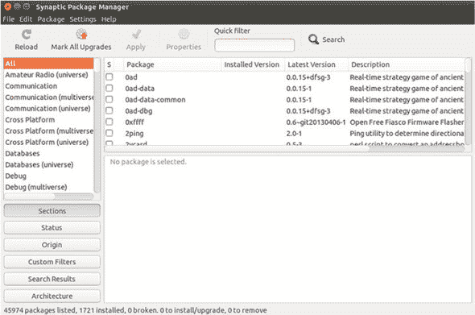

尽管它们是不同的界面，但它们使用的是相同的后端。对于基于 Debian 的发行版，后端是*Apt*，代表*高级包装工具*。不同的发行版使用不同的软件包管理器，但它们背后的概念是相同的。例如，Fedora 和 OpenSUSE 共享一个名为*RPM*的后端，代表*RPM 软件包管理器*（另一个迷人且令人愤怒的递归 Linux 缩写）。Fedora 上的 RPM 图形界面称为*软件*，是 GNOME 软件安装程序（见图 7.2）。这也是 Ubuntu 16.04 的默认软件安装程序，它不再使用 Ubuntu 软件中心。

##### 图 7.2\. Fedora 的图形化软件包管理器称为软件。它使用 RPM 软件包管理器。注意它看起来像是一个应用商店。


OpenSUSE 的图形界面称为*YaST（另一种设置工具）控制中心*（见图 7.3）。

##### 图 7.3\. OpenSUSE 的图形化软件包管理器称为 YaST。与 Fedora 类似，它使用 RPM 软件包管理器。注意它看起来更像是 Synaptic。

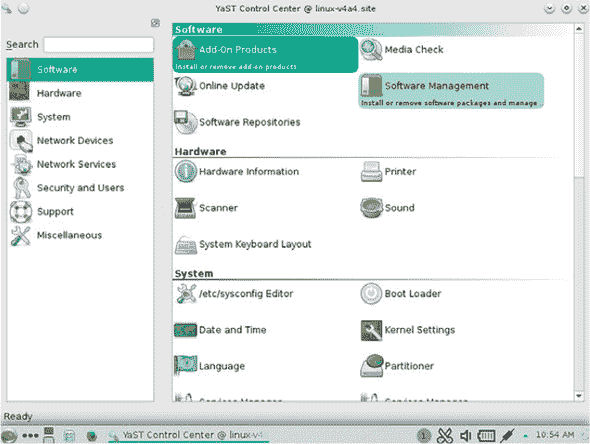

软件包管理器的工作方式与桌面管理器非常相似——技术基础相同，但图形用户界面可能不同。关键区别在于界面是针对特定发行版的，所以如果你喜欢 YaST 的外观和感觉，你无法在 Fedora 上使用它。然而，就交互方式而言，行为在各个发行版之间几乎是相同的。Ubuntu 不再预装 Synaptic，所以在我们查看它之前，我们需要安装它。让我们从 Ubuntu 的图形包管理器开始，这是我们用来安装 Synaptic 的工具。

### 7.2\. Ubuntu 软件中心

我们使用的 14.04 版本的 Ubuntu 的默认包管理器被称为 *Ubuntu 软件中心*。它不是一个真正的包管理器，因为它不处理软件更新。相反，它只允许你安装和删除软件。此外，它模仿了商店的模式，因此它包括像评论和推荐这样的内容，这在大多数图形包管理器中是看不到的。最后，因为它模仿了商店的模式，所以其中并非所有内容都是免费的。这在 Linux 中是不寻常的，但在移动应用商店中相当标准。

虽然 Ubuntu 软件中心看起来很漂亮，但我发现它的速度比纯图形包管理器（如 Synaptic）慢。此外，尽管软件中心有很多优秀、值得购买的内容，但我很少需要它们。所以我们要做的第一件事就是安装一个*不同的*包管理器。

要启动 Ubuntu 软件中心，进入 Dash 并输入 `Ubuntu Software Center`，然后点击应用程序。你会看到类似图 7.4 的东西。

##### 图 7.4\. Ubuntu 软件中心看起来像是一个标准的应用商店。

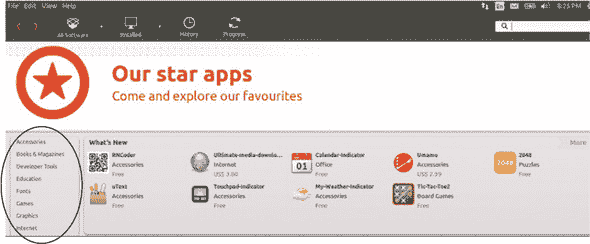

这在图形包管理器中相当标准。如果你想查看所有办公软件，你可以点击 Office 链接并查看列表。

软件中心还让你可以看到你安装的程序以及你安装、删除和更新的程序的历史记录（图 7.5）。该列表按日期排序，如果你试图找到你意外删除或安装的东西，这很有帮助。

##### 图 7.5\. Ubuntu 软件中心提供了你已安装的所有软件列表，并跟踪软件的添加、删除和更新。

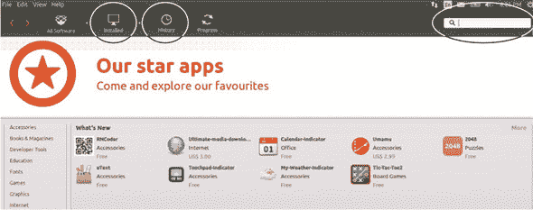

由于我们知道我们想要安装的软件名称是 Synaptic，我们可以使用搜索框搜索它。

软件中心会随着你的输入进行匹配，最终你将看到包含 Synaptic 在列表顶部的结果列表。点击它，你将可以选择安装它或者获取关于该程序（见图 7.6）的更多信息。

##### 图 7.6\. 一旦找到你想要的软件，你可以安装它或者获取更多关于它的信息。

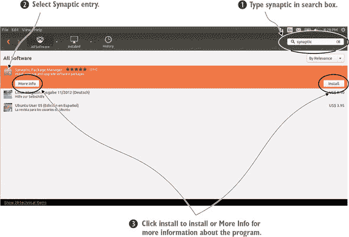

更多信息屏幕(图 7.7)有有趣的信息。除了软件的描述，这在图形包管理器中相当标准之外，Ubuntu 软件中心还提供用户评价和相关软件的链接。这在图形包管理器中并不常见，但可能对新手有帮助。更多信息屏幕还有一个安装软件的链接，允许您在安装之前了解一些关于软件的信息。点击“安装”将 Synaptic 添加到您的系统中。

##### 图 7.7\. 软件可以通过 Ubuntu 软件中心的更多信息区域安装。

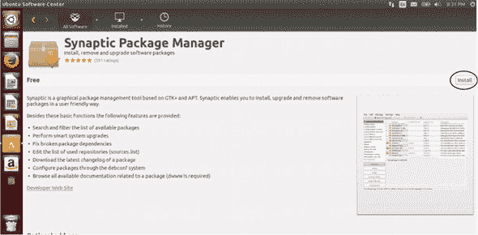

您将被要求输入密码进行身份验证（见图 7.8)。这也是 Linux 的一个概念。一些操作系统，包括移动和桌面操作系统，除非另有说明，否则允许任何人安装软件。然而，Linux 系统有一个*管理员*的概念，这意味着只有某些人有权安装新的软件。我们将在第十九章中进一步讨论这个问题。

##### 图 7.8\. 所有 Linux 系统在安装软件时都需要密码。

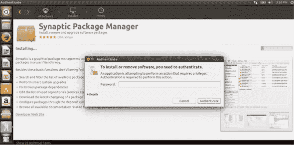

输入密码后，软件将被安装。安装完成后，您将看到一个中间有白色勾选的绿色圆圈以及安装日期。您现在还将看到一个“移除”按钮，以防您改变了安装的决定（见图 7.9)。

##### 图 7.9\. 软件安装后，您可以选择查看安装时间以及卸载它。

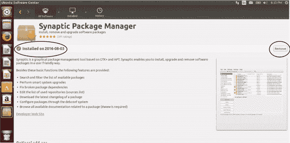

要移除 Synaptic 或其他软件，请点击“移除”。如果您在软件中心点击后退箭头，您将返回到您刚刚搜索的程序列表。如果您点击 Synaptic，您现在将看到一个“移除”链接而不是“安装”链接（见图 7.10）。一般而言，移除软件意味着在软件中心中搜索它，然后从您的系统中移除它。

##### 图 7.10\. Ubuntu 软件中心也可以用来移除软件。

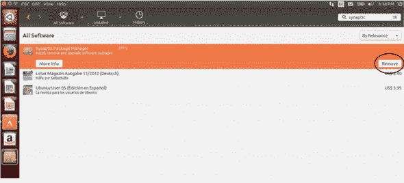

我知道这看起来非常 Ubuntu 特定，但这个过程在各个发行版中都是相同的。图 7.11 展示了 Mint 软件管理器，其外观与 Ubuntu 软件中心相似。您会看到我在那里搜索 Synaptic。

##### 图 7.11\. Mint 的软件管理器外观与 Ubuntu 软件中心相似。

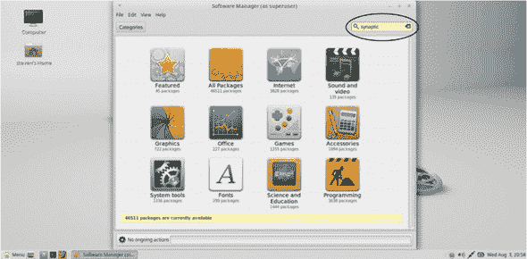

在图 7.12 中，您可以看到结果列表，其外观类似于 Ubuntu 软件的结果列表。您看到 Synaptic 在绿色圆圈中有一个白色勾选，表示已安装。您还可以看到星星和评价，就像在 Ubuntu 软件中心中看到的那样。然而，您不能从这个屏幕中移除它，就像您可以从软件中心中移除一样。

##### 图 7.12\. Mint 软件管理器的结果屏幕也看起来像 Ubuntu 软件中心。

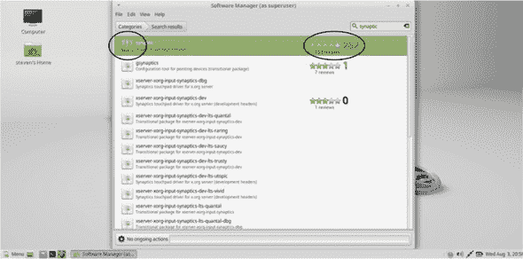

当你双击 Synaptic 条目时，你会进入一个与 Ubuntu 软件中心类似的屏幕（见图 7.13）。从那个屏幕你可以移除 Synaptic（或者如果它还没有安装，你可以添加它）。

##### 图 7.13。一旦你双击进入 Mint 软件管理器条目，你就可以移除软件。

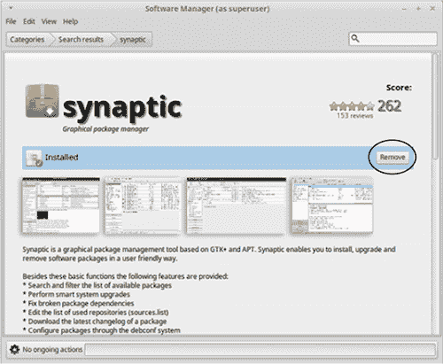

如你所见，无论你使用什么包管理器，基本过程都是一样的。现在，只要你的 Synaptic 已经安装，我们就来看看如何使用它来安装软件。

| |
| --- |

**16.04 中的 Ubuntu 软件**

Ubuntu 16.04 中的软件客户端被称为 Ubuntu 软件。

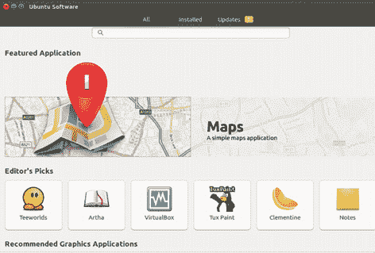

Ubuntu 在 16.04 版本中使用了新的包管理器。

界面与 Ubuntu 软件中心非常相似。软件按类别排列或可以搜索。

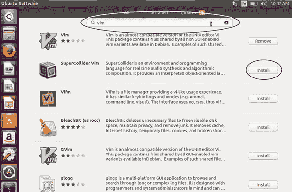

Ubuntu 软件拥有与 Ubuntu 软件中心非常相似的界面。

一旦你找到了想要安装的东西，你点击安装按钮，这与 Ubuntu 软件中心类似。如果你发现自己正在迁移到 16.04，你不会在两个包管理器之间注意到太大的差异。就使用方式而言，最大的变化是更短的名字！

| |
| --- |

### 7.3. Synaptic

Synaptic 适用于*所有*基于 Debian 的发行版，这意味着它有相当多的发行版可以选择。Synaptic 还允许你更新软件或获取新版本，我们将在第十七章中讨论这一点。如果你还打开着 Ubuntu 软件中心，请关闭它并打开 Synaptic（你一次只能打开一个包管理器）。当你打开 Synaptic 时，它会在你尝试做任何事情之前要求你的密码。第一次打开时，它会给你一个关于其工作方式的简要说明（见图 7.14）。我们将在本节中介绍这一点，所以请随意关闭通知。

##### 图 7.14。第一次打开 Synaptic 时，它会给你一个关于其工作方式的简要说明。

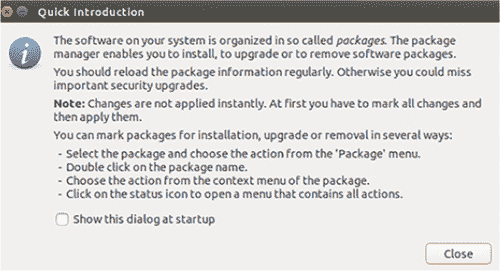

Synaptic 的布局与我们在 Ubuntu 软件中心和 Mint 软件管理器中看到的是相似的（见图 7.15）。你可以通过输入软件名称进行粗略的分类，也可以进行搜索。你会注意到一些主题的标题中包含*multiverse*和*universe*。*Multiverse*指的是非自由、专有软件（由于无法通过 Synaptic 购买软件，所以它不涉及成本）。*Universe*指的是由社区贡献但未由 Ubuntu 官方支持的软件。

##### 图 7.15。Synaptic 的布局与其他我们查看过的图形包管理器类似。

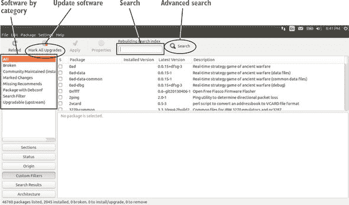

现在，对 Vim 进行过滤搜索，Vim 是我们将在本书后面讨论的文本编辑器。在快速过滤框中输入`vim`，然后按 Enter 键。快速过滤搜索通常适用于搜索软件，尽管 Synaptic 有一个高级搜索选项，允许你进行诸如按*依赖项*（我将在稍后讨论这个术语）或软件版本进行搜索。

我们想要的软件就在列表的顶部。如果它已安装在系统中，框中会有绿色而不是白色。每一列的设置都是可排序的，所以如果你想按软件包或软件的名称排序列表，你可以点击软件包，排序将变为按软件包名称的字母顺序（见图 7.16）。S 列允许你按你已经在电脑上安装的内容排序。但由于我们看到我们想要的软件包，现在就保持排序不变。

##### 图 7.16\. Synaptic 允许你按几个参数排序。

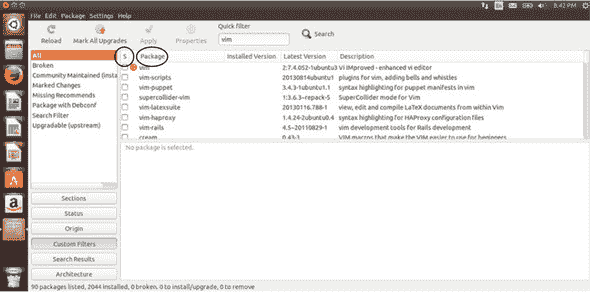

如果你点击 vim 条目，你会得到软件的简要描述。你不会得到像在 Ubuntu 软件中心那样多的信息和反馈，但大多数时候，你知道你想要安装什么，不需要额外的信息。

点击 vim 旁边的空白框，你会得到一个小弹出框（见图 7.17）。点击标记为安装，你会被要求安装额外的软件（见图 7.18）。这是 Vim 运行所需的软件。它被称为*依赖项*，意味着它是另一个程序运行所需的程序。我们将在第十七章中讨论这个问题。现在，点击标记来表示你想要安装它。你现在会注意到 vim 旁边的框中有一个勾，这意味着它已准备好安装。

##### 图 7.17\. 使用标记为安装来表示你想要安装软件。

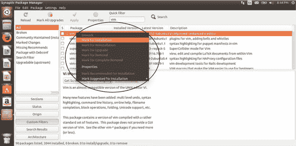

##### 图 7.18\. 软件包管理器会自动安装其他软件所需的软件。

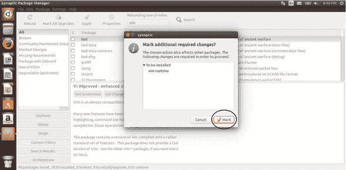

在这个阶段，你可以继续操作，标记要安装和卸载的软件。你不需要一次只做一件事。但由于我们只安装 Vim，你可以点击应用（见图 7.19）。Synaptic 会弹出一个窗口总结你的操作，并要求你通过点击另一个应用来确认。点击它，Vim 就会安装。

##### 图 7.19\. 应用按钮是告诉 Synaptic 移除、添加或更新软件的最后一步。

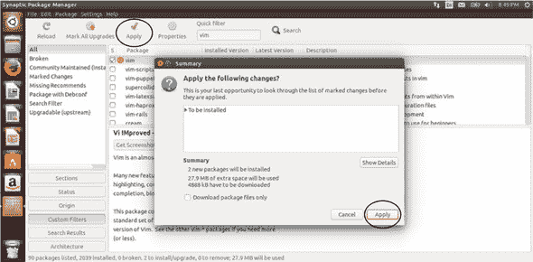

当 Synaptic 完成后，你会得到一个消息告诉你更改已被应用。然后你可以关闭对话框。你会注意到 vim 旁边的框现在是绿色的，表示软件已安装到你的电脑上（见图 7.20）。

##### 图 7.20\. vim 旁边的绿色框表示软件已被安装。

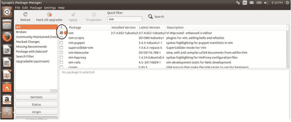

如果您点击绿色框，您将看到重新安装软件的选项，如果软件运行不正确，可以删除它，这将删除软件；或者选择*完全*删除它，这将删除软件和相关配置文件（见图 7.21）。

##### 图 7.21\. 点击程序旁边的绿色框可以重新安装或删除程序。

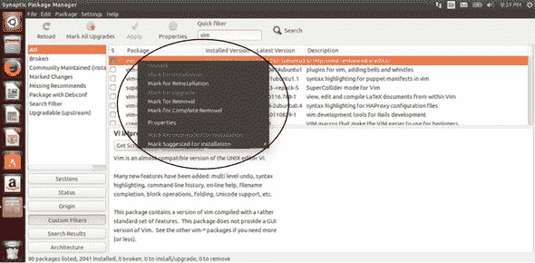

现在让我们先保留 Vim 的安装状态。

### 7.4\. 总结

如您所见，尽管不同发行版的软件安装和删除工具不同，但过程是相似的。我们专注于 Ubuntu，但如您所见，Ubuntu 软件中心与 Synaptic 类似，这在基于 Debian 的发行版中很常见。其他图形包管理器在其他发行版中也以相同的方式工作。关于软件包管理还有很多要说的，但现在，我想让您对如何操作有一个概念。我们将在接下来的几顿午餐中探讨软件包管理的原理。

#### 术语表

在本章中，我解释了：

##### 软件包管理器

允许您从仓库安装和更新软件，并保持计算机上的软件更新

##### 仓库

软件包的集合

### 7.5\. 实验室

进入 Synaptic 并删除 Vim。然后，进入 Ubuntu 软件中心并重新安装它。

> **1**. 如何在 Synaptic 中启动搜索？
> 
> **2**. 如何在 Ubuntu 软件中心中启动搜索？
> 
> **3**. 如果您需要更新软件，您会使用哪个工具？

在这两个工具中查找办公软件（我们将在下一章讨论办公软件）。

+   您更喜欢哪个界面进行搜索？

+   哪个界面更容易发现软件？

+   您为什么喜欢这个界面？

## 第八章\. Linux 家/办公软件简介

一旦您学会了如何安装软件，这在上一章中已经介绍过了，Linux 就真正为您打开了大门。因为软件是您定制桌面并使其个性化的方式。本章将涵盖大多数用户日常使用的典型软件。其中一些软件在 Ubuntu（或您选择的发行版）中默认安装，而一些则需要安装，而这正是您现在所知道的！我将带您了解

+   办公生产力软件，您可以使用电子表格、文字处理和收发电子邮件。

+   图像编辑器，您可以裁剪和调整您照片的大小。

+   多媒体播放器，您可以观看电影和听音乐。

这将是对您可用的各种工具的简要概述。大部分工具与 Windows/OS X 的对应工具相似，因此您应该能够轻松地使用这些程序（GIMP 图像编辑器稍微复杂一些，可能需要一本自己的书）。我将介绍很多软件，以便您了解一些可用的内容，并决定哪些工具最适合您的工作。本章讨论的许多程序也有 Windows/OS X 版本，所以如果您发现喜欢的东西，您可能能够在不同的操作系统上使用它。

| |
| --- |

##### 网络浏览器

我不会在这里讨论网络浏览器，因为它们在各个操作系统之间几乎相同。尽管您没有 Linux 的 Internet Explorer、Edge 或 Safari，但您有 Chrome 和 Firefox，它们完全一样。

大多数仓库都有一个名为 Chromium 的浏览器，它是 Chrome 的开源版本。浏览器非常相似，但 Chromium 排除了其中的一些专有代码。排除的代码部分包括对 Adobe Flash 的支持。

有些人可能会注意到 Chrome 和 Chromium 之间的区别，但大多数人不会。然而，如果您注意到差异并且希望使用 Chrome，您可以从 Google 下载并安装它。我们将在第十七章（kindle_split_027.html#ch17）中讨论如何从外部仓库安装软件。

| |
| --- |

### 8.1\. 办公/生产力

当我说“办公/生产力”时，我可以假装在谈论一个软件类别，但我认为每个人都知道我的意思是指 Microsoft Office。Microsoft Office 是一套程序：

+   文字（文字处理器）

+   Excel（电子表格）

+   PowerPoint（演示文稿）

+   Outlook（电子邮件）

+   访问（数据库）

+   OneNote（笔记）

+   发布者（桌面出版）

#### 8.1.1\. LibreOffice

Linux 与 Microsoft Office 最接近的等价物是 LibreOffice（见图 8.1），这是一个捆绑了类似程序的套件（您必须安装整个套件——您不能只选择一个应用程序）。

##### 图 8.1\. LibreOffice 是一套办公程序，与 Microsoft Office 相当。

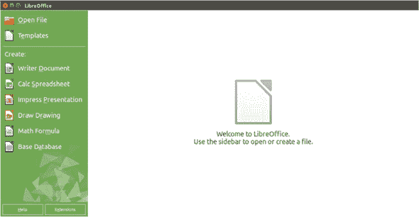

LibreOffice 提供：

+   Writer（文字处理器）

+   Calc（电子表格）

+   演示（演示文稿）

+   Draw（绘图）

+   数学（数学公式）

+   基础（数据库）

虽然重叠并不完美，但您可以看到 LibreOffice 覆盖了大量的相同领域。您应该在您的系统上已经安装了 LibreOffice。让我们看看 Calc，这个电子表格应用程序的实际操作。

> **1**.  打开 Calc。
> 
> **2**.  创建一个标题为“章节”的列。
> 
> **3**.  创建一个标题为“日期”的另一个列。
> 
> **4**.  输入我们已涵盖的章节和完成它们的日期。

| |
| --- |

##### 那么，OpenOffice 怎么样？

您可能听说过 OpenOffice 作为一个开源的办公套件。许多人知道它是一个免费、流行的跨平台替代品，用于 Microsoft Office。实际上，它可能比 LibreOffice 有更广泛的名字认知度。

OpenOffice 已经经历了许多名称变更，从 OpenOffice.org 到 Apache OpenOffice.org 再到 Apache OpenOffice。LibreOffice 是 Open-Office 的分支，这意味着 LibreOffice 团队使用了 OpenOffice 的代码来开发他们的套件。LibreOffice 团队将 OpenOffice 的代码引向了不同的方向（因此有了分支这个术语），尽管两个套件很相似，但 LibreOffice 的开发更为活跃，并且普遍被认为优于 Apache OpenOffice。

Apache OpenOffice 仍在开发中，尽管速度比 LibreOffice 慢，但大多数仓库中仍然有提供，所以如果你出于任何原因更喜欢它，你仍然可以访问它。

| |
| --- |

LibreOffice 与 Office 不完全相同。界面相似（见图 8.2），但习惯使用 PowerPoint 的用户可能需要花时间适应它。处理复杂文件的用户可能会发现在这两个程序之间切换有些困难，但对于大多数用户来说，进行诸如创建预算和撰写报告等简单操作，LibreOffice 应该能够很好地工作。LibreOffice 也适用于 Windows 和 OS X。

##### [图 8.2]. LibreOffice Writer 看起来与 Word 相似，但并不完全相同。

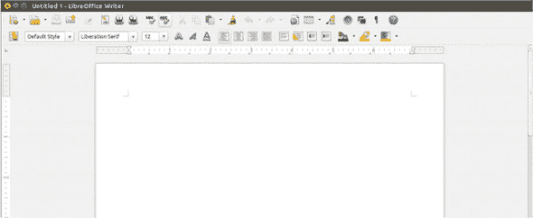

#### 8.1.2. Calligra

当然，在办公套件方面，你不仅限于 LibreOffice。Calligra 是另一个例子。虽然它与 KDE 桌面相关联，但它可以在任何桌面环境中使用。它提供：

+   Words（文字处理器）

+   Stage（演示文稿）

+   Sheets（电子表格）

+   Flow（流程图）

+   Kexi（数据库）

与 LibreOffice 一样，界面略有不同，但对于大多数用户来说应该很熟悉（见图 8.3）。

##### [图 8.3]. Calligra Stage 是 Linux 版的 Microsoft PowerPoint。

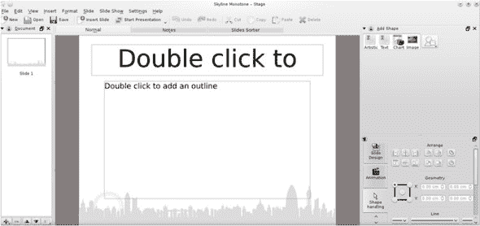

大多数仓库中也有可用的独立办公程序。例如，AbiWord 是一个简单的文字处理器，不捆绑任何其他程序。Gnumeric 是一个简单的电子表格，单独提供。如果你不需要像 Calligra 或 LibreOffice 这样的套件中包含的所有功能，这些是不错的选择。

#### 8.1.3. 电子邮件客户端

在 Outlook（微软电子邮件客户端）方面，Linux 用户有很多替代选择。Linux 有很多电子邮件客户端。其中两个最受欢迎的是 Evolution 和 Thunderbird。Evolution 由 GNOME 项目开发，因此它与 GNOME 桌面环境集成。当你点击 GNOME 顶部的导航栏中的时间时，它会从你的 Evolution 日历中获取信息（见图 8.4）。

##### [图 8.4]. Evolution 数据可以通过 GNOME 桌面环境轻松访问。

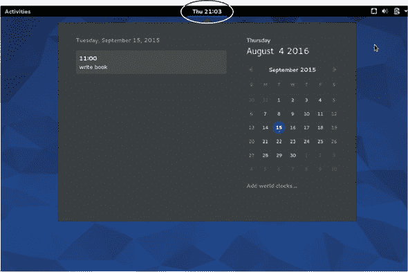

Evolution 通过免费插件支持 Exchange 电子邮件协议，而 Thunderbird 需要 ExQuilla 扩展程序，该扩展程序需要年度订阅。Evolution 内置日历支持，并且与 Outlook 更直接可比，因为它感觉像是一个全面的电子邮件工具（见图 8.5）。Thunderbird 对不希望有太多花哨功能的家庭用户来说更为合适（见图 8.6）。两者都支持 IMAP 和 POP3，这些协议用于非商业电子邮件服务，如 Gmail 和 Yahoo!，无需任何插件或扩展程序。

##### 图 8.5\. Evolution 是一个强大的电子邮件程序，它包含自己的日历应用。

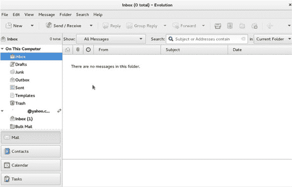

##### 图 8.6\. Thunderbird 是一个简单的电子邮件程序，可能对不在企业环境中工作的用户有吸引力。

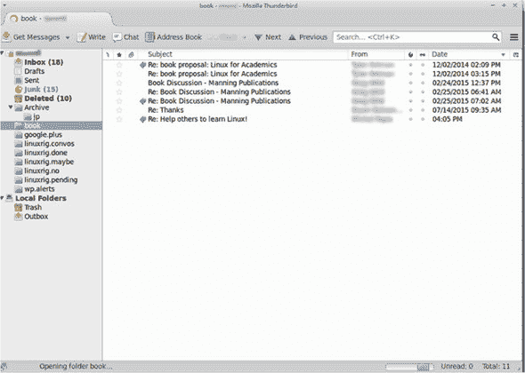

Thunderbird 也适用于 Windows 和 OS X。Evolution 仅适用于 Linux。Thunderbird 已安装在您的系统上。打开它，看看您是否能用它来处理邮件。它设计为自动从大多数主要电子邮件提供商导入设置，因此您只需输入您的姓名、电子邮件地址和密码，Thunderbird 就会完成剩余的工作。

#### 8.1.4\. 选择您的办公程序（们）

那么，哪个程序最好？LibreOffice 可能是最常用的，这意味着有最多的帮助和文档可用。但在选择程序时，您可能需要考虑两件事：

> **1**.  界面
> 
> **2**.  文件渲染

当我说界面时，我指的是易用性：

> **1**.  哪个程序在布局方面对您来说最有意义？
> 
> **2**.  哪个程序在导航方面对您来说最有意义？
> 
> **3**.  哪个程序在行为上对您来说最有意义？

打开 LibreOffice Writer 文字处理程序：

> **1**.  写下您使用文字处理器的五个用途。
> 
> **2**.  使列表加粗并双倍行距。
> 
> **3**.  更改字体。
> 
> **4**.  看看上面的问题，并思考 Writer 是如何为您工作的（并保持文件打开）。

这里讨论的所有程序都像它们的 Office 等效程序一样运行，但有一些细微之处，比如菜单的组织，这可能意味着程序易于使用或难以使用。

文件渲染意味着程序处理您的文件的方式。例如，如果 LibreOffice 在与您的工作场所使用的模板中遇到困难，另一个文字处理程序，如 AbiWord，可能是一个更好的选择。

由于 Microsoft 使用专有文件格式，其他程序有时难以与之协同工作，这就是为什么某个程序中看起来可能没问题，但在另一个程序中却不同。一般来说，当文件以 OpenDocument 格式保存时，您会发现更容易处理文件，因为这些格式是为了共享而设计的，并且其中不包含专有代码。OpenDocument 格式通常在您跨程序和操作系统的“另存为”菜单中作为选项。OpenDocument 文件格式包括：

+   OpenDocument 文本 (.odt)

+   OpenDocument 演示文稿 (.odp)

+   OpenDocument 电子表格 (.ods)

+   OpenDocument 图形 (.odg)

养成使用 OpenDocument 文件的习惯会使文件在不同程序间渲染得更好。

为了练习，将你刚刚创建的 Writer 文件保存为 .odt 文件。

电子邮件是基于标准的，这意味着你不会在任何一个客户端遇到任何技术问题。选择你的电子邮件客户端可以是一个纯粹基于界面的决定。

##### 表 8.1\. 你应该选择哪种办公软件？

| 办公软件 | 原因 |
| --- | --- |
| 选择 LibreOffice 如果 ... | 你需要一个完整的办公程序套件 |
| 选择 Calligra 如果 ... | 你需要一个完整的办公程序套件，并且使用 KDE |
| 选择 AbiWord 如果 ... | 你需要一个非常简单的文字处理器 |
| 选择 Gnumeric 如果 ... | 你需要一个电子表格程序 |
| 选择 Thunderbird 如果 ... | 你需要一个基本的电子邮件客户端 |
| 选择 Evolution 如果 ... | 你想要感觉像在使用 Outlook |

### 8.2\. 图像编辑

在 Linux 上进行图像编辑是一个更简单的过程。一方面，选项较少。但另一方面，使它变得简单的是，你选择的工具取决于你想要对图像做什么。

*GNU 图像处理程序*（GIMP）可以做很多事情，但学习曲线有点陡峭。LibreOffice 更基础，但使用起来也更直观。

#### 8.2.1\. GIMP

GIMP 是一个强大的图像编辑和创建程序。它允许你分层图像，并提供访问各种工具，如过滤器、颜色工具等。正如我所说，它很强大，但它也非常复杂，有一个臭名昭著的具有挑战性的界面（见图 8.7）。这可能是 GIMP 不会作为默认软件与所有发行版（包括 Ubuntu）一起发货的原因，但它可在所有仓库中找到。

##### 图 8.7\. GIMP 拥有一个复杂的界面，这使得它既强大又具有挑战性。

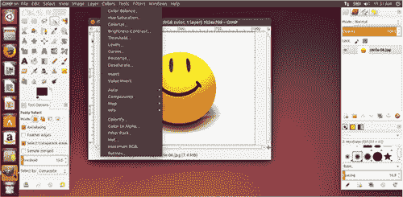

你会注意到 GIMP 有三个窗口。左侧的窗口包含你将用于操作图像的工具。这包括像画笔、拾色工具和橡皮擦等东西。中间的窗口是你看到图像的地方。右侧的窗口控制层，如果你在构建复杂图像时将使用它。

还有一个顶部导航菜单区域，有很多其他选项。GIMP 有很多选项，这既是祝福也是诅咒。

我使用 GIMP 的第一件事就是点击顶部的导航窗口，并将 GIMP 切换到单窗口模式。这显示一个窗口，使得工作更加容易（见图 8.8）。

##### 图 8.8\. 在单窗口模式下，GIMP 更容易操作。

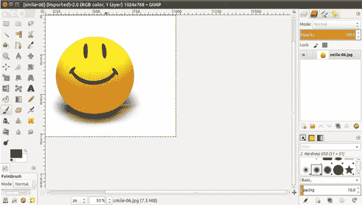

使用 GIMP 的技巧是确定哪个菜单有你的选项。例如，如果你想要缩小一张照片：

> **1**.  点击顶部导航栏中的图像菜单（见图 8.9）。
> 
> ##### 图 8.9\. GIMP 的顶部菜单控制着很多功能，包括缩小和放大图像。
> ##### 
> 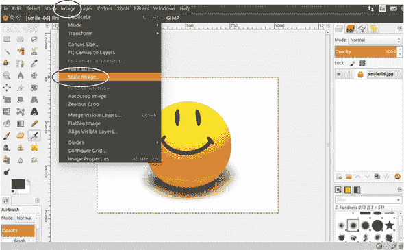
> 
> **2**.  点击“缩放图像”...
> 
> **3**.  选择你想要缩放的方式。GIMP 默认使用像素，但你也可以使用百分比（参见图 8.10）。
> 
> ##### 图 8.10\. “缩放图像”菜单控制图像的大小和分辨率。
> ##### 
> 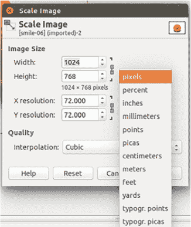

一旦你知道该怎么做，这个过程就很简单了。但学习曲线有点陡峭。

从 Amazon.com 下载一个书封面并调整大小，使其变小。要保存图像，在浏览器中右键单击它并点击“另存为图片...”确保保存图像。

我没有艺术或 Photoshop 背景，我使用 GIMP 来满足所有我的图像处理需求，包括这本书的图像。我不使用所有功能，但我能完成我需要做的事情，我怀疑大多数人也是这样使用的。学习 GIMP 需要一些时间，但如果你经常处理照片或图像，这是值得的。

GIMP 也适用于 Windows 和 OS X。

#### 8.2.2\. LibreOffice Draw

LibreOffice Draw 更基础，这使得它更容易使用。它并不出色，但如果偶尔需要轻微修饰照片，它应该没问题。

LibreOffice Draw 的界面比 GIMP 简单得多（参见图 8.11）。

##### 图 8.11\. LibreOffice Draw 的界面简单，与 Microsoft Word 的界面相似。

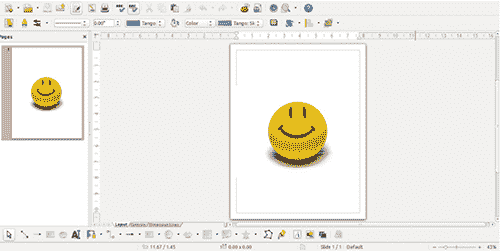

如果你想要使用 LibreOffice Draw 缩小或放大照片，请点击图像。你会在图像周围看到一些小方块（参见图 8.12）。

##### 图 8.12\. 使用图像周围的方块可以让你在 LibreOffice Draw 中改变其大小。


如果你点击并拖动方块，你会改变图像的大小。用 GIMP 缩小后的书封面，将其放大。

##### 表 8.2\. 你应该选择哪个图像编辑器？

| 编辑器 | 原因 |
| --- | --- |
| 如果你想寻找一个强大的 Adobe Photoshop 替代品，请选择 GIMP |
| 如果你想偶尔轻微裁剪照片和图像，请选择 LibreOffice Draw |

### 8.3\. 多媒体

让我们诚实一点。你不是只工作。尽管你花午餐时间学习 Linux，但你也很享受你的空闲时间。也许你喜欢看电影。或者也许你喜欢听音乐。本节将帮助你使用 Linux 桌面放松。

#### 8.3.1\. 电影

Ubuntu 没有默认的视频播放器，我认为这与现在大部分观看都在网页浏览器中进行有关。曾经有一段时间，你无法从 Ubuntu 中流式传输 Netflix，但现在通过大多数最新版本的 Chrome 浏览器可以实现。但如果你想要观看自己的内容，Linux 有选择。

##### VLC

我最喜欢的视频播放器是 VLC 媒体播放器（它也可以播放音乐，但我们会在这个部分稍后讨论）。它处理不同格式的视频时无需太多戏剧性或思考。双击你的视频，VLC 就会处理剩下的部分。并非所有电影播放器都如此，有时它们需要你的帮助下载和安装编解码器（你可能还记得第四章 chapter 4 中提到的）。

VLC 的界面非常简单（见图 8.13figure 8.13）。底部的控件用于处理视频。

##### 图 8.13\. VLC 的外观与其他大多数电影播放器相似。

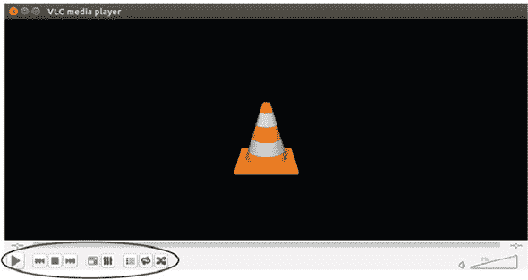

关于 VLC 没有多少可说的，因为它工作得如此出色和简单。它也适用于 Windows 和 OS X，并且由于同样的原因，它也是我在这些操作系统上首选的视频播放器。

> **1**. 安装 VLC。
> 
> **2**. 下载一个视频和一个音频剪辑从 [`archive.org/`](https://archive.org/)，并使用 VLC 播放这两个文件。

##### GNOME 视频

如果出于某种原因 VLC 对你不适用，Linux 还有其他电影播放器。GNOME 视频（GNOME Videos）是另一个，外观与 VLC 类似。然而，它没有 VLC 那样的编解码器支持。幸运的是，它会提供下载所需内容以播放特定视频（见图 8.14figure 8.14）。尝试在 GNOME 视频中播放你从 archive.org 下载的视频。

##### 图 8.14\. GNOME 视频（GNOME Videos）将帮助你获取播放某些视频所需的编解码器。

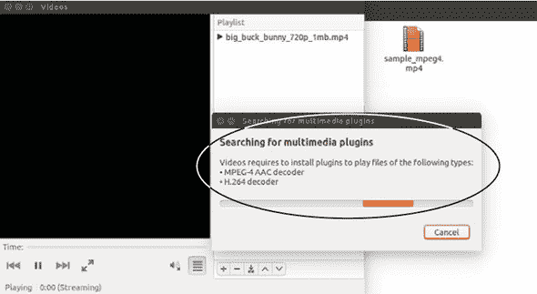

#### 8.3.2\. 音乐

音乐播放器，如 iTunes，代表了你电脑上所有音乐的单一界面。iTunes 不适用于 Linux，但有许多类似的程序。

##### Rhythmbox

Ubuntu 默认自带 Rhythmbox，它与 iTunes 类似，但内容不是通过它购买的（尽管它提供了一个与在线音乐商店 Magnatune 交互的插件）。

使用 Rhythmbox，你只需将其指向你的音乐目录（或目录），然后它就会处理剩下的部分。Rhythmbox 拥有简单的界面，具有音乐播放器上应有的播放/快进/快退命令（见图 8.15figure 8.15）。

##### 图 8.15\. Rhythmbox 拥有标准的音乐播放器界面。

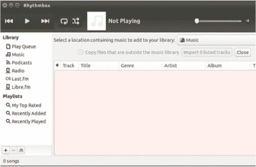

它还有一个不错的插件架构，可以安装软件以添加更多功能，如前面提到的连接到第三方音乐商店的能力。插件可以从发推文你正在播放的内容到自动导入封面艺术，无所不能。

Rhythmbox 是 GNOME 项目的一部分，但可以在 Linux 发行版和桌面之间工作。使用它播放你从 archive.org 下载的音频剪辑。

##### Amarok

KDE 有自己的音乐播放器，名为 Amarok。它看起来与 Rhythmbox 类似，并且具有大多数相同的功能（见图 8.16figure 8.16）。然而，它会做一些事情，比如从维基百科中拉取艺术家信息。它还会记录你的音乐习惯统计。尽管与 KDE 相关，Amarok 也适用于 Windows 和 OS X。

##### 图 8.16\. Amarok 是 KDE 的默认音乐播放器，但它可以在不同的桌面环境中工作。

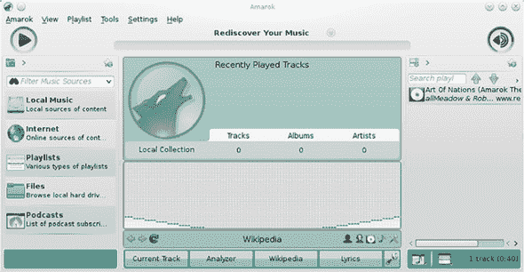

还有其他音乐播放器，如 Banshee 和 Clementine。也许比任何其他软件，不同的发行版似乎与不同的音乐播放器搭配。

如果你花很多时间用电脑听音乐，我认为花时间尝试不同的播放器是值得的，因为界面是个人化的东西，它们都会完成简单的播放音乐的工作。表 8.3 提供了选择多媒体播放器的建议。

##### 表 8.3\. 你应该选择哪个多媒体播放器？

| 玩家 | 原因 |
| --- | --- |
| 如果你想用最简单的方式播放视频... | 选择 VLC |
| 如果 VLC 对你不起作用... | 选择 GNOME Videos |
| 如果你想使用相对简单的程序... | 选择 Rhythmbox |
| 如果你想有一个带有更多功能的音乐播放器... | 选择 Amarok |

### 8.4\. 总结

本章的目标是为你提供一个关于 Linux 上常用软件的概述。它基于人们在 Windows 和 OS X 上倾向于使用的内容。这个列表绝对不是完整的。

Linux 的要点（和乐趣）在于你拥有的选择量，所以你绝对不仅限于这里讨论的内容。相反，我选择了一些较大的软件项目，这些项目可能是开始的好地方。当我调整照片大小或构建电子表格时，我想要一个简单地工作的程序。我不需要任何戏剧性或令人兴奋的东西。我想让我的照片变小或让我的公式工作。本章中的所有软件都能实现这个目标。但就像桌面环境一样，你需要考虑对你来说什么才是合适的，以及你喜欢的操作方式。

#### 术语表

在本章中，我解释了以下内容：

##### 办公生产力软件

通常用于办公工作的程序，如电子表格、文字处理器和电子邮件客户端

##### 多媒体播放器

播放音频和视频的软件

### 8.5\. 实验室

在进行以下实验室之前，请考虑这些问题。你也应该将这些问题应用到本章和本书中讨论的任何程序上：

+   你喜欢你目前使用的界面的哪些方面？

+   你知道如何导航它，还是你一直在寻找找不到的功能？

+   你喜欢界面的美学，还是觉得它很丑陋？

+   它与你在 Windows 和 OS X 中使用的这些程序版本相比是否感觉有显著的不同？

+   你更喜欢这些程序中的哪些？

+   这些界面对你来说更有意义吗？

+   这些工具上是否有你当前工具缺少的功能？

+   你觉得缺少哪些功能和功能？

在考虑这些问题的情况下，让我们使用你刚刚学到的程序：

> **1**. 使用 LibreOffice Writer 创建一个简短的文档。
> 
> **2**. 使用 LibreOffice Calc 计算 10、15、19 和 18 的平均值。
> 
> **3**. 下载 GIMP 并尝试从 archive.org 缩放一个图像，这次将其放大。
> 
> **4**. 使用 Rhythmbox 安装歌曲歌词插件。**提示**：它在工具中。

## 第九章. 文本文件和编辑器

**文本编辑器**是一个简单的编辑器，它以没有任何格式（如粗体、斜体或下划线）的方式呈现文本。文本编辑器只显示文本和换行符（一些可能会保留缩进）。文本编辑器，如 Windows 记事本和 OS X 的 TextEdit，在任何操作系统中都是优秀的工具，但在 Linux 系统中尤其有用，因为：

+   它们允许您编辑 Linux 系统中的配置文件。

+   它们让您远离可能需要特定软件的专有格式。

+   它们永远存在。在文明终结很久之后，文本文件仍然可以打开和阅读。

本章将讨论文本文件的力量与美丽，并带您了解一些常见的 Linux 文本编辑器。在前一章中，我们讨论了文字处理器，这些是出色的工具，但也很复杂。文本编辑器允许您仅与文本进行工作，而不涉及格式化，这使得文本文件可以在不同的操作系统之间轻松移动而不会丢失任何信息。我并不是在文字处理器中编写这本书，而是在文本编辑器中。我将在本章后面讨论这个过程。

文本编辑器还允许您以一种在其他操作系统中不可能的方式与 Linux 系统进行交互。例如，我使用 ThinkPad 笔记本电脑，内置 TrackPoint 鼠标。大多数 Linux 发行版允许我使用 TrackPoint 滚轮在不做任何操作的情况下滚动内容，但有些发行版，出于某种原因，则不行。在这种情况下，我可以通过进入目录，向文件夹中添加一个包含我从指南中复制粘贴的几行文本的文本文件，然后重启后，滚动功能就会工作。许多桌面环境，如 Openbox，允许您使用文本文件来更改界面。这种力量、灵活性和多功能性使得文本编辑器在 Linux 社区中非常受欢迎。

### 9.1. 获取了解文本编辑器

本节将向您介绍三种文本编辑器，为您概述它们的工作方式以及它们最适合执行的任务。文本编辑器的好处在于产品始终如一——一个没有任何格式的简单文件。它可以是从编程到 HTML 到文件中的文字。所有文本编辑器都能很好地完成这项工作，所以您永远不需要担心您使用的是**错误的**文本编辑器。任何文本编辑器都可以打开其他文本编辑器的作品。有了这个心理安全网，您只需专注于您喜欢使用的编辑器即可。或者，在我的情况下，您喜欢使用的编辑器。

最后一点说明：本章中讨论的编辑器也适用于 Windows 和 OS X，所以如果您发现您喜欢使用其中之一，您也可以在其他操作系统上使用它们。

#### 9.1.1. gedit

你可能还记得 gedit 来自第六章。它是 GNOME 和 Ubuntu 的默认文本编辑器。你也可能记得它的界面简单直观。你输入文字，它们就会出现在屏幕上。顶部导航面板上有一些基本控制（见图 9.1），顶部导航菜单上还有一些。

##### 图 9.1\. gedit 在其界面顶部提供简单的编辑工具：撤销、重做、查找和查找替换。

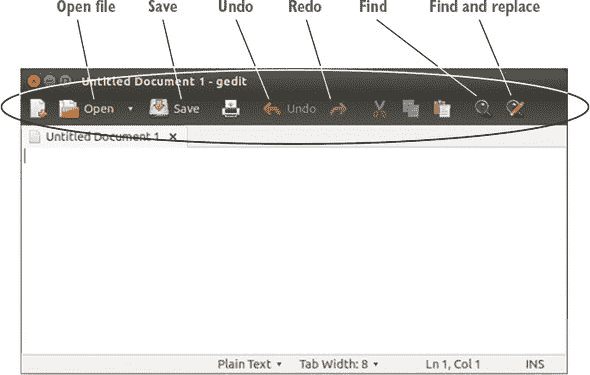

顶部导航菜单包括 gedit 首选项，位于“编辑”菜单下。首选项允许你更改 gedit 的外观，包括其颜色。它还让你可以访问一些插件，这些插件为 gedit 提供了额外的功能，如片段，允许你保存常用文本片段，并通过快捷键或特定单词后的制表符部署它们。如果你经常写复杂的单词、句子或代码，你可以为其分配一个字母或单词触发器。然后，每次你输入那个字母或单词并按 Tab 键时，gedit 就会用你分配给该组合的内容替换文本。

gedit 附带一些插件，并非所有插件都已被激活。你可以在“首选项”菜单下看到它们（见图 9.2）。

##### 图 9.2\. gedit 有许多插件可以为其提供额外的功能。

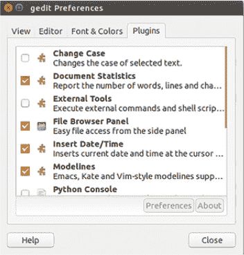

由于其代码对任何人都是免费可用的，你会在网上找到许多 gedit 插件。开始的最佳地方是 GNOME 维基百科[`wiki.gnome.org`](https://wiki.gnome.org)。在那里，你可以找到各种 gedit 插件项目的链接。Linux 基于权限的特性使得这些插件不太可能损害你的计算机。我们将在第十九章中更多地讨论权限。

让我们花几分钟时间再次使用 gedit：

> **1**.  通过 Dash 启动它。你可以输入`gedit`或`text editor`。
> 
> **2**.  在 gedit 中输入一句话。我推荐输入`Text editors are fun!`
> 
> **3**.  突出显示句子。你可以使用 Ctrl-A 选择所有文本或使用鼠标。
> 
> **4**.  使用 Ctrl-C 或使用顶部栏上的图标（它是一个包含两页纸的图标）复制文本。
> 
> **5**.  移动到第一句话的末尾，并使用 Ctrl-V 或粘贴图标（它是一个剪贴板图标）将其粘贴到后面。
> 
> **6**.  突出显示第二句话，并使用 Ctrl-X 或剪切图标（它是一个剪刀图标）剪切它。

所有这些步骤都应该感觉熟悉。它就像使用大多数文字处理器、网页浏览器或几乎所有其他类型的程序一样。我倾向于使用 gedit 来进行大部分写作，因为它非常简单。我熟悉所有的键盘快捷键，因为它们与大多数其他程序使用的快捷键相同。插件让我能够做一些事情，比如在屏幕上添加字数统计并预览某些类型的标记（我们稍后会讨论这一点）在一个单独的窗口中。它简单而有效。现在让我们转向 Vim，它比 gedit 能做更多的事情，但学习曲线也更陡峭。

#### 9.1.2\. Vim

Vim 是另一个流行的文本编辑器，它拥有自己的语法，几乎像一门语言。学习起来并不容易，但如果你能掌握它，你就可以完全控制你的文档和文字。

例如，如果你想删除文档第四行的第三个单词，Vim 有命令可以帮你做到这一点，而不需要像在 gedit 中那样移动光标到那个单词。Vim 基于 vi，这是一个 UNIX 程序，你可以在终端中使用它（Vim 代表 vi Improved）。如果你在任何地方都可以访问终端，并且你使用的是基于 Unix 的系统，如 Linux 或 OS X，那么你就有了 vi。Vim 是 vi 的一个版本，它更加用户友好，因为它允许你使用箭头键来移动（vi 使用 H-J-K-L 键，因为它在箭头键之前出现！）。我们将使用 Vim，因为它稍微友好一些，但它的外观和行为与 vi 几乎相同，所以如果你发现自己被困在终端中，你应该能够生存下来。你也可能记得它在第七章中，当我们安装它时。

与 Vim 交互有两种方式。这两种方式被称为 *模式*（实际上有更多模式，但我们不会探索它们）。一种模式是用于创建文本（*插入模式*），另一种是用于通过命令来操作它（*正常*或*命令模式*）。

插入模式是你在创建文本时使用的模式。在这个模式下，它感觉像是一个传统的文本编辑器，因为你正在输入单词，它们会出现在屏幕上。然而，你无法在插入模式下更改文本。要执行像复制或移动文本这样的操作，你需要切换到命令模式。你会在屏幕底部输入命令；屏幕的其余部分用于插入模式（图 9.3）。

##### 图 9.3\. Vim 的命令区域是屏幕底部的冒号。屏幕的其余部分用于内容。

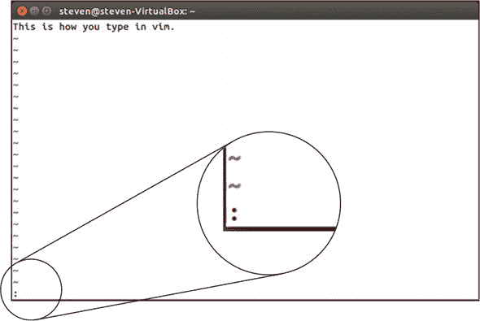

我们稍后将会学习一些 Vim 命令。我认为插入模式用于创建文本，命令模式用于操作文本。这与 gedit 非常不同，在 gedit 中，所有操作都在一个窗口和一个模式下进行。

我们将花几分钟时间来学习使用 Vim。学习它需要一段时间，而且它能够很好地完成许多不同的事情，多到甚至无法在这里全部涵盖。但如果使用 Vim 能引起你的兴趣，我鼓励你花些时间学习如何使用它（我也认为它会是“午餐月”主题的一个绝佳选择！）。


##### 自定义 ViM

你会注意到 Vim 没有偏好菜单（实际上也没有任何菜单）。

如果你希望对其进行自定义，比如颜色、字体、如何换行，或者是否在启动时开启拼写检查，你可以在你的主目录中创建和编辑 .vimrc 文件（使用文本编辑器！）来做到这一点（我们将在第十四章中更多地讨论目录）。网上有很多示例 .vimrc 文件可以帮助你开始。


让我们试驾一下 Vim。

> **1**.  通过 Dash 启动终端（你只需输入单词 `terminal`）。
> 
> **2**.  在终端中输入单词 `vim` 并按 Enter 键。Vim 将会打开。
> 
> **3**.  一旦开始输入，你将进入插入模式。你会知道这一点，因为屏幕底部会显示 *-- INSERT --*。再次输入 `Text editors are fun!`。
> 
> **4**.  尝试像我们在 gedit 中做的那样突出显示并复制粘贴这句话。注意，你做不到。相反，通过按 Escape 键然后按冒号（`:`）进入命令模式。
> 
> **5**.  一旦进入命令模式，输入字母 `y`，它代表剪切或复制文本。
> 
> **6**.  现在输入 `p` 来粘贴。你会在新的一行看到这句话。
> 
> **7**.  要删除多余的句子，输入 `dd` 两次，这将剪切掉多余的句子。
> 
> **8**.  要返回到输入状态，按 Escape 键然后按 `i`。
> 
> **9**.  当你完成 Vim 的工作后，点击冒号进入命令模式，并输入 `q!` 来退出而不保存。

Vim 自带教程。要在终端中启动它，输入 `vimtutor`。

#### 9.1.3\. Emacs

Emacs 与 Vim 类似，是一个功能强大但复杂的文本编辑器。与 Vim 一样，它有热情的粉丝，他们喜欢它的多功能性。例如，Emacs 可以用来阅读和发送电子邮件。它还有一个组织模式，可以保存列表和笔记。它还有游戏和日历。有些人通过 Emacs 来生活，就像 Vim 一样，学习它可能需要一本书。

Emacs 使用很多基于 Ctrl 键的组合键，它将其简称为 C，以及基于 Alt 键的组合键，Emacs 将其简称为 M。有些人将使用 Emacs 比喻为演奏乐器，因为许多快捷键与在钢琴或吉他上弹奏和弦类似。你会注意到 Emacs 在顶部有一些与 gedit 类似的图标，以及一些菜单。

##### 图 9.4\. Emacs 有与 gedit 类似的图标。

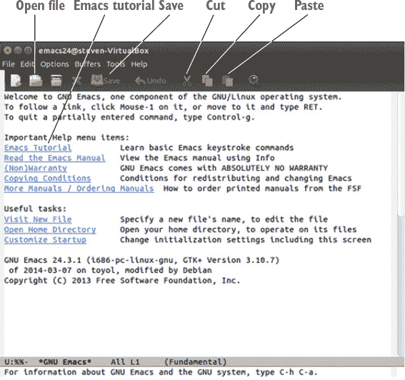

与 Vim 不同，你可以不用学习太多就能使用 Emacs。非常有帮助的是，菜单显示了每个命令的快捷键，这样你在使用它的同时就能学习（参见图 9.5）。

##### 图 9.5\. Emacs 的菜单显示了你可以使用的快捷键，而不是菜单。

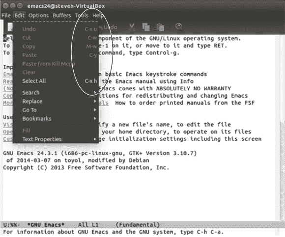

你可以通过其顶部的选项菜单自定义 Emacs。我们只会花几分钟时间使用 Emacs，但就像 Vim 一样，如果你喜欢它，我鼓励你投入时间去学习如何使用它。在 Emacs 的启动屏幕中有一个教程链接。每次你打开 Emacs 都会看到它。让我们试试 Emacs 吧。

| |
| --- |

**开始使用 Emacs**

> **1**. 安装 Emacs（就像我们在第七章 chapter 7 中安装 Vim 一样），然后从 Dash 中启动它。
> 
> **2**. 通过按 Ctrl-X 然后按 Ctrl-F 来打开一个新文件。你会在屏幕底部，就像你在 Vim 的命令模式中一样。Emacs 会要求你为新文件命名。只需将其命名为 test 并按 Enter 键。
> 
> **3**. 现在你在一个空文件中，输入 `Text editors are fun!`
> 
> **4**. 使用 Ctrl-x 然后按字母 `h` 来突出显示所有文本。
> 
> **5**. 使用 Alt-w 来复制句子。
> 
> **6**. 使用 Ctrl-y 来粘贴它。
> 
> **7**. 要删除多余的句子，用鼠标（或 shift 和箭头键）突出显示它，然后按 Ctrl-w 来剪切它。

| |
| --- |

### 9.2\. 使用文本编辑器工作

现在你已经看到了几个文本编辑器，让我们更具体地谈谈 *你可以用它们做什么*。

#### 9.2.1\. 使用文本编辑器进行写作

正如你所看到的这三个文本编辑器，用它们写作只是打字的问题。那个过程中的难点在于思考要打什么。但你不能责怪文本编辑器。文本编辑器的真正挑战是它们不提供格式化，所以你不能对你的文档做任何像添加项目符号或粗体/斜体文本这样的事情。然而，在某些 *标记语言* 中有一个解决方案。标记语言是格式化文档的方式。有些很复杂，比如 HTML，但其他则相当简单。例如，Markdown 是一种流行的标记方法。你可以在文本文件中编写它，但如果你想使某些内容加粗，你可以在单词或短语前后使用两个星号。所以这个：

```
**bold**
```

它看起来会是这样

**粗体**

要将文件保存为 Markdown 格式，你需要在文件名末尾加上 .md。这样你就有了一个 Markdown 格式的文本文件，你可以在任何操作系统上的任何文本编辑器中编辑它。但如何将文本文件转换为另一种类型的文档呢？答案是名为 *Pandoc* 的实用程序，它可以在格式之间转换文本。要使用它，你首先从你的仓库中安装它，然后使用简单的语法将一种类型的文件转换为另一种类型。例如，要将名为 notes.md 的 Markdown 文件转换为我们在上一章中提到的 OpenDocument Text 文件或 .odt，你将进入终端，导航到文件的目录（我将在下一章中展示如何做），然后运行一个类似以下命令的命令

```
pandoc notes.md -o notes.odt
```

你将在这个目录中有一个新的 OpenDocument Text 文件，与原始 Markdown 文件在同一目录下。这种转换内容的能力使其更具可分享性。当我突然被要求就某个主题进行演示时，我可能会有一些很好的内容在 HTML 文件中。我可以使用 Pandoc 将其转换为幻灯片格式。有了 Pandoc，文件格式就不再是限制。

当然，有些人只是将所有内容都保留在文本文件中而不进行转换，这就是他们能够使用像 Emacs 这样的工具来处理所有事情的原因。

我用 Asciidoc 编写这本书，这是一种另一种标记语言。我喜欢文本文件和转换工具的组合，因为我不必担心渲染或某人使用什么软件的版本。有了文本文件，你知道任何人都可以在他们的手机或电脑上打开它们，没有任何复杂性。

我喜欢 Markdown 也是出于类似的原因。我写所有内容都是 Markdown，然后使用 Pandoc 将 Markdown 转换为从 HTML 到 Word 文档的任何东西，而不必在处理文本的方式上转换思维模式。

Markdown 和 Pandoc 不仅限于 Linux，所以如果你觉得这里的流程有帮助，你也可以将其扩展到其他操作系统。

#### 9.2.2\. 深入文本文件内部

正如我在本章开头提到的，你可以通过文本文件与 Linux 操作系统的不同部分进行交互。你可以通过编辑某些文本文件来更改你的 Linux 系统的一部分，就像我修复我的 TrackPoint 一样。你还可以通过查看文本文件来了解你的系统情况。现在，我们快速简单地做到这一点的方法是检查日志文件，我们在第四章中讨论过。日志是关于你的操作系统中发生的事情的记录。你可能会记得，从第四章中，Ubuntu 有一个名为系统日志的工具来查看日志文件，但你也可以使用任何文本编辑器来查看它们。

如果你想要查看所有日志的日志，以查看系统上发生的*所有*事情，你可以在文本编辑器中查看 syslog 文件。

要在 gedit 中这样做，你会：

> **1**. 使用 Ctrl-O 或单击打开按钮。
> 
> **2**. 从文件目录中单击计算机（见图 9.6）。
> 
> ##### 图 9.6\. 使用计算机链接访问你的日志文件。
> ##### 
> 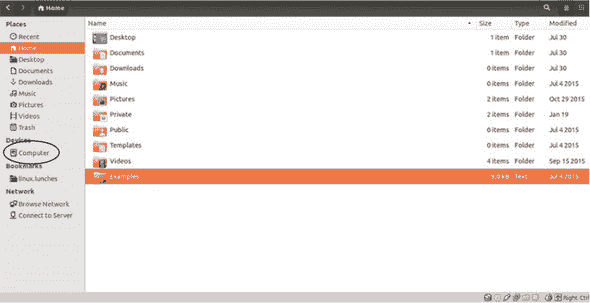
> 
> **3**. 双击 var 目录（我将在第十四章中解释）。
> 
> **4**. 双击日志目录。
> 
> **5**. 双击 syslog。
> 
> **6**. 日志文件将在 gedit 中打开。

你可以滚动浏览文件，查看你在工作时电脑上发生的一切。这可以帮助你排查问题，比如无法解释的崩溃。只需滚动浏览文件，看看崩溃前发生了什么（或没有发生什么）。

要在 Vim 中打开相同的文件：

> **1**. 进入命令模式(:)并输入`edit /var/log/syslog`。
> 
> **2**. 文件将在 Vim 中打开。
> 
> **3**. 不要忘记如何退出 Vim：命令模式然后按`q`！

在 Emacs 中打开它：

> **1**. 前往文件菜单。
> 
> **2**. 点击“打开文件...”？
> 
> **3**. 导航到文件，就像我们用 gedit 做的那样。

### 9.3\. 总结

你现在对文本编辑器的强大和美丽有了感觉。这里提到了三个具体的例子，但就像上一章一样，还有更多我没有时间介绍。我在表 9.1 中简要提到了一些。你不需要在 Linux 的文本编辑器上花费太多时间，但拥有一个让你感到舒适的编辑器是很好的，这样当你需要使用它时你会感到舒适。

##### 表 9.1\. 选择文本编辑器

| 文本编辑器 | 优点 | 缺点 |
| --- | --- | --- |
| Atom | 简单的界面 插件（Atom 称其为插件）增加功能 | Linux 版本仍然有点问题 无法很好地渲染某些标记 |
| Brackets | 简单的界面 扩展（Brackets 称其为插件）增加功能 | Linux 版本仍然有点问题 |
| gedit | 简单的界面 插件增加功能 学习曲线最小 | 三者中功能最少 |
| Emacs | 强大 可扩展到几乎成为操作系统的程度 无需鼠标即可使用 | 有一点学习曲线 执行命令需要很多手指伸展 |
| nano | 非常简单的界面 基于终端，如 Vim 在界面上列出快捷键 | 你不能做很多除了输入、剪切/复制和粘贴之外的事情。 |
| Vim | 强大 几乎可以安装在任何地方 占用很少的磁盘空间 | 学习曲线陡峭 |

我希望你会认真考虑在文本编辑器中做更多的工作，因为它让你摆脱了格式化的干扰，并且是一种很好的强迫自己专注于文字或代码或你正在处理的事情的方法。

那么，你应该选择哪个文本编辑器呢？到现在为止，你知道这取决于你！然而，表 9.1 可能有助于你决定使用哪一个。

#### 术语表

在本章中，我解释了：

##### 标记

一种用于格式化文档的语法

##### Markdown

一种标记形式，允许文本轻松地转换为其他格式，如 HTML 和文档处理文档

##### 文本编辑器

一个简单的编辑器，显示没有格式化（如粗体、斜体或下划线）的文本

### 9.4\. 实验室

> **1**. 打开 gedit 并写下关于本章的笔记和想法。
> 
> **2**. 保存文件并在 Vim 中打开，添加一条额外的笔记。
> 
> **3**. 删除你添加的笔记并保存文件。
> 
> **4**. 使用终端安装 Emacs。
> 
> **5**. 在 Emacs 中打开文件，重新输入你在 Vim 中添加和删除的笔记。
> 
> **6**. 删除文件中的所有内容。
> 
> **7**. 撤销删除操作。
> 
> **8**. 按照个人喜好在文件中对文本编辑器进行排序，并在 Emacs 中保存。

**高级实验室**

> **1**. 在 Vim 中打开文件，并将每一行复制粘贴，使每行在文件中重复出现一次。
> 
> **2**. 使用`dd`删除重复的行。

## 第十章\. 在命令行上处理文件和文件夹

我们大多数人使用图形用户界面(GUI)与计算机交互，这是一种视觉化的软件工作方式。它们使我们能够使用鼠标打开程序和更改目录。但在这些视觉界面之下，是文本命令。GUI 将我们的点击转换为命令，而无需我们了解这些命令。在 Linux 中，您可以通过终端访问这些命令。您有时会听到终端或命令行被称为 Bash 或命令行界面(CLI)。

大多数时候，这种与设备交互的图形方式很方便。我们用鼠标指向某个东西，就会发生某些事情，无论是打开文件还是更改设置。但有时您需要自己知道这些命令。有时，就像我们在上一章中看到的 Vim 一样，我们需要进入命令行来亲自发出命令，而无需 GUI 在我们和操作系统之间。这可能是因为方便、更有效地在我们系统中移动文件，或者修复无法通过 GUI 修复的系统上的某些东西。

Linux，您可能还记得，是基于基于文本的 UNIX 操作系统的，它允许您自由且轻松地在命令行和图形界面之间切换。此外，由于 OS X 基于 UNIX，您将能够在您的 OS X 命令行中使用这些相同的命令（Windows 有一个命令提示符，但它不是基于 UNIX 的）。尽管大多数命令都有图形等价物，但有时在终端中做某事要快得多。

本章以及接下来的几章的目的，是让您在命令行环境中感到舒适，并帮助您理解它如何使您的生活变得更轻松。当您试图修复系统中的问题时，命令行经常派上用场。但我也发现，当我在一台老旧、缓慢的机器上工作时，它同样很有帮助。在这些情况下，命令行要快得多。

我的目的是不让您完全转向命令行。事实上，我自己在命令行上花费的时间很少。然而，对于我选择通过命令行完成的少数任务，了解它是一件非常有益的事情。在下一章中，您将学习如何使用命令行关闭顽固的程序。在第十二章中，您将学习如何将命令的输出移动到文本文件中。所有这些都是在保持 Linux 系统高效运行的有用工具。但在我们能够使用这些命令之前，让我们从基础知识开始。

在第六章中，我们使用了 Nautilus 来移动、创建和删除文件和文件夹。现在我们将使用命令行来完成同样的操作。

| |
| --- |

##### 对于使用实时镜像的用户

如果您正在使用实时镜像，您需要翻回到第六章并将我们放在“文档”中的 linux.lunches 文件夹放回原处。确保在我们开始之前完成这件事。

| |
| --- |

### 10.1. 与文件和文件夹一起工作

让我们从查看我们的文件结构中的位置开始我们的终端工作。打开您的终端。你应该会看到类似以下内容：

```
steven@steven-VirtualBox:~$
```

在这种情况下，我的用户名是 steven，我的电脑名称是 steven-VirtualBox。你会有类似登录名@电脑名称和`:~$`的内容。这被称为*命令提示符*，它引用了电脑中某个目录或文件夹的位置，但具体在哪里呢？

输入`ls`，按回车键，你将看到当前目录中的所有文件和文件夹。这有助于确定你的位置。

你应该会看到一个文件夹列表。你知道它们是文件夹，因为它们的颜色与终端中的其他内容不同。你应该会看到：

+   桌面

+   下载

+   音乐

+   公共

+   视频

+   文档

+   图片

+   模板

现在打开 Nautilus 或其他图形文件管理器。你应该会看到相同的文件夹。现在你知道你在文件系统中的位置了。

在第六章中，我们双击进入了文档目录。但在终端中不能双击。所有操作都是通过命令完成的。我们将输入`cd Documents`并按回车键（命令提示符区分大小写，所以请确保第一个 D 是大写的）。`cd`代表更改目录，而 Documents 是我们要更改到的目录名称。输入后，你会注意到你的命令提示符已经改变。现在，在冒号之后，你会看到`~/Documents$`。这意味着你现在在 Documents 目录中。

输入`ls`并再次按回车键以查看该目录中的其他内容。你应该能看到来自第六章的我们的 linux.lunches 文件夹。

#### 10.1.1\. 创建文件夹

在第六章中，我们使用鼠标创建了一个名为 linux.lunches 的文件夹。现在我们将使用命令行来完成同样的操作。让我们创建另一个名为 linux.lunches.terminal 的文件夹。为此，输入

```
mkdir linux.lunches.terminal
```

并按回车键。`mkdir`代表创建目录。可能看起来没有发生什么，但如果你再次输入`ls`，你将在 Documents 文件夹中看到两个目录，其中一个将是 linux.lunches.terminal。这与第六章类似，但这次是通过输入而不是右键点击。

现在，让我们进入这个新目录，以便我们可以添加一个文件。输入

```
cd linux.lunches.terminal
```

并且你的命令提示符将再次改变。在冒号之后，你现在会看到`~/Documents/linux.lunches.terminal$`。提示符显示你现在位于 Documents 目录中的 linux.lunches.terminal 目录（参见图 10.1）。

##### 图 10.1\. 命令提示符显示目录层次结构。

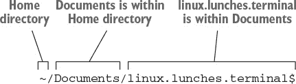

重要的是要记住，在命令行上执行的操作将出现在我们的 GUI 中。它们不是独立的系统。所以我们在命令行中创建的目录在 GUI 中是可见和可访问的（反之亦然）。返回 Nautilus 文件管理器。你会在你的 Documents 目录中看到这个新目录。保持 Nautilus（或你喜欢的文件管理器）打开，这样你就可以看到我们在命令行中做出的更改。

#### 10.1.2\. 创建文件

现在我们将在这个新文件夹中放置一个文件，这样你就可以看到如何使用命令行创建文件。新文件将命名为 mysecondnote。要创建它，输入

```
touch mysecondnote
```

并按 Enter。现在切换到你的文件管理器，查看 linux.lunches.terminal 文件夹。你会看到一个名为 mysecondnote.touch 的文本文件，它会自动更新文件，就像你保存了它一样，而不需要打开文件。但是，它也会在文件不存在的情况下创建空文件。如果你在文件管理器中双击 mysecondnote，你会看到它是空的。再一次，你没有打开文本编辑器就创建了一个文本文件，这仍然相当令人印象深刻！你只用两个命令词就创建了一个新文件，没有打开或保存任何东西！

现在你已经打开了文件，输入一条简短的消息，比如`我正在学习命令行`。然后保存并关闭文件，返回终端。你可以通过命令行使用你选择的文本编辑器打开文件。


##### 实时镜像用户

记住：实时镜像用户需要重新安装 Vim 和 Emacs。

+   要在 Emacs 中打开它，输入`emacs mysecondnote`

+   要在 gedit 中打开它，输入`gedit mysecondnote`

+   要在 Vim 中打开它，输入`vim mysecondnote`


每次你这样做，文件都会在你指定的文本编辑器中打开。

#### 10.1.3\. 复制文件夹和文件

复制文件或文件夹的命令是`cp`。当你使用它时，首先指明要复制的文件或文件夹，然后是目标位置。让我们将 mysecondnote 移动到我们的 linux.lunches 文件夹或目录中。

要做到这一点，你将输入：

```
cp mysecondnote ../linux.lunches
```

我们正在执行一个命令，将文件 mysecondnote 复制到文件夹 linux.lunches 中（见图 10.2）。

##### 图 10.2\. 复制命令包括要复制的文件和文件将被复制到的位置。

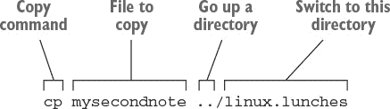

*..* 表示向上移动一个目录。并且每当你在命令中看到 / ，你就是在处理一个目录或文件夹。所以如果我们从 Documents/linux.lunches.terminal 开始，我们就是在告诉文件回到 Documents 文件夹，然后进入 linux.lunches 文件夹。

返回 Nautilus，你会看到文件现在在两个地方。

现在让我们复制一个文件夹。让我们将 linux.lunches.terminal 复制到我们的 linux.lunches 文件夹中。为此，你可能需要输入

```
cp /linux.lunches.terminal ../linux.lunches
```

但发生了什么？你应该得到了一个错误 `cp: cannot stat '/linux.lunches.terminal': No such file or directory`。这是因为你不能用 `cp` 从目录内部复制文件夹或目录。所以你需要离开那个目录。记得我们是如何在复制命令中使用 `..` 来向上移动一个目录的吗？这也适用于 `cd` 命令。要向上移动一个文件夹，输入

```
cd ..
```

你会发现自己回到了文档文件夹。现在尝试你的命令（你可以删除 `..`，因为你没有向上移动目录）。

```
cp /linux.lunches.terminal /linux.lunches
```

你应该得到相同的错误。问题在于你需要在斜杠之前加上一个句点，这样复制命令才能知道你正在当前目录下工作。加上这些并再次尝试。你的命令现在应该看起来像这样：

```
cp ./linux.lunches.terminal ./linux.lunches
```

现在又出现了一个新错误！

```
cp: omitting directory './linux.lunches.terminal'
```

最后一个拼图是我们目录中有一个文件，所以我们需要告诉命令包含目录内的文件。当你包含文件夹或目录中的文件时，这被称为 *递归复制*，因此你将在命令中添加一个修饰符或标志。尝试这样做（并查看图 10.3）：

```
cp -R ./linux.lunches.terminal ./linux.lunches
```

##### 图 10.3\. `-R` 标志表示递归复制；你正在复制目录内的文件。

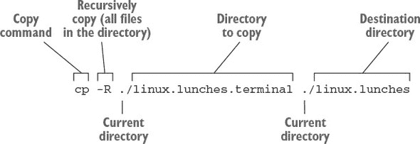

你现在会看到 linux.lunches.terminal 目录以及随附的文件在 linux.lunches 文件夹中。我们将在第十二章中更多地讨论标志。[现在，我想让你习惯在终端中使用命令。](https://kindle_split_021.html#ch12)

#### 10.1.4\. 移动文件夹和文件

在目录之间移动文件的过程将类似。移动命令是 `mv`。它与 `cp` 的工作方式相同，即你首先指定源文件，然后指定目标。你应该仍然在终端中的文档文件夹中。使用以下命令进入你的 linux.lunches.terminal 目录：

```
cd linux.lunches.terminal
```

我总是喜欢执行一个 `ls` 来确保我确实在我想在的地方。我有时希望我能在现实生活中执行一个 `ls`。

让我们把 mysecondnote 移动到我们的文档文件夹中。为此，你将输入：

```
mv mysecondnote ..
```

又是 `..`。这告诉命令将文件放在一个目录之上。

现在让我们把它放回去。为此，你将输入以下内容（注意句点）：

```
mv ../mysecondnote .
```

`..` 指向的是当前目录之上的文件（参见图 10.4）。单个句点表示当前目录。

##### 图 10.4\. 移动命令与复制命令类似。

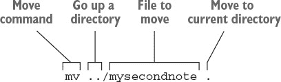

移动目录的过程类似。使用 `cd ..` 返回你的文档目录。然后，使用以下命令将 linux.lunches.terminal 目录移动到桌面：

```
mv ./linux.lunches.terminal ../Desktop
```

`./` 表示我们正在指示当前目录中的一个文件夹。桌面文件夹在文档文件夹之上。别忘了命令是区分大小写的。你现在应该能在你的桌面上看到 linux.lunches.terminal 文件夹，mysecondnote 就在里面。与 `cp, mv` 不同，不需要明确告诉它递归。它会自动包含移动目录内的文件。

#### 10.1.5\. 删除文件夹和文件

文件使用`rm`命令删除。文件夹使用`rmdir`命令删除。文件夹在为空之前不能被删除。

在使用`rm`命令时要非常小心！当你使用 GUI 删除东西时，它最终会进入你的回收站，所以文件很少真正消失。但当你使用`rm`删除东西时，它将永远消失。这意味着如果你不小心导航到错误的目录并删除了一个文件，就无法恢复。这就是为什么我很少使用`rm`。我不信任自己。`rmdir`更安全，因为它只对空目录有效。这两个命令不需要目标路径，因为它们是在删除文件和文件夹。

让我们仔细地从我们的桌面上删除那个文件和文件夹。我们仍然在终端中的 Documents 文件夹中。首先，我们将删除 mysecondnote，然后我们可以删除 linux.lunches.terminal 目录。要删除文件，我们将使用：

```
rm ../Desktop/linux.lunches.terminal/mysecondnote
```

我们将命令向上发送到目录，通过`..`进入桌面文件夹，然后进入 linux.lunches.terminal 文件夹，并从该文件夹中删除 mysecondnote 文件。一旦该文件被删除，我们就可以使用以下命令删除目录：

```
rmdir ../Desktop/linux.lunches.terminal
```

就这样，空目录消失了。如果你收到目录不为空的消息，这意味着 gedit 保存了一个备份文件，其名为`mysecondnote~`。请继续删除该文件，然后删除目录。


##### 通配符

我们一直一次处理一个文件，但命令行允许你使用通配符。

假设你想要移动目录中的所有文本文件。

与逐个列出所有文件相比，你可以使用通配符来指示具有相同文件扩展名的所有文件。在这种情况下，它将类似于*.txt，意味着任何以.txt 结尾的文件。`\*.\*`将删除任何名称中包含点的文件，包括文件扩展名。

但在使用通配符的`rm`时要小心！如果你的语法不够精确，你可能会永久删除错误的文件或文件。


### 10.2\. 总结

你现在应该对如何使用命令行操作文件有了概念。我不期望你会停止使用文件管理器，转而使用终端来处理所有的文件移动需求，但我确实期望你理解这个过程，足以理解其他人的命令并了解正在发生的事情。

一旦你知道如何移动和复制文件，你通常会发现自己比使用文件管理器更快、更简单。例如，通配符允许你快速将所有特定类型的文件移动到新目录中，这比打开图形文件管理器的时间还要快。如果你有很多文件要移动，这可以节省大量时间。

我知道我们在本章中覆盖了大量的信息，所以我设计了一个表 10.1 来帮助你记住这些命令。

##### 表 10.1\. 简单 Linux 命令指南

| 命令 | 功能 |
| --- | --- |
| cd | 更改目录（需要指定目录） |
| cd .. | 向上一级目录 |
| cp | 复制（使用 cp -R 获取目录内容）；首先包括源然后是目标 |
| ls | 列出当前目录中的文件 |
| mv | 移动；首先包括源然后是目标 |
| rm | 删除文件；指示要删除的文件 |
| rmdir | 删除空目录；指示要删除的文件夹 |
| . | 指示当前目录 |
| .. | 表示当前目录以上的目录 |
| * | 表示通配符 |

#### 术语表

在本章中，我解释了：

##### 命令提示符

命令输入的终端部分

##### 递归

在命令中包含目录内的文件和子文件夹

### 10.3\. Lab

在这个实验中，我们将使用命令而不是文件管理器来重新创建第六章实验中的任务。使用终端执行以下操作：

> **1**.  在你的 Documents 文件夹中创建一个名为 command_line _homework 的文件夹。
> 
> **2**.  在 command_line_homework 文件夹中创建一个名为 homeworkfile 的文档。
> 
> **3**.  将 homeworkfile 移动到 linux.lunches。
> 
> **4**.  进入 linux.lunches 并创建另一个名为 homework2 的文件。
> 
> **5**.  将 homeworkfile 复制到 Documents 中。
> 
> **6**.  从 linux.lunches 中删除 homework2。
> 
> **7**.  删除 command_line_homework。

**高级实验**

> **1**.  在单个名为 recursive 的目录中创建三个.txt 文件。
> 
> **2**.  将 recursive 复制到你的桌面。
> 
> **3**.  使用单个通配符命令一次性删除所有三个递归.txt 文件。

## 第十一章\. 使用常用命令行应用程序，第一部分

UNIX 的程序员道格·麦克伊罗里（Doug McIlroy）被认为是提出了被认为是 UNIX 哲学的格言：“只做一件事，做好它。”对于 UNIX 来说，这意味着只做一件事情的程序，比如移动或复制文件，而不是两者都做。这种方法与大多数软件程序非常不同，其中一种工具可能具有多个功能。只做一件事的程序：这正是 Linux 的亮点。

想想我们的文件管理器：它显示文件，移动文件，复制文件，并删除文件。这个模型对我们来说很适用，因为它完美地完成了所有这些事情。在上一章中，你学习了一些基本但至关重要的命令，它们执行非常简单的事情。你可能也注意到了，我们使用的每个命令都只做一件事。例如，当我们移动文件时，我们使用了`mv`命令，但当我们复制文件时，我们使用了 cp。

我们经常想要执行比移动和复制文件更复杂的任务。上一章是关于让你对命令行感到舒适。这一章是关于学习使用五个专门的命令行程序来完成非常具体的任务：`top`，用于跟踪系统使用情况；`xkill`和`killall`，用于关闭程序和进程；`wget`，用于下载文件；以及`grep`，用于搜索文件。这些是我经常使用的五个应用程序，因为它们比它们的图形化等价物要快得多。一旦你掌握了这些命令，你就会想知道没有它们你是如何生活的。

### 11.1。top

我们都经历过计算机因某些未知问题而变慢的经历。大多数操作系统都有一个任务管理器，让您可以看到正在运行的程序和进程以及它们占用的 CPU 百分比和内存量。Ubuntu 的任务管理器被称为系统监视器（大多数桌面环境和发行版都有类似的东西，如果不是完全相同——否则您可以从软件仓库中下载一个）。要启动它，请在 Dash 中输入`System Monitor`。您会看到它有三个标签页。我们感兴趣的是进程标签页（见图 11.1）。

##### 图 11.1。系统监视器显示了您计算机上正在运行的过程以及它们使用的内存和 CPU 百分比。

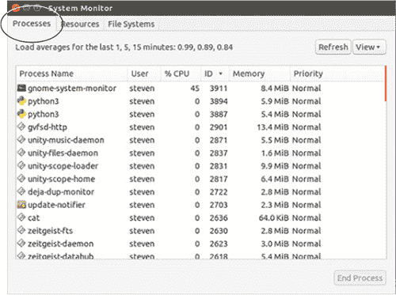

如果您的系统变慢，您可以使用系统监视器来了解/辨别原因。您会知道问题所在，因为占用内存或 CPU 资源比系统中的其他任何东西都要多。您可以通过点击“% CPU”或“内存”列来查看占用这两种资源最多的是什么。系统监视器会相应地排序。

假设我看到 Firefox 在我的计算机上占用了大部分内存或 CPU 百分比。我可以自己关闭 Firefox 并释放一些内存。但有时程序占用了太多的内存或 CPU，以至于它们不会关闭。在这种情况下，程序使用的内存或 CPU 太多，计算机没有剩余的资源来关闭程序。您的计算机正在某个程序上窒息。在这种情况下，您可以通过系统监视器关闭程序。右键单击进程，您会得到一个选项列表（见图 11.2）。

##### 图 11.2。系统监视器让您结束那些使计算机变慢的进程。

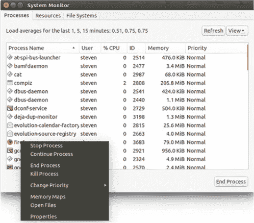

您将看到结束进程和终止进程（停止进程会暂停程序）的选项。您通常想从结束进程开始，这样计算机就会尝试为您正确关闭程序。如果不起作用，终止进程会强制关闭有问题的程序或进程。终止就像从插座中拔掉电源插头来关闭电器。这很困难但有效。

`top`命令与系统监视器做的是同样的事情。那么为什么使用它呢？因为它速度快。

当您打开系统监视器时，您正在使用系统资源，如果您的计算机因无响应的程序而卡住，打开*另一个*程序，尤其是图形程序，它比命令更占用系统资源，会使情况变得更糟。这会变得有多糟糕取决于您计算机硬件的规格。然而，使用`top`，您打开一个终端并输入命令。您使用的资源更少，并且获得相同的功能。让我们看看`top`的实际操作。打开一个终端并输入`top`。您应该会看到类似于图 11.3 的内容。

##### 图 11.3。`top`命令让您在不占用太多系统资源的情况下查看系统资源。

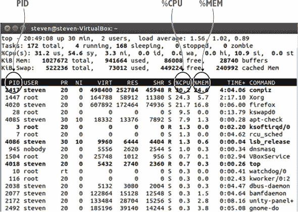

布局与我们之前在系统监视器中看到的是相似的。你会注意到有%CPU 和%MEM 列，它们代表内存。你会在最右列看到程序或进程的名称。你也会注意到最左列，它被称为 PID。这代表*进程 ID*。运行在您计算机上的每个进程都有一个唯一的 PID。我们稍后将讨论这一点。

在系统监视器中，要按 CPU 或内存使用量排序，你点击了列。但在终端中这不起作用。如果你想按 CPU 百分比使用量排序，请输入`P`（确保是大写）。排序会立即改变。要按内存使用量排序，请输入`M`（确保是大写）。

所有列都是可排序的，我们将在第十二章中讨论如何了解这些命令中可用的排序和配置。

现在关于杀死阻碍你计算机的进程或程序怎么办？为了做到这一点，你需要查看有问题的进程的 PID。它会有非常高的%CPU 或%MEM 使用率——可能是你计算机上最高的。如果你回到图 11.3，你会注意到 Firefox 的 PID 是 4020。所以为了杀死它，我们将输入`k`。你会在列上方看到一条类似的消息（见图 11.4）：

```
PID to signal/kill [default pid = 2808]
```

##### 图 11.4。要使用`top`杀死一个信号，你需要知道它的 PID。


然后，你将输入你想关闭的任何程序的 PID。在我的例子中，它是 PID 4020，分配给了 Firefox。输入`4020`并按回车键。你会被询问是否要发送信号。它看起来会像这样：

```
Send pid 4020 signal [15/sigterm]
```

按下回车键。分配给该 PID（在我的例子中，是 Firefox）的程序将会关闭。

当你完成`top`后，输入`q`来关闭它。确保它是小写。`top`在查看系统状态而不减慢任何东西时很有用。能够杀死程序和进程的能力特别方便，尽管在下一节中，我们将探讨从命令行杀死程序和进程的其他方法。

### 11.2。杀死命令

有时程序会卡住。无论什么原因，它都不会响应，也不会关闭。在这些情况下，你想执行一个 kill 命令。在本节中，你将学习两个命令来杀死挡在你路上的程序。

#### 11.2.1。xkill

当你不确定是什么减慢了你的计算机时，`top`很有用。但通常当你知道一个程序卡住时，你会立刻知道。你仍然可以使用`top`来获取 PID 并杀死它，但这是一个多步骤的过程。对于我知道要关闭什么的时候，我使用`xkill`命令。`xkill`以其简洁性而著称。你将它输入到终端，你的光标就会从箭头变成一个 X（见图 11.5）。

##### 图 11.5。`xkill`将你的光标变成一个 X。然后你可以用它来关闭程序。


一旦它变成 X，点击任何程序，它就会关闭。这对于无法通过常规方式关闭的无响应程序非常有用。正如我提到的，这是一个终端命令，但你是在桌面上使用它，这使得它与其他章节中的其他命令略有不同。

你在终端中启动 `xkill`，但并不在终端中使用它。由于这种差异，你可以以稍微不同的方式启动它。与其进入终端，你可以使用 Alt-F2，这是一个将命令输入终端的快捷键，而不需要首先打开终端。这个快捷键在 Linux 发行版和桌面环境中相当标准。在 Ubuntu 中，它看起来像是你调用了 Dash，但如果你查看搜索栏，你会注意到它说运行一个命令（见图 11.6）。在我们的例子中，这节省了我们的时间，因为我们不需要在终端中看到任何东西。我们运行了我们的命令，然后离开了终端，这样就节省了后来必须关闭终端的步骤。

##### 图 11.6\. Alt-F2 允许你输入命令到终端，而不需要首先打开终端。


在另一个桌面环境中，输入区域可能看起来略有不同。例如，在 Xfce 中，你会得到一个小窗口，可以从那里运行命令（见图 11.7）。

##### 图 11.7\. 在 Xfce 中，Alt-F2 给你一个小窗口，可以选择在终端中运行命令。


**xkill**

> **1**.  启动 Firefox。
> 
> **2**.  按 Alt-F2 启动终端窗口。
> 
> **3**.  在框中输入 `xkill`。你会注意到你的光标现在是一个 X。
> 
> **4**.  点击 Firefox 强制关闭它。


使用 `xkill` 比进入你的系统监视器更快，也比使用 top 更快。

#### 11.2.2\. killall

有时候你知道哪个程序或进程正在减慢你的电脑，但你却看不到它。例如，我有时会关闭我的 Chrome 或 Firefox 浏览器，但它会在后台继续运行，减慢我的系统。或者有时我会遇到声音问题，我知道我需要关闭控制声音的 PulseAudio 程序。在这些情况下，我知道问题是什么，但 `xkill` 不起作用，因为没有可以点击的东西。问题是程序正在后台运行。在这些情况下，我会使用 `killall`，这是一个命令行工具，它允许我通过名称关闭程序。

例如，有时我会关闭 Firefox 并尝试稍后打开它。当我尝试打开它时，我会收到一条消息，比如 Firefox 已经运行，但没有响应。我可以进入 `top` 并获取仍在运行的 Firefox 进程的 PID，或者我可以省去运行 `top` 并在终端中输入来找到 PID 的麻烦：

```
killall firefox
```

这个命令将关闭所有 Firefox 的实例。`killall` 的好处是，如果有多个具有相同名称的进程正在运行，比如说多个 Chrome 浏览器实例，它将关闭所有这些实例。这在 Chrome 冻结时很方便，因为每个打开的标签页都是一个单独的进程，有自己的 PID。`killall` 会帮你关闭它们。

需要注意的是，当你使用 `killall` 和 `xkill` 等方式关闭程序时，你并没有正确地关闭程序。当你使用 `killall` 或 `xkill` 关闭程序时，你可能会丢失数据，并且通常会重新打开程序以找到错误信息。这些杀戮实用程序是在你无法正确关闭程序或进程时使用的。

### 11.3\. wget

`wget` 是一个命令行应用程序，可以从互联网下载文件。这些文件可以是 HTML 页面、声音文件或 PDF 文件。你将命令指向文件或网站，`wget` 处理其余部分。我知道你在想什么——难道网页浏览器不做同样的事情吗？你说得对！网页浏览器下载文件。但我喜欢 `wget` 的地方是，我下载大文件时不需要离开我的浏览器，这可以让我的电脑运行得更快。我也不必担心下载被损坏，这有时会在你通过浏览器下载非常大的文件时发生，而浏览器并不是为这种下载设计的。而且 `wget` 的下载速度比浏览器快得多。

我不经常使用 `wget`。我主要用它下载非常大的文件（小文件下载得很快，很少值得用 `wget` 代替浏览器）。

例如，当我下载 Linux 映像文件时，就像我们在第三章 chapter 3 中做的那样，我使用 `wget` 下载文件。首先，我找到映像文件的网址，它是一个 .iso 文件。然后我进入终端，导航到我想要下载文件的文件夹。例如，如果我想从 example.com 下载映像到我的文档文件夹，语法看起来像这样：

> **1**.  `cd Documents`
> 
> **2**.  `wget` [`www.example.com/sample.iso`](http://www.example.com/sample.iso)

我可以关闭我的网页浏览器，让文件下载。或者我可以做其他事情。文件将在后台下载，同时我工作。

我还喜欢 `wget` 的另一个原因是，如果下载过程中有任何问题，它会继续尝试完成工作。如果下载被中断，它会自动继续。

有些人使用 `wget` 下载网站，这意味着不是特定的单个文件，而是整个网站。我从未有过这样的需求，但如果你有这个需求，你会使用一个标志，我们在第十章 chapter 10 中提到了。要下载整个网站 [www.example.com](http://www.example.com)，你会使用：

```
wget -r http://www.example.com
```

`-r` 表示递归。这与我们在上一章中使用的 `cp` 命令类似，只是用小写的 r 而不是大写。

`wget` 有很多选项，从告诉服务器它应该如何显示（你可以让它看起来像浏览器一样，因为服务器可能会反对命令而不是人类下载内容）到下载之间的等待时间。我在日常工作中很少需要这些。相反，`wget` 对于将大型的互联网文件，特别是大型的 Linux 图像文件，下载到我的电脑上非常有帮助，而无需保持浏览器打开。

### 11.4\. grep

`grep` 是一个用于搜索文本文件的命令行工具。它就像一个 Ctrl-F，可以在一瞬间搜索成百上千的文本文件。它非常强大，因为它允许用户使用 *正则表达式*（也称为 *regex*）进行搜索，这是一种复杂的语法，允许你搜索模式，比如特定的单词、单词之间的特定空格数量，甚至某些位置包含特定字母的单词。

我很少使用 `grep`，除非我在解决电脑问题。对我来说，它是一个我理解的工具，但不是我经常需要的。它对于从日志和文件中提取文本非常有帮助，而且当你试图在文本文件堆中找到那根针时，你会很高兴你理解了它。

记得 第四章 中的 `lspci` 命令吗？它显示了你的计算机上的硬件。这是一个很好的概述，但通常你只想知道一件具体的事情。也许你想知道你的显卡。所以，而不是滚动整个列表，你可以执行 `lspci` 命令，然后使用 `grep` 搜索特定术语。这个命令看起来是这样的：

```
lspci -v | grep Graphics
```

你正在运行 第四章 中我们执行过的 `lspci` 命令，然后使用 `grep` 搜索单词 Graphics。`grep` 是区分大小写的，这就是为什么 Graphics 中的 G 是大写的。`|` 是一个管道。我们将在 第十二章 中更多地讨论管道。这个命令的结果是，你不会在无用的文本中筛选。`grep` 只会带给你在那个时刻想要看到的文本。

你也可以在日志文件上使用 `grep`。在 第四章 中，我们讨论了使用系统日志或文本编辑器来查看日志文件。但那有很多内容。你可以在文本编辑器中使用 Ctrl-F 来查找特定单词，但使用 `grep`，你可以在打开日志之前就搜索这些单词。比如说，你的电脑崩溃了，你想找出原因。你可以搜索系统日志中的单词 fail。这个搜索看起来是这样的：

```
grep fail /var/log/syslog
```

第一部分，`grep fail` 是你的搜索词。第二部分，`/var/log/syslog` 是你正在搜索的文件。结合起来，你是在说在 /var/log/ 目录下的 syslog 文件中搜索单词 fail（见 图 11.8）。

##### 图 11.8\. `grep` 需要一个搜索词和一个搜索位置。


也许你想在系统日志文件中搜索单词 fail 或 crash。这个搜索看起来是这样的：

```
grep 'fail\|crash' /var/log/syslog
```

在 `grep` 中，OR 用 `\|` 表示。你将搜索词放在单引号 (`'`) 中（见图 11.9）。

##### 图 11.9. `grep` 可以使用


如果你已经在第九章（kindle_split_018.html#ch09）中发现了一个你喜欢的文本编辑器，并且现在正在处理大量的文本文件，你也可以使用 `grep` 在目录中搜索文本文件。为此，你需要进行如下搜索：

```
grep -r *searchterm*.
```

`-r` 使搜索递归，遍历子目录。`.` 是搜索当前目录，你可能还记得上一章的内容。


##### 标志符和命令

标志符是添加到命令中的文本，以提供进一步指令。我喜欢把它们想象成一个使用破折号和字母而不是点击的选项菜单。例如，我们之前使用 `-r` 来使 `grep` 和 `wget` 递归。

标志符很重要，因为命令没有图形菜单。如果你想使命令模块化，比如递归搜索而不是仅搜索当前目录，你需要一种修改命令的方法。标志符就是那种方法。在下一章，你将学习关于 `man` 命令的内容，这是一种了解命令如何工作的方法。提供的信息中包括命令的标志符。标志符告诉你如何使用 `-r` 与 `grep` 一起使用，但与 `cp` 一起使用 `-R`。如果命令的默认行为不适合你，可以通过在线搜索或使用 `man` 命令（你将在明天学习）来查看可用的标志符。


### 11.5. 总结

这些是我最常用的几个命令。正如我提到的，我并不每天都使用它们，但我经常使用它们，以至于我认为这五个都是不可或缺的。其中一些，如 `top`，有图形化等价物，但命令行更快，对系统的消耗也更少。在使用这些命令一段时间后，你可能会发现它们自己的用途。在下一章，我们将讨论如何了解更多关于命令的信息。表 11.1 概述了我们刚刚讨论的内容：

##### 表 11.1. 有用的 Linux 命令

| 命令 | 使用时机 |
| --- | --- |
| grep | 在文本文件中查找文本。用于解析文件和从长屏幕输出中提取关键信息。 |
| killall | 通过名称结束进程和程序。当你知道需要关闭的程序时，这个功能很有用。 |
| top | 显示占用 CPU 和内存的资源；也可以通过 PID 来结束进程。当你不确定是什么导致电脑变慢时，这个功能很有用。 |
| wget | 适用于下载可能在浏览器中损坏的大型文件。 |
| xkill | 允许你使用光标关闭无响应的程序。当你需要强制关闭的程序就在你面前打开时，这个功能很有用。 |

#### 术语表

在本章中，我解释了：

##### 标志符

添加到命令中，以破折号开头，以提供进一步指令。它们是改变命令默认行为的一种方式。

##### 进程 ID (PID)

分配给计算机上每个进程和程序的唯一编号

### 11.6\. 实验室

> **1**. 你会用什么命令来关闭 Firefox 的所有实例？打开 Firefox 并使用该命令强制关闭。
> 
> **2**. 你会用什么命令来查找硬件配置中的音频信息？运行该命令以定位你的信息。
> 
> **3**. 你会用什么命令从[`mng.bz/o25h`](http://mng.bz/o25h)下载美国宪法的 PDF 版本？使用`wget`下载它。
> 
> **4**. 哪个命令需要进程的 PID 来关闭它？打开 Firefox 并使用该命令来关闭它。
> 
> **5**. 打开一个程序并使用`xkill`来结束它。提示：如果你不确定程序的名字，你可以使用另一个命令来查看所有正在运行的事物的名字。

**高级实验室**

> **1**. 使用`wget`从 Project Gutenberg ([`www.gutenberg.org/ebooks/6527.txt.utf-8`](http://www.gutenberg.org/ebooks/6527.txt.utf-8))下载《Debian GNU/Linux : 安装和使用指南》的纯文本版本。
> 
> **2**. 使用`grep`在文件中搜索单词 linux，但使搜索不区分大小写。

## 第十二章. 使用常见命令行应用程序，第二部分

前一章讨论了几种对保持系统平稳运行有用的命令行程序。本章从第十一章章节 11 结束的地方继续，让我们接触到更多具有系统影响的程序。

本章我们将讨论的命令是强大的。我们将使用`su`和`sudo`命令，这些命令让你能够在系统上执行许多管理任务。我们还将讨论使用命令安装和卸载软件，而不是图形包管理器。然后我们将通过学习管道以及如何组合使用不同的命令来结束本章。

前两章是关于让你熟悉命令行并展示命令行能做什么。本章将为你准备与系统一起工作。这些是你需要了解和理解的命令，以成为一个有效的 Linux 用户。例如，你需要`su`或`sudo`来执行系统上的大多数管理任务。但别让这吓到你！前两章的工作已经为你准备好了这一刻。让我们开始吧。

### 12.1\. su 和 sudo 用于管理任务

Linux 系统是基于权限的。这意味着只有某些类型的用户可以更改系统。这包括添加和删除软件，以及编辑和更改某些文件。这是一个安全性和安全预防措施，我们将在第十九章章节 19 中进一步讨论。

即使你自己安装了 Linux，即使你可能是系统上的唯一用户，你的 Linux 安装仍然不信任你！但这是一件好事。这意味着你更难意外地破坏你的系统，或者其他人故意这样做。

你可能还记得从 第七章 中，为了安装软件，无论是使用 Synaptic 还是 Ubuntu 软件中心，我们都需要输入密码。这是因为 Ubuntu 授予创建系统的账户完整的系统管理权限，在 Linux 中称为 *root*。root 账户拥有对系统上任何事物和行为的完全访问权限和权限。尽管并非所有发行版都给予主要用户账户 root 权限。一些发行版要求用户创建自己的账户，但也需要一个单独的 root 密码（root 登录总是 root）。这是一个额外的安全层。

例如，假设我的常规账户密码是 changeme，我的 root 密码是 bosco。如果我的常规账户被黑客攻击，或者如果我在某人嬉戏或恶意登录之前忘记退出系统，他们无法不使用我的 root 密码对我的系统进行任何重大更改。

`su` 和 `sudo` 命令是在不退出你的会话的情况下输入管理员密码，然后以 root 身份登录的方法。这两个命令非常相似。让我们看看它们的功能以及如何使用它们。

#### 12.1.1\. su

`su` 命令代表超级用户。或者切换用户。（这些事情有时很难确定。）技术上，它允许你切换到另一个用户的账户。但如果你没有指定账户，它允许你切换到 root（或超级用户）账户，前提是你知道密码。从那里，你可以做一些事情，比如安装软件和更改系统全局配置。

Ubuntu 锁定了 root 账户，所以使用该发行版的 `su` 命令无法用于 root 访问。锁定它的理念是保护 root 密码不被任何人泄露，但用户仍然可以使用 `sudo` 与系统交互，我们将在下一节讨论。

#### 12.1.2\. sudo

`sudo` 命令在功能上与 `su` 类似，但在工作方式上略有不同。你使用 `sudo` 来获取计算机上的管理员权限，但你并不是使用 root。取而代之的是，有一个名为 sudoers 的文件，它控制哪些账户可以访问 root 权限。但你不使用 root 密码，而是使用自己的密码进行身份验证。

这两个命令之间的区别在于 `su` 让你以 root 身份登录，而 `sudo` 让你在可以充当 root 的用户列表中，但它们本身并不是 root。

虽然区别不大，但要知道，对于 Ubuntu 来说，如果你想通过命令行安装软件，我们将在下一节中这样做，你将使用 `sudo` 命令。

如果你在一个没有`sudo`的系统上，你可以安装它并将用户添加到文件中。为此，你首先使用`su`成为 root 用户，然后使用`adduser`命令添加用户，该命令将用户添加到不同的组中，不同的组有不同的权限（我们将在第十九章中更多地讨论这个问题）。步骤看起来是这样的：

```
su
```

你的命令提示符将变成类似`root@yourcomputer`的样子。到现在你可能已经注意到，提示符有你的*用户名*@*你的电脑名*。使用`su`，你是在切换到 root 账户，这会改变命令提示符。

从那里，你会使用

```
adduser *user* sudo
```

以将命令中命名的用户添加到`sudo`列表。然后该用户将能够使用`sudo`命令执行诸如安装软件等操作。

要在你的系统上查看此过程：

> **1**. 进入终端。
> 
> **2**. 输入`sudo adduser` *`你的登录名`* `sudo`。

你会收到一条消息，告诉你已经是`sudo`成员，因为你确实是，但步骤对于添加系统上的其他用户也是相同的。

现在是时候回答那个价值百万的问题了——哪个命令更好？正如你所见，并非所有发行版都允许你使用`su`，这意味着你必须使用`sudo`。`sudo`命令要求你将用户添加到组中，虽然这只需要一分钟，但有些人并不欣赏这个额外的步骤。我自己就是一个`sudo`用户，因为我是在基于 Ubuntu 的系统上学习 Linux 的。你使用哪个工具并不那么重要，重要的是确保你在使用 root 级访问时，要留意自己在做什么。

我们将在下一节中更多地使用`sudo`，因为不使用它就无法使用基于文本的包管理器。但在我们继续之前，我会给你留下一幅 xkcd 漫画（见图 12.1），它可能会帮助你更好地理解`sudo`。

##### 图 12.1. `sudo`命令并不完全是魔法，但有时感觉就像是。图片来自[`xkcd.com/149/`](https://xkcd.com/149/)。


### 12.2. 使用命令行安装和删除软件

如果你还记得，在第七章中我们讨论了包管理器。不同的发行版使用不同的包管理器。你会记得，基于 Debian 的发行版使用 Apt，而像 Fedora 和 OpenSUSE 这样的其他发行版使用 RPM。这些包管理器还关联着基于文本的命令。在基于 Debian 的发行版，如 Ubuntu 中，该命令是`apt-get`。在 Fedora 中，命令是`dnf`。由于我们在这里使用 Ubuntu，所以我将在大多数示例中使用`apt-get`。但命令之间的差异并不太大。例如，如果你在一个基于 Debian 的系统上，并且你想安装 Clementine 音乐播放器，你只需输入

```
sudo apt-get install clementine
```

你会输入你的密码，然后软件就会安装。如果你尝试在没有`sudo`的情况下使用`apt-get`，你将没有安装软件所需的权限。

所以 `sudo` 是设置你的权限，而 `apt-get` 是包管理程序的名称。我们正在告诉 `apt-get` 使用 `install` 这个词来安装。而 `clementine` 是我们想要安装的包的名称（包总是小写）。

如果我们的系统没有 `sudo`，我们会使用 `su` 变成 root 用户，然后使用 `apt-get install clementine` 安装软件。

使用 `dnf` 几乎是一样的：

```
sudo dnf install clementine
```

就像之前一样，`sudo` 是设置权限，`install` 是说安装程序，而 `clementine` 是要安装的程序名称。唯一的不同是使用的包管理器名称。

你可能记得在 第七章 中提到，Synaptic 和 Ubuntu 软件中心负责我们安装的软件所需的额外软件。`apt-get`、`dnf` 和任何其他命令行包管理器也是这样。它们都会安装程序所需的任何程序。实际上，当你通过命令行安装时，包管理器会显示将要安装的其他包，它们将占用多少空间，并要求你确认是否要安装软件。

使用命令行删除软件是一个类似的过程。比如说，在安装了 Clementine 之后，你发现它不适合你。在基于 Debian 的系统上，你会输入

```
sudo apt-get remove clementine
```

我们使用 `sudo` 的方式与之前相同——让系统知道我们有权限删除软件。我们使用 `apt-get` 作为我们的命令，而 `remove` 告诉 `apt-get` 这次软件将从计算机上移除。而 `clementine`，就像之前一样，是我们程序的名称。

在 Arch Linux 这样的另一个发行版中，那个命令会是

```
sudo pacman -R clementine
```

即使它是一个不同的包管理器，即使命令和术语都不同，从概念上你可以看到它是一个相同的命令。我们仍然使用 `sudo`，就像我们使用 `apt-get` 一样。Arch 的包管理器名为 `pacman`。与 `apt-get` 中的 `remove` 不同，我们使用 `-R`。并且我们以要删除的程序名称结束。

我们将在 第十七章 中更多地讨论包管理器。现在，请注意，命令行是安装软件的另一种选项。如果你系统有问题，无法渲染图形，这是一个很好的选项。了解如何使用包管理命令允许你在没有 GUI 的情况下修复程序。此外，请记住，包管理器是协同工作的。这意味着你可以使用 Synaptic 安装东西，然后用 `apt-get` 删除它。你可以在它们之间自由移动。

让我们继续学习如何了解更多关于命令的知识。

### 12.3. 使用 `man` 命令阅读手册

你已经注意到在我们的命令讨论中，有很多标志、选项和修饰符。你怎么知道它们所有的一切？现实是大多数人会使用互联网搜索来了解更多关于命令的信息。你正在阅读这本书，到结束时你应该对许多命令和标志有牢固的掌握。任何你想了解更多信息的命令，你可能会通过我提到的第四章中的网站进行探索。但 UNIX 系统有一个内置的帮助机制，非常令人惊叹。

它是一个名为`man`的命令，代表手册。要使用它，输入`man`以及你想要了解更多信息的命令名称。进入你的终端并输入

```
man apt-get
```

你将得到很多信息（见图 12.2）。

##### 图 12.2\. `man`命令告诉你有关命令行程序的信息。它是手册。


你将得到命令的描述，一个可用选项的列表，例如使用它来安装或删除软件，以及示例。你也会注意到顶部有一些标志。你可能会记得昨天提到的标志是改变命令默认行为的一种方式。你知道它们是标志，因为它们以`-`开头。`man`页面正在向我们展示如何更改`apt-get`命令。例如，如果我们想让`apt-get`只从某个仓库安装软件，我们可以使用`-t`标志来告诉它使用哪个仓库。

使用你的箭头键在手册的安装部分滚动。现在使用 k 键滚动回顶部。你可以使用上箭头和下箭头键滚动，也可以使用 j 和 k 键，你可能还记得在第九章中提到的 Vim。`man`命令中的很多信息都可以在网上找到，但如果你已经在终端中，使用`man`通常比打开浏览器并搜索信息要容易。当你完成`man`后，输入`q`来退出。

在上一章中，我们讨论了`top`命令以及你可以如何使用字母`P`按 CPU 使用率排序，以及使用字母`M`按内存排序。


**使用 man**

> **1**. 在终端中输入`man top`。
> 
> **2**. 滚动并找到关于*任务窗口排序*的部分和其他排序选项，例如按 PID（N）和时间（T）排序。


你可能已经注意到，要找到排序信息需要滚动很多。让我们尝试一种不同的方法。

> **1**. 使用`q`退出`man`页面，然后重新打开它。
> 
> **2**. 使用 Ctrl-f 查找单词`sort`。但是你做不到！Ctrl-f 只会向前移动页面。要在`man`中查找术语，你需要使用`/`键。

现在输入

```
/sort
```

并且你会看到所有单词“sort”或以“sort”开头的单词都被突出显示。输入字母`n`来移动，或者在这些之间导航。

我最喜欢的关于`man`的事情之一是它不歧视。如果你想了解更多，输入`man man`，你将得到`man`的手册！你还可以通过点击启动屏幕上的`h`来了解更多关于在`man`中移动的信息。

现在我们知道了如何研究命令，让我们来练习如何组合命令。

### 12.4\. 使用管道和重定向扩展命令

管道是将两个命令行程序连接起来的方式。这是一种节省时间和打字的方式。你不需要输入一个命令，按回车，处理输出，然后再输入另一个命令来处理输出，你可以使用管道来创建由命令组成的一行程序。你正在将一个命令的输出输入到另一个命令中，所有这些都在一行中完成。例如，在上一个章节中，我们使用管道将 `lspci` 和 `grep` 结合起来。我们不需要运行 `lspci`，将输出放入文件，然后搜索单词 `graphic`，我们能够在一条简单的命令中完成相同的事情：

```
lspci -v | grep Graphics
```

`|` 是管道。

命令的输出也可以重定向到文件。这意味着，而不是信息显示在屏幕上，你可以将内容移动到文件中，这通常使得阅读更容易。

回到我们的 `lspci` 命令，结果最终显示在我们的屏幕上。如果我们想将其保存到文件中，我们会使用 `>` 来将其重定向到文件。这个命令看起来是这样的：

```
lspci -v | grep Graphics > output.txt
```

现在，不再是 `lspci` 的信息显示在屏幕上，而是在一个名为 output.txt 的文件中。

记得第十章中的 `ls` 命令吗？这是列出你目录中内容的命令。你可以使用 `grep` 与 `ls` 结合来列出所有标题中包含特定单词的文件。当你需要查找一大堆文件时，这非常有用。例如，由于这本书，我有很多文件名中包含“Learn”。当我想要查看所有这些文件时，我有时会使用这个命令：

```
ls | grep Learn
```

我得到了一个包含“Learn”（注意大小写）的文件名的文件列表。如果我想得到这些文件名，我只需将输出重定向到文件。这个命令看起来是这样的：

```
ls | grep Learn > filelist.txt
```

这将使我得到一个包含目录中所有文件名的文本文件，这些文件名中包含“Learn”。

管道和重定向对于操作文件以及将复杂的命令输出从屏幕转移到文件中非常有用。我并不经常使用管道和重定向，但了解它们对于故障排除你的系统以及节省你的工作是有价值的。很多时候，你可能不得不做一些枯燥且重复的事情，比如更改一大堆文件名或将多个文件合并成一个更大的文件（作为一个经常在文本文件中处理条形码的图书管理员，我经常这样做）。几分钟的互联网搜索（也许是在我提到的第四章中的某些地方）可能会揭示一种使用命令和管道来完成它的方法，所以如果其他方法都不行，了解它们的工作原理会给你提供很多选择。

### 12.5\. 总结

本章简要介绍了几个与命令相关的先进概念。一些，如 `su` 和 `sudo`，对于使用 Linux 立即至关重要。其他，如 `man` 和管道，随着你越来越多地使用 Linux，将揭示它们的实用性。在下一章中，我们将讨论如何有效地使用命令行。表 12.1 总结了今天我们所涵盖的内容。

##### 表 12.1. 有用的 Linux 命令

| 命令 | 何时使用 |
| --- | --- |
| man | 命令的手册 |
| su | 切换到 root 用户；用于安装软件 |
| sudo | 以 root 用户的权限执行管理任务；用于安装软件 |
| &#124; | 连接两个命令 |
| > | 将命令的输出放入文件中 |

#### 术语表

在本章中，我解释了：

##### 管道

一种连接两个命令行程序的方法

### 12.6. 实验室

你今天学习了几个不同的命令和过程。这个实验室将确保你理解如何使用这些命令，并知道如何使用管道和重定向与命令一起工作。

> **1**. 使用命令行在你的计算机上安装 Midori 网络浏览器。提示：软件包名为 `midori`。
> 
> **2**. 使用命令行将其删除。
> 
> **3**. 在 `sudo` 的手册中找到所有关于 root 的提及。
> 
> **4**. 使用单行命令复制名为 sudo.txt 的 `sudo` 手册文本文件。

**高级实验室**

> **1**. 返回你从 Project Gutenberg 下载的 *Debian GNU/Linux : 安装和使用指南* 的副本（可通过 [www.gutenberg.org/ebooks/6527.txt.utf-8](http://www.gutenberg.org/ebooks/6527.txt.utf-8) 获取）。
> 
> **2**. 将之前实验室中 `grep` 搜索的输出（搜索 Linux 或 linux）通过管道输入到名为 linux.txt 的文本文件中。

## 第十三章. 高效使用命令行

我们过去的三次午餐都在讨论命令行，重点是命令本身。在本章中，我们将讨论在使用终端时如何高效和高效地工作。本章将涵盖两种替代终端界面：定制你的终端以及帮助你回忆和重用命令而不必每次都重新输入的技术。

本章是关于创建一个让你感到舒适并提供所需信息的命令行环境。正如你在前面的章节中看到的，命令行在本质上是一种节省时间的方式。你直接与系统交谈，而不是通过 GUI 工作。在一个你试图高效工作的环境中，你想要工具帮助你更加高效是有意义的。本章就是关于这些工具的。让我们从最基本的工具——终端界面开始。

### 13.1. 替代终端界面

当你在 Linux 上使用终端时，你实际上是在使用一个模拟器或程序。这意味着它是你和系统之间的接口。即使有时感觉你是在直接与操作系统交谈，但你实际上并不是。因为终端是一个程序，这意味着你可以使用不同版本的终端，它们都会做同样的事情。从概念上讲，终端界面就像桌面环境一样。它们可以有不同的外观和感觉。桌面环境和终端之间的主要区别是终端要简单得多，所以终端界面不会变化很大。但它们的变化足以让你想要尝试几个，看看你是否更喜欢默认的 Ubuntu 终端，它被称为 GNOME 终端。但不要忘记——你使用的终端界面在命令方面并不重要。你在任何一个终端界面中能做的事情，你都可以在另一个终端界面中做。

#### 13.1.1. Guake

Guake 从经典的第一人称射击视频游戏 Quake 中汲取灵感。在那个游戏中，有一个菜单可以从屏幕上滚下来。当你用完它时，你可以将它卷回去。Guake 完全一样。你使用 F12 来召唤它，用完之后也用 F12 来关闭它。

我喜欢 Guake，因为它嵌入在我的桌面中。由于它几乎是透明的，它几乎让我感觉我的整个电脑都是一个终端（见图 13.1。figure 13.1）。但是，当我用完它时，它就会消失，不会妨碍我。让我们安装它，这样你可以看到它的样子。

##### 图 13.1. Guake 几乎是透明的，所以在你工作时不会妨碍你。


如你可能在上一章中回忆的那样，你可以使用以下命令来安装它：

```
sudo apt-get install guake
```

使用 Guake 与使用我们一直在使用的标准终端略有不同。第一次使用 Guake 时，你需要将 `Guake` 输入到启动器中。之后，你可以使用 F12 键来调用 Guake。

现在你已经安装了 Guake，你会发现它的工作方式与我们在练习中使用的 GNOME 终端几乎一样。如果你输入 `ls`，你会看到它列出了你的目录中的所有内容。默认终端和 Guake 之间的唯一区别是你可以更快地调用 Guake。而且当你用完 Guake 时，你可以按 F12 来卷起它并让它消失。

你会注意到 Guake 在底部有一个栏。最右边的图标用于创建新的标签页。左边的框代表不同的终端窗口或会话（见图 13.2。figure 13.2）。你可以打开多个终端，它们都在做不同的事情，一个终端从一个网站下载文件，另一个终端从另一个网站下载文件。（GNOME 终端也支持这样做，它允许你打开新的终端窗口或标签页——Guake 将所有标签页和窗口都放在一个地方供你使用。）要切换会话，点击代表你想要切换的会话的框。如果你打开了大量的会话，你可以右键点击一个会话并给它命名。

##### 图 13.2\. Guake 有一个底部栏，让您可以跟踪不同的终端会话。


Guake 也可以进行自定义。自定义选项在一个名为 Guake 预设的独立程序中。要启动它，请在 Dash 中输入 `Guake preferences`。

选项（图 13.3）可以执行诸如更改 Guake 窗口的高度、更改启动它的键（如果您不喜欢使用默认的 F12），甚至更改透明度级别，如果您希望终端看起来更亮或更暗。

##### 图 13.3\. Guake 提供了多种自定义选项，从配色方案到启动键。


我喜欢 Guake 的速度。当我需要终端时，它就在那里。在某种程度上，它非常适合那些在终端上花费时间不多的人，因为它几乎是为了消失而设计的。作为一个在终端上花费时间不多的人，我发现它非常实用。而且作为一个在大学里花了太多时间玩 Quake 的人，我也欣赏使用它带来的怀旧感。

现在，让我们看看一个面向希望在终端上花费更多时间的人的界面。

#### 13.1.2\. Terminator

Terminator 更像 GNOME 终端。主要区别在于它处理多个窗口的能力，允许您将它们平铺。这意味着所有窗口都是打开的，并排列在您面前，就像地板上的瓷砖一样，只不过窗口可能大小不同。图 13.4 展示了 Terminator 平铺窗口。

##### 图 13.4\. Terminator 平铺终端窗口，让您可以看到一切。


Terminator 工作方式更像是我们习惯的终端。它只是有一些额外的功能。让我们稍微了解一下它。

首先，使用 `sudo apt-get install terminator` 安装它。安装完成后，您可以在 Dash 中打开它。

它看起来就像 GNOME 终端。如果您输入 `ls`，您会得到您在任何终端中预期的相同输出。让我们看看是什么让 Terminator 与我们之前使用的其他工具不同。


**使用 Terminator 平铺**

> **1**.  输入 Ctrl-Shift-e。您会注意到终端垂直分割成两半。如果您需要帮助记住这个，想想垂直这个词的第二个字母。
> 
> **2**.  现在输入 Ctrl-Shift-o。现在终端已经水平分割。如果您需要帮助记住这个，想想水平这个词的第二个字母。


如果您在多个终端中工作，比如在一个终端中用 Vim 写东西，同时在另一个终端中安装软件，并且希望一次性看到所有内容，Terminator 是一个很好的选择。

您可以使用 Ctrl-Shift-n（下一个）和 Ctrl-Shift-p（上一个）在窗口之间切换。您也可以使用鼠标选择并拖动窗口。

Terminator 的另一个优点是其广播选项。这允许你同时将相同的内容输入到每个终端窗口中，而不是逐个窗口输入相同的内容。如果你想在不同的目录中使用相同的命令，这个功能非常有用。让我们看看如何做到这一点：

> **1**. 点击左上角的四个方块（见图 13.5）。
> 
> ##### 图 13.5\. Terminator 允许你同时向所有终端窗口发送相同的命令。
> ##### 
> 
> 
> **2**. 点击“广播全部”。
> 
> **3**. 输入你的命令。在我们的例子中，输入 `exit`。注意，当你输入时，字母会在每个窗口中显示出来。当你按下 Enter 键时，一切都会关闭，因为 `exit` 是关闭终端窗口的命令。我们输入了相同的命令一次，但在三个不同的终端会话中执行了三次。

Terminator 可能最适合那些在命令行中花费大量时间的人或使用多个终端窗口的人。但即使你不这样做，有一堆打开的终端也很酷。这肯定会在咖啡馆中给人留下深刻印象。

我们刚刚看了两个额外的终端界面。如果你想了解更多关于其他终端的信息，维基百科有一个很好的列表，你可以逐个查看：[`en.wikipedia.org/wiki/List_of_terminal_emulators#Linux`](https://en.wikipedia.org/wiki/List_of_terminal_emulators#Linux)。现在让我们来谈谈定制终端的方法。

### 13.2\. 定制终端

之前我们只看了如何自定义 Guake 的外观。GNOME 终端也有同样的能力。要查看你的选项，请转到顶部导航菜单下的“编辑”菜单中的“配置文件首选项”选项（见图 13.6）。

##### 图 13.6\. 默认终端允许你通过配置文件首选项菜单自定义其外观。


如你所见，GNOME 终端允许你拥有配置文件，这意味着你可以为不同的人或不同的活动配置终端。我们稍后会谈到配置文件元素。现在，你应该看到你面前有类似图 13.7 的东西。

##### 图 13.7\. GNOME 终端配置文件首选项菜单的不同选项卡。


使用这些菜单，你可以更改关于你的终端的许多事情。从使用角度来说，定制终端非常重要。如果你发现默认的紫色背景上的白色文本难以阅读，你可以将其更改为更容易阅读的内容。你还可以更改你的字体。要这样做：

> **1**. 取消选中“使用系统固定宽度字体”选项，这样你可以为终端选择自己的字体和字体大小。
> 
> **2**. 取消选中复选框后，点击“Monospace”（Monospace 12 是默认的终端字体和字体大小）并更改字体、字体大小或两者（见图 13.8）。
> 
> ##### 图 13.8。你可以更改终端的字体和字体大小。
> ##### 
> 
> 
> **3**. 将字体大小更改为 20，点击“选择”，然后返回终端。你的终端现在应该看起来不同，字体要大得多。
> 
> **4**. 再次进入“配置文件偏好设置”并将字体恢复为 12 号。

你还可以更改终端使用的颜色。让我们一起来做这件事。

> **1**. 点击“颜色”选项卡（见图 13.9）。
> 
> ##### 图 13.9。你的终端有一些内置的颜色方案，或者你可以选择自己的颜色。
> ##### 
> 
> 
> **2**. 取消勾选“使用系统主题颜色”复选框。
> 
> **3**. 从内置方案中选择“黑白”。

你的终端现在应该是白色而不是紫色，文字应该是黑色而不是白色。你也可以通过使用“自定义方案”选项并选择自己的颜色来选择自定义的背景和文字颜色。

最后，如果你点击“背景”选项卡，你可以选择一个背景图片而不是颜色（见图 13.10）。我不推荐这个选项，因为文字与图片对比难以阅读。然而，如果你有这个偏好，它是可用的。

##### 图 13.10。你可以使你的终端半透明，就像 Guake 一样。


你还可以给自己一个透明的背景，就像 Guake 使用的那样。我喜欢这个选项，因为它让我可以看到终端后面的屏幕，这在我在网上查找命令时非常有帮助。要更改终端的不透明度，勾选“透明背景”选项。使用滑块来更改不透明度。当你从左边的“无”移动到右边的“最大”时，你的终端将变得越来越不透明。这是另一个取决于你的视觉和工作流程偏好的个人设置。要了解更多关于 GNOME 终端偏好的信息，请按 F1 打开帮助菜单，然后点击“偏好设置”。

在所有可用的选项中，你可能会有不同活动的不同终端颜色方案和配置。例如，当你使用 Vim 编写时，你可能需要一个更大的字体。或者，当你安装软件时，你可能需要一个不同的颜色方案，以便记住要小心。你可以使用配置文件来保持它们分开。要创建一个配置文件，点击顶部导航栏上的“文件”按钮，然后点击“新建配置文件...”。你会看到一个弹出窗口要求你为新配置文件命名，并询问你基于哪个现有配置文件创建新配置文件。由于你只有一个配置文件，你的第一个新配置文件将基于“默认”。

如果你发现阅读紫色背景上的白色文字会让你的眼睛感到疲劳，你可能更喜欢一个白色背景黑色文字的阅读配置文件，字体更大，用于阅读 `man` 页面。你可能还会创建一个透明的配置文件，用于在网上研究命令时使用。随着你对终端使用得越来越多，你可能会发现创建配置文件很有帮助，这些配置文件允许你在不每次改变活动时重新配置终端的情况下自定义终端。要更改你的启动终端配置文件，请转到“编辑”然后“配置文件”，然后更改“启动新终端时使用的配置文件”设置（图 13.11）。

##### 图 13.11\. 你也可以更改启动终端时使用的配置文件。


下一个部分将向你展示一些快捷键，这些快捷键可以帮助你在命令行工作时节省时间。

### 13.3\. 在终端中节省时间

随着你对 Linux 的了解和操作，你会积累很多技巧。本节将带你了解我知道的一些最有用的技巧。它们代表了我希望早点知道的所有关于命令行的事情。这些技巧的共同点是它们都帮助你回忆起你已经使用过的命令，或者帮助你少打一些字。

#### 13.3.1\. 最后一条命令

你可能已经遇到过这样的情况，你输入了一个命令，不小心输入了错别字。对于相对较短的命令来说，这并不是什么大问题，但随着它们变得越来越长和复杂，从头开始重新输入可能会让人感到沮丧。幸运的是，你不需要重新输入！相反，使用上箭头可以在终端中调用你最后使用的命令。如果你需要更早的命令怎么办？只需继续按上箭头。如果你不小心跳过了所需的命令，可以使用下箭头向前移动。如果你在复杂的命令中输入了小错误，这个过程非常棒。你可以使用箭头找到命令并编辑它，而不是重新输入。

#### 13.3.2\. 历史命令

如果你的命令是最近使用的，上箭头很好，但如果你试图找到几天前使用的命令，你可能需要一种方法来查看更多命令。`history` 命令会给你一个之前使用过的命令的打印输出。每个终端默认保存的命令数量都不同。我的设置为保存最后 950 个。你可以在 .bashrc 文件中更改这个变量，我们将在下一章中讨论。在终端中输入 `history` 以查看你迄今为止运行的所有命令。

你可能已经注意到，这个命令在你的屏幕上给你显示了一个巨大的命令列表。你当然可以滚动浏览它们，但阅读或操作起来并不容易。幸运的是，在上一个章节中，我们学习了如何将文本从终端发送到文件中。如果你回到你的终端并输入

```
history > ../Desktop/commands.txt
```

你现在应该在桌面上有一个包含命令的文本文件，每个命令占一行。

#### 13.3.3\. 搜索命令

我们将要讨论的最后一个用例是当你记得你使用的命令的*某些内容*时。在这种情况下，你可以通过按 Ctrl-R 来搜索你的命令。在你的终端中，你会看到类似这样的内容：

```
(reverse-i-search)`':
```

输入你记得的命令的任何部分，你将看到匹配你搜索的命令。使用 Ctrl-R 来遍历所有匹配项，并在看到你想要执行的命令时按 Enter 键。如果你想调整命令，使用右箭头将其放入你的终端而不启动它。然后你可以在按 Enter 键之前编辑命令。

#### 13.3.4\. 自动补全命令

终端还可以通过自动补全命令来节省你的输入。要自动补全，你开始输入一个命令，并使用 Tab 键来完成它或查看你的选项。我通常用它来避免输入整个目录名。例如，进入你的终端并输入

```
cd Dow
```

现在按 Tab。命令现在应该读作：

```
cd Downloads
```

Tab 完成了命令。如果你输入了`cd D`并按了 Tab，直到你再次按 Tab，什么也不会发生。那时，你会看到以大写 D 开头的目录（文档和下载）。使用 Tab 来补全你的命令可以节省你大量的输入。

#### 13.3.5\. 复制和粘贴

你可以在终端中复制和粘贴文本。在大多数界面中，你使用 Ctrl-X 剪切，Ctrl-C 复制，Ctrl-V 粘贴。在终端中，剪切是 Ctrl-Shift-X，复制是 Ctrl-Shift-C，粘贴是 Ctrl-Shift-V（见表 13.1）。这意味着如果你在用`history`创建的文本文件中找到了所需的命令，而不是重新输入到终端中，你可以从你的文本编辑器中剪切它，并用 Ctrl-Shift-V 粘贴。你也可以从网站粘贴到终端，但*一定要非常小心运行你不理解的命令!* 你可能会意外损坏你的系统。确保你在运行命令之前通过它并理解每个部分的作用。我们将在第二十章中更多地讨论安全运行命令。

##### 表 13.1\. 复制和粘贴的快捷键

| 终端快捷键 | 操作 |
| --- | --- |
| Ctrl-Shift-C | 从终端复制内容 |
| Ctrl-Shift-X | 从终端剪切内容 |
| Ctrl-Shift-V | 将内容粘贴到终端 |

### 13.4\. 总结

这并不是我们在终端工作的结束，但这是我们对其扩展关注的结束。现在，随着你翻阅本书的其余部分，我们将在 GUI 和终端之间切换，使用最适合的工具，并在适当的时候给你提供选项。你现在有足够的知识来理解命令并创建它们。你也知道足够多的知识来创建一个让你感到舒适的终端环境。最后，你现在知道了许多查看和重用命令的方法。总的来说，你现在有了使用终端进行不同任务的工具。

#### 术语表

在本章中，我解释了：

##### 标签页

桌面窗口都打开并排列在您面前，就像地板上的瓷砖一样，只是窗口可能有不同的大小

### 13.5. 实验室

这个实验室将带您了解您刚刚学到的自定义和节省时间的技巧：

> **1**. 如果您还没有这样做，请使用命令行安装 Guake 和 Terminator。
> 
> **2**. 使用自动完成功能进入您的文档目录。
> 
> **3**. 返回到您的家目录。
> 
> **4**. 现在，将`history`命令的输出重定向到一个文本文件。您最后三个命令是什么？
> 
> **5**. 进入 Guake 并查看您的历史记录。它与默认终端的输出有何不同？
> 
> **6**. 将 Guake 配置为使用 F11 键启动。
> 
> **7**. 将 Terminator 分成 2 x 2 的网格中的四个窗口。
> 
> **8**. 输入`apt`然后按 Tab 键两次。会发生什么？这个输出意味着什么？

## 第十四章. 解释 Linux 文件系统层次结构

我们花了一些时间探索不同的 Linux 命令，在您的家目录中工作（我马上会解释什么是家）。但是，您的系统上还有其他目录，包含与您的程序文件到系统配置文件相关的信息。在本章中，我们将探索这些目录，了解它们的内容以及您可以做什么。虽然这个过程有助于解决您系统的问题，但我想要强调，它同样重要于个性化您的系统。所以了解和理解这些目录不仅关乎修复损坏的部分，也关乎改进已经工作良好的部分。

在我们开始之前，我想指出，Linux 目录与 Windows 目录不同，因为它们不使用字母来标识硬盘或分区。所以虽然您的 Windows 安装位于 C:驱动器上，Linux（和 OS X）简单地使用目录名，如/home。

您可能认为您非常了解您的家目录，因为我们已经花了很多时间在其中，但 Linux 目录中隐藏着一些有趣的秘密。让我们更深入地看看家目录。

### 14.1. /home

Linux 系统上的/home 目录是用户的个人目录。正如您在过去几章中看到的，您的/home 目录包含您的个人文件夹：

+   桌面

+   下载

+   音乐

+   公共

+   视频

+   文档

+   图片

+   模板

这些是您的内容文件夹。您可以使用它们按您希望的任何方式。没有任何阻止您将音乐放入文档文件夹。您甚至可以删除这些文件夹中的任何一个。但/home 本身是一个系统文件夹，这意味着它是您的操作系统放置的，并具有特定的用途。不能删除它而不会破坏您的系统。您**可能**可以使用 root 权限在系统文件夹中保存个人文件，但文件可能会被删除或可能干扰一个进程，所以最好的做法是将您的个人文件保存在家目录中。让我们看看家目录：

+   进入您的终端并输入`cd ..`。您应该看到类似以下的内容：

    ```
    steven@steven-VirtualBox:/home$
    ```

    现在，你已经在你的系统 /home 目录中，它包含了系统上所有用户的 /home 目录。

+   输入 `ls` 来查看 /home 中的目录。你应该会看到一个以你的用户名命名的目录（你可以通过它加粗且颜色与文件名不同来判断它是一个目录）。

那是你的个人主目录，包含你的个人设置和配置，这就是 /home 的用途。就像你的物理家园是你居住的地方一样，/home 目录是你的个人文件和配置存放的地方。这是我们一直在工作的文件夹，也是我们启动终端或图形文件管理器的默认位置。

让我们回到终端中：

+   输入 `` `cd` `` 和你的个人 /home 目录名称。

+   一旦进入终端，输入 `ls`。你会看到之前见过的目录。

+   现在输入 `ls -A`。这代表 *列出所有*。当你输入它时发生了什么？

你应该会看到更多文件夹和文件，它们都以点号 . 开头（见图 14.1）。

##### 图 14.1\. `ls -A` 命令在终端中显示隐藏文件夹和文件。


这些是供你个人使用的系统文件。例如，你会注意到一个 .mozilla 文件夹。如果你在 Live 会话中看不到它，打开并关闭 Firefox，它就会出现。

该文件夹包含你的 Firefox 配置文件信息。这些隐藏文件和文件夹在你的 /home 目录中由 Linux 用于个性化你的体验。在我们处理隐藏文件夹和文件之前，我想向你展示另一种方法来查看它们，如果你更倾向于图形用户界面的话。

要在 Nautilus 中查看这些隐藏文件夹和文件：

> **1**.  打开 Nautilus。你会看到你常用的目录。
> 
> **2**.  按 Ctrl-H。Ctrl-H 是 Linux 文件管理器中显示隐藏文件的全球快捷键。

现在，你应该能在文件管理器中看到之前隐藏的文件夹和文件列表。它看起来可能像图 14.2。

##### 图 14.2\. 在大多数 Linux 文件管理器中，按 Ctrl-H 可以显示隐藏文件。


在 Linux 中，文件或目录可以通过以点号开始文件或目录名称来隐藏。例如，要在终端中隐藏一个文件，你将输入

```
touch .mynewhiddenfile
```

文件不会显示，除非你使用 `ls -A` 或在文件管理器中查看隐藏文件。

有很多有趣的隐藏文件可以探索。例如，你可能会记得在上一章中我们使用配置文件首选项菜单自定义了终端。但你也可以通过编辑名为 .bashrc 的隐藏文件来自定义它。让我们向我们的终端提示符添加信息。在我们这样做之前，让我们备份我们的 .bashrc 文件，以防万一出了问题。回到你的终端并输入：

```
cp .bashrc .bashrc-backup
```

这是一个需要培养的重要习惯。如果我们不小心损坏了 .bashrc 文件，我们可以删除它并将备份的 .bashrc 重命名。现在我们已经做了备份，我们可以开始用文本编辑器更改设置。你可以使用任何文本编辑器，就像你可能在第九章回忆起来的那样。我使用 `gedit` 文本编辑器，因为我只需要进行快速编辑。这里的要点不是关于自定义终端提示符，而是你的 /home 目录中存在这些配置文件和文件夹，允许像更改终端提示符这样的操作。要使用 `gedit` 打开文件，请使用以下命令：

```
gedit .bashrc
```

> **1**.  将 .bashrc 文件滚动到末尾并输入 `export PS1="\u@\h:\w \d\\$ \[$(tput sgr0)\]"`。这个命令正在更改显示在我们命令提示符中的变量（见图 14.3）。
> 
> ##### 图 14.3\. 命令提示符由你可以选择的变量组成。
> ##### 
> 
> 
> **2**. 保存文件。
> 
> **3**.  使用 `exit` 命令退出终端，然后重新启动终端。现在你的提示符应该会显示日期：
> 
> `steven@steven-VirtualBox:~ Thu Nov 12$`

如果你要在系统上创建另一个用户账户，该用户将使用默认的终端提示符，直到他们决定更改它。所以你在 /home 中更改的内容只适用于该用户——系统上的其他用户不会发生任何变化。在第十六章中即将介绍，我们将创建键盘快捷键以启动某些应用程序。这些快捷键将使用位于 /home 中的 .gconf 目录。我们将更改系统部分的工作方式，将某些键组合映射到某些程序，但我们只会影响单个用户——而不是整个系统。

这些配置文件也是可移植的。一些用户会随身携带他们的 .bashrc 文件，因此当他们在一个新系统上时，他们可以立即复制自己的 .bashrc 文件并拥有一个定制的终端。

现在我们来看看你的系统级文件。

### 14.2\. / (root)

你的整个文件系统都位于一个称为 root 的区域。它由一个 / 而不是单词 root 表示。这些是系统中的最高级目录。root 之外没有其他内容。要查看这些文件，进入你的终端并输入 `cd /`。这个命令的意思是将目录更改为 root。

你也可以通过点击左侧导航面板上的计算机链接从文件管理器中看到 root（见图 14.4）。

##### 图 14.4\. 你可以从文件管理器中看到你的根目录。


在 root 用户下实际上没有太多可以做的事情，但了解这一点很重要，因为它是所有系统文件夹的路径。此外，当你浏览 root 目录下的文件夹列表时，你会注意到一个名为 root 的目录。这是 root 用户的家目录。我们在第十二章中讨论了 root。你会记得 root 是所有 Linux 系统的主账户。因为这个账户非常重要，所以你几乎无法对它进行操作，这保护了系统的完整性。但 root 被以这种方式使用两种不同的方式确实令人困惑。可以安全地假设，如果有人谈论或写作关于 root 目录，他们是在谈论 `/` 而不是 root 用户的家目录。

### 14.3\. `/usr`、`/bin` 和 `/sbin`

Linux 中更令人困惑的事情之一是你没有意识到你的程序在哪里。包管理器处理安装，而你作为用户在程序存放位置上的参与度较低，这与 Windows 不同，Windows 倾向于将程序保存在一个地方，甚至经常询问你希望程序安装在哪里。

`/bin` 目录，简称二进制目录，包含命令。二进制是一个程序，不能像配置文件那样直接编辑。所以虽然我们能够使用文本编辑器自己调整 `.bashrc`，但 bin、`/sbin` 和 `/usr` 中的文件作为最终用户是无法编辑的。

让我们来看看 `/bin` 目录，这将使事情更清晰。如果你是 root 用户，请进入 `/bin` 目录并查看文件。滚动列表，你应该会看到一些熟悉的名字——`cp` 和 `grep`。这些是我们已经使用过的命令。当我们使用它们在终端时，命令会调用 `/bin` 目录来执行并完成我们所要求的操作。所以当我们使用 `cp` 来复制文件时，`cp` 程序是从我们的 `/bin` 目录启动的。

`/sbin` 目录类似，但其中使用的命令是系统管理命令。它们通常需要 root 权限才能运行。

这两个目录你很少会用到，但如果了解它们，对于理解使用 `mv` 等命令时发生了什么是有帮助的。你通过终端启动一个程序，而这个程序位于 `/bin` 这样的目录中。

`/usr` 目录包含所谓的用户应用程序，这对我来说很令人困惑，因为我是一个用户，我经常使用 `/bin` 中的程序。进入 `/usr` 目录，你会看到它有自己的 `/bin` 和 `/sbin` 文件夹，这些文件夹也包含二进制文件。

这三个目录控制着我们的计算机的大部分功能。我们可以看到它们的结构和包含的内容。这真的很令人惊叹。这让我想起了那些皮肤透明的解剖模型，你可以看到身体内部所有部分的外观。这就像是你计算机的 X 光视力，可以让你了解它是如何工作的。

但现在让我们看看一个我们可以实际编辑的目录！

### 14.4\. `/etc`

/etc 目录代表等等！它包含你的系统级配置文件。这些不是二进制文件。这些是可以编辑的文件，尽管因为它们是系统级的且很重要，你总是要小心行事。

一个可编辑文件的绝佳例子是 GRUB，这是用于启动你的计算机的程序。如果你正在双启动你的计算机，你可能需要编辑 GRUB 文件。但即使你不是双启动，也有可能需要编辑文件的原因。

例如，当你关闭或开启计算机时，你可能会看到显示系统正在发生什么的文本。默认情况下，Ubuntu 关闭此功能，因此你不会看到任何消息，但其他发行版将其保留开启。如果你正在尝试解决系统问题，这些消息可能会有所帮助，所以一般来说，当一切正常时，你可能希望关闭它，但当有问题时，则希望开启。让我们使用终端来编辑文件，看看从家编辑文件与从 /etc 编辑文件之间的区别，前者只影响单个用户，而后者影响整个系统。我们使用终端是因为我们需要对文件进行管理员访问，这需要 `sudo` 命令。


**编辑 GRUB**

> **1**. 打开你的终端。
> 
> **2**. 输入 `cd /etc`。这将把你置于 /etc 目录。
> 
> **3**. 输入 `cd /default`。
> 
> 这将把你移动到 /etc 的默认子目录（你也可以在第二步直接进入该文件夹，输入 `cd /etc/-default`）。
> 
> 
> 
> 你需要 sudo 命令来编辑 grub 文件。
> 
> **4**. 输入 `ls` 以查看目录中的文件。我们将编辑名为 grub 的 GRUB 文件。
> 
> **5**. 输入 `sudo vi grub` 以编辑文件。
> 
> **6**. 一旦文件打开，你会看到一行读取为 `GRUB_CMDLINE_LINUX_DEFAULT ="quiet splash"` 的行。Quiet splash 意味着在计算机开启或关闭时不会显示任何消息。
> 
> **7**. 删除 quiet splash 以使其读取 `GRUB_CMDLINE_LINUX_DEFAULT=""`。通过删除它，我们将关闭 quiet splash 选项，这意味着我们将看到系统消息。
> 
> **8**. 注意到文件顶部写着 `If you change this file, run 'update-grub' afterwards to update`。
> 
> **9**. 保存并退出 Vim (`:wq`)。
> 
> **10**. 一旦你回到终端，运行推荐的命令，这需要 root 权限。它看起来像 `sudo update-grub`。
> 
> **11**. 一旦 GRUB 更新，重新启动你的计算机。


当你关闭计算机时，你会注意到屏幕上有很多代码在运行，告诉你计算机关闭时发生的所有事情。当你启动计算机时，你也会看到这些，除非你正在使用 LiveCD，在这种情况下，设置将不会被保存。

本节的目的不是教您关于 GRUB 的知识，尽管 GRUB 非常有用，但是为了向您展示您可以在 /etc 目录中完成的全局配置类型。在本节中，我们改变了一些关于计算机关机和开机方式的小行为。/etc 目录还包含从我们使用的仓库（我们将在第十七章中讨论）到字体渲染方式的配置。别忘了——我们在家目录中编辑的 .bashrc 只影响单个用户，但我们 /etc 中所做的 GRUB 调整将影响所有用户。

### 14.5\. /tmp

/tmp 目录代表临时文件。这些不是系统文件或配置文件。系统放置在此处的文件通常在重启之间消失。

我提到这一点是因为有时程序会在这里放置文件。例如，当我截图时，默认的文件保存位置是 /tmp 目录。在我知道这一点之前，有时我会不小心太快地保存截图，然后我找不到它。

因此，请将本节的最后部分视为一项公共服务公告。有时东西会保存在 /tmp 中。如果您不确定某物在哪里，检查那里也无妨。

### 14.6\. 总结

本章向您介绍了我认为最重要的目录。/home 目录可能是最重要的，因为您的文件和设置都在那里，但正如您在 GRUB 示例中看到的，/etc 目录也可以用于更改系统上的某些内容。现实情况是，大多数时候，我们通过不同的第三方系统工具与 /etc 交互。

如果我们要更改键盘布局，我们通过 GUI 来做，但如果我们愿意，我们也可以手动编辑 /etc/default 中的文件。了解这些目录的工作原理有助于我们了解我们的系统——特别是如果某些事情没有按预期工作的话。大多数 Linux 用户在尝试修复或配置某些内容时，不会立即知道要访问哪个目录，但现在，当您看到文件位置时，您会立即了解您正在处理哪种设置。在您不确定要找什么的情况下，您将更好地了解哪个目录可能包含答案。

表 14.1 总结了您今天所学的内容。我还提到了一些我们将在第十七章中更详细讨论的其他目录。

##### 表 14.1\. 有用目录的解释

| 目录 | 用途 |
| --- | --- |
| / | 包含所有目录的目录。称为根目录。 |
| /bin, /sbin, 和 /usr | 您的二进制应用程序或程序，您无法编辑。 |
| /etc | 您的系统级配置文件。 |
| /home | 您的个人文件和个人配置。 |
| /lib | 您的系统级库（我们将在第十七章中进一步讨论）。 |
| /opt | 从你的软件仓库外部安装的应用程序（我们将在第十七章中详细讨论）。 |
| /root | root 用户的家目录。 |
| /tmp | 你的临时文件。通常这些文件在重启之间消失。 |

#### 术语表

在本章中我解释了：

##### 二进制

用户无法直接编辑的程序

##### 隐藏文件

默认情况下看不到的文件

### 14.7\. 实验室

在本章中，我们进入了一些目录来更改个人设置和系统设置。现在，你将把所有东西都恢复原状！

> **1**.  将你的终端提示符恢复到原始状态。
> 
> **2**.  将你的 GRUB 恢复到原始状态，以便在没有消息的情况下启动和关闭。
> 
> **3**.  使用终端删除你的隐藏文件（mynewhiddenfile）。
> 
> **4**.  将你的/home 目录中所有文件和目录（包括隐藏的）通过管道传输到一个隐藏文件中。
> 
> **5**.  在你的/tmp 目录下保存一个名为 important.txt 的文件并重启你的计算机。文件会发生什么变化？为什么会这样？

## 第十五章\. Linux 中的 Windows 程序

使用任何操作系统的挑战在于当你需要仅在另一个操作系统上可用的特定程序时。例如，美国政府有一个很好的储蓄债券计算器，储蓄债券向导，它会告诉你债券赚取了多少利息以及何时到期。Linux 有自己的版本，称为 GBonds，但这两个程序之间的文件不兼容，我最初是在储蓄债券向导中创建的文件。所以我需要 Windows 来使用我的文件。

有时候，没有 Linux 的替代程序，你唯一的选择是 Windows 版本。这通常与游戏有关，尽管随着越来越多的游戏在 Steam 平台上可用，这种情况正在改变。幸运的是，在 Windows 和 Linux 之间移动并不复杂。在本章中，我将讨论在 Linux 和 Windows 世界之间移动的两个选项。

有一个有趣的事情要注意的是，随着我在 Linux 上花费的时间越来越多，我发现我需要进入 Windows 的次数越来越少。几乎我需要的每一个 Windows 程序都有一个很好的 Linux 等价物。但是，知道如何在 Linux 机器上轻松进入 Windows 对于那些可能需要 Windows 的罕见场合来说是很方便的。我们将探讨两种在 Linux 中运行 Windows 程序的方法。一种是在 Linux 中运行完整的 Windows 安装，就像我们在第三章中在虚拟机中运行 Linux 一样。另一种是 Wine，在我们的系统中模拟 Windows 的一些方面。

### 15.1\. 虚拟化

我们在第三章中简要地讨论了虚拟化，在那里我们使用 VirtualBox 在 Windows 中安装 Ubuntu，但我们没有太多时间来讨论我们实际上在做什么。虚拟化是模拟硬件的过程。你基本上是在欺骗软件在不存在硬件上运行。在第三章中，我们在 VirtualBox 中“构建”了一台计算机，然后在上面安装了 Ubuntu。Ubuntu 认为它正在运行在一个具有我们指定的任何 RAM 和内存的物理机器上，但实际上它是在 VirtualBox 中运行的。简单来说，虚拟机是计算机中的计算机，而无需不同硬件就能安装不同的操作系统是一项有用的技能。

就像你在 Windows 或 OS X 安装中安装 Ubuntu 一样，你也可以以类似的方式安装 Windows。这个过程与我们在第三章中使用的方法相同。首先，你会在你的 Linux 机器上安装 VirtualBox。然后，你会在 VirtualBox 中构建一个虚拟计算机。然后，你会在那个虚拟计算机中安装 Windows。

这个过程很简单。挑战在于，要虚拟安装 Windows，你需要一个 Windows 镜像。你会记得在第三章中，我们从 Ubuntu 网站上下载了我们的 Ubuntu 镜像。Ubuntu 是免费和开源的，这意味着代码对每个人都是公开可访问的，但它也是免费的。然而，Windows 是一个付费产品。你可以下载它的有限试用版，但你不能免费永久安装它（至少不是合法的）。

由于安装与产品密钥相关联，如果你已经有了 Windows 的副本，那么如果你已经在使用那个产品密钥，你就不能使用它。

获取 Windows 的一个选项是购买它。但探索其他选项。例如，我供职于一所大学，该大学为教师和员工提供 Windows 镜像和产品密钥。我也听说一些学生通过他们的大学可以访问到 Windows 镜像和产品密钥。在你的学校和工作场所周围询问可能值得，看看是否有一个可以合法提供给你的 Windows 副本。

在本章我将讨论的两个选项中，这可能处理 Windows 的最简单方法：当我需要 Windows 时，我只需通过 VirtualBox 启动它并完成我需要做的事情。然后，我关闭它并返回 Linux。这很简单，不会造成干扰。由于我运行的是完整的 Windows 版本，所以很少或几乎没有软件方面的复杂问题。虽然这确实需要有一个 Windows 镜像来实施，这并不简单，但一旦你有了镜像，它几乎就像拥有一个不占用任何物理空间的 Windows 机器一样。

我意识到并不是每个人都能访问到 Windows 镜像，但我想要快速回顾安装它的步骤。如果你确实有一个额外的 Windows 镜像，请跟随操作：

> **1**. 确保你的 Windows 镜像是 .iso 文件。我的镜像文件是 .img 格式，所以我只将最后三个字母改为 .iso，然后一切就绪。
> 
> **2**. 打开 VirtualBox 并创建一个虚拟机（见图 15.1）。
> 
> ##### 图 15.1\. VirtualBox 允许你在现有的操作系统中创建虚拟机。
> ##### 
> 
> 
> **3**. 给镜像文件命名，并在下拉菜单中指明你使用的 Windows 版本。我建议至少分配 1024 MB 的基本内存，因为 Windows 的新版本可能会占用更多内存。
> 
> **4**. 创建一个新的硬盘和启动盘（见图 15.2）。
> 
> ##### 图 15.2\. 你正在为 Windows 创建一个新机器，但不是一个新的物理机器。
> ##### 
> 
> 
> **5**. 使用 VirtualBox 磁盘镜像（VDI）作为你的文件类型。
> 
> **6**. 使用动态分配的磁盘文件。
> 
> **7**. 至少分配 25 GB 的磁盘空间。动态分配的磁盘文件不会一次性使用完整的 25 GB。
> 
> **8**. 点击两次“创建”，你的虚拟机就配置好了。
> 
> **9**. 双击你的虚拟机，这将触发首次运行向导。
> 
> 选择 Windows 镜像的位置作为媒体源（见图 15.3）。
> 
> ##### 图 15.3\. 将 VirtualBox 指向你的磁盘镜像位置。
> ##### 
> 
> 
> **10**. 点击“下一步”，然后点击“开始”，你应该可以启动到 Windows。
> 
> **11**. 然后，按照屏幕上的说明安装 Windows。

当你完成时，它就像你有一个仅运行 Windows 的机器，你可以通过 VirtualBox 启动它。它与你的 Linux 系统完全分离。如果那个虚拟 Windows 机器被病毒感染，你可以删除它。虽然它可能会影响你的 Linux 系统，但这种情况不太可能发生。

你可以将 Windows 软件安装到虚拟机中。回到我的储蓄债券向导，我可以在虚拟 Windows 机中安装它。当我想要使用它时，我会进入 VirtualBox，启动到 Windows，然后从那里启动储蓄债券向导。

在我们继续介绍在 Linux 中使用 Windows 的另一种方法之前，我想指出，虚拟机并不关心你使用的是哪种操作系统。在先前的例子中，我展示了如何在 Linux 中安装 Windows。如果你想尝试其他 Linux 发行版，你可以在现有的 Linux 系统中为它们创建虚拟机。

### 15.2\. Wine：使用 Windows 而无需完整的虚拟机

Wine 是一个在 Linux 中直接运行 Windows 软件的工具。你不需要启动到 Windows。相反，你使用 Wine 安装程序，然后它们就变成了你的 Linux 系统中的常规程序。那么，为什么还要虚拟化，当你可以使用 Wine 的时候呢？因为不幸的是，并不是每个 Windows 程序都能在 Wine 中运行，而且并不是所有程序都能良好运行。

幸运的是，Wine 有一个跟踪事物工作得如何的整洁系统。该项目维护一个数据库，其中包含与 Wine 一起工作（和不工作）的程序，识别问题并分配分数。该数据库可在[`appdb.winehq.org/`](https://appdb.winehq.org/)找到，使用五点量表来评估程序在 Wine 中的运行效果。白金表示完全没有问题，垃圾就是垃圾。现在访问它，了解哪些程序与 Wine 配合得很好。前 10 个白金程序的列表就在主页上。

让我们在 Linux 机器上安装一个 Windows 程序。因为您已经从我这里听到了很多关于储蓄债券向导的好消息，所以下载它。您可以在美国财政部网站上找到它，网址为 treasurydirect.gov。您需要的文件可以在[`www.treasurydirect.gov/indiv/tools/sbwsetup.exe`](https://www.treasurydirect.gov/indiv/tools/sbwsetup.exe)找到。

此外，因为您确切知道文件在哪里，所以这是`wget`的一个很好的用例。为什么需要打开浏览器呢？使用`wget`下载文件。您还需要安装 Wine。当您安装 Wine 时，您必须同意最终用户许可协议，这是我们还没有遇到的事情。它将在安装过程中出现。一旦您接受，安装将继续。

之后，您可以安装储蓄债券向导：

> **1**.  双击您下载的.exe 文件。Wine 将打开并引导您完成一个看起来就像 Windows 安装过程的安装过程（参见图 15.4）。如果它不是这样，右键单击文件，并用 Wine 打开它。
> 
> ##### 图 15.4\. Wine 允许您在 Linux 中安装 Windows 程序。安装过程就像使用 Windows 一样。
> ##### 
> 
> 
> **2**.  浏览选项以接受许可并安装储蓄债券向导。使用所有默认设置是可以的。
> 
> **3**.  完成后，您将在桌面上看到一个快捷方式来启动它。如果您试图保持桌面整洁，可以删除它。
> 
> **4**.  要启动储蓄债券向导，只需在 Dash 中输入其名称。
> 
> **5**.  程序将启动。它看起来就像一个本地的 Linux 程序（参见图 15.5）。当您启动它时，Wine 会自动在后台运行 Windows 程序。
> 
> ##### 图 15.5\. 一旦使用 Wine 安装了程序，您就可以像启动任何其他程序一样启动它。
> ##### 
> 

如果您想卸载使用 Wine 安装的程序，请在终端中输入`Uninstall Wine`以启动卸载程序（参见图 15.6）。点击您想要卸载的程序，然后点击移除按钮。

##### 图 15.6\. Wine 也会为您卸载程序。


Wine 允许您根据您的喜好进行自定义。这些自定义可以通过在 Dash 中输入`Configure Wine`来访问。

应用程序选项卡允许你选择 Wine 模拟的 Windows 版本，无论是应用程序级别还是全局（见图 15.7）。我从未需要覆盖 Wine 的默认选择，但如果你在使用需要特定版本 Windows 才能运行的软件时，这可能是有必要的。

##### 图 15.7\. Wine 允许你选择它模拟的 Windows 版本，无论是应用程序级别还是全局。

![15fig07.jpg]

驱动器选项卡允许你向 Wine 添加额外的驱动器。这意味着你可以更改程序的安装位置，并为 Wine 创建不同的 Windows 驱动器以供使用。如果你想要为了节省空间而将 Wine 文件保存在外置硬盘上，这可能很有帮助。默认情况下，Wine 在你的计算机上创建一个假的 C: 驱动器。它是一个位于你主目录中名为 .wine 的隐藏文件夹中的名为 drive_c 的文件夹。回想一下上一章的内容，由于它在你的主目录中，这意味着虽然系统上的其他用户可以访问 Wine，但他们无法访问你安装的任何程序。让我们看一下这个目录，以便你知道如果遇到困难找到你用 Wine 保存的东西应该去哪里查看：

> **1**. 进入终端并输入 `ls -A` 以查看你的隐藏文件。你应该能看到 .wine 目录。
> 
> **2**. 使用 `cd .wine` 进入。
> 
> **3**. 输入 `ls` 来查看周围环境。你应该能看到 `drive_c`。这就是 Wine 存储你的 Windows 程序的地方。
> 
> **4**. 进入 `drive_c`，你会看到 Windows 程序文件目录，这是你的 Wine 程序所在的地方。
> 
> **5**. 进入 Program Files。在输入 `cd P` 后按 tab 键，以便终端为你完成 Program Files 文件夹的名称。
> 
> **6**. 再次使用 `ls` 来查看周围环境，你现在可以看到储蓄债券向导。

#### 15.2.1\. Winetricks

一些 Windows 软件使用 Wine 安装时可能会出现问题。因此，Wine 附带了一个名为 Winetricks 的程序，这是一个旨在帮助你安装难以安装的软件的脚本集合。如果你在 Wine 中遇到问题，请尝试使用 Winetricks。Winetricks 的工作方式类似于仓库，它会为你下载许多必需的文件，然后安装程序。并非每个程序都在 Winetricks 中表示，但如果你在安装某物时遇到困难，这是一个很好的查找地方。让我们快速看一下它：

> **1**. 通过 Dash 打开 Winetricks。
> 
> **2**. 点击安装应用程序并点击确定。
> 
> **3**. 你将看到一个所有可用程序的列表，就像 Synaptic 一样。媒体状态为下载意味着 Winetricks 将为你下载程序。媒体状态为手动下载意味着你必须自己下载程序（见图 15.8）。如果 Winetricks 没有为你下载，它通常会告诉你去哪里以及在哪里安装文件。
> 
> ##### 图 15.8\. Winetricks 会为你处理大多数下载，并指出它无法下载的程序。
> ##### 
> ![15fig08_alt.jpg]

当你查看这个列表时，你可能会注意到没有多少值得安装的。但如果你迫切希望在 Linux 上运行较旧的 Windows 软件，这是一个相当具体的情况，Winetricks 可能是你的解决方案。

我已经多年没有在使用 Wine 时遇到任何问题，但这款软件有一个名为 CrossOver 的付费版本，它提供了更多的支持。如果你发现某个 Windows 程序在 Wine 中无法运行，那么尝试使用 CrossOver 可能是个不错的选择。CrossOver 网站是[www.codeweavers.com](http://www.codeweavers.com)。

### 15.3\. 总结

在虚拟机和 Wine 之间，你不应该有任何问题在 Linux 上运行 Windows 程序。但在你花太多时间探索这些选项之前，我希望你会考虑我们在第八章中探讨的软件。Linux 的软件生态系统令人印象深刻，你应该会发现大多数 Windows 程序都有强大的 Linux 版本。

在这个阶段，你可能想知道在我们讨论的两个选项中，你应该选择哪一个来处理那些需要在 Linux 系统上运行 Windows 程序的情况？我的建议是使用两者，这正是我所做的！我使用 Wine 来运行我的债券程序，因为它运行良好，就像任何其他程序一样打开。但我也保留了一个虚拟的 Windows 机器，以防 Wine 不起作用。这两个选项可以很好地并行工作，一个不会影响另一个。

#### 术语表

在本章中，我解释了：

##### 虚拟化

模拟硬件的过程

### 15.4\. 实验室

> **1**. 使用 Wine 卸载储蓄债券向导。
> 
> **2**. 使用 Wine 在 USB 上创建一个 D:驱动器，就像你想要将 Wine 程序从主硬盘上分离出来一样。
> 
> **3**. 访问在线 Wine 数据库，找到一个铂金 Windows 程序进行安装。
> 
> **4**. 使用 Wine 下载并安装 Amber 金字塔纸牌游戏（这是一款免费游戏）。你可以在[www.gametop.com/download-free-games/pyramid-solitaire/](http://www.gametop.com/download-free-games/pyramid-solitaire/)找到它。
> 
> **5**. 玩一局纸牌游戏。如果有人问你在做什么，告诉他们这是这本书的作业。

## 第十六章\. 建立工作流程

到这个时候，你应该开始组装你的 Linux 系统组件了。现在你可以：

+   查找并安装软件。

+   使用 Unity 的 GUI 与系统交互。

+   使用终端创建、移动、复制和删除文件。

+   了解你的计算机文件系统是如何组织的，以及各种文件如何控制系统的不同方面。

+   在你的系统中运行 Windows 程序。

换句话说，你对自己的 Linux 工作方式有了感觉。你可能甚至有一个偏好的文本编辑器！接下来的这部分将向你展示如何真正使你的系统成为你自己的。今天我们将讨论两个概念：

+   ***文件/应用程序启动器——*** 帮助你快速打开文件和启动程序的工具。我们在第五章中简要讨论了它们，但我们将在本章中更深入地探讨。

+   ***快捷键——*** 将某些程序和任务分配给特定的按键组合，这可以帮助你更有效地使用电脑。你不需要通过菜单点击，而是使用按键组合来打开所需的程序。

应用程序启动器和键盘快捷键是使你常用的程序在仅几个按键内即可轻松访问的绝佳方式。就我的工作方式而言，我更喜欢应用程序启动器，因为它们涵盖了*一切*，而键盘快捷键则需要预先配置。Unity 的 Dash 启动器对很多人来说都很棒，但如果你在寻找比 Dash 功能更丰富的工具，你可能会考虑 Kupfer 或 GNOME Do（我们将在下一节中讨论它们），它们不仅可以打开文件和文件夹，还可以让你使用它们来移动文件和文件夹。

本章是思考你使用最多的程序以及最快、最简单的方式打开它们的时机。如果你对默认的工作流程感到满意，那太好了！但请完成本章内容并将其添加书签，因为最终你可能会想要调整你的 Linux 工作流程。

### 16.1. 文件/应用程序启动器

为什么我要讨论应用程序启动器，尽管 Ubuntu 自带了一个？你可能有一些原因希望超越 Unity 的 Dash。一个原因可能是你决定迁移到一个没有内置启动器的桌面环境。你可能会记得在第五章中，我们介绍了几种桌面环境。其中一些，如 KDE、GNOME 和 Unity，具有内置的文件/应用程序启动功能。但其他一些，如 Xfce，则没有。所以如果你决定离开一个带有内置启动器的桌面环境，了解如何在不同的桌面中复制该功能是有用的。

如果你不喜欢你的桌面环境自带的启动器，应用程序启动器也很有用。我们一直使用 Unity 的 Dash，但可能不符合你的口味。我个人觉得它有点慢，而且我不喜欢它打开东西时占据整个屏幕的方式。

你的品味可能不同。你可能喜欢 Dash。这完全没问题！你不必切换。但我们将探讨另外两个启动器，以便让你了解其他可用的工具。

在我们开始之前，你需要安装启动器。你可以使用命令行、Synaptic 或 Ubuntu 软件中心。你需要安装的两个程序（括号内为包名）是：

+   GNOME Do (`gnome-do`)

+   Kupfer (`kupfer`)

#### 16.1.1. GNOME Do

GNOME Do 启动应用程序并打开文件和文件夹。它与众不同的地方在于，它允许您在界面中结合这两种活动，因此您可以执行诸如使用特定程序打开特定文件以及移动/复制文件和文件夹等操作。在我们尝试之前，我们需要对其进行配置。这将让我们选择 GNOME Do 的外观，并允许我们选择启动它的键（或键组合）。进入 Dash 并启动 GNOME Do。您会看到它在屏幕中间打开。要自定义它，点击右上角的三角形并进入首选项（见图 16.1）。让我们创建一个键盘快捷键来启动 GNOME Do。

##### 图 16.1\. 在 Unity 中使用之前，GNOME Do 启动器需要配置。


首选项区域是您修改 GNOME Do 行为的地方。您将看到四个标签页（见图 16.2）：

+   一般，它控制启动行为

+   键盘，它是如何更改哪些键控制 GNOME Do 行为的部分

+   插件，它为 GNOME Do 提供额外的功能（我们将在本节稍后讨论）

+   外观，它控制着 GNOME Do 的外观

##### 图 16.2\. GNOME Do 的首选项区域允许您配置启动器的行为。


点击键盘，以便我们可以分配一个启动键（见图 16.3）。我将使用 Ctrl-space，但可以是系统上其他任何未被使用的组合键：

> **1**.  双击 Summon Do 动作旁边的快捷键。可能需要尝试几次才能将点击速度调整得恰到好处，以便将禁用状态更改为新加速器...
> 
> **2**.  一旦您看到新加速器...，您可以通过输入它来分配启动键组合。使用 Ctrl 和空格键一起作为键组合。它应该看起来像图 16.4。
> 
> ##### 图 16.4\. Ctrl-space 现在将启动 GNOME Do。
> ##### 
> 
> 
> **3**.  关闭 GNOME Do 并输入 Ctrl-space。现在 GNOME Do 将启动。

##### 图 16.3\. Summon Do 允许您为启动 GNOME Do 分配键盘快捷键。


要使用 GNOME Do 启动应用程序，将名称输入到 GNOME Do 框中并按 Enter。例如，在 GNOME Do 框中输入 `Firefox`，您将看到 Firefox 图标出现（见图 16.5）。按 Enter 键，Firefox 将启动。您仍然可以使用 Dash 启动程序。这两个应用程序不会冲突。

##### 图 16.5\. GNOME Do 允许您启动程序，就像 Unity 的 Dash 一样。


我提到您可以使用 GNOME Do 启动文件夹和文件。但这不是默认行为。让我们激活它，这样 GNOME Do 就会始终启动文件夹和文件：

> **1**.  返回到 GNOME Do 的首选项。您应该在插件标签页上。
> 
> **2**.  在文件和文件夹旁边的框中勾选（见图 16.6）。这将激活插件，允许 GNOME Do 打开单个文件以及文件夹。
> 
> ##### 图 16.6\. GNOME Do 允许你在激活插件后启动文件和文件夹。
> ##### 
> 
> 
> **3**.  点击关闭并关闭 GNOME Do。

现在启动 GNOME Do 并输入 `documents`。你会在左侧面板中看到文档文件夹。在右侧面板中，你会看到它写着“打开”。按 Tab 键，你会从左侧面板移动到 GNOME Do 的右侧面板。然后，使用向下箭头显示你可以使用 GNOME Do 对该文件夹执行的所有操作，从打开它，到复制它，到移动它，到在其内部创建一个空文件夹（见图 16.7）。

##### 图 16.7\. GNOME Do 不仅打开文件夹和文件，还允许你操作它们。


让我们使用 GNOME Do 创建一个新文件。这将是我们第三次在不打开编辑器的情况下创建空文件的方法。第一种方法是在文件管理器中，这是你在第六章（kindle_split_014.html#ch06）中学到的，第二种方法是使用 `touch` 命令，这是你在第十章（kindle_split_019.html#ch10）中学到的。

> **1**.  启动 GNOME Do。
> 
> **2**.  再次输入 `documents`（这里的大小写无关紧要，与终端不同）。
> 
> **3**.  一旦你的文档文件夹出现，切换到右侧面板。
> 
> **4**.  使用向下箭头滚动，直到你到达创建新文件选项。
> 
> **5**.  按 Enter 键。
> 
> **6**.  GNOME Do 将立即为你提供打开文件的选项，它将其命名为“未命名”。
> 
> **7**.  按 Enter 键打开文件。
> 
> **8**.  文件将在 `gedit` 中打开。
> 
> **9**.  将文件保存为 `gnomedotest` 并关闭。

如果你开始一个新项目，这种工作流程非常有用。你将使用 GNOME Do 在工作目录中创建一个文件来开始你的项目。然后，你可以使用“另存为”给文件一个比“未命名”更有意义的名字。然而，如果你恰好想要一个名为“未命名”的文件，这非常方便。

虽然 GNOME Do 的应用程序启动功能与 Dash 相当，但它能够用来处理文件和文件夹的能力也很方便。要使用 Dash 移动文件，你需要启动文件管理器，而使用 GNOME Do，你可以直接移动文件，无需文件管理器。到现在，你可能已经注意到这本书中有很多关于节省时间和按键的内容。GNOME Do 是这个节省时间工具箱中的一个好工具，因为它可以在 GNOME Do 界面内完成所有操作，而不是在文件管理器中找到文件然后将其复制到其他地方，就像我们在终端中做的那样。

当然，GNOME Do 只是一个启动器。让我们看看 Kupfer，它与 GNOME Do 类似，但专为 KDE 系统 设计。

#### 16.1.2\. Kupfer

Kupfer，一个 KDE 应用程序启动器，可以在任何桌面环境中工作。KDE 部分之所以重要，仅仅是因为它需要一些默认不在其他桌面环境中的程序。当您安装它时，那些文件会自动下载（我们将在第十七章中详细介绍这一点），但由于这一点，Kupfer 会占用更多空间。但这不是什么大问题。

您可以通过输入`Kupfer`通过 GNOME Do 启动 Kupfer。

您会注意到 Kupfer 看起来很像 GNOME Do。这两个工具非常相似，您很快就会看到。现在，让我们分配一个键组合来启动 Kupfer。

要做到这一点，点击右上角的齿轮图标（见图 16.8），然后点击首选项。

##### 图 16.8\. 与 GNOME Do 一样，Kupfer 有一个配置选项。


与 GNOME Do 一样，您将看到一个包含四个选项卡的配置区域（见图 16.9）：

+   一般，控制启动行为

+   键盘，控制键盘快捷键

+   插件，控制哪些 Kupfer 插件被使用

+   目录，允许您选择 Kupfer 搜索的设置和文件

##### 图 16.9\. Kupfer 的首选项区域类似于 GNOME Do。


它与 GNOME Do 非常相似。要将键组合分配给 Kupfer：

> **1**.  点击键盘选项卡（见图 16.10）。
> 
> ##### 图 16.10\. Kupfer 允许您选择您用于启动它的键组合。
> ##### 
> 
> 
> **2**.  在显示主界面区域，快捷键是 Ctrl-space。由于我们现在正在使用该组合为 GNOME Do，双击 Ctrl-space 并将 Alt-Ctrl-space 分配给显示主界面。
> 
> **3**.  点击关闭。

您现在可以使用 Alt-Ctrl-space 启动 Kupfer。与 GNOME Do 一样，您可以使用系统上未使用的任何键组合。

此外，您只需输入程序名称即可启动应用程序，例如 Firefox。

与 GNOME Do 不同，Kupfer 默认可以打开文件和文件夹。然而，它默认不会索引您的文档目录。让我们配置 Kupfer，以便我们可以使用它来打开文档目录中的文件和文件夹：

> **1**.  转到 Kupfer 的首选项。
> 
> **2**.  点击目录选项卡。
> 
> **3**.  点击添加（见图 16.11）。
> 
> ##### 图 16.11\. Kupfer 默认允许您启动文件和文件夹，但您必须指定您希望它索引的目录。
> ##### 
> 
> 
> **4**.  双击文档。
> 
> **5**.  点击确定。

您现在应该看到您的文档文件夹是 Kupfer 索引文件夹之一。这意味着您可以在文档中启动任何文件或文件夹。索引可能需要几分钟。如果您想加快索引速度，您可以退出 Kupfer 并重新启动它。

一旦您的文档文件夹被索引，您就可以输入`gnomedotest`，您将看到打开文件的选项（见图 16.12）。

##### 图 16.12\. 您已经告诉 Kupfer 在哪里查找文件后，Kupfer 允许您打开文件。


与 GNOME Do 类似，你可以按 Tab 键切换到右侧面板，使用向下箭头，并通过 Kupfer 界面操作文件。让我们用 Kupfer 将 `gnomedotest` 文件移动到桌面：

> **1**.  启动 Kupfer。
> 
> **2**.  输入 `gnomedotest`。
> 
> **3**.  切换到右侧面板。
> 
> **4**.  使用向下箭头滚动到你的选项，直到你得到“移动到...”。
> 
> **5**.  切换到出现的第三个面板，并选择桌面（见图 16.13)。
> 
> ##### 图 16.13\. Kupfer，就像 GNOME Do 一样，允许你通过其界面移动文件和文件夹。
> ##### 
> 
> 
> **6**.  按 Enter。

现在，你将在桌面上看到你的 `gnomedotest` 文件。

在选择哪一个时，Kupfer 通常被 KDE 用户使用，而 Xfce 和 GNOME 用户则倾向于使用 GNOME Do。你可以自定义两者的外观，所以某个外观选项可能更适合你。这将决定你将使用的启动器。但两者都非常相似。这两个启动器之间的区别很微妙。

现在你已经花时间学习了应用程序启动器，让我们通过学习如何创建全局键盘快捷键来结束，这将允许你启动特定的应用程序。

### 16.2\. 键盘快捷键

如果你只想快速打开某些程序，键盘快捷键可能是一个不错的选择。我们经常在应用程序中使用键盘快捷键。例如，Ctrl-X 是从大多数应用程序中剪切文本的通用方式。Linux 也允许你使用快捷键启动程序。

一些快捷键已经为你配置好了。Windows/meta 键为你打开 Dash 区域。现在按下 Alt-Ctrl-T，将打开一个终端窗口。但你也可以创建自己的快捷键。在本节中，我将指导你通过三个不同的桌面环境的过程。我们将将 Ctrl-Alt-F 键组合映射到 Firefox。这样，当你想打开那个浏览器时，你可以使用快捷键，而不是启动器或点击。虽然每个桌面环境中的过程都相似，但它们的不同之处足以使指南变得有用。

#### 16.2.1\. Unity/GNOME

Unity 和 GNOME 中的过程是相同的。


**创建键盘快捷键**

> **1**.  启动设置（GNOME）或系统设置（Unity）。如果你在 Ubuntu 中没有系统设置选项，请安装 unity-control-center 软件包。
> 
> **2**.  点击键盘。
> 
> **3**.  一旦进入键盘区域，点击“快捷键”选项卡。如果你想更改现有的键盘快捷键，如终端快捷键，你可以从这里进行更改。要创建新的快捷键，请点击“自定义快捷键”。
> 
> 
> 
> Unity 和 GNOME 都有创建自定义快捷键的键盘快捷键区域。
> 
> 
> 
> 自定义快捷键区域需要程序的名称和快捷键。
> 
> **4**.  点击加号创建快捷方式。要创建快捷方式，你需要知道软件包的名称。在 Firefox 的情况下，软件包是`firefox`。如果你不确定软件包的名称，你可以在 Synaptic 中查找。
> 
> **5**.  将名称（这是一个描述符，以便你知道快捷键的作用）设置为 Firefox（软件包的名称），并将命令设置为`firefox`（软件包的名称）。
> 
> **6**.  按 Enter 键。
> 
> **7**.  点击一次“禁用”这个词。
> 
> **8**.  当文本变为新加速器时，按下 Ctrl-Alt-F 键。
> 
> **9**.  关闭设置工具。
> 
> 按下 Ctrl-Alt-F 组合键以确保快捷键正常工作。


#### 16.2.2\. KDE

在 KDE 中为应用程序创建键盘快捷键的过程略有不同。这里你将使用 KDE 菜单编辑器。以下是如何在 KDE 中创建相同的 Firefox 快捷方式：

> **1**.  右键单击 KDE 菜单图标。
> 
> **2**.  选择编辑应用程序...（见图 16.14）。
> 
> ##### 图 16.14\. KDE 用户使用 KDE 菜单编辑器创建快捷方式。
> ##### 
> 
> 
> **3**.  你现在将看到一个按功能排列的程序列表。由于我们需要 Firefox，请点击互联网，然后是网络浏览器，然后是 Firefox（见图 16.15）。
> 
> ##### 图 16.15\. 在 KDE 菜单编辑器中创建快捷方式是一个高级选项。
> ##### 
> 
> 
> **4**.  切换到右侧面板并点击高级选项卡。
> 
> **5**.  点击当前快捷键处，并将快捷键设置为 Ctrl-Alt-F。
> 
> **6**.  点击保存并退出菜单编辑器。

现在你可以使用 Ctrl-Alt-F 组合键启动 Firefox。

#### 16.2.3\. Xfce

在 Xfce 中设置键盘快捷键的过程与 GNOME/Unity 的过程类似：

> **1**.  点击设置。
> 
> **2**.  点击键盘（见图 16.16）。
> 
> ##### 图 16.16\. Xfce，就像 Unity 和 GNOME 一样，有一个专门的键盘快捷方式区域。
> ##### 
> 
> 
> **3**.  点击应用程序快捷方式选项卡。
> 
> **4**.  点击添加（见图 16.17）。
> 
> ##### 图 16.17\. 使用软件包名称添加新的快捷方式，该名称可能与程序名称不同。
> ##### 
> 
> 
> **5**.  将命令设置为`firefox`。它将全部小写，因为它是软件包的名称。
> 
> **6**.  然后 Xfce 会要求你设置一个快捷键。按下 Ctrl-Alt-F，它将把这个组合分配给 Firefox。
> 
> **7**.  关闭键盘设置窗口。

现在你可以使用 Ctrl-Alt-F 组合键启动 Firefox。

### 16.3\. 总结

启动器和键盘快捷键需要一些时间来学习，但当你工作时可以节省时间。还有其他的应用程序启动器，如 Launchy 和 Synapse。我们将在下一章中讨论 Synapse，但若想了解其他启动器，你可以查看维基百科：[`mng.bz/XfJH`](http://mng.bz/XfJH)。别忘了，你可以将这些工具和技术一起使用。例如，你可能使用应用程序启动器来打开文件，但使用键盘快捷键来启动程序。Linux 是关于创建适合你的工作流程。现在，你有几个选项可以考虑来设置你的工作流程。

#### 术语表

在本章中，我解释了：

##### 文件/应用程序启动器

用于快速打开文件和启动程序的工具

##### 键盘快捷键

将某些程序和任务分配给按键组合

### 16.4\. 实验室

> **1**. 使用 GNOME Do 在您的桌面上创建一个名为 testfolder 的文件夹。
> 
> **2**. 使用 Kupfer 将该文件夹移动到 Documents。
> 
> **3**. 使用 GNOME Do 在您的桌面上创建一个名为 linuxlunches.doc 的文件。
> 
> **4**. 使用 Kupfer 使用 `gedit` 打开 linuxlunches.doc 文件。
> 
> **5**. 将 `gedit` 映射到 Ctrl-Shift-G。
> 
> **6**. 在本章中我们探索的启动器和快捷键技术中，哪些是你认为会经常使用的？

**高级实验室**

为我们在第十一章中使用的 `xkill` 命令分配一个按键组合。使用此快捷键来关闭一个打开的程序。
