## 第三部分. Linux 的家用系统管理员

这本《一个月午餐学 Linux》的第三部分和最后一部分向您展示了如何成为您家用 Linux 设置的系统管理员。本节完全是关于像系统管理员一样照顾您的系统，但规模更小，更易于管理。您将学习如何保持系统更新，如何设置打印，以及基本网络概念。本节是您的高级 Linux 课程。在本节的最后一部分，您将学习以下内容：

+   包管理

+   更新您的操作系统

+   Linux 安全

+   连接到其他计算机

+   打印（一个令人惊讶有趣的章节！）

+   使用版本控制进行协作

## 第十七章. 深入了解包管理和维护

欢迎来到我们旅程的第三部分！您刚刚完成了第二部分，该部分是关于学习如何作为日常用户与 Linux 一起工作。这就是为什么我们学习了命令、文本编辑器和软件。这些都是您完成个人工作所需的东西。

在第三部分中，我们将探讨运行 Linux 的行政方面。本节将帮助您完成自己的工作，同时也有助于系统平稳运行。为了明确起见，当我提到行政时，我指的是系统管理，而不是那些在工作场所指挥您的人。虽然，从某种意义上说，您将学会指挥您的系统。所以，也许这个术语在几个层面上都是适用的。

在第七章中，我们讨论了软件的安装和卸载，重点是使用随 Linux 系统提供的软件仓库。在本章中，我们将进一步探讨安装和卸载软件，重点关注以下三个领域：

+   ***从仓库外部安装软件。*** 从仓库外部安装软件的能力对于您想要的软件未包含在您的发行版中的情况很有用。您会记得在前一章中我提到了一个名为 Synapse 的启动器，它不在 Ubuntu 仓库中。在本章中，您将学习如何安装它。

+   ***包依赖。*** 本节将帮助您了解您的 Linux 系统及其运行程序的方式。您已经了解了安装软件的机制，但现在您需要学习在底层发生了什么。许多软件问题都是由依赖性问题引起的，这意味着其他程序需要的程序。本节将帮助您了解这些挑战。

+   ***高级命令用于安装和卸载软件。*** 高级命令将帮助您保持系统无不必要的依赖，这些依赖最好是在您的计算机上占用内存，最坏的情况下可能会干扰其他程序。

本章还将帮助您为第十八章做准备，在那里您将更新和升级您的系统，这也涉及到包管理器。

让我们开始安装 Synapse，它不在 Ubuntu 14.04 的存储库中。

### 17.1\. 从存储库外部安装软件

在 第七章 中，您学习了软件存储库的便利性。您需要的所有软件都在一个地方，只需点击或执行一条命令即可。但是，当您想要的软件 *不在* 存储库中时怎么办？

这可能由许多原因造成。有时，某个软件没有包含在特定的发行版中。有时，由于许可原因，某个软件不在存储库中。例如，Dropbox，这个流行的文件同步/共享程序，是商业软件，在任何存储库中都无法获得。如果您想在您的系统上安装 Dropbox 呢？

在主存储库之外安装软件通常有三个选项：

+   通过软件包文件安装软件。

+   将另一个存储库添加到您的系统中，然后通过您的软件包管理器安装软件。

+   从源代码安装软件。有好多不同的方法可以做到这一点。软件通常会有安装说明，通常以 README 文件的形式提供，其中包含安装指南。因为这个过程非常独特，所以我在本章中不会对其进行探讨。

您选择的方法取决于软件的可用性。大多数时候，您没有选择，所以您使用可用的任何选项。让我们从软件包文件开始。

#### 17.1.1\. 使用软件包文件安装软件

软件包文件就像您用来安装 Windows 软件的 .exe 文件一样。基于 Debian 的系统，如 Ubuntu，使用 .deb 文件，而其他系统则使用其他格式。Fedora 和 OpenSUSE 都使用 .rpm 文件。通过这种方法安装软件就像下载一个文件然后打开它一样简单。例如，我们曾在 第九章 中提到的 Brackets 和 Atom 文本编辑器，以及 Dropbox，都可以通过软件包文件获得。让我们来安装 Dropbox（如果您没有 Dropbox 账户也不要担心；在这个练习中您不需要它）：

> **1**.  访问 [www.dropbox.com/install?os=lnx](http://www.dropbox.com/install?os=lnx)。
> 
> **2**.  点击下载 Ubuntu (.deb) 32 位版本。
> 
> **3**.  将文件保存到您的下载文件夹中。
> 
> **4**.  双击 .deb 文件，在您输入密码后，Ubuntu 将使用 Ubuntu 软件中心安装 Dropbox（参见 图 17.1）。
> 
> ##### 图 17.1\. Ubuntu 将使用 Ubuntu 软件中心安装 .deb 文件。
> ##### 
> 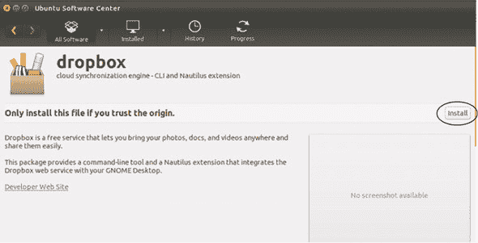
> 
> **5**.  一旦 Dropbox 安装完成，您将看到一个绿色的勾选标记。现在您可以删除下载文件夹中的 .deb 文件。


##### 安装 .deb 文件

如果你不喜欢使用 Ubuntu 软件中心来安装.deb 文件，你可以安装 GDebi，这是一个用于安装.deb 文件的工具。我更喜欢 GDebi 而不是 Ubuntu 软件中心，它在我看来总是有点慢。一旦你有了 GDebi，右键单击.deb 文件，点击“打开方式...”并选择 GDebi，将其用作打开.deb 文件的默认程序。


这是在系统上安装软件的一种相当不痛苦的方式。然而，在安装软件包时，总是要小心谨慎。你可能会在系统上安装一些有害的东西。研究软件包文件的来源。如果它来自你听说过的企业，比如谷歌或 Dropbox，那么应该没问题。但如果它来自你不太熟悉的网站或论坛上的独立文件，那么你可能应该避免使用它——至少在你基于研究其他人关于该包的评论确认文件不会损害你的系统之前。

现在你已经知道了如何使用软件包文件，让我们来探索如何安装一个仓库。

#### 17.1.2\. 查看和添加仓库

当你从仓库下载软件时，感觉就像你从一个大集合中拉取软件。但现实是你在与多个仓库合作，并通过单个界面（如 Synaptic）与他们互动。当你将仓库添加到你的系统时，就像你将一根软管连接到你的包管理器，而这根软管正在从你刚刚添加的仓库中引入新的软件包（见图 17.2）。

##### 图 17.2\. 软件包管理器连接到多个仓库。

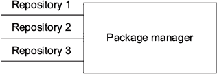

在我们将仓库添加到我们的系统之前，让我们确保我们想要添加的软件不在我们当前的仓库中。不用担心！如果你尝试安装不在仓库中的软件，不会发生任何坏事。你只会得到一个错误消息。

首先，让我们查找 Synapse。进入 Synaptic，查找一个名为`synapse`的包。但是它不会出现。它是一个启动器，但与 Kupfer 和 GNOME Do 不同，它不在 Ubuntu 仓库中。如果你对 Kupfer 和 GNOME Do 不太满意，Synapse 可能会成为你首选的启动器。软件是个人选择，在我选择工具之前，我喜欢先试几个。

##### 要查看系统上的仓库

在我们添加 Synapse 仓库之前，让我们查看我们的当前仓库，看看哪些被包含在内。

> **1**.  进入 Dash 并启动软件和更新。这是一个管理你的仓库的工具。我们在第四章中使用它来查看我们的驱动器。如果你在这里更改仓库，它将在整个系统中更改——即使你使用不同的包管理器。打开屏幕显示了构成我们系统软件列表的四个仓库：main、universe、restricted 和 multiverse（见图 17.3）。我们在第七章中讨论过这个问题，但为了复习：
> 
> +   *主要*是由 Ubuntu 开发者维护的免费和开源软件。
> +   
> +   *宇宙*指的是由社区贡献但未由 Ubuntu 官方支持的软件。
> +   
> +   *多元*指的是非自由、专有软件（通过 Synaptic 无法购买软件，因此它不涉及成本）。
> +   
> +   *受限*指的是专有驱动程序。
> +   
> ##### 图 17.3\. Ubuntu 的软件列表由四个仓库组成。
> ##### 
> 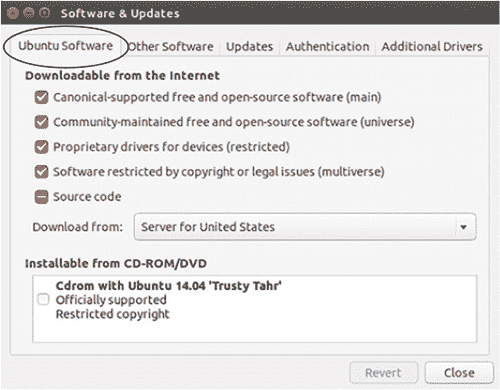

现在我们准备添加 Synapse 仓库。

##### 使用图形方式添加仓库

添加仓库是一个两步过程：

> **1**.  点击“其他软件”标签页。任何带有勾选框的软件都是你的仓库中的软件，但不是 Ubuntu 项目的官方部分。例如，现在你可以看到 Dropbox 仓库，因为我们已经安装了它（见图 17.4）。任何没有勾选框的软件不在你的仓库中，但可以通过勾选来添加。
> 
> ##### 图 17.4\. 其他软件显示了来自 Ubuntu 主项目的仓库之外的内容。
> ##### 
> 
> 
> **2**.  点击“添加”按钮。将弹出一个窗口，要求你输入要添加为源的仓库的完整 APT 行。你将输入`ppa:synapse-core/ppa`。PPA 信息来自 Launchpad.net 上的项目页面，这是 Canonical 托管不同软件项目的地方。

Ubuntu 将使用这些信息为你拉取仓库的网址：

> **1**.  点击“关闭”。Ubuntu 现在将提示你重新加载其软件，因为它已经过时。
> 
> **2**.  点击“重新加载”按钮。Ubuntu 现在将重新索引仓库。软件和更新完成时将关闭。
> 
> **3**.  返回到 Synaptic。
> 
> **4**.  点击“重新加载”以刷新 Synaptic 的库存。
> 
> +   再次搜索 synapse。
> +   
> +   该软件包现在可供您使用。
> +   
> +   就像我们在第七章中安装 Vim 一样安装它。
> +   
> +   一旦 Synaptic 完成，关闭它。
> +   
> +   进入 Dash 并启动 Synapse。如果你在上一个章节中没有玩够启动器，这又是一个很好的选择！

当你输入仓库信息时，你使用了 PPA 的首字母缩写。它是“个人软件档案”的缩写，这是一个由项目或个人维护的仓库，而不是发行版。PPA 是针对基于 Debian 的系统，但其他发行版也有类似的概念。回到本节开头的水管类比，PPA 是将软件包引入系统的水管。大多数发行版都有添加仓库的方法，其概念与 PPA 相似。例如，Arch Linux 有*AUR*，代表*Arch 用户仓库*。这是 Arch 用户可以放置不在主要 Arch 仓库中的软件并与 Arch 社区分享的地方。OpenSUSE 有一个类似的概念，称为*Open Build Service*。

##### 使用命令添加仓库

如你所料，也有添加新仓库的命令（见图 17.5）：

+   `sudo add-apt-repository ppa:synapse-core/ppa`

+   `sudo apt-get update`

+   `sudo apt-get install synapse`

##### 图 17.5。正如您可能预料的那样，也有命令可以添加仓库和安装新软件。

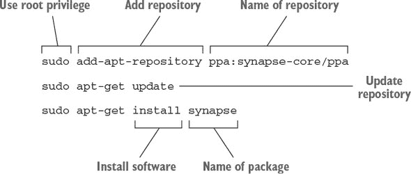

现在您已经了解了安装软件的不同方法，我们准备进入依赖项，它们是其他程序运行所需的程序。在下一节中，我们将探讨依赖项是什么，它们如何工作，以及您如何移除不必要的依赖项以节省系统空间。

### 17.2. 依赖项

我在这本书的不同时间讨论了包依赖项。依赖项是程序运行所需的文件和库（由多个程序共享和使用的模块化软件）。包管理器的一部分工作是为您处理依赖项。它会查看一个包需要哪些文件来运行，确保您系统上有这些文件，如果没有，则会安装它们。包管理器甚至确保您有程序或库的正确版本，因为有时软件需要特定版本文件或库。

当您刚刚安装 Synapse 时，您不仅安装了 Synapse。您还安装了它运行所需的程序和库。它们是什么？让我们看看：

> **1**. 打开 Synaptic 并搜索 Synapse。
> 
> **2**. 右键单击它并点击属性。这个区域将告诉您有关包的所有信息。
> 
> **3**. 点击依赖项标签（见图 17.6）以查看 Synapse 运行所需的其它程序。括号中的数字表示 Synapse 需要的包或库的版本。例如，程序 libgee2 需要版本大于或等于 0.5.0。如果您在使用程序时遇到问题，这很有用。有时包管理器正在使用依赖项的不正确版本。查看依赖项让您能够看到可能的问题是什么——是缺少依赖项还是某个依赖项版本不正确。
> 
> ##### 图 17.6。Synaptic 包管理器允许您查看依赖项。
> ##### 
> 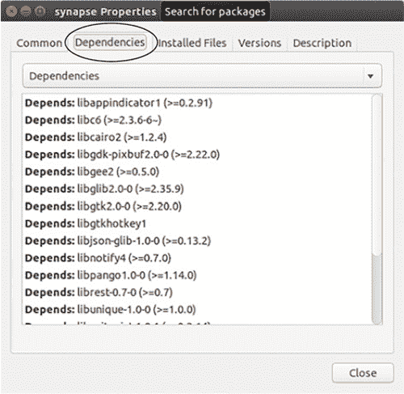
> 
> **4**. 关闭属性窗口并关闭 Synapse。

当然，如果您要从系统中移除 Synapse，您将不再需要一些这些依赖项，但它们将保留在您的系统上，占用空间。在下一节中，您将了解如何移除它们。

#### 17.2.1. 使用高级命令移除依赖项

在您能够移除依赖项之前，您必须先移除程序。如果您尝试移除一个依赖项，包管理器也会移除使用该依赖项的软件。这不会破坏您的系统，但如果您使用的程序被移除，那就很烦人，因为您不得不重新安装它。

首先，让我们使用命令行来移除 Synapse。在第十二章中，我们使用了`sudo apt-get remove`命令来卸载系统上的软件。该命令会移除软件，但会留下配置文件。移除一个程序几乎所有的内容的一个更完整的方法是使用`sudo apt-get --purge remove`和包名。这是我通常用来移除软件以保持我的系统尽可能干净的方法。进入终端，使用`sudo apt-get --purge remove synapse`来移除 Synapse。

如果你查看终端文本，你会看到一条消息在顶部，你可能之前在移除软件时没有注意到：

```
The following packages were automatically installed and are no longer
     required:
  consolekit libck-connector0 libgtkhotkey1 libpam-ck-connector pastebinit
  python-gnome2 python-pyorbit
Use 'apt-get autoremove' to remove them.
```

这些包被 Synapse 使用，但不在你们的系统上被其他任何东西使用，所以你们不需要它们。它们所做的只是占用空间。如果你安装了需要这些程序之一的软件，包管理器会重新安装它需要的。回到终端，输入`sudo apt-get autoremove`来移除这些不必要的依赖项。

| |
| --- |

##### Autoremove

`autoremove`可能是一个有争议的命令，因为它偶尔会移除其他包需要的包，从而破坏你的系统。我从未遇到过这个问题，但我读过其他用户遇到这个问题的情况。我唯一会跳过 autoremove 的情况是当与：

+   ***元包—*** 元包是一个预配置的程序集合，允许你轻松地安装复杂的东西，如桌面环境，而不必逐个安装许多包。元包中捆绑的包不一定是依赖项。相反，通过预先选择使软件正常工作所需的所有内容，它们使软件对用户更易用。如果我移除了像`xfce`或`kde`这样的元包，它们都是桌面环境，我不会跟随`autoremove`。相反，我会留下系统上留下的任何包。

+   ***GNOME 应用程序—*** GNOME 桌面环境与许多软件紧密集成，如 Evolution 电子邮件客户端和 GNOME Videos 视频播放器。这些程序紧密集成到 GNOME 中，当你移除这些程序及其依赖项时，往往会破坏 GNOME。在处理 GNOME 应用程序和 GNOME 桌面时，我让依赖项保持不变。你们可以在 GNOME wiki 上看到 GNOME 应用程序的列表：[`wiki.gnome.org/`](https://wiki.gnome.org/)

除了这两种情况之外，我经常使用`autoremove`，并且个人从未遇到过问题。

| |
| --- |

你们会记得我们检查了 Synapse 的依赖关系，并看到了一个名为`libgee2`的程序。它不在`autoremove`列表中，这意味着我们的系统中至少还有另一个程序在使用它。让我们看看当我们尝试移除`libgee2`时会发生什么。进入终端并输入`sudo apt-get --purge remove libgee2`。

你们会看到一个**长**的消息，开头是：

```
The following packages were automatically installed and are no longer
     required:
```

这些都是也使用 `libgee2` 的程序。如果我们删除 `libgee2`，包管理器将删除使用它的所有程序。以这种方式处理依赖项是一种有用的行为，因为它防止我们删除其他程序需要的程序。而不是留下损坏的软件，包管理器会提供删除所有因依赖项被删除而会损坏的东西。

这也是为什么您在删除程序时需要小心，因为如果您盲目地同意删除这两个程序，您可能会想知道终端消息中显示的那个庞大的软件列表去哪里了。这就是为什么始终仔细阅读系统消息很重要。输入 `N` 并按 Enter 键取消删除 `libgee2`。

### 17.3\. 总结

您现在知道了当您想要的软件不在仓库中时安装软件的不同方法。这将使您的 Linux 世界更加开放。您还应该对依赖项的工作方式以及如何从系统中删除不再需要的依赖项有一个概念，这有助于节省空间。所有这些工作将在下一章中派上用场，当我们讨论更新和升级系统时，这也依赖于您的包管理器。

#### 术语表

在本章中，我解释了：

##### Arch 用户仓库 (AUR)

包含由项目或个人提交的软件包的仓库，而不是 Arch 发行版。

##### 依赖项

程序运行所需的文件和库（由多个程序共享和使用的模块化软件）。

##### 个人软件包存档 (PPA)

由项目或个人维护的仓库，而不是发行版。PPA 专门针对基于 Debian 的系统。

##### 软件包文件

您用于安装 Windows 软件的 .exe 文件的 Linux 版本。基于 Debian 的系统，如 Ubuntu，使用 .deb 文件，而其他系统使用其他格式。例如，Fedora 和 OpenSUSE 使用 .rpm 文件。

### 17.4\. 实验室

本章是关于从您的计算机安装和删除软件的教训：

> **1**.  仅使用命令安装 Atom 文本编辑器。它的 PPA 是 ppa:webupd8team/atom，详细信息可以在项目的页面 [`launchpad.net/~webupd8team/+archive/ubuntu/atom`](https://launchpad.net/~webupd8team/+archive/ubuntu/atom) 上找到。
> 
> **2**.  Atom 有哪些依赖项？
> 
> **3**.  删除 Kupfer 及其依赖项。如果您正在使用实时会话，您将不得不再次安装它，这是我们之前章节中做的。

## 第十八章\. 更新操作系统

保持您的 Linux 系统更新对于安全性和功能都很重要。当您更新系统时，您不仅更新了操作系统，还更新了软件，这意味着您会随着软件包库中的新功能和新改进而获得它们。

您还需要修复已发现并纠正的安全漏洞。程序员也是人。他们在代码中会犯错误，有时这些错误可能会损害我们电脑的安全性。更新通常发生在有人发现错误并修复它之后。保持系统更新对于系统良好运行至关重要。

| |
| --- |

##### 更新和升级系统

定期更新和升级系统被视为最佳实践，从您首次安装新发行版开始。我大约每周更新一次。

在我们的案例中我们没有这么做，因为我想要逐步进行这项活动。

但当您下次安装另一个发行版时，请确保立即升级它！

| |
| --- |

在上一章中，我们使用包管理器添加了新的仓库，现在我们将使用它来更新我们的系统。在本章中，我们将讨论两个概念：

+   *更新*系统，确保所有最新包都包含在我们的仓库中。

+   *升级*系统，即安装所有那些新包。

我们还将学习如何通过图形界面和命令来完成这两项任务。让我们从更新我们的系统开始，这在我们升级之前必须完成。

### 18.1\. 更新 Linux

您会记得从第十七章中，在我们将 Synapse 仓库添加到 Synaptic 之后，我们重新加载了 Synaptic，以便 Synapse 包能够显示在其中。那是一个*更新*。更新是指您告诉包管理器出去获取所有最新版本的包。包管理器会查看哪些包是您系统中的新包，并将它们作为更新目标。包管理器通常自动处理这些操作，尽管您可以像我们对 Synapse 所做的那样，强制更新仓库。您可能已经注意到 Ubuntu 在通知您有关更新包的信息。您会看到一个像图 18.1 那样的弹出消息。

##### 图 18.1\. Unity 显示包何时已更新。

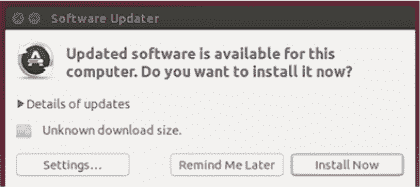

这是 Ubuntu 软件更新器。它也会出现在您的左侧导航托盘上（见图 18.2）。

##### 图 18.2\. 当 Ubuntu 软件更新器检测到更新包时，其图标也会出现在导航托盘上。


不同的桌面环境以不同的方式显示已更新的包。例如，在 Cinnamon 中，您会在底部任务栏中收到通知（见图 18.3）。

##### 图 18.3\. Cinnamon 桌面在其底部任务栏中也显示了已更新的包。


KDE 也会在屏幕底部给您一个通知（见图 18.4）。

##### 图 18.4\. KDE 桌面在其底部任务栏中也显示了已更新的包。

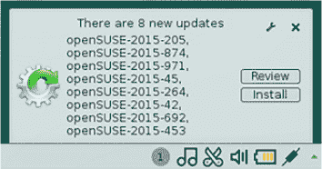

桌面环境不会影响系统更新和升级的*方式*。它控制着您如何得知这些操作已经发生。

您可以通过点击软件更新器上的设置按钮来控制您的系统检查更新的频率，甚至可以控制哪些软件会自动升级（见图 18.5）。

##### 图 18.5\. 您可以通过点击设置按钮来控制 Ubuntu 检查升级的频率以及允许哪些升级。

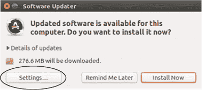

这个更新屏幕（图 18.6）令人困惑，因为它虽然使用了“更新”这个词，但它更新的是仓库，而不是您系统上的软件。这个屏幕正在检查新软件包，然后在没有您的指示下将它们引入您的包管理器。软件的最终安装，技术上是一个升级，取决于您，管理员。

##### 图 18.6\. 更新屏幕指的是更新仓库，而不是您系统上的软件。

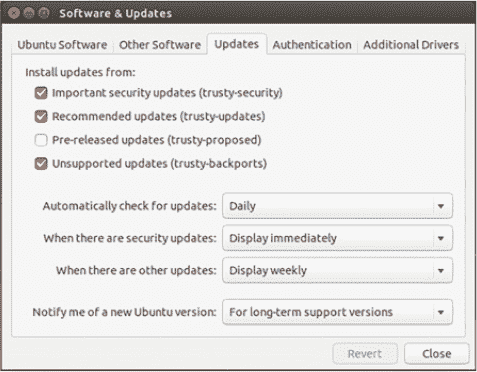

更新屏幕的顶部部分是自动更新的软件包。我会保持这些不变。重要的安全更新对于保持系统安全非常重要。

推荐更新对于保持系统稳定非常重要。名称令人困惑的“不支持的更新”允许您安装软件的新主要版本。当 Ubuntu 的一个版本完成时，它被视为一个成品，而新的软件版本则保留供未来发布。不支持的更新允许您在不迁移到新版本的情况下获取软件的新版本。我们稍后会更多地讨论版本。

屏幕的底部部分允许您选择软件更新器检查更新的频率以及它多久向您显示一次更新可用。我个人喜欢保持这些设置不变，这样我就可以在不记得手动更新包管理器的情况下保持我的系统更新。但我知道很多人会关闭这个选项，并在他们抽出时间维护系统时每周手动更新和升级一次。重要的是，您的系统要定期更新和升级。您知道如何最好地完成这项任务。

最后，点击“当有安全更新”下拉菜单（见图 18.7）。在这里，您可以配置更新器自动为您安装软件。我个人喜欢看到正在安装的升级，但对于希望排除在升级/更新过程之外的非技术用户来说，自动更新是一个好选项。在这种情况下，非技术用户将拥有一个可以自动升级的系统。

##### 图 18.7\. 您可以设置安全更新以自动安装，这对于非技术用户来说是一个好选项。

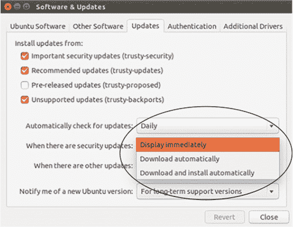

如果您要在您兄弟的电脑上安装 Ubuntu，而他不太擅长处理像软件维护这样的事情，您可能要配置它为他处理更新和升级。

如您所预期的那样，也有一种使用命令来更新您系统的方法。让我们接下来看看这个。

#### 18.1.1\. 更新命令

使用命令更新有两个原因：

+   通过命令行更新是快速的。

+   通过命令行更新可以在所有桌面环境中工作，即使您没有桌面环境。

如果您要通过命令升级，我们将在下一节中学习如何做，您应该首先运行`update`命令，这样您就有所有最新的软件在您的仓库中。当您图形化更新时，软件更新器会自动检查更新。

`update`命令在您已禁用我们在上一节中查看的所有自动更新和通知时也很有用。如果您是那种每周只想更新和升级一次的人，那么`update`命令是一种快速获取所有最新软件包的方法。它让您免于等待计算机告诉您更新已准备好的麻烦。

最后，正如我之前提到的，升级软件包的显示取决于桌面环境。但有些桌面环境不会显示软件包何时已升级。所以，如果您使用的是这类桌面环境，`update`命令是一个确保在升级之前您拥有所有最新软件包的好方法。命令的优点是它在任何系统上*总是*有效。您永远不必担心更新器使用的是哪种 GUI。

您的软件仓库可能自我们安装 Synapse 以来就已经是最新的（除非您正在使用 Live 会话），但为了确保这一点，请进入终端并输入

```
sudo apt-get update
```

您将看到所有仓库都在更新。现在，您已经准备好升级您的系统。

### 18.2. 升级 Linux

一旦您的仓库已经更新，您就可以升级您的系统，这意味着将更新的软件包安装到您的系统上。


##### 在 Live 环境中升级

如果你从 Live CD 或 USB 启动 Linux，你将能够升级你的系统，但当你重启时，这些升级将会消失，除非你设置了一个可以保存更改的持久环境。

在 Live 环境中升级没有坏处，这是一种良好的实践，但当你重启时，所有这些升级都消失了，请不要感到惊讶：


> **1**. 打开软件更新器。
> 
> **2**. 点击“更新详情”旁边的三角形（见图 18.8）。任何带有勾选的软件包都将升级。这是您可以排除软件包升级的区域。这也是您可以查看升级类型的地方。有其他更新，这些是无关安全的软件更新。
> 
> ##### 图 18.8。您可以手动选择要升级的软件包。
> ##### 
> 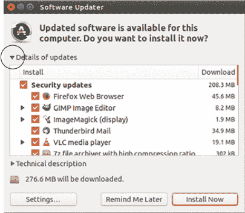

所有在安全标题下的都是安全升级，应该允许升级。但如果出于某种原因，您不想升级某个安全升级的软件包，您有权阻止它：

> **1**.  点击“立即安装”以升级您的系统。这可能需要几分钟的时间，因为我们已经有一段时间没有升级了。VirtualBox 用户可能会看到一个关于替换文件的消息。点击“替换”。
> 
> **2**.  升级完成后，您需要重新启动计算机。您不总是在升级后需要重启。通常，在内核升级后需要重启，因为这是一个重大变化。否则，升级根本不会造成干扰。
> 
> **3**.  重新启动您的计算机。（如果您正在使用 Live 镜像，计算机将在重启后恢复到更新前的状态，但这对于下一个练习来说是可以的。）

当您的计算机重启时，您应该会收到一条消息，表明有更多升级可用。这是因为我们等待了相当长的时间来更新我们的系统，所以不是所有内容都能一次性升级。

一些软件包在重启后才能升级，但您的系统并不需要重启。相反，它耐心地等待下一个最佳机会来升级您的计算机，而不会打扰到您的工作。

如果您没有收到有关更多升级可用的消息，请不要担心。您的系统可能还没有检查。因为我们只有一小时的时间，我们将假装它已经通知了您。让我们继续使用`upgrade`命令来完成这项工作。

#### 18.2.1\. 升级命令

使用`upgrade`命令的原因与使用`update`命令的原因相同。这是使用三个词来升级您系统的方法。要完成升级：

> **1**.  进入终端并输入`sudo apt-get upgrade`。
> 
> **2**.  输入密码后，您将看到所有剩余的升级软件包。按`y`键并按 Enter 键完成升级。

您的系统现在完全是最新的。从现在开始，当存储库中有更多更新时，您将收到通知。您可以自行安装这些更新，以保持系统安全，并确保您始终使用软件的最新版本。

在第二章中，我们讨论了我们的 Ubuntu 版本支持五年。这意味着更新将保持五年（在我们的例子中是 2019 年，因为 Ubuntu 14.04 是在 2014 年发布的）然后 Ubuntu 将不再为我们版本的 Ubuntu 提交更新。在下一节中，我们将比较像 Ubuntu 这样的标准、基于版本的发行版与持续更新的滚动发行版。随着我们接近本书的结尾，了解这一重要区别对您来说非常重要，因为它将帮助您选择自己的发行版。

### 18.3\. 滚动发行版与标准发行版

标准 Linux 发行版支持固定的时间，这意味着它们会收到更新，直到支持期结束。然后，您可以选择继续使用不再接收更新的操作系统，这从安全角度来看并不是一个好主意，或者您可以迁移到新的标准发行版。

*滚动发布* 是持续更新的系统。这意味着它们在整个系统生命周期中不断接收更新和新版本的软件。相比之下，我们的 Ubuntu 版本只会在 2019 年之前接收更新。有些发行版的支持时间甚至更短。例如，Fedora 的发布版只会在大约 13 个月内接收更新。

我认为滚动发布和标准版本之间的区别可以比作手动变速器和自动变速器之间的区别。滚动发布就像手动变速器。你拥有更多的控制权，但这种控制需要更多的关注。像更新和升级系统这样的工作需要一些工作。

标准版本就像自动变速器。你的系统正在为你处理工作，在这种情况下确保升级不会损害你的系统，但代价是控制力和性能。例如，有时滚动发布可能需要按照特定的顺序升级某些软件包。标准版本为你处理这类事情。让我们更详细地看看这两种模型。

#### 18.3.1. 标准版本

一些发行版允许你在标准版本之间迁移。例如，当一个新的长期稳定版本的 Ubuntu 准备就绪时，你的软件更新器会给你提供选项，将你的整个系统从 14.04 升级到 16.04。然而，我总是觉得这种 Ubuntu 版本间的升级比它值得的麻烦要多，因为很多东西最终都需要修复和重新配置。这些可能是小事情，比如我设置的启动程序的快捷方式，或者更大的事情，比如不再工作的程序。

我发现从一张全新的安装开始更容易。当我准备好迁移到一个新的 Ubuntu 标准版本，一旦支持结束，我会从头开始安装 Ubuntu 并复制我的文件。我发现从头开始可以获得更好的性能，而且这每五年只需要做一次。

| |
| --- |

##### 新版本信息

对最新标准版本中的新功能和不同之处感到好奇？Linux 新闻网站通常会很好地覆盖这些差异，让你知道有什么变化。对于这类新闻，我通常访问：

+   LXer: [`lxer.com/`](http://lxer.com/)

+   Linux Subreddit: [www.reddit.com/r/linux/](http://www.reddit.com/r/linux/)

+   OMG!Ubuntu (关于 Ubuntu 新闻): [www.omgubuntu.co.uk/](http://www.omgubuntu.co.uk/)

| |
| --- |

Fedora 有一个名为 DNF 系统升级的工具，它帮助用户在每隔大约六个月发生的不同 Fedora 发布版之间进行升级。

Linux Mint 有一个有趣的更新理念。它强烈建议除非你对当前的版本不满意，否则不要升级到新的标准版本！

标准发布通常比较稳定，因为负责发布工作的人员了解仓库中的所有软件，并能查看特定的升级是否会破坏任何东西。然而，标准发布的缺点是您通常不会使用软件的最新版本，因为新软件更有可能破坏旧系统。标准发布的目的是保持系统运行，但稳定性的代价通常是较旧的软件。

#### 18.3.2. 滚动发布

滚动发布的例子包括 Arch、openSUSE Tumbleweed 和 Gentoo。这些发行版没有固定的版本。一些固定发布发行版有一个可以启用的滚动选项。openSUSE、Fedora 和 Debian 都可以配置为滚动发布。

相反，新的软件不断流入这些仓库。正如我们在第二章中讨论的那样，这种做法的好处是拥有软件的最新版本，并且无需安装您发行版的全新版本。然而，缺点是可能存在不稳定性的风险。滚动发布本身并不一定不稳定，但它们确实需要更多的关注来保持稳定。您看到了我们如何通过 Ubuntu 关注升级和更新，但在滚动发布中，通常需要更积极的研究以确保特定的升级不会破坏您的系统。

当基于发布的发行版如 Debian 或 Ubuntu 推出升级时，它们已经过测试以确保不会破坏您的系统中的任何东西。但测试更容易，因为要处理的软件版本数量较少。在标准发布中，每个人的系统相对相似。然而，在滚动发布中，人们使用的软件版本种类繁多，因为那取决于他们最后一次更新时间。这使得测试新软件和查看它可能破坏什么变得更难。滚动系统中变量更多，这使得预测升级可能对系统产生的影响更困难。

为了了解软件版本可能有多大的差异，让我们将我们的 LibreOffice 版本与 Arch 仓库中的版本进行比较，这些仓库可在您的网络浏览器中查看：

+   要查看您拥有的 LibreOffice 版本，请进入终端并输入`libreoffice --version`。截至本文撰写时，版本是 LibreOffice 4.2.8.2。根据该软件包的更新和升级情况，您的版本可能略有不同。

+   将其与 Arch 仓库中找到的版本进行比较，这些仓库位于[www.archlinux.org/packages/](http://www.archlinux.org/packages/)。在仓库中搜索 libreoffice。您将看到两个版本：`libreoffice-still`，这是 LibreOffice 的稳定版本，截至本文撰写时为 4.4，以及`libreoffice-fresh`，这是 LibreOffice 的开发版本，具有新功能但可能存在一些错误。

这已经是第 5 版了，对于软件来说是一个巨大的飞跃，因为发布号中的第一个数字用来指示版本之间的重大变化。

#### 18.3.3. 哪个更好？

使用滚动发布或标准发布的决定归结为两个问题：

+   您想花多少时间来管理您的系统？

+   新软件对您来说有多重要？

如果您不想花太多时间研究更新，标准发布是一个更好的选择，因为更新通常比滚动发布测试得更多。然而，如果您想要最新的软件，并且愿意承担破坏整个系统的风险，那么滚动发布可能是一个更好的选择。公平地说，滚动发布也是学习 Linux 的一个很好的方式，因为它给您提供了很多解决问题的机会！

### 18.4. 总结

您现在知道如何更新和升级您的系统，这是 Linux 的一个重要部分。表 18.1 显示了更新和升级之间的区别。

##### 表 18.1. 更新与升级的比较

| 术语 | 说明 |
| --- | --- |
| updating | 将所有最新软件包移动到您的仓库 |
| upgrading | 安装软件包 |

执行这两个任务确保您使用的是软件的最新版本，消除旧版本中的错误，并使计算机更加安全，因为安装更新可以修复安全漏洞。我们将在下一章中更多地讨论安全问题。

我们还花了一些时间讨论了滚动发布和标准发布之间的区别。随着我们接近本书的结尾，现在是开始思考您的未来发行版可能看起来像什么的好时机。要考虑的一个变量，我们在第二章中提到了，是您用于保持系统更新的时间以及最新软件的重要性。

#### 术语表

在本章中，我解释了：

##### 滚动发布

一个持续更新的系统，在整个系统生命周期中不断接收更新和新版本的软件。

##### 标准发布

一个支持固定时间的 Linux 发布版，这意味着它会在支持期结束前进行更新。

##### 更新

将所有最新软件包移动到您的仓库中。

##### 升级

在您的系统上安装这些软件包。

### 18.5. 实验室

今天的课程全部关于尽可能保持操作系统更新。

> **1**.  您的系统上安装的是哪个版本的 Firefox？Arch 仓库中是哪个版本？这告诉您 Firefox 为 Ubuntu 更新的频率是多少？
> 
> **2**.  `update`命令和`upgrade`命令之间的区别是什么？
> 
> **3**.  配置 Ubuntu 软件更新器，自动下载安全更新。
> 
> **4**.  配置 Ubuntu 软件更新器，立即显示非安全相关更新。
> 
> **5**. 前往 Gentoo 仓库[`packages.gentoo.org/`](https://packages.gentoo.org/)。它的 Firefox 和 LibreOffice 持有量与 Arch 和 Ubuntu 相比如何？是更老还是更新？更新了多少？

## 第十九章. Linux 安全

安全是一个重要但复杂的话题。挑战在于它是一个不断变化的概念。我们认为是安全的软件，随着黑客找出如何突破曾经编码的安全保障，可能会变得不安全。对于用户来说，这意味着要保持警惕——始终关注你的系统，并将安全视为一个持续的任务，而不是一次性的任务，完成后就认为完成了。

在本章中，我将介绍保持系统安全的最佳实践。我不是黑客或安全专家，所以不会非常详细。相反，我将解释一些基本、根本和必要的安全概念，并给你一些可管理的做法来保持你的电脑安全。

在本章中，我们将讨论：

+   用户和超级用户的概念以及它是如何和为什么能保护你的电脑安全

+   Linux 病毒（以及反病毒软件）

+   Linux 防火墙

+   Linux 中的隐私，包括加密你的硬盘，以保护你的个人数据

+   安全运行命令的最佳实践

但不要忘记你在上一章中学到的重要安全教训：确保你的系统始终保持最新状态。定期的安全更新有助于通过不断修复任何安全漏洞来保护你的系统。安全漏洞可能会将个人信息，如登录和密码，发送给恶意第三方。这些问题还可能让这些同样坏的人获得访问你所有个人文件的权限。

将安全漏洞想象成你家里的一个洞。有了这个洞，像小偷一样的东西就可以进入你的家。而将安全更新想象成补洞的补丁。一旦补洞，别人要进入就困难得多。

现在我们来谈谈其他保持系统安全的方法。让我们从 Linux 用户和超级用户的概念开始。这个概念是保持 Linux 系统安全的关键。

### 19.1. Linux 中的用户和超级用户

如果你仔细想想，安全是关于阻止某人未经你允许做某事。在现实生活中，这可能是某人从你那里偷东西，这根据定义是未经你允许发生的。在你的电脑上，这可能是某人未经你允许从你那里窃取数据。

在第十二章中，我们讨论了 Linux 中超级用户的概念。超级用户是在系统上拥有一定特权的用户。这些特权是权限。超级用户有权限在系统上执行某些操作，如安装软件、配置互联网访问，甚至打印。

这就是为什么你需要在添加或删除软件之前输入密码的原因。因为你不希望任何人都可以在你的系统上安装软件。否则，他们可能会安装一些恶意和令人讨厌的东西。

Linux 有一份可以执行特定任务的用户列表，如果你不在列表中，你就不能执行那些任务——比如安装或删除软件。恶意程序通过未经你同意安装某些东西来工作。这些恶意程序可以执行从破坏你的数据到发送你所有私人数据（包括有价值的部分，如密码）的任何操作。Linux 权限概念使得未经你同意安装东西变得困难。

Linux 有一系列具有特定权限的用户组，或基于分配给它们的用户组的访问权限。 

这对于有多于一个用户的系统很有用，比如如果你和某人（或一组人）共用笔记本电脑。每个人都可以有自己的权限集，这可以防止未经授权或不知情的人执行可能损害计算机的操作。

让我们假设你打算和不太了解 Linux 的人共用你的电脑。你将想要创建一个具有受限权限的新用户。让我们这样做，这样你可以看到这个过程是什么样的，并且可以了解这些权限是如何保护你的电脑的。


**创建新用户**

> **1**.  进入 Dash 并启动用户账户。
> 
> 点击“解锁”并输入你的密码（见下一图）。此外，请注意你的账户是管理员账户，这意味着你可以控制你的系统（除非你正在使用 Live 会话，在这种情况下，你将看不到任何账户，尽管你仍然可以创建它们）。
> 
> 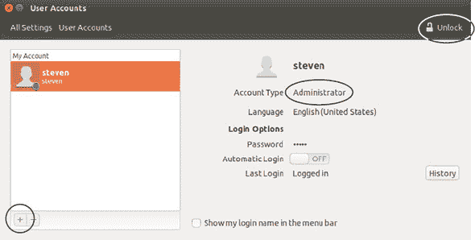
> 
> 一旦你解锁了 Ubuntu 用户账户工具，你就可以向系统中添加新用户。
> 
> **2**.  点击左下角的加号以添加新用户。
> 
> **3**.  为新用户命名为 george（如果你的用户名已经是 george，你可以使用 jerry）并选择账户类型为“标准”。
> 
> **4**.  点击“添加”以创建账户。一旦创建账户，点击密码旁边的“账户已禁用”。
> 
> 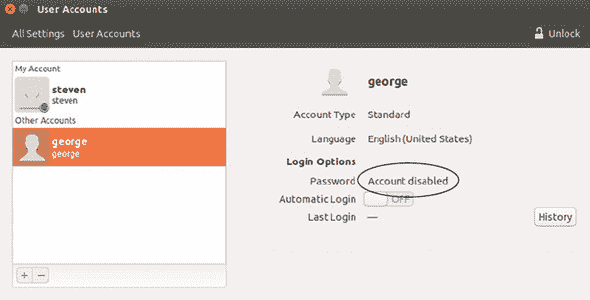
> 
> 当你创建账户时，你可以给它设置一个新的密码，这是我们目前跳过的最佳安全实践。
> 
> **5**.  将操作设置为“无密码登录”并点击“更改”按钮（见下一图）。虽然这并不是一个好的安全习惯，但我们不会保留这个账户。这纯粹是为了演示目的。
> 
> 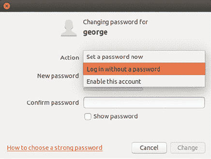
> 
> 修改密码屏幕允许你设置密码或不需要密码。


但标准账户意味着什么呢？现在让我们看看 george 属于哪些组。这将显示用户可以访问系统的哪些部分。

组控制对系统某些部分的访问。在第十二章中，我们看到了如何将用户添加到`sudo`组。组只是可以执行某些任务的用户列表。在`sudo`的情况下，是访问`sudo`命令的权限。要查看 george 属于哪些组，请进入终端并输入：

```
groups george
```

我们的 george 账户属于两个组：george 和 nopasswordlogin。成为 nopasswordlogin 组的一员使我们能够无需密码登录该账户。如果 george 账户离开该组，我们需要密码才能进入该账户。让我们看看 george 的访问权限与我们的访问权限相比如何。回到终端，并输入：

```
groups *your user name*
```

（或对于 Live Session 用户，只需输入`groups`）。

你应该会看到更多的组，包括我们讨论过的`sudo`组。现在让我们看看 george 账户在你的系统中能做什么，不能做什么：

> **1**. 现在你已经创建了一个新账户，你可以直接通过点击右上角的注销齿轮并选择 george 账户来登录它（见图 19.1）。
> 
> ##### 图 19.1。您可以使用右上角的 Ubuntu 齿轮图标登录账户。
> ##### 
> 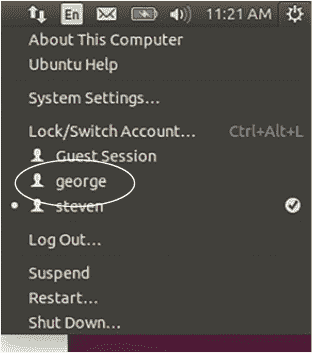
> 
> **2**. 在 george 账户中，进入终端并输入：
> 
> `sudo apt-get install leafpad`

Leafpad 是一个小巧的文本编辑器。但当你输入自己的密码时会发生什么？什么都没有！因为，正如我们所见，george 不在`sudo`列表中。这意味着该账户无法使用`sudo`命令。在 Ubuntu 的情况下，如果 George 有你的密码，george 账户仍然可以通过 Synaptic 安装软件，但否则该账户在系统上能做的事情有限。（当然，如果你的系统密码被破解，你的电脑和安全也会受到威胁。）

让我们删除那个假的 george 账户。从 george 账户注销，然后登录到你的账户。不要使用我们之前进入账户时使用的齿轮快捷方式——否则 george 账户仍然会活跃，我们无法删除它。使用注销选项代替。

登录您的个人账户。让我们使用命令删除 george 账户。要从系统中删除账户，请使用：

```
sudo userdel -r george
```

（除非你给该账户起了其他名字。）`userdel`命令删除账户，`-r`选项删除创建的主目录（所以在日常系统中使用此命令时要小心）。你会收到一个可以忽略的邮件邮箱消息。george 账户现在已不存在。

组和用户的概念是保持 Linux 系统安全的关键。只有某些账户可以执行某些操作。这就像限制拥有你家钥匙的人一样。

如你所见，没有你的批准，任何东西都无法在你的系统上安装。计算机病毒是你不希望安装在你系统上的东西的一个很好的例子。让我们更深入地了解一下 Linux 和病毒。

### 19.2. 病毒和 Linux

计算机病毒是能够在计算机上自我复制的软件。复制意味着病毒正在你的整个计算机上传播，这使得它很难被删除。病毒似乎理解，数量越多越安全。

病毒可以破坏数据或将数据发送给恶意第三方，这意味着一个令人不安的人可能会查看你的密码、你的财务文件，甚至你的照片。

计算机可以通过无数种方式感染病毒，但共同点是用户被欺骗安装了它，无论是通过访问危险网站、安装软件还是下载电子邮件附件。

#### 19.2.1\. Linux 是否对病毒免疫？

杀毒软件是 Windows 安全的重要组成部分，但由于 Linux 与 Windows 构建方式不同，因此它的重要性较低。但不要将此理解为“Linux 对病毒免疫。”事实并非如此。用户可能会被欺骗，这就是为什么我在第十七章中强调谨慎，当我们讨论从外部仓库安装软件时。（来自仓库的软件理论上可能会感染病毒，但这种情况非常罕见。）

但总的来说，Linux 通常比 Windows 更安全。为什么？部分原因是 Linux 的本质，正如我们刚刚学到的，Linux 为用户分配权限。如果你是具有管理权限的 Linux 用户，你可能知道足够多的知识来避免病毒。与可能容易欺骗任何使用计算机的人安装病毒的其他操作系统相比，这一点尤为明显。

使桌面 Linux 比 Windows 更安全的另一个原因是市场份额相对较小，没有太多的人为其设计病毒。这并不是说在 Linux 上感染病毒是不可能的。事实并非如此。但你在知识渊博的用户和你的系统之间有足够的安全措施，你的系统有自己的保护措施，因此你可以感到相对安全。

#### 19.2.2\. Linux 杀毒软件

但如果相对安全还不够？如果你想要**极其**安全，就像同时系上背带和皮带一样？我尊重你的谨慎！

Linux 实际上有一些杀毒工具。最受欢迎的程序称为 ClamAV。对于 Linux（以及 Windows；OS X 版本是付费产品）来说，它是免费的。

ClamAV 可以检测你系统上的病毒，然后你可以将其删除。这是一个基于终端的程序，但你可以安装一个名为 ClamTk 的图形前端。它允许你将 ClamAV 作为一个图形程序使用，这就是为什么它有一个稍微不同的名字。一些用户可能会发现图形程序更容易配置首选项。让我们安装图形版本并使用它。


**ClamTk**

> **1**.  使用`sudo apt-get install clamtk`安装 ClamTk。
> 
> **2**.  使用命令`sudo freshclam`更新其病毒定义。你可能会收到一条关于你的 ClamAV 版本过时的消息。这是因为 Ubuntu 并不总是拥有仓库中最新的版本。这不是理想的情况，但现在不用担心。
> 
> 如果你想要最新版本，你可以从 ClamAV 网站安装：[www.clamav.net/](http://www.clamav.net/)。无论哪种方式，病毒定义（用于查找和识别病毒）都将是最新的。
> 
> 更新完成后（这可能需要一段时间，所以这可能是吃午饭的好时机），通过 Dash 启动它。杀毒定义应该显示为“当前”。
> 
> 要运行杀毒软件，点击主页按钮，这将扫描你的主目录。你可以通过使用扫描菜单（如图中所示）来配置更具体的扫描。
> 
> **3**. 完成后，你会得到一个扫描文件和发现威胁的报告。

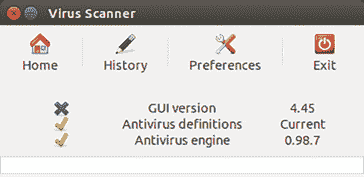

ClamTk 是 ClamAV 程序的一个图形界面。确保你的杀毒定义是当前的，使用`sudo freshclam`命令。

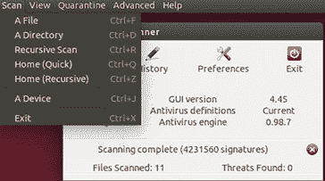

ClamTk 允许你选择要扫描的文件夹或文件。

任何病毒都可以通过 ClamTk 隔离，并由你手动删除。只是要小心，不要删除重要的东西。

你怎么知道它很重要？如果它是我们从第十四章中查看的系统文件夹之一发送的，那么研究受感染的文件并确保你没有得到误报可能是有价值的，这意味着 ClamAV 认为某物是病毒，但实际上它不是。要研究 ClamTk 报告，可以在互联网上搜索受感染的文件，看看其他用户对文件性质的报告。第二十三章（kindle_split_033.html#ch23）中也有研究技巧的列表。

如果文件是那个给你转发一切的那个朋友转给你的，那么很可能它实际上是一个病毒。


我在我的 Linux 机器上不使用杀毒软件，因为我认为病毒不是风险。我们在上一章学习了如何更新我们的系统，这正是保护我们操作系统的关键，同时，小心我们在电脑上安装的软件（这些相同的做法也能保护我们的 Windows 安装安全）。但如果运行 ClamTk 或 ClamAV 能给你带来安慰和安心，那么请随意使用它。这不会伤害任何东西。维基百科列出了其他 Linux 杀毒工具：[`en.wikipedia.org/wiki/Linux_malware#Anti-virus_applications`](https://en.wikipedia.org/wiki/Linux_malware#Anti-virus_applications)。

现在，让我们谈谈防火墙，这是另一种用于保护你的电脑免受外部入侵者的工具。

### 19.3. 防火墙

除非你的电脑没有连接到互联网，否则它会有进出的流量。流量只是网络活动的另一种说法。

当你访问一个网站时，流量会离开你的电脑。如果你从另一台电脑连接到你的电脑，那么流量就会进入你的电脑。流量通过端口传输，端口基本上是你电脑上编号的出口和入口。有成千上万的端口用于特定的目的，比如发送电子邮件、聊天，甚至打印。

防火墙是用来控制这类流量的，对于想要对系统有细粒度控制的用户来说。例如，浏览器流量使用端口 80 或 443。

如果你不想你的电脑上有互联网流量（我打这句话的时候都在颤抖），你可以封锁端口 80 和 443，这样流量就不能通过它们。这意味着你的网页浏览器将无法从外部世界接收任何东西。你会封锁出口端口，因此你无法访问网页。

然而，如果你想要拒绝进入你电脑的流量，这意味着你可以外出获取内容，但没有人可以从外部连接到你的电脑，那么防火墙就是一个有用的东西。配置 Linux 防火墙需要一定的知识。你必须知道你想要封锁或允许哪些端口和 IP 地址。

如果你从另一台电脑远程连接到你的电脑，事情会变得更加复杂。如果你有一个像我一样简单的设置，你只使用电脑来访问互联网，你可以开启防火墙而不去调整它。如果你有一个更复杂的设置，我将在本节末尾展示如何了解更多。

Linux 自带一个可配置的防火墙，称为 iptables。然而，因为它可配置性很高，所以也很复杂。为了帮助解决这个问题，Ubuntu 附带了一个名为 ufw 的命令行程序，ufw 代表 uncomplicated firewall。

ufw 程序控制 iptables，但简化了过程。默认情况下，ufw 是未启用的。要开启它，请输入 `sudo ufw enable`。

现在它已经开启，你可能想看看它正在封锁和允许什么。为此，请输入 `sudo ufw status verbose`。你应该会看到类似以下的内容：

```
Default: deny (incoming), allow (outgoing)
```

这意味着你的防火墙正在拒绝所有入站流量并允许所有出站流量。这是安全的，除非你想连接到你的电脑。

下面的内容可能对那些不通过其他电脑连接到自己的电脑的人来说稍微有些技术性。如果你确实需要访问你的电脑，你需要在防火墙中打开一个入站端口。例如，如果你使用 Secure Shell (SSH) 来连接到你的电脑，你需要打开端口 22，因为 SSH 就是使用这个端口。我们将在下一章中详细讨论这个问题。SSH 在你想连接到另一台电脑、交换文件或与远程网页服务器工作时有用。要允许 SSH，请输入：

```
sudo ufw allow ssh/tcp
```

要查看新的防火墙配置，请再次输入 `sudo ufw status verbose`。你会看到端口 22 现在正在允许入站流量。这意味着你可以从另一台电脑连接到你的电脑。正如我之前说的，我们将在下一章中详细讨论这个问题。如果你改变主意关于规则，并想拒绝 SSH 流量，你可以将命令更改为：

```
sudo ufw deny ssh/tcp
```

但是，一个人如何学习所有这些选项和命令呢？一个很好的开始是使用我们旧的第十二章朋友，`man` 命令。输入 `man ufw` 将会给你一个关于调整防火墙选项和参数的感觉，如果你对此感兴趣的话。例如，如果你不希望系统上的某人使用聊天，你可以找出他们的聊天服务使用哪些端口（互联网搜索会揭示这一点）并阻止该特定端口的出站流量。

如果你配置了防火墙？命令 `sudo ufw reset` 将会移除你创建的所有规则并禁用 ufw，这样你就可以重新开启并从一张干净的状态开始。

ufw 有一个名为 Gufw 的图形界面，它有预配置的规则。我们将在实验室中探索这一点。让我们继续到加密，这是另一种安全措施。

### 19.4\. 加密

加密是一种通过使数据对肉眼不可读来保护数据的方式。如果我们双击一个未加密的文件，它就会打开，我们可以阅读它。然而，如果我们打开一个加密的文件，我们无法阅读其中的内容。加密文件需要以某种方式转换，通常使用一个密钥，这有点像一种代码，它将加密文件转换为可读的内容。

这是超出密码的另一个保护级别。

你的 Linux 系统有一个用户名和密码，这可以防止未经验证的用户运行管理命令。它还有一个密码，可以防止没有密码的人访问你的系统。然而，还有其他获取数据访问权限的方法。例如，其他人可以运行一个实时会话并获取你的文件访问权限。这需要物理访问你的电脑和一定的技术知识，但仍然是一个风险。然而，如果你的家目录被加密了，有人需要知道一个密码短语才能访问你的文件。即使他们有物理访问你的电脑。

你可能记得在第三章中，当你第一次安装 Ubuntu 时，有一个关于加密的问题（见图 19.2）。这是加密家目录的一种方法——在安装时进行加密。然而，如果你当时没有考虑到，或者你改变了主意，你仍然可以使用一个名为 eCryptfs 的程序来加密你的家驱动器。

##### 图 19.2\. 你可以在安装操作系统时加密你的家目录，或者使用 eCryptfs 在之后进行加密。

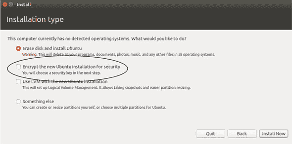

我们不会加密你的家目录，因为这需要大量的磁盘空间。有些人加密他们的家目录是为了确保所有文件的安全，而不是决定他们想要保护哪些文件。

相反，我们将加密我们的部分家目录。这将是一个安全的地方来存放你不想未经加密整个目录就泄露的重要文件。

对于我来说，磁盘空间通常是决定是否加密整个家目录还是只加密部分目录的关键因素。

然而，如果您有空间和意愿，在安装操作系统后，eCryptfs 提供了一个方便的逐步过程来加密您的家目录。它被称为 `ecryptfs-migrate-home` 命令。ArchWiki ([`wiki.archlinux.org`](https://wiki.archlinux.org)) 上有一些关于如何使用它的极好信息。但就目前而言，让我们在我们的家目录中创建一个加密文件夹：

> **1**. 安装 eCryptfs。软件包名称为 `ecryptfs-utils`。
> 
> **2**. 运行命令 `ecryptfs-setup-private --nopwcheck --noautomount`。此命令将创建一个需要密码（nopwcheck）的加密目录，该密码不同于登录密码（见图 19.3）。默认情况下，该目录也将不可访问（noautomount）。
> 
> ##### 图 19.3\. `encryptfs-setup-private` 允许您使用标志指定密码和挂载行为。
> ##### 
> 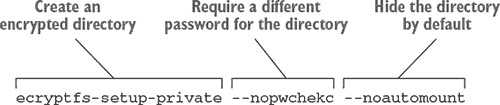
> 
> **3**. 您将被要求输入登录口令。这是您用于打开加密目录的密码。请将密码保存在安全的地方！如果您丢失了它，您将失去对文件的访问权限。遗憾的是，这不是像您的 Netflix 那样可以重置的密码。
> 
> **4**. 您将被要求输入挂载口令。按 Enter 键以生成一个口令。这将生成一个文件，用于让您访问目录。如果该文件丢失或损坏，您将失去对目录的访问权限，就像丢失了盒子的钥匙一样。我们稍后会讨论如何备份此文件。
> 
> **5**. 一旦创建目录，请注销并重新登录。
> 
> **6**. 在您的家目录中，您将看到一个名为 Private 的目录。它上面有一个锁。要使用它，进入终端并输入 `ecryptfs-mount-private`。现在您已经挂载了它或使其可用，您可以点击进入 Private 目录。
> 
> **7**. 在私有目录中保存一个空白文件。
> 
> **8**. 使用 `ecryptfs-unmount-private` 卸载目录。
> 
> **9**. 现在进入该目录。由于目录不可访问，您将无法看到文件。如果重启，您将需要再次挂载加密目录。

您可以看到加密是如何保护您的数据的。有一个只有您才能解锁的私有目录。任何拥有您电脑的人如果没有密码都无法进入那个加密目录。我们只是加密了您家目录的一部分，但如我所说，您也可以加密整个家目录。

在我们继续之前，还有最后一件事。我提到过，为了以防万一密钥文件出现问题，要备份挂载加密目录时使用的口令。要显示口令，输入`ecryptfs-unwrap-passphrase`。你将被要求输入口令，这是你在第 3 步中创建的密码。输入它，你将得到一串字母和数字。打印出来并保存在安全的地方，以防密钥文件出现问题（或者如果你忘记了创建的密码）。

现在你已经知道了如何保护你的数据隐私，让我们进入 Linux 安全性的最后一部分，即安全地运行命令。

### 19.5\. 安全地运行命令

我们在第十三章中讨论了安全地运行命令，但这是一个足够重要的主题，值得在此回顾。正如你所看到的，Linux 真正的安全风险是社交性的。如果有人诱骗你泄露密码或运行错误的命令，他们可以控制你的系统。

安全漏洞通常是由于用户的行为或未行为造成的，而不是代码本身的错误。新 Linux 用户经常发现自己在线上，试图学习新事物。虽然你在线上找到的大部分建议至少是善意的，但有些人发布的内容可能会损害你的系统或使其面临风险。表 19.1 总结了四种确保你不会意外运行有害命令的方法。

##### 表 19.1\. 安全地运行命令

| 命令... | 安全行为 |
| --- | --- |
| ...需要 sudo 吗？ | 问问自己你运行的命令是否需要 sudo。如果你只是想移动一个文件，有人推荐使用 sudo，想想这为什么不合理，因为移动文件不是管理任务。 |
| ...对你来说有意义吗？ | 理解一个复杂命令的作用。如果它使用了管道，研究管道的每一部分。确保你大致了解你使用的命令的每一部分在做什么，以及你为什么要这样做。如果你需要复习管道，我们已经在第十二章中讨论过。在 Linux 的早期，有些人认为建议新用户运行 rm -rf 命令（这将删除系统上的所有内容）很有趣。这并不好笑，但却是可能的，因为人们会运行命令而不知道命令会做什么。 |
| ...删除或覆盖文件吗？ | 备份正在更改的文件。因为除非你 100%确定更改，否则你可能会破坏你的系统。备份文件永远不会伤害到，你可以通过复制文件并将其保存在不同的位置来备份文件。如果你的命令成功执行，你可以删除备份。如果它没有成功，你会很高兴你很小心。 |
| ... 好像被普遍使用？ | 在运行你在网上找到的命令之前，做一些研究，看看其他人是否推荐相同的命令来解决相同的问题。有很多论坛和很多命令，但仅仅因为有人发帖并不意味着它是正确的。在 第二十三章 中有一个很好的网站列表，你可以访问这些网站。如果你能找到其他人使用相同的命令来解决相同的问题，那么命令是你需要的可能性就更大。 |

### 19.6\. 总结

这些是 Linux 安全的裸骨基础。如果你想深入了解安全，有几个地方可以探索：

+   我之前提到的 ArchWiki ([`wiki.archlinux.org/`](https://wiki.archlinux.org/)) 在这里讨论的所有工具上都有大量有用的信息。尽管它是为 Arch 分发版的用户准备的，但上面的一切在其他分发版上也能工作。

+   Ubuntu Wiki ([`wiki.ubuntu.com/`](https://wiki.ubuntu.com/)) 的深度不如 Arch，但也提供了一些有用的安全信息。

+   许多这些工具的 `man` 页面非常适合了解它们能做什么。如果没有其他，`man` 页面也为你提供了更精确地搜索互联网的方法。

通过这一章的学习，你现在对如何根据你个人的舒适度来保持系统安全有了感觉。就我个人而言，我打开 ufw 并从不调整它。而且，正如我之前提到的，我也不运行杀毒软件。我加密了我携带的电脑的家用驱动器，但对我的台式机不感兴趣，它一直在家。而且我 *总是* 保持我的系统更新。

从小开始。加密一个目录，并将你的重要文件保存在那里。看看这对你的效果如何，然后再去玩防火墙。即使你决定不使用这里描述的所有工具，至少你将做出一个明智的选择。

#### 术语表

在这一章中，我解释了：

##### 加密

通过要求一个电子密钥来解密数据以保持数据安全的方法。

##### 防火墙

控制计算机的进出网络流量。

##### 端口

你计算机上编号的出口和入口，数据通过这些端口传输。有成千上万的端口用于特定目的。

##### 病毒

在计算机上自我复制的软件片段。

### 19.7\. 实验室

现在是时候看看你学到的关于 Linux 安全的知识了。

> **1**. 创建一个名为 tommy 的管理员账户。这个账户有 `sudo` 访问权限吗？你怎么知道？
> 
> **2**. 使用命令行删除账户。（如果你收到消息说用户正被某个进程使用，你可以使用 `sudo kill -9` 杀死该进程及其进程号。）
> 
> **3**. 当你尝试在未挂载的私有目录中保存文件时会发生什么？为什么会这样？
> 
> **4**.  安装 Gufw（软件包名称`gufw`）并创建一个规则（图 19.4 中的步骤 1 和 2）拒绝从应用程序 BitTorrent（见图 19.4 和 19.5）流出流量。
> 
> ##### 图 19.4\. Gufw 允许你使用 GUI 创建规则
> ##### 
> 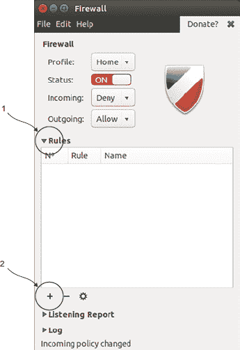
> 
> ##### 图 19.5\. Gufw 有预配置的规则，使得允许和拒绝某些应用程序变成只需搜索一个框的事情。
> ##### 
> 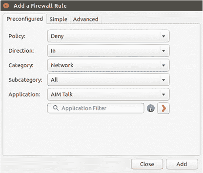
> 
> **5**.  关闭防火墙。我们不想在下一章中打开它。

## 第二十章\. 连接到其他计算机

我们在这本书中花费了很多时间使用互联网来完成不同的事情，从拉取更新以便我们可以升级软件包到下载软件包文件，再到在线研究不同的发行版。然而，我们并没有花太多时间讨论*如何*连接到互联网。如果你使用虚拟机来探索 Linux，那么虚拟机正在使用你的主要操作系统所使用的任何互联网连接。如果你使用的是 Linux 的实时版本，你已经花了一些时间使用 NetworkManager，这是 Ubuntu 用来帮助你连接到互联网的工具。

就像安全一样，网络也是一个复杂的话题。系统管理员使用网络概念来让不同地方的机器能够快速高效地相互通信。我们在这里不会深入探讨这些概念。本章的目标，就像安全章节一样，是给你足够的信息去做你需要做的事情，在这个案例中，就是配置你的互联网连接并连接到其他计算机。

在本章中，我们将涵盖：

+   使用 NetworkManager 连接到无线和有线网络。

+   使用 SSH 连接到其他计算机，我们在上一章中简要讨论过。

到本章结束时，你将能够调整你的互联网连接设置，改变你的计算机查找互联网地址的方式。你还将了解如何使用 SSH 连接到 Linux 计算机，这是系统管理员连接到远程服务器时常用的。

然而，SSH 有更实用的用途。正如你将在本章后面看到的那样，它可以用来在两台计算机之间传输文件。还有其他有趣的用途。例如，如果一个键盘坏了，你可以通过 SSH 进入一台机器，使用一个有工作的键盘的机器来访问文件。SSH 在与类似树莓派这样的设备一起使用时也非常方便，它本质上是一个服务器。

现在我们首先来看一下 NetworkManager。

### 20.1\. 使用 NetworkManager 连接到互联网

NetworkManager 是 Ubuntu 和其他许多发行版用来管理你的互联网连接的工具。它做一些事情，比如显示哪些无线网络可用，并帮助你连接到隐藏的网络或需要密码的网络。正如我之前提到的，如果你在使用虚拟机，你不必考虑这些事情，因为虚拟机正在使用其安装的计算机上设置的连接。如果你在使用实时 CD/DVD/USB，或者你已经在你的计算机上安装了 Linux，那么你可能已经与之互动过了。

Unity 有一个名为 NetworkManager 小程序，它出现在屏幕顶部（见图 20.1）。小程序是一个小程序，让你可以与更大的程序交互。在 Linux 中，任务栏项目通常是小程序，为你提供快速便捷地访问某些程序的方式。

##### 图 20.1\. NetworkManager 小程序让你可以与 NetworkManager 交互。

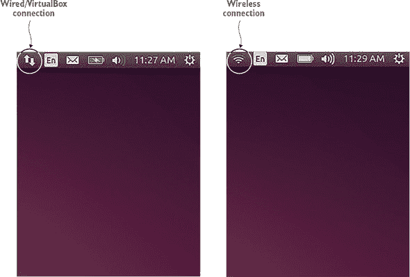

NetworkManager 小程序是与 NetworkManager 交互并轻松查看连接状态的一种方式，因为它位于你的顶部导航栏上。

如果你点击 NetworkManager 小程序，你会得到更多选项。在虚拟会话中，你不会看到太多，因为 NetworkManager 认为你的计算机已经连接到有线连接，并且没有使用你的系统无线配置（见图 20.2）。这是有道理的。如果你的主要操作系统正在使用无线网络，那么该操作系统内的虚拟机怎么可能使用不同的网络呢？因此，虚拟机将连接视为有线连接。

##### 图 20.2\. 在虚拟会话中，NetworkManager 显示的内容不多，因为连接是由虚拟机安装的操作系统处理的。

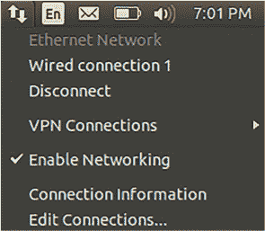

然而，在实时会议中，或者当 Linux 完全安装后，NetworkManager 就变得更有趣了，它会显示无线网络，并允许你连接到那些没有广播其名称的隐藏无线网络（见图 20.3）。

##### 图 20.3\. NetworkManager 显示可用的无线网络，并给你连接隐藏网络的选择。

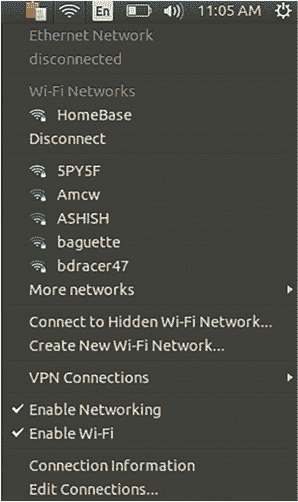

使用 NetworkManager 相当直接。如果你使用有线连接，通过以太网线连接到互联网，你已经设置好了。如果你想使用无线连接，点击小程序。你会看到所有可用的无线网络列表。然后，点击你想连接的网络。这个过程对大多数计算机用户来说应该很熟悉。

如果无线网络需要密码，你只需输入密码即可。

由于使用 NetworkManager 连接到网络只需点击网络名称，我觉得展示如何更改你的域名系统（DNS）设置可能会更有趣。

#### 20.1.1\. 自定义你的域名系统

当您输入一个网址时，您会被引导到一个 DNS 服务器，该服务器查找网址，例如[www.manning.com](http://www.manning.com)，并将其转换为互联网协议（IP）地址，这是一个分配给网络中设备的唯一数字。

在网站的情况下，您正在连接到一个服务器，或者连接到互联网的计算机（并且正在接受传入流量！），然后它提供（或服务）您的内容。

有时您的 ISP 没有提供优质的 DNS 查找服务，这可能会减慢您的计算机速度。当您输入一个网址时，例如[www.google.com](http://www.google.com)，它可能需要一段时间才能被转换成 IP 地址，例如 216.58.218.132。这个地址是 IPv4，这意味着它可以是 4 位数字，也可以是 12 位数字。

IPv6，它正逐渐被用于 IP 地址，是一个更长的数字。在您的 URL 栏中输入 216.58.218.132，您将被直接带到[www.google.com](http://www.google.com)。

一种绕过缓慢的 DNS 查找的方法是更改您连接的 DNS 设置。您可以选择许多 DNS 服务，如 Google 公共 DNS 或 OpenDNS。要查看您的当前 DNS 设置，我们将使用`nm-tool`命令。`nm-tool`命令是一种命令行方式，可以查看关于 NetworkManager 及其网络和配置的信息——例如它正在使用哪个 DNS 服务器，它正在使用哪种连接（有线或无线），甚至它正在使用哪个驱动程序。

在其输出的末尾，您将看到它正在使用哪个 DNS 服务器。它看起来可能像这样：

```
DNS:*IP address of DNS server*
```

要更改您的 DNS 设置：

> **1**. 点击 NetworkManager 小程序。
> 
> **2**. 前往“编辑连接”。
> 
> **3**. 点击您的连接。如果您使用无线网络，它将是您的无线网络名称。如果您使用虚拟机，它将是有线连接。
> 
> **4**. 点击“编辑”按钮以更改该单个连接的 DNS 设置（见图 20.4）。如果您正在编辑家庭无线网络的 DNS 设置，您只更改该连接的 DNS 设置，而不是在同一台计算机上使用的其他任何连接。
> 
> ##### 图 20.4\. NetworkManager 允许您更改单个连接的 DNS 设置。
> ##### 
> 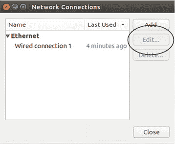
> 
> **5**. 前往“IPv4 设置”标签页（见图 20.5）。
> 
> ##### 图 20.5\. IPv4 是目前大多数人使用的 IP 地址版本。
> ##### 
> 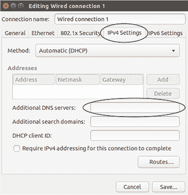
> 
> **6**. 前往“附加 DNS 服务器”并添加 208.67.222.222, 208.67.220.220。这些是 OpenDNS 服务器。尽管它的名字叫 OpenDNS，但它是一家公司，而不是开源项目，它提供免费的 DNS 查找服务。我发现它的服务器速度快且可靠。
> 
> **7**. 点击“保存”按钮并关闭 NetworkManager。

你已经更新了 DNS 设置！但再次运行`nm-tool`。发生了什么？新的服务器没有显示。现在我们需要告诉计算机重新检查它们。我们可以重启，但更快的方法是使用`sudo service network-manager restart`命令，这将为我们重启 NetworkManager。现在运行`nm-tool`，你会看到新的服务器。希望你会注意到你的浏览速度现在稍微快了一些，尽管改进可能很微妙。

许多发行版使用 NetworkManager 作为处理互联网连接的默认工具。但并非只有这一个选择。还有其他工具。

其中一个是 Wicd，你也会在 Ubuntu 仓库中找到它。我有一些笔记本电脑、无线网卡和网络与 NetworkManager 配合得不好，导致很多无线连接丢失。Wicd 总是作为一个有用的备用方案。但为了公平起见，NetworkManager 在我的机器上运行得很好，已经好几年了。然而，如果你发现它不起作用，请注意你有其他选择。

Linux 的一个优点是，你很少被锁定在单一类型的软件中。如果你对 NetworkManager 有什么不喜欢的地方，即使它只是任务栏显示的问题，你都可以安装 Wicd。

现在我们已经设置好了连接，让我们谈谈如何使用 SSH 从另一台计算机连接到我们的计算机。

### 20.2. 使用 Secure Shell (SSH)连接到你的计算机

我们在上一个章节中简要地讨论了 SSH。这是一种安全地将一台计算机连接到另一台计算机的方式。它最常用于连接服务器，服务器通常不在用户所在的物理空间内。它也可以用来连接到台式计算机。例如，如果你需要从你的家用计算机中获取文件，你可以使用 SSH 从你的办公室访问它。

然而，这种情况很少见，多亏了我们现在可以使用的众多基于云的文件共享服务。但如果你与服务器一起工作，或者想要与服务器一起工作，了解 SSH 是有用的。

为了展示 SSH，我们需要两台计算机。幸运的是，我怀疑你们中的许多人都在使用虚拟化的 Linux，这是我向你们展示 SSH 的完美方式。如果你已经在你的计算机上安装了 Linux，你可以创建一个虚拟的 Linux 机器。第三章将指导你完成这些步骤。对于实际用户来说，可能没有足够的磁盘空间来构建虚拟机。建议至少有 8GB 的空间。

我还假设你们中的许多人正在使用 Windows 作为底层操作系统，其中包含虚拟的 Linux 机器。如果你使用 Windows 来虚拟化 Linux，你需要下载一个名为 Putty 的工具，它是 Windows 的 SSH 客户端。它可以在[www.putty.org/](http://www.putty.org/)找到。如果你使用 OS X 或 Linux 作为主要操作系统，你已经有 SSH 安装了。

你还需要在你要连接的 Linux 计算机上安装一个 OpenSSH 服务器。这个软件包叫做`openssh-server`。

对于本章的目的，托管虚拟机的机器是 *主机* 机器，虚拟 Linux 计算机是 *远程* 机器（见 图 20.6）。

##### 图 20.6\. 对于本章，主机机是你的物理计算机，远程机是你的虚拟 Linux 安装。

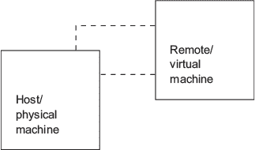

完成这些任务后，你需要配置你的虚拟机，以便我们能够 SSH 进入它。

#### 20.2.1\. 配置你的虚拟机

配置你的虚拟机是一个简单的过程：

> **1**.  关闭你的虚拟机。
> 
> **2**.  进入 VirtualBox 客户端，右键点击你的 Linux 映像，并进入设置（见 图 20.7）。
> 
> ##### 图 20.7\. 在你能够 SSH 进入你的虚拟机之前，你需要更改一些网络设置。
> ##### 
> 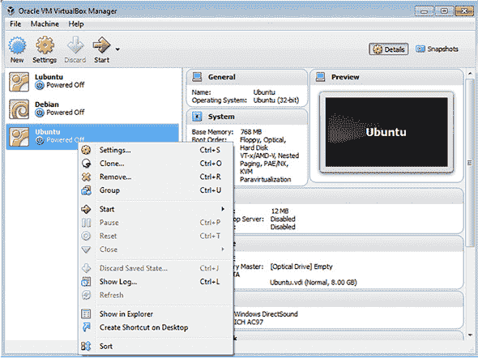
> 
> **3**.  点击网络并确保你连接到桥接适配器（见 图 20.8）。这个更改将允许你在两个操作系统之间发送数据。
> 
> ##### 图 20.8\. 确保你在 VirtualBox 中连接到桥接适配器。
> ##### 
> 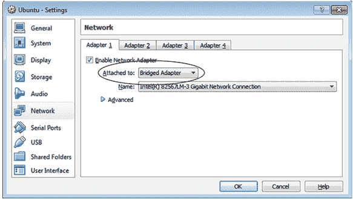
> 
> **4**.  重启你的虚拟 Linux 机。
> 
> **5**.  确保你的防火墙已关闭。该命令是 `sudo ufw disabl`。
> 
> **6**.  使用 `ip addr` 命令获取你的虚拟机的 IP 地址。该机器的 IP 地址将是 eth0 连接旁边的 inet 地址，这是虚拟机认为它正在使用的有线连接（见 图 20.9）。
> 
> ##### 图 20.9\. `ip addr` 命令会告诉你你的虚拟机的 IP 地址。
> ##### 
> 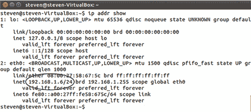
> 
> **7**.  将 IP 地址复制到 PuTTY 的主机名字段（见 图 20.10）并点击打开。
> 
> ##### 图 20.10\. PuTTY 是 Windows 的 SSH 客户端。
> ##### 
> 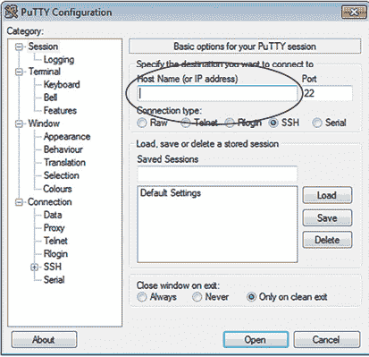
> 
> **8**.  PuTTY 将会要求你以一个名字登录。请使用你的 Ubuntu 账户的用户名。
> 
> **9**.  使用你的 Ubuntu 密码。
> 
> **10**.  PuTTY 将会给你一个安全警报，并询问你是否信任主机。你可以回答是。但是，连接到外部机器时一定要小心。请再次检查 IP 地址，以确保你连接的是一台安全的机器。
> 
> **11**.  如果你使用 Linux 或 OS X，你可以跳过 PuTTY，使用命令 `ssh`*username@virtual machine's IP address* 连接到虚拟 Linux 机。
> 
> **12**.  输入你的 Ubuntu 密码。

你现在已经连接到了你的虚拟 Linux 机，但由于 SSH 是基于终端的，你无法访问 GUI。这就是我们花这么多时间使用终端的原因！你一直在为此训练！你还记得如何查看你的位置吗？输入 `ls`。你会认出目录，并意识到你处于虚拟机的家目录中！

在读取文件方面，你受限于在终端中可以读取的内容。你无法查看图像或甚至文档处理文件。然而，你可以创建一个文件。使用 `touch` 命令创建一个名为 *hi* 的文件。现在进入你的虚拟 Linux 机器。你会在桌面上看到这个文件。使用 `exit` 命令结束 SSH 会话。

在我们的例子中，我们使用了 SSH 连接到一个我们容易物理访问的机器。然而，正如我之前提到的，你只需要机器的 IP 地址、用户名和密码就可以 SSH 到一台机器上。所以你可以从工作中 SSH 到你的家用 Linux 机器，只要家用机器是开启的，并且你的防火墙允许这种访问。而且正如你所看到的，由于 SSH 可用的图形工具有限，你依赖于命令行来做诸如在远程机器上打开和移动文件等事情。但如果你想在两台计算机之间传输文件呢？让我们试试！

#### 20.2.2\. 使用 SSH FTP 传输文件

如果你曾经与远程服务器进行过任何工作，你可能已经使用过 FTP 客户端上传文件。同一个客户端可以用来在计算机之间传输文件。我们将使用在虚拟 Linux 机器上托管的操作系统的 FileZilla FTP 客户端。

FileZilla ([`filezilla-project.org/`](https://filezilla-project.org/)) 是一款免费软件，适用于 Windows、OS X 和 Linux 系统，因此我知道它对阅读此文档的每个人来说都会工作。它也是我在任何操作系统上最喜欢的 FTP 客户端，但你可以使用任何支持 SSH 文件传输协议 (SFTP) 的客户端。我们将使用 SFTP 连接 FileZilla。这是一个使用 SSH 的连接，但也允许你在服务器之间传输文件。

一旦 FileZilla 在主机机器上安装完毕，点击站点管理器（见图 20.11）并点击新建站点以创建新的连接：

> **1**.  在“主机”处输入虚拟机的 IP 地址（见图 20.12)。
> 
> ##### 图 20.12\. SFTP 协议允许你使用 SSH 安全地移动文件。
> ##### 
> 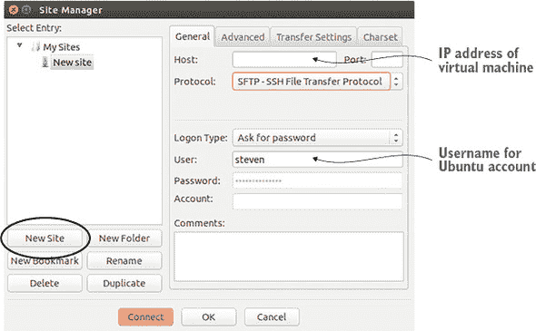
> 
> **2**.  将协议更改为 SFTP - SSH 文件传输协议。
> 
> **3**.  在登录类型部分选择“要求密码”，这样 FileZilla 在连接之前总是会要求你输入密码。
> 
> **4**.  输入 Ubuntu 账户的用户名。
> 
> **5**.  点击连接。
> 
> **6**.  与之前的 SSH 一样，FileZilla 会询问是否可以信任你正在连接的机器。点击确定。

##### 图 20.11\. 一个 FTP 客户端，如 FileZilla，可以用来在不同物理（和虚拟）机器之间移动文件。

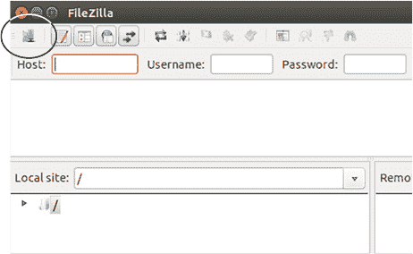

您现在已连接到您的虚拟 Linux 机器。如果您查看右侧的 FileZilla 窗格，它代表远程机器上的文件，您会看到您现在回到了虚拟机的家目录，就像使用 SSH 一样。左侧窗格显示了主机计算机上的文件。导航到虚拟机的桌面，并将 `hi` 文件拖到您的本地桌面上。现在，您已经复制了文件，使其在两台机器上都存在。

也有一个命令可以做到这一点。在 Linux 和 OS X 上，它被称为 `scp`。在 Windows 上，这个工具被称为 `PSCP`。您可以通过 Putty 网站下载 Windows 版本。`scp` 和 `PSCP` 工作方式相同，但您在 Windows 上运行命令时，它必须是从您下载 `PSCP` 文件的同目录下运行。

在 Windows 系统上

```
pscp *localfile user@ip* :Desktop
```

将您执行命令的目录（以及您下载 `PSCP` 的位置）中的文件发送到远程服务器的桌面目录。在 Linux 或 OS X 系统上

```
scp *user@ip:file name* Desktop
```

将远程机器的家目录中的文件移动到本地机器的桌面上。这两个命令使用类似的语法，第一个变量是要移动的文件或目录，第二个变量是目的地。

### 20.3\. 总结

我们今天讨论了家庭网络的一些不同方面。您现在知道如何使用 NetworkManager 连接到网络。我们还通过 SSH 连接到虚拟 Linux 机器，并使用 SFTP 在计算机之间传输文件。

网络是一个复杂的话题，但如果这个话题对您感兴趣，这个概述将帮助您开始学习更多。然而，即使您没有管理和服务器的抱负，了解 SSH 和 SFTP 仍然可能很有用。正如我之前提到的，树莓派经常需要使用 SSH。

最后一点。明天我们将打印！可能没有把打印机带到午餐上（除非您与您的打印机关系非同寻常地亲密），但明天章节中可能有助于将其放在附近。

#### 术语表

在本章中，我解释了：

##### 小程序

一个让您与更大的程序交互的小程序。

##### DNS

将域名转换为 IP 地址的过程。

##### FTP

允许您在远程机器之间传输文件和目录。

##### IP 地址

互联网协议地址。分配给网络上设备的唯一数字。

##### SFTP

SSH FTP。允许您使用 SSH 在远程机器之间传输文件和目录。

### 20.4\. 实验室

花时间连接到您的虚拟机。这与您连接到远程服务器的方式非常相似，所以这是一个很好的实践。

> **1**. 启用虚拟机的防火墙，然后 SSH 进入它。您能否连接到远程机器？
> 
> **2**. 如果您在虚拟机中使用 `sudo ufw deny ssh/tcp` 块 SSH，会发生什么？
> 
> **3**. 使用 `PSCP`（如果您的宿主机器是 Linux 或 OS X，则使用 `scp`）将 `hi` 文件移动到您的本地机器。
> 
> **4**. 您可以通过 SSH 更新和升级虚拟机吗？如果是这样，请这样做。

## 第二十一章. 打印

打印机是那种在正常工作时看不见，但一旦出现问题就极其烦人的东西。打印问题，比如让电脑识别你的打印机，在各个操作系统之间可能具有挑战性。就大多数情况而言，在 Linux 上打印很简单。你插上打印机，配置它，然后一切就绪。但这并不意味着本章会很长或很吸引人。因此，本章的其余部分将关于解决在 Linux 上出现的打印挑战。

为什么打印在各个操作系统之间都是一个挑战？大部分挑战来自打印机驱动程序。还记得第四章中的驱动程序吗？驱动程序是允许操作系统，或者在我们的情况下，Linux 内核，与你的硬件（在这种情况下，是打印机）通信的软件。

当驱动程序不起作用时，你的电脑就无法与打印机通信。这就是你遇到问题的地方。但这些问题是可以解决的。这并不难——主要是试错，正如你将看到的。

在本章中，我们将探讨打印，了解：

+   Ubuntu 的打印机工具，它允许你将打印机添加并配置到系统中。它有一个友好的界面，所以我通常从它开始，只有在遇到打印机问题，如双面打印时，才会转向 CUPS，我们将在下一刻讨论。

+   常见的 Unix 打印系统（CUPS），另一种配置打印机的方法，在所有 Linux 发行版中都很常见，而不仅仅是 Ubuntu。了解如何使用 CUPS 是很有用的，以防你将来使用没有自己打印工具的发行版。

+   其他解决打印机问题以及避免它们成为问题的方法。打印机，就像任何设备一样，并不是所有都与 Linux 兼容得很好，这并不是因为硬件问题，而是因为帮助 Linux 与硬件通信的驱动程序。我们将在本章后面部分更多地讨论如何选择与 Linux 兼容的打印机。

最后一点。在本章中，我们将进行大量的实际操作，但可能比之前的内容稍微抽象一些，因为我猜测你们中的一些人午餐时可能没有打印机。然而，我将假设你们中的一些人正在家中工作，那里可以访问打印机。但由于我不知道你们使用的是什么类型的打印机，所以指导和练习将是通用的。我希望你们对我不知道你们个人生活中的事情，比如你们有什么类型的打印机，感到如此宽慰，以至于这不会影响你们对本章的享受。那么，让我们开始打印吧！

### 21.1. 使用 Ubuntu 的打印机工具安装打印机

如我之前所说，Ubuntu 的打印机工具有一个用户友好的界面，所以我们将从这里开始。打印机工具与 CUPS 一起工作。当我们使用该工具设置打印机时，当我们在本章后面进入 CUPS 时，一切都将配置好。

我假设您是通过 USB 电缆连接到打印机的。即使您希望无线打印，您通常也会从 USB 连接开始配置。如果您使用的是虚拟机，您需要启用 USB，这样虚拟机才能访问您的打印机。要这样做，请参阅侧边栏。

| |
| --- |

**在虚拟机中启用 USB**

> **1**. 将您的打印机连接到计算机。
> 
> **2**. 启动 VirtualBox，右键单击您的虚拟 Linux 机器，然后点击设置。
> 
> **3**. 点击 USB，然后点击图标从设备添加过滤器。如果您计算机上插入了多个 USB 设备，您需要选择您的打印机。
> 
> **4**. 点击确定，您将在虚拟机中访问打印机。
> 
> **5**. 现在启动您的虚拟 Ubuntu 机器。

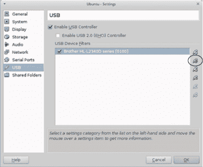

虚拟机用户需要通过设置菜单使打印机可用。

| |
| --- |

一旦您的打印机连接到计算机，从 Dash 启动打印机。

要将您的打印机添加到计算机：

> **1**. 点击任一添加按钮（见图 21.1）。
> 
> ##### 图 21.1. Ubuntu 打印机工具允许您向系统添加新打印机。
> ##### 
> 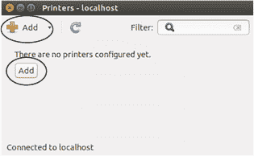
> 
> **2**. 您的打印机应显示为设备（见图 21.2）。选择它并点击前进按钮。如果信息不完全正确，请不要担心。例如，它可能不会显示您的确切打印机名称或型号。您将有机会进行更正。
> 
> ##### 图 21.2. Ubuntu 应该会检测到您的打印机。如果信息不完全正确，请不要担心。
> ##### 
> 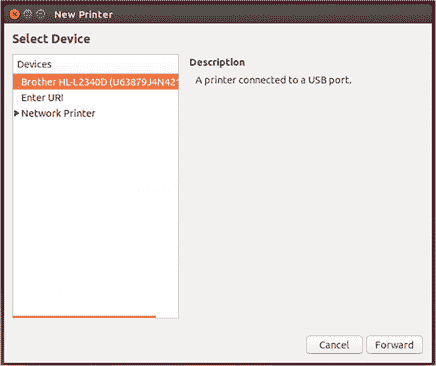
> 
> **3**. Ubuntu 现在将为您打印机的驱动程序查找。这取决于您的打印机，我们的路径会有所不同。Ubuntu 现在将为您提供安装打印机的选项（见图 21.3）。
> 
> ##### 图 21.3. 要安装您的打印机，您需要一个 PPD 文件，这是一种打印机驱动程序。
> ##### 
> 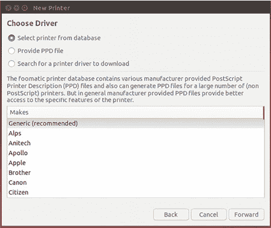
> 
> +   选项 1 是从数据库中选择打印机。您选择制造商，然后是型号，Ubuntu 将尝试找到匹配的驱动程序。不幸的是，数据库并不大，Ubuntu 无法访问专有驱动程序，所以即使它找到了匹配项，通常也不是一个好的匹配，因此您在打印时可能会遇到问题。这个选项对惠普打印机效果很好，因为惠普打印机通常有开放的驱动程序，但对其他制造商则效果不佳。您始终可以从这个选项开始，看看它是否允许您打印。如果您的打印机不在数据库中，您也可以使用它。如果这两个选项都不能让您打印，请删除打印机，然后使用选项 2 重新开始。
> +   
> +   选项 2 是提供 PPD 文件。PPD 文件是 PostScript 打印机描述。它是一种通常从打印机制造商的网站上下载的打印机驱动程序。除非是 HP 打印机，否则我通常选择选项 2 并下载 PPD 文件。只需在网上搜索您的打印机型号和 PPD 即可。遗憾的是，这并不总是那么简单。例如，我的打印机是 Brother HL-2340DW。Brother 的网站上没有 PPD 文件，而是有一个包文件（一个 .deb，就像我们在第十七章中学到的）。为了获取 PPD，我下载了 .deb 文件，右键单击，并使用 Ubuntu 归档管理器打开它。（我将在本章稍后向您展示如何操作。）然后我在包文件中四处寻找，直到在 opt 文件夹中找到一个 PPD 文件。最后，我将 PPD 移动到桌面，并让 Ubuntu 打印机工具指向它。之后，Ubuntu 安装了我的打印机，我能够打印。

一旦您将 PPD 上传到打印机工具，它将为您配置打印机设置，允许您打印测试页（见图 21.4）。

##### 图 21.4\. 打印测试页以确保打印机工作正常。

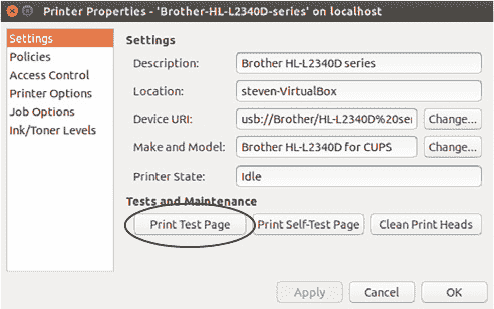

打印测试页以确保一切正常。如果不行，删除打印机（我稍后会向您展示如何操作）并重新开始，这次选择不同的选项。

如果您使用了打印机数据库但不起作用，请尝试在线查找 PPD。有时您需要做一些研究才能让打印机工作。配置打印机并不难，但确实需要尝试和错误。

一旦您的打印机安装并开始打印，请关闭打印机工具。在下一节中，我将向您展示如何删除打印机以及如何配置打印机。

#### 21.1.1\. 使用 Ubuntu 打印机工具删除和配置打印机

下次您打开打印机工具时，应该会看到您的打印机在那里，旁边有一个绿色的勾号，表示它是默认打印机。如果您右键单击打印机，您将看到一些选项（见图 21.5）。

##### 图 21.5\. 在打印机工具中右键单击您的打印机，可以删除和配置您的打印机。

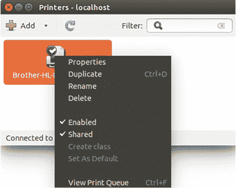

让我们启用双面打印。右键单击您的打印机并点击属性链接。

+   点击打印机选项链接，进行更改纸张大小和配置双面打印等操作，双面打印由 Duplex 选项控制（见图 21.6）。

    ##### 图 21.6\. 双面打印选项控制双面打印。

    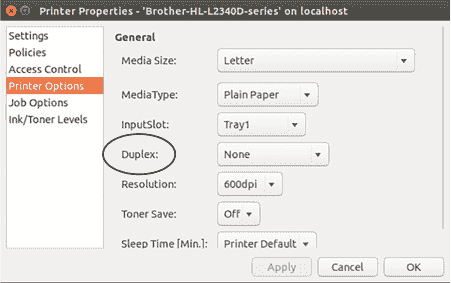

+   将其更改为 DuplexNoTumble。我们将在本章稍后讨论这个问题。

您还可以使用属性区域来更改打印机的一些其他设置。例如，在设置区域，您可以更改打印机的 URI，这将允许您根据打印机的设置打印到无线打印机（见图 21.7）。

##### 图 21.7\. 更改您的设备 URI 将允许您打印到无线打印机。

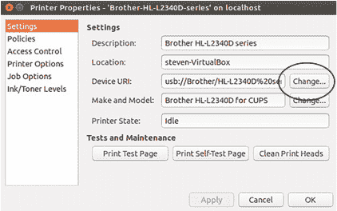

要删除打印机，右键点击你的打印机并选择删除。要查看正在打印的作业，右键点击打印机并使用查看打印队列链接。

现在打印机已经启动并运行，让我们来看看 CUPS。CUPS 是另一个你可以用来配置打印机的工具。如果你在一个没有用户友好的打印工具的系统上，了解它是有帮助的。如果你发现 Ubuntu 打印机工具对你不起作用，这也很有用。

### 21.2\. CUPS

CUPS 比 Ubuntu 打印机工具提供了更细粒度的打印机控制。管理员经常用它来配置网络打印机，但鉴于阅读这篇文章的大多数人没有运行复杂的网络打印环境需要策略，你可能不太会在家里经常使用它。

尽管如此，它是一个有用的工具来探索，因为并非所有的 Linux 系统都有像 Ubuntu 打印机工具那样漂亮的 CUPS 界面。

要访问 CUPS（这在大多数发行版中是标准的），你将使用你的网页浏览器，这在与本地计算机交互时有点奇怪（尽管你可能还记得从第五章中，GNOME 桌面可以通过网页界面进行自定义）。要查看 CUPS，打开任何网页浏览器并访问 http://localhost:631/。它应该看起来像图 21.8。

##### 图 21.8\. CUPS 允许你通过网页界面控制你的打印机。

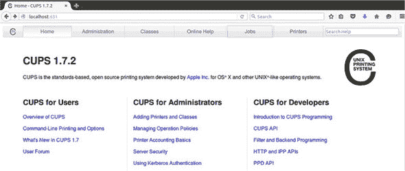

你会在 CUPS 的顶部菜单中看到我们在 Ubuntu 打印机工具中看到的大部分相同功能，因为 Ubuntu 打印机工具本质上是一个用户友好的 CUPS 界面。当你使用 Ubuntu 打印机工具时，你实际上是在使用 CUPS：

+   *作业*允许你查看你的打印队列。

+   *打印机*允许你查看你的打印机。

+   *管理*允许你添加更多打印机。它还赋予你将打印机分组到类别的权限。类别允许你集中设置谁可以打印到哪个打印机。它们还允许你做一些事情，比如在打印机上设置页面限制。这些是在办公环境中你可能想要做的事情，但大多数人不太可能在家需要这些选项。

点击顶部的打印机链接，你会看到你的打印机列出来。如果我们没有使用 Ubuntu 打印机工具，我们本可以通过 CUPS 安装打印机。点击你的打印机，你会看到它的配置情况（见图 21.9）。

##### 图 21.9\. CUPS 是另一种更改打印机设置的方法。

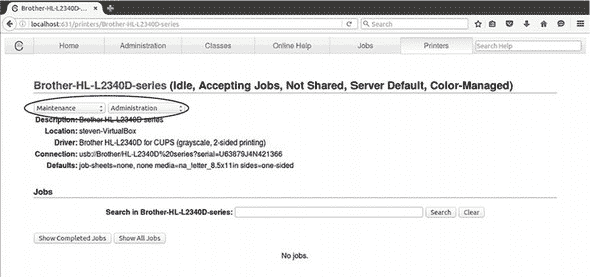

如果你点击维护下拉菜单，你会得到打印测试页和取消所有作业等选项。如果你点击修改打印机下拉菜单，你可以做一些事情，比如只允许某些用户访问打印机（这可能是你在家不太需要但网络管理员有帮助的事情）并修改打印机。

切换到“修改打印机”选项。系统会要求您输入登录名和密码。您需要提供具有打印机访问权限的人的凭据。还记得我们在第十九章中查看组的情况吗？我们的默认 Ubuntu 账户是名为`lpadmin`的组成员。该组可以访问 CUPS。任何属于该组的人都可以配置它，而不属于该组的人将无法进行更改。如果您想亲自查看，请进入终端并输入`groups`以查看您是否属于该`lpadmin`组。

一旦您输入了 Ubuntu 用户名和密码，您就可以看到您的打印机是如何连接到您的计算机的。点击“继续”进入下一个屏幕，在那里您可以更改打印机的描述和位置（这在网络情况下很有帮助），并设置网络中的多个打印机。这可以让您标记打印机的物理位置，而不是在列表中有一堆打印机型号。

再次点击“继续”，您可以选择更改驱动程序和上传新的 PPD 文件。如果您正在尝试安装打印机，这个屏幕（见图 21.10）非常有帮助。从这个屏幕尝试不同的驱动程序和 PPD 文件非常容易——也许比从 Ubuntu 打印机工具还要容易。

##### 图 21.10\. CUPS 使调整驱动程序和尝试新的 PPD 文件变得容易。

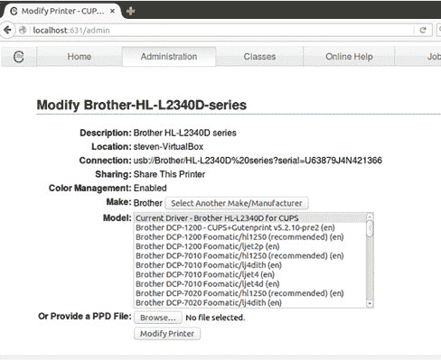

如果您在用 Linux 安装打印机时遇到麻烦，您可以考虑切换到 CUPS 并导航到这个屏幕，以快速测试不同的配置。

说到解决打印问题，在下一节中，我将为您提供一些帮助您解决打印机问题的技巧，但更好的是，帮助您避免这些问题。

### 21.3\. 使用 Linux 打印的技巧

在 Linux 中安装打印机有时很简单，但有时需要一些工作。我希望您的情况属于简单的那一端。但如果不是，或者只是为了将来参考，以下是一些一般性的技巧，可以帮助您在 Linux 上进行打印：

> **1**.  *仔细选择打印机*。关于解决打印机问题的最佳建议是首先防止它们发生。如何做？通过选择已知与 Linux 兼容性良好的打印机。
> 
> 我很乐意列出您应该购买哪些打印机，但打印机很快就会停产。互联网是跟踪快速变化的硬件的完美格式。Ubuntu 在这里保持了一个很好的资源列表：[`help.ubuntu.com/community/Printers`](https://help.ubuntu.com/community/Printers)。不幸的是，并非所有打印机都与 Linux 兼容。有时根本不存在允许 Linux 与打印机通信的驱动程序。
> 
> 除了制造商的驱动程序页面外，它还链接到使用开放驱动程序的打印机制造商。正如我们在第四章中讨论的那样，开放驱动程序使得打印机更容易安装，因为操作系统可以看到连接到打印机所需的所有信息。当使用专有驱动程序时，操作系统有时得不到足够的信息。当这种情况发生时，你的系统就无法与打印机通信，你也就无法打印。
> 
> **2**.  *找到 PPD 文件*。如果你的 Ubuntu 内部数据库不起作用，请在网上找到你的打印机 PPD 文件。希望它在制造商的网站上，并且很容易找到。但正如我们在我家的 Brother 打印机上看到的那样，有时它会被隐藏起来。如果没有 PPD 文件，但有某种.deb 或.rpm（另一种软件包格式），你可以下载它，将其作为存档打开（见图 21.11），然后四处寻找直到找到 PPD。这并不容易，但很有效。
> 
> ##### 图 21.11\. 有时 PPD 文件隐藏在软件包中。不要害怕四处看看。
> ##### 
> 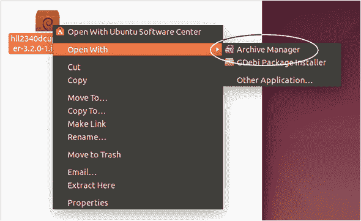
> 
> **3**.  *双面打印*。我们都环保。我们喜欢节约纸张。所以我们打印双面（假设我们的打印机有这个功能）。出于任何原因，Linux 打印机实用程序通常不使用“双面”这个术语。它们使用术语*duplex*。
> 
> +   *DuplexTumble*是指你想要一个宽度大于长度的文档（见图 21.12）。它也被称为横向。
> +   
>     ##### 图 21.12\. Linux 打印系统使用 DuplexTumble 和 DuplexNoTumble 术语来表示在双面打印时页面是如何翻转的。
>     ##### 
>     
>     
> +   *DuplexNoTumble*是指你想要一个长度大于宽度的文档。这可能是大多数人想要的设置，因为我们就是这样打印报告和信件的。这也被称为纵向。
> +   
> **4**.  *利用挑战*。有时让打印机工作可能会让人沮丧，但正因为它并不总是容易，这意味着其他人也在经历同样的事情，所以通常网上有答案。我在第四章中提到了一些可以寻求帮助的网站，比如 Unix 和 Linux Stack Exchange 以及 Ask Ubuntu，但搜索你的打印机型号以及 Linux 或 Ubuntu 这个词也很有帮助。如果你遇到了麻烦，别人也遇到过。而且他们很可能在某处发布了答案，因为 Linux 用户通常都很乐于助人。
> 
> **5**.  *打印到 PDF*。Linux 的一个很酷的功能是打印对话框可以将任何文档转换为 PDF。这虽然不能帮助打印到纸张，但这是一个很酷的技巧，可以快速将任何东西转换为 PDF，而不需要安装任何特殊软件。
> 
> 要将某个东西转换为 PDF：
> 
> +   打开打印对话框。
> +   
> +   对于打印机，选择“打印到文件”（见图 21.13）。
> +   
>     ##### 图 21.13\. 打印对话框可以用于从任何程序生成 PDF。
>     ##### 
>     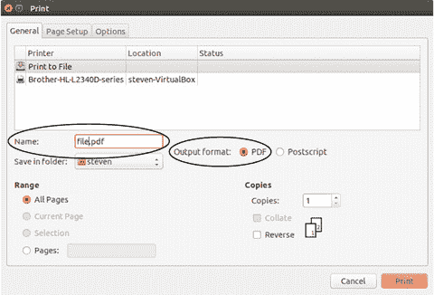
>     
> +   给文件命名并选择 PDF 作为输出格式。

### 21.4\. 总结

我们今天学习了两种安装打印机的办法，一种使用 Ubuntu 打印机工具，另一种使用 CUPS。对于大多数用户来说，Ubuntu 工具就足够了，但如果您打算成为一名打印服务器管理员，或者万一您需要使用一个没有更友好打印工具的系统，了解 CUPS 是很有帮助的。我们还提供了一些帮助您让打印机运行的技巧，具体请见表 21.1。

##### 表 21.1\. 使用 Linux 打印的技巧

| 提示 | 说明 |
| --- | --- |
| 选择仔细 | 如果您使用 Linux 并即将购买打印机，请找一款与之兼容性好的打印机。 |
| 找到 PPD | 如果您能找到 PPD 文件，那么在 Linux 中让打印机工作会容易得多。 |
| 记住双面打印 | 双面打印意味着双面打印。 |
| 寻求帮助 | 如果您遇到麻烦，其他人也遇到过。从他们的痛苦中学习。 |
| “打印” PDFs | 在 Linux 中打印不仅仅是指打印到纸张上。打印实用程序还可以将任何内容转换为 PDF。 |

#### 术语表

在本章中，我解释了：

##### DuplexTumble

打印时的横向布局

##### DuplexNoTumble

打印时的纵向布局

##### PostScript 打印机描述 (PPD)

一种通常可以在打印机制造商网站上找到的打印机驱动程序

### 21.5\. 实验室

在本章中，我们讨论了打印以及为什么它可能在不同操作系统之间构成挑战。

> **1**. 您的打印机工作正常吗？使用 Ubuntu 打印工具打印一个测试页面。如果您的打印机不工作，找出问题并尝试修复它。提示：首先回顾本章关于 PPD 文件的部分。
> 
> **2**. 一旦它开始工作，删除您的打印机并重新安装它，这次使用 CUPS。
> 
> **3**. 打开 Firefox 并将网页打印成 PPD 文件。

## 第二十二章. 非程序员的版本控制

您可能有一个文件夹，里面装满了诸如 importantpresentation.final.odp、importantpresentation.real.final.odp 和 importantpresentation .final.changesfromjen.odp 等文件。文件的创建日期可能有助于您确定哪个是最新版本，但很容易变得混乱。版本控制通过为您跟踪文档版本来解决这一问题。

版本控制是一种让您跟踪电子物品更改的过程。它被那些可能会造成故障的更改的程序员所使用。版本控制允许他们回到最后一个工作版本。但这也适用于协作编辑文档的工作流程。因为您现在对 Linux 了解很多，从安装软件到使用命令行，再到打印，我认为我们可以以版本控制的高级概念作为结束。

在本章中，您将学习如何使用版本控制来协作编辑文档。我们将使用一个名为 Git 的程序来跟踪我们的文件，并使用一个名为 GitLab 的网站来托管它们。Git 是一个完美的工具，因为它是一个可以与图形工具（如文本编辑器）一起使用的命令行工具。换句话说，它使用了您过去一个月一直在学习的大量概念。Git 与 Linux 兼容得很好，是一种您可能已经听说过的流行技术。对于像您这样的 Linux 新手来说，这是一个很好的下一步。

到本章结束时，您将设置好自己的仓库，以便跟踪文件的版本。这在您与他人协作时很有帮助，但即使您单独工作也是如此。让我们通过学习更多关于版本控制的知识来开始吧。

### 22.1. 什么是版本控制？

版本控制允许您跟踪文件的不同版本，无论是代码文件、文字处理文档、图像还是声音文件。只要文件是电子的，版本控制就可以跟踪其变化并记住不同版本。理解版本控制以及它如何帮助您的一个最简单的方法，就是了解我是如何编写这本书并与我的编辑们协作的。

到现在为止，您可能已经猜到了，我写了一本关于一个月内学习 Linux 的书。我独自一人写这本书，但在编辑弗朗西斯和技术编辑加里的帮助下完成了它。他们阅读了我写的每一件事，通过更改、建议和在我手稿中提出问题来使其变得更好。所以我们有三个人在查看和编辑同一份文档。我们如何确保一切井然有序，没有人编辑文件的错误版本？我们使用版本控制。我们的工作流程如下：

> **1**. 我完成写作我的章节，并将我的文件上传到一个只有我们三个人可以访问的中心仓库。
> 
> **2**. 加里和弗朗西斯然后在他们的电脑上运行一个命令，将文件下载到他们的电脑上。
> 
> **3**. 他们完成编辑后上传文件。有时其中一个人先进行更改，然后另一个人下载文件的较新版本。但即使他们同时进行更改，我们的版本控制系统也会为我们协调这些更改。结果是包含两组更改的单个文档。

我们都能进行更改，并轻松地上传和下载文件的最新版本。因此，我们不再通过电子邮件发送不同的草稿，最新版本总是立即可供我们使用。然而，如果更改存在问题，比如有人意外删除了我们决定保留的内容，我们的版本控制系统会跟踪文档的不同版本，所以没有任何东西真正消失。

如我之前提到的，版本控制在与他人协作时非常出色，但即使您单独工作，它也很有帮助。它提供了您文档的历史记录，而无需您保存不同版本的文件。

在这本书的情况下，我们的版本控制工具是 Git。尽管还有其他版本控制工具，比如 Subversion、Mercurial 和 Bazaar。在选择一个时，你会选择一个对你和你的合作者都有意义的工具。如果你合作的每个人都喜欢使用 Subversion，那么使用 Mercurial 就没有太多意义。但就目前而言，让我们使用 Git，因为它很受欢迎，可能在不同的工作场所和所有操作系统上都会被使用。

### 22.2. Git 快速入门

我们已经讨论了 Git 的开发者。他是林纳斯·托瓦兹，也就是开发了 Linux 的人！他创建 Git 是为了帮助我们的朋友，Linux 内核，该内核接受来自世界各地的人的代码。Git 允许多个人对内核进行工作，让托瓦兹接受增强内核的代码并拒绝有缺陷的代码。Git 还保留了内核代码的完整历史，因此以前的版本总是可用，以防发生不应该改变的更改。

关于 Git 的一些令人困惑的事情是它有两个组件：

> **1**. **Git 软件**，你从电脑的命令行使用
> 
> **2**. **Git 仓库**，它们是基于网络的，并持有正在跟踪的内容。

因此，虽然每个使用 Git 软件的人都在使用相同的程序，但内容同步和跟踪的仓库可以不同。如果你停下来思考这个问题，这种设置是有意义的。你有 Git，你本地机器上的一个程序，跟踪文件。但你需要一个地方，让合作者可以看到并访问文件，这就是基于网络的仓库的作用所在。

最受欢迎的仓库可能是 GitHub，它包含了来自许多不同项目的代码，并已成为程序员的一种活生生的简历。但还有其他可以与 Git 一起使用的仓库。我们将使用 GitLab 仓库，我将在下一节中讨论。

在开始使用 Git 进行项目之前，你需要了解一些 Git 的概念。

我将向你展示你需要的一切，以便开始使用它进行一个非常简单的项目，但如果你真的想了解 Git 能做什么，我强烈推荐 Rick Umali（Manning 2015）的《一个月午餐学 Git》。我知道你几乎完成了这本书，你可能在寻找一些午餐时间可以做的事情。

这里有一些你将经常使用的基本命令。

+   `git add` 将文件添加到 Git 中以便跟踪。

+   `git commit` 用于表示你打算将文件提交到仓库。它还允许你为你的更改添加一条消息，以便合作者了解发生了什么变化。在我的情况下，提交信息可能像“2Fixed chart with Git commands”这样的内容。

+   `git push origin master` 将你的更改提交到仓库。（Origin 是我们的在线仓库，master 是我们使用的仓库部分的名字；Git 为我们选择了这些名字。）

+   `git pull`从你的存储库中下载最新的文件版本。这是确保你正在使用最新文件版本的方法。

我们将在本章的后面部分详细介绍这些命令。

为了与他人协作，你需要一个 Git 存储库。在下一节中，你将学习关于存储库的知识，以 GitLab 为例。

### 22.3\. 使用 GitLab 作为存储库

如我所述，有许多基于网络的存储库。有些是托管在服务器上的，但你也可以在自己的服务器上托管自己的存储库。我们将使用 GitLab，因为它允许你创建免费的私有存储库，这意味着全世界的人都无法看到你的文件——只有你的合作者可以看到。GitHub 可能更受欢迎，但私有存储库需要收费，这就是我们不使用它的原因。然而，对于某些项目，你可能需要一个公开的存储库。

开源项目通常有公开的存储库，因为代码需要公开可用，贡献者可以是任何人，而不仅仅是项目运行者所认识的人。但即使是创建非代码项目的人也可能想要一个公开的存储库。如果你正在创建可共享的教育资源，如课程、教学大纲和作业，你可能希望尽可能多的人能够访问，因此你将使用公开存储库来托管它们。任何希望使用你的材料的人都可以轻松下载，但他们也可以提供他们修改后的版本。本质上，你可以开始与从未见过面的人合作！

然而，在本章的目的上，我们将在 GitLab 中创建一个私有存储库。


**创建私有 Git 存储库**

> **1**.  前往 GitLab ([www.gitlab.com](http://www.gitlab.com)) 并创建一个账户。
> 
> **2**.  一旦你确认了你的电子邮件地址，你就可以登录了。
> 
> **3**.  点击新建项目。
> 
> 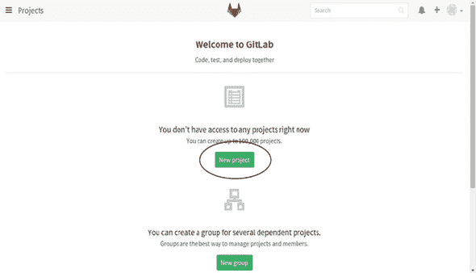
> 
> 我们将在 GitLab 中配置我们的存储库。
> 
> **4**.  确保项目路径以`linuxlunches`结尾，并保持可见性级别为私有，这样在没有你的许可的情况下，没有人能看到你的存储库。
> 
> 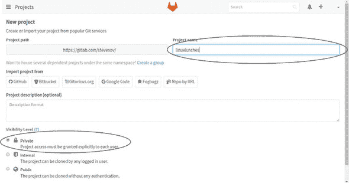
> 
> 将你的新存储库命名为`linuxlunches`并使其为私有。
> 
> **5**.  点击创建项目。
> 
> **6**.  你现在有一个存储库了！


在你能够从命令行使用 Git 之前，你需要将一个 SSH 密钥添加到你的个人资料中。还记得第二十章中的 SSH 吗？SSH 是一种安全地将一台计算机连接到另一台计算机的方式。

这个密钥将帮助 GitLab 授权你使用存储库。这是 Git 和存储库使用的额外安全措施。它允许你无需密码即可对存储库进行身份验证。相反，你的 SSH 服务器将使用你创建的密钥来验证你的身份。

SSH 密钥有两个部分：一个只有您能访问的私钥和一个您可以广泛分享的公钥。这两个密钥一起用来验证您的身份。要添加一个密钥，可以点击页面顶部的链接（见图 22.1）或者访问[`gitlab.com/profile/keys/new`](https://gitlab.com/profile/keys/new)。

##### 图 22.1\. GitLab 要求您为账户添加 SSH 密钥以帮助保持其安全。

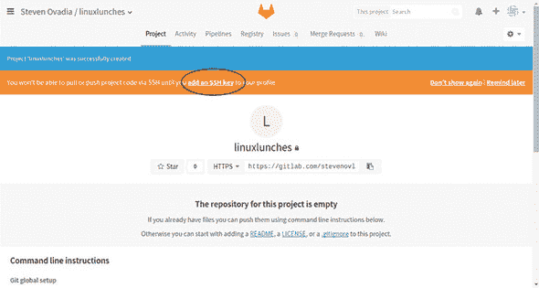

#### 22.3.1\. 为 GitLab 生成 SSH 密钥

要生成 SSH 密钥，我们将回到我们自己的电脑上的 Linux 系统并打开终端：

> **1**.  使用命令`ssh-keygen -t rsa -C` *`"你在 GitLab 账户中使用的电子邮件地址"`*。确保您的电子邮件地址在引号内。
> 
> **2**.  按回车键以在默认位置保存 SSH 文件，这是我们在这个情况下想要的。
> 
> **3**.  为您的密钥创建一个密码，并将其写在安全的地方。
> 
> **4**.  您现在有一个 SSH 密钥，可以帮助 GitLab 确认您的身份。
> 
> **5**.  要生成一个可以安全分享的公钥，使用命令`cat ~/.ssh/id_rsa.pub`。
> 
> **6**.  您将看到一个以`ssh-rsa`开头并以您的电子邮件地址结尾的长字符串。将其复制并粘贴到 GitLab 密钥页面上，然后点击添加密钥。

您已经配置好了 GitLab 仓库。现在，是时候使用 Git 进行工作了。

### 22.4\. 使用 Git 连接到您的仓库

您需要做的第一件事是在您的电脑上安装 Git 包。方便的是，这个包就叫做`git`。

#### 22.4.1\. 创建您的 Git 身份

一旦安装了`git`，您需要告诉 Git 您的身份。您将通过两个命令来完成这个操作。第一个命令将设置您的电子邮件，第二个命令将设置您的名字。这将让您的合作者知道在仓库中谁在做什么：

> **1**.  `git config --global user.email` *`"你的电子邮件地址"`*
> 
> **2**.  `git config --global user.name` *`"你的名字"`*

完成这些后，在您的文档目录中创建一个名为 repo 的文件夹，并通过命令行进入它。这个文件夹就是我们将在 GitLab 中添加我们刚刚创建的仓库的地方。要获取您仓库的地址，进入 GitLab 并点击您项目的链接。您应该看到一个以`git@gitlab.com`开始的 SSH 链接（见图 22.2）。复制这个链接。

##### 图 22.2\. GitLab 会告诉您仓库的地址，您需要告诉 Git。

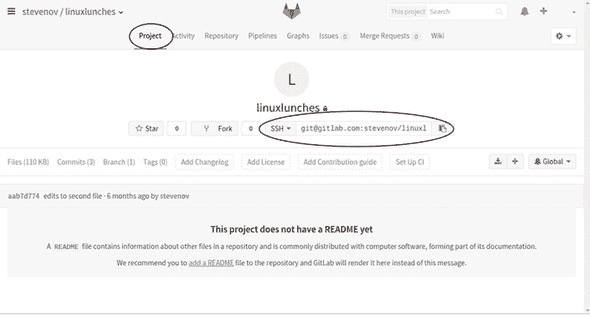

#### 22.4.2\. 克隆仓库

现在我们有了我们仓库的地址，我们可以告诉 Git 克隆它，或者将其复制到我们本地电脑上的那个 repo 目录中。

> **1**.  复制仓库的命令是`git clone`以及您刚刚复制的完整的`*git@gitlab.com*`链接。
> 
> **2**.  您将被要求输入您的密钥密码。幸好您已经将它记在了某个安全的地方！现在您应该在您的仓库文件夹中看到一个 linuxlunches 目录。

#### 22.4.3\. 将文件添加到您的基于 Web 的仓库

当你克隆仓库时，你可能看到了一条消息说它是空的。这没关系。现在让我们添加一个文件。进入 repo 文件夹内的 linuxlunches 目录。创建一个名为 firstfile.txt 的文件。要将它上传到你的仓库：

> **1**. `git add firstfile.txt`。现在 Git 正在跟踪这个文件。
> 
> **2**. 使用 `git commit -m "My first file"`（见图 22.3）准备文件上传。文件现在可以上传到仓库。
> 
> ##### 图 22.3\. 当使用 Git 提交文件时，添加关于你更改的描述性信息是个好习惯。
> ##### 
> 
> 
> **3**. 完成工作，使用命令 `git push origin master`。这将把提交的文件或文件推送到仓库。

通过 Web 界面进入你的 GitLab 仓库并点击文件。你会在仓库中看到你的空文件。你刚刚通过 Git 上传了你的第一个文件！现在，让我们看看如何拉取其他人添加到仓库的文件。

#### 22.4.4\. 从基于 Web 的仓库中拉取文件

由于我们目前还没有与任何人协作，我们可能不需要等待有人向你的仓库添加文件。我们可以自己完成，这次使用 Web 界面：

> **1**. 点击屏幕右侧的加号并添加一个新文件（见图 22.4）。将文件命名为 mysecondfile.txt，在文本框中输入一些文本，并向下滚动以添加提交信息，这是必需的。
> 
> ##### 图 22.4\. 文件也可以通过 GitLab 的 Web 界面添加到仓库中。
> ##### 
> 
> 
> **2**. 然后，点击提交更改。

回到你的 Linux 系统。要获取文件的最新版本，使用 `git pull` 命令。新文件将被下载或拉入你的 linuxlunches 文件夹。这个命令是你知道你在本地计算机上使用最新版本文件的方法。

#### 22.4.5\. 查看文件的历史记录

如我之前提到的，版本控制让你能够跟踪文件的变化。让我们更改一个文件并查看这些更改。回到你的 Linux 系统，打开 mysecondfile.txt 并向其中添加文本。我们将将其上传回我们的仓库。为此，使用之前的相同命令：

> **1**. `git add mysecondfile.txt` 告诉 Git 开始跟踪这个文件。
> 
> **2**. `git commit -m "edits to second file"` 准备文件上传，并附带关于我们更改的消息。
> 
> **3**. `git push origin master` 将文件上传到仓库。

现在我们可以在 GitLab 中查看文件的版本历史：

> **1**. 切换回 GitLab 并点击文件。
> 
> **2**. 点击 mysecondfile.txt。
> 
> **3**. 你会在浏览器中看到文件。点击历史记录（见图 22.5）
> 
> ##### 图 22.5\. 你可以通过 GitLab 的 Web 界面跟踪文件的历史记录。
> ##### 
> 
> 
> **4**. 点击文件列表顶部的最新版本。
> 
> **5**. 你可以看到文件是如何变化的：删除的是红色，以减号开头；添加的是绿色，以加号开头（见图 22.6）。
> 
> ##### 图 22.6。GitLab 显示了你文件的添加和删除。
> ##### 
> 

你可能已经看到了这有多有用。例如，假设你有一个早期的草稿，其中有一个很棒的段落。假设你也删除了那个段落，因为你认为你不需要它。但现在你需要它了！在你的仓库中保存整个文档的历史记录让你可以回过头去抓取你需要的文本——前提是你一直勤奋地将更改推送到仓库。这是一个伟大的安全网，让你可以看到代码和文本是如何随着你的创建而演变的。

这也说明了为什么描述性的提交信息如此重要！它们允许你看到你做了什么，而无需阅读大量的文件。但关于只有你一个人创建文本的情况怎么办？

#### 22.4.6. 分享你的仓库

到目前为止的工作流程对我们来说很好，但如果你像我一样想要分享你的仓库怎么办？例如，假设你与世界上三个不同的人一起制作播客，并且你希望每个人都能为节目笔记做出贡献。在这种情况下，你可能会使用 Git 来协作跟踪脚本。

你可以通过 GitLab 界面添加成员到你的项目：

> **1**. 进入你的项目，点击右侧的齿轮图标，然后选择“成员”（见图 22.7）。
> 
> ##### 图 22.7。GitLab 网页界面允许你添加合作者。
> ##### 
> 
> 
> **2**. 通过姓名或电子邮件搜索你的合作者（见图 22.8）。如果他们有 GitLab 账户，他们就会出现。否则，你会得到一个选项邀请他们加入项目。他们需要创建 GitLab 账户才能访问你的仓库。
> 
> ##### 图 22.8。你可以通过姓名或电子邮件地址搜索合作者。
> ##### 
> 
> 
> **3**. 你还可以选择合作者对仓库的访问级别。如果你想让他们能够拉取你的项目，你需要给他们比访客更高的访问权限。
> 
> **4**. 完成添加合作者后，点击“将用户添加到项目”按钮，你的合作者就设置好了。

### 22.5. 总结

这只是一个非常快速且有限的关于如何使用 Git 进行项目协作的概述。然而，这已经足够让你开始使用 Git 和仓库进行版本控制，无论是单独使用还是与他人协作。虽然像 Git 这样的工具与代码紧密相关，正如你所看到的，你几乎可以用它来做任何事情。我鼓励你尝试使用 Git，因为它是一个了不起的工具。用它来跟踪自己的文档很棒，但如果你与他人合作进行项目，那就更好了。

它让您跟踪文件的历史记录，并且是轻松协作编辑文档的绝佳方式，无需发送数百万封电子邮件或使用基于网络的编辑器，如 Google Docs。如果您想在技术相关领域找到工作，这是一项很好的技能，可以添加到您的简历中。

表 22.1 是今天我涵盖的 Git 命令表。

##### 表 22.1\. Git 命令

| 命令 | 说明 |
| --- | --- |
| git config --global user.email *"你的电子邮件地址"* | 在 Git 中配置您的电子邮件地址 |
| git config --global user.name *"你的名字"* | 在 Git 中配置您的显示名称 |
| git clone *地址库地址* | 将新的仓库复制到您的本地计算机。您在第一次使用新的仓库时使用此命令。 |
| git add | 将文件添加到 Git 中以便跟踪。 |
| git commit | 表明您要将文件提交到仓库的意图，并允许您添加一条消息来总结您的更改。 |
| git push origin master | 将您的更改提交到仓库 |
| git pull | 从您的仓库下载最新版本的文件 |

#### 术语表

在本章中，我解释了：

##### SSH 密钥

一种验证您身份的方法。它由一个只有您才能访问的私钥和一个您可以共享的公钥组成。

##### 版本控制

跟踪电子项目更改的过程。

### 22.6\. 实验室

在本章中，我们学习了如何使用 Git 跟踪我们的文件并将它们托管在 GitLab 上。您的作业是：

> **1**.  从头开始在 GitLab 中创建一个新的公共项目。
> 
> **2**.  从终端将文件推送到项目中。
> 
> **3**.  通过网络界面将文件添加到项目中。
> 
> **4**.  使用 Git 拉取文件。

**Bonus**

使用网络界面使您的项目私有。

## 第二十三章. 永无止境

恭喜！您已经完成了这本书！您现在知道 Linux 了。但学习的旅程并没有结束。接下来会发生什么？这取决于您。

您面前有一个软件、发行版、桌面环境和命令的世界要探索。但面对整个世界有时可能会感到令人生畏。所以在这最后一章中，我会向您指出一些可以应用您新获得知识的地方。但总的来说，我鼓励您：

+   如果您还没有这样做，请通过在硬件上安装 Linux 来跳入 Linux 的世界。虚拟化和实时会话是开始学习 Linux 的绝佳方式，但您会惊讶地发现，当您在专用的硬件上定期使用它时，您能学到更多。是的，偶尔会有一些问题需要调试，但这就是您学习的方式。但如果您像我一样，一旦您全职使用 Linux，您会发现您的工作效率会大大提高，因为您对自己的系统有更多的控制权。

+   尝试不同的发行版和桌面环境。我们使用了 Ubuntu 和 Unity，但正如我提到的，还有许多其他发行版和桌面。尝试新的发行版时，总会有一个学习曲线，如果你尝试的不是基于 Debian 的发行版，比如 Ubuntu，那么曲线会更加陡峭——但我总是从新的发行版中学到一些东西，无论是安装软件的首选方式，还是桌面环境配置的细微差别。我从新的桌面环境中学到的东西也很多。探索新的发行版和桌面可以让你的思维保持开放和灵活，对新计算理念保持敏感。此外，这就像是从你通常的计算机设置中短暂休假，无论那是什么。

当然，直接在硬件上安装 Linux 并尝试新的发行版可能会带来一些挑战。让我们回顾一下去哪里寻求帮助。

### 23.1. 在 Linux 中寻找帮助

我们在 第四章 和本书的其他地方讨论了去哪里寻求帮助。我想在这里回顾一下，这样你就可以把它们都放在一个地方，同时也提醒你，总有大量的帮助和支持可供你选择：

+   我首选的故障排除工具是网络搜索。我会访问我偏好的搜索引擎 DuckDuckGo ([www.duckduckgo.com](http://www.duckduckgo.com))，并搜索问题。通常，错误信息或日志文件中的某些内容可以帮助缩小搜索范围。但我甚至搜索过“sound stuck Ubuntu”这样的问题，看看会返回什么结果。现实是，随着你了解你的硬件和发行版，你会知道哪些方面容易出问题。你也会拥有更好的词汇来描述你特有的问题。

+   UNIX 和 Linux Stack Exchange ([`unix.stackexchange.com/`](http://unix.stackexchange.com/)) 是用户可以投票选择答案的网站。这里的答案往往出现在我的搜索结果中，所以通常没有必要直接在这里搜索。然而，如果我有一个非常技术性的问题，我通常会跳过中间人，直接来这里寻求答案。+Ask Ubuntu_ ([`askubuntu.com/`](http://askubuntu.com/)) 是这个网站的 Ubuntu 专用版本，尽管答案通常适用于其他发行版。

+   ArchWiki ([`wiki.archlinux.org/`](https://wiki.archlinux.org/)) 是一个令人惊叹的全面资源，包含有关配置和安装软件的信息，以及关于某些过程如何在 Linux 中工作的出色解释。虽然它是 Arch Linux 社区的产物，并且有 Arch Linux 的倾向，但其中大部分信息对 *任何* 发行版都很有用。

+   Ubuntu Wiki ([`wiki.ubuntu.com/`](https://wiki.ubuntu.com/))，尽管内容并不完全，范围也相对较窄，但以类似的方式也有帮助——尤其是如果你是 Ubuntu 用户的话。但如果你不是，那么帮助就相对较少。Ubuntu 还有自己的论坛 ([`ubuntuforums.org/`](http://ubuntuforums.org/))。那里的信息可能有点随机。它通常是我最后的求助手段，因为它缺乏 UNIX 和 Linux Stack Exchange 以及 Ask Ubuntu 中的投票功能。然而，Ubuntu 论坛帮助我解决了一些特定的 Ubuntu 问题，所以值得考虑。

+   大多数发行版都有自己的论坛和帮助区域。它们都不如 ArchWiki 精美，但它们是搜索特定发行版帮助的好地方。

+   Manning 论坛 ([`forums.manning.com/`](https://forums.manning.com/)) 是另一个获取帮助的地方，特别是如果你需要关于这本书相关内容的帮助时！

现在你已经完成了这本书，你可能会想知道如何了解新的、酷的 Linux 事物。别担心！我已经涵盖了这一点。

### 23.2. 查找 Linux 新闻

你是如何了解到所有这些 Linux 的有趣功能的？你是如何跟上变化、增强和新项目的？我经常访问以下几个网站：

+   和许多人一样，我从 Twitter 上的 Linux 人士那里获取了很多新闻。如果你是 Twitter 用户，可以关注我 @steven_ovadia。我还有一个 Linux 人士的 Twitter 列表：[`twitter.com/steven_ovadia/lists/linux`](https://twitter.com/steven_ovadia/lists/linux)。

+   LXer ([`lxer.com/`](http://lxer.com/)) 是一个 Linux 新闻聚合器，汇集了来自许多不同 Linux 网站的新闻。它内容全面，但有时会让人感到不知所措。如果你每天只有时间检查一个网站，这可能是你想要检查的网站。

+   Linux 基金会的新闻页面 ([`www.linux.com/news`](https://www.linux.com/news)) 除了新闻外，还有很好的教程、软件和发行版评测。Linux 基金会是一个非营利组织，支持 Linux（实际上支付给林纳斯·托瓦兹以供其工作）并推广 Linux。

+   无论你对 Reddit 怎么看，Linux 子版块 ([www.reddit.com/r/linux/](http://www.reddit.com/r/linux/)) 总是有有趣的链接和新闻。也有针对特定分发的子版块。有些比其他的好。例如，不太受欢迎的分发的子版块往往比较安静。我大部分时间都在 Linux 子版块，而且我觉得我没有错过太多。

+   Opensource.com ([`opensource.com/`](https://opensource.com/)) 由 Red Hat 支持，这是一家为公司创建和支持 Linux 分发的公司。它也是 Fedora 背后的公司之一，我们在第二章中讨论过的 Linux 分发之一。Opensource.com 并非纯粹是 Linux 新闻。然而，由于它专注于免费和开源软件，很多内容都以某种方式与 Linux 相关。

+   我的 Linux Rig([`mylinuxrig.com/`](http://mylinuxrig.com/))是我的 Linux 博客。这里有 Linux 新闻，我还采访了 Linux 用户关于他们的 Linux 配置，这样你可以了解人们在使用 Linux 系统时使用哪些工具。我建立这个网站是因为我总是很好奇人们如何配置他们的 Linux 系统。如果你曾在咖啡馆里好奇地盯着某人的笔记本电脑配置，试图弄清楚他们在使用什么，你可能喜欢这个网站。

尽管 Linux 不仅仅是一个有趣的爱好，你还可以以此为职业。我们将在下一节讨论如何实现这一目标的一些途径。

### 23.3\. 在专业领域使用 Linux

系统管理是希望专业使用 Linux 的人的一个常见职业路径。系统管理员，或称 SysAdmin，负责保持服务器运行。他们无处不在，从银行到医院到证券交易所。虽然这个月我们讨论了很多，但你可能还不知道足够多，可以直接进入这个领域。但你现在知道得足够多了，可以开始为其中一个认证学习。

#### 23.3.1\. 你需要认证吗？

我既不在 IT 行业工作，也不作为 SysAdmin 工作，所以我问了一些我的 SysAdmin 朋友们。他们说，认证并不总是必要的，但在大型公司中通常都是必需的。像初创公司这样的小公司可能更感兴趣的是你的技能和经验。所以，如果你从这本书开始自学系统管理，你可能符合某些工作的资格。

#### 23.3.2\. 哪个认证？

一些主要的 Linux 认证包括：

+   Red Hat([www.redhat.com/en/services/certification](http://www.redhat.com/en/services/certification))

+   Linux 专业学院([www.lpi.org/our-certifications/summary-of-certifications](http://www.lpi.org/our-certifications/summary-of-certifications))

+   Linux+([`certification.comptia.org/certifications/linux`](https://certification.comptia.org/certifications/linux))

+   Oracle Linux([`education.oracle.com/`](http://education.oracle.com/))

+   Linux 基金会([`training.linuxfoundation.org/certification`](https://training.linuxfoundation.org/certification))。

大多数朋友都推荐各种 Red Hat 认证，因为它们广为人知且受到尊重，需要实际操作知识，而不仅仅是考试。然而，如果你是刚开始，Red Hat 认证可能有点高级。

在那种情况下，他们推荐 Linux+认证，这比 Red Hat 认证更通用。Linux+是一套三个认证，所以如果你通过了，你也将获得 Linux 专业学院的 LPIC-1 认证和 SUSE 认证的 Linux 管理员认证。在 Linux+之后，如果你想要的话，你将更有利于继续获得 Red Hat 认证。但你也可能能够使用 Linux+认证在一家较小的公司找到工作，在那里你可以在工作中提升你的系统管理员技能。

在确定哪种认证适合你之后，就是学习考试、利用培训材料，甚至可能参加一个在线或面对面的课程的问题。每个认证网站都有链接，可以帮你找到你想要的培训，尽管培训不是免费的。

对于许多想成为系统管理员的人来说，挑战是适应 Linux。你的优势是你已经习惯了它！你已经花了一个月的时间使用它！所以，如果你想要的话，你已经为你在职业生涯中的下一步做好了充分的准备。

我鼓励你和你所在城市的系统管理员交谈。询问你所在地区的市场情况，并询问他们认为哪些认证很重要。这不仅会让你获得关于当地就业市场的宝贵信息，而且你还会遇到可能最终雇佣你的人！

### 23.4. 总结

现在我要说的最后一句话。我想提醒你，你可以在不成为系统管理员的情况下专业地使用 Linux。我是一名学术图书馆员，我使用 Linux 来完成所有的研究和写作（包括这本书的写作）。有很多非技术人士使用 Linux 来完成他们的专业工作：

+   有记者用它来写作。

+   有音乐家使用 Linux 来创作和录制音乐。

+   有一些艺术家使用 Linux 来创建标志、编辑照片等一切事情。

他们出于许多原因使用它。对一些人来说，Linux 代表了一种省钱的方式，因为它免费且在旧硬件上运行良好。其他人选择 Linux 是因为它可定制，允许你选择和调整你的计算体验。还有其他人使用 Linux 是因为他们与免费和开源软件的美学产生了共鸣。

我希望你现在看到了 Linux 的潜力，并让它成为你日常生活的一部分。也许它将成为你作为系统管理员的日常生活的一部分，但正如你现在所看到的，它也可以成为你作为教师、小企业主或物业经理的日常生活的一部分。如果你用电脑工作，Linux 可以推动你的工作前进！
