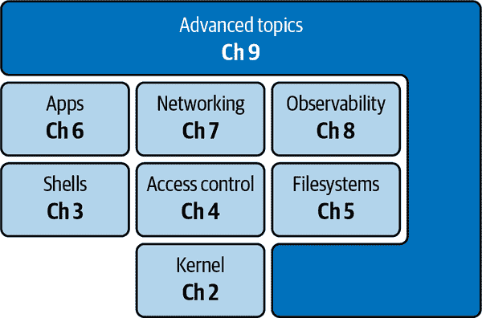

# 第一章：介绍 Linux

Linux 是目前被广泛使用的操作系统，应用范围从移动设备到云端。

你可能对操作系统的概念并不熟悉。或者你可能在使用像微软 Windows 这样的操作系统，而并未深究其背后。或者你可能是 Linux 的新手。为了让你有正确的认知和心态，本章将从鸟瞰视角来看操作系统和 Linux。

我们将首先讨论本书背景下*现代*的含义。然后，我们将回顾 Linux 在过去 30 年中的重要事件和阶段。此外，在本章中，你将了解操作系统的角色及 Linux 如何充当这一角色。我们还会快速浏览 Linux 发行版以及资源可见性的概念。

如果你对操作系统和 Linux 还不太了解，建议你阅读整章。如果你已经对 Linux 有经验，可以直接跳到“Linux 的一万英尺视角”，这部分提供了视觉概述并与本书章节进行了对应。

但在深入技术细节之前，让我们先稍微退后一步，专注于我们说“现代 Linux”时的含义。这其实是一个非常复杂的问题。

# 现代环境是什么？

书名明确指定为*现代*，但这到底意味着什么呢？在本书的背景下，这可以涵盖从云计算到树莓派等任何内容。此外，Docker 及其相关基础设施的最新发展，显著改变了开发人员和基础设施运营者的情景。

让我们更详细地了解一些现代环境及 Linux 在其中扮演的重要角色：

移动设备

当我对孩子们说“手机”时，他们会说，“与什么相比？”老实说，在今天，许多手机——根据不同人的说法，高达 80%或更多——以及平板电脑都运行着 Android，这是一个[Linux 变体](https://oreil.ly/bQ6yJ)。这些环境在功耗和稳定性方面有着极高的要求，因为我们每天都依赖它们。如果你对开发 Android 应用感兴趣，请考虑访问[Android 开发者网站](https://oreil.ly/xf5kC)获取更多信息。

云计算

在云端，我们看到类似于移动和微空间的规模模式。有新的、强大的、安全的和节能的 CPU 架构，例如成功的基于 ARM 的[AWS Graviton](https://oreil.ly/JzHzm)产品，以及在开源软件环境中特别是在云提供商领域的成熟的大型外包服务。

物联网（智能设备）

我相信你已经看到了许多与物联网（IoT）相关的项目和产品，从传感器到无人机。我们许多人已经接触过智能家电和智能汽车。这些环境对功耗有更高的要求，甚至可能不是一直运行，比如每天只唤醒一次以传输一些数据。这些环境的另一个重要方面是[实时能力](https://oreil.ly/zBsRy)。如果您有兴趣在 IoT 环境中开始使用 Linux，请考虑[AWS IoT EduKit](https://oreil.ly/3x0uf)。

处理器架构的多样性

在过去大约 30 年中，Intel 一直是领先的 CPU 制造商，主导微型计算机和个人计算机领域。Intel 的 x86 架构被视为金标准。IBM 采取的开放方式（发布规格并使其他人能够提供兼容设备）前景广阔，导致了使用 Intel 芯片的 x86 克隆机，至少在最初是这样的。

尽管 Intel 在台式机和笔记本系统中仍然广泛使用，但随着移动设备的兴起，我们看到了[ARM 架构](https://oreil.ly/sioDd)和最近的[RISC-V](https://oreil.ly/Tf0bb)的日益普及。同时，像 Go 或 Rust 这样的多架构编程语言和工具也越来越普及，形成了一场完美的风暴。

所有这些环境都是我认为的现代环境的例子。几乎所有这些环境都以某种形式运行或使用 Linux。

现在我们了解了现代（硬件）系统，您可能想知道我们是如何到达这里的，以及 Linux 是如何产生的。

# Linux 的故事（到目前为止）

Linux 在 2021 年庆祝了[30 岁的生日](https://oreil.ly/fkMyT)。拥有数十亿用户和数千名开发人员，Linux 项目毫无疑问是一个全球（开源）成功故事。但是这一切是如何开始的，我们又是如何走到今天的呢？

1990 年代

我们可以将 Linus Torvalds 于 1991 年 8 月 25 日在`comp.os.minix`新闻组中发布的电子邮件视为 Linux 项目诞生的公开记录。这个业余项目很快就起飞了，无论是在代码行数（LOC）还是采纳率方面。例如，不到三年时间，Linux 1.0.0 发布，代码行数超过 176,000 行。到那时，实现运行大多数 Unix/GNU 软件的最初目标已经实现。此外，上世纪 90 年代出现了第一个商业版本：Red Hat Linux。

2000 年至 2010 年

作为一个“青少年”，Linux 不仅在功能和支持的硬件方面日益成熟，而且超越了 UNIX 的能力。在这个时期，我们还见证了 Linux 被 Google、Amazon、IBM 等大公司广泛采纳，并且采纳程度不断增加。这也是[发行版之战](https://oreil.ly/l6X4Q)的高峰期，导致企业改变了他们的方向。

2010 年至今

Linux 在数据中心和云端以及各种物联网设备和手机中确立了自己的地位。从某种意义上说，可以认为发行版之战已经结束（现在，大多数商业系统都基于 Red Hat 或 Debian），而容器的兴起（从 2014/15 年开始）促成了这一发展。

通过这个超快的历史回顾，有必要来设定背景并理解本书的范围的动机，我们继续看一个看似无辜的问题：为什么任何人都需要 Linux，或者说需要操作系统？

# 为什么需要操作系统？

假设你没有可用的操作系统（OS），或者由于任何原因无法使用它。那么你最终会自己做几乎所有的事情：内存管理，中断处理，与 I/O 设备通信，文件管理，配置和管理网络堆栈——列举的列表还在继续。

###### 注意

从技术上讲，操作系统并非绝对必要。有一些系统并没有操作系统。这些通常是具有微小足迹的嵌入式系统：比如物联网信标。它们简单地没有足够的资源来保留除一个应用程序之外的任何其他东西。例如，使用 Rust，你可以使用其核心和标准库在[裸机](https://oreil.ly/zW4j7)上运行任何应用程序。

操作系统承担所有这些未区分的重活，抽象掉不同的硬件组件，并为您提供（通常是）干净和设计良好的应用程序编程接口（API），例如 Linux 内核的情况，我们将在第二章中更详细地查看。我们通常称这些操作系统暴露的 API 为*系统调用*，或简称为*syscalls*。高级编程语言如 Go、Rust、Python 或 Java 建立在这些 syscalls 的基础上，可能将它们包装在库中。

所有这些使您能够专注于业务逻辑，而不必自己管理资源，同时也能处理您希望在其上运行应用程序的不同硬件。

让我们来看一个系统调用的具体例子。假设我们想要识别（并打印）当前用户的 ID。

首先，我们看看 Linux 系统调用[`getuid(2)`](https://oreil.ly/md15Z)：

```
...
getuid() returns the real user ID of the calling process.
...
```

好的，所以这个`getuid`系统调用是我们可以从库中编程使用的。我们将在“系统调用”中更详细地讨论 Linux 系统调用。

###### 注意

你可能会想知道`getuid(2)`中的`(2)`代表什么。这是`man`实用程序（类似于内置帮助页面）用来指示分配给`man`命令的部分的术语，类似于邮政或国家代码。这是 Unix 遗产显现出来的一个例子；你可以在[*Unix Programmer’s Manual*，第七版，卷 1](https://oreil.ly/DgDrF)中找到其起源，1979 年。

在命令行（shell）中，我们将使用等效的`id`命令，该命令进而使用`getuid`系统调用：

```
$ id --user
638114
```

现在，你对为什么在大多数情况下使用操作系统有了基本的理解，让我们继续讨论 Linux 发行版的主题。

# Linux 发行版

当我们说“Linux”时，可能不会立即明白我们的意思。在本书中，当我们说“Linux 内核”或者只说“内核”时，我们指的是系统调用和设备驱动程序的集合。此外，当我们提到[Linux 发行版](https://oreil.ly/U9luq)（简称*distros*）时，我们指的是一种具体的内核及相关组件捆绑，包括包管理器、文件系统布局、init 系统和一个为您预先选择的 Shell。

当然，你也可以自己动手：你可以下载并编译内核，选择一个包管理器等等，并创建（或者说*roll*出）自己的发行版。许多人在早期就是这样做的。多年来，人们逐渐意识到，把这些打包（以及安全补丁）交给专家（无论是私人还是商业）处理，并简单使用生成的 Linux 发行版，是更好的时间利用方式。

###### 提示

如果你有意打造自己的发行版，也许是因为你喜欢动手或因为出于某些业务限制，我建议你仔细研究[Arch Linux](https://oreil.ly/UBSHM)，它能让你掌控一切，并且通过一点努力，你可以创建一个非常定制化的 Linux 发行版。

要感受发行版空间的广阔，包括传统的发行版（如 Ubuntu、Red Hat Enterprise Linux [RHEL]、CentOS 等，详见第六章）和现代的发行版（如 Bottlerocket 和 Flatcar；详见第九章），请访问[DistroWatch](https://oreil.ly/DWmrr)。

关于发行版的话题讨论完毕，让我们转移到一个完全不同的话题：资源及其可见性与隔离。

# 资源可见性

Linux 一直以来，在 UNIX 的传统下，默认具有全局视图的资源观念。这带来了一个问题：*全局视图*意味着什么（与之相对的是什么？），以及这些资源是什么？

###### 注意

首先，为什么我们在这里讨论资源可见性？主要原因是提高对这个主题的认识，并帮助您进入正确的思维状态，以便理解现代 Linux 背景下的重要主题之一：容器。如果现在您还没有完全理解所有细节，不要担心；我们将在整本书中以及特别是第六章中多次回到这个主题，详细讨论容器及其构建块。

你可能听说过在 Unix 中，以及扩展到 Linux，一切皆为文件的说法。在本书的背景下，我们认为资源是任何可以用来辅助软件执行的东西。这包括硬件及其抽象（如 CPU 和 RAM，文件），文件系统，硬盘驱动器，固态硬盘（SSD），进程，与网络相关的设备或路由表，以及代表用户的凭据。

###### 警告

在 Linux 中，并非所有资源都是文件或通过文件接口表示。但是，有一些系统（如 [Plan 9](https://oreil.ly/5DkY8)）推动这一点更进一步。

让我们看看一些 Linux 资源的具体示例。首先，我们想查询一个全局属性（Linux 版本），然后查询正在使用的 CPU 的特定硬件信息（输出已编辑以适应空间）：

```
$ cat /proc/version 
Linux version 5.4.0-81-generic (buildd@lgw01-amd64-051)
(gcc version 7.5.0 (Ubuntu 7.5.0-3ubuntu1~18.04))
#91~18.04.1-Ubuntu SMP Fri Jul 23 13:36:29 UTC 2021 
$ cat /proc/cpuinfo | grep "model name" 
model name      : Intel Core Processor (Haswell, no TSX, IBRS)
model name      : Intel Core Processor (Haswell, no TSX, IBRS)
model name      : Intel Core Processor (Haswell, no TSX, IBRS)
model name      : Intel Core Processor (Haswell, no TSX, IBRS)
```


打印 Linux 版本。


打印与模型相关的 CPU 信息。

通过前述命令，我们了解到该系统有四个英特尔 i7 核心可供使用。当您使用不同用户登录时，您是否期望看到相同数量的 CPU？

让我们考虑一种不同类型的资源：文件。例如，如果用户 `troy` 在 `/tmp/myfile` 下创建一个有权限进行此操作的文件（“权限”），另一个用户 `worf` 是否能看到这个文件或者能够对其进行写入？

或者，以进程为例，即存储在内存中具有运行所需所有必要资源的程序，如 CPU 和内存。Linux 使用其 *进程 ID* 或简称 `PID` 来标识进程（详见 “进程管理”）：

```
$ cat /proc/$$/status | head -n6 
Name:   bash
Umask:  0002
State:  S (sleeping)
Tgid:   2056
Ngid:   0
Pid:    2056
```


打印进程状态，即当前进程的详细信息，并将输出限制为仅显示前六行。

在 Linux 中可以有多个具有相同 `PID` 的进程吗？这可能听起来像是一个愚蠢或无用的问题，但事实证明这是容器的基础（详见 “容器”）。答案是可以的，可以在不同的上下文中称为 *命名空间*（详见 “Linux 命名空间”）中有多个具有相同 `PID` 的进程，例如在 Docker 或 Kubernetes 中运行应用时。

每个单独的进程可能会认为自己很特殊，具有 `PID 1`，在更传统的设置中，这是为用户空间进程树的根保留的位置（详见 “Linux 启动过程”）。

从这些观察中我们可以得出的结论是，对于给定的资源可以有全局视图（两个用户在同一位置看到一个文件）以及本地或虚拟化视图，例如进程示例。这引出了一个问题：在 Linux 中，默认情况下是否所有内容都是全局的？剧透：并不是。让我们仔细看看。

并行运行多个用户或进程的错觉的一部分是（受限）对资源的可见性。在 Linux 中，提供对（某些支持的）资源的本地视图的方法是通过命名空间（详见 “Linux 命名空间”）。

另一个独立的维度是隔离。当我在这里使用“隔离”一词时，并不一定对其进行限定——也就是说，我不假设事物的隔离程度如何。例如，考虑进程隔离的一种方式是限制内存消耗，以使一个进程不能使其他进程饥饿。例如，我给你的应用分配了 1 GB 的 RAM 来使用。如果它使用更多，就会被 [内存不足](https://oreil.ly/kvk1u) 杀掉。这提供了一定程度的保护。在 Linux 中，我们使用一个称为 `cgroups` 的内核特性来提供这种隔离，你将在 “Linux cgroups” 中进一步了解它。

另一方面，一个完全隔离的环境给人的感觉是应用程序完全独立运行。例如，虚拟机（VM；见 “虚拟机”）可以用来提供完全的隔离。

# Linux 的一万英尺视图

哇，我们已经深入到了复杂的细节中。是时候深呼吸并重新聚焦了。在 图 1-1 中，我试图为您提供 Linux 操作系统的高级概述，将其映射到书的各章节。



###### 图 1-1\. 将 Linux 操作系统映射到书的章节

从其核心来看，任何 Linux 发行版都有内核，提供一切构建的 API。文件、网络和可观察性这三个核心主题随处可见，你可以将它们视为内核之上最基本的构建模块。从纯使用角度来看，你很快会发现，你最常处理的是 shell（这个应用的输出文件在哪里？）和与访问控制相关的事物（为什么这个应用程序崩溃了？啊，这个目录是只读的，笨！）。

顺便说一下：我在 第九章 中收集了一些有趣的话题，从虚拟机到现代发行版，我称这些话题为“高级”主要是因为我认为它们是可选的。也就是说，你可以不学习它们也能应付过去。但是，如果你真的、真的、真的想要充分利用现代 Linux 所能提供的全部功能，我强烈建议你阅读 第九章。我想这不言而喻，按设计，书中的其他部分——从 第二章 到 第八章——是你绝对应该学习和应用其内容的必要章节。

# 结论

当我们在本书的背景下称某些东西为“现代”时，我们指的是在现代环境中使用 Linux，包括手机、数据中心（公共云提供商）和嵌入式系统，比如树莓派。

在本章中，我分享了 Linux 背景的高层次版本。我们讨论了操作系统的一般角色——抽象化底层硬件并为应用程序提供一组基本功能，如进程、内存、文件和网络管理——以及 Linux 如何在这一任务中进行操作，特别是关于资源可见性的方面。

以下资源将帮助您继续加快学习速度，并深入探讨本章讨论的概念：

O’Reilly 的其他书籍

+   [*Linux Cookbook*](https://oreil.ly/4Y90O) 由卡拉·施罗德编著

+   [*深入理解 Linux 内核*](https://oreil.ly/aJYyj) 由丹尼尔·P·博韦特和马可·切萨蒂编著

+   [*高效 Linux 命令行*](https://oreil.ly/nWCch) 由丹尼尔·J·巴雷特编著

+   [*Linux 系统编程*](https://oreil.ly/fh85i) 由罗伯特·洛夫编著

其他资源

+   [UNIX 环境高级编程](https://oreil.ly/hS0G0) 是一门完整的课程，提供入门材料和实践练习。

+   [“UNIX 的诞生”](https://oreil.ly/MlQ0J) 与布莱恩·科尼汉是了解 Linux 传承的重要资源，为原始 UNIX 概念提供背景。

现在，毫不拖泥带水地：让我们开始探索现代 Linux 的核心——嗯，内核，事情的要点！
