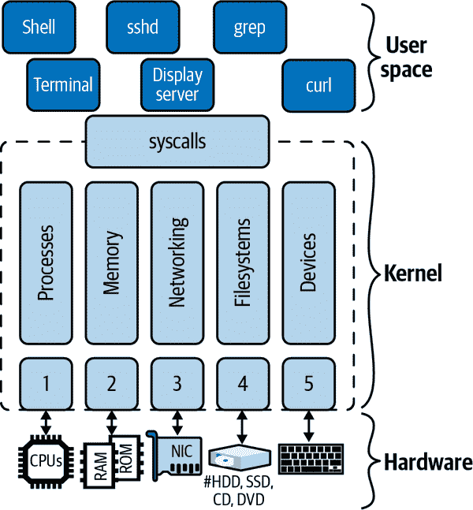
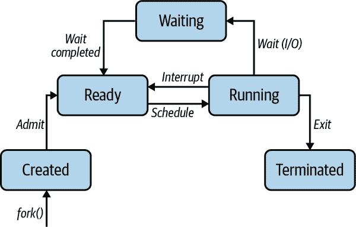
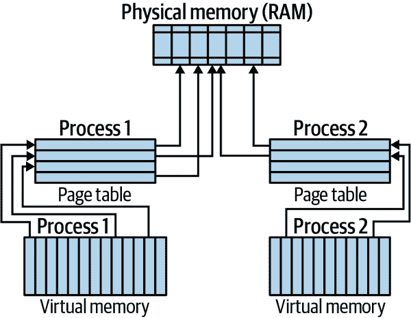
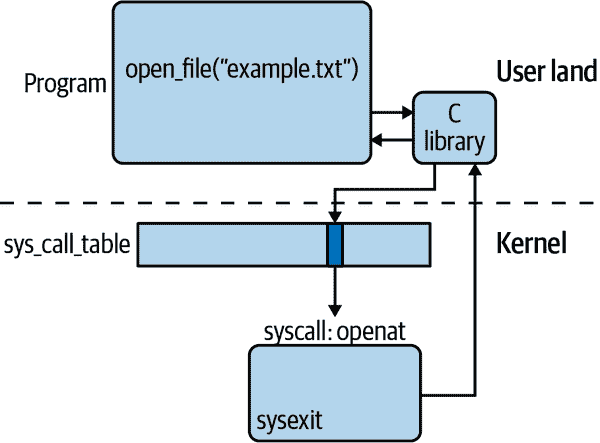
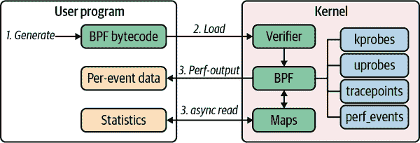

# 第二章：Linux 内核

在"为什么需要操作系统？"中，我们了解到操作系统的主要功能是在不同的硬件之上提供抽象，并为我们提供 API。通过编程调用这个 API，我们可以编写应用程序，而不必担心它们在何处以及如何执行。简而言之，内核为程序提供了这样的 API。

在本章中，我们将讨论 Linux 内核是什么，以及您应该如何整体思考它及其组成部分。您将了解 Linux 整体架构以及 Linux 内核的基本作用。本章的一个主要要点是，虽然内核提供了所有核心功能，但它本身并不是操作系统，而只是其中非常核心的一部分。

首先，我们俯瞰全局，看看内核如何适应并与底层硬件交互。然后，我们回顾计算核心，讨论不同的 CPU 架构及其与内核的关系。接下来，我们放大内核的各个组件，并讨论内核为您可以运行的程序提供的 API。最后，我们看看如何定制和扩展 Linux 内核。

本章的目的是为您提供必要的术语，让您了解程序与内核之间的接口，并让您基本了解功能是什么。本章的目标不是让您成为内核开发人员，甚至不是系统管理员配置和编译内核。但是，如果您有兴趣深入研究，我在章节末尾提供了一些指引。

现在，让我们深入探讨：Linux 架构及内核在这一背景下的中心作用。

# Linux 架构

在高层次上，Linux 架构看起来如图 2-1 所示。您可以将事物分为三个不同的层次：

硬件

从 CPU 和主存储器到磁盘驱动器、网络接口和诸如键盘和显示器等外围设备。

内核

本章剩余部分的重点。请注意，还有一些组件位于内核和用户空间之间，如初始化系统和系统服务（网络等），但严格来说，它们不是内核的一部分。

用户空间

大多数应用程序运行的地方，包括操作系统组件如 shell（在第三章中讨论）、诸如`ps`或`ssh`之类的实用程序，以及基于 X Window 系统的图形用户界面桌面。

本书重点讨论图 2-1 中的上两层，即内核和用户空间。在这本书的本章和其他几章中，我们只会涉及硬件层面，涉及相关内容。

不同层次之间的接口已经明确定义，并且是 Linux 操作系统包的一部分。在内核和用户空间之间的接口称为*系统调用*（简称*syscalls*）。我们将在“系统调用”中详细探讨这一点。

与系统调用不同，硬件与内核之间的接口不是单一的。它由多个个体接口组成，通常按硬件分组：

1.  CPU 接口（见“CPU 架构”）

1.  与主存储器的接口，详见“内存管理”

1.  网络接口和驱动程序（有线和无线；见“网络”）

1.  文件系统和块设备驱动程序接口（见“文件系统”）

1.  字符设备、硬件中断和设备驱动程序，适用于键盘、终端和其他 I/O 输入设备（见“设备驱动程序”）



###### 图 2-1\. Linux 架构的高级视图

正如您所见，许多我们通常认为属于 Linux 操作系统一部分的东西，比如 shell 或诸如 `grep`、`find` 和 `ping` 等实用程序，实际上并不是内核的一部分，而更像是您下载的应用程序，属于用户空间。

在用户空间的讨论中，您经常会读到或听到用户与内核模式的区别。这实际上指的是对硬件访问的特权以及可用的抽象受到的限制程度。

一般而言，*内核模式*意味着快速执行但抽象化程度有限，而*用户模式*则意味着相对较慢但更安全和更便捷的抽象化。除非您是[内核开发者](https://oreil.ly/AhAm6)，否则几乎可以忽略内核模式，因为所有应用程序都将在用户空间运行。然而，了解如何与内核交互（见“系统调用”）对我们的考虑至关重要。

现在 Linux 架构概述已经介绍完毕，让我们从硬件开始逐步深入。

# CPU 架构

在讨论内核组件之前，让我们回顾一个基本概念：计算机体系结构或 CPU 家族，我们将这两个术语视为同义词使用。Linux 可以运行在众多不同的 CPU 架构上，这无疑是其如此受欢迎的原因之一。

除了通用代码和驱动程序，Linux 内核还包含特定于体系结构的代码。这种分离使得能够迅速将 Linux 移植并应用于新硬件。

有多种方法可以确定您的 Linux 运行在哪种 CPU 上。让我们依次看看几种。

一种方法是使用称为 `dmidecode` 的专用工具与 BIOS 进行交互。如果这不起作用，您可以尝试以下方法（输出已缩短）：

```
$ lscpu
Architecture:                x86_64 
CPU op-mode(s):              32-bit, 64-bit
Byte Order:                  Little Endian
Address sizes:               40 bits physical, 48 bits virtual
CPU(s):                      4 
On-line CPU(s) list:         0-3
Thread(s) per core:          1
Core(s) per socket:          4
Socket(s):                   1
NUMA node(s):                1
Vendor ID:                   GenuineIntel
CPU family:                  6
Model:                       60
Model name:                  Intel Core Processor (Haswell, no TSX, IBRS) 
Stepping:                    1
CPU MHz:                     2592.094
...
```


我们所关注的架构是 `x86_64`。


看起来有四个可用的 CPU。


CPU 型号名称是英特尔酷睿处理器（Haswell）。

在前面的命令中，我们看到 CPU 架构被报告为 `x86_64`，型号报告为“英特尔酷睿处理器（Haswell）”。我们稍后将更多了解如何解码这些信息。

另一种获取类似架构信息的方式是使用 `cat /proc/cpuinfo`，或者，如果你只关心架构，可以简单地调用 `uname -m`。

现在我们掌握了如何在 Linux 上查询架构信息，让我们看看如何解码它。

## x86 架构

[x86](https://oreil.ly/PoQOT) 是最初由英特尔开发并后来许可给了 AMD 的指令集系列。在内核中，`x64` 指的是英特尔的 64 位处理器，`x86` 表示英特尔的 32 位处理器。此外，`amd64` 指的是 AMD 的 64 位处理器。

如今，在桌面和笔记本电脑中主要使用 x86 CPU 家族，但它也广泛用于服务器。具体来说，`x86` 架构构成了公共云的基础。它是一种强大且广泛可用的架构，但能效不高。部分原因是它严重依赖乱序执行，最近因安全问题（如[Meltdown](https://oreil.ly/nkEVB)）而受到广泛关注。

欲了解更多详细信息，例如 Linux/x86 引导协议或英特尔和 AMD 特定的背景，请参阅[x86 特定的内核文档](https://oreil.ly/CBvRQ)。

## ARM 架构

超过 30 年历史的[ARM](https://oreil.ly/E9HIN) 是一系列精简指令集计算（RISC）架构。RISC 通常包括许多通用 CPU 寄存器以及可以更快执行的一小组指令。

由于 Acorn 公司——ARM 背后的原始公司——从一开始就专注于最小功耗，你可以在许多便携设备中找到基于 ARM 的芯片，如 iPhone。它们也广泛用于大多数基于 Android 的手机和嵌入式系统中的物联网设备，如树莓派。

考虑到它们快速、廉价且产热量比 x86 芯片少，你不应对在数据中心中越来越多地发现基于 ARM 的 CPU（例如[AWS Graviton](https://oreil.ly/JpgdQ)）感到意外。虽然比 x86 简单，但 ARM 并非不受漏洞影响，例如[Spectre](https://oreil.ly/M79Yu)。有关详细信息，请参阅[ARM 特定的内核文档](https://oreil.ly/i7kj4)。

## RISC-V 架构

一个新兴的玩家，[RISC-V（发音为 *risk five*）](https://oreil.ly/wwnIA) 是一个开放的 RISC 标准，最初由加州大学伯克利分校开发。截至 2021 年，已存在多种实现，从阿里巴巴集团和英伟达到初创公司如 SiFive。尽管令人兴奋，这是一个相对新的且尚未广泛使用的 CPU 家族，想要了解其外观和感觉，你可能需要进行一些研究——一个好的开始是 Shae Erisson 的文章 [“Linux on RISC-V”](https://oreil.ly/6senY)。

要获取更多详细信息，请参阅[RISC-V 内核文档](https://oreil.ly/LA1Oq)。

# 内核组件

现在您已经了解了 CPU 架构的基础知识，是时候深入研究内核了。尽管 Linux 内核是一个单体内核，也就是说，所有讨论的组件都是单个二进制文件的一部分，但我们可以在代码库中识别并分配专门的功能区域。

正如我们在“Linux 架构”中讨论过的那样，内核位于硬件和您想要运行的应用程序之间。内核代码库中的主要功能模块如下：

+   进程管理，例如基于可执行文件启动进程

+   内存管理，例如为进程分配内存或将文件映射到内存中

+   网络，如管理网络接口或提供网络栈

+   提供文件管理并支持文件的创建和删除的文件系统

+   字符设备和设备驱动程序的管理

这些功能组件通常伴随着相互依赖关系，并确保“内核永不破坏用户空间”的[内核开发者格言](https://oreil.ly/6YDeF)是一项真正具有挑战性的任务。

有了这些了解之后，让我们更仔细地看看内核组件。

## 进程管理

内核中有许多与进程管理相关的部分。其中一些部分处理与 CPU 架构特定的事务，例如中断，而其他部分专注于程序的启动和调度。

在深入了解 Linux 具体细节之前，让我们注意到，通常情况下，一个进程是用户界面单元，基于可执行程序（或二进制文件）。另一方面，线程是在进程上下文中的执行单元。您可能听说过 *多线程* 这个术语，它意味着一个进程有多个并行执行，可能在不同的 CPU 上运行。

有了这个总体视图之后，让我们看看 Linux 是如何实现的。从最精细到最小单元，Linux 有以下几个方面：

会话

包含一个或多个进程组，并代表一个高级用户界面单元，可以选择连接 `tty`。内核通过称为 *会话 ID*（SID）的数字标识会话。

进程组

包含一个或多个进程，会话中至多有一个作为前台进程组的进程组。内核通过称为 *进程组 ID*（PGID）的数字标识进程组。

进程

抽象出多个资源（地址空间、一个或多个线程、套接字等），内核通过 */proc/self* 为当前进程向您公开。内核通过称为 *进程 ID*（PID）的数字标识进程。

线程

由内核实现为进程。也就是说，没有专门表示线程的数据结构。相反，线程是与其他进程共享某些资源（如内存或信号处理程序）的进程。内核通过*线程 ID*（TID）和*线程组 ID*（TGID）来识别线程，共享 TGID 值意味着一个多线程的进程（在用户空间；还有内核线程，但这超出了我们的范围）。

任务

在内核中有一个称为`task_struct`的数据结构——在[*sched.h*](https://oreil.ly/nIgz8)中定义——它是实现进程和线程的基础。该数据结构包含调度相关信息、标识符（如 PID 和 TGID）、信号处理程序，以及与性能和安全性相关的其他信息。简而言之，所有前述的单元都源自和/或锚定在任务中；然而，在内核外部并没有直接暴露任务。

我们将在第六章中看到会话、进程组和进程的实际运作方式，并学习如何管理它们，并且它们将再次出现在第九章中，关于容器的上下文中。

让我们看看这些概念如何实际运作：

```
$ ps -j
PID    PGID   SID   TTY     TIME CMD
6756   6756   6756  pts/0   00:00:00 bash 
6790   6790   6756  pts/0   00:00:00 ps 
```


`bash` shell 进程的 PID、PGID 和 SID 是 6756。从`ls -al /proc/6756/task/6756/`可以获取任务级别的信息。


`ps` 进程的 PID/PGID 是 6790，与 shell 相同的 SID。

我们之前提到在 Linux 中任务数据结构中随时可获得一些与调度相关的信息。这意味着在任何给定时间，进程处于特定状态，如图 2-2 所示。



###### 图 2-2\. Linux 进程状态

###### 注

严格来说，进程状态稍微复杂一些；例如，Linux 区分可中断和不可中断的睡眠状态，还有僵尸状态（失去父进程）。如果你对细节感兴趣，请查阅文章[“Linux 中的进程状态”](https://oreil.ly/XBXbU)。

不同的事件会导致状态转换。例如，运行中的进程在执行一些 I/O 操作（如从文件中读取）时可能会转换到等待状态，无法继续执行（离开 CPU）。

简单浏览了一下进程管理之后，让我们来看一个相关的话题：内存。

## 内存管理

虚拟内存使得您的系统看起来比实际拥有更多的内存。事实上，每个进程都获得了大量（虚拟）内存。工作原理如下：物理内存和虚拟内存都被划分为我们称为*页*的固定长度块。

图 2-3 展示了两个进程的虚拟地址空间，每个进程都有自己的页表。这些页表将进程的虚拟页面映射到主内存（即 RAM）中的物理页面。



###### 图 2-3\. 虚拟内存管理概述

多个虚拟页面可以通过各自的进程级页表指向同一个物理页面。从某种意义上说，这是内存管理的核心：如何在有效地为每个进程提供其页面实际存在于 RAM 中的幻觉的同时，最优地使用现有空间。

每当 CPU 访问一个进程的虚拟页时，CPU 原则上需要将进程使用的虚拟地址转换为相应的物理地址。为了加速这一过程——这可能是多级的，因此很慢——现代 CPU 架构支持芯片上的查找，称为[翻译后备缓冲区（TLB）](https://oreil.ly/y3xy0)。TLB 实际上是一个小缓存，如果未命中，则导致 CPU 通过进程的页表计算页面的物理地址，并将其更新到 TLB 中。

传统上，Linux 的默认页面大小为 4 KB，但自内核 v2.6.3 以来，它支持[大页面](https://oreil.ly/7rqLO)，以更好地支持现代架构和工作负载。例如，64 位 Linux 允许每个进程使用高达 128 TB 的虚拟地址空间（虚拟是指理论上可寻址的内存地址数），总共约 64 TB 的物理内存（物理是指机器上实际的 RAM 量）。

好的，这是大量的理论信息。让我们从更实际的角度来看待它。一个非常有用的工具，用于查找诸如可用 RAM 量等与内存相关的信息，是*/proc/meminfo*接口：

```
$ grep MemTotal /proc/meminfo 
MemTotal:        4014636 kB

$ grep VmallocTotal /proc/meminfo 
VmallocTotal:   34359738367 kB

$ grep Huge /proc/meminfo 
AnonHugePages:         0 kB
ShmemHugePages:        0 kB
FileHugePages:         0 kB
HugePages_Total:       0
HugePages_Free:        0
HugePages_Rsvd:        0
HugePages_Surp:        0
Hugepagesize:       2048 kB
Hugetlb:               0 kB
```


列出物理内存（RAM）的详细信息；那里有 4 GB。


列出虚拟内存的详细信息；那里有超过 34 TB。


列出大页面的信息；显然这里的页面大小为 2 MB。

接下来，我们进入下一个内核函数：网络。

## 网络

内核的一个重要功能是提供网络功能。无论您想浏览网页还是将数据复制到远程系统，您都依赖网络。

Linux 网络堆栈遵循分层架构：

套接字

用于抽象通信

传输控制协议（TCP）和用户数据报协议（UDP）

分别用于面向连接的通信和无连接的通信

互联网协议（IP）

用于处理机器地址

内核负责这三个动作。应用层协议（例如 HTTP 或 SSH）通常是在用户空间中实现的。

您可以使用以下命令获取您的网络接口概述（输出已编辑）：

```
$ ip link
1: lo: <LOOPBACK,UP,LOWER_UP> mtu 65536 qdisc noqueue state UNKNOWN mode
   DEFAULT group default qlen 1000 link/loopback 00:00:00:00:00:00
   brd 00:00:00:00:00:00
2: enp0s1: <BROADCAST,MULTICAST,UP,LOWER_UP> mtu 1500 qdisc fq_codel state
   UP mode DEFAULT group default qlen 1000 link/ether 52:54:00:12:34:56
   brd ff:ff:ff:ff:ff:ff
```

此外，`ip route`提供了路由信息。因为我们有一个专门的网络章节（第七章），我们将深入研究网络堆栈、支持的协议和典型操作，我们将在此保持这样的状态，并转向下一个内核组件，即块设备和文件系统。

## 文件系统

Linux 使用文件系统来组织存储设备（如硬盘驱动器（HDD）和固态硬盘（SSD）或闪存内存）上的文件和目录。有许多类型的文件系统，如`ext4`和`btrfs`或 NTFS，并且您可以同时使用多个相同的文件系统实例。

虚拟文件系统（VFS）最初是引入以支持多种文件系统类型和实例。在 VFS 的最高层提供了诸如打开、关闭、读取和写入等函数的通用 API 抽象。在 VFS 的底部是称为给定文件系统的*插件*的文件系统抽象。

我们将在第五章中详细讨论文件系统和文件操作。

## 设备驱动程序

*驱动程序*是在内核中运行的一小段代码。它的工作是管理设备，可以是实际的硬件，如键盘、鼠标或硬盘驱动器，也可以是伪设备，例如*/dev/pts/*下的伪终端（它不是物理设备，但可以像一个物理设备一样对待）。

另一个有趣的硬件类别是[*图形处理单元*（GPU）](https://oreil.ly/os7pu)，传统上用于加速图形输出并减轻 CPU 负担。近年来，GPU 在[机器学习](https://oreil.ly/qrVcY)领域找到了新的用例，因此它们不仅在桌面环境中具有相关性。

驱动程序可以静态构建到内核中，也可以作为内核模块构建（参见“模块”），以便在需要时动态加载。

###### 提示

如果你对交互式探索设备驱动程序及内核组件如何交互感兴趣，请查看[Linux 内核地图](https://oreil.ly/voBtR)。

内核[驱动程序模型](https://oreil.ly/Cb6mw)复杂且超出了本书的范围。但是，以下是一些与之交互的提示，仅足够让您知道在哪里找到需要的内容。

要获取 Linux 系统上设备的概述，您可以使用以下方法：

```
$ ls -al /sys/devices/
total 0
drwxr-xr-x 15 root root 0 Aug 17 15:53 .
dr-xr-xr-x 13 root root 0 Aug 17 15:53 ..
drwxr-xr-x  6 root root 0 Aug 17 15:53 LNXSYSTM:00
drwxr-xr-x  3 root root 0 Aug 17 15:53 breakpoint
drwxr-xr-x  3 root root 0 Aug 17 17:41 isa
drwxr-xr-x  4 root root 0 Aug 17 15:53 kprobe
drwxr-xr-x  5 root root 0 Aug 17 15:53 msr
drwxr-xr-x 15 root root 0 Aug 17 15:53 pci0000:00
drwxr-xr-x 14 root root 0 Aug 17 15:53 platform
drwxr-xr-x  8 root root 0 Aug 17 15:53 pnp0
drwxr-xr-x  3 root root 0 Aug 17 15:53 software
drwxr-xr-x 10 root root 0 Aug 17 15:53 system
drwxr-xr-x  3 root root 0 Aug 17 15:53 tracepoint
drwxr-xr-x  4 root root 0 Aug 17 15:53 uprobe
drwxr-xr-x 18 root root 0 Aug 17 15:53 virtual
```

此外，您可以使用以下方法列出已挂载的设备：

```
$ mount
sysfs on /sys type sysfs (rw,nosuid,nodev,noexec,relatime)
proc on /proc type proc (rw,nosuid,nodev,noexec,relatime)
devpts on /dev/pts type devpts (rw,nosuid,noexec,relatime,gid=5,mode=620, \
ptmxmode=000)
...
tmpfs on /run/snapd/ns type tmpfs (rw,nosuid,nodev,noexec,relatime,\
size=401464k,mode=755,inode64)
nsfs on /run/snapd/ns/lxd.mnt type nsfs (rw)
```

通过这一部分，我们已经涵盖了 Linux 内核组件，并转向内核与用户空间之间的接口。

## 系统调用

无论您是坐在终端前输入`touch test.txt`，还是您的应用程序想要从远程系统下载文件的内容，归根结底，您都要求 Linux 将高级指令（例如“创建文件”或“从某处地址读取所有字节”）转换为一组具体的、与体系结构相关的步骤。换句话说，内核公开的服务接口及用户空间实体调用的即是系统调用集合，或简称为[syscalls](https://oreil.ly/UF09U)。

Linux 有数百种系统调用：大约三百个或更多，具体取决于 CPU 系列。然而，您和您的程序通常不会直接调用这些系统调用，而是通过我们称之为*C 标准库*来调用。标准库提供了包装函数，并以各种实现形式提供，如[glibc](https://oreil.ly/mZPRy)或[musl](https://oreil.ly/jnTCA)。

这些包装库执行了一个重要的任务。它们处理了系统调用执行的重复低级别处理。系统调用实现为软件中断，导致传输控制到异常处理程序。每次调用系统调用时都需要处理一些步骤，如图 2-4 所示：



###### 图 2-4\. Linux 中的系统调用执行步骤

1.  定义在*syscall.h*和与体系结构相关的文件中，内核使用所谓的*syscall 表*，实际上是内存中的函数指针数组（存储在名为`sys_call_table`的变量中），用于跟踪系统调用及其对应的处理程序。

1.  `system_call()`函数充当系统调用复用器，它首先将硬件上下文保存在堆栈上，然后执行检查（例如是否执行跟踪），然后跳转到`sys_call_table`中相应系统调用编号索引指向的函数。

1.  在使用`sysexit`完成系统调用后，包装库将恢复硬件上下文，程序执行将在用户空间继续。

值得注意的是前面步骤中内核模式和用户空间模式之间的切换，这是一个耗时的操作。

好的，刚才那些都有点枯燥和理论化，为了更好地理解系统调用在实践中的外观和感觉，让我们看一个具体的例子。我们将使用[`strace`](https://oreil.ly/ksV9B)来窥探一下幕后，这是一个用于故障排除的工具，例如，如果您没有应用程序的源代码但想了解它的工作原理。

假设您想知道在执行看似无害的`ls`命令时涉及哪些系统调用。以下是您可以使用`strace`找出答案的方式：

```
$ strace ls 
execve("/usr/bin/ls", ["ls"], 0x7ffe29254910 /* 24 vars */) = 0 
brk(NULL)                           = 0x5596e5a3c000 
...
access("/etc/ld.so.preload", R_OK)  = -1 ENOENT (No such file or directory) 
openat(AT_FDCWD, "/etc/ld.so.cache", O_RDONLY|O_CLOEXEC) = 3 
...
read(3, "\177ELF\2\1\1\0\0\0\0\0\0\0\0\0\3\0>\0\1\0\0\0 p\0\0\0\0\0\0"..., \ 832) = 832 
...
```


通过 `strace ls`，我们要求 `strace` 捕获 `ls` 使用的系统调用。请注意，我编辑了输出，因为在我的系统上 `strace` 生成大约 162 行（这个数字因不同发行版、架构和其他因素而异）。此外，你看到的输出是通过 `stderr`，如果要重定向它，你需要在此处使用 `2>`。在第三章你将更多地了解这些。


系统调用 [`execve`](https://oreil.ly/iasHW) 执行 */usr/bin/ls*，导致 shell 进程被替换。


[`brk`](https://oreil.ly/HRuNj) 系统调用是分配内存的过时方式；更安全和更可移植的做法是使用 `malloc`。请注意，`malloc` 并非系统调用，而是一个函数，它又使用 `mallocopt` 来决定是使用 `brk` 系统调用还是基于内存访问量使用 `mmap` 系统调用。


`access` 系统调用检查进程是否被允许访问某个特定文件。


系统调用 `openat` 打开文件 */etc/ld.so.cache* 相对于目录文件描述符（这里第一个参数 `AT_FDCWD`，表示当前目录），并使用标志 `O_RDONLY|O_CLOEXEC`（最后一个参数）。


`read` 系统调用从文件描述符（第一个参数 `3`）读取 832 字节（最后一个参数）到一个缓冲区（第二个参数）。

`strace` 很有用，可以准确查看已调用的系统调用——包括顺序和参数——有效地连接到用户空间和内核之间的实时事件流。它也适用于性能诊断。让我们看看 `curl` 命令大部分时间花在哪里（输出已缩短）：

```
$ strace -c \ 
         curl -s https://mhausenblas.info > /dev/null 
% time     seconds  usecs/call     calls    errors syscall
------ ----------- ----------- --------- --------- ----------------
 26.75    0.031965         148       215           mmap
 17.52    0.020935         136       153         3 read
 10.15    0.012124         175        69           rt_sigaction
  8.00    0.009561         147        65         1 openat
  7.61    0.009098         126        72           close
  ...
  0.00    0.000000           0         1           prlimit64
------ ----------- ----------- --------- --------- ----------------
100.00    0.119476         141       843        11 total
```


使用 `-c` 选项生成使用的系统调用的概览统计数据。


丢弃 `curl` 的所有输出。

有趣的是，`curl` 命令在这里几乎一半的时间用于 `mmap` 和 `read` 系统调用，而 `connect` 系统调用耗时 0.3 毫秒——还不错。

为了帮助你对覆盖范围有所感觉，我已经整理了表 2-1，其中列出了内核组件和系统级别广泛使用的系统调用示例。你可以通过[man 手册第二章节](https://oreil.ly/qLOA3)查找系统调用的详细信息，包括它们的参数和返回值。

表 2-1\. 示例系统调用

| 类别 | 示例系统调用 |
| --- | --- |
| 进程管理 | `clone`, `fork`, `execve`, `wait`, `exit`, `getpid`, `setuid`, `setns`, `getrusage`, `capset`, `ptrace` |
| 内存管理 | `brk`, `mmap`, `munmap`, `mremap`, `mlock`, `mincore` |
| 网络 | `socket`, `setsockopt`, `getsockopt`, `bind`, `listen`, `accept`, `connect`, `shutdown`, `recvfrom`, `recvmsg`, `sendto`, `sethostname`, `bpf` |
| 文件系统 | `open`, `openat`, `close`, `mknod`, `rename`, `truncate`, `mkdir`, `rmdir`, `getcwd`, `chdir`, `chroot`, `getdents`, `link`, `symlink`, `unlink`, `umask`, `stat`, `chmod`, `utime`, `access`, `ioctl`, `flock`, `read`, `write`, `lseek`, `sync`, `select`, `poll`, `mount`, |
| 时间 | `time`, `clock_settime`, `timer_create`, `alarm`, `nanosleep` |
| 信号 | `kill`, `pause`, `signalfd`, `eventfd`, |
| 全局 | `uname`, `sysinfo`, `syslog`, `acct`, `_sysctl`, `iopl`, `reboot` |

###### 提示

有一个很好的互动[系统调用表](https://oreil.ly/HKu6Y)在线提供源代码参考。

现在你对 Linux 内核、其主要组件和接口有了基本的了解，让我们继续探讨如何扩展它的问题。

# 内核扩展

在本节中，我们将重点讨论如何扩展内核。在某种意义上，这里的内容是高级和可选的。一般情况下，你不需要它来进行日常工作。

###### 注意

配置和编译自己的 Linux 内核超出了本书的范围。关于如何做到这一点的信息，我推荐[*Linux Kernel in a Nutshell*](https://oreil.ly/jzFCj)（O’Reilly）由主要的 Linux 维护者和项目负责人 Greg Kroah-Hartman 撰写。他涵盖了从下载源代码到配置和安装步骤，再到运行时内核选项的整个任务范围。

让我们从一些简单的东西开始：你如何知道你正在使用哪个内核版本？你可以使用以下命令来确定这一点：

```
$ uname -srm
Linux 5.11.0-25-generic x86_64 
```


从这里的`uname`输出可以看出，我在写作时正在使用[5.11 内核](https://oreil.ly/FJdA1)在一个`x86_64`机器上（另见“x86 架构”）。

现在我们知道内核版本，我们可以解决如何扩展内核的问题，即如何在不必添加功能到内核源代码然后构建它的情况下扩展内核。对于这种扩展，我们可以使用模块，让我们来看看。

## 模块

简而言之，*模块*是一个可以按需加载到内核中的程序。也就是说，你不一定需要重新编译内核和/或重新启动机器。如今，Linux 自动检测大多数硬件，并且 Linux 自动加载其模块。但也有一些情况下你想手动加载一个模块。考虑以下情况：内核检测到一个视频卡并加载一个通用模块。然而，视频卡制造商提供了一个更好的第三方模块（不在 Linux 内核中可用），你可能选择使用它。

要列出可用的模块，请运行以下命令（输出已经被编辑，因为在我的系统上有一千多行）：

```
$ find /lib/modules/$(uname -r) -type f -name '*.ko*'
/lib/modules/5.11.0-25-generic/kernel/ubuntu/ubuntu-host/ubuntu-host.ko
/lib/modules/5.11.0-25-generic/kernel/fs/nls/nls_iso8859-1.ko
/lib/modules/5.11.0-25-generic/kernel/fs/ceph/ceph.ko
/lib/modules/5.11.0-25-generic/kernel/fs/nfsd/nfsd.ko
...
/lib/modules/5.11.0-25-generic/kernel/net/ipv6/esp6.ko
/lib/modules/5.11.0-25-generic/kernel/net/ipv6/ip6_vti.ko
/lib/modules/5.11.0-25-generic/kernel/net/sctp/sctp_diag.ko
/lib/modules/5.11.0-25-generic/kernel/net/sctp/sctp.ko
/lib/modules/5.11.0-25-generic/kernel/net/netrom/netrom.ko
```

太棒了！但内核实际加载了哪些模块？让我们来看一下（输出已经缩短）：

```
$ lsmod
Module                  Size  Used by
...
linear                 20480  0
crct10dif_pclmul       16384  1
crc32_pclmul           16384  0
ghash_clmulni_intel    16384  0
virtio_net             57344  0
net_failover           20480  1 virtio_net
ahci                   40960  0
aesni_intel           372736  0
crypto_simd            16384  1 aesni_intel
cryptd                 24576  2 crypto_simd,ghash_clmulni_intel
glue_helper            16384  1 aesni_intel
```

注意，前述信息可以通过 */proc/modules* 获得。这要归功于内核通过伪文件系统接口公开这些信息；更多关于这个主题的信息见 第六章。

想了解某个模块或有一种方便的方式来操作内核模块？那么 `modprobe` 就是你的好朋友。例如，列出依赖项：

```
$ modprobe --show-depends async_memcpy
insmod /lib/modules/5.11.0-25-generic/kernel/crypto/async_tx/async_tx.ko
insmod /lib/modules/5.11.0-25-generic/kernel/crypto/async_tx/async_memcpy.ko
```

接下来：一种替代的、现代化的扩展内核方式。

## 现代化扩展内核的一种方式：eBPF

扩展内核功能的一种越来越流行的方式是 eBPF。最初被称为 *Berkeley Packet Filter* (BPF)，如今这个内核项目和技术通常被称为 *eBPF*（这个术语并不代表任何东西）。

从技术角度来说，eBPF 是 Linux 内核的一个特性，您需要 Linux 内核版本为 3.15 或更高版本才能从中受益。它通过使用 [`bpf`](https://oreil.ly/cltxg) 系统调用安全有效地扩展 Linux 内核功能。eBPF 作为一个内核虚拟机实现，使用自定义的 64 位 RISC 指令集。

###### 小贴士

如果您想了解更多关于 eBPF 在哪个内核版本中启用的信息，可以查阅 [iovisor/bcc GitHub 文档](https://oreil.ly/HtKO8)。

在 [*BPF Performance Tools: Linux System and Application Observability*](https://oreil.ly/sfYKK) (Addison Wesley) 书中，从 Brendan Gregg 的高层概述中看到的图 2-5 概述。



###### 图 2-5\. Linux 内核中的 eBPF 概述

eBPF 已经在许多地方和用例中使用，例如以下情况：

作为 Kubernetes 中启用 Pod 网络的 CNI 插件

例如，在 [Cilium](https://oreil.ly/BS0iz) 和 Project Calico 中。此外，用于服务可伸缩性。

用于可观测性

用于 Linux 内核跟踪，例如与 [iovisor/bpftrace](https://oreil.ly/0M0oV) 以及在集群设置中的应用 [Hubble](https://oreil.ly/7yzhq) (见 第八章)。

作为安全控制

例如，用于与项目如 [CNCF Falco](https://falco.org) 一起执行容器运行时扫描。

用于网络负载均衡

例如，在 Facebook 的 L4 [katran](https://oreil.ly/HqMZg) 库中。

2021 年中期，Linux 基金会宣布 Facebook、Google、Isovalent、Microsoft 和 Netflix 联合成立 [eBPF Foundation](https://oreil.ly/g2buM)，为 eBPF 项目提供了一个供应商中立的家园。敬请关注！

如果你想保持最新，可以看看[*ebpf.io*](https://ebpf.io/)。

# 结论

Linux 内核是 Linux 操作系统的核心，无论您在哪个发行版或环境中使用 Linux——无论是在桌面还是云端——您都应该对其组件和功能有一个基本的了解。

在本章中，我们回顾了整体 Linux 架构、内核的角色及其接口。最重要的是，内核抽象化了硬件的差异——CPU 架构和外设，并使 Linux 非常可移植。最重要的接口是系统调用接口，通过这个接口，内核暴露其功能，无论是打开文件、分配内存还是列出网络接口。

我们还稍微了解了内核的内部工作原理，包括模块和 eBPF。如果您想扩展内核功能或在内核中实现高性能任务（从用户空间控制），那么 eBPF 绝对值得更深入地研究。

如果您想了解内核的某些方面，请参考以下资源，这些资源应该为您提供一些起点：

通用

+   [*Linux 编程接口*](https://oreil.ly/HCLmX) 由 Michael Kerrisk（No Starch Press）撰写。

+   [Linux 内核教学](https://oreil.ly/lMzbW) 提供了一个全面深入的介绍。

+   [“Linux 内核解剖”](https://oreil.ly/it2jK) 提供了一个快速的高层介绍。

+   [“操作系统内核”](https://oreil.ly/9d93Y) 提供了内核设计方法的概述和比较。

+   [KernelNewbies](https://oreil.ly/OSfbA) 是一个很好的资源，如果您想深入了解实践性话题。

+   [kernelstats](https://oreil.ly/kSov7) 显示了随时间变化的一些有趣的分布。

+   [Linux 内核地图](https://oreil.ly/G55tF) 是内核组件和依赖关系的视觉表示。

内存管理

+   [*理解 Linux 虚拟内存管理器*](https://oreil.ly/uKjtQ)

+   [“Linux 内核中的 Slab 分配器”](https://oreil.ly/dBLkt)

+   [内核文档](https://oreil.ly/sTBhM)

设备驱动程序

+   [*Linux 设备驱动程序*](https://oreil.ly/Kn7CZ) 由 Jonathan Corbet 撰写

+   [“如何在 Linux 上安装设备驱动程序”](https://oreil.ly/a0chO)

+   [字符设备驱动程序](https://oreil.ly/EGXIh)

+   [*Linux 设备驱动程序：Linux 驱动程序开发教程*](https://oreil.ly/jkiwB)

系统调用

+   [“Linux 中断：基本概念”](https://oreil.ly/yCdTi)

+   [Linux 内核：系统调用](https://oreil.ly/A3XMT)

+   [Linux 系统调用表](https://oreil.ly/mezjr)

+   [*syscalls.h* 源代码](https://oreil.ly/tf6CW)

+   [x86 和 x86_64 的系统调用查找](https://oreil.ly/K7Zid)

eBPF

+   [“介绍 eBPF”](https://oreil.ly/Afdsx) 由 Matt Oswalt 编写

+   [eBPF 映射文档](https://oreil.ly/Fnj5t)

掌握了这些知识后，我们现在准备在抽象梯级中上升一步，并移至本书中考虑的主要用户界面：shell，无论是手动使用还是通过脚本自动化。
