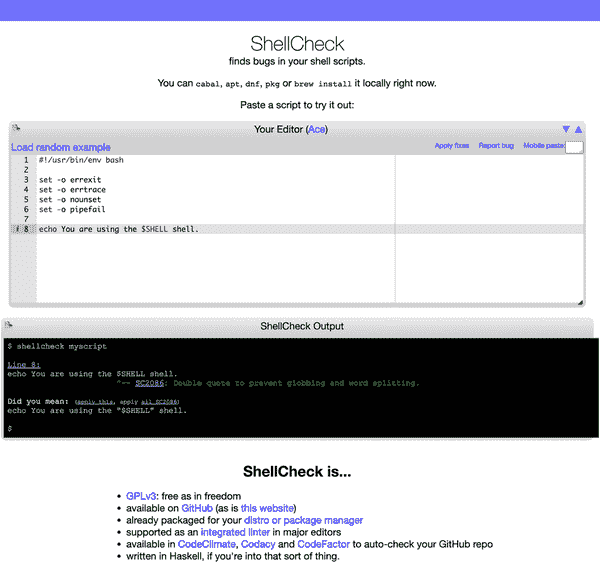

# 第三章：终端和脚本

在本章中，我们将专注于通过终端与 Linux 交互，即通过提供命令行界面（CLI）的 shell。能够有效地使用 shell 来完成日常任务非常重要，因此我们在这里着重介绍了其可用性。

首先，我们将回顾一些术语，并对 shell 基础进行简要而清晰的介绍。然后我们会看一些现代、易用的 shell，比如 Fish shell。我们还会探讨 shell 中的配置和常见任务。接下来，我们会讨论如何使用终端复用器有效地在 CLI 上工作，从而使你能够处理多个会话，无论是本地还是远程。在本章的最后部分，我们会转变视角，专注于如何使用脚本自动化 shell 中的任务，包括安全、可靠和可移植的脚本编写最佳实践，以及如何对脚本进行 lint 和测试。

从 CLI 的角度来看，与 Linux 交互有两种主要方式。第一种方式是手动操作，即人类用户坐在终端前，交互地输入命令并消耗输出。这种即兴的交互对于你在日常基础上想要在 shell 中完成的大部分事情都有效，包括以下内容：

+   列出目录，查找文件，或在文件中查找内容

+   在不同目录之间复制文件，或将文件复制到远程机器

+   从终端阅读电子邮件或新闻，或者从终端发送推文

此外，我们还将学习如何在同一时间方便高效地处理多个 shell 会话。

另一种操作模式是一系列命令的自动处理，这些命令包含在一种特殊的文件中，shell 会解释并执行这些命令。这种模式通常称为*shell 脚本*或简称*脚本*。通常情况下，你应该使用脚本而不是手动重复某些任务。此外，脚本是许多配置和安装系统的基础。脚本确实非常方便。但是，如果不加预防地使用，它们也可能带来危险。因此，每当你考虑编写脚本时，请记住[XKCD 网络漫画](https://oreil.ly/GSKUb)第 3-1 图。


###### 图 3-1\. XKCD 关于[自动化](https://oreil.ly/GSKUb)。*授权*：Randall Munroe（根据 CC BY-NC 2.5 许可共享）

我强烈建议你准备好一个 Linux 环境，并立即尝试这里展示的示例。有了这些，你准备好进行一些（互动）操作了吗？如果是这样，那么让我们从一些术语和基本 shell 使用开始。

# 基础

在我们深入研究不同选项和配置之前，让我们专注于一些基本术语，比如*终端*和*shell*。在本节中，我将定义这些术语，并展示如何在 shell 中完成日常任务。我们还将回顾现代命令并看到它们的实际应用。

## 终端

我们从终端开始，或者终端仿真器，或软终端，它们都指的是同一物事：*终端* 是提供文本用户界面的程序。也就是说，终端支持从键盘读取字符并在屏幕上显示它们。许多年前，这些是集成设备（键盘和屏幕在一起），但现在终端只是应用程序。

除了基本的面向字符的输入和输出之外，终端还支持所谓的 [*转义序列* 或 *转义代码*](https://oreil.ly/AT5qC)，用于光标和屏幕处理以及可能的颜色支持。例如，按下 Ctrl+H 会导致退格，删除光标左侧的字符。

环境变量 `TERM` 指定正在使用的终端仿真器，并且其配置通过 `infocmp` 可以如下查看（注意输出已经被缩短）：

```
$ infocmp 
#       Reconstructed via infocmp from file: /lib/terminfo/s/screen-256color screen-256color|GNU Screen with 256 colors,
        am, km, mir, msgr, xenl,
        colors#0x100, cols#80, it#8, lines#24, pairs#0x10000,
        acsc=++\,\,--..00``aaffgghhiijjkkllmmnnooppqqrrssttuuvvwwxxyyzz{{||}}~~,
        bel=^G, blink=\E5m, bold=\E[1m, cbt=\E[Z, civis=\E[?25l,
        clear=\E[H\E[J, cnorm=\E[34h\E[?25h, cr=\r,
        ...
```

[

`infocmp` 的输出不容易理解。如果你想详细了解能力，请查阅 [terminfo](https://oreil.ly/qjwiv) 数据库。例如，在我的具体输出中，终端支持 80 列 (`cols#80`) 和 24 行 (`lines#24`) 的输出以及 256 色 (`colors#0x100`，十六进制表示法)。

终端的例子不仅包括 `xterm`，`rxvt` 和 Gnome 终止器，还包括利用 GPU 的新一代终端，例如 [Alacritty](https://oreil.ly/zm9M9)，[kitty](https://oreil.ly/oxyMn) 和 [warp](https://oreil.ly/WBG9S)。

在 “终端复用器” 中，我们将再次回到终端这个主题。

## Shells

接下来是 *shell*，它是一个在终端内运行并作为命令解释器的程序。shell 通过流处理输入和输出，支持变量，具有一些内置命令可供使用，处理命令执行和状态，并通常支持交互式使用以及脚本化使用（“脚本化”）。

shell 的正式定义在[`sh`](https://oreil.ly/ISxwU)中已明确定义，并且我们经常遇到术语[POSIX shell](https://oreil.ly/rkfqG)，在脚本和可移植性的背景下，这将变得更为重要。

最初，我们有 Bourne shell `sh`，以作者命名，但现在通常用 [bash](https://oreil.ly/C9coL) shell 取而代之——这是对原始版本的一个双关语，缩写为 “Bourne Again Shell”，被广泛用作默认。

如果你对自己使用的内容感兴趣，请使用 `file -h /bin/sh` 命令查找，或者如果失败了，请尝试 `echo $0` 或 `echo $SHELL`。

###### 注意

在本节中，我们默认使用 bash shell (`bash`），除非我们明确指出。

还有许多 `sh` 的实现以及其他变种，例如 Korn shell `ksh` 和 C shell `csh`，但今天并不广泛使用。然而，我们将在 “用户友好的 shell” 中审查现代的 `bash` 替代方案。

让我们从两个基本特性开始我们的 Shell 基础：流和变量。

### 流

让我们从输入（流）和输出（流）或简称 I/O 的主题开始。如何为程序提供输入？如何控制程序的输出去向，比如在终端或文件中？

首先，Shell 为每个进程配备了三个默认的文件描述符（FD），用于输入和输出：

+   `stdin`（FD 0）

+   `stdout`（FD 1）

+   `stderr`（FD 2）

如图 Figure 3-2 所示，这些 FD 默认连接到您的屏幕和键盘。换句话说，除非指定其他方式，否则在 Shell 中输入的命令将从键盘输入（`stdin`），并将输出（`stdout`）发送到屏幕。

下面的 Shell 交互演示了这种默认行为：

```
$ cat
This is some input I type on the keyboard and read on the screen^C
```

在前面使用`cat`的示例中，您可以看到默认行为。请注意，我使用 Ctrl+C（显示为`^C`）来终止命令。


###### 图 3-2\. Shell I/O 默认流

如果不想使用 Shell 默认设置——例如，不希望`stderr`输出到屏幕而想将其保存到文件中——可以将流[重定向](https://oreil.ly/pOIjp)。

使用`$FD>`和`<$FD`重定向进程的输出流，其中`$FD`是文件描述符——例如，`2>`表示重定向`stderr`流。请注意，`1>`和`>`是一样的，因为`stdout`是默认的。如果想要同时重定向`stdout`和`stderr`，可以使用`&>`；如果想要丢弃某个流，可以使用`/dev/null`。

让我们通过具体例子来看看它是如何运行的，通过`curl`下载一些 HTML 内容：

```
$ curl https://example.com &> /dev/null 

$ curl https://example.com > /tmp/content.txt 2> /tmp/curl-status 
$ head -3 /tmp/content.txt
<!doctype html>
<html>
<head>
$ cat /tmp/curl-status
  % Total    % Received % Xferd  Average Speed   Time    Time     Time  Current
                                 Dload  Upload   Total   Spent    Left  Speed
100  1256  100  1256    0     0   3187      0 --:--:-- --:--:-- --:--:--  3195

$ cat > /tmp/interactive-input.txt 

$ tr < /tmp/curl-status [A-Z] [a-z] 
  % total    % received % xferd  average speed   time    time     time  current
                                 dload  upload   total   spent    left  speed
100  1256  100  1256    0     0   3187      0 --:--:-- --:--:-- --:--:--  3195
```


通过将`stdout`和`stderr`都重定向到`/dev/null`来丢弃所有输出。


将输出和状态重定向到不同的文件。


交互地输入并保存到文件；使用 Ctrl+D 停止捕获并存储内容。


使用从`stdin`读取的`tr`命令将所有单词转换为小写。

Shell 通常理解一些特殊字符，例如：

和号（`&`）

放置在命令末尾，以后台方式执行命令（参见“作业控制”）

反斜杠（`\`）

用于将命令继续写在下一行，提高长命令的可读性

管道（`|`）

将一个进程的`stdout`连接到下一个进程的`stdin`，允许您传递数据而无需将其存储在临时文件中

再次，让我们看看理论内容如何实际操作。让我们尝试通过使用`curl`下载 HTML 文件并将内容通过`wc`工具进行管道传输，来计算 HTML 文件包含多少行：

```
$ curl https://example.com 2> /dev/null | \ 
  wc -l 
46
```


使用`curl`下载 URL 的内容，并丢弃它在`stderr`上输出的状态。（注意：实际上，你会使用`curl`的`-s`选项，但我们想要学习如何应用我们辛苦获得的知识，对吧？）


`curl`的`stdout`被馈送到`wc`的`stdin`，使用`-l`选项计算行数。

现在你已经基本了解了命令、流和重定向，让我们继续学习另一个核心 shell 特性，即变量的处理。

### 变量

在 shell 的上下文中，你会经常遇到*变量*这个术语。每当你不想或不能硬编码一个值时，可以使用变量来存储和更改值。使用案例包括以下内容：

+   当你想要处理 Linux 公开的配置项时——例如，shell 寻找可执行文件所在的位置，捕获在`$PATH`变量中。这是一种接口，其中变量可能是读/写的。

+   当你想要交互地查询用户的一个值，比如在脚本的上下文中。

+   当你想通过一次定义长值来缩短输入，比如 HTTP API 的 URL。这个用例大致对应于程序语言中的`const`值，因为定义变量后不再改变值。

我们区分两种变量类型：

环境变量

Shell-wide 设置；用`env`列出它们。

Shell 变量

在当前执行上下文中有效；在 bash 中使用`set`列出。shell 变量不会被子进程继承。

在 bash 中，你可以使用`export`创建一个环境变量。当你想要访问一个变量的值时，在它前面加上`$`，当你想要摆脱它时，使用`unset`。

好的，刚才我们学到了很多信息。让我们看看在实践中的样子（在 bash 中）：

```
$ set MY_VAR=42 
$ set | grep MY_VAR 
_=MY_VAR=42

$ export MY_GLOBAL_VAR="fun with vars" 

$ set | grep 'MY_*' 
MY_GLOBAL_VAR='fun with vars'
_=MY_VAR=42

$ env | grep 'MY_*' 
MY_GLOBAL_VAR=fun with vars

$ bash 
$ echo $MY_GLOBAL_VAR 
fun with vars

$ set | grep 'MY_*' 
MY_GLOBAL_VAR='fun with vars'

$ exit 
$ unset $MY_VAR
$ set | grep 'MY_*'
MY_GLOBAL_VAR='fun with vars'
```


创建一个名为`MY_VAR`的 shell 变量，并赋值为 42。


列出 shell 变量并过滤掉`MY_VAR`。注意`_=`，表示它未导出。


创建一个名为`MY_GLOBAL_VAR`的新环境变量。


列出 shell 变量并过滤掉所有以`MY_`开头的变量。正如预期的那样，我们看到了前面步骤中创建的两个变量。


列出环境变量。我们看到`MY_GLOBAL_VAR`，正如我们希望的那样。


创建一个新的 shell 会话——也就是当前 shell 会话的子进程，它不会继承`MY_VAR`。


访问环境变量`MY_GLOBAL_VAR`。


列出 shell 变量，这里我们只得到了`MY_GLOBAL_VAR`，因为我们在子进程中。


退出子进程，移除`MY_VAR` shell 变量，并列出我们的 shell 变量。正如预期的那样，`MY_VAR` 已经不存在。

在表 3-1 中，我整理了常见的 shell 和环境变量。你几乎在任何地方都会找到这些变量，它们非常重要，需要理解和使用。对于任何变量，你可以通过`echo $XXX`来查看相应的值，其中`XXX`是变量名。

表 3-1\. 常见的 shell 和环境变量

| 变量 | 类型 | 语义 |
| --- | --- | --- |
| `EDITOR` | 环境 | 默认用于编辑文件的程序路径 |
| `HOME` | POSIX | 当前用户的主目录路径 |
| `HOSTNAME` | bash shell | 当前主机名 |
| `IFS` | POSIX | 用于分隔字段的字符列表；当 shell 扩展时用到 |
| `PATH` | POSIX | 包含一组目录，shell 在其中寻找可执行程序（二进制文件或脚本） |
| `PS1` | 环境 | 当前使用的主提示字符串 |
| `PWD` | 环境 | 当前工作目录的完整路径 |
| `OLDPWD` | bash shell | 上一次 `cd` 命令前的完整路径 |
| `RANDOM` | bash shell | 0 到 32767 之间的随机整数 |
| `SHELL` | 环境 | 当前使用的 shell |
| `TERM` | 环境 | 使用的终端模拟器 |
| `UID` | 环境 | 当前用户唯一 ID（整数值） |
| `USER` | 环境 | 当前用户名 |
| `_` | bash shell | 在前台执行的上一个命令的最后一个参数 |
| `?` | bash shell | 退出状态；参见“Exit status” |
| `$` | bash shell | 当前进程的 ID（整数值） |
| `0` | bash shell | 当前进程的名称 |

此外，请查看完整的[bash 特定变量列表](https://oreil.ly/EIgVc)，同时注意表 3-1 中的变量在“Scripting”环境下再次会派上用场。

### 退出状态

shell 使用所谓的*退出状态*向调用者通知命令执行的完成情况。一般来说，Linux 命令在终止时会返回一个状态。这可以是正常终止（成功路径）或异常终止（出现错误）。`0` 退出状态表示命令成功运行且无任何错误，而在 1 到 255 之间的非零值则表示失败。要查询退出状态，请使用`echo $?`。

在管道中要小心处理退出状态，因为某些 shell 只会将最后一个状态可用。你可以通过使用`$PIPESTATUS`来解决这个限制（https://oreil.ly/mMz9k）。

### 内建命令

Shell 提供了许多内置命令。一些有用的例子包括`yes`、`echo`、`cat`或`read`（取决于 Linux 发行版，其中一些命令可能不是内置的，而是位于*/usr/bin*）。您可以使用`help`命令列出内置命令。但请记住，其他所有程序都是 Shell 外部程序，通常可以在*/usr/bin*（用户命令）或*/usr/sbin*（管理命令）找到。

您如何知道在哪里找到可执行文件？以下是一些方法：

```
$ which ls
/usr/bin/ls

$ type ls
ls is aliased to `ls --color=auto'
```

###### 注意

本书的一位技术审阅者正确指出，`which`是一个非 POSIX 的外部程序，可能并不总是可用。此外，他们建议使用`*command* -v`而不是`which`来获取程序路径或 Shell 别名/函数。另请参阅[shellcheck 文档](https://oreil.ly/5toUM)获取更多详细信息。

### 作业控制

大多数 Shell 支持的一个特性称为[*作业控制*](https://oreil.ly/zeMsU)。默认情况下，当您输入一个命令时，它会接管屏幕和键盘，我们通常称之为*前台运行*。但是如果您不想交互式地运行某些内容，或者在服务器上，如果`stdin`没有输入怎么办呢？这时候就要用到作业控制和后台作业了：要在后台启动一个进程，可以在命令末尾加上`&`，或者将前台进程发送到后台，按 Ctrl+Z。

下面的示例展示了这一操作，让您对此有一个大致的了解：

```
$ watch -n 5 "ls" & 

$ jobs 
Job     Group   CPU     State   Command
1       3021    0%      stopped watch -n 5 "ls" &

$ fg 
Every 5.0s: ls                                         Sat Aug 28 11:34:32 2021

Dockerfile
app.yaml
example.json
main.go
script.sh
test
```


通过在命令末尾加上`&`，我们将命令在后台启动。


列出所有作业。


使用`fg`命令，我们可以将一个进程带回前台。如果您想退出`watch`命令，请使用 Ctrl+C。

如果您希望保持后台进程在关闭 Shell 后继续运行，可以在命令前加上`nohup`。此外，对于已经运行且未使用`nohup`前置的进程，您可以事后使用`disown`来实现相同效果。最后，如果您想终止运行中的进程，可以使用带有不同强度级别的`kill`命令（详见“信号”获取更多详细信息）。

与其使用作业控制，我建议使用终端复用器，如“终端复用器”中讨论的那样。这些程序处理了大多数常见用例（Shell 关闭、多个进程运行需要协调等），同时还支持与远程系统的工作。

让我们继续讨论替换历史悠久的核心命令的现代替代品。

## 现代命令

每天你会发现自己反复使用几个命令。这些包括导航目录的命令（`cd`）、列出目录内容的命令（`ls`）、查找文件的命令（`find`）和显示文件内容的命令（`cat`、`less`）。考虑到你经常使用这些命令，你希望尽可能高效——每次按键都很重要。

现代版本的某些常用命令存在变体。其中一些是可替换的，而其他一些则扩展了功能。所有这些命令都提供了一些合理的默认值用于常见操作，并且提供了易于理解的丰富输出，通常能够让你在完成相同任务时输入更少的内容。这减少了在使用 Shell 时的摩擦，使工作更加愉快并改善了流程。如果你想了解更多关于现代工具的信息，请查看附录 B。在这个背景下，特别是如果你在企业环境中应用这些知识，需要注意：我对这些工具没有任何利益关系，纯粹是因为我自己发现它们有用而推荐它们。安装和使用任何这些工具的一个好方法是使用经你选择的 Linux 发行版验证过的工具版本。

### 使用 `exa` 列出目录内容

每当你想知道一个目录包含什么，你会使用 `ls` 或其带参数的变体之一。例如，在 bash 中我曾经将 `l` 别名为 `ls -GAhltr`。但是有更好的方法：[`exa`](https://oreil.ly/5lPAl)，一个用 Rust 编写的现代替代品，具有内置的 Git 支持和树形渲染。在这种情况下，你认为在列出目录内容后最常用的命令是什么？在我的经验中，是清屏，人们经常使用 `clear`。这是输入五个字符然后按 `ENTER`。你可以更快地达到同样的效果——简单地使用 Ctrl+L。

### 使用 `bat` 查看文件内容

假设你列出了一个目录的内容并找到了一个你想检查的文件。你会使用 `cat`，也许？我建议你看看更好的东西：[`bat`](https://oreil.ly/w3K76)。`bat` 命令在 图 3-3 中显示了语法高亮，显示不可打印字符，支持 Git，并且有一个集成的分页器（用于分页查看比屏幕显示更长的文件）。

### 使用 `rg` 在文件中查找内容

传统上，你会使用 `grep` 在文件中查找内容。然而，有一个现代命令 [`rg`](https://oreil.ly/u3Sfw)，它速度快且功能强大。

在这个例子中，我们将 `rg` 与 `find` 和 `grep` 的组合进行比较，我们希望找到包含字符串“sample”的 YAML 文件：

```
$ find . -type f -name "*.yaml" -exec grep "sample" '{}' \; -print 
      app: sample
        app: sample
./app.yaml

$ rg -t "yaml" sample 
app.yaml
9:      app: sample
14:        app: sample
```


使用 `find` 和 `grep` 结合在 YAML 文件中查找字符串。


使用 `rg` 完成同样的任务。

如果你比较前面示例中的命令和结果，你会发现 `rg` 不仅更容易使用，而且结果更具信息量（在本例中提供上下文，即行号）。


###### 图 3-3\. 通过 `bat` 渲染的 Go 文件（上）和 YAML 文件（下）的显示

### 使用 jq 进行 JSON 数据处理

现在来看一个额外的命令。这个命令 `jq` 并不是一个实际的替代品，而更像是 JSON 的专用工具，这种流行的文本数据格式。你会在 HTTP API 和配置文件中找到 JSON。

因此，使用 [`jq`](https://oreil.ly/9s7yh) 而不是 `awk` 或 `sed` 来提取特定的值。例如，通过使用 [JSON 生成器](https://oreil.ly/bcT9d) 来生成一些随机数据，我得到了一个 2.4 kB 的 JSON 文件 *example.json*，大致如下（这里只显示第一条记录）：

```
[
  {
    "_id": "612297a64a057a3fa3a56fcf",
    "latitude": -25.750679,
    "longitude": 130.044327,
    "friends": [
      {
        "id": 0,
        "name": "Tara Holland"
      },
      {
        "id": 1,
        "name": "Giles Glover"
      },
      {
        "id": 2,
        "name": "Pennington Shannon"
      }
    ],
    "favoriteFruit": "strawberry"
  },
...
```

假设我们对所有“第一个”朋友感兴趣——也就是说，在 `friends` 数组中的第 0 个条目——这些朋友最喜欢的水果是“草莓”。使用 `jq`，你会执行以下操作：

```
$ jq 'select(.[].favoriteFruit=="strawberry") | .[].friends[0].name' example.json
"Tara Holland"
"Christy Mullins"
"Snider Thornton"
"Jana Clay"
"Wilma King"
```

CLI 玩得开心吧？如果你对现代命令主题和替代选择感兴趣，请查看 [modern-unix 仓库](https://oreil.ly/cBAXt)，其中列出了一些建议。现在我们把注意力转移到超出目录导航和文件内容查看的一些常见任务及其处理方法。

## 常见任务

经常你可能发现自己在做一些事情，并且有些技巧可以帮助你加快在 shell 中的任务。让我们回顾一下这些常见任务，并看看如何更高效地完成它们。

### 缩短经常使用的命令

在界面上的一个基本洞察是，你经常使用的命令应该耗费最少的精力——它们应该快速输入。现在把这个想法应用到 shell 中：而不是 `git diff --color-moved`，我只需输入 `d`（一个字符），因为我每天在我的仓库中查看变更几百次。根据不同的 shell，有不同的方法可以实现这一点：在 bash 中这称为 [*alias*](https://oreil.ly/fbBvm)，而在 Fish (“Fish Shell”) 中则可以使用 [缩写](https://oreil.ly/rrmNI)。

### 导航

当你在 shell 提示符中输入命令时，有几件事情你可能想做，比如导航行（例如，将光标移动到开头）或操作行（比如删除光标左边的所有内容）。表 3-2 列出了常见的 shell 快捷键。

表 3-2\. Shell 导航和编辑快捷键

| 动作 | 命令 | 注释 |
| --- | --- | --- |
| 移动光标到行首 | Ctrl+a | - |
| 移动光标到行尾 | Ctrl+e | - |
| 向前移动一个字符 | Ctrl+f | - |
| 向后移动一个字符 | Ctrl+b | - |
| 向前移动一个单词 | Alt+f | 只适用于左 Alt 键 |
| 向后移动一个单词 | Alt+b | - |
| 删除当前字符 | Ctrl+d | - |
| 删除光标左侧字符 | Ctrl+h | - |
| 删除光标左侧单词 | Ctrl+w | - |
| 删除光标右侧所有内容 | Ctrl+k | - |
| 删除光标左侧所有内容 | Ctrl+u | - |
| 清屏 | Ctrl+l | - |
| 取消命令 | Ctrl+c | - |
| 撤销 | Ctrl+_ | 仅限 bash |
| 搜索历史记录 | Ctrl+r | 一些 shell |
| 取消搜索 | Ctrl+g | 一些 shell |

请注意，并非所有快捷方式都在所有 shell 中受支持，并且某些操作（例如历史记录管理）可能在某些 shell 中实现方式有所不同。此外，您可能希望了解这些快捷键基于 Emacs 编辑按键。如果您喜欢`vi`，您可以在*.bashrc*文件中使用`set -o vi`，例如，以执行基于`vi`按键的命令行编辑。最后，从表 3-2 开始，尝试您的 shell 支持的功能，并查看如何配置以满足您的需求。

### 文件内容管理

您并非总是想启动编辑器（如`vi`）来添加一行文本。有时候您无法这样做——例如，在编写 shell 脚本的上下文中（参见“脚本编写”）。

那么，如何操作文本内容呢？让我们看几个例子：

```
$ echo "First line" > /tmp/something 

$ cat /tmp/something 
First line

$ echo "Second line" >> /tmp/something && \ 
  cat /tmp/something
First line
Second line

$ sed 's/line/LINE/' /tmp/something 
First LINE
Second LINE

$ cat << 'EOF' > /tmp/another  First line
Second line
Third line
EOF

$ diff -y /tmp/something /tmp/another 
First line                                                      First line
Second line                                                     Second line
                                                              > Third line
```


通过重定向`echo`输出来创建文件。


查看文件内容。


使用`>>`运算符向文件追加一行，然后查看内容。


使用`sed`替换文件内容并输出到`stdout`。


使用[此处文档](https://oreil.ly/FPWqT)创建文件。


显示我们创建的文件之间的差异。

现在您了解了基本的文件内容操作技巧，让我们来看一下高级文件内容查看。

### 查看长文件

对于长文件——即文件的行数超过 shell 可以在屏幕上显示的行数——您可以使用分页程序如`less`或`bat`（`bat`带有内置分页程序）。使用分页，程序将输出分为适合屏幕显示的页面，并提供一些命令来导航页面（查看下一页、上一页等）。

另一种处理长文件的方式是仅显示文件的选择区域，比如前几行。这有两个方便的命令：`head`和`tail`。

例如，要显示文件的开头：

```
$ for i in {1..100} ; do echo $i >> /tmp/longfile ; done 

$ head -5 /tmp/longfile 
1
2
3
4
5
```


创建一个长文件（这里有 100 行）。


显示长文件的前五行。

或者，要获取正在不断增长的文件的实时更新，我们可以使用：

```
$ sudo tail -f /var/log/Xorg.0.log 
[ 36065.898] (II) event14 - ALPS01:00 0911:5288 Mouse: device is a pointer
[ 36065.900] (II) event15 - ALPS01:00 0911:5288 Touchpad: device is a touchpad
[ 36065.901] (II) event4  - Intel HID events: is tagged by udev as: Keyboard
[ 36065.901] (II) event4  - Intel HID events: device is a keyboard
...
```


使用 `tail` 显示日志文件的末尾，使用 `-f` 选项表示跟随或自动更新。

最后，在这一节中我们将看看如何处理日期和时间。

### 日期和时间处理

`date` 命令是生成唯一文件名的有用方法。它允许您生成各种格式的日期，包括 [Unix 时间戳](https://oreil.ly/xB7UG)，并且可以在不同的日期和时间格式之间转换。

```
$ date +%s 
1629582883

$ date -d @1629742883 '+%m/%d/%Y:%H:%M:%S' 
08/21/2021:21:54:43
```


创建一个 UNIX 时间戳。


将 UNIX 时间戳转换为人类可读的日期。

通过这些基础知识，您现在应该对终端和 shell 是什么，以及如何使用它们来执行基本任务，如导航文件系统、查找文件等有了很好的理解。现在我们继续讨论人性化的 shell 主题。

# 人性化的 Shell

虽然 [bash shell](https://oreil.ly/9GNyA) 可能仍然是最广泛使用的 shell，但不一定是最人性化的。自上世纪 80 年代末问世以来，它的年龄有时体现出来。我强烈建议您评估并使用一些现代、用户友好的 shell 替代 bash。

我们将首先详细研究一个名为 Fish shell 的现代、用户友好的具体例子，然后简要讨论其他选择，以确保您了解各种选择。我们在 “Which Shell Should I Use?” 中快速给出推荐和结论。

## Fish Shell

[Fish shell](https://fishshell.com/) 自称为智能且用户友好的命令行 shell。让我们先看一些基本用法，然后再讨论配置主题。

### 基本用法

对于许多日常任务，您在输入方面可能不会注意到与 bash 的显著区别；Table 3-2 中提供的大多数命令是有效的。但是，`fish` 与 `bash` 不同并且更加方便的地方有两个：

没有明确的历史管理。

您只需输入命令即可看到之前执行的命令历史。您可以使用上下键选择其中一个（参见 Figure 3-4）。

对许多命令都可以使用自动建议。

这在 Figure 3-5 中显示。此外，当您按 Tab 键时，Fish shell 将尝试完成命令、参数或路径，并为您提供视觉提示，例如如果不认识命令，会将您的输入着色为红色。


###### 图 3-4\. Fish 历史记录处理示例


###### 图 3-5\. Fish 自动建议的示例

Table 3-3 列出了一些常见的 `fish` 命令。在这个背景下，特别注意环境变量的处理方式。

表 3-3\. Fish shell 参考

| 任务 | 命令 |
| --- | --- |
| 导出环境变量 `KEY` 的值为 `VAL` | `set -x KEY VAL` |
| 删除环境变量`KEY` | `set -e KEY` |
| 内联环境变量`KEY`用于命令`cmd` | `env KEY=VAL cmd` |
| 将路径长度更改为 1 | `set -g fish_prompt_pwd_dir_length 1` |
| 管理简写 | `abbr` |
| 管理函数 | `functions`和`funcd` |

与其他 Shell 不同，`fish`将上一个命令的退出状态存储在名为`$status`的变量中，而不是存储在`$?`中。

如果你从 bash 转来，你可能也想参考[Fish 常见问题解答](https://oreil.ly/Nk2S2)，这里解决了大部分常见问题。

### 配置

要[配置 Fish Shell](https://oreil.ly/FCSne)，你只需输入`fish_config`命令（根据你的发行版，可能需要添加`browse`子命令），Fish 将通过*[*http://localhost:8000*](http://localhost:8000)*启动一个服务器，并自动用一个漂亮的 UI 在你默认的浏览器中打开，如图 3-6 所示，允许你查看和更改设置。


###### 图 3-6\. 通过浏览器配置 Fish Shell

###### 小贴士

要在命令行导航中切换`vi`和 Emacs（默认）键绑定，请使用`fish_vi_key_bindings`启动`vi`模式，并使用`fish_default_key_bindings`将其重置为 Emacs。请注意，更改将立即在所有活动的 Shell 会话中生效。

现在让我们看看我如何配置我的环境。实际上，我的配置相当简短；在*config.fish*中我有以下内容：

```
set -x FZF_DEFAULT_OPTS "-m --bind='ctrl-o:execute(nvim {})+abort'"
set -x FZF_DEFAULT_COMMAND 'rg --files'
set -x EDITOR nvim
set -x KUBE_EDITOR nvim
set -ga fish_user_paths /usr/local/bin
```

我的提示符，在*fish_prompt.fish*中定义，看起来是这样的：

```
function fish_prompt
    set -l retc red
    test $status = 0; and set retc blue

    set -q __fish_git_prompt_showupstream
    or set -g __fish_git_prompt_showupstream auto

    function _nim_prompt_wrapper
        set retc $argv[1]
        set field_name $argv[2]
        set field_value $argv[3]

        set_color normal
        set_color $retc
        echo -n '─'
        set_color -o blue
        echo -n '['
        set_color normal
        test -n $field_name
        and echo -n $field_name:
        set_color $retc
        echo -n $field_value
        set_color -o blue
        echo -n ']'
    end

    set_color $retc
    echo -n '┬─'
    set_color -o blue
    echo -n [
    set_color normal
    set_color c07933
    echo -n (prompt_pwd)
    set_color -o blue
    echo -n ']'
     # Virtual Environment
    set -q VIRTUAL_ENV_DISABLE_PROMPT
    or set -g VIRTUAL_ENV_DISABLE_PROMPT true
    set -q VIRTUAL_ENV
    and _nim_prompt_wrapper $retc V (basename "$VIRTUAL_ENV")

    # git
    set prompt_git (fish_git_prompt | string trim -c ' ()')
    test -n "$prompt_git"
    and _nim_prompt_wrapper $retc G $prompt_git

    # New line
    echo

    # Background jobs
    set_color normal
    for job in (jobs)
        set_color $retc
        echo -n '│ '
        set_color brown
        echo $job
    end
    set_color blue
    echo -n '╰─> '
        set_color -o blue
    echo -n '$ '
    set_color normal
end
```

前面的提示符定义产生了图 3-7 中显示的提示符；请注意包含 Git 存储库和不包含 Git 存储库的目录之间的区别，这是加速你工作流的内置视觉提示。同时，注意右侧显示的当前时间。


###### 图 3-7\. Fish Shell 提示符

我的简写——把它们当作在其他 Shell 中找到的`alias`替代品——看起来是这样的：

```
$ abbr
abbr -a -U -- :q exit
abbr -a -U -- cat bat
abbr -a -U -- d 'git diff --color-moved'
abbr -a -U -- g git
abbr -a -U -- grep 'grep --color=auto'
abbr -a -U -- k kubectl
abbr -a -U -- l 'exa --long --all --git'
abbr -a -U -- ll 'ls -GAhltr'
abbr -a -U -- m make
abbr -a -U -- p 'git push'
abbr -a -U -- pu 'git pull'
abbr -a -U -- s 'git status'
abbr -a -U -- stat 'stat -x'
abbr -a -U -- vi nvim
abbr -a -U -- wget 'wget -c'
```

要添加新的简写，请使用`abbr --add`。简写对于不带参数的简单命令非常方便。如果你有更复杂的构造想要缩短怎么办？比如你想缩短一个涉及`git`并且带有参数的序列。那就来认识一下 Fish 中的函数吧。

现在让我们看一个示例函数，这个函数定义在名为*c.fish*的文件中。我们可以使用`functions`命令列出所有定义的函数，使用`function`命令创建一个新函数，而在这种情况下使用`function c`来编辑它如下：

```
function c
    git add --all
    git commit -m "$argv"
end
```

到此为止我们已经完成了 Fish 部分，我们通过一个使用教程和配置技巧来进行了详细讨论。现在让我们快速看看其他现代 Shell。

## Z-shell

[Z-shell](https://oreil.ly/6y06N)，或`zsh`，是一种类似 Bourne Shell 的 Shell，具有强大的[补全](https://oreil.ly/bqS8y)系统和丰富的主题支持。借助[Oh My Zsh](https://ohmyz.sh)，你可以在保留广泛的 bash 向后兼容性的同时，配置和使用`zsh`，就像之前在`fish`上看到的那样。

`zsh`使用五个启动文件，如下例所示（注意，如果未设置`$ZDOTDIR`，`zsh`将使用`$HOME`代替）：

```
$ZDOTDIR/.zshenv 
$ZDOTDIR/.zprofile 
$ZDOTDIR/.zshrc 
$ZDOTDIR/.zlogin 
$ZDOTDIR/.zlogout 
```


在 Shell 的所有调用中被引用。它应该包含设置搜索路径以及其他重要环境变量的命令。但不应包含产生输出或假设 Shell 连接到`tty`的命令。


作为`ksh`爱好者的*.zlogin*替代品（这两者不应同时使用）；与*.zlogin*类似，但在*.zshrc*之前被引用。


在交互式 Shell 中被引用。它应该包含设置别名、函数、选项、键绑定等命令。


在登录 Shell 中被引用。它应该包含仅在登录 Shell 中执行的命令。请注意，*.zlogin*不适合别名定义、选项、环境变量设置等。


在登录 Shell 退出时被引用。

欲了解更多`zsh`插件，请参阅 GitHub 上的[awesome-zsh-plugins repo](https://oreil.ly/XHwBd)。如果你想学习`zsh`，可以阅读 Paul Falstad 和 Bas de Bakker 的[“An Introduction to the Z Shell”](https://oreil.ly/cMfnw)。

## 其他现代 Shell

除了`fish`和`zsh`外，还有许多其他有趣的 Shell 可供选择，但不一定始终与 bash 兼容。当你查看这些时，请考虑各自 Shell 的重点（交互使用 vs. 脚本编写）以及社区活跃程度。

我发现的一些适用于 Linux 的现代 Shell 示例，并推荐你查看：

[Oil shell](https://www.oilshell.org)

面向 Python 和 JavaScript 用户。换句话说，更专注于脚本编写而非交互使用。

[murex](https://murex.rocks)

一个 POSIX Shell，具有集成的测试框架、类型化管道和事件驱动编程等有趣特性。

[Nushell](https://www.nushell.sh)

一种实验性的新 Shell 范例，展示了带有强大查询语言的表格输出。通过详细的[Nu Book](https://oreil.ly/jIa5w)了解更多信息。

[PowerShell](https://oreil.ly/bYKnd)

一个跨平台的 Shell，最初作为 Windows PowerShell 的分支，并提供与 POSIX Shell 不同的语义和交互方式。

还有很多其他选择。继续寻找并找到最适合你的方法。试着超越 bash 并优化你的使用场景。

## 我应该使用哪个 Shell？

此时，除了 bash 之外的现代 Shell 似乎都是一个不错的选择，从人性化的角度来看。流畅的自动完成，简单的配置和智能环境在 2022 年并不奢侈，在你通常花在命令行上的时间里，你应该尝试不同的 Shell，并选择你最喜欢的那个。我个人使用 Fish Shell，但我的许多同行都对 Z Shell 非常满意。

你可能会有一些问题，让你不愿意远离 bash，例如以下问题：

+   你在远程系统工作和/或无法安装自己的 Shell。

+   由于兼容性或肌肉记忆，你一直在使用 bash。摆脱某些习惯可能会很难。

+   几乎所有的指令（隐含地）假设 bash。例如，你会看到像`export FOO=BAR`这样的指令，这是特定于 bash 的。

结果表明，这些问题在大多数用户那里基本上不成问题。虽然你可能不得不在远程系统中暂时使用 bash，但大多数情况下你将在你控制的环境中工作。学习曲线是存在的，但长期投资是值得的。

接下来，让我们集中精力讨论另一种提升终端生产力的方式：多路复用器。

# 终端多路复用器

我们在本章开头遇到了终端，在“终端”。现在让我们深入探讨如何改善你的终端使用，基于一个简单而强大的概念：多路复用。

这样想：通常你会在不同的事物上工作，可以将它们分组在一起。例如，你可能会在一个开源项目上工作，撰写博客文章或文档，远程访问服务器，与 HTTP API 交互进行测试等等。这些任务可能每个都需要一个或多个终端窗口，并且通常你希望或需要在两个窗口中同时进行可能相互依赖的任务。例如：

+   使用`watch`命令定期执行目录列表，并同时编辑文件。

+   你启动一个服务器进程（Web 服务器或应用服务器），希望它在前台运行（也见“作业控制”）以便查看日志。

+   你想使用`vi`编辑文件，同时使用`git`查询状态并提交更改。

+   你有一个在公共云中运行的虚拟机，想要通过`ssh`登录它，并有可能在本地管理文件。

把所有这些例子看作是逻辑上属于一起的事情，时间跨度从短期（几分钟）到长期（几天或几周）。这些任务的分组通常称为*会话*。

现在，如果你想要实现这种分组，会有一些挑战：

+   您需要多个窗口，因此一种解决方案是启动多个终端，或者如果 UI 支持，多个实例（选项卡）。

+   即使您关闭终端或远程端关闭，也希望保留所有窗口和路径。

+   您希望扩展或缩放以专注于特定任务，同时保持所有会话的概览，并能够在它们之间导航。

为了实现这些任务，人们提出了在终端上叠加多个窗口（和会话，以分组窗口）的想法，换句话说，复用终端 I/O。

让我们简要了解终端复用的原始实现，称为 `screen`。然后我们将深入研究广泛使用的 `tmux` 实现，并总结此领域的其他选项。

## screen

[`screen`](https://oreil.ly/xx3ik) 是最初的终端复用工具，目前仍在使用。除非您在没有其他选择的远程环境中，或者无法安装其他复用工具，否则建议不要使用 `screen`。原因之一是它不再处于活跃维护状态，另一个原因是它不太灵活且缺乏许多现代终端复用工具的功能。

## tmux

[`tmux`](https://oreil.ly/kVg7M) 是一个灵活且功能丰富的终端复用工具，可以根据您的需求进行定制。正如您在图 3-8 中所见，`tmux` 有三个核心元素，您可以与之交互，从粗粒度到细粒度单元：


###### 图 3-8\. `tmux` 的元素：会话、窗口和 pane

会话

一个逻辑单元，您可以将其视为专用于特定任务（如“在项目 X 上工作”或“撰写博客文章 Y”）的工作环境。它是所有其他单元的容器。

窗口

您可以将窗口视为浏览器中的标签，属于一个会话。使用它是可选的，通常每个会话只有一个窗口。

Panes

这些是您的工作马，实际上是运行的单个 shell 实例。一个 pane 是一个窗口的一部分，您可以轻松地垂直或水平分割它，以及展开/折叠它（类似于缩放），并根据需要关闭 panes。

与 `screen` 类似，在 `tmux` 中您可以附加和分离会话。假设我们从头开始，让我们使用一个名为 `test` 的会话来启动它：

```
$ tmux new -s test
```

使用上述命令，`tmux` 作为服务器运行，您会进入一个您在 `tmux` 中配置的 shell，作为客户端运行。这种客户端/服务器模型允许您创建、进入、离开和销毁会话，并使用其中运行的 shell，而无需考虑它们运行（或失败）的进程。

`tmux` 使用 Ctrl+b 作为默认键盘快捷键，也称为*前缀*或*触发器*。例如，要列出所有窗口，您可以按 Ctrl+b 然后 w，或者要扩展当前（活动）窗格，您可以使用 Ctrl+b 然后 z。

###### 小贴士

在 `tmux` 中，默认的触发键是 Ctrl+b。为了改善流程，我将触发键映射到一个未使用的键上，因此只需按一次按键即可。我是通过首先将触发键映射到 `tmux` 中的 Home 键，然后通过更改 */usr/share/X11/xkb/symbols/pc* 中的映射将 Home 键映射到 Caps Lock 键来实现这一点的。

这种双映射是我需要做的一种变通方法。根据您的目标键或终端，您可能不必这样做，但我建议您将 Ctrl+b 键映射到一个易于到达的未使用键，因为您每天会频繁按下它。

您现在可以使用 表格 3-4 中列出的任何命令来管理进一步的会话、窗口和窗格。此外，按下 Ctrl+b+d 键，您可以分离会话。这有效地将 `tmux` 放入后台。

当您启动新的终端实例或者从远程位置通过 `ssh` 到您的机器时，您可以附加到一个已有的会话，所以让我们使用之前创建的 `test` 会话来做这件事：

```
$ tmux attach -t test 
```


附加到名为 `test` 的现有会话。请注意，如果您想要从之前的终端分离会话，还需要提供 `-d` 参数。

表格 3-4 列出了按单元分组的常见 `tmux` 命令，从最广泛的范围（会话）到最窄的范围（窗格）。

表格 3-4\. `tmux` 参考

| 目标 | 任务 | 命令 |
| --- | --- | --- |
| 会话 | 创建新的 | `:new -s NAME` |
| 会话 | 重命名 | 触发键 + `$` |
| 会话 | 列出全部 | 触发键 + `s` |
| 会话 | 关闭 | 触发键  |
| 窗口 | 创建新的 | 触发键 + `c` |
| 窗口 | 重命名 | 触发键 + `,` |
| 窗口 | 切换到 | 触发键 + `1` … `9` |
| 窗口 | 列出全部 | 触发键 + `w` |
| 窗口 | 关闭 | 触发键 + `&` |
| 窗格 | 水平分割 | 触发键 + `"` |
| 窗格 | 垂直分割 | 触发键 + `%` |
| 窗格 | 切换 | 触发键 + `z` |
| 窗格 | 关闭 | 触发键 + `x` |

现在您已经基本了解如何使用 `tmux`，让我们转向配置和自定义。我的 *.tmux.conf* 如下所示：

```
unbind C-b 
set -g prefix Home
bind Home send-prefix
bind r source-file ~/.tmux.conf \; display "tmux config reloaded :)" 
bind \\ split-window -h -c "#{pane_current_path}" 
bind - split-window -v -c "#{pane_current_path}"
bind X confirm-before kill-session 
set -s escape-time 1 
set-option -g mouse on 
set -g default-terminal "screen-256color" 
set-option -g status-position top 
set -g status-bg colour103
set -g status-fg colour215
set -g status-right-length 120
set -g status-left-length 50
set -g window-status-style fg=colour215
set -g pane-active-border-style fg=colour215
set -g @plugin 'tmux-plugins/tmux-resurrect' 
set -g @plugin 'tmux-plugins/tmux-continuum'
set -g @continuum-restore 'on'
run '~/.tmux/plugins/tpm/tpm'
```


此行及接下来两行将触发键更改为 `Home`。


通过触发键 + r 重新加载配置。


此行及以下重新定义了窗格分割；保留现有窗格的当前目录。


为新会话和终止会话添加快捷方式。


无延迟。


启用鼠标选择。


将默认终端模式设置为 256 色模式。


主题设置（下面六行）。


从这里到末尾：插件管理。

首先安装 [tpm](https://oreil.ly/hsoau)，`tmux` 插件管理器，然后按下触发键 + I 进行插件管理。这里使用的插件如下：

[tmux-resurrect](https://oreil.ly/JugvE)

允许您使用 Ctrl+s（安全）和 Ctrl+r（恢复）来恢复会话。

[tmux-continuum](https://oreil.ly/KvT7l)

自动保存/恢复会话（每 15 分钟间隔）。

图 3-9 显示了我的 Alacritty 终端正在运行 `tmux`。您可以看到位于左上角的快捷方式 0 到 9 的会话。


###### 图 3-9\. `tmux` 实例示例，显示可用会话。

虽然 `tmux` 确实是一个极好的选择，但确实还有其他选项，所以让我们来看看吧。

## 其他复用器

您可以查看并尝试的其他终端复用器包括以下几种：

[tmuxinator](https://oreil.ly/JyWmA)

元工具，允许您管理 `tmux` 会话。

[Byobu](https://oreil.ly/pJLa2)

是 `screen` 或 `tmux` 的包装器；如果您使用基于 Ubuntu 或 Debian 的 Linux 发行版，它尤其有趣。

[Zellij](https://oreil.ly/ZRHnX)

自称为终端工作区，用 Rust 编写，并且超越了 `tmux` 的功能，包括布局引擎和强大的插件系统。

[dvtm](https://oreil.ly/yaTan)

将平铺窗口管理概念引入终端；功能强大但像 `tmux` 一样有学习曲线。

[3mux](https://oreil.ly/S6nvV)

一个简单的用 Go 编写的终端复用器；易于使用但不像 `tmux` 那样强大。

通过对复用器选项进行快速回顾后，让我们来谈谈如何选择一个。

## 我应该使用哪个复用器？

不像面向人类用户的 shell，我在终端复用器的背景下确实有一个明确的偏好：使用 `tmux`。理由多种多样：它成熟稳定、功能丰富（有许多可用插件）、灵活。很多人都在使用它，所以有很多相关资料和可用的帮助。其他复用器也很令人兴奋，但相对较新或者像 `screen` 一样已经不再是首选了。

希望能说服您考虑使用终端复用器来改善终端和 shell 的体验，加快任务速度，使整体流程更加顺畅。

现在，让我们转向本章的最后一个主题，使用 shell 脚本自动化任务。

# 脚本编写

在本章的前几节中，我们专注于 shell 的手动、交互式使用。一旦您在提示符上反复执行某项任务，很可能是时候自动化该任务了。这就是脚本的用武之地。

这里我们关注在 bash 中编写脚本。这是由于两个原因：

+   大多数脚本都是用 bash 编写的，因此您会找到很多 bash 脚本的示例和帮助。

+   在目标系统上找到 bash 的可能性很高，这使得你的潜在用户群比使用其他（可能更强大但是又神秘或不常用）的 bash 替代品要大。

在我们开始之前，我想提供一些背景信息，有些 shell 脚本的代码量可以达到[几千行](https://oreil.ly/0oWzI)。并不是鼓励你去追求这样的量级 —— 相反，如果你发现自己在编写长脚本，可以考虑是否应该选择像 Python 或 Ruby 这样的适当脚本语言。

现在让我们退后一步，开发一个简短但有用的示例，一路上应用良好的实践。我们假设我们想要自动化显示一个单一语句在屏幕上的任务，给定一个用户的 GitHub 句柄，显示用户加入的时间，使用他们的全名，类似以下的内容：

```
XXXX XXXXX joined GitHub in YYYY
```

我们如何用脚本自动化这个任务呢？让我们从基础开始，然后审视可移植性，并逐步提升到脚本的“业务逻辑”。

## 脚本基础

好消息是，通过交互式使用 shell，你已经掌握了大部分相关术语和技术。除了变量、流和重定向以及常见命令之外，在脚本的上下文中还有一些特定的事物，让我们来复习一下。

### 高级数据类型

虽然 shell 通常将一切视为字符串（如果你想执行一些更复杂的数值任务，可能不应该使用 shell 脚本），但它们支持一些高级数据类型如数组。

现在让我们看看数组的实际运用：

```
os=('Linux' 'macOS' 'Windows') 
echo "${os[0]}" 
numberofos="${#os[@]}" 
```


定义一个包含三个元素的数组。


访问第一个元素；这将打印 `Linux`。


获取数组长度，结果为 `numberofos` 为 3。

### 流程控制

流程控制允许你在脚本中进行分支（`if`）或重复（`for` 和 `while`），使执行依赖于特定条件。

流程控制的一些用法示例：

```
for afile in /tmp/* ; do 
  echo "$afile"
done

for i in {1..10}; do 
    echo "$i"
done

while true; do
  ...
done 
```


基本循环遍历目录，打印每个文件名


范围循环


无限循环；使用 Ctrl+C 退出。

### 函数

函数允许你编写更模块化和可重复使用的脚本。在使用之前必须先定义函数，因为 shell 会逐行解析脚本。

简单函数示例：

```
sayhi() { 
    echo "Hi $1 hope you are well!"
}

sayhi "Michael" 
```


函数定义；参数通过 `$n` 隐式传递。


调用函数；输出为 “Hi Michael hope you are well!”

### 高级 I/O

使用`read`可以从`stdin`中读取用户输入，你可以用它来获取运行时输入，例如使用选项菜单。此外，与使用`echo`相比，考虑使用`printf`，它允许你对输出进行精细的控制，包括颜色。与`echo`相比，`printf`更具可移植性。

以下是高级 I/O 使用示例：

```
read name 
printf "Hello %s" "$name" 
```


从用户输入读取值。


在上一步中读取输出值。

对于你来说还有其他更高级的概念，比如[信号和陷阱](https://oreil.ly/JsV1v)。鉴于我们只想在这里提供脚本主题的概述和介绍，我会推荐你参考优秀的[bash 脚本速查表](https://oreil.ly/nVjhN)，以获取所有相关结构的全面参考。如果你真的想要写 shell 脚本，我建议你阅读卡尔·阿尔宾、JP·沃森和卡梅伦·纽汉的[*bash Cookbook*](https://oreil.ly/0jEt9)，其中包含了很多优秀的片段，可以作为起点使用。

## 编写可移植的 bash 脚本

现在我们来看看在 bash 中编写可移植脚本意味着什么。但是等等。*可移植*意味着什么，为什么你应该关心呢？

在“Shells”的开头，我们定义了*POSIX*的含义，所以让我们在此基础上继续。当我说“可移植”时，我的意思是我们对脚本将被执行的环境不会有太多假设——无论是隐含地还是明确地。如果一个脚本是可移植的，它可以在许多不同的系统（shell、Linux 发行版等）上运行。

但请记住，即使你将 shell 的类型固定在 bash 上，不是所有功能在不同版本的 shell 中都能以相同的方式工作。归根结底，这取决于你可以在多少不同的环境中测试你的脚本。

### 执行可移植脚本

脚本是如何执行的？首先，我们要说明脚本实际上只是文本文件；扩展名并不重要，尽管通常你会发现使用*.sh*作为约定。但有两件事可以将一个文本文件变成一个可执行的脚本，并能够由 shell 运行：

+   文本文件需要在第一行声明解释器，使用所谓的[*shebang*](https://oreil.ly/88BcE)（或*hashbang*），写为`#!`（另请参见下面模板的第一行）。

+   然后，你需要使用例如`chmod +x`使脚本可执行，这允许任何人运行它，或者更好的是`chmod 750`，这更符合最小权限原则，因为它只允许与脚本关联的用户和组来运行它。我们将在第四章深入探讨这个主题。

现在你已经了解了基础知识，让我们来看一个具体的模板，作为起点使用。

### 一个骨架模板

一个可移植 bash shell 脚本的骨架模板如下所示：

```
#!/usr/bin/env bash 
set -o errexit 
set -o nounset 
set -o pipefail 

firstargument="${1:-somedefaultvalue}" 

echo "$firstargument"
```


[哈希注释](https://oreil.ly/l6xNO)告诉程序加载器我们要使用`bash`来解释此脚本。


定义我们希望在发生错误时停止脚本执行。


将未设置的变量视为错误（以便脚本不会悄无声息地失败）。


定义管道的一部分失败时整个管道应被视为失败。这有助于避免悄无声息的失败。


带有默认值的命令行参数示例。

我们将在本节后面使用此模板来实现我们的 GitHub 信息脚本。

### 良好的实践

我使用*良好*的实践而不是*最佳*实践，因为你应该根据情况和你想要达到的目标来做决定。一个你为自己编写的脚本和一个你提供给成千上万用户的脚本之间有区别，但总体来说，编写脚本的高级良好实践如下：

快速失败和大声失败

避免悄无声息的失败，并快速失败；像`errexit`和`pipefail`可以帮助你做到这一点。由于 bash 默认倾向于悄无声息地失败，快速失败几乎总是一个好主意。

敏感信息

不要在脚本中硬编码任何敏感信息，如密码。此类信息应在运行时通过用户输入或调用 API 提供。同时，考虑到 `ps` 命令可以泄漏程序参数和更多信息，这也是敏感信息泄漏的另一种方式。

输入的净化

在可能的情况下设置和提供合理的默认变量，并清理用户或其他来源接收到的输入。例如，通过 `read` 命令提供的启动参数或交互式摄取，避免因未设置变量而导致类似于 `rm -rf "$PROJECTHOME/"*` 这样看似无害的命令删除你的驱动器。

检查依赖项

不要假设某个特定工具或命令是可用的，除非它是内置的或你了解你的目标环境。仅仅因为你的机器安装了 `curl` 并不意味着目标机器也有。如果可能的话，提供备用方案——例如，如果没有 `curl` 可用，使用 `wget`。

错误处理

当你的脚本失败时（这不是一个“如果”而是“何时”和“何处”的问题），为用户提供可操作的指导。例如，而不是`错误 123`，说清楚发生了什么问题以及用户如何解决，比如`试图写入 /project/xyz/ 但似乎对我来说这是只读的`。

文档

内联文档你的脚本（使用 `# 这里是一些文档`）主要块，并尽量保持 80 列宽以提高可读性和差异化。

版本控制

考虑使用 Git 对你的脚本进行版本控制。

测试

对脚本进行检查和*测试*。由于这是如此重要的实践，我们将在下一节详细讨论它。

现在让我们在开发和测试时通过检查脚本的语法来使脚本更加安全，然后再分发它们。

## 语法检查和测试脚本

在开发过程中，您希望检查和检查您的脚本，确保正确使用命令和指令。有一个很好的方式来做到这一点，在图 3-10 中有所描绘，使用[ShellCheck](https://oreil.ly/Z3blD)程序；您可以在本地下载和安装它，或者也可以通过[*shell​​check.net*](https://oreil.ly/EVVRg)的在线版本来使用它。此外，考虑使用[shfmt](https://oreil.ly/obaKQ)格式化您的脚本。它可以自动修复稍后由`shellcheck`报告的问题。



###### 图 3-10。在线 ShellCheck 工具的屏幕截图

此外，在将脚本提交到存储库之前，请考虑使用`bats`进行测试。[`bats`](https://oreil.ly/uVNgh)，即 Bash 自动化测试系统，允许您定义测试文件作为具有特殊语法的 bash 脚本，每个测试用例都是一个带有描述的 bash 函数。通常将这些脚本作为 GitHub 操作的一部分调用。

现在我们将运用脚本编写、语法检查和测试的良好实践。让我们实现我们在本节开头指定的示例脚本。

## 端到端示例：GitHub 用户信息脚本

在此端到端示例中，我们将前面的所有提示和工具汇总在一起，实现我们的示例脚本，该脚本应该接受 GitHub 用户句柄并打印出包含用户加入年份及其全名的消息。

这是一个实现的示例，考虑了良好的实践。将以下内容存储在名为*gh-user-info.sh*的文件中，并使其可执行：

```
#!/usr/bin/env bash 
set -o errexit
set -o errtrace
set -o nounset
set -o pipefail

### Command line parameter: targetuser="${1:-mhausenblas}" 

### Check if our dependencies are met: if ! [ -x "$(command -v jq)" ]
then
  echo "jq is not installed" >&2
  exit 1
fi

### Main: githubapi="https://api.github.com/users/"
tmpuserdump="/tmp/ghuserdump_$targetuser.json"

result=$(curl -s $githubapi$targetuser) 
echo $result > $tmpuserdump

name=$(jq .name $tmpuserdump -r) 
created_at=$(jq .created_at $tmpuserdump -r)

joinyear=$(echo $created_at | cut -f1 -d"-") 
echo $name joined GitHub in $joinyear 
```


如果用户未提供值，请提供一个默认值。


使用`curl`访问[GitHub API](https://oreil.ly/A7CLS)以下载用户信息的 JSON 文件，并将其存储在临时文件中（下一行）。


使用`jq`提取我们需要的字段。请注意，`created_at`字段的值看起来类似于`"2009-02-07T16:07:32Z"`。


使用`cut`从 JSON 文件的`created_at`字段中提取年份。


组装输出消息并打印到屏幕。

现在让我们使用默认设置运行它：

```
$ ./gh-user-info.sh
Michael Hausenblas joined GitHub in 2009
```

恭喜，现在您可以随时使用 shell 进行交互和脚本编写。在我们结束之前，花点时间考虑我们的*gh-user-info.sh*脚本：

+   如果 GitHub API 返回的 JSON 数据块不合法怎么办？如果我们遇到 500 HTTP 错误怎么办？也许添加类似于“稍后再试”的消息会更有用，如果用户自己无法做任何事情的话。

+   要使脚本工作，你需要网络访问，否则 `curl` 调用将失败。关于缺乏网络访问，你可以做些什么？向用户通知并建议他们检查网络可能是一个选择。

+   思考如何改进依赖检查——例如，我们在这里暗示 `curl` 已安装。你可以添加一个检查，使二进制变量并回退到 `wget` 吗？

+   如何添加一些使用帮助？如果脚本带有 `-h` 或 `--help` 参数调用，或许显示一个具体的使用示例和用户可以使用的选项来影响执行（最好包括定义使用的默认值）。

现在你可以看到，尽管这个脚本看起来不错，在大多数情况下可以工作，但总是有一些地方可以改进，比如使脚本更加健壮，并提供可操作的错误消息。在这种情况下，考虑使用诸如 [bashing](https://oreil.ly/gLmlB)，[rerun](https://oreil.ly/t8U9u)，或者 [rr](https://oreil.ly/7F2lT) 等框架来提升模块化。

# 结论

在本章中，我们专注于在终端中使用 Linux，这是一个文本用户界面。我们讨论了 shell 的术语，提供了使用 shell 基础的实际介绍，并审查了常见任务及如何使用某些命令的现代变体来提高 shell 生产力（例如使用 `exa` 而不是 `ls`）。

接着，我们看了现代、用户友好的 shell，特别是 `fish`，以及如何配置和使用它们。此外，我们通过使用 `tmux` 作为实际示例来介绍了终端复用器，使你能够同时处理多个本地或远程会话。使用现代 shell 和复用器可以极大提高你在命令行上的效率，我强烈建议你考虑采用它们。

最后，我们讨论了通过编写安全和可移植的 shell 脚本自动化任务，包括对这些脚本进行检查和测试。请记住，shell 实际上是命令解释器，和任何语言一样，你需要实践才能流利。说到这一点，现在你已经掌握了使用 Linux 命令行的基础，你已经可以在大多数基于 Linux 的系统上工作，无论是嵌入式系统还是云虚拟机。无论如何，你都会找到方法获取一个终端，并通过交互或执行脚本发出命令。

如果你想深入研究本章讨论的主题，这里有一些额外的资源：

终端

+   [“终端仿真器的解剖”](https://oreil.ly/u2CFr)

+   [“TTY 的解密”](https://oreil.ly/8GT6s)

+   [“终端、控制台和 Shell—它们是什么？”](https://oreil.ly/vyVAV)

+   [“Linux 上的 TTY 是什么？（以及如何使用 tty 命令）”](https://oreil.ly/E0EGG)

+   [“你的终端不只是终端：流的介绍”](https://oreil.ly/xIEoZ)

Shell

+   [“Unix Shells：bash、Fish、ksh、tcsh、zsh”](https://oreil.ly/4pepC)

+   [“命令 Shell 的比较”](https://oreil.ly/RQfS6)

+   [Reddit 上的“bash vs zsh”讨论串](https://oreil.ly/kseEe)

+   [“Shell 中的幽灵—第七部分—ZSH 设置”](https://oreil.ly/1KGz6)

终端复用器

+   [“tmux 速成课程”](https://oreil.ly/soqPv)

+   [“tmux 快速简易指南”](https://oreil.ly/0hVCS)

+   [“如何在 Linux 上使用 tmux（为什么它比 screen 更好）”](https://oreil.ly/Q75TR)

+   [*tmux 之道*](https://oreil.ly/QDsYI)

+   [*tmux 2：高效无鼠标开发*](https://oreil.ly/eO9y2)

+   [Tmux 速查表与快速参考网站](https://oreil.ly/SWCa5)

Shell 脚本

+   [“Shell 风格指南”](https://oreil.ly/3cxAw)

+   [“bash 风格指南”](https://oreil.ly/zfy1v)

+   [“bash 最佳实践”](https://oreil.ly/eC1ol)

+   [“bash 脚本编程速查表”](https://oreil.ly/nVroM)

+   [“编写不仅仅是 bash 的 bash 脚本：检查 bash 特有功能并使用 Dash 进行测试”](https://oreil.ly/D0zwe)

有了 Shell 基础，我们现在转向 Linux 中的访问控制和执行。
