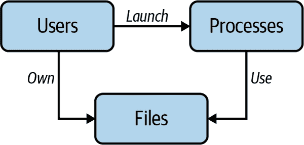
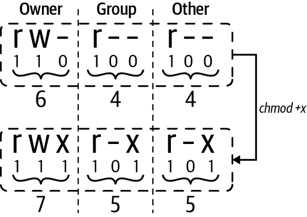

# 第四章：访问控制

在前一章关于所有与 shell 和脚本相关的广泛范围之后，我们现在专注于 Linux 中一个特定且至关重要的安全方面。在本章中，我们讨论了用户及其对资源（特别是文件）的访问控制的主题。

在这样一个多用户设置中，一个立即想到的问题是所有权。例如，用户可能拥有一个文件。他们被允许从文件中读取、向文件中写入，还可以删除它。考虑到系统上还有其他用户，那么这些用户被允许做什么，这是如何定义和强制执行的呢？也有一些活动可能并不是您首先会与文件相关联的。例如，用户可能（或者可能不会）被允许更改与网络相关的设置。

为了掌握这个主题，我们首先将从访问的角度看一下用户、进程和文件之间的基本关系。我们还将回顾沙盒和访问控制类型。接下来，我们将专注于 Linux 用户的定义，用户可以做什么，以及如何在本地或者从中心位置管理用户。

接下来，我们将进入权限的主题，我们将看看如何控制对文件的访问以及这种限制如何影响进程。

我们将结束本章，涵盖访问控制领域一系列高级 Linux 功能，包括能力、seccomp 配置文件和 ACL。为了完善内容，我们将提供一些关于权限和访问控制的安全良好实践。

有了这些基础，让我们直接进入用户和资源所有权的主题，为本章的其余部分打下基础。

# 基础知识

在我们深入访问控制机制之前，让我们退后一步，从鸟瞰视角来看一下这个主题。这将帮助我们建立一些术语，并澄清主要概念之间的关系。

## 资源和所有权

Linux 是一个多用户操作系统，因此从 UNIX 继承了用户（见“Users”）的概念。每个用户帐户都与一个用户 ID 相关联，可以访问可执行文件、文件、设备和其他 Linux 资产。人类用户可以使用用户帐户登录，进程可以作为用户帐户运行。然后，有资源（我们简单地称之为*文件*），这些资源可以是用户可用的任何硬件或软件组件。在一般情况下，我们将资源称为文件，除非我们明确讨论访问其他类型资源的情况，比如系统调用。在图 4-1 和随后的段落中，您可以看到 Linux 中用户、进程和文件之间的高级关系。



###### 图 4-1\. Linux 中的用户、进程和文件

用户

启动进程并拥有文件。*进程*是内核加载到主存储器并运行的程序（可执行文件）。

文件

有所有者；默认情况下，创建文件的用户拥有它。

进程

使用文件进行通信和持久性。当然，用户间接地也会使用文件，但他们需要通过进程来进行。

这种用户、进程和文件之间关系的描述当然是一个非常简化的视角，但它使我们能够理解这些参与者及其关系，并且在我们详细讨论这些不同角色之间的互动时将会派上用场。

首先让我们看一下一个进程的执行上下文，解答进程的受限程度问题。在谈论资源访问时，我们经常会遇到一个术语，即*沙盒化*。

## 沙盒化

*沙盒化*是一个模糊定义的术语，可以指一系列不同的方法，从监狱到容器再到虚拟机，这些方法可以在内核或用户空间中管理。通常在沙盒中会运行一些应用程序，监管机制会在沙盒化的进程和托管环境之间实施一定程度的隔离。如果这些听起来相当理论化，我请求您稍微耐心等待。我们将在本章后面看到沙盒化的实际操作，在“seccomp Profiles”中，以及在第九章中再次讨论虚拟机和容器时在 ch09.xhtml#advanced 中。

在您的脑海中对资源、所有权和对资源的访问有了基本理解后，让我们简要讨论一些概念上的访问控制方法。

## 访问控制类型

访问控制的一个方面是访问本身的性质。用户或进程是否直接访问资源，可能是无限制的方式？或者可能有一组明确的规则，规定进程在什么情况下可以访问什么样的资源（文件或系统调用）。或者访问本身甚至被记录。

在概念上，有不同的访问控制类型。在 Linux 环境中，最重要和相关的两种是*自主*访问控制和*强制*访问控制：

自主访问控制

使用自主访问控制（DAC），其思想是基于用户身份限制对资源的访问。在某种程度上，这是自主的，即某些权限的用户可以将其传递给其他用户。

强制访问控制

强制访问控制基于表示安全级别的层次模型。用户被分配一个许可级别，资源被分配一个安全标签。用户只能访问其自身许可级别等于或低于的资源。在强制访问控制模型中，管理员严格和独占地控制访问，设置所有权限。换句话说，即使拥有资源的用户也不能自行设置权限。

此外，Linux 传统上采取全有或全无的态度，即您要么是超级用户具有更改所有内容的权限，要么是普通用户权限受限。最初，并没有一种简单灵活的方法来为用户或进程分配某些特权。例如，在一般情况下，要使“进程 X 被允许更改网络设置”，您必须给予其`root`访问权限。这自然会对遭受攻击的系统产生具体影响：攻击者可以轻易滥用这些广泛的特权。

###### 注意

要稍微解释一下 Linux 中的“全有或全无态度”：在大多数 Linux 系统中，默认情况下允许“其他人”（即系统上的所有用户）对几乎所有文件和可执行文件进行读取访问。例如，启用 SELinux 后，强制访问控制仅限于明确授予权限的资产。因此，例如，Web 服务器只能使用 80 和 443 端口，只能共享特定目录中的文件和脚本，只能将日志写入特定位置，依此类推。

我们将在“高级权限管理”中重新讨论这个主题，并看看现代 Linux 功能如何帮助克服这种二元世界观，从而实现更精细的权限管理。

Linux 中可能最著名的强制访问控制实现是[SELinux](https://oreil.ly/HAOBS)。它是为了满足政府机构的高安全要求而开发的，并且通常用于这些环境，因为其严格的规则使得可用性受到影响。另一个 Linux 内核自版本 2.6.36 起包含的强制访问控制选项，在 Ubuntu 系列 Linux 发行版中相当流行，是[AppArmor](https://oreil.ly/rp4Fq)。

现在让我们转移到 Linux 中用户及其管理的话题上。

# 用户

在 Linux 中，我们通常从用途或预期使用的角度区分两种类型的用户账户：

所谓的系统用户或系统账户

典型地，程序（有时被称为*守护进程*）使用这些类型的账户来运行后台进程。这些程序提供的服务可以是操作系统的一部分，比如网络服务（例如，`sshd`），或者是应用层的服务（例如，流行的关系型数据库 `mysql`）。

普通用户

例如，通过 shell 与 Linux 交互使用的人类用户。

系统用户和普通用户之间的区别在技术上不那么明显，更多地是一种组织结构。要理解这一点，我们首先要介绍 Linux 中的用户 ID（UID）的概念，这是由 Linux 管理的一个 32 位数值。

Linux 通过 UID 标识用户，用户属于一个或多个组，由组 ID（GID）标识。有一种特殊的用户，UID 为 0，通常称为`root`。这位“超级用户”可以做任何事情，没有任何限制。通常情况下，你应该避免以`root`用户身份工作，因为拥有太大的权限可能会轻易毁坏系统（相信我，我曾经这么做过）。我们稍后会在本章节中再次讨论这个问题。

不同的 Linux 发行版有各自的方式来决定如何管理 UID 范围。例如，由`systemd`支持的发行版（参见`systemd`）在这里简化描述有以下约定：

UID 0

是`root`

UID 1 到 999

保留给系统用户使用

UID 65534

用户`nobody`是用来映射远程用户到一些已知 ID 的例子，比如“网络文件系统”

UID 1000 到 65533 和 65536 到 4294967294

普通用户

要查找自己的 UID，可以使用（惊喜！）`id`命令，如下所示：

```
$ id -u
2016796723
```

现在你已经了解了 Linux 用户的基础知识，让我们看看如何管理用户。

## 本地用户管理

第一个选项，也是传统上唯一可用的选项，是本地管理用户。也就是说，仅使用机器本地的信息，用户相关信息不会在多台机器之间共享。

对于本地用户管理，Linux 使用一个简单的基于文件的接口，其中命名方案有些混乱，这是一个历史遗留问题，我们不得不接受。表 4-1 列出了四个文件，共同实现用户管理。

表 4-1\. 本地用户管理文件参考

| 目的 | 文件 |
| --- | --- |
| 用户数据库 | */etc/passwd* |
| 组数据库 | */etc/group* |
| 用户密码 | */etc/shadow* |
| 组密码 | */etc/gshadow* |

把 */etc/passwd* 看作是一种迷你用户数据库，用来跟踪用户名称、UID、组成员资格和其他数据，例如常规用户使用的主目录和登录 shell。我们来看一个具体的例子：

```
$ cat /etc/passwd
root:x:0:0:root:/root:/bin/bash 
daemon:x:1:1:daemon:/usr/sbin:/usr/sbin/nologin 
bin:x:2:2:bin:/bin:/usr/sbin/nologin
sys:x:3:3:sys:/dev:/usr/sbin/nologin
nobody:x:65534:65534:nobody:/nonexistent:/usr/sbin/nologin
syslog:x:104:110::/home/syslog:/usr/sbin/nologin
mh9:x:1000:1001::/home/mh9:/usr/bin/fish 
```


root 用户的 UID 为 0。


系统账户（`nologin`表明其用途；后文会详细讨论）。


我的用户账户。

让我们仔细看一下 */etc/passwd* 中的一行，以详细了解用户条目的结构：

```
root:x:0:0:root:/root:/bin/bash
^    ^ ^ ^ ^    ^     ^
|    | | | |    |     └──  
|    | | | |    └──  
|    | | | └──  
|    | | └── 
|    | └──  
|    └──  
└──  
```


要使用的登录 shell。为了阻止交互式登录，可以使用 */sbin/nologin*。


用户的主目录，默认为 */*。


用户信息，如全名或联系电话等。通常也被称为[GECOS](https://oreil.ly/ZWQ0f)字段。请注意，不使用 GECOS 格式化，而是通常用于与帐户关联的人的全名。


用户的主要组（GID）；另请参阅*/etc/group*。


UID。请注意，Linux 为系统使用保留了 1000 以下的 UID。


用户的密码，使用`x`字符意味着（加密的）密码存储在*/etc/shadow*中，默认情况下是这样的。


用户名，必须是 32 个字符或更少。

我们注意到*/etc/passwd*中缺少的一件事情是我们基于其名称期望在那里找到的事情：密码。出于历史原因，密码存储在一个称为*/etc/shadow*的文件中。虽然每个用户都可以读取*/etc/passwd*，但通常需要`root`权限才能读取*/etc/shadow*。

要添加用户，您可以使用[`adduser`](https://oreil.ly/HQVZK)命令如下：

```
$ sudo adduser mh9
Adding user `mh9' ...
Adding new group `mh9' (1001) ...
Adding new user `mh9' (1000) with group `mh9' ...
Creating home directory `/home/mh9' ...  Copying files from `/etc/skel' ... 
New password: 
Retype new password:
passwd: password updated successfully
Changing the user information for mh9
Enter the new value, or press ENTER for the default 
        Full Name []: Michael Hausenblas
        Room Number []:
        Work Phone []:
        Home Phone []:
        Other []:
Is the information correct? [Y/n] Y
```


`adduser`命令会创建一个主目录。


它还会复制一堆默认的配置文件到主目录。


需要定义一个密码。


提供可选的 GECOS 信息。

如果您想创建一个系统账户，请使用`-r`选项。这将禁用使用登录 shell，并且避免创建家目录。有关配置详细信息，还可以参考*/etc/adduser.conf*，包括用于 UID/GID 范围的选项。

除了用户外，Linux 还有组的概念，从某种意义上说，它只是一个或多个用户的集合。任何常规用户都属于一个默认组，但可以成为其他组的成员。您可以通过*/etc/group*文件了解有关组和映射的信息：

```
$ cat /etc/group 
root:x:0:
daemon:x:1:
bin:x:2:
sys:x:3:
adm:x:4:syslog
...
ssh:x:114:
landscape:x:115:
admin:x:116:
netdev:x:117:
lxd:x:118:
systemd-coredump:x:999:
mh9:x:1001: 
```


显示组映射文件的内容。


一个我的用户组示例，其 GID 为 1001。请注意，您可以在最后一个冒号后添加逗号分隔的用户名列表，以允许多个用户具有该组权限。

现在我们已经掌握了这个基本的用户概念和管理方法，我们可以进一步探讨一种在专业设置中更好地管理用户的可能方式，从而支持扩展。

## 集中化用户管理

如果您有多台或多个服务器需要管理用户——比如在专业设置中——那么快速在本地管理用户很快就会变得老旧。您希望有一种集中式的方式来管理用户，可以将其应用到特定的机器上。根据您的需求和（时间）预算，有几种可供选择的方法：

基于目录

[轻量目录访问协议 (LDAP)](https://oreil.ly/Ll5AU)，一套几十年历史的协议套件，现在由 IETF 正式规范化，定义了如何通过 Internet Protocol (IP)访问和维护分布式目录。您可以自行运行 LDAP 服务器，例如使用像[Keycloak](https://oreil.ly/j6qm2)这样的项目，或者将其外包给云提供商，如 Azure Active Directory。

通过网络

用户可以使用 Kerberos 以此方式进行身份验证。我们将在“Kerberos”中详细讨论 Kerberos。

使用配置管理系统

这些系统，包括 Ansible、Chef、Puppet 或 SaltStack，可用于在多台机器上一致地创建用户。

实际实现通常受环境限制。也就是说，公司可能已经在使用 LDAP，因此选择可能有限。然而，不同方法的细节及其利弊超出了本书的范围。

# 权限

在本节中，我们首先详细介绍 Linux 文件权限，这对访问控制的工作方式至关重要，然后再看看关于进程权限的权限。也就是说，我们将审查运行时权限以及它们是如何从文件权限中派生的。

## 文件权限

文件权限对于 Linux 中资源访问的概念至关重要，因为在 Linux 中，几乎所有东西都可以视为文件。让我们首先回顾一些术语，然后详细讨论围绕文件访问和权限的元数据表示。

有三种类型或范围的权限，从狭窄到宽：

用户

文件的所有者

组

具有一个或多个成员

其他

用于其他所有人的类别

此外，有三种类型的访问方式：

读取（`r`）

对于普通文件，这允许用户查看文件内容。对于目录，这允许用户查看目录中文件的名称。

写入（`w`）

对于普通文件，这允许用户修改和删除文件。对于目录，这允许用户在目录中创建、重命名和删除文件。

执行（`x`）

对于普通文件，这允许用户在具有读取权限的情况下执行文件。对于目录，这允许用户访问目录中的文件信息，有效地允许他们切换到它（`cd`）或列出其内容（`ls`）。

让我们看看文件权限的实际操作（请注意，这里`ls`命令输出中的空格已经展开以提高可读性）：

```
$ ls -al
total 0
-rw-r--r--  1  mh9  devs  9  Apr 12 11:42  test
^           ^  ^    ^     ^  ^             ^
|           |  |    |     |  |             └──  
|           |  |    |     |  └──  
|           |  |    |     └──  
|           |  |    └── 
|           |  └──  
|           └──  
└──  
```


文件名


最后修改时间戳


文件大小（以字节为单位）


文件所属的组


文件所有者


[硬链接](https://oreil.ly/9Gfzu)的数量


文件模式

当深入查看*文件模式*时——即文件类型和权限，如前面片段中所称的，我们可以了解到各字段的具体含义：

```
. rwx rwx rwx
^ ^   ^   ^
| |   |   └──  
| |   └──  
| └──  
└── 
```


其他用户的权限


组的权限


文件所有者的权限


文件类型（参见表格 4-2）

文件模式中的第一个字段表示文件类型；详细信息请参见表格 4-2。文件模式的其余部分编码了针对各种目标（从所有者到每个人）设置的权限，如表格 4-3 中所列。

表格 4-2\. 文件模式中使用的文件类型

| 符号 | 语义 |
| --- | --- |
| `-` | 普通文件（例如执行`touch abc`时） |
| `b` | 块特殊文件 |
| `c` | 字符特殊文件 |
| `C` | 高性能（连续数据）文件 |
| `d` | 目录 |
| `l` | 符号链接 |
| `p` | 命名管道（使用`mkfifo`创建） |
| `s` | 套接字 |
| `?` | 其他（未知）文件类型 |

一些其他（旧的或过时的）字符，如`M`或`P`，在位置`0`上使用，您大部分可以忽略。如果您对它们的含义感兴趣，请运行`info ls -n "What information is listed"`。

这些文件模式中的权限结合起来，定义了对目标集合的每个元素（用户、组、其他所有人）所允许的操作，如表格 4-3 中所示，通过[access](https://oreil.ly/wwLsV)进行检查和执行。

表格 4-3\. 文件权限

| 模式 | 生效权限 | 十进制表示 |
| --- | --- | --- |
| `---` | 无 | 0 |
| `--x` | 执行 | 1 |
| `-w-` | 写 | 2 |
| `-wx` | 写和执行 | 3 |
| `r--` | 只读 | 4 |
| `r-x` | 读和执行 | 5 |
| `rw-` | 读和写 | 6 |
| `rwx` | 读、写、执行 | 7 |

让我们看几个示例：

`755`

对其所有者完全访问；其他所有人仅读和执行

`700`

对其所有者完全访问；其他所有人无权限

`664`

对所有者和组读写访问；其他人只读

`644`

对所有者读写；其他人只读

`400`

只有所有者可读

`664`在我的系统上具有特殊含义。当我创建文件时，它被分配为默认权限。您可以通过[`umask`命令](https://oreil.ly/H9ksX)来检查，我的情况下是`0002`。

`setuid`权限用于告诉系统以所有者身份运行可执行文件，并使用所有者的权限。如果文件由`root`所有，可能会引起问题。

您可以使用`chmod`更改文件的权限。您可以显式指定所需的权限设置（如`644`），也可以使用快捷方式（例如，`+x`使其可执行）。但实际上是什么样子呢？

让我们使用`chmod`使文件可执行：

```
$ ls -al /tmp/masktest
-rw-r--r-- 1 mh9 dev 0 Aug 28 13:07 /tmp/masktest 

$ chmod +x /tmp/masktest 

$ ls -al /tmp/masktest
-rwxr-xr-x 1 mh9 dev 0 Aug 28 13:07 /tmp/masktest 
```


最初，文件权限对于所有者是`r/w`，对于其他人只读，即`644`。


使文件可执行。


现在，文件权限对于所有者是`r/w/x`，对于其他人是`r/x`，即`755`。

在图 4-2 中，您可以看到底层发生了什么。请注意，您可能不希望每个人都有执行文件的权利，因此在这里使用`chmod 744`可能更好，仅为所有者提供正确的权限，而不会更改其余部分。我们将在“良好实践”中进一步讨论这个话题。



###### 图 4-2。使文件可执行以及随之更改的文件权限

你也可以使用`chown`（和`chgrp`用于组）更改所有权：

```
$ touch myfile
$ ls -al myfile
-rw-rw-r-- 1 mh9 mh9 0 Sep 4 09:26 myfile 

$ sudo chown root myfile 
-rw-rw-r-- 1 root mh9 0 Sep 4 09:26 myfile
```


我创建并拥有的文件*myfile*。


经过`chown`后，`root`拥有该文件。

在讨论了基本的权限管理之后，让我们看看在这个领域中的一些更高级的技术。

## 进程权限

到目前为止，我们关注的是人类用户如何访问文件以及所涉及的权限。现在我们将重点转向进程。在“资源和所有权”中，我们谈到了用户如何拥有文件以及进程如何使用文件。这引发了一个问题：从进程角度来看，相关的权限是什么？

如[`credentials(7)`手册页](https://oreil.ly/o7gf6)中所述，在运行时权限的上下文中存在不同的用户 ID。

实际 UID

*实际*UID 是启动进程的用户的 UID。它表示人类用户在进程所有权方面的所有权。进程本身可以通过[`getuid(2)`](https://oreil.ly/Efi4H)获取其实际 UID，并且您可以通过 shell 使用`stat -c "%u %g" /proc/$pid/`查询它。

有效 UID

Linux 内核使用*有效*UID 来确定进程在访问共享资源（如消息队列）时的权限。在传统的 UNIX 系统中，它们也用于文件访问。但是 Linux 以前使用专用的文件系统 UID（参见下面的讨论）来控制文件访问权限，出于兼容性考虑仍然支持。进程可以通过[`geteuid(2)`](https://oreil.ly/b69OQ)获取其有效 UID。

保存的设置用户 ID

在`suid`情况下，保存的设置用户 ID 用于允许进程通过在实际 UID 和保存的设置用户 ID 之间切换其有效 UID 来获取特权。例如，为了允许进程使用某些网络端口（请参阅“端口”），它需要以`root`身份运行。进程可以通过[`getresuid(2)`](https://oreil.ly/01QVp)获取其保存的设置用户 ID。

文件系统 UID

这些特定于 Linux 的 ID 用于确定文件访问的权限。最初引入这一 UID 是为了支持文件服务器代表普通用户执行操作，同时将该进程与该用户发出的信号隔离。程序通常不直接操作该 UID。内核跟踪有效 UID 何时更改，并自动将文件系统 UID 与之同步。这意味着通常文件系统 UID 与有效 UID 相同，但可以通过[`setfsuid(2)`](https://oreil.ly/NhhNr)更改。请注意，从技术上讲，自内核 v2.0 起不再需要此 UID，但出于兼容性考虑仍受支持。

最初，通过`fork(2)`创建子进程时，它会继承父进程的 UID 副本；而在`execve(2)`系统调用期间，进程的真实 UID 会保留，但有效 UID 和已保存的设置用户 ID 可能会发生变化。

例如，当您运行`passwd`命令时，您的有效 UID 是您的 UID，假设为 1000。现在，`passwd`启用了`suid`设置，这意味着当您运行它时，您的有效 UID 是 0（即`root`）。还有其他影响有效 UID 的方式，例如使用`chroot`和其他沙箱技术。

###### 注意

[POSIX 线程](https://oreil.ly/kJFaJ)要求所有线程共享凭证。但在内核级别，Linux 为每个线程维护单独的用户和组凭证。

除了文件访问权限外，内核还使用进程 UID 来执行其他任务，包括但不限于以下内容：

+   建立信号发送权限——例如确定当您对某个进程 ID 执行`kill -9`时会发生什么。我们将在第六章回到这个问题。

+   用于调度和优先级的权限处理（例如`nice`）。

+   在容器环境下，我们将详细讨论资源限制检查，参见第九章。

在处理`suid`时，理解有效 UID 可能会很直接，但一旦涉及到能力（capabilities），情况可能会更复杂。

# 高级权限管理

尽管我们迄今专注于广泛使用的机制，但本节的主题在某种意义上属于高级内容，并不一定适合休闲或爱好设置。对于专业使用——即部署业务关键工作负载的生产用例——您至少应了解以下高级权限管理方法。

## 能力（Capabilities）

在 Linux 中，与传统的 UNIX 系统一样，当`root`用户运行进程时没有任何限制。换句话说，内核只区分两种情况：

+   特权进程，绕过内核权限检查，其有效 UID 为 0（即`root`）

+   对于非特权进程，其有效 UID 非零，在内核执行权限检查时，详见“进程权限”

自内核 v2.2 引入 [capabilities syscall](https://oreil.ly/1Fma7) 以来，这种二元世界观已经改变：传统上与 `root` 相关联的特权现在被分解为可以独立分配到每个线程级别的不同单元。

在实际应用中，基本思想是普通进程没有任何权限，受到前面讨论的权限控制。你可以为可执行文件（二进制文件和 shell 脚本）以及进程分配权限，逐步增加执行任务所需的特权（详见“良好实践”中的讨论）。

现在需要提醒一下：特权通常只与系统级任务相关。换句话说，大多数情况下你不一定需要依赖它们。

在 Table 4-4 中，你可以看到一些更广泛使用的特权。

Table 4-4\. 有用特权的示例

| 特权 | 语义 |
| --- | --- |
| `CAP_CHOWN` | 允许用户对文件的 UID/GID 进行任意更改 |
| `CAP_KILL` | 允许向属于其他用户的进程发送信号 |
| `CAP_SETUID` | 允许更改 UID |
| `CAP_SETPCAP` | 允许设置正在运行进程的特权 |
| `CAP_NET_ADMIN` | 允许执行各种网络相关操作，例如接口配置 |
| `CAP_NET_RAW` | 允许使用 RAW 和 PACKET sockets |
| `CAP_SYS_CHROOT` | 允许调用 `chroot` |
| `CAP_SYS_ADMIN` | 允许系统管理员操作，包括挂载文件系统 |
| `CAP_SYS_PTRACE` | 允许使用 `strace` 调试进程 |
| `CAP_SYS_MODULE` | 允许加载内核模块 |

现在让我们看看特权如何发挥作用。首先，要查看特权，可以使用如下命令（输出已编辑以适应）：

```
$ capsh --print 
Current: =
Bounding set =cap_chown,cap_dac_override,cap_dac_read_search,
cap_fowner,cap_fsetid,cap_kill,cap_setgid,cap_setuid,cap_setpcap,
...

$ grep Cap /proc/$$/status 
CapInh: 0000000000000000
CapPrm: 0000000000000000
CapEff: 0000000000000000
CapBnd: 000001ffffffffff
CapAmb: 0000000000000000
```


系统上所有特权的概述


当前进程（shell）的特权

你可以通过 [getcap](https://oreil.ly/03bkF) 和 [setcap](https://oreil.ly/cuBwc) 在文件级别上细粒度管理权限（本章节不涉及详细内容和良好实践）。

权限能帮助实现从全有或全无的方式向基于文件更精细的特权过渡。现在让我们转向另一个高级访问控制主题：seccomp 的沙箱技术。

## seccomp 配置文件

[安全计算模式（seccomp）](https://oreil.ly/p5iuR) 是自 2005 年以来可用的 Linux 内核特性。这种沙箱技术的基本思想是，通过一个专用的系统调用 `seccomp(2)`，可以限制进程可以使用的系统调用。

虽然你可能觉得直接管理 seccomp 有些不便，但是有方法可以在不太费力的情况下使用它。例如，在容器环境中（参见“容器”），[Docker](https://oreil.ly/A78pm) 和 [Kubernetes](https://oreil.ly/oYFsK) 都支持 seccomp。

现在让我们来看看传统的、精细的文件权限的扩展。

## 访问控制列表

使用访问控制列表（ACL），我们在 Linux 上有一个灵活的权限机制，可以在传统权限之上或作为补充使用，这些传统权限在“文件权限”中已经讨论过。ACL 解决了传统权限的一个缺点，即允许您为不在用户组列表中的用户或组授予权限。

要检查您的发行版是否支持 ACL，可以使用`grep -i acl /boot/config*`，希望在输出中的某处找到`POSIX_ACL=Y`以确认。为了在文件系统上使用 ACL，必须在挂载时启用`acl`选项。关于[acl](https://oreil.ly/Ngr0m)的文档参考有很多有用的细节。

我们不会在这里详细讨论 ACL，因为它们略微超出了本书的范围；然而，了解它们并知道从哪里开始可能会有好处，如果你在实际中遇到它们的话。

有了这些，让我们回顾一些访问控制的良好实践。

# 良好实践

在访问控制的更广泛背景中，这里有一些安全的“良好实践”。尽管其中一些可能更适用于专业环境，但每个人至少应该意识到它们。

最小权限

最小权限原则简言之，一个人或进程只应具有完成特定任务所需的必要权限。例如，如果一个应用程序不写入文件，则它只需要读取访问权限。在访问控制的上下文中，您可以通过两种方式实践最小权限：

+   在“文件权限”中，我们看到使用`chmod +x`时会发生什么。除了您打算的权限外，它还为其他用户分配了一些额外的权限。使用数字模式的显式权限比符号模式更好。换句话说：虽然后者更方便，但不够严格。

+   尽量避免以 root 身份运行。例如，当您需要安装某些东西时，应该使用`sudo`而不是以`root`登录。

注意，如果您正在编写应用程序，可以使用 SELinux 策略限制对仅选定的文件、目录和其他功能的访问。相比之下，默认的 Linux 模型可能会使应用程序能够访问系统上留下的任何打开文件。

避免使用 setuid

利用能力而不是依赖于`setuid`，后者像是一把大锤，为攻击者提供了接管系统的绝佳途径。

审计

审计是记录行为（以及谁执行了它们）的概念，以一种不可篡改的方式记录。然后，您可以使用这个只读日志来验证谁在什么时候做了什么。我们将在第八章中深入探讨这个主题。

# 结论

现在你了解了 Linux 如何管理用户、文件和资源访问，你拥有了一切必要的工具来安全、可靠地执行日常任务。

对于在 Linux 上进行任何实际工作，请记住用户、进程和文件之间的关系。这在 Linux 作为多用户操作系统的背景下至关重要，对于安全运行和避免损害都是关键的。

我们回顾了访问控制类型，定义了 Linux 中的用户及其能力，并讨论了如何在本地和中心化管理它们。文件权限及其管理可能有些棘手，但掌握它主要是一个实践问题。

在容器环境中，高级权限技术，包括能力和 seccomp 配置文件，非常相关。

在最后一节中，我们讨论了关于访问控制相关安全的良好实践，特别是应用最少特权。

如果你想深入了解本章讨论的主题，这里有一些资源：

概述

+   [“访问控制策略调查”](https://oreil.ly/0PpnS) 由阿曼达·克劳尔编写

+   [Lynis](https://oreil.ly/SXSkp)，一款审计和合规性测试工具

能力

+   [“实践中的 Linux 能力”](https://oreil.ly/NIdPu)

+   [“Linux 权限管理：让它们发挥作用”](https://oreil.ly/qsYJN)

seccomp

+   [“seccomp 概述”](https://oreil.ly/2cKGI)

+   [“在 Linux 中使用零行代码进行沙盒化”](https://oreil.ly/U5bYG)

访问控制列表

+   [“在 Linux 上使用 POSIX 访问控制列表”](https://oreil.ly/gbc4A)

+   [“访问控制列表”](https://oreil.ly/owpYE) 通过 ArchLinux

+   [“Linux 访问控制列表（ACL）简介”](https://oreil.ly/WCjpN) 由 Red Hat 提供

请记住安全是一个持续的过程，因此您需要密切关注用户和文件，我们将在第八章和第九章中详细讨论这一点，但现在让我们转向文件系统的话题。
