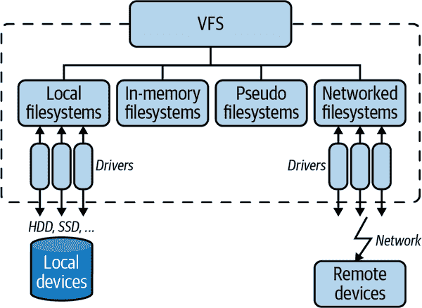
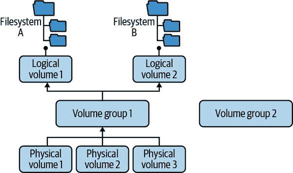
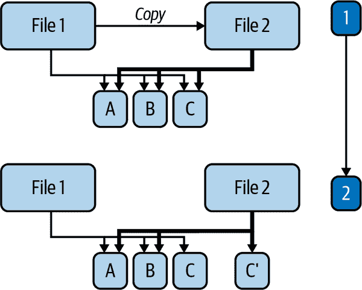

# 第五章：文件系统

在本章中，我们专注于文件和文件系统。UNIX 的“一切皆文件”的概念在 Linux 中继续存在，尽管这并非始终如此，但 Linux 中的大多数资源确实是文件。文件可以是您写给学校的信件内容，也可以是您从显然安全和受信任的网站下载的有趣的 GIF 图像。

在 Linux 中，还有其他一些东西被公开为文件，例如设备和伪设备，比如在`echo "Hello modern Linux users" > /dev/pts/0`中，它会将“Hello modern Linux users”打印到屏幕上。虽然您可能不会将这些资源与文件关联起来，但您可以使用与常规文件相同的方法和工具访问它们。例如，内核公开了有关进程的某些运行时信息（如在“进程管理”中讨论的那样），如其 PID 或用于运行进程的二进制文件。

所有这些事物的共同之处在于标准化的统一接口：打开文件、收集有关文件的信息、向文件写入等等。在 Linux 中，[文件系统](https://oreil.ly/9CEdn)提供了这种统一接口。这种接口与 Linux 将文件视为一系列字节流而无需关注结构的事实一起，使我们能够构建可以处理各种不同文件类型的工具。

此外，文件系统提供的统一接口减少了您的认知负荷，使您能够更快地学习如何使用 Linux。

在这一章中，我们首先定义了一些相关术语。然后，我们看看 Linux 如何实现“一切皆文件”的抽象概念。接下来，我们回顾了内核用于公开有关进程或设备信息的特定用途文件系统。然后，我们转向普通文件和文件系统，这些通常与文档、数据和程序相关联。我们比较文件系统选项并讨论常见操作。

# 基础知识

在我们深入讨论文件系统术语之前，让我们先明确一些关于文件系统的隐含假设和期望：

+   尽管有例外情况，但今天大多数广泛使用的文件系统都是分层的。也就是说，它们为用户提供了一个以根目录（`/`）开始的单一文件系统树。

+   在文件系统树中，您会找到两种不同类型的对象：目录和文件。将目录视为一个组织单元，允许您对文件进行分组。如果您想应用树的类比，目录就是树中的节点，而叶子可以是文件或目录。

+   您可以通过列出目录内容（`ls`）、切换到该目录（`cd`）以及打印当前工作目录（`pwd`）来导航文件系统。

+   权限是内建的：正如在“权限”中讨论的那样，文件系统捕获的属性之一是所有权。因此，所有权通过分配的权限强制访问文件和目录。

+   一般来说，文件系统是在内核中实现的。

###### 注意

虽然出于性能原因，文件系统通常是在内核空间中实现的，但也有在用户空间中实现它们的选项。请参阅[用户空间文件系统（FUSE）文档](https://oreil.ly/hIVgq)和[libfuse 项目网站](https://oreil.ly/cEZyY)。

在这个非正式的高层解释之后，我们现在专注于一些更清晰的术语定义，你需要理解：

驱动器

一个（物理）块设备，如硬盘驱动器（HDD）或固态硬盘（SSD）。在虚拟机的上下文中，驱动器也可以被模拟，例如*/dev/sda*（SCSI 设备）或*/dev/sdb*（SATA 设备）或*/dev/hda*（IDE 设备）。

分区

您可以将驱动器逻辑地分割成分区，一组存储扇区。例如，您可以决定在您的 HDD 上创建两个分区，然后它们将显示为*/dev/sdb1*和*/dev/sdb2*。

卷

卷与分区有些相似，但更灵活，也为特定文件系统格式化。我们将在“逻辑卷管理器”中详细讨论卷。

超级块

格式化后，文件系统在开头有一个特殊的部分，用于捕获文件系统的元数据。这包括文件系统类型、块、状态以及每个块中的索引节点数。

索引节点

在文件系统中，索引节点存储关于文件的元数据，如大小、所有者、位置、日期和权限。然而，索引节点不存储文件名和实际数据。这些信息保存在目录中，实际上目录只是一种特殊类型的常规文件，将索引节点映射到文件名。

那是很多理论，让我们看看这些概念是如何应用的。首先，这里是如何查看系统中存在的驱动器、分区和卷：

```
$ lsblk --exclude 7 
NAME                      MAJ:MIN RM   SIZE RO TYPE MOUNTPOINTS
sda                         8:0    0 223.6G  0 disk              
├─sda1                      8:1    0   512M  0 part /boot/efi    
└─sda2                      8:2    0 223.1G  0 part              
  ├─elementary--vg-root   253:0    0 222.1G  0 lvm  /
  └─elementary--vg-swap_1 253:1    0   976M  0 lvm  [SWAP]
```


列出所有块设备，但排除伪（循环）设备。


我们有一个名为*sda*的磁盘驱动器，总共有 223 GB。


这里有两个分区，其中*sda1*是引导分区。


第二个分区，名为*sda2*，包含两个卷（详细信息请参阅“逻辑卷管理器”）。

现在我们已经对物理和逻辑设置有了一个整体的概念，让我们更仔细地看看正在使用的文件系统：

```
$ findmnt -D -t nosquashfs 
SOURCE                          FSTYPE     SIZE  USED  AVAIL USE% TARGET
udev                            devtmpfs   3.8G     0   3.8G   0% /dev
tmpfs                           tmpfs    778.9M  1.6M 777.3M   0% /run
/dev/mapper/elementary--vg-root ext4     217.6G 13.8G 192.7G   6% /
tmpfs                           tmpfs      3.8G 19.2M   3.8G   0% /dev/shm
tmpfs                           tmpfs        5M    4K     5M   0% /run/lock
tmpfs                           tmpfs      3.8G     0   3.8G   0% /sys/fs/cgroup
/dev/sda1                       vfat       511M    6M 504.9M   1% /boot/efi
tmpfs                           tmpfs    778.9M   76K 778.8M   0% /run/user/1000
```


列出文件系统，但排除[squashfs 类型](https://oreil.ly/vS88y)（专门用于 CD 的只读压缩文件系统，现在也用于快照）。

我们可以进一步查看单个文件系统对象，如目录或文件：

```
$ stat myfile
  File: myfile
  Size: 0               Blocks: 0          IO Block: 4096   regular empty file 
Device: fc01h/64513d    Inode: 555036      Links: 1 
Access: (0664/-rw-rw-r--)  Uid: ( 1000/     mh9)   Gid: ( 1001/     mh9)
Access: 2021-08-29 09:26:36.638447261 +0000
Modify: 2021-08-29 09:26:36.638447261 +0000
Change: 2021-08-29 09:26:36.638447261 +0000
 Birth: 2021-08-29 09:26:36.638447261 +0000
```


文件类型信息


设备和索引节点的信息

在前面的命令中，如果我们使用了`stat .`（注意点号），我们会得到相应目录文件的信息，包括其 inode、使用的块数等。

表 5-1 列出了一些基本的文件系统命令，可以帮助你探索我们之前介绍的概念。

表 5-1\. 选择低级文件系统和块设备命令

| Command | Use case |
| --- | --- |
| `lsblk` | 列出所有块设备 |
| `fdisk`, `parted` | 管理磁盘分区 |
| `blkid` | 显示块设备属性，如 UUID |
| `hwinfo` | 显示硬件信息 |
| `file -s` | 显示文件系统和分区信息 |
| `stat`, `df -i`, `ls -i` | 显示和列出与 inode 相关的信息 |

在文件系统的上下文中，你会经常遇到*链接*这个术语。有时你想用不同的名称引用文件或提供快捷方式。在 Linux 中有两种类型的链接：

硬链接

引用 inode，并且不能引用目录。它们也不跨文件系统工作。

符号链接，或[symlinks](https://oreil.ly/yRWYA)

特殊文件，其内容是表示另一个文件路径的字符串。

现在让我们看看链接的实际应用（一些输出被缩短）：

```
$ ln myfile somealias 
$ ln -s myfile somesoftalias 

$ ls -al *alias 
-rw-rw-r-- 2 mh9 mh9 0 Sep  5 12:15 somealias
lrwxrwxrwx 1 mh9 mh9 6 Sep  5 12:45 somesoftalias -> myfile

$ stat somealias 
  File: somealias
  Size: 0               Blocks: 0          IO Block: 4096   regular empty file
Device: fd00h/64768d    Inode: 6302071     Links: 2
...
$ stat somesoftalias 
  File: somesoftalias -> myfile
  Size: 6               Blocks: 0          IO Block: 4096   symbolic link
Device: fd00h/64768d    Inode: 6303540     Links: 1
...
```


创建一个指向*myfile*的硬链接。


创建一个指向同一文件的软链接（注意使用了`-s`选项）。


列出文件。注意不同的文件类型和名称的渲染。我们也可以使用`ls -ali *alias`，这将显示关联到硬链接上的两个名称具有相同的 inode。


显示硬链接的文件详细信息。


显示软链接的文件详细信息。

现在你对文件系统术语已经很熟悉了，让我们探索 Linux 如何使任何类型的资源都可以作为文件对待。

# 虚拟文件系统

Linux 通过一种称为[virtual file system (VFS)](https://oreil.ly/3sZQ1)的抽象来管理许多资源（内存中的、本地附加的或网络存储中的），实现了类似文件的访问。其基本思想是在客户端（系统调用）和实现具体设备或其他资源操作的各个文件系统之间引入一层间接层。这意味着 VFS 将通用操作（打开、读取、寻找）与实际实现细节分离开来。

VFS 是内核中的一个抽象层，为客户端提供了一种基于文件范例的通用访问资源的方式。在 Linux 中，文件没有任何规定的结构；它只是一串字节流。客户端决定这些字节的含义。正如图 5-1 所示，VFS 抽象了对不同类型文件系统的访问：

本地文件系统，如`ext3`、XFS、FAT 和 NTFS

这些文件系统使用驱动程序访问本地块设备，如硬盘驱动器或固态驱动器。

内存中的文件系统，如`tmpfs`，不依赖于长期存储设备，而是存在于主存储器（RAM）中

我们将在“普通文件”中讨论这些以及之前的类别。

伪文件系统如`procfs`，如“伪文件系统”所述

这些文件系统也是内存中的。它们用于内核接口和设备抽象。

诸如 NFS、Samba、Netware（前身为 Novell）等网络文件系统

这些文件系统也使用驱动程序；然而，实际数据所在的存储设备不是本地附加的而是远程的。这意味着驱动程序涉及网络操作。因此，我们将在第七章中进行介绍。



###### 图 5-1\. Linux VFS 概述

描述 VFS 的构成并不容易。与文件相关的系统调用超过 100 个；然而，其核心操作可以分为几类，如表 5-2 中所列。

表 5-2\. 构成 VFS 接口的选择性系统调用

| 类别 | 示例系统调用 |
| --- | --- |
| Inodes | `chmod`, `chown`, `stat` |
| 文件 | `open`, `close`, `seek`, `truncate`, `read`, `write` |
| 目录 | `chdir`, `getcwd`, `link`, `unlink`, `rename`, `symlink` |
| 文件系统 | `mount`, `flush`, `chroot` |
| 其他 | `mmap`, `poll`, `sync`, `flock` |

许多 VFS 系统调用会分派到特定于文件系统的实现。对于其他系统调用，存在 VFS 的默认实现。此外，Linux 内核定义了相关的 VFS 数据结构—参见[*include/linux/fs.h*](https://oreil.ly/Fkq8i)—如下：

`inode`

核心文件系统对象，包括类型、所有权、权限、链接、指向包含文件数据的块的指针、创建和访问统计信息等

`file`

表示一个打开的文件（包括路径、当前位置和 inode）

`dentry`（目录条目）

存储其父项和子项

`super_block`

表示包括挂载信息的文件系统

其他

包括`vfsmount`和`file_system_type`

VFS 概述完成后，让我们更详细地查看细节，包括卷管理、文件系统操作和常见文件系统布局。

## 逻辑卷管理器

我们之前讨论过如何使用分区划分驱动器。尽管这是可能的，但特别是在需要调整大小（更改存储空间量）时，分区使用起来很困难。

逻辑卷管理器（LVM）在物理实体（如驱动器或分区）与文件系统之间使用一层间接，这样可以通过资源池化实现零风险、零停机时间的扩展和自动存储扩展。LVM 的工作方式如图 5-2 所示，关键概念在接下来的段落中解释。



###### 图 5-2\. Linux LVM 概述

物理卷（PV）

可能是磁盘分区、整个磁盘驱动器或其他设备。

逻辑卷（LV）

是从 VG 创建的块设备。在概念上类似于分区。在使用中可以轻松调整 LV 的大小。

卷组（VG）

是一组 PV 和 LV 之间的中介。将 VG 视为共同提供资源的 PV 池。

要使用 LVM 来[管理卷](https://oreil.ly/rYXVI)，需要一些工具；然而，它们的名称一致且相对易于使用：

PV 管理工具

+   `lvmdiskscan`

+   `pvdisplay`

+   `pvcreate`

+   `pvscan`

VG 管理工具

+   `vgs`

+   `vgdisplay`

+   `vgcreate`

+   `vgextend`

LV 管理工具

+   `lvs`

+   `lvscan`

+   `lvcreate`

让我们看看一些 LVM 命令的实际应用，使用一个具体的设置：

```
$ sudo lvscan 
  ACTIVE            '/dev/elementary-vg/root' [<222.10 GiB] inherit
  ACTIVE            '/dev/elementary-vg/swap_1' [976.00 MiB] inherit

$ sudo vgs 
  VG            #PV #LV #SN Attr   VSize    VFree
  elementary-vg   1   2   0 wz--n- <223.07g 16.00m

$ sudo pvdisplay 
  --- Physical volume ---
  PV Name               /dev/sda2
  VG Name               elementary-vg
  PV Size               <223.07 GiB / not usable 3.00 MiB
  Allocatable           yes
  PE Size               4.00 MiB
  Total PE              57105
  Free PE               4
  Allocated PE          57101
  PV UUID               2OrEfB-77zU-jun3-a0XC-QiJH-erDP-1ujfAM
```


列出逻辑卷；我们有两个（*root* 和 *swap_1*），使用卷组 *elementary-vg*。


显示卷组；我们有一个名为 *elementary-vg*。


显示物理卷；我们有一个（*/dev/sda2*），分配给卷组 *elementary-vg*。

无论您使用分区还是 LV，接下来需要进行两个步骤才能使用文件系统。

## 文件系统操作

在下一节中，我们将讨论如何在给定分区或使用 LVM 创建的逻辑卷上创建文件系统。涉及两个步骤：创建文件系统——在其他非 Linux 操作系统中，此步骤有时称为*格式化*——然后将其挂载或插入到文件系统树中。

### 创建文件系统

要使用文件系统，第一步是创建一个。这意味着您正在设置组成文件系统的管理部件，以分区或卷作为输入。如果您不确定如何收集有关输入的必要信息，请参考表 5-1，一旦准备就绪，使用[`mkfs`](https://oreil.ly/uqI57)创建文件系统。

`mkfs`有两个主要输入：您想要创建的文件系统类型（查看我们在“常见文件系统”讨论的选项之一）和要在其上创建文件系统的设备（例如，逻辑卷）：

```
mkfs -t ext4 \ 
    /dev/some_vg/some_lv 
```


创建类型为`ext4`的文件系统。


在逻辑卷*/dev/some_vg/some_lv*上创建文件系统。

如前所述，要创建文件系统并没有太多工作，因此您主要的工作是弄清楚要使用的文件系统类型。

使用`mkfs`创建了文件系统后，您可以将其在文件系统树中可用。

### 挂载文件系统

挂载文件系统意味着将其附加到文件系统树（从根目录开始）。使用[`mount`命令](https://oreil.ly/c6ryR)来附加文件系统。`mount`有两个主要输入：你想要附加的设备和文件系统树中的位置。此外，你还可以提供其他输入，包括挂载选项（通过`-o`），如只读，以及通过[`--bind`](https://oreil.ly/C2QuV)进行绑定挂载，用于将目录挂载到文件系统树中。我们将在容器的背景下重新讨论后者。

你也可以单独使用`mount`。以下是如何列出现有挂载点的方法：

```
$ mount -t ext4,tmpfs 
tmpfs on /run type tmpfs (rw,nosuid,noexec,relatime,size=797596k,mode=755)
/dev/mapper/elementary--vg-root on / type ext4 (rw,relatime,errors=remount-ro) 
tmpfs on /dev/shm type tmpfs (rw,nosuid,nodev)
tmpfs on /run/lock type tmpfs (rw,nosuid,nodev,noexec,relatime,size=5120k)
tmpfs on /sys/fs/cgroup type tmpfs (ro,nosuid,nodev,noexec,mode=755)
```


列出挂载点，但只显示特定的文件系统类型（这里是`ext4`和`tmpfs`）。


一个挂载的示例：LVM VG */dev/mapper/elementary--vg-root* 类型为`ext4`，挂载在根目录。

你必须确保使用与其创建时相同的类型挂载文件系统。例如，如果你试图使用`mount -t vfat /dev/sdX2 /media`挂载 SD 卡，你必须知道 SD 卡是用`vfat`格式化的。你可以使用`-a`选项让`mount`尝试所有文件系统，直到找到一个可用的。

此外，挂载只在系统运行时有效，因此要使其永久，你需要使用[fstab 文件（*/etc/fstab*）](https://oreil.ly/zoSE1)。例如，这是我的（输出略作编辑以适应）：

```
$ cat /etc/fstab
# /etc/fstab: static file system information.
#
# Use 'blkid' to print the universally unique identifier for a
# device; this may be used with UUID= as a more robust way to name devices
# that works even if disks are added and removed. See fstab(5).
#
# <file system> <mount point> <type> <options> <dump> <pass>
/dev/mapper/elementary--vg-root / ext4 errors=remount-ro 0 1
# /boot/efi was on /dev/sda1 during installation
UUID=2A11-27C0  /boot/efi vfat umask=0077 0 1
/dev/mapper/elementary--vg-swap_1 none swap sw 0 0
```

现在你知道如何管理分区，卷和文件系统了。接下来，我们将审查组织文件系统常见方法。

## 常见的文件系统布局

一旦你有了一个文件系统，显而易见的挑战就是想出一种组织其内容的方法。你可能想要组织诸如存储程序的位置，配置数据，系统数据和用户数据的东西。我们将把这些目录及其内容的组织称为*文件系统布局*。正式地说，布局被称为[文件系统层次结构标准（FHS）](https://oreil.ly/q0c4a)。它定义目录，包括它们的结构和推荐内容。Linux 基金会维护 FHS，这是 Linux 发行版遵循的良好起点。

FHS 的理念是值得赞扬的。然而，在实际应用中，你会发现文件系统布局在很大程度上取决于你使用的 Linux 发行版。因此，我强烈建议你使用`man hier`命令来了解你具体的设置。

为了给你提供在看到特定顶级目录时可以期待什么的高级概念，我编制了一个常见顶级目录的列表，详见 Table 5-3。

Table 5-3\. 常见的顶级目录

| Directory | Semantics |
| --- | --- |
| *bin*, *sbin* | 系统程序和命令（通常是到*/usr/bin*和*/usr/sbin*的链接） |
| *boot* | 内核映像和相关组件 |
| *dev* | 设备（终端，驱动器等） |
| *etc* | 系统配置文件 |
| *home* | 用户主目录 |
| *lib* | 共享系统库 |
| *mnt*, *media* | 可移动媒体的挂载点（例如 USB 存储设备） |
| *opt* | 特定于发行版；可以存放包管理器文件 |
| *proc*, *sys* | 内核接口；参见 “伪文件系统” |
| *tmp* | 用于临时文件 |
| *usr* | 用户程序（通常为只读） |
| *var* | 用户程序（日志、备份、网络缓存等） |

接下来，让我们来看看一些特殊类型的文件系统。

# 伪文件系统

文件系统是组织和访问信息的一个好方法。到现在为止，你可能已经内化了 Linux 的口号“一切皆文件”。我们已经看过 Linux 如何通过 VFS 提供统一的接口，在 “虚拟文件系统” 中。现在，让我们更仔细地看看在 VFS 实现不是块设备（如 SD 卡或 SSD 驱动器）的情况下提供接口的方式。

认识伪文件系统：它们只是假装是文件系统，以便我们可以像平常一样与它们交互（`ls`、`cd`、`cat`），但实际上它们是在封装一些内核接口。这些接口可以是多种形式，包括以下内容：

+   关于进程的信息

+   与键盘等设备的交互

+   实用工具，如可以用作数据源或接收器的特殊设备

让我们更仔细地看一下 Linux 拥有的三个主要伪文件系统，从最古老的开始。

## `procfs`

Linux 从 UNIX 继承了 [*/proc*](https://oreil.ly/QEdmm) 文件系统（`procfs`）。最初的目的是从内核发布与进程相关的信息，以便系统命令如 `ps` 或 `free` 可以使用。它的结构几乎没有规则，允许读写访问，随着时间的推移，许多内容都被加入其中。一般来说，你会在这里找到两种类型的信息：

+   */proc/PID/* 中的每个进程信息。这是内核通过目录以 PID 作为目录名公开的与进程相关的信息。有关那里可用信息的详细内容列在 表 5-4 中。

+   其他信息，如挂载信息、与网络相关的信息、TTY 驱动程序、内存信息、系统版本和运行时间。

你可以通过像 `cat` 这样的命令轻松获取 表 5-4 中列出的每个进程信息。请注意，大多数是只读的；写入语义取决于底层资源。

表 5-4\. `procfs` 中的每个进程信息（最显著的）

| 条目 | 类型 | 信息 |
| --- | --- | --- |
| `attr` | 目录 | 安全属性 |
| `cgroup` | 文件 | 控制组 |
| `cmdline` | 文件 | 命令行 |
| `cwd` | 链接 | 当前工作目录 |
| `environ` | 文件 | 环境变量 |
| `exe` | 链接 | 进程的可执行文件 |
| `fd` | 目录 | 文件描述符 |
| `io` | 文件 | 存储 I/O（读取和写入的字节/字符） |
| `limits` | 文件 | 资源限制 |
| `mem` | 文件 | 已使用内存 |
| `mounts` | 文件 | 已使用的挂载点 |
| `net` | 目录 | 网络统计信息 |
| `stat` | 文件 | 进程状态 |
| `系统调用` | 文件 | 系统调用使用情况 |
| `任务` | 目录 | 每个任务（线程）的信息 |
| `定时器` | 文件 | 定时器信息 |

要查看这个过程，请检查进程状态。我们在这里使用`status`而不是`stat`，后者没有人类可读的标签：

```
$ cat /proc/self/status | head -10 
Name:   cat
Umask:  0002
State:  R (running) 
Tgid:   12011
Ngid:   0
Pid:    12011 
PPid:   3421 
TracerPid:      0
Uid:    1000    1000    1000    1000
Gid:    1000    1000    1000    1000
```


获取关于当前运行命令的进程状态，仅显示前 10 行。


当前状态（运行中，在 CPU 上）。


当前进程的 PID。


命令的父进程的进程 ID；在本例中，它是我运行`cat`命令的 Shell。

这里是使用`procfs`从网络空间获取信息的另一个示例：

```
$ cat /proc/self/net/arp
IP address       HW type     Flags       HW address            Mask     Device
192.168.178.1    0x1         0x2         3c:a6:2f:8e:66:b3     *        wlp1s0
192.168.178.37   0x1         0x2         dc:54:d7:ef:90:9e     *        wlp1s0
```

如前所示的命令，我们可以从此特殊的*/proc/self/net/arp*获取当前进程的 ARP 信息。

如果您正在进行[低级调试](https://oreil.ly/nJ01w)或开发系统工具，则`procfs`非常有用。它相对混乱，因此您需要内核文档，甚至更好的是内核源代码，以了解每个文件代表什么以及如何解释其中的信息。

让我们来看看内核以更近期、更有条理的方式暴露信息。

## sysfs

在`procfs`非常混乱的地方，[*/sys*](https://oreil.ly/EHJEJ)文件系统（`sysfs`）是 Linux 特有的一种结构化方式，内核使用标准化布局选择性地暴露信息（如关于设备的信息）。

这里是`sysfs`中的目录：

*块/*

这个目录是已发现的块设备的符号链接。

*总线/*

在这个目录中，您会找到内核支持的每种物理总线类型的一个子目录。

*类别/*

这个目录包含设备类。

*设备/*

此目录包含两个子目录：*块/* 用于系统上的块设备和 *字符/* 用于字符设备，使用`major-ID:minor-ID`结构。

*设备/*

在此目录中，内核提供了设备树的表示。

*固件/*

通过这些目录，您可以管理特定于固件的属性。

*文件系统/*

此目录包含一些文件系统的子目录。

*模块/*

在这些目录中，您会找到每个加载到内核中的模块的子目录。

在`sysfs`中还有更多子目录，但有些是较新的和/或需要更好的文档。您会发现`sysfs`中的某些信息重复出现在`procfs`中，但其他信息（如内存信息）只能在`procfs`中找到。

让我们看看`sysfs`的工作方式（输出已编辑以适合）。

```
$ ls -al /sys/block/sda/ | head -7 
total 0
drwxr-xr-x 11 root root    0 Sep  7 11:49 .
drwxr-xr-x  3 root root    0 Sep  7 11:49 ..
-r--r--r--  1 root root 4096 Sep  8 16:22 alignment_offset
lrwxrwxrwx  1 root root    0 Sep  7 11:51 bdi ->  ../../../virtual/bdi/8:0 
-r--r--r--  1 root root 4096 Sep  8 16:22 capability 
-r--r--r--  1 root root 4096 Sep  7 11:49 dev 
```


列出关于块设备`sda`的信息，仅显示前七行。


使用`MAJOR:MINOR`格式的`backing_dev_info`链接。


捕获设备的[功能](https://oreil.ly/GFUid)，例如它是否可移动。


包含设备主要和次要编号（`8:0`）；另请参阅[块设备驱动程序参考](https://oreil.ly/DK9GT)以了解这些数字的含义。

接下来在我们的伪文件系统评论中是设备。

## devfs

*/dev*（https://oreil.ly/EkO8V）文件系统（`devfs`）托管设备特殊文件，代表从物理设备到像随机数生成器或仅写数据接收器等内容的设备。

通过`devfs`可用和管理的设备包括：

块设备

按块处理数据，例如存储设备（驱动器）

字符设备

按字符处理，比如终端、键盘或鼠标

特殊设备

生成数据或允许您操作数据，包括著名的*/dev/null*或*/dev/random*

现在让我们看看`devfs`的实际运行。例如，假设您想要获取一个随机字符串。您可以做类似以下的操作：

```
tr -dc A-Za-z0-9 < /dev/urandom | head -c 42
```

前述命令生成一个包含大写字母、小写字母和数字字符的 42 字符随机序列。而*/dev/urandom*看起来像一个文件，也可以像一个文件一样使用，但实际上它是一个特殊文件，利用多种来源生成（或多或少）随机的输出。

您认为以下命令怎么样：

```
echo "something" > /dev/tty
```

是的！字符串“something”出现在您的显示器上，这是有意设计的。*/dev/tty*代表终端，使用这个命令我们确实向它发送了（非常字面的）内容。

了解了文件系统及其特性后，现在让我们关注管理诸如文档和数据文件之类的常规文件所需使用的文件系统。

# 常规文件

在这一节中，我们专注于常规文件以及适用于这些文件类型的[文件系统](https://oreil.ly/LOuvP)。在工作中，我们处理的大多数日常文件都属于这个类别：办公文档、YAML 和 JSON 配置文件、图像（PNG、JPEG 等）、源代码、纯文本文件等等。

Linux 提供了丰富的选择。我们将重点关注本地文件系统，包括 Linux 原生支持的以及 Linux 允许使用的其他操作系统（如 Windows/DOS）的文件系统。首先，让我们看一些常见的文件系统。

## 常见文件系统

“常见文件系统”这个术语没有正式定义。它只是一个文件系统的总称，可以是 Linux 发行版中的默认文件系统，也可以是存储设备（如可移动设备如 USB 闪存和 SD 卡）或只读设备（如 CD 和 DVD）中广泛使用的文件系统。

在表 5-5 中，我提供了一些常见文件系统的快速概述和比较，这些文件系统都享有内核级支持。在本节的后面，我们将更详细地审视一些流行的文件系统。

表 5-5\. 常见的常规文件系统

| 文件系统 | Linux 支持自 | 文件大小 | 卷大小 | 文件数 | 文件名长度 |
| --- | --- | --- | --- | --- | --- |
| [`ext2`](https://oreil.ly/cL9W7) | 1993 | 2 TB | 32 TB | 10¹⁸ | 255 字符 |
| [`ext3`](https://oreil.ly/IEnxW) | 2001 | 2 TB | 32 TB | 可变 | 255 字符 |
| [`ext4`](https://oreil.ly/482ku) | 2008 | 16 TB | 1 EB | 40 亿 | 255 字符 |
| [`btrfs`](https://oreil.ly/gJQex) | 2009 | 16 EB | 16 EB | 2¹⁸ | 255 字符 |
| [XFS](https://oreil.ly/5LHGl) | 2001 | 8 EB | 8 EB | 2⁶⁴ | 255 字符 |
| [ZFS](https://oreil.ly/HH1Lb) | 2006 | 16 EB | 2¹²⁸ 字节 | 10¹⁴ 每目录的文件 | 255 字符 |
| NTFS | 1997 | 16 TB | 256 TB | 2³² | 255 字符 |
| `vfat` | 1995 | 2 GB | 不适用 | 每目录 2¹⁶ | 255 字符 |

###### 注意

表格 5-5 中提供的信息旨在让您对文件系统有一个大致的了解。有时很难确定文件系统何时会被正式视为 Linux 的一部分；有时仅在应用相关上下文时，数字才有意义。例如，理论极限与实现之间存在差异。

现在让我们更仔细地看一些常用于普通文件的文件系统：

[`ext4`](https://oreil.ly/Ot9DI)

一种广泛使用的文件系统，现在许多发行版默认使用它。它是`ext3`的向后兼容进化版本。像`ext3`一样，它提供了日志功能，即更改记录在日志中，以便在最坏的情况下（例如：停电）快速恢复。它是一个非常好的通用选择。详细使用方法请参见[`ext4`手册](https://oreil.ly/9kSXn)。

[XFS](https://oreil.ly/WzHIZ)

一种日志文件系统，最初由 Silicon Graphics（SGI）在 1990 年代初为其工作站设计。支持大文件和高速 IO，例如在 Red Hat 发行版系列中使用。

[ZFS](https://oreil.ly/ApA2z)

最初由 Sun Microsystems 于 2001 年开发，ZFS 结合了文件系统和卷管理器功能。现在有[OpenZFS 项目](https://oreil.ly/7itzs)，在开源环境中提供了一种前进的路径，但是关于[ZFS 与 Linux 集成](https://oreil.ly/mM8du)还存在一些问题。

[FAT](https://oreil.ly/sfUa3)

这实际上是 Linux 的一系列 FAT 文件系统，其中最常用的是`vfat`。其主要用途是与 Windows 系统的互操作性以及使用 FAT 的可移动媒体。许多关于卷的本机考虑不适用。

驱动器不是唯一存储数据的地方，所以让我们看看内存选项。

## 内存文件系统

有许多内存文件系统可用；有些是通用目的，而其他一些则有非常具体的用例。以下我们列出一些广泛使用的内存文件系统（按字母顺序排列）：

[`debugfs`](https://oreil.ly/j30dd)

用于调试的专用文件系统；通常使用`mount -t debugfs none /sys/kernel/debug`挂载。

[`loopfs`](https://oreil.ly/jZi4I)

允许将文件系统映射到块而不是设备。请参阅关于背景的 [邮件线程](https://oreil.ly/kMZ7j)。

`pipefs`

一个安装在 `pipe:` 上的特殊（伪）文件系统，使管道可用。

`sockfs`

另一个特殊的（伪）文件系统，使网络套接字看起来像文件，位于系统调用和 [sockets](https://oreil.ly/ANDjr) 之间。

[`swapfs`](https://oreil.ly/g1WsU)

用于实现交换（不可挂载）。

[`tmpfs`](https://oreil.ly/ICkgj)

一个通用的文件系统，将文件数据保留在内核缓存中。它速度快但不持久（断电意味着数据丢失）。

让我们继续讨论一类特殊的文件系统，特别是在 “容器” 的背景下相关的文件系统。

## Copy-on-Write 文件系统

Copy-on-write（CoW）是一个巧妙的概念，可以提高 I/O 速度，同时使用更少的空间。它的工作方式如 图 5-3 所示，并在接下来的段落中进一步解释。



###### 图 5-3\. CoW 原理的实际应用

1.  原始文件 File 1，由块 A、B 和 C 组成，被复制到一个名为 File 2 的文件中。与其复制实际块不同，只复制了元数据（指向块的指针）。这样做快速且不占用太多空间，因为只创建了元数据。

1.  当文件 2 被修改（比如说块 C 中的某些内容被改变）时，只有块 C 被复制：创建了一个新块称为 C′，虽然文件 2 仍然指向（使用）未修改的块 A 和 B，但现在它使用一个新块（C′）来捕获新数据。

在我们讨论实现之前，我们需要了解在这种情况下相关的第二个概念：[联合挂载](https://oreil.ly/dh6vW)。这是一个概念，您可以将（挂载）多个目录合并到一个位置，以便对于最终目录的用户来说，该目录看起来包含所有参与目录的组合内容（或者说：联合）。使用联合挂载时，您经常会遇到“上层文件系统”和“下层文件系统”这样的术语，暗示了挂载顺序的分层。您可以在文章 [“使用联合挂载统一文件系统”](https://oreil.ly/yqV9H) 中找到更多详细信息。

使用联合挂载时，细节决定成败。您必须制定规则，规定当文件存在于多个位置时发生什么，或者写入或删除文件意味着什么。

让我们在 Linux 文件系统的上下文中快速看一下 CoW 的实现。在我们讨论它们作为容器映像构建块的用途时，我们将更详细地研究其中一些内容，见 第六章。

[Unionfs](https://oreil.ly/rWKZO)

最初由斯托尼布鲁克大学开发，Unionfs 实现了 CoW 文件系统的联合挂载。它允许您在挂载时通过优先级透明地叠加来自不同文件系统的文件和目录。它曾在 CD-ROM 和 DVD 的背景下广泛使用。

[OverlayFS](https://oreil.ly/5HzmC)

2009 年引入的 Linux 联合挂载文件系统实现，并于 2014 年添加到内核中。使用 OverlayFS，一旦打开文件，所有操作都由底层或上层文件系统直接处理。

[AUFS](https://oreil.ly/kdjge)

另一种尝试实现内核内联挂载的方法，AUFS（高级多层统一文件系统；最初称为 AnotherUnionFS），尚未合并到内核中。它曾经是 Docker 的默认选项（参见 “Docker”；现在 Docker 默认使用带有存储驱动程序 `overlay2` 的 OverlayFS）。

[`btrfs`](https://oreil.ly/z1uxq)

简称为 B 树文件系统（并发音为 *butterFS* 或 *betterFS*），`btrfs` 是最初由 Oracle 公司设计的 CoW 文件系统。今天，许多公司参与了 `btrfs` 的开发，包括 Facebook、Intel、SUSE 和 Red Hat。

它具有多种功能，如快照（用于软件 RAID）和静默数据损坏的自动检测。这使得 `btrfs` 非常适合专业环境，例如在服务器上。

# 结论

在本章中，我们讨论了 Linux 中的文件和文件系统。文件系统是以分层方式组织信息访问的一种出色且灵活的方式。Linux 在文件系统周围有许多技术和项目。一些是基于开源的，但也有一系列商业产品。

我们讨论了从驱动器到分区和卷的基本构建模块。Linux 使用 VFS 实现“一切皆文件”的抽象，支持几乎任何类型的文件系统，无论是本地的还是远程的。

内核使用伪文件系统，如 */proc* 和 */sys*，来公开有关进程或设备的信息。您可以与这些（内存中的）代表内核 API 的文件系统进行交互，就像与 `ext4`（用于存储文件的文件系统）一样。

然后我们转向常规文件和文件系统，比较了常见的本地文件系统选项以及内存中和 CoW 文件系统的基础知识。Linux 的文件系统支持非常全面，允许您使用（至少读取）一系列文件系统，包括源自其他操作系统（如 Windows）的文件系统。

您可以通过以下资源深入了解本章涵盖的主题：

基础知识

+   [“UNIX 文件系统：UNIX 如何组织和访问磁盘上的文件”](https://oreil.ly/8a3Zr)

+   [“KHB：文件系统阅读列表”](https://oreil.ly/aFqjg)

VFS

+   [“Linux 虚拟文件系统概述”](https://oreil.ly/pnvQ4)

+   [“Linux 虚拟文件系统（VFS）简介”](https://oreil.ly/sqSHK)

+   [ArchWiki 上的“LVM”页面](https://oreil.ly/kOfU1)

+   [“LVM2 资源页面”](https://oreil.ly/Ds7me)

+   [“如何使用 GUI LVM 工具”](https://oreil.ly/UTFpL)

+   [“Linux 文件系统层次结构”](https://oreil.ly/osXbo)

+   [“持久性 BPF 对象”](https://oreil.ly/sFdVo)

常规文件

+   [reddit 上的“文件系统效率——EXT4、XFS、BTRFS 和 ZFS 的比较”主题](https://oreil.ly/Y3rAh)

+   [“Linux 文件系统性能测试”](https://oreil.ly/ZrPci)

+   [Linux.org 上关于 SSD 文件系统比较的讨论](https://oreil.ly/DBboM)

+   [“内核角落—Unionfs: 文件系统的整合”](https://oreil.ly/Odkls)

+   [“Linux 下开始使用 btrfs”](https://oreil.ly/TLylF)

装备了关于文件系统的知识，我们现在可以把一切整合起来，专注于如何管理和启动应用程序。
