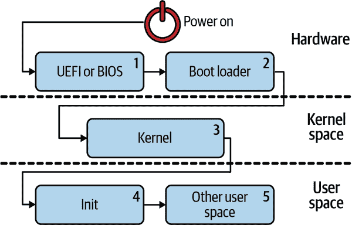
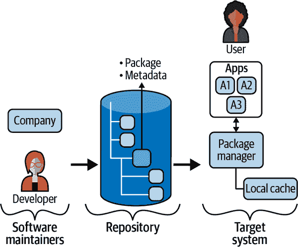
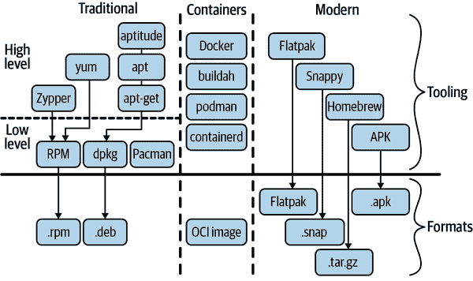
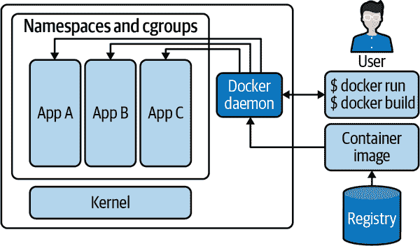

# 第六章：应用程序、软件包管理和容器

在本章中，我们讨论 Linux 中的应用程序。有时，“应用程序”（或简称“应用”）这个术语与“程序”、“二进制文件”或“可执行文件”是可以互换使用的。我们将解释这些术语之间的区别，并且最初将集中讨论术语，包括应用程序和软件包的定义。

我们讨论 Linux 如何启动并启动我们所依赖的所有服务。这也被称为*引导过程*。我们将重点介绍初始化系统，特别是事实上的标准——`systemd` 生态系统。

然后，我们转向软件包管理，首先在一般术语中回顾应用程序供应链，看看不同的运动部件是如何运作的。然后，为了让您了解现有机制和挑战，我们重点讨论了传统 Linux 发行版中的软件包管理，从红帽到基于 Debian 的系统，还瞥见了特定编程语言的软件包管理器，例如 Python 或 Rust。

在本章的下一部分，我们将关注容器：它们是什么以及它们如何工作。我们将回顾容器的构建模块，您可以使用的工具，以及使用容器的良好实践。

为了结束本章，我们将看看在桌面环境中管理 Linux 应用程序的现代方法。大多数现代软件包管理解决方案也以某种形式利用容器。

现在，让我们看看应用程序是什么，以及还有哪些相关术语，不再拖泥带水。

# 基础知识

在我们深入应用程序管理、初始化系统和容器的细节之前，让我们先从本章及更深远的定义开始。我们现在才详细讨论应用程序的原因是，有一些先决条件（例如 Linux 内核、Shell、文件系统和安全方面）您需要充分理解应用程序，现在我们可以建立在迄今所学的基础上，进一步深入了解应用程序：

程序

这通常是 Linux 可以加载到内存并执行的二进制文件或 Shell 脚本。另一种称呼这个实体的方式是*可执行文件*。可执行文件的类型决定了如何运行它——例如，一个 shell（参见“Shell”）会解释和执行一个 Shell 脚本。

进程

基于程序的运行实体，加载到主存储器中，并在不休眠时使用 CPU 或 I/O。详见“进程管理”和第三章。

守护进程

简称为*守护进程*，有时也称为*服务*，这是一个后台进程，为其他进程提供某种功能。例如，打印守护进程允许您打印。还有用于 Web 服务、日志记录、时间等等您日常所依赖的许多其他实用程序的守护进程。

应用程序

包括其依赖关系的程序。通常是一个重要的程序，包括用户界面。我们通常将术语 *应用程序* 与程序的整个生命周期、其配置和数据相关联：从查找和安装到升级再到删除。

软件包

包含程序和配置的文件；用于分发软件应用程序。

包管理器

一个程序，以软件包作为输入，并根据其内容和用户指令安装、升级或从 Linux 环境中删除它。

供应链

一个由软件生产商和分发商组成的集合，使您能够基于软件包找到并使用应用程序；详细信息请参阅 “Linux 应用程序供应链”。

引导

Linux 的启动序列涉及硬件和操作系统初始化步骤，包括加载内核和启动服务（或守护程序），目的是将 Linux 系统带入可用状态；详细内容请参阅 “Linux 启动过程”。

借助这些高级定义，我们从字面上来看确实是从头开始：让我们看看 Linux 是如何启动的，以及如何启动所有守护进程，以便我们可以使用 Linux 来完成工作。

# Linux 启动过程

Linux 的 [引导过程](https://oreil.ly/fbnk3) 通常是一个多阶段的工作，涉及硬件和内核的协同工作。

在 图 6-1 中，您可以看到完整的引导过程，包括以下五个步骤：



###### 图 6-1\. Linux 启动过程

1.  在现代环境中，[统一可扩展固件接口](https://uefi.org)（UEFI）规范定义了存储在 NVRAM 中的引导配置和引导加载程序。在旧系统中，在完成自检（POST）之后，基本输入输出系统（BIOS；参见 “BIOS 和 UEFI”）会初始化硬件（管理 I/O 端口和中断），并将控制权交给引导加载程序。

1.  引导加载程序的一个目标是引导内核。根据引导介质的不同，细节可能略有不同。现代有多种引导加载程序选择（例如，GRUB 2、systemd-boot、SYSLINUX、rEFInd），还有一些传统的选择（例如，LILO、GRUB 1）。

1.  内核通常位于 */boot* 目录中以压缩形式存在。这意味着第一步是将内核提取并加载到主内存中。在初始化其子系统、文件系统和驱动程序之后（如第二章讨论的和 “挂载文件系统”），内核将控制权交给 init 系统，引导过程正式结束。

1.  初始化系统负责在整个系统范围内启动守护程序（服务进程）。这个 init 进程是进程层次结构的根，并且具有进程 ID（PID）1。换句话说，PID 1 的进程会一直运行，直到系统关机。除了负责启动其他守护程序外，PID 1 进程传统上还负责处理孤立进程（即没有父进程的进程）。

1.  通常，这之后会发生一些其他的用户空间初始化，具体取决于环境：

    +   通常会有终端、环境和 shell 初始化，如 第三章 中讨论的那样。

    +   启动显示管理器、图形服务器等桌面环境的 GUI 组件，考虑用户的偏好和配置。

通过这个对 Linux 启动过程的高层概述，我们结束了我们的介绍性部分，并关注一个重要的、面向用户的组件：init 系统。在这本书的上下文中，这部分（前面的第 4 和第 5 步）对您来说最为重要，可以帮助您定制和扩展 Linux 安装。

有一个关于 [init 系统的比较](https://oreil.ly/Vn6pu) 可以在 Gentoo wiki 上找到。我们将限制我们的讨论在 `systemd` 上，几乎所有当前的 Linux 发行版都在使用它。

# systemd

[`systemd`](https://systemd.io) 最初是一个 init 系统，用来替代 `initd`，但今天它是一个功能强大的管理程序，包括日志记录、网络配置和网络时间同步等功能。它提供了一种灵活、便携的方式来定义守护程序及其依赖关系，并统一接口来控制配置。

几乎所有当前的 Linux 发行版都在使用 `systemd`，包括自 2011 年 5 月以来的 Fedora，自 2012 年 9 月以来的 openSUSE，自 2014 年 4 月以来的 CentOS，自 2014 年 6 月以来的 RHEL，自 2014 年 10 月以来的 SUSE Linux，自 2015 年 4 月以来的 Debian 和 Ubuntu。

特别是，`systemd` 通过以下方式解决了以前 init 系统的缺点：

+   提供一种跨发行版管理启动的统一方式。

+   实施更快、更易理解的服务配置。

+   提供一个现代管理套件，包括监控、资源使用控制（通过 cgroups）和内置审计。

此外，`init` 在初始化时按顺序（即按字母数字顺序）启动服务，而 `systemd` 则可以启动任何已满足其依赖关系的服务，可能加快启动时间。

告诉 `systemd` 何时运行、如何运行的方法就是通过单元。

## 单元

在 `systemd` 中，单元是具有不同语义的逻辑分组，具体取决于其功能和/或其所针对的资源。`systemd` 区分了许多类型的单元，具体取决于目标资源：

`service` 单元

描述如何管理服务或应用程序。

`target` 单元

捕获依赖关系

`mount` 单元

定义一个挂载点。

`timer` 单元

为 cron 作业等定义定时器

其他不太重要的单元类型包括以下内容：

`套接字`

描述网络或 IPC 套接字

`设备`

对于 `udev` 或 `sysfs` 文件系统

`自动挂载`

配置自动挂载点

`交换`

描述交换空间

`路径`

用于基于路径的激活

`快照`

允许在更改后重建系统的当前状态

`切片`

与 cgroups 相关（参见 “Linux cgroups”）

`范围`

管理通过外部创建的系统进程集合

要使 `systemd` 知道单元，必须将其序列化为文件。 `systemd` 在多个位置查找单元文件。最重要的三个文件路径如下：

*/lib/systemd/system*

包安装的单元

*/etc/systemd/system*

系统管理员配置的单元

*/run/systemd/system*

非持久运行时修改

有了 `systemd` 定义的基本工作单位（别有用心）之后，让我们继续学习如何通过命令行控制它。

## 使用 systemctl 进行管理

用于与 `systemd` 交互以管理服务的工具是 [`systemctl`](https://oreil.ly/kigFH)。

在 表 6-1 中，我列出了常用的 `systemctl` 命令列表。

表 6-1\. 有用的 `systemd` 命令

| 命令 | 用途 |
| --- | --- |
| `systemctl enable XXXXX.service` | 启用服务；准备启动 |
| `systemctl daemon-reload` | 重新加载所有单元文件并重新创建整个依赖树 |
| `systemctl start XXXXX.service` | 启动服务 |
| `systemctl stop XXXXX.service` | 停止服务 |
| `systemctl restart XXXXX.service` | 停止然后启动服务 |
| `systemctl reload XXXXX.service` | 向服务发出 `reload` 命令；如果失败，则退回到 `restart` |
| `systemctl kill XXXXX.service` | 停止服务执行 |
| `systemctl status XXXXX.service` | 获取服务状态的简短摘要，包括一些日志行 |

请注意，`systemctl` 还提供了许多其他命令，从依赖管理和查询到控制整个系统（例如 `reboot`）。

`systemd` 生态系统还有许多其他命令行工具，你可能会觉得方便，至少应该了解一下。这包括但不限于以下内容：

[`bootctl`](https://oreil.ly/WNKjd)

允许您检查引导加载程序状态并管理可用的引导加载程序。

`timedatectl`

允许您设置和查看与时间和日期相关的信息。

`coredumpctl`

允许您处理保存的核心转储。在故障排除时，请考虑使用此工具。

## 使用 journalctl 进行监控

日志是 `systemd` 的一个组件；从技术上讲，它是由 `systemd-journald` 守护程序管理的二进制文件，提供了由 `systemd` 组件记录的所有消息的集中位置。我们将在 “journalctl” 中详细介绍它。现在你只需要知道的是，这是一个允许查看 `systemd` 管理的日志的工具。

## 示例：调度问候者

经过所有这些理论，让我们看看`systemd`的实际运行情况。作为一个简单的用例示例，假设我们想每小时启动我们的登录应用（参见“Running Example: greeter”）。

首先，我们定义一个`systemd`服务单元文件。这告诉`systemd`如何启动登录应用程序；将以下内容存储在名为*greeter.service*的文件中（可以是任何目录，可以是临时目录）：

```
[Unit]
Description=My Greeting Service 

[Service]
Type=oneshot
ExecStart=/home/mh9/greeter.sh 
```


我们服务的描述，在使用`systemctl status`时显示


我们应用程序的位置

接下来，我们定义一个[timer unit](https://oreil.ly/Qv8qt)，每小时启动登录服务。将以下内容存储在名为*greeter.timer*的文件中：

```
[Unit]
Description=Runs Greeting service at the top of the hour

[Timer]
OnCalendar=hourly 
```


使用[systemd 时间和日期格式](https://oreil.ly/pinVc)定义时间表

现在我们将两个单元文件复制到*/run/systemd/system*，这样`systemd`就能识别它们：

```
$ sudo ls -al /run/systemd/system/
total 8
drwxr-xr-x  2 root root  80 Sep 12 13:08 .
drwxr-xr-x 21 root root 500 Sep 12 13:09 ..
-rw-r--r--  1 root root 117 Sep 12 13:08 greeter.service
-rw-r--r--  1 root root 107 Sep 12 13:08 greeter.timer
```

当我们将它复制到相应目录时，`systemd`自动接收了我们的登录计时器。

###### 注意

基于 Debian 的系统如 Ubuntu 默认启用并启动服务单元。红帽家族的系统不会在没有显式`systemctl start greeter.timer`的情况下启动服务。这也适用于在启动时启用服务，其中 Debian-based 发行版默认启用服务，而 Red Hat 发行版则需要通过`systemctl enable`来确认。

让我们检查我们的登录程序计时器的状态：

```
$ sudo systemctl status greeter.timer
● greeter.timer - Runs Greeting service at the top of the hour
   Loaded: loaded (/run/systemd/system/greeter.timer; static; \
   vendor preset: enabled)
   Active: active (waiting) since Sun 2021-09-12 13:10:35 IST; 2s ago
  Trigger: Sun 2021-09-12 14:00:00 IST; 49min left
Sep 12 13:10:35 starlite systemd[1]: \
Started Runs Greeting service at the top of the hour.
```

`systemd`确认已知道我们的登录程序，并已计划运行。但是如何知道它是否成功？让我们检查日志（请注意输出已经编辑，`stdout`输出直接进入日志）：

```
$ journalctl -f -u greeter.service 
-- Logs begin at Sun 2021-01-24 14:36:30 GMT. --
Sep 12 14:00:01 starlite systemd[1]: Starting My Greeting Service...
Sep 12 14:00:01 starlite greeter.sh[21071]: You are awesome!
...
```


使用`journalctl`查看和跟踪（`-f`）*greeter.service*单元的日志（用`-u`选择）

通过这个高级`systemd`概述，让我们继续以传统方式管理应用程序，即使用通用的软件包管理器。但在深入讨论包的技术细节之前，让我们稍微退后一步，讨论应用程序、包和包管理器的概念，这些概念属于更广泛的供应链范畴。

# Linux 应用程序供应链

让我们从我们所说的[*供应链*](https://oreil.ly/EegdU)开始：一个向消费者供应产品的组织和个人系统。虽然您可能不经常考虑供应链，但您每天都在处理它们——例如，当您购买食品或为汽车加油时。在我们的讨论中，产品是由软件成果组成的应用程序，您可以将消费者视为使用应用程序的自己，或者作为管理应用程序的工具。

在概念层面上，图 6-2 显示了典型 Linux 应用程序供应链的主要参与者和阶段。



###### 图 6-2\. Linux 应用程序供应链

Linux 应用程序供应链中的三个明显领域如下：

软件维护者

这些包括个人开发者、开源项目以及像独立软件供应商（ISV）这样的公司，他们生产软件成果并将其发布为包到存储库（repo），例如。

存储库

这列出了包含应用程序全部或部分内容以及元数据的包。包通常捕获应用程序的依赖关系。依赖关系是应用程序需要的其他包，以便其正常运行。这可以是库、某种类型的导入或导出程序或其他服务程序。保持这些依赖关系的最新状态很困难。

工具（一个包管理器）

在目标系统方面，可以在存储库中查找包并按照人类用户的指示安装、更新和删除应用程序。请注意，一个或多个包可以代表应用程序及其依赖关系。

虽然细节可能因发行版而异并依赖于环境（服务器、桌面等），但所有应用程序供应链都具有图 6-2 中显示的元素。

有许多选项可用于包和依赖项管理，例如传统的包管理器、基于容器的解决方案以及更近期的方法。

在图 6-3 中，我试图为您提供一个高层次的概述，不过并不宣称这是一个完整的画面。



###### 图 6-3\. Linux 包管理和应用程序依赖管理的宇宙

关于包和依赖项管理的三个主要选项类别的几点说明：

传统包管理器

在这个类别中，我们通常区分低级和高级工具。如果一个包管理器可以解决依赖关系并提供高级接口（安装、更新、删除），我们称其为*高级*包管理器。

基于容器的解决方案

这些最初来自服务器和云计算领域。鉴于它们的功能，一个用例是应用程序管理，但并非其主要用途。换句话说，作为开发人员，您会喜欢容器，因为它们使您能够轻松测试和直接部署您的生产就绪应用程序。另请参阅 “容器”。

现代软件包管理器

这些软件包源自桌面环境，主要目标是尽可能地使最终用户轻松使用应用程序。另请参阅 “现代软件包管理器”。

# 软件包和软件包管理器

在本节中，我们讨论了长期以来一直在使用的软件包格式和软件包管理器，有些甚至已有几十年历史。这些通常源自两大 Linux 发行版系列：红帽（RHEL、Fedora、CentOS 等）和基于 Debian 的系统（Debian、Ubuntu 等）。

这里讨论的两个相关概念如下：

这些软件包本身

从技术上讲，通常是一个压缩文件，可能包含元数据。

工具（称为 *软件包管理器*）

处理目标系统上的这些软件包，以安装和维护应用程序。软件包管理器通常代表您与仓库进行交互，并维护本地软件包缓存。

目标系统可能是您笔记本电脑上的桌面环境，也可能是云中的服务器虚拟机实例，例如。根据环境不同，软件包可能更或少适用——例如，在服务器上的 GUI 应用程序不一定是有意义的。

## RPM 软件包管理器

[RPM 软件包管理器](https://oreil.ly/Ef2FC)（使用递归缩写 RPM）最初由红帽创建，但现在广泛用于各种发行版。*.rpm* 文件格式用于 Linux 标准基础，并可以包含二进制或源文件。这些软件包可以通过补丁文件进行密码验证和支持增量更新。

使用 RPM 的软件包管理器包括以下内容：

[`yum`](https://oreil.ly/sPb2H)

在 Amazon Linux、CentOS、Fedora 和 RHEL 中

[DNF](https://oreil.ly/0Pcod)

在 CentOS、Fedora 和 RHEL 中

[Zypper](https://oreil.ly/OVize)

在 openSUSE 和 SUSE Linux Enterprise

让我们看看 RPM 的实际运行情况：假设我们有一个新的开发者环境，并希望使用 `yum` 安装 Go 编程语言工具链。

请注意，以下 shell 会话的输出已被编辑和缩短，以适应空间（输出中有许多与理解使用方式无关的行）。

首先，我们需要找到 Go 的软件包：

```
# yum search golang 
Loaded plugins: ovl, priorities
================= N/S matched: golang =================
golang-bin.x86_64 : Golang core compiler tools
golang-docs.noarch : Golang compiler docs
...
golang-googlecode-net-devel.noarch : Supplementary Go networking libraries
golang-googlecode-sqlite-devel.x86_64 : Trivial sqlite3 binding for Go
```


搜索 Go 软件包。请注意 `#` 提示，表明我们以 root 用户登录。也许更好的方式是使用 `sudo yum`。

有了关于软件包的这些信息，我们现在可以使用以下方法安装它：

```
# yum install golang 
Loaded plugins: ovl, priorities
Resolving Dependencies 
--> Running transaction check
---> Package golang.x86_64 0:1.15.14-1.amzn2.0.1 will be installed
--> Processing Dependency: golang-src = 1.15.14-1.amzn2.0.1 for package:
    golang-1.15.14-1.amzn2.0.1.x86_64
...
Transaction Summary
===============================================================================
Install  1 Package (+101 Dependent packages)

Total download size: 183 M
Installed size: 624 M
Is this ok [y/d/N]: y 
Dependencies Resolved

===============================================================================
 Package                     Arch    Version             Repository    Size
===============================================================================
Installing:
 golang                      x86_64  1.15.14-1.amzn2.0.1 amzn2-core    705 k
Installing for dependencies:
 acl                         x86_64  2.2.51-14.amzn2     amzn2-core     82 k
 apr                         x86_64  1.6.3-5.amzn2.0.2   amzn2-core    118 k
 ...

  Verifying  : groff-base-1.22.2-8.amzn2.0.2.x86_64                     101/102
  Verifying  : perl-Text-ParseWords-3.29-4.amzn2.noarch                 102/102

Installed: 
  golang.x86_64 0:1.15.14-1.amzn2.0.1

Dependency Installed:
  acl.x86_64 0:2.2.51-14.amzn2   apr.x86_64 0:1.6.3-5.amzn2.0.2
  ...

Complete!
```


安装 Go 包。


`yum` 的第一步是确定 Go 的依赖项。


这里 `yum` 提供了关于依赖项的摘要，并告诉我们它计划执行什么操作。我需要在这里通过输入 `y` 进行交互确认。然而，在脚本中，我会使用 `yum install golang -y` 形式的命令来自动接受这个操作。


在确认所有依赖项和主要包都安装好之后，`yum` 报告安装成功。

最后但同样重要的是，我们想要验证包，检查我们确切安装了什么及其位置：

```
# yum info golang
Loaded plugins: ovl, priorities
Installed Packages
Name        : golang
Arch        : x86_64
Version     : 1.15.14
Release     : 1.amzn2.0.1
Size        : 7.8 M
Repo        : installed
From repo   : amzn2-core
Summary     : The Go Programming Language
URL         : http://golang.org/
License     : BSD and Public Domain
Description : The Go Programming Language.
```

接下来，让我们看看另一个广泛使用的包管理器，使用 Debian 包。

## Debian deb

[deb](https://oreil.ly/sctS1) 包和 *.deb* 文件格式源自 Debian 发行版。deb 包也可以包含二进制或源文件。多个包管理器使用 deb，包括低级别、无依赖管理的 `dpkg`，以及高级别的 `apt-get`、`apt` 和 `aptitude`。鉴于 Ubuntu 是基于 Debian 的发行版，deb 包在桌面和服务器上都被广泛使用。

要看看 deb 包如何工作，假设我们想要使用 `apt` 安装 `curl` 实用程序。这是一个用于与 HTTP API 交互和从多个位置下载文件的实用工具。请注意，我们再次编辑了输出以使其适应。

首先，我们搜索 `curl` 包：

```
# apt search curl 
Sorting... Done
Full Text Search... Done
curl/focal-updates,focal-security 7.68.0-1ubuntu2.6 amd64
  command line tool for transferring data with URL syntax

curlftpfs/focal 0.9.2-9build1 amd64
  filesystem to access FTP hosts based on FUSE and cURL

flickcurl-doc/focal 1.26-5 all
  utilities to call the Flickr API from command line - documentation

flickcurl-utils/focal 1.26-5 amd64
  utilities to call the Flickr API from command line

gambas3-gb-net-curl/focal 3.14.3-2ubuntu3.1 amd64
  Gambas advanced networking component
...
```


使用 `apt` 搜索 `curl` 包。请注意，总共显示了几十个搜索结果，其中大多数是库和特定语言的绑定（Python、Ruby、Go、Rust 等）。

接下来，我们安装 `curl` 包如下：

```
# apt install curl 
Reading package lists... Done
Building dependency tree 
Reading state information... Done
The following additional packages will be installed:
  ca-certificates krb5-locales libasn1-8-heimdal libbrotli1 ...

Suggested packages:
  krb5-doc krb5-user libsasl2-modules-gssapi-mit ...

The following NEW packages will be installed:
  ca-certificates curl krb5-locales libasn1-8-heimdal ...

0 upgraded, 32 newly installed, 0 to remove and 2 not upgraded.
Need to get 5447 kB of archives.
After this operation, 16.7 MB of additional disk space will be used.
Do you want to continue? [Y/n] 

Get:1 http://archive.ubuntu.com/ubuntu focal-updates/main amd64
      libssl1.1 amd64 1.1.1f-1ubuntu2.8 [1320 kB]
Get:2 http://archive.ubuntu.com/ubuntu focal-updates/main amd64
      openssl amd64 1.1.1f-1ubuntu2.8 [620 kB]
...
Fetched 5447 kB in 1s (3882 kB/s)
Selecting previously unselected package libssl1.1:amd64.
(Reading database ... 4127 files and directories currently installed.)
Preparing to unpack .../00-libssl1.1_1.1.1f-1ubuntu2.8_amd64.deb ...
Unpacking libssl1.1:amd64 (1.1.1f-1ubuntu2.8) ...
...
Setting up libkeyutils1:amd64 (1.6-6ubuntu1) ...
...
Processing triggers for ca-certificates (20210119~20.04.1) ...
Updating certificates in /etc/ssl/certs...
1 added, 0 removed; done. 
Running hooks in /etc/ca-certificates/update.d...
Done.
```


安装 `curl` 包。


`apt` 的第一步是确定依赖关系。


这里 `apt` 提供了一个依赖项摘要，并告诉我们它将安装什么。这里需要交互确认；在脚本中，我会使用 `apt install curl -y` 来自动接受。


在确认所有依赖项和主要包已安装后，`apt` 报告成功。

最后，我们验证 `curl` 包：

```
# apt show curl
Package: curl
Version: 7.68.0-1ubuntu2.6
Priority: optional
Section: web
Origin: Ubuntu
Maintainer: Ubuntu Developers <ubuntu-devel-discuss@lists.ubuntu.com>
Original-Maintainer: Alessandro Ghedini <ghedo@debian.org>
Bugs: https://bugs.launchpad.net/ubuntu/+filebug
Installed-Size: 411 kB
Depends: libc6 (>= 2.17), libcurl4 (= 7.68.0-1ubuntu2.6), zlib1g (>= 1:1.1.4)
Homepage: http://curl.haxx.se
Task: server, cloud-image, ubuntu-budgie-desktop
Download-Size: 161 kB
APT-Manual-Installed: yes
APT-Sources: http://archive.ubuntu.com/ubuntu focal-updates/main amd64 Packages
Description: command line tool for transferring data with URL syntax

N: There is 1 additional record. Please use the '-a' switch to see it
```

现在让我们转向特定于编程语言的包管理器。

## 特定语言的包管理器

还有特定于编程语言的包管理器，比如以下几种：

C/C++

有 [许多不同的包管理器](https://oreil.ly/ibEK2)，包括 Conan 和 vcpkg

Go

内置包管理（`go get`、`go mod`）

Node.js

有 `npm` 和其他的

Java

有 `maven` 和 `nuts` 等其他的

Python

有 `pip` 和 PyPM

Ruby

有 `rubygems` 和 Rails

Rust

有 `cargo`

接下来，让我们看看容器以及如何通过它们来管理应用程序。

# 容器

在本书的背景下，我们将*容器*理解为使用 Linux 命名空间、cgroups 和可选的 CoW 文件系统来提供应用程序级别的依赖管理的 Linux 进程组。容器的用途从本地的[测试和开发](https://oreil.ly/6RPcT)到与分布式系统一起工作——例如，在 [Kubernetes](https://kubernetes.io) 中使用容器化的微服务。

虽然容器对开发人员和系统管理员非常有用，但作为最终用户，您更可能倾向于使用更高级别的工具来管理应用程序——例如，在“现代包管理器”中讨论的工具。

容器在 Linux 中并不新鲜。然而，它们直到 Docker 开始在大约 2014 年左右得到主流采用才如此。在此之前，我们有多次尝试引入容器的努力，通常是面向系统管理员而不是开发人员，包括以下几种：

+   [Linux-VServer (2001)](https://oreil.ly/A5Uri)

+   [OpenVZ (2005)](https://oreil.ly/yM3Tm)

+   [LXC (2008)](https://oreil.ly/BDSjL)

+   [Let Me Contain That for You (lmctfy) (2013)](https://oreil.ly/xpmMx)

所有这些方法的共同之处在于它们使用 Linux 内核提供的基本构建模块，比如命名空间或 cgroups，允许用户运行应用程序。

Docker 在概念上进行了创新，并引入了两个开创性的元素：通过容器镜像定义包装的标准化方式，以及人性化的用户界面（例如 `docker run`）。容器镜像的定义和分发方式，以及容器的执行方式，形成了现在被称为[开放容器倡议（OCI）](https://opencontainers.org)核心规范的基础。在这里讨论容器时，我们关注符合 OCI 的实现。

OCI 容器规范的三个核心是：

[运行时规范](https://oreil.ly/vrN0V)

定义了运行时需要支持的内容，包括操作和生命周期阶段

[镜像格式规范](https://oreil.ly/p0WCY)

定义了如何构建容器镜像，基于元数据和层次

[分发规范](https://oreil.ly/kNNeA)

定义容器镜像的发布方式，实际上是在容器仓库工作的方式

与容器相关的另一个概念是*不可变性*。这意味着一旦配置完成，您在使用过程中不能更改它。换句话说，变更需要创建一个新的（静态）配置和一个新的资源（如进程）。我们将在容器镜像的上下文中重新讨论这一点。

现在您已经对容器在概念上的了解有所了解，让我们更详细地看一下符合 OCI 标准的容器的构建块。

## Linux 命名空间

正如我们在第一章中讨论的，Linux 最初对资源有全局视图。为了让进程能够对资源（如文件系统、网络甚至用户）有局部视图，Linux 引入了命名空间。

换句话说，[Linux 命名空间](https://oreil.ly/3SvR1)关注的是资源的可见性，并可用于隔离操作系统资源的不同方面。在这个上下文中，隔离主要是指进程看到的内容，而不一定是严格的边界（从安全角度来看）。

要创建命名空间，您可以利用三个相关的系统调用：

[`clone`](https://oreil.ly/JNot8)

用于创建能够与父进程共享部分执行上下文的子进程

[`unshare`](https://oreil.ly/9BXiz)

用于从现有进程中移除共享的执行上下文

[`setns`](https://oreil.ly/PKGHm)

用于将现有进程加入到现有命名空间中

上述系统调用采用一系列标志作为参数，使您能够对要创建、加入或离开的命名空间进行精细控制。

`CLONE_NEWNS`

用于[文件系统挂载点](https://oreil.ly/i1Igl)。可通过*/proc/$PID/mounts*可见。自 Linux 2.4.19 开始支持。

`CLONE_NEWUTS`

用于创建[主机名和（NIS）域名](https://oreil.ly/7lB3U)隔离。通过`uname -n`和`hostname -f`可见。自 Linux 2.6.19 开始支持。

`CLONE_NEWIPC`

用于执行[进程间通信（IPC）](https://oreil.ly/h9tlW)资源隔离，如 System V IPC 对象或 POSIX 消息队列。可通过*/proc/sys/fs/mqueue*、*/proc/sys/kernel*和*/proc/sysvipc*可见。自 Linux 2.6.19 开始支持。

`CLONE_NEWPID`

用于[PID 号空间隔离](https://oreil.ly/Czzu7)（命名空间内部/PID 号空间外部）。您可以通过*/proc/$PID/status*收集相关信息。自 Linux 2.6.24 开始支持。

`CLONE_NEWNET`

用于控制[网络系统资源](https://oreil.ly/X9klx)，例如网络设备、IP 地址、IP 路由表和端口号。您可以通过`ip netns list`、*/proc/net*和*/sys/class/net*查看。自 Linux 2.6.29 开始支持。

`CLONE_NEWUSER`

用于在命名空间内外映射[UID+GID](https://oreil.ly/uClq3)。您可以通过`id`命令和*/proc/$PID/uid_map*和*/proc/$PID/gid_map*查询 UID 和 GID 及其映射。自 Linux 3.8 开始支持。

`CLONE_NEWCGROUP`

使用以在命名空间中管理[cgroups](https://oreil.ly/YAGGb)。您可以通过*/sys/fs/cgroup*、*/proc/cgroups*和*/proc/$PID/cgroup*来查看。自 Linux 4.6 起支持。

查看系统中正在使用的命名空间的一种方法如下（输出经过编辑以适应）：

```
$ sudo lsns
        NS TYPE   NPROCS   PID USER             COMMAND
4026531835 cgroup    251     1 root             /sbin/init splash
4026531836 pid       245     1 root             /sbin/init splash
4026531837 user      245     1 root             /sbin/init splash
4026531838 uts       251     1 root             /sbin/init splash
4026531839 ipc       251     1 root             /sbin/init splash
4026531840 mnt       241     1 root             /sbin/init splash
4026531860 mnt         1    33 root             kdevtmpfs
4026531992 net       244     1 root             /sbin/init splash
4026532233 mnt         1   432 root             /lib/systemd/systemd-udevd
4026532250 user        1  5319 mh9              /opt/google/chrome/nacl_helper
4026532316 mnt         1   684 systemd-timesync /lib/systemd/systemd-timesyncd
4026532491 mnt         1   688 systemd-resolve  /lib/systemd/systemd-resolved
...
```

下一个容器构建块专注于资源消耗限制和资源使用报告。

## Linux cgroups

如果说命名空间关注可见性，[*cgroups*](https://oreil.ly/m4wBr)则提供了一种不同的功能：它们是组织进程组的机制。除了层次化组织外，您可以使用 cgroups 来控制系统资源的使用。此外，cgroups 还提供资源使用跟踪；例如，它们显示进程（组）使用了多少 RAM 或 CPU 秒数。将 cgroups 视为声明单元，控制器作为内核代码的一部分，强制执行特定的资源限制或报告其使用情况。

在撰写本文时，内核中有两个版本的 cgroups 可用：cgroups v1 和 v2。cgroup v1 仍然广泛使用，但 v2 最终将取代 v1，因此您应专注于 v2。

### cgroup v1

使用[cgroup v1](https://oreil.ly/iOEcV)，社区采用了即兴的方法，根据需要添加新的 cgroups 和控制器。存在以下 v1 cgroups 和控制器（按年龄排序；请注意文档分散且不一致）：

[CFS 带宽控制](https://oreil.ly/vGu0Y)

通过`cpu` cgroup 使用。自 Linux 2.6.24 起支持。

[CPU 计费控制器](https://oreil.ly/7NSLN)

通过`cpuacct` cgroup 使用。自 Linux 2.6.24 起支持。

[`cpusets` cgroup](https://oreil.ly/sJp4X)

允许您为任务分配 CPU 和内存。自 Linux 2.6.24 起支持。

[内存资源控制器](https://oreil.ly/VjsXY)

允许您隔离任务的内存行为。自 Linux 2.6.25 起支持。

[设备白名单控制器](https://oreil.ly/DklEJ)

允许您控制设备文件的使用。自 Linux 2.6.26 起支持。

[`freezer` cgroup](https://oreil.ly/waLVz)

用于批处理作业管理。自 Linux 2.6.28 起支持。

[网络分类器 cgroup](https://oreil.ly/fGcWg)

用于为数据包分配不同的优先级。自 Linux 2.6.29 起支持。

[块 IO 控制器](https://oreil.ly/V3Zto)

允许您限制块 I/D 的速度。自 Linux 2.6.33 起支持。

[`perf_event`命令](https://oreil.ly/AMWei)

允许您收集性能数据。自 Linux 2.6.39 起支持。

[网络优先级 cgroup](https://oreil.ly/4e9f2)

允许您动态设置网络流量的优先级。自 Linux 3.3 起支持。

[HugeTLB 控制器](https://oreil.ly/dzl7L)

允许您限制 HugeTLB 的使用。自 Linux 3.5 起支持。

[进程数控制器](https://oreil.ly/WkBss)

用于在达到某一限制后允许 cgroup 层次结构创建新进程。自 Linux 4.3 起支持。

### cgroup v2

[cgroup v2](https://oreil.ly/YWCEi) 是 cgroups 的全新版本，吸取了从 v1 中学到的经验教训。无论是在一致的配置还是在 cgroups 的使用上，以及（集中和统一的）文档使用上都是如此。与 v1 的每进程 cgroup 设计不同，v2 只有单一层次结构，并且所有控制器都以相同的方式管理。以下是 v2 的控制器：

CPU 控制器

调节 CPU 周期的分配，支持不同的模型（权重、最大），并包括使用报告

内存控制器

调节内存分配，支持用户空间内存，内核数据结构如 dentries 和 inodes，以及 TCP socket 缓冲区

I/O 控制器

调节 I/O 资源的分配，包括基于权重和绝对带宽或每秒 I/O 操作（IOPS）限制，报告字节和读/写的 IOPS

进程编号（PID）控制器

与 v1 版本类似

`cpuset` 控制器

与 v1 版本类似

`device` 控制器

管理设备文件的访问，基于 eBPF 实现

`rdma` 控制器

调节 [远程直接内存访问（RDMA）资源](https://oreil.ly/a5Wk3) 的分配和核算

HugeTLB 控制器

与 v1 版本类似

cgroups v2 中还有其他杂项 cgroups，允许对标量资源进行资源限制和跟踪机制（无法像其他 cgroup 资源那样抽象化）。

您可以通过 `systemctl` 命令以漂亮的树形图查看 Linux 系统中所有 v2 cgroups，如下例所示（输出已简化和编辑以适应）：

```
$ systemctl status 
starlite
    State: degraded
     Jobs: 0 queued
   Failed: 1 units
    Since: Tue 2021-09-07 11:49:08 IST; 1 weeks 1 days ago
   CGroup: /
           ├─22160 bpfilter_umh
           ├─user.slice
           │ └─user-1000.slice 
           │   ├─user@1000.service
           │   │ ├─gvfs-goa-volume-monitor.service
           │   │ │ └─14497 /usr/lib/gvfs/gvfs-goa-volume-monitor
   ...
```


使用 `systemctl` 工具渲染 cgroups


`systemd` 管理的一个具体 cgroup 的示例

cgroups 的另一个有用视角是交互式资源使用，如下所示（输出已编辑以适应）：

```
$ systemd-cgtop
Control Group                        Tasks   %CPU   Memory  Input/s Output/s
/                                      623   15.7     5.8G        -        -
/docker                                  -      -    48.3M        -        -
/system.slice                          122    6.2     1.6G        -        -
/system.slice/ModemManager.service       3      -   748.0K        -        -
...
/system.slice/rsyslog.service            4      -   420.0K        -        -
/system.slice/snapd.service             17      -     5.1M        -        -
```

展望未来，随着现代内核版本的广泛应用，cgroups v2 将成为标准。确实有某些发行版，如 [Arch](https://oreil.ly/rxFF2)，Fedora 31+ 和 Ubuntu 21.10，默认已经支持 v2。

## Copy-on-Write 文件系统

容器的第三个构建块是 Copy-on-Write 文件系统，详细讨论见 “Copy-on-Write Filesystems”。这些在构建时使用，将应用程序及其所有依赖项打包成单个、自包含的文件，可以分发。通常与 [bind mounts](https://oreil.ly/BS4nK) 结合使用，以高效方式将不同依赖项的内容层叠在一起。

## Docker

Docker 是由 Docker Inc. 在 2014 年开发并普及的人性化容器实现。借助 Docker，轻松地打包程序及其依赖项，并在从桌面到云端的各种环境中启动它们。Docker 的独特之处不在于构建模块（命名空间、cgroups、CoW 文件系统和绑定挂载）。在 Docker 诞生之前，这些构建模块就已存在。特殊之处在于 Docker 将这些构建模块组合起来，以一种易于使用的方式，通过隐藏管理命名空间和 cgroups 等底层细节的复杂性。

如 图 6-4 所示，并在随后的段落中描述，Docker 中有两个主要概念：镜像和运行中的容器。



###### 图 6-4\. Docker 高级架构

容器镜像

包含 JSON 文件中的元数据和有效目录（即层）的压缩归档文件。Docker 守护程序会根据需要从容器注册表拉取容器镜像。

作为运行时产物的容器（例如，应用程序 A/B/C）

您可以启动、停止、杀死和删除它。您可以使用客户端 CLI 工具 (`docker`) 与 Docker 守护进程进行交互。此 CLI 工具发送命令给守护程序，后者执行相应的操作，如构建或运行容器。

表格 6-2 提供了常用 Docker CLI 命令的简要参考，涵盖了构建时和运行时阶段。要获取完整的参考资料，包括使用案例，请参阅 [Docker 文档](https://oreil.ly/y1c1W)。

表格 6-2\. 常用 Docker 命令

| 命令 | 描述 | 示例 |
| --- | --- | --- |
| `run` | 启动容器 | 作为守护进程运行 NGINX 并在退出时删除容器：`docker run -d --rm nginx:1.21` |
| `ps` | 列出容器 | 列出所有容器（包括非运行中的）：`docker ps -a` |
| `inspect` | 显示低级信息 | 查询容器 IP：`docker inspect -f '{{.Network​Set⁠tings.IPAddress}}'` |
| `build` | 本地生成容器镜像 | 基于当前目录构建镜像并打标签：`docker build -t some:tag .` |
| `push` | 将容器镜像上传到注册表 | 推送到 AWS 注册表：`docker push public.ecr.aws/some:tag` |
| `pull` | 从注册表下载容器镜像 | 从 AWS 注册表拉取：`docker pull public.ecr.aws/some:tag` |
| `images` | 列出本地容器镜像 | 列出特定注册表的镜像：`docker images ubuntu` |
| `image` | 管理容器镜像 | 删除所有未使用的镜像：`docker image prune -all` |

现在让我们仔细看一下构建时的产物：Docker 使用的容器镜像。

### 容器镜像

要定义如何构建容器镜像的指令，您可以使用名为 [Dockerfile](https://oreil.ly/dM8LO) 的纯文本文件格式。

在 Dockerfile 中可以有不同的指令：

基础镜像

`FROM`；可以在构建/运行阶段中有多个

元数据

`LABEL` 用于血统

参数和环境变量

`ARGS`、`ENV`

构建时的规格

`COPY`、`RUN` 等命令，它们定义了镜像的构建方式，一层一层地构建

运行时的规格

`CMD` 和 `ENTRYPOINT`，它们定义了容器的运行方式。

使用 `docker build` 命令，您可以将代表应用程序的一组文件（无论是源码还是二进制格式）以及 Dockerfile 转换为容器镜像。这个容器镜像是您可以运行或推送到注册表的工件，以便其他人拉取并最终运行。

### 运行容器

您可以以交互式输入（附加终端）或作为守护进程（后台运行）方式运行容器。[`docker run`](https://oreil.ly/87YZq) 命令接受一个容器镜像和一组运行时输入，例如环境变量、要暴露的端口和要挂载的卷。有了这些信息，Docker 就会创建必要的命名空间和 cgroups，并启动容器镜像中定义的应用程序（`CMD` 或 `ENTRYPOINT`）。

接下来，让我们看看 Docker 理论如何应用。

### 示例：容器化的 greeter 应用

现在让我们把我们的 `greeter` 应用程序（参见 “运行示例：greeter”）放入容器并运行它。

首先，我们需要定义 Dockerfile，其中包含构建容器镜像的指令：

```
FROM ubuntu:20.04 
LABEL org.opencontainers.image.authors="Michael Hausenblas" 
COPY greeter.sh /app/ 
WORKDIR /app 
RUN chown -R 1001:1 /app 
USER 1001
ENTRYPOINT ["/app/greeter.sh"] 
```


使用显式标签（`20.04`）定义基础镜像。


通过 [标签](https://oreil.ly/eYWVo) 分配一些元数据。


复制 shell 脚本。这可以是二进制文件、JAR 文件或 Python 脚本。


设置工作目录。


这行及其下一行定义运行应用程序的用户。如果不这样做，它将不必要地以 `root` 身份运行。


定义要运行的内容，在我们的情况下是 shell 脚本。通过使用 `ENTRYPOINT` 定义方式，可以通过运行 `docker run greeter:1 _SOME_PARAMETER_` 传递参数。

接下来，我们构建容器镜像：

```
$ sudo docker build -t greeter:1 . 
Sending build context to Docker daemon  3.072kB
Step 1/7 : FROM ubuntu:20.04 
20.04: Pulling from library/ubuntu
35807b77a593: Pull complete
Digest: sha256:9d6a8699fb5c9c39cf08a0871bd6219f0400981c570894cd8cbea30d3424a31f
Status: Downloaded newer image for ubuntu:20.04
 ---> fb52e22af1b0
Step 2/7 : LABEL org.opencontainers.image.authors="Michael Hausenblas"
 ---> Running in 6aa921276c3b
Removing intermediate container 6aa921276c3b
 ---> def717e3352b
Step 3/7 : COPY greeter.sh /app/
 ---> 5f3eb160fea3
Step 4/7 : WORKDIR /app
 ---> Running in 698c29938a96
Removing intermediate container 698c29938a96
 ---> d73572886c13
Step 5/7 : RUN chown -R 1001:1 /app
 ---> Running in 5b5eb5d1935a
Removing intermediate container 5b5eb5d1935a
 ---> 42c35a6db6e2
Step 6/7 : USER 1001
 ---> Running in bec92deaac6e
Removing intermediate container bec92deaac6e
 ---> b6e0e27f253b
Step 7/7 : CMD ["/app/greeter.sh"]
 ---> Running in 6d3b439f7e50
Removing intermediate container 6d3b439f7e50
 ---> 433a5f10d84e
Successfully built 433a5f10d84e
Successfully tagged greeter:1
```


构建容器镜像并加标签（使用 `-t greeter:1`）。`.` 表示它使用当前目录，并假定那里有一个 Dockerfile。


这些以及接下来的行，逐层拉取基础镜像并构建它。

让我们检查一下容器镜像是否存在：

```
$ sudo docker images
REPOSITORY   TAG       IMAGE ID       CREATED          SIZE
greeter      1         433a5f10d84e   35 seconds ago   72.8MB
ubuntu       20.04     fb52e22af1b0   2 weeks ago      72.8MB
```

现在我们可以基于`greeter:1`镜像运行一个容器，如下所示：

```
 $ sudo docker run greeter:1
You are awesome!
```

这样我们就结束了 Docker 101。现在让我们快速查看相关的工具。

## 其他容器工具

您不必使用 Docker 来处理 OCI 容器；作为替代方案，您可以使用由 Red Hat 主导和赞助的组合：[`podman`](https://podman.io)和[`buildah`](https://buildah.io)。这些无守护进程的工具允许您构建 OCI 容器镜像（`buildah`）并运行它们（`podman`）。

此外，还有许多工具可以更轻松地处理 OCI 容器、命名空间和 cgroups，包括但不限于以下内容：

[`containerd`](https://oreil.ly/mIKkm)

一个管理 OCI 容器生命周期的守护程序，从镜像传输和存储到容器运行时的监督。

[`skopeo`](https://oreil.ly/UAom6)

用于容器镜像操作（复制、检查清单等）

[`systemd-cgtop`](https://oreil.ly/aDgBa)

一种支持 cgroups 的`top`变种，可以交互式地显示资源使用情况。

[`nsenter`](https://oreil.ly/D0Gbc)

允许您在指定的现有命名空间中执行程序。

[`unshare`](https://oreil.ly/oOigx)

允许您使用特定命名空间运行程序（通过标志进行选择）。

[`lsns`](https://oreil.ly/jY7Q6)

列出有关 Linux 命名空间的信息。

[`cinf`](https://oreil.ly/yaiMo)

列出与进程 ID 相关联的 Linux 命名空间和 cgroups 的信息。

这样我们结束了容器之旅。现在让我们看看现代包管理器以及它们如何利用容器来隔离应用程序。

# 现代包管理器

除了传统的通常特定于发行版的包管理器外，还有一种新型的包管理器。这些现代解决方案通常利用容器，并旨在跨发行版或针对特定环境。例如，它们可以让 Linux 桌面用户轻松安装 GUI 应用程序。

[Snap](https://oreil.ly/n4fe6)

由 Canonical Ltd.设计和推广的软件打包和部署系统。它配备了一个精细的[sandboxing](https://oreil.ly/ImWPH)设置，并可在桌面、云和物联网环境中使用。

[Flatpak](https://oreil.ly/sEEu1)

针对 Linux 桌面环境进行优化，使用 cgroups、命名空间、绑定挂载和 seccomp 作为其构建基础。尽管最初来自 Linux 发行版宇宙的 Red Hat 部分，现在已经适用于数十个发行版，包括 Fedora、Mint、Ubuntu、Arch、Debian、openSUSE 和 Chrome OS。

[AppImage](https://oreil.ly/76Uhu)

已经存在多年，并推广了一个应用程序等于一个文件的理念；也就是说，除了目标 Linux 系统中包含的内容外，它不需要任何依赖关系。随着时间的推移，AppImage 逐渐引入了许多有趣的功能，从高效更新到桌面集成再到软件目录。

[Homebrew](https://oreil.ly/XegIz)

起源于 macOS 世界，但可在 Linux 上使用并越来越受欢迎。它是用 Ruby 编写的，具有强大而直观的用户界面。

# 结论

在本章中，我们涵盖了与如何在 Linux 上安装、维护和使用应用程序相关的广泛主题。

我们首先定义了基本的应用程序术语，然后讨论了 Linux 启动过程，探讨了 `systemd`，这是管理启动和组件的现行标准方式。

为了分发应用程序，Linux 使用包和包管理器。我们在这个背景下讨论了各种管理器，以及如何在开发和测试中使用容器以及依赖管理。Docker 容器利用 Linux 原语（cgroups，命名空间，CoW 文件系统）提供应用级依赖管理（通过容器镜像）。

最后，我们探讨了应用程序管理的定制解决方案，包括 Snap 和其他方案。

如果您对本章中的主题感兴趣，并希望进一步阅读，请查看以下资源：

启动过程和初始化系统

+   [“分析 Linux 引导过程”](https://oreil.ly/bYPw5)

+   [“Linux 引导过程的各个阶段”](https://oreil.ly/k90in)

+   [“如何配置 Linux 服务在崩溃或重新启动后自动启动”](https://oreil.ly/tvaMe)

包管理

+   [“2021 年软件供应链现状”](https://oreil.ly/66mo5)

+   [“Linux 包管理”](https://oreil.ly/MFGlL)

+   [“理解 RPM 包管理教程”](https://oreil.ly/jiRj8)

+   [Debian 包](https://oreil.ly/DmAvc)

容器

+   [“容器术语实用入门”](https://oreil.ly/zn69i)

+   [“从 Docker 到 OCI：什么是容器？”](https://oreil.ly/NUxrE)

+   [“在不使用 Docker 的情况下构建容器”](https://oreil.ly/VofA0)

+   [“为什么 Red Hat 投资于 CRI-O 和 Podman”](https://oreil.ly/KJB9O)

+   [“揭秘容器技术”](https://oreil.ly/Anvty)

+   [“无根容器”](https://oreil.ly/FLTHf)

+   [“深入了解 Docker 存储驱动程序”](https://oreil.ly/8QPPh)

+   [“寻找更好的 Dockerfile”](https://oreil.ly/MLAom)

现在您已经了解了关于应用程序的所有基础知识，让我们从单个 Linux 系统的范围转移到互联设置及其必要的前提条件：网络。
