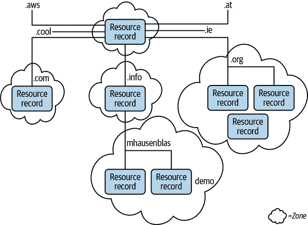

# 第七章：网络

在本章中，我们详细介绍了 Linux 网络。在现代环境中，Linux 提供的网络堆栈是一个重要的组成部分。没有它，几乎无法完成任何事情。无论您是想访问云提供商中的实例、浏览网页还是安装新应用程序，您都需要连接性，并且需要一种与之交互的方式。

我们首先来看看常见的网络术语，从硬件级别一直到用户界面组件，例如 HTTP 和 SSH。我们还将讨论网络堆栈、协议和接口。具体来说，我们将花时间讨论网络和更广泛的互联网的命名核心组成部分，即所谓的域名系统（DNS）。有趣的是，这个系统不仅在广域部署中发挥作用，而且还是诸如 Kubernetes 等容器环境中用于服务发现的中心组件。

接下来，我们将看看应用层网络协议和工具。这包括文件共享、网络文件系统以及其他通过网络共享数据的方法。

在本章的最后部分，我们将回顾一些高级网络主题，从地图制图到网络时间管理。

要设定本章内容的期望：您可以花费大量时间研究 Linux 网络；事实上，有整本书专门讲述这个主题。在这里，我们将采取一种务实的立场，从最终用户的角度进入实际操作的主题。关于网络的管理员主题，例如网络设备的配置和设置，大部分都超出了本章的范围。

现在，让我们把注意力转向网络基础知识。

# Basics

让我们首先讨论为何网络对多个用例至关重要，并定义一些常见的网络术语。

在现代环境中，网络在其中起着核心作用。这涵盖了诸如安装应用程序、浏览网页、查看邮件或社交媒体，以及与远程机器工作（从您连接到的嵌入式系统到云提供商数据中心中运行的服务器）。鉴于网络有许多移动部件和层次，要确定问题是硬件相关还是软件堆栈中的原因可能会很困难。

Linux 网络面临的另一个挑战来自于抽象化：本章涵盖的许多内容提供了一个高级用户界面，使得实际上在远程机器上运行的文件或应用程序似乎可以在本地机器上访问或操作。虽然提供使远程资源看起来像本地可访问的抽象是一个有用的特性，但我们不应忘记，归根结底，所有这些都归结为通过电线和空气传输的比特流。在故障排除或测试时请记住这一点。

图 7-1 展示了在高层次上，Linux 中网络是如何工作的。有各种网络硬件，如以太网或无线网卡；然后是一些内核级组件，如 TCP/IP 协议栈；最后，在用户空间中，有一系列工具用于配置、查询和使用网络。


###### 图 7-1\. Linux 网络概述

现在让我们深入了解 TCP/IP 协议栈，这是 Linux 网络的核心。

###### 提示

与 Linux 的其他领域不同，在网络空间，你需要查阅源代码或者希望接口和协议背后有正确的文档化设计假设。几乎每个协议和接口都是基于公开的规范。互联网工程任务组（IETF）通过 [*data​tracker.ietf.org*](https://datatracker.ietf.org) 免费提供所有这些请求评论（RFC）。

养成在深入实现细节之前简单阅读这些 RFC 的习惯。这些 RFC 是由实践者为实践者撰写的，并记录了良好的实践方法以及如何实现相关内容。不要害怕逐步阅读它们；你会对动机、用例以及事物为何成为现状有更好的理解。

# TCP/IP 协议栈

TCP/IP 协议栈，如 图 7-2 所示，是一个由多个协议和工具组成的分层网络模型，主要由 IETF 规范定义。每一层必须意识到并能够与其上下相邻的层通信。数据封装在数据包中，每一层通常在数据上添加包含其功能相关信息的头部。因此，如果应用程序想要发送数据，它会直接与最高层交互，逐层添加头部（发送路径）。相反，如果应用程序想要接收数据，数据会到达最低层，然后每一层依次处理并根据找到的头部信息将有效载荷传递到上一层（接收路径）。


###### 图 7-2\. TCP/IP 层共同工作以实现通信

从协议栈的底部开始，TCP/IP 协议栈的四层如下：

链路层

在协议栈的最低层，该层涵盖硬件（以太网、WiFi）和内核驱动程序，重点是如何在物理设备之间发送数据包。详见 “链路层”。

互联网层

使用互联网协议（IP），该层侧重于路由；即它支持在网络间的机器之间发送数据包。我们将在 “互联网层” 中讨论它。

传输层

这一层控制（虚拟或物理）主机之间的端到端通信，使用传输控制协议（TCP）进行基于会话的可靠通信和用户数据报协议（UDP）进行无连接通信。它主要处理数据包如何传输，包括通过端口寻址机器上的各个服务以及数据完整性。此外，Linux 支持套接字作为通信端点。请参阅“传输层”。

应用层

该层处理用户面向的工具和应用程序，如 Web、SSH 和邮件。我们将在“DNS”和“应用层网络”中讨论它。

分层意味着每一层的头部和有效负载构成下一层的有效负载。例如，看一下图 7-2，互联网层中的有效负载是传输层头部 H[T]及其有效负载。换句话说，互联网层接收来自传输层的数据包，将其视为不透明的字节块，并可以专注于其功能，即将数据包路由到目标机器。

现在让我们从 TCP/IP 协议栈的最低层开始工作，即链路层。

## 链路层

在 TCP/IP 协议栈的链路层中，所有内容都涉及硬件或接近硬件的内容，如字节、电线、电磁波、设备驱动程序和网络接口。在这个上下文中，您会遇到以下术语：

以太网

一系列使用电线连接机器的网络技术；通常用于局域网（LAN）中。

无线

也被称为 WiFi，一类通信协议和方法，不使用电线，而是使用电磁波来传输数据。

MAC 地址

缩写为*媒体访问控制*，MAC 是硬件的唯一 48 位标识符，用于识别您的机器（确切地说是网络接口；请参阅以下术语）。MAC 地址通过组织唯一标识符（OUI）编码制造商（接口的制造商），通常占据前 24 位。

接口

网络连接。它可以是物理接口（有关详细信息，请参阅“网络接口控制器”）或虚拟（软件）接口，如环回接口`lo`。

了解了这些基础知识，我们来更深入地了解链路层。

### 网络接口控制器

一个必要的硬件设备是[*网络接口控制器* (NIC)](https://oreil.ly/fZeVJ)，有时也称为*网络接口卡*。NIC 通过有线标准（例如，[以太网的 IEEE 802.3-2018 标准](https://oreil.ly/9g4Mu)）或来自[IEEE 802.11 家族的众多无线标准](https://oreil.ly/V5NiL)，提供与网络的物理连接。一旦连接到网络，NIC 将要发送的字节的数字表示转换为电气或电磁信号。对于接收路径，NIC 将接收到的物理信号转换为软件可以处理的位和字节。

让我们看看 NIC 的操作。传统上，人们会使用（现在广泛被视为已废弃的）[`ifconfig`命令](https://oreil.ly/QwgOc)查询系统上可用的 NIC 的信息（我们在此首先展示出来是为了教育目的；实际上，最好使用`ip`，如下一个示例所示）：

```
$ ifconfig
lo: flags=73<UP,LOOPBACK,RUNNING>  mtu 65536 
        inet 127.0.0.1  netmask 255.0.0.0
        inet6 ::1  prefixlen 128  scopeid 0x10<host>
        loop  txqueuelen 1000  (Local Loopback)
        RX packets 7218  bytes 677714 (677.7 KB)
        RX errors 0  dropped 0  overruns 0  frame 0
        TX packets 7218  bytes 677714 (677.7 KB)
        TX errors 0  dropped 0 overruns 0  carrier 0  collisions 0

wlp1s0: flags=4163<UP,BROADCAST,RUNNING,MULTICAST>  mtu 1500 
        inet 192.168.178.40  netmask 255.255.255.0  broadcast 192.168.178.255
        inet6 fe80::be87:e600:7de7:e08f  prefixlen 64  scopeid 0x20<link>
        ether 38:de:ad:37:32:0f  txqueuelen 1000  (Ethernet)
        RX packets 2398756  bytes 3003287387 (3.0 GB)
        RX errors 0  dropped 7  overruns 0  frame 0
        TX packets 504087  bytes 85467550 (85.4 MB)
        TX errors 0  dropped 0 overruns 0  carrier 0  collisions 0
```


这里的第一个接口是`lo`，具有 IP 地址`127.0.0.1`（参见“IPv4”）。最大传输单元（MTU）是数据包大小，这里为 65,536 字节（较大的尺寸意味着更高的吞吐量）；出于历史原因，以太网的默认值为 1,500 字节，但您可以使用[巨型帧](https://oreil.ly/NjpnF)，大小为 9,000 字节。


报告的第二个接口是`wlp1s0`，分配了 IPv4 地址`192.168.178.40`。此接口是一个 NIC，并且具有 MAC 地址（`ether`为`38:de:ad:37:32:0f`）。查看标志（`<UP,BROADCAST,RUNNING,MULTICAST>`），看起来它是可操作的。

对于以相同方式（查询接口并检查其状态）更现代的方法，请使用[`ip`命令](https://oreil.ly/pruUF)。在本章中，我们将经常使用这种方法（已编辑输出以适应）：

```
$ ip link show
1: lo: <LOOPBACK,UP,LOWER_UP> mtu 65536 qdisc noqueue 
   state UNKNOWN mode DEFAULT group default qlen 1000
   link/loopback 00:00:00:00:00:00 brd 00:00:00:00:00:00
2: wlp1s0: <BROADCAST,MULTICAST,UP,LOWER_UP> mtu 1500 qdisc noqueue 
   state UP mode DORMANT group default qlen 1000
    link/ether 38:de:ad:37:32:0f brd ff:ff:ff:ff:ff:ff
```


环回接口。


我的 NIC，MAC 地址为`38:de:ad:37:32:0f`。请注意，此处的名称（`wlp1s0`）告诉您有关接口的一些信息：它是 PCI 总线 1 中的无线接口（`wl`），插槽 0（`s0`）。这种命名使接口名称更加可预测。换句话说，如果您有两个旧式接口（比如`eth0`和`eth1`），重启或添加新卡可能会导致 Linux 重新命名这些接口。

对于`ifconfig`和`ip link`，您可能对标志（如`LOWER_UP`或`MULTICAST`）的含义感兴趣；这些内容在[netdevice 手册页](https://oreil.ly/OTB7R)中有详细记录。

### 地址解析协议

地址解析协议（ARP）将 MAC 地址映射到 IP 地址。在某种意义上，它将链路层与其上层，即互联网层，桥接起来。

让我们看看它的实际操作：

```
$ arp 
Address                  HWtype  HWaddress           Flags Mask            Iface
mh9-imac.fritz.box       ether   00:25:4b:9b:64:49   C                     wlp1s0
fritz.box                ether   3c:a6:2f:8e:66:b3   C                     wlp1s0
```


使用`arp`命令显示将 MAC 地址映射到主机名或 IP 地址的缓存。请注意，您可以使用`arp -n`来阻止主机名解析，并显示 IP 地址而不是 DNS 名称。

或者，使用更现代的方法，使用`ip`：

```
$ ip neigh 
192.168.178.34 dev wlp1s0 lladdr 00:25:4b:9b:64:49 STALE
192.168.178.1 dev wlp1s0 lladdr 3c:a6:2f:8e:66:b3 REACHABLE
```


使用`ip`命令显示将 MAC 地址映射到 IP 地址的缓存。

要显示、配置和排除无线设备问题，您可以使用[`iw`命令](https://oreil.ly/fyR0y)。例如，我知道我的无线网卡叫做`wlp1s0`，因此我可以查询它：

```
$ iw dev wlp1s0 info 
Interface wlp1s0
        ifindex 2
        wdev 0x1
        addr 38:de:ad:37:32:0f
        ssid FRITZ!Box 7530 QJ 
        type managed
        wiphy 0
        channel 5 (2432 MHz), width: 20 MHz, center1: 2432 MHz 
        txpower 20.00 dBm
```


显示有关无线接口`wlp1s0`的基本信息。


该接口连接的路由器（也请参阅下一个示例）。


该接口使用的 WiFi 频段。

此外，我可以这样收集与路由器和流量相关的信息：

```
$ iw dev wlp1s0 link 
Connected to 74:42:7f:67:ca:b5 (on wlp1s0)
        SSID: FRITZ!Box 7530 QJ
        freq: 2432
        RX: 28003606 bytes (45821 packets) 
        TX: 4993401 bytes (15605 packets)
        signal: -67 dBm
        tx bitrate: 65.0 MBit/s MCS 6 short GI

        bss flags:      short-preamble short-slot-time
        dtim period:    1
        beacon int:     100
```


显示有关无线接口`wlp1s0`的连接信息。


这和下一行发送（`TX`表示“发送”）和接收（`RX`）的统计信息——即通过此接口发送和接收的字节和数据包。

现在我们对 TCP/IP 堆栈的最低层，即数据链路层，有了很好的掌握，让我们向上移动堆栈。

## 互联网层

TCP/IP 堆栈的第二低层，即互联网层，负责从网络上的一台机器路由数据包到另一台机器。互联网层的设计假定可用的网络基础设施是不可靠的，并且参与者（例如网络中的节点或它们之间的连接）频繁变化。

互联网层提供尽力而为的传输（即，不保证性能），并将每个数据包视为独立的。因此，更高层次的传输层通常负责处理地址和可靠性问题，包括数据包顺序、重试或传输保证。

在这一层中，用于在全球范围内唯一逻辑标识机器的主导协议是互联网协议（IP），它有两种版本，即 IP 版本 4（IPv4）和 IP 版本 6（IPv6）。

### IPv4

IPv4 定义了唯一的 32 位数字，用于标识在 TCP/IP 通信中作为端点的主机或进程。

写 IPv4 地址的一种方式是将 32 位数分为四个由句点分隔的 8 位段，每个段在 0 到 255 范围内，称为*八位字节*（提示该段覆盖了 8 位）。让我们看一个具体的例子：

```
 63.32.106.149
\_/\_/ \_/ \_/
 |  |   |   └─ 
 |  |   └───── 
 |  └───────── 
 └──────────── 
```


第一个八位字节的二进制形式：`00111111`


第二个八位字节的二进制形式：`00100000`


第三个八位字节的二进制形式：`01101010`


第四个八位字节的二进制形式：`10010101`

IP 头部（图 7-3）如 [RFC 791](https://oreil.ly/7u93r) 和相关的 IETF 规范所定义，有若干字段，但以下是你应该了解的最重要的几个：

源地址（32 位）

发送方的 IP 地址

目的地地址（32 位）

接收方的 IP 地址

协议（8 位）

负载类型（下一高层类型），根据 [RFC 790](https://oreil.ly/Y8PPz)，例如 TCP、UDP 或 ICMP

存活时间，又称 TTL（8 位）

数据包允许存在的最大时间

服务类型（8 位）

可用于服务质量（QoS）目的


###### 图 7-3\. 根据 RFC 791 的 IP 头部格式

鉴于互联网是一个网络的网络，将网络和网络中的单个机器（主机）区分开来似乎是很自然的。IP 地址范围分配给网络，而在这些网络中又分配给个别主机。

如今，[无类域间路由（CIDR）](https://oreil.ly/VDVuy) 是分配 IP 地址的唯一相关方法。CIDR 格式由两部分组成：

+   第一部分表示网络地址。这看起来像一个普通的 IP 地址，例如 `10.0.0.0`。

+   第二部分定义了地址范围内有多少位（及相应的 IP 地址）—例如 `/24`。

因此，一个完整的 CIDR 范围示例如下所示：

```
10.0.0.0/24
```

在上面的示例中，前 24 位（或三个八位字节）表示网络，剩余的 8 位（总共 32 位减去用于网络的 24 位）是为 256 个主机（2⁸）提供的 IP 地址。此 CIDR 范围内的第一个 IP 地址是 `10.0.0.0`，最后一个 IP 地址是 `10.0.0.255`。严格来说，只有地址 `10.0.0.1` 到 `10.0.0.254` 可以分配给主机，因为 `.0` 和 `.255` 地址被保留用于特殊目的。此外，我们可以说子网掩码是 `255.255.255.0`，因为这是代表网络的前 24 位。

实际上，你不需要记住这里的所有数学。如果你每天都处理 CIDR 范围，那么你只需了解，如果你是个偶尔使用者，你可能希望使用一些工具。如果你想进行 CIDR 范围计算，比如确定一个范围内有多少个 IP 地址，下面是可以使用的：

+   在 [*https://cidr.xyz*](https://cidr.xyz) 和 [*https://ipaddressguide.com/cidr*](https://ipaddressguide.com/cidr) 等在线工具中

+   像 [mapcidr](https://oreil.ly/2uTwU) 和 [cidrchk（由本人开发）](https://oreil.ly/g88Yk) 这样的命令行工具

还有一些显著的 [保留的 IPv4 地址](https://oreil.ly/97Tp7) 你应该知道：

`127.0.0.0`

此子网保留用于本地地址，最突出的是环回地址 `127.0.0.1`。

`169.254.0.0/16`（`169.254.0.0` 到 `169.254.255.255`）

这些是本地链路地址，意味着发送到这里的数据包不应该被转发到网络的其他部分。一些云服务提供商如亚马逊网络服务使用这种地址来提供特殊服务（元数据）。

`224.0.0.0/24` (`224.0.0.0` 到 `239.255.255.255`)

这个范围是保留用于多播。

[RFC 1918](https://oreil.ly/2Ijxk) 定义了私有 IP 范围。私有 IP 范围意味着其中的 IP 地址在公共互联网上不可路由，因此在内部分配这些地址是安全的（例如，在公司的上下文中）。

+   `10.0.0.0` 到 `10.255.255.255` (`10/8` 前缀)

+   `172.16.0.0` 到 `172.31.255.255` (`172.16/12` 前缀)

+   `192.168.0.0` 到 `192.168.255.255` (`192.168/16` 前缀)

另一个有趣的 IPv4 地址是`0.0.0.0`。这是一个非路由地址，根据上下文有不同的用例和意义，但从服务器的角度来看，最重要的是`0.0.0.0`指代机器上所有 IPv4 地址的意思。这是一个很好的方式来表达“在所有可用 IP 地址上监听”。

那是很多干巴巴的理论；让我们看看它如何运行。我们将从查询与 IP 相关的机器开始（输出已编辑）：

```
$ ip addr show 
1: lo: <LOOPBACK,UP,LOWER_UP> mtu 65536 qdisc noqueue
    state UNKNOWN group default qlen 1000
    link/loopback 00:00:00:00:00:00 brd 00:00:00:00:00:00
    inet 127.0.0.1/8 scope host lo 
       valid_lft forever preferred_lft forever
    inet6 ::1/128 scope host
       valid_lft forever preferred_lft forever
2: wlp1s0: <BROADCAST,MULTICAST,UP,LOWER_UP> mtu 1500 qdisc
    noqueue state UP group default qlen 1000
    link/ether 38:de:ad:37:32:0f brd ff:ff:ff:ff:ff:ff
    inet 192.168.178.40/24 brd 192.168.178.255 scope global dynamic 
    noprefixroute wlp1s0
       valid_lft 863625sec preferred_lft 863625sec
    inet6 fe80::be87:e600:7de7:e08f/64 scope link noprefixroute
       valid_lft forever preferred_lft forever
```


列出所有接口的地址。


回环接口的 IP 地址 (`127.0.0.1`，如预期所示)。


无线网卡的（私有）IP 地址。请注意，这是机器的局域网本地 IP 地址，不可公开路由，因为它属于`192.168/16`范围。

IPv4 地址空间已经枯竭，考虑到今天的端点比互联网设计者预想的多得多（例如移动设备和物联网设备），我们需要一个可持续的解决方案。

IPv6 解决了地址耗尽问题，这是一大利好。遗憾的是，截至目前，由于基础设施问题以及缺乏支持 IPv6 的工具，整体生态系统仍未全面过渡到 IPv6。这意味着在当前时期，你仍需处理 IPv4 及其限制和[解决方案](https://oreil.ly/XSiTu)。

让我们来看看（希望不会太遥远的）未来：IPv6。

### IPv6

[IPv6 互联网协议版本 6](https://oreil.ly/T0ISm) 是一种 128 位数，用于标识 TCP/IP 通信中的端点。这意味着使用 IPv6，我们可以分配大约 10³⁸个独立的机器（设备）。与 IPv4 不同，IPv6 使用十六进制表示，每组 16 位，用冒号(`:`)分隔。

IPv6 地址有几条缩写规则，例如去掉前导零或者用两个冒号(`::`)替换连续的零段。例如，IPv6 的[回环地址](https://oreil.ly/mGfiU)可以简写为`::1`（IPv4 的变体是`127.0.0.1`）。

就像 IPv4 一样，IPv6 有许多特殊和保留地址；请参见 APNIC 的[IPv6 地址类型列表](https://oreil.ly/isoL1)以获取示例。

需要注意的是 IPv4 和 IPv6 不兼容。这意味着 IPv6 支持需要内置到每个网络参与者中，从边缘设备（如您的手机）到路由器到服务器软件。至少在 Linux 的背景下，IPv6 支持已经非常广泛。例如，我们在“IPv4”部分看到的`ip addr`命令已经默认显示了 IPv6 地址。

### Internet Control Message Protocol

[RFC 792](https://oreil.ly/6Nphe) 定义了 Internet Control Message Protocol（ICMP），用于低级组件发送错误消息和操作信息，例如可用性。

让我们通过使用`ping`测试网站的可达性来看 ICMP 如何工作：

```
$ ping mhausenblas.info
PING mhausenblas.info (185.199.109.153): 56 data bytes
64 bytes from 185.199.109.153: icmp_seq=0 ttl=38 time=23.140 ms
64 bytes from 185.199.109.153: icmp_seq=1 ttl=38 time=23.237 ms
64 bytes from 185.199.109.153: icmp_seq=2 ttl=38 time=23.989 ms
64 bytes from 185.199.109.153: icmp_seq=3 ttl=38 time=24.028 ms
64 bytes from 185.199.109.153: icmp_seq=4 ttl=38 time=24.826 ms
64 bytes from 185.199.109.153: icmp_seq=5 ttl=38 time=23.579 ms
64 bytes from 185.199.109.153: icmp_seq=6 ttl=38 time=22.984 ms
^C
--- mhausenblas.info ping statistics ---
7 packets transmitted, 7 packets received, 0.0% packet loss
round-trip min/avg/max/stddev = 22.984/23.683/24.826/0.599 ms
```

或者，您可以使用[`gping`](https://oreil.ly/1Y5qv)，它可以同时对多个目标进行 ping 测试，并在命令行上绘制图表（参见图 7-4）。


###### 图 7-4. 使用`gping`对两个网站进行 ping 测试

请注意，IPv6 也有一个等效的工具：恰如其名的[`ping6`](https://oreil.ly/F6q6B)。

### 路由

Linux 的一部分网络堆栈涉及路由，即决定每个数据包发送到哪里。目的地可以是同一台机器上的一个进程，也可以是不同机器上的 IP 地址。

尽管路由的确切实现细节超出了本章的范围，我们将提供一个高层次的概述：[iptables](https://oreil.ly/roRsv)，这是一个广泛使用的工具，允许您操纵路由表，例如根据条件重新路由数据包或实施防火墙，它使用[netfilter](https://www.netfilter.org)来拦截和操纵数据包。

您应该知道如何查询和显示路由信息，如下所示：

```
$ sudo route -n 
Kernel IP routing table
Destination     Gateway         Genmask         Flags Metric Ref    Use Iface
0.0.0.0         192.168.178.1   0.0.0.0         UG    600    0        0 wlp1s0
169.254.0.0     0.0.0.0         255.255.0.0     U     1000   0        0 wlp1s0
192.168.178.0   0.0.0.0         255.255.255.0   U     600    0        0 wlp1s0
```


使用`route`命令并使用`-n`，强制使用数值 IP 地址。

前一个`route`命令中表格输出的详细含义如下：

`目的地`

目的地的 IP 地址；`0.0.0.0`表示未指定或未知，可能会将其发送到网关。

`网关`

对于不在同一网络上的数据包，网关地址。

`Genmask`

使用的子网掩码。

`标志`

`UG` 意味着网络已连接并且是一个网关。

`接口`

数据包要使用的网络接口。

一个现代的方法是使用`ip`，像这样：

```
$ sudo ip route
default via 192.168.178.1 dev wlp1s0 proto dhcp metric 600
169.254.0.0/16 dev wlp1s0 scope link metric 1000
192.168.178.0/24 dev wlp1s0 proto kernel scope link src 192.168.178.40 metric 600
```

它是下线了吗？我们可以检查连接性如下：

```
$ traceroute mhausenblas.info
traceroute to mhausenblas.info (185.199.108.153), 30 hops max, 60 byte packets
 1  _gateway (192.168.5.2)  1.350 ms  1.306 ms  1.293 ms
```

请注意，我们将在“监控”中讨论许多与 TCP/IP 相关的故障排除和性能工具。

最后，我也会简要提到[边界网关协议（BGP）](https://oreil.ly/QMc1v)，如[RFC 4271](https://oreil.ly/iwRNE)所定义以及其他 IETF 规范。虽然您不太可能直接与 BGP 交互（除非您在网络提供商工作或管理网络），但了解其存在并高层次理解其作用至关重要。

我们之前说过，互联网实际上是一个网络的网络。在 BGP 术语中，网络称为*自治系统*（AS）。为了使 IP 路由工作，这些 AS 需要共享它们的路由和可达性数据，宣布路由以跨互联网传递数据包。

现在您已经了解了互联网层的基本工作原理——地址和路由如何工作——让我们上升到堆栈的更高层。

## 传输层

在这一层，重点在于端点之间通信的性质。有连接导向的协议和无连接的协议。可靠性、QoS 和顺序传递可能是一个问题。

###### 注意

在现代协议设计中，有一些尝试——例如，[HTTP/3](https://oreil.ly/ecuPK)——结合功能，例如将 TCP 的某些部分移到更高级别的协议中。

### 端口

这一层的一个核心概念是端口。无论在这一层使用哪种协议，每个协议都需要端口。*端口*是一个唯一的 16 位数，用于标识 IP 地址上可用的服务。可以这样理解：单个（虚拟）机器可能运行多个服务（参见“应用层网络”），您需要能够在机器的 IP 上识别每个服务。

我们区分以下内容：

熟知端口（从 0 到 1023）

这些是用于守护进程（如 SSH 服务器或 Web 服务器）的端口。使用（绑定到）其中一个端口需要提升的权限（`root` 或 `CAP_NET_BIND_SERVICE` 能力，如在“能力”讨论）。

注册端口（从 1024 到 49151）

这些由互联网分配号码管理局（IANA）通过公开文档化的过程管理。

临时端口（从 49152 到 65535）

这些无法注册。它们可以用于自动分配临时端口（例如，如果您的应用连接到 Web 服务器，它本身需要一个端口，作为通信的另一端点），以及用于私有（例如，公司内部）服务。

您可以在 */etc/services* 中看到端口和映射，并且还有一个详尽的[TCP 和 UDP 端口号](https://oreil.ly/VBp7N)列表供您参考，如果您不确定的话。

如果您想查看本地机器上正在使用的内容（*请勿*在他人的机器上/对非本地 IP 执行此操作）：

```
$ nmap -A localhost 

Starting Nmap 7.60 ( https://nmap.org ) at 2021-09-19 14:53 IST
Nmap scan report for localhost (127.0.0.1)
Host is up (0.00025s latency).
Not shown: 999 closed ports
PORT    STATE SERVICE VERSION
631/tcp open  ipp     CUPS 2.2 
| http-methods:
|_  Potentially risky methods: PUT
| http-robots.txt: 1 disallowed entry
|_/
|_http-server-header: CUPS/2.2 IPP/2.1
|_http-title: Home - CUPS 2.2.7

Service detection performed. Please report any incorrect results
at https://nmap.org/submit/ .
Nmap done: 1 IP address (1 host up) scanned in 6.93 seconds
```


扫描本地机器上的端口。


发现一个开放的端口，631，即互联网打印协议（IPP）。

介绍了端口的一般概念后，让我们看看这些端口在不同的传输层协议中是如何使用的。

### 传输控制协议

*传输控制协议*（TCP）是一个面向连接的传输层协议，被许多高层协议使用，包括 HTTP 和 SSH（见“应用层网络”）。它是一个基于会话的协议，保证数据包的有序传输并支持错误重传。

TCP 头部（如图 7-5 所示），定义在[RFC 793](https://oreil.ly/4BY3T)和相关的 IETF 规范中，其最重要的字段包括：

源端口（16 位）

发送方使用的端口。

目标端口（16 位）

接收方使用的端口。

序列号（32 位）

用于管理有序传输。

确认号（32 位）

此号码和`SYN`和`ACK`标志是所谓的[*TCP/IP 三次握手*](https://oreil.ly/Icea3)的核心。

标志位（9 位）

最重要的是`SYN`（同步）和`ACK`（确认）位。

窗口（16 位）

接收窗口大小

校验和（16 位）

TCP 头部的校验和，用于错误检查。

数据

待传输的有效负载。


###### 图 7-5。根据 RFC 793 定义的 TCP 头部格式

TCP 从建立到终止跟踪连接的状态，发送方和接收方都必须协商某些事项，从发送多少数据（TCP 窗口大小）到 QoS。

从安全的角度来看，TCP 没有任何防御机制。换句话说，负载以明文形式发送，发送方和接收方之间的任何人（设计上有很多跳）都可以检查数据包；详见“Wireshark 和 tshark”，了解如何使用 Wireshark 和`tshark`检查数据包的详细信息。要启用消息的加密，您需要使用传输层安全性（TLS）协议，理想情况下是第 1.3 版，根据[RFC 8446](https://oreil.ly/6dTwf)。

接下来，让我们转向最重要的无状态传输层协议：UDP。

### 用户数据报协议

*用户数据报协议*（UDP）是一种无连接的传输层协议，允许您发送称为*数据报*的消息，无需像 TCP 那样进行通信设置（如握手）。然而，它支持数据报的校验和以确保完整性。有许多应用层协议，如 NTP 和 DHCP（见“应用层网络”），以及 DNS（见“DNS”），使用 UDP。

[RFC 768](https://oreil.ly/dysc4)定义了 UDP 头部的格式，如图 7-6 所示。其最重要的字段如下：

源端口（16 位）

发送方使用的端口；可选，如果不使用，则使用 0

目标端口（16 位）

接收方使用的端口

长度（16 位）

UDP 头部和数据的总长度

校验和（16 位）

可以选择用于错误检查

数据

数据包的有效载荷


###### 图 7-6。根据 RFC 768 的 UDP 头格式

UDP 是一个非常简单的协议，并且需要在其之上运行的更高级别协议来处理许多 TCP 本身会处理的事情。另一方面，UDP 的开销非常小，可以实现很高的吞吐量。使用起来非常简单；另请参阅[UDP 手册页面](https://oreil.ly/NJiAQ)。

## 套接字

Linux 提供的高级通信接口是[*套接字*](https://oreil.ly/C7gQA)。将它们视为通信中的端点，具有它们自己的独特身份：由 TCP 或 UDP 端口和 IP 地址组成的元组。

如果您想要开发与网络相关的工具或应用程序，很可能只会使用套接字，但至少应该知道如何查询它们。例如，在[Docker 守护程序](https://oreil.ly/OUD5V)的上下文中，您至少需要了解套接字所需的权限。

让我们看看如何使用[`ss`命令](https://oreil.ly/qtCkK)显示与套接字相关的信息。

假设我们想要系统上正在使用的 TCP 套接字的概述：

```
$ ss -s 
Total: 913 (kernel 0)
TCP:   10 (estab 4, closed 1, orphaned 0, synrecv 0, timewait 1/0), ports 0 

Transport Total     IP        IPv6 
*         0         -         -
RAW       1         0         1
UDP       10        8         2
TCP       9         8         1
INET      20        16        4
FRAG      0         0         0
```


使用`ss`命令查询端口（使用`-s`，我们请求一个摘要）。


TCP 的总结；总共使用了 10 个套接字。


更详细的概述，按类型和 IP 版本分解。

现在，UDP 怎么样？我们可以获取这些信息吗，也许还有一些更详细的信息，例如端点 IP 地址？事实证明，这也可以通过`ss`实现（输出已编辑）：

```
$ ss -ulp 
State    Recv-Q  Send-Q   Local Address:Port     Peer Address:Port
UNCONN   0       0              0.0.0.0:60360         0.0.0.0:*
UNCONN   0       0        127.0.0.53%lo:domain        0.0.0.0:*
UNCONN   0       0              0.0.0.0:bootpc        0.0.0.0:*
UNCONN   0       0              0.0.0.0:ipp           0.0.0.0:*
UNCONN   0       0              0.0.0.0:mdns          0.0.0.0:*
UNCONN   0       0                 [::]:mdns             [::]:*
UNCONN   0       0                 [::]:38359            [::]:*
```


使用`ss`：`-u`参数限制为 UDP 套接字，`-l`用于选择监听套接字，`-p`还显示进程信息（在我们的情况下没有）。

在这种情况下，您可能会发现另一个有用的工具（套接字和进程）是[`lsof`](https://oreil.ly/YBhMB)。例如，让我们看看我的机器上 Chrome 使用了哪些 UDP 套接字（输出已编辑）：

```
 $ lsof -c chrome -i udp | head -5 
COMMAND   PID USER   FD  TYPE   DEVICE     NODE NAME
chrome   3131  mh9  cwd   DIR      0,5   265463 /proc/5321/fdinfo
chrome   3131  mh9  rtd   DIR      0,5   265463 /proc/5321/fdinfo
chrome   3131  mh9  txt   REG    253,0  3673554 /opt/google/chrome/chrome
chrome   3131  mh9  mem   REG    253,0  3673563 /opt/google/chrome/icudtl.dat
chrome   3131  mh9  mem   REG    253,0 12986737 /usr/lib/locale/locale-archive
```


使用`lsof`与`-c`来具体选择一个进程的名称，同时限制为使用`-i`的 UDP。请注意，总体输出可能有几十行；这就是为什么我用管道中的`head -5`命令将其减少到五行。

通过这样，我们已经涵盖了 TCP/IP 协议栈的三个较低层次。由于应用层有很多工作要做，我专门划分了两个部分来处理它：首先，我们将研究全球范围的命名系统，然后我们将研究一些应用层（或第 7 层）协议和应用程序，比如 Web。

# DNS

我们了解到 TCP/IP 协议栈的 Internet 层定义了所谓的 IP 地址，其主要功能是标识机器，无论是虚拟的还是物理的。在"容器"的背景下，我们甚至为每个容器分配 IP 地址。无论是 IPv4 还是 IPv6，数字 IP 地址都面临两个挑战：

+   作为人类，我们通常比起（长）数字更容易记住名称。例如，如果你想与朋友分享一个网站，你只需说这是[*ietf.org*](https://ietf.org)，而不是`4.31.198.44`。

+   由于互联网及其应用程序的构建方式，IP 地址经常会发生变化。在传统设置中，您可能会得到一个新的服务器和新的 IP 地址。或者在容器的上下文中，您可能会被重新调度到不同的主机，此时容器将自动分配一个新的 IP 地址。

简而言之，IP 地址难以记住且可能会改变，而名称（用于服务器或服务）保持不变。这个挑战自互联网初期以来就存在，并且自 UNIX 支持 TCP/IP 协议栈以来也是如此。

解决这个问题的方式是在本地（在单台机器的上下文中）通过*/etc/hosts*维护名称和 IP 地址之间的映射。网络信息中心（NIC）通过 FTP 与所有参与的主机共享一个称为*HOSTS.TXT*的单一文件。

很快就清楚，这种集中式方法无法跟上不断增长的互联网发展步伐，在 20 世纪 80 年代初设计了分布式系统。保罗·莫卡佩特里斯是首席架构师。

DNS 是互联网上主机和服务的全球分层命名系统。虽然有许多相关的 RFC 文档，但最初的[RFC 1034](https://oreil.ly/rbQNY)及其通过[RFC 1035](https://oreil.ly/c1eYB)的实施指南仍然有效，如果您想了解更多动机和设计，请务必阅读它们。

DNS 使用许多术语，但以下是主要概念：

域名空间

一棵以`.`为根的树状结构，每个树节点和叶子都包含关于特定空间的信息。从叶子到根的路径上的标签（最大长度为 63 个字节）称为*完全限定域名*（FQDN）。例如，*demo.mhausenblas.info.* 是一个带有所谓顶级域名*.info*的 FQDN。请注意，右边的点，即根，通常被省略。

资源记录

域名空间的节点或叶子中的有效负载（请参见"DNS 记录"）。

名称服务器

保存有关域树结构信息的服务器程序。如果一个名字服务器拥有完整的空间信息，它被称为*权威名字服务器*。权威信息被组织成区域。

解析器

响应客户端请求从名称服务器中提取信息的程序。它们是机器本地的，没有为解析器和客户端之间的交互定义明确的协议。通常支持用于解析 DNS 的库调用。

图 7-7 显示了 DNS 系统的完整设置，包括用户程序、解析器和名称服务器，如 RFC 1035 所述。在查询过程中，解析器将从根开始迭代查询权威名称服务器（NS），或者如果支持的话，使用递归查询，其中一个 NS 代表解析器查询其他 NS。


###### 图 7-7。一个完整的 DNS 示例设置

###### 注意

尽管它们仍然存在，但我们通常不在现代系统中使用 DNS [解析器配置](https://oreil.ly/2plq1) */etc/resolv.conf*，特别是在部署 DHCP（见“动态主机配置协议”）时。

DNS 是一个层次命名系统，在其根部署着管理顶级域记录的 13 个[根服务器](https://oreil.ly/hNppq)。根之下直接是[顶级域名（TLD）](https://oreil.ly/secgy)：

基础设施顶级域

由 IANA 代表 IETF 管理，包括例如*example*和*localhost*

通用顶级域名（gTLD）

三个或更多字符的通用域名，例如*.org*或*.com*

国家代码顶级域（ccTLD）

适用于分配了[两字母 ISO 国家代码](https://oreil.ly/lBWjD)的国家或地区。

赞助的顶级域名（sTLD）

为私人机构或组织建立和执行限制使用 TLD 资格的规则，例如*.aero*和*.gov*

让我们更仔细地看一些 DNS 的移动部件及其在实践中的使用方法。

## DNS 记录

名称服务器管理记录，捕获类型、有效载荷和其他字段，包括生存时间（TTL）、记录应该被丢弃的时间段。您可以将 FQDN 视为节点的地址，将资源记录（RR）视为有效载荷，节点中的数据。

DNS 具有许多[记录类型](https://oreil.ly/5QTJ9)，包括以下最重要的（按字母顺序）：

`A`记录（RFC 1035）和`AAAA`记录（RFC 3596）

分别是 IPv4 和 IPv6 地址记录，通常用于将主机名映射到主机的 IP 地址。

`CNAME`记录（RFC 1035）

提供一个名称的规范名称记录到另一个名称的别名。

`NS`记录（RFC 1035）

将 DNS 区域委托给权威名称服务器使用的名称服务器记录。

`PTR`记录（RFC 1035）

用于执行反向 DNS 查找的指针记录；与`A`记录相反。

`SRV`记录（RFC 2782）

服务定位器记录。它们是通用的发现机制，而不是像传统上硬编码的（例如邮件交换的`MX`记录类型）。

`TXT`记录（RFC 1035）

文本记录。这些最初用于任意人类可读文本，但随着时间的推移发现了新的用途。今天，在安全相关 DNS 扩展的背景下，这些记录通常包含机器可读的数据。

也有以星号标签（`*`）开头的[通配符记录](https://oreil.ly/yL039)—例如，**.mhausenblas.info*—用作匹配不存在名称的请求的通配符。

现在让我们看看这些记录在实践中是什么样子的。DNS 记录以文本形式在[区域文件](https://oreil.ly/4Ngai)中表示，这些文件由像[bind](https://oreil.ly/095v2)这样的名字服务器读取并作为其数据库的一部分。

```
$ORIGIN example.com. 
$TTL 3600 
@	SOA nse.example.com. nsmaster.example.com. (
		1234567890 ; serial number
		21600      ; refresh after 6 hours
		3600       ; retry after 1 hour
		604800     ; expire after 1 week
		3600 )     ; minimum TTL of 1 hour
example.com.  IN  NS    nse 
example.com.  IN  MX    10 mail.example.com. 
example.com.  IN  A     1.2.3.4 
nse           IN  A     5.6.7.8 
www           IN  CNAME example.com. 
mail          IN  A     9.0.0.9 
```


在命名空间中这个区域文件的开始。


所有未定义自己 TTL 的资源记录的默认过期时间（以秒为单位）。


此域的名称服务器。


此域的邮件服务器。


此域名的 IPv4 地址。


名字服务器的 IPv4 地址。


将*www.example.com*设置为该域的别名，即*example.com*。


邮件服务器的 IPv4 地址。

将所有讨论的概念整合在一起，我们现在可以理解图示中显示的例子，见 Figure 7-8。这显示了全球域名空间的一部分和一个具体的 FQDN 示例，*demo.mhausenblas.info*：

*.info*

由名为[Afilias](https://www.afilias.info)的公司管理的通用顶级域。

*mhausenblas.info*

我购买的一个域名。在此区域内，我可以任意分配子域。

*demo.mhausenblas.info*

我为演示目的分配的子域。



###### 图 7-8\. 域名空间及示例路径（FQDN）

考虑到在前面的示例中，每个实体（Afilias 或我）只需照看自己的部分，无需协调。例如，要创建*demo*子域，我只需更改我的区域的 DNS 设置，无需请求 Afilias 的支持或权限。这看似简单的事实正是 DNS 去中心化性质的核心，也是其可扩展性的原因。

现在我们知道域名空间的结构及其节点中的信息是如何表示的，让我们看看如何查询它们。

## DNS 查找

有了所有基础设施的支持，主要是名字服务器和解析器，我们现在看看如何执行 DNS 查询。在解析（主要涵盖在 RFC 1034 和 1035 中）的评估和构建中有很多逻辑，但这超出了本书的范围。让我们看看如何在不必理解内部工作的情况下进行查询。

您可以使用`host`命令查询本地（和全球）名称以将其解析为 IP 地址，反之亦然：

```
$ host -a localhost 
Trying "localhost.fritz.box"
Trying "localhost"
;; ->>HEADER<<- opcode: QUERY, status: NOERROR, id: 49150
;; flags: qr rd ra; QUERY: 1, ANSWER: 2, AUTHORITY: 0, ADDITIONAL: 0

;; QUESTION SECTION:
;localhost.                     IN      ANY

;; ANSWER SECTION:
localhost.              0       IN      A       127.0.0.1
localhost.              0       IN      AAAA    ::1

Received 71 bytes from 127.0.0.53#53 in 0 ms

$ host mhausenblas.info 
mhausenblas.info has address 185.199.110.153
mhausenblas.info has address 185.199.109.153
mhausenblas.info has address 185.199.111.153
mhausenblas.info has address 185.199.108.153

$ host 185.199.110.153 
153.110.199.185.in-addr.arpa domain name pointer cdn-185-199-110-153.github.com.
```


查找本地 IP 地址。


查找 FQDN。


反向查找 IP 地址以找到 FQDN；看起来像是 GitHub CDN。

使用`dig`命令查找 DNS 记录的更强大方法：

```
$ dig mhausenblas.info 
; <<>> DiG 9.10.6 <<>> mhausenblas.info
;; global options: +cmd
;; Got answer:
;; ->>HEADER<<- opcode: QUERY, status: NOERROR, id: 43159
;; flags: qr rd ra; QUERY: 1, ANSWER: 4, AUTHORITY: 2, ADDITIONAL: 5

;; OPT PSEUDOSECTION:
; EDNS: version: 0, flags:; udp: 1232
;; QUESTION SECTION:
;mhausenblas.info.              IN      A

;; ANSWER SECTION: 
mhausenblas.info.       1799    IN      A       185.199.111.153
mhausenblas.info.       1799    IN      A       185.199.108.153
mhausenblas.info.       1799    IN      A       185.199.109.153
mhausenblas.info.       1799    IN      A       185.199.110.153

;; AUTHORITY SECTION: 
mhausenblas.info.       1800    IN      NS      dns1.registrar-servers.com.
mhausenblas.info.       1800    IN      NS      dns2.registrar-servers.com.

;; ADDITIONAL SECTION:
dns1.registrar-servers.com. 47950 IN    A       156.154.132.200
dns2.registrar-servers.com. 47950 IN    A       156.154.133.200
dns1.registrar-servers.com. 28066 IN    AAAA    2610:a1:1024::200
dns2.registrar-servers.com. 28066 IN    AAAA    2610:a1:1025::200

;; Query time: 58 msec
;; SERVER: 172.16.173.64#53(172.16.173.64)
;; WHEN: Wed Sep 15 19:22:26 IST 2021
;; MSG SIZE  rcvd: 256
```


使用`dig`，查找 FQDN *mhausenblas.info* 的 DNS 记录。


DNS A 记录。


权威名称服务器。

`dig`命令有可用的替代方法，特别是`dog`和`nslookup`；参见附录 B。

###### 提示

你经常会听到一句话：“问题总在 DNS 上。” 但这是什么意思呢？它涉及故障排除和理解 DNS 是一个具有许多移动部分的分布式数据库。在调试与 DNS 相关的问题时，请考虑记录的 TTL 和在你的应用程序到解析器之间的所有缓存。

在“DNS 记录”中，我们提到了`SRV`记录类型及其作为通用发现机制的功能。因此，与其在 RFC 中定义一个新的服务记录类型，社区想出了一种通用方法来应对任何即将到来的服务类型。本机制在[RFC 2782](https://oreil.ly/DIKbI)中描述，解释了如何通过 DNS 传递`SRV`记录以通信服务的 IP 地址和端口。

让我们来看看实际操作。比如说，我们想知道有哪些聊天服务——更具体地说，[可扩展消息传递与状态协议（XMPP）](https://oreil.ly/rDmcx)服务——是可用的：

```
$ dig +short _xmpp-client._tcp.gmail.com. SRV 
20 0 5222 alt3.xmpp.l.google.com.
5 0 5222 xmpp.l.google.com. 
20 0 5222 alt4.xmpp.l.google.com.
20 0 5222 alt2.xmpp.l.google.com.
20 0 5222 alt1.xmpp.l.google.com.
```


使用`dig`命令和`+short`选项仅显示相关的回答部分。*_xmpp-client._tcp*部分是 RFC 2782 规定的格式，而命令末尾的`SRV`指定了我们感兴趣的记录类型。


总共有五个回答。例如，一个服务实例可在*xmpp.l.google.com:5222*找到，TTL 为 5 秒。如果你有像 Jabber 这样的 XMPP 服务，可以使用这个地址进行配置输入。

到这里，我们已经结束了 DNS 部分。现在让我们来看看其他应用层协议和工具。

# 应用层网络

在本节中，我们专注于用户空间或应用层网络协议、工具和应用程序。作为最终用户，你可能会在这里花费大部分时间，使用诸如网页浏览器或邮件客户端之类的工具完成日常任务。

## 网络

Web 最初由 Tim Berners-Lee 爵士在 1990 年代初开发，有三个核心组件：

统一资源定位符（URL）

根据[RFC 1738](https://oreil.ly/EfgPm)以及一些更新和相关的 RFC，URL 定义了 Web 上资源的标识和位置。资源可以是静态页面或动态生成内容的进程。

超文本传输协议（HTTP）

HTTP 定义了应用层协议以及如何通过 URL 与可用内容交互。根据[RFC 2616](https://oreil.ly/hGr3E)的 v1.1 版本，但也有更现代的版本，例如在本文撰写时正在制定的 HTTP/2，由[RFC 7540](https://oreil.ly/1Z6pn)定义，以及[HTTP/3 草案](https://oreil.ly/XRkMf)。核心 HTTP 概念包括：

[HTTP 方法](https://oreil.ly/FFWuP)

包括`GET`用于读操作，以及`POST`等其他操作，这些定义了类似 CRUD 的接口。

[资源命名](https://oreil.ly/ttnOq)

这决定了如何形成 URL。

[HTTP 状态码](https://oreil.ly/LppmX)

成功的`2xx`范围，重定向的`3xx`，客户端错误的`4xx`，服务器错误的`5xx`。

超文本标记语言（HTML）

最初是 W3C 规范，HTML 现在是通过[WHATWG](https://oreil.ly/lUcHo)提供的一个活动标准。超文本标记语言允许您定义页面元素，如标题或输入。

让我们更仔细地看看如何构建 URI（URL 的通用版本）（根据 RFC 3986），以及它如何映射到 HTTP URL：

```
michaelh:12345678@http://example.com:4242/this/is/the/way?orisit=really#another
\______/ \______/ \__/   \_____________/\______________/ \___________/ \_____/
   |        |       |          |                |              |          |
   v        v       v          v                v              v          v
user password  scheme  authority             path          query   fragment
```

这些组件如下：

`user`和`password`（两者都是可选的）

最初用于基本身份验证，这些组件不应再使用。相反，对于 HTTP，您应该使用适当的[身份验证机制](https://oreil.ly/EHNfN)，以及用于传输中的[HTTPS](https://oreil.ly/Dvuh4)进行加密。

`scheme`

参考[URL 方案](https://oreil.ly/R9QeW)，这是一个 IETF 规范，定义了其含义。对于 HTTP 来说，该方案称为`http`，实际上是一组 HTTP 规范，例如 RFC 2616。

`authority`

分层命名部分。对于 HTTP 来说，这是：

主机名

可作为 DNS FQDN 或 IP 地址。

端口

默认为 80（因此*example.com:80*和*example.com*是相同的）。

`path`

用于进一步资源细节的方案特定部分。

`query`和`fragment`（两者都是可选的）

在非层次数据后出现（例如，用于表示标签或表单数据），后者在`#`后出现（在 HTML 的上下文中，这可能是一个部分）。

今天，Web 已远远超出其谦逊的 1990 年代根基，许多技术，如[JavaScript/ECMAScript](https://oreil.ly/b8kFe)和[Cascading Style Sheets (CSS)](https://oreil.ly/rSlYl)，被视为核心。这些新增内容，JavaScript 用于动态客户端内容，CSS 用于样式设计，最终导致了[单页 Web 应用程序](https://oreil.ly/E1SJu)的诞生。虽然这个话题超出了本书的范围，但重要的是要记住，熟练掌握基础知识（URL、HTTP 和 HTML）对于理解工作原理和解决可能出现的问题至关重要。

现在让我们通过模拟端到端流程来看 Web 规范的实际运作，从 HTTP 服务器端开始。

您可以通过两种方式相当容易地运行一个简单的 HTTP 服务器，它只提供目录内容：使用[Python](https://oreil.ly/clti0)或者使用[netcat (`nc`)](https://oreil.ly/AaCJG)。

使用 Python，要提供目录内容，您需要执行以下操作：

```
$ python3 -m http.server 
Serving HTTP on :: port 8000 (http://[::]:8000/) ... 
::ffff:127.0.0.1 - - [21/Sep/2021 08:53:53] "GET / HTTP/1.1" 200 - 
```


使用内置的 Python 模块`http.server`来提供当前目录的内容（即您启动此命令的目录）。


它确认准备通过端口 8000 提供服务。这意味着您可以在浏览器中输入[*http://localhost:8000*](http://localhost:8000)，然后在那里看到您目录的内容。


这表明根路径（*/*）发出了 HTTP 请求并成功提供服务（200 HTTP 响应代码）。

###### 提示

如果您希望执行更高级的操作，超出了提供静态目录内容的范围，请考虑使用像[NGINX](https://docs.nginx.com)这样的合适的 Web 服务器。例如，您可以使用以下命令在 Docker 中运行 NGINX（参见“Docker”）：

```
$ docker run --name mywebserver \ 
             --rm -d \ 
             –v  "$PWD":/usr/share/nginx/html:ro \ 
             -p 8042:80 \ 
             nginx:1.21 
```


将运行的容器称为`mywebserver`；当您发出`docker ps`命令列出运行的容器时，您应该看到它。


`--rm`参数会在退出时删除容器，而`-d`会将其变成守护进程（从终端分离，后台运行）。


将当前目录（`$PWD`）挂载到容器中作为 NGINX 源内容目录。请注意，`$PWD`是 bash 中指代当前目录的方法。在 Fish 中，您应该使用`(pwd)`。


使容器内部端口 80 通过 8042 在主机上可用。这意味着您可以在您的机器上通过[*http://localhost:8042*](http://localhost:8042)访问 Web 服务器。


要使用的容器映像是`nginx:1.21`，隐含地使用了 Docker Hub，因为我们没有指定注册表部分。

现在让我们看看如何使用[`curl`](https://curl.se)，这是一个强大且流行的工具，可与任何类型的 URL 交互，以获取我们在前面示例中启动的 Web 服务器的内容（确保它仍在运行，或者如果您已经终止了它，则在单独的会话中再次启动它）：

```
$ curl localhost:8000
<!DOCTYPE HTML PUBLIC "-//W3C//DTD HTML 4.01//EN"
                      "http://www.w3.org/TR/html4/strict.dtd">
<html>
<head>
<meta http-equiv="Content-Type" content="text/html; charset=utf-8">
<title>Directory listing for /</title>
</head>
<body>
<h1>Directory listing for /</h1>
<hr>
<ul>
<li><a href="app.yaml">app.yaml</a></li>
<li><a href="Dockerfile">Dockerfile</a></li>
<li><a href="example.json">example.json</a></li>
<li><a href="gh-user-info.sh">gh-user-info.sh</a></li>
<li><a href="main.go">main.go</a></li>
<li><a href="script.sh">script.sh</a></li>
<li><a href="test">test</a></li>
</ul>
<hr>
</body>
```

在表格 7-1 中，您可以看到一些对`curl`有用的常见选项。选择基于我在开发和系统管理任务中的使用历史。

表格 7-1\. `curl`的有用选项

| 选项 | 长选项 | 描述和使用案例 |
| --- | --- | --- |
| `-v` | `--verbose` | 用于调试的详细输出。 |
| `-s` | `--silent` | 静默模式：不显示进度表或错误消息。 |
| `-L` | `--location` | 跟随页面重定向（`3XX` HTTP 响应代码）。 |
| `-o` | `--output` | 默认情况下，内容输出到`stdout`；如果要直接将其存储在文件中，请通过此选项指定。 |
| `-m` | `--max-time` | 最大允许等待时间（以秒为单位）。 |
| `-I` | `--head` | 仅获取头部信息（注意：并非所有 HTTP 服务器都支持路径的`HEAD`方法）。 |
| `-k` | `--insecure` | 默认情况下，HTTPS 调用是经过验证的。使用此选项可忽略无法进行验证的错误情况。 |

如果`curl`不可用，您可以退回到[`wget`](https://oreil.ly/0jYJj)，它的功能更为有限，但对于简单的 HTTP 相关交互已经足够。

## 安全外壳

[安全外壳（SSH）](https://oreil.ly/dNVgt)是一种用于在不安全网络上安全提供网络服务的加密网络协议。例如，作为`telnet`的替代，您可以使用`ssh`登录远程机器，并且还可以在（虚拟）机器之间安全传输数据。

让我们看看 SSH 如何运作。我在云中预置了一个虚拟机，其 IP 地址为`63.32.106.149`，默认提供的用户名是`ec2-user`。要登录到这台机器，我可以执行以下操作（请注意，输出已编辑，假定您或其他人已经在*~/.ssh/lml.pem*中创建了凭据）：

```
$ ssh \ 
    -i ~/.ssh/lml.pem \ 
    ec2-user@63.32.106.149 

...

https://aws.amazon.com/amazon-linux-2/
11 package(s) needed for security, out of 35 available
Run "sudo yum update" to apply all updates.
[ec2-user@ip-172-26-8-138 ~]$ 
```


使用`ssh`命令登录远程机器。


使用身份文件*~/.ssh/lml.pem*而不是密码。在我们的情况下，明确提供该文件是一种良好的做法，但严格来说并不是必需的，因为它位于默认位置*~/.ssh*中。


SSH 目标机器的格式为`username@host`。


登录过程完成后，我可以从提示符中看出我已经进入了目标机器，并且可以像在本地一样使用它。

一些通用的 SSH 使用技巧：

+   如果运行 SSH 服务器，即允许其他人`ssh`到您的机器，则绝对应[禁用密码认证](https://oreil.ly/Jz5tA)。这将强制用户创建密钥对，并与您共享公钥，然后您将其添加到*~/.ssh/authorized_keys*以允许通过此机制登录。

+   使用`ssh -tt`强制伪终端分配。

+   当您通过`ssh`登录到机器时，执行`export TERM=xterm`，以防出现显示问题。

+   在客户端为`ssh`会话配置超时。通常情况下，可以通过*~/.ssh/config*在每个用户的基础上设置`ServerAliveInterval`和`Server​Ali⁠veCountMax`选项以保持连接活动。

+   如果您遇到问题，并且您已经排除了与密钥相关的本地权限问题，则可以尝试使用`ssh -v`选项启动`ssh`，以获取关于底层操作的详细信息（还可以尝试多个`v`实例，例如`-vvv`以获取更精细的调试信息）。

SSH 不仅直接由人类使用，而且还作为底层构建模块使用——例如，在文件传输工具中。

## 文件传输

网络中非常常见的一个任务是文件传输。您可以从本地机器到云中的服务器进行传输，或者从本地网络中的另一台机器进行传输。

要从远程系统复制和复制，可以使用一个基本工具。[`scp`（简称“安全复制”）](https://oreil.ly/RKbEu)建立在 SSH 之上。由于`scp`默认使用`ssh`，因此我们需要确保已经设置了密码（或者更好的是基于密钥的认证）。

假设我们有一个具有 IPv4 地址`63.32.106.149`的远程机器，并且我们想从本地机器将文件复制到那里：

```
$ scp copyme \ 
      ec2-user@63.32.106.149:/home/ec2-user/ 
copyme                       100%    0     0.0KB/s   00:00
```


源文件是当前目录中的文件*copyme*。


目标是位于机器`63.32.106.149`上的*/home/ec2-user/*目录。

使用[`rsync`](https://oreil.ly/eC6Kz)同步文件比`scp`更方便且更快。在底层，默认情况下`rsync`使用 SSH。

现在让我们看看如何使用`rsync`从本地机器的*~/data/*目录传输文件到主机`63.32.106.149`：

```
$ rsync -avz \ 
        ~/data/ \ 
        mh9@:63.32.106.149: 
building file list ... done
./
example.txt

sent 155 bytes  received 48 bytes  135.33 bytes/sec
total size is 10  speedup is 0.05

$ ssh ec2-user@63.32.106.149 -- ls 
example.txt
```


选项意味着`-a`用于存档（增量，保留），`-v`用于详细显示以便看到某些内容，`-z`用于使用压缩。


源目录（因为`-a`包含递归的`-r`）。


目标使用`user@host`格式。


通过在远程机器上执行`ls`来验证数据是否已到达。下一行显示确实成功了——数据按顺序到达。

如果您不确定`rsync`会执行什么操作，请在其他选项之外使用`--dry-run`选项。它基本上会告诉您它会执行的操作，而不实际执行操作，因此很安全。

`rsync`也是一个非常好的工具，用于执行目录备份，因为它可以设置为仅复制已添加或更改的文件。

###### 警告

不要忘记主机后面的`:`！如果没有这个符号，`rsync`将会愉快地将源或目标解释为本地目录。也就是说，命令会正常工作，但是文件不会复制到远程机器上，而是会放在您的本地机器上。例如，*user@example.com*作为目标将会成为当前目录的一个子目录，名为*user@example.com/*。

最后但并非最不重要的是，您经常遇到的一个用例是某人在 Amazon S3 存储桶中提供文件。要下载这些文件，您可以使用[AWS CLI](https://oreil.ly/mqQcr)的`s3`子命令如下所示。我们正在使用来自[开放数据注册表](https://oreil.ly/cbYMH)中的公共 S3 存储桶的数据集（输出编辑以适应）：

```
$ aws s3 sync \ 
      s3://commoncrawl/contrib/c4corpus/CC-MAIN-2016-07/ \ 
      .\ 
      --no-sign-request 
download: s3://commoncrawl/contrib/c4corpus/CC-MAIN-2016-07/
Lic_by-nc-nd_Lang_af_NoBoilerplate_true_MinHtml_true-r-00009.seg-00000.warc.gz to
./Lic_by-nc-nd_Lang_af_NoBoilerplate_true_MinHtml_true-r-00009.seg-00000.warc.gz
download: s3://commoncrawl/contrib/c4corpus/CC-MAIN-2016-07/
Lic_by-nc-nd_Lang_bn_NoBoilerplate_true_MinHtml_true-r-00017.seg-00000.warc.gz to
./Lic_by-nc-nd_Lang_bn_NoBoilerplate_true_MinHtml_true-r-00017.seg-00000.warc.gz
download: s3://commoncrawl/contrib/c4corpus/CC-MAIN-2016-07/
Lic_by-nc-nd_Lang_da_NoBoilerplate_true_MinHtml_true-r-00004.seg-00000.warc.gz to
./Lic_by-nc-nd_Lang_da_NoBoilerplate_true_MinHtml_true-r-00004.seg-00000.warc.gz
...
```


使用 AWS S3 命令从公共存储桶同步文件。


这是源存储桶，*s3://commoncrawl*，以及我们想要同步的源的确切路径。警告：该目录中有超过 8GB 的数据，所以只有在您不介意带宽的情况下才尝试这样做。


目标是当前目录，由单个句点（`.`）表示。


忽略/跳过身份验证，因为这是一个公开可用的存储桶（因此其中的数据）。

文件传输协议（FTP），根据[RFC 959](https://oreil.ly/Okegf)，仍然在使用中，但我们不建议再使用它。这些不仅不安全，而且还有许多更好的替代方案，例如我们在本节中讨论的那些。因此，实际上不再需要 FTP。

## 网络文件系统

通过网络文件系统（NFS），一种在网络上从中央位置共享文件的广泛支持和使用的方式，最早由 Sun Microsystems 在 1980 年代初开发。根据[RFC 7530](https://oreil.ly/Uy4CZ)和其他相关的 IETF 规范，它经历了多次迭代，并且非常稳定。

在专业设置中，通常会有一个由云提供商或中央 IT 维护的 NFS 服务器。您只需要安装客户端（通常通过一个名为`nfs-common`的软件包）。然后，您可以按如下方式挂载 NFS 服务器上的源目录：

```
$ sudo mount nfs.example.com:/source_dir /opt/target_mount_dir
```

许多云提供商，如 AWS 和 Azure，现在提供 NFS 作为一种服务。这是为您的存储密集型应用程序提供大量空间的一种不错方式，几乎像本地附加存储一样使用和感觉。但是，对于媒体应用程序来说，[网络附加存储（NAS）设置](https://oreil.ly/JrQ8m)可能是更好的选择。

## 与 Windows 共享

如果您的本地网络中有 Windows 计算机并希望进行共享，您可以使用[Server Message Block（SMB）](https://oreil.ly/mTAMe)，这是 20 世纪 80 年代 IBM 最初开发的协议，或其 Microsoft 拥有的继任者[公共 Internet 文件系统（CIFS）](https://oreil.ly/qMEjj)。

通常，您会使用[Samba](https://www.samba.org)，这是 Linux 的标准 Windows 互操作套件，用于实现文件共享。

# 高级网络主题

在本节中，我们讨论了一些跨 TCP/IP 协议栈的高级网络协议和工具。它们的使用通常超出了普通用户的范围。但是，如果您是开发人员或系统管理员，您可能至少需要了解它们。

## whois

[`whois`](https://oreil.ly/3m97l)是用于查找注册和用户信息的 whois 目录服务的客户端。例如，如果我想找出谁在*ietf.org*域名背后（请注意，您可以向域名注册商支付费用以保护这些信息的私密性），我会执行以下操作：

```
$ whois ietf.org 
% IANA WHOIS server
% for more information on IANA, visit http://www.iana.org
% This query returned 1 object

refer:        whois.pir.org

domain:       ORG

organisation: Public Interest Registry (PIR)
address:      11911 Freedom Drive 10th Floor,
address:      Suite 1000
address:      Reston, VA 20190
address:      United States

contact:      administrative
name:         Director of Operations, Compliance and Customer Support
organisation: Public Interest Registry (PIR)
address:      11911 Freedom Drive 10th Floor,
address:      Suite 1000
address:      Reston, VA 20190
address:      United States
phone:        +1 703 889 5778
fax-no:       +1 703 889 5779
e-mail:       ops@pir.org
...
```


使用`whois`查找域的注册信息。

## 动态主机配置协议

[动态主机配置协议（DHCP）](https://oreil.ly/C8vOE)是一种网络协议，用于自动为主机分配 IP 地址。这是一种客户端/服务器设置，可消除手动配置网络设备的需求。

设置和管理 DHCP 服务器超出了我们的范围，但您可以使用[`dhcpdump`](https://oreil.ly/uPvGn)扫描 DHCP 数据包。为此，您本地网络中的设备需要加入，试图获取 IP 地址，因此您可能需要耐心等待看到某些内容（输出已缩短）：

```
$ sudo dhcpdump -i wlp1s0 
  TIME: 2021-09-19 17:26:24.115
    IP: 0.0.0.0 (88:cb:87:c9:19:92) > 255.255.255.255 (ff:ff:ff:ff:ff:ff)
    OP: 1 (BOOTPREQUEST)
 HTYPE: 1 (Ethernet)
  HLEN: 6
  HOPS: 0
   XID: 7533fb70
   ...
OPTION:  57 (  2) Maximum DHCP message size 1500
OPTION:  61 (  7) Client-identifier         01:88:cb:87:c9:19:92
OPTION:  50 (  4) Request IP address        192.168.178.42
OPTION:  51 (  4) IP address leasetime      7776000 (12w6d)
OPTION:  12 ( 15) Host name                 MichaelminiiPad
...
```


使用`dhcpdump`，嗅探接口`wlp1s0`上的 DHCP 数据包。

## 网络时间协议

[网络时间协议（NTP）](http://www.ntp.org)用于在网络上同步计算机的时钟。例如，使用[`ntpq`命令](https://oreil.ly/0JxbJ)，一个标准的 NTP 查询程序，您可以像这样进行明确的时间服务器查询：

```
 $ ntpq -p 
     remote           refid      st t when poll reach   delay   offset  jitter
==============================================================================
 0.ubuntu.pool.n .POOL.          16 p    -   64    0    0.000    0.000   0.000
 1.ubuntu.pool.n .POOL.          16 p    -   64    0    0.000    0.000   0.000
 2.ubuntu.pool.n .POOL.          16 p    -   64    0    0.000    0.000   0.000
 3.ubuntu.pool.n .POOL.          16 p    -   64    0    0.000    0.000   0.000
 ntp.ubuntu.com  .POOL.          16 p    -   64    0    0.000    0.000   0.000
 ...
 ntp17.kashra-se 90.187.148.77    2 u    7   64    1   27.482   -3.451   2.285
 golem.canonical 17.253.34.123    2 u   13   64    1   20.338    0.057   0.000
 chilipepper.can 17.253.34.123    2 u   12   64    1   19.117   -0.439   0.000
 alphyn.canonica 140.203.204.77   2 u   14   64    1   91.462   -0.356   0.000
 pugot.canonical 145.238.203.14   2 u   13   64    1   20.788    0.226   0.000
```


使用`-p`选项显示已知于该机器的对等体列表，包括其状态。

通常情况下，NTP 在后台运行，由`systemd`和其他守护程序管理，因此您不太可能需要手动查询它。

## Wireshark 和 tshark

如果您想进行低级网络流量分析——也就是说，您想精确查看整个协议栈上的数据包——您可以使用命令行工具[`tshark`](https://oreil.ly/n7Urm)或其基于 GUI 的版本[`wireshark`](https://oreil.ly/YQrSa)。

例如，通过`ip link`命令发现我有一个名为`wlp1s0`的网络接口后，我在那里捕获流量（编辑输出以适应）：

```
$ sudo tshark -i wlp1s0 tcp 
Running as user "root" and group "root". This could be dangerous.
Capturing on 'wlp1s0'
    1 0.000000000 192.168.178.40 → 34.196.251.55 TCP 66 47618 → 443
    [ACK] Seq=1 Ack=1 Win=501 Len=0 TSval=3796364053 TSecr=153122458
    2 0.111215098 34.196.251.55 → 192.168.178.40 TCP 66
    [TCP ACKed unseen segment] 443 → 47618 [ACK] Seq=1 Ack=2 Win=283
    Len=0 TSval=153167579 TSecr=3796227866
    ...
    8 7.712741925 192.168.178.40 → 185.199.109.153 HTTP 146 GET / HTTP/1.1 
    9 7.776535946 185.199.109.153 → 192.168.178.40 TCP 66 80 → 42000 [ACK]
    Seq=1 Ack=81 Win=144896 Len=0 TSval=2759410860 TSecr=4258870662
   10 7.878721682 185.199.109.153 → 192.168.178.40 TCP 2946 HTTP/1.1 200 OK
   [TCP segment of a reassembled PDU]
   11 7.878722366 185.199.109.153 → 192.168.178.40 TCP 2946 80 → 42000
   [PSH, ACK] Seq=2881 Ack=81 Win=144896 Len=2880 TSval=2759410966 \
   TSecr=4258870662
   [TCP segment of a reassembled PDU]
   ...
```


使用`tshark`在网络接口`wlp1s0`上捕获网络流量，并仅查看 TCP 流量。


在另一个会话中，我发出了一个`curl`命令来触发一个 HTTP 会话，在这个应用层交互开始。您还可以使用功能较弱但更广泛可用的[`tcpdump`](http://www.tcpdump.org)来完成此任务。

## 其他高级工具

有许多高级网络相关工具可供选择，您可能会发现它们很有用，包括但不限于以下内容：

[`socat`](https://oreil.ly/R4Upv)

建立了两个双向字节流，并启用了端点之间数据传输。

[`geoiplookup`](https://oreil.ly/huZpl)

允许您将 IP 映射到地理区域。

隧道

VPN 和其他站点到站点网络解决方案的易于使用的替代方案。通过[inlets](https://docs.inlets.dev)等工具启用。

BitTorrent

一个点对点系统，将文件分组成一个称为*torrent*的包。查看[一些客户端](https://oreil.ly/Z4rak)，看看这是否适合你的工具箱。

# 结论

在本章中，我们定义了从硬件层面（如 NIC）到 TCP/IP 协议栈再到应用层用户界面组件（如 HTTP）的常见网络术语。

Linux 提供了一个强大的、基于标准的 TCP/IP 协议栈实现，您可以在编程中使用（例如套接字）以及在设置和查询（通常使用`ip`命令）的上下文中使用。

我们进一步讨论了组成大多数日常（与网络相关的）流量的应用层协议和接口。在这里，您的命令行朋友包括用于传输的`curl`和用于 DNS 查找的`dig`。

如果您想深入研究网络主题，请查看以下资源：

TCP/IP 协议栈

+   [*理解 Linux 网络内部*](https://oreil.ly/pXRxW) 作者：克里斯蒂安·贝文努蒂（O'Reilly）

+   [“分组网络互联的协议”](https://oreil.ly/wRxdI)

+   [DHCP 服务器设置网页](https://oreil.ly/S6ZFJ)

+   [“Hello IPv6：IPv4 用户的极简教程”](https://oreil.ly/DPgZc)

+   [“理解 IPv6—7 部分系列”](https://oreil.ly/91jkO)

+   [约翰内斯·韦伯的 IPv6 文章集](https://oreil.ly/MUcxG)

+   伊尔吉奇·范·贝伊纳姆的[BGP 专家网站](https://oreil.ly/K47dS)

+   [“你想知道的 UDP 套接字的一切，但害怕问”](https://oreil.ly/CCrfA)

DNS

+   [“DNS 术语、组件和概念简介”](https://oreil.ly/K31GM)

+   [“如何在 Linux 中安装和配置 DNS 服务器”](https://oreil.ly/eKdtK)

+   [“Linux DNS 查找解析的解剖”](https://oreil.ly/KkVSf)

+   [“TLDs——在 DNS 的顶端放置*.fun*”](https://oreil.ly/qwRTx)

应用层和高级网络

+   [“SSH 隧道解析”](https://oreil.ly/3yhlV)

+   [*Everything curl*](https://oreil.ly/OzB6P)

+   [“什么是 DHCP 及如何在 Linux 中配置 DHCP 服务器”](https://oreil.ly/hrLpo)

+   [“如何在 Linux 中安装和配置 NTP 服务器和客户端”](https://oreil.ly/kHZhw)

+   [NFS 维基](https://oreil.ly/IOS4b)

+   [“在 Linux 命令行上使用 TShark 使用 Wireshark”](https://oreil.ly/1ttt0)

+   [“socat 入门指南”](https://oreil.ly/LWXCj)

+   [“地图绘制网络流量”](https://oreil.ly/TAd0b)

有了这些，我们准备好进入书中的下一个主题：利用可观测性避免盲目行动。
