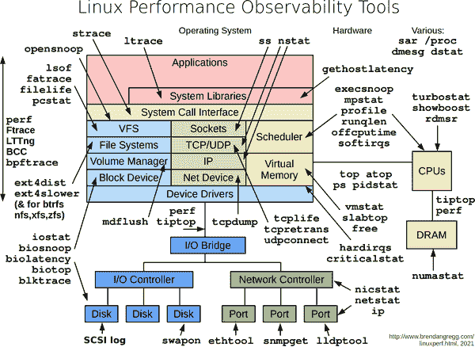
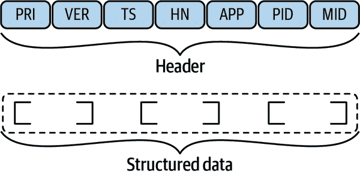
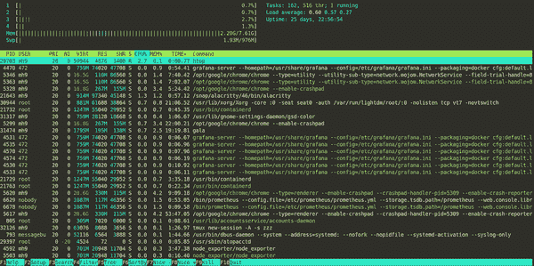
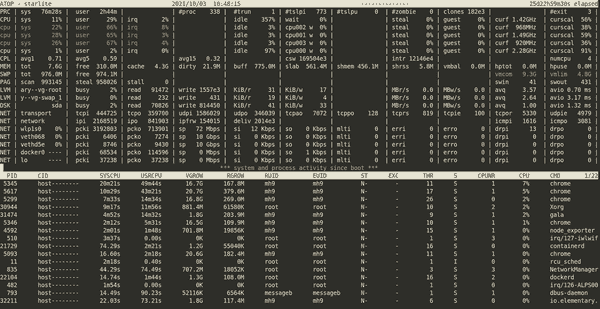
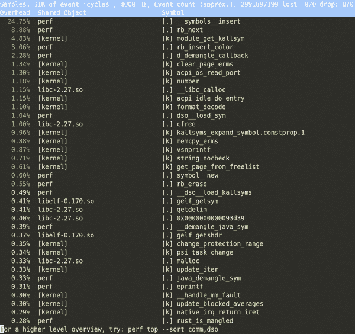
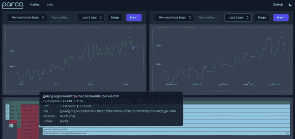
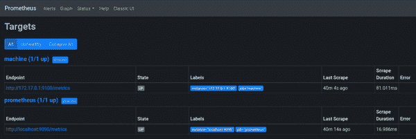
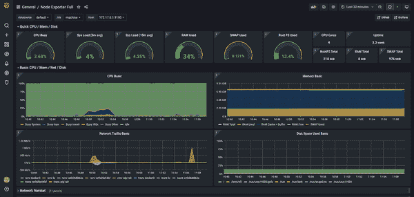

# 第八章：可观测性

您需要了解整个堆栈的运行情况——从内核到面向用户的部分。通常，您可以通过知道任务的正确工具来获得这种可见性。

本章重点讨论收集和利用 Linux 及其应用程序生成的不同信号，以便您能够做出明智的决策。例如，您将看到如何执行以下操作：

+   弄清楚进程消耗了多少内存

+   理解磁盘空间将会在多快的时间内耗尽

+   获取安全事件的自定义事件警报

为了建立共同的词汇表，我们首先将回顾您可能遇到的不同信号类型，例如系统或应用程序日志、指标和进程跟踪。我们还将探讨如何进行故障排除和性能测量。接下来，我们将重点介绍日志，回顾不同的选项和语义。然后，我们将涵盖不同资源类型的监控，例如 CPU 周期、内存或 I/O 流量。我们将审视您可以使用的不同工具，并展示您可能希望采用的特定端到端设置。

您将了解到可观测性通常是一种反应性的。也就是说，某些情况下会出现崩溃或运行缓慢，然后您开始查看进程及其 CPU 或内存使用情况，或者深入查看日志。但有时可观测性更具调查性质——例如，当您想要弄清楚某些算法需要多长时间时。最后但同样重要的是，您可以使用预测性（而不是反应性）的可观测性。例如，您可以在将来的某种条件下收到警报，推测当前行为（对于可预测负载的磁盘使用情况就是一个很好的例子）。

关于可观测性的最佳视觉概述可能来自性能专家 Brendan Gregg。从他的[Linux Performance 站点](https://oreil.ly/KlzQP)获取的图 8-1 让您感受到可用的各种移动部件和工具的丰富性。



###### 图 8-1\. Linux 可观测性概述。*来源*：Brendan Gregg（在 CC BY-SA 4.0 许可下共享）

可观测性是一个涵盖许多用例和大量（开源）工具的令人兴奋的主题，因此让我们首先建立一个策略，并查看一些常用术语。

# 基础知识

在我们深入讨论可观测性术语之前，让我们退后一步，看看如何将提供的信息转化为可操作的洞察力，并以结构化方式修复问题或优化应用程序。

## 可观测性策略

在可观测性背景下广泛使用的一种策略是[OODA 循环（观察-定向-决策-行动）](https://oreil.ly/zLLET)。它提供了一种基于观察数据进行假设测试并采取行动的结构化方法——即从信号中获取可操作的洞察力。

例如，假设一个应用程序运行缓慢。我们进一步假设有多种可能的原因（内存不足、CPU 周期太少、网络 I/O 不足等）。首先，您需要能够测量每个资源的消耗情况。然后，您将分别更改每个资源的分配（保持其他资源不变）并测量结果。

如果您为应用程序提供更多的 RAM 后性能有所改善吗？如果是这样，您可能已经找到了原因。如果没有，您将继续尝试其他资源，始终测量消耗并尝试将其与观察到的情况影响联系起来。

## 术语

在可观测性领域存在一系列术语，^(1)并非所有术语都有正式的定义。此外，如果您观察单个机器或处于网络化（分布式）设置中，其含义可能会略有不同：

可观察性

通过测量外部信息来评估系统（例如 Linux）的内部状态，通常的目的是对其进行响应。例如，如果您注意到系统反应迟钝，并且测量可用主存储器的数量，您可能会发现某个特定的应用程序占用了所有的内存，于是您可能决定终止它以解决问题。

信号类型

表示和发出关于系统状态的信息的不同方式，可以通过符号方式（负载为文本，例如日志的情况）或数值方式（如指标的情况），或者它们的组合。另请参见“信号类型”。

源

生成信号，可能是不同类型的信号。源可以是 Linux 操作系统或应用程序。

目的地

消费、存储和进一步处理信号的地方称为**目的地**。我们将暴露用户界面（GUI、TUI 或 CLI）的目的地称为*前端*。例如，日志查看器或绘制时间序列的仪表板就是前端，而 S3 存储桶则不是（但仍可作为日志等信息的目的地）。

遥测

从源中提取信号并将信号传输（或路由、发送）到目的地的过程，通常使用代理收集和/或预处理信号（例如过滤或下采样）。

## 信号类型

*信号*是我们用来传达系统状态以供进一步处理或解释的方式。总体而言，我们区分文本负载（最适合人类搜索和解释）和数值负载（对于机器和处理后的人类都很好）。在本章讨论中，与我们讨论相关的三种基本且常见的信号类型是：日志、指标和跟踪。

### 日志

*日志*是每个系统在某种程度上都会生成的基本信号类型。日志是离散事件，具有文本载荷，供人类使用。通常，这些事件都有时间戳。理想情况下，日志应该结构化，以便每个日志消息的每个部分都有清晰的含义。这种含义可能通过形式化模式来表达，以便可以自动进行验证。

有趣的是，虽然每个日志都有一些结构（即使它不是明确定义的，解析起来可能很困难，可能是由于分隔符或边缘情况），你经常会听到术语*结构化日志*。当人们这么说时，他们实际上是指使用 JSON 结构化的日志。

尽管自动化日志内容很难（因为它是文本性质的），但日志对人类仍然非常有用，因此它们可能会在一段时间内继续是主要的信号类型。我们将在“记录”中深入探讨处理日志的内容。日志是最重要的信号类型（对我们的考虑而言），这就是为什么我们在本章中大部分时间都将处理它们。

### 指标

*指标*通常是定期采样的数值数据点，形成时间序列。这些单独的数据点可以通过维度或标识元数据提供额外的上下文。通常情况下，你不会直接使用原始指标数据；而是使用某种聚合或图形表示，或者在满足特定条件时得到通知。指标既可用于操作任务，也可用于故障排除，以回答诸如应用完成多少交易或某个操作耗时多长时间（过去 X 分钟）等问题。

我们区分不同类型的指标：

计数器

计数器的值只能不断增加（除非将计数器重置为零）。计数器指标的一个示例是服务处理的总请求数或某段时间内通过接口发送的字节数。

测量值

测量值可以增加或减少。例如，您可以测量当前可用的总内存或运行的进程数。

直方图

构建值分布的复杂方式。使用桶，直方图允许你评估数据的整体结构。它们还使你能够进行灵活的陈述（例如，50% 或 90% 的值落入某个范围内）。

在“监控”中，我们将看到一系列可用于简单用例的工具，在“Prometheus 和 Grafana”中，您将看到一种高级示例设置用于指标。

### 跟踪

*跟踪*是运行时信息的动态集合（例如，有关进程使用的系统调用的信息，或者给定原因的内核事件序列）。跟踪通常不仅用于调试，还用于性能评估。我们将在“跟踪和性能分析”中详细研究这个高级主题。

# 记录

如前所述，日志是（一组）文本有效负载的离散事件，优化供人类消费。让我们分解这个陈述以更好地理解它：

离散事件

在代码库的上下文中，想象一个离散事件。您希望使用（原子性）日志项共享关于代码中正在进行的情况的信息。例如，您发出一个日志行，指示数据库连接已成功建立。另一个日志项可能是因为文件丢失而标记错误。保持日志消息的范围小而具体，这样消费消息的人更容易找到代码中相应的位置。

文本有效负载

日志消息的有效负载是文本性质的。默认的消费者是人类。换句话说，无论您是在命令行上使用日志查看器还是在具有可视化用户界面的高级日志处理系统中，人类读取和解释日志消息的内容，并根据此内容决定采取行动。

从结构上看，总体而言，日志包括以下内容：

一组日志项、消息或行

捕获关于离散事件的信息。

元数据或上下文

可以以每条消息的方式出现，也可以在全局范围（例如整个日志文件）上出现。

一个用于解释单个日志消息的格式

定义日志的部分和含义。例如，面向行的、空格分隔的消息或 JSON 模式。

在表 8-1 中，您可以看到一些常见的日志格式。例如，用于数据库或编程语言的（更具体、范围更窄的）格式和框架有许多。

表 8-1. 常见日志格式

| 格式 | 注意 |
| --- | --- |
| [常见事件格式](https://oreil.ly/rHBWs) | 由 ArcSight 开发；用于设备、安全用例 |
| [常见日志格式](https://oreil.ly/Da7uC) | 用于 Web 服务器；另见扩展日志格式 |
| [Graylog 扩展日志格式](https://oreil.ly/6MBHm) | 由 Graylog 开发；改进 Syslog |
| Syslog | 用于操作系统、应用程序、设备；参见“Syslog” |
| [嵌入式度量格式](https://oreil.ly/LeXhe) | 由亚马逊开发（既有日志又有度量） |

作为良好的实践，您希望避免日志的开销（启用快速查找和小的占地面积——即不占用太多磁盘空间）。在这种情况下，例如通过[`logrotate`](https://oreil.ly/jX6Jy)进行日志轮换是常用的。一个称为*数据温度*的高级概念也可能很有用，将较旧的日志文件移动到更便宜和更慢的存储（附加磁盘、S3 存储桶、Glacier）中。

###### 警告

有一个情况需要特别注意日志信息，特别是在生产环境中。每当您决定在应用程序中发出一条日志行时，请问自己是否可能泄露敏感信息。这些敏感信息可能是密码、API 密钥，甚至只是用户识别信息（电子邮件、帐户 ID）。

问题在于日志通常以持久形式存储（例如在本地磁盘上或甚至在 S3 存储桶中）。这意味着即使进程终止后很长时间，某人仍然可以访问敏感信息并用于攻击。

为了标志一个日志项的重要性或预期的目标消费者，日志通常定义级别（例如 `DEBUG` 用于开发，`INFO` 用于正常状态，或 `ERROR` 用于意外情况可能需要人工干预）。

现在是动手的时候了：让我们从一些简单的东西开始，并作为一个概述，看看 Linux 的中央日志目录（为了易读性而缩短输出）：

```
$ ls -al /var/log
drwxrwxr-x   8 root      syslog               4096 Jul 13 06:16 .
drwxr-xr-x  13 root      root                 4096 Jun  3 07:52 ..
drwxr-xr-x   2 root      root                 4096 Jul 12 11:38 apt/ 
-rw-r-----   1 syslog    adm                  7319 Jul 13 07:17 auth.log 
-rw-rw----   1 root      utmp                 1536 Sep 21 14:07 btmp 
drwxr-xr-x   2 root      root                 4096 Sep 26 08:35 cups/ 
-rw-r--r--   1 root      root                28896 Sep 21 16:59 dpkg.log 
-rw-r-----   1 root      adm                 51166 Jul 13 06:16 dmesg 
drwxrwxr-x   2 root      root                 4096 Jan 24  2021 installer/ 
drwxr-sr-x+  3 root      systemd-journal      4096 Jan 24  2021 journal/ 
-rw-r-----   1 syslog    adm                  4437 Sep 26 13:30 kern.log 
-rw-rw-r--   1 root      utmp               292584 Sep 21 15:01 lastlog 
drwxr-xr-x   2 ntp       ntp                  4096 Aug 18  2020 ntpstats/ 
-rw-r-----   1 syslog    adm                549081 Jul 13 07:57 syslog 
```


`apt` 包管理器的日志


所有登录尝试（成功和失败）和认证过程的日志


登录尝试失败


打印相关日志


`dpkg` 包管理器的日志


设备驱动程序日志；使用 `dmesg` 进行检查


系统安装日志（Linux 发行版最初安装时）


`journalctl` 的位置；详见`journalctl`了解详情


内核日志


所有用户的最后登录；使用 `lastlog` 进行检查


NTP 相关的日志（也参见“Network Time Protocol”）


`syslogd` 的位置；详见“Syslog”了解详情

一个常见的实时消费日志的模式（即在其发生时）是*跟随日志*；也就是说，你可以在日志的末尾观看新添加的日志行（编辑以适应）：

```
$ tail -f /var/log/syslog 
Sep 26 15:06:41 starlite nm-applet[31555]: ... 'GTK_IS_WIDGET (widget)' failed
Sep 26 15:06:41 starlite nm-dispatcher: ... new request (3 scripts)
Sep 26 15:06:41 starlite systemd[1]: Starting PackageKit Daemon...
Sep 26 15:06:41 starlite nm-dispatcher: ... start running ordered scripts...
Sep 26 15:06:42 starlite PackageKit: daemon start 
^C
```


使用 `-f` 选项跟随 `syslogd` 进程的日志。


一个示例日志行；详见“Syslog”了解格式。

###### 提示

如果你想看一个进程的日志输出，并同时将其存储在文件中，你可以使用[`tee` 命令](https://oreil.ly/X1Gqo)：

```
$ someprocess | tee -a some.log
```

现在你会在终端看到 `someprocess` 的输出，并且同时输出会存储在 *some.log* 中。请注意，我们使用 `-a` 选项来追加到日志文件，否则它会被截断。

现在让我们看看两个最常用的 Linux 日志系统。

## Syslog

Syslog 是一种用于从内核到守护程序再到用户空间的各种来源的日志记录标准。它起源于网络环境，今天该协议包括在[RFC 5424](https://oreil.ly/1Qqng)中定义的文本格式，以及部署场景和安全注意事项。Figure 8-2 显示了 Syslog 的高级格式，但请注意，还有许多很少使用的可选字段。



###### 图 8-2\. 根据 RFC 5424 定义的 Syslog 格式

如 RFC 5424 中定义的 Syslog 格式具有以下头字段（其中`TS`和`HN`最常使用）：

`PRI`

消息设施/严重性

`VER`

Syslog 协议号（通常被省略，因为它只能是 1）

`TS`

包含使用 ISO 8601 格式生成消息的时间

`HN`

标识发送消息的机器

`APP`

识别发送消息的应用程序（或设备）

`PID`

标识发送消息的进程

`MID`

可选的消息 ID

格式还包括*结构化数据*，这是以结构化（键/值为基础）列表形式的有效负载，其中每个元素由`[ ]`界定。

通常，人们会使用[`syslogd`二进制文件](https://oreil.ly/su6IX)来管理日志。随着时间的推移，其他选择也已经出现，你应该知道：

[`syslog-ng`](https://oreil.ly/qETe9)

一种增强的日志守护程序，可以作为`syslogd`的替代品，并且支持 TLS、基于内容的过滤以及将日志记录到诸如 PostgreSQL 和 MongoDB 等数据库中。自 1990 年末推出以来就可用。

[`rsyslog`](https://oreil.ly/QDPmv)

扩展了 Syslog 协议，也可以与`systemd`一起使用。自 2004 年起可用。

尽管其年龄较大，Syslog 系列协议和工具仍然广泛存在并可用。随着`systemd`成为所有主要 Linux 发行版中的事实标准，用于所有主要 Linux 发行版的 init 系统，然而，关于日志记录还有一种新的方式：来看看`systemd`日志。

## journalctl

在`systemd`中，我们简要介绍了`systemd`生态系统的一个组件，负责日志管理：[`journalctl`](https://oreil.ly/M4sbo)。与迄今为止使用的 Syslog 和其他系统不同，`journalctl`使用二进制格式存储日志项。这样可以实现更快的访问和更好的存储效果。

当引入二进制存储格式时，确实引起了一些批评，因为人们无法继续使用熟悉的`tail`、`cat`和`grep`命令查看和搜索日志。尽管如此，使用`journalctl`时，人们需要学习与日志交互的新方式，学习曲线并不陡峭。

让我们来看看一些常见任务。如果你不带任何参数启动`journalctl`，它将呈现为一个交互式分页器（你可以使用箭头键或空格键滚动并用`q`退出），显示所有日志。

要限制时间范围，例如可以使用以下命令：

```
$ journalctl --since "3 hours ago" 

$ journalctl --since "2021-09-26 15:30:00" --until "2021-09-26 18:30:00" 
```


限制时间范围到过去三小时发生的事情。


另一种限制时间范围的方式，带有明确的开始和结束时间。

您可以限制输出到特定的`systemd`单元，例如（假设有一个名为`abc.service`的服务）：

```
$ journalctl -u abc.service
```

###### 提示

`journalctl`工具具有强大的日志项输出格式化方式。使用`--output`（或简写为`-o`）参数，您可以优化输出以适应特定的用例。重要的值如下：

`cat`

简短形式，没有时间戳或来源

`short`

默认情况下，模拟 Syslog 输出

`json`

每行一个 JSON 格式的条目（用于自动化）

您可以使用以下方式跟随日志，就像使用`tail -f`一样：

```
$ journalctl -f
```

让我们将前面的所有信息放在一起，形成一个具体的示例。假设您希望重新启动由`systemd`管理的 Linux 发行版的安全组件：[AppArmor](https://www.apparmor.net)。也就是说，在一个终端中我们使用`systemctl restart apparmor`重新启动服务，在另一个终端中我们执行以下命令（输出经过编辑；实际输出是每行一个日志项）：

```
$ journalctl -f -u apparmor.service 
-- Logs begin at Sun 2021-01-24 14:36:30 GMT. --
Sep 26 17:10:02 starlite apparmor[13883]: All profile caches have been cleared,
                                          but no profiles have been unloaded.
Sep 26 17:10:02 starlite apparmor[13883]: Unloading profiles will leave already
                                          running processes permanently
...
Sep 26 17:10:02 starlite systemd[1]: Stopped AppArmor initialization.
Sep 26 17:10:02 starlite systemd[1]: Starting AppArmor initialization... 
Sep 26 17:10:02 starlite apparmor[13904]:  * Starting AppArmor profiles
Sep 26 17:10:03 starlite apparmor[13904]: Skipping profile in
                                     /etc/apparmor.d/disable: usr.sbin.rsyslogd
Sep 26 17:10:09 starlite apparmor[13904]:    ...done.
Sep 26 17:10:09 starlite systemd[1]: Started AppArmor initialization.
```


跟随 AppArmor 服务的日志。


在`systemd`停止服务后，它会再次启动。

这样我们就到了日志部分的结尾，然后转向数值值和更广泛的监控主题。

# 监控

*监控*是为了各种原因捕获系统和应用程序指标。例如，您可能对某个操作花费的时间或进程消耗的资源（性能监控）感兴趣，或者您可能正在排除一个不健康的系统。在监控的上下文中，您最常执行的两种活动如下：

+   跟踪一个或多个指标（随时间变化）

+   在条件上发出警报

在本节中，我们首先关注您应该了解的一些基础知识和工具，随着我们深入到更多只在特定情况下相关的高级技术。

让我们看一个简单的例子，显示一些基本的指标，比如系统运行时间，内存使用情况等，使用[`uptime`命令](https://oreil.ly/smiz6)：

```
$ uptime 
08:48:29 up 21 days, 20:59,  1 user,  load average: 0.76, 0.20, 0.09 
```


使用`uptime`命令显示一些基本的系统指标。


以逗号分隔，输出告诉我们系统运行的时间、登录的用户数，然后是 `load average` 部分的三个指标：1 分钟、5 分钟和 15 分钟的平均值。这些平均值是运行队列中作业数或等待磁盘 I/O 的作业数；这些数字已经归一化，并且表示 CPU 使用率。例如，这里过去 5 分钟的负载平均值为 0.2（单独看并不能告诉您太多，因此您必须与其他值进行比较并跟踪它随时间的变化）。

接下来，让我们监视一些基本的内存利用情况，使用 `free` 命令（输出压缩以适应）：

```
$ free -h 
              total    used   free  shared  buff/cache   available
Mem:           7.6G    1.3G   355M    395M        6.0G        5.6G 
Swap:          975M    1.2M   974M  
```


使用人类友好的输出显示内存使用情况。


内存统计信息：总使用/空闲/共享内存，用于缓冲区和缓存的内存（如果不想得到合并值，请使用 `-w`），以及可用内存。


总交换空间的总量/已使用/空闲空间，即移动到交换磁盘空间的物理内存。

查看内存使用情况的更复杂方法是使用 [`vmstat`（虚拟内存统计）命令](https://oreil.ly/x8wrI)。以下示例以自更新方式使用 `vmstat`（输出编辑以适应）：

```
$ vmstat 1 
procs -----------memory--------- ---swap-- ----io---- -system- -----cpu-----
r  b  swpd   free   buff  cache   si   so   bi    bo   in   cs us sy id wa st 
4  0  1184 482116 682388 5447048   0    0   12   105   28  191  6  3 91  0  0
0  0  1184 483444 682388 5446600   0    0   0      0  369  522  1  0 99  0  0
0  0  1184 483696 682392 5446600   0    0   0    104  278  374  1  1 99  0  0
^C
```


显示内存统计信息。参数 `1` 表示每秒打印一个新的摘要行。


一些重要的列标题：`r` 表示运行或等待 CPU 的进程数（应小于或等于您拥有的 CPU 数量），`free` 是以 KB 为单位的空闲主内存，`in` 是每秒中断数，`cs` 是每秒上下文切换数，`us` 到 `st` 是总 CPU 时间的百分比，涵盖用户空间、内核、空闲等。

要查看某个操作花费了多长时间，您可以使用 `time` 命令：

```
$ time (ls -R /etc 2&> /dev/null) 

real    0m0.022s 
user    0m0.012s 
sys     0m0.007s 
```


测量递归列出所有 */etc* 子目录所需的时间（我们使用 `2&> /dev/null` 丢弃所有输出，包括错误）。


总共（挂钟）所需的时间（除了性能外并不真正有用）。


`ls` 本身在 CPU 上花费的时间（用户空间）。


`ls` 等待 Linux 执行某些操作的时间（内核空间）。

在前面的例子中，如果您对操作花费了多长时间感兴趣，将 `user` 和 `sys` 的总和作为一个很好的近似值，并且两者的比率可以很好地告诉您执行时间大部分花费在哪里。

现在我们专注于一些更具体的主题：网络接口和块设备。

## 设备 I/O 和网络接口

使用 [`iostat` 命令](https://oreil.ly/L4Pbu) 可以监视 I/O 设备（输出编辑）：

```
$ iostat -z --human 
Linux 5.4.0-81-generic (starlite)   09/26/21     _x86_64_      (4 CPU)

avg-cpu:  %user   %nice %system %iowait  %steal   %idle
           5.8%    0.0%    2.7%    0.1%    0.0%   91.4%

Device             tps    kB_read/s    kB_wrtn/s    kB_read    kB_wrtn
loop0             0.00         0.0k         0.0k     343.0k       0.0k
loop1             0.00         0.0k         0.0k       2.8M       0.0k
...
sda               0.38         1.4k        12.4k       2.5G      22.5G 
dm-0              0.72         1.3k        12.5k       2.4G      22.7G
...
loop12            0.00         0.0k         0.0k       1.5M       0.0k
```


使用 `iostat` 显示 I/O 设备指标。使用 `-z`，我们告诉它仅显示有活动的设备，而 `--human` 则使输出更友好（单位以人类可读的形式显示）。


示例行：`tps` 表示每秒传输（I/O 请求）的次数，`read` 表示数据量，`wrtn` 表示写入的数据量。

接下来是：使用 [`ss` 命令](https://oreil.ly/BAIiv) 查看可以转储套接字统计信息的网络接口（参见 “套接字”）。以下命令列出了 TCP 和 UDP 套接字以及进程 ID（输出已编辑以适应）：

```
$ ss -atup 
Netid State   Recv-Q  Send-Q  Local Address:Port       Peer Address:Port
udp   UNCONN  0       0             0.0.0.0:60360           0.0.0.0:*
...
udp   UNCONN  0       0             0.0.0.0:ipp             0.0.0.0:*
udp   UNCONN  0       0             0.0.0.0:789             0.0.0.0:*
udp   UNCONN  0       0         224.0.0.251:mdns            0.0.0.0:*
udp   UNCONN  0       0             0.0.0.0:mdns            0.0.0.0:*
udp   ESTAB   0       0      192.168.178.40:51008    74.125.193.113:443
...
tcp   LISTEN  0       128           0.0.0.0:sunrpc          0.0.0.0:*
tcp   LISTEN  0       128     127.0.0.53%lo:domain          0.0.0.0:*
tcp   LISTEN  0       5           127.0.0.1:ipp             0.0.0.0:*
tcp   LISTEN  0       4096        127.0.0.1:45313           0.0.0.0:*
tcp   ESTAB   0       0      192.168.178.40:57628    74.125.193.188:5228 
tcp   LISTEN  0       128              [::]:sunrpc             [::]:*
tcp   LISTEN  0       5               [::1]:ipp                [::]:*
```


使用 `ss` 和以下选项：用 `-a` 选择所有（即监听和非监听的套接字）；`-t` 和 `-u` 分别选择 TCP 和 UDP；`-p` 显示正在使用套接字的进程。


正在使用的一个套接字示例。这是一个本地 IPv4 地址 `192.168.178.40` 和远程 `74.125.193.188` 之间建立的已建立的 TCP 连接，看起来处于空闲状态：接收队列 (`Recv-Q`) 和发送队列 (`Send-Q`) 均报告为零。

###### 注意

一个过时的收集和显示接口统计信息的方法是使用 [`netstat`](https://oreil.ly/UBqge)。例如，如果你想要对 TCP 和 UDP 有一个持续更新的视图，包括进程 ID 并使用 IP 地址而不是 FQDN，你可以使用 `netstat -ctulpn`。

[`lsof`](https://oreil.ly/qDT67) 的意思是“列出打开的文件”，是一个功能强大的工具，有许多用途。以下示例展示了 `lsof` 在网络连接上的应用（输出已编辑以适应）。

```
$ sudo lsof -i TCP:1-1024 
COMMAND     PID            USER   FD   TYPE DEVICE SIZE/OFF NODE NAME
...
rpcbind   26901            root    8u  IPv4 615970    0t0  TCP *:sunrpc (LISTEN)
rpcbind   26901            root   11u  IPv6 615973    0t0  TCP *:sunrpc (LISTEN)
```


列出特权 TCP 端口（需要 `root` 权限）。

另一个 `lsof` 的用法示例是进程为中心的视图：如果你知道一个进程的 PID（这里是 Chrome），你可以使用 `lsof` 来跟踪文件描述符、I/O 等（输出已编辑以适应）：

```
$ lsof -p 5299
COMMAND  PID USER   FD TYPE  DEVICE  SIZE/OFF     NODE NAME
chrome  5299  mh9  cwd  DIR   253,0      4096  6291458 /home/mh9
chrome  5299  mh9  rtd  DIR   253,0      4096        2 /
chrome  5299  mh9  txt  REG   253,0 179093936  3673554 /opt/google/chrome/chrome
...
```

还有许多更多用于（性能）监控的工具可用，例如 [`sar`](https://oreil.ly/dYWwR)（涵盖各种计数器，非常适合脚本）和 [`perf`](https://oreil.ly/TJ4gP）—我们将在 “高级可观察性” 中讨论其中一些。

现在你已经掌握了各个工具，让我们转向允许你交互式监控 Linux 的集成工具。

## 集成性能监视器

使用我们在前一节讨论的工具，比如 `lsof` 或 `vmstat`，是一个很好的起点，也适用于脚本。为了更方便的监控，你可能更喜欢集成解决方案。这些通常带有文本用户界面（TUI），有时还带有颜色，并提供以下功能：

+   支持多种资源类型（CPU、RAM、I/O）

+   交互式排序和过滤（按进程、用户、资源）

+   实时更新和深入查看详细信息，如进程组甚至 cgroups 和命名空间

例如，广泛可用的 [`top`](https://oreil.ly/NqKO2) 在标题中提供了一个概述——类似于我们在 `uptime` 输出中看到的内容——然后是 CPU 和内存详细信息的表格渲染，接着是您可以跟踪的进程列表（输出已编辑）：

```
top - 12:52:54 up 22 days,  1:04,  1 user,  load average: 0.23, 0.26, 0.23 
Tasks: 263 total,   1 running, 205 sleeping,   0 stopped,   0 zombie 
%Cpu(s):  0.2 us,  0.4 sy,  0.0 ni, 99.3 id,  0.0 wa,  0.0 hi,  0.0 si, \
  0.0 st% 
KiB Mem :  7975928 total,   363608 free,  1360348 used,  6251972 buff/cache
KiB Swap:   999420 total,   998236 free,     1184 used.  5914992 avail Mem

PID USER      PR  NI    VIRT    RES    SHR S  %CPU %MEM     TIME+ COMMAND 
  1 root      20   0  225776   9580   6712 S   0.0  0.1   0:25.84 systemd
...
433 root      20   0  105908   1928   1700 S   0.0  0.0   0:00.05  `- lvmetad
...
775 root      20   0   36552   4240   3880 S   0.0  0.1   0:00.16  `- bluetoothd
789 syslog    20   0  263040   4384   3616 S   0.0  0.1   0:01.98  `- rsyslogd
```


系统概要（与 `uptime` 输出比较）


任务统计


CPU 使用统计（用户、内核等；类似于 `vmstat` 输出）


动态进程列表，包括每个进程级别的详细信息；类似于 `ps aux` 输出

###### 提示

以下是在 `top` 中记住的最重要的按键：

`?`

列出帮助（包括键映射）

`V`

切换到和从进程树视图

`m`

按内存使用率排序

`P`

按 CPU 消耗排序

`k`

发送信号（例如 `kill`）

`q`

退出

虽然 `top` 在几乎任何环境中都可用，但还有许多其他可用的替代品，包括以下内容：

[`htop`](https://oreil.ly/P9elE)（图 8-3）

一个增强型 `top`，比 `top` 更快且具有更好的用户界面。

[`atop`](https://oreil.ly/luRoU)（图 8-4）

一个强大的替代品，比 `top` 更强大。除了 CPU 和内存外，还详细涵盖了 I/O 和网络统计信息。

[`below`](https://oreil.ly/XdOHB)

一个相对较新的工具，特别值得注意，因为它支持 cgroups v2（参见“Linux cgroups”）。其他工具不理解 cgroups，因此仅提供全局资源视图。



###### 图 8-3\. `htop` 工具的截图



###### 图 8-4\. `atop` 工具的截图

还有许多其他集成的监控工具可用，超越基本来源或专门用途。包括但不限于以下内容：

[glances](https://oreil.ly/zOC9e)

一个强大的混合体，除了常规资源外还涵盖设备

[guider](https://oreil.ly/uqBH1)

一个集成的性能分析器，允许您显示和绘制各种指标范围

[neoss](https://oreil.ly/O4BHS)

用于网络流量监控；`ss` 的替代品，提供了良好的 TUI

[mtr](https://oreil.ly/uL38A)

用于网络流量监控；比 `traceroute` 更强大的替代品（参见“路由”以获取有关 `traceroute` 的详细信息）

现在您已经对从自己的代码公开系统指标的工具有了广泛的了解，让我们看看如何执行此操作。

## 仪表化

到目前为止，我们关注的信号来自内核或现有应用程序（即您不拥有的代码）。现在我们转向如何像日志一样，为您的代码配备发出指标的功能。

将代码插入以发出信号（特别是指标）的过程，如果您是开发软件，这个过程通常是相关的。这个过程通常称为*仪器化*，并且有两种常见的仪器化策略：*自动仪器化*（作为开发者，您无需额外的工作）和*自定义仪器化*，在其中您手动插入代码片段，例如在代码库的某个点发出一个指标。

您可以使用[StatsD](https://oreil.ly/XOYFE)，针对多种编程语言提供了客户端库，例如[ Ruby](https://oreil.ly/VfE4D)，[ Node.js](https://oreil.ly/G9Jt3)，[ Python](https://oreil.ly/hQBMf) 和 [ Go](https://oreil.ly/whpZV)。StatsD 很好用，但在 Kubernetes 或 IoT 等动态环境中存在一些限制。在这些环境中，通常更好的选择是一种称为*拉取式*或*抓取*的不同方法。使用抓取，应用程序公开指标（通常通过 HTTP 端点），然后代理调用此端点以检索指标，而不是配置应用程序发送指标的位置。我们将在“Prometheus 和 Grafana”中返回该主题。

# 高级可观测性

现在您已经了解了 Linux 可观测性的基础知识，让我们来看看这个领域中的一些更高级的主题。

## 跟踪和分析

*跟踪*这个术语有多重含义：在 Linux 的上下文中，在单台机器上，跟踪意味着随时间捕获进程执行（用户空间的函数调用，系统调用等）。

###### 注意

在分布式设置中，例如在 Kubernetes 中容器化的微服务或一堆 Lambda 函数作为无服务器应用的一部分，我们有时会将[*分布式跟踪*](https://oreil.ly/tTjY9)（例如使用 OpenTelemetry 和 Jaeger）缩写为*跟踪*。这种类型的跟踪不在本书的讨论范围之内。

在单台 Linux 机器的上下文中，有许多数据源。您可以使用以下内容作为跟踪的数据源：

Linux 内核

跟踪可以来自内核中的函数或者由系统调用触发。例如包括[内核探测器](https://oreil.ly/lAolL) (kprobes) 或者[内核跟踪点](https://oreil.ly/wZcXE)。

用户空间

应用程序功能调用，例如通过[用户空间探测器 (uprobes)](https://oreil.ly/I8ICY)，可以作为跟踪的数据源。

跟踪的用例包括以下内容：

+   使用例如[`strace`](https://strace.io)跟踪工具来调试程序。

+   使用前端进行性能分析，使用[`perf`](https://oreil.ly/izMpR)工具。

###### 警告

您可能会倾向于在所有地方使用`strace`；然而，您应该意识到它所带来的开销。这在生产环境中尤为重要。阅读 Brendan Gregg 的[“strace Wow Much Syscall”](https://oreil.ly/eSLOT)以了解其背景。

参见图 8-5 作为`sudo perf top`的示例输出，它生成一个按进程汇总的摘要。



###### 图 8-5\. `perf`追踪工具的屏幕截图

未来看来，eBPF（参见“扩展内核的现代方法：eBPF”）将成为实现追踪的事实标准，特别是对于定制案例。它拥有丰富的生态系统和不断增长的供应商支持，因此如果您正在寻找一种具有未来保障的追踪方法，请确保使用 eBPF。

追踪的一个特定用例是*性能分析*，即识别频繁调用的代码部分。一些相关的低级分析工具包括[`pprof`](https://oreil.ly/tETfk)，[Valgrind](https://oreil.ly/p9HQJ)，以及[火焰图可视化](https://oreil.ly/bCgbJ)。

有许多选项可以交互地消耗`perf`的输出并可视化追踪结果；例如，请参阅 Mark Hansen 的博客文章[“Linux perf Profiler UIs”](https://oreil.ly/dGH1S)。

*持续性分析*是分析的高级变体，它随时间捕获（内核和用户空间）追踪数据。一旦收集到这些时间戳追踪数据，您可以绘制并比较它们，深入研究感兴趣的段落。一个非常有前途的例子是基于 eBPF 的开源项目[parca](https://www.parca.dev)，如图 8-6 所示。



###### 图 8-6\. parca 的屏幕截图，一个持续性分析工具

## Prometheus 和 Grafana

如果您正在处理随时间变化的指标数据（时间序列数据），使用[Prometheus](https://prometheus.io)和[Grafana](https://grafana.com)组合是您可能希望考虑的高级可观察性工具。

我将向您展示一个简单的单机设置，您可以在 Linux 机器上的仪表板上查看并甚至对发生的事件设置警报。

我们将使用[node exporter](https://oreil.ly/0L4KJ)来公开一系列系统指标，从 CPU 到内存和网络。然后我们将使用 Prometheus 来抓取 node exporter 的数据。抓取意味着 Prometheus 调用 node exporter 提供的 HTTP 端点，通过 URL 路径*/metrics*返回[OpenMetrics 格式](https://openmetrics.io)的指标数据。为此，我们需要配置 Prometheus，使其使用 node exporter 的 HTTP 端点 URL。我们设置的最后一步是在 Grafana 中使用 Prometheus 作为数据源，您可以在仪表板中查看时间序列数据（随时间变化的指标），甚至可以根据某些条件（如低磁盘空间或 CPU 超载）设置警报。

因此，作为第一步，下载并解压 node exporter，并在后台运行二进制文件`./node_exporter &`。您可以使用以下命令检查它是否正常运行（输出已编辑）：

```
$ curl localhost:9100/metrics
...
# TYPE go_gc_duration_seconds summary
go_gc_duration_seconds{quantile="0"} 7.2575e-05
go_gc_duration_seconds{quantile="0.25"} 0.00011246
go_gc_duration_seconds{quantile="0.5"} 0.000227351
go_gc_duration_seconds{quantile="0.75"} 0.000336613
go_gc_duration_seconds{quantile="1"} 0.002659194
go_gc_duration_seconds_sum 0.126529838
go_gc_duration_seconds_count 390
...
```

现在我们已经设置好信号数据源，我们将 Prometheus 和 Grafana 都作为容器运行。为了继续操作，您需要安装和配置 Docker（参见“Docker”）。

创建一个名为*prometheus.yml*的 Prometheus 配置文件，内容如下：

```
global:
  scrape_interval: 15s
  evaluation_interval: 15s
  external_labels:
      monitor: 'mymachine'
scrape_configs:
  - job_name: 'prometheus' 
    static_configs:
    - targets: ['localhost:9090']
  - job_name: 'machine' 
    static_configs:
    - targets: ['172.17.0.1:9100']
```


Prometheus 本身会暴露指标数据，所以我们将其包含在内（自我监控）。


这是我们的节点导出器。由于我们在 Docker 中运行 Prometheus，不能使用`localhost`，而是要使用 Docker 默认使用的 IP 地址。

我们使用之前创建的 Prometheus 配置文件，并通过卷将其挂载到容器中，操作如下：

```
$ docker run --name prometheus \
         --rm -d -p 9090:9090 \ 
         -v /home/mh9/lml/o11y/prometheus.yml:/etc/prometheus/prometheus.yml \ 
         prom/prometheus:main
```


这里的参数使 Docker 在退出时删除容器（`--rm`），作为守护进程运行（`-d`），并公开端口 9090（`-p`），这样我们可以从本地使用它。


将我们的配置文件作为卷映射到容器中。请注意，在此处，你需要用存储路径替换*/home/mh9/lml/o11y/*。此外，这必须是绝对路径。因此，如果你希望保持灵活性，可以在 bash 中使用`$PWD`，或者在 Fish 中使用`(pwd)`，而不是硬编码的路径。

执行了上述命令后，在浏览器中打开*localhost:9000*，然后在顶部的状态下拉菜单中点击 Targets。几秒钟后，你应该会看到类似图 8-7 中显示的屏幕，证明 Prometheus 已成功从自身和节点导出器中抓取了指标。



###### 图 8-7\. Prometheus Web UI 中的目标截图

接下来，我们启动 Grafana：

```
$ docker run --name grafana \
         --rm -d -p 3000:3000 \
         grafana/grafana:8.0.3
```

执行了上述命令后，在浏览器中打开*localhost:3000*，并使用`admin`作为用户名和密码。接下来，我们需要做两件事：

1.  在 Grafana 中添加[Prometheus 作为数据源](https://oreil.ly/9Efhy)，使用`172.17.0.1:9100`作为 URL

1.  导入[Node Exporter Full 仪表板](https://oreil.ly/RpCDe)

完成此操作后，你应该会看到类似图 8-8 的内容。



###### 图 8-8\. Node Exporter Full 仪表板的 Grafana UI 截图

这是关于 Linux 的一些令人兴奋的高级可观察性，使用现代工具。考虑到 Prometheus/Grafana 的设置更为复杂，涉及多个组件，你可能不会用它来完成一个简单的任务。换句话说，在本节讨论的 Linux 本地工具中，应该能够解决大部分问题；然而，在更高级的用例中，例如家庭自动化或媒体服务器，你可能需要更完整的解决方案，这时 Prometheus/Grafana 就显得非常合适。

# 结论

在本章中，我们确保在遇到 Linux 系统问题时不会盲目操作。你通常用于诊断的主要信号类型是日志（文本）和指标（数值）。对于高级情况，你可以应用分析技术，显示进程的资源使用情况以及执行上下文（正在执行的源文件和行）。

如果你想进一步了解并深入探讨这个主题，请查看以下资源：

基础知识

+   [*系统性能：企业与云* 第二版](https://oreil.ly/sxtPd)，作者 Brendan Gregg（Addison-Wesley）

+   [“在 60,000 毫秒内分析 Linux 性能”](https://oreil.ly/YVxJt)

日志

+   [“Linux 日志完全指南”](https://oreil.ly/fMNT7)

+   [“Unix/Linux—系统日志”](https://oreil.ly/hnMGz)

+   [ArchWiki 上的 “syslog-ng”](https://oreil.ly/wzRqG)

+   [fluentd 网站](https://oreil.ly/hJ3nr)

监控

+   [“80+ 适用于系统管理员的 Linux 监控工具”](https://oreil.ly/C4ZJX)

+   [“监控 StatsD：度量类型、格式和代码示例”](https://oreil.ly/JaUEK)

高级

+   [“Linux 性能”](https://oreil.ly/EIPYd)

+   [“Linux 追踪系统及其相关组件”](https://oreil.ly/SuGPM)

+   [“Profilerpedia：软件性能分析生态系统地图”](https://oreil.ly/Sk0zL)

+   [“持续性能分析现状”](https://oreil.ly/wHLqr)

+   [eBPF 网站](https://oreil.ly/DFYMN)

+   [“使用 Node Exporter 监控 Linux 主机指标”](https://oreil.ly/5fA6z)

通过完成本章和之前的章节，您现在了解了从内核到 Shell 再到文件系统和网络的 Linux 基础知识。本书的最后一章包含了一些高级主题，这些主题在其他章节中并不适合。根据您的目标，您可能会发现它们有趣且有用，但对于大多数日常任务而言，您现在已经掌握了所需的一切。

^(1) *可观测性*有时也被称为数字术语 *o11y*，因为在 *o* 和 *y* 之间有 11 个字母。
