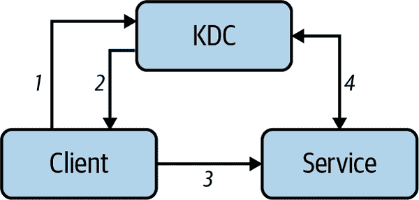

# 第九章：高级主题

这章节是一个综合性的章节。我们涵盖了从虚拟机到安全性再到新的 Linux 使用方式等多个主题。这章节的共同点是，如果你有特定的用例，或者在专业设置中需要它们，这些主题对你来说大多是相关的。

我们从单台机器上的进程如何通信和共享数据开始这一章节。有丰富的进程间通信（IPC）机制可用，在这里我们专注于成熟和广泛使用的特性：信号，命名管道和 Unix 域套接字。

接下来我们看看虚拟机（VM）。与我们在“容器”中讨论过的容器相比（适用于应用程序级别的依赖管理），VM 为您的工作负载提供了强大的隔离。您在公共云环境和数据中心中经常会遇到 VM，使用 VM 在本地也非常有用，例如用于测试或模拟分布式系统。

本章的下一节重点介绍现代 Linux 发行版，这些发行版通常以容器为中心，并假定为不可变状态。您经常会在像 Kubernetes 这样的分布式系统环境中找到这些发行版。

接着我们转向选定的安全主题，涵盖了 Kerberos，一个广泛使用的身份验证套件，以及可插入认证模块（PAM），这是 Linux 提供的用于身份验证的扩展机制。

在本章的最后部分，我们回顾了 Linux 的解决方案和使用案例，这些在撰写时尚未成为主流，但它们可能对您有用，值得探索。

# 进程间通信

在 Linux 中，有许多[进程间通信（IPC）](https://oreil.ly/tWp40)选项可供选择，从管道到套接字再到共享内存。IPC 使进程能够通信，同步活动并共享数据。例如，[Docker 守护程序](https://oreil.ly/aZur8)使用可配置的套接字来管理容器。在本节中，我们回顾了一些流行的 IPC 选项及其使用案例。

## 信号

[*信号*](https://oreil.ly/0y6ru)最初开发用作内核向用户空间进程通知某些事件的一种方式。将信号视为发送给进程的异步通知。有许多可用的信号（使用`man 7 signal`命令了解更多），其中大多数都有默认动作，例如停止或终止进程。

大多数信号都可以定义自定义处理程序，而不是让 Linux 继续执行默认动作。当您想要做一些清理工作或简单地忽略某些信号时，这非常有用。表格 9-1 展示了您应该熟悉的最常见信号。

表 9-1. 常见信号

| 信号 | 含义 | 默认动作 | 处理选项 | 快捷键组合 |
| --- | --- | --- | --- | --- |
| `SIGHUP` | 告诉守护进程重新读取其配置文件 | 终止进程 | `nohup`或自定义处理器 | N/A |
| `SIGINT` | 用户通过键盘中断 | 终止进程 | 自定义处理器 | Ctrl+C |
| `SIGQUIT` | 用户通过键盘退出 | [核心转储](https://oreil.ly/jeuEo)并终止进程 | 自定义处理器 | Ctrl+\ |
| `SIGKILL` | 强制终止信号 | 终止进程 | 无法处理 | N/A |
| `SIGSTOP` | 停止进程 | 停止进程 | 无法处理 | N/A |
| `SIGTSTP` | 用户通过键盘停止 | 停止进程 | 自定义处理器 | Ctrl+Z |
| `SIGTERM` | 优雅终止 | 终止进程 | 自定义处理器 | N/A |

也有一些没有定义含义的信号（`SIGUSR1`和`SIGUSR2`），进程可以使用它们来相互通信，发送异步通知，前提是双方同意信号的语义。

发送信号给进程的一个典型方式是有些奇怪命名的`kill`命令（由于其默认行为是导致进程终止）：

```
$ while true ; do sleep 1 ; done & 
[1] 17030 

$ ps 
  PID TTY          TIME CMD
16939 pts/2    00:00:00 bash
17030 pts/2    00:00:00 bash 
17041 pts/2    00:00:00 sleep
17045 pts/2    00:00:00 ps

$ kill 17030 
[1]+  Terminated              while true; do
    sleep 1;
done
```


我们在这里设置了一个非常简单的程序，只是简单地休眠。用`&`将其放到后台运行。


shell 作业控制确认我们的程序作为后台作业运行，并报告其 PID（`17030`）。


使用`ps`，我们检查程序是否仍在运行。


这是我们的程序（比较 PID）。


默认情况下，`kill`发送`SIGTERM`信号给进程，而默认动作是优雅地终止进程。我们提供`kill`命令与我们进程的 PID（`17030`），由于我们没有注册自定义处理程序，它被终止。

现在我们来看看如何使用[`trap`](https://oreil.ly/pp6O4)处理信号。这允许我们在 shell 环境（命令行或脚本）中定义一个自定义处理器：

```
$ trap "echo kthxbye" SIGINT ; while true ; do sleep 1 ; done 
^Ckthxbye 
```


使用`trap "echo kthxbye" SIGINT`，我们注册一个处理程序，告诉 Linux 当用户按下 Ctrl+C 时（导致`SIGINT`信号发送到我们的进程），Linux 应该在默认动作（终止）之前执行`echo kthxbye`。


我们看到用户中断（`^C`等同于 Ctrl+C），然后我们的自定义处理程序执行，如预期地打印`kthxbye`。

信号是一种简单而强大的 IPC 机制，现在您已经了解了如何在 Linux 中发送和处理信号的基础知识。接下来，我们讨论两种更为复杂和强大的 IPC 机制——命名管道和 UNIX 域套接字。

## 命名管道

在“流”中，我们讨论了通过使用管道符（`|`）可以将数据从一个进程传递到另一个进程，方法是将一个进程的`stdout`与另一个进程的`stdin`连接起来。我们称这些管道为*未命名*管道。进一步延伸这个想法，[命名管道](https://oreil.ly/iHMrK)是可以分配自定义名称的管道。

就像未命名管道一样，命名管道与正常的文件 I/O（`open`、`write`等）一起工作，并提供先进先出（FIFO）传递。与未命名管道不同，命名管道的生命周期不限于使用它的进程。从技术上讲，命名管道是管道的一种包装，使用`pipefs`伪文件系统（参见“伪文件系统”）。

让我们看看命名管道的实际应用，以更好地理解它们能做什么。我们在下文中创建了一个名为`examplepipe`的命名管道，并创建了一个发布者和一个消费者进程：

```
$ mkfifo examplepipe 

$ ls -l examplepipe
prw-rw-r-- 1 mh9 mh9 0 Oct  2 14:04 examplepipe 

$ while true ; do echo "x" > examplepipe ; sleep 5 ; done & 
[1] 19628

$ while true ; do cat < examplepipe ; sleep 5 ; done & 
[2] 19636
x 
x
...
```


我们创建了一个名为`examplepipe`的命名管道。


通过使用`ls`查看管道的类型：第一个字母是`p`，表示我们正在查看一个命名管道。


使用循环，我们将字符`x`发布到我们的管道中。请注意，除非有其他进程从`examplepipe`读取，否则管道将被阻塞。不能再向其写入数据。


我们启动了第二个进程，它在循环中从管道中读取。


由于我们的设置，我们看到每隔大约五秒钟终端上出现`x`。换句话说，每次进程 PID 为`19636`的进程能够从带有`cat`的命名管道中读取时，它就会出现。

命名管道易于使用。由于其设计，它们看起来和感觉像普通文件。但它们也有局限性，因为它们仅支持单向和单个消费者。我们接下来看看的 IPC 机制解决了这些限制。

## UNIX 域套接字

我们已经在网络环境中讨论了套接字。还有其他种类的套接字专门在单台机器的上下文中使用，其中一种称为[UNIX 域套接字](https://oreil.ly/nCd6r)：这些是双向的、多路通信端点。这意味着您可以有多个消费者。

域套接字有[三种类型](https://oreil.ly/AlVUf)：面向流（`SOCK_STREAM`）、面向数据报（`SOCK_DGRAM`）和顺序数据包（`SOCK_SEQPACKET`）。寻址基于文件系统路径名。与 IP 地址和端口不同，一个简单的文件路径就足够了。

通常，您会通过编程的方式使用域套接字（[链接](https://oreil.ly/o8Ikj)）。然而，您可能会发现自己处于需要排除系统故障并希望使用例如[`socat`工具](https://oreil.ly/lWjrs)从命令行手动与套接字交互的情况。

# 虚拟机

本节讲述了一种成熟的技术，使我们能够使用像您的笔记本电脑或数据中心中的服务器这样的物理机器模拟多个虚拟机。这提供了一种更灵活、更强大的方式来运行不同的工作负载，可能是来自不同租户的，具有强隔离的方式。我们重点关注 x86 架构的硬件辅助虚拟化。

在   在 [图 9-1 中，您可以看到概念层面的虚拟化架构，包含以下内容（从底部开始）：

CPU

必须支持硬件虚拟化。

基于内核的虚拟机

位于 Linux 内核中；在“基于内核的虚拟机”中讨论。

用户空间中的组件

用户空间中的组件包括以下内容：

虚拟机监控器（VMM）

管理虚拟机并模拟虚拟设备，如 [QEMU](https://www.qemu.org) 和 Firecracker（见“Firecracker”）。还有 [libvirt](https://libvirt.org)，一个暴露通用 API 的库，旨在标准化 VMM，您可以通过编程使用（在图中未明确显示；视为 VMM 块的一部分）。

来宾内核

通常也是 Linux 内核，但也可以是 Windows。

来宾进程

运行在来宾内核上。


###### 图 9-1\. 虚拟化架构

运行在主机内核上的进程（在 图 9-1 中，进程 1 和进程 2）与来宾进程隔离。这意味着一般来说，主机的物理 CPU 和内存不会受到来宾活动的影响。例如，如果虚拟机中有攻击，主机内核和进程不会受到影响（只要虚拟机没有特殊权限访问主机系统）。请注意，实际情况中可能会有例外，例如 [rowhammer](https://oreil.ly/L7qH9) 或 [Meltdown 和 Spectre](https://oreil.ly/ZlgRE)。

## 基于内核的虚拟机

[基于内核的虚拟机（KVM）](https://oreil.ly/vTINW)是一个针对支持虚拟化扩展的 x86 硬件的 Linux 本地虚拟化解决方案，如 [AMD-V](https://oreil.ly/XXAM8) 或 [Intel VT](https://oreil.ly/SAbNc)。

KVM 内核模块有两个部分：核心模块（`kvm.ko`）和特定于 CPU 架构的模块（`kvm-intel.ko`/`kvm-amd.ko`）。通过 KVM，Linux 内核作为超视图管理程序，负责大部分的重负担。此外，还有诸如集成的 [Virtio](https://oreil.ly/g37Qe) 这样的驱动程序，允许进行 I/O 虚拟化。

如今，硬件通常支持虚拟化，KVM 已经可用，但为了检查您的系统是否能够使用 KVM，您可以执行以下检查（输出已编辑）：

```
$ grep 'svm\|vmx' /proc/cpuinfo 
flags           : fpu vme de pse tsc msr pae mce cx8 apic sep mtrr pge mca cmov
pat pse36 clflush dts acpi mmx fxsr sse sse2 ss ht tm pbe syscall nx pdpe1gb
rdtscp lm constant_tsc art arch_perfmon pebs bts rep_good nopl xtopology
tsc_reliable nonstop_tsc cpuid aperfmperf tsc_known_freq pni pclmulqdq dtes64
ds_cpl vmx tm2 ssse3 sdbg cx16 xtpr pdcm sse4_1 sse4_2 x2apic movbe popcnt 
tsc_deadline_timer aes xsave rdrand lahf_lm 3dnowprefetch cpuid_fault cat_l2
ibrs ibpb stibp tpr_shadow vnmi flexpriority ept vpid ept_ad fsgsbase tsc_adjust
smep erms mpx rdt_a rdseed smap clflushopt intel_pt sha_ni xsaveopt xsavec
xgetbv1 xsaves dtherm ida arat pln pts md_clear arch_capabilities
...

$ lsmod | grep kvm 

kvm_intel             253952  0 
kvm                   659456  1 kvm_intel
```


在 CPU 信息中搜索 `svm` 或 `vmx`（请注意，它是按 CPU 计算的，因此如果您有八个核心，您将看到这个 `flags` 块重复出现八次）。


我们看到列出了 `vmx`，所以在硬件辅助虚拟化方面，一切都很好。


在这里我们检查 KVM 内核模块是否可用。


这告诉我们已加载了 `kvm_intel` 内核模块，因此在使用 KVM 方面一切都设置好了。

管理 KVM 的一种现代方式是使用 Firecracker。

## Firecracker

[Firecracker](https://oreil.ly/UpNPK) 是一个可以管理 KVM 实例的 VMM。它用 Rust 编写，主要在亚马逊网络服务（AWS）上开发，用于无服务器提供，如 AWS Lambda 和 AWS Fargate。

Firecracker 被 [设计](https://oreil.ly/6D8Wk) 以安全地在同一物理机上运行多租户工作负载。Firecracker VMM 管理所谓的 *microVMs*，向主机公开 HTTP API，允许您启动、查询和停止 microVMs。它通过在主机上使用 [TUN/TAP 设备](https://oreil.ly/ojWvm) 模拟网络接口，并且块设备由主机上的文件支持，支持 Virtio 设备。

从安全的角度来看，除了迄今讨论的虚拟化外，Firecracker 默认使用 seccomp 过滤器（参见“seccomp Profiles”）来限制它可以使用的主机系统调用。还可以使用 cgroups。从可观察性的角度来看，您可以通过命名管道从 Firecracker 收集日志和指标。

接下来我们转向专注于不变性并利用容器的现代 Linux 发行版。

# 现代 Linux 发行版

最著名的传统 Linux 发行版包括以下几种：

+   红帽家族（RHEL、Fedora 和 CentOS/Rocky）

+   基于 Debian 的家族（Ubuntu、Mint、Kali、Parrot OS、elementary OS 等）

+   SUSE 家族（openSUSE 和 Enterprise）

+   Gentoo

+   Arch Linux

这些都是非常好的发行版。根据您的需求和偏好，您可以选择从完全控制和自己处理一切（从安装到打补丁）到完全托管的方案，在这种情况下，发行版将处理大部分任务。

随着容器的兴起，如在 “容器” 中讨论的那样，主机操作系统的角色发生了变化。在容器的上下文中，传统的包管理器（参见 “包和包管理器”）扮演了不同的角色：大多数基础容器镜像通常是从特定的 Linux 发行版构建的，并且容器内部通过 *.deb* 或 *.rpm* 包来满足所有应用程序级别的依赖关系。

此外，对系统进行增量更改证明是一个巨大的挑战。特别是当您需要在规模化环境中进行管理时，比如需要管理一群机器时。因此，对于现代发行版来说，焦点越来越多地放在不变性上。其思想是，对配置或代码（比如修复安全问题或新增功能的补丁）的任何更改都会导致新构件的创建，例如一个容器映像，而不是更改运行中的系统。

当我说“现代 Linux 发行版”时，我指的是以容器为中心，以不变性和自动升级（由 Chrome 开创）为核心的发行版。让我们看一些现代发行版的例子。

## Red Hat Enterprise Linux CoreOS

2013 年，一家名为 CoreOS 的年轻初创公司发布了[CoreOS Linux（后来改名为 Container Linux）](https://oreil.ly/XjqPV)。其主要特点包括系统更新的双分区方案和缺少包管理器。换句话说，所有应用程序都将作为容器在本地运行。在这个生态系统中，开发了许多仍在使用的工具（如`etcd`；想象一个用于配置任务的分布式版本的*/etc*目录）。

在 Red Hat 收购了 CoreOS（公司）之后，它宣布了将 CoreOS Linux 与 Red Hat 自己的 Project Atomic（具有类似目标的项目）合并的意图。这一合并导致了[Red Hat Enterprise Linux CoreOS (RHCOS)](https://oreil.ly/38kzX)，这并不意味着它可以单独使用，而是在 Red Hat 称为 OpenShift Container Platform 的 Kubernetes 发行版的上下文中使用。

## Flatcar Container Linux

稍后，Red Hat 宣布其在 Container Linux 周围的计划后，一家名为 Kinvolk GmbH（现为 Microsoft 的一部分）的德国初创公司宣布将继续在新品牌[Flatcar Container Linux](https://oreil.ly/rNJrt)下分叉并继续开发 Container Linux。

Flatcar 自称是一个容器本地化、轻量级操作系统，适用于容器编排器如 Kubernetes 和 IoT/边缘计算。它延续了 CoreOS 的传统自动升级（可选与其自己的更新管理器[Nebraska](https://oreil.ly/Qepv6)）并且有一个称为[Ignition](https://oreil.ly/4vEQv)的强大而简单易用的引导设备配置实用程序，使您能够对启动设备进行精细控制（RHCOS 也用于此目的）。此外，它没有包管理器；一切都在容器中运行。您可以使用`systemctl`在单台机器上管理容器化应用的生命周期，或者更常见地使用 Kubernetes。

## 瓶子火箭

[瓶子火箭](https://oreil.ly/fIKrQ)是由 AWS 开发的基于 Linux 的操作系统，专为[托管容器](https://oreil.ly/5Eaxd)而设计。用 Rust 编写，用于多种服务，如 Amazon EKS 和 Amazon ECS。

与 Flatcar 和 CoreOS 类似，Bottlerocket 不使用包管理器，而是使用基于 OCI 镜像的模型进行应用程序升级和回滚。 Bottlerocket 使用（大体上）只读、完整性检查的文件系统，基于[dm-verity](https://oreil.ly/xicaW)。为了通过 SSH（虽然不推荐）访问和控制 Bottlerocket，它运行一个所谓的[控制容器](https://oreil.ly/KB6eX)，在一个独立的`containerd`实例中。

## RancherOS

[RancherOS](https://oreil.ly/73UxM)是一个 Linux 发行版，其中一切都是由 Docker 管理的容器。由 Rancher（现为 SUSE）赞助，它针对容器工作负载进行了优化，如同其 Kubernetes 发行版。它运行两个 Docker 实例：系统 Docker 作为第一个进程运行，用户 Docker 用于创建应用程序容器。RancherOS 具有很小的占用空间，非常适合嵌入式系统和边缘计算环境中使用。

# 选定的安全主题

在第四章中，我们讨论了许多访问控制机制。我们讨论了*认证*（简称为*authn*），用于验证用户的身份，并且是任何*授权*（简称为*authz*）的先决条件。在本节中，我们简要讨论了两个广泛使用的认证工具，您应该注意它们。

## Kerberos

[Kerberos](https://kerberos.org)是麻省理工学院在 1980 年代开发的认证套件。今天，它在[RFC 4120](https://oreil.ly/7woDK)和相关的 IETF 文件中有正式规范。Kerberos 的核心思想是，我们通常处理不安全的网络，但我们希望客户端和服务之间能够安全地证明其身份。

在概念上，Kerberos 认证过程如图 9-2 所示，工作原理如下：



###### 图 9-2\. Kerberos 协议概念

1.  一个客户端（例如，您笔记本上的程序）向称为密钥分发中心（KDC）的 Kerberos 组件发送请求，请求为特定服务（如打印或目录）获取凭据。

1.  KDC 响应所请求的凭据——即服务的票证和临时加密密钥（会话密钥）。

1.  客户端将票证（其中包含客户端的身份和会话密钥的副本）传输给服务。

1.  会话密钥由客户端和服务共享，用于验证客户端，并且可选择用于验证服务。

Kerberos 也存在一些挑战，例如 KDC 扮演的中心角色（单点故障）以及其严格的时间要求（需要通过 NTP 在客户端和服务器之间进行时钟同步）。总体而言，尽管操作和管理不简单，Kerberos 在企业和云服务提供商中得到了广泛使用和支持。

## 可插拔认证模块

在历史上，程序会自行管理用户认证过程。使用[可插拔认证模块（PAM）](http://www.linux-pam.org)，Linux 引入了一种灵活的开发程序的方式，独立于具体的认证方案（PAM 自 1990 年代末起在更广泛的 UNIX 生态系统中存在）。PAM 采用模块化架构，为开发人员提供了一个强大的库来与之交互。它还允许系统管理员插入不同的模块，例如以下内容：

[`pam_localuser`](https://oreil.ly/NCs0A)

要求用户在*/etc/passwd*中列出

[`pam_keyinit`](https://oreil.ly/PkGt9)

用于会话密钥环

[`pam_krb5`](https://oreil.ly/YinOv)

用于 Kerberos 5 基于密码的检查

到此，我们已经完成了高级安全主题的讨论，现在转向更具抱负性的主题。

# 其他现代和未来的提供

在本节中，我们将探讨一些令人兴奋的 Linux 提供，包括设置 Linux 的新方法以及在新环境中使用 Linux 的方式。在服务器世界中（无论是本地数据中心还是公共云），Linux 已经是事实上的标准，在许多移动设备中，Linux 在幕后起着关键作用。

在本节中的主题共同点是，目前这些主题尚未进入主流。然而，如果你对未来的发展可能是什么样子或 Linux 仍存在高增长潜力的领域感兴趣，请继续阅读。

## NixOS

[NixOS](https://nixos.org)是一种基于源的 Linux 发行版，采用功能化的包管理和系统配置方式以及用于升级回滚的机制。我将其称为“功能化的方法”，因为这些制品基于不变性。

[Nix 软件包管理器](https://oreil.ly/Km84W)构建整个操作系统，从内核到系统包和应用程序。

与大多数其他 Linux 发行版不同，NixOS 不遵循 Linux 标准基础文件系统布局的讨论（位于*/usr/bin*、*/usr/lib*等位置的系统程序以及通常位于*/etc*的配置）。

NixOS 及其生态系统中有许多有趣的想法，使其特别适合 CI 流水线。即使您不想完全投入，也可以单独使用 Nix 软件包管理器（在 NixOS 之外）。

## Linux 桌面化

尽管[Linux 桌面化](https://oreil.ly/eBPYT)的可行性仍在讨论中，但毫无疑问，关于桌面友好的发行版以及与之相关的[窗口管理器](https://oreil.ly/qylKC)有很多选择。

符合 UNIX 传统，图形用户界面（GUI）部分与操作系统的其余部分分离。通常，[X 窗口管理器](https://oreil.ly/bTcHy)负责 GUI 的职责（从窗口管理到样式和渲染），并借助[显示管理器](https://oreil.ly/hl5gv)的帮助。

在窗口管理器的基础上，实现桌面体验（例如图标、小部件和工具栏）的是[桌面环境](https://oreil.ly/y1VIr)，比如 KDE 或 MATE。

如今有许多适合初学者的桌面 Linux 发行版，从而使从 Windows 或 macOS 切换变得容易。同样适用于各种开源应用程序，从办公应用程序（撰写文档或处理电子表格，比如 LibreOffice）到绘图和图像编辑（Gimp），再到所有主要的 Web 浏览器、游戏、媒体播放器和实用工具，以及开发环境。

事实上，Linux 桌面的催化剂可能来自一个非常意想不到的方向：随着[Windows 11 允许你直接运行图形化 Linux 应用程序](https://oreil.ly/tGgaf)，这可能改变相关的激励和采用情况。时机将会证明一切。

## 嵌入式系统上的 Linux

[嵌入式系统上的 Linux](https://oreil.ly/mFKVR)是一个广泛的领域，涵盖从汽车到网络设备（如路由器），到智能家居设备（例如冰箱）和媒体设备/智能电视等多种实现。

你可以以极少的费用获取一个特别有趣的通用平台，即[Raspberry Pi（RPI）](https://www.raspberrypi.org)。它配备了自己的 Linux 发行版称为 Raspberry Pi OS（基于 Debian 的系统），通过微型 SD 卡可以简单地安装这个及其他 Linux 发行版。RPI 具有多个通用输入/输出（GPIO），使得通过面包板使用外部传感器和电路变得简单。你可以通过 Python 等语言实验、学习电子技术并编程硬件。

## 云 IDE 中的 Linux

近年来，基于云的开发环境的可行性取得了巨大进展，现在已经存在（商业）产品，将集成开发环境（通常是 Visual Studio Code）、Git 和多种编程语言结合到 Linux 环境中。作为开发者，你只需一个 Web 浏览器和网络访问，就可以在“云端”编辑、测试和运行代码。

在撰写时，两个著名的云 IDE 的例子分别是[Gitpod](https://www.gitpod.io)，它可以作为托管服务提供，也可以作为开源项目自行托管；以及[Codespaces](https://oreil.ly/bWNDT)，它与 GitHub 深度集成。

# 结论

本章涵盖了高级主题，并且深化了您对基本技术和工具的了解。如果您想要启用 IPC，可以使用信号和命名管道。要隔离工作负载，可以使用虚拟机，特别是现代变体如 Firecracker。我们还讨论了现代 Linux 发行版：如果您计划运行容器（Docker），可能需要考虑这些强制不变性的容器中心发行版。然后我们转向了选定的安全主题，特别是 Kerberos 和 PAM 用于灵活和/或大规模认证。最后，我们回顾了尚未主流的 Linux 解决方案，例如桌面 Linux 及如何在树莓派等嵌入式系统上开始使用 Linux 进行本地实验或开发。

本章的进一步阅读材料：

IPC

+   [“Linux IPC 简介”](https://oreil.ly/C2iwX)

+   [“Linux 中的进程间通信：使用管道和消息队列”](https://oreil.ly/cbi1Z)

+   [“Linux 内核中管道和 FIFO 的实现”](https://oreil.ly/FUvoo)

+   [Socat 速查表](https://oreil.ly/IwiyP)

虚拟机

+   [VMware 的“什么是虚拟机？”](https://oreil.ly/vJ9Uf)

+   [“什么是虚拟机（VM）？”（Red Hat/IBM）](https://oreil.ly/wJEG1)

+   [“如何通过 CLI 创建和管理 KVM 虚拟机”](https://oreil.ly/cTH8b)

+   [通过 Debian Wiki 的“KVM”](https://oreil.ly/XLVwj)

+   [QEMU 机器仿真器和虚拟化器网站](https://oreil.ly/wDCrH)

+   [Firecracker 网站](https://oreil.ly/yIOxz)

现代发行版

+   [“容器与集群”](https://oreil.ly/Z8ZNC)

+   [“不变性与松耦合：天作之合”](https://oreil.ly/T89ed)

+   [“教程：在远程裸金属服务器上安装 Flatcar 容器 Linux”](https://oreil.ly/hZN1b)

+   [基于图像的 Linux 发行版及相关工具](https://oreil.ly/gTav0)

+   [Bottlerocket 安全功能：一个基于开源 Linux 的操作系统](https://oreil.ly/Bfj7l)

+   [“RancherOS：面向 Docker 爱好者的简化 Linux”](https://oreil.ly/61t6G)

选定的安全

+   [“Kerberos：网络认证协议”](https://oreil.ly/rSPKm)

+   [PAM 教程](https://oreil.ly/Pn9fL)

其他现代和未来的选择

+   [“X 窗口管理器的工作原理及如何编写一个”](https://oreil.ly/LryXW)

+   [“NixOS：纯函数式 Linux”](https://oreil.ly/qY62s)

+   [“NixOS：纯函数式系统配置管理”](https://oreil.ly/8YALG)

+   [“什么是树莓派？”](https://oreil.ly/wnHxa)

+   [“在树莓派 4b 上从零开始使用 64 位操作系统部署 Kubernetes”](https://oreil.ly/cnAsx)

我们已经完成了本书的阅读。希望这是您自己 Linux 旅程的起点。感谢您陪伴我到最后，如果您有反馈意见，我非常乐意听取，可以通过 Twitter 或者传统的电子邮件联系：*modern-linux@pm.me*。
