# 2 探索 PowerShell

本章全部关于让您熟悉环境，并帮助您决定您将使用哪个 PowerShell 界面（是的，您有选择）。如果您之前使用过 PowerShell，这些材料可能看起来有些重复，所以请随意*浏览*本章——您可能仍然会在这里和那里找到一些有用的信息。

此外，本章仅适用于 Windows、macOS 和 Ubuntu 18.04 上的 PowerShell。其他 Linux 发行版有类似的设置，但本章不会涉及。对于其他安装说明，您可以直接从 PowerShell 的 GitHub 页面[`github.com/PowerShell/PowerShell#`](https://github.com/PowerShell/PowerShell#)获取。

有用术语

我们应该定义一些在本章中会大量使用的术语。

*PowerShell*—指的是您已安装的 7.x 版本。

*Shell* *—*Shell 基本上是一个可以接受基于文本的命令的应用程序，通常用于通过脚本或终端等交互式体验与您的计算机或其他机器进行交互。Shell 的例子包括 Bash、fish 或 PowerShell。

*Terminal*—终端是一个可以在其中运行 shell 应用程序的应用程序，这样用户就可以以可视化的方式与 shell 进行交互。终端是 shell 无关的，因此您可以在任何终端中运行任何 shell。

*Windows PowerShell*—指的是预装在您的 Windows 10 设备上的 PowerShell 5.1。

## 2.1 Windows 上的 PowerShell

PowerShell 自 Windows 7（以及 Server 2008）以来就预装在 Windows PC 上。需要注意的是，Windows 上 PowerShell 7 的进程名已更改。它不再是`powershell.exe`，而是`pwsh.exe`。PowerShell 7 是并行安装，这意味着 Windows PowerShell（5.1）仍然默认安装（这就是为什么进程名必须更改）。

让我们先安装 PowerShell 7。安装此软件有多种方式（例如，从 Microsoft Store、winget、Chocolatey），因此您可以选择您喜欢的任何方法，但在这本书中，我们采用直接的方法，即从 PowerShell 的 GitHub 仓库下载 MSI：[PowerShell/PowerShell](https://github.com/PowerShell/PowerShell)。请确保您下载的是稳定版本，因为这是 PowerShell 团队发布的最新 GA（通用可用）版本（如图 2.1 所示）。

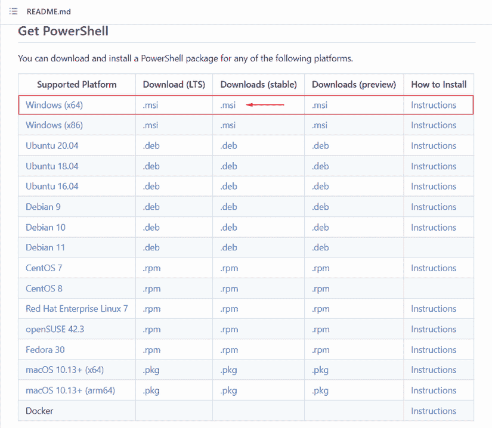

图 2.1 这显示了可用于 PowerShell 的不同安装方式，其中 MSI 用于 Windows 安装。

按照 MSI 向导进行操作，接受默认设置，然后您就完成了。启动 PowerShell 有多种方式（如图 2.2 所示）。安装后，您可以在任务栏中搜索它。这也是指出图标也略有变化的好时机。

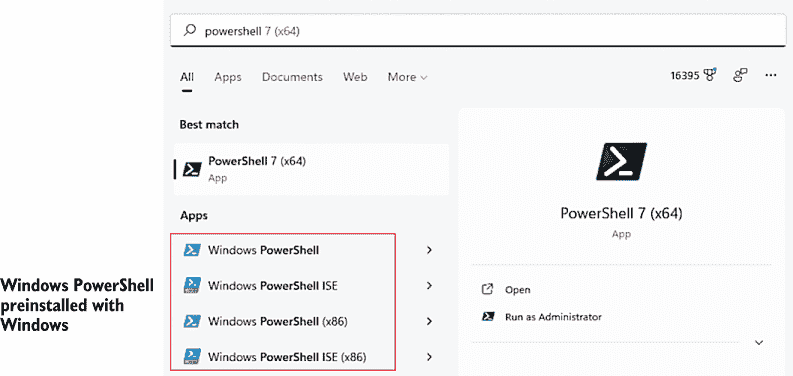

图 2.2 Windows 10 的开始菜单显示了 PowerShell 7 和 PowerShell 5.1 的并行安装

如果你点击 PowerShell 7 图标（我们建议你将其也设置为任务栏图标），这将启动 PowerShell 控制台。如果你熟悉 Windows PowerShell，你将注意到它在外观上的明显差异。这是因为背景色是黑色而不是蓝色。为了这本书的目的，我们已经更改了控制台颜色，以便更容易阅读。

当你在没有安装 GUI 终端的服务器上运行 PowerShell 时，PowerShell 控制台应用程序是你的唯一选择：

+   控制台应用程序非常小巧。它加载速度快，且内存占用很少。

+   它不需要比 PowerShell 本身更多的 .NET Framework 支持。

+   你可以将颜色设置为绿色文本和黑色背景，假装你在使用 1970 年代的巨型计算机。

如果你决定使用控制台应用程序，我们有一些建议来配置它。你可以通过点击窗口左上角的控制框并选择属性来设置所有这些配置。如图 2.3 所示的对话框。在 Windows 10 中，它看起来略有不同，因为它增加了一些新选项，但基本原理是相同的。

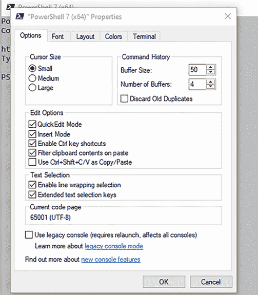

图 2.3 配置控制台应用程序属性

在选项选项卡上，你可以增加命令历史缓冲区的大小。这个缓冲区使控制台能够记住你输入过的命令，并允许你通过使用键盘上的上箭头和下箭头来回忆它们。

在字体选项卡上，选择比默认的 12 点字体稍大一些的字体。求你了。我们不在乎你是否有 20/10 的视力；稍微增加字体大小。PowerShell 需要你能够快速区分许多相似外观的字符——例如 `'`（撇号或单引号）和 `` ` ``（反引号或重音符号）——而小字体无助于此。

在布局选项卡上，将两个宽度大小设置为相同的数字，并确保生成的窗口适合你的屏幕。未能做到这一点可能会导致窗口底部出现水平滚动条，这可能导致一些 PowerShell 输出被包裹在窗口的右侧，你永远看不到。这很烦人。

最后，在颜色选项卡上，不要太过分。保持高对比度和易于阅读。如果你真的想的话，你可以将颜色设置为与你的 Windows PowerShell 终端匹配。

需要记住的一点是：这个控制台应用程序不是 PowerShell；它只是你与 PowerShell 交互的途径。

注意：在我们的旅程中，我们将不会使用 Windows PowerShell 或 ISE。ISE 不支持 PowerShell 7。我们将改用 Visual Studio Code，这在本章稍后会有所介绍。

## 2.2 macOS 上的 PowerShell

如果你使用的是 Mac，这一部分是为你准备的。我们将讨论如何在 macOS 上安装和运行 PowerShell。这本书假设你知道如何打开终端——macOS 的默认终端应用程序。如果你有其他终端，你也可以使用，但我们将在这本书中坚持使用默认的终端。好，让我们安装 PowerShell！

### 2.2.1 在 macOS 上的安装

今天，PowerShell 并没有包含在 macOS 中。也许有一天会发生这种情况，但在此之前，我们必须自己安装它。幸运的是，安装很简单，有很多种方法可以做到。我们将介绍在 macOS 上安装 PowerShell 的最简单方法，即通过 Homebrew——macOS 上的首选包管理器。Homebrew 提供了通过终端安装 PowerShell 的能力，无需点击鼠标。

注意，Homebrew 也没有包含在 macOS 中，所以如果你还没有安装它，你可以访问 Homebrew 的网站 ([`brew.sh`](https://brew.sh)) 获取安装说明。去安装它吧。我们等你回来！

一旦你安装了 Homebrew 并准备就绪，你就可以安装 PowerShell。你只需要一个 `终端` 实例，所以请打开你的 Mac 上的终端。利用 Homebrew，你将使用一条命令安装 PowerShell：

```
brew cask install powershell
```

将该命令输入到 `终端` 并按 `回车键`。然后你会看到 Homebrew 正在安装 PowerShell（图 2.4）。

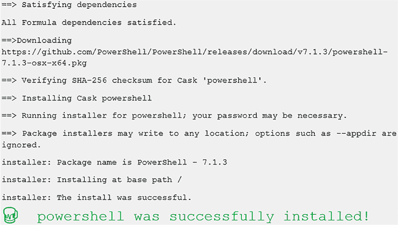

图 2.4 Homebrew 安装 PowerShell

你已经设置好了！让我们运行它。我们要运行什么？这是一个好问题。要运行 PowerShell，你只需运行命令 `pwsh`，这将在你的终端中启动 PowerShell。你应该会看到以下输出：

```
~ pwsh
PowerShell 7.1.3
Copyright (c) Microsoft Corporation. All rights reserved.

https://aka.ms/pscore6-docs
Type 'help' to get help.

PS /Users/steve>
```

现在我们已经在 macOS 的终端应用程序中运行 PowerShell 了！做得好。这是在 macOS 上与 PowerShell 交互的主要方式之一。我们稍后会介绍另一种主要方式，但首先我们需要解决那些使用 Linux 作为操作系统的人的问题。

## 2.3 PowerShell 在 Linux（Ubuntu 18.04）上

这是我们要告诉你 PowerShell 非常棒，能够在极其广泛的 Linux 发行版上运行的部分。这也是我们要告诉你，如果我们逐一介绍了所有这些发行版的安装过程，我们的出版商会想知道为什么这本书变成了百万页。我们将介绍如何在 Ubuntu 18.04 上安装 PowerShell，因为它是写作时的最新 LTS 版本。如果你使用的是其他类型的机器，不用担心！有关如何在所有支持的 Linux 发行版上安装 PowerShell 的所有文档都可以在 PowerShell 文档中找到，具体是关于这个主题的文章：[`mng.bz/YgnK`](http://mng.bz/YgnK)。

好吧，现在让我们谈谈安装。我们还应该提到……这本书假设你知道如何在 Ubuntu 18.04 上打开终端应用程序。你可以使用任何终端进行这些步骤，但我们将坚持使用默认的终端。

### 2.3.1 在 Ubuntu 18.04 上的安装

Ubuntu 18.04 预装了 Canonical 自家的包管理器，称为 `snap`。这使我们能够通过单个命令安装 PowerShell。首先，请打开一个终端实例并输入以下命令：

```
snap install powershell –-classic
```

完成上述操作后，按 `ENTER` 运行。你可能需要输入密码，如果是这样，请输入。这是因为 `snap` 需要以 `root` 权限运行才能安装 PowerShell。你看到的输出应该看起来像这样：

```
PowerShell 7.1.3 from Microsoft PowerShell✓ installed
```

注意：我们在命令中添加了 `--classic`，因为 PowerShell 被视为“经典 snap 包”。经典 snap 包移除了对 snap 包的限制，允许 PowerShell 完全与操作系统交互。

你已经准备好了！让我们运行它。我们要运行什么？这是一个好问题。要运行 PowerShell，你只需运行命令 `pwsh`，它将在你的终端中启动 PowerShell。你应该会看到以下输出：

```
~ pwsh
PowerShell 7.1.3
Copyright (c) Microsoft Corporation. All rights reserved.

https://aka.ms/pscore6-docs
Type 'help' to get help.

PS /Users/tyleonha>
```

我们现在已经在 Ubuntu 18.04 的终端中运行了 PowerShell！做得好。这是在 Ubuntu 18.04 上与 PowerShell 交互的主要方式之一。现在我们已经让它在终端中运行，让我们让其他 PowerShell 界面也运行起来。

## 2.4 Visual Studio Code 和 PowerShell 扩展

等等！别急着走。我们知道这听起来像是我们要你安装所有 C# 开发者朋友都在用的那个应用程序，但这并不准确！让我们来解释一下。

微软提供了两个名称非常相似但完全不同的产品（“技术领域有两个难题：缓存失效、命名事物和 off-by-1 错误”这句话是正确的）。第一个产品是你可能听说过的：Visual Studio。它是一个功能齐全的集成开发环境（IDE）。它通常被 C# 和 F# 开发者使用。另一方面，Visual Studio Code 是一个完全不同的应用程序。它是一个轻量级的文本编辑器，与 Sublime Text 或 Notepad++ 等其他文本编辑器有些相似之处，但它增加了一些功能来增强用户体验。

其中一个新增功能是可扩展性。人们可以为 Visual Studio Code 编写扩展并将其放在 Visual Studio Code 的市场上供其他人使用。PowerShell 团队在市场上提供了一个 PowerShell 扩展，它带来了一系列有助于你学习 PowerShell 的优秀功能。带有 PowerShell 扩展的 Visual Studio Code 是推荐用于 PowerShell 的编辑体验，就像 PowerShell 本身一样，它们都是开源的并且跨平台工作。你可以在以下位置找到源代码：

+   Visual Studio Code—[`github.com/Microsoft/vscode`](https://github.com/Microsoft/vscode)

+   PowerShell 扩展—[`github.com/PowerShell/vscode-powershell`](https://github.com/PowerShell/vscode-powershell)

这也是我们向大家说明的一个好机会，如果你对那些产品有任何问题，请在它们各自的 GitHub 页面上打开一个 issue。这是提供反馈和报告问题的最佳方式。好的，让我们进入安装步骤。

注意：在后续章节中学习编写脚本时，Visual Studio Code 和 PowerShell 扩展将更有价值。你将会达到那里。我们保证。

那 PowerShell ISE 呢？

如果你已经对 PowerShell 有所了解，并且熟悉 PowerShell ISE，你可能想知道为什么它没有被提及。PowerShell ISE 不与 PowerShell 一起工作，目前只处于支持模式，这意味着它只会接收安全相关的更新。团队的关注点已经转移到带有 PowerShell 扩展的 Visual Studio Code 上。

### 2.4.1 安装 Visual Studio Code 和 PowerShell 扩展

如果你已经做到了这一步，你已经在你的操作系统上安装了 PowerShell。要安装 Visual Studio Code，你可以使用相同的步骤。对于 Windows、macOS 或 Linux，请访问[`code.visualstudio.com/Download`](https://code.visualstudio.com/Download)并下载并运行安装程序（图 2.5）。

+   要添加 PowerShell 扩展，启动 VS Code 并转到市场。

+   搜索 PowerShell 并点击安装。

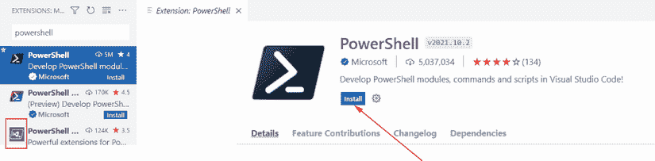

图 2.5 这显示了 VS Code 中 PowerShell 7 扩展的扩展图标和安装按钮。

对于那些喜欢命令行的人来说，你也可以通过终端安装 VS Code 和 PowerShell 扩展：

+   macOS：打开`Terminal`并运行`brew cask install vscode`。

+   Ubuntu 18.04：打开`Terminal`并运行`snap install code --classic`。

你已经掌握了这个！如果你正确地做了，在终端中运行`code`命令应该会打开一个 Visual Studio Code 的实例。如果不起作用，关闭所有终端窗口，打开一个新的，然后再次尝试运行`code`命令。一旦安装完成，你需要安装 PowerShell 扩展。由于我们喜欢在 PowerShell 的世界中打字，让我们用一条命令安装扩展。你可以使用`code`命令安装扩展，如下所示：

```
code --install-extension ms-vscode.powershell
```

这将给出以下输出：

```
~ code --install-extension ms-vscode.powershell
Installing extensions...
Installing extension 'ms-vscode.powershell' v2019.9.0..
Extension 'ms-vscode.powershell' v2019.9.0 was successfully installed.
```

让我们看看清单：

```
PowerShell installed ✔
Visual Studio Code installed ✔
PowerShell extension installed ✔
```

我们准备好看看这一切能提供什么。如果你还没有做，请运行终端中的`code`命令来打开 Visual Studio Code。

### 2.4.2 熟悉 Visual Studio Code

从现在开始，无论你运行什么操作系统，体验都将相同。这里我们有 Visual Studio Code。一开始可能看起来有些吓人，但经过一点练习，你将能够利用它的力量来帮助你编写一些出色的 PowerShell 脚本。打开 Visual Studio Code 后，我们应该准备好让它与 PowerShell 一起工作。首先，点击左侧靠近其他奇怪图标的小 PowerShell 模板图标。它在图 2.6 中被突出显示。

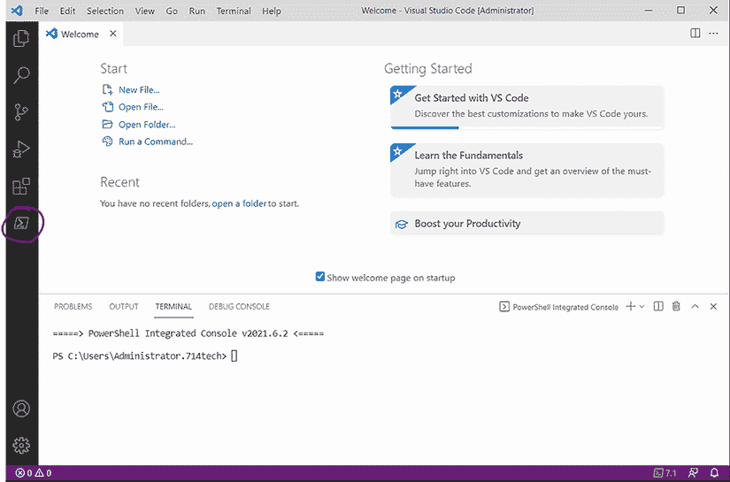

图 2.6 Visual Studio Code 启动屏幕

点击 PowerShell 图标后，会出现几个东西。让我们来看看我们看到的内容（图 2.7）：

+   *命令探索器*（A）——可供您运行的命令列表。当您悬停在其中一个上时，它会为您提供几个不同的操作。您可以再次点击 PowerShell 图标来隐藏它。

+   *脚本编辑面板*（B）——我们将在本书的结尾使用它，但这是您的脚本将在不同的标签中出现的部分。

+   *集成控制台*（C）——这是魔法发生的地方。这是 PowerShell。您可以在这里运行命令，就像您在终端应用程序中运行的 PowerShell 一样。

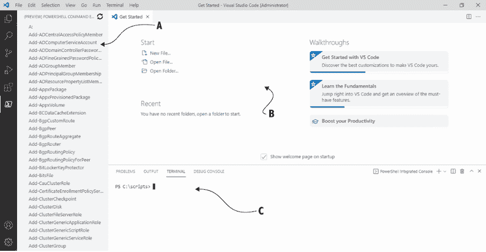

图 2.7 带有 PowerShell 扩展的 Visual Studio Code 分解图

在集成控制台的右上角，我们可以看到几个不同的操作。让我们从右侧开始。首先我们看到一个“x”图标。这个图标会隐藏集成控制台和整个终端面板。如果您想再次打开它，请按 Ctrl+`。之后，您会看到一个光标（`^`）图标。这个图标会隐藏脚本面板并最大化终端面板。然后我们有一个垃圾桶图标。这个图标会*关闭终端*。请跟着我们重复： “我保证永远永远永远不关闭 PowerShell 集成控制台。” 集成控制台是 PowerShell 扩展的核心，以及所有其功能，如果您关闭它，那么扩展将停止工作——所以，请，请不要删除集成控制台。

PowerShell 集成控制台与普通终端相比？

如我们之前提到的，PowerShell 集成控制台是 PowerShell 扩展的核心。您认为命令探索器中的命令是从哪里来的？是的，没错——集成控制台。扩展中有许多功能依赖于集成控制台，但只需知道只有一个。任何其他生成的终端，即使它运行 PowerShell，也不是“集成”的。记住：不要删除集成控制台。

接下来是分割终端按钮和加号按钮。这些按钮会生成额外的终端，可以在它们旁边的下拉菜单中看到。需要注意的是，Visual Studio Code 默认为这些终端选择 Bash，因为 Bash 默认安装。您可以在设置中轻松配置此选项，但我们可以稍后再讨论。在此期间，如果您在 Visual Studio Code 中打开 Bash 终端，您可以像在终端应用程序中一样输入`pwsh`，您就会得到 PowerShell。

使用 PowerShell 的 Visual Studio Code 体验主要针对编写 PowerShell 脚本和模块，而终端应用程序中的 PowerShell 则是一个更适用于运行几个快速命令或长时间运行任务的体验。它们都各司其职，我们将在本书中看到更多关于它们的内容。

### 2.4.3 自定义 Visual Studio Code 和 PowerShell 扩展

正如我们之前所说的，可扩展性对 Visual Studio Code 来说非常重要。因此，很容易根据您的喜好自定义 Visual Studio Code 和 PowerShell 扩展。我们将介绍您可以执行的一些操作——有些很有用，有些只是为了娱乐！

首先，让我们从 Visual Studio Code 的设置页面开始。我们将能够配置我们想要的几乎所有内容。转到文件 > 预设 > 设置以打开设置页面（图 2.8）。从这里您可以在搜索框中搜索任何您想要的内容，或者简单地滚动浏览所有内容。有很多可以配置的！如果您对 PowerShell 扩展提供的设置感兴趣，只需搜索 `powershell`，您就会看到所有设置。

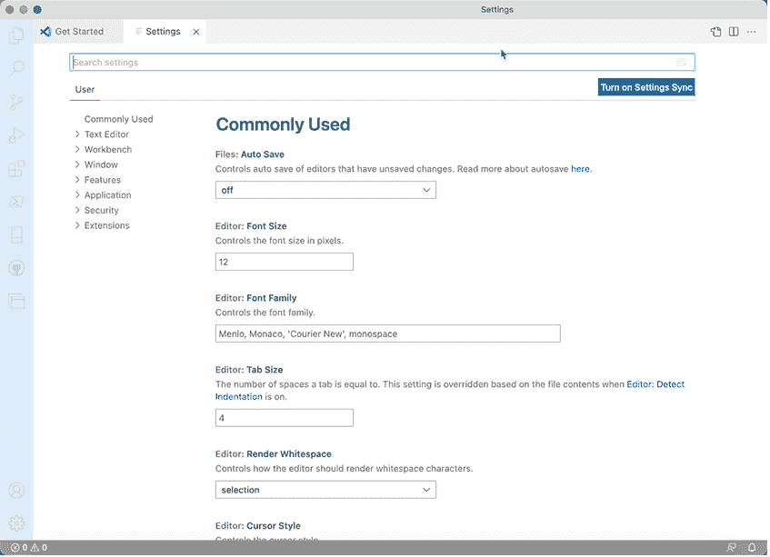

图 2.8 Visual Studio Code 的设置页面。我们已概述了查看设置 JSON 版本的位置。

您可能会注意到我们在截图中突出显示了一个按钮。如果您点击此按钮，您将获得您已设置的设置的 JavaScript 对象表示法（JSON）。如果您不熟悉 JSON，不要担心。您可以使用常规设置窗口执行 JSON 视图可以做的几乎所有操作。

表 2.1 显示了一组您可以直接粘贴到搜索框中并根据您的喜好配置的常用设置。

表 2.1 推荐设置

| 设置 | 描述 |
| --- | --- |
| Tab Completion | Tab 完成设置有助于复制您在常规终端中从 PowerShell 获得的经验。您将在稍后了解更多关于这个概念的信息，但您可能会发现这个设置很有用。 |
| Terminal.Integrated.Shell.WindowsTerminal.Integrated.Shell.OSX Terminal.Integrated.Shell.Linux | 如果您记得在本章前面的内容，当我们按下 Visual Studio Code 终端部分的“+”号时，它会打开 Bash。这是因为 macOS 和 Linux 的默认终端是 Bash。您可以通过将此设置更改为 `pwsh` 来将其更改为 PowerShell。 |
| Files.Default Language | 当您在 Visual Studio Code 中打开新文件时，它假定它是纯文本。您可以通过更改默认语言设置来更改此行为。将此更改为 `powershell` 将确保新文件将是 PowerShell 文件，并为您提供所有 PowerShell 扩展功能。 |

您还可以更改关于 Visual Studio Code 的另一件事，那就是颜色主题。默认的深色主题很漂亮，但如果您想寻找一个完美匹配的主题，那么您有很多选择。更改起来很简单——我们只需要打开命令面板。为此，在 macOS 上按 CMD+SHIFT+P，在 Windows/Linux 上按 CTRL+SHIFT+P（或者您可以在任一平台上按 F1）。

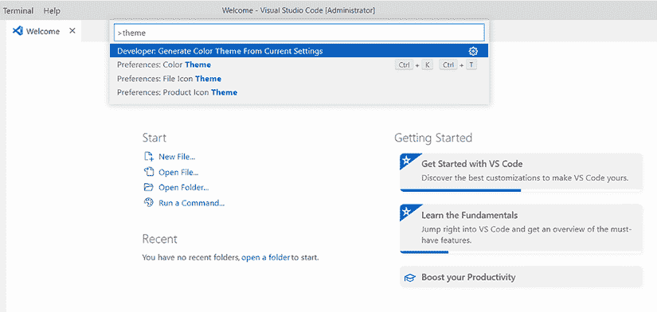

图 2.9 Visual Studio Code 的命令面板。搜索您要执行的操作。

命令面板（图 2.9）是 Visual Studio Code 最有用的功能之一，因为它允许你搜索可以执行的操作。我们想要执行的操作是“更改颜色主题”，所以让我们在命令面板中搜索`theme`。你应该会看到一个名为“首选项：颜色主题”的选项——点击它。这将给你一个可用的主题选择列表（图 2.10）。使用箭头键浏览主题；你会注意到 Visual Studio Code 的主题会自动更新，这样你可以在提交之前看到你将得到什么。

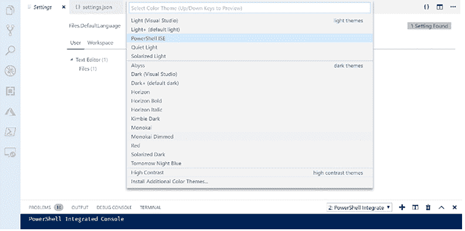

图 2.10 Visual Studio Code 中的主题选择

列表中的大多数是 Visual Studio Code 自带的默认主题；然而，PowerShell ISE 主题是随着 PowerShell 扩展一起提供的。你可以在扩展市场中搜索更多酷炫的主题（我们个人喜欢 Horizon 主题，但那只是我们个人喜好！），通过在列表中选择“安装更多颜色主题”项。

现在试试看对于本书的剩余部分，我们将假设你在使用带有 PowerShell 扩展的 Visual Studio Code，而不是其他脚本编辑器来编写或检查脚本。如果你愿意，可以配置设置和你的颜色主题。如果你决定在终端应用程序中使用 PowerShell，你也会做得很好——本书中的大多数内容仍然有效。如果有什么是仅控制台或仅编辑器特有的，我们会告诉你。

## 2.5 再次是打字课

PowerShell 是一个命令行界面，这意味着你将进行大量的输入。输入会留下出错的空间——打字错误。幸运的是，PowerShell 应用程序都提供了帮助最小化打字错误的方法。

现在试试看以下示例在书中无法展示，但看到它们在实际操作中的效果是很有趣的。考虑在你的 shell 副本中跟随操作。

控制台应用程序支持在四个区域进行 Tab 补全：

+   输入`Get-P`并多次按 Tab 键。你会注意到一个可能的补全列表。随着你输入更多，这个列表会缩小，当 PowerShell 可以猜测它必须是一个特定的命令时，它会为你完成它。

+   输入`Dir`，然后一个空格，然后`/`，再按 Tab 键。PowerShell 会显示你可以从该目录深入查看的文件和文件夹。

+   输入`Get-Proc`并按 Tab 键。然后输入一个空格和一个连字符（`-`）。开始按 Tab 键以查看 PowerShell 为此参数提供的可能补全。你也可以输入参数名称的一部分（例如，`-E`），然后按 Tab 键两次以查看匹配的参数。按 Esc 键以清除命令行。

+   输入`New-I`并按 Tab 键。输入一个空格，然后`-I`，再按 Tab 键。PowerShell 会显示该参数的有效值。这仅适用于具有预定义允许值集的参数（该集合称为*枚举*）。再次按 Esc 键以清除命令行；你还不希望运行该命令。

使用 PowerShell 扩展的 Visual Studio Code 提供的编辑器面板类似于，甚至优于 tab 完成功能：IntelliSense。这个功能在所有四种与 tab 完成相同的情况下运行，除了你将得到一个酷炫的小弹出菜单，就像图 2.11 中所示的那样。使用你的箭头键向上或向下滚动，找到你想要的项，按 Tab 或 Enter 键选择它，然后继续输入。

警告 在 PowerShell 中输入时，**非常、非常、非常、非常、非常**重要的是要**非常、非常、非常、非常**准确。在某些情况下，一个空格、引号，甚至回车符的错误都可能导致一切失败。如果你遇到错误，请仔细检查你输入的内容。

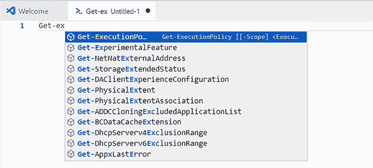

图 2.11 IntelliSense 在 Visual Studio Code 中使用 PowerShell 扩展时，就像 tab 完成一样工作。它还会显示你正在完成的项的相关信息（如果有的话）。

## 2.6 这是哪个版本？

使用 PowerShell，有一个简单的方法来检查你的版本。输入 `$PSVersionTable` 并按 Enter 键：

```
PS /Users/steve> $PSVersionTable
Name                           Value
----                           ----- 
PSVersion                      7.1.3 
PSEdition                      Core
GitCommitId                    7.1.3
OS                             Linux 4.18.0-20-generic #21~18.04.1-Ubuntu...
Platform                       Unix
WSManStackVersion              3.0 
SerializationVersion           1.1.0.1 
PSCompatibleVersions           {1.0, 2.0, 3.0, 4.0...} 
PSRemotingProtocolVersion      2.3
```

你将立即看到与 PowerShell 相关的每一项技术的版本号，包括 PowerShell 本身。如果这不起作用，或者它没有显示 `PSVersion` 为 7.0 或更高版本，那么你使用的 PowerShell 版本不适合这本书。请参考本章前面的部分（2.2、2.3 和 2.4，取决于你的操作系统）以获取获取最新版本 PowerShell 的说明。

现在试试看 不要再等待，开始使用 PowerShell。首先检查你的版本号，确保它至少是 7.1。如果不是，请不要继续，直到你安装了至少 v7.1。

## 2.7 实验室

因为这是本书的第一个实验，我们将花一点时间来描述这些实验应该如何工作。对于每个实验，我们给你一些你可以尝试自己完成的任务。有时我们会提供一两个提示，帮助你找到正确的方向。从那里开始，你就自由发挥了。

我们绝对保证，完成每个实验所需了解的一切要么在同一章中，要么在前面的章节中介绍（之前介绍的信息是我们最有可能给你提示的内容）。我们并不是说答案显而易见；通常，一个章节会教你如何自己发现某些东西，你必须通过这个发现过程来找到答案。这可能看起来很令人沮丧，但强迫自己这样做将绝对使你在长期使用 PowerShell 时更加成功。我们保证。

请记住，您可以在每个章节的末尾找到示例答案。我们的答案可能不会与您的答案完全一致，而且随着我们转向更复杂的内容，这一点将变得越来越明显。您经常会发现 PowerShell 提供了六种或更多方式来完成几乎任何任务。我们将向您展示我们最常用的方法，但如果您找到了不同的方法，您并没有做错。任何能完成任务的方法都是正确的。

注意：对于这个实验，只要您安装了 PowerShell 7.1 或更高版本，您就可以在任何运行 Windows 10、macOS 或 Linux 的机器上完成它。

我们将从简单开始：我们只想确保您已经将控制台和带有 PowerShell 扩展的 Visual Studio Code 设置好，以满足您的需求。请按照以下五个步骤操作：

1.  如果您还没有下载和安装所有内容，请先完成这一步。

1.  在您的终端应用程序中（您可能需要查找一下！）和在 Visual Studio Code 中（提示提示……这是一个设置！）配置字体和文本大小。

1.  在 Visual Studio Code 中，最大化控制台面板；根据您的意愿删除或保留命令资源管理器。

1.  在这两个应用程序中，输入一个单引号 (`'`) 和一个反引号 (``` ` ```)，并确保您能轻松地区分它们。在美式键盘上（至少是这样），反引号键与波浪号 (`~`) 字符在同一键上，位于 Esc 键下方。

1.  还请输入括号 `( )`、方括号 `[ ]`、尖括号 `< >` 和花括号 `{}`，以确保您选择的字体和大小显示良好，这样所有这些符号都可以立即区分开来。如果对哪些符号是哪些符号存在视觉上的混淆，请更改字体或选择更大的字体大小。

我们已经向您介绍了如何完成这些步骤中的大多数，所以您不需要检查这个实验的任何答案，只需确保您已经完成了所有五个步骤。
