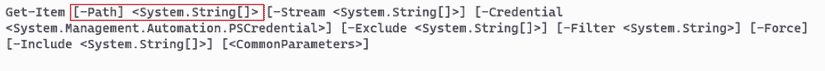
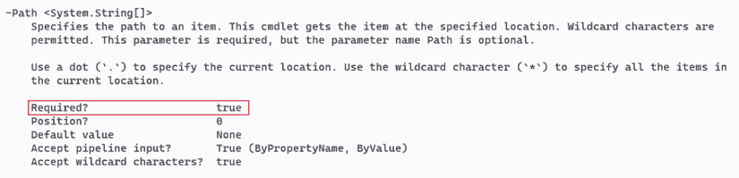

# 3 使用帮助系统

在第一章中，我们提到可发现性是使图形用户界面（GUIs）更容易学习和使用的关键特性，而像 PowerShell 这样的命令行界面（CLIs）通常更难，因为它们缺乏这些可发现性特性。事实上，PowerShell 具有出色的可发现性特性——但它们并不那么明显。其中一个主要的可发现性特性是其帮助系统。

## 3.1 帮助系统：如何发现命令

请耐心等待一分钟，让我们站在肥皂箱上向你们布道。我们从事的是一个不太重视阅读的行业，尽管我们确实有一个我们巧妙地传递给用户的缩写，当我们希望他们能够*阅读友好的手册*时——RTFM。大多数管理员倾向于直接跳入，依赖诸如工具提示、上下文菜单等——那些*GUI*可发现性工具——来弄清楚如何做某事。我们通常就是这样工作的，我们想象你们也是这样做的。但让我们明确一点：

如果你不愿意阅读 PowerShell 的帮助文件，你将无法有效地使用 PowerShell。你将无法学会如何使用它；你将无法学会如何使用它来管理其他服务，如 Azure、AWS、Microsoft 365 等；你不妨就坚持使用 GUI。

这就是我们所能做到的最清晰的表达。这是一个直截了当的陈述，但它绝对是真实的。想象一下，在没有工具提示、菜单和上下文菜单的帮助下尝试了解 Azure 虚拟机或任何其他管理门户。试图在不阅读和理解帮助文件的情况下学习使用 PowerShell 是一回事。这就像试图在没有阅读手册的情况下组装来自百货商店的 DIY 家具一样。你的体验将会是令人沮丧、困惑且无效的。那么，为什么还要这样做呢？

如果你需要执行一个任务但不知道使用什么命令，帮助系统就是你要找到那个命令的方式。在前往你最喜欢的搜索引擎之前，先从帮助系统开始。

如果你运行一个命令并遇到错误，帮助系统将向你展示如何正确运行该命令，以免出错。如果你想将多个命令链接起来以执行复杂任务，帮助系统将告诉你每个命令如何与其他命令连接。你不需要在 Google 或 Bing 上搜索示例；你需要学会如何使用命令本身，这样你就可以创建自己的示例和解决方案。

我们意识到我们的布道可能有点过于强硬，但 90%我们在论坛上看到用户遇到的问题，如果这些人能抽出几分钟时间坐下来，深呼吸，阅读帮助文件，这些问题中的许多都可以解决。然后阅读这一章，它全部关于帮助你理解你在 PowerShell 中阅读的帮助。

从现在开始，我们鼓励你阅读帮助文件还有更多原因：

+   尽管我们在示例中展示了许多命令，但我们几乎从不完全展示每个命令的功能、选项和能力，以便更容易理解概念。您应该阅读我们展示的每个命令的帮助，以便熟悉每个命令可以完成的额外操作。

+   在实验室中，我们可能会给您一些关于使用哪个命令来完成任务的提示，但不会给您关于语法的提示。您需要使用帮助系统自行发现这些语法，以便完成实验室的任务。

+   我们向您承诺，掌握帮助系统是成为 PowerShell 专家的关键。不，您在那里不会找到每一个细节，而且很多超级高级的材料并没有在帮助系统中记录，而是在帮助系统之外，但就成为一个有效的日常管理员而言，您需要掌握帮助系统。这本书将使该系统易于理解，并且它将教授帮助中省略的概念，但只会与内置的帮助结合进行。

现在停止说教。

命令与 cmdlet

PowerShell 包含许多类型的可执行命令。有些被称为 *cmdlets*（我们将在下一章中介绍 cmdlets），有些被称为 *函数*，等等。总的来说，它们都是 *命令*，帮助系统与它们都兼容。cmdlet 是 PowerShell 独有的，您运行的许多命令将是 cmdlets。但当我们谈论更通用的可执行实用工具类别时，我们会尽量使用“命令”这个词。

## 3.2 可更新帮助

当您第一次在 PowerShell 中启动帮助时，可能会感到惊讶，因为，嗯，那里没有多少内容。但等等，我们可以解释。

Microsoft 从 PowerShell v3 开始引入了一个新功能，称为 *可更新帮助*。PowerShell 可以从互联网上下载更新、纠正和扩展的帮助。最初，当您请求命令的帮助时，您会得到一个简化的、自动生成的帮助版本，以及如何更新帮助文件的说明，可能如下所示：

```
PS /User/travisp> help Get-Process
NAME
    Get-Process

SYNTAX
    Get-Process [[-Name] <string[]>] [-Module] [-FileVersionInfo]
    [<CommonParameters>]

    Get-Process [[-Name] <string[]>] -IncludeUserName [<CommonParameters>]

    Get-Process -Id <int[]> -IncludeUserName [<CommonParameters>]

    Get-Process -Id <int[]> [-Module] [-FileVersionInfo] [<CommonParameters>]

    Get-Process -InputObject <Process[]> [-Module] [-FileVersionInfo]
    [<CommonParameters>]

    Get-Process -InputObject <Process[]> -IncludeUserName 
  ➥ [<CommonParameters>]

ALIASES
    gps

REMARKS
    Get-Help cannot find the Help files for this cmdlet on this computer. It
    is displaying only partial help.
        -- To download and install Help files for the module that includes
    this cmdlet, use Update-Help.
        -- To view the Help topic for this cmdlet online, type: "Get-Help
    Get-Process -Online" or
           go to https://go.microsoft.com/fwlink/?LinkID=113324.
```

TIP 您可能无法忽视这样一个事实，即您没有安装本地帮助。第一次您请求帮助时，PowerShell 将提示您更新帮助内容。

更新 PowerShell 的帮助应该是您的首要任务。在 Windows PowerShell 中，您需要以“管理员”或“root”等价身份更新帮助。在 PowerShell 6 及更高版本中，您现在可以以当前用户身份更新帮助。打开 PowerShell 并运行 `Update-Help`，几分钟后您就可以顺利完成了。

TIP 如果您没有运行 `en-us` 文化，您可能需要指定 `-UICulture en-US` 以使 `Update-Help` 能够工作。

每个月左右更新帮助文档的习惯非常重要。PowerShell 甚至可以下载非 Microsoft 命令的更新帮助，前提是这些命令的模块位于正确的位置，并且它们已经被编码以包含更新帮助的在线位置（模块是命令添加到 PowerShell 的方式，并在第七章中进行了解释）。

你有未连接到互联网的计算机吗？没问题：去一个已连接的计算机上，使用`Save-Help`获取帮助的本地副本。将其放在文件服务器或网络其他部分可访问的地方。然后使用带有`-Source`参数的`Update-Help`运行，将其指向下载的帮助副本。这样，你的网络上的任何计算机都可以从该中央位置获取更新帮助，而不是从互联网上获取。

帮助是开源的

微软的 PowerShell 帮助文件是开源材料，可在[`github.com/MicrosoftDocs/PowerShell-Docs`](https://github.com/MicrosoftDocs/PowerShell-Docs)找到。这是一个查看最新源代码的好地方，这些源代码可能尚未编译成 PowerShell 可以下载和显示的帮助文件。

## 3.3 求助

PowerShell 提供了一个名为`Get-Help`的 cmdlet，用于访问帮助系统。你可能在网上看到过一些示例，显示人们使用`Help`关键字。实际上，`Help`关键字根本不是一个原生的 cmdlet；它是一个*函数*，是核心`Get-Help` cmdlet 的包装器。

macOS/Linux 上的帮助

当在 macOS 和 Linux 上查看帮助文件时，使用的是操作系统传统的*man*（手册）功能，它通常会“接管”屏幕来显示帮助，完成时返回到你的正常屏幕。

`Help`的工作方式与基本的`Get-Help`非常相似，但它将`Help`的输出管道传输到`less`，允许你以分页视图的方式查看，而不是一次性看到所有帮助信息。运行`Help Get-Content`和`Get-Help Get-Content`会产生相同的结果，但前者是逐页显示。你可以运行`Get-Help Get-Content` `|` `less`来产生分页显示，但这需要输入更多的内容。我们通常只使用`Help`，但我们想让你明白，在幕后有一些技巧在发挥作用。

顺便说一下，有时分页显示可能会让人感到烦恼，因为你已经有了所需的信息，但它仍然要求你按空格键来显示剩余的信息。如果你遇到这种情况，请按`q`取消命令并返回到 shell 提示符。当使用`less`时，`q`始终意味着*退出*。

帮助系统的两个主要目标是：帮助你找到执行特定任务的命令，并在找到这些命令后帮助你学习如何使用它们。

## 3.4 使用帮助查找命令

从技术上来说，帮助系统并不知道 shell 中存在哪些命令。它只知道有哪些帮助主题可用，并且命令可能没有帮助文件，在这种情况下，帮助系统将不知道命令的存在。幸运的是，Microsoft 为它生产的几乎所有 cmdlet 都提供了一个帮助主题，这意味着您通常不会发现差异。此外，帮助系统可以访问与特定 cmdlet 无关的信息，包括背景概念和其他一般信息。

与大多数命令一样，`Get-Help`（因此，`Help`）有几个参数。其中之一——可能是最重要的一个——是`-Name`。此参数指定您想要访问的帮助主题的名称，它是一个位置参数，因此您不必输入`-Name`；您只需提供您正在寻找的名称即可。它还接受通配符，这使得帮助系统在发现命令时非常有用。

例如，假设您想对.NET 对象上的事件进行一些操作。您不知道可能有哪些命令可用，您决定搜索涵盖事件的帮助主题。您可能运行以下两个命令中的任何一个：

```
Help *event*
Help *object*
```

第一个命令会在您的计算机上返回如下列表：

```
       Name                 Category ModuleName

       Get-Event            Cmdlet   Microsoft.PowerShell.Utility
       Get-EventSubscriber  Cmdlet   Microsoft.PowerShell.Utility
       New-Event            Cmdlet   Microsoft.PowerShell.Utility
       Register-EngineEvent Cmdlet   Microsoft.PowerShell.Utility
       Register-ObjectEvent Cmdlet   Microsoft.PowerShell.Utility
       Remove-Event         Cmdlet   Microsoft.PowerShell.Utility
       Unregister-Event     Cmdlet   Microsoft.PowerShell.Utility
       Wait-Event           Cmdlet   Microsoft.PowerShell.Utility
```

注意：在您从其他来源安装了一些模块之后，您可能会注意到命令帮助列表中包括了来自`Az.EventGrid`和`Az.EventHub`等模块的命令（和函数）。即使您还没有将这些模块加载到内存中，帮助系统也会显示所有这些命令，这有助于您发现您可能否则会忽略的计算机上的命令。它将发现安装在正确位置的任何模块中的命令，我们将在第七章中讨论这一点。

前面的列表中的许多 cmdlet 似乎都与事件有关。在您的环境中，您可能还有其他与之无关的命令，或者您可能有“关于”主题，这些主题提供了背景信息（在第 3.6 节中详细讨论）。当您使用帮助系统查找 PowerShell 命令时，尽量使用最广泛的术语进行搜索——`*event*`或`*object*`而不是`*objectevent*`——因为您将获得尽可能多的结果。

当您有一个认为可以完成工作的 cmdlet（例如，在示例中`Register-ObjectEvent`看起来像是您所追求的合适候选）时，您可以对该特定主题请求帮助：

```
Help Register-ObjectEvent
```

不要忘记使用 Tab 键自动完成！作为提醒，它允许您输入命令名称的一部分并按 Tab 键，shell 将使用最接近的匹配项完成您输入的内容。您可以继续按 Tab 键以获取替代匹配项的列表。

现在尝试一下：输入`Help` `Register-`并按 Tab 键。这将匹配几个命令但不会完成。在 Windows 机器上，当您第二次按 Tab 键时，它将不断滚动显示可用的命令。在非 Windows 机器上，如果您按 Tab 键，第二个标签将显示可用的命令列表。

你也可以在 `Help` 命令中使用通配符——主要是 `*` 通配符，它可以代表零个或多个字符。如果 PowerShell 只找到与你输入的匹配的一个结果，它不会显示该单个项目的主题列表。相反，它会显示该项目的具体内容。

现在尝试运行 `Help Get-EventS*`，你应该会看到 `Get-EventSubscriber` 的帮助文件，而不是匹配的帮助主题列表。

如果你一直在 shell 中跟随，你现在应该正在查看 `Get-EventSubscriber` 的帮助文件。这个文件被称为 *概要帮助*，它旨在是命令的简短描述和语法的提醒。当你需要快速刷新对命令用法的记忆时，这些信息很有用，这也是我们将开始解释帮助文件本身的地方。

除此之外

有时候我们想要分享一些信息，虽然很好，但并不是理解 shell 的关键。我们将这些信息放入一个“除此之外”的侧边栏中，就像这样。如果你跳过这些，你会没事；如果你阅读它们，你通常会了解做某事的另一种方法，或者对 PowerShell 有更深入的了解。

我们提到 `Help` 命令不搜索 cmdlet；它搜索帮助主题。因为每个 cmdlet 都有一个帮助文件，所以我们可以说这个搜索会检索相同的结果。但你也可以直接使用 `Get-Command` 命令（或其别名 `gcm`）来直接搜索 cmdlet。

与 `Help` 命令一样，`Get-Command` 也接受通配符——所以你可以运行 `gcm *get*` 来查看所有名称中包含 *get* 的命令。不管好坏，这个列表将包括 cmdlet，还包括像 `wget` 这样的外部命令，这可能并不有用。

更好的方法是使用 `-Noun` 或 `-Verb` 参数。因为只有命令名才有名词和动词，所以结果将仅限于 cmdlet。`Get-Command -Noun *event*` 返回处理事件的 cmdlet 列表；`Get-Command -Verb Get` 返回所有能够检索事物的 cmdlet。你还可以使用 `-CommandType` 参数，指定 cmdlet 类型：`Get-Command *event* -Type cmdlet` 显示所有名称中包含事件的 cmdlet 列表，并且该列表不会包括任何外部应用程序或命令。

## 3.5 解释帮助

PowerShell 的 cmdlet 帮助文件有一套特定的约定。学会理解你所看到的内容是提取这些文件最大信息量和更有效地使用 cmdlet 的关键。

### 3.5.1 参数集和常用参数

大多数命令可以根据需要以多种方式工作。例如，这是 `Get-Item` 帮助的语法部分：

```
SYNTAX
    Get-Item [-Stream <String[]>] [-Credential <PSCredential>] [-Exclude 
  ➥ <String[]>] [-Filter <String>] [-Force] [-Include
    <String[]>] -LiteralPath <String[]> [<CommonParameters>]

    Get-Item [-Path] <String[]> [-Stream <String[]>] [-Credential 
  ➥ <PSCredential>] [-Exclude <String[]>] [-Filter <String>] [-Force]
    [-Include <String[]>] [<CommonParameters>]
```

注意到上一个语法中的命令被列出了两次，这表明该命令支持两个 *参数集*；你可以以两种不同的方式使用该命令。一些参数将在两个集合之间共享。例如，你会发现两个参数集都包括 `-Filter` 参数。但两个参数集将始终至少有一个唯一的参数，该参数仅存在于该参数集中。在这种情况下，第一个集合支持 `-LiteralPath`，它不包括在第二个集合中；第二个集合包含 `-Path` 参数，它不包括在第一个集合中，但两者都可能包含额外的未共享参数。

这就是这样工作的：如果你使用仅包含在一个集合中的参数，你将锁定在该集合中，并且只能使用该集合中出现的附加参数。如果你选择使用 `-LiteralPath`，你不能使用来自其他集合的参数，在这个例子中是 `-Path`，因为它不在第一个参数集中。这意味着 `-Path` 和 `-LiteralPath` 是 *互斥的*——你永远不会同时使用它们，因为它们位于不同的参数集中。

有时可以使用仅在多个集合之间共享的参数来运行命令。在这些情况下，shell 通常会选择第一个列出的参数集。因为每个参数集都意味着不同的行为，了解你正在运行哪个参数集是很重要的。

你会注意到每个 PowerShell 命令的每个参数集都以 `[<CommonParameters>]` 结尾。这指的是一组（在撰写本文时为 11 个）参数，这些参数在每个命令中都是可用的，无论你如何使用该命令。我们将在本书的后面讨论一些这些常见参数，当我们使用它们来完成实际任务时。然而，在本章的后面，我们将向你展示如何了解更多关于这些常见参数的信息，如果你感兴趣的话。

注意，敏锐的读者现在应该已经注意到了我们一些示例中的变化。读者会注意到 `Get-Item` 的帮助布局因 PowerShell 的版本而异。你甚至可能会看到一些新的参数。但我们在解释的基本原理和概念并没有改变。不要纠结于你所看到的帮助可能与我们书中展示的不同。

### 3.5.2 可选和必选参数

你不需要每个参数来使命令运行。PowerShell 的帮助列表以方括号列出可选参数。例如，`[-Credential <PSCredential>]` 表示整个 `-Credential` 参数是可选的。你根本不需要使用它；如果你不使用此参数指定替代凭据，命令可能会默认使用当前用户的默认凭据。这也是为什么 `[<-Common-Parameters>]` 在方括号中的原因：你可以不使用任何常见参数来运行命令。

几乎每个 cmdlet 至少有一个可选参数。你可能永远不需要使用其中的一些参数，而可能每天都会使用其他参数。请记住，当你选择使用一个参数时，你只需输入参数名称的一部分，以便 PowerShell 可以明确地确定你指的是哪个参数。例如，`-F` 对于 `-Force` 来说是不够的，因为 `-F` 也可以表示 `-Filter`。但 `-Fo` 将是 `-Force` 的合法缩写，因为没有其他参数以 `-Fo` 开头。

如果你尝试运行一个命令却忘记了其中一个必选参数怎么办？以 `Get-Item` 的帮助为例，你会看到 `-Path` 参数是必选的。你可以通过参数的整个名称及其值没有被方括号包围来判断。这意味着可选参数可以通过整个参数及其值被方括号包围来识别。尝试运行 `Get-Item` 而不指定文件路径（图 3.1）。



图 3.1 这是 `Get-Item` 的帮助信息，显示路径变量接受由方括号 [ ] 指示的字符串数组。

现在试试看。通过运行 `Get-Item` 而不带任何参数来跟随这个例子。

PowerShell 应该会提示你输入必选的 `-Path` 参数。如果你输入类似 `~` 或 `./` 并按 Enter 键，命令将正确运行。你也可以按 Ctrl-C 来终止命令。

### 3.5.3 位置参数

PowerShell 的设计者知道某些参数会被频繁使用，以至于你不想不断地输入参数名称。这些常用参数通常是 *位置参数*：你可以在不输入参数名称的情况下提供值，只要你把那个值放在正确的位置。你可以通过两种方式识别位置参数：通过语法摘要或完整帮助。

在语法摘要中查找位置参数

你可以在语法摘要中找到第一种方法：参数名称——只有名称——将被方括号包围。例如，看看 `Get-Item` 第二组参数中的前两个参数：

```
[-Path] <String[]> [-Stream <String[]>]...[-Filter <String>]
```

第一个参数 `-Path` 不是可选的。你可以通过参数的整个名称及其值没有被方括号包围来判断。但是参数名称被方括号包围，使其成为位置参数——你可以提供日志名称而不必输入 `-Path`。而且因为该参数在帮助文件中的第一个位置，你知道日志名称是你必须提供的第一个参数。

第二个参数 `-Stream` 是可选的；它及其值都被方括号包围。在这些方括号内，`-Stream` 本身不包含在另一组方括号中，这表明这不是位置参数。如果是位置参数，它看起来应该是 `[[-Stream]` `<string[]>]`。所以，你需要使用参数名称来提供值。

`-Filter` 参数（在语法中稍后出现；运行 `Help Get-Item` 并找到它）是可选的，因为它完全被方括号包围。`-Filter` 名称在方括号中，这告诉你，如果你选择使用该参数，你必须输入参数名称（或者至少是它的一部分）。使用位置参数有一些技巧：

+   混合使用位置参数和需要其名称的参数是可以的。位置参数必须始终位于正确的位置。例如，`Get-Item` `~` `-Filter` `*` 是合法的：`~` 将被传递给 `-Path` 参数，因为该值位于第一个位置，而 `*` 将与 `-Filter` 参数一起使用，因为使用了参数名称。

+   指定参数名称总是合法的，当你这样做时，你输入它们的顺序并不重要。`Get-Item` `-Filter` `*` `-Pa *` 是合法的，因为我们使用了参数名称（在 `-Path` 的情况下，我们对其进行了缩写）。

注意：一些命令，如 `Get-ChildItem`，有多个位置参数。第一个是 `-Path`，然后是 `-Filter`。如果你使用多个位置参数，不要失去它们的顺序。`Get-ChildItem ~ Down*` 将工作，其中 `~` 将附加到 `-Path`，而 `Down*` 将附加到 `-Filter`。`Get-ChildItem Down* ~` 不会得到任何结果，因为 `~` 将附加到 `-Filter`，而且很可能没有项目匹配。

我们将提供一个最佳实践：在你对某个 cmdlet 感到舒适并厌倦了反复输入常用参数名称之前，使用参数名称。之后，使用位置参数来节省你的输入。当需要将命令粘贴到文本文件中以方便重用时，始终使用完整的 cmdlet 名称并输入完整的参数名称——不要使用位置参数和缩写参数名称。这样做使得该文件在未来更容易阅读和理解，而且因为你不必反复输入参数名称（毕竟，你将命令粘贴到文件中是为了这个目的），你不会为自己创造额外的打字工作。

在完整帮助中查找位置参数

我们提到你可以通过两种方式定位位置参数。第二种方式要求你通过使用 `Help` 命令的 `-Full` 参数来打开帮助文件。

现在试试看。运行 `Help Get-Item -Full`。记住，使用空格键一次查看一页帮助文件，如果你想在到达文件末尾之前停止查看，请按 Ctrl-C。现在，翻阅整个文件，这样你可以滚动回来看它。此外，尝试使用 `–Online` 参数，它应该在任何带有浏览器的客户端计算机或服务器上工作。请注意，使用 `–Online` 的成功取决于底层帮助文件的质量。如果文件格式不正确，你可能看不到所有内容。

滚动页面，直到您看到 `-Path` 参数的帮助条目。它应该看起来像图 3.2。



图 3.2 `Get-Item` 命令的帮助中关于 `-path` 变量必需性的片段

在前面的示例中，您可以看到这是一个位置参数，它位于第一个位置，紧随 cmdlet 名称之后，基于 0 位置索引。

我们总是鼓励学生在开始使用 cmdlet 时，专注于阅读完整的帮助文档，而不仅仅是简短的语法提示。阅读帮助文档可以揭示更多细节，包括参数使用的描述。您还可以看到该参数确实接受通配符，这意味着您可以提供一个像 `Down*` 这样的值。您不需要输入项目的名称，例如下载文件夹。

### 3.5.4 参数值

帮助文件还提供了关于每个参数接受输入类型的线索。大多数参数期望某种类型的输入值，这些值将始终跟在参数名称之后，并且与参数名称之间用空格分隔（不是冒号、等号或任何其他字符，尽管有时可能会遇到例外）。在简写语法中，期望的输入类型用尖括号表示，如 `< >`：

```
-Filter <String>
```

在完整的语法中也是同样的方式显示：

```
    -Filter <String>
        Specifies a filter in the format or language of the provider. 
        The value of this parameter qualifies the Path parameter.

        The syntax of the filter, including the use of wildcard characters, 
        depends on the provider. Filters are more efficient than
        other parameters, because the provider applies them when the cmdlet 
        gets the objects rather than having PowerShell filter
        the objects after they are retrieved.

        Required?                    false
        Position?                    named
        Default value                None
        Accept pipeline input?       False
        Accept wildcard characters?  true
```

让我们看看一些常见的输入类型：

+   `String`—一系列字母和数字。这些有时可以包括空格，但如果有，整个字符串必须用引号括起来。例如，像 `/usr/bin` 这样的字符串值不需要用引号括起来，但 `~/book samples` 需要，因为它中间有空格。目前，您可以使用单引号或双引号互换使用，但最好坚持使用单引号。

+   `Int`、`Int32` 或 `Int64`—一个整数（没有小数部分的整数）。

+   `DateTime`—通常，一个可以基于您的计算机区域设置解释为日期的字符串。在美国，这通常类似于 `10-10-2010`，包括月份、日期和年份。

我们将在遇到它们时讨论其他更专业的类型。您还会注意到一些具有更多方括号的值：

```
-Path <String[]>
```

在 `String` 之后并排的方括号并不表示某项是可选的。相反，`String[]` 表示该参数可以接受一个 *数组*、一个 *集合* 或一个 *字符串列表*。在这些情况下，提供单个值总是合法的：

```
Get-Item -Path ~
```

但指定多个值也是合法的。一个简单的方法是提供一个以逗号分隔的列表。PowerShell 将所有以逗号分隔的列表视为值数组：

```
Get-Item -Path ~, ~/Downloads
```

再次强调，任何包含空格的单独值都必须用引号括起来。但整个列表不需要用引号括起来；重要的是只有单独的值需要用引号。以下示例是合法的：

```
Get-Item -Path '~', '~/Downloads'
```

尽管这两个值都不需要用引号括起来，但如果您想使用引号，那也是可以的。但以下是不正确的：

```
Get-Item -Path '~, ~/Downloads'
```

在这种情况下，cmdlet 将寻找名为 `~, ~/Downloads` 的文件，这可能不是您想要的。

您还可以以几种其他方式将值列表提供给参数，包括从文件中读取计算机名称或使用其他 cmdlet。然而，这些技术稍微复杂一些，所以我们将在您学习到一些需要使技巧生效的 cmdlet 之后，在后面的章节中介绍它们。

另一种为参数指定多个值（前提是该参数是必填参数）的方法是根本不指定该参数。与所有必填参数一样，PowerShell 将提示您输入参数值。对于可以接受多个值的参数，您可以输入第一个值并按 Enter 键。然后 PowerShell 将提示您输入第二个值，您可以输入并按 Enter 键完成。继续这样做，直到完成，然后在空白提示符上按 Enter 键，让 PowerShell 知道您已完成。始终可以按 Ctrl-C 键终止命令，如果您不想被提示输入条目。

其他参数，称为 *开关*，根本不需要任何输入值。在缩写语法中，它们看起来如下：

```
[-Force]
```

在完整语法中，它们看起来如下：

```
    -Force [<SwitchParameter>]
        Indicates that this cmdlet gets items that cannot otherwise be accessed, 
        such as hidden items. Implementation varies from
        provider to provider. For more information, see about_Providers 
        (../Microsoft.PowerShell.Core/About/about_Providers.md).
        Even using the Force parameter, the cmdlet cannot override security restrictions.

        Required?                    false
        Position?                    named
        Default value                False
        Accept pipeline input?       False
        Accept wildcard characters?  false
```

`[<SwitchParameter>]` 这一部分确认这是一个开关，并且它不需要输入值。开关永远不会定位；您始终必须输入参数名称（或至少是其缩写版本）。开关始终是可选的，这给了您选择是否使用它们的自由。

例如，`Get-Item .*` 不会显示任何文件，但 `Get-Item .* -Force` 将列出以 `.` 开头的文件列表，因为以 `.` 开头的文件被认为是隐藏的，而 `-Force` 告诉命令包括隐藏文件。

### 3.5.5 查找命令示例

我们倾向于通过例子来学习，这就是为什么我们试图在这本书中尽可能多地包含例子。PowerShell 的设计者知道大多数管理员都喜欢有例子，所以他们将很多例子都内置到了帮助文件中。如果您滚动到 `Get-Item` 帮助文件的末尾，您可能注意到几乎有十种使用该 cmdlet 的例子。

让我们看看一种更简单的方法来获取那些例子，如果您只想看到这些例子的话。使用 `Help` 命令的 `-Example` 参数，而不是 `-Full` 参数：

```
Help Get-Item -Example
```

现在尝试一下：使用这个新参数来获取 cmdlet 的示例。

注意：由于 PowerShell 的起源是 Windows，因此许多例子都使用了 Windows 路径。您应该知道您可以使用 macOS 或 Linux 路径。实际上，PowerShell 不关心您在两个平台上使用 `/` 或 `\` 作为目录分隔符。

我们喜欢这些示例，尽管其中一些可能很复杂。如果一个示例看起来对你来说太复杂，忽略它，现在检查其他示例。或者（始终在非生产计算机上）进行一些实验，看看你是否能弄清楚示例做了什么以及为什么。

## 3.6 访问“关于”主题

在本章前面，我们提到 PowerShell 的帮助系统包括背景主题以及特定 cmdlet 的帮助。这些背景主题通常被称为“关于”主题，因为它们的文件名都以`about_`开头。你也许还记得本章前面提到，所有 cmdlet 都支持一组通用参数。你认为你如何了解更多关于这些通用参数的信息？

现在试试 在继续阅读之前，看看你是否可以使用帮助系统列出通用参数。

你可以从使用通配符开始。由于本书中反复使用了单词*common*，这可能是开始的好关键词：

```
Help *common*
```

这是一个如此好的关键词，实际上它只匹配一个帮助主题：`关于 _ 通用 _ 参数`。该主题会自动显示，因为它是最匹配的。浏览一下文件，你会找到以下 11 个（当本文撰写时）通用参数列表：

```
-Verbose
-Debug
-WarningAction
-WarningVariable
-ErrorAction
-ErrorVariable
-OutVariable
-OutBuffer
-InformationAction
-InformationVariable
-PipelineVaribale
```

文件指出 PowerShell 有两个额外的*风险缓解*参数，但并非每个 cmdlet 都支持这些参数。帮助系统中的关于主题非常重要，但鉴于它们与特定的 cmdlet 无关，它们很容易被忽视。如果你运行`help about*`来列出所有这些主题，你可能会对隐藏在 shell 中的额外文档量感到惊讶。

现在试试 Run the command `get-help about_*` 并查看所有关于主题。现在运行 `get-help about_Updateable_Help`

## 3.7 访问在线帮助

PowerShell 的帮助文件是由普通人编写的，这意味着它们不是没有错误的。除了通过运行`Update-Help`更新帮助文件外，Microsoft 还会在其网站上发布帮助信息。PowerShell 帮助命令的`-Online`参数将尝试打开基于 Web 的帮助信息——即使在 macOS 或 Linux 上！——对于特定的命令：

```
Help Get-Item -Online
```

Microsoft Docs 网站托管了帮助信息，它通常比 PowerShell 本身安装的帮助信息更新。如果你认为你在示例或语法中发现了错误，请尝试查看帮助信息的在线版本。并不是宇宙中的每个 cmdlet 都有在线帮助；这取决于每个产品团队（例如提供 VM 功能的 Azure 计算团队、Azure 存储团队等等）是否提供该帮助。但是当它可用时，它是一个很好的内置功能的补充。

我们喜欢在线帮助，因为它允许我们在 PowerShell 中输入文本时（在浏览器中，帮助信息也格式化得很好）阅读文本。

我们很重要的一点是要指出，自 2016 年 4 月起，Microsoft 的 PowerShell 团队已经开源了他们所有的帮助文件。任何人都可以添加示例、纠正错误，并通常帮助改进帮助文件。这个在线开源项目位于[`github.com/MicrosoftDocs/Powershell-Docs`](https://github.com/MicrosoftDocs/Powershell-Docs)，通常只包括 PowerShell 团队拥有的文档；它不一定包括其他团队生产的 PowerShell 命令的文档。你可以直接联系这些团队，要求他们开源他们的文档！

## 3.8 实验室

注意：对于这个实验室，你需要任何运行 PowerShell 7 的计算机。

我们希望这一章已经传达了掌握 PowerShell 帮助系统的重要性。现在，是时候通过完成以下任务来磨练你的技能了。请记住，以下任务中包含*斜体*的单词，你可以用它们作为完成任务时的线索：

1.  运行`Update-Help`，并确保它无错误地完成，以便你在本地计算机上有一个帮助文件的副本。你需要一个互联网连接。

1.  你能找到任何可以将其他 cmdlet 的输出转换为*HTML*的 cmdlet 吗？

1.  有没有可以将输出重定向到*文件*的 cmdlet？

1.  有多少 cmdlet 可以用于处理*进程*？（提示：记住，所有的 cmdlet 都使用单数名词。）

1.  你可能会使用哪个 cmdlet 来*设置*PowerShell 断点？（提示：PowerShell 特定的名词通常以*PS*为前缀。）

1.  你已经了解到别名是 cmdlet 的昵称。有哪些 cmdlet 可以创建、修改、导出或导入*别名*？

1.  有没有一种方法可以记录你在 shell 中输入的所有内容，并将该记录保存到文本文件中？

1.  获取所有进程可能会让人感到不知所措。你如何通过进程名称获取进程？

1.  有没有一种方法可以告诉`Get-Process`告诉你启动进程的用户？

1.  有没有一种方法可以在远程主机上运行一个*命令*？（提示：现在运行某物的动词是*Invoke*。）

1.  检查`Out-File` cmdlet 的帮助文件。此 cmdlet 创建的文件默认宽度是多少字符？有没有一个参数可以让你改变这个宽度？

1.  默认情况下，`Out-File`会覆盖任何与指定文件名相同的现有文件。有没有一个参数可以防止 cmdlet 覆盖现有文件？

1.  你如何查看在 PowerShell 中定义的所有*别名*的列表？

1.  使用别名和缩写参数名称，你能输入的最短的*命令行*来检索名称中包含*process*的*命令*列表是什么？

1.  有多少 cmdlet 可以处理通用对象？（提示：记住要使用单数名词*object*而不是复数名词*objects*。）

1.  本章简要提到了*数组*。哪个帮助主题可以告诉你更多关于它们的信息？

## 3.9 实验室答案

1.  `Update-Help`

    或者如果你在一天内运行了多次，可以使用以下命令：

    `更新帮助 –强制`

1.  `帮助 html`

    或者，您可以尝试使用`获取命令`：

    `获取命令 –名词 html`

1.  `获取命令 -名词 文件,打印机`

1.  `获取命令 –名词 进程`

    或者

    `帮助 *进程*`

1.  `获取命令 -动词 设置 -名词 psbreakpoint`

    或者如果您不确定名词，可以使用通配符：

    `帮助 *断点*`

    或者

    `帮助 *中断*`

1.  `帮助 *别名*`

    或者

    `获取命令 –名词 别名`

1.  `帮助 转录`

1.  `帮助 获取进程 –参数 名称`

1.  `帮助 获取进程 –参数 包含用户名`

1.  在 SSH 上执行的命令是

    `帮助 执行命令 –参数 主机名`

    或者，通过传统的 Windows 协议执行的命令是

    `帮助 执行命令 –参数 计算机名`

1.  `帮助 输出文件 –完整`

    或者

    `帮助 输出文件 –参数 宽度`

    应该显示 80 个字符作为 PowerShell 控制台的默认值。您也可以使用此参数来更改它。

1.  如果您运行`帮助 输出文件 –完整`并查看参数，您应该看到`-NoClobber`。

1.  `获取别名`

1.  `Gcm -na *process*`

1.  `获取命令 –名词 对象`

1.  `帮助 关于数组`

    或者，您可以使用通配符：

    `帮助 *数组*`
