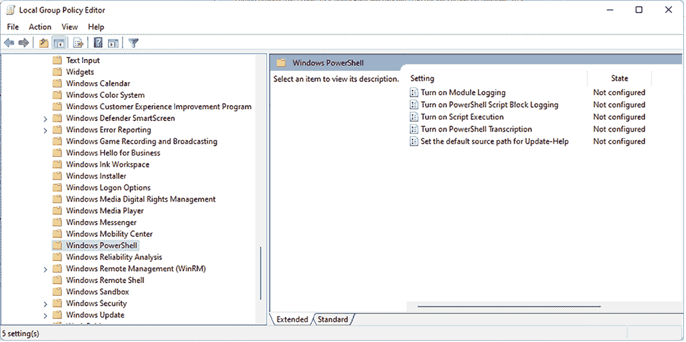
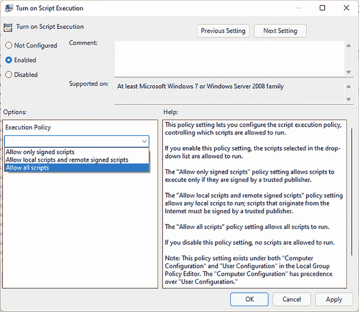
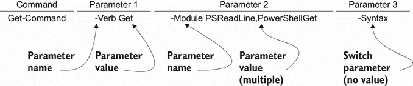
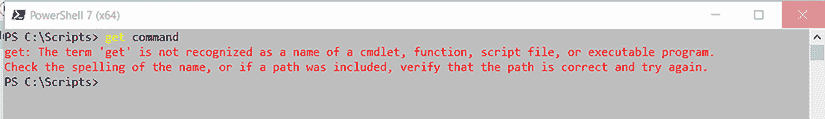
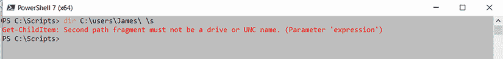

# 4 运行命令

当你开始在网上查看 PowerShell 示例时，很容易产生一种印象，即 PowerShell 是一种基于 .NET 的脚本或编程语言。我们的微软最有价值专家（MVP）获奖者和数百名其他 PowerShell 用户都是非常严肃的极客，他们喜欢深入研究 shell，看看我们能让它做什么。但几乎我们所有人都是从本章开始的地方开始的：运行命令。这就是你将在本章中做的事情：不是脚本编写，也不是编程，而是运行命令和命令行实用程序。

## 4.1 让我们谈谈安全

好的，是时候谈谈房间里的大象了。PowerShell 很棒，PowerShell 真是太棒了。但是，坏人同样喜欢 PowerShell，就像我们一样。确保生产环境的安全是每个人的首要任务。到现在为止，你可能已经开始感受到 PowerShell 的强大之处——你可能想知道所有这些力量是否可能成为安全问题。**可能**会。本节的目标是帮助您了解 PowerShell 如何影响您环境中的安全，以及如何配置 PowerShell 以提供您所需的精确的安全与权力的平衡。

首先，PowerShell 不会在其接触的任何事物上应用任何额外的权限层。PowerShell 使你只能做你已经有权做的事情。如果你不能通过图形控制台在 Active Directory 中创建新用户，你也不会在 PowerShell 中做到。PowerShell 是一种行使你已有权限的另一种方式。

PowerShell 也不是绕过任何现有权限的方法。假设你想将一个脚本部署给你的用户，并且你想让这个脚本执行你的用户通常没有权限执行的操作。这个脚本对他们来说将不起作用。如果你想让你的用户做某事，你需要给他们执行这项操作的权限。PowerShell 只能完成运行命令或脚本的人已经有权执行的事情。

PowerShell 的安全系统并不是为了阻止任何人输入并运行他们有权执行的任何命令。其理念是，欺骗用户输入一个长而复杂的命令有些困难，因此 PowerShell 不会在用户现有权限之外应用任何安全措施。但我们从以往的经验中知道，很容易欺骗用户运行脚本，而这些脚本可能包含恶意命令。这就是为什么 PowerShell 的大部分安全设计都是为了防止用户无意中运行脚本。**无意中**这部分很重要：PowerShell 的安全中没有任何东西是为了阻止一个决心运行脚本的用户。其理念是仅阻止用户被**欺骗**运行来自不受信任来源的脚本。

### 4.1.1 执行策略

PowerShell 包含的第一项安全措施是 *执行策略*。这个全局设置控制 PowerShell 将执行的脚本。Windows 10 的默认设置是受限。在 Windows 服务器上，默认是 `RemotedSigned`，而在非 Windows 设备上的执行策略不被强制执行。Windows 10 设备上的受限设置阻止所有脚本执行。没错：默认情况下，您可以使用 PowerShell 交互式运行命令，但您不能使用它来运行脚本。让我们假设您从互联网上下载了一个脚本。如果您尝试运行它，您将收到以下错误消息：

```
File C:\Scripts\Get-DiskInventory.ps1 cannot be loaded because the execution 
➥ of scripts is disabled on this system. Please see "get-help about_signing"
➥ for more details.
```

通过运行 `Get-ExecutionPolicy` 查看当前的执行策略。您可以通过以下三种方式之一更改执行策略：

+   *通过运行* `Set-ExecutionPolicy` *命令*—这会更改 Windows 注册表的 `HKEY_LOCAL_MACHINE` 部分的设置，通常必须由管理员运行，因为普通用户没有权限写入该部分的注册表。

+   *通过使用组策略对象（GPO**）*—从 Windows Server 2008 R2 开始，包括了对 PowerShell 相关设置的支持。图 4.1 中显示的 PowerShell 设置位于计算机配置 > 策略 > 管理模板 > Windows 组件 > Windows PowerShell 下。图 4.2 显示了策略设置已启用。通过 GPO 配置时，组策略中的设置将覆盖任何本地设置。实际上，如果您尝试运行 `Set-ExecutionPolicy`，它将生效，但警告消息将告诉您，由于组策略覆盖，您的新设置没有效果。

+   *通过手动运行* `PowerShell.exe` *并使用其* `-ExecutionPolicy` *命令行开关*—以这种方式运行时，指定的执行策略将覆盖任何本地设置以及任何组策略定义的设置。如图 4.1 所示。



图 4.1 在组策略对象中查找 Windows PowerShell 设置



图 4.2 在组策略对象中更改 Windows PowerShell 执行策略

您可以将执行策略设置为以下五种设置之一（请注意，组策略对象仅提供以下列表中间三个设置）：

+   `Restricted`—这是默认设置，脚本不会执行。唯一的例外是几个由 Microsoft 提供的脚本，用于设置 PowerShell 的默认配置设置。这些脚本带有 Microsoft 数字签名，如果被修改则不会执行。

+   `AllSigned`—PowerShell 将执行任何由受信任的认证机构（CA）签发的代码签名证书数字签名的脚本。

+   `RemoteSigned`—PowerShell 将执行任何本地脚本，如果远程脚本由受信任的 CA 签发的代码签名证书进行数字签名，它也将执行远程脚本。"远程脚本"是指存在于远程计算机上的脚本，通常通过通用命名约定（UNC）路径访问。标记为来自互联网的脚本也被视为远程脚本。Edge、Chrome、Firefox 和 Outlook 都将下载标记为来自互联网。

+   `Unrestricted`—所有脚本都将运行。

+   `Bypass`—这个特殊设置旨在供将 PowerShell 嵌入其应用程序的应用程序开发人员使用。此设置绕过配置的执行策略，并且仅在托管应用程序提供自己的脚本安全层时使用。你实际上是在告诉 PowerShell，“别担心，我已经有安全措施了。”

等等，什么？

你注意到你可以通过组策略对象设置执行策略，但也可以通过`PowerShell.exe`的参数来覆盖它吗？如果人们可以轻松覆盖 GPO 控制的设置，那么这种设置有什么好处？这强调了执行策略的目的是仅为了保护那些**不知情**的用户免受**无意中**运行**匿名**脚本的风险。

执行策略的目的是不让一个知情用户有意地做任何事情。它不是那种类型的安全设置。

事实上，一个聪明的恶意软件编写者可以同样容易地直接访问.NET Framework 功能，而无需麻烦地使用 PowerShell 作为中间人。或者换句话说，如果一个未经授权的用户拥有你的计算机的管理权限并且可以运行任意代码，那么你已经在麻烦之中了。

微软建议你在需要运行脚本时使用`RemoteSigned`，并且只在必须执行脚本的计算机上使用它。根据微软的说法，所有其他计算机应保持为`Restricted`。他们说，`RemoteSigned`在安全性和便利性之间提供了良好的平衡。"AllSigned"更严格，但要求所有脚本都必须进行数字签名。PowerShell 社区整体上意见分歧，对良好的执行策略有各种看法。现在，我们将遵循微软的建议，并让你自己进一步探索这个话题，如果你愿意的话。

注意：许多专家，包括微软自己的“脚本侠”，建议使用`ExecutionPolicy`的`Unrestricted`设置。他们的观点是，这个功能并不提供一层安全保护，你不应该对自己产生错误的信心，认为它在保护你免受任何威胁。

## 4.2 不编写脚本，而是运行命令

如其名称所示，PowerShell 是一个*shell*。你可能使用过或至少听说过其他 shell，包括 cmd.exe、Bash、Zsh、fish 和 ksh。PowerShell 不仅是一个 shell，还是一个*脚本语言*——但并非像 JavaScript 或 Python 那样。

使用这些语言，就像大多数编程语言一样，你会在文本编辑器或集成开发环境（IDE）前坐下，输入一系列关键字来形成一个脚本。你保存该文件，也许双击它来测试它。PowerShell 可以这样做，但这并不是 PowerShell 的主要使用模式，尤其是当你刚开始的时候。使用 PowerShell，你输入一个命令，添加一些参数来定制命令的行为，按 Enter 键，然后立即看到你的结果。

最终，你会厌倦一遍又一遍地输入相同的命令（及其参数），所以你会把它全部复制粘贴到一个文本文件中。给这个文件一个 .ps1 文件扩展名，你突然就有了 *PowerShell 脚本*。现在，你不再需要一遍又一遍地输入命令，而是运行那个脚本，它会执行里面的任何命令。这通常比用完整的编程语言编写程序要简单得多。实际上，它是一种与 UNIX 管理员多年来使用的模式相似的模板。常见的 UNIX/Linux shell，如 Bash，也有类似的方法：运行命令直到你做对为止，然后将它们粘贴到文本文件中，并称之为 *脚本*。

请不要误解我们：你可以用 PowerShell 实现你需要的任何复杂程度。它确实支持与 Python 和其他脚本或编程语言相同的用法模式。PowerShell 让你可以访问 .NET Core 的全部底层功能，我们见过几乎与在 Visual Studio 中编写的 C# 程序无法区分的 PowerShell “脚本”。PowerShell 支持这些不同的用法模式，因为它旨在对广泛的受众都有用。重点是，尽管它 *支持* 那种复杂程度，但这并不意味着你 *必须* 在那个级别使用它，也不意味着你不能用更少的复杂性达到极高的效率。

这里有一个类比。你可能开车。如果你像我们一样，更换机油是你用汽车做的最复杂的机械任务。我们不是汽车爱好者，不能重新组装发动机。我们也不能做那些你在电影中看到的高速 J 转弯。你永远不会看到我们在汽车商业广告中在封闭赛道上开车。但不是专业特技驾驶员的事实并不会阻止我们在更简单的层面上成为极其有效的驾驶员。总有一天我们可能会决定把特技驾驶作为一项爱好（我们的保险公司会非常高兴），到那时我们需要学习更多关于汽车如何工作的知识，掌握一些新技能，等等。这个选择总是存在的，让我们有机会成长。但到目前为止，我们对我们作为普通驾驶员所能完成的事情感到满意。

现在，我们将坚持作为普通的“PowerShell 驾驶员”，在较低复杂性的层面上操作 shell。信不信由你，处于这个级别的用户是 PowerShell 的主要目标受众，你会发现你可以在不超出这个级别的情况下做很多令人难以置信的事情。你所需要做的就是掌握在 shell 中运行命令的能力，然后你就上路了。

## 4.3 命令的结构

图 4.3 显示了一个复杂 PowerShell 命令的基本结构。我们称这为命令的 *完整形式* 语法。这里我们展示了一个相对复杂的命令，这样你可以看到所有可能出现的元素。



图 4.3 PowerShell 命令的结构

为了确保你完全熟悉 PowerShell 的规则，让我们更详细地介绍前一个图中的每个元素：

+   cmdlet 名称是 `Get-Command`。PowerShell cmdlet 总是采用这种动词-名词的命名格式。我们将在下一节中更详细地解释 cmdlet。

+   第一个参数名称是 `-Verb`，并且被赋予的值是 `Get`。因为该值不包含任何空格或标点符号，所以它不需要用引号括起来。

+   第二个参数名称是 `-Module`，并且被赋予两个值：`PSReadLine` 和 `PowerShellGet`。这些值以逗号分隔，并且因为这两个值都不包含空格或标点符号，所以这两个值都不需要用引号括起来。

+   最后一个参数 `-Syntax` 是一个切换参数。这意味着它不需要值；指定参数就足够了。

+   注意，命令名称和第一个参数之间必须有一个强制性的空格。

+   参数名称始终以破折号 (`-`) 开头。

+   参数名称之后和参数的值与下一个参数名称之间必须有一个强制性的空格。

+   在参数名称前缀的破折号 (`-`) 和参数名称本身之间没有空格。

+   这里没有任何内容是大小写敏感的。

习惯这些规则。开始对准确、整洁的输入敏感。注意空格、破折号和其他规则将最大限度地减少 PowerShell 向你抛出的愚蠢错误。

## 4.4 cmdlet 命名约定

首先，让我们讨论一些术语。据我们所知，我们是在日常对话中唯一使用这些术语的人，但我们使用得很一致，所以我们不妨解释一下：

+   一个 *cmdlet* 是一个本地的 PowerShell 命令行实用程序。这些只存在于 PowerShell 中，并且是用如 C# 这样的 .NET Core 语言编写的。*cmdlet* 这个词是 PowerShell 独有的，所以如果你在你的首选搜索引擎中添加它作为搜索关键词，你得到的结果将主要是与 PowerShell 相关的。这个词的发音是 *command-let*。

+   一个 *函数* 可以与 cmdlet 类似，但与用 .NET 语言编写不同，函数是用 PowerShell 自己的脚本语言编写的。

+   一个 *应用程序* 是任何类型的可执行外部程序，包括如 `ping` 和 `ipconfig` 这样的命令行实用程序。

+   *命令* 是我们用来指代上述任何或所有术语的通用术语。

微软为 cmdlet 建立了一个命名约定。同样的命名约定 *应该* 也用于函数，尽管微软无法强迫除其员工之外的人遵守该规则。

规则是这样的：名称以标准动词开头，例如 `Get` 或 `Set` 或 `New` 或 `Pause`。你可以运行 `Get-Verb` 来查看批准的动词列表（你会看到大约 100 个，尽管只有大约 12 个是常见的）。动词之后是一个破折号，后面跟着一个单数名词，例如 `Job` 或 `Process` 或 `Item`。开发者可以自己创造名词，因此没有 `Get-Noun` cmdlet 来显示它们。

这条规则有什么大不了的？好吧，假设我们告诉你有一些名为 `Start-Job`、`Get-Job`、`Get-Process`、`Stop-Process` 等的 cmdlet。你能猜出在您的机器上启动新进程的命令是什么吗？你能猜出修改 Azure 虚拟机 (VM) 的命令是什么吗？如果你猜的是 `Start-Process`，那么第一个就猜对了。如果你猜的是 `Set-VM`，你很接近了：它是 `Set-AzVM`，你可以在 Az.Compute 模块中找到这个命令（我们将在第七章中介绍模块）。所有的 Azure 命令都使用相同的 `Az` 前缀，后面跟着命令所操作的名词。重点是，通过使用有限动词集的这种一致命名约定，你可以猜测命令名称，然后你可以使用 `Help` 或 `Get-Command`，结合通配符，来验证你的猜测。这样，你就可以更容易地找出所需的命令名称，而无需每次都跑到 Google 或 Bing 上去。

注意：并非所有所谓的动词都是动词。尽管微软官方使用术语 *verb-noun 命名约定*，但你也会看到像 `New`、`Where` 这样的“动词”。你会习惯它们的。

## 4.5 别名：命令的昵称

尽管 PowerShell 命令名称可以很优雅且一致，但它们也可以很长。像 `Remove-AzStorageTableStoredAccessPolicy` 这样的命令名称要输入很多，即使有自动补全功能也是如此。尽管命令名称很清晰——看一眼，你大概能猜出它做什么——但它要输入的字符实在太多了。

这就是 PowerShell 别名的作用所在。别名不过是命令的一个昵称。厌倦了输入 `Get-Process`？试试这个：

```
PS /Users/james> Get-Alias -Definition "Get-Process"
Capability      Name
----------      ----
Cmdlet          gps -> Get-Process
```

现在你知道了 `gps` 是 `Get-Process` 的别名。

当使用别名时，命令的工作方式相同。参数相同；一切都是相同的——只是命令名称更短。

如果你正在查看一个别名（互联网上的人倾向于像我们都记住了数百个内置别名一样使用它们），却无法弄清楚它是什么，请寻求帮助：

```
PS /Users/james> help gps
NAME
    Get-Process
SYNOPSIS
    Gets the processes that are running on the local computer.
SYNTAX
    Get-Process [[-Name] <String[]>] [-FileVersionInfo] [-Module]
    [<CommonParameters>]
    Get-Process [-FileVersionInfo] -Id <Int32[]> [-Module] 
    [<CommonParameters>]
    Get-Process [-FileVersionInfo] -InputObject <Process[]> [-Module] 
    [<CommonParameters>]
    Get-Process -Id <Int32[]> -IncludeUserName [<CommonParameters>]
    Get-Process [[-Name] <String[]>] -IncludeUserName [<CommonParameters>]
    Get-Process -IncludeUserName -InputObject <Process[]>
  ➥ [<CommonParameters>]
```

当需要关于别名帮助时，帮助系统将始终显示完整命令的帮助，这包括命令的完整名称。

不仅如此

您可以使用 `New-Alias` 创建自己的别名，使用 `Export-Alias` 导出别名列表，或者甚至使用 `Import-Alias` 导入之前创建的别名列表。当您创建一个别名时，它只持续到您的当前 shell 会话。一旦关闭窗口，它就会消失。这就是为什么您可能想要导出它们，以便在另一个 PowerShell 会话中使用。

我们倾向于避免创建和使用自定义别名，因为它们只对创建它们的人可用。如果某人无法查找 `xtd` 做什么，我们就会造成混淆和不兼容。

而 `xtd` 什么也不做。这是我们编造的一个假别名。

我们必须指出，由于 PowerShell 现在可在非 Windows 操作系统上使用，因此其关于*别名*的概念与 Bash 中的别名略有不同。在 Bash 中，别名可以是运行包含大量参数的命令的一种快捷方式。PowerShell 的行为并非如此。别名*仅*是命令名的昵称，别名不能包含任何预定义的参数。

## 4.6 使用快捷方式

这就是 PowerShell 变得复杂的地方。我们很乐意告诉您，到目前为止我们所展示的只是做事的唯一方法，但我们会撒谎。不幸的是，您将不得不在互联网上寻找（好吧，重新利用）别人的例子，您需要知道您在查看什么。

除了别名，即命令名的简短版本之外，您还可以使用参数来缩短操作。您有三种方法来做这件事，每种方法都可能比前一种更令人困惑。

### 4.6.1 截断参数名称

PowerShell 不会强迫您输入完整的参数名称。如您在第三章中可能记得的，例如，您可以使用 `-comp` 而不是 `-ComputerName`。规则是您必须输入足够多的名称，以便 PowerShell 能够区分它。如果有 `-ComputerName` 参数、`-Common` 参数和 `-Composite` 参数，您至少需要输入 `-compu`、`-comm` 和 `-compo`，因为这是唯一识别每个参数所需的最小字母数。

如果您必须使用快捷方式，这是一个不错的选择，如果您记得在输入最小长度的参数后按 Tab 键，以便 PowerShell 为您完成剩余的输入。

### 4.6.2 使用参数名称别名

参数也可以有自己的别名，尽管它们可能非常难以找到，因为它们没有在帮助文件或其他方便的地方显示。例如，`Get-Process` 命令有 `-ErrorAction` 参数。要发现其别名，您运行以下命令：

```
PS /Users/james> (get-command get-process | select -Expand 
➥ parameters).erroraction.aliases
```

我们已经加粗了命令和参数名称；用您好奇的任何命令和参数替换这些。在这种情况下，输出显示 `-ea` 是 `-ErrorAction` 的别名，因此您可以运行以下命令：

```
PS /Users/james> Get-Process -ea Stop
```

完成提示将显示 `-ea` 别名；如果您输入 `Get-Process -e` 并开始按 Tab 键，它就会出现。但该命令的帮助文档根本不显示 `-ea`，完成提示也不表明 `-ea` 和 `-ErrorAction` 是同一件事。

注意：这些被称为 *通用参数*。您可以通过运行命令 `Get-Help about_CommonParameters` 来了解更多关于它们的信息。

### 4.6.3 使用位置参数

当您在帮助文件中查看命令的语法时，您可以轻松地识别位置参数：

```
SYNTAX
    Get-ChildItem [[-Path] <string[]>] [[-Filter] <string>] [-Include 
  ➥ <string[]>] [-Exclude <string[]>] [-Recurse] [-De
    pth <uint>] [-Force] [-Name] [-Attributes {ReadOnly | Hidden | System | 
  ➥ Directory | Archive | Device | Normal | Tem
    porary | SparseFile | ReparsePoint | Compressed | Offline | 
  ➥ NotContentIndexed | Encrypted | IntegrityStream | NoScr
    ubData}] [-FollowSymlink] [-Directory] [-File] [-Hidden] [-ReadOnly] 
[-System] [<CommonParameters>]
```

在这里，`-Path` 和 `-Filter` 都是位置参数，您知道这一点是因为参数名称和接受的输入包含在方括号内。更详细的解释可以在完整帮助文档中找到（在这种情况下是 `help Get-ChildItem -Full`），其内容如下：

```
-Path <String[]>
    Specifies a path to one or more locations. Wildcards are
    permitted. The default location is the current directory (.).
    Required?                    false
    Position?                    0
    Default value                Current directory
    Accept pipeline input?       true (ByValue, ByPropertyName)
    Accept wildcard characters?  True
```

这是一个明确的指示，说明 `-Path` 参数位于位置 0，这意味着它是 cmdlet 后的第一个参数。对于位置参数，您不需要输入参数名称；您可以在正确的位置提供其值。例如：

```
PS /Users/james> Get-ChildItem /Users
    Directory: /Users
Mode                LastWriteTime     Length Name
----                -------------     ------ ----
d----         3/27/2016  11:20 AM            james
d-r--         2/18/2016   2:06 AM            Shared
```

这与以下内容相同：

```
PS /Users/james> Get-ChildItem -Path /Users
    Directory: /Users
Mode                LastWriteTime     Length Name
----                -------------     ------ ----
d-----         3/27/2019  11:20 AM            james
d-----         2/18/2019   2:06 AM            Shared
```

位置参数的问题在于您需要记住每个参数的位置。在您能够添加任何命名（非位置）参数之前，您必须首先以正确的顺序输入所有位置参数。如果您搞错了参数顺序，命令就会失败。对于像 `Dir` 这样的简单命令，您可能已经使用了多年，输入 `-Path` 会感觉有些奇怪，而且几乎没有人这样做。但对于更复杂的命令，可能连续有三个或四个位置参数，记住每个参数的位置可能会很困难。

例如，这个版本有点难以阅读和理解：

```
PS /Users/james> move file.txt /Users/james/
```

使用完整 cmdlet 名称和参数名称的这个版本更容易理解：

```
PS /Users/james> move-item -Path /tmp/file.txt -Destination /Users/james/
```

当您使用参数名称时，这种将参数按不同顺序排列的版本是允许的：

```
PS /Users/james> move -Destination /Users/james/ -Path /tmp/file.txt
```

我们倾向于不建议使用位置（未命名）参数，除非您在命令行上快速地执行一些粗略的工作。在所有将持久存在的操作中，例如 PowerShell 脚本文件或博客文章，都应包含所有参数名称。在这本书中，我们尽可能这样做，但在一些必须缩短命令行以适应打印页面的情况下，我们会这样做。

## 4.7 对外部命令的支持

到目前为止，您在 shell 中运行的（至少是我们建议您运行的）所有命令都是内置 cmdlet。在您的 Windows 机器上，PowerShell 内置了超过 2,900 个 cmdlet，在您的 Linux 或 macOS 机器上则超过 200 个。您可以添加更多——例如 Azure PowerShell、AWS PowerShell 和 SQL Server 等产品都附带包含数百个额外 cmdlet 的插件。

但你不仅限于 PowerShell cmdlets。你也可以使用你可能已经使用了多年的相同外部命令行工具，包括`ping`、`nslookup`、`ifconfig`或`ipconfig`等等。因为这些不是本地的 PowerShell cmdlets，所以你使用它们的方式和你一直使用的方式相同。现在就试试几个老牌的喜欢的工具吧。

在非 Windows 操作系统上也是同样的情况。你可以使用`grep`、`bash`、`sed`、`awk`、`ping`以及其他你可能拥有的现有命令行工具。它们将正常运行，PowerShell 将以你的旧 shell（例如 Bash）相同的方式显示它们的结果。

现在试试运行一些之前使用过的外部命令行工具。它们是否按预期工作？是否有任何失败的情况？

这一部分说明了重要的一课：使用 PowerShell 时，Microsoft（可能是有史以来第一次）并没有说，“你必须从头开始，重新学习一切。”相反，Microsoft 说的是，“如果你已经知道如何做某事，就继续那样做。我们将努力为你提供更好、更完整的工具，但你所知道的东西仍然会有效。”

在某些情况下，Microsoft 提供的工具比一些现有的、较旧的工具更好。例如，本地的`Test-Connection` cmdlet 提供了比旧的、外部的`ping`命令更多的选项和更灵活的输出。但如果你知道如何使用`ping`，并且它解决了你的需求，那就继续使用它。在 PowerShell 内部它也能正常工作。

话虽如此，我们不得不传达一个残酷的事实：并非每个外部命令都能在 PowerShell 内部完美运行，至少不是不需要你稍作调整。这是因为 PowerShell 的解析器——读取你输入的内容并试图弄清楚你想要 shell 做什么的那部分 shell——并不总是猜得正确。有时你会输入一个外部命令，PowerShell 会出错，开始输出错误信息，并且通常无法正常工作。

例如，当外部命令有很多参数时，事情可能会变得复杂——这就是你看到 PowerShell 出错最多的地方。我们不会深入探讨为什么它会这样工作，但这里有一个运行命令的方法，可以确保其参数能够正确工作：

```
$exe = "func"
$action = "new"
$language = "powershell"
$template = "HttpTrigger"
$name = "myFunc"
& $exe $action -l $language -t $template -n $name
```

这假设你有一个名为`func`的外部命令。（这个现实生活中的命令行工具用于与 Azure Functions 交互。）如果你从未使用过它或者没有它，那没关系；大多数老式的命令行工具工作方式相同，所以这仍然是一个很好的教学示例。它接受几个参数：

+   "new"在这里是指你想要执行的操作，而`–new`、`init`、`start`和`logs`是选项。

+   `-l`是指你希望函数使用的语言。

+   `-t`是指你想要使用的模板。

+   `-n`是指函数的名称。

我们所做的是将所有各种元素——可执行路径和名称，以及所有参数值——放入占位符中，这些占位符以 `$` 字符开始。这迫使 PowerShell 将这些值视为单个单元，而不是尝试解析它们以查看是否包含命令或特殊字符。然后我们使用了调用运算符 (`&`)，传递给它可执行名称、所有参数以及参数的值。这种模式几乎适用于任何在 PowerShell 中运行时脾气不好的命令行工具。

听起来很复杂吗？好吧，这里有一些好消息：在 PowerShell v3 及以后的版本中，你不必那么麻烦。只需在前面加上两个连字符和一个百分号，PowerShell 就不会尝试解析它；它将直接传递到你正在使用的命令行工具。为了绝对清楚，这意味着你将无法将变量作为参数值传递。

这里有一个快速示例，说明什么会失败：

```
PS /Users/james> $name = "MyFunctionApp"
PS /Users/james> func azure functionapp list-functions --% $name

Can't find app with name "$name"
```

我们尝试运行命令行工具 `func` 来列出所有名为 `"MyFunctionApp"` 的 Azure 函数，但如果我们明确指出我们想要什么，PowerShell 将将所有参数传递给底层命令，而不会尝试对它们做任何事情：

```
PS /Users/james> func new -t HttpTrigger -n --% "MyFunc"
Select a template: HttpTrigger
Function name: [HttpTrigger] Writing /Users/tyler/MyFuncApp/MyFunc/run.ps1
Writing /Users/tyler/MyFuncApp/MyFunc/function.json
The function "MyFunc" was created successfully from the "HttpTrigger" 
➥ template.
PS /Users/james>
```

希望这不会是你要经常做的事情。

## 4.8 处理错误

在开始使用 PowerShell 的时候，你不可避免地会看到一些难看的红色文字——甚至在你成为专家级 shell 用户之后，可能时不时也会遇到。我们都有过这种情况。但不要让红色文字让你感到压力。（就我个人而言，它让我想起了高中英语课和写得不好的作文，所以“压力”这个词用得有点轻了。）

除了令人警觉的红色文字外，PowerShell 的错误消息在多年中得到了极大的改进（这很大程度上要归功于错误消息也是开源的）。例如，如图 4.4 所示，它们试图显示 PowerShell 碰到的确切问题。



图 4.4 解释 PowerShell 错误消息

大多数错误消息都很容易理解。在图 4.4 中，一开始就说了，“你输入了 `get`，我不知道那是什么意思。”那是因为我们输入了错误的命令名：它应该是 `Get-Command`，而不是 `Get` `Command`。哎呀。图 4.5 呢？



图 4.5 什么是“第二个路径片段”？

图 4.5 中的错误消息“第二个路径片段不能是驱动器或 UNC 名称”令人困惑。什么第二个路径？我们没有输入第二个路径。我们输入了一个路径，`C:\Users\James` 和一个命令行参数，`\s`。对吗？

嗯，不是这样。解决这类问题最简单的方法之一是阅读帮助文档，并完整地输入命令。如果我们输入了 `Get-ChildItem -Path C:\Users\james`，我们会意识到 `\s` 不是一个正确的语法。我们实际上想要的是 `-Recurse`。有时错误信息可能看起来并不有帮助——如果你觉得你和使用 PowerShell 说着不同的语言，那么你可能是错的。显然，PowerShell 不会改变它的语言，所以你可能做错了，查阅帮助文档并完整地拼写整个命令（包括参数），通常是解决问题的最快方式。

## 4.9 常见混淆点

每当适当的时候，我们都会在每个章节的末尾添加一个简短的章节，涵盖一些我们常见的错误。目的是帮助你看到最常使其他管理员（就像你一样）感到困惑的事情，并避免这些问题——或者至少在你开始使用外壳时能够找到解决方案。 

### 4.9.1 输入 cmdlet 名称

首先，是 cmdlet 名称的输入。它们总是动词-名词的形式，比如 `Get-Content`。所有这些选项都是新入门者可能会尝试的，但它们都不会工作：

+   `获取内容`

+   `GetContent`

+   `Get=Content`

+   `Get_Content`

部分问题来自拼写错误（例如，`=` 代替 `-`），部分来自口头上的懒惰。我们都把命令读作 *获取内容*，口头省略了连字符。但你需要输入连字符。

### 4.9.2 输入参数

参数也是一致书写的。例如，参数 `-Recurse` 在其名称前有一个连字符。如果参数有值，参数名称和其值之间会有一个空格。你需要确保 cmdlet 名称与其参数之间、参数之间都有空格分隔。以下都是正确的：

+   `123`

+   `Dir -rec`（缩写参数名称是可以的）

+   `New-PSDrive -name DEMO -psprovider FileSystem -root \\Server\Share`

但这些示例都是错误的：

+   `Dir-rec`（别名和参数之间没有空格）

+   `New-PSDrive -nameDEMO`（参数名称和值之间没有空格）

+   `New-PSDrive -name DEMO-psprovider FileSystem`（第一个参数的值和第二个参数的名称之间没有空格）

PowerShell 通常不区分大小写，这意味着 `dir` 和 `DIR` 是相同的，同样 `-RECURSE` 和 `-recurse` 以及 `-Recurse` 也是相同的。但外壳确实对那些空格和连字符很挑剔。

## 4.10 实验

注意：对于这个实验，您需要在 Windows、macOS 或 Linux 上运行 PowerShell v7 或更高版本。

使用本章以及上一章中关于使用帮助系统的内容，在 PowerShell 中完成以下任务：

1.  显示正在运行的进程列表。

1.  不使用像 `ping` 这样的外部命令测试到 google.com 或 bing.com 的连接。

1.  显示所有命令列表，这些命令属于 cmdlet 类型。（这有点棘手——我们已经向你展示了 `Get-Command`，但你需要阅读帮助文档以了解如何缩小列表，正如我们要求的那样。）

1.  显示所有别名的列表。

1.  创建一个新的别名，这样你就可以从 PowerShell 提示符运行 `ntst` 来运行 `netstat`。

1.  显示以字母 *p* 开头的进程列表。再次，阅读必要命令的帮助信息——并且不要忘记在 PowerShell 中星号 (`*`) 是一个几乎通用的通配符。

1.  使用 `New-Item` 命令创建一个名为 MyFolder1 的新文件夹（即目录）。然后再次创建一个名为 MyFolder2 的文件夹。如果你不熟悉 `New-Item`，请使用 `Help`。

1.  使用单个命令删除步骤 7 中的文件夹。使用 `Get-Command` 查找一个与步骤 7 中使用的类似 cmdlet——并且不要忘记在 PowerShell 中星号 (`*`) 是一个几乎通用的通配符。

我们希望这些任务对你来说看起来很简单。如果是这样——太好了。你正在利用你现有的命令行技能，让 PowerShell 为你执行一些实际的任务。如果你是命令行世界的初学者，这些任务将是这本书其余部分将要介绍内容的良好入门。

## 4.11 实验答案

1.  `Get-Process`

1.  `Test-Connection google.com`

1.  `Get-Command -Type cmdlet`

1.  `Get-Alias`

1.  `New-Alias -Name ntst -Value netstat`

1.  `Get-Process -Name p*`

1.  `New-Item -Name MyFolder1 -Path c:\scripts -Type Directory;`

    `New-Item -Name MyFolder2 -Path c:\scripts -Type Directory`

1.  `Remove-item C:\Scripts\MyFolder*`
