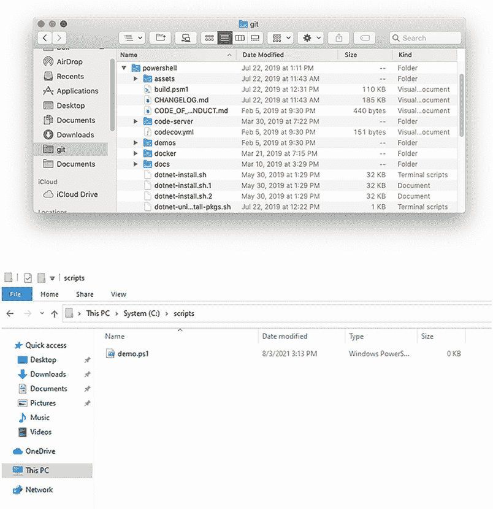

# 5 使用提供程序

PowerShell 中更可能让人感到困惑的方面之一是其对提供程序的使用。一个提供程序提供了访问专用数据存储的权限，以便更容易地查看和管理。这些数据在 PowerShell 中显示为驱动器。

我们警告您，本章中的一些内容可能对您来说有点基础。我们假设您熟悉文件系统，例如，您可能知道从 shell 管理文件系统所需的所有命令。但请耐心等待：我们将以特定的方式指出这些内容，以便我们可以利用您对文件系统的现有熟悉程度来帮助使提供程序的概念更容易理解。此外，请记住 PowerShell 不是 Bash。您可能会在本章中看到一些看起来熟悉的内容，但我们向您保证，它们正在做与您习惯的完全不同的事情。

## 5.1 提供程序是什么？

PowerShell 提供程序，或称为 *PSProvider*，是一个适配器。它旨在将某种数据存储（如 Windows 注册表、Active Directory 或甚至本地文件系统）转换为看起来像磁盘驱动器的东西。您可以直接在 shell 中查看已安装的 PowerShell 提供程序列表：

```
PS C:\Scripts\ > Get-PSProvider
Name                 Capabilities                              Drives
----                 ------------                              ------
Alias                ShouldProcess                             {Alias}
Environment          ShouldProcess                             {Env}
FileSystem           Filter, ShouldProcess, Credentials        {/}
Function             ShouldProcess                             {Function}
Variable             ShouldProcess                             {Variable}
```

提供程序也可以添加到 shell 中，通常与模块一起，这是 PowerShell 可以扩展的两种方式。（我们将在本书的后面部分介绍这些扩展。）有时，启用某些 PowerShell 功能可能会创建一个新的 PSProvider。例如，您可以使用 `Environment` 提供程序来操作环境变量，我们将在第 5.5 节中介绍，您也可以在这里看到：

```
PS C:\Scripts> Get-PSProvider
Name                 Capabilities                              Drives
----                 ------------                              ------
Alias                ShouldProcess                             {Alias}
Environment          ShouldProcess                             {Env}
FileSystem           Filter, ShouldProcess, Credentials        {/}
Function             ShouldProcess                             {Function}
Variable             ShouldProcess                             {Variable}
```

注意，每个提供程序都有不同的功能。这很重要，因为它会影响您可以使用每个提供程序的方式。以下是一些您会看到的常见功能：

+   `ShouldProcess`—提供程序支持使用 `-WhatIf` 和 `-Confirm` 参数，使您能够在做出承诺之前“测试”某些操作。

+   `Filter`—提供程序支持在操作提供程序内容的 cmdlet 上使用 `-Filter` 参数。

+   `Credentials`—提供程序允许您在连接到数据存储时指定备用凭据。为此有一个 `-Credential` 参数。

您使用提供程序来创建 *PSDrive*。PSDrive 使用单个提供程序来连接到数据存储。您正在创建驱动器映射，多亏了提供程序，PSDrive 能够连接到比磁盘多得多的东西。运行以下命令以查看当前连接的驱动器列表：

```
PS C:\Scripts> Get-PSDrive

Name           Used (GB)     Free (GB) Provider      Root
----           ---------     --------- --------      ----
/                 159.55        306.11 FileSystem    /
Alias                                  Alias
Env                                    Environment
Function                               Function
Variable                               Variable
```

在前面的列表中，您可以看到我们有一个使用 `FileSystem` 提供程序的驱动器，一个使用 `Env` 提供程序的驱动器，等等。PSProvider 适配数据存储，PSDrive 使其可访问。您使用一组 cmdlet 来查看和操作每个 PSDrive 暴露的数据。就大多数情况而言，您与 PSDrive 一起使用的 cmdlet 的名词中都有 `Item` 这个词：

```
PS C:\Scripts> Get-Command -Noun *item*
Capability      Name
----------      ----
Cmdlet          Clear-Item
Cmdlet          Clear-ItemProperty
Cmdlet          Copy-Item
Cmdlet          Copy-ItemProperty
Cmdlet          Get-ChildItem
Cmdlet          Get-Item
Cmdlet          Get-ItemProperty
Cmdlet          Invoke-Item
Cmdlet          Move-Item
Cmdlet          Move-ItemProperty
Cmdlet          New-Item
Cmdlet          New-ItemProperty
Cmdlet          Remove-Item
Cmdlet          Remove-ItemProperty
Cmdlet          Rename-Item
Cmdlet          Rename-ItemProperty
Cmdlet          Set-Item
Cmdlet          Set-ItemProperty
```

我们将使用这些 cmdlet 及其别名来开始处理我们系统上的提供器。因为它可能是你最熟悉的一个，所以我们将从文件系统——`FileSystem` PSProvider 开始。

## 5.2 理解文件系统的组织结构

文件系统是围绕两种主要类型的对象组织起来的——文件夹和文件。*文件夹*也是一种容器，能够包含文件和其他文件夹。*文件*不是一种容器类型；它们更像是端点对象。

你可能最熟悉在 macOS 上的 Finder、Linux 上的文件浏览器或 Windows 设备上的资源管理器（图 5.1）中查看文件系统，在这些工具中，驱动器、文件夹和文件的层次结构在视觉上非常明显。



图 5.1 在 Finder 和 Windows 资源管理器中查看文件、文件夹和驱动器

PowerShell 的术语与文件系统的术语略有不同。因为 PSDrive 可能不指向文件系统——例如，PSDrive 可以映射到环境、注册表，甚至 SCCM 端点，这显然不是文件系统——PowerShell 不使用 *文件* 和 *文件夹* 这些术语。相反，它使用更通用的术语 *物品* 来指代这些对象。文件和文件夹都被视为物品，尽管它们显然是不同类型的物品。这就是为什么我们之前展示的 cmdlet 名称都使用 `Item` 作为名词的原因。

物品可以，并且通常确实具有属性。例如，一个文件项可能具有包括最后写入时间、是否为只读等属性。一些物品，如文件夹，可以具有*子项*，这些是包含在该物品内的物品。了解这些事实应该有助于你理解我们之前展示的命令列表中的动词和名词：

+   `Clear`、`Copy`、`Get`、`Move`、`New`、`Remove`、`Rename` 和 `Set` 等动词都可以应用于物品（例如文件和文件夹）和物品属性（例如物品最后写入的日期或它是否为只读）。

+   `Item` 这个名词指的是单个对象，例如文件和文件夹。

+   `ItemProperty` 这个名词指的是物品的属性，例如只读、创建时间、长度等。

+   `ChildItem` 这个名词指的是包含在某个物品（例如文件夹）内的物品（例如文件和子文件夹）。

请记住，这些 cmdlet 是故意设计成通用的，因为它们旨在与各种数据存储一起工作。一些 cmdlet 的功能在某些情况下可能没有意义。例如，由于 `FileSystem` 提供器不支持 `Transactions` 功能，因此没有任何 `-UseTransaction` 参数可以与文件系统驱动器中的项目一起使用。

一些 PSProviders 不支持物品属性。例如，`Environment` PSProvider 是用于在 PowerShell 中使 `ENV` 驱动器可用的工具。此驱动器提供对环境变量的访问，但如下例所示，它们没有物品属性：

```
PS C:\Scripts> Get-ItemProperty -Path Env:\PSModulePath
Get-ItemProperty : Cannot use interface. The IPropertyCmdletProvider
interface is not supported by this provider.
```

事实上，并非每个 PSProvider 都是相同的，这可能是使提供者对 PowerShell 新手来说如此令人困惑的原因。你必须考虑每个提供者为你提供了什么访问权限，并理解即使命令知道如何执行某项操作，这并不意味着你正在与之工作的特定提供者支持该操作。

## 5.3 导航文件系统

当与提供者一起工作时，你需要了解的另一个命令是`Set-Location`。这是你用来将 shell 的当前位置更改为不同容器类型项目（如文件夹）的命令：

```
Linux / macOS
PS /Users/tplunk> Set-Location -Path /
PS />

Windows
PS C:\Scripts > Set-Location -Path /
PS />
```

你可能更熟悉这个命令的别名`cd`，它对应于 Bash 中的`Change Directory`命令。在这里，我们使用别名并将所需的路径作为位置参数传递：

```
Linux / macOS
PS /Users/tplunk> cd /usr/bin
PS /usr/bin>

Windows
PS C:\Scripts\> cd C:\Users\tplunk
PS C:\Users\tplunk>
```

非 Windows 操作系统的驱动器

macOS 和 Linux 不使用驱动器来引用离散的附加存储设备。相反，整个操作系统有一个单一的根目录，用斜杠（在 PowerShell 中，反斜杠也被接受）表示。但 PowerShell 仍然在非 Windows 操作系统中为其他提供者提供 PSDrives。尝试运行`Get-PSDrive`以查看可用内容。

在 PowerShell 中，创建新项目是较为棘手的一项任务。例如，如何创建一个新的目录？尝试运行`New-Item`，你会得到一个意外的提示：

```
PS C:\Users\tplunk\Documents> New-Item testFolder
Type:
```

记住，`New-Item`命令是通用的——它不知道你想要创建文件夹。它可以创建文件夹、文件以及更多内容，但你必须告诉它你想要创建的项目类型：

```
PS C:\Users\tplunk\Documents> New-Item testFolder -ItemType Directory

    Directory: C:\Users\tplunk\Documents

Mode                LastWriteTime         Length Name
----                -------------         ------ ----
d-----           5/26/19 11:56 AM                testFolder         
```

Windows PowerShell 确实包含了一个`mkdir`命令，大多数人认为它是`New-Item`的别名。但使用`mkdir`不需要你指定目录`-ItemType`。由于与内置的`mkdir`命令冲突，`mkdir`函数在 PowerShell Core 的非 Windows 平台上被移除。

## 5.4 使用通配符和字面路径

大多数提供者允许你使用`Item`命令以两种方式指定路径。本节将讨论这两种指定路径的方式。`Item`命令包括`-Path`参数，默认情况下该参数接受通配符。例如，查看`Get-ChildItem`的完整帮助，可以发现以下内容：

```
-Path <String[]>
    Specifies a path to one or more locations. Wildcards are
permitted. The default location is the current directory (.).
    Required?                    false
    Position?                    1
    Default value                Current directory
    Accept pipeline input?       true (ByValue, ByPropertyName)
    Accept wildcard characters?  True
```

`*`通配符代表零个或多个字符，而`?`通配符代表任何单个字符。你无疑已经多次使用过这个，可能使用的是`Dir`别名来代替`Get-ChildItem`：

```
PS C:\Scripts > dir y*

    Directory: C:\Scripts

Mode                LastWriteTime         Length Name
----                -------------         ------ ----
--r---            5/4/19 12:03 AM          70192 yaa
--r---            5/4/19 12:02 AM          18288 yacc
--r---            5/4/19 12:03 AM          17808 yes
```

在 Linux 和 macOS 中，大多数这些通配符都可以作为文件系统中的项目名称以及大多数其他存储中的部分。例如，在环境变量中，你会找到一些包含`?`的名称的值。这提出了一个问题：当你使用`*`或`?`作为路径的一部分时，PowerShell 应该将其视为通配符字符还是作为字面字符？如果你寻找名为`variable?`的项目，你是想要名为`variable?`的项目，还是想要将`?`视为通配符，从而得到如`variable7`和`variable8`之类的项目？

PowerShell 的解决方案是提供一个替代的 `-LiteralPath` 参数。此参数不接受通配符：

```
-LiteralPath <String[]>
    Specifies a path to one or more locations. Unlike the Path
    parameter, the value of the LiteralPath parameter is used exactly
    as it is typed. No characters are interpreted as wildcards. If
    the path includes escape characters, enclose it in single
    quotation marks. Single quotation marks tell PowerShell
    not to interpret any characters as escape sequences.
    Required?                    true
    Position?                    named
    Default value
    Accept pipeline input?       true (ByValue, ByPropertyName)
    Accept wildcard characters?  False
```

当你想将 `*` 和 `?` 字面理解时，使用 `-LiteralPath` 而不是 `-Path` 参数。请注意，`-LiteralPath` 不是位置参数；如果您打算使用它，您必须键入 `-LiteralPath`。如果您在第一个位置提供了一个路径（例如，我们第一个例子中的 `y*`），它将被解释为 `-Path` 参数。通配符也被这样处理。

## 5.5 与其他提供者一起工作

了解这些其他提供者以及各种 `item` cmdlet 的工作方式的一个最好的方法是通过玩一个不是文件系统的 PSDrive。在 PowerShell 内置的提供者中，环境可能是最好的例子（部分原因是因为它在每个系统上都是可用的）。

我们将创建一个环境变量。请注意，我们在这个练习中使用的是 Ubuntu 终端，但无论您是在 Windows 还是 macOS 机器上，都可以同样跟随（跨平台的奇妙之处）。首先列出所有环境变量：

```
PS /Users/tplunk> Get-ChildItem env:*

Name                           Value
----                           -----
XPC_FLAGS                      0x0
LANG                           en_US.UTF-8
TERM                           xterm-256color
HOME                           /Users/tplunk
USER                           tplunk
PSModulePath                   /Users/tplunk/.local/share/powershell/Modu...
HOMEBREW_EDITOR                code
PWD                            /Users/tplunk
COLORTERM                      truecolor
XPC_SERVICE_NAME               0
```

接下来，将环境变量 `A` 设置为值 `1`：

```
PS /Users/tplunk> Set-Item -Path Env:/A -Value 1
PS /Users/tplunk> Get-ChildItem Env:/A*

Name                           Value
----                           -----
A                              1
```

### 5.5.1 Windows 注册表

在 Windows 机器上，我们还可以查看的另一个提供者是注册表。让我们首先切换到注册表的 `HKEY_CURRENT_USER` 部分，由 `HKCU:` 驱动器暴露：

```
PS C:\> set-location -Path hkcu:
```

注意：您可能需要以管理员身份启动 PowerShell。

接下来，导航到注册表的正确部分：

```
PS HKCU:\> set-location -Path software
PS HKCU:\software> get-childitem
    Hive: HKEY_CURRENT_USER\software
Name                           Property
----                           --------
7-Zip                          Path64 : C:\Program Files\7-Zip\
                               Path   : C:\Program Files\7-Zip\
Adobe
Amazon
AppDataLow
AutomatedLab
BranchIO
ChangeTracker
Chromium
Clients

PS HKCU:\software> set-location microsoft
PS HKCU:\software\microsoft> Get-ChildItem
    Hive: HKEY_CURRENT_USER\software\microsoft
Name                           Property
----                           --------
Accessibility
Active Setup
ActiveMovie
ActiveSync
AppV
Assistance
AuthCookies
Avalon.Graphics
Clipboard                      ShellHotKeyUsed : 1
Common
CommsAPHost
ComPstUI
Connection Manager
CTF
Device Association Framework
DeviceDirectory                LastUserRegistrationTimestamp : {230, 198, 218, 150...}
Edge                           UsageStatsInSample                 : 1
                               EdgeUwpDataRemoverResult           : 2
                               EdgeUwpDataRemoverResultDbh        : 1
                               EdgeUwpDataRemoverResultRoaming    : 0
                               EdgeUwpDataRemoverResultData       : 1
                               EdgeUwpDataRemoverResultBackupData : 1
EdgeUpdate                     LastLogonTime-Machine : 132798161806442449
EdgeWebView                    UsageStatsInSample : 1
EventSystem
Exchange
F12
Fax
```

你几乎完成了。你会注意到我们坚持使用完整的 cmdlet 名称，而不是使用别名来强调 cmdlet 本身：

```
PS HKCU:\software\microsoft> Set-Location .\Windows
PS HKCU:\software\microsoft\Windows> Get-ChildItem
    Hive: HKEY_CURRENT_USER\software\microsoft\Windows
Name                           Property
----                           --------
AssignedAccessConfiguration
CurrentVersion
DWM                            Composition                  : 1
                               ColorPrevalence              : 0
                               ColorizationColor            : 3288334336
                               ColorizationColorBalance     : 89
                               ColorizationAfterglow        : 3288334336
                               ColorizationAfterglowBalance : 10
                               ColorizationBlurBalance      : 1
                               EnableWindowColorization     : 0
                               ColorizationGlassAttribute   : 1
                               AccentColor                  : 4278190080
                               EnableAeroPeek               : 1
Shell
TabletPC
Windows Error Reporting        LastRateLimitedDumpGenerationTime : 
➥ 132809598562003780
Winlogon
```

注意 `EnableAeroPeek` 注册表值。让我们将其更改为 `0`：

```
PS HKCU:\software\microsoft\Windows> Set-ItemProperty -Path dwm -PSProperty
EnableAeroPeek -Value 0
```

你也可以使用 `–Name` 参数而不是 `–PSProperty`。让我们再次检查以确保更改“生效”：

```
PS HKCU:\software\microsoft\Windows> Get-ChildItem
    Hive: HKEY_CURRENT_USER\software\microsoft\Windows
Name                           Property
----                           --------
AssignedAccessConfiguration
CurrentVersion
DWM                            Composition                  : 1
                               ColorPrevalence              : 0
                               ColorizationColor            : 3288334336
                               ColorizationColorBalance     : 89
                               ColorizationAfterglow        : 3288334336
                               ColorizationAfterglowBalance : 10
                               ColorizationBlurBalance      : 1
                               EnableWindowColorization     : 0
                               ColorizationGlassAttribute   : 1
                               AccentColor                  : 4278190080
                               EnableAeroPeek               : 0
Shell
TabletPC
Windows Error Reporting        LastRateLimitedDumpGenerationTime : 
➥ 132809598562003780
Winlogon
```

任务完成！使用这些相同的技巧，你应该能够处理任何你遇到的提供者。

## 5.6 实验室

注意：对于这个实验，您需要任何运行 PowerShell v7.1 或更高版本的计算机。

从 PowerShell 提示符中完成以下任务：

1.  创建一个名为 Labs 的新目录。

1.  创建一个名为 /Labs/Test.txt 的零长度文件（使用 `New-Item`）。

1.  使用 `Set-Item` 将 /Labs/Test.txt 的内容更改为 `-TESTING` 是否可能？或者你会得到一个错误？如果你得到一个错误，为什么？

1.  使用环境提供者，显示系统环境变量 `PATH` 的值。

1.  使用帮助来确定 `Get-ChildItem` 的 `-Filter`、`-Include` 和 `-Exclude` 参数之间的区别。

## 5.7 实验答案

1.  `New-Item -Path ~/Labs -ItemType Directory`

1.  `New-Item –Path ~/labs -Name test.txt -ItemType file`

1.  `FileSystem` 提供者不支持此操作。

1.  以下任一命令都有效：

    `Get-Item env:PATH`

    `Dir env:PATH`

1.  `-Include` 和 `-Exclude` 必须与 `–Recurse` 或如果您正在查询一个容器一起使用。`Filter` 使用 PSProvider 的过滤功能，并非所有提供者都支持。例如，您可以在文件系统中使用 `DIR –filter`。

除此之外

你在任务 4 中遇到任何问题了吗？在 Windows 机器上，PowerShell 是不区分大小写的，这意味着大写和小写字母并不重要。`PATH`和`path`是相同的。然而，在 Linux 或 macOS 机器上，大小写很重要：`PATH`和`path`是不同的。
