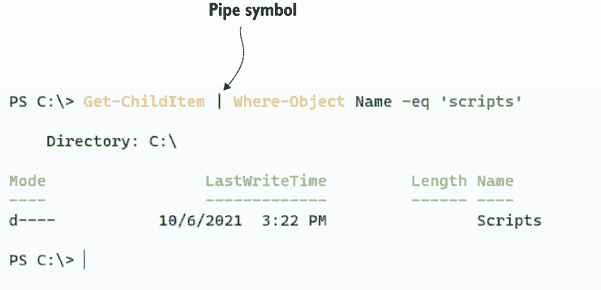
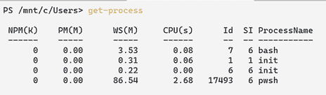
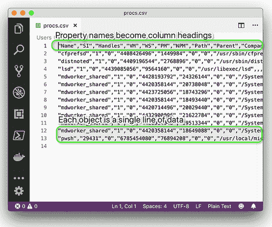
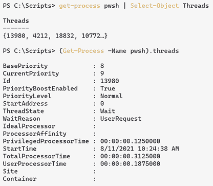
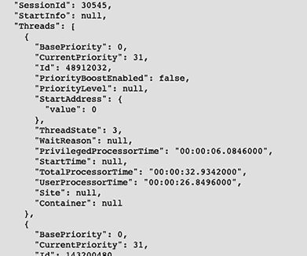

# 6 管道：连接命令

在第四章中，你了解到在 PowerShell 中运行命令与在任何其他 shell 中运行命令相同：你输入一个 cmdlet 名称，给它参数，然后按 Enter。使 PowerShell 特殊的地方不在于它运行命令的方式，而在于它允许将多个命令以强大的单行序列连接在一起的方式。

## 6.1 将一个命令连接到另一个命令：为你减少工作量

PowerShell 通过使用*管道*将命令连接在一起。管道提供了一种方式，允许一个命令将其输出传递或*管道*到另一个命令，使第二个命令有东西可以处理。这可以通过两个 cmdlet 之间的垂直线`|`（图 6.1）看到。



图 6.1 展示了命令中的管道`|`

你已经在`Dir` `|` `more`等命令中看到了这个功能。你正在将`Dir`命令的输出管道传输到`more`命令；`more`命令接收那个目录列表并逐页显示。PowerShell 采用相同的管道概念并将其扩展到更有效果。

PowerShell 对管道的使用可能一开始看起来与 UNIX 和 Linux shell 的工作方式相似。但不要被误导。正如你将在接下来的几章中意识到的那样，PowerShell 的管道实现要丰富得多，也更现代。

## 6.2 导出到文件

PowerShell 提供了几种强大的方式将数据导出为有用的格式，例如 TXT、CSV、JSON 和 XML（可扩展标记语言）。在你的工作流程中，你可能需要从 Azure Active Directory 或从云存储中导出数据。在本章中，我们将介绍管道数据的过程。我们将从获取一些简单的内置命令的数据开始，以简化过程，但概念是相同的。

让我们从运行几个简单的命令开始。然后我们将学习如何将它们连接起来。以下是我们可以使用的一些命令：

+   `Get-Process`（或`gps`）

+   `Get-Command`（或`gcm`)

+   `Get-History -count 10`（或`h`）

我们选择这些命令是因为它们简单直接。我们在括号中给出了`Get-Process`和`Get-Command`的别名。对于`Get-History`，我们指定了`-count`参数的值为`10`，这样我们只获取最后 10 个历史条目。

现在试试看 选择你想要使用的命令。我们使用`Get-Process`作为以下示例；你可以坚持我们列出的其中之一，或者在这三者之间切换以查看结果的不同。

你看到了什么？当我们运行`Get-Process`时，一个包含多个信息列的表格出现在屏幕上（图 6.2）。



图 6.2 `Get-Process`的输出是一个包含多个信息列的表格。

在屏幕上显示这些信息是很好的，但你可能还想做更多的事情。例如，如果你想制作内存和 CPU 利用率的图表和图形，你可能想将信息导出到一个 CSV 文件中，该文件可以被导入到应用程序中进行进一步的数据处理。

### 6.2.1 导出到 CSV

将信息导出到文件时，管道和第二个命令很有用：

```
Get-Process | Export-CSV procs.CSV
```

与将`Dir`通过管道传递到`more`类似，我们已经将我们的进程通过管道传递到`Export-CSV`。第二个 cmdlet 有一个必须的位置参数（在第三章中讨论），我们已使用它来指定输出文件名。因为`Export-CSV`是一个本机 PowerShell cmdlet，它知道如何将`Get-Process`生成的输出转换为标准 CSV 文件。

继续在 Visual Studio Code 中打开文件，查看结果，如图 6.3 所示。

```
code ./procs.CSV
```



图 6.3 在 Windows 记事本中查看导出的 CSV 文件

文件的第一行包含列标题，随后的行列出计算机上运行的各个进程的信息。你可以将几乎任何`Get-` cmdlet 的输出通过管道传递到`Export-CSV`，以获得出色的结果。你可能还会注意到，CSV 文件包含的信息比通常在屏幕上显示的要多得多。这是故意的。Shell 知道它不可能在屏幕上显示所有这些信息，因此它使用由 Microsoft 提供的配置来选择屏幕显示的最重要信息。在后面的章节中，我们将向您展示如何覆盖该配置以显示您想要的内容。

一旦信息被保存到 CSV 文件中，你可以轻松地通过电子邮件发送给同事，并要求他们在 PowerShell 中查看它。为此，他们需要导入该文件：

```
Import-CSV procs.CSV
```

Shell 会读取 CSV 文件并显示进程信息。它不会基于实时信息，但会是从你创建 CSV 文件的精确时间点的快照。

### 6.2.2 导出到 JSON

假设你想导出进程信息并包含线程信息。线程信息是在`process`对象上称为*嵌套属性*的内容。让我们看一下（图 6.4）。请注意，`Select-Object Threads`告诉 PowerShell 只显示`Threads`属性。我们将在第八章更深入地介绍`Select-Object`。



图 6.4 我们展示了两种不同的显示`Threads`属性的方法。

如果你尝试使用`ConvertTo-CSV`导出进程，`Threads`属性将具有值`System.Diagnostics.ProcessThreadCollection`。因此，如果我们想导出`Threads`属性下的嵌套属性，我们需要另一种导出数据的方法。

PowerShell 还有一个`ConvertTo-Json`命令，它创建一个 JSON 文件，允许存储这些嵌套属性。大多数语言都有理解 JSON 的库。你还将有一个匹配的`ConvertFrom-Json`命令。`ConvertFrom`和`ConvertTo`命令（如`ConvertFrom-CSV`和`ConvertTo-CSV`）要么在管道上生成字符串，要么消耗字符串。这是将进程转换为 JSON 的命令，使用`Out-File`将结果保存到文件中：

```
PS C:\Scripts\> Get-Process | ConvertTo-Json | Out-File procs.json
```

你可以通过运行以下命令来获取数据：

```
PS C:\Scripts\> Get-Content ./procs.json | ConvertFrom-Json
```

如果你运行此命令，你会注意到数据格式与运行`Get-Process`命令时的格式非常不同。我们将在下一节中向你展示如何处理这种情况。图 6.5 展示了导出 JSON 中`Threads`属性的一个摘录。



图 6.5 展示`Threads`属性在 JSON 格式下的样子

### 6.2.3 导出为 XML

在上一节中，你注意到`ConvertFrom-Json`返回的数据与从原始命令获取的数据显示方式大不相同。这是因为对象类型不同（我们将在第八章中介绍对象）。有一个命令可以导出数据并获取原始对象。

PowerShell 有一个`Export-Clixml`命令，它创建一个通用的 CLI XML 文件，允许 PowerShell 重建原始对象（或非常接近）。`Clixml`是 PowerShell 特有的，尽管任何程序在技术上都可以理解它产生的 XML，但最好是在结果被 PowerShell 使用时使用。你还将有一个匹配的`Import-Clixml`命令。导入和导出命令（如`Import-CSV`和`Export-CSV`）都期望一个文件名作为必选参数。

何时使用 Export-Clixml

如果获取原始对象更好，为什么不总是使用它呢？有几个缺点：

+   格式通常要大得多。

+   格式是 PowerShell 特有的，可能在其他语言中难以阅读。

+   在 Windows 上，PowerShell 将加密文件的安全相关部分，这意味着只有创建文件的用户或机器才能解密该文件。

现在尝试一下 尝试将进程、命令等导出到 CLIXML 文件。确保你可以重新导入文件，并尝试在你的系统上的 Visual Studio Code 或其他文本编辑器中打开生成的文件，以查看每个应用程序如何显示信息。

PowerShell 是否包含其他导入或导出命令？你可以通过使用`Get-Command`命令并指定带有`Import`或`Export`的`-Verb`参数来找出答案。

现在尝试一下 看看 PowerShell 是否包含其他导入或导出命令。你可能想在将新命令加载到 shell 中之后重复此检查——你将在下一章中这样做。

### 6.2.4 Out-File

我们已经讨论了 CSV、JSON 和 XML 文件，但如果你只是想用一个扁平文件来存储你的数据怎么办？让我们看看 `Out-File` 命令。它将管道中的数据导出到一个扁平文件中——在我们的例子中是在一个文本文件下面：

```
Get-ChildItem | Select-Object Name | Out-File process.txt
```

### 6.2.5 比较文件

CSV 和 CLIXML 文件都可以用于持久化信息快照，与他人共享这些快照，并在以后的时间审查这些快照。实际上，`Compare-Object` 有一种很好的使用它们的方法。

首先，运行 `help Compare-Object` 并阅读这个 cmdlet 的帮助信息。我们希望你特别注意三个参数：`-ReferenceObject`、`-DifferenceObject` 和 `-Property`。

`Compare-Object` 是设计用来接受两组信息并将它们相互比较的。例如，想象一下你在并排放置的两个计算机上运行 `Get-Process`。配置得正好符合你要求的计算机在左边，是**参考计算机**。右边的计算机可能相同，也可能有些不同；这个是**差异计算机**。在每台计算机上运行命令后，你会看到两张信息表，你的任务是确定这两者之间是否存在任何差异。

因为这些是你正在查看的进程，所以你总是会看到 CPU 和内存利用率等数据上的差异，所以我们将忽略这些列。实际上，关注名称列，因为我们想看看差异计算机是否包含比参考计算机更多的或更少的进程。你可能需要花一些时间来比较两张表中的所有进程名称，但你不一定需要——这正是 `Compare-Object` 会为你做的。假设你坐在参考计算机前并运行以下命令：

```
Get-Process | Export-CliXML reference.xml
```

我们更倾向于使用 CLIXML 而不是 CSV 进行此类比较，因为 CLIXML 可以比扁平的 CSV 文件存储更多信息。然后，您将那个 XML 文件传输到差异计算机上并运行以下命令：

```
Compare-Object -Reference (Import-Clixml reference.xml) 
➥-Difference (Get-Process) -Property Name
```

因为前面的步骤有点棘手，我们将解释正在发生的事情：

+   就像数学一样，PowerShell 中的括号控制着执行顺序。在上一个例子中，它们强制 `Import-Clixml` 和 `Get-Process` 在 `Compare-Object` 运行之前执行。`Import-Clixml` 的输出被馈送到 `-Reference` 参数，而 `Get-Process` 的输出被馈送到 `-Difference` 参数。

    参数名称是 `-ReferenceObject` 和 `-DifferenceObject`。请记住，你可以通过输入足够多的参数名称来缩写参数名称，以便 shell 能够确定你想要哪一个。在这种情况下，`-Reference` 和 `-Difference` 已经足够独特地识别这些参数了。我们可能还可以进一步缩短它们，例如缩短为 `-ref` 和 `-diff`，而命令仍然可以正常工作。

+   与比较两个完整的表格不同，`Compare-Object`专注于`Name`，因为我们给了它`-Property`参数。如果我们没有这样做，它就会认为每个进程都不同，因为像`VM`、`CPU`和`PM`这样的列的值总是会有所不同。

+   结果是一个表格，告诉你有什么不同。在参考集中但不在差异集中的每个进程都将有一个`<=`指示符（表示该进程仅在左侧存在）。如果一个进程在差异计算机上但不在参考计算机上，它将有一个`=>`指示符。在两个集合中都匹配的进程不包括在`Compare-Object`输出中。

现在试试看。如果你没有两台计算机，可以从导出你的当前进程到一个 CLIXML 文件开始，就像上一个例子中展示的那样。然后启动一些额外的进程，比如另一个`pwsh`，例如 Visual Studio Code、nano（一个命令行编辑器）、浏览器或一个游戏。你的计算机将成为差异计算机（在右侧），而 CLIXML 文件仍然是参考计算机（在左侧）。

这里是我们测试的输出结果：

```
PS C:\Scripts>Compare-Object -ReferenceObject (Import-Clixml ./procs.xml) 
 ➥ -DifferenceObject (Get-Process) -Property name

name            SideIndicator
----            -------------
nano            =>
pwsh            =>
```

这是一个有用的管理技巧。如果你把那些参考 CLIXML 文件视为配置基线，你就可以将任何当前计算机与该基线进行比较，并获取差异报告。在这本书中，你将发现更多可以检索管理信息的 cmdlets，所有这些都可以被管道输入到 CLIXML 文件中，成为基线。你可以快速构建一组基线文件，用于服务、进程、操作系统配置、用户和组等，然后随时使用这些文件将系统的当前状态与基线进行比较。

现在试试看。为了好玩，再次运行`Compare-Object`命令，但完全省略`-Property`参数。看到了吗？每个进程都被列出，因为像`PM`、`VM`等值都发生了变化，尽管它们是相同的进程。输出也不太有用，因为它显示了每个进程的类型名称和进程名称。

顺便说一下，你应该知道`Compare-Object`在比较文本文件方面通常表现不佳。尽管其他操作系统和 shell 有一个明确用于比较文本文件的`Compare-Object`命令，但 PowerShell 的`Compare-Object`命令的工作方式不同。你将在本章的实验中看到它有多么不同。

注意：如果你经常使用`Get-Process`和`Get-Command`，那是有意为之的。我们保证你可以访问这些 cmdlets，因为它们是 PowerShell 的本地命令，不需要像 Azure PowerShell 或 AWS Tools for PowerShell 这样的插件。话虽如此，你正在学习的技能适用于你将需要运行的每个 cmdlet，包括那些与 Azure 计算、Azure 存储、Azure 虚拟网络和 Azure PowerShell 模块一起提供的 cmdlet。

## 6.3 将输出重定向到文件

每当你有格式良好的输出时——例如，由 `Get-Command` 或 `Get-Process` 生成的表格——你可能希望将其保存在文件中，甚至打印在纸上。通常，cmdlet 输出会被定向到屏幕，PowerShell 将其称为 *host*，但你也可以改变输出去向。我们已经向你展示了其中一种方法：

```
Dir > DirectoryList.txt
```

`>` 字符是 PowerShell 添加的一个快捷方式，以提供与 Bash shell 的语法兼容性。实际上，当你运行那个命令时，PowerShell 在幕后会做以下操作：

```
Dir | Out-File DirectoryList.txt
```

你可以在自己的机器上运行相同的命令，而不是使用 `>` 语法。你为什么这么做呢？因为 `Out-File` 还提供了额外的参数，让你可以指定替代字符编码（如 UTF-8 或 Unicode），将内容追加到现有文件，等等。默认情况下，`Out-File` 创建的文件宽度为 80 列，这意味着有时 PowerShell 可能会调整命令输出以适应 80 个字符。这种调整可能会使文件内容看起来与你在屏幕上运行相同命令时不同。阅读 `Out-File` 的帮助文件，看看你是否能找到一个参数，可以让你将输出文件宽度更改为 80 个字符以外的值。

现在尝试一下——不要在这里寻找答案——打开那个帮助文件，看看你能找到什么。我们保证你会在几分钟内找到正确的参数。

PowerShell 有许多 `Out-` 命令。其中一个叫做 `Out-Default`，当你不指定不同的 `Out-` 命令时，shell 会使用它。如果你运行

```
Dir
```

你实际上正在运行

```
Dir | Out-Default
```

即使你没有意识到。`Out-Default` 除了将内容直接定向到 `Out-Host` 外，没有做更多的事情，这意味着你正在运行

```
Dir | Out-Default | Out-Host
```

在没有意识到的情况下。`Out-Host` 在屏幕上显示信息。你能找到其他哪些 `Out-` 命令？

现在尝试一下——现在是调查其他 `Out-` 命令的时候了。为了开始，尝试使用 `Help` 命令和通配符，例如 `Help` `Out*`。另一个选项是使用 `Get-Command` 的相同方式，例如 `Get-Command` `Out*`。或者，你可以指定 `-Verb` 参数 `Get-Command -Verb Out`。你得到了什么？

`Out-Null` 和 `Out-String` 有其特定的用途，我们现在不会深入探讨，但您随时可以阅读它们的相关帮助文件，并查看那些文件中包含的示例。

## 6.4 转换为 HTML

想要生成 HTML 报告？将你的命令通过管道传递给 `ConvertTo-Html`。这个命令生成格式良好的通用 HTML，可以在任何网页浏览器中显示。它看起来很朴素，但如果你需要的话，可以引用一个级联样式表（CSS）文件来指定更吸引人的格式。请注意，这个命令不需要指定文件名：

```
Get-Process -Id $PID | ConvertTo-Html
```

现在尝试一下——确保你自己运行那个命令——我们希望你在继续之前看到它做了什么。

在 PowerShell 世界中，动词 `Export` 暗示你正在获取数据，将其转换为其他格式，并将该格式保存到某种存储中，例如文件。动词 `ConvertTo` 仅暗示该过程的一部分：将数据转换为不同格式，但不将其保存到文件中。当你运行前面的命令时，你得到了一屏幕的 HTML，这可能不是你想要的。停一下；你能想到如何将那个 HTML 保存到磁盘上的文本文件中吗？

现在试试看。如果你能想到一种方法，请在继续阅读之前尝试一下。

这个命令可以解决问题：

```
Get-Process | ConvertTo-Html | Out-File processes.html
```

看看连接越来越多的命令如何让你拥有越来越强大的命令行？每个命令处理过程的一个步骤，整个命令行作为一个整体完成一个有用的任务。

PowerShell 随带其他 `ConvertTo-` 命令，包括 `ConvertTo-CSV` 和 `ConvertTo-Xml`。与 `ConvertTo-Html` 类似，这些命令不会在磁盘上创建文件；它们分别将命令输出转换为 CSV 或 XML。你可以将转换后的输出通过管道传递给 `Out-File` 命令，然后将其保存到磁盘上，尽管使用 `Export-CSV` 或 `Export-Clixml` 会更简洁，因为这两个命令同时完成转换和保存。

除此之外

现在是时候提供更多无用的背景信息了，尽管在这种情况下，这是许多学生经常向我们提出的问题的答案：为什么微软会同时提供 `Export-CSV` 和 `ConvertTo-CSV`，以及两个几乎相同的 XML 命令？

在某些高级场景中，你可能不希望将数据保存到磁盘上的文件中。例如，你可能想要将数据转换为 XML，然后将其传输到 Web 服务或其他目的地。通过拥有不保存到文件的独立 `ConvertTo-` 命令，你就有灵活性去做你想做的事情。

## 6.5 使用修改系统的命令：终止进程

导出和转换并不是连接两个命令的唯一原因。例如，考虑一下——*但请别运行*——这个命令：

```
Get-Process | Stop-Process
```

你能想象这个命令会做什么吗？我们将告诉你：你可以终止关键进程。它会检索每个进程，然后尝试终止每个进程。它会到达一个关键进程，例如 macOS 上的 `/usr/sbin/coreaudiod`，然后你的电脑将无法再播放声音。如果你在虚拟机中运行 PowerShell 并想找点乐子，请尝试运行该命令。

重点是具有相同名词（在这种情况下，`Process`）的 cmdlet 可以经常在彼此之间传递信息。通常，你会指定特定进程的名称，而不是尝试停止所有进程：

```
Get-Process -Name bash | Stop-Process
```

作业提供类似的功能：`Get-Job` 的输出可以被传递到 `Stop-Job`、`Receive-Job`、`Wait-Job` 等命令。我们将在第十四章详细介绍作业。

正如你所期望的，特定的规则限制了哪些命令可以相互连接。例如，如果你查看一个如`Get-Process` `|` `New-Alias`的命令序列，你可能不会期望它做任何有意义的事情（尽管它可能确实做了某些无意义的事情）。在第七章中，我们将深入探讨控制命令如何相互连接的规则。

我们还希望你了解关于`Stop-Job`和`Stop-Process`等 cmdlet 的另一个信息。这些 cmdlet 以某种方式修改系统，所有修改系统的 cmdlet 都有一个内部定义的*影响级别*。cmdlet 的创建者设置这个影响级别，并且不能更改。shell 有一个相应的`$Confirm-Preference`设置，默认设置为`High`。输入以下设置名称以查看你的 shell 设置：

```
PS /Users/jsnover> $ConfirmPreference
High
```

这就是这样工作的：当 cmdlet 的内部影响级别等于或高于 shell 的`$ConfirmPreference`设置时，shell 会自动询问，“你确定吗？”当 cmdlet 执行它试图做的事情时。如果你使用虚拟机尝试我们之前提到的会导致电脑崩溃的命令，你可能对每个进程都被问到了“你确定吗？”当 cmdlet 的内部影响级别低于 shell 的`$ConfirmPreference`设置时，你不会自动得到“你确定吗？”提示。但你可以强制 shell 询问你是否确定：

```
Get-Process | Stop-Process -Confirm
```

你只需将`-Confirm`参数添加到 cmdlet 中。任何对系统进行某种更改的 cmdlet 都应该支持它，如果它支持，它将在 cmdlet 的帮助文件中显示。

类似的参数是`-WhatIf`。任何支持`-Confirm`的 cmdlet 都支持`-WhatIf`参数。默认情况下，`-WhatIf`参数不会被触发，但你可以随时指定它：

```
PS C:\Scripts > Get-Process | Stop-Process –WhatIf
What if: Performing operation "Stop-Process" on Target "conhost (1920)
".
What if: Performing operation "Stop-Process" on Target "conhost (1960)
".
What if: Performing operation "Stop-Process" on Target "conhost (2460)
".
What if: Performing operation "Stop-Process" on Target "csrss (316)".
```

这会告诉你 cmdlet 会做什么，而不让 cmdlet 实际执行。这是一种有用的方式来预览一个可能危险的 cmdlet 会对你的电脑造成什么影响，以确保你确实想要这样做。

## 6.6 常见混淆点

在 PowerShell 中，一个常见的混淆点围绕着`Export-CSV`和`Export-Clixml`命令。从技术上讲，这两个命令都创建文本文件。这两个命令的输出可以在 Visual Studio Code 中查看，如图 6.3 所示。但你必须承认，文本肯定是一种特殊的格式——要么是 CSV，要么是 XML。

当有人被要求将这些文件读回到 shell 时，混淆往往会出现。你是使用`Get-Content`（或其别名`type`）吗？例如，假设你这样做：

```
PS C:\Scripts>Get-Process | Select-Object -First 5 | export-CSV processes.CSV 
➥ -IncludeTypeInformation 
```

注意到`-IncludeTypeInformation`开关；我们稍后会回到它。现在，尝试使用`Get-Content`读取它：

```
PS C:\Scripts>Get-Content ./processes.CSV                                    
#TYPE System.Diagnostics.Process "Name","SI","Handles","VM","WS","PM","NPM","Path",
"Parent","Company","CPU","FileVersion","ProductVersion","Description","Product","__NounName","SafeHandle",
"Handle","BasePriority","ExitCode","HasExited","StartTime","ExitTime","Id","MachineName","MaxWorkingSet",
"MinWorkingSet","Modules","NonpagedSystemMemorySize64","NonpagedSystemMemorySize","PagedMemorySize64",
"PagedMemorySize","PagedSystemMemorySize64","PagedSystemMemorySize","PeakPagedMemorySize64",
"PeakPagedMemorySize","PeakWorkingSet64","PeakWorkingSet","PeakVirtualMemorySize64","PeakVirtualMemorySize",
"PriorityBoostEnabled","PriorityClass","PrivateMemorySize64","PrivateMemorySize","ProcessName",
"ProcessorAffinity","SessionId","StartInfo","Threads","HandleCount","VirtualMemorySize64","VirtualMemorySize",
"EnableRaisingEvents","StandardInput","StandardOutput","StandardError","WorkingSet64","WorkingSet",
"SynchronizingObject","MainModule","MainWindowHandle","MainWindowTitle","Responding",
"PrivilegedProcessorTime","TotalProcessorTime","UserProcessorTime","Site","Container"
"","87628","0","0","0","0","0",,,,,,,,,"Process",
"Microsoft.Win32.SafeHandles.SafeProcessHandle","0","0",,"False",,,"0",".",,,"System.Diagnostics.ProcessModuleCollection",
"0","0","0","0","0","0","0","0","0","0","0","0","False",
"Normal","0","0","",,"87628",,"System.Diagnostics.ProcessThreadCollection","0","0","0",
"False",,,,"0","0",,,"0","","True",,,,,
```

我们截断了前面的输出，但还有很多类似的输出。看起来像是垃圾，对吧？你正在查看原始 CSV 数据。命令根本就没有尝试解释，或*解析*数据。与`Import-CSV`的结果进行对比：

```
PS C:\Scripts>Import-CSV ./processes.CSV
 NPM(K)    PM(M)      WS(M)     CPU(s)      Id  SI ProcessName
 ------    -----      -----     ------      --  -- -----------
      0     0.00       0.00       0.00       0 ...28 
      0     0.00       0.00       0.00       1   1 
      0     0.00       0.00       0.00      43  43 
      0     0.00       0.00       0.00      44  44 
      0     0.00       0.00       0.00      47  47
```

更好一些，对吧？`Import-` cmdlets 会注意文件中的内容，尝试进行解释，并创建一个看起来更像原始命令（在这种情况下是 `Get-Process`）输出的显示。为了使用 `Export-CSV` 来做到这一点，你必须使用 `-IncludeTypeInformation` 开关。通常，如果你使用 `Export-CSV` 创建文件，你会通过使用 `Import-CSV` 来读取它。如果你使用 `Export-Clixml` 创建它，你通常通过使用 `Import-Clixml` 来读取它。通过使用这些命令成对使用，你可以获得更好的结果。仅当你在读取文本文件且不希望 PowerShell 尝试解析数据时（即当你想处理原始文本时），才使用 `Get-Content`。

## 6.7 实验室

我们将本章的文本略微缩短，因为一些示例可能花费了你更多的时间来完成，并且我们希望你能花更多的时间来完成以下动手实验。如果你还没有完成本章中所有的“现在试试”任务，我们强烈建议你在尝试这些任务之前完成它们：

1.  创建两个相似但不同的文本文件。尝试使用 `Compare-Object` 来比较它们。运行类似以下命令：`Compare-Object -Reference `(Get-Content` `File1.txt)` `-Difference `(Get-Content File2.txt)`。如果文件只有一行文本不同，该命令应该可以工作。

1.  如果你从控制台运行 `Get-Command` `|` `Export-CSV` `commands.CSV` `|` `Out-File`，会发生什么？为什么会发生这种情况？

1.  除了获取一个或多个作业并将它们通过管道传递给 `Stop-Job` 以外，`Stop-Job` 还提供了哪些方法让你指定要停止的作业或作业？是否可以在不使用 `Get-Job` 的情况下停止作业？

1.  如果你想要创建一个以管道分隔符分隔的文件而不是 CSV 文件，你仍然会使用 `Export-CSV` 命令，但你需要指定哪些参数？

1.  你如何在导出的 CSV 文件的顶部注释行 `#` 中包含类型信息？

1.  `Export-Clixml` 和 `Export-CSV` 都会修改系统，因为它们可以创建和覆盖文件。哪个参数可以防止它们覆盖现有文件？哪个参数会在写入输出文件之前询问你是否确定？

1.  操作系统维护了几个区域设置，其中包括默认的分隔符列表。在美国系统上，该分隔符是逗号。你如何告诉 `Export-CSV` 使用系统的默认分隔符而不是逗号？

## 6.8 实验室答案

1.  `PS C:\Scripts > "I am the walrus" | Out-File file1.txt`

    `PS C:\Scripts > "I'm a believer" | Out-File file2.txt`

    `PS C:\Scripts > $f1 = Get-Content .\file1.txt`

    `PS C:\Scripts > $f2 = Get-Content .\file2.txt`

    `PS C:\Scripts > Compare-Object $f1 $f2`

    `InputObject                             SideIndicator`

    `-----------                             -------------`

    `I'm a believer                          =>`

    `I am the walrus                         <=`

1.  如果您没有使用 `Out-File` 指定文件名，您将收到错误。但即使指定了，`Out-File` 也不会执行任何操作，因为文件是由 `Export-CSV` 创建的。

1.  `Stop-Job` 可以接受一个或多个作业名称作为 `–Name` 参数的参数值。例如，您可以运行以下命令：

    `Stop-job jobName`

1.  `get-Command | Export-CSV commands.CSV -Delimiter "|"`

1.  在 `Export-CSV` 中使用 `–IncludeTypeInformation` 参数。

1.  `Get-Command | Export-CSV services.CSV –NoClobber`

    `Get-Command | Export-CSV services.CSV -Confirm`

1.  `Get-Command | Export-CSV services.CSV -UseCulture`
