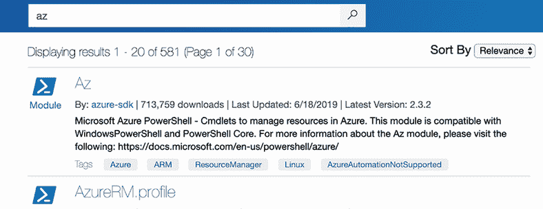
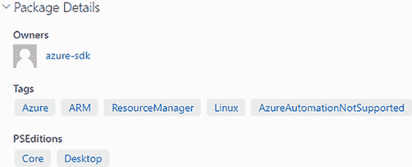

# 7 添加命令

PowerShell 的主要优势之一是其可扩展性。随着 Microsoft 继续投资 PowerShell，它为 Azure 计算（虚拟机）、Azure SQL、Azure 虚拟网络、Azure DNS 等产品开发了越来越多的命令。您通常通过 Azure 门户来管理这些命令。我们将在本章后面讨论如何安装 Azure PowerShell 模块。

## 7.1 一个 shell 如何做到一切

一个 shell 如何做到一切？让我们思考一下你的智能手机。你是如何在不升级操作系统的情况下给你的手机添加功能？你安装了一个应用程序。

当你安装一个应用程序时，它可以添加小部件，甚至添加你可以对语音助手说的命令。向语音助手添加命令可能与 PowerShell 的扩展模型最相似。PowerShell 提供了添加命令的方式，你可以使用。

假设你安装了一个名为 Ride Share 的应用程序。该应用程序可能添加了一个语音命令，让你可以说，“用 Ride Share 为我预订去工作的车。”手机找到你的工作地址并将命令发送到应用程序。

PowerShell 以类似的方式工作。PowerShell 将其扩展称为*模块*。没有小部件，但可以添加命令。我们将在下一节中介绍如何安装模块。

## 7.2 扩展：查找和安装模块

在 PowerShell 6.0 之前，有两种类型的扩展：模块和插件。PowerShell v6 及更高版本支持一种称为*模块*的扩展类型。模块旨在更加独立且易于分发。

Microsoft 引入了一个名为 PowerShellGet 的模块，它使得从在线仓库中搜索、下载、安装和更新模块变得更加容易。PowerShellGet 与 Linux 管理员非常喜欢的包管理器类似——rpm、yum、apt-get 等。Microsoft 甚至运行一个在线*画廊*或仓库，称为 PowerShell Gallery ([`powershellgallery.com`](http://powershellgallery.com))。

WARning *Microsoft runs*并不意味着*Microsoft 生产、验证和认可*。PowerShell Gallery 包含社区贡献的代码，在您的环境中运行他人的代码之前，您应谨慎行事。

你可以在[`powershellgallery.com/`](https://www.powershellgallery.com/)上搜索模块，就像大多数搜索引擎一样。Azure 的模块称为*Az*。图 7.1 展示了搜索该模块的示例。



图 7.1 展示了在 PowerShell Gallery 中搜索 Az 的过程

如果你点击 Az 模块名称，它将带你到有关该模块的更多详细信息。在“包详细信息”>“PSEditions”下，你可以检查作者是否已使用 PowerShell Core 测试了该模块（图 7.2）。



图 7.2 展示模块与 Core 兼容

然后查看安装选项（图 7.3）。


图 7.3 展示通过 PowerShell Gallery 可用的安装命令

注意它指出至少需要 PowerShell 5.1 才能运行该模块，并提供了安装模块的说明。如果我们运行命令 `Install-Module -Name Az`，我们可以看到发生了什么：

```
PS C:\Scripts> Install-Module az 

Untrusted repository
You are installing the modules from an untrusted repository. If you trust this 
repository, change its InstallationPolicy value by running the Set-PSRepository
 cmdlet. Are you sure you want to install the modules from 'PSGallery'?
[Y] Yes  [A] Yes to All  [N] No  [L] No to All  [S] Suspend  [?] Help 
(default is "N"):y
```

它会提示你询问你是否信任从库中安装，如果你说“是”，那么它就会安装模块。你可以运行 `Get-Module` 命令来验证是否已安装模块，但需要 `-ListAvailable` 参数，因为模块尚未加载：

```
PS C:\Scripts> Get-Module az -ListAvailable

    Directory: 
    C:\Users\Tyler\Documents\powershell\Modules

ModuleType Version    Name
---------- -------    ----                               
Script     6.3.0      Az
```

路径和版本可能因你而异，但输出应该是类似的。

更多关于从互联网获取模块的信息

PowerShellGet 模块允许从 [`PowerShellGallery.com`](http://PowerShellGallery.com) 安装模块。使用 PowerShellGet 很简单，甚至可能很有趣：

+   运行 `Register-PSRepository` 命令来添加存储库的 URL。[`PowerShellGallery.com`](http://PowerShellGallery.com) 通常默认设置，但也可以在内部设置自己的“库”用于私人用途，并且你会使用 `Register-PSRepository` 来指向它。

+   使用 `Find-Module` 命令在存储库中查找模块。你可以在名称中使用通配符 (`*`)，指定标签，并有许多其他选项来缩小搜索结果。

+   使用 `Install-Module` 命令在找到模块后下载并安装它。

+   使用 `Update-Module` 命令确保你的模块本地副本是最新的版本，如果不是，则下载并安装最新版本。

PowerShellGet 包含其他几个命令（[`PowerShellGallery.com`](http://PowerShellGallery.com) 链接到文档），但你将开始使用的是这些命令。例如，尝试从 PowerShell Gallery 安装 Azure PowerShell 模块或 Jeff Hicks 的 PSScriptTools 模块。

## 7.3 扩展：查找和添加模块

PowerShell 会自动在一系列路径中查找模块。`PSModulePath` 环境变量定义了 PowerShell 预期模块存在的路径：

```
PS /Users/Tyler> (Get-Content Env:/PSModulePath) -split ':'
C/Users/Tyler.local/share/powershell/Modules
/usr/local/share/powershell/Modules
/usr/local/microsoft/powershell/7/Modules 
```

现在试试看。前面的命令是在 macOS 设备上运行的。运行命令 `(Get-Content `Env:/PSModulePath)` `-split` `':'` 并查看你的结果。请注意，这取决于你使用的操作系统，它们会有所不同。

如此例所示，有三个默认位置：一个在 PowerShell 安装文件夹中，系统模块就存储在这里；一个在 local/share/ 文件夹中，你可以放置所有用户共享的模块；还有一个在 .local 文件夹中，你可以添加任何个人模块。如果你运行的是 PowerShell 的更晚版本，你可能会看到 Microsoft 现在使用的其他位置。你也可以从任何其他位置添加模块，只要你知道它的完整路径。在你的 Windows 机器上，你会看到类似的布局，模块就是在这里安装的：

```
$env:PSModulePath -split ';'

C:\Users\Administrator\Documents\PowerShell\7\Modules
C:\Program Files\WindowsPowerShell\Modules
C:\Windows\system32\PowerShell\7\Modules
```

在 PowerShell 中，路径非常重要。如果您有位于其他位置的模块，您应该将它们的路径添加到 `PSModulePath` 环境变量中。您可以在您的配置文件中使用以下命令完成此操作（我们将在本章后面介绍如何设置配置文件）：

```
PS C:\Scripts> $env:PSModulePath += [System.IO.Path]::PathSeparator + 
➥ 'C:\Scripts/myModules' 
```

注意：在上面的示例中，我们还没有提到一些事情。但没关系。我们承诺我们将会提到它们。

为什么 `PSModulePath` 如此重要？因为它允许 PowerShell 自动定位您计算机上的所有模块。在找到您的模块后，PowerShell 会自动发现它们。对您来说，这就像您的所有模块一直都被加载一样。请求模块的帮助，您就会得到它，而无需加载它。运行您找到的任何命令，PowerShell 会自动加载包含该命令的模块。PowerShell 的 `Update-Help` 命令也使用 `PSModulePath` 来发现您拥有的模块，然后为每个模块寻找更新的帮助文件。

例如，运行 `Get-Module | Remove-Module` 来移除任何已加载的模块。这将移除当前会话中的几乎所有命令，因此如果您尝试这样做，请关闭并重新打开 PowerShell。然后运行以下命令（您的结果可能略有不同，具体取决于您的操作系统和您安装的模块）：

```
PS C:\Scripts> help *storaget*
       Name                                    Category ModuleName

       Get-AzStorageTable                      Cmdlet   Az.Storage
       Get-AzStorageTableStoredAccessPolicy    Cmdlet   Az.Storage
       New-AzStorageTable                      Cmdlet   Az.Storage
       New-AzStorageTableSASToken              Cmdlet   Az.Storage
       New-AzStorageTableStoredAccessPolicy    Cmdlet   Az.Storage
       Remove-AzStorageTable                   Cmdlet   Az.Storage
       Remove-AzStorageTableStoredAccessPolicy Cmdlet   Az.Storage
       Set-AzStorageTableStoredAccessPolicy    Cmdlet   Az.Storage 
```

如您所见，PowerShell 发现了几个命令（属于 `Cmdlet` 类型），它们的名称中包含单词 `storage`（我在示例中使用了 `storaget` 以简化结果）。您可以对其中之一请求帮助，即使您还没有加载该模块：

```
PS C:\Scripts> Get-Help Get-AzStorageTable           
       NAME
       Get-AzStorageTable
SYNOPSIS
    Lists the storage tables.

SYNTAX
    Get-AzStorageTable [[-Name] <System.String>] [-Context
<Microsoft.Azure.Commands.Common.Authentication.Abstractions.IStorageContext>]
➥ [-DefaultProfile

<Microsoft.Azure.Commands.Common.Authentication.Abstractions.Core
➥ .IAzureContextContainer>] [<CommonParameters]
```

如果您愿意，甚至可以运行命令，PowerShell 会确保为您加载模块。这种自动发现和自动加载功能非常有用，可以帮助您找到并使用在您启动 shell 时甚至不存在的命令。

PowerShell 的模块自动发现功能使得 shell 能够完成命令名称（在控制台中使用 Tab 键或 Visual Studio Code 中的 IntelliSense），显示帮助，并运行命令，即使对于您没有明确加载到内存中的模块也是如此。这些功能使得保持 `PSModulePath` 尽可能精简（即不要在其中放置很多不同的位置）并保持模块更新变得值得努力。

如果模块不在 `PSModulePath` 引用的路径之一中，您需要运行 `Import-Module` 并指定模块的完整路径，例如 `C:\Scripts\myModules\myModule`。

模块还可以添加 PowerShell 提供程序。运行 `Get-PSProvider` 将会列出提供程序列表：

```
PS /Users/James> get-psprovider

Name                 Capabilities                  Drives
----                 ------------                  ------
Alias                ShouldProcess                 {Alias}
Environment          ShouldProcess                 {Env}
FileSystem           Filter, ShouldProcess, Crede... {/, Temp}
Function             ShouldProcess                 {Function}
Variable             ShouldProcess                 {Variable} 
```

安装 Google Cloud 命令

安装和添加 Google Cloud 命令有些不同，因为它们打破了规则——它们在第一次尝试使用模块时需要输入。你首先像其他模块一样安装它们的命令：`Install-Module -Name GoogleCloud`。但如果你尝试查找命令，它将会失败。因此，你需要运行 `Import-Module GoogleCloud -Force`。`-Force` 是以防 PowerShell 认为模块已加载；它将尝试重新加载它。现在模块将提示你完成安装（假设它与我们编写本书时的设计相同）。现在我们将运行处理 Google Cloud SQL 实例的命令。

```
PS C:\Scripts> Get-Command -Name *-gcSqlinstance 

CommandType     Name
-----------     ----                                             
Cmdlet          Add-GcSqlInstance                                
Cmdlet          ConvertTo-GcSqlInstance                          
Cmdlet          Export-GcSqlInstance                             
Cmdlet          Get-GcSqlInstance                                
Cmdlet          Import-GcSqlInstance                             
Cmdlet          Remove-GcSqlInstance                             
Cmdlet          Restart-GcSqlInstance                            
Cmdlet          Update-GcSqlInstance
```

## 7.4 命令冲突和移除扩展

仔细看看我们为 Google Cloud SQL 实例和 Azure 表存储添加的命令。你注意到命令名称有什么特别之处吗？

大多数 PowerShell 扩展（Amazon Web Services 是一个显著的例外）会在其命令名称的名词部分添加一个简短的前缀。例如，`Get-GcSqlInstance` 或 `Get-AzStorageTable`。这些前缀可能看起来有些别扭，但它们的设计目的是为了防止命令冲突。

例如，假设你加载了两个包含 `Get-User` cmdlet 的模块。当两个具有相同名称的命令同时加载时，当你运行 `Get-User` 时，PowerShell 将执行哪一个？结果将是最后加载的那个。但具有相同名称的其他命令并不是不可访问的。要专门运行任一命令，你必须使用一种有些别扭的命名约定，该约定需要模块名称和命令名称。如果 `Get-User` 中的一个来自名为 MyCoolPowerShellModule 的模块，你必须运行这个：

```
MyCoolPowerShellModule\Get-User
```

这需要输入很多，这就是为什么 Microsoft 建议为每个命令的名词添加一个产品特定的前缀，例如 `Az` 或 `Gc`。添加前缀有助于防止冲突，并有助于使命令更容易识别和使用。

注意：Amazon Web Services 模块不使用前缀。

如果你真的遇到了冲突，你总是可以移除其中一个冲突的模块。运行 `Remove-Module`，连同模块名称一起，以卸载一个模块。

注意：在导入模块时，为任何模块添加自己的前缀。`Import-Module ModuleName -Prefix MyPrefix` 将 `Get-OriginalCmdLet` 改为 `Get-MyPrefixOriginalCommand`。

## 7.5 玩转新模块

让我们运用你新获得的知识。我们希望你能跟随本节中我们展示的命令。更重要的是，我们希望你能跟随我们将要解释的过程和思考，因为这是我们学习如何使用新命令而不急于购买每款产品和每个功能的新书的方法。在本章的实验室中，我们将让你自己重复这个过程，以学习更深入的任务。

我们的目标是将我们电脑上的文件压缩成 zip 归档。我们不知道 PowerShell 是否能做这件事，所以我们首先向帮助系统寻求线索：

```
PS C:\Scripts> help *-archive                            
Name                              Category  Module                     
----                              --------  ------                     
Compress-Archive                  Function  Microsoft.PowerShell.Arc... 
```

哈哈！正如你所见，我们电脑上有一个完整的 `Microsoft.PowerShell.Archive`（全名被截断）模块。前面的列表显示了 `Compress-Archive` 命令，但我们很好奇还有哪些其他命令可用。为了找出答案，我们手动加载模块并列出其命令：

```
PS C:\Scripts> get-command -Module Microsoft.PowerShell.Archive

CommandType     Name
-----------     ----                                              
Function        Compress-Archive                                  
Function        Expand-Archive 
```

注意：我们本可以请求 `Compress-Archive` 的帮助，甚至直接运行该命令。PowerShell 会为我们后台加载 Microsoft.PowerShell .Archive 模块。但因为我们正在探索，这种方法让我们可以查看模块的完整命令列表。

这个命令列表看起来与之前的列表大致相同。好吧，让我们看看 `Compress-Archive` 命令的样子：

```
PS C:\Scripts> Get-Help Compress-Archive

NAME
    Compress-Archive

SYNTAX
    Compress-Archive [-Path] <string[]> [-DestinationPath] 
    <string> [-CompressionLevel {Optimal | NoCompression | 
    Fastest}] [-PassThru] [-WhatIf] [-Confirm] 
    [<CommonParameters>]
```

这看起来很简单，并且只有 `-Path` 和 `-DestinationPath` 是必选参数。让我们尝试创建一个文件并用该命令压缩它：

```
PS C:\Scripts> 'test lunch' | Out-File chapter7.txt                     
PS C:\Scripts> Compress-Archive -Path .\chapter7.txt -DestinationPath 
➥ .\chapter7.zip 
```

好吧，没有消息通常是个好消息。然而，看到命令确实做了些事情会更好。让我们试试这个：

```
PS C:\Scripts> Compress-Archive -Path .\chapter7.txt -DestinationPath .\chapter7.zip -Force -Verbose                   
VERBOSE: Preparing to compress...
VERBOSE: Performing the operation "Compress-Archive" on target 
➥ "C:\Scripts\chapter7.txt".
VERBOSE: Adding 'C:\Scripts/chapter7.txt'.  
```

`-Verbose` 开关对所有 cmdlet 和函数都可用，尽管并非所有这些命令都会使用它。在这种情况下，我们得到一条消息，表明正在发生的事情，这告诉我们命令确实已运行。该命令的 `-Force` 开关表示要覆盖我们第一次创建的 zip 文件。

## 7.6 常见混淆点

PowerShell 新手在开始使用模块时经常犯一个错误：他们不阅读帮助。具体来说，他们在请求帮助时没有使用 `-Example` 或 `-Full` 开关。

坦白说，查看内置示例是学习如何使用命令的最佳方式。是的，浏览数百个命令的列表（例如，Az.* 模块添加了超过 2,000 个新命令）可能会有些令人畏惧，但使用 `Help` 和 `Get-Command` 与通配符应该可以使你更容易缩小到你想找的任何名词。从那里开始，*阅读* *帮助*！

## 7.7 实验室

如往常一样，我们假设你已经在计算机或虚拟机上安装了最新的 PowerShell 版本以进行测试：

1.  浏览 PowerShell 画廊。找到一些你认为听起来很有趣的模块并安装它们。

1.  浏览你刚刚下载的模块可用的命令。

1.  使用 7.2 节中的命令查找和安装（如果需要）Microsoft 为处理包含 `Compress-Archive` 命令的存档而提供的最新版本模块。

1.  导入你刚刚安装的模块。

1.  为下一步创建一个包含 10 个文件的 Tests 文件夹，并将其命名为 ~/TestFolder。

1.  使用 `Compress-Archive` 创建 ~/TestFolder 内容的 zip 文件，并将其命名为 `TestFolder.zip`。

1.  将存档展开到 ~/TestFolder2。

1.  使用 `Compare-Object` 和 `Select-Object` `-ExpandProperty` `Name` 来比较文件夹中的文件名，以验证你是否拥有相同的文件。

## 7.7 实验室答案

这是一种处理方法：

1.  `Install-Module moduleyoufound`

    +   如果你使用的是 Windows 机器，我们建议使用 `import-excel` 模块。

1.  `Get-Command –module moduleyoufound`

    +   `Get-command -module az`

1.  `Find-Module -Command Compress-Archive | Install-Module -Force`

1.  `Import-Module Microsoft.PowerShell.Archive`

1.  `1..10` 将创建介于 1 和 10 之间的数字集合。如果你用另一种方式做，不要担心。

    +   `New-Item ~/TestFolder -ItemType Directory`

    +   `1..10 | ForEach-Object {New-Item "~/TestFolder/$_.txt" -ItemType File -Value $_}`

1.  `Compress-Archive ~/TestFolder/* -DestinationPath ~/TestFolder.zip`

1.  `Expand-Archive ~/TestFolder.zip -DestinationPath ~/TestFolder2`

1.  这是一种可能的方式。记住，`dir` 是 `Get-ChildItem` 的别名。

    `$reference = Get-ChildItem ~/TestFolder| Select-Object -ExpandProperty name`

    `$difference = Get-ChildItem ~/TestFolder3| Select-Object -ExpandProperty name`

    `Compare-Object -ReferenceObject $reference -DifferenceObject $difference`
