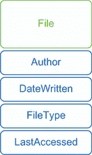

# 8 对象：另一种名称的数据

在本章中，我们将做一些不同的事情。PowerShell 对对象的使用可能是它最令人困惑的元素之一，但与此同时，它也是 shell 中最关键的概念之一，影响着你在 shell 中做的每一件事。多年来，我们尝试了各种解释，并最终选择了几个针对不同受众都效果良好的解释。如果你有编程经验并且对对象的概念感到舒适，我们希望你跳到第 8.2 节。如果你没有编程背景，之前也没有使用对象进行编程或脚本编写，请从第 8.1 节开始，并直接阅读整章。

## 8.1 什么是对象？

请花点时间在 PowerShell 中运行`Get-Process`。你应该会看到一个包含多个列的表格，但这些列只是触及了关于进程的丰富信息的表面。每个进程对象还有一个机器名、主窗口句柄、最大工作集大小、退出代码和时间、处理器亲和力信息等等。你会发现与进程相关联的信息超过 60 条。为什么 PowerShell 只显示这么少的信息呢？

事实简单来说就是，PowerShell 可以访问的*大多数*事物提供的信息比屏幕上能舒适显示的还要多。当你运行任何命令，例如`Get-Process`、`Get-AzVm`或`Get-AzStorageBlob`时，PowerShell 完全在内存中构建一个包含那些项目所有信息的表格。对于`Get-Process`，这个表格包含大约 67 列，每列对应你电脑上运行的一个进程。每一列包含一些信息，例如虚拟内存、CPU 利用率、进程名称、进程 ID 等等。然后 PowerShell 会查看你是否指定了想要查看的列。如果你没有指定，shell 会查找由 Microsoft 提供的配置文件，并仅显示 Microsoft 认为你想要看到的表格列。

一种查看所有列的方法是使用`ConvertTo-Html`：

```
Get-Process | ConvertTo-Html | Out-File processes.html
```

该 cmdlet 不会过滤列。相反，它生成一个包含所有列的 HTML 文件。这是查看整个表格的一种方法。

除了所有这些信息列之外，每一行表格都与一些操作相关联。这些操作包括操作系统可以对表格中列出的进程执行或与之相关的操作。例如，操作系统可以关闭进程、终止它、刷新其信息或等待进程退出等等。

无论何时你运行产生输出的命令，该输出都以内存中的表格形式存在。当你将一个命令的输出通过管道传递到另一个命令时，就像这样

```
Get-Process | ConvertTo-Html 
```

整个表格都会通过管道传递。表格不会过滤到更少的列，直到每个命令都运行完毕。

现在有一些术语上的变化。PowerShell 不会将这个内存中的表格称为表格。相反，它使用以下术语：

+   *对象*——这是我们所说的表格行。它代表单个事物，例如单个进程或单个存储账户。

+   *属性*——这是我们所说的表格列。它代表关于一个对象的信息的一部分，例如进程名称、进程 ID 或虚拟机的运行状态。

+   *方法*——这是我们所说的动作。方法与单个对象相关联，并使该对象执行某些操作——例如，终止进程或启动虚拟机。

+   *集合*——这是整个对象集合，或者我们称之为表格。

如果你发现以下关于对象的讨论令人困惑，请参考以下四点清单。始终想象一个*集合*的对象是一个大型的内存中的信息表，其中*属性*是列，而单个*对象*是行（图 8.1）。



图 8.1 展示对象（文件）具有多个属性，如`Author`和`FileType`

## 8.2 理解 PowerShell 使用对象的原因

PowerShell 使用对象来表示数据的一个原因是，毕竟，你必须以某种方式表示数据，对吧？PowerShell 本可以将数据存储为 XML 格式，或者也许它的创造者可能决定使用纯文本表格。但他们有特定的原因不选择这些路径。

第一个原因是由于 PowerShell 之前的历史，它曾经是仅限 Windows 使用的。Windows 本身是一个面向对象的操作系统——至少，在 Windows 上运行的大多数软件都是面向对象的。选择将数据结构化为对象集合是很容易的，因为操作系统的大部分功能都适合这些结构。实际上，我们可以将面向对象的思想应用到其他操作系统，甚至应用到云和 DevOps 等其他范式。

使用对象的另一个原因是它们最终使你的工作变得更简单，并赋予你更多的权力和灵活性。暂时假设 PowerShell 的命令不会以对象的形式输出。相反，它以简单的文本表格的形式输出，这可能是你最初认为它正在做的事情。当你运行`Get-Process`这样的命令时，你得到的是格式化的文本输出：

```
PS /Users/travis> Get-Process
Handles  NPM(K)    PM(K)      WS(K) VM(M)   CPU(s)     Id ProcessName
-------  ------    -----      ----- -----   ------     -- -----------
     39       5     1876       4340    52    11.33   1920 Code
     31       4      792       2260    22     0.00   2460 Code
     29       4      828       2284    41     0.25   3192 Code
    574      12     1864       3896    43     1.30    316 pwsh
    181      13     5892       6348    59     9.14    356 ShipIt
    306      29    13936      18312   139     4.36   1300 storeaccountd
    125      15     2528       6048    37     0.17   1756 WifiAgent
   5159    7329    85052      86436   118     1.80   1356 WifiProxy
```

如果你想用这些信息做其他事情呢？也许你想要更改所有正在运行的`Code`进程。为此，你需要对列表进行一些筛选。在 UNIX 或 Linux 系统上，你可能尝试使用`grep`命令（顺便说一句，你可以在 PowerShell 中运行它！），告诉它，“为我查看这个文本列表。只保留那些第 58 至 64 列包含字符`Code`的行。删除所有其他行。”结果列表中只包含你指定的进程：

```
Handles  NPM(K)    PM(K)      WS(K) VM(M)   CPU(s)     Id ProcessName
-------  ------    -----      ----- -----   ------     -- -----------
     39       5     1876       4340    52    11.33   1920 Code
     31       4      792       2260    22     0.00   2460 Code
     29       4      828       2284    41     0.25   3192 Code
```

然后，你将文本传递给另一个命令，可能告诉它从列表中提取进程 ID。“遍历这个列表，从第 52 到第 56 列获取字符，但丢弃前两行（标题行）。”结果可能如下所示：

```
1920
2460
3192
```

最后，你将*那个*文本传递给另一个命令，要求它终止由那些 ID 号表示的进程（或你试图做的其他任何事情）。

这正是使用`bash`的 IT 专业人士的工作方式。他们花费大量时间学习如何更好地解析文本；使用`grep`、`awk`和`sed`等工具；并精通正则表达式的使用。通过这个过程的学习，他们更容易定义他们想要计算机查找的文本模式。在 PowerShell 跨平台之前的日子里，UNIX 和 Linux IT 专业人士会依赖于像 Perl 和 Python 这样的脚本语言，这些语言在文本解析方面提供了更多的功能。但这种方法确实存在一些问题：

+   你可能会花更多的时间在文本上，而不是做你的本职工作。

+   如果命令的输出发生了变化——比如说，将 ProcessName 列移动到表格的开始位置——那么你必须重写所有的命令，因为它们都依赖于诸如列位置之类的因素。

+   你必须精通解析文本的语言和工具——不是因为你的工作涉及解析文本，而是因为解析文本是实现目标的一种手段。

+   像 Perl 和 Python 这样的语言是可靠的脚本语言……但它们并不是 shell。

PowerShell 使用对象有助于消除所有这些文本操作的开销。因为对象在内存中像表格一样工作，你不必告诉 PowerShell 信息所在的文本列。相反，你只需告诉它列名，PowerShell 就能准确地知道去哪里获取那些数据。无论你如何安排最终在屏幕或文件中的输出，内存中的表格总是相同的，所以你永远不需要因为列的移动而重写命令。你将花费更少的时间在开销任务上，更多的时间专注于你想要完成的事情。

的确，你必须学习一些语法元素，以便正确地指导 PowerShell，但你必须学习的比在纯文本 shell 中工作时要少得多。

**不要生气** 顺便说一下，前面提到的内容并不是在贬低 Bash、Perl 或 Python。每个工具都有其优缺点。Python 是一种伟大的通用编程语言，甚至已经进入机器学习和人工智能领域——但这并不是你阅读这本书的原因。你是在寻找能够提升你作为 IT 专业人士技能的东西，而 PowerShell 正是这样的工具。

## 8.3 发现对象：Get-Member

如果对象在内存中就像一个巨大的表格，而 PowerShell 只在屏幕上显示表格的一部分，你怎么能看到你还有哪些可以操作的呢？如果你认为你应该使用 `Get-Help` 命令，我们很高兴，因为我们确实在前面几章中一直在推荐这个命令。但不幸的是，你会错的。

帮助系统仅记录背景概念（以 about 主题的形式）和命令语法。要了解更多关于对象的信息，你使用不同的命令：`Get-Member`。你应该习惯使用这个命令——如此习惯，以至于你开始寻找更简短的输入方式。我们现在就给你：别名 `gm`。

你可以在任何通常产生输出的 cmdlet 后面使用 `gm`。例如，你已经知道运行 `Get-Process` 会在屏幕上产生输出。你可以将其管道化到 `gm`：

```
Get-Process | gm
```

每当 cmdlet 产生一系列对象，就像 `Get-Process` 所做的那样，整个集合在管道的末端之前都是可访问的。只有在每个命令都运行之后，PowerShell 才会过滤要显示的信息列并创建你看到的最终文本输出。因此，在上面的例子中，`gm` 对所有进程对象的属性和方法都有完全的访问权限，因为它们还没有被过滤以供显示。`gm` 会查看每个对象并构建一个包含对象属性和方法的列表。它看起来像这样：

```
PS C:\> Get-Process | gm
   TypeName: System.Diagnostics.Process
Name                       MemberType     Definition
----                       ----------     ----------
Handles                    AliasProperty  Handles = Handlecount
Name                       AliasProperty  Name = ProcessName
NPM                        AliasProperty  NPM = NonpagedSystemMemo...
PM                         AliasProperty  PM = PagedMemorySize
VM                         AliasProperty  VM = VirtualMemorySize
WS                         AliasProperty  WS = WorkingSet
Disposed                   Event          System.EventHandler Disp...
ErrorDataReceived          Event          System.Diagnostics.DataR...
Exited                     Event          System.EventHandler Exit...
OutputDataReceived         Event          System.Diagnostics.DataR...
BeginErrorReadLine         Method         System.Void BeginErrorRe...
BeginOutputReadLine        Method         System.Void BeginOutputR...
CancelErrorRead            Method         System.Void CancelErrorR...
CancelOutputRead           Method         System.Void CancelOutput...
```

我们已经缩减了前面的列表，因为它很长，但希望你能理解这个概念。

现在就试试 不要只听我们的话。现在是跟随我们运行相同的命令并查看它们完整输出的完美时机。

顺便说一下，你可能想知道，所有附加到对象上的属性、方法和其他东西统称为该对象的 *members*，就像对象本身是一个俱乐部，所有这些属性和方法都属于这个俱乐部。这就是 `Get-Member` 命令名称的由来——它正在获取对象成员的列表。但请记住，因为 PowerShell 习惯于使用单数名词，所以 cmdlet 名称是 `Get-Member`，而不是 `Get-Members`。

重要事项 它很容易被忽视，但请注意 `Get-Member` 命令输出的第一行。它是 `TypeName`，这是分配给该特定类型对象的唯一名称。现在可能看起来并不重要——毕竟，谁在乎它叫什么名字呢？但它在下一章中将会变得至关重要。

## 8.4 使用对象属性，或属性

当你检查 `gm` 的输出时，你会注意到几种不同的属性：

+   `ScriptProperty`

+   `Property`

+   `NoteProperty`

+   `AliasProperty`

除此之外

通常情况下，.NET 中的对象——所有 PowerShell 对象都来自这里——只有属性。PowerShell 动态添加其他内容：`ScriptProperty`、`NoteProperty`、`AliasProperty` 等等。如果你在微软的文档中查找一个对象类型（你可以将对象的 `TypeName` 插入你喜欢的搜索引擎以找到 docs.microsoft.com 页面），你不会看到这些额外的属性。

PowerShell 有一个可扩展的类型系统（ETS），它负责添加这些最后的属性。为什么它会这样做呢？在某些情况下，是为了使对象更加一致，例如为只具有类似 `ProcessName`（这就是 `AliasProperty` 的用途）的对象添加一个 `Name` 属性。有时是为了暴露对象中深深隐藏的信息（进程对象有几个 `ScriptProperties` 用于此目的）。

一旦你进入 PowerShell，这些属性的行为方式都是相同的。但当你发现它们没有出现在官方文档页面上时，不要感到惊讶：shell 添加了这些额外的功能，通常是为了使你的生活更轻松。

对于你的用途来说，这些属性都是相同的。唯一的区别在于属性最初是如何创建的，但这不是你需要担心的事情。对你来说，它们都是属性，你将以相同的方式使用它们。

属性总是包含一个值。例如，进程对象的 `ID` 属性的值可能是 `1234`，而该对象的 `Name` 属性的值可能是 `Code`。属性描述了关于对象的一些信息：其状态、其 ID、其名称等等。在 PowerShell 中，属性通常是只读的，这意味着你不能通过为其 `Name` 属性分配新值来更改服务的名称。但你可以通过读取其 `Name` 属性来检索服务的名称。我们估计，你将在 PowerShell 中做的 90% 的工作都涉及到属性。

## 8.5 使用对象操作或方法

许多对象支持一个或多个方法，正如我们之前提到的，这些方法是你可以指示对象执行的操作。进程对象有一个 `Kill` 方法，它可以终止进程。一些方法需要一个或多个输入参数，这些参数为该特定操作提供额外的详细信息，但在这个 PowerShell 教育的早期阶段，你不会遇到这些。你可能会花几个月甚至几年时间使用 PowerShell，但可能永远不需要执行单个对象方法。这是因为许多这些操作也由 cmdlet 提供。

例如，如果你需要终止一个进程，你有三种方法可以做到。一种方法是通过检索对象然后以某种方式执行其 `Kill` 方法。另一种方法是使用几个 cmdlet：

```
Get-Process -Name Code | Stop-Process
```

你也可以通过使用单个 cmdlet 来完成这个操作：

```
Stop-Process -Name Code
```

本书的主要关注点是使用 PowerShell cmdlets 完成任务。它们提供了最简单、最以 IT 专业人士为中心、最以任务为导向的方式来实现目标。使用方法开始逐渐涉及 .NET 编程，这可能更复杂，可能需要更多的背景信息。因此，你很少——如果有的话——会看到我们在本书中执行对象方法。我们现在的普遍哲学是，“如果你不能用 cmdlet 完成，就回去使用 GUI。”我们承诺，你不会在整个职业生涯中都这样感觉，但现在这是一个保持对“PowerShell 方式”做事的关注的好方法。

超越

在你的 PowerShell 教育的这个阶段，你不需要了解它们，但除了属性和方法之外，对象还可以有事件。事件是对象通知你发生了某种事情的方式。例如，进程对象可以在进程结束时触发其 `Exited` 事件。你可以将你自己的命令附加到这些事件上，例如，当进程退出时发送电子邮件。以这种方式处理事件是一个高级主题，超出了本书的范围。

## 8.6 对象排序

大多数 PowerShell cmdlets 以确定性的方式生成对象，这意味着它们倾向于在每次运行命令时以相同的顺序生成对象。例如，Azure VM 和进程都是按名称的字母顺序列出的。如果我们想改变这一点怎么办？

假设我们想要显示一个进程列表，将 CPU 消耗最大的进程放在列表顶部，最小的消耗者放在底部。我们需要根据 `CPU` 属性重新排序这个对象列表。PowerShell 提供了一个简单的 cmdlet，`Sort-Object`，它正好可以做到这一点：

```
Get-Process | Sort-Object -Property CPU 
```

现在尝试一下 我们希望你能跟随并运行本章中的命令。我们不会将输出粘贴到书中，因为这些表格很长。

这个命令并不完全符合我们的要求。它确实按 CPU 排序，但它是以升序排序的，最大的值在列表底部。阅读 `Sort-Object` 的帮助，我们看到它有一个 `-Descending` 参数，可以反转排序顺序。我们还注意到 `-Property` 参数是位置参数，因此我们不需要输入参数名。

我们将 `-Descending` 缩写为 `-desc`，我们得到了我们想要的结果。`-Property` 参数接受多个值（我们确信如果你查看了帮助文件，你会看到）。

如果两个进程使用了相同数量的虚拟内存，我们希望它们按进程 ID 排序，以下命令可以完成这个任务：

```
Get-Process | Sort-Object CPU,ID -desc
```

和往常一样，逗号分隔的列表是传递多个值给任何支持它们的参数的方式。

## 8.7 选择你想要的属性

另一个有用的 cmdlet 是`Select-Object`。它接受来自管道的对象，你可以指定你想要显示的属性。这使你能够访问通常由 PowerShell 的配置规则过滤掉的性质，或者将列表缩减到你感兴趣的一两个属性。这在将对象传递给`ConvertTo-HTML`时非常有用，因为该 cmdlet 通常构建包含每个属性的表格。比较以下两个命令的结果：

```
Get-Process | ConvertTo-HTML | Out-File test1.html
Get-Process | Select-Object -Property Name,ID,CPU,PM | ConvertTo-Html | 
➥ Out-File test2.html
```

现在就试试吧，分别运行这些命令，然后在网页浏览器中查看生成的 HTML 文件以查看差异。

查看关于`Select-Object`的帮助（或者你可以使用它的别名`Select`）。`-Property`参数是位置参数，这意味着我们可以缩短最后一个命令：

```
Get-Process | Select Name,ID,CPU,PM | ConvertTo-HTML | Out-File test3.html
```

花些时间实验`Select-Object`。尝试以下命令的变体，它允许输出显示在屏幕上：

```
Get-Process | Select Name,ID,CPU,PM
```

尝试从该列表中添加和删除不同的进程对象属性，并查看结果。你能指定多少个属性仍然得到表格作为输出？有多少个属性会强制 PowerShell 将输出格式化为列表而不是表格？

除此之外

`Select-Object`也有`-First`和`-Last`参数，这让你可以保留管道中的对象子集。例如，`Get-Process` `|` `Select` `-First` `10`保留前 10 个对象。这里没有涉及任何标准，例如保留某些进程；它只是获取前（或后）10 个。

警告：人们经常混淆两个 PowerShell 命令：`Select-Object`和`Where-Object`，你还没有看到过。`Select-Object`用于选择你想要看到的属性（或列），它还可以选择输出行的任意子集（使用`-First`和`-Last`）。`Where-Object`根据你指定的标准从管道中删除或过滤对象。

## 8.8 对象直到结束

PowerShell 管道在最后一个命令执行之前始终包含对象。那时，PowerShell 会查看管道中的对象，然后查看其各种配置文件以确定使用哪些属性来构建屏幕显示。它还会根据内部规则和配置文件决定该显示是表格还是列表。（我们将在第十章中解释更多关于这些规则和配置，以及如何修改它们。）

一个重要的事实是，管道可以在单个命令行中包含许多种类的对象。在接下来的几个例子中，我们将取一个单独的命令行并实际输入，这样只有一条命令出现在文本的一行上。这将使解释我们谈论的内容更容易一些。这是第一个例子：

```
Get-Process |                 
Sort-Object CPU -Descending |  
Out-File c:\procs.txt
```

在这个例子中，我们首先运行 `Get-Process`，将进程对象放入管道。下一个命令是 `Sort-Object`。这不会改变管道中的内容；它只改变对象的顺序，所以在 `Sort-Object` 的末尾，管道仍然包含进程。最后一个命令是 `Out-File`。在这里，PowerShell 必须生成输出，所以它会将管道中的内容——进程——格式化为其内部规则集。结果被放入指定的文件。接下来是一个更复杂的例子：

```
Get-Process |                 
Sort-Object CPU -Descending |  
Select-Object Name,ID,CPU      
```

这是从相同的方式开始的。`Get-Process` 将进程对象放入管道。这些对象进入 `Sort-Object`，对其进行排序并将相同的进程对象放入管道。但 `Select-Object` 的工作方式略有不同。进程对象始终具有完全相同的成员。为了缩减属性列表，`Select-Object` 不能删除您不想要的属性，因为结果将不再是进程对象。相反，`Select-Object` 创建了一种新的自定义对象，称为 PSObject。它从进程复制您想要的属性，从而在管道中放置一个自定义对象。

现在尝试运行这个三个 cmdlet 的命令行，记住您应该在一行中输入整个命令。注意输出与 `Get-Process` 的正常输出有何不同？

当 PowerShell 发现它已经到达了命令行的末尾，它必须决定如何布局文本输出。因为管道中不再有任何进程对象，PowerShell 不会使用适用于进程对象的默认规则和配置。相反，它会寻找适用于 PSObject 的规则和配置，这正是管道现在所包含的内容。Microsoft 没有为 PSObjects 提供任何规则或配置，因为它们旨在用于自定义输出。相反，PowerShell 会做出最佳猜测，并生成一个表格，基于这样的理论：这三条信息可能仍然适合放入表格中。然而，这个表格的布局并不像 `Get-Process` 的正常输出那样整齐，因为外壳缺少制作更美观表格所需的额外配置信息。

您可以使用 `gm` 来查看最终进入管道的对象。记住，您可以在任何产生输出的 cmdlet 后添加 `gm`：

```
Get-Process | Sort-Object CPU -Descending | gm
Get-Process | Sort-Object CPU -Descending | Select Name,ID,CPU | gm
```

现在尝试分别运行这两个命令行，并注意输出的差异。

注意，作为 `gm` 输出的一部分，PowerShell 会向您显示它在管道中看到的对象的类型名称。在第一种情况下，这是一个 `System.Diagnostics.Process` 对象，但在第二种情况下，管道包含不同类型的对象。这些新的 *选定* 对象仅包含指定的三个属性——`Name`、`ID` 和 `CPU`——以及一些系统生成的成员。

即使`gm`也会产生对象并将它们放入管道中。运行`gm`后，管道中不再包含进程或*选定的*对象；它包含`gm`产生的对象类型：`Microsoft.PowerShell.Commands.MemberDefinition`。你可以通过将`gm`的输出管道传输到`gm`本身来证明这一点：

```
Get-Process | gm | gm
```

现在尝试一下：你肯定会想尝试这个，并且要深思熟虑，确保它对你来说是有意义的。你从`Get-Process`开始，它将进程对象放入管道。这些对象进入`gm`，它分析它们并产生自己的`MemberDefinition`对象。然后这些对象被管道传输到`gm`，它分析它们并产生输出，列出每个`Member-Definition`对象的成员。

掌握 PowerShell 的关键在于学会在任何给定时刻跟踪管道中对象的类型。虽然`gm`可以帮助你做到这一点，但退后一步，通过口头解释命令行也是一项很好的练习，可以帮助消除困惑。

## 8.9 常见混淆点

新手在开始使用 PowerShell 时往往会犯一些常见的错误。大多数这些错误随着经验的积累会消失，但我们通过以下列表将你的注意力引向它们，以便你在开始走错路时有机会纠正自己。

+   记住，PowerShell 的帮助文件不包含关于对象属性的信息。你需要将对象管道传输到`gm`（`Get-Member`）以查看属性列表。

+   记住，你可以在通常会产生结果的任何管道末尾添加`gm`。例如，像`Get-Process -Name Code | Stop-Process`这样的命令行通常不会产生结果，所以将`| gm`附加到末尾也不会产生任何结果。

+   注意整洁的打字。在每一个管道字符的两侧都加上一个空格，因为你的命令行应该读作`Get-Process | gm`而不是`Get-Process|gm`。那个空格键之所以特别大，是有原因的——请使用它。

+   记住，管道在每一步都可能包含各种类型的对象。思考一下管道中是什么类型的对象，并关注下一个命令将对这种类型的对象做什么。

## 8.10 实验室

注意：对于这个实验，你需要任何运行 PowerShell v7 或更高版本的计算机。

本章可能涵盖了比迄今为止任何章节都多、难度更大的新概念。我们希望你能理解所有这些内容，并且希望这些练习能帮助你巩固所学知识。实验室可能比之前的实验室更具挑战性，但我们希望你能养成找出要使用哪些命令的习惯——依靠`get-command`和帮助，而不是依靠我们，来找到正确的命令。毕竟，一旦你开始在工作中使用 PowerShell 并遇到书中未涉及的各种情况，你将需要这样做。其中一些任务依赖于你在前面章节中学到的技能，以帮助你刷新记忆并保持敏锐：

1.  识别一个产生随机数的 cmdlet。

1.  识别一个显示当前日期和时间的 cmdlet。

1.  任务 2 中的 cmdlet 产生什么类型的对象？（cmdlet 产生的对象的*TypeName*是什么？）

1.  使用任务 2 中的 cmdlet 和`Select-Object`，以如下表格形式显示当前星期几（注意：输出将右对齐，所以请确保你的 PowerShell 窗口没有水平滚动条）：

    ```
    DayOfWeek
    ---------
       Monday
    ```

1.  识别一个可以显示目录中所有时间的 cmdlet。

1.  使用任务 5 中的 cmdlet，显示你选择的目录中的所有时间。然后扩展表达式，按创建时间对列表进行排序，并仅显示文件名和创建日期。记住，命令默认输出中显示的列标题不一定是真正的属性名——你需要查找真正的属性名来确保。

1.  重复任务 6，但这次按最后写入时间对项目进行排序；然后显示文件名、创建时间和最后写入时间。将此保存为 CSV 文件和 HTML 文件。

## 8.11 实验答案

1.  `Get-Random`

1.  `Get-Date`

1.  `System.DateTime`

1.  `Get-Date | select DayofWeek`

1.  `Get-ChildItem`

1.  `Get-ChildItem | Sort-Object CreationTime | Select-Object`

    `➥ 名称,创建时间`

1.  `Get-ChildItem | Sort-Object LastWritetime | Select-Object`

    `➥ 名称,最后写入时间,创建时间 | Export-CSV files.csv`

    `Get-ChildItem | Sort-Object LastWritetime | Select-Object`

    `➥ 名称,最后写入时间,创建时间 | Out-file files.html`
