# 10 管道，更深入

到目前为止，你已经学会了如何有效地使用 PowerShell 的管道。运行命令（例如，`Get-Process` `|` `Sort-Object` `VM` `-desc` `|` `ConvertTo-Html` `|` `Out-File procs.html`）非常强大，一行就能完成过去需要几行脚本才能完成的工作。但你可以做得更好。在本章中，我们将更深入地探讨管道，并揭示其一些最强大的功能，这些功能允许你以更少的努力正确地在命令之间传递数据。

## 10.1 管道：通过更少的输入实现强大功能

我们非常喜欢 PowerShell 的一个原因是可以让我们成为更有效的管理员，而无需编写复杂的脚本，就像我们过去在 Bash 中必须做的那样。强大的一行命令的关键在于 PowerShell 管道的工作方式。

让我们明确一下：你可以跳过这一章，仍然有效地使用 PowerShell，但在大多数情况下，你将不得不求助于 Bash 风格的脚本和程序。尽管 PowerShell 的管道功能可能很复杂，但它们可能比更复杂的编程技能更容易学习。通过学习如何操作管道，你可以更加高效，而无需编写脚本。

这里整个想法是让 shell 为你做更多的工作，尽可能少地输入。我们认为你会对 shell 能做得有多好感到惊讶！

## 10.2 PowerShell 如何将数据传递到管道中

每当你将两个命令串联起来时，PowerShell 必须找出如何将第一个命令的输出传递到第二个命令的输入。在即将到来的示例中，我们将第一个命令称为*命令 A*。这是产生内容的命令。第二个命令是*命令 B*，它需要接受命令 A 的输出，然后执行自己的操作：

```
CommandA | CommandB
```

例如，假设你有一个文本文件，每行包含一个模块名称，如图 10.1 所示。

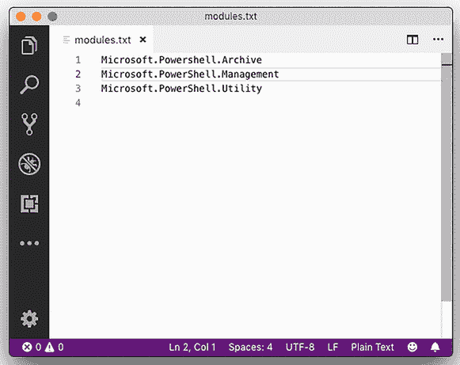

图 10.1 在 VS Code 中创建包含模块名称的文本文件，每行一个名称

你可能希望使用那些模块名称作为命令的输入，告诉该命令你希望它针对哪个模块运行。考虑以下示例：

```
Get-Content.\modules.txt | Get-Command
```

当`Get-Content`运行时，它将模块名称放入管道。PowerShell 随后必须决定如何将这些内容传递给`Get-Command`命令。PowerShell 的技巧是命令只能通过参数接受输入。PowerShell 必须找出`Get-Command`的哪个参数可以接受`Get-Content`的输出。这个找出过程被称为*pipeline parameter binding*，这是我们本章要介绍的内容。PowerShell 有两种方法将`Get-Content`的输出传递到`Get-Command`的参数上。shell 将尝试的第一种方法称为`ByValue`；如果这不起作用，它将尝试`ByPropertyName`。

## 10.3 计划 A：Pipeline 输入 ByValue

使用这种管道参数绑定方法，PowerShell 会查看命令 A 生成的对象类型，并尝试查看命令 B 的任何参数是否可以接受来自管道的该类型对象。你可以自己确定这一点：首先将命令 A 的输出通过管道传递到 `Get-Member` 以查看命令 A 生成的对象类型。然后检查命令 B 的完整帮助（例如，`Get-Help` `Get-Command` `-Full`）以查看是否有任何参数接受来自管道 `ByValue` 的该类型数据。图 10.2 展示了你可能会发现的内容。

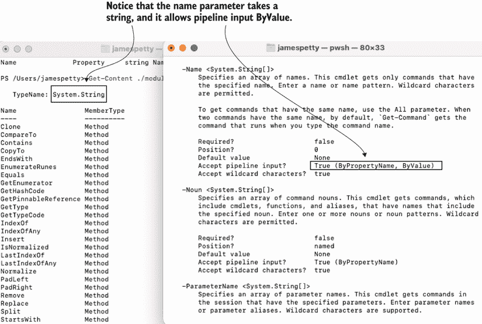

图 10.2 比较 `Get-Content` 的输出与 `Get-Command` 的输入参数

你会发现 `Get-Content` 生成 `System.String` 类型的对象（或简称为 `String`）。你还会发现 `Get-Command` 确实有一个参数可以接受来自管道 `ByValue` 的 `String`。问题是它是 `-Name` 参数，根据帮助信息，“指定了一个名称数组。此 cmdlet 仅获取具有指定名称的命令。”这不是我们想要的——我们的文本文件，因此我们的 `String` 对象是模块名称，而不是命令名称。如果我们运行

```
Get-Content .\modules.txt | Get-Command
```

我们将尝试检索名为 `Microsoft.PowerShell.Archive` 等的命令，这可能不会成功。

如果多个参数接受来自管道的相同类型，则所有参数都将接收相同的值。因为 `-Name` 参数接受来自管道 `ByValue` 的 `String`，所以从实际应用的角度来看，没有其他参数可以这样做。这打破了我们尝试将模块名称从我们的文本文件通过管道传递到 `Get-Command` 的希望。

在这种情况下，管道输入正在工作，但它并没有达到我们希望的结果。让我们考虑一个不同的例子，其中我们确实得到了我们想要的结果。以下是命令行：

```
Get-Content ./modules.txt | Get-Module
```

让我们将命令 A 的输出通过管道传递到 `Get-Member` 并检查命令 B 的完整帮助。图 10.3 展示了你将发现的内容。

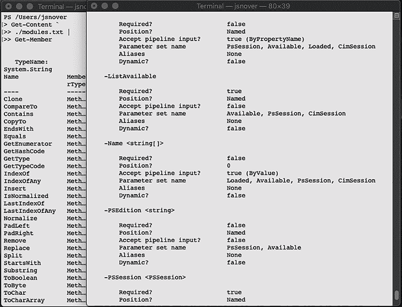

图 10.3 将 `Get-Content` 的输出绑定到 `Get-Module` 的参数

`Get-Content` 生成 `String` 类型的对象。`Get-Module` 可以从管道 `ByValue` 接受这些 `string` 对象；它在 `-Name` 参数上这样做。根据帮助信息，该参数“指定了 cmdlet 获取的模块的名称或名称模式。”换句话说，命令 A 获取一个或多个 `String` 对象，而命令 B 尝试找到字符串中的名称对应的模块。

提示：大多数情况下，具有相同名词（如 `Get-Process` 和 `Stop-Process`）的命令通常可以相互通过 `ByValue` 管道传递。花点时间看看你是否可以将 `Get-Process` 的输出通过管道传递到 `Stop-Process`。

让我们再举一个例子：

```
Get-ChildItem -File | Stop-Process -WhatIf
```

表面上看，这可能没有意义。但让我们通过将命令 A 的输出通过管道传递到 `Get-Member` 并重新检查命令 B 的帮助来探究这个问题。图 10.4 展示了你应该发现的内容。

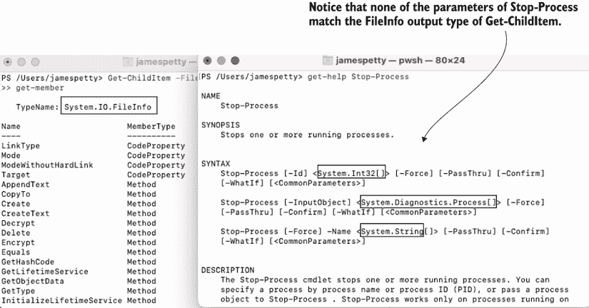

图 10.4 检查`Get-ChildItem`的输出和`Stop-Process`的输入参数

`Get-ChildItem`产生`FileInfo`类型的对象（技术上，是`System.IO.FileInfo`，但你通常可以将`TypeName`的最后部分作为快捷方式）。不幸的是，`Stop-Process`没有单个参数可以接受`FileInfo`对象。`ByValue`方法失败了，PowerShell 将尝试其备份计划：`ByPropertyName`。

## 10.4 计划 B：通过属性名管道输入

使用这种方法，你仍然希望将命令 A 的输出连接到命令 B 的参数。但`ByPropertyName`与`ByValue`略有不同。在这个备份方法中，命令 B 的多个参数可能都会被涉及。再次将命令 A 的输出通过管道连接到`Get-Member`，然后查看命令 B 的语法。图 10.5 显示了你应该找到的内容：命令 A 有一个属性名称与命令 B 上的参数相对应。

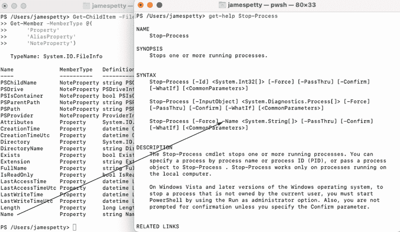

图 10.5 将属性映射到参数

许多人对这里发生的事情想得太多，所以让我们明确一下 shell 是如何简单的：它正在寻找与参数名称匹配的属性名称。就是这样。因为属性`Name`的拼写与参数`-Name`相同，shell 试图将两者连接起来。

但它不能立即这样做；首先它需要查看`-Name`参数是否会接受来自管道`ByPropertyName`的输入。需要查看完整的帮助信息，如图 10.6 所示，以做出这个判断。

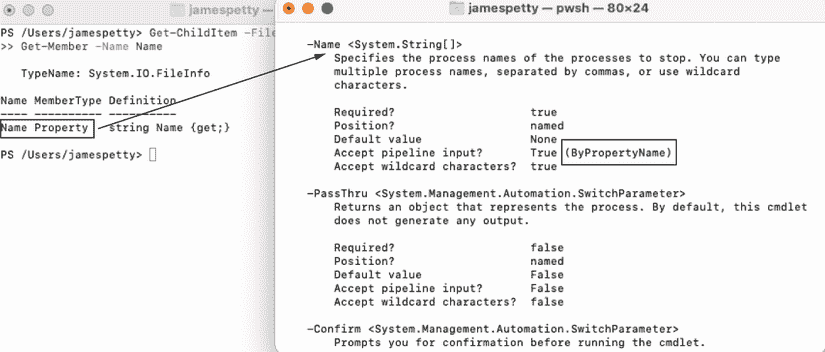

图 10.6 检查`Stop-Process`命令的`-Name`参数是否接受管道输入`ByPropertyName`

在这种情况下，`-Name`确实接受来自管道`ByPropertyName`的输入，因此这个连接是有效的。现在，这里有个技巧：与只涉及一个参数的`ByValue`不同，`ByPropertyName`将每个匹配的属性和参数（假设每个参数都设计为接受管道输入`ByPropertyName`）连接起来。在我们的当前示例中，只有`Name`和`-Name`匹配。结果如何？请查看图 10.7。

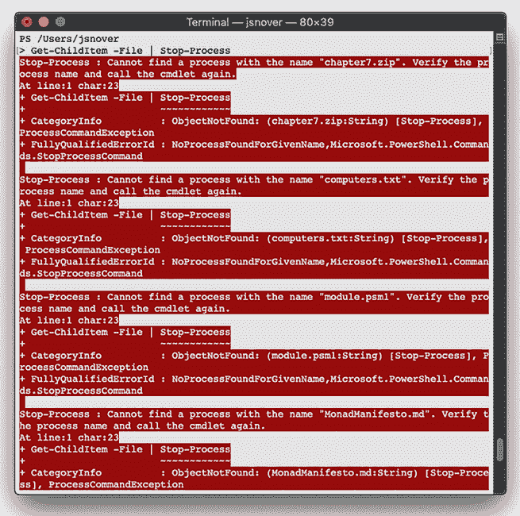

图 10.7 尝试将`Get-ChildItem`管道连接到`Stop-Process`

我们看到了一堆错误信息。问题是，文件名通常是像 chapter7.zip 和 computers.txt 这样的东西，而进程的可执行文件可能是像`pwsh`这样的东西。`Stop-Process`只处理这些可执行文件名。尽管`Name`属性通过管道连接到`-Name`参数，但`Name`属性内的值对`-Name`参数来说是没有意义的，这导致了错误。

让我们看看一个更成功的例子。在 Visual Studio Code 中创建一个简单的 CSV 文件，使用图 10.8 中的示例。

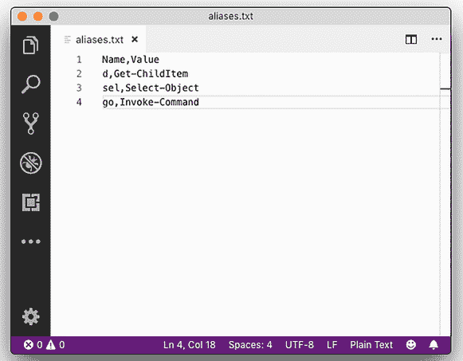

图 10.8 在 Visual Studio Code 中创建此 CSV 文件。

将文件保存为 aliases.txt。现在，回到 shell 中，尝试导入它，如图 10.9 所示。你还应该将`Import-Csv`的输出通过管道传递给`Get-Member`，这样你就可以检查输出成员。

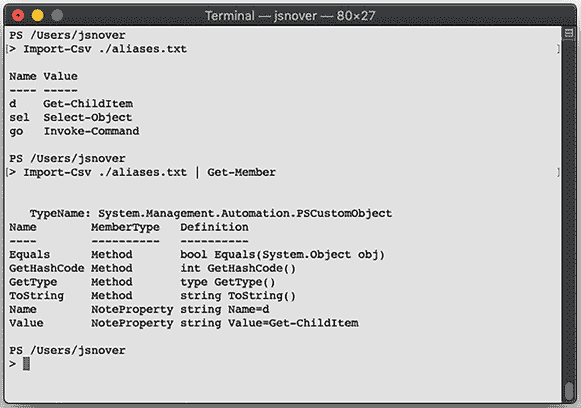

图 10.9 导入 CSV 文件并检查其成员

你可以清楚地看到 CSV 文件的列变成了属性，CSV 文件中的每一行数据变成了一个对象。现在，检查`New-Alias`的帮助信息，如图 10.10 所示。


图 10.10 将属性与参数名称匹配

这两个属性（`Name`和`Value`）对应于`New-Alias`的参数名称。显然，这是故意的——当你创建 CSV 文件时，你可以为这些列命名任何你想要的名称。现在，检查`-Name`和`-Value`是否接受管道输入`ByPropertyName`，如图 10.11 所示。

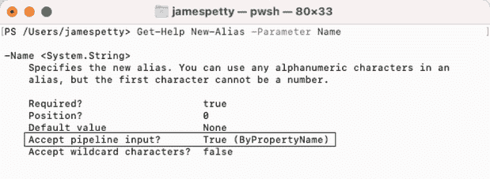

图 10.11 检查`Name`和`Value`是否接受管道输入`ByPropertyName`的参数

这两个参数都接受，这意味着这个技巧是有效的。尝试运行以下命令

```
Import-Csv .\aliases.txt | New-Alias
```

结果是三个新的别名，分别命名为`d`、`sel`和`go`，分别指向`Get-ChildItem`、`Select-Object`和`Invoke-Command`命令。这是一种强大的技术，可以将数据从一个命令传递到另一个命令，并在最少的命令数内完成复杂任务。

## 10.5 当事情不对齐时：自定义属性

CSV 示例很酷，但当你从头开始创建输入时，使属性和参数名称对齐相当容易。当你被迫处理为你创建的对象或他人生成的数据时，事情就变得复杂了。

对于下一个示例，让我们玩一个新的命令：`New-ADUser`。它是 Active Directory 模块的一部分。你可以在客户端计算机上通过安装 Microsoft 的远程服务器管理工具（RSAT）来获取该模块。但就现在而言，不要担心运行该命令；跟随示例进行。

`New-ADUser`具有设计用于接受有关新 Active Directory 用户信息的参数。以下是一些示例：

+   `-Name`（必需）

+   `-samAccountName`（技术上不是必需的，但你必须提供它才能使账户可用）

+   `-Department`

+   `-City`

+   `-Title`

我们可以涵盖其他内容，但让我们处理这些。所有这些都接受管道输入`ByPropertyName`。

对于这个示例，你将再次假设你正在获取一个 CSV 文件，但它来自你公司的人力资源或人事部门。你已经给他们提供了你想要的文件格式十几次，但他们仍然坚持给你一些接近但并不完全正确的东西，如图 10.12 所示。

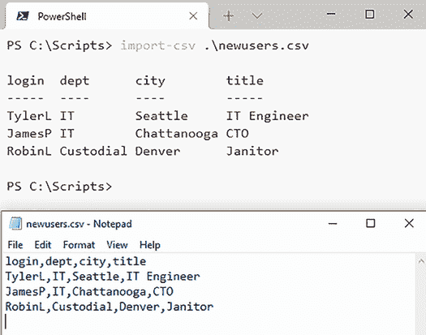

图 10.12 使用人力资源部门提供的 CSV 文件

如图 10.12 所示，外壳可以很好地导入 CSV 文件，结果是有三个对象，每个对象有四个属性。问题是 `dept` 属性不会与 `New-ADUser` 的 `-Department` 参数对齐，`login` 属性没有意义，你没有 `samAccountName` 或 `Name` 属性——这两个属性都是运行此命令创建新用户所必需的：

```
PS C:\> import-csv .\newusers.csv | new-aduser
```

你该如何解决这个问题？你可以打开 CSV 文件并修复它，但这需要大量的手动工作，而 PowerShell 的整个目的就是减少手动劳动。为什么不设置外壳来修复它呢？看看下面的例子：

```
PS C:\> import-csv .\newusers.csv |
>> select-object -property *,
>>  @{name='samAccountName';expression={$_.login}},
>>  @{label='Name';expression={$_.login}},
>>  @{n='Department';e={$_.Dept}}
>>
login          : TylerL
dept           : IT
city           : Seattle
title          : IT Engineer
samAccountName : TylerL
Name           : TylerL
Department     : IT
login          : JamesP
dept           : IT
city           : Chattanooga
title          : CTO
samAccountName : JamesP
Name           : Jamesp
Department     : IT
login          : RobinL
dept           : Custodial
city           : Denver
title          : Janitor
samAccountName : RobinL
Name           : RobinL
Department     : Custodial
```

这是一种相当奇怪的语法，所以让我们来分解一下：

+   我们使用 `Select-Object` 和其 `-Property` 参数。我们首先指定属性 `*`，这意味着“所有现有属性”。请注意，`*` 后面跟着一个逗号，这意味着我们正在继续属性列表。

+   然后我们创建一个哈希表，这是一个以 `@{` 开始并以 `}` 结束的结构。哈希表由一个或多个键值对组成，`Select-Object` 已经被编程为查找特定的键，我们将提供给它。

+   `Select-Object` 想要的第一个键可以是 `Name`、`N`、`Label` 或 `L`，该键的值是我们想要创建的属性的名称。在第一个哈希表中，我们指定了 `samAccountName;`，在第二个中，`Name;`，在第三个中，`Department`。这些对应于 `New-ADUser` 的参数名称。

+   `Select-Object` 需要的第二个键可以是 `Expression` 或 `E`。该键的值是一个脚本块，包含在大括号 `{}` 内。在这个脚本块中，你使用特殊的 `$_` 占位符来引用现有的管道输入对象（CSV 文件的原始行数据）后跟一个点。占位符 `$_` 允许你访问管道输入对象的某个属性，或 CSV 文件的某一列。这指定了新属性的内容。

现在试试看。创建图 10.12 所示的 CSV 文件。然后尝试运行我们之前所做的确切命令——你可以按显示的完全一样地输入它。

我们所做的是取 CSV 文件的内容——`Import-CSV` 的输出——并在管道中动态地修改它。我们的新输出与 `New-ADUser` 想要看到的内容相匹配，因此我们现在可以通过运行此命令来创建新用户：

```
PS C:\> import-csv .\newusers.csv |
>> select-object -property *,
>>  @{name='samAccountName';expression={$_.login}},
>>  @{label='Name';expression={$_.login}},
>>  @{n='Department';e={$_.Dept}} |
>> new-aduser
>>
```

语法可能有点丑陋，但这项技术非常强大。它也可以在 PowerShell 的许多其他地方使用，你将在接下来的章节中再次看到它。你甚至会在 PowerShell 帮助文件中的示例中看到它；运行 `Help Select` `-Example` 并亲自查看。

## 10.6 使用 Azure PowerShell

在本章的剩余部分，我们将假设你已经设置了 Azure PowerShell。所以，让我们让它工作起来。如果你没有订阅，你可以在这里注册试用：[`azure.microsoft.com/en-us/free/`](https://azure.microsoft.com/en-us/free/)。如果这个链接已过时，请搜索 Azure 免费试用。

一旦你有了订阅，确保你已经安装了 Az 模块。回顾第七章，但命令是

```
Install-Module az
```

现在，你已经安装了 Az，运行 `Connect-AzAccount` 并按照说明操作；目前，它要求你打开浏览器并输入代码。它应该会告诉你你已经连接，通过打印你的电子邮件、订阅名称和其他一些信息。

如果你与账户关联了多个订阅，你可能会连接到错误的订阅。如果是这样，请确保你选择了正确的订阅。如果你的订阅名称是 Visual Studio Enterprise，则命令将是 `Select-AzSubscription -SubscriptionName 'Visual Studio Enterprise'`。

## 10.7 括号命令

有时候，无论你多么努力，你都无法使管道输入工作。例如，考虑 `Get-Command`。查看其 `-Module` 参数的帮助，如图 10.13 所示。

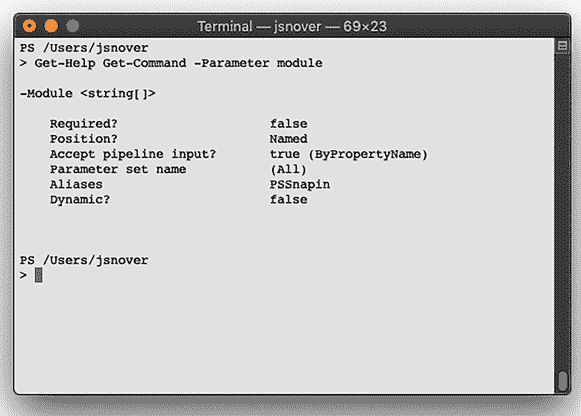

图 10.13 读取 `Get-Command` 的 `Module` 参数帮助

尽管此参数接受来自管道的模块名称，但它通过属性名称来执行。有时命令可能根本不接受管道输入。在这种情况下，我们一直在讨论的方法更容易。以下将不起作用：

```
Get-Content .\modules.txt | Get-Command
```

`Get-Content` 生成的 `String` 对象不会匹配 `Get-Command` 的 `-Module` 参数，而是应该使用 `-Name`。我们该怎么办？使用括号：

```
PS /Users/tylerl> Get-Command -Module (Get-Content ./modules.txt)
```

回想一下高中代数课，你会记得括号意味着“先做这个”。这就是 PowerShell 所做的：它首先运行括号内的命令。该命令的结果——在本例中是一系列 `String` 对象——被传递到参数。因为 `-Module` 恰好需要一系列 `String` 对象，所以命令可以正常工作。

现在试试看。使用 `Get-Module -ListAvailable` 获取一些模块名称进行测试；然后继续尝试那个命令。将正确的模块名称放入你自己的 modules.txt 文件中。

括号命令技巧很强大，因为它完全不依赖于管道参数绑定——它直接将对象放入参数中。但如果你的括号命令没有生成参数期望的确切类型的对象，那么有时你将不得不稍微操作一下。让我们看看如何操作。

## 10.8 从单个属性中提取值

在第 10.7 节中，我们展示了使用括号执行 `Get-Content` 的示例，将其输出传递给另一个 cmdlet 的参数：

```
Get-Command -Module (Get-Content ./modules.txt) 
```

让我们来探索括号的其他用法。有一个命令用于创建一个名为 `New-AzStorageAccount` 的存储账户。假设你想创建一个存储账户并将其放入一个已经存在于 Azure 位置的资源组中。与其从现有的文本文件中获取资源组名称，你可能会想从 Azure 查询现有的资源组名称。使用 Az.Storage 模块（该模块包含在我们第 10.6 节中安装的 Az 模块中），你可以查询一个位置中的所有资源组：

```
Get-AzResourceGroup -Location westus2
```

你可以使用相同的括号技巧将资源组名称提供给 `New-AzStorageAccount` 吗？例如，以下命令会起作用吗？

```
PS /Users/tylerl> New-AzStorageAccount -ResourceGroupName 
➥ (Get-AzResourceGroup -Location westus2| Select-Object -First 1) 
➥ -Name test0719 -SkuName Standard_ZRS -Location westus2
```

很遗憾，它不会。查看 `New-AzStorageAccount` 的帮助，你会看到 `-ResourceGroupName` 参数期望 `String` 类型的值。注意，添加了 `Select-Object -First 1` 以获取第一个资源组，因为 `-ResourceGroupName` 只接受一个字符串，而不是字符串数组。

替换为以下命令：

```
Get-AzResourceGroup | Get-Member
```

`Get-Member` 显示 `Get-AzResourceGroup` 生成的是 `PSResourceGroup` 类型的对象。这些不是 `String` 对象，所以 `-ResourceGroupName` 不会知道如何处理它们。但是，`PSResourceGroup` 对象确实有一个 `ResourceGroupName` 属性。你需要做的是提取对象的 `ResourceGroupName` 属性的值，并将这些值（即资源组名称）提供给 `-ResourceGroupName` 参数。

小贴士：这是关于 PowerShell 的一个重要事实，如果你现在有点困惑，*请停止*并重新阅读前面的段落。《Get-AzResourceGroup》生成 `PSResourceGroup` 类型的对象；`Get-Member` 证明了这一点。《New-AzStorageAccount》的 `-ResourceGroupName` 参数不能接受 `PSResourceGroup` 对象；它只接受 `String` 对象，正如其帮助文件所示。因此，那个括号内的命令不能按原样工作。

再次强调，`Select-Object` 命令可以救你，因为它包括 `-ExpandProperty` 参数，该参数接受一个属性名称。该命令获取该属性，提取其值，并将这些值作为 `Select-Object` 的输出返回。考虑以下示例：

```
Get-AzResourceGroup -Location westus2 | Select-Object -First 1 
➥ -ExpandProperty ResourceGroupName
```

你应该得到一个资源组名称。它可以被提供给 `New-AzStorageAccount` 的 `-ResourceGroupName` 参数（或任何具有 `-ResourceGroupName` 参数的其他命令）：

```
New-AzStorageAccount -ResourceGroupName (Get-AzResourceGroup -Location 
➥ westus2 | Select-Object -First 1 -ExpandProperty ResourceGroupName) 
➥ -Name downloads -SkuName Standard_LRS -Location westus2
```

小贴士：再次强调，这是一个重要的概念。通常，像 `Select-Object -Property Name` 这样的命令会产生只有 `Name` 属性的对象，因为这是我们指定的所有内容。`-ComputerName` 参数不想要具有 `Name` 属性的随机对象；它想要一个 `String`，这是一个更简单的值。`-ExpandProperty Name` 进入 `Name` 属性并提取其值，从而从命令返回简单的字符串。

再次强调，这是一个很酷的技巧，它使得将更多种类的命令组合在一起成为可能，节省了你的输入，并让 PowerShell 做更多的工作。

在我们继续之前，让我们来了解一下`Select-Object`上的`-Property`。尝试将括号中的命令更改为

```
Get-AzResourceGroup -Location westus2 | Select-Object -First 1 
➥ -Property ResourceGroupName
```

现在将其管道传递给`Get-Member`。它仍然是一个`PSResourceGroup`。PowerShell 创建了一个新的自定义对象，只包含你选择的属性。因此，在`New-AzStorageAccount`上的`-ResourceGroupName`仍然不会接受这个对象。让我们看看 PowerShell 是如何做到这一点的。运行以下命令：

```
(Get-AzResourceGroup -Location westus2 | Select-Object -First 1 
➥ -Property ResourceGroupName).GetType().Name
```

输出是`PSCustomObject`。这是 PowerShell 用来暴露你选择的属性的包装类型。

让我们回顾一下我们所学的内容。这是一个强大的技术。一开始可能有点难以理解，但理解属性就像一个盒子可能有助于理解。使用`Select-Object` `-Property`，你是在决定你想要的盒子，但你仍然有盒子。使用`Select-Object` `-ExpandProperty`，你是在提取盒子的内容并完全丢弃盒子。你留下的只是内容。

## 10.9 实验室

再次强调，我们在短时间内覆盖了许多重要的概念。巩固新知识的最佳方式是将所学知识立即付诸实践。我们建议按照以下顺序完成任务，因为它们相互关联，有助于提醒你所学的内容，并帮助你找到实际应用这些知识的方法。

为了使这个问题更具挑战性，我们将迫使你考虑如何使用 Az.Accounts 模块（该模块包含在我们第 10.6 节中安装的 Az 模块中）。这应该在任何 macOS 或 Ubuntu 机器上都能工作：

+   `Get-AzSubscription`命令有`-SubscriptionName`参数；运行`Get-AzSubscription -SubscriptionName MySubscriptionName`会从你的账户中检索名为`MySubscriptionName`的订阅。

+   `Select-AZSubscription`命令有`-Subscription`参数；运行`Select-AzSubscription -Subscription MySubscriptionName`会将订阅设置在 Az.*模块中大多数命令使用的上下文中，以确定要使用的订阅。

+   `Get-AzContext`命令可以用来确定哪个订阅被选中。

这就是你需要知道的所有内容。考虑到这一点，完成以下任务。

注意：你不需要运行这些命令。这更像是一种心理练习。相反，你被要求判断这些命令是否能够正常工作以及为什么。

1.  以下命令能否用来从当前机器上以 Microsoft.*开头的模块中检索命令列表？为什么或为什么不？写一个解释，类似于我们在本章前面提供的那些。

    ```
    Get-Command -Module (Get-Module -ListAvailable -Name Microsoft.* | 
    Select-Object -ExpandProperty name)
    ```

1.  这个替代命令能否用来从同一模块检索命令列表？为什么或为什么不？写一个解释，类似于我们在本章前面提供的那些。

    ```
    Get-Module -ListAvailable -Name Microsoft.* | Get-Command
    ```

1.  这会设置 Azure 上下文中的订阅吗？考虑一下`Get-AzSubscription`是否检索多个订阅。

    ```
    Get-AzSubscription | Select-AzSubscription
    ```

1.  编写一个命令，使用管道参数绑定来检索第一个订阅并将它设置在 Azure 上下文中。不要使用括号。

1.  编写一个使用管道参数绑定的命令来检索第一个订阅并将其设置在 Azure 上下文中。不要使用管道输入；相反，使用括号命令（括号中的命令）。

1.  有时候有人会忘记在 cmdlet 中添加管道参数绑定。例如，以下命令能否在 Azure 上下文中设置订阅？请写一个类似于我们本章前面提供的解释。

    ```
    'mySubscriptionName' | Select-AzSubscription
    ```

## 10.10 实验答案

1.  这应该会起作用，因为嵌套的`Get-Module`表达式将返回一个模块名称的集合，并且`-Module`参数可以接受一个值数组。

1.  这不会起作用，因为`Get-Command`不接受模块参数的值。它将接受`-Name`的值，但这只是命令名称，而不是模块对象。

1.  从技术上讲，这确实设置了订阅，但如果存在多个账户，最后处理的那个账户将被设置。它之所以有效，是因为第一个 cmdlet 返回一个`PSAzureSubscription`，而`Select-AzSubscription`有`-SubscriptionObject`，它可以从管道`ByValue`接受该类型。

1.  `Get-AzSubscription | Select-Object -First 1 | Select-AzSubscription`

1.  `Select-AzSubscription -SubscriptionObject (Get-AzSubscription | Select-Object -First 1)`

1.  这将不会起作用。`Select-AzSubscription`中的`Subscription`参数不接受任何管道绑定。

## 10.11 进一步探索

我们发现许多学生难以接受这个管道输入的概念，主要是因为它太抽象了。不幸的是，这些内容对于理解 shell 也是至关重要的。如果你需要，请重新阅读本章，重新运行我们提供的示例命令，并仔细查看输出以了解管道是如何工作的。例如，为什么这个命令的输出

`Get-Date | Select –Property DayOfWeek`

略有不同？

`Get-Date | Select –ExpandProperty DayOfWeek`

如果你仍然不确定，请在[`livebook.manning.com/book/learn-powershell-in-a-month-of-lunches-linux-and-macos-edition/discussion`](https://livebook.manning.com/book/learn-powershell-in-a-month-of-lunches-linux-and-macos-edition/discussion)论坛上给我们留言。
