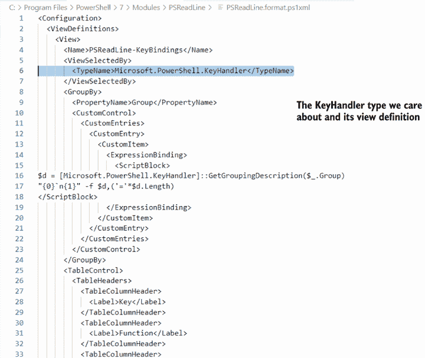
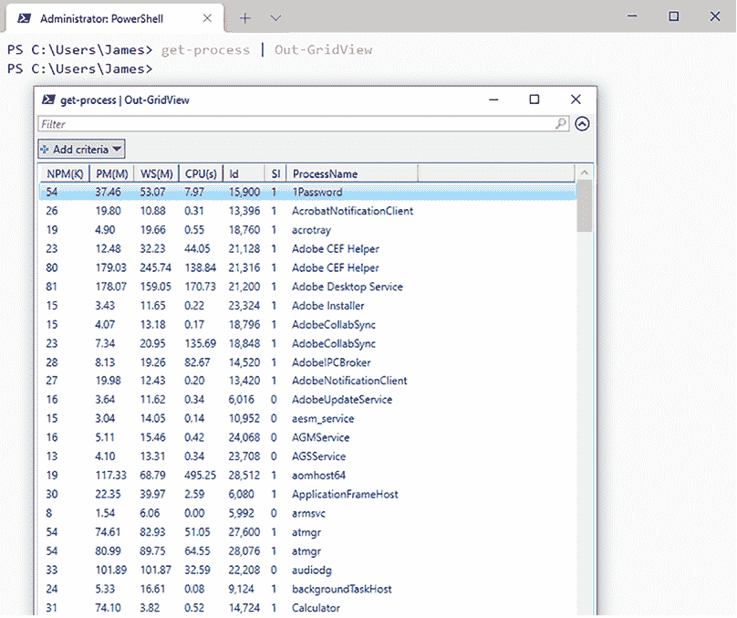

# 11 格式化：为什么是在右边进行

让我们快速回顾一下。你知道 PowerShell 命令会产生对象，并且这些对象通常包含比 PowerShell 默认显示的更多属性。你知道如何使用 `gm` 来获取一个对象的所有属性的列表，也知道如何使用 `Select-Object` 来指定你想要看到的属性。在本书的这一部分，你一直依赖于 PowerShell 的默认配置和规则来确定最终输出在屏幕（或文件、或硬拷贝形式）上的显示方式。在本章中，你将学习如何覆盖这些默认设置，并为你的命令输出创建自己的格式。

## 11.1 格式化：让你的显示更美观

我们不想给人留下印象，认为 PowerShell 是一个完整的管理报告工具，因为它不是。但 PowerShell 在收集信息方面具有很好的能力，并且，通过正确的输出，你当然可以使用这些信息生成报告。关键是获取正确的输出，这正是格式化的全部内容。

表面上看，PowerShell 的格式化系统可能看起来很容易使用——大部分情况下确实如此。但是，格式化系统也包含了一些整个 shell 中最棘手的“陷阱”，因此我们想确保你理解它是如何工作的以及为什么它会这样做。我们不仅会向你展示一些新的命令；相反，我们将解释整个系统是如何工作的，你如何与之交互，以及你可能会遇到什么限制。

## 11.2 使用默认格式化

再次运行我们的老朋友 `Get-Process`，并特别注意列标题。注意，它们并不完全匹配属性名称。相反，每个标题都有特定的宽度、对齐方式等等。所有这些配置信息必须来自某个地方，对吧？你可以在与 PowerShell 一起安装的 .format.ps1xml 文件中找到它。具体来说，进程对象的格式化方向在 DotNetTypes.format.ps1xml 中。

现在尝试一下 你绝对需要打开 PowerShell，以便你可以跟随我们即将展示的内容。这将帮助你理解格式化系统在幕后是如何工作的。

我们将首先切换到 PowerShell 安装文件夹，特别是 PSReadLine 的位置，并打开 PSReadLine.format.ps1xml。PSReadLine 是一个 PowerShell 模块，它提供了在 PowerShell 控制台中输入时的体验。它添加了许多花哨的键盘快捷键和语法高亮，并且是可定制的。请小心不要保存对任何更改到这个文件。它是数字签名的，你保存的任何更改——即使是文件中添加的单个换行符或空格——都会破坏签名并阻止 PowerShell 使用该文件。

```
PS /Users/jamesp/> cd $pshome/Modules/PSReadLine
PS /Users/jamesp/> code PSReadLine.format.ps1xml
```

提示：您可能会收到一个警告代码：“`term` `'code'` `is` `not` `recognized` `as` `a name` `of` `a` `cmdlet,` `function,` `script` `file,` `or` `executable` `program.`”要修复此问题，请打开命令面板并运行以下 shell 命令：“Shell Command：`Install` `'code'` `command` `in` `PATH`”。

接下来，找出 `Get-PSReadLineKeyHandler` 返回的确切对象类型：

```
PS /Users/jamesp/> Get-PSReadLineKeyHandler | get-member
```

现在，按照以下步骤操作：

1.  将完整的类型名称 `Microsoft.PowerShell.KeyHandler` 复制并粘贴到剪贴板。

1.  切换到 Visual Studio Code 并按 Cmd-F（或在 Windows 上按 Ctrl-F）打开搜索对话框。

1.  在搜索对话框中，粘贴您复制到剪贴板中的类型名称。按 Enter 键。

1.  您应该在文件中看到 `Microsoft.PowerShell.KeyHandler`。图 11.1 展示了您应该找到的内容。



图 11.1 在 Visual Studio Code 中定位键处理器视图

您现在在 Visual Studio Code 中看到的是一组指导如何默认显示键处理器的指令。向下滚动，您将看到 *表格视图* 的定义，这是您应该预期的，因为您已经知道键处理器以多列表格的形式显示。您将看到熟悉的列名，如果您再向下滚动一点，您将看到文件指定了哪些属性将在每个列中显示。您还将看到列宽和对齐的定义。浏览完毕后，请小心关闭 Visual Studio Code，确保不要保存您可能意外修改的任何文件，然后返回 PowerShell。

现在尝试一下：您也可以通过运行以下命令来获取此格式数据。您可以玩弄返回的对象，但我们不会专注于它。

```
PS /Users/jamesp/> Get-FormatData -PowerShellVersion 7.1 -TypeName 
➥ Microsoft.PowerShell.KeyHandler
```

当您运行 `Get-PSReadLineKeyHandler` 时，shell 中会发生以下情况：

1.  该命令将 `Microsoft.PowerShell.KeyHandler` 类型的对象放入管道。

1.  在管道末尾是一个不可见的命令 `Out-Default`。它始终存在，其任务是收集在所有命令运行之后管道中的所有对象。

1.  `Out-Default` 将对象传递给 `Out-Host`，因为 PowerShell 控制台被设计为使用屏幕（称为 *host*）作为其默认的输出形式。从理论上讲，有人可以编写一个使用文件或打印机作为默认输出的 shell，但我们所知没有人这样做。

1.  大多数 `Out-` 命令无法与标准对象一起工作。相反，它们被设计为与特殊的格式化指令一起工作。因此，当 `Out-Host` 发现它被传递了标准对象时，它会将它们传递给格式化系统。

1.  格式化系统查看对象的类型，并遵循一组内部格式化规则（我们将在稍后介绍这些规则）。它使用这些规则来生成格式化指令，并将这些指令传递回 `Out-Host`。

1.  一旦 `Out-Host` 看到有格式化指令，它会遵循这些指令来构建屏幕显示。

所有这些都会在你手动指定一个`Out-`命令时发生。例如，运行`Get-Process` `|` `Out-File procs.txt`，`Out-File`会看到你发送了一些普通对象。它会将这些对象传递给格式化系统，该系统创建格式化指令并将它们传递回`Out-File`。然后`Out-File`根据这些指令构建文本文件。所以，格式化系统在任何需要将对象转换为人类可读的文本输出时都会介入。

格式化系统在步骤 5 中遵循哪些规则？对于第一条格式化规则，系统会查看它所处理的对象类型是否有预定义的视图。这就是你在 PSReadLine.format.ps1xml 中看到的：一个针对`KeyHandler`对象的预定义视图。一些其他的.format.ps1xml 文件也随 PowerShell 一起安装，并且当 shell 启动时默认加载。你也可以创建自己的预定义视图，尽管这样做超出了这本书的范围。

格式化系统会寻找针对它所处理的特定对象类型的预定义视图。在这个例子中，它正在寻找处理`Microsoft .PowerShell.KeyHandler`对象的视图。

如果没有预定义的视图会怎样？让我们使用`System.Uri`类型来找出答案，它没有在 format.ps1xml 文件中找到条目（我们保证！）。尝试运行以下命令：

```
[Uri]"https://github.com"
```

这就是使用一个叫做“铸造”的概念，我们说，“嘿，PowerShell，我有一个看起来像 URI 的字符串。你能把它当作`System.Uri`类型来处理吗？”PowerShell 回答，“没问题！”然后给你一个`Uri`对象。你可能注意到，我们运行的那一行并没有指定`System`。这是因为如果 PowerShell 找不到只叫做`Uri`的类型，它就会在前面加上`System`。聪明的 PowerShell！无论如何，输出的结果是一个长长的属性列表，如下所示：

```
AbsolutePath   : /
AbsoluteUri    : https://github.com/
LocalPath      : /
Authority      : github.com
HostNameType   : Dns
IsDefaultPort  : True
IsFile         : False
IsLoopback     : False
PathAndQuery   : /
Segments       : {/}
IsUnc          : False
Host           : github.com
Port           : 443
Query          :
Fragment       :
Scheme         : https
OriginalString : https://github.com
DnsSafeHost    : github.com
IdnHost        : github.com
IsAbsoluteUri  : True
UserEscaped    : False
UserInfo       :
```

对于没有特殊格式化的东西来说，格式化并不太差。这是因为 PowerShell 会查看类型的属性，并以友好的视图显示它们。我们可以通过为该类型引入一个 format .ps1xml 来控制我们在这里看到哪些属性，或者我们可以允许格式化系统进行下一步，或者我们称之为*第二个格式化规则*：它会查看是否有人为该类型的对象声明了一个默认显示属性集。你可以在不同的配置文件 types.ps1xml 中找到这些。由于我们不会深入探讨编写自己的格式和类型文件，我们将给你一个要加载的文件，并看看它如何影响输出。首先，让我们在 Visual Studio Code 中创建并打开一个名为 Uri.Types.ps1xml 的新文件：

```
PS /Users/jamesp/> code /tmp/Uri.Types.ps1xml  
```

现在，粘贴以下内容并保存文件：

```
<?xml version="1.0" encoding="utf-8" ?>
<Types>
  <Type>
    <Name>System.Uri</Name>
    <Members>
      <MemberSet>
        <Name>PSStandardMembers</Name>
        <Members>
          <PropertySet>
            <Name>DefaultDisplayPropertySet</Name>
            <ReferencedProperties>
              <Name>Scheme</Name>
              <Name>Host</Name>
              <Name>Port</Name>
              <Name>AbsoluteUri</Name>
              <Name>IsFile</Name>
            </ReferencedProperties>
          </PropertySet>
        </Members>
      </MemberSet>
    </Members>
  </Type>
</Types>
```

太好了，现在，看到`DefaultDisplayPropertySet`了吗？记下那里列出的五个属性。然后回到 PowerShell 中运行以下命令：

```
PS /Users/jamesp/> Update-TypeData -Path /tmp/Uri.Types.ps1xml
```

我们刚刚加载了我们刚刚创建的 Types.ps1xml 文件。现在，让我们再次运行原始行，看看它会得到什么结果：

```
PS /Users/jamesp/> [Uri]"https://github.com"

Scheme      : https
Host        : github.com
Port        : 443
AbsoluteUri : https://github.com/
IsFile      : False
```

结果看起来熟悉吗？应该是的——你看到的属性仅仅是因为它们在 Types.ps1xml 中列为默认值。如果格式化系统找到一个默认显示属性集，它将使用该属性集进行下一个决定。如果没有找到，下一个决定将考虑对象的所有属性。

那个接下来的决定——*第三个格式化规则*——是关于要创建的输出类型。如果格式化系统显示四个或更少的属性，它将使用表格。如果有五个或更多的属性，它将使用列表。这就是为什么`System.Uri`对象没有以表格形式显示：它的五个属性触发了列表。理论上是说，超过四个属性可能不适合没有截断信息的临时表格。

现在你已经知道了默认格式化是如何工作的。你还知道大多数`Out-` cmdlet 会自动触发格式化系统，以便它们可以获取所需的格式化指令。接下来，让我们看看如何自己控制该格式化系统并覆盖默认设置。

哦，顺便说一下，格式化系统是 PowerShell 有时似乎“撒谎”的原因。例如，运行`Get-Process`并查看列标题。看到标记为`PM(K)`的那个吗？嗯，那是一种谎言，因为不存在名为`PM(K)`的属性。有一个名为`PM`的属性。这里的教训是，格式化的列标题只是列标题。它们不一定与底层属性名称相同。查看属性名称的唯一安全方法是使用`Get-Member`。

## 11.3 表格格式化

PowerShell 有四个格式化 cmdlet，我们将使用提供最多日常格式化能力的三个（第四个在章节末尾的“超越”侧边栏中简要讨论）。首先是`Format-Table`，它有一个别名，`ft`。

如果你阅读了`Format-Table`的帮助文件，你会注意到它有几个参数。以下是一些最有用的参数，以及如何使用它们的示例：

+   `-Property`——此参数接受一个以逗号分隔的属性列表，这些属性应包含在表格中。这些属性不区分大小写，但 shell 将使用你输入的内容作为列标题，因此你可以通过正确的大小写属性名称（例如，*CPU*而不是*cpu*）来获得更美观的输出。此参数接受通配符，这意味着你可以指定`*`以包含表格中的所有属性，或者像`c*`这样的东西以包含以*c*开头的所有属性。请注意，shell 仍然只会显示它可以在表格中容纳的属性，因此你指定的并非每个属性都会显示。此参数是位置参数，因此如果你将属性列表放在第一个位置，你不必输入参数名称。尝试以下示例（以下第二个示例来自`Format-Table`的帮助文件）：

    ```
    Get-Process | Format-Table -Property *
    Get-Process | Format-Table -Property ID,Name,Responding
    Get-Process | Format-Table *
       Id Name            Responding
       -- ----            ----------
    20921 XprotectService       True
     1242 WiFiVelocityAge       True
      434 WiFiAgent             True
    89048 VTDecoderXPCSer       True
    27019 VTDecoderXPCSer       True
      506 ViewBridgeAuxil       True
      428 usernoted             True
      407 UserEventAgent        True
      544 useractivityd         True
      710 USBAgent              True
     1244 UsageTrackingAg       True
      416 universalaccess       True
      468 TrustedPeersHel       True
      412 trustd                True
    24703 transparencyd         True
     1264 TextInputMenuAg       True
    38115 Telegram              True
      425 tccd                  True
      504 talagent              True
     1219 SystemUIServer        True
    ```

+   `-GroupBy`参数会在指定的属性值更改时生成一组新的列标题。这仅在首先按该属性对对象进行排序时才有效。以下是一个示例（此示例将根据虚拟机是运行还是停止来对 Azure VM 进行分组）：

    ```
    PS /Users/jamesp/> Get-AzVM -Status | Sort-Object PowerState | 
    ➥ ft -Property Name,Location,ResourceGroupName -GroupBy PowerState 

       PowerState: VM running
    Name       Location ResourceGroupName
    ----       -------- -----------------
    MyUbuntuVM eastus2  MYUBUNTUVM

       PowerState: VM deallocated
    Name        Location ResourceGroupName
    ----        -------- -----------------
    MyUbuntuVM2 eastus2  MYUBUNTUVM
    WinTestVM2  westus2  WINTESTVM2
    ```

+   `-Wrap`参数——如果 shell 需要在列中截断信息，它将以省略号（`. . .`）结束该列，以视觉上表示信息已被抑制。此参数使 shell 能够包装信息，这使得表格更长，但保留了你想显示的所有信息。以下是一个示例：

    ```
    PS /Users/jamesp/> Get-Command | Select-Object Name,Source | ft -Wrap

    Name                                       Source
    ----                                       ------
    Compress-Archive                           Microsoft.P
                                               owerShell.A
                                               rchive
    Configuration                              PSDesiredSt
                                               ateConfigur
                                               ation
    Expand-Archive                             Microsoft.P
                                               owerShell.A
                                               rchive
    Expand-GitCommand                          posh-git
    Find-Command                               PowerShellG
                                               et
    Find-DscResource                           PowerShellG
                                               et
    Find-Module                                PowerShellG
                                               et
    Find-RoleCapability                        PowerShellG
                                               et
    ```

现在试试看 你应该在 shell 中运行所有这些示例，并且可以自由混合和匹配这些技术。实验以查看哪些有效，以及你可以创建什么样的输出。这些命令仅在你已经连接到 Azure 帐户并且你有 Azure 中的现有虚拟机时才有效。

## 11.4 格式化列表

有时你需要显示比表格水平宽度更多的信息，这可以使列表变得有用。`Format-List`是你要使用的 cmdlet，或者你可以使用它的别名`fl`。

此 cmdlet 支持与`Format-Table`相同的某些参数，包括`-Property`。实际上，`fl`是显示对象属性的另一种方式。与`gm`不同，`fl`还会显示这些属性的值，以便你可以看到每个属性包含的信息类型：

```
Get-Verb | Fl *
...
Verb        : Remove
AliasPrefix : r
Group       : Common
Description : Deletes a resource from a container

Verb        : Rename
AliasPrefix : rn
Group       : Common
Description : Changes the name of a resource

Verb        : Reset
AliasPrefix : rs
Group       : Common
Description : Sets a resource back to its original state

Verb        : Resize
AliasPrefix : rz
Group       : Common
Description : Changes the size of a resource

Verb        : Search
AliasPrefix : sr
Group       : Common
Description : Creates a reference to a resource in a container

Verb        : Select
AliasPrefix : sc
Group       : Common
Description : Locates a resource in a container
...
```

我们经常使用`fl`作为发现对象属性的一种替代方式。

现在试试看 Read the help for `Format-List`，并尝试使用其参数进行实验。

## 11.5 格式化宽列表

最后一个 cmdlet 是`Format-Wide`（或其别名`fw`），它显示一个更宽、多列的列表。它只能显示单个属性的值，因此其`-Property`参数只接受一个属性名称，不接受列表，也不接受通配符。

默认情况下，`Format-Wide`查找对象的`Name`属性，因为`Name`是一个常用的属性，通常包含有用的信息。显示通常默认为两列，但可以使用`-Columns`参数指定更多列：

```
Get-Process | Format-Wide name -col 4

iTerm2        java          keyboardserv... Keychain Ci...
knowledge-ag... LastPass      LocationMenu  lockoutagent
loginwindow   lsd           Magnet        mapspushd
mdworker      mdworker_sha... mdworker_sha... mdworker_sh...
mdworker_sha... mdworker_sha... mdworker_sha... mdworker_sh...
mdworker_sha... mdworker_sha... mdworker_sha... mdwrite
media-indexer mediaremotea... Microsoft Ed... Microsoft E...
Microsoft Ed... Microsoft Ed... Microsoft Ed... Microsoft E...
Microsoft Ed... Microsoft Ed... Microsoft Ed... Microsoft E...
```

现在试试看 Read the help for `Format-Wide`，并尝试使用其参数进行实验。

## 11.6 创建自定义列和列表条目

回到上一章，复习第 10.5 节。在该节中，我们向您展示了如何使用散列表结构向对象添加自定义属性。`Format-Table`和`Format-List`都可以使用这些相同的结构来创建自定义表列或自定义列表条目。

你可能这样做是为了提供一个与显示的属性名称不同的列标题：

```
Get-AzStorageAccount | Format-Table @{name='Name';expression=
  {$_.StorageAccountName}},Location,ResourceGroupName

Name                     Location       ResourceGroupName
----                     --------       -----------------
myubuntuvmdiag           eastus2        MyUbuntuVM
ismtrainierout           westus         ismtrainierout
cs461353efc2db7x45cbxa2d westus         cloud-shell-storage...
mtnbotbmyhfk             westus         mtnbot
pssafuncapp              westus         pssafuncapp 
```

注意：这仅当已经存在 Azure 连接和存储帐户时才有效。

或者，你可能需要放置一个更复杂的数学表达式：

```
Get-Process | Format-Table Name, @{name='VM(MB)';expression={$_.VM / 1MB 
➥ -as [int]}}
```

我们承认，我们通过引入一些尚未讨论的内容而有点作弊。我们不妨现在就谈谈：

+   显然，我们是从`Get-Process`开始，这是一个你现在非常熟悉的 cmdlet。如果你运行`Get-Process` `|` `fl` `*`，你会看到`VM`属性以字节为单位，尽管默认的表格视图并不是这样显示的。

+   我们告诉`Format-Table`从进程的`Name`属性开始。

+   接下来，我们使用一个特殊的哈希表来创建一个自定义列，该列将被标记为`VM(MB)`。这是分号之前的第一个部分，它是一个分隔符。第二个部分通过将对象的正常`VM`属性除以`1` `MB`来定义该列的值或表达式。斜杠是 PowerShell 的除法运算符，PowerShell 识别`KB`、`MB`、`GB`、`TB`和`PB`作为千字节、兆字节、吉字节、太字节和拍字节的代表。

+   那个除法操作的结果将有一个我们不想看到的十进制部分。`-as`运算符使我们能够将那个结果的数据类型从浮点值更改为，在这种情况下，一个整数值（由`[int]`指定）。在执行转换时，shell 将根据需要向上或向下舍入。结果是没有任何分数部分的整数：

    ```
    Name            VM(MB)
    ----            ------
    USBAgent          4206
    useractivityd     4236
    UserEventAgent    4235
    usernoted         4242
    ViewBridgeAuxil   4233
    VTDecoderXPCSer   4234
    VTDecoderXPCSer   4234
    WiFiAgent         4255
    WiFiVelocityAge   4232
    XprotectService   4244
    ```

我们向你展示这个小小的除法和转换技巧，因为它在创建更美观的输出时可能很有用。在这本书中，我们不会花太多时间在这些操作上（尽管我们会告诉你`*`用于乘法，而且正如你所预期的那样，`+`和`-`分别用于加法和减法）。

除此之外

尝试重复这个例子：

```
Get-Process |
Format-Table Name,
@{name='VM(MB)';expression={$_.VM / 1MB -as [int]}} -AutoSize
```

但这次不要在一行中输入所有内容。按照书中所示，在总共三行中输入。你会注意到在输入以管道字符结尾的第一行之后，PowerShell 会改变其提示符。这是因为你以管道结束了 shell，shell 知道还有更多的命令要来。如果你没有正确关闭所有花括号、大括号、引号和括号就按 Enter 键，shell 会进入相同的“等待你完成”模式。

如果你不是故意进入扩展输入模式，请按 Ctrl-C 来终止，然后重新开始。在这种情况下，你可以输入文本的第二行并按 Enter 键，然后输入第三行并按 Enter 键。在这个模式下，你将不得不在空白行上按最后一次 Enter 键，以告诉 shell 你已经完成。当你这样做时，它将像在单行上输入一样执行命令。

与只能接受`Name`和`Expression`键（尽管它们也会接受`N`、`L`和`Label`作为`Name`，以及接受`E`作为`Expression`）的`Select-Object`不同，`Format-`命令可以处理额外的键，这些键旨在控制视觉显示。这些额外的键与`Format-Table`一起最有用：

+   `FormatString` 指定一个格式化代码，导致数据根据指定的格式显示。这主要用于数值和日期数据。请访问格式化类型的文档 [`mng.bz/XWy1`](http://mng.bz/XWy1)，以查看标准数值和日期格式以及自定义数值和日期格式的可用代码。

+   `Width` 指定所需的列宽度。

+   `Alignment` 指定所需的列对齐方式，可以是 `Left` 或 `Right`。

使用这些额外的键可以更容易地实现前面的示例结果，甚至可以改进它们：

```
Get-Process |
➥ Format-Table Name,
➥ @{name='VM(MB)';expression={$_.VM};formatstring='F2';align='right'} 
➥ -AutoSize
```

现在我们不需要进行除法操作，因为 PowerShell 会将数字格式化为具有两位小数的定点值，并将结果右对齐。

## 11.7 输出到：文件或主机

一旦格式化完成，您必须决定它将去往何处。如果命令行以 `Format-` cmdlet 结尾，则 `Format-` cmdlet 创建的格式化指令将发送到 `Out-Default`，它将它们转发到 `Out-Host`，在屏幕上显示：

```
Get-ChildItem | Format-Wide
```

您还可以手动将格式化指令传递给 `Out-Host`，这会完成完全相同的事情：

```
Get-ChildItem | Format-Wide | Out-Host
```

或者，您可以将格式化指令通过管道传递给 `Out-File`，以将格式化后的输出直接指向文件。正如您将在第 11.9 节中读到的，命令行中只能有一个 `Out-` cmdlet 随后跟一个 `Format-` cmdlet。

请记住，`Out-File` 默认使用特定的字符宽度进行输出，这意味着文本文件可能看起来与屏幕显示不同。该 cmdlet 有一个 `-Width` 参数，允许您根据需要更改输出宽度，以适应更宽的表格。

## 11.8 另一种输出：GridViews

在 Windows PowerShell 的早期版本中，有一个名为 `Out-GridView` 的内置 cmdlet，它提供了一种有用的输出形式——图形用户界面（GUI）。对于 PowerShell 6 及以上版本，创建了一个跨平台的版本，但它以模块的形式存在于 PowerShell Gallery 中。您可以通过运行以下命令来安装此 cmdlet：

```
Install-Module Microsoft.PowerShell.GraphicalTools
```

注意，`Out-GridView` 并非技术上的格式化；实际上，`Out-GridView` 完全绕过了格式化子系统。没有调用 `Format-` cmdlet，没有生成格式化指令，也没有在控制台窗口中显示文本输出。`Out-GridView` 不能接收 `Format-` cmdlet 的输出——它只能接收其他 cmdlet 输出的常规对象。

图 11.2 展示了当我们运行 `Get-Process | Out-GridView` 命令时会发生什么。



图 11.2 `Out-GridView` cmdlet 的结果

## 11.9 常见混淆点

正如我们在本章开头提到的，格式化系统具有大多数会让 PowerShell 新手绊倒的陷阱。他们往往会遇到两个问题，所以我们将尽力帮助您避免这些问题。

### 11.9.1 总是右对齐格式化

非常重要，你需要记住本章的一个规则：*格式正确*。你的 `Format-` 命令应该是在命令行上的最后一项，只有 `Out-File` 是例外。这个规则的原因是 `Format-` 命令生成格式化指令，只有 `Out-` 命令才能正确消费这些指令。如果一个 `Format-` 命令是命令行上的最后一项，指令将会发送到 `Out-Default`（它总是在管道的末尾），然后它会将指令转发到 `Out-Host`，`Out-Host` 很乐意处理格式化指令。尝试运行以下命令来展示这个规则的需求：

```
Get-History | Format-Table | gm

   TypeName: Microsoft.PowerShell.Commands.Internal.Format.FormatStartData
Name                                    MemberType Definition
----                                    ---------- ----------
Equals                                  Method     bool Equals(System.Object  
                                                 ➥ obj)
GetHashCode                             Method     int GetHashCode()
GetType                                 Method     type GetType()
ToString                                Method     string ToString()
autosizeInfo                            Property   Microsoft.PowerShell.Commands.Internal.Format.AutosizeInfo, 
   ➥ System.Management.Automation, Version=7.0.0.0,...
ClassId2e4f51ef21dd47e99d3c952918aff9cd Property   string 
➥ ClassId2e4f51ef21dd47e99d3c952918aff9cd {get;}
groupingEntry                           Property   Microsoft.PowerShell.Commands.Internal.Format.GroupingEntry, 
   ➥ System.Management.Automation, Version=7.0.0.0...
pageFooterEntry                         Property   Microsoft.PowerShell.Commands.Internal.Format.PageFooterEntry, 
   ➥ System.Management.Automation, Version=7.0.0...
pageHeaderEntry                         Property   Microsoft.PowerShell.Commands.Internal.Format.PageHeaderEntry, 
   ➥ System.Management.Automation, Version=7.0.0...
shapeInfo                               Property   Microsoft.PowerShell.Commands.Internal.Format.ShapeInfo, 
   ➥ System.Management.Automation, Version=7.0.0.0, Cu...

   TypeName: Microsoft.PowerShell.Commands.Internal.Format.GroupStartData
Name                                    MemberType Definition
----                                    ---------- ----------
Equals                                  Method     bool Equals(System.Object 
                                                 ➥ obj)
GetHashCode                             Method     int GetHashCode()
GetType                                 Method     type GetType()
ToString                                Method     string ToString()
ClassId2e4f51ef21dd47e99d3c952918aff9cd Property   string ClassId2e4f51ef21dd47e99d3c952918aff9cd {get;}
groupingEntry                           Property   Microsoft.PowerShell.Commands.Internal.Format.GroupingEntry, 
   ➥ System.Management.Automation, Version=7.0.0.0...
shapeInfo                               Property   
➥ Microsoft.PowerShell.Commands.Internal.Format.ShapeInfo, 
➥ System.Management.Automation, Version=7.0.0.0, Cu...
```

你会注意到 `gm` 并没有显示关于你的历史对象的信息，因为 `Format-Table` 命令不会输出历史对象。它消耗了你通过管道传递的历史对象，并输出格式化指令——这是 `gm` 看到的并报告的内容。现在尝试这个命令：

```
Get-History | Select-Object Id,Duration,CommandLine | Format-Table | 
ConvertTo-Html | Out-File history.html
```

在浏览器中打开 history.html，你会看到一些疯狂的结果。你没有将历史对象通过 `ConvertTo-Html` 进行管道传递；你传递了格式化指令，所以这就是被转换成 HTML 的内容。这说明了为什么如果你使用 `Format-` 命令，它必须是命令行上的最后一项或者倒数第二项，最后一项命令是 `Out-File`。

还要知道，`Out-GridView` 对于一个 `Out-` 命令来说是不寻常的（至少是），它*不会*接受格式化指令，而只会接受标准对象。尝试运行以下两个命令来查看差异：

```
PS C:\>Get-Process | Out-GridView
PS C:\>Get-Process | Format-Table | Out-GridView
```

正是因为这个原因，我们明确指出 `Out-File` 是唯一应该跟在 `Format-` 命令后面的命令（技术上，`Out-Host` 也可以跟在 `Format-` 命令后面，但这是不必要的，因为以 `Format-` 命令结束命令行的话，输出还是会到达 `Out-Host`）。

### 11.9.2 请一次只处理一种类型的对象

下一个要避免的事情是将多种类型的对象放入管道中。格式化系统会查看管道中的第一个对象，并使用该对象的类型来确定要生成哪种格式。如果管道包含两种或更多种类的对象，输出可能不会总是完整或有用。

例如，运行以下命令：

```
PS /Users/jamesp/> Get-Process; Get-History

 NPM(K)    PM(M)      WS(M)     CPU(s)      Id  SI ProcessName
 ------    -----      -----     ------      --  -- -----------
...
      0     0.00       1.74       0.25    1244   1 UsageTrackingAg
      0     0.00       0.68       0.19     710   1 USBAgent
      0     0.00       4.12       6.37     544   1 useractivityd
      0     0.00       5.44       8.00     407   1 UserEventAgent
      0     0.00       7.50       3.43     428   1 usernoted
      0     0.00       3.44       8.71     506   1 ViewBridgeAuxil
      0     0.00       5.91       0.08   27019 ...19 VTDecoderXPCSer
      0     0.00       5.92       0.07   89048 ...48 VTDecoderXPCSer
      0     0.00      10.79      50.02     434   1 WiFiAgent
      0     0.00       1.11       0.20    1242   1 WiFiVelocityAge
      0     0.00      10.28       4.30   20921 ...21 XprotectService

Id                 : 1
CommandLine        : Update-TypeData -Path /tmp/Uri.Types.ps1xml
ExecutionStatus    : Completed
StartExecutionTime : 9/21/2019 12:20:03 PM
EndExecutionTime   : 9/21/2019 12:20:03 PM
Duration           : 00:00:00.0688690

Id                 : 2
CommandLine        : Update-TypeData -Path /tmp/Uri.Types.ps1xml
ExecutionStatus    : Completed
StartExecutionTime : 9/21/2019 12:21:07 PM
EndExecutionTime   : 9/21/2019 12:21:07 PM
Duration           : 00:00:00.0125330eyp
```

那个分号允许我们将两个命令放在同一个命令行上，而不需要将第一个命令的输出通过管道传递给第二个命令。这意味着两个命令都是独立运行的，但它们将输出放入同一个管道中。正如你所看到的，输出一开始是好的，显示了进程对象。但当需要显示历史对象时，输出就崩溃了。PowerShell 并没有设计成能够处理多种类型的对象，并尽可能使结果看起来更吸引人。

如果你想将来自两个（或更多）地方的信息合并成单一形式的输出，你绝对可以，而且你可以以一种格式化系统可以很好地处理的方式做到这一点。但这是一个高级主题，我们在这本书中不会涉及。

除此之外

从技术上讲，格式化系统*可以*处理多种类型的对象——如果你告诉它如何处理。运行`Dir | gm`，你会注意到管道中包含`DirectoryInfo`和`FileInfo`对象（`gm`没有问题处理包含多种对象的管道，并将显示所有对象的成员信息。）当你单独运行`Dir`时，输出是完全可以读的。这是因为微软为`DirectoryInfo`和`FileInfo`对象提供了预定义的定制格式化视图，该视图由`Format-Custom` cmdlet 处理。

`Format-Custom`主要用于显示各种预定义的定制视图。技术上你可以创建自己的预定义定制视图，但必要的 XML 语法很复杂，目前没有公开文档，因此定制视图仅限于微软提供的。

尽管如此，微软的定制视图确实得到了很多使用。例如，PowerShell 的帮助信息以对象的形式存储，你在屏幕上看到的格式化帮助文件就是将这些对象输入到定制视图的结果。

## 11.10 实验室

注意：对于这个实验室，你需要任何运行 PowerShell 7.1 或更高版本的计算机。

看看你是否能完成以下任务：

1.  显示一个仅包含进程名称、ID 和它们是否响应 Windows（`Responding`属性包含这些信息）的进程表。表格应尽可能占用较少的水平空间，但不要允许任何信息被截断。

1.  显示一个包含进程名称和 ID 的进程表。还包括虚拟和物理内存使用情况的列，这些值以兆字节（MB）为单位表示。

1.  使用`Get-Module`获取已加载模块的列表。以表格形式格式化输出，按此顺序包括模块名称和版本。列标题必须是`ModuleName`和`ModuleVersion`。

1.  使用`Get-AzStorageAccount`和`Get-AzStorageContainer`显示*所有*存储容器，以便为可公开访问的存储容器和不可公开访问的存储容器分别显示一个表格。（提示：管道是你的朋友……使用`-GroupBy`参数。）

1.  显示主目录中所有目录的四列宽列表。

1.  创建一个格式化的列表，列出`$pshome`中的所有.dll 文件，显示名称、版本信息和文件大小。PowerShell 使用`Length`属性，但为了更清晰，你的输出应显示`Size`。

## 11.11 实验室答案

1.  `Get-Process | Format-Table Name,ID,Responding -Wrap`

1.  `Get-Process | Format-Table Name,ID,`

    `@{l='VirtualMB';e={$_.vm/1MB}},`

    `@{l='PhysicalMB';e={$_.workingset/1MB}}`

1.  `Get-Module| Format-Table @{l='ModuleName';e={$_.Name }},`

    `@{l='ModuleVersion';e={$_.Version}}`

1.  `获取-AzStorageAccount | 获取-AzStorageContainer | ft -GroupBy 公共访问组`

1.  `gci ~ -Directory | 格式化宽 -列 4`

1.  `gci $pshome/*.dll |`

    `格式化列表名称，版本信息，@{名称="大小"；表达式={$_．length}}`

## 11.12 进一步探索

这正是尝试格式化系统的完美时机。尝试使用三个主要的 `Format-` 命令来创建不同形式的输出。在接下来的章节中，实验室通常会要求你使用特定的格式化，所以你不妨用这些命令磨练你的技能，并开始记忆本章中涵盖的更常用参数。
