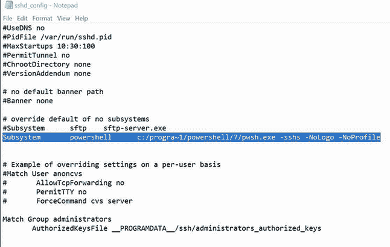
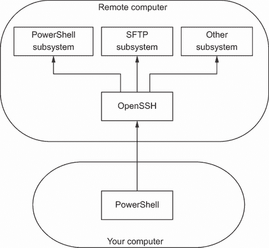
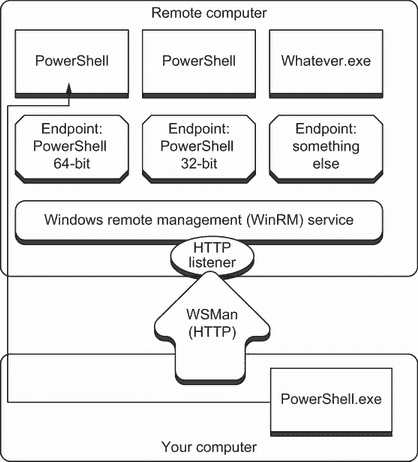

# 13 远程控制：一对一和一对多

让我们来看看 `Invoke-ScriptBlock` 命令。注意它有一个 `-ComputerName` 参数。嗯嗯……这难道意味着它也可以在其它主机上运行命令吗？经过一番实验，你会发现这正是它的功能。有多少其他命令有连接到远程机器的能力呢？虽然没有办法获得一个具体的数字来回答这个问题，但确实有很多。

我们意识到的是，PowerShell 的创造者有点懒惰——这其实是个好事。因为他们不想为每个 cmdlet 编写 `-HostName` 参数，所以他们创建了一个跨 shell 的系统，称为 *远程*。这个系统使你能够在远程计算机上运行任何 cmdlet。实际上，你甚至可以运行存在于远程计算机上但不存在于你自己的计算机上的命令——这意味着你不必总是在你工作站上安装每个管理 cmdlet。这个远程系统非常强大，并提供了有趣的行政管理能力。

注意：远程是一个庞大而复杂的技术。我们在本章中向您介绍它，并涵盖了您将遇到的 80% 到 90% 的使用场景。但我们无法涵盖所有内容，因此在本章末尾的“进一步探索”部分，我们指向了一个必须的资源，该资源涵盖了远程配置选项。

## 13.1 远程 PowerShell 的理念

Remote PowerShell 的工作方式与 Telnet 和其他古老的远程控制技术有些相似。当你运行一个命令时，它是在远程计算机上运行的——只有该命令的结果会返回到你的计算机。

### 13.1.1 Windows 设备上的远程

PowerShell 使用一种名为 *Web 服务管理* (WSMan) 的通信协议。WSMan 完全通过 HTTP 或 HTTPS（默认为 HTTP）运行，如果需要的话，可以轻松地通过防火墙（因为每个协议都使用单个端口进行通信）。Microsoft 对 WSMan 的实现形式是一个后台服务，Windows 远程管理 (WinRM)。WinRM 默认安装在 Windows 10 设备和 Server 2012 及以上版本上。默认情况下，这些服务是禁用的，但可以很容易地通过组策略单独或成组启用。

### 13.1.2 macOS 和 Linux 设备上的远程

如你所猜，WSMan 和 WinRM 是仅适用于 Windows 的服务。因此，为了让 PowerShell 具有远程功能，团队决定最好使用行业标准的安全外壳 (SSH)。SSH 如果需要的话可以轻松地通过防火墙（因为该协议使用单个端口进行通信）并且几十年来一直被 Linux 专业人士使用。Microsoft 已经将 OpenSSH 移植到 Windows 上，因此你甚至可以使用它来远程连接到 Windows。

在 Windows 上通过 SSH 设置 PSRP

你可能想在安装了 PowerShell Core 的任何 Windows 机器上设置 PowerShell 远程协议（PSRP）通过 SSH。我们不会详细介绍如何设置，但 Microsoft 的文档中有可用的说明：[`mng.bz/laPd`](http://mng.bz/laPd)。

### 13.1.3 跨平台远程操作

你已经了解到 PowerShell cmdlet 的所有输出都是对象。当你运行远程命令时，其输出对象需要被转换成可以在网络上轻松传输的形式。结果证明，XML 是完成这一任务的一种极好的方式，因此 PowerShell 自动将这些输出对象序列化为 XML。XML 通过网络传输，然后在你的计算机上反序列化，回到 PowerShell 内部你可以操作的对象。序列化和反序列化实际上只是格式转换的一种形式：从对象到 XML（序列化），以及从 XML 到对象（反序列化）。

你为什么应该关心这种输出是如何返回的？因为这些序列化然后反序列化的对象只是某种形式的快照；它们不会持续更新。例如，如果你要获取表示远程计算机上正在运行的过程的对象，你得到的结果将只准确反映那些对象生成时的确切时间点。像内存使用和 CPU 利用率这样的值不会更新以反映随后的条件。此外，你不能告诉反序列化的对象做任何事情——你不能指示它们停止自己，例如。

这些是远程操作的基本限制，但它们并不会阻止你做一些令人惊叹的事情。实际上，你可以告诉远程进程停止自己，但你必须足够聪明。我们将在本章后面展示如何做到这一点。为了使远程操作生效，你需要满足两个基本要求：

+   你想要发送命令的计算机和你自己的计算机都必须运行 PowerShell v7.1 或更高版本。

+   理想情况下，两台计算机都需要是同一域的成员，或者信任/被信任的域的成员。在域外使远程操作生效是可能的，但这更复杂，本章中我们不涉及这一点。要了解更多关于这种情况的信息，请打开 PowerShell 并运行`help` `about_remote_troubleshooting`。

现在试试看 我们希望您能够跟随本章的一些示例。为了参与，理想情况下您将有一个第二台测试计算机（或虚拟机），该计算机与您到目前为止使用的测试计算机位于同一 Active Directory 域中。只要在该第二台计算机上安装了 PowerShell v7.1 或更高版本，您就可以在该计算机上运行任何版本的 Windows。如果您使用了两台 Windows 设备，如果它们属于同一域，这将使您的生活变得更加容易。如果您无法设置额外的计算机或虚拟机，请使用 `localhost` 来创建到您当前计算机的远程连接。尽管您仍在使用远程操作，但坐在您面前的计算机进行“远程控制”并不那么令人兴奋。

## 13.2 在 SSH 上设置 PSRP

让我们花些时间在您的环境中设置 SSH。

### 13.2.1 macOS 和 Linux

在计算机上，确保已安装 SSH 服务器和客户端。在 Ubuntu 上，这些是相应的说明：

```
sudo apt install openssh-client
sudo apt install openssh-server
```

对于 macOS，客户端默认已安装。以下是启用服务器的命令：

```
sudo systemsetup -setremotelogin on
```

接下来，我们需要安装启用 SSH 上 PSRP 的模块：

```
Install-Module EnableSSHRemoting
```

然后，运行命令以启用 SSH 上的 PSRP：

```
sudo pwsh -c Enable-SSHRemoting
```

接下来，您需要重新启动 OpenSSH 服务。在 Ubuntu 上，这是重新启动服务的命令：

```
sudo service sshd restart
```

在 macOS 上，这是相应的命令：

```
sudo launchctl stop com.openssh.sshd
sudo launchctl start com.openssh.sshd
```

### 13.2.2 在 Windows 上设置 SSH

SSH 也可以在 Windows 桌面和服务器上运行。实际上，如果您真的想禁用 WinRM，您也可以这样做（我们不建议这样做）。如果您在 Windows 设备上使用 SSH 进行远程操作，您可能是在 Linux 或 macOS 设备上远程到或从这些设备远程。

安装 OpenSSH 客户端和服务器：

```
Add-WindowsCapability -Online -Name OpenSSH.Client~~~~0.0.1.0

Add-WindowsCapability -Online -Name OpenSSH.Server~~~~0.0.1.0
```

这里是 SSH 服务器的初始配置：

```
Start-Service sshd

Set-Service -Name sshd -StartupType 'Automatic'
```

确认防火墙规则已配置。它应该由设置自动创建：

```
Get-NetFirewallRule -Name *ssh*
```

应该有一个名为 `OpenSSH-Server-In-TCP` 的防火墙规则，该规则应该被启用。配置并编辑位于目标机器 `$env:ProgramData\ssh` 上的 sshd_config 文件 *(图 13.1)*。



图 13.1 这是添加 PowerShell 变更后的 sshd_config 文件的外观。

通过移除 `#` 符号来验证密码认证是否已启用：

```
PasswordAuthentication yes
```

添加 PowerShell 的 `Subsystem`。您可以看到我们正在使用包含空格的文件路径的 8.3 短名称。

```
Subsystem powershell c:/progra~1/powershell/7/pwsh.exe -sshs -NoLogo 
➥ -NoProfile
```

Windows 中 `Program Files` 文件夹的 8.3 短名称通常是 `Progra~1`。但是，您可以使用以下命令来确保这一点：

```
Get-CimInstance Win32_Directory -Filter 'Name="C:\\Program Files"' | 
➥ Select-Object EightDotThreeFileName
```

可选的启用密钥认证是

```
PubkeyAuthentication yes
```

重新启动 OpenSSH 服务：

```
Restart-Service sshd
```

确保保护您的 SSH 服务器

您应该研究当前用于保护 OpenSSH 的标准。在撰写本文时，基本做法是仅启用私钥认证。此外，请确保保护您的私钥。以下是针对主要平台如何执行此操作的链接：

macOS: [`mng.bz/Bxyw`](http://mng.bz/Bxyw)

Ubuntu: [`mng.bz/do9g`](http://mng.bz/do9g)

## 13.3 SSH 上 PSRP 概述

让我们谈谈 SSH，因为你将需要配置它才能使用远程功能。再一次，你需要配置 PSRP 通过 SSH——以及 PowerShell 远程——只在这些将 *接收* 传入命令的计算机上。在我们工作过的多数环境中，管理员已经在每台计算机上启用了远程功能。这样做可以让你在后台远程到客户端桌面和笔记本电脑（这意味着那些计算机的用户不会知道你在这样做），这可以非常有用。

SSH 允许多个子系统注册。这允许不同的协议在同一个端口上工作。当你启用 SSH 远程时，PowerShell 会注册为一个子系统，来自 PSRP 的传入连接会被路由到该子系统。图 13.2 展示了这些部分是如何组合在一起的。



图 13.2 OpenSSH 和 PowerShell 之间的关系

如所示，你可以在系统中拥有数十个甚至数百个 `sshd` 子系统。每个端点可以指向不同的应用程序。

图 13.2 还展示了 `sshd` *监听器*。`sshd` 作为监听器，坐着等待传入的网络流量——有点像网站服务器在等待传入请求。监听器“监听”在特定的端口和特定的 IP 地址上。

现在试试看。在你的第二台计算机上（或者如果你只有一台计算机，就在那台计算机上）启用远程功能。如果你在启用远程功能时收到错误消息，请停止并找出原因。

## 13.4 WinRM 概述

让我们谈谈 WinRM，因为你将需要配置它才能使用远程功能。再一次，你需要配置 WinRM——以及 PowerShell 远程——只在这些将 *接收* 传入命令的计算机上。在我们工作过的多数环境中，管理员已经在基于 Windows 的每台计算机上启用了远程功能（请记住，PowerShell 和远程功能一直支持到 Windows XP）。这样做可以让你在后台远程到客户端桌面和笔记本电脑（这意味着那些计算机的用户不会知道你在这样做），这可以非常有用。

WinRM 并非 PowerShell 独有。微软开始越来越多地使用它来进行管理通信——甚至包括今天使用其他协议的事情。考虑到这一点，微软使 WinRM 能够将流量路由到多个管理应用程序——不仅仅是 PowerShell。WinRM 作为调度器：当流量进入时，WinRM 会决定哪个应用程序需要处理该流量。所有 WinRM 流量都会被标记为接收应用程序的名称，并且这些应用程序必须作为 *端点* 在 WinRM 上注册，以便 WinRM 代表它们监听传入的流量。这意味着你不仅需要启用 WinRM，还需要告诉 PowerShell 将自己注册为 WinRM 的端点。图 13.3 展示了这些部分是如何组合在一起的。



图 13.3 WinRM、WSMan、端点和 PowerShell 之间的关系

如所示，你可以在系统中拥有数十个甚至数百个 WinRM 端点（PowerShell 称其为*会话配置*）。每个端点可以指向不同的应用程序，你甚至可以拥有指向相同应用程序但提供不同权限和功能的端点。例如，你可以创建一个只允许一个或两个命令的 PowerShell 端点，并将其提供给环境中特定的用户。我们在这章中不会深入探讨远程操作，但在本书的后续章节中会进行讨论。

图 13.3 还说明了 WinRM*监听器*，在图中是 HTTP 类型的。监听器代表 WinRM 静候传入的网络流量——有点像网站服务器在等待传入请求。监听器“监听”在特定的端口和特定的 IP 地址上，尽管由`Enable-PSRemoting`创建的默认监听器会在*所有*本地 IP 地址上监听。

监听器连接到定义的端点。创建端点的一种方法是在管理员权限下打开 PowerShell 的一个副本——确保你以管理员身份运行它——并运行`Enable-PSRemoting`命令。你有时可能会看到对另一个名为`Set-WSManQuickConfig`的命令的引用。你不需要运行那个命令；`Enable-PSRemoting`会为你调用它，并且`Enable-PSRemoting`会执行一些额外的步骤，这些步骤对于远程操作能够启动和运行是必要的。总的来说，该命令将启动 WinRM 服务，将其配置为自动启动，将 PowerShell 注册为端点，甚至设置 Windows 防火墙异常以允许传入的 WinRM 流量。

现在尝试一下 前往你的第二台计算机（或者如果你只有一台要工作的话，就是第一台）上启用远程操作。如果你在 Windows 设备上，确保以管理员身份运行 PowerShell（窗口标题栏应显示为管理员）。如果不是，关闭外壳，在开始菜单中右键单击 PowerShell 图标，并从上下文菜单中选择以管理员身份运行。

你最可能遇到的错误是“由于此机器上的网络连接类型之一设置为公共，WinRM 防火墙异常将无法工作。”任何设置为`Public`的网络连接都不能有 Windows 防火墙异常，所以当`Enable-PSRemoting`尝试创建一个时，它会失败。唯一的解决方案是进入 Windows 并修改网络适配器设置，将你所在的网络设置为工作或家庭。但如果你连接到公共网络（例如，公共无线热点），请不要这样做，因为你将关闭一些宝贵的安全保护措施。

注意 你在服务器操作系统上不必过多担心 PowerShell 远程操作和公共网络，因为它们在操作系统上没有相同的限制。

如果您对不得不跑遍每台计算机以启用远程操作不感兴趣，请不要担心：您也可以使用组策略对象（GPO）来完成此操作。必要的 GPO 设置已内置到您的域控制器中（您可以从 [www.microsoft.com/en-us/download](https://www.microsoft.com/en-us/download) 下载 ADM 模板，以将这些 GPO 设置添加到较旧域的域控制器）。打开一个 GPO，然后在计算机配置 > 管理模板 > Windows 组件下查找。在列表底部附近，您将找到远程外壳和 Windows 远程管理。现在，我们假设您将在您想要配置的计算机上运行 `Enable-PSRemoting`，因为到目前为止，您可能只是在玩一个或两个虚拟机。

注意 PowerShell 的 `about_remote_troubleshooting` 帮助主题提供了更多关于使用 GPO 的信息。在该帮助主题中查找“如何在企业中启用远程操作”和“如何使用组策略启用监听器”部分。

## 13.5 使用 Enter-PSSession 和 Exit-PSSession 进行一对一远程操作

PowerShell 以两种不同的方式使用远程操作。第一种是一对一，或 1:1，远程操作。第二种是一对多，或 1:N，远程操作（您将在下一节中看到）。在一对一远程操作中，您正在访问单个远程计算机上的命令提示符。您运行的任何命令都将直接在该计算机上运行，您将在命令窗口中看到结果。这与使用 SSH 或远程桌面连接有些类似，但您被限制在 Windows PowerShell 的命令行环境中。这种远程操作也只使用远程桌面所需资源的一小部分，因此对您的服务器造成的开销要小得多。

在我们能够连接到远程计算机之前，我们需要您了解 `-hostname` 和 `-computername` 参数之间的区别：

+   `-hostname`—使用此选项使用 SSH。

+   `-computername`—使用此选项通过 WinRM 进行连接。

PowerShell 无法知道您正在尝试使用哪种协议，因此您必须告诉它。要建立与远程计算机的一对一连接，请运行以下命令：

```
Enter-PSSession -HostName Ubuntu1 -UserName tylerl
Enter-PSSession -ComputerName SRV2 -UserName contoso\tylerl
```

或者，您可以使用以下语法：

```
Enter-PSSession -HostName tylerl@Ubuntu1
```

（您需要提供正确的计算机名，而不是 `SRV2` 或 `Ubuntu1`。）

假设您已在远程计算机上启用了远程操作，并且您都在同一个域中，并且您的网络运行正常，您应该能够建立连接。PowerShell 会通过更改命令提示符来通知您已成功连接：

```
[Ubuntu1] PS /home/tylerl>

[SRV2] PS C:\>
```

命令提示符会告诉您，您正在进行的所有操作都在`Ubunut1`（或您连接到的任何服务器）上。您可以运行您喜欢的任何命令。您甚至可以导入模块。

现在尝试：尝试创建到您的第二台计算机或虚拟机的远程连接。如果您还没有这样做，您在尝试连接之前还需要在该计算机上启用远程操作。请注意，您需要知道主机名或 IP 地址。

你在远程计算机上运行的任何命令都将使用你用于认证的凭据执行，所以你将能够做你通常有权限做的事情。这就像你登录到该计算机的控制台并直接使用其 PowerShell 版本一样。

即使你在远程计算机上有一个 PowerShell 配置文件脚本，当你使用远程连接时它也不会运行。我们还没有完全介绍配置文件脚本（它们在第二十六章中），但简单来说，它们是一组在每次打开外壳时自动运行的命令。人们使用它们来自动加载外壳扩展和模块等。当你远程连接到计算机时，这种情况不会发生，所以请注意这一点。

除了这个相当小的警告之外，你应该没问题。但是等等——当你完成在远程计算机上运行命令后，你该怎么办？许多 PowerShell 命令都是成对的，一个命令执行某个操作，另一个执行相反的操作。在这种情况下，如果 `Enter-PSSession` 让你 *进入* 远程计算机，你能猜到什么会让你 *离开* 远程计算机吗？如果你猜对了 `Exit-PSSession`，给自己发个奖。该命令不需要任何参数；运行它，你的外壳提示符将恢复正常，远程连接将自动关闭。

现在试试看：如果你创建了一个远程会话，请退出它。我们现在暂时完成了它。

如果你忘记运行 `Exit-PSSession` 而是关闭 PowerShell 窗口怎么办？别担心。PowerShell 足够智能，能够弄清楚你做了什么，远程连接会自动关闭。

我们确实有一个警告要提供：当你远程连接到计算机时，除非你完全理解你在做什么，否则不要从该计算机上运行 `Enter-PSSession`。假设你在运行 Ubuntu 的计算机 A 上工作，并远程连接到 SRV2。然后，在 PowerShell 提示符下，你运行以下命令：

```
[Ubuntu1] PS /home/tylerl>
Enter-PSSession -computername SRV2 -UserName contsco\tylerl
```

这会导致 Ubuntu1 维持与 SRV2 的开放连接，这可能会开始创建一个难以追踪的 *远程链*，并且会给你的服务器带来不必要的开销。有时你可能 *必须*这样做——我们主要考虑的是当 SRV2 这样的计算机位于防火墙后面，你不能直接访问它时，你使用 SRV1 作为中间人跳转到 Server-DC4。但是，作为一般规则，尽量避免远程链。PowerShell 团队有一篇关于在 PowerShell 远程中实现第二次跳转的优秀文章，请参阅 [`mng.bz/AxXe`](http://mng.bz/AxXe)。

警告：有些人将远程链称为 *第二次跳转*，这是 PowerShell 中的一个主要陷阱。我们提供一个提示：如果 PowerShell 提示符显示计算机名，那么你就完成了。在你退出该会话并“回来”到你的计算机之前，你无法发出任何更多的远程控制命令。

当你使用这种一对一远程时，你不需要担心对象被序列化和反序列化。对你来说，你就像是在远程计算机的控制台上直接输入。如果你检索一个进程并将其管道传输到 `Stop-Process`，它将停止运行，就像你预期的那样。

## 13.6 使用 Invoke-ScriptBlock 进行一对多远程

下一个技巧——坦白说，这是 PowerShell 中最酷的事情之一——是同时向 *多台远程计算机发送命令*。没错，这就是全规模的分布式计算。每台计算机将独立执行命令并将结果发送回您。这一切都是通过 `Invoke-ScriptBlock` 命令来完成的，这被称为 *一对多*，或 1:N 远程。命令看起来是这样的：

```
Invoke-ScriptBlock -ComputerName SRV2,DC3,SRV4
-ScriptBlock { Get-Process pwsh } -UserName tylerl
```

现在试试看。运行这个命令。用你的远程计算机（或计算机）的名称替换我们放置的三台服务器名称，以及用户名。

那些花括号 `{}` 中的所有内容都会被传输到远程计算机——所有三台。默认情况下，PowerShell 一次最多与 32 台计算机通信；如果你指定了超过这个数量，它将排队等待，一旦一台计算机完成，下一台就会开始。如果你有一个很棒的网络和强大的计算机，你可以通过指定 `Invoke-ScriptBlock` 的 `-throttleLimit` 参数来提高这个数字。更多信息请阅读命令的帮助。

注意标点符号

我们需要进一步考虑一对多远程示例的语法，因为在这种情况下 PowerShell 的标点符号可能会让人困惑。这种困惑可能会让你在开始自己构建这些命令行时做错事情。

这里有一个例子供你考虑：

```
Invoke-ScriptBlock -HostName SRV2,DC3,SRV4
-ScriptBlock { Get-Process pwsh  | 
Where-Object {$_.Parent.ProcessName -like '*term*'}} -UserName
```

在这个例子中有两个命令使用了花括号：`Invoke-ScriptBlock` 和 `Where-Object`。`Where-Object` 完全嵌套在外层花括号中。最外层的一组花括号包含了要发送到远程计算机执行的所有内容：

```
Get-Process pwsh  | Where-Object {$_.Parent.ProcessName -like '*term*'}
```

那些命令的嵌套可能会很困难，尤其是在像这本书这样的书中，物理页面宽度使得必须在多行文本中显示命令。

确保你能识别出发送到远程计算机的确切命令，并且理解每个匹配的花括号组的使用。

如果你仔细阅读 `Invoke-ScriptBlock` 的帮助信息（看我们是如何继续推动这些帮助文件的？），你也会注意到一个参数，允许你指定一个脚本文件，而不是命令。这个参数允许你将整个脚本从你的本地计算机发送到远程计算机——这意味着你可以自动化一些复杂的任务，并让每台计算机完成它自己的部分工作。

现在试试看。确保你能识别出 `Invoke-ScriptBlock` 帮助中的 `-ScriptBlock` 参数，并且能找到允许你指定文件路径和名称而不是脚本块的参数。

我们想回到本章开头提到的 `-HostName` 参数。当我们第一次使用 `Invoke-ScriptBlock` 时，我们输入了一个以逗号分隔的主机名列表，就像上一个例子中做的那样。但我们处理了很多计算机，我们不想每次都要输入它们。我们为一些常见的计算机类别（如 Web 服务器和域控制器）保留文本文件。每个文本文件每行包含一个计算机名，仅此而已——没有逗号，没有引号，什么都没有。PowerShell 让我们很容易使用这些文件：

```
Invoke-ScriptBlock -ScriptBlock { dir } 
-HostName (Get-Content webservers.txt) -UserName tylerl
```

这里的括号迫使 PowerShell 首先执行 `Get-Content`——就像数学中的括号一样工作。然后，`Get-ScriptBlock` 的结果被固定到 `-HostName` 参数中，该参数针对文件中列出的每台计算机工作。

## 13.7 远程命令与本地命令之间的差异

我们希望通过使用 `Invoke-ScriptBlock` 运行命令和本地运行相同命令之间的差异，以及远程连接与其他远程连接形式之间的差异来解释这些差异。为了这次讨论，我们将使用此命令作为我们的示例：

```
Invoke-ScriptBlock -HostName SRV2,DC3,SRV4
-ScriptBlock { Get-Process pwsh -UserName tylerl  | 
Where-Object {$_.Parent.ProcessName -like '*term*'}}
```

### 13.7.1 反序列化对象

关于远程连接，还需要注意的一个注意事项是，返回到你的计算机上的对象并不完全可用。在大多数情况下，它们缺少方法，因为它们不再“附加”到“实时”软件上。

例如，在你的本地计算机上运行此命令，你会注意到一个 `System .Diagnostics.Process` 对象与它关联了许多方法：

```
PS > Get-Process | Get-Member

   TypeName: System.Diagnostics.Process

Name                       MemberType     Definition
----                       ----------     ----------
Handles                    AliasProperty  Handles = Handlecount
Name                       AliasProperty  Name = ProcessName
NPM                        AliasProperty  NPM = NonpagedSystemMemory...
PM                         AliasProperty  PM = PagedMemorySize64
SI                         AliasProperty  SI = SessionId
VM                         AliasProperty  VM = VirtualMemorySize64
WS                         AliasProperty  WS = WorkingSet64
Parent                     CodeProperty   System.Object Parent{get=G...
Disposed                   Event          System.EventHandler Dispos...
ErrorDataReceived          Event          System.Diagnostics.DataRec...
Exited                     Event          System.EventHandler Exited...
OutputDataReceived         Event          System.Diagnostics.DataRec...
BeginErrorReadLine         Method         void BeginErrorReadLine()
BeginOutputReadLine        Method         void BeginOutputReadLine()
CancelErrorRead            Method         void CancelErrorRead()
CancelOutputRead           Method         void CancelOutputRead()
Close                      Method         void Close()
CloseMainWindow            Method         bool CloseMainWindow()
Dispose                    Method         void Dispose(), void IDisp...
Equals                     Method         bool Equals(System.Object ...
GetHashCode                Method         int GetHashCode()
GetLifetimeService         Method         System.Object GetLifetimeS...
GetType                    Method         type GetType()
InitializeLifetimeService  Method         System.Object InitializeLi...
Kill                       Method         void Kill(), void Kill(boo...
Refresh                    Method         void Refresh()
Start                      Method         bool Start()
ToString                   Method         string ToString()
WaitForExit                Method         void WaitForExit(), bool W...
WaitForInputIdle           Method         bool WaitForInputIdle(), b...
__NounName                 NoteProperty   string __NounName=Process
```

现在，通过远程连接获取一些相同的对象：

```
PS > Invoke-ScriptBlock {Get-Process} -HostName localhost -UserName tylerl | 
   ➥ Get-Member

   TypeName: Deserialized.System.Diagnostics.Process

Name                       MemberType   Definition
----                       ----------   ----------
GetType                    Method       type GetType()
ToString                   Method       string ToString(), string To...
Company                    NoteProperty object Company=null
CPU                        NoteProperty object CPU=null
Description                NoteProperty object Description=null
FileVersion                NoteProperty object FileVersion=null
Handles                    NoteProperty int Handles=0
Name                       NoteProperty string Name=
NPM                        NoteProperty long NPM=0
Parent                     NoteProperty object Parent=null
Path                       NoteProperty object Path=null
PM                         NoteProperty long PM=0
Product                    NoteProperty object Product=null
ProductVersion             NoteProperty object ProductVersion=null
PSComputerName             NoteProperty string PSComputerName=localh...
PSShowComputerName         NoteProperty bool PSShowComputerName=True
RunspaceId                 NoteProperty guid RunspaceId=26297051-1cb...
SI                         NoteProperty int SI=53860
VM                         NoteProperty long VM=0
WS                         NoteProperty long WS=0
__NounName                 NoteProperty string __NounName=Process
BasePriority               Property     System.Int32 {get;set;}
Container                  Property      {get;set;}
EnableRaisingEvents        Property     System.Boolean {get;set;}              
```

方法——除了所有对象都通用的 `ToString()` 和 `GetType()` 方法之外——都不存在了。这是一个只读的对象副本；你不能让它执行停止、暂停、恢复等操作。因此，你想要命令执行的结果应该包含在发送到远程计算机的脚本块中；这样，对象仍然是活跃的，并且包含所有的方法。

### 13.7.2 本地与远程处理

我们将再次引用我们的原始示例：

```
Invoke-ScriptBlock -HostName SRV2,DC3,SRV4
-ScriptBlock { Get-Process pwsh -UserName tylerl  | 
Where-Object {$_.Parent.ProcessName -like '*term*'}}
```

这里发生的事情是这样的：

+   计算机是并行接触的，这意味着命令可以更快地完成。

+   每台计算机都会查询记录并本地过滤它们 *locally*。网络中传输的唯一数据是过滤的结果，这意味着只有我们关心的记录会被传输。

+   在传输之前，每台计算机将其输出序列化为 XML。我们的计算机接收那个 XML 并将其反序列化回类似对象的东西。但它们不是真实的事件日志对象，这可能会限制我们在计算机上对它们能做的事情。

现在，比较一下这个替代方案：

```
Invoke-ScriptBlock -HostName SRV2,DC3,SRV4
-ScriptBlock { Get-Process pwsh } -UserName tylerl  | 
Where-Object {$_.Parent.ProcessName -like '*term*'}
```

差异是微妙的。嗯，我们只看到一处差异：我们移动了一个大括号。

在第二个版本中，只有 `Get-Process` 命令是在远程计算机上执行的。`Get-Process` 生成的所有结果都被序列化并发送到我们的计算机，在那里它们被反序列化为对象，然后通过管道传递给 `Where` 并进行过滤。第二个版本的命令效率较低，因为大量的不必要数据被传输到网络上，而且我们的计算机需要过滤来自三台计算机的结果，而不是让这三台计算机为我们过滤它们自己的结果。因此，第二个版本不是一个好主意。

让我们看看另一个命令的两个版本，先从以下内容开始：

```
Invoke-ScriptBlock -ComputerName SRV2 
-ScriptBlock { Get-Process -name pwsh } -UserName tylerl |
Stop-Process
```

现在，让我们看看第二个版本：

```
Invoke-ScriptBlock -ComputerName SRV2
-ScriptBlock { Get-Process -name pwsh } -UserName tylerl |
Stop-Process }
```

再次强调，这两个版本之间的唯一区别是花括号的位置。但在本例中，第一个版本的命令将无法正常工作。

仔细看：我们正在向远程计算机发送 `Get-Process` `-name` `pwsh` 命令。远程计算机检索指定的进程，将其序列化为 XML 格式，并通过网络发送给我们。我们的计算机接收那个 XML，将其反序列化为对象，然后通过管道传递给 `Stop-Process`。问题是反序列化的 XML 没有包含足够的信息让我们的计算机意识到该进程来自一个 *远程机器*。相反，我们的计算机将尝试停止本地运行的 `pwsh` 进程，而这根本不是我们想要的。

这个故事告诉我们，应该尽可能在远程计算机上完成你的处理工作。你唯一应该期望用 `Invoke-ScriptBlock` 的结果去做的事情是显示它们或将其存储为报告、数据文件等。我们的命令的第二个版本遵循了这一建议：发送到远程计算机的是 `Get-Process` `-name` `pwsh` `|` `Stop-Process`，因此整个命令——获取进程和停止进程——都在远程计算机上执行。因为 `Stop-Process` 通常不会产生任何输出，所以不会有对象被序列化并发送给我们，因此我们本地控制台将不会显示任何内容。但命令会完成我们想要的事情：在远程计算机上停止 `pwsh` 进程，而不是在我们的本地机器上。

每次我们使用 `Invoke-ScriptBlock` 时，我们都会查看其后的命令。如果我们看到用于格式化或导出数据的命令，我们就可以放心，因为用 `Invoke-ScriptBlock` 的结果来做这些事情是可以的。但如果 `Invoke-ScriptBlock` 后面跟着的是执行命令——那些开始、停止、设置、更改或执行其他操作的命令——那么我们就退后一步，试图思考我们在做什么。理想情况下，我们希望所有这些操作都在远程计算机上执行，而不是在我们的本地计算机上。

## 13.8 但是等等，还有更多

之前的示例都使用了临时的远程操作连接，这意味着我们指定了主机名。如果你打算在短时间内多次重新连接到同一台（或几台）计算机，你可以创建可重复使用、持久的连接来代替。我们在第十八章中介绍了这种技术。

我们还应该承认，并不是每家公司都会允许启用 PowerShell 远程操作——至少，不是立即允许。例如，具有极其严格的安全策略的公司可能在所有客户端和服务器计算机上都有防火墙，这将阻止远程操作连接。如果你的公司是这类公司之一，看看是否为 SSH 或 WinRM 设置了例外。我们发现这是一个常见的例外，因为管理员显然需要一些远程连接到服务器。如果允许 SSH 或 WinRM，那么你可以使用 SSH 上的 PowerShell 远程操作。

## 13.9 常见混淆点

对于初学者使用远程操作，在一天的过程中可能会出现一些常见问题：

+   远程操作设计为基本可以自动配置。如果所有涉及的计算机都在同一个域中，并且你的用户名相同，通常一切都会运行得很好。如果不是这样，你需要运行 `help about_remote_troubleshooting` 并深入了解细节。

+   当你调用一个命令时，你是在要求远程计算机启动 PowerShell，运行你的命令，然后关闭 PowerShell。你在同一远程计算机上调用的下一个命令将从头开始——第一次调用中运行的任何内容都将不再有效。如果你需要运行一系列相关的命令，请将它们全部放入同一个调用中。

## 13.10 实验室

注意：对于这个实验室，你需要一台运行 PowerShell v7 或更高版本的计算机。理想情况下，你应该有两个在同一网络上的计算机，并且启用了远程操作。

是时候将你关于远程操作的知识与你之前章节中学到的知识结合起来。看看你是否能完成以下任务：

1.  与远程计算机（或如果你只有一台计算机，则与 `localhost`）建立一对一的连接。启动你喜欢的文本编辑器。会发生什么？

1.  使用 `Invoke-ScriptBlock` 从一台或两台远程计算机（如果你只有一台计算机，则可以使用 `localhost` 两次）检索当前正在运行的进程列表。将结果格式化为宽列表。（提示：检索结果并在你的计算机上进行格式化是可以的——不要在远程调用的命令中包含 `Format-` cmdlet。）

1.  使用 `Invoke-ScriptBlock` 获取虚拟内存（VM）使用量最高的前 10 个进程列表。如果可能的话，针对一台或两台远程计算机；如果你只有一台计算机，则针对 `localhost` 两次。

1.  创建一个包含三个计算机名称的文本文件，每行一个名称。如果你只有一台计算机，可以使用相同的计算机名称或 `localhost` 重复三次。然后使用 `Invoke-ScriptBlock` 从主目录（`~`）检索最新的 10 个文件。

1.  使用 `Invoke-ScriptBlock`，查询一个或多个远程计算机以显示 `$PSVersionTable` 变量中的属性 `PSVersion`。（提示：这需要你获取一个项目的属性。）

## 13.11 实验答案

1.  `Enter-PSSession Server01`

    `[Ubuntu1] /home/tylerl> nano`

    nano 进程将启动，但无论是本地还是远程都不会有任何交互式进程。实际上，以这种方式运行，提示符不会返回，直到 nano 进程结束——尽管启动它的替代命令是 `Start-Process nano`。

    `[SRV2] PS C:\Users\Administrator\Documents> Notepad`

    记事本进程将启动，但无论是本地还是远程都不会有任何交互式进程。实际上，以这种方式运行，提示符不会返回，直到记事本进程结束——尽管启动它的替代命令是 `Start-Process Notepad`。

1.  `Invoke-ScriptBlock –scriptblock {Get-Process } -HostName`

    `➥ Server01,Server02 -UserName yourUser | Format-Wide -Column 4`

1.  `Invoke-ScriptBlock -scriptblock {get-process | sort VM -Descending |`

    `➥ Select-first 10} –HostName Server01,Server02 -UserN`

1.  `Invoke-ScriptBlock -scriptblock { Get-ChildItem ~/* | Sort-Object`

    `➥ -Property LastWriteTime -Descending | Select-Object -First 10}`

    `➥ -HostName (Get-Content computers.txt) -UserName yourUser`

1.  `Invoke-ScriptBlock –scriptblock $ -Server01,Server02 -UserName yourUser`

## 13.12 进一步探索

我们可以关于 PowerShell 的远程处理讲很多——足够让你在午餐时间读上一个月。不幸的是，其中一些比较复杂的部分并没有很好地记录。我们建议访问 PowerShell.org，特别是他们的电子书资源，在那里 Don 和 MVP 同事 Dr. Tobias Weltner 为你准备了一本全面（且免费！）的 *PowerShell 远程处理秘密* 短小电子书（见 [`leanpub.com/secretsofpowershellremoting`](https://leanpub.com/secretsofpowershellremoting)）。指南重新梳理了你在本章中学到的一些基础知识，但它主要关注详细的、分步的说明（带有彩色截图），展示了如何配置各种远程处理场景。指南还深入探讨了协议和故障排除的一些更粗糙的细节，甚至还有一个简短的关于如何与信息安全人员讨论远程处理的章节。指南会定期更新，所以每隔几个月检查一下，确保你有最新的版本。
