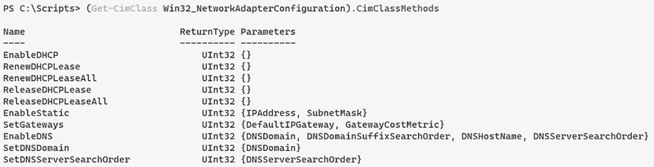
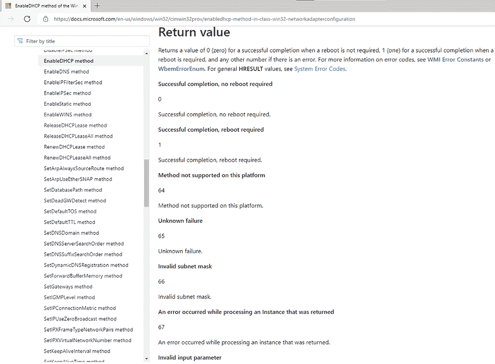

# 15 逐个处理多个对象

PowerShell 的全部目的是自动化管理，这通常意味着你可能想要对多个目标执行一些任务。你可能想要启动几个虚拟机，向几个 blob 存储推送，修改多个用户的权限，等等。在本章中，你将学习两种不同的技术来完成这些和其他多个目标任务：批处理 cmdlet 和对象枚举。这里的概念和技术无论你使用什么操作系统都是相同的。

注意：这是一章极其困难的章节，可能会让你感到沮丧。请对自己和我们保持耐心，并相信我们最终会解释清楚所有内容。

## 15.1 优先方法：“批处理”cmdlet

正如你在前面几个章节中学到的，许多 PowerShell cmdlet 可以接受批处理，或 *集合*，的对象来处理。例如，在第六章中，你学习了对象可以被从一个 cmdlet 传递到另一个 cmdlet，如下所示（请勿在任何系统上运行此命令，除非你真的想有一个糟糕的一天）：

```
Get-Service | Stop-Service
```

这是一个使用 cmdlet 进行批处理管理的例子。在这种情况下，`Stop-Process` 是专门设计用来从管道接受一个进程对象，然后停止它。`Set-Service`、`Start-Process`、`Move-Item` 和 `Move-AdObject` 都是接受一个或多个输入对象并针对每个对象执行任务或操作的 cmdlet 的例子。PowerShell 知道如何处理对象批处理，并且可以使用相对简单的语法为你处理它们。

这些 *批处理 cmdlet*（这是我们给它们的名称——它不是一个官方术语）是我们执行任务的首选方式。例如，假设我们需要更改多个服务的启动类型：

```
Get-Service BITS,Spooler | Set-Service -startuptype Automatic
```

这种方法的潜在缺点是，执行操作的 cmdlet 往往不会产生任何输出，以表明它们已经完成了工作。你将不会从前面提到的任何命令中获得任何可视输出，这可能会让人感到不安。但那些 cmdlet 通常有一个 `-PassThru` 参数，它告诉它们输出它们接受的任何输入对象。你可以让 `Set-Service` 输出它修改过的相同服务，这样你可以验证它们已经被修改。以下是一个使用 `-passThru` 的不同 cmdlet 的例子：

```
Get-ChildItem .\ | Copy-Item -Destination C:\Drivers -PassThru
```

此命令检索当前目录中的所有项目。然后这些对象被传递到 `Copy-Item`，然后它会将项目复制到 C:\Drivers 目录。因为我们把 `-PassThru` 参数放在了最后，所以它会在屏幕上显示它所做的工作。如果我们没有这样做，那么一旦它完成，它就会简单地回到我们的 PowerShell 提示符。

现在试试：从一个目录复制几个文件或文件夹到另一个目录。尝试使用和未使用 `-PassThru` 参数的情况，并注意区别。

## 15.2 CIM 方法：调用方法

在我们开始之前，有两件事你必须知道：

+   Windows Management Instrumentation (WMI) 与 PowerShell 7 不兼容。您必须使用通用信息模型 (CIM) 命令，它们的工作方式大致相同。

+   15.2 节仅适用于使用 Windows 的用户。我们尽力确保本书中我们做的所有事情都是跨平台的。但有些情况下这是不可能的，这就是其中之一。

很遗憾，我们并不总是拥有能够执行所需任何操作的 cmdlet，这在通过 CIM 操作的项目中尤为如此。例如，考虑一下 `Win32_NetworkAdapterConfiguration` CIM 类。这个类代表绑定到网络适配器的配置（适配器可以有多个配置，但为了简单起见，现在让我们假设每个适配器只有一个配置，这在客户端计算机上很常见）。假设我们的目标是启用所有计算机的英特尔网络适配器的 DHCP——我们不想启用任何 RAS 或其他虚拟适配器。

注意：我们将向您展示一个简短的故事线，旨在帮助您体验人们如何使用 PowerShell。有些事情可能看起来有些重复，但请耐心等待——体验本身是有价值的。

我们可能首先尝试查询所需的适配器配置，这将允许我们得到如下输出：

```
DHCPEnabled      : False
IPAddress        : {192.168.10.10, fe80::ec31:bd61:d42b:66f}
DefaultIPGateway :
DNSDomain        :
ServiceName      : E1G60
Description      : Intel(R) PRO/1000 MT Network Connection
Index            : 7
DHCPEnabled      : True
IPAddress        :
DefaultIPGateway :
DNSDomain        :
ServiceName      : E1G60
Description      : Intel(R) PRO/1000 MT Network Connection
Index            : 12
```

要实现这种输出，我们需要查询适当的 CIM 对象，并过滤它以仅包括描述中包含 *Intel* 的配置。以下命令做到了这一点（注意，在 WMI 过滤器语法中，`%` 作为通配符使用）：

```
PS C:\> Get-CimInstance -ClassName Win32_NetworkAdapterConfiguration | 
-Filter "description like '%intel%'" | Format-List
```

现在尝试：您欢迎跟随本节中运行的命令。您可能需要稍微调整命令才能使其工作。例如，如果您的计算机没有英特尔制造的任何网络适配器，您需要相应地更改过滤标准。

一旦我们有了这些配置对象在管道中，我们希望在它们上启用 DHCP（您可以看到我们的适配器之一还没有启用 DHCP）。我们可能首先寻找一个名为 *Enable-DHCP* 的 cmdlet。不幸的是，我们找不到它，因为没有这样的东西。没有能够直接批量处理 CIM 对象的 cmdlet。

现在尝试：基于您到目前为止所学的内容，您会使用什么命令来搜索名称中包含 DHCP 的 cmdlet？

我们下一步是查看对象本身是否有能够启用 DHCP 的方法。为了找出，我们运行 `Get-CimClass` 命令并展开到 `CimClassMethods` 属性：

```
PS C:\> (Get-CimClass Win32_NetworkAdapterConfiguration).CimClassMethods 
```

在顶部，我们将看到一个名为 `EnableDHCP` 的方法（图 15.1）。



图 15.1 显示了可用的方法

下一个步骤，许多 PowerShell 新手都会尝试，是将配置对象通过管道传递到方法：

```
PS C:\> Get-CimInstance win32_networkadapterconfiguration -filter 
"description like '%intel%'" | EnableDHCP
```

很遗憾，这不会起作用。你不能将对象管道传输到方法中；只能传输到 cmdlet 中。`EnableDHCP`不是一个 PowerShell cmdlet。相反，它是一个直接附加到配置对象本身的行为。

虽然没有名为`Enable-DHCP`的“批量”cmdlet，但你可以使用一个名为`Invoke-CimMethod`的通用 cmdlet。这个 cmdlet 专门设计用来接受一批 CIM 对象，例如我们的`Win32_NetworkAdapterConfiguration`对象，并调用这些对象上附加的方法。以下是我们要运行的命令：

```
PS C:\> Get-CimInstance -ClassName Win32_NetworkAdapterConfiguration -filter
➥ "description like '%intel%'" | Invoke-CimMethod -MethodName EnableDHCP
```

你有几件事情需要记住：

+   方法名称后面不跟括号。

+   方法名称不区分大小写。

+   `Invoke-CimMethod`一次只能接受一种 WMI 对象。在这种情况下，我们只发送`Win32_NetworkAdapterConfiguration`对象，这意味着它将按预期工作。发送多个对象是可以的（实际上这正是目的所在），但所有对象都必须是同一类型。

+   你可以使用`-WhatIf`和`-Confirm`与`Invoke-CimMethod`一起使用。但是，当你直接从对象调用方法时，不能使用这些选项。

`Invoke-CimMethod`的输出非常简单易懂。它给你两样东西：一个返回值和它在哪台计算机上运行（如果计算机名称为空，则表示在`localhost`上运行）。

```
ReturnValue PSComputerName
----------- --------------
         84
```

`ReturnValue`数字告诉我们操作的结果。通过你最喜欢的搜索引擎对*Win32_NetworkAdapterConfiguration*进行快速搜索，可以找到文档页面，然后我们可以点击进入`EnableDHCP`方法，查看可能的返回值及其含义。图 15.2 显示了我们的发现。



图 15.2 查找 WMI 方法结果的返回值

值为`0`表示成功，而`84`表示该适配器配置上未启用 IP，DHCP 无法启用。但是输出中的哪个位与我们的两个网络适配器配置中的哪一个相对应呢？很难判断，因为输出没有告诉你哪个具体的配置对象产生了它。这是不幸的，但这就是 CIM 的工作方式。

`Invoke-CimMethod`适用于大多数你有 CIM 对象并且想要执行其方法的情况。当从远程计算机查询 CIM 对象时，它也工作得很好。我们的基本规则是，“如果你可以通过`Get-CIMInstance`访问到某个东西，那么`Invoke-CimMethod`就可以执行其方法。”

## 15.3 备份计划：枚举对象

不幸的是，我们遇到了一些情况，其中我们有一个可以生成对象的 cmdlet，但我们不知道可以将这些对象管道化到哪个批处理 cmdlet 中以执行某种操作。我们也遇到过 cmdlet 不从管道中获取任何输入的情况。在两种情况下，你仍然可以执行你想要执行的任何任务，但你将不得不退回到一种更冗长的风格，即指示计算机枚举对象，并逐个对象执行你的任务。PowerShell 提供了两种实现此目的的方法：一种是通过 cmdlet，另一种是通过脚本结构。我们在这章中关注第一种技术，因为它是最简单的。*你应该始终尝试使用 cmdlet 而不是自己尝试脚本化它。* 我们将第二种方法留到第十九章，该章深入探讨了 PowerShell 的内置脚本语言。

对于我们的示例，因为我们一直在本章中讨论进程，所以我们将讨论 cmdlet。让我们看看语法：

```
Get-Help Get-Process -Full
```

这将给我们带来以下所有内容……但是快速浏览一下名为“Id.”的部分。你会注意到一些参数说明它们接受管道输入，但在括号中写着 `ByPropertyName`。这意味着如果我们向这个 cmdlet 管道一个对象，并且它有一个名为 `Id` 的属性，例如，这个 cmdlet 将使用那个：

```
-Id <System.Int32[]>
        Specifies one or more processes by process ID (PID). To specify 
      ➥ multiple IDs, use commas to separate the IDs.
        To find the PID of a process, type 'Get-Process'.

        Required?                    true
        Position?                    named
        Default value                None
        Accept pipeline input?       True (ByPropertyName)
        Accept wildcard characters?  false

    -IncludeUserName <System.Management.Automation.SwitchParameter>
        Indicates that the UserName value of the Process object is returned 
      ➥ with results of the command.

        Required?                    true
        Position?                    named
        Default value                False
        Accept pipeline input?       False
        Accept wildcard characters?  false
```

然而，如果我们只想管道输入一个字符串列表，这些字符串是我们想要创建的进程的名称呢？我们无法做到这一点，因为 `Name` 参数不支持其他类型的管道：`ByValue`。试试看。让我们看看 `New-AzKeyVault` 命令。我们将把我们的值放入一个数组中，并将其管道化到 `New-AzKeyVault` 命令中：

```
@( "vaultInt1", "vaultProd1", "vaultInt2", "vaultProd2" ) | New-AzKeyVault
```

这会导致出现以下不太理想的红色文本：

```
New-AzKeyVault: The input object cannot be bound to any parameters for the 
➥ command either because the command does not take pipeline input or the 
➥ input and its properties do not match any of the parameters that take 
➥ pipeline input.
```

让我们更深入地探讨一下，即使 cmdlet 无法支持我们想要执行的操作，我们仍然如何实现我们的目标。

### 15.3.1 使 cmdlet 为您服务

到目前为止，我们必须做出决定。有可能我们运行命令的方式不正确，所以我们必须决定我们是否愿意花大量时间来解决这个问题。也有可能 `New-AzKeyVault` 实际上不支持我们想要做的事情，在这种情况下，我们可能会花大量时间尝试修复我们无法控制的事情。

我们需要创建一个包含我们想要创建的保险库名称的文本文件。我们的 vaultsToCreate.txt 看起来像这样：

```
vaultInt1
vaultInt2
vaultProd1
vaultProd2
```

在这种情况下，我们通常的选择是尝试不同的方法。我们将要求计算机（好吧，是外壳）逐个枚举对象（在我们的情况下，是字符串），因为 `New-AzKeyVault` 命令一次只能接受一个对象，并在对象上执行 `New-AzKeyVault`。为此，我们使用 `ForEach-Object` cmdlet：

```
Get-Content -Path vaultsToCreate.txt | ForEach-Object { New-AzKeyVault 
-ResourceGroupName manning -Location 'UK South' -Name $_ }
```

对于我们创建的四个资源，我们得到四个看起来像这样的结果（这里只显示了部分输出，因为结果可能相当长）：

```
Vault Name                       : vaultInt1
Resource Group Name              : manning
Location                         : Australia Central
Resource ID                      : /subscriptions/*****/resourceGroups/manning/providers/Microsoft.KeyVault
   ➥ /vaults/vaultInt1
Vault URI                        : https://vaultint1.vault.azure.net/
Tenant ID                        : *********
SKU                              : Standard
Enabled For Deployment?          : False
Enabled For Template Deployment? : False
Enabled For Disk Encryption?     : False
Soft Delete Enabled?             :
```

在文档中，我们发现如果得到这样的响应，这意味着成功，这意味着我们已经实现了我们的目标。但让我们更详细地看看那个命令。

```
Get-Content -Path vaultsToCreate.txt | 
 ForEach-Object -Process {
   New-AzKeyVault -ResourceGroupName manning -Location 'UK South' -Name $_
}
```

这个命令有很多功能。第一行应该是合理的：我们使用 `Get-Content` 来检索我们放入文本文件中的保险库名称。我们将这些 `string` 对象通过管道传递给 `ForEach-Object` cmdlet：

+   首先，你看到的是 cmdlet 名称：`ForEach-Object`。

+   接下来，我们使用 `-Process` 参数指定一个脚本块。我们最初没有输入 `-Process` 参数名称，因为它是一个位置参数。但那个脚本块——大括号内包含的所有内容——是 `-Process` 参数的值。我们在重新格式化命令以方便阅读时包括了参数名称。

+   `ForEach-Object` 对每个被传递到 `ForEach-Object` 的对象执行其脚本块一次。每次脚本块执行时，下一个被传递的对象将被放置到特殊的 `$_` 占位符中，你可以在 `New-AzKeyVault` 中的 `Name` 参数中看到它被传递。

## 15.4 让我们加快速度

在前面的章节中，我们讨论了使用 PowerShell 作业并行运行命令以节省时间。为了简化这种节省时间的功能，PowerShell 7 在 `ForEach-Object` 上引入了一个新参数：`-Parallel`。通过一个例子可以更好地理解它，那就是著名的 `Measure-Command` cmdlet，它允许你测量各种事物，但我们将用它来测量脚本块运行的时间。它看起来是这样的：

```
Measure-Command {  <# The script we want to time #> }
```

那么，让我们试试看。首先，我们将使用常规的 `ForEach-Object` 尝试做一些简单的事情：

```
Get-Content -Path vaultsToCreate.txt | ForEach-Object -Process {
  Write-Output $_ 
  Start-Sleep 1
}
```

这所有的一切只是将文件的每一行打印出来，然后每行睡眠一秒。如果我们文件中有五行，你可能能猜出这需要多长时间运行，但让我们使用 `Measure-Command`：

```
Measure-Command {
   Get-Content -Path vaultsToCreate.txt |
   ForEach-Object -Process {
     Write-Output $_
     Start-Sleep 1
   }
}
```

当我们运行它时，我们得到以下输出：

```
Days              : 0
Hours             : 0
Minutes           : 0
Seconds           : 5
Milliseconds      : 244
Ticks             : 52441549
TotalDays         : 6.06962372685185E-05
TotalHours        : 0.00145670969444444
TotalMinutes      : 0.0874025816666667
TotalSeconds      : 5.2441549
TotalMilliseconds : 5244.1549
```

让我们具体看看 `Seconds` 值，它是 `5`。这说得通，对吧？如果我们文件中有五行，我们逐行处理每一行，并且每行睡眠 1 秒，我们预计该命令将大约运行 5 秒。

现在让我们将相同的命令更改为使用 `Parallel` 而不是 `Process`：

```
Measure-Command {
   Get-Content -Path vaultsToCreate.txt |
   ForEach-Object -Parallel {
     Write-Output $_
     Start-Sleep 1
   }
}
```

有什么猜测吗？让我们运行它：

```
Days              : 0
Hours             : 0
Minutes           : 0
Seconds           : 1
Milliseconds      : 340
Ticks             : 13405417
TotalDays         : 1.55155289351852E-05
TotalHours        : 0.000372372694444444
TotalMinutes      : 0.0223423616666667
TotalSeconds      : 1.3405417
TotalMilliseconds : 1340.5417
```

一秒钟！这是因为 `Parallel` 正如其名所示——它并行而不是顺序地运行脚本块。由于我们的文件中有五个项目，并且我们并行运行了所有这些项目，并且我们每次睡眠 1 秒，整个操作只需大约 1 秒。这对于长时间运行的任务或在有很多较小任务需要批量处理的场景非常有用。我们甚至可以使用现有的示例并使用 `Parallel ForEach`：

```
Get-Content -Path vaultsToCreate.txt | 
 ForEach-Object -Parallel {
   New-AzKeyVault -ResourceGroupName manning -Location 'UK South' -Name $_
}
```

`Parallel` 是 `ForEach` 上的一个非常强大的参数，但它确实有一些你应该注意的限制。首先，默认情况下，`Parallel` `ForEach` 只会并行运行五个脚本块。这被称为 *节流限制*，可以通过 `ThrottleLimit` 参数进行调整。回到我们一直在使用的那个文件，确保它总共有 10 行。这种差异非常明显：

```
Measure-Command {
   Get-Content -Path vaultsToCreate.txt |
   ForEach-Object -Process {
     Write-Output $_
     Start-Sleep 1
   }
}
```

没有设置节流限制，我们得到 2 秒：

```
Days              : 0
Hours             : 0
Minutes           : 0
Seconds           : 2
Milliseconds      : 255
Ticks             : 22554472
TotalDays         : 2.6104712962963E-05
TotalHours        : 0.000626513111111111
TotalMinutes      : 0.0375907866666667
TotalSeconds      : 2.2554472
TotalMilliseconds : 2255.4472
```

然而，如果我们把节流限制提高到 10，我们会得到

```
Measure-Command {
   Get-Content -Path vaultsToCreate.txt |
   ForEach-Object -ThrottleLimit 10 -Process {
     Write-Output $_
     Start-Sleep 1
   }
}
```

命令在 1 秒内完成！

```
Days              : 0
Hours             : 0
Minutes           : 0
Seconds           : 1
Milliseconds      : 255
Ticks             : 12553654
TotalDays         : 1.45296921296296E-05
TotalHours        : 0.000348712611111111
TotalMinutes      : 0.0209227566666667
TotalSeconds      : 1.2553654
TotalMilliseconds : 1255.3654
```

`Parallel ForEach` 是 PowerShell 的一个非常强大的功能。如果你能正确利用它，你会节省很多时间。

## 15.5 常见混淆点

本章中的技术是 PowerShell 中最困难的之一，它们经常引起最多的困惑和挫折。让我们看看新来者容易遇到的一些问题。我们提供了一些替代解释，这将帮助你避免遇到相同的问题。

### 15.5.1 哪种方法是正确的？

我们使用术语 *批处理 cmdlet* 或 *操作 cmdlet* 来指代任何对一组或集合中的对象执行操作的 cmdlet。你不需要指示计算机“遍历这个列表中的事物，并对每个事物执行这个操作”，你可以将整个组发送到 cmdlet，然后由 cmdlet 处理。

微软正在努力在其产品中提供这类 cmdlet，但它的覆盖范围还不是 100%（可能因为存在许多复杂的微软产品，所以可能很多年都不会达到 100%）。但是，当 cmdlet 存在时，我们更喜欢使用它。话虽如此，其他 PowerShell 开发者更喜欢根据他们最初学习的内容和最容易记住的内容选择其他方法。以下所有方法都有相同的结果：

```
Get-Process -name *B* | Stop-Process                                  ❶
Get-Process -name *B* | ForEach-Object { $_.Kill()}                   ❷
Get-Process -Name *B* | ForEach-Object -Parallel { Stop-Process $_ }  ❸
```

❶ 批处理 cmdlet

❷ 调用 Kill() 方法的 ForEach-Object

❸ ForEach-Object 调用 Stop-Process

让我们看看每种方法是如何工作的：

+   *批处理 cmdlet*。在这里，我们使用 `Get-Process` 来检索所有名称中带有 *B* 的进程，然后停止它们。

+   `ForEach-Object` 调用 `Kill()` 方法。这种方法与批处理 cmdlet 类似，但不是使用批处理 cmdlet，而是将进程通过管道发送到 `ForEach-Object`，并要求它执行每个服务的 `Kill()`

+   使用 `-Parallel` 的 `ForEach-Object` 调用 `Stop-Process`。

事实上，甚至还有第四种方法——使用 PowerShell 的脚本语言来完成相同的事情。你会在 PowerShell 中找到很多方法来完成几乎所有的事情，而且没有哪一种是错误的。有些方法比其他方法更容易学习、记忆和重复，这就是为什么我们专注于我们已有的技术，按照我们使用的顺序。你应该使用哪种方法？这无关紧要，因为没有一种绝对正确的方法。你可能甚至最终会根据具体情况和 shell 为你提供的任务能力，使用这些方法的混合。

### 15.5.2 Parallel ForEach 的递减回报

还记得我们的 `Parallel ForEach` 示例吗？它看起来是这样的：

```
Measure-Command {
   Get-Content -Path vaultsToCreate.txt |
   ForEach-Object -Parallel {
     Write-Output $_
     Start-Sleep 1
   }
}
```

现在假设 vaultsToCreate.txt 有 100 行。我们应该尝试将 `ThrottleLimit` 设置为 `100` 以使操作在 1 秒内完成吗？让我们试试：

```
Measure-Command {
   Get-Content -Path vaultsToCreate.txt |
   ForEach-Object -ThrottleLimit 100 -Parallel {
     Write-Output $_
     Start-Sleep 1
   }
}
```

这给出了 3 秒的输出。这很奇怪：

```
Days              : 0
Hours             : 0
Minutes           : 0
Seconds           : 3
Milliseconds      : 525
Ticks             : 35250040
TotalDays         : 4.07986574074074E-05
TotalHours        : 0.000979167777777778
TotalMinutes      : 0.0587500666666667
TotalSeconds      : 3.525004
TotalMilliseconds : 3525.004
```

为什么这么慢？好吧，结果是瓶颈是你的机器，它在开始变慢之前只能并行运行这么多事情。这就像我们在第十四章中看到的 `Start-ThreadJob`。单个进程在开始比串行运行慢之前只能并行做这么多事情。

这是一个奇怪的概念，但想象一下如果你同时处理一堆任务。你将不得不不断在各个任务之间进行上下文切换，以同时在这所有任务上取得进展。在某些情况下，如果你简单地等待完成其他正在进行的任务后再开始一个任务，你可能会更有效率。我们通常称这种现象为“收益递减”，意味着随着你尝试并行做更多的事情，它变得不那么值得，如果不小心，甚至可能以负面方式影响结果。

### 15.5.3 方法文档

总是记住，将对象管道传输到 `Get-Member` 会显示方法：

```
Get-Process | Get-Member
```

PowerShell 的内置帮助系统没有记录方法对象。例如，如果你为进程对象获取成员列表，你可以看到存在名为 `Kill` 和 `Start` 的方法：

```
TypeName: System.Diagnostics.Process
Name                       MemberType     Definition
----                       ----------     ----------
BeginErrorReadLine         Method         void BeginErrorReadLine()
BeginOutputReadLine        Method         void BeginOutputReadLine()
CancelErrorRead            Method         void CancelErrorRead()
CancelOutputRead           Method         void CancelOutputRead()
Close                      Method         void Close()
CloseMainWindow            Method         bool CloseMainWindow()
Dispose                    Method         void Dispose(), void IDisposable.Dispose()
Equals                     Method         bool Equals(System.Object obj)
GetHashCode                Method         int GetHashCode()
GetLifetimeService         Method         System.Object GetLifetimeService()
GetType                    Method         type GetType()
InitializeLifetimeService  Method         System.Object InitializeLifetimeService()
Kill                       Method         void Kill(), void Kill(bool entireProcessTree)
Refresh                    Method         void Refresh()
Start                      Method         bool Start()
ToString                   Method         string ToString()
WaitForExit                Method         void WaitForExit(), bool WaitForExit(int milliseconds)
WaitForInputIdle           Method         bool WaitForInputIdle(), bool 
➥ WaitForInputIdle(int milliseconds)
```

要找到这些文档，请关注 `TypeName`，在这个例子中是 `System.Diagnostics.Process`。在搜索引擎中搜索这个完整的类型名称，你通常会找到该类型的官方开发者文档，这将引导你找到你想要的特定方法的文档。

### 15.5.4 ForEach-Object 混淆

`ForEach-Object` cmdlet 的语法中有很多标点符号，加上方法自己的语法可能会创建一个丑陋的命令行。我们整理了一些打破任何心理障碍的建议：

+   尽量使用完整的 cmdlet 名称，而不是它的 `%` 或 `ForEach` 别名。完整的名称可能更容易阅读。如果你在使用别人的示例，请将别名替换为完整的 cmdlet 名称。

+   花括号内的脚本块会为每个被管道传输到 cmdlet 的对象执行一次。

+   在脚本块内部，`$_` 代表管道中的当前对象。

+   使用 `$_` 自身来处理你管道传输的整个对象；在 `$_` 后面加一个点来处理单个方法或属性。

+   方法名称总是后面跟着括号，即使该方法不需要任何参数。当需要参数时，它们通过逗号分隔并包含在括号内。

## 15.6 实验

注意：对于这个实验，你需要一台安装了 PowerShell 7 或更高版本的机器。

尝试回答以下问题并完成指定的任务。这是一个重要的实验，因为它利用了你之前许多章节中学到的技能，你应该在阅读本书的剩余部分时继续使用和加强这些技能：

1.  `DirectoryInfo` 对象（由 `Get-ChildItem` 产生）的哪种方法可以删除目录？

1.  `Process` 对象（由 `Get-Process` 产生）的哪种方法可以终止指定的进程？

1.  编写三个命令，用于删除所有名称中包含 `deleteme` 的文件和目录，假设有多个文件和目录包含这个名称。

1.  假设你有一个包含计算机名称的文本列表，但你想将它们显示为大写。你可以使用什么 PowerShell 表达式？

## 15.7 实验答案

1.  找到类似的方法：

    `Get-ChildItem | Get-Member -MemberType Method`

    你应该看到一个 `Delete()` 方法。

1.  找到类似的方法：

    `get-process | Get-Member -MemberType Method`

    你应该看到一个 `Kill()` 方法。你可以通过检查该进程对象的 MSDN 文档来验证这一点。当然，你不需要调用该方法，因为有一个 cmdlet，`Stop-Process`，可以为你完成这项工作。

1.  `Get-ChildItem *deleteme* | Remove-Item -Recurse -Force`

    `Remove-Item *deleteme* -Recurse -Force`

    `Get-ChildItem *deleteme* | foreach {$_.Delete()}`

1.  `Get-content computers.txt | foreach {$_.ToUpper()}`
