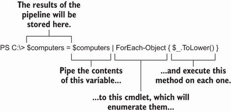

# 16 变量：存储你的东西的地方

我们已经提到 PowerShell 包含一种脚本语言，在接下来的几章中，我们将开始使用它。但一旦你开始编写脚本，你可能希望将你的对象作为变量存储起来以供以后使用，所以我们将在这个章节中介绍这些内容。你可以在许多地方使用变量，而不仅仅是长而复杂的脚本中，所以我们也将在这个章节中展示一些实际使用变量的方法。

## 16.1 变量的介绍

将*变量*想象成计算机内存中的一个带有名称的盒子是一种简单的方法。你可以把任何东西放进盒子里：单个计算机名、一组服务、一个 XML 文档等等。你可以通过使用其名称来访问盒子，在访问时，你可以往里面放东西或从中检索东西。这些东西会留在盒子里，让你可以反复检索。

PowerShell 对变量没有太多的正式要求。例如，在使用变量之前，你不必明确宣布或声明你打算使用变量。你还可以更改变量的内容类型或对象：这一刻你可能在里面有一个单个进程，下一刻你可以在里面存储一个计算机名数组。变量甚至可以包含多个不同的事物，例如一组服务和一组进程（尽管我们承认在这些情况下，使用变量的内容可能会很棘手）。

## 16.2 在变量中存储值

在 PowerShell 中——我们确实是指*一切*——都被视为对象。即使是像计算机名这样的简单字符字符串也被视为对象。例如，将字符串管道到`Get-Member`（或其别名`gm`）会显示该对象是`System.String`类型，并且它有许多你可以与之交互的方法（我们截断以下列表以节省空间）：

```
PS > "SRV-02" | Get-Member
```

这为你提供了：

```
   TypeName: System.String

Name                 MemberType            Definition
----                 ----------            ----------
Clone                Method                System.Object Clone(), System.O...
CompareTo            Method                int CompareTo(System.Object val...
Contains             Method                bool Contains(string value), bo...
CopyTo               Method                void CopyTo(int sourceIndex, ch...
EndsWith             Method                bool EndsWith(string value), bo...
EnumerateRunes       Method                System.Text.StringRuneEnumerato...
Equals               Method                bool Equals(System.Object obj),...
GetEnumerator        Method                System.CharEnumerator GetEnumer...
GetHashCode          Method                int GetHashCode(), int GetHashC...
GetPinnableReference Method                System.Char&, System.Private.Co...
GetType              Method                type GetType()
```

现在试试 Run this same command in PowerShell to see if you get the complete list of methods—and even a property—that comes with a `System.String` object.

虽然从技术上讲，这个字符串是一个对象，但你可能会发现人们倾向于像在 shell 中的其他所有东西一样，将其称为一个简单的值。这是因为，在大多数情况下，你关心的是字符串本身——例如前一个例子中的`"SRV-02"`——而你不太关心从属性中检索信息。这与一个整个进程对象是一个大型的抽象数据结构的过程不同，你通常处理的是单个属性，如`VM`、`PM`、`Name`、`CPU`、`ID`等等。`String`是一个对象，但它比`Process`这样的对象要简单得多。

PowerShell 允许你将这些简单的值存储在变量中。为此，指定变量，并使用等号运算符——即*赋值*运算符——后跟你想放入变量中的任何内容。以下是一个示例：

```
$var = "SRV-02"
```

现在试试看。跟随这些例子，因为这样你就能复制我们展示的结果。你应该使用你的测试服务器的名称，而不是 `SRV-02.`

重要的是要注意，美元符号 (`$`) 不是变量名的一部分。在我们的例子中，变量名是 `var`。美元符号是 shell 的一个提示，表明接下来的是变量名，并且我们想要访问该变量的内容。在这种情况下，我们正在设置变量的内容。

让我们看看关于变量及其名称的一些关键点：

+   变量名通常包含字母、数字和下划线，并且它们通常以字母或下划线开头。

+   变量名可以包含空格，但名称必须用大括号括起来。例如，`${My Variable}` 表示一个名为 `My` `Variable` 的变量。个人来说，我们不喜欢包含空格的变量名，因为它们需要更多的输入，而且更难阅读。

+   变量在 shell 会话之间不会持久存在。当你关闭 shell 时，你创建的任何变量都会消失。

+   变量名可以相当长——长到你不必担心长度。尽量使变量名合理。例如，如果你要将计算机名放入变量中，使用 `computername` 作为变量名。如果一个变量将包含多个进程，那么 `processes` 是一个好的变量名。

+   一些有其他脚本语言经验的用户可能习惯于使用前缀来指示变量中存储的内容。例如，`strComputerName` 是一种常见的变量名，意味着该变量包含一个字符串（`str` 部分）。PowerShell 并不关心你是否这样做，但 PowerShell 社区不再认为这是一种可取的做法。

要检索变量的内容，请使用美元符号后跟变量名，如下面的示例所示。同样，美元符号告诉 shell 你想要访问变量的 *内容*；跟在它后面的是变量名告诉 shell 你要访问哪个变量：

```
$var
```

这会输出

```
SRV-02
```

你几乎可以在任何情况下使用变量代替值，例如，当使用 `Get-Process` `ID` 时。命令可能看起来像这样：

```
Get-Process -Id 13481
```

这会输出

```
 NPM(K)    PM(M)      WS(M)     CPU(s)      Id  SI ProcessName
 ------    -----      -----     ------      --  -- -----------
      0     0.00      86.21       4.12   13481 ...80 pwsh
```

你可以用变量替换任何值：

```
$var = "13481"

Get-Process -Id $var
```

这会给你

```
NPM(K)    PM(M)      WS(M)     CPU(s)      Id  SI ProcessName
 ------    -----      -----     ------      --  -- -----------
      0     0.00      86.21       4.12   13481 ...80 pwsh
```

顺便说一下，我们意识到 `var` 是一个相当通用的变量名。我们通常会使用 `processId`，但在这个特定的情况下，我们计划在几种情况下重用 `$var`，所以我们决定保持其通用性。不要让这个例子阻止你在现实生活中使用更合理的变量名。我们最初可能已经将一个字符串放入 `$var` 中，但我们可以随时更改它：

```
PS > $var = 5
PS > $var | get-member
   TypeName: System.Int32
Name        MemberType Definition
----        ---------- ----------
CompareTo   Method     int CompareTo(System.Object value), int CompareT...
Equals      Method     bool Equals(System.Object obj), bool Equals(int ...
GetHashCode Method     int GetHashCode()
GetType     Method     type GetType()
GetTypeCode Method     System.TypeCode GetTypeCode()
```

在前面的例子中，我们将一个整数放入 `$var` 中，然后我们将 `$var` 管道到 `Get-Member`。你可以看到，shell 将 `$var` 的内容识别为 `System .Int32`，即 32 位整数。

## 16.3 使用变量：引号中的趣味技巧

因为我们在谈论变量，这是一个介绍一个整洁的 PowerShell 特性的好时机。到目前为止，这本书中我们建议你通常用单引号括起字符串。这样做的原因是 PowerShell 将单引号内的一切视为字面量字符串。

考虑以下示例：

```
PS > $var = 'What does $var contain?'
PS > $var
What does $var contain?
```

在这里，你可以看到单引号内的`$var`被视为一个字面量。但在双引号中，情况并非如此。看看下面的技巧：

```
PS > $computername = 'SRV-02'
PS > $phrase = "The computer name is $computername"
PS > $phrase
The computer name is SRV-02
```

我们从将`SRV-02`存储在变量`$computername`中开始我们的示例。接下来，我们将`"The computer name is $computername"`存储在变量`$phrase`中。当我们这样做时，我们使用双引号。PowerShell 会自动在双引号内寻找美元符号，并用它找到的任何变量替换它们的内容。因为我们显示`$phrase`的内容，所以`$computername`变量被替换为`SRV-02`。

这种替换动作仅在 shell 最初解析字符串时发生。此时，`$phrase`包含`"The computer name is SRV-02"`——它不包含`"$computername"`字符串。我们可以通过尝试更改`$computername`的内容来测试这一点，看看`$phrase`是否会更新自己：

```
PS > $computername = 'SERVER1'
PS > $phrase
The computer name is SRV-02
```

如你所见，`$phrase`变量保持不变。

双引号技巧的另一个方面是 PowerShell 的转义字符。这个字符是反引号（`` ` ``），在美国键盘上，它位于左上角的一个键上，通常位于 Esc 键下方，有时与波浪号（`~`）字符在同一个键上。问题是，在某些字体中，它与单引号几乎无法区分。事实上，我们通常配置我们的 shell 使用 Consolas 字体，因为这样比使用 Lucida Console 或 Raster 字体更容易区分反引号。

让我们看看这个转义字符的作用。它移除可能与它后面的字符关联的任何特殊含义，或者在某些情况下，它给后面的字符添加特殊含义。我们有一个第一个使用的例子：

```
PS > $computername = 'SRV-02'
PS > $phrase = "`$computername contains $computername"
PS > $phrase
$computername contains SRV-02
```

当我们将字符串赋值给`$phrase`时，我们使用了`$computername`两次。第一次，我们在美元符号前加了一个反引号。这样做消除了美元符号作为变量指示符的特殊含义，使其成为一个字面量美元符号。你可以在前面的输出中看到，在最后一行，`$computername`被存储在变量中。我们没有在第二次使用反引号，所以`$computername`被替换为该变量的内容。现在让我们看看反引号可以以第二种方式工作的例子：

```
PS > $phrase = "`$computername`ncontains`n$computername"
PS > $phrase
$computername
contains
SRV-02
```

仔细观察，你会发现我们在短语中使用了`` `n ``两次——一次在第一个`$computername`之后，一次在`contains`之后。在示例中，反引号添加了特殊含义。通常，*n*是一个字母，但反引号在它前面时，它变成了回车和换行（想想*n*代表*新行*）。

运行 `help about_escape` 获取更多信息，包括其他特殊转义字符的列表。例如，你可以使用转义的 *t* 来插入制表符，或者使用转义的 *a* 来使计算机发出蜂鸣声（想想 *a* 代表 *alert*）。

## 16.4 在变量中存储多个对象

到目前为止，我们一直在处理包含单个对象的变量，而这些对象都是简单值。我们直接与对象本身而不是它们的属性或方法一起工作。现在让我们尝试将多个对象放入一个变量中。

做这件事的一种方法是用逗号分隔的列表，因为 PowerShell 识别这些列表为对象的集合：

```
PS > $computers = 'SRV-02','SERVER1','localhost'
PS > $computers
SRV-02
SERVER1
Localhost
```

注意，在这个例子中，我们小心地将逗号放在引号外面。如果我们把它们放在里面，我们会得到一个包含逗号和三个计算机名称的单个对象。使用我们的方法，我们得到三个不同的对象，它们都是 `String` 类型。正如你所看到的，当我们检查变量的内容时，PowerShell 会单独显示每个对象。

### 16.4.1 在变量中处理单个对象

你还可以逐个访问变量中的单个元素。为此，指定你想要的对象的索引号，用方括号表示。第一个对象始终在索引号 `0`，第二个在索引号 `1`，依此类推。你还可以使用索引 `-1` 来访问最后一个对象，`-2` 用于倒数第二个对象，依此类推。以下是一个例子：

```
PS > $computers[0]
SRV-02
PS > $computers[1]
SERVER1
PS > $computers[-1]
localhost
PS > $computers[-2]
SERVER1
```

变量本身有一个属性，可以让你看到里面有多少个对象：

```
$computers.count
```

这会导致

```
3
```

你也可以像访问变量的属性和方法一样访问变量内部对象的属性和方法。一开始，这在一个只包含单个对象的变量中更容易看到：

```
PS > $computername.length  
6
PS > $computername.toupper()  
SRV-02
PS > $computername.tolower()
srv-02
PS > $computername.replace('02','2020') 
SRV-2020
PS > $computername
SRV-02  
```

在这个例子中，我们使用本章前面创建的 `$computername` 变量。你可能还记得，这个变量包含一个 `System.String` 类型的对象，当你将字符串管道传输到 16.2 节中的 `Get-Member` 时，你应该已经看到了该类型的完整属性和方法列表。我们使用 `Length` 属性以及 `ToUpper()`、`ToLower()` 和 `Replace()` 方法。在每种情况下，我们都必须在方法名后跟括号，即使 `ToUpper()` 和 `ToLower()` 不需要括号内的任何参数。此外，这些方法中的任何一个都不会改变变量中的内容——你可以在最后一行看到这一点。相反，每个方法都会根据原始对象创建一个新的 `String`，该对象由方法修改。

如果你想改变变量的内容？你可以很容易地为变量分配一个新的值：

```
PS > $computers = "SRV-02"
PS > $computers
SRV-02

PS > $computers = "SRV-03"
PS > $computers
SRV-03
```

### 16.4.2 在变量中处理多个对象

当一个变量包含多个对象时，步骤可能会变得复杂。即使变量内的每个对象都是同一类型，就像我们的 `$computers` 变量一样，并且你可以对每个对象调用方法，但这可能不是你想要做的。你可能想要指定变量中你想要的对象，然后访问该特定对象的属性或执行方法：

```
PS > $computers[0].tolower()
SRV-02
PS > $computers[1].replace('SERVER','CLIENT')
CLIENT1
```

再次强调，这些方法是在生成新的字符串，而不是改变变量内部的字符串。你可以通过检查变量的内容来测试这一点：

```
PS > $computers
SRV-02
SERVER1
Localhost
```

如果你想要改变变量的内容？你给现有的对象之一分配一个新值：

```
PS > $computers[1] = $computers[1].replace('SERVER','CLIENT')
PS > $computers
SRV-02
CLIENT1
Localhost
```

你可以看到在这个例子中，我们改变了变量中的第二个对象，而不是生成一个新的字符串。

### 16.4.3 其他处理多个对象的方法

我们想向您展示两种处理变量中包含的一组对象的属性和方法的其他选项。前面的示例仅对变量中的单个对象执行了方法。如果你想在变量中的每个对象上运行 `ToLower()` 方法，并将结果存储回变量，你可以这样做：

```
PS > $computers = $computers | ForEach-Object { $_.ToLower()}
PS > $computers
srv-02
client1
localhost
```

这个例子有点复杂，所以让我们在图 16.1 中分解它。我们以 `$computers` `=` 开始管道，这意味着管道的结果将存储在那个变量中。这些结果覆盖了变量中之前的内容。



图 16.1 使用 `ForEach-Object` 对变量中包含的每个对象执行方法

管道从 `$computers` 被管道传输到 `ForEach-Object` 开始。该命令枚举管道中的每个对象（我们有三个计算机名称，它们是 `string` 对象）并为每个对象执行其脚本块。在脚本块中，`$_` 占位符每次包含一个管道输入的对象，并且我们在每个对象上执行 `ToLower()` 方法。由 `ToLower()` 产生的新 `String` 对象被放入管道——以及 `$computers` 变量中。

你可以使用 `Select-Object` 来做类似的事情。这个例子选择了传递给该命令的每个对象的 `Length` 属性：

```
$computers | select-object length
```

这给你

```
Length
------
     6
     7
     9
```

因为属性是数字，PowerShell 将输出右对齐。

### 16.4.4 在 PowerShell 中展开属性和方法

你可以使用包含多个对象的变量来访问属性和方法：

```
$processes = Get-Process
$processes.Name 
```

在底层，PowerShell “看到”你试图在示例中访问属性。它还看到 `$processes` 中的集合没有 `Name` 属性——但是集合中的每个单独的对象都有。因此，它隐式枚举或展开对象，并获取每个对象的 `Name` 属性。这相当于以下内容：

```
Get-Process | ForEach-Object { $_.Name }
```

这也等同于以下操作：

```
Get-Process | Select-Object –ExpandProperty Name
```

同样的情况也适用于方法：

```
$objects = Get-ChildItem ./*.txt -File
$objects.Refresh()
```

## 16.5 双引号的一些更多技巧

我们还有一个你可以使用双引号使用的酷炫技巧，这是对变量替换技巧的一种概念上的扩展。例如，假设你已经将一些进程放入了 `$processes` 变量中。现在你只想将第一个进程的名称放入一个字符串中：

```
$processes = Get-Process
$firstname = "$processes[0].name"
$firstname
```

这导致：

```
System.Diagnostics.Process System.Diagnostics.Process System.Diagnostics.Process 
System.Diagnostics.Process System.Diagnostics.Process System.Diagnostics.Process 
System.Diagnostics.Process System.Diagnostics.Process System.Diagnostics.Process 
System.Diagnostics.Process System.Diagnostics.Process System.Diagnostics.Process 
System.Diagnostics.Process System.Diagnostics.Process System.Diagnostics.Process 
System.Diagnostics.Process System.Diagnostics.Process System.Diagnostics.Process 
System.Diagnostics.Process System.Diagnostics.Process System.Diagnostics.Process 
System.Diagnostics.Process System.Diagnostics.Process System.Diagnostics.Process 
System.Diagnostics.Process System.Diagnostics.Process System.Diagnostics.Process 
System.Diagnostics.Process System.Diagnostics.Process System.Diagnostics.Process 
System.Diagnostics.Process System.Diagnostics.Process System.Diagnostics.Process 
System.Diagnostics.Process System.Diagnostics.Process System.Diagnostics.Process 
System.Diagnostics.Process System.Diagnostics.Process[0].name
```

哎，哎呀。示例中 `$processes` 后面的 `[` 通常不是一个变量名中的合法字符，这会导致 PowerShell 尝试替换 `$processes`。这样做会将每个服务的名称都挤入你的字符串中。`[0].name` 这部分根本不会被替换。解决方案是将所有这些放入一个表达式中：

```
$processes = Get-Process | where-object {$_.Name}
$firstname = "The first name is $($processes[0].name)"
$firstname
```

这导致

```
The first name is AccountProfileR
```

`$()` 中的所有内容都被评估为正常的 PowerShell 命令，并将结果放入字符串中，替换掉任何已经存在的内容。再次强调，这仅在双引号中有效。这个 `$()` 构造被称为 *子表达式*。

我们在 PowerShell 中还有一个你可以做的酷炫技巧。有时你可能会想要将一些更复杂的东西放入变量中，然后显示该变量的内容，在引号内。在 PowerShell 中，外壳足够聪明，即使你只引用单个属性或方法，也能枚举集合中的所有对象，只要集合中的所有对象都是同一类型。例如，我们将检索进程列表并将它们放入 `$processes` 变量中，然后只包括进程名称在双引号中：

```
$processes = Get-Process | where-object {$_.Name}
$var = "Process names are $processes.name"
$var
```

这导致

```
Process names are System.Diagnostics.Process (AccountProfileR) 
System.Diagnostics.Process (accountsd) System.Diagnostics.Process (adprivacyd) 
System.Diagnostics.Process (AdvertisingExte) System.Diagnostics.Process (AirPlayUIAgent) 
System.Diagnostics.Process (akd) System.Diagnostics.Process (AMPArtworkAgent) 
System.Diagnostics.Process (AMPDeviceDiscov) System.Diagnostics.Process (AMPLibraryAgent) 
System.Diagnostics.Process (amsaccountsd) System.Diagnostics.Process (APFSUserAgent) 
System.Diagnostics.Process (AppleSpell) System.Diagnostics.Process (AppSSOAgent) 
System.Diagnostics.Process (appstoreagent) System.Diagnostics.Process (askpermissiond) 
System.Diagnostics.Process (AssetCacheLocat) System.Diagnostics.Process (assistantd) 
System.Diagnostics.Process (atsd) System.Diagnostics.Process (AudioComponentR) 
System.Diagnostics.Process (backgroundtaskm) System.Diagnostics.Process (bird)
```

我们截断了前面的输出以节省空间，但我们希望你能理解这个概念。显然，这可能不是你想要的精确输出，但通过这个技术和我们在本节中之前展示的子表达式技术，你应该能够得到你想要的精确结果。

## 16.6 声明变量的类型

到目前为止，我们已经将对象放入变量中，让 PowerShell 确定我们使用的是哪种类型的对象。PowerShell 不在乎你把什么类型的对象放入盒子中。但你可能在乎。

例如，假设你有一个你期望包含数字的变量。你计划用这个数字做一些算术运算，并要求用户输入这个数字。让我们看看一个例子，你可以直接在命令行中输入：

```
PS > $number = Read-Host "Enter a number"
Enter a number: 100
PS > $number = $number * 10
PS > $number
100100100100100100100100100100
```

现在尝试一下 我们还没有向你展示 `Read-Host`——我们将其留到下一章，但如果你跟随这个例子，它的操作应该是显而易见的。

真的是什么情况？`100` 乘以 `10` 怎么会是 `100100100100100100100100100100`？那是哪种疯狂的新数学？

如果你眼尖，你可能已经发现了正在发生的事情。PowerShell 不将我们的输入视为数字；它将其视为字符串。而不是将 `100` 乘以 `10`，PowerShell *重复了字符串* `"100"` *10 次*。因此，结果是字符串 `100`，连续列出 10 次。哎呀。

我们可以验证，外壳实际上是将输入作为字符串处理的：

```
PS > $number = Read-Host "Enter a number"
Enter a number: 100
PS > $number | Get-Member
   TypeName: System.String
Name             MemberType            Definition
----             ----------            ----------
Clone            Method                System.Object Clone()
CompareTo        Method                int CompareTo(System.Object valu...
Contains         Method                bool Contains(string value)
```

是的，将 `$number` 传递给 `Get-Member` 可以确认，shell 将其视为 `System.String`，而不是 `System.Int32`。处理这个问题的方法有几个，我们将向您展示最简单的一个。

首先，我们告诉 shell `$number` 变量应该包含一个整数，这将迫使 shell 尝试将任何输入转换为实数。我们在以下示例中通过在变量首次使用之前立即指定所需的数据类型 `int`，在方括号中完成这一点：

```
PS > [int]$number = Read-Host "Enter a number"         ❶
Enter a number: 100
PS > $number | Get-Member
   TypeName: System.Int32                              ❷
Name        MemberType Definition
----        ---------- ----------
CompareTo   Method     int CompareTo(System.Object value), int CompareT...
Equals      Method     bool Equals(System.Object obj), bool Equals(int ...
GetHashCode Method     int GetHashCode()
GetType     Method     type GetType()
GetTypeCode Method     System.TypeCode GetTypeCode()
ToString    Method     string ToString(), string ToString(string format...
PS > $number = $number * 10
PS > $number
1000                                                   ❸
```

❶ 强制变量为 [int]

❷ 确认变量是 Int32

❸ 变量被当作数字处理。

在这个例子中，我们使用 `[int]` 来强制 `$number` 只包含整数。在输入我们的输入后，我们将 `$number` 传递给 `Get-Member` 以确认它确实是一个整数而不是字符串。最后，您可以看到变量被当作数字处理，并且发生了乘法操作。

使用这种技术的另一个好处是，如果 shell 无法将输入转换为数字，它将抛出一个错误，因为 `$number` 只能存储整数：

```
PS > [int]$number = Read-Host "Enter a number"
Enter a number: Hello
MetadataError: Cannot convert value "Hello" to type "System.Int32". Error: 
➥ "Input string was not in a correct format."
```

这是一个很好的例子，说明了如何防止未来的问题，因为您可以确保 `$number` 将包含您期望的确切数据类型。

您可以使用许多对象类型来代替 `[int]`，但以下列表包括您最常使用的一些类型：

+   `[int]`—整数

+   `[single]` 和 `[double]`—单精度和双精度浮点数（有小数部分的数字）

+   `[string]`—字符字符串

+   `[char]`—恰好一个字符（例如，`[char]$c = 'X'`）

+   `[xml]`—XML 文档；分配给此的任何字符串都将被解析以确保它包含有效的 XML 标记（例如，`[xml]$doc = Get-Content MyXML.xml`）

为变量指定对象类型是防止更复杂脚本中某些棘手的逻辑错误的好方法。以下示例显示，一旦指定了对象类型，PowerShell 就会强制执行它，直到您明确地重新类型化变量：

```
PS > [int]$x = 5                                          ❶
PS > $x = 'Hello'                                         ❷
MetadataError: Cannot convert value "Hello" to type "System.Int32".
➥ Error: "Input string was not in a correct format."
PS > [string]$x = 'Hello'                                 ❸
PS > $x | Get-Member
   TypeName: System.String                                ❹
Name             MemberType            Definition
----             ----------            ----------
Clone            Method                System.Object Clone()
CompareTo        Method                int CompareTo(System.Object valu...
```

❶ 声明 $x 为整数

❷ 将字符串放入 $x 中创建错误

❸ 将 $x 重新类型化为字符串

❹ 确认 $x 的新类型

您可以看到我们首先声明 `$x` 为整数并将一个整数放入其中。当我们尝试放入一个字符串时，PowerShell 会抛出一个错误，因为它无法将那个特定的字符串转换为数字。后来我们将 `$x` 重新类型化为字符串，我们能够放入一个字符串。我们通过将变量传递给 `Get-Member` 并检查其类型名称来确认这一点。

## 16.7 变量操作命令

到目前为止，我们已经开始使用变量，但没有正式声明我们的意图。PowerShell 不需要高级变量声明，你不能强迫它进行声明。（有些人可能正在寻找类似 `Option Explicit` 的东西，但会感到失望；PowerShell 有一个叫做 `Set-StrictMode` 的东西，但它并不完全相同。）但是，shell 包含以下用于处理变量的命令：

+   `New-Variable`

+   `Set-Variable`

+   `Remove-Variable`

+   `Get-Variable`

+   `Clear-Variable`

你不需要使用这些中的任何一项，除非可能是 `Remove-Variable`，这对于永久删除变量很有用（你还可以在 `VARIABLE:` 驱动器中使用 `Remove-Item` 命令来删除变量）。你可以通过使用本章中到目前为止我们所使用的临时语法来执行每个其他功能——创建新变量、读取变量和设置变量。在大多数情况下，使用这些 cmdlet 没有特定的优势，因为你是在运行脚本之前强制变量赋值。这可能会对提供即时补全的工具（如 Visual Studio Code）造成问题。如果你使用正常的赋值运算符，这些复杂情况将更加准确，因为 PowerShell 可以查看你的脚本并预测变量值的样式。

如果你确实决定使用这些 cmdlet，你需要将变量名提供给 cmdlet 的 `-name` 参数。这**仅是变量名**——它不包括美元符号。你可能会想使用这些 cmdlet 的情况之一是处理所谓的**超出作用域**的变量。玩弄超出作用域的变量是一种不良做法，我们在这本书中没有涉及（或关于作用域的更多内容），但你可以在 shell 中运行 `help about_scope` 来了解更多信息。

## 16.8 变量最佳实践

我们已经提到了这些实践中的大部分，但这是一个快速复习它们的好时机：

+   保持变量名既有意义又简洁。例如，`$computername` 是一个很好的变量名，因为它既清晰又简洁，而 `$c` 则是一个糟糕的名字，因为它包含的内容并不明确。变量名 `$computer_to_query_for_data` 对于我们的口味来说有点长。当然，它是有意义的，但你真的想一遍又一遍地输入它吗？

+   不要在变量名中使用空格。我们知道你可以这样做，但这是一种丑陋的语法。

+   如果一个变量只包含一种类型的对象，那么在第一次使用变量时就应该声明这一点。这有助于防止逻辑错误。假设你在一个商业脚本开发环境中工作（例如 Visual Studio Code）。在这种情况下，编辑软件可以在你告诉它变量将包含的对象类型时提供代码提示功能。

## 16.9 常见混淆点

我们看到的新学生最常遇到的一个困惑点是变量名。我们希望我们已经在本章中很好地解释了它，但请始终记住，美元符号**不是变量名的一部分**。它是向 shell 发出的一个信号，表明你想要访问变量的**内容**；美元符号之后的内容被视为变量名。shell 有两个解析规则，允许它捕获变量名：

+   如果美元符号后面的字符是一个字母、数字或下划线，则变量名由美元符号之后直到下一个空白字符（可能是空格、制表符或回车符）的所有字符组成。

+   如果美元符号后面的字符是一个开括号 `{`，则变量名由该括号之后直到但不包括闭括号 `}` 的所有内容组成。

## 16.10 实验项目

1.  创建一个后台作业，从两台计算机上获取以 `pwsh` 开头的所有进程（如果你只有一个计算机进行实验，请使用 `localhost` 两次）。

1.  当作业运行完成后，将作业的结果接收到一个变量中。

1.  显示该变量的内容。

1.  将变量的内容导出到 CLIXML 文件中。

1.  获取你本地机器上当前运行的所有服务的列表，并将其保存到变量 `$processes` 中。

1.  将 `$processes` 替换为仅包含 bits 和打印打印机的服务。

1.  显示 `$processes` 的内容。

1.  将 `$processes` 导出为 CSV 文件。

## 16.11 实验答案

1.  `Invoke-Command {Get-Process pwsh} –computernamelocalhost,$env:computername –asjob`

1.  `$results = Receive-Job 4 –Keep`

1.  `$results`

1.  `$results | Export-CliXml processes.xml`

1.  `$processes = get-service`

1.  `$processes = get-service -name bits,spooler`

1.  `$processes`

1.  `$processes | export-csv -path c:\services.csv`

## 16.12 进一步探索

抽空浏览一下本书的一些前面的章节。鉴于变量主要是为了存储你可能需要多次使用的东西而设计的，你能否在我们的前几章的主题中找到变量的用途？

例如，在第十三章中，你学习了如何创建到远程计算机的连接。在那个章节中，你几乎是一步一步地创建了、使用了并关闭了连接。将连接创建、存储在变量中并用于多个命令不是很有用吗？这仅仅是变量可以派上用场的一个例子（我们将在第二十章中向你展示如何做到这一点）。看看你是否能找到更多的例子。
