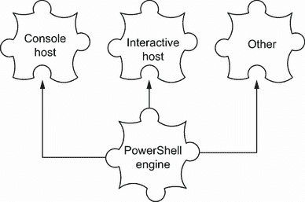
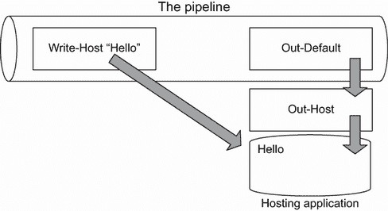
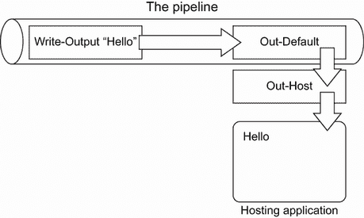

# 17 输入和输出

到本书的这一部分，我们主要依赖 PowerShell 的原生能力来输出表格和列表。当你开始将命令组合成更复杂的脚本时，你可能希望对显示的内容有更精确的控制。你可能还需要提示用户输入。在本章中，你将学习如何收集输入以及如何显示你可能需要的任何输出。

然而，我们想指出，本章的内容仅适用于与人类眼睛和手指交互的脚本。对于无人值守运行的脚本，这些技术并不适用，因为没有人在场进行交互。

## 17.1 提示和显示信息

PowerShell 显示和提示信息的方式取决于它的运行方式。你知道，PowerShell 是作为一种底层的引擎构建的。

你与之交互的应用程序称为 *宿主应用程序*。当你在一个终端应用程序中运行 PowerShell 可执行文件时看到的命令行控制台通常被称为 *控制台宿主*。另一个常见的宿主称为 *集成宿主*，它由 Visual Studio Code 的 PowerShell 扩展提供的 PowerShell 集成控制台表示。其他非微软应用程序也可以托管 shell 的引擎。换句话说，作为用户，你与宿主应用程序交互，然后它将你的命令传递给引擎。宿主应用程序显示引擎产生的结果。

注意 另一个著名的宿主是 PowerShell worker for Azure Functions。Azure Functions 是微软 Azure 的无服务器服务，这听起来像是允许你在云中运行任意 PowerShell 脚本而不需要管理脚本运行在其中的底层环境的一种服务。这个宿主很有趣——因为它是不受监督运行的，所以这个宿主没有交互元素，与控制台或集成宿主不同。

图 17.1 阐述了引擎与各种宿主应用程序之间的关系。每个宿主应用程序负责物理显示引擎产生的任何输出，并物理收集引擎请求的任何输入。这意味着 PowerShell 可以以不同的方式显示输出和管理输入。



图 17.1 不同的应用程序能够托管 PowerShell 引擎。

我们想指出这些差异，因为有时对于新手来说可能会感到困惑。为什么一个命令在命令行窗口中表现一种方式，但在 Azure Functions 等地方表现不同？这是因为宿主应用程序决定了你与 shell 交互的方式，而不是 PowerShell 引擎。我们即将展示的命令根据你运行它们的位置会表现出略微不同的行为。

## 17.2 Read-Host

PowerShell 的 `Read-Host` 命令用于显示文本提示并从用户那里收集文本输入。由于你在上一章中第一次看到我们使用它，所以语法可能看起来很熟悉：

```
PS C:\> read-host "Enter a computer name"
Enter a computer name: SERVER-UBUNTU
SERVER-UBUNTU
```

这个例子突出了关于该命令的两个重要事实：

+   在文本行的末尾附加一个冒号。

+   用户输入的任何内容都将作为命令的结果返回（技术上，它被放入管道中，但稍后我们会详细介绍这一点）。

你通常会捕获输入到一个变量中，它看起来像这样：

```
PS C:\> $computername = read-host "Enter a computer name"
Enter a computer name: SERVER-UBUNTU
```

现在尝试一下 是时候开始跟进了。在这个时候，你应该在 `$computername` 变量中有一个有效的计算机名。除非你正在工作的计算机的名称是 SERVER-UBUNTU，否则不要使用 SERVER-UBUNTU。

## 17.3 Write-Host

现在你能够收集输入，你可能需要一种显示输出的方式。`Write-Host` 命令就是这样一种方式。它并不总是最好的方式，但它可供你使用，并且了解它是如何工作的是非常重要的。

正如图 17.2 所示，`Write-Host` 与其他任何命令一样在管道中运行，但它不会将任何内容放入管道。相反，它做了两件事：将一条记录写入“信息流”（别担心，我们稍后会介绍这一点！）并直接写入宿主应用程序的屏幕。



图 17.2 `Write-Host` 跳过管道并直接写入宿主应用程序的显示。

现在，因为 `Write-Host` 直接写入宿主应用程序的屏幕，所以它能够通过其 `-ForegroundColor` 和 `-BackgroundColor` 命令行参数使用交替的前景色和背景色。你可以通过运行 `get-help -command write-host` 来查看所有可用的颜色。

现在尝试一下 运行 `Get-Help Write-Host`。`ForegroundColor` 和 `BackgroundColor` 参数有哪些可用的颜色？现在我们知道了有哪些颜色可用，让我们来点乐趣。

```
PS C:\> write-host "COLORFUL!" -Foreground yellow -BackgroundColor magenta
COLORFUL!
```

现在尝试一下 你需要自己运行这个命令来查看多彩的结果。

注意 并非所有支持 PowerShell 的宿主应用程序都支持交替的文本颜色，也并非所有应用程序都支持完整的颜色集。当你尝试在这样一个应用程序中设置颜色时，它通常会忽略它不喜欢或无法显示的任何颜色。这也是我们倾向于完全不依赖特殊颜色的一个原因。

`Write-Host` 命令有一个坏名声，因为在 PowerShell 的早期版本中，它并没有做什么。它作为一个机制，通过控制台向用户显示信息，并且不会弄脏任何流（是的，我们知道，我们一直在谈论这些讨厌的东西，我们承诺会涉及到它们）。但是从 PowerShell 5 开始，`Write-Host` 命令被重新设计。现在它是一个 `Write-Information` 命令的包装器，因为它需要向后兼容。它仍然会将文本输出到您的屏幕上，但也会将您的文本放入信息流中，以便您稍后使用。但是 `Write-Host` 确实有其局限性，并且可能并不总是完成这项工作的正确 cmdlet。

例如，您永远不应该使用 `Write-Host` 来手动格式化表格。您可以使用更好的方法来生成输出，使用能够使 PowerShell 本身处理格式的技术。我们不会在本书中深入探讨这些技术，因为它们更适合重型脚本和工具制作领域。然而，您可以查阅 Don Jones 和 Jeffery Hicks 所著的 *《一个月午餐时间学习 PowerShell 脚本编程》*（Manning，2017），以全面了解这些输出技术。

`Write-Host` 也不是产生错误消息、警告、调试消息等最佳方式——再次强调，您可以找到更多具体的方法来做这些事情，我们将在本章中介绍这些方法。您真正会使用 `Write-Host` 的情况是，如果您想在屏幕上显示带有花哨颜色的消息。

注意：我们经常看到人们使用 `Write-Host` 来显示我们所说的“温馨舒适”的消息——比如“现在连接到 SERVER2”和“测试文件夹”。我们建议您使用 `Write-Verbose` 消息。我们建议这样做的原因是，输出被发送到 `Verbose` 流（可以抑制），而不是 `Information` 流。

超越

我们将在第二十章中更深入地探讨 `Write-Verbose` 和其他 `Write` cmdlet。但是，如果您现在尝试 `Write-Verbose`，您可能会失望地发现它没有产生任何输出。好吧，默认情况下没有。

如果您计划使用 `Write` cmdlet，技巧是首先将其打开。例如，设置 `$VerbosePreference="Continue"` 以启用 `Write-Verbose`，以及 `$Verbose-Preference="SilentlyContinue"` 以抑制其输出。您会发现类似“偏好”变量用于 `Write-Debug` (`$DebugPreference`) 和 `Write-Warning` (`$WarningPreference`)。

第二十章介绍了一种更酷的 `Write-Verbose` 使用方法。

使用 `Write-Host` 可能看起来更容易，如果您愿意，您可以使用它。但请记住，通过使用其他 cmdlet，例如 `Write-Verbose`，您将更紧密地遵循 PowerShell 的自身模式，从而获得更一致的经验。

## 17.4 Write-Output

与 `Write-Host` 不同，`Write-Output` 可以将对象发送到管道。因为它不是直接写入显示，所以不允许你指定替代颜色或其他任何内容。实际上，`Write-Output`（或其别名 `Write`）在技术上并不是为了显示输出而设计的。正如我们所说的，它将对象发送到管道——是管道本身最终显示那些对象。图 17.3 展示了这是如何工作的。



图 17.3 `Write-Output` 将对象放入管道，在某些情况下最终会导致这些对象被显示。

参考第十一章快速回顾对象如何从管道到屏幕的过程。让我们看看基本过程：

1.  `Write-Output` 将 `String` 对象 `Hello` 放入管道。

1.  因为管道中没有其他内容，`Hello` 会移动到管道的末端，而 `Out-Default` 总是坐在那里。

1.  `Out-Default` 将对象传递给 `Out-Host`。

1.  `Out-Host` 要求 PowerShell 的格式化系统格式化对象。因为在这个例子中它是一个简单的 `String`，格式化系统返回字符串的文本。

1.  `Out-Host` 将格式化后的结果放置到屏幕上。

结果与使用 `Write-Host` 得到的结果相似，但对象到达那里的路径不同。这个路径很重要，因为管道中可能包含其他内容。例如，考虑以下命令（你可以尝试一下）：

```
PS C:\> write-output "Hello" | where-object { $_.length -gt 10 }
```

你看不到这个命令的任何输出，图 17.4 展示了原因。`Hello` 被放入管道。但在到达 `Out-Default` 之前，它必须通过 `Where-Object`，该对象会过滤掉任何具有小于或等于 `10` 的 `Length` 属性的对象，在这个例子中包括我们可怜的 `Hello`。我们的 `Hello` 被从管道中移除，因为管道中已经没有其他内容留给 `Out-Default`，所以没有内容传递给 `Out-Host`，因此没有显示。将此命令与以下命令进行对比：

```
PS C:\> write-host "Hello" | where-object { $_.length -gt 10 }
Hello
```


图 17.4 将对象放入管道意味着它们可以在显示之前被过滤掉。

我们所做的只是将 `Write-Output` 替换为 `Write-Host`。这次，`Hello` 直接显示在屏幕上，而不是进入管道。`Where-Object` 没有输入也不产生输出，所以 `Out-Default` 和 `Out-Host` 都没有显示任何内容。但是因为 `Hello` 已经直接写入屏幕，所以我们仍然看到了它。

`Write-Output` 可能看起来很新，但事实上你一直在使用它。它是 shell 的默认 cmdlet。当你告诉 shell 做一些不是命令的事情时，shell 会将你输入的内容传递给 `Write-Output`。

## 17.5 其他写入方式

PowerShell 有几种其他产生输出的方式。它们都不像 `Write-Output` 那样写入管道；它们的工作方式更类似于 `Write-Host`。但它们都以可以抑制的方式产生输出。

Shell 为这些替代输出方法中的每一个都内置了配置变量。当配置变量设置为 `Continue` 时，我们即将向您展示的命令确实会产生输出。当配置变量设置为 `SilentlyContinue` 时，相关的输出命令不会产生任何输出。表 17.1 包含了 cmdlet 的列表。

表 17.1 替代输出 cmdlet

| Cmdlet | 目的 | 配置变量 |
| --- | --- | --- |
| `Write-Warning` | 默认以黄色显示警告文本，并在其前加上标签 `WARNING:` | `$WarningPreference (默认为 Continue)` |
| `Write-Verbose` | 显示额外的信息性文本，默认以黄色显示，并在其前加上标签 `VERBOSE:` | `$VerbosePreference (默认为 SilentlyContinue)` |
| `Write-Debug` | 默认以黄色显示调试文本，并在其前加上标签 `DEBUG:` | `$DebugPreference (默认为 SilentlyContinue)` |
| `Write-Error` | 生成错误消息 | `$ErrorActionPreference (默认为 Continue)` |
| `Write-Information` | 显示信息性消息，并允许结构化数据写入信息流 | `$InformationPreference (默认为 SilentlyContinue)` |

注意 `Write-Host` 在底层使用 `Write-Information`，这意味着 `Write-Host` 消息除了发送到宿主应用外，还会发送到信息流。这使得我们能够通过控制 `$InformationPreference` 等其他我们可以对 PowerShell 流做的事情，来使用 `Write-Host` 做更多的事情。

`Write-Error` 的工作方式略有不同，因为它会将错误写入 PowerShell 的错误流。PowerShell 还有一个 `Write-Progress` cmdlet 可以显示进度条，但它的工作方式完全不同。你可以自由地阅读其帮助文档以获取更多信息，以及示例；我们在这本书中不会涉及它。

要使用这些 cmdlet 中的任何一个，首先确保其相关的配置变量设置为 `Continue`。（如果设置为 `SilentlyContinue`，这是其中一些的默认设置，你将看不到任何输出。）然后使用 cmdlet 输出一个消息。

注意某些 PowerShell 宿主应用可能会将这些 cmdlet 的输出显示在不同的位置。例如，在 Azure Functions 中，调试文本被写入到 Application Insights（一个 Azure 日志报告服务）中的日志，而不是终端窗口，因为在无服务器环境中，你不会看到终端；PowerShell 脚本正在云中的某个地方运行。这样做是为了便于调试脚本，并且你可以看到输出。

## 17.6 实验

注意对于这个实验，你需要一台运行你选择的操作系统且安装了 PowerShell v7 或更高版本的计算机。

`Write-Host` 和 `Write-Output` 在使用时可能有点棘手。看看你能完成多少这些任务，如果你卡住了，查看本章末尾提供的示例答案是可以的。

1.  使用 `Write-Output` 显示 100 乘以 10 的结果。

1.  使用 `Write-Host` 显示 100 乘以 10 的结果。

1.  提示用户输入一个名字，然后以黄色文本显示该名字。

1.  提示用户输入一个名字，然后仅当该名字的长度超过五个字符时显示该名字。使用单个 PowerShell 表达式完成所有这些操作——不要使用变量。

这个实验就到这里。因为这些 cmdlet 都很简单，我们希望你在自己身上花更多的时间进行实验。一定要这样做——我们将在第 17.8 节中提供一些想法。

现在尝试一下 完成这个实验后，尝试完成附录中的复习实验 3。

## 17.7 实验答案

1.  `write-output (100*10)`

    或者直接输入公式：`100*10`

1.  这些方法中的任何一种都适用：

    `$a= 100*10`

    `Write-Host $a`

    `Write-Host "The value of 100*10 is $a"`

    `Write-Host (100*10)`

1.  `$name = Read-Host "Enter a name"`

    `Write-host $name -ForegroundColor Yellow`

1.  `Read-Host "Enter a name" | where {$_.length -gt 5}`

## 17.8 进一步探索

花些时间熟悉本章中所有的 cmdlet。确保你能显示 `Verbose` 输出，并接受输入。从现在开始，你将经常使用本章中的命令，所以你应该阅读它们的帮助文件，并甚至为将来参考写下快速语法提示。
