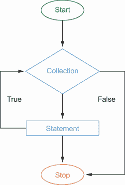
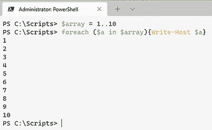
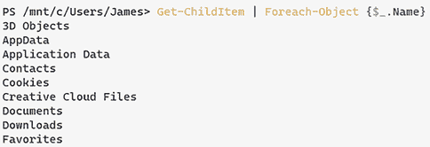
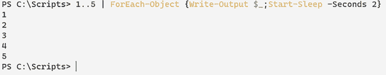
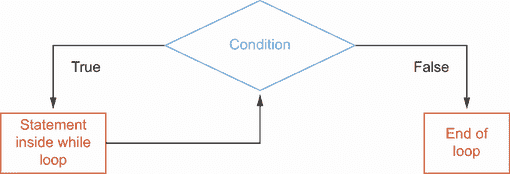

# 23 添加逻辑和循环

循环（或逐个遍历对象列表）是任何语言中的基本概念，PowerShell 也不例外。总会有需要多次执行代码块的时候。PowerShell 已经准备好为你处理这个问题。

## 23.1 Foreach 和 Foreach-Object

这一节可能有点令人困惑，因为 `Foreach` 和 `Foreach-Object` 之间有一个区别。请参阅图 23.1 以了解 `Foreach` 的工作原理的视觉表示。



图 23.1 `Foreach` 的工作原理图

### 23.1.1 Foreach

最常见的循环形式可能是 `Foreach` 命令。`Foreach` 允许你遍历集合中一系列值，例如数组。`Foreach` 命令的语法是

```
Foreach (p
temporary variable IN collection object)
{Do Something}
```

过程块（被 `{}` 包围的部分）将根据集合对象的数量执行多次。让我们看看以下命令并对其进行分解：

```
PS C:\Scripts> $array = 1..10
PS C:\Scripts> foreach ($a in $array) {Write-output $a}
```

首先，我们创建了一个名为 `$array` 的变量，它将包含从 1 到 10 的数字数组。接下来，我们创建了一个临时变量（`$a`）并将其分配给我们在处理的集合中的当前项。该变量仅在脚本块内部可用，并且在我们遍历数组时将发生变化。

最后，由大括号 `{}` 表示的脚本块将输出 `$a` 到屏幕上（图 23.2）。



图 23.2 使用 `foreach` 编写数组输出

### 23.1.2 Foreach-Object

`Foreach-Object` cmdlet 在输入集合对象中的每个项目上执行在脚本块中定义的操作。最常见的是，`Foreach-Object` 通过管道调用。

提示：如果你正在遍历多个对象，请使用 `Foreach`；如果你在管道中使用它，请使用 `Foreach-Object`。

让我们看看命令 `Get-ChildItem | ForEach-Object {$_.name}`。首先，我们运行 `Get-ChildItem` 命令，并将对象通过管道发送到 `Foreach-Object` cmdlet。

接下来，我们说对于从 `Get-ChildItem` 收到的每个项目，运行命令 `$_.name`（图 23.3）。如果你还记得文本前面的内容，`$_` 简单地是管道中的当前对象。通过使用 `$_`.`Name`，我们从对象中获取 `name` 属性并将其显示在屏幕上。



图 23.3 展示了如何使用 `foreach-object` 与管道结合。

对于 `Foreach` 和 `Foreach-Object` cmdlet，命令是顺序执行的，这意味着它将依次执行 `item[0]`，然后运行你指定的命令，接着是 `item[1]`，依此类推，直到输入集合为空。通常这不会成问题，但最终，如果你在过程块中有许多命令或你的输入集合非常大，你就可以看到逐个执行这些命令会对脚本的运行时间产生影响。

希望在你开始深入研究本章之前，你已经使用了帮助功能来查看所有可用的`Foreach-Object`参数。

现在试试看；运行`get-help` `Foreach-Object`并查看结果。

除此之外

`%`也是`ForEach-Object`命令的别名。之前的命令可以写成

```
Get-ChildItem | %{$_.name}
```

这将产生相同的结果。但让我们记住，始终使用完整的 cmdlet 名称是最好的。

### 23.1.3 Foreach-Object -Parallel

正如我们之前提到的，`Foreach-Object`命令的主要缺点是它是顺序运行的。有几个由社区驱动的模块旨在帮助为`Foreach-Object`命令启用并行功能。随着 PowerShell 7（预览版 3）的引入，`Foreach-Object`命令中添加了一个新的`-Parallel`参数。现在，我们可以在大多数或所有输入对象上同时运行相同的命令，而不是顺序运行命令。例如，假设你正在 Active Directory 中创建 1,000 个新用户。你可以运行以下命令

```
import-csv c:\scripts\newusers.csv | 
ForEach-Object {New-aduser -Name $_.Name }
```

这将依次运行`New-Aduser`命令 1,000 次。或者，你可以使用`Parallel`参数来运行该命令：

```
import-csv c:\scripts\newusers.csv | 
ForEach-Object -Parallel {New-aduser -Name $_.Name }
```

以下命令接受一个数字数组（1-5），将其通过管道传递到传统的`Foreach-Object`命令，将输出写入屏幕，并暂停 2 秒（图 23.4）。

```
1..5 | ForEach-Object {Write-Output $_; start-sleep -Seconds 2}
```



图 23.4 接受一个数组，通过管道传递到`Foreach-Object`，然后运行第二个命令

通过使用`measure-command` cmdlet，我们可以看到这将需要 10 秒才能完成。

```
PS C:\Scripts> measure-command {1..5 | ForEach-Object {Write-Output "$_"; 
➥ start-sleep -Seconds 2}}

Days              : 0
Hours             : 0
Minutes           : 0
Seconds           : 10
Milliseconds      : 47
Ticks             : 100471368
TotalDays         : 0.000116286305555556
TotalHours        : 0.00279087133333333 
TotalMinutes      : 0.16745228
TotalSeconds      : 10.0471368
TotalMilliseconds : 10047.1368
```

当我们添加`-parallel`参数时，我们将一次性在数组中的所有数字上执行命令块内的内容。

```
1..5 | ForEach-Object -parallel {Write-Output "$_"; start-sleep -Seconds 2}
```

通过使用`parallel`参数，我们将运行时间从 10 秒减少到 2 秒。

```
PS C:\Scripts> measure-command {1..5 | ForEach-Object -parallel {Write-Output 
➥ "$_"; start-sleep -Seconds 2}}

Days              : 0
Hours             : 0
Minutes           : 0
Seconds           : 2
Milliseconds      : 70
Ticks             : 20702383
TotalDays         : 2.39610914351852E-05
TotalHours        : 0.000575066194444444
TotalMinutes      : 0.0345039716666667
TotalSeconds      : 2.0702383
TotalMilliseconds : 2070.2383
```

因为每个脚本块都是同时运行的，所以返回到屏幕上的结果顺序无法保证。同时，还有一个节流限制，即一次可以并行运行的脚本块的最大数量，我们需要确保你知道这一点——默认值是 5。在我们的例子中，我们的输入集合中只有 5 个项目，所以所有 5 个脚本块都是同时运行的。然而，如果我们把我们的例子从 5 个项目改为 10 个项目，我们会注意到运行时间从 2 秒变为 4 秒。但是，我们可以通过使用`-throttlelimit`参数来将节流限制提高到更高的值。

```
1..10 | ForEach-Object -parallel {Write-Output "$_"; start-sleep -Seconds 2} 
➥ -ThrottleLimit 10 
```

现在试试看；将数组改为 10 个项目；然后使用`measure-command` cmdlet 来查看执行所需的时间。

然而，`parallel`功能有一个限制。为了同时运行每个脚本块，会创建一个新的运行空间。如果你的脚本块是资源密集型的，这可能会导致性能显著下降。

## 23.3 当

如果你之前做过任何类型的脚本或编程，那么 `while` 循环应该对你来说不是一个新概念。`while` 循环是一个迭代循环，它将一直运行，直到满足终止条件。就像我们刚才提到的 `Foreach` 循环一样，`while` 循环有一个脚本块，你可以在这里放置要执行的命令（图 23.5）。基本语法如下：`While` (`condition`) {`commands`}。



图 23.5 展示了 `while` 循环的工作原理

+   *条件*—一个布尔 (`$True` 或 `$False`) 表达式。循环将在条件为 `True` 时执行，并在条件为 `False` 时终止。例如：`While ($n -ne 10)`。

+   *命令*—在条件为 `True` 时要执行的简单或复杂命令。

这里有一个快速示例：

```
$n=1
While ($n -le 10){Write-Output $n; $n++}
```

我们还可以开始将逻辑运算符如 `-and` 和 `-or` 添加到我们的条件语句中：

```
While ($date.day -ne 25 -and $date.month -ne 12)
{Write-Host “Its not Christmas Yet”}
```

提示：如果你运行上述命令，它将无限期地运行，除非你恰好是在 `25-December` 运行的。使用 Ctrl-C 来中断执行。

## 23.3 Do While 循环

正如我们之前提到的，`while` 循环只有在条件为 `true` 时才会执行。但如果你想要至少执行一次循环，无论条件是否为 `true`，那该怎么办？这就是 `Do While` 循环发挥作用的地方。

*使用* `Do` {`commands`} `While` (`condition`)，请注意，脚本块和条件块是相反的。这将允许我们至少执行一次脚本块，然后评估我们的条件以确定是否需要重复循环：

```
$date = get-date

do {
    Write-Output "Checking if the month is December"
    $date = $date.AddMonths(1)
} while ($date.Month -ne 12 )
```

## 23.4 实验内容

1.  在包含大量项目的目录中查找。使用 `Foreach` 循环并计算每个文件名的字符数。

    +   同样操作，但这次使用 `-parallel` 参数。

1.  启动记事本进程（或你选择的文本编辑器）；然后编写一个 `do while` 循环，直到进程关闭时显示以下文本：`$process is open`。

## 23.5 实验答案

1.  `$items = Get-ChildItem SOMEWHERE YOU |CHOSE`

    `foreach ($i in $items){Write-Output "The character length of $i is`

    `➥ "($i).Length"`

1.  `start-process notepad`

    `$Process = "notepad"`

    `do {`

    `    Write-Host "$process is open"`

    `} while ((get-process).name -contains "notepad")`
