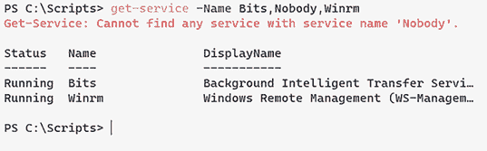

# 24 处理错误

在本章中，我们将重点介绍如何捕获、处理、记录以及以其他方式处理工具可能遇到的错误。

注意[PowerShell.org](http://PowerShell.org)提供了一个名为《PowerShell 错误处理大全书》的免费电子书，它从更技术性的参考角度深入探讨了这一主题，请访问[`devopscollective.org/ebooks/`](https://devopscollective.org/ebooks/)。我们建议在完成这个以教程为重点的章节后查看它。

在我们开始之前，有两个变量我们需要熟悉。第一个是`$Error`自动化变量。它包含了一个数组，其中包含了当前会话中发生的错误对象，最新的错误对象显示在`$Error[0]`。默认情况下，所有错误都会放入这个变量中。你可以通过设置`ErrorAction`常见参数为`Ignore`来改变这种行为。你可以通过运行`get-help about_automatic_variables`来获取有关自动变量的更多信息。

你可以使用的第二个内置变量是常见的参数变量`ErrorVariable`。这是一个你可以发送错误的对象，因此如果需要的话，你可以在稍后使用它们（例如，写入日志文件）：

```
New-PsSession -ComputerName SRV01 -ErrorVariable a
```

`ErrorVariable`将只保留最近的错误，除非你在它前面添加一个`+`（加号）：

```
New-PsSession -ComputerName SRV01 -ErrorVariable +a
```

注意：我们没有在错误变量前使用`$`符号，因为在这里不需要。

## 24.1 理解错误和异常

PowerShell 定义了两种广泛的错误情况：一个*错误*和一个*异常*。因为大多数 PowerShell 命令都是设计来同时处理多个事物的，而且在很多情况下，一个事物的问题并不意味着你想停止处理其他所有事物，所以 PowerShell 试图在“继续进行”这一边犯错。因此，当命令中发生错误时，PowerShell 通常会发出一个*错误*并继续运行（图 24.1）。例如：

```
Get-Service -Name BITS,Nobody,WinRM
```



图 24.1 `Get-Service`与一个不存在的服务

服务`Nobody`不存在，所以 PowerShell 会在第二个项目上发出一个*错误*。但默认情况下，PowerShell 会*继续运行*并处理列表中的第三个项目。当 PowerShell 处于这种继续运行的模式时，你无法让代码响应问题条件。如果你想对问题采取行动，你必须改变 PowerShell 对这种*非终止错误*的默认响应。

在全球范围内，PowerShell 定义了一个`$ErrorActionPreference`变量，它告诉 PowerShell 在发生非终止错误时应该做什么——也就是说，这个变量告诉 PowerShell 在出现问题时应该做什么，但 PowerShell 仍然能够继续运行。这个变量的默认值是`Continue`。以下是可用的选项：

+   `Break`——当发生错误或抛出异常时进入调试器。

+   `Continue`（默认）——显示错误消息并继续执行。

+   `Ignore`—抑制错误信息并继续执行命令。`Ignore`值旨在用于每个命令，而不是用作保存的偏好。`Ignore`不是`$ErrorActionPreference`变量的有效值。

+   `Inquire`—显示错误信息并询问你是否想继续。

+   `SilentlyContinue`—无效果。错误信息不会显示，执行将继续而不会中断。

+   `Stop`—显示错误信息并停止执行。除了生成的错误外，`Stop`值还会向错误流生成一个`ActionPreferenceStopException`对象。

+   `Suspend`—自动挂起工作流作业以允许进一步调查。调查后，工作流可以继续。`Suspend`值旨在用于每个命令，而不是用作保存的偏好。`Suspend`不是`$ErrorActionPreference`变量的有效值。

而不是全局更改`$ErrorActionPreference`，你通常会想为每个命令指定一个行为。你可以使用存在于每个 PowerShell 命令中的`-ErrorAction`通用参数来完成此操作——即使是你自己编写的包含`[CmdletBinding()]`的命令。例如，尝试运行这些命令，并注意它们的不同行为：

```
Get-Service -Name Foo,BITS,Nobody,WinRM -ErrorAction Continue
Get-Service -Name BITS,Nobody,WinRM -ErrorAction SilentlyContinue
Get-Service -Name BITS,Nobody,WinRM -ErrorAction Inquire
Get-Service -Name BITS,Nobody,WinRM -ErrorAction Ignore
Get-Service -Name BITS,Nobody,WinRM -ErrorAction Stop
```

要记住的是，*除非 PowerShell 实际生成异常，否则你无法在代码中处理异常*。大多数命令*不会*生成异常，除非你使用`Stop`错误操作运行它们。人们犯的最大错误之一就是忘记在想要处理问题的命令中添加`-EA Stop`（`-EA`是`-ErrorAction`的缩写）。

## 24.2 不良处理

我们看到人们参与两种根本性的不良做法。这些做法*并不总是*是错误的，但它们*通常*是错误的，所以我们想引起你的注意。

首先，是在脚本或函数的最顶部全局设置偏好变量：

```
$ErrorActionPreference='SilentlyContinue' 
```

在 VBScript 的古老时代，人们使用`On Error Resume Next`。这本质上是在说，“我不想知道我的代码是否有任何问题。”人们这样做是为了错误地抑制他们知道不会造成影响的可能错误。例如，尝试删除一个不存在的文件将导致错误——但你可能并不在乎，因为任务无论如何都完成了，对吧？但为了抑制这个不想要的错误，你应该在`Remove-Item`命令中使用`-EA SilentlyContinue`，而不是全局抑制脚本中的所有错误。

另一种不良做法更为微妙，可能会出现在相同的情况下。假设你确实使用了`-EA SilentlyContinue`来运行`Remove-Item`，然后假设你尝试删除一个确实存在但你没有权限删除的文件。你会抑制错误并想知道为什么文件仍然存在。

在开始抑制错误之前，请确保你已经仔细考虑过。没有什么比花费数小时调试脚本更令人沮丧了，因为你抑制了一个本可以告诉你问题所在位置的错误消息。我们无法告诉你这在论坛问题中出现的频率有多高。

## 24.3 异常处理的两个原因

在你的代码中处理异常有两个主要原因。（注意，我们使用它们的官方名称*异常*来区分我们之前提到的不可处理的*错误*。）

第一个原因是，你计划在你的视线之外运行你的工具。这可能是一个计划任务，或者你可能正在编写将被远程客户使用的工具。在两种情况下，你都想确保你有任何发生问题的证据，以帮助你进行调试。在这种情况下，你可以在脚本顶部全局设置`$ErrorActionPreference`为`Stop`，并将整个脚本包裹在错误处理结构中。这样，任何错误，即使是未预见的错误，都可以被捕获并记录以供诊断。尽管这是一个有效的情况，但我们将不会在本书中重点关注这种情况。

我们将重点关注第二个原因——你正在运行一个你可以预见到可能会出现某种问题的命令，并且你想要积极处理这个问题。这可能是无法连接到计算机，无法登录到某个系统，或者类似的情况。让我们深入探讨一下。

## 24.4 处理异常

假设你正在构建一个连接到远程机器的脚本。你可以预见到`New-PSSession`命令可能会遇到问题：计算机可能离线或不存在，或者计算机可能不支持你选择的协议。你想要捕获这些条件，并根据你运行的参数，将失败的计算机名称记录到文本文件中，并尝试使用其他协议再次运行。你将从关注可能引发问题的命令开始，并确保它在遇到麻烦时能够生成一个*终止异常*。更改如下：

```
$computer = 'Srv01'
Write-Verbose "Connecting to $computer"
$session = New-PSSession -ComputerName $computer
```

到这里：

```
$computer = 'Srv01'
Write-Verbose "Connecting to $computer"
$session = New-PSSession -ComputerName $computer -ErrorAction Stop
```

但如果我们想在多台计算机上运行这个命令怎么办？我们有两种选择。第一种选择是将多个计算机名称放入`$computer`变量中。毕竟，它接受字符串数组。

```
$computer = 'Srv01','DC01','Web02'
Write-Verbose "Connecting to $computer"
$session = New-PSSession -ComputerName $computer -ErrorAction Stop
```

这里是你需要做出一些个人决定的地方。当发生错误时，你是想让你的脚本继续运行并捕获错误以供后续使用，还是想让脚本立即停止运行？这很大程度上取决于你想要达成的目标。如果你试图连接到五台远程计算机来运行一个命令，如果只有四台运行成功，而你记录了第五台计算机无法连接的错误，这是否可以接受，或者你需要命令在所有五台或没有任何一台计算机上运行？

这里你有两种选择。第一种选择是将你的命令包裹在一个 `foreach` 循环中。这样每次执行命令时都会设置 `ErrorAction`。如果你有一个失败，其余的会话仍然会被创建。然而，这却否定了 `New-PSSession` `computername` 参数可以接受对象数组作为其输入的事实：

```
foreach ($computer in $computername) {
          Write-Verbose "Connecting to $computer"
     $session = New-PSSession -ComputerName $Computer -ErrorAction Stop
        }
```

第二种选择是告诉 PowerShell 继续执行并将错误放入 `ErrorVariable` 公共参数中（别忘了将 `+` 符号附加到现有变量数据上）：

```
$computer = 'Srv01','DC01','Web02'
   $session = New-PSSession -ComputerName $Computer -ErrorVariable a
```

确保你理解为什么这个设计原则如此重要！正如我们之前提到的，如果我们能帮助的话，我们不想抑制有用的错误。

现在试试看 使用你在本章和前几章中学到的知识，获取 `spooler` 服务和 `print` 服务的状态。确保记录你的错误。

只是将错误操作更改为 `Stop` 是不够的。你还需要将你的代码包裹在 `Try/Catch` 构造中。如果在 `Try` 块中发生异常，那么 `Try` 块中随后的所有代码都将被跳过，然后执行 `Catch` 块：

```
try { blahfoo }
catch { Write-Warning “Warning: An error occurred." }
```

这里发生的事情是：在 `Catch` 块中，你有机会为用户的利益编写一条警告信息。他们可以通过在运行命令时添加 `-Warning-Action` `SilentlyContinue` 来抑制警告。这是一些复杂的逻辑——多看几遍，确保你理解它！

## 24.5 处理非命令的异常

如果你在运行某些东西——比如一个没有 `-ErrorAction` 参数的 .NET Framework 方法——会发生什么？在 *大多数* 情况下，你可以直接在 `Try` 块中运行它，因为 *大多数* 这些方法在出错时都会抛出可捕获的、终止的异常。非终止异常的情况是 PowerShell 命令（如函数和 cmdlets）特有的。

但你仍然可能遇到需要这样做的情况：

```
Try {
    $ErrorActionPreference = "Stop"
    # run something that doesn't have -ErrorAction
    $ErrorActionPreference = "Continue"
} Catch {
    # ...
}
```

这是你的最后一种错误处理方法。基本上，你只是暂时修改 `$ErrorActionPreference`，以便在你想捕获异常的单个命令（或任何其他操作）期间使用。在我们经验中，这种情况并不常见，但我们认为我们应该指出这一点。

## 24.6 进一步学习异常处理

在给定的 `Try` 块之后，可以有多重 `Catch` 块，每个 `Catch` 块处理特定类型的异常。例如，如果文件删除失败，你可以针对“文件未找到”或“访问被拒绝”的情况采取不同的反应。为此，你需要知道你想要单独调用的每个异常的 .NET Framework 类型名称。*《PowerShell 错误处理大全书》* 列出了常见的一些类型，并提供了如何确定这些类型的建议（例如，在自己的实验中生成错误，然后确定异常类型名称）。总的来说，语法看起来像这样：

```
Try {
    # something here generates an exception
} Catch [Exception.Type.One] {
    # deal with that exception here
} Catch [Exception.Type.Two] {
    # deal with the other exception here
} Catch {
    # deal with anything else here
} Finally {
    # run something else
}
```

在那个示例中还展示了可选的 `Finally` 块，它将在 `Try` 或 `Catch` 之后始终运行，无论是否发生异常。

已废弃的异常处理

在你的网络旅行中，你可能会在 PowerShell 中遇到一个 `Trap` 构造。这可以追溯到 v1，当时 PowerShell 团队坦白地说没有时间让 `Try/Catch` 工作起来，而 `Trap` 是他们能想出的最好的短期解决方案。`Trap` 已被**弃用**，这意味着它被保留在产品中以保持向后兼容性，但你不应该在新编写的代码中使用它。因此，我们在这里不讨论它。在全局的，“我想捕获并记录任何可能的错误”的情况下，它确实有一些用途，但 `Try/Catch` 被认为是一种更结构化、更专业的异常处理方法，我们建议你坚持使用它。

## 24.7 实验室

使用你迄今为止学到的知识，做以下事情：

+   创建一个函数，用于获取远程机器的运行时间。确保你使用的是 PowerShell 7 的内置命令，而不是 .NET 方法。

+   确保函数可以接受多个机器的输入。

+   包含本章中讨论的错误处理方法，如 `Try/Catch` 和错误操作。

超越和超越

将你迄今为止关于远程操作学到的知识应用到你的函数中，使其能够在任何操作系统上工作。这里有一个提示：有三个内置变量可能很有用：

```
$IsMacOS
$IsLinux
$IsWindows
```

这里有一些关键事项需要记住：

+   `$Error` 包含你会话中的所有错误消息。

+   `ErrorVariable` 也可以用来存储错误（向其添加 `+` 符号）。

+   `Try/Catch` 是你的朋友，但仅限于非终止错误。

## 24.8 实验室答案

```
Function Get-PCUpTime {
    param (
        [string[]]$ComputerName = 'localhost'
    )
    try {
        foreach ($computer in $computerName) {
            If ($computer -eq "localhost") {
                Get-Uptime
            }
            Else { Invoke-command -ComputerName $computer -ScriptBlock 
          ➥ { Get-Uptime } -ErrorAction Stop}
        }
    }
    catch {
        Write-Error "Cannot connect To $computer"
    }
}
```
