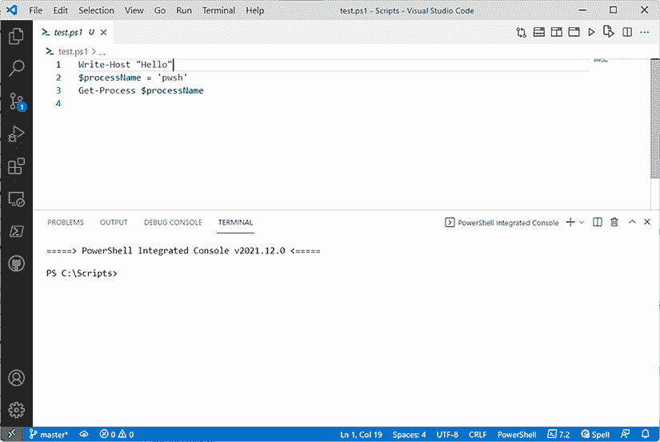
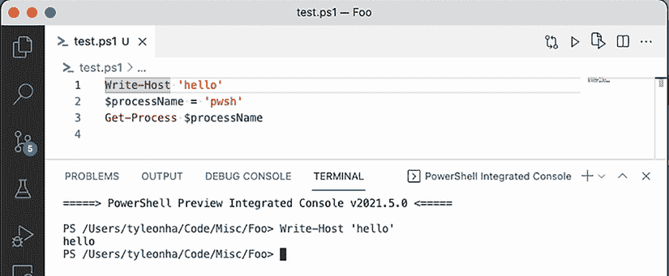
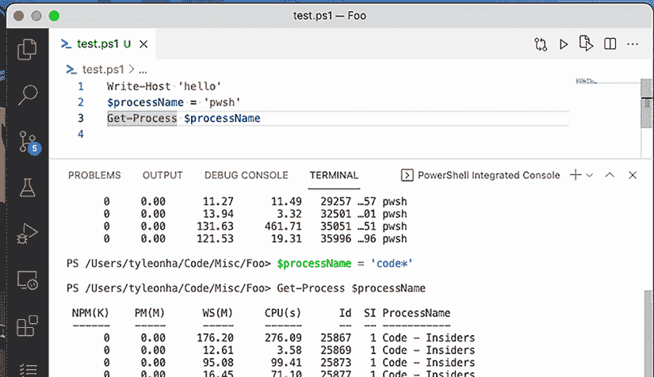
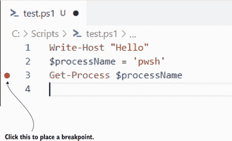
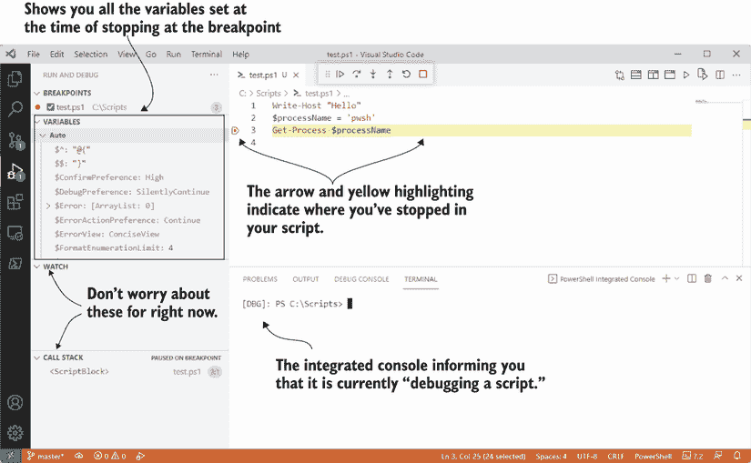

# 25 调试技术

在上一章中，我们讨论了如何处理不良情况（错误和异常），但特别是你预料到的不良情况。随着你的脚本变得越来越复杂，还可能发生另一种不良情况。我们已经提到过这些情况，它们被称为*错误*。这些是长时间编写脚本或早上咖啡不足的副作用。换句话说，它们是我们作为人类的副作用。我们都会犯错误，而本章将专注于一些查找和消除脚本中错误的技术。

注意：我们将深入探讨 PowerShell 扩展为 Visual Studio Code 提供的某些功能，所以如果你需要复习如何设置，请确保回到第二章并遵循那里的步骤。

## 25.1 输出一切

不深入探讨 Azure Pipelines 的概念，列表 25.1 中的脚本将获取我们关心的已发布工件的相关详细信息，并将它们下载到 Temp 驱动器。如果你以前从未听说过*工件*这个术语，它基本上是一个在其他工具可以下载的地方发布的文件。此外，你还会在脚本中注意到一些环境变量（以`$env:`开头）。这是因为脚本是为在存在这些工件的地方运行的 Azure Pipelines 而编写的。

让我们从第十七章中熟悉的内容开始，在第十七章中我们讨论了不同的输出流。不同的流是你的工具箱中的工具，用于理解你的代码在做什么以及何时在做这件事。仔细放置`Write-*`语句可以使你轻松找到脚本中的错误并回到正轨。我们不会过多地涉及这个主题，因为我们已经将第十七章专门用于输入和输出，但以下列表提供了一个示例，说明何时像`Write-Debug`这样的功能会派上用场。

列表 25.1：为学习目的修改的 VS Code 发布脚本的一部分

```
$BUILDS_API_URL = 
➥ "$env:SYSTEM_COLLECTIONURI$env:SYSTEM_TEAMPROJECT/_apis/build/builds/
➥ $env:BUILD_BUILDID"

function Get-PipelineArtifact {
    param($Name)
    try {
        Write-Debug "Getting pipeline artifact for: $Name"
        $res = Invoke-RestMethod "$BUILDS_API_URL)artifacts?api-version=6.0" 
      ➥ -Headers @{
            Authorization = "Bearer $env:SYSTEM_ACCESSTOKEN"
        } -MaximumRetryCount 5 -RetryIntervalSec 1

        if (!$res) {
            Write-Debug 'We did not receive a response from the Azure 
          ➥ Pipelines builds API.'
            return
        }

        $res.value | Where-Object { $_.name -Like $Name }
    } catch {
        Write-Warning $_
    }
}

*# Determine which stages we care about*
$stages = @(
    if ($env:VSCODE_BUILD_STAGE_WINDOWS -eq 'True') { 'Windows' }
    if ($env:VSCODE_BUILD_STAGE_LINUX -eq 'True') { 'Linux' }
    if ($env:VSCODE_BUILD_STAGE_OSX -eq 'True') { 'macOS' }
)
Write-Debug "Running on the following stages: $stages"

Write-Host 'Starting...' -ForegroundColor Green
$stages | ForEach-Object {
    $artifacts = Get-PipelineArtifact -Name "vscode-$_"

    foreach ($artifact in $artifacts) {
        $artifactName = $artifact.name
        $artifactUrl = $artifact.resource.downloadUrl
        Write-Debug "Downloading artifact from $artifactUrl to Temp:/$artifactName.zip"
        Invoke-RestMethod $artifactUrl -OutFile "Temp:/$artifactName.zip" 
      ➥ -Headers @{
            Authorization = "Bearer $env:SYSTEM_ACCESSTOKEN"
        } -MaximumRetryCount 5 -RetryIntervalSec 1  | Out-Null

        Expand-Archive -Path "Temp:/$artifactName.zip" -DestinationPath 
      ➥ 'Temp:/' | Out-Null
    }
}
Write-Host 'Done!' -ForegroundColor Green
```

现在，假设你运行这个脚本，但它没有按照你预期的那样工作。调试脚本的最简单方法之一是运行脚本，要求它显示调试流。让我们进行比较。

正常运行脚本会产生

```
PS > ./publishing.ps1
Starting...
Done!
PS >
```

这并不是很有信息量。然而，我们只需要将我们的调试首选项设置为`Continue`，我们就可以看到调试流的全部内容：

```
PS > $DebugPreference = 'Continue'
PS > ./publishing.ps1
Starting...
DEBUG: Running on the following stages: Windows Linux
DEBUG: Getting pipeline artifact for: vscode-Windows
DEBUG: Downloading artifact from <redacted> to Temp:/vscode-windows-
➥ release.zip
DEBUG: Getting pipeline artifact for: vscode-Linux
DEBUG: Downloading artifact from <redacted> to Temp:/vscode-linux-release.zip
Done!
```

这是有用的信息。它在 Windows 和 Linux 上运行……但是等等，它不是也应该在 macOS 上运行吗？

```
$stages = @(
    if ($env:VSCODE_BUILD_STAGE_WINDOWS -eq 'True') { 'Windows' }
    if ($env:VSCODE_BUILD_STAGE_LINUX -eq 'True') { 'Linux' }
    if ($env:VSCODE_BUILD_STAGE_OSX -eq 'True') { 'macOS' }
)
```

你看到错误了吗？我会等一会儿。明白了吗？几年前，苹果公司将他们的操作系统名称从 OSX 更改为 macOS，看起来脚本并没有完全正确更新，因为它仍然引用`VSCODE_BUILD_STAGE_OSX`而不是`VSCODE_BUILD_STAGE_MACOS`。第一个调试语句表明它只运行 Windows 和 Linux，所以这是我们的线索，表明那里可能有问题。

这种调试方式常用于无法进行交互的环境。Azure Pipelines 和 GitHub Actions 是这种环境的绝佳例子，你无法远程连接到你的脚本正在运行的容器或 VM，因此你唯一的调试选项是利用 PowerShell 的流来尽可能多地提供信息。如果你有在本地机器或你能够访问的容器/VM 上运行脚本的能力，这种类型的调试也很有用，但这里也有互补的解决方案，我们现在将探讨。

## 25.2 逐行运行

使用 PowerShell 的流进行调试被称为“调试过去”，因为你正在查看已经发生的事情。这种方式的调试很有用，但可能会很繁琐，因为你必须等待看到这些流中显示的内容，然后才能采取行动。如果你在调试流中没有足够的信息，你必须进行更改以添加更多信息到调试流中，这需要你反复运行你的脚本。如果你正在尝试调试脚本运行 30 分钟后发生的问题，这意味着你做的任何更改（即使只是获取更多信息）也需要 30 分钟来验证。幸运的是，PowerShell 团队有几种方法可以减少调试所需的时间。这些策略中的第一个就是我们喜欢称之为 *F8 调试* 或 *逐行调试*。

前提很简单。让我们拿一个大的脚本，并在我们的控制台中逐行运行它。听起来可能很麻烦，需要复制粘贴每一行，但 VS Code 的 PowerShell 扩展简化了这一过程。让我们从一个基本的脚本开始，以演示：

```
Write-Host 'hello'
$processName = 'pwsh'
Get-Process $processName
```

现在创建一个名为 test.ps1 的文件，并将上面的代码放入其中，然后在 VS Code 中打开它。接下来，点击第一行（`Write-Host`），使光标位于第 1 行（图 25.1）。



图 25.1 Visual Studio Code 与我们的脚本。右上角的“运行”和“运行选择”按钮被突出显示。

我们在屏幕右上角突出显示了两个按钮。如果你将鼠标悬停在这些按钮上，它们分别显示为“运行”和“运行选择（F8）”。运行按钮将运行你的整个脚本，但我们会回来解释为什么这个按钮是特殊的。现在，让我们专注于另一个按钮。实际上，当光标位于第 1 行时，让我们点击“运行选择（F8）”按钮，看看会发生什么。PowerShell 扩展将取当前光标所在的行，并在图 25.2 中的 PowerShell *集成控制台* 中运行该片段。



图 25.2 Visual Studio Code 与我们的脚本。它只运行高亮显示的部分。

“运行选择”按钮将运行你选择的任何片段，如图 25.2 所示，或者如果你没有选择任何内容，它将运行当前行。选择一些行并点击“运行选择”按钮。你会注意到它将运行你选择的 exactly 内容。

现在试试看。如果你还没有这样做，运行最后两行（可以通过选择它们或逐行选择），你将看到以下类似输出：

```
PS > $processName = 'pwsh'
Get-Process $processName

 NPM(K)    PM(M)      WS(M)     CPU(s)      Id  SI ProcessName
 ------    -----      -----     ------      --  -- -----------
      0     0.00      40.48      17.77    5286 ...85 pwsh
      0     0.00      11.27      11.49   29257 ...57 pwsh
      0     0.00      13.94       3.32   32501 ...01 pwsh
      0     0.00     131.63     461.71   35051 ...51 pwsh
      0     0.00     121.53      19.31   35996 ...96 pwsh
```

这里开始变得有趣。在 PowerShell 集成控制台中点击，然后运行 `$processName`。你会看到我们在脚本中设置的值已经在 PowerShell 集成控制台中持续存在。这意味着我们可以逐行运行脚本并看到脚本在执行过程中的整个状态，这让我们能够更清楚地了解脚本正在做什么。这意味着我们可以更快地调试脚本，因为我们能够实时获得正在发生的事情及其发生时间的概览。

注意：我们称之为“F8 调试”，因为“运行选择”在 VS Code 中绑定到 F8 键，所以你只需按 F8 而不必点击右上角的按钮。

你能够在你的控制台中看到变量 `$processName` 的值，但你可以更进一步，在你想要的时候将其值设置为其他内容。例如，在你的控制台中（图 25.3）将 `$processName` 设置为 `code*`，然后使用“运行选择”来运行第 3 行（`Get-Process`）。



图 25.3 将 `$processName` 设置为 `code*` 并运行脚本的第 3 行

注意，输出不再是 `pwsh` 的结果，而是 `code*` 的结果。这模糊了编辑器中的脚本和你的控制台之间的界限，这在你想检查脚本是否正确处理不同的输入时非常有用。话虽如此，请记录你做的任何更改，因为你不希望手动设置的变量在脚本中引起其他问题。如果你的 PowerShell 集成控制台处于不良状态并且你想重新启动它，请使用 Windows 或 Linux 上的 Ctrl+Shift+P 或 macOS 上的 Cmd+Shift+P 打开命令面板，并输入 `PowerShell: Restart Current Session` 并运行它。这将为你提供一个全新的起点（一个新的 PowerShell 实例），你可以使用它。

上述示例很简单，策略本身也很简单。这是我们通常使用的常规工作流程：

1.  如果你的脚本有参数，请提前在 PowerShell 集成控制台中设置这些值以模拟使用这些参数值运行脚本。

1.  选择你相当确定其中没有问题的第一行或脚本的一部分；然后按 F8。

1.  挖掘一下。在控制台中运行重要变量以查看它们的值。你还可以在控制台中运行你使用的函数，以查看它们返回的内容。

1.  选择下一行并按 F8。重复 3 次或转到 5。

1.  找到看起来不对的地方了吗？对你认为需要修改的脚本进行更改，然后回到步骤 1。

通过采用这种策略，你将对自己的 PowerShell 脚本以及他人的脚本进行调试时获得信心（正如我们在第二十三章中讨论的）。在任何工作场所，这都是一项必要的技能，因为当事情变得棘手时，你将会有脚本崩溃，你必须卷起袖子来修复它们。

## 25.3 嘿，脚本，就在这里停下来……使用断点

F8 调试足以进行脚本的交互式调试，你可以在本章到此为止，做得很好。**但是**，我们真的想为你准备你可能会在现实世界中看到的内容。为了做到这一点，我们想谈谈第三种调试类型，我们称之为*断点调试*。断点调试是由我们的朋友，软件开发者/工程师推广的。他们已经使用这种类型的调试很多年了，PowerShell 团队使得在 PowerShell 中使用断点调试成为可能——这对于一个 shell 来说是一个独特的功能（Bash、cmd、Zsh 等都没有断点调试功能）。

那么，这一切都是关于什么呢？好吧，从高层次来看，断点调试的工作原理是这样的：你将以“调试”模式运行你的脚本（VS Code 术语）；这告诉 VS Code 你想要在脚本中的哪些行停下来进行进一步检查（这些停止点被称为*断点*）。我们想明确指出：在上一节中，你已经通过 F8 调试做过这件事了，当时你运行了一个选择，直到你想要调查的部分，但这次它甚至更深入地集成到了 VS Code 中。好的，让我们看看如何在 VS Code 中设置断点以及它是如何工作的。

如图 25.4 所示，当你将光标放在行号上（让我们以行号 3 为例），在 VS Code 的“页边空白”中会出现一个淡红色的点（它总是在行号和左侧的活动栏之间）。如果你点击那个红色点，它就会变成实心，并且当你将鼠标移开时不会再消失。恭喜你，你刚刚设置了你的第一个断点！让我们来测试一下这个断点。还记得旁边的运行按钮吗？那个按钮以“调试”模式运行你的脚本，这意味着如果设置了断点，它们将会停止。让我们试试。点击右上角的运行按钮，或者按 F5 键，它被绑定到运行。



图 25.4 通过点击行号旁边的淡红色点来放置断点。

图 25.5 概述了当你开始调试脚本时你会看到的内容。在屏幕顶部，你会看到一组按钮，这些按钮控制你在调试过程中的下一步操作。



图 25.5 当你的脚本在断点处停止时，VS Code 会显示用于调试脚本的有用信息。这包括指示你在脚本中的停止位置，所有断点的列表，当前设置的变量的列表等等。

下面是每个按钮的功能：

|      | *继续*—点击脚本上的“播放”按钮以继续运行脚本 |
| --- | --- |
|      | *单步执行*—运行当前高亮的行并在下一行停止 |
|      | *重启*—停止运行脚本并从开始处重新开始 |
|      | *停止*—停止运行脚本并退出调试体验 |

目前不用担心  按钮。它们是调用栈概念的一部分，这比我们在这本书中想要达到的层次要高一些。这也意味着我们不会介绍调用栈视图。我们也不会介绍监视视图，因为它不是学习（坦白说我们很少使用这个功能）所必需的，所以我们将它留给你作为研究练习。

现在就试试吧！这是一个让你尝试我们之前提到的所有不同 UI 元素的绝佳机会。运行（带有调试）一个简单的脚本，设置一些变量并运行几个简单的 cmdlets，如 `Get-Process` 或 `Get-ChildItem`。

在本书接下来的内容中，继续利用 F8 和断点调试来提高你的技能。我们保证这就像骑自行车一样。一旦你掌握了技巧，你将永远记住这些知识。你发现脚本中问题的能力以及迭代脚本的能力将比没有这种基础知识的人要好得多。

## 25.4 实验室

调试方面，熟能生巧。本章的实验室有两个部分。回到你在第二十二章实验室中查看的脚本。对其进行修改并添加更好的日志记录，这样你可以更容易地理解脚本在做什么。

确保你添加的日志只在你想要看到调试日志时显示在屏幕上，否则如果不想看到调试日志，则不会污染屏幕。回顾你在本书中迄今为止编写的每一个脚本。尝试使用

+   F8 调试

+   断点调试
