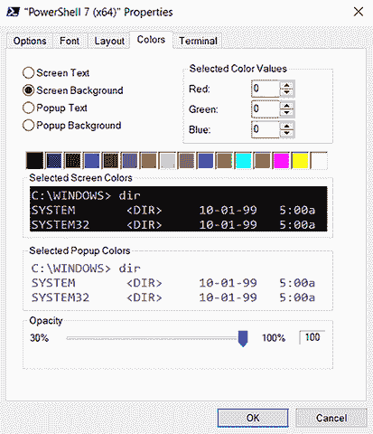

# 26 个技巧、窍门和技术

你的午餐月即将结束，因此我们想分享一些随机的额外技巧和技术，以完善你的学习。 

## 26.1 配置文件、提示和颜色：定制外壳

每个 PowerShell 会话都以相同的方式开始：相同的别名、相同的 PSDrives、相同的颜色等等。为什么不稍微定制一下外壳呢？

### 26.1.1 PowerShell 配置文件

我们之前已经解释过，PowerShell 宿主应用程序和 PowerShell 引擎本身之间是有区别的。宿主应用程序，如控制台或 VS Code，是你向 PowerShell 引擎发送命令的一种方式。引擎执行你的命令，宿主应用程序负责显示结果。宿主应用程序还负责在每次启动外壳时加载和运行 *配置文件脚本*。

这些配置文件脚本可以用来通过加载模块、更改到不同的起始目录、定义你想要使用的函数等方式来定制 PowerShell 环境。例如，以下是莎拉在她的电脑上使用的配置文件脚本：

```
Import-Module ActiveDirectory
Import-Module DBATools
cd c:\
```

该配置文件加载莎拉使用最多的两个模块，并将其更改到她的 `C:` 驱动器的根目录，这是莎拉喜欢开始工作的位置。你可以将任何你喜欢的命令放入你的配置文件中。

注意：你可能认为没有必要加载 Active Directory 模块，因为当莎拉尝试使用该模块中的任何命令时，PowerShell 会隐式加载它。但该特定模块还映射了一个 `AD:` PSDrive，莎拉喜欢在外壳启动时就可用它。

没有默认的配置文件，你创建的确切配置文件脚本将取决于你希望它如何工作。如果你运行 `help` `about_profiles`，可以找到详细信息，但你主要需要考虑你是否将在多个不同的宿主应用程序中工作。例如，我们经常在常规控制台、Windows Terminal 和 VS Code 之间切换。我们希望所有三个都运行相同的配置文件，因此我们必须小心地在正确的位置创建正确的配置文件脚本文件。我们还要注意配置文件中包含的内容，因为一些调整控制台特定设置（如颜色）的命令可能会在 VS Code 或 Windows Terminal 中引起错误。以下是控制台宿主尝试加载的文件及其尝试加载的顺序：

1.  `$pshome\profile.ps1`—无论用户使用哪个宿主，此脚本都将为计算机上的所有用户执行（记住 `$pshome` 在 PowerShell 中是预定义的，包含 PowerShell 安装文件夹的路径）。

1.  `$pshome\Microsoft.PowerShell_profile.ps1`—如果计算机上的用户正在使用控制台宿主，则此脚本将执行。

1.  `$pshome/Microsoft.VSCode_profile.ps1`—如果你使用带有 PowerShell 扩展的 VS Code，则此脚本将执行。

1.  `$home\Documents\WindowsPowerShell\profile.ps1`—这个配置文件只会为当前用户执行（因为它位于用户的家目录下），无论他们使用哪个主机。

1.  `$home\Documents\WindowsPowerShell\Microsoft.PowerShell_profile.ps1`—如果当前用户使用控制台宿主，这个配置文件将会执行。如果他们使用带有 PowerShell 扩展的 VS Code，则将执行 $home\Documents\WindowsPowerShell\Microsoft.VSCode_profile.ps1 脚本。

如果一个或多个这些脚本不存在，没有问题。宿主应用将简单地跳过它并继续下一个。

在 64 位系统上，32 位和 64 位的脚本都有变体，因为 PowerShell 本身就有 32 位和 64 位版本。你并不总是希望 64 位 shell 中运行的命令与 32 位 shell 中运行的命令相同——也就是说，某些模块和其他扩展只适用于一个或另一个架构，因此你不会希望 32 位配置文件尝试将 64 位模块加载到 32 位 shell 中，因为这是不会工作的。

现在尝试一下 运行 `$Profile | Format-List -force` 并列出所有配置文件。

注意，`about_profiles` 中的文档与这里列出的不同，并且我们的经验是前面的列表是正确的。以下是关于该列表的几个更多要点：

+   `$pshome` 是一个内置的 PowerShell 变量，包含 PowerShell 本身的安装文件夹；在大多数系统上，它位于 C:\Program Files\PowerShell\7。

+   `$home` 是另一个内置变量，指向当前用户的配置文件文件夹（例如 C:\Users\Sarah）。

+   我们用“*Documents*”来指代“文档”文件夹，但在 Windows 的一些版本中，它将是“*我的文档*”。

+   我们写了“无论他们使用哪个宿主”，但从技术上讲，这并不完全正确。对于由微软编写的宿主应用（例如，VS Code）来说，这是正确的，但无法强迫非微软宿主应用的作者遵循这些规则。

因为我们希望无论使用控制台宿主还是**VS Code**，都能加载相同的 shell 扩展，所以我们选择自定义 $home\Documents\WindowsPowerShell\ profile.ps1，因为这个配置文件适用于微软提供的两个宿主应用。

现在尝试一下 通过为自己创建一个或多个配置文件脚本来测试你的配置文件。即使你只放入一个简单的消息，例如 `Write-Output` `"It Worked"`，这也是观察不同文件在行动中的好方法。记住，你必须关闭 shell（或 VS Code）并重新打开它才能看到配置文件脚本运行。

请记住，配置文件脚本也是脚本，并受你的 shell 当前执行策略的影响。如果你的执行策略是 `Restricted`，则配置文件不会运行；如果你的策略是 `AllSigned`，则配置文件必须经过签名。第四章讨论了执行策略。

小贴士：在 VS Code 中，你可以运行命令`code $profile`，它将打开 VS Code 配置文件。同样，在控制台中，你可以运行`notepad $profile`，它将打开你的控制台特定配置文件。

### 26.1.2 自定义提示

PowerShell 提示——你在本书的大部分内容中看到的`PS C:\>`——是由一个名为`Prompt`的内置函数生成的。如果你想自定义提示，你可以替换这个函数。在配置文件脚本中定义一个新的`Prompt`函数是一种可以做到的事情，这样每次打开 shell 时你的更改就会生效。以下是默认提示：

```
function prompt
{
    $(if (test-path variable:/PSDebugContext) { '[DBG]: ' }
    else { '' }) + 'PS ' + $(Get-Location) ` 
    + $(if ($nestedpromptlevel -ge 1) { '>>' }) + '> '
}
```

这个提示首先检查 shell 的`VARIABLE:`驱动器中是否定义了`$DebugContext`变量。如果是，这个函数将在提示的开始处添加`[DBG]:`。如果不是，提示将定义为`PS`以及当前位置，这是由`Get-Location`命令返回的。如果 shell 处于嵌套提示中，如内置的`$nestedpromptlevel`变量定义的，提示将添加`>>`。

这里有一个替代的提示函数。你可以直接将其输入到任何配置文件脚本中，使其成为你的 shell 会话的标准提示：

```
function prompt {
 $time = (Get-Date).ToShortTimeString()
 "$time [$env:COMPUTERNAME]:> "
}
```

这个替代提示首先显示当前时间，然后是当前计算机名（位于方括号内）：

```
6:07 PM [CLIENT01]:>
```

注意，这使用了 PowerShell 的双引号特殊行为，其中 shell 将变量（如`$time`）替换为其内容。

你可以添加到配置文件中最有用的代码之一是更改 PowerShell 窗口的标题栏：

```
$host.UI.RawUI.WindowTitle = "$env:username" 
```

### 26.1.3 调整颜色

在前面的章节中，我们提到了当一系列长错误消息在 shell 中滚动时，我们可能会多么紧张。Sarah 小时候在英语课上总是很吃力，看到所有红色的文字让她想起了从汉森小姐那里收到的论文，上面用红笔做了很多标记。真恶心。幸运的是，PowerShell 让你能够修改它使用的默认颜色的大部分（如图 26.1）。



图 26.1 配置默认 shell 屏幕颜色

默认的文本前景和背景颜色可以通过点击 PowerShell 窗口右上角的控制框进行修改。从那里，选择属性，然后选择颜色选项卡。

修改错误、警告和其他消息的颜色稍微复杂一些，需要运行一个命令。但是，你可以将这个命令放入你的配置文件中，以便每次打开 shell 时执行。以下是将错误消息的前景色更改为绿色的方法，我们发现这要舒适得多：

```
(Get-Host).PrivateData.ErrorForegroundColor = "green"
```

你可以更改以下设置的颜色：

+   `ErrorForegroundColor`

+   `ErrorBackgroundColor`

+   `WarningForegroundColor`

+   `WarningBackgroundColor`

+   `DebugForegroundColor`

+   `DebugBackgroundColor`

+   `VerboseForegroundColor`

+   `VerboseBackgroundColor`

+   `ProgressForegroundColor`

+   `ProgressBackgroundColor`

下面是一些你可以选择的颜色：

+   `Red`

+   `Yellow`

+   `黑色`

+   `白色`

+   `绿色`

+   `青色`

+   `洋红色`

+   `蓝色`

大多数这些颜色也有深色版本：`深红色`、`深黄色`、`深绿色`、`深青色`、`深蓝色`等等。

## 26.2 操作符：-as, -is, -replace, -join, -split, -contains, -in

这些额外的操作符在多种情况下都很有用。它们让你能够处理数据类型、集合和字符串。

### 26.2.1 -as 和 -is

`-as` 操作符试图将现有对象转换成另一种类型，从而生成一个新的对象。例如，如果你有一个包含小数的数字（可能是除法操作的结果），你可以通过转换，或者说是*强制类型转换*，这个数字到整数来去除小数部分：

```
1000 / 3 -as [int]
```

要转换的对象首先出现，然后是 `-as` 操作符，接着是在方括号中，你想要转换到的类型。类型可以包括 `[string]`、`[xml]`、`[int]`、`[single]`、`[double]`、`[datetime]` 等，尽管你可能最常使用的是这些类型。技术上，这个将转换为整数的例子会将分数四舍五入到整数，而不是仅仅截断数字的小数部分。

`-is` 操作符的工作方式类似：它被设计用来返回 `True` 或 `False`，以指示一个对象是否为特定类型。以下是一些单行示例：

```
123.45 -is [int]
"SRV02" -is [string]
$True -is [bool]
(Get-Date) -is [datetime]
```

现在尝试运行这些单行命令以查看结果。

### 26.2.2 -replace

`-replace` 操作符使用正则表达式，并设计用来定位另一个字符串中所有出现的特定字符串，并用第三个字符串来替换这些出现：

```
PS C:\> "192.168.34.12" -replace "34","15"
192.168.15.12
```

源字符串首先出现，然后是 `-replace` 操作符。然后你提供要在源字符串中搜索的字符串，后面跟着一个逗号和用于替换搜索字符串的字符串。在上面的例子中，我们将 `34` 替换为 `15`。

这与 `string replace()` 方法不同，后者是静态文本替换。虽然它们的工作方式相似，但它们非常不同。

### 26.2.3 -join 和 -split

`-join` 和 `-split` 操作符被设计用来将数组转换为分隔列表，反之亦然。例如，假设你创建了一个包含五个元素的数组：

```
PS C:\> $array = "one","two","three","four","five"
PS C:\> $array
one
two
three
four
five
```

这之所以有效，是因为 PowerShell 会自动将逗号分隔的列表视为数组。现在，假设你想要将这个数组连接成一个以管道符分隔的字符串。你可以使用 `-join` 操作符来完成这个操作：

```
PS C:\> $array -join "|"
one|two|three|four|five
```

将结果保存到变量中可以让你重用它，甚至可以将它输出到文件：

```
PS C:\> $string = $array -join "|"
PS C:\> $string
one|two|three|four|five
PS C:\> $string | out-file data.dat
```

`-split` 操作符做的是相反的操作：它将分隔字符串转换为一个数组。例如，假设你有一个包含一行和四列的制表符分隔的文件。显示文件内容可能看起来像这样：

```
PS C:\> gc computers.tdf
Server1 Windows East    Managed
```

请记住，`gc` 是 `Get-Content` 的别名。

你可以使用 `-split` 操作符将字符串拆分为四个单独的数组元素：

```
PS C:\> $array = (gc computers.tdf) -split "`t"
PS C:\> $array
Server1
Windows
East
Managed
```

注意到使用了转义字符，反引号，以及一个 *t* (`` `t ``) 来定义制表符字符。这必须放在双引号中，以便识别转义字符。结果数组有四个元素，你可以通过它们的索引号单独访问它们：

```
PS C:\> $array[0]
Server1
```

### 26.2.4 - 包含和 - 在

`-contains` 操作符常常让 PowerShell 新手感到困惑。你会看到人们尝试这样做：

```
PS C:\> 'this' -contains '*his*'
False
```

事实上，它们意味着要使用 `-like` 操作符：

```
. PS C:\> 'this' -like '*his*'
True
```

`-like` 操作符旨在进行通配符字符串比较。`-contains` 操作符用于测试给定对象是否存在于集合中。例如，创建一个字符串对象集合，然后测试给定字符串是否在该集合中：

```
PS C:\> $collection = 'abc','def','ghi','jkl'
PS C:\> $collection -contains 'abc'
True
PS C:\> $collection -contains 'xyz'
False
```

`-in` 操作符做同样的事情，但它颠倒了操作数的顺序，使得集合在右边，测试对象在左边：

```
PS C:\> $collection = 'abc','def','ghi','jkl'
PS C:\> 'abc' -in $collection
True
PS C:\> 'xyz' -in $collection
False
```

## 26.3 字符串操作

假设你有一段文本字符串，你需要将其转换为全部大写字母。或者你可能需要从字符串中获取最后三个字符。你将如何操作？

在 PowerShell 中，字符串是对象，并且它们附带了许多方法。记住，方法是一种告诉对象做什么的方式，通常是对它自己，而且你可以通过将对象管道到 `gm` 来发现可用的方法：

```
PS C:\> "Hello" | get-member
   TypeName: System.String
Name             MemberType            Definition
----             ----------            ----------
Clone            Method                System.Object Clone()
CompareTo        Method                int CompareTo(System.Object value...
Contains         Method                bool Contains(string value)
CopyTo           Method                System.Void CopyTo(int sourceInde...
EndsWith         Method                bool EndsWith(string value), bool...
Equals           Method                bool Equals(System.Object obj), b...
GetEnumerator    Method                System.CharEnumerator GetEnumerat...
GetHashCode      Method                int GetHashCode()
GetType          Method                type GetType()
GetTypeCode      Method                System.TypeCode GetTypeCode()
IndexOf          Method                int IndexOf(char value), int Inde...
IndexOfAny       Method                int IndexOfAny(char[] anyOf), int...
Insert           Method                string Insert(int startIndex, str...
IsNormalized     Method                bool IsNormalized(), bool IsNorma...
LastIndexOf      Method                int LastIndexOf(char value), int ...
LastIndexOfAny   Method                int LastIndexOfAny(char[] anyOf),...
Normalize        Method                string Normalize(), string Normal...
PadLeft          Method                string PadLeft(int totalWidth), s...
PadRight         Method                string PadRight(int totalWidth), ...
Remove           Method                string Remove(int startIndex, int...
Replace          Method                string Replace(char oldChar, char...
Split            Method                string[] Split(Params char[] sepa...
StartsWith       Method                bool StartsWith(string value), bo...
Substring        Method                string Substring(int startIndex),...
ToCharArray      Method                char[] ToCharArray(), char[] ToCh...
ToLower          Method                string ToLower(), string ToLower(...
ToLowerInvariant Method                string ToLowerInvariant()
ToString         Method                string ToString(), string ToStrin...
ToUpper          Method                string ToUpper(), string ToUpper(...
ToUpperInvariant Method                string ToUpperInvariant()
Trim             Method                string Trim(Params char[] trimCha...
TrimEnd          Method                string TrimEnd(Params char[] trim...
TrimStart        Method                string TrimStart(Params char[] tr...
Chars            ParameterizedProperty char Chars(int index) {get;}
Length           Property              System.Int32 Length {get;}
```

一些更有用的 `String` 方法包括以下内容：

+   `IndexOf()` — 告诉你给定字符在字符串中的位置：

    ```
    PS C:\> "SRV02".IndexOf("-")
    6
    ```

+   `Split()`、`Join()` 和 `Replace()` — 操作类似于我们在上一节中描述的 `-split`、`-join` 和 `-replace` 操作符。我们倾向于使用 PowerShell 操作符而不是 `String` 方法。

+   `ToLower()` 和 `ToUpper()` — 转换字符串的大小写：

    ```
    PS C:\> $computername = "SERVER17"
    PS C:\> $computername.tolower()
    server17
    ```

+   `Trim()` — 从字符串的两端删除空白。

+   `TrimStart()` 和 `TrimEnd()` — 分别从字符串的开始或结束处删除空白：

    ```
    PS C:\> $username = "    Sarah "
    PS C:\> $username.Trim()
    Sarah
    ```

所有这些 `String` 方法都是操纵和修改 `String` 对象的极好方式。请注意，所有这些方法都可以与包含字符串的变量一起使用——如在 `ToLower()` 和 `Trim()` 示例中所示——或者可以直接与静态字符串一起使用，如在 `IndexOf()` 示例中所示。

## 26.4 日期操作

与 `String` 对象一样，`Date`（或如果你更喜欢，`DateTime`）对象也附带了许多方法，允许日期和时间的操作和计算：

```
PS C:\> get-date | get-member
   TypeName: System.DateTime
Name                 MemberType     Definition
----                 ----------     ----------
Add                  Method         System.DateTime Add(System.TimeSpan ...
AddDays              Method         System.DateTime AddDays(double value)
AddHours             Method         System.DateTime AddHours(double value)
AddMilliseconds      Method         System.DateTime AddMilliseconds(doub...
AddMinutes           Method         System.DateTime AddMinutes(double va...
AddMonths            Method         System.DateTime AddMonths(int months)
AddSeconds           Method         System.DateTime AddSeconds(double va...
AddTicks             Method         System.DateTime AddTicks(long value)
AddYears             Method         System.DateTime AddYears(int value)
CompareTo            Method         int CompareTo(System.Object value), ...
Equals               Method         bool Equals(System.Object value), bo...
GetDateTimeFormats   Method         string[] GetDateTimeFormats(), strin...
GetHashCode          Method         int GetHashCode()
GetType              Method         type GetType()
GetTypeCode          Method         System.TypeCode GetTypeCode()
IsDaylightSavingTime Method         bool IsDaylightSavingTime()
Subtract             Method         System.TimeSpan Subtract(System.Date...
ToBinary             Method         long ToBinary()
ToFileTime           Method         long ToFileTime()
ToFileTimeUtc        Method         long ToFileTimeUtc()
ToLocalTime          Method         System.DateTime ToLocalTime()
ToLongDateString     Method         string ToLongDateString()
ToLongTimeString     Method         string ToLongTimeString()
ToOADate             Method         double ToOADate()
ToShortDateString    Method         string ToShortDateString()
ToShortTimeString    Method         string ToShortTimeString()
ToString             Method         string ToString(), string ToString(s...
ToUniversalTime      Method         System.DateTime ToUniversalTime()
DisplayHint          NoteProperty   Microsoft.PowerShell.Commands.Displa...
Date                 Property       System.DateTime Date {get;}
Day                  Property       System.Int32 Day {get;}
DayOfWeek            Property       System.DayOfWeek DayOfWeek {get;}
DayOfYear            Property       System.Int32 DayOfYear {get;}
Hour                 Property       System.Int32 Hour {get;}
Kind                 Property       System.DateTimeKind Kind {get;}
Millisecond          Property       System.Int32 Millisecond {get;}
Minute               Property       System.Int32 Minute {get;}
Month                Property       System.Int32 Month {get;}
Second               Property       System.Int32 Second {get;}
Ticks                Property       System.Int64 Ticks {get;}
TimeOfDay            Property       System.TimeSpan TimeOfDay {get;}
Year                 Property       System.Int32 Year {get;}
DateTime             ScriptProperty System.Object DateTime {get=if ((& {...
```

注意，这些属性使你能够访问 `DateTime` 的一部分，例如日期、年份或月份：

```
PS C:\> (get-date).month
10
```

这些方法使两件事成为可能：计算和转换为其他格式。例如，为了获取 90 天前的日期，我们喜欢使用 `AddDays()` 并传入一个负数：

```
PS C:\> $today = get-date
PS C:\> $90daysago = $today.adddays(-90)
PS C:\> $90daysago
Saturday, March 13, 2021 11:26:08 AM
```

以 `To` 开头的方法旨在以不同的格式提供日期和时间，例如短日期字符串：

```
PS C:\> $90daysago.toshortdatestring()
3/13/2021
```

这些方法都使用你电脑的当前区域设置来确定正确的时间日期格式化方式。

## 26.5 处理 WMI 日期

虽然 WMI 在 PowerShell 7 中不可用，但我们知道有些人仍在使用 Windows PowerShell 5.1，因此我们想分享一些关于 WMI 倾向于以难以使用的字符串存储日期和时间信息的知识。例如，`Win32_OperatingSystem`类跟踪计算机上次启动的时间，日期和时间信息如下所示：

```
PS C:\> get-wmiobject win32_operatingsystem | select lastbootuptime
lastbootuptime
--------------
20101021210207.793534-420
```

PowerShell 的设计者知道你不太可能轻松地使用这些信息，因此他们为每个 WMI 对象添加了一对转换方法。将任何**WMI**对象通过`gm`管道传输，你可以在末尾或附近看到这些方法：

```
PS C:\> get-wmiobject win32_operatingsystem | gm
   TypeName: System.Management.ManagementObject#root\cimv2\Win32_OperatingS
ystem
Name                                      MemberType   Definition
----                                      ----------   ----------
Reboot                                    Method       System.Management...
SetDateTime                               Method       System.Management...
Shutdown                                  Method       System.Management...
Win32Shutdown                             Method       System.Management...
Win32ShutdownTracker                      Method       System.Management...
BootDevice                                Property     System.String Boo...
...
PSStatus                                  PropertySet  PSStatus {Status,...
ConvertFromDateTime                       ScriptMethod System.Object Con...
ConvertToDateTime                         ScriptMethod System.Object Con...
```

我们删除了大部分中间输出，以便你可以轻松找到`ConvertFromDateTime``()`和`ConvertToDateTime()`方法。在这种情况下，你开始的是一个**WMI**日期和时间，你想要将其转换为正常的日期和时间，所以你这样做：

```
PS C:\> $os = get-wmiobject win32_operatingsystem
PS C:\> $os.ConvertToDateTime($os.lastbootuptime)
Thursday, October 20, 2015 9:02:07 PM
```

如果你想要将日期和时间信息作为正常表格的一部分，你可以使用`Select-Object`或`Format-Table`来创建自定义的计算列和属性：

```
PS C:\> get-wmiobject win32_operatingsystem | select BuildNumber,__SERVER,
[CA]@{l='LastBootTime';e={$_.ConvertToDateTime($_.LastBootupTime)}}
BuildNumber               __SERVER                 LastBootTime
-----------               --------                 ------------
7600                      SRV02                10/20/2015 9:02:07 PM
```

如果你使用的是**CIM**命令，日期的处理会简单得多，因为它们会自动将大多数日期/时间值转换为人类可读的格式。

## 26.6 设置默认参数值

大多数 PowerShell 命令至少包含几个具有默认值的参数。例如，只运行`Dir`，它默认为当前路径，无需指定`-Path`参数。

默认值存储在一个名为`$PSDefaultParameterValues`的特殊内置变量中。每次你打开一个新的 shell 窗口时，该变量都是空的，并且它的目的是用哈希表（你可以在配置文件脚本中这样做，以便始终有效）填充。

例如，假设你想创建一个新的包含用户名和密码的凭据对象，并让该凭据自动应用于所有具有`-Credential`参数的命令：

```
PS C:\> $credential = Get-Credential -UserName Administrator 
-Message "Enter Admin credential"
PS C:\> $PSDefaultParameterValues.Add('*:Credential',$credential)
```

或者，你可能只想在每次运行时强制`Invoke-Command` cmdlet 提示输入凭据。在这种情况下，而不是分配一个默认值，你会分配一个执行`Get-Credential`命令的脚本块：

```
PS C:\> $PSDefaultParameterValues.Add('Invoke-Command:Credential',
(Get-Credential -Message 'Enter administrator credential' 
-UserName Administrator})
```

你可以看到`Add()`方法第一个参数的基本格式是`<-cmdlet> :<parameter>`，其中`<cmdlet>`可以接受通配符，如`*`。`Add()`方法的第二个参数是你想要设置为默认值的值，或者是一个执行另一个或多个命令的脚本块。

你可以始终检查`$PSDefaultParameterValues`以查看它包含的内容：

```
PS C:\> $PSDefaultParameterValues
Name                           Value
----                           -----
*:Credential                   System.Management.Automation.PSCredenti
Invoke-Command:Credential      Get-Credential -Message 'Enter administ
```

你可以通过阅读 shell 的`about_parameters_default_values`帮助文件来了解更多关于这个功能的信息。

超越

PowerShell 变量受称为*作用域*的东西控制。我们在第十六章中简要介绍了作用域，它与这些默认参数值有关。

如果你通过命令行设置`$PSDefaultParameterValues`，它将应用于该 shell 会话中运行的 所有脚本和命令。但如果你在脚本中设置`$-PSDefaultParameterValues`，它将只应用于该脚本所做的事情。这是一个有用的技巧，因为它意味着你可以用一个脚本开始，并设置很多默认值，这些值不会应用于其他脚本，或 shell 本身。

“脚本中发生的事情留在脚本中”这个概念是作用域的核心。如果你想进一步探索，可以阅读 shell 的`about_scope`帮助文件。

## 26.7 玩转脚本块

脚本块是 PowerShell 的关键部分，你已经使用它们很多了：

+   `Where-Object`的`-FilterScript`参数接受脚本块。

+   `ForEach-Object`的`-Process`参数接受脚本块。

+   用于使用`Select-Object`创建自定义属性或使用`Format-Table`创建自定义列的哈希表接受脚本块作为`E`或`Expression`键的值。

+   如前所述，默认参数值可以设置为脚本块。

+   一些远程和作业相关的命令，包括`Invoke-Command`和`Start-Job`，接受脚本块作为`-ScriptBlock`参数。

那么什么是脚本块呢？一般来说，它是由大括号 `{}` 包围的任何东西，除了哈希表，哈希表使用大括号，但前面有`@`符号。你甚至可以直接从命令行输入脚本块并将其分配给变量。然后你可以使用调用运算符`&`来运行该块：

```
PS C:\> $block = {
Get-process | sort -Property vm -Descending | select -first 10 }
PS C:\> &$block
Handles  NPM(K)    PM(K)      WS(K) VM(M)   CPU(s)     Id ProcessName
-------  ------    -----      ----- -----   ------     -- -----------
    680      42    14772      13576  1387     3.84    404 svchost
    454      26    68368      75116   626     1.28   1912 powershell
    396      37   179136      99252   623     8.45   2700 powershell
    497      29    15104       6048   615     0.41   2500 SearchIndexer
    260      20     4088       8328   356     0.08   3044 taskhost
    550      47    16716      13180   344     1.25   1128 svchost
   1091      55    19712      35036   311     1.81   3056 explorer
    454      31    56660      15216   182    45.94   1596 MsMpEng
    163      17    62808      27132   162     0.94   2692 dwm
    584      29     7752       8832   159     1.27    892 svchost
```

你可以用脚本块做很多事情。如果你想自己探索可能性，请阅读 shell 的`about_script_blocks`帮助文件。

## 26.8 更多技巧、窍门和技术

正如我们在本章开头所说的，这是一个概述，我们想向你展示一些随机的小东西，但它们并没有很好地融入前面的任何一章。当然，随着你对 shell 了解得更多，以及你获得更多经验，你将继续从中获得技巧和窍门。

你还可以查看我们的 Twitter 动态——@TylerLeonhardt, @TravisPlunk, 和 @PSJamesP——在那里我们定期分享我们发现的和觉得有用的技巧和技术。别忘了 PowerShell.org 上的论坛。有时候，一点一滴地学习可以是一个更容易成为技术专家的方法，所以请将这些以及其他你遇到的任何来源视为逐步和持续提高你的 PowerShell 技能的方式。
