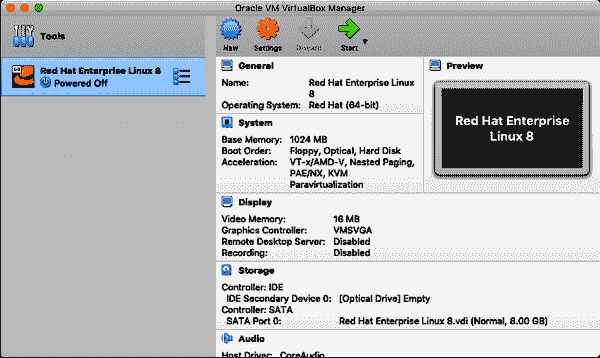
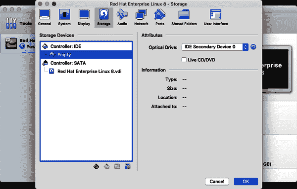
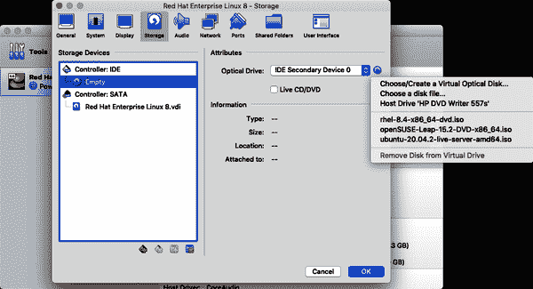

# 第一章：起步使用 Linux

Linux 系统管理对不同的人来说意味着不同的事情。在这本书中，管理指的是 Linux 系统管理员（sysadmin）每天必须采取的行动，以管理和支持用户，维护系统健康，实施最佳安全实践，安装软件并执行系统维护任务。本章涵盖了 Linux 安装、初始设置以及使用简单的 Shell 命令进行系统探索。

您将会在命令行中花费大部分时间，也称为命令行界面（CLI）。Linux 系统管理员很少在其支持的服务器系统上安装或使用图形用户界面（GUI）。本章介绍了 CLI 以及一些简单的命令，用于导航文件系统、定位重要文件并熟悉 Linux 的 CLI。

# 安装 Linux

每个 Linux 系统管理员最先学习的事情之一是如何安装 Linux。安装 Linux 没有单一的*正确*方法，但一些指南和建议会在您用户需求变化时让您的生活更轻松。

虽然本节不会详细介绍如何安装 Linux 的逐步说明，但基本步骤在这里概述。对于大多数初级系统管理员来说，系统安装通常是通过自动化手段进行，例如 Kickstart 或其他企业级交付系统。

## 准备您的 Linux 系统

如果这是您第一次安装 Linux，建议您将其安装到虚拟机（VM）中。这样，您不必将整个硬件设备用于学习系统，并且您不会通过尝试并行安装 Linux 而使您的系统无法运行，从而创建一个多启动计算机。（设置多启动是一个更高级的概念，超出了本书的范围。）

如果您尚未安装，建议您从[VirtualBox](https://oreil.ly/X4dKu)的最新版本开始进行虚拟化。VirtualBox 是一个应用程序，允许您的当前计算机充当虚拟机主机系统，在其上安装诸如 Linux 之类的虚拟客户机，形成一个独立的、运行正常的计算机系统。VirtualBox 可以运行在各种主机操作系统（OS）上，并支持各种客户机操作系统，包括 Linux。主机 OS 和客户机 OS 可以彼此不同。您的计算机（主机 OS）可以是基于 Windows、Mac 或 Linux 的系统，但可以在其上安装作为 VirtualBox 虚拟机的 Linux 客户机。

## 下载并安装 Linux

接下来，您需要选择一个 Linux 发行版（distro）进行安装，以便您可以练习发出命令、更改配置、重新启动、安装软件、创建用户等等。建议您选择一款与您当前雇主使用的发行版类似的 Linux 发行版。如果您的公司尚未使用 Linux，或者您还没有在系统管理员角色上工作，那么可以从以下几种流行的发行版中进行选择：

[*Debian*](https://oreil.ly/hxbxl)

Debian 是一个顶级发行版，许多其他发行版都源自它。Debian 得到社区支持，是开源且免费的。

[*OpenSUSE*](https://oreil.ly/hsBY4)

OpenSUSE 是一个得到社区支持的顶级发行版，在全球拥有许多忠实的追随者。其商业版本 SUSE Linux Enterprise 有广泛的采用。

[*Red Hat Enterprise Linux*](https://oreil.ly/0nvvM)

Red Hat 是一款得到商业支持的 Linux 发行版，广受全球企业采纳，现在由 IBM 拥有。

[*Ubuntu*](https://oreil.ly/zoK4o)

Ubuntu 非常受欢迎，既有（基于 Debian 的）社区版也有商业支持的发行版。Ubuntu 还提供了预制的 VirtualBox（和其他）虚拟机，帮助您快速启动。

下载的 ISO 文件是一个可引导的 Linux 镜像。如果您使用它创建虚拟机，无需进行任何操作。虚拟机将从 ISO 镜像启动，并开始安装过程。在 VirtualBox 中配置您的虚拟机后，从 Oracle VM VirtualBox 管理器中选择“设置”，如图 1-1 所示。



###### 图 1-1\. Oracle VM VirtualBox 管理器应用程序和配置的虚拟机

接下来，选择存储，如图 1-2 所示。



###### 图 1-2\. 带有已选择存储设置的虚拟机设置

在存储设备窗格下选择空的光学磁盘驱动器，然后在属性窗格中选择光学盘图标以浏览您的 ISO 镜像文件。图 1-3 显示了此菜单中可用的多个 ISO 文件。



###### 图 1-3\. 从列表中选择 ISO 镜像

选择 ISO 镜像后，单击“确定”以继续。当您启动虚拟机时，它将从此 ISO 镜像启动，开始安装到虚拟磁盘上。

当系统启动时，您可以接受默认设置。如果您有安装 Linux 的经验，可以更改默认设置以适应您的需求。在提示时创建用户帐户。如果您的发行版提示您为 root 帐户设置密码，请设置密码。您必须记住此密码，否则您将不得不重新安装 Linux 虚拟机或尝试恢复它。安装 Linux 可能需要几分钟，并且在安装过程结束时需要重新启动。

# 认识您的新 Linux 系统

安装完成后，首先需要使用安装过程中创建的用户名和密码登录。登录后，你将进入一个 shell（或操作环境）的主目录。你的主目录（*/home*）是*/*目录的子目录。Linux 文件系统是层级文件系统，类似于 Microsoft Windows。顶层是根目录，用*/*符号表示。Windows 使用诸如*C:*之类的驱动器号表示根目录。在 Windows 中，你可以有多个驱动器号及其自己的根级目录，如*C:*、*D:*、*E:*等等。在 Linux 中，只有一个根目录，即*/*。所有其他目录都是根目录的子目录。以下目录树展示了 Linux 根目录及其子目录：

```
/
│─ bin
│─ dev
│─ etc
│─ home
│─ lib
│─ media
│─ mnt
│─ opt
│─ proc
│─ root
│─ run
│─ sbin
│─ srv
│─ sys
│─ tmp
│─ usr
└─ var
```

请注意，*/*（根）文件系统下只有目录，没有单独的文件，尽管某些 Linux 发行版在*/*中有一些符号链接文件。所有文件都保存在目录中。本书的其余部分将探索许多这些子目录。表 1-1 提供了每个目录中文件和信息的简要概述。

表 1-1\. Linux 文件系统

| 目录 | 描述 |
| --- | --- |
| */* | 根文件系统仅包含其他目录，没有单独的文件。 |
| */bin* | 二进制文件目录包含可执行文件。指向*/usr/bin*。 |
| */dev* | 设备目录包含用于访问外围设备的设备文件。 |
| */etc* | 包含用户和服务的系统配置文件。 |
| */home* | 用户的主目录。 |
| */lib* | 系统库文件。指向*/usr/lib*。 |
| */media* | 用于挂载 USB 驱动器或 DVD 光盘等介质的目录。 |
| */mnt* | 挂载远程文件系统的挂载目录。 |
| */opt* | 第三方软件安装目录。 |
| */proc* | 虚拟文件系统，跟踪系统进程。 |
| */root* | 根用户的主目录。 |
| */run* | 变量和易失性运行时数据。 |
| */sbin* | 系统二进制（可执行）文件。 |
| */srv* | 可能包含系统服务的数据。 |
| */sys* | 包含内核信息。 |
| */tmp* | 存储会话信息和临时文件的目录。 |
| */usr* | 用户和用户相关程序的程序和库。 |
| */var* | 变量文件，如日志、队列和队列文件。 |

系统文件受到用户修改的保护。只有根（管理员）用户才能修改系统配置文件和设置。用户通常只能对自己的主目录、*/tmp*目录以及管理员专门创建和修改的共享目录具有写访问权限。

在下一节中，您将学习如何在命令行中与您的新 Linux 系统进行交互。

# 学习命令行界面（CLI）

*命令行界面*，或 CLI，是大多数系统管理员与其 Linux 系统进行交互的方式，因为服务器系统通常没有图形界面。在 Microsoft Windows 术语中，仅支持 CLI 的系统，如 Linux 服务器，等效于只能访问命令行实用程序的 Windows Server Core 系统。

正如名称所示，你使用键盘或*标准输入*（stdin）输入的命令与 Linux 系统进行交互。来自 stdin 的源也可以是文件重定向、程序和其他来源，但在本书的上下文中，stdin 指键盘输入，除非另有说明。许多命令是信息性的，将系统或系统活动的数据显示到屏幕或*标准输出*（stdout）。有时你会从系统收到一个错误，称为标准错误（stderr）。在本文和其他与 Linux 相关的文档中，你会看到这些术语的完整和缩写版本交替使用。

你必须学习一些命令才能成功地与文件系统交互。所谓“学习”，是指记住而不是在线查找。像这样的命令只有几个，还有一些选项你也应该记住，这样你与系统的交互就变得自然而高效。不要担心使用我介绍的任何命令会对系统造成损害——当我覆盖一个命令应谨慎使用时，我会提醒你。

在开始发出命令之前，你需要了解几件事情。首先是 Linux 不使用文件扩展名。这意味着文件 *filename.exe* 对于 Linux 来说与 *Financial_Report.txt* 或 *Résumé.doc* 没有更多的意义。它们都是文件，可能不可执行或文本文件。在 Linux 中，你几乎可以为文件命名任何你想要的（有一些限制），但在文件名中使用空格需要谨慎，因为这样做需要在文件名周围使用引号。

Linux 的第二个要知道的事情是文件名区分大小写。换句话说，*filename.txt* 和 *filename.TXT* 是两个不同的文件。这一点我会在本章后面证明。暂时请相信我的话。第三个要知道的是，文件的权限确定了你是否可以执行文件、编辑文件，甚至查看文件的内容。第四，Linux 中每个位置都通过其从根目录（*/*）开始的路径唯一命名。例如，如果在 Linux 中提到密码文件，显示为 */etc/passwd*。这被称为*绝对路径*，是关于系统上文件的说法或引用的标准约定。第五，Linux 假定你在发出命令时知道自己要做什么，并且拼写都是正确的，所以要小心，因为某些操作是不可逆转的。

最后，Linux（如 Unix 或更广义上的“*nix”系统）不像 Windows 操作系统那样“啰嗦”。例如，Linux 系统在删除文件时不会提示“你确定吗？”的消息。再次强调，如果你正确拼写命令的所有部分，Linux 系统会假定你要执行你发出的命令。在 Linux 命令行中，拼写很重要。

浏览 Linux 文件系统意味着探索各种系统目录，学会返回主目录，并以不同方式列出目录内容。如果你是 Windows 用户，并且在该平台上的命令提示符（cmd）或 PowerShell 提示符（PS）上工作过，那么 Linux 命令行对你来说将是熟悉的。

下面几节中的简短命令清单将使你熟悉 Linux 文件系统、文件以及你的主目录内容。

## pwd

`pwd`（打印工作目录）命令显示你在文件系统中的位置。如果现在输入`pwd`命令，然后按 Enter 键，命令会显示`/home/*your_login_name*`。确保在每个命令后按 Enter 键，以便接收响应：

```
$ pwd
/home/student1
```

`$`是你的 shell 提示符，显示你作为用户登录到系统中。稍后在本章中你会更多地使用这个命令。

## cd

`cd`（更改目录，或当前目录）命令将你置于一个新目录中，返回到你的主目录，并移动到更高级别或子目录中。`cd`命令类似于 Windows 的`cd`命令：

```
$ cd /etc
$ pwd
/etc
```

只需输入`cd`，无论你在文件系统的哪个位置，都能返回到你的主目录，如下所示：

```
$ pwd
/etc
$ cd
$ pwd
/home/student1
```

当你`cd`到一个目录时，请使用它的绝对路径：

```
$ cd /usr/bin
```

如果你当前在父目录，可以不使用绝对路径`cd`到子目录：

```
$ cd
$ pwd
/home/student1
$ cd /usr
$ cd bin
$ pwd
/usr/bin
```

`cd`命令是你每次连接到 Linux 系统时都会使用的命令之一。

## ls

`ls`（列出）命令显示你指定位置的文件和目录列表。如果你不指定位置，`ls`将显示当前目录中的文件和目录列表：

```
$ cd
$ pwd
$ /home/student1
$ ls
```

你的主目录中还没有可见的文件，因为你尚未创建任何文件，而默认情况下也没有文件。不过，你可以通过指定目录列表的绝对路径来列出其他目录中的文件。在/usr/bin 目录中有太多文件无法列出，因此我截取了其中的几个：

```
$ ls /usr/bin
a2x           getcifsacl            p11-kit               snmpping
a2x.py        getconf               pack200               snmpps
ac            getent                package-cleanup       snmpset
...
```

你的主目录中有文件，但它们因命名方式而被隐藏。以点（.）开头的文件在普通`ls`命令中是隐藏的。要查看这些文件，必须使用命令选项以允许你查看所有文件：

```
$ ls -a
.  ..  .bash_history  .bash_logout  .bash_profile  .bashrc  .gnupg  .zshrc
```

你的清单可能与这个略有不同，但请理解，所有以点开头的目录和文件在使用`ls`命令而不带选项时都被隐藏。你可以`cd`到隐藏目录或列出其中的文件：

```
$ ls .gnupg
private-keys-v1.d  pubring.kbx
```

`ls` 命令是您每次登录 Linux 系统时都会使用的命令，确实是您希望记住的命令之一。我将在本书中反复使用 `ls` 命令，并在途中向您介绍更多选项。现在您已经学会了基本的文件系统导航，是时候学习如何重新启动和关闭系统了。

# 启动、重新启动和关闭 Linux 系统

任何 Linux 系统管理员面临的最基本任务是启动、重新启动和关闭系统。如果您有计算机经验，您会知道未发出关闭命令而关闭系统是不好的。这样做是不好的，因为这可能会损坏打开的文件，使打开的文件保持“打开”状态，中断正在运行的服务，并导致数据库事务日志问题，可能导致数据丢失。

熟练掌握如何启动、重新启动和关闭系统对系统管理员非常重要。

## 启动系统

对于物理系统，您按下电源按钮并释放它以启动系统。这将开始电源自检（POST）和引导过程。在引导过程中仔细观察控制台非常重要，因为系统在启动时会通知您并记录任何问题。请注意屏幕上的任何错误或异常情况。 （在引导过程中可能遇到的最严重消息是“内核恐慌”，这将在本书后面进行讨论。）希望您的系统一切正常，并且进程以登录提示符结束。

启动过程非常简短，但可以识别内存、磁盘、文件系统和网络问题等系统性问题。我将在后面的章节中介绍故障排除，但现在要注意的是，您应该仔细观察引导过程，并记录以后调查的任何问题。

## 重新启动系统

重新启动或重启系统是标准的系统管理员实践。尽管您可能会读到或听到相反的意见，但重新启动系统并没有什么不好。出于前面章节中提到的所有原因，您应该定期这样做。重新启动系统会清除内存，刷新连接，并确保系统健康。良好的重新启动可以暂时解决某些令人困扰的问题，例如耗尽系统内存的应用程序。

任何通过重新启动解决的问题在系统稳定后应进行更彻底的调查。重新启动系统可以让您在应用程序问题、日志问题或网络问题再次使系统需要重新启动之前进行故障排除。

## 关闭系统

关闭意味着发出一个命令，适当地关闭所有程序，并最终关闭系统的电源。这种温和的关闭还会警告 shell 用户系统即将关闭，以便每个人都可以保存工作并退出登录。

系统关机应保留用于硬件维护、迁移或停用。某些企业政策要求系统每年进行一次完全关机，以识别可能仅通过完全系统故障才能显现的硬件问题。技术人员和系统管理员通常利用这个机会同时进行硬件维护或检查。

# 摘要

本章带您上手了一个实时的 Linux 系统，涵盖了一些 Linux 基础知识，探索了一些基本命令，并指导您如何启动、重启和关机系统的方法及原因。在第二章，您将进一步了解如何使用 CLI 以及如何使用命令来创建、删除和修改文件。您还将学习 Linux 权限，如何设置和解释它们，以及如何为用户设置全局默认权限。
