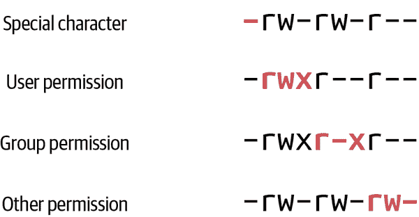

# 第二章：使用权限和特权帐户

对于系统管理员，命令行界面（CLI）是家园。在键盘上打字是标准操作。您需要熟悉命令行及其特殊性和快捷方式——是的，有命令行快捷方式。关于 Linux 命令行有很多要学习的内容。有数十个命令，每个命令有数十个选项。当然，您只会使用少量命令和每个命令的有限选项，但是当需要时，您需要知道如何找到所需的选项并如何使用它们。

CLI 的真正强大之处在于其易用性。CLI 是用户和程序员首次与其操作环境交互的界面。事实上，CLI 至今仍在使用，这证明了它对系统管理员和用户的强大和实用性。本章教您如何作为普通用户和 root 用户在命令行上工作。您还将学习设置和修改文件权限以及这些权限对文件的影响。

# 作为普通用户工作

Linux 系统上有两种用户类型：普通用户和 root（管理员）用户。普通用户每个人都有自己的主目录和有限的系统使用权限。root 用户也有一个主目录（*/root*）。普通用户在自己的主目录中几乎具有无限的权限来创建、修改、删除和操作文件，但在该单一位置之外几乎没有权限。许多系统命令对普通用户可用。相比之下，其他命令则限制于通过`sudo`命令或直接访问 root 用户帐户的限制性 root 用户访问。

###### 注意

一般而言，最注重安全性的规则是，除非某些任务需要特权（root 用户）访问，否则应始终作为普通用户工作，这将在下一节中介绍。

# 作为 Root 用户工作

root 用户是任何 Linux 系统上的超级账户。root 用户可以创建、编辑、移动或删除系统上的任何文件。root 用户可以重启、更改运行级别和关闭系统。有三种方法成为 root 用户：

+   以 root 用户身份登录

+   使用`su`（切换用户）命令

+   使用`sudo`命令

## 以 Root 身份登录

在某些 Linux 发行版上，您可以通过网络或交互式控制台直接作为 root 用户登录系统。一些 Linux 发行版默认禁止 SSH root 登录，而其他发行版则由管理员决定。不建议通过 SSH 登录系统并以 root 身份登录。主要原因是，如果允许跨网络 root 访问系统，则可能会有恶意用户尝试暴力破解 root 登录。您不希望这种情况发生。本书稍后将向您展示如何在您的发行版上禁用 SSH root 登录（如果尚未禁用）。

不应直接在控制台上以 root 身份登录，因为这样做会阻止系统记录登录并成为 root 的用户。记录使用 root 用户帐户的人很重要，因为出现问题时，您希望知道哪位管理员执行了操作。这种记录的目的不是为了归咎。但它是必要的，以满足一些监管要求，并纠正需要可教授时刻或一些高级培训的系统管理员的行动。我们接下来讨论的两个选项是更好、更安全的成为 root 用户的方法。

## 使用 su 命令

成为 root 用户的适当方法之一是使用`su`（替代用户）命令。使用`su`的一个注意事项是用户必须知道 root 用户的密码。如果管理用户知道 root 密码，很难防止这些管理员直接以 root 身份登录。使用`su`命令成为 root 是可以接受的，但前提是每次使用后 root 密码都要更改。在大型企业中，安全组维护 root 密码，系统管理员可以临时检出 root 密码进行维护。

root 用户可以在系统上`su`到任何其他用户帐户而无需知道用户的密码。这种权限允许管理员以故障排除为目的登录或成为任何用户，因为用户往往难以准确描述他们遇到的问题。它还防止用户向管理员透露其密码，这应促使用户更改其密码。

要`su`到另一个帐户是一个简单的过程。发出`su`命令和您希望`su`到的用户帐户。在本示例中，我使用完整提示而不仅仅是`$`来演示用户更改：

```
[bjones@server1] $ su root
Password:
#
```

`#`提示符通知您现在已作为 root 用户登录。在本书中，用户提示符为`$`，而 root 提示为`#`，以区分标准用户的提示符和 root 用户的提示符。现在发出的任何命令都具有 root 权限，这意味着您必须小心，因为账户没有限制。

使用 su 的更好方法是使用`su -`命令，因为`-`表示您还想采用 root 用户的完整环境，而不仅仅是账户权限。显示的内容太长，无法在此处显示，但如果发出`env`命令，您将看到原始用户的环境变量，而不是 root 的环境：

```
# env
```

使用`exit`命令返回原始用户帐户，如下所示：

```
# exit
[bjones@server1] $
```

现在使用带有`-`选项的`su`命令。在此命令中无需指定 root，因为默认是 root：

```
[bjones@server1] $ su -
Password:
# env
```

现在显示 root 用户的环境变量。使用`su -`命令相当于以 root 用户身份登录控制台。任何用户都可以`su`到任何其他用户帐户，这需要知道另一个用户的密码：

```
[bjones@server1] $ su cdavis
Password:
[cdavis@server1] $
```

## 使用 sudo 命令

获得 root 访问权限的最佳方法是使用“替代用户执行”或“作为另一用户执行命令”（`sudo`）命令。`sudo` 命令允许适当配置的用户帐户以 root 用户身份发出单独的命令。每个发出的命令必须在 `sudo` 命令之前。首次使用 `sudo` 命令要求 *sudoer*（为 `sudo` 使用配置的用户帐户）提供他们自己的密码，如下面的代码清单所示。不需要知道 root 密码。

```
$ sudo env
[sudo] password for bjones:
bjones is not in the sudoers file.  This incident will be reported.
[bjones@server1 ~]$
```

警告显示用户不在 *sudoers* 文件中意味着用户帐户 bjones 未在 */etc/sudoers* 文件中配置。在下一节中，我将演示如何设置用户为 sudoer。

###### 注意

`sudo` 命令、*/etc/sudoers* 文件和 sudoer 用户标签非常有趣，因为它们有独特的发音。`sudo` 的接受发音是“soodoo”，sudoer 是“soodooer”。一些系统管理员将其发音为“soodoe”和“soodoe-ers”，但这两种发音都没有问题。

## 创建一个 sudoer

您必须具有 root 用户访问权限才能编辑 */etc/sudoers* 文件，并使用 `visudo` 实用程序，其唯一目的是编辑 */etc/sudoers* 文件。不应直接使用 vi、Emacs 或任何其他文本编辑器编辑 */etc/sudoers* 文件。要编辑 */etc/sudoers* 文件，请作为 root 无选项地发出 `visudo` 命令：

```
# visudo
```

*/etc/sudoers* 文件是描述用户、组和可以使用 root 或其他用户权限运行命令的简单文本文件。您可以创建一个具有非常限制性权限（即仅运行单个命令作为 root）或宽松权限（即以 root 身份运行任何命令而无需输入密码）的 sudoer。我更喜欢配置两者的混合，通过创建可以作为 root 运行任何命令的 sudoer，但必须提供其密码。

*/etc/sudoers* 文件和 sudoers 存在数百种可能的配置方案。本书的范围仅限于此处的示例。在第一个示例中，我演示了如何设置我的用户帐户来使用 `sudo`。我的设置要求在使用 `sudo` 时输入密码：

```
## Allow root to run any commands anywhere
root    ALL=(ALL)       ALL
khess   ALL=(ALL)       ALL
```

我复制了 root 用户的设置，并将我的用户帐户插入其中。设置立即生效。不建议设置用户帐户以不需要输入密码就能使用 `sudo`。在发出命令时使用密码是为了在行使 root 权限时更难出错。`sudo` 命令本身也是如此。理论上，如果管理员必须发出 `sudo` 命令，他们会因为需要具体思考命令动作及其结果而在 root 身份下犯的错误会更少。

# 读取和修改权限

本节教你如何读取和修改文件权限。 您必须了解文件权限，以适当地设置和修改对文件和目录的访问权限。 知道文件权限有助于在用户无法访问文件或目录时进行故障排除。

文件权限简单而又关键于 Linux 安全性。 它们的简单性可能导致忽视和配置错误。 沮丧的系统管理员有时会放宽权限以解决问题，但从不回头或将权限重置为其正确设置。

## 读取、写入和执行

三种 Linux 文件权限或模式是读取（r）、写入（w）和执行（x）：

读取

查看文件或列出目录内容。

写入

创建和修改文件或在目录中复制、移动和创建文件。

执行

执行/运行文件或`cd`进入目录。

如第一章中所述，文件的名称不确定是否可执行，这与 MS Windows（*.exe*文件等）的情况不同。 Linux 文件的可执行性取决于其权限。

使用权限中的 rwx 指示被称为*符号模式*。 符号模式是识别权限的两种方法之一。 另一种是数字模式，它为 rwx 权限分配值。

## 数值权限值

每种权限模式都有其分配的数值。 这种快捷方法使系统管理员更容易设置权限。

读取权限的值为`4`，写入权限的值为`2`，执行权限的值为`1`。 权限值范围从`0`到`7`。 零权限值表示无权限。 表 2-1 总结了这个概念。

表 2-1\. 数值权限值

| 权限模式 | 数值 |
| --- | --- |
| 读取 | `4` |
| 写入 | `2` |
| 执行 | `1` |
| 无 | `0` |

在下一节中，您将了解这些权限如何与组权限一起创建一个简单但完整的文件安全系统。

## 组权限

四个文件权限适用于用户的组：用户、组、其他人和所有人。 “所有人”组包括用户、组和其他人。 这是一种简化的方法，用于全局分配文件或目录的权限。 每个组也有一个简写标识，如表 2-2 所示。

表 2-2\. 组权限

| 权限组 | 值 |
| --- | --- |
| 用户 | `u` |
| 组 | `g` |
| 其他 | `o` |
| 所有 | `a` |

用户和系统管理员可以分别为每个组或同时为所有组设置文件权限。 每个 Linux 文件和目录都为每个组分配了读、写和执行权限。 下一节将为您整理所有权限设置。

## 引入权限的焦点

在本小节中，我将创建一个简单但完整的文件安全系统，展示我们讨论过的所有权限是如何一起工作的。本节中的示例将使用文件*file.txt*。如果您想要按照示例操作，请执行以下命令设置您的文件：

```
$ touch file.txt
```

这个命令会为您创建一个名为*file.txt*的空文件。接下来，请使用带有`-l`（长格式）选项的`ls`命令查看文件权限：

```
$ ls -l
-rw-rw-r--. 1 khess khess 0 Jun 19 17:35 file.txt
```

图 2-1 说明了位置及其指定（用粗体表示）。第一个位置用于特殊文件类型，例如在该位置带有`d`的目录（`dr-xr-xr-w`）。常规文件具有`-`（`-rw-rw-rw-`），表示它们不是目录或其他特殊文件。接下来的九个位置是用户、组和其他用户权限的位置。第一个“三元组”或三个位置是给用户的，第二个是给组的，最后三个是给其他用户的。



###### 图 2-1\. 特殊字符位置及用户、组和其他权限位置

图 2-2 展示了每个列表的数字权限，以及用户（`u`）、组（`g`）和其他（`o`）三元组的显式标签。


###### 图 2-2\. 数字权限值及用户、组和其他（ugo）指定

如图 2-2](#numerical_permission_values_and_usercom)所示，数字权限对每个三元组进行累加，以创建文件的权限配置文件。例如，具有`-rw-rw-r--`权限的文件具有数字权限值`664`。读取权限的值为`4`，加上写入权限的值`2`，总和为`6`。所有三种可能的权限`rwx`总和为`7`。

如果一个文件的权限等于`750`，则其 rwx 表示为`-rwxr-x---`。这意味着指定用户和组之外的其他用户对该文件没有权限。

###### 注意

*其他*组通常被称为*world*。例如，如果文件的权限为`-rw-rw-r--`，则该文件被称为*world readable*，而不是*other readable*。“其他”组的权限尤其敏感，因为允许其他人（世界）对文件和目录进行写入或执行权限可能会造成安全风险。

接下来，您将学习如何使用多种方法设置和更改文件权限。

# 更改文件权限

设置和更改文件权限或*模式*是常见的系统管理员任务。文件系统上的每个文件都有权限，允许或拒绝用户、组和其他人的访问。要更改文件权限，你使用`chmod`（更改模式）命令。你可以使用`chmod`命令以多种方式设置或修改权限。你不必保持一致。你可以使用`chmod`命令使用数字表示或 rwx 和 ugo 表示，但不能在同一条命令中混合使用。我在以下几节中展示了几种可能性和实际示例。

###### 注意

一些系统管理员认为符号（rwx 和 ugo）方法比数字（0、1、2、4）方法更容易掌握。你可以使用任一或两种方法，因为它们是等效的。

## 符号模式

使用符号模式方法更改权限非常简单。参考你在之前示例中创建的原始*file.txt*文件，使用`ls -l`命令查看原始权限：

```
$ ls -l
-rw-rw-r--. 1 khess khess 0 Jun 19 17:35 file.txt
```

当前文件权限不足。你需要限制除你之外的任何人甚至是读取这个文件。你该如何做呢？你需要从其他人那里移除读权限。移除等同于减法，因为你在当前给予文件的权限中减去了一个权限。所以，要从文件中移除读权限，你可以使用`chmod`命令：

```
$ chmod o-r file.txt
$ ls -l
-rw-rw----. 1 khess khess 0 Jun 19 17:35 file.txt
```

你已经从文件中为其他人移除了读权限。现在，除了你之外没有人能够读取（或写入）这个文件。

当你创建一个 shell 脚本并尝试用`./file.sh`执行它，但什么也没有发生时，你应该检查文件的权限，看看你是否已经添加了执行权限：

```
$ touch file.sh
$ echo "echo Hello" > file.sh
$ ./file.sh
-bash: ./file.sh: Permission denied
```

权限被拒绝？但是我刚刚在我的主目录中创建了这个文件！检查权限会揭示问题：

```
$ ls -l
-rw-rw-r--. 1 khess khess 11 Jun 29 19:58 file.sh
```

文件*file.sh*以*.sh*扩展名命名。请记住，在 Linux 中扩展名不起作用，并且意识到*file.sh*当前不可执行，因为它没有执行权限。当尝试执行它时，会收到“Permission denied”消息。要解决问题，请为自己添加执行权限：

```
$ chmod u+x file.sh
$ ls -l
-rwxrw-r--. 1 khess khess 11 Jun 29 19:58 file.sh
```

现在，*file.sh*是可执行的：

```
$ ./file.sh
Hello
```

你可以向文件中添加或移除多个权限，甚至可以在同一条命令中添加和移除权限。以下是每种操作的示例。第一条命令从任何先前示例中删除（`rm file.txt`）文件。

要向文件中添加多个权限：

```
$ rm file.txt
$ touch file.txt
$ ls -l
-rw-rw-r--. 1 khess khess 0 Jun 29 20:13 file.txt
$ chmod ug+x,o+w file.txt
-rwxrwxrw-. 1 khess khess 0 Jun 29 20:13 file.txt
```

若要从文件中减去多个权限：

```
$ ls -l
-rwxrwxrw-. 1 khess khess 0 Jun 29 20:13 file.txt
$ chmod a-x,o-rw file.txt
$ ls -l
-rw-rw----. 1 khess khess 0 Jun 29 20:13 file.txt
```

现在为所有组添加执行权限并移除其他人的读权限：

```
$ rm file.txt
$ touch file.txt
$ ls -l
-rw-rw-r--. 1 khess khess 0 Jun 29 20:13 file.txt
$ chmod a+x,o-r file.txt
$ ls -l
-rwxrwx--x. 1 khess khess 0 Jun 29 20:23 file.txt
```

###### 警告

要明确指定要为哪个 ugo 组添加或移除权限。仅提供`+x`或`-r`默认适用于所有人。

如果你没有指定想要添加权限或者减少权限的组，系统会默认你是指 *所有* 组。从安全角度来看，这可能是危险的。除非这正是你想要做的事情，否则永远不要向所有组授予权限。在下面的示例中，由于你没有明确定义哪个组应该接收它，所有组都被授予了执行权限：

```
$ rm file.txt
$ touch file.txt
$ ls -l
-rw-rw-r--. 1 khess khess 0 Jun 29 20:34 file.txt
$ chmod +x file.txt
$ ls -l
-rwxrwxr-x. 1 khess khess 0 Jun 29 20:35 file.txt
```

###### 注意

要执行一个不在你的路径中的可执行文件或脚本，你必须提供文件的显式路径。如果文件在当前目录中，你必须告诉 shell 它在你的当前目录，并且你想要执行它。使用 `./script_name.sh` 告知 shell 文件是可执行的，并且在你的当前目录中。这里，`script_name.sh` 是你希望执行的文件。

## 数值模式

为了清晰和比较，在本节中的示例与上一节中的示例是重复的。但这里我们使用数值模式（而不是符号模式）来更改权限。

创建一个新文件并检查其权限：

```
$ rm file.txt
$ touch file.txt
$ ls -l
-rw-rw-r--. 1 khess khess 0 Jun 29 21:12 file.txt
```

使用数值方法从其他组中删除读权限。首先，计算文件的当前权限值，然后计算你想要的新值。目前，文件的权限值是 `664`。期望的值是 `660`：

```
$ chmod 660 file.txt
$ ls -l
-rw-rw----. 1 khess khess 0 Jun 29 20:12 file.txt
```

使用数值方法，没有添加或减少权限。你只需将一个权限值重新分配给文件。下面显示的代码是前面一页你所做的重复，是一个符号化的例子。你向所有人添加了执行权限，并从其他人那里减少了读权限：

```
$ rm file.txt
$ touch file.txt
$ ls -l
-rw-rw-r--. 1 khess khess 0 Jun 29 20:13 file.txt
$ chmod a+x,o-r file.txt
$ ls -l
-rwxrwx--x. 1 khess khess 0 Jun 29 20:23 file.txt
```

将原文件 (`664`) 的数值重新分配给新文件 (`771`) 的数值等同于数值模式：

```
$ rm file.txt
$ touch file.txt
$ ls -l
-rw-rw-r--. 1 khess khess 0 Jun 29 20:13 file.txt
$ chmod 771 file.txt
$ ls -l
-rwxrwx--x. 1 khess khess 0 Jun 29 20:23 file.txt
```

更改权限的任何方法都完全可以接受；使用哪种方法并不重要。像大多数系统管理员一样，我可以交替使用这两种方法。更多取决于上下文和我想要快速完成任务的速度。通过一些实践和一些错误，更改权限将对你来说变得自动化。

## 解释默认权限：umask

你可能已经注意到，当你创建一个新文件时，它会以特定的权限创建：`664` 或者 `-rw-rw-r--`。对于根用户，新文件的默认权限是 `644` 或者 `-rw-r--r--`。你可能现在想知道这是怎么发生的。一个称为 `umask`（用户文件创建掩码）的全局设置会默认屏蔽或过滤某些文件的权限。执行权限默认不会被赋予，因此 `umask` 设置并没有明确屏蔽它。要查看你的用户帐户的默认 `umask` 值，使用 `umask` 命令：

```
$ umask
0002
```

您可能会想知道为什么`umask`报告四个数字；我们到目前为止只使用了三个。第一个（最左边的）数字用于特殊权限，例如`setuid`，`setgid`和`sticky`，我将在后面的章节中介绍。现在只关注最右边的三个数字：`002`。这三个数字分别对应于用户、组和其他的 rwx 权限。当您创建一个新文件时，某些权限会被过滤掉。对于`002 umask`，写（`w`）权限被过滤掉，因此新文件被创建为`-rw-rw-r--`。`2`表示写权限。创建新文件时，“其他”组的写权限被屏蔽，因此不会授予新文件。

对于根用户，在我的系统上，默认的`umask`是`0022`。写（`w`）权限被同时屏蔽了组和其他。`umask`的原因是安全性。当普通用户创建文件时，您不希望其他人能够写入它，您必须显式授予此权限。对于根用户，`umask`防止根组和其他用户默认写入某些敏感文件，例如*/etc/passwd*文件。每个人都可以读取文件，但只有根用户可以写入它。

您可以通过发出`umask`命令和一个新值来更改您的`umask`值。这将在您当前的登录会话期间暂时更改`umask`：

```
$ umask 006
$ touch test.txt
$ ls -l test.txt
-rw-rw----. 1 khess khess 0 Jun 29 22:16 test.txt
```

要使此更改永久生效（稍后可更改），请按以下步骤将新的`umask`追加到位于您主目录中的*.bashrc*文件末尾：

```
$ echo umask 006 >> ~/.bashrc
$ source .bashrc
$ umask
0006
```

每次登录时，您的`umask`设置为`006`或`0006`（二者等效），并生成更安全的`-rw-rw----`新默认文件权限。

# 概要

在本章中，您获得了更多在命令行上工作的经验，学习了一些新命令，也许更重要的是，学会了阅读和修改文件权限。在第三章，您将学习一些文件编辑基础知识以及如何修改用户的默认环境。
