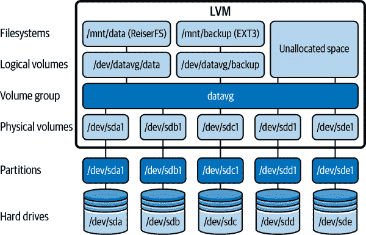

# 第七章：管理存储

在本章中，你将学习如何向系统添加存储空间。你将看到如何向系统添加新的磁盘驱动器并使其可用。你还将探索逻辑卷管理器以及如何操作逻辑卷，以及了解磁盘格式化、分区和挂载。

在第一节中，我涵盖了一些与磁盘、文件系统、卷、分区、目录和文件系统挂载相关的一般概念。

# 管理 Linux 存储

近年来，磁盘空间的价格大幅降低，因此空间不再是一种高价值商品。你可以以每千兆字节几美元的价格购买多 TB 的磁盘。因此，系统管理员很少需要威胁实施磁盘空间配额或其他任意限制。工作站和笔记本电脑通常拥有与服务器一样多的空间，因此空间不再是稀缺资源，管理起来也比几年前容易得多。例如，许多系统管理员现在放弃了像磁带这样的旧备份方法，转而使用更快更便宜的磁盘对磁盘备份。

尽管磁盘空间便宜且充足，系统管理员仍然需要监控用户的磁盘使用情况。你不希望个人在共享磁盘空间或主目录中填满他们的音乐、视频或其他大文件，因为这会浪费公司拥有的空间并延长备份时间。本节讨论与磁盘相关的术语及 Linux 系统管理员如何解释这些术语。如何处理每个条目的具体细节将在本章后面介绍。

## 磁盘

硬盘（磁盘驱动器）是我们称为硬盘驱动器或硬盘驱动器（HDD）的设备，但*磁盘*也可以指固态硬盘（SSD）和 USB 闪存驱动器。系统管理员通过内部连接、USB 连接或以太网或光纤电缆等网络技术将整个磁盘提供给 Linux 系统。在 Linux 系统上访问磁盘之前，系统管理员必须将磁盘挂载到一个目录上。例如，要挂载系统标识为*/dev/sdd*的新磁盘，系统管理员会创建一个新目录，例如*/software*，并将整个磁盘挂载到该目录或*挂载点*上：

```
$ sudo mount /dev/sdd1 /software
```

磁盘设备 */dev/sdd1* 现在挂载在目录 */software* 上并且可以访问。

###### 小贴士

整个磁盘设备是*/dev/sdd*，但初始化磁盘至少需要一个分区，因此如果磁盘*/dev/sdd*只有一个分区，其名称将为*/dev/sdd1*。本章后面会详细介绍这个过程。

一旦管理员通过分区并在其上建立文件系统准备好磁盘，用户可以访问提供给他们的空间。

## 文件系统

*文件系统* 是操作系统允许进行文件存储和检索的组织结构。文件系统是操作系统用来跟踪磁盘或分区上文件的数据结构。它决定了文件在磁盘上的组织方式。文件系统可以是一个分区或整个磁盘，用来存储文件。

当代 Linux 系统为管理员提供了广泛的文件系统选择，尽管许多系统管理员在创建新分区时仍然选择 ZFS、XFS 或 ext4。还有许多其他适用于特定需求和应用程序的文件系统。

## 挂载和挂载点

只有根用户或具有`sudo`权限的用户可以挂载文件系统。在目录上挂载文件系统大致相当于在 Windows 中给磁盘分配驱动器号。Linux 使用目录而不是驱动器号，这些目录被称为挂载点。例如，在“Disks”章节的示例中，一个新的磁盘 */dev/sdd* 被挂载在目录 */software* 上。*/software* 就是挂载点。

Linux 系统提供一个通用的挂载点 */mnt*，您可以暂时将磁盘挂载到此处。不应该将 */mnt* 目录用作永久挂载点，因为另一个系统管理员可能会在其上挂载另一个文件系统，隐藏原始内容。

挂载点不必是根目录下的目录，它们可以是子目录。例如，您可以将 */dev/sdd* 磁盘挂载到 */opt/software*：

```
$ sudo mount /dev/sdd1 /opt/software
```

###### 小贴士

在挂载磁盘或文件系统之前，必须存在挂载点（目录）。

挂载点目录并没有什么特别之处，它与文件系统上的任何其他目录一样。创建一个新目录，设置其权限，然后将文件系统或磁盘挂载到该目录上。

###### 警告

不要将文件系统或磁盘挂载到现有的系统目录，如 */tmp*、*/var*、*/usr*、*/etc* 等。这样做会导致系统行为不稳定，可能会造成灾难性故障。

要使磁盘在启动时自动挂载，必须在 */etc/fstab* 文件中创建一个条目，包括新磁盘或文件系统以及挂载点。例如，要将 */dev/sdd1* 分区自动挂载到 */opt/software* 目录，*/etc/fstab* 条目如下所示：

```
UUID=324ddbc2-353b-4221-a80e-49ec356678dc /opt/software    xfs    defaults    0 0
```

如果您不创建这个条目，*/dev/sdd1* 将不会在重新启动时自动挂载。如果这是您的意图或者只有少量系统，这不是问题，但如果您管理数十或数百个系统，则需要为希望自动挂载的每个文件系统或磁盘设置 */etc/fstab*。

## 物理和逻辑卷

当系统管理员谈论物理和逻辑卷时，他们指的是逻辑卷管理（LVM）。Figure 7-1 展示了逻辑卷管理器的视觉参考。物理卷是由逻辑卷管理的分区或磁盘。物理卷看起来和磁盘分区完全一样。例如，分区 */dev/sdd1* 也是物理卷 */dev/sdd1*。



###### 图 7-1\. 逻辑卷管理器

卷组包含物理卷。逻辑卷相当于磁盘上的分区，但您可以从卷组创建逻辑卷分区。逻辑卷包含命名的文件系统，这些名称可以是描述性的。

另一种思考逻辑卷的方式是卷组类似于磁盘，逻辑卷类似于磁盘分区。

将物理卷抽象为逻辑卷的优点在于，您可以跨多个磁盘创建大型卷组，并且可以动态调整（缩小和扩展）逻辑卷的大小，而无需将系统脱机执行此操作。

## 检查空间

系统管理员应密切关注磁盘空间使用情况。如果系统出现问题，例如缓冲区溢出，日志文件可能会增长以填充文件系统。用户经常使用非工作文件填充文件系统和共享空间。开发人员也经常下载吉字节的代码和其他文件，而没有与系统管理员或其他人讨论他们的需求。您可以使用*磁盘空闲*（`df`）命令快速检查磁盘空间：

```
$ df -h
Filesystem           Size  Used Avail Use% Mounted on
/dev/mapper/cl-root  6.2G  3.3G  3.0G  53% /
/dev/sdb1            1.5G   43M  1.4G   3% /opt/software
/dev/sda1            976M  250M  660M  28% /boot
```

`df`命令可以一目了然地了解挂载文件系统上的可用空间。`-h`选项表示人类可读，即`M`表示兆字节，`G`表示千兆字节等。监控系统或您自己的脚本可以提醒您文件系统是否超过了给定的阈值。例如，设置 90%的阈值将触发警报，指示特定文件系统的容量达到或超过 90%。

使用`du`命令非常方便，可以检查单个目录，并提供空间消耗的详细信息。例如，以下命令检查*/var/log*目录消耗的空间：

```
$ sudo du -h /var/log
0    /var/log/private
0    /var/log/samba/old
0    /var/log/samba
36K    /var/log/sssd
28K    /var/log/tuned
2.3M    /var/log/audit
0    /var/log/chrony
3.3M    /var/log/anaconda
10M    /var/log
```

您可以一目了然地查看哪些目录占用了最多的磁盘空间。如果您在删除不需要的文件之前对系统的磁盘空间进行审计，这一点非常重要。

## **交换空间**

交换空间是 Linux 特殊类型的磁盘分区，可以将系统的内存扩展到物理随机存取内存（RAM）的限制之外。系统内核使用交换空间将内存中的非活动程序写入磁盘，为活动程序释放内存。如果用户或进程激活这些被交换的程序，系统会从磁盘将它们写回内存。

扩展交换空间不是解决内存问题的良方。如果您的系统存在内存限制，一个被接受的解决方案是增加物理 RAM，而不是增加交换空间或添加另一个交换分区。系统过度使用交换空间会导致一种称为*抖动*的情况。抖动发生在运行太多程序时，交换分区太小，或系统的物理 RAM 不足以支持其进程时。

本章后面将讨论如何创建和管理交换空间。

## **基于 RAM 的临时空间（ramfs 和 tmpfs）**

*Ramfs* 和 *tmpfs* 是一种将文件保存在内存中而不写入磁盘的文件系统。*tmpfs* 是较新且首选的基于 RAM 的临时文件系统，也是所有现代 Linux 发行版的默认选择。*ramfs* 转向 *tmpfs* 的一个原因是 *ramfs* 允许自身填满到容量限制。*tmpfs* 通过限制检查来防止达到最大容量。*tmpfs* 还增加了将文件写入可用交换空间以节省资源的功能。

以下清单分别显示了 CentOS 和 Ubuntu 系统上 *tmpfs* 的挂载信息：

```
$ mount | grep tmpfs
devtmpfs on /dev type devtmpfs (rw,nosuid,seclabel,size=397220k,nr_inodes=9930...
tmpfs on /dev/shm type tmpfs (rw,nosuid,nodev,seclabel)
tmpfs on /run type tmpfs (rw,nosuid,nodev,seclabel,mode=755)
tmpfs on /sys/fs/cgroup type tmpfs (ro,nosuid,nodev,noexec,seclabel,mode=755)
tmpfs on /run/user/1000 type tmpfs (rw,nosuid,nodev,relatime,seclabel,size=828...

$ mount | grep tmpfs
udev on /dev type devtmpfs (rw,nosuid,noexec,relatime,size=456144k,nr_inodes=1...
tmpfs on /run type tmpfs (rw,nosuid,nodev,noexec,relatime,size=100480k,mode=755)
tmpfs on /dev/shm type tmpfs (rw,nosuid,nodev)
tmpfs on /run/lock type tmpfs (rw,nosuid,nodev,noexec,relatime,size=5120k)
tmpfs on /sys/fs/cgroup type tmpfs (ro,nosuid,nodev,noexec,mode=755)
tmpfs on /run/snapd/ns type tmpfs (rw,nosuid,nodev,noexec,relatime,size=100480...
tmpfs on /run/user/1000 type tmpfs (rw,nosuid,nodev,relatime,size=100480k,mode...
```

*tmpfs* 的目的是将临时文件和缓存写入内存而不是磁盘，因为 RAM 与磁盘之间的速度差异。RAM 比最快的 SSD 快得多。*tmpfs* 的缺点是，如果重新启动或卸载 *tmpfs*，则在其中存储的数据将丢失。程序、进程和用户都可以向这个临时空间写入数据。类似于基于磁盘的文件系统，当文件来自任何来源填满分配的空间时会出现 “设备上没有剩余空间” 的警告。

# 向系统添加新磁盘

在本节中，我将向您展示添加新磁盘到系统并准备磁盘以供使用所需的步骤。首先，我描述了如何向物理系统添加磁盘。然后，我演示了使用虚拟磁盘执行相同过程的方法。您还将学习如何在磁盘上创建文件系统，并将其挂载为一个可用的单一目录。我还展示了如何在磁盘上设置逻辑卷。

###### 注意

执行这些系统级功能必须具有 root 权限。

## 安装磁盘

对于具有热插拔磁盘接口的物理系统，您可以在不关闭电源的情况下简单地连接硬盘。如果您的系统没有热插拔接口，请在添加新磁盘之前关闭系统。一旦物理添加了磁盘，请打开系统（如果需要），并登录以设置它。

对于使用虚拟机（VM）的用户，关闭您的虚拟机，添加新磁盘，然后重新启动它。此后，对于物理和虚拟系统，流程是相同的。

###### 注意

我无法演示添加新虚拟磁盘，因为可供选择的虚拟平台太多。通常涉及选择存储、将虚拟磁盘附加到虚拟控制器、调整磁盘大小并保存配置。

## 准备磁盘以供使用

您必须首先确定新磁盘的设备名称。系统会自动分配设备名称。使用 `fdisk` 命令显示所有已附加的磁盘和分区：

```
$ sudo fdisk -l

Disk /dev/sda: 8 GiB, 8589934592 bytes, 16777216 sectors
Units: sectors of 1 * 512 = 512 bytes
Sector size (logical/physical): 512 bytes / 512 bytes
I/O size (minimum/optimal): 512 bytes / 512 bytes
Disklabel type: dos
Disk identifier: 0x38e117ab

Device     Boot   Start      End  Sectors Size Id Type
/dev/sda1  *       2048  2099199  2097152   1G 83 Linux
/dev/sda2       2099200 16777215 14678016   7G 8e Linux LVM

Disk /dev/sdb: 1.5 GiB, 1550843904 bytes, 3028992 sectors
Units: sectors of 1 * 512 = 512 bytes
Sector size (logical/physical): 512 bytes / 512 bytes
I/O size (minimum/optimal): 512 bytes / 512 bytes
Disklabel type: dos
Disk identifier: 0xd268486b
```

在上述清单中，系统将新的磁盘设备标识为 */dev/sdb*。现在，您已经识别出磁盘的设备名称，可以开始使用 `fdisk` 命令初始化它：

```
$ sudo fdisk /dev/sdb

Welcome to fdisk (util-linux 2.32.1).
Changes will remain in memory only, until you decide to write them.
Be careful before using the write command.

Command (m for help): n

Partition type
   p   primary (0 primary, 0 extended, 4 free)
   e   extended (container for logical partitions)
Select (default p): <ENTER>
Partition number (1-4, default 1): <ENTER>
First sector (2048-3028991, default 2048): <ENTER>
Last sector, +sectors or +size{K,M,G,T,P} (2048-3028991, default 3028991): <EN...

Created a new partition 1 of type 'Linux' and of size 1.5 GiB.

Command (m for help): w

The partition table has been altered.
Failed to add partition 1 to system: Device or resource busy

The kernel still uses the old partitions. The new table will be used at the ne...
Syncing disks.

$ sudo fdisk -l
Disk /dev/sda: 8 GiB, 8589934592 bytes, 16777216 sectors
Units: sectors of 1 * 512 = 512 bytes
Sector size (logical/physical): 512 bytes / 512 bytes
I/O size (minimum/optimal): 512 bytes / 512 bytes
Disklabel type: dos
Disk identifier: 0x38e117ab

Device     Boot   Start      End  Sectors Size Id Type
/dev/sda1  *       2048  2099199  2097152   1G 83 Linux
/dev/sda2       2099200 16777215 14678016   7G 8e Linux LVM

Disk /dev/sdb: 1.5 GiB, 1550843904 bytes, 3028992 sectors
Units: sectors of 1 * 512 = 512 bytes
Sector size (logical/physical): 512 bytes / 512 bytes
I/O size (minimum/optimal): 512 bytes / 512 bytes
Disklabel type: dos
Disk identifier: 0xd268486b

Device     Boot Start     End Sectors  Size Id Type
/dev/sdb1        2048 3028991 3026944  1.5G 83 Linux
```

您可以忽略 `Failed to add partition 1 to system: Device or resource busy` 的消息。您可以看到系统上确实存在分区 */dev/sdb1*。您已初始化了磁盘并创建了分区 */dev/sdb1*。现在必须创建文件系统。以下命令使用 XFS 格式化 */dev/sdb1* 分区：

```
$ sudo mkfs.xfs /dev/sdb1
meta-data=/dev/sdb1              isize=512    agcount=4, agsize=94592 blks
         =                       sectsz=512   attr=2, projid32bit=1
         =                       crc=1        finobt=1, sparse=1, rmapbt=0
         =                       reflink=1
data     =                       bsize=4096   blocks=378368, imaxpct=25
         =                       sunit=0      swidth=0 blks
naming   =version 2              bsize=4096   ascii-ci=0, ftype=1
log      =internal log           bsize=4096   blocks=2560, version=2
         =                       sectsz=512   sunit=0 blks, lazy-count=1
realtime =none                   extsz=4096   blocks=0, rtextents=0
```

以下命令列出所有块设备和文件系统：

```
$ sudo lsblk -f
NAME        FSTYPE            LABEL UUID      MOUNTPOINT
loop0       squashfs                          /var/lib/snapd/snap/asciinema/16
loop1       squashfs                          /var/lib/snapd/snap/core/10577
loop2       squashfs                          /var/lib/snapd/snap/core/10583
sda                                                                  
├─sda1      ext4              1825fee2...     /boot
└─sda2      LVM2_member       PqHcgi-X...
  ├─cl-root xfs               41b93d34...     /
  └─cl-swap swap              6b31789a...     [SWAP]
sdb                                                                 
└─sdb1      xfs               ca2701e0... 
sr0
```

`lsblk` 命令还显示设备的通用唯一标识符（UUID），这是磁盘准备过程的最后一步：挂载文件系统。

###### 提示

您还可以通过将设备名称作为参数发出 `blkid` 命令来显示 UUID：

```
$ sudo blkid /dev/sdb1
```

接下来，在你想要挂载新分区的目录上创建一个目录。在本例中，我使用 */opt/software* 作为挂载点：

```
$ sudo mkdir /opt/software
```

将 */dev/sdb1* 分区挂载到 */opt/software* 目录：

```
$ sudo mount /dev/sdb1 /opt/software
```

通过不带任何开关的 `mount` 命令检查上述 `mount` 命令是否正常工作：

```
$ mount | grep sdb1
/dev/sdb1 on /opt/software type xfs (rw,relatime,seclabel,attr2,inode64,logbuf...
```

分区 */dev/sdb1* 成功挂载到 */opt/software*。现在你需要使这个挂载“永久”，也就是在系统重启后仍然存在。编辑 */etc/fstab* 文件并输入以下信息：

```
UUID=ca2701e0-3e75-4930-b14e-d83e19a5cffb /opt/software    xfs    defaults    0 0
```

保存文件。*/dev/sdb1* 分区将在系统重启后自动挂载。基于 Debian 的系统对 */etc/fstab* 语法处理略有不同。在 Ubuntu 系统上，此 */etc/fstab* 条目如下所示：

```
/dev/disk/by-uuid/ca2701e0-3e75-4930-b14e-d83e1... /opt/software xfs defaults 0 0
```

若要允许用户访问驱动器，请修改 */opt/software* 的权限或创建具有适当权限的子目录。

## 实施逻辑卷

逻辑卷在分配磁盘空间方面提供了很大的灵活性。可以调整在线分区大小的能力是一个重要特性，因为添加或删除分区的磁盘空间不需要系统停机。但在调整逻辑卷大小时，仍然应该安排维护窗口，因为在过程中仍存在潜在的问题可能性。如果出现错误，可能会丢失数据或可能不得不重建整个逻辑卷。灾难发生的可能性虽小，但确实存在。

调整大小并不是逻辑卷的唯一显著特征。逻辑卷可以跨磁盘扩展，这意味着您可以从多个磁盘创建非常大的逻辑卷。几年前，管理员不愿创建跨多个磁盘的卷，因为旋转机械硬盘容易出现故障。但使用 SSD 降低了“不跨越”的规则。SSD 也会出现故障，但它们的寿命和可靠性使必要时跨越变得更加合理。

本节演示如何从原始磁盘设置逻辑卷。（您可以将当前使用的磁盘转换为逻辑卷，但这将导致数据丢失。）

### 识别可用磁盘

要检查系统中可用的（未使用的）磁盘或要转换为逻辑卷的磁盘，请使用 `lsblk` 命令：

```
$ lsblk
NAME        MAJ:MIN RM  SIZE RO TYPE MOUNTPOINT
loop0         7:0    0  8.5M  1 loop /var/lib/snapd/snap/asciinema/16
loop1         7:1    0 97.9M  1 loop /var/lib/snapd/snap/core/10577
loop2         7:2    0 97.9M  1 loop /var/lib/snapd/snap/core/10583
sda           8:0    0    8G  0 disk
├─sda1        8:1    0    1G  0 part /boot
└─sda2        8:2    0    7G  0 part
  ├─cl-root 253:0    0  6.2G  0 lvm  /
  └─cl-swap 253:1    0  820M  0 lvm  [SWAP]
sdb           8:16   0  1.5G  0 disk
sr0          11:0    1 1024M  0 rom
```

从列表中，包含磁盘的那一行显示，`sdb`在线并可供使用：

```
sdb           8:16   0  1.5G  0 disk
```

首先，您必须创建物理卷（PV），这是您将构建逻辑卷的基本块设备。使用`pvcreate`命令和设备名称初始化磁盘作为物理卷：

```
$ sudo pvcreate /dev/sdb
WARNING: dos signature detected on /dev/sdb at offset 510\. Wipe it? [y/n]: y
  Wiping dos signature on /dev/sdb.
  Physical volume "/dev/sdb" successfully created.
```

使用`pvs`（PV Show）命令列出所有物理卷，并确认`/dev/sdb`是否在其中：

```
$ sudo pvs
  PV         VG Fmt  Attr PSize  PFree
  /dev/sda2  cl lvm2 a--  <7.00g    0
  /dev/sdb      lvm2 ---   1.44g 1.44g
```

使用`pvdisplay`命令查看有关物理卷的详细信息：

```
$ sudo pvdisplay /dev/sdb
  "/dev/sdb" is a new physical volume of "1.44 GiB"
  --- NEW Physical volume ---
  PV Name               /dev/sdb
  VG Name              
  PV Size               1.44 GiB
  Allocatable           NO
  PE Size               0  
  Total PE              0
  Free PE               0
  Allocated PE          0
  PV UUID               yl6k0u-cymt-p4jd-VXro-Lit1-EkLe-Jqjc94
```

###### 警告

如果在尝试使用`pvcreate`时您的磁盘或文件系统已经被挂载，您将收到以下错误：

```
$ sudo pvcreate /dev/sdb
  Can't open /dev/sdb exclusively.  Mounted filesystem?
```

在继续之前，您需要卸载`/dev/sdb`（`umount /dev/sdb`）。

第二步是使用`vgcreate`命令从物理卷`/dev/sdb`创建卷组（VG）。像我在这里用`vgsw`这样的名称给 VG 一个名称：

```
$ sudo vgcreate vgsw /dev/sdb
  Volume group "vgsw" successfully created

$ sudo vgs
  VG   #PV #LV #SN Attr   VSize  VFree
  cl     1   2   0 wz--n- <7.00g    0
  vgsw   1   0   0 wz--n-  1.44g 1.44g

$ sudo vgdisplay vgsw
  --- Volume group ---
  VG Name               vgsw
  System ID            
  Format                lvm2
  Metadata Areas        1
  Metadata Sequence No  1
  VG Access             read/write
  VG Status             resizable
  MAX LV                0
  Cur LV                0
  Open LV               0
  Max PV                0
  Cur PV                1
  Act PV                1
  VG Size               1.44 GiB
  PE Size               4.00 MiB
  Total PE              369
  Alloc PE / Size       0 / 0  
  Free  PE / Size       369 / 1.44 GiB
  VG UUID               AsQkWT-UpSu-3dYk-5EWT-DbQR-SovE-2oAmlR
```

如图 7-1 节 所示，您可以从物理卷创建卷组。在这个演示中，我只使用了一个物理卷。现在您有了一个卷组，必须创建逻辑卷。创建逻辑卷是此过程的第三步。

对于此演示，我首先决定分配给逻辑卷多少空间。我决定使用 1.5 GB 磁盘的 1 GB 空间。现在是使用`lvcreate`命令创建逻辑卷的时候了。

`lvcreate`命令的一般语法如下：

```
$ sudo lvcreate -L *size* -n *lvname* vg
```

您必须以 GB 或 MB 的形式提供大小参数，分别添加后缀`G`或`M`。 `lvname`是您要为此逻辑卷使用的名称（`software-lv`），您必须提供要从中创建逻辑卷（`software-lv`）的卷组名称（`vgsw`）：

```
$ sudo lvcreate -L 1G -n software-lv vgsw
WARNING: xfs signature detected on /dev/vgsw/software-lv at offset 0\. 
Wipe it? [y/n]: y
  Wiping xfs signature on /dev/vgsw/software-lv.
  Logical volume "software-lv" created.
```

根据前面的消息，您可以看到磁盘或分区之前曾拥有`xfs signature`，这意味着它不是新磁盘或分区，而是重新利用的磁盘。

###### 注意

使用先前使用的磁盘没有问题，但请意识到在此过程中，所有信息都将被覆盖且无法恢复。

使用`lvs`和`lvdisplay`命令列出有关您的逻辑卷的详细信息：

```
$ sudo lvs
  LV          VG   Attr         LSize   Pool Origin Data%  Meta%  Move Log ...
  root        cl   -wi-ao----  <6.20g
  swap        cl   -wi-ao---- 820.00m
  software-lv vgsw -wi-a-----   1.00g

$ sudo lvdisplay /dev/vgsw/software-lv
  --- Logical volume ---
  LV Path                /dev/vgsw/software-lv
  LV Name                software-lv
  VG Name                vgsw
  LV UUID                ebB3ST-3E7k-BShG-8oPi-sj0c-yXXr-C7EgAw
  LV Write Access        read/write
  LV Creation host, time server1, 2021-12-10 07:34:56 -0600
  LV Status              available
  # open                 0
  LV Size                1.00 GiB
  Current LE             256
  Segments               1
  Allocation             inherit
  Read ahead sectors     auto
  - currently set to     8192
  Block device           253:2
```

###### 注意

当您按逻辑卷名称筛选时，必须使用逻辑卷设备的完整路径（`/dev/vgsw/software-lv`）：

```
$ sudo lvs /dev/vgsw/software-lv
  LV     VG   Attr            LSize Pool Origin ...
  software-lv vgsw -wi-a----- 1.00g
```

此过程的第四步是在您的逻辑卷上创建文件系统。您通过使用与任何分区相同的命令来执行此任务：

```
$ sudo mkfs.xfs /dev/vgsw/software-lv
meta-data=/dev/vgsw/software-lv  isize=512    agcount=4, agsize=65536 blks
         =                       sectsz=512   attr=2, projid32bit=1
         =                       crc=1        finobt=1, sparse=1, rmapbt=0
         =                       reflink=1
data     =                       bsize=4096   blocks=262144, imaxpct=25
         =                       sunit=0      swidth=0 blks
naming   =version 2              bsize=4096   ascii-ci=0, ftype=1
log      =internal log           bsize=4096   blocks=2560, version=2
         =                       sectsz=512   sunit=0 blks, lazy-count=1
realtime =none                   extsz=4096   blocks=0, rtextents=0
```

为您的文件系统创建挂载点：

```
$ sudo mkdir /sw
```

挂载文件系统到挂载点：

```
$ sudo mount /dev/vgsw/software-lv /sw

$ mount | grep software
/dev/mapper/vgsw-software--lv on /sw type xfs  \
(rw,relatime,seclabel,attr2,inode64,logbufs=8,logbsize=32k,noquota)
```

检查设备上的可用空间：

```
$ df -h /sw
Filesystem                     Size  Used Avail Use% Mounted on
/dev/mapper/vgsw-software--lv 1014M   40M  975M   4% /sw
```

最后一步是将文件系统及其挂载点添加到`/etc/fstab`，以便在启动时自动挂载逻辑卷。我的条目看起来如下：

```
/dev/vgsw/software-lv /sw       xfs     defaults        0 0
```

###### 注意

不要在`/etc/fstab`中使用 UUID 来定义逻辑卷，而是使用设备名称（`/dev/vgsw/software-lv`）。

逻辑卷将在重新启动时自动挂载。下一部分描述如何增加或扩展逻辑卷的大小。

### 扩展逻辑卷

对于我在此场景中配置的逻辑卷，我使用了总磁盘大小为 1.5 GB 中的 1 GB 用于 */dev/vgsw/software-lv*。要扩展此卷，您可以使用以下一般命令之一：

```
$ sudo lvextend -L +size(M or G) *lvname*
$ sudo lvextend -l +100%FREE *lvname*
```

在本例中，我将使用`-l`（extent）选项而不是特定大小来使用设备上剩余的空闲空间：

```
$ df -h /sw
Filesystem                     Size  Used Avail Use% Mounted on
/dev/mapper/vgsw-software--lv 1014M   40M  975M   4% /sw

$ sudo lvextend -l +100%FREE /dev/vgsw/software-lv

$ sudo lvextend -l +100%FREE /dev/vgsw/software-lv
Size of logical volume vgsw/software-lv changed from 1.00 GiB (256 extents) 
to 1.44 GiB (369 extents).
Logical volume vgsw/software-lv successfully resized.
```

`lvextend`命令将逻辑卷扩展到其最大容量，但`df`显示的可用空间量相同：

```
$ df -h /sw
Filesystem                     Size  Used Avail Use% Mounted on
/dev/mapper/vgsw-software--lv 1014M   40M  975M   4% /sw
```

您已扩展了逻辑卷但未扩展文件系统。现在使用`xfs_growfs`命令且不带大小参数来调整文件系统大小。通过不使用`-D size`指定大小参数，`xfs_growfs`将文件系统扩展到其最大值：

```
$ sudo xfs_growfs /dev/vgsw/software-lv
meta-data=/dev/mapper/vgsw-software--lv isize=512    agcount=4, agsize=65536 blks
         =                              sectsz=512   attr=2, projid32bit=1
         =                              crc=1        finobt=1, sparse=1, rmapbt=0
         =                              reflink=1
data     =                              bsize=4096   blocks=262144, imaxpct=25
         =                              sunit=0      swidth=0 blks
naming   =version 2                     bsize=4096   ascii-ci=0, ftype=1
log      =internal log                  bsize=4096   blocks=2560, version=2
         =                              sectsz=512   sunit=0 blks, lazy-count=1
realtime =none                          extsz=4096   blocks=0, rtextents=0
data blocks changed from 262144 to 377856

$ df -h /sw
Filesystem                     Size  Used Avail Use% Mounted on
/dev/mapper/vgsw-software--lv  1.5G   43M  1.4G   3% /sw
```

###### 注意

您无法缩小 XFS 卷。

您已成功扩展文件系统，逻辑卷已准备就绪。由于文件系统开销，实际可用大小为 1.44 GB（在前面的示例中显示为`1.4G`）。

# 退役和磁盘处理

退役包括在处理前擦除或销毁磁盘。退役过程因公司而异，但通常遵循以下步骤：

+   通知

+   “尖叫”测试

+   断电

+   磁盘擦除

+   解除架设

+   托盘装载

+   处置

每个步骤的时间表各不相同。以下各节详细说明每个步骤的细节。

## 通知

利益相关者、系统管理员、网络管理员、存储管理员和管理层都会收到多个系统退役通知的列表。大公司通常每周发送一次列表，持续三到四周（实际时间因公司而异，是一种政策问题）。这些通知使利益相关者和其他人有机会通过电子邮件接管系统或阻止其退役，并在治理会议期间进行讨论。如果没有人代表任何列出的系统发言，则该过程将进入“尖叫”测试阶段。

## 尖叫测试

所谓的“尖叫”测试是指系统管理员或数据中心工作人员从网络中拔出指定系统，但未将列出的系统断电。计划是在此期间，如果有人因系统停机而尖叫，系统将被重新连接到网络，并且其运行将继续如以前一样。下次治理会议将从退役列表中移除该系统。

## 断电

退役过程的下一个里程碑是断电阶段，持续两周或更长时间。系统管理员将所有列出的系统断电。这段时间是有兴趣方第二次索要系统或通知治理委员会需要继续运行该系统的机会。

## 磁盘擦除

经过几周的通知和等待后，治理委员会最终确定名单，并将其提交给系统管理员进行磁盘抹除。系统管理员启动每个系统并使用磁盘抹除实用程序覆盖每个本地磁盘。此过程不包括利用或共享的存储，如存储区域网络（SAN）、网络附加存储（NAS）或非本地磁盘存储。此过程确保系统本地存储上没有遗留数据。

###### 注意

多年来，我一直依赖于[DariK 的引导和抹掉（DBAN）实用程序](https://oreil.ly/PnMgA)来清除要退役和处置的硬盘。这是一个免费的开源实用工具，适用于硬盘驱动器（HDDs）。这个产品*不*适用于固态驱动器（SSDs）。

## 卸架和托盘化

一旦系统的磁盘被抹除，名单就会提交给数据中心人员进行卸架。技术人员从数据中心机架中移除系统，并将其放置在运输托盘上。一旦托盘满了，技术人员会标记它，并将其放入处置队列。

## 处置

处置过程可能涉及竞标，其中公司批量购买托盘化系统以供销售或再部署。有时这些系统会被送往回收设施，技术人员会移除硬盘、CPU、内存和其他可回收部件，以供个别或批量再销售。系统处置也可能意味着整个系统被压碎或粉碎，并作为可回收材料出售。

# 概要

本章涵盖了磁盘管理的多个方面，包括一般与磁盘相关的信息，向系统添加新磁盘，逻辑卷管理，以及退役和处置。

在下一章中，我将涵盖系统管理员的两个重要任务：健康和日常管理。
