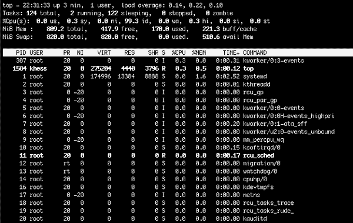
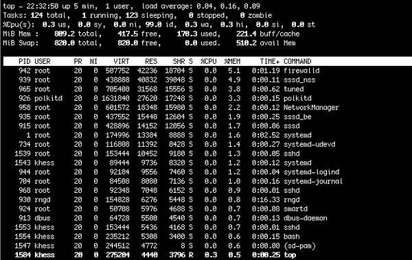
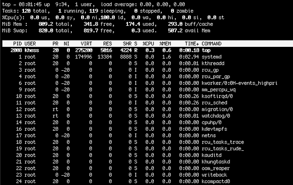
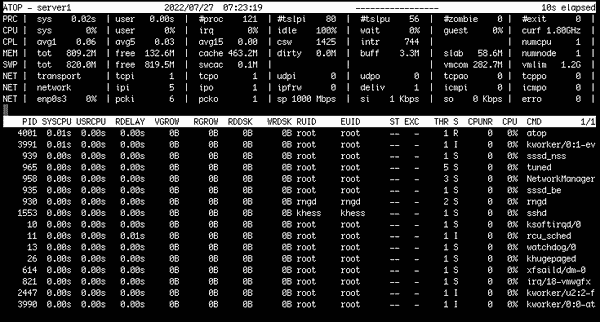
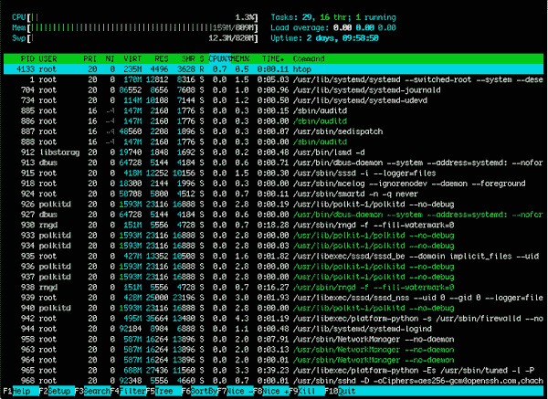
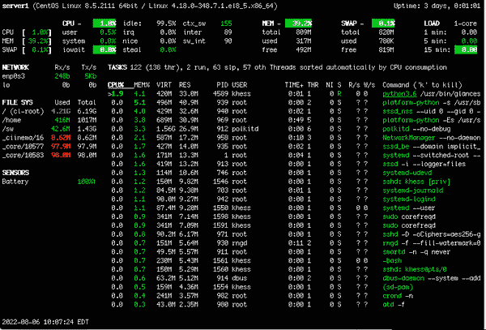

# 第九章：监控您的系统

监控不是可选的。它是必需的。每个系统管理员都必须通过警惕的眼光监视其系统的性能、健康和安全性。手动监视系统并执行其他管理任务是不可能的，因此您必须依赖自动化软件、特定的系统配置和报告系统来更新每个系统的状态。

本章探讨了本地监控工具，并指导您收集系统的性能和健康统计信息。

# 保持对 CPU、内存和磁盘性能和容量的警觉

Linux 系统中的三个主要监控焦点是 CPU、内存和磁盘性能。

###### 注意

本地区域网络（LAN）上的网络容量通常不是什么大问题，尤其是在千兆网络速度下。许多数据中心/服务器房间使用 10 千兆连接，因此系统间通信几乎是即时的，即使是大型备份也没有问题。话虽如此，检查网络性能只需要您几分钟时间，为什么不包括呢？数据存在且可以自由获取，因此请展示它、研究它，并在看到负面趋势时采取行动。

本章重点介绍 CPU、内存和磁盘的性能和容量。

## 跟踪 CPU 使用率

CPU 通常位于系统组件列表的顶部，需要监视。它处于顶部是因为它是系统的动力源。如果您的系统 CPU 持续运行在 80%以上的利用率，可能是系统没有足够的 CPU 来支持操作系统和所有运行的应用程序。还有可能是应用程序编码问题或安全漏洞问题导致 CPU 利用率进入“红色”区域。

有许多可用工具可帮助您监视和评估 CPU 利用率。最简单和最常见的是`top`和`ps`命令，它们是每个 Linux 发行版的标准构建的一部分。

### top 命令

作为系统管理员，您可能遇到过`top`或其相关命令之一，如`atop`或`htop`。`top`实用程序在大多数 Linux 发行版中是标准的，但您需要从发行版的存储库安装`atop`和`htop`软件包。`top`命令提供了实时查看系统“顶级”进程的视图。默认情况下，`top`列出了消耗 CPU 最多的进程。

#### top

所有用户可以使用`top`命令，并从 CPU（默认）更改排序选项到内存、时间和 PID，如图 9-1 所示。



###### 图 9-1\. 按% CPU 排序的 top 命令

使用 Shift + M 切换到内存使用模式，如图 9-2 所示。



###### 图 9-2\. 按内存消耗排序的 top 命令

要查看进程运行了多长时间，请使用 Shift + S 来按时间排序，如 图 9-3 所示。



###### 图 9-3\. 按时间排序的顶部进程

表 9-1 提供了一些 `top` 的排序选项的键盘快捷键。

表 9-1\. 一些排序选项的键盘快捷键

| Key | Sorting |
| --- | --- |
| Shift + M | `%MEM`（内存使用率） |
| Shift + P | `%CPU`（CPU 使用率 - 默认） |
| Shift + S | `TIME`（运行时间） |

浏览 `top` 的输出，你可能发现很难知道哪个值是焦点。因此，通常需要使用其中一个键盘快捷键来应用已知的排序方案以重置你的视图。如果我忘记了正在运行的排序方案，我会循环查看 CPU、内存和时间来检查。

标准的 `top` 命令很有用，但对于许多系统管理员来说，显示的信息并不足以支持明智的决策。`atop` 和 `htop` 命令在大多数发行版上默认未安装，但它们提供了更广泛的系统状态视图。

#### `atop`

`atop` 实用程序是一个先进的系统和进程监视器。`atop` 在下方窗格显示标准的顶部进程，但在上方窗格提供 CPU、内存、磁盘和网络性能的洞察，如 图 9-4 所示。



###### 图 9-4\. `atop` 命令

[`atop` 的 man 手册](https://oreil.ly/Fu2Sw) 如下描述 `atop`：

> `atop` 程序是一个交互式监视器，用于查看 Linux 系统的负载情况。它显示系统级别上最关键的硬件资源（从性能角度看），即 CPU、内存、磁盘、LVM、交换空间使用情况和网络。它还显示了哪些进程负责 CPU 和内存负载的指示负载。

你可以作为普通用户或 root 用户运行 `atop`。根据命令是由哪个用户（普通用户还是 root 用户）执行的，命令将显示一条消息，告知你当前使用的模式。

作为 root 用户运行时：

```
*** System and Process Activity since Boot ***     Unrestricted view (privileged)
```

作为普通用户运行时：

```
*** System and Process Activity since Boot ***     Restricted view (unprivileged)
```

这两种模式的视图相同。但在受限视图中，有一些你不能执行的操作，比如在非自己拥有的进程上使用 `kill` 命令。正如前面提到的，`atop` 实用程序对系统管理员非常有吸引力，因为它显示了关键系统参数的重点性能值。这些统计数据非常方便，因为你无需搜索特定的性能数据或使用可能昂贵的第三方工具来提取信息。`atop` 实用程序是系统管理员工具箱的重要组成部分。

#### htop

`htop`实用程序是另一个系统性能查看器，显示与标准`top`实用程序相同的信息，但具有彩色编码和方便的命令菜单。如您在图 9-5 中所见，`htop`实用程序的当前使用模式被突出显示（`CPU%`）。当前模式是 CPU 使用率。菜单可帮助执行特定命令，管理员无需记忆每个操作的按键。



###### 图 9-5\. `htop`实用程序在 CPU 使用模式下运行的示意图

### ps

`ps`命令显示有关运行中进程的信息。您可以使用命令选项或开关以不同格式查看自己的进程、所有进程和进程表。`ps`命令在所有 Linux 发行版中都很常见。

要查看您的用户帐户拥有的所有进程，请使用带有`-ux`选项的`ps`命令：

```
$ ps -ux
USER    PID %CPU %MEM    VSZ   RSS TTY    STAT START  TIME COMMAND
khess  1550  0.0  1.1  89444  9600 ?      Ss   Jul31  0:00 /usr/lib/systemd/...
khess  1554  0.0  0.4 244512  3868 ?      S    Jul31  0:00 (sd-pam)
khess  1560  0.0  0.5 153444  4728 ?      S    Jul31  0:00 sshd: khess@pts/0
khess  1561  0.0  0.6 235212  5052 pts/0  Ss   Jul31  0:00 -bash
khess  4698  0.0  0.4 271452  4140 pts/0  R+   08:31  0:00 ps -ux
```

您也可以使用`-aux`开关组合按所有者查看所有进程：

```
$ ps -aux
USER    PID %CPU %MEM    VSZ   RSS TTY    STAT START   TIME COMMAND
root      1  0.0  1.6 174996 13372 ?      Ss   Jul31   0:04 /usr/lib/systemd/...
root      2  0.0  0.0      0     0 ?      S    Jul31   0:00 [kthreadd]
root      3  0.0  0.0      0     0 ?      I<   Jul31   0:00 [rcu_gp]
root      4  0.0  0.0      0     0 ?      I<   Jul31   0:00 [rcu_par_gp]
root      6  0.0  0.0      0     0 ?      I<   Jul31   0:00 [kworker/0:0H...
root      9  0.0  0.0      0     0 ?      I<   Jul31   0:00 [mm_percpu_wq]
```

完整的进程表过长无法在此展示，但您可以从列表中看到，显示的结果按进程 ID（PID）升序显示。前一节的`top`命令是一个动态进程表，您可以按 CPU、内存和其他性能测量排序。

本节中其余的实用程序不像`top`或`ps`命令那样著名，但足够重要，您应该学习并探索每个工具的功能和功能。

### glances

`glances`，如图 9-6，是另一个`top`程序。它是一个跨平台的监控工具。开发者重新排列并着色显示，但信息与您在`htop`实用程序中看到的类似。



###### 图 9-6\. `glances`的动态显示，焦点在`CPU%`

按下 M 键（不需要 Shift 键的快捷键在`glances`中）将焦点从`CPU%`切换到`MEM%`，按 T 键切换到`TIME`。按 C 键返回显示的`CPU%`。

###### 注意

如果您的系统受到 CPU 约束或怀疑受到 CPU 约束，请不要将`glances`用作主要 CPU 性能检查工具，因为它消耗大约 15%的 CPU，而`top`只需 3%–5%。

您也可以在客户端/服务器配置中运行`glances`，导出数据到多种格式，并更改其显示设置。请参阅`glances`的手册页以获取`glances`功能和选项的列表。

## 探索`sysstat`监控

`sysstat`（系统状态）包是一个本地工具。换句话说，它是一个预打包的标准监控工具，在任何 Linux 发行版上都是免费且自由可用的。如果您愿意，可以从源代码编译它，但它通常以软件包形式提供给所有主要发行版。

以下摘自`sysstat`手册页：

> `sysstat`包含用于 Linux 的 sar、sadf、mpstat、iostat、tapestat、pidstat、cifsiostat 工具。
> 
> +   sar 是系统活动报告工具。
> +   
> +   `sadf` 是系统活动数据格式化程序，以多种格式（CSV、XML 等）显示 `sar` 收集的数据。
> +   
> +   `iostat` 是显示 CPU 利用率和磁盘 I/O 统计信息的输入/输出统计工具。
> +   
> +   `tapestat` 显示磁带和磁带驱动器的统计信息。
> +   
> +   `mpstat` 是显示全局和每个处理器统计信息的多处理器统计工具。
> +   
> +   `pidstat` 按进程 ID 报告 Linux 进程的统计信息。
> +   
> +   `cifsiostat` 是 CIFS（Samba/SMB）I/O 统计工具。

## 系统活动报告

`sar` 实用程序是 `sysstat` 命令套件中使用最多的工具。这个系统活动报告工具显示从午夜到当前时间的性能统计数据。默认情况下，`sar` 只显示当天的指标。

您可以将 `sar` 收集的信息保存在二进制格式的文件中。`sar` 报告的统计信息包括 I/O 传输速率、分页、与进程相关的性能、中断、网络活动、内存利用率、交换空间利用率、CPU 利用率、内核活动、TTY 统计等等。 `sysstat` 软件包完全支持单处理器和多处理器系统。

使用 `sar` 命令无选项显示 CPU 统计信息（默认情况下）：

```
$ sar
Linux 4.18.0-348.7.1.el8_5.x86_64 (server1)    09/20/2022     _x86_64_    (1 CPU)

12:00:07 AM     CPU     %user     %nice   %system   %iowait    %steal     %idle
12:10:08 AM     all      0.01      0.20      0.53      0.05      0.00     99.22
12:20:00 AM     all      0.01      0.00      0.25      0.01      0.00     99.74
12:30:01 AM     all      0.00      0.00      0.24      0.01      0.00     99.75
12:40:02 AM     all      0.01      0.00      0.25      0.01      0.00     99.73

...

02:00:04 PM     all      0.01      0.00      0.26      0.01      0.00     99.73
02:10:05 PM     all      0.01      0.01      0.27      0.01      0.00     99.70
02:20:05 PM     all      0.01      0.00      0.26      0.01      0.00     99.72
02:30:06 PM     all      0.01      0.00      0.27      0.01      0.00     99.72
Average:        all      0.01      0.01      0.29      0.01      0.00     99.69
```

您可以使用命令选项过滤 `sar` 的结果。例如，要显示 CPU 统计信息，请使用 `-u` 选项。 `-u` 选项显示与 `sar` 命令无选项相同的结果。添加 `ALL` 关键字以包括所有与 CPU 相关的统计信息：

```
$ sar -u ALL
Linux 4.18.0-348.7.1.el8_5.x86_64 (server1)    09/24/2022     _x86_64_    (1 CPU)

12:00:03 AM   CPU %usr %nice %sys %iowait %steal %irq %soft %guest %gnice %idle
12:10:01 AM   all 0.02 0.00  0.06 0.01    0.00   0.22 0.05  0.00   0.00   99.64
12:20:01 AM   all 0.01 0.00  0.03 0.01    0.00   0.21 0.05  0.00   0.00   99.69
12:30:02 AM   all 0.01 0.00  0.03 0.01    0.00   0.20 0.05  0.00   0.00   99.70
```

`-B` 选项显示分页统计信息：

```
$ sar -B
Linux 4.18.0-348.7.1.el8_5.x86_64 (server1)    09/24/2022     _x86_64_    (1 CPU)
```

`-b` 选项报告 I/O 和传输速率统计信息：

```
$ sar -b
Linux 4.18.0-348.7.1.el8_5.x86_64 (server1)    09/24/2022     _x86_64_    (1 CPU)

12:00:03 AM       tps      rtps      wtps   bread/s   bwrtn/s
12:10:01 AM      0.53      0.13      0.40     11.42      6.52
12:20:01 AM      0.17      0.00      0.17      0.00      1.97
12:30:02 AM      0.16      0.00      0.16      0.00      1.97
12:40:03 AM      0.17      0.00      0.17      0.00      1.99
```

如示例所示，`sar` 命令非常灵活，并有多个选项用于显示系统性能数据。请参阅 `sar` 手册获取详尽的选项列表。下一节将介绍使用 `sadf` 命令以多种格式显示 `sar` 数据。

## 以多种格式显示系统活动数据

`sadf` 命令将 `sar` 数据发送到不同的输出类型，以便将其数据导入数据库或在网页上显示更容易。例如，以下命令以易于导入数据库的格式显示本月 21 日的 `sar` 数据：

```
$ sadf -d /var/log/sa/sa21
# hostname;interval;timestamp;CPU;%user;%nice;%system;%iowait;%steal;%idle
server1;601;2022-09-21 04:10:04 UTC;-1;0.01;0.00;0.28;0.01;0.00;99.70
server1;601;2022-09-21 04:20:05 UTC;-1;0.01;0.00;0.26;0.01;0.00;99.72
server1;601;2022-09-21 04:30:06 UTC;-1;0.01;0.00;0.28;0.01;0.00;99.71
server1;601;2022-09-21 04:40:07 UTC;-1;0.01;0.00;0.27;0.01;0.00;99.71
...
```

除了与历史数据一起使用 `sadf`，还可以与当前数据一起使用：

```
$ sadf -dh -- -p
# hostname;interval;timestamp;CPU;%user;%nice;%system;%iowait;%steal;%idle[...]
server1;598;2022-09-24 04:10:01 UTC;-1;0.02;0.00;0.33;0.01;0.00;99.64
server1;601;2022-09-24 04:20:01 UTC;-1;0.01;0.00;0.30;0.01;0.00;99.69
server1;601;2022-09-24 04:30:02 UTC;-1;0.01;0.00;0.29;0.01;0.00;99.70
server1;600;2022-09-24 04:40:03 UTC;-1;0.01;0.00;0.29;0.01;0.00;99.69
...
```

使用 `sadf` 生成不同数据输出的选项太多，无法在此列出。请在网上搜索更多示例或尝试来自 `sadf` 手册的选项。接下来的章节将处理其他 `sysstat` 实用程序（如 `iostat`、`tapestat`、`mpstat`、`pidstat` 和 `cifsiostat`）的具体统计输出：它们的相关性取决于您的硬件配置。例如，几乎没有任何企业仍在使用磁带驱动器进行备份。

## 使用 `iostat` 监控系统 I/O 设备负载

与其他“stat”命令类似，你看到的第一个指标是从系统上次启动以来的统计摘要或总结指标。通常，你会多次运行 stat 命令以查看当前统计信息，或者使用`-y`选项忽略总结指标。在第一个示例中，包括摘要信息；在第二个示例中，摘要被省略了。

这是包含摘要信息的回应：

```
$ iostat -d 2
Linux 4.18.0-348.7.1.el8_5.x86_64 (server1)    09/24/2022     _x86_64_    (1 CPU)

Device             tps    kB_read/s    kB_wrtn/s    kB_read    kB_wrtn
sda               0.26         1.59         2.05     312698     403049
sdc               0.01         0.04         0.01       8267       2797
sdb               0.00         0.02         0.01       3028       2048
scd0              0.00         0.00         0.00          1          0
dm-0              0.26         1.31         2.12     257071     416372
dm-1              0.00         0.01         0.01       2220       1172
dm-2              0.00         0.01         0.01       1330       2048

Device             tps    kB_read/s    kB_wrtn/s    kB_read    kB_wrtn
sda               0.00         0.00         0.00          0          0
sdc               0.00         0.00         0.00          0          0
sdb               0.00         0.00         0.00          0          0
scd0              0.00         0.00         0.00          0          0
dm-0              0.00         0.00         0.00          0          0
dm-1              0.00         0.00         0.00          0          0
dm-2              0.00         0.00         0.00          0          0

Device             tps    kB_read/s    kB_wrtn/s    kB_read    kB_wrtn
sda               0.00         0.00         0.00          0          0
sdc               0.00         0.00         0.00          0          0
sdb               0.00         0.00         0.00          0          0
scd0              0.00         0.00         0.00          0          0
dm-0              0.00         0.00         0.00          0          0
dm-1              0.00         0.00         0.00          0          0
dm-2              0.00         0.00         0.00          0          0
```

这是不包含摘要信息的回应：

```
$ iostat -y -d 2
Linux 4.18.0-348.7.1.el8_5.x86_64 (server1)    09/24/2022     _x86_64_    (1 CPU)

Device             tps    kB_read/s    kB_wrtn/s    kB_read    kB_wrtn
sda               0.00         0.00         0.00          0          0
sdc               1.00         0.00         0.75          0          1
sdb               0.00         0.00         0.00          0          0
scd0              0.00         0.00         0.00          0          0
dm-0              0.00         0.00         0.00          0          0
dm-1              0.00         0.00         0.00          0          0
dm-2              0.00         0.00         0.00          0          0

Device             tps    kB_read/s    kB_wrtn/s    kB_read    kB_wrtn
sda               0.00         0.00         0.00          0          0
sdc               0.00         0.00         0.00          0          0
sdb               0.00         0.00         0.00          0          0
scd0              0.00         0.00         0.00          0          0
dm-0              0.00         0.00         0.00          0          0
dm-1              0.00         0.00         0.00          0          0
dm-2              0.00         0.00         0.00          0          0

Device             tps    kB_read/s    kB_wrtn/s    kB_read    kB_wrtn
sda               0.00         0.00         0.00          0          0
sdc               0.00         0.00         0.00          0          0
sdb               0.00         0.00         0.00          0          0
scd0              0.00         0.00         0.00          0          0
dm-0              0.00         0.00         0.00          0          0
dm-1              0.00         0.00         0.00          0          0
dm-2              0.00         0.00         0.00          0          0
```

在安静的虚拟机上，统计数据可能并不是很有趣，但至少你能看到该实用程序在报告中产生了哪些指标。与其他`sysstat`实用程序一样，`iostat`有几个选项可以从手册页中获取。

## 使用磁带统计实用程序回到老派

在写这篇文章时，我已经有超过 15 年没有使用磁带驱动器了。虚拟磁带驱动器（将硬盘伪装成磁带驱动器）已经取代了旧的流式磁带系统。我在这里介绍`tapestat`是为了遗留目的，因为总有一个旧的“不支持”的系统上还有一个安装了磁带驱动器的设备。关于它的信息比黄金还要珍贵，你可能需要检索这些信息。本节不会帮助你检索信息，但你可以从其操作中看到一些与磁带驱动器相关的统计数据。

这是我在我的 Linux 虚拟机上运行`tapestat`时收到的响应：

```
$ tapestat
Linux 4.18.0-348.7.1.el8_5.x86_64 (server1)    09/24/2022     _x86_64_    (1 CPU)

No tape drives with statistics found
```

当你输入`tapestat`命令时，你可能会收到的消息。磁带驱动器已经成为历史的一部分，并且不是任何人的“好日子”的一部分。如果你仍在使用它，你的输出将为你提供有趣和有用的统计信息。

## 收集处理器统计信息

使用`mpstat`（多处理器统计）实用程序，你可以显示系统的多处理器和单处理器统计信息。使用`mpstat`命令而无选项显示所有处理器的摘要：

```
$ mpstat
Linux 5.4.0-125-generic (server2)     09/25/2022     _x86_64_    (2 CPU)

10:06:16 AM  CPU  %usr %nice %sys %iowait %irq  %soft %steal %guest %gnice  %idle
10:06:16 AM  all  0.92  0.01  0.91 0.20   0.00  0.25  0.00    0.00   0.00   97.72
```

系统中包含两个处理器，因此可以查看各个处理器的性能。通过指定选项`-P`和处理器编号来查看各个处理器。请记住，处理器编号从`0`开始。对于双处理器系统，有处理器`0`和处理器`1`。以下命令显示处理器`1`的统计信息：

```
$ mpstat -P 1
Linux 5.4.0-125-generic (server2)     09/25/2022     _x86_64_    (2 CPU)

10:12:43 AM  CPU  %usr %nice  %sys %iowait %irq %soft %steal %guest %gnice  %idle
10:12:43 AM    1  0.71  0.01  0.64  0.14   0.00  0.08  0.00   0.00   0.00   98.43
```

你还可以通过指定`ALL`选项查看所有处理器：

```
$ mpstat -P ALL
Linux 5.4.0-125-generic (server2)     09/25/2022     _x86_64_    (2 CPU)

09:56:28 AM  CPU  %usr  %nice  %sys %iowait %irq %soft %steal %guest %gnice %idle
09:56:28 AM  all  2.05  0.02   2.01  0.44   0.00  0.44  0.00   0.00   0.00  95.05
09:56:28 AM    0  1.93  0.02   2.11  0.44   0.00  0.65  0.00   0.00   0.00  94.84
09:56:28 AM    1  2.16  0.02   1.91  0.43   0.00  0.22  0.00   0.00   0.00  95.25
```

与其他“stat”命令类似，你可以请求在几秒钟的间隔和指定的迭代次数内显示。例如，以下命令每五秒执行一次`mpstat`，迭代三次：

```
$ mpstat 5 3
Linux 5.4.0-125-generic (server2)     09/25/2022     _x86_64_    (2 CPU)

10:26:53 AM  CPU  %usr %nice %sys  %iowait %irq %soft %steal %guest %gnice  %idle
10:26:58 AM  all   0.00  0.00 0.00  0.00    0.00 0.10  0.00    0.00  0.00   99.90
10:27:03 AM  all   0.00  0.00 0.00  0.00    0.00 0.10  0.00    0.00  0.00   99.90
10:27:08 AM  all   0.00  0.00 0.00  0.00    0.00 0.00  0.00    0.00  0.00  100.00
Average:     all   0.00  0.00 0.00  0.00    0.00 0.07  0.00    0.00  0.00   99.93
```

在更忙碌的系统上，数字会更具信息性。你可以确定特定处理器是否在或超过容量，并选择性地将进程绑定到其他处理器以减轻对`CPU0`的压力。接下来的实用程序`pidstat`显示特定进程绑定到哪个处理器。

## 使用 pidstat 监视 Linux 任务

`pidstat`命令用于监视当前由 Linux 内核管理的单个任务。默认命令，未传递任何选项给它，仅在报告中显示活动任务（具有非零统计值的任务）：

```
$ pidstat
Linux 5.4.0-125-generic (server2)     09/25/2022     _x86_64_    (2 CPU)

11:19:08 AM   UID   PID   %usr %system  %guest   %wait   %CPU   CPU  Command
11:19:08 AM    0     1    0.02   0.04    0.00     0.01    0.06    0  systemd
11:19:08 AM    0     2    0.00   0.00    0.00     0.00    0.00    1  kthreadd
11:19:08 AM    0    10    0.00   0.01    0.00     0.00    0.01    0  ksoftirqd/0
11:19:08 AM    0    11    0.00   0.03    0.00     0.02    0.03    1  rcu_sched
11:19:08 AM    0    12    0.00   0.00    0.00     0.00    0.00    0  migration/0
11:19:08 AM    0    17    0.01   0.00    0.00     0.01    0.01    1  migration/1
11:19:08 AM    0    18    0.00   0.00    0.00     0.01    0.00    1  ksoftirqd/1
11:19:08 AM    0    30    0.00   0.00    0.00     0.00    0.00    1  khugepaged
...
```

`pidstat`实用程序的一个便利用途是检查单个用户的系统使用情况：

```
$ pidstat -d -U khess
Linux 5.4.0-125-generic (server2)     09/25/2022     _x86_64_    (2 CPU)

11:36:26 AM    USER      PID    kB_rd/s   kB_wr/s  kB_ccwr/s iodelay  Command
11:36:26 AM    khess     1131    0.03      0.00      0.00      1      systemd
11:36:26 AM    khess     1239    0.79      0.00      0.00      2      bash
```

`pidstat` 实用程序在跟踪耗费太多系统资源的恶意用户或进程时具有重要价值。

## 使用`cifsiostat`监视与 Windows 兼容的文件系统统计信息

`cifsiostat` 命令显示关于在 Common Internet File System (CIFS)或 Samba 文件系统上读取和写入操作的统计信息。许多系统管理员会维护 CIFS 以与其 Windows 用户兼容。Windows 用户可以将驱动器映射到 CIFS 共享，类似于在 Windows 系统上映射到共享文件夹。使用 CIFS 可以更轻松地在 Windows 桌面系统和 Linux 服务器之间维护一些兼容性。CIFS 也可能使得使用 Windows Server 系统变得不必要，因为许多 Windows 服务可以使用该协议复制。

使用`cifsiostat`命令显示统计信息：

```
$ cifsiostat

Filesystem:      rB/s   wB/s    rops/s    wops/s   fo/s    fc/s    fd/s
\\server2\common  0.00   0.00    0.00      0.00     1.00    1.00    0.00
```

如果`cifsiostat`在您的系统上不起作用，请确保已正确安装和运行 CIFS/Samba。将 Samba 用户添加到您的系统中。设置可写/可浏览的共享。使用以下命令启动/重新启动和启用 Samba：

```
$ sudo systemctl enable smbd
$ sudo systemctl enable nmbd
$ sudo systemctl start smbd
$ sudo systemctl start nmbd
```

同样，请确保已加载`cifs`内核模块：

```
$ modinfo cifs
```

# 总结

在本章中，您了解了如何监控系统性能以及可以使用哪些工具来跟踪这些统计信息。不幸的是，并没有一种单一的工具可以做到一切。许多系统管理员安装商业监控工具来弥补缺乏全局免费监控工具的问题。过去曾有一些尝试创建此类免费工具的企图，但它们要么被其开发者放弃，要么被出售给商业公司。

监控您的系统是一个必需的任务，它不仅仅是简单的上/下状态检查。您必须对系统的性能和容量保持持续的警惕，以尽量减少停机时间，并为您的应用程序和资源提供业务连续性。
