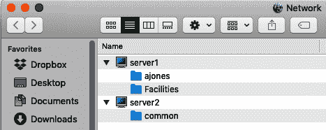
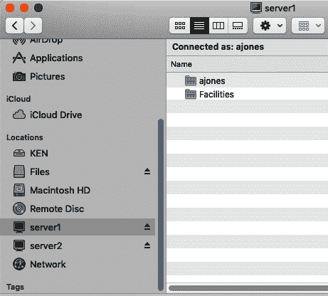
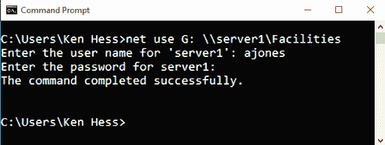
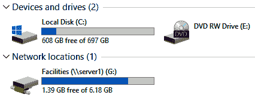

# 第十一章：部署 Samba 以实现 Windows 兼容性

互操作性是指诸如 Windows、Linux、Unix 和 macOS 等不同系统共存并协同工作的能力。互操作性现已成为所有数据中心操作系统的标准和被接受的特性，尽管某些功能需要第三方软件。硬件、软件和操作系统不再能够独立存在于专有的真空环境中。换句话说，厂商必须确保其产品具有跨平台的能力。当代的数据中心是异构的——这意味着 Windows、Linux 和 Unix 系统都占据机架。

本地和第三方工具使互操作性成为可能。从 Active Directory（AD）和 LDAP 到 Samba/SMB 再到*nix 工具和应用程序，系统可以共同努力实现一个共同的目标：为客户提供服务。

###### 注意

泛指符号“*nix”代表所有 Unix、Linux 和类似的操作系统及发行版。

Samba 是一套工具，为 Linux 和 Unix 提供 Windows 互操作性。Samba 使用 Server Message Block/Common Internet File System（SMB/CIFS）协议为非 Windows 系统提供安全、稳定的文件和打印服务。Samba 具有自己的身份验证结构，包括权限和密码。

使用 Samba，Linux 系统可以执行以下操作：

+   与 Windows 计算机共享目录、文件系统和打印机

+   挂载 Windows 共享

+   浏览由 Windows 和其他 Linux 计算机提供的共享网络

+   参与 Windows 域身份验证和授权

+   使用 Windows 名称解析服务

+   使用共享打印机

安装了 Samba 的 Linux 服务器，Windows 计算机可以执行以下操作：

+   浏览 Linux 共享

+   使用共享打印机

+   映射网络驱动器到 Linux 共享

本章探讨一些工具和应用程序，使 Linux 系统能够与 Windows 互操作。下一节讨论与 Windows 系统交互的挑战，以及使其正常工作的工具和配置。

# 规划您的 Samba 环境

在任何企业中，新文件共享请求都是司空见惯的。经常分布在数百或数千英里之外的同事，希望有一个共享空间来放置文件，如文档、电子表格、文本文件、脚本和图像。作为系统管理员，您必须询问您的团队一些问题，以便获得这个共享空间。

对于这种情况，设施部门请求共享文件空间。因此，您将其 Linux 系统设置为 Windows 文件服务器。以下是要询问的五个重要问题列表：

1.  这个空间是否应该仅限于您的团队？

1.  您希望您组内的每个人都能够在共享空间中复制和创建文件吗？

1.  您是否希望设置上传文件的默认权限？

1.  您是否需要任何只读文件夹用于文档？

1.  这是永久共享空间还是临时共享空间？

对于这种情况，设施经理提供了以下答案：

1.  是的，只限制给 facilities 员工。

1.  每个人都需要能够复制和创建文件。

1.  组中的每个人都需要对所有文件具有读写权限。

1.  是的，我们需要一个*Policies*文件夹，任何人都不能编辑或删除文件。

1.  这是一个永久的空间。

答案为 facilities 团队的新共享空间提供了一个起点。如果 facilities 组不存在，请立即创建一个，并将 facilities 团队成员添加为其主要组。组成员帐户是`atran`、`areed`和`akumar`。

###### 注意

Samba 用户名和密码必须与在 Windows 系统上配置的完全匹配。

为了演示 Samba 的功能，执行以下任务：

```
$ sudo groupadd -g 9001 facilities
$ sudo usermod -g facilities atran
$ sudo usermod -g facilities areed
$ sudo usermod -g facilities akumar
```

创建一个目录，比如*/opt/facilities*，将通过 Samba 共享：

```
$ sudo mkdir /opt/facilities
```

更改*/opt/facilities*目录的组所有权和权限，以反映请求的权限：

```
$ sudo chgrp facilities /opt/facilities
$ sudo chmod 770 /opt/facilities
```

在*/opt/facilities*目录下创建一个子目录，并命名为*Policies*。将*Policies*目录设置为 facilities 组的只读权限：

```
$ sudo mkdir /opt/facilities/Policies
$ sudo chmod 740 /opt/facilities/Policies
```

现在共享空间设置已完成，准备好进行 Samba 配置。

## 安装 Samba 及其依赖项

在配置与 Samba 相关的任何内容之前，您必须安装它及其依赖软件：

```
$ sudo yum install samba

Last metadata expiration check: 2:55:52 ago on Sat 08 Oct 2022 11:42:12 AM EDT.
Dependencies resolved.
=================================================================================
 Package              Architecture    Version              Repository       Size
=================================================================================
Installing:
 samba                x86_64          4.14.5-7.el8_5       baseos           848 k
Installing dependencies:
 libwbclient          x86_64          4.14.5-7.el8_5       baseos           121 k
 Samba-client-libs    x86_64          4.14.5-7.el8_5       baseos           5.4 M
 samba-common         noarch          4.14.5-7.el8_5       baseos           221 k
 Samba-common-libs    x86_64          4.14.5-7.el8_5       baseos           173 k
 samba-common-tools   x86_64          4.14.5-7.el8_5       baseos           500 k
 samba-libs           x86_64          4.14.5-7.el8_5       baseos           

Transaction Summary
=================================================================================
Install  7 Packages

Total download size: 7.4 M
Installed size: 25 M
Is this ok [y/N]: y
```

该过程在其他发行版上运行方式类似。此操作安装了您设置 Linux 系统作为 Windows 文件服务器所需的所有内容。

启用并启动 Samba 服务（`smb`和`nmb`）：

```
$ sudo systemctl enable smb
Created symlink /etc/systemd/system/multi-user.target.wants/smb.service 
→ /usr/lib/systemd/system/smb.service.

$ sudo systemctl enable nmb
Created symlink /etc/systemd/system/multi-user.target.wants/nmb.service 
→ /usr/lib/systemd/system/nmb.service.

$ sudo systemctl start smb
$ sudo systemctl start nmb
```

Samba 服务现已启动，并将在启动时启动。

## 将 Samba 用户添加到您的系统

因为 Samba 管理自己的用户列表，您必须将每个用户添加到 Samba 用户数据库中。为演示目的，我使用`PaSSw0rd`作为 Samba 密码：

```
$ sudo smbpasswd -a atran
New SMB password:
Retype new SMB password:
Added user atran.
```

有一个配置可用于同步 Samba 和 Linux 密码。我稍后会在本章中介绍这个配置。

## 将 Samba 用户作为组进行管理

组使管理大量用户变得更容易。组更容易管理，因为您可以一次为多个用户应用安全性，而无需跟踪每个用户的安全设置的开销。换句话说，管理 10 个组的安全性比管理 100 个单独用户的安全性要容易得多。

您可以创建新的 Linux 组或使用现有组用于 Samba 用户，并授予组访问共享的权限。您也可以为单个用户授予共享的访问权限，但这需要更多的工作量。

继续使用示例场景，您有一个包含三名成员的 facilities Linux 组，您可以为特定目录（*/opt/facilities*）的所有三个组成员管理目录和文件权限。这是标准的 Linux 管理实践。

如果您通过 Samba 共享同一目录（*/opt/facilities*），请在配置文件中添加`valid users = @facilities`，以允许整个组访问共享目录。`@facilities`声明指的是 facilities Linux 组，其组成员是该共享目录的有效用户。

Linux 文件和目录权限与 Samba 权限不同。 Linux 用户可能对目录具有写入权限，但对于同一用户，共享可能是只读的。 如果不将有效用户添加到共享中，则 Linux 文件权限允许组写入目录也无济于事； 组成员将无法通过共享访问该目录。

启用 Samba 共享的主要原因之一是创建 Windows 和 Mac 客户端与 Linux 服务器之间的兼容性。 本章的其余部分涉及配置和支持该互操作性。

# 为 Mac 和 Windows 客户端提供服务

作为 Linux 系统管理员，您必须意识到 Linux 是一种出色的*服务器*操作系统。 有些人认为大规模采用 Linux 桌面“就在拐角处”。 但是，现实情况是，Windows 和 Mac 工作站是企业的标准，而 Linux 仍然是个例外。 因为 Linux 是一种出色的服务器操作系统，系统管理员必须提供与 Windows 和 Mac 客户端兼容的服务。 macOS 由于有*nix 的根源，通常与 Linux 兼容，因此在使 Mac 系统和 Linux 协同工作时需要的工作量较少。

但是，要将 Windows 与 Linux 集成并不容易——至少不能直接。 Windows 系统需要第三方工具和实用程序，而 Linux 系统则需要额外的软件包和特殊配置。 但是，可以使这两个系统无缝工作在一起，而且解决方案也相当优雅和稳定。

## 为桌面客户端提供网络存储

管理员通过映射驱动器将网络存储提供给 Windows 系统，并通过挂载共享将其提供给 Mac 客户端。 在 Linux 术语中，映射驱动器是挂载的远程共享目录。 Windows 将这些远程共享标识为驱动器字母，例如*F:*到*Z:*。 从 Linux 系统，系统管理员通过 Samba 共享目录，这在某种程度上类似于*nix 网络文件系统（NFS）共享。 macOS 系统也可以通过浏览使用 Samba 协议或直接连接来挂载 Samba 共享。

Samba 共享非常方便，用户可以将文件拖放到共享目录中，而无需使用 FTP、SFTP、SCP 或其他文件传输软件。 Samba 共享看起来是从 Windows 服务器系统共享出来的，这进一步将 Linux 整合到 Windows 和 Mac 桌面环境中。

### 探索全局 Samba 设置

您可以在*/etc/samba/smb.conf*文件的*[global]*部分中设置数十个“指令”。 尽管如此，在我看来，无论您是否使用域控制器和 AD，以下指令都应设置为最佳的独立 Samba 服务器使用。 所示的许多指令是默认值：

```
[global]
    load printers = yes
    passdb backend = tdbsam
    security = user
    cups options = raw
    workgroup = YOUR_DOMAIN_NAME
    printcap name = cups
    printing = cups
    os level = 20
    netbios name = SERVER1
    browseable = yes

    interfaces = lo eth0 192.168.1.0/24
    hosts allow = 127\. 192.168.1.
```

更改设置以匹配您的网络和需求。 工作组通常设置为域名或工作组相同。 NetBIOS 名称是您将在网络浏览列表中看到的 Samba 服务器的名称。

### 通过 Samba 打印

您也可以共享打印机，但因为大多数系统通过其 IP 地址直接打印到打印机，因此此处不涵盖打印机共享。在 */etc/samba/smb.conf* 文件中有一个共享打印机的示例配置：

```
[printers]
        comment = All Printers
        path = /var/tmp
        printable = yes
        create mask = 0600
        browseable = no

[print$]
        comment = Printer Drivers
        path = /var/lib/samba/drivers
        write list = @printadmin root
        force group = @printadmin
        create mask = 0664
        directory mask = 0775
```

这些配置将帮助您入门。我建议您将 `browseable = no` 更改为 `browseable = yes`。每次进行配置更改时，请记得重新启动 `samba` 服务。接下来的两个部分将指导您如何共享用户访问目录。

### 部署 lmhosts 文件

就像在 Windows 系统中一样，Samba 支持 *lmhosts* 文件。 *lmhosts* 文件列出了网络上系统的 NetBIOS 名称和 IP 地址。我建议您将 Windows *lmhosts* 文件的内容复制粘贴到提供 Samba 服务的 Linux 系统上。不要将 Windows *lmhosts* 文件转移到 Linux 服务器，因为 Windows 和 Linux 系统之间存在文本格式差异。 */etc/samba* 中的默认 *lmhosts* 文件只包含本地主机信息：

```
127.0.0.1 localhost
```

将 *lmhosts* 文件视为您考虑 */etc/hosts* 文件的方式相同。您还可以在以下列表中显示的 *lmhosts* 文件中设置其他指令。指令跟随条目并使用 `#`：

`#PRE`

为了名称查找和解析加载到缓存中的条目：

```
192.168.1.50    testserv1    #PRE
```

`#DOM:*domain*`

域服务器条目。与 `#PRE` 指令一起使用：

```
192.168.1.100  DC1  #PRE #DOM:WEST  #The West Domain Controller DC1
```

`#INCLUDE \\*UNC Path*\*To File*`

包含来自另一个系统的文件。这通常用于集成经常更新的 Windows 系统中的 *lmhosts* 文件：

```
#INCLUDE \\server1\public\lmhosts
```

`#BEGIN_ALTERNATE`/`#END_ALTERNATE`

将多个 `#INCLUDE` 指令分组在一起：

```
#BEGIN_ALTERNATE

#INCLUDE \\server1\public\lmhosts
#INCLUDE \\server2\public\lmhosts
#INCLUDE \\server3\public\lmhosts

#END_ALTERNATE
```

我在我的 Samba 服务器上始终使用 *lmhosts* 文件。我设置了一个自动化脚本，以保持本地 *lmhosts* 文件与真相的单一来源同步。然而，指向另一个系统 *lmhosts* 文件的 `#INCLUDE` 指令也是一个不错的选择。

接下来的几个部分演示了如何设置和使用 Samba 共享。

## 配置共享目录

*/etc/samba/smb.conf* 文件是 Samba 配置文件，用于设置共享目录。 `homes` 共享是开始自定义共享目录配置的好地方。

下面是来自 */etc/samba/smb.conf.example* 文件的示例共享目录：

```
[homes]
    comment = Home Directories
    browseable = no
    writeable = yes
;   valid users = %S
;   valid users = MYDOMAIN\%S
```

下面是我 */etc/samba/smb.conf* 文件中的设施共享配置。方括号部分 `[Facilities]` 是共享名称。请记住共享名称不超过 15 个字符，并避免非字母数字字符和空格。

`create mode` 和 `directory mode` 根据设施经理从先前提到的五个问题的需求进行设置：

```
[Facilities]
    create mode = 0660
    writeable = yes
    path = /opt/facilities
    comment = Facilities Group Share
    directory mode = 0770
    only user = yes
    valid users = @facilities
    browseable = yes
```

`valid users` 条目限制了只能访问设施 Linux 组中列出的用户。`browseable` 意味着如果执行网络浏览，系统和此共享将出现在可用共享列表中。`create mode` 指令 (`0660`) 是共享文件的默认创建权限。当您通过共享在共享目录中创建新文件时，其权限将是 `0660`。目录模式是共享的权限。

## 浏览共享目录

本节介绍了如何从 Mac、Windows 和 Linux 计算机浏览和连接 Linux Samba 共享。参考图表 11-1 和 11-2，查看 Mac 系统如何查看 Linux 系统上的 Samba 共享。*server1* 是我在示例中使用的 CentOS 系统，*server2* 是本书中还使用的 Ubuntu 系统。



###### 图表 11-1\. macOS 系统上的 Samba 网络浏览

连接后，挂载的共享将显示为 macOS Finder 应用程序中的资源。



###### 图表 11-2\. macOS Finder 应用程序显示 Samba 系统和共享

在 Windows 系统上，视图类似，但要连接远程共享，您必须映射驱动器。映射驱动器意味着挂载远程共享并将其用作系统本地资源。请回顾前面提到的 NFS 参考。参见图表 11-3 和 11-4。



###### 图表 11-3\. 将驱动器 (G:) 映射到远程共享 \\server1\Facilities

映射共享会将其作为客户端系统上的驱动器字母显示。



###### 图表 11-4\. Windows 文件资源管理器中的映射驱动器

通过映射驱动器，用户 `ajones` 可以自由访问 *Facilities* 共享，该用户可以在共享目录中创建、编辑和复制文件。接下来的部分介绍了 Linux 系统如何查看和连接到 Windows 共享。

## 挂载 Windows 系统的共享

您还可以使用 Samba 协议从 Linux 计算机浏览远程 Windows（或其他 Linux）系统上的共享：

```
$ smbclient -U "Ken Hess" -L WIN10
Enter WORKGROUP\Ken Hess's password:

    Sharename       Type      Comment
    ---------       ----      -------
    ADMIN$          Disk      Remote Admin
    C$              Disk      Default share
    Files           Disk     
    IPC$            IPC       Remote IPC
Reconnecting with SMB1 for workgroup listing.
do_connect: Connection to WIN10 failed (Error NT_STATUS_RESOURCE_NAME_NOT_FOUND)
Unable to connect with SMB1 -- no workgroup available
```

关于 `SMB1` 的消息可以忽略。这不会影响功能。根据您在浏览的系统上的 Samba 客户端和服务器版本，您可能会收到与 SMB 版本相关的不同消息。这些消息都可以忽略。

在 `WIN10` 计算机上挂载远程 Windows 共享（`Files`）：

```
$ sudo mount -t cifs \\\\WIN10\\Files /mnt
Password for Ken Hess@\WIN10\Files:  ********
[khess@server1 facilities]$ ls /mnt
abi.mp4  new.txt  untitled.mp3
```

如果在 `mount` 命令中未使用文件系统类型 `cifs`，则会收到以下消息：

```
mount: /mnt: special device \\WIN10\Files does not exist.
Use four backslashes (\\\\) and two for the UNC mapping command's share name 
(\\). For example, \\\\WIN10\\Files. You may also use single-quoted backs...
('\\'WIN10'\'Files). Remember that in Linux, you escape a character with ...
(\), so you must escape (or quote) the backslash character with a backsla...
to tell the shell that this is a literal backslash. A regular UNC mapping...
looks like this: \\WIN10\Files.
```

# 概要

Linux 在当代企业数据中心到小型服务器房间的无缝互通性提供了增强功能，降低成本，并提供更大的软件选择自由。无论您选择将哪个发行版集成到您的业务中，向 Windows 和 Mac 客户端提供服务对于 Linux 的采纳和成功至关重要。您必须无缝复制标准的 Windows Server 服务，并向用户和管理层展示，Linux 可以通过比昂贵的替代方案更高的稳定性和更低的维护成本来消除怀疑。
