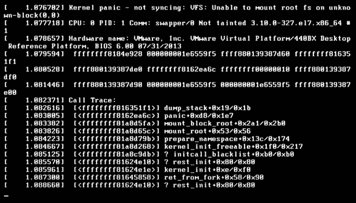

# 第十二章：Linux 故障排除

有人将 Linux 故障排除比作“徒劳无功的练习”，但是如果你简单地花时间调查系统发生了什么，Linux 故障排除既不那么戏剧性，也不那么困难。太多时候，系统管理员不会执行任何相关的故障排除，而是快速备份，然后重新镜像（擦除磁盘并重新安装）系统。尽管在重大安全漏洞的情况下，这是最佳选择，但我并不赞成这种做法。

本章教授您一般的故障排除概念和工具，而不是如何排除特定问题（例如如何修复工作不正常的网站）。排除个别问题可能需要一本非常厚的书或一系列书籍。本章讨论操作系统故障排除、软件、硬件和安全性。

本章旨在为您提供一些基本的故障排除技能，介绍必要的工具，并向您展示如果其他选项失败，如何找到解决方案。故障排除是一个个人过程；不是每个人都以相同的方式进行。这些过程和工具在我的职业生涯中帮助了我很多，但您的结果可能会有所不同，最终，您会找到最适合您的步骤和指南。

让我们从操作系统本身开始您的故障排除课程。

# 恢复操作系统

故障排除操作系统要么非常容易，要么几乎不可能。似乎没有中间地带。系统错误通常是致命的，但并非必然如此。当我在本章中使用“致命”一词时，我指的是不可恢复的错误，需要重新镜像系统。操作系统问题可能仅仅是运行文件系统检查（`fsck`）并修复一些文件，也可能像多日的故障排除会议最终导致整个系统重新镜像。例如，如果遇到内核恐慌，您可能首先想到重新镜像系统，但这只有时候是必要的。

接下来的部分演示了如何解决内核恐慌。

## 缓解内核恐慌

系统引导时发生多种原因的内核恐慌。大多数情况下，要么是损坏的*initramfs*文件，要么是未正确创建的*initramfs*文件。*initramfs*文件对每个内核都是特定的，因此，如果您最近升级了内核，则可能在安装过程中未创建*initramfs*，或者*initramfs*创建过程不顺利。内核恐慌也可能是由于最近的错误补丁引起的。其他问题仍可能导致内核恐慌，例如硬件故障，但列出的问题是最常见且容易解决的。一个相对简单的过程（下面讨论）可能使您的系统再次可引导，并避免重新安装所有内容的痛苦。

想象一下，您收到了类似于图 12-1 中示例的消息。



###### 图 12-1。Linux 内核恐慌

屏幕在这里*冻结*。没有“按任意键继续”消息。你必须关闭系统然后重新开机开始新的启动过程。在此时，重新启动系统，要么从可引导 ISO 启动，要么重新启动并从 Grub 菜单进入救援过程。进入救援模式或使用可引导 ISO 时，你将成为 root 用户，所以要小心操作。

显示你的内核版本：

```
# uname -r
3.10.0-327.el7.x86_64
```

运行以下命令从你的内核重新创建正确的*initramfs*：

```
# dracut -f /boot/initramfs-3.10.0-327.el7.x86_64.img 3.10.0-327.el7.x86_64
```

你可能会收到类似以下的消息：

```
dracut: Will not override existing initramfs (/boot/initramfs...) without --force
```

使用不同命令创建*initramfs*文件：

```
# mkinitrd --force \
/boot/initramfs-3.10.0-327.el7.x86_64.img 3.10.0-327.el7.x86_64
```

重新启动系统。希望它能够无问题启动。如果在此修复过程后再次遇到内核恐慌，可能是硬盘故障、其他损坏的启动相关文件或者有 bug 的内核。重试救援过程并安装不同的内核。确保为该过程准备好 ISO 映像。

启动到根救援 shell，挂载你的 ISO 映像，并安装 ISO 映像中可用的内核。

例如，你的根文件系统挂载在*/mnt/sysimage*，并且你将 ISO 挂载在*/opt/mnt*下：

```
# cd /opt/mnt/install/repo/Packages

# rpm -Uvh --root=/mnt/sysimage kernel-3.10.0-1127.10.1.el7.x86_64
```

使用 ISO 映像中的内核包。现在，重新启动系统；如果一切正常，你应该拥有一个正常运行的系统。如果不行，考虑再次引导到救援环境——如果需要，创建关键文件的备份——然后重新安装系统映像。当然，如果硬件问题如坏盘或控制器问题可能导致内核恐慌。

操作系统问题的其他来源很多，但它们各不相同，这里不可能全部覆盖。相反，你应该检查系统的日志，下一节将介绍如何处理。

## 抓取系统日志：

抓取系统日志意味着搜索日志中的错误或其他相关信息。然而，系统管理员在*/var/log*中度过大部分时间；有时，日志文件是你唯一依赖的故障排除系统问题的工具。

我的起始点是发出像下面这样过滤的`dmesg`命令：

```
$ dmesg | grep -i error
[ 2.229324] RAS: Correctable Errors collector initialized.
[ 3.820963] [drm:vmw_host_log [vmwgfx]] *ERROR* Failed to send host log message.
[ 3.829724] [drm:vmw_host_log [vmwgfx]] *ERROR* Failed to send host log message.
```

这通常会缩小操作系统和硬件问题可能发生的范围。如果通过`dmesg`未找到相关错误，请尝试使用其他过滤器如`fault`、`failed`、`undefined`或`unknown`进一步调查：

```
$ dmesg | grep -i failed
[ 3.820963] [drm:vmw_host_log [vmwgfx]] *ERROR* Failed to send host log message.
[ 3.829724] [drm:vmw_host_log [vmwgfx]] *ERROR* Failed to send host log message.

$ dmesg | grep -i fault
[ 0.004466] MTRR default type: uncachable
[ 0.362760] pid_max: default: 32768 minimum: 301
[ 0.710356] iommu: Default domain type: Translated
[ 0.728057] NetLabel:  unlabeled traffic allowed by default
[ 0.802045] PCI: CLS 0 bytes, default 64
[ 5.766858] systemd[1]: systemd 245.4-4ubuntu3.17 running in system mode. (+PA...
[333390.696268] systemd[1]: systemd 245.4-4ubuntu3.18 running in system mode. ...

$ dmesg | grep -i undefined

$ dmesg | grep -i unknown
[ 0.374321] SRBDS: Unknown: Dependent on hypervisor status
```

如果之前的搜索未发现有价值信息，请使用系统日志文件：

```
$ cd /var/log
$ sudo grep -ir error *
```

这可能会生成一个非常长的列表。如果是这样，建议将输出重定向到文件中，以便后续分析这些结果：

```
$ sudo grep -ir error * > ~/errors.txt
```

然后你可以在这个文本文件中搜索更具体的内容：

```
$ cd
$ grep host errors.txt
```

我在这里使用`grep`搜索了`host`，但你应该根据需要搜索这些结果中的任何术语。优化这个过程直到找到符合你问题的相关错误。这可能需要时间。这是我的处理过程，但通常能提供有价值的信息，并为进一步调查提供几个下一步方向。

接下来的章节将讨论软件故障排除以及我找出错误和问题的过程。

# 解开软件问题

软件故障排除可能会很棘手。软件问题的根本原因可能不是软件本身。但在进一步调查之前，问题可能会表现为软件问题。正如任何有经验的系统管理员会告诉您的那样，软件问题可能的根本原因可能在硬件、其他软件、文件损坏或删除、软件依赖性问题、网络问题、重复的端口、重复的 IP 地址以及系统上任何可能的配置或错误配置问题中。软件错误消息不一定会指向解决方案，但它们是排除故障的一个良好起点。然而，错误代码和日志是排除故障的一个良好起点。

在本节中，我指导您定位和筛选系统和应用程序日志，并执行任何内置或供应商提供的状态和配置检查。

## 检查系统日志

系统日志是查找错误、故障和成功的好起点。是的，成功不一定是良性的。想象一下这样的情景，有人已经入侵了您的网络，在使用合法账户登录系统后变成了 root 用户，然后窃取了机密数据或加密了您的数据。只有执行操作的一方——恶意访问系统的人——是不合法的。系统将这个恶意行为视为正常、合法和成功。这些动作可能完全不会引起任何警报。

您的系统日志显示了发生的情况，因此不要忽视检查成功登录情况。在本章后面的一节中，我会给您展示一个安全脚本示例，可以让您一目了然地查看登录情况进行检查。

系统日志位于*/var/log*。要读取这些文件，您必须具有根权限。

尽管输出内容对于本书的文本来说过长且过宽，这里是我在系统日志上使用的两个故障排除过滤器：

```
$ sudo grep -i error *.log
$ sudo grep -i fail *.log
```

我总是使用`-i`选项来忽略大小写，这样我就能确保捕捉到每一个错误和失败的实例，无论日志如何捕捉它们。下一节将介绍检查特定应用程序日志，通常比仅依赖系统日志更有帮助。

## 检查应用程序日志

幸运的是，应用程序日志提供了特定的错误或错误代码，帮助您排查软件问题。这些日志可能位于*/var/log*下，也可能位于应用程序的主目录下，或者其他某个目录中，但始终位于名为*log*或*logs*的子目录中。例如，Apache 的日志通常位于*/var/log/httpd*，但在基于 Red Hat Enterprise Linux 的系统中，还会有一个从*/etc/httpd/logs*到*/var/log/httpd*的符号链接。通常这些链接是为了与其他应用程序向后兼容而存在的。

## 利用内部应用程序检查

一些开发人员在他们的软件中包含了配置检查器和特定工具，帮助你识别、隔离和解决问题。面对特定应用程序配置问题和失败时，这些实用程序是你的最佳选择。一些配置文件有相当复杂的语法，遗漏单个括号或分号可能极其难以隔离。

例如，以下命令提供了检查你的 Apache HTTP 服务器配置语法的极好反馈。当*httpd.conf*中的所有配置正确时，你将收到`Syntax OK`消息：

```
$ apachectl configtest
Syntax OK
```

然而，如果配置指令不正确，你的`configtest`结果会隔离出问题：

```
$ apachectl configtest
AH00526: Syntax error on line 34 of /etc/httpd/conf/httpd.conf:
Invalid command 'ServerBoot', perhaps misspelled or defined by a module not 
included in the server configuration
```

启动或重新启动应用程序时也会检查配置：

```
$ sudo apachectl restart
Job for httpd.service failed because the control process exited with error code.
See "systemctl status httpd.service" and "journalctl -xe" for details.

$ systemctl status httpd.service
httpd.service - The Apache HTTP Server
  Loaded: loaded (/usr/lib/systemd/system/httpd.service; enabled; vendor prese...
  Active: failed (Result: exit-code) since Sun 2022-10-16 08:49:44 EDT; 17s ago
    Docs: man:httpd.service(8)
  Process: 58661 ExecReload=/usr/sbin/httpd $OPTIONS -k graceful (code=exited,...
  Process: 59189 ExecStart=/usr/sbin/httpd $OPTIONS -DFOREGROUND (code=exited,...
Main PID: 59189 (code=exited, status=1/FAILURE)
  Status: "Reading configuration..."

Oct 16 08:49:44 server1 systemd[1]: httpd.service: Succeeded.
Oct 16 08:49:44 server1 systemd[1]: Stopped The Apache HTTP Server.
Oct 16 08:49:44 server1 systemd[1]: Starting The Apache HTTP Server...
Oct 16 08:49:44 server1 httpd[59189]: AH00526: Syntax error on line 34 of /etc...
Oct 16 08:49:44 server1 httpd[59189]: Invalid command 'ServerBoot', perhaps mi...
Oct 16 08:49:44 server1 systemd[1]: httpd.service: Main process exited, code=e...
Oct 16 08:49:44 server1 systemd[1]: httpd.service: Failed with result 'exit-co...
Oct 16 08:49:44 server1 systemd[1]: Failed to start The Apache HTTP Server.
```

在上述错误消息中，行`Oct 16 08:49:44 server1 httpd[59189]: AH00526: Syntax error on line 34 of /etc/httpd/conf/httpd.conf:`（部分在前面的代码列表中被省略）告诉我配置文件中存在语法错误，需要进一步调查：

```
$ cd /var/log
$ sudo grep -ir "Syntax error" *
Binary file journal/027dd8a8c9624671b26d07e94eae8f1d/system.journal matches
```

我搜索的结果无助于排除语法错误，因此我使用了之前推荐的系统工具`journalctl`，从前面的`apachectl restart`命令 (`查看详细信息，请参阅"systemctl status httpd.service"和"journalctl -xe"。`)，结果同样模糊：

```
$ sudo journalctl -xe
-- Support: https://access.redhat.com/support
--
-- The unit httpd.service has entered the 'failed' state with result 'exit-code'.
Oct 16 08:49:44 server1 systemd[1]: Failed to start The Apache HTTP Server.
-- Subject: Unit httpd.service has failed
-- Defined-By: systemd
-- Support: https://access.redhat.com/support
--
-- Unit httpd.service has failed.
--
-- The result is failed.
```

你最好的做法是检查你更改的*httpd.conf*文件中引起错误的行。常见问题如拼写错误或使用错误的指令通常是语法错误的原因。

## 管理防火墙及其规则

防火墙非常适合减缓入侵者速度，但它们也可能干扰故障排除。在故障排除过程中避免禁用防火墙的诱惑。相反，添加新规则以适应你需要做的事情。你可能会忘记重新启用防火墙，这可能导致灾难性后果。

防火墙并非百分之百防护，但在减缓潜在入侵者方面具有价值。有时候，它的存在足以阻止恶意行为者，并鼓励他们寻找更容易的目标。花费数小时来排查新服务问题最终记住可能是你的防火墙导致了问题，这是非常令人沮丧的。

## 卸载和重新安装软件

无尽的故障排除通常是对耐心的考验，不建议这样做。虽然没有设定软件问题需要花费多长时间的标准，但在某个时候，你必须确定进一步的故障排除是浪费宝贵时间。那时候，你应该备份应用程序的配置文件和数据，然后将其删除并重新安装。

在重新安装应用程序之前，请确保已安装了最新的稳定包或下载了最新的稳定源代码。如果您使用的是最新版本，请尝试返回到较早的稳定版本。此外，请确保您的系统已更新，并具备了应用程序所需的最新兼容工具和实用程序。源代码包中附带的*README*或*INSTALL*文本文件通常列出了兼容的编译器版本和其他所需支持软件的版本。

## 重新启动您的系统

对于许多 Linux 系统管理员来说，定期重新启动系统的概念不仅陌生，而且几乎闻所未闻。然而，重新启动应该是常规系统维护的一部分。重新启动不仅刷新硬件和软件配置，还能通知您有关任何故障或问题的信息。例如，您可能会发现某些应用程序在重新启动后不会自动启动。也许您没有使用`systemctl enable *service_name*`命令来启用它们。启动一个服务会将其置于内存中，设置监听端口并允许连接。但是，除非启用，否则该服务将不会在下次重启时启动，无论是人为发起的还是由崩溃引起的。

`dmesg`命令会通知您有关最新重新启动中的任何问题。通过过滤结果，您可以发现软件和硬件错误。以下是两个示例：

```
$ dmesg | grep -i error
[ 8.741308] [drm:vmw_host_log [vmwgfx]] *ERROR* Failed to send host log message.
[ 8.741321] [drm:vmw_host_log [vmwgfx]] *ERROR* Failed to send host log message.

$ dmesg | grep -i fail
[ 0.063026] acpi PNP0A03:00: fail to add MMCONFIG information, can't access ...
[ 8.741308] [drm:vmw_host_log [vmwgfx]] *ERROR* Failed to send host log message.
[ 8.741321] [drm:vmw_host_log [vmwgfx]] *ERROR* Failed to send host log message.
```

重新启动您的系统不应成为争议。每月进行热启动（重启）和每季度进行冷启动（断电/开机）是许多企业维护周期的标准部分，还包括打补丁、安全审计和端口扫描。下一部分将讨论硬件故障排除。

# 处理硬件故障

通常，排除硬件故障非常简单；硬件要么正常工作，要么不工作。当硬件开始故障时，您可能会遇到像网络接口卡（NIC）的间歇性功能或正在失效的硬盘上的文件损坏等不规律行为。但通常，硬件设备发生故障时，您必须更换它。数据中心服务器系统具有多个子系统的内置冗余，以便故障不至于灾难性。始终购买具有冗余电源供应、多个 NIC 和充足 RAM 的服务器系统。将磁盘设置为 RAID 10 等阵列，以确保故障不会破坏您的夜晚和周末。

即使您拥有多磁盘阵列，请注意，如果其中一块驱动器故障，会影响性能。您将收到一条关于磁盘故障的警告，如果您可以物理访问系统，通过状态指示灯很容易确定哪个磁盘已故障。尽管需要花费一些钱，但在发生故障时应该准备好多个新的磁盘进行更换。另一个选择是迁移到比机械硬盘更冷却且寿命更长的固态硬盘（SSD）。请记住，热量是电子设备的敌人，这就是为什么数据中心看起来风大且寒冷的原因之一。散热是任何良好数据中心的主要设计特征和重大问题之一。

接下来的部分涵盖了预防性故障排除、诊断和硬件更换，以及系统设计的讨论。

## 预防性硬件故障排除

除非您拥有来自刀片服务器系统底座或第三方软件套件的智能硬件诊断工具，否则无法预测硬件故障。本机 Linux 命令提供给您一般的列表或状态。尽管如此，如果您的硬件组件正常运行，很少会出现“标记”设备或收到关于即将发生故障的警告。

由于我之前提到的，硬件故障难以预测，因为硬件要么工作，要么不工作。一些硬件组件*可以*部分故障。网络接口卡（NIC）可能会开始失败并“发狂”，或发送格式不正确的数据包。发狂的网络卡正在故障中，应予以更换。

机械硬盘可能会以文件损坏或不正确、随机或根本无法引导的方式部分故障。有时，故障的硬盘在冷启动后可能会暂时修复自身。有时候，当机械硬盘故障时，您会听到它们在旋转、启动、关闭或*咔哒*声。使用最近的备份并更换硬盘。尽可能使用固态硬盘。也尽可能镜像您的驱动器。固态硬盘通常会以全存或全失的方式故障。我从未见过固态硬盘部分失效的情况。

内存“条”通常会以全失或全存的方式失败。我从未见过部分失效的情况。当内存条故障时，在启动过程中 RAM 不会完全计算。例如，如果系统包含 64 GB 的 RAM，可能只会识别 48 GB。虽然内存条可以单独故障，但它们以对的方式读取。因此，如果您的系统有八个 8 GB 内存条（共计 64 GB），并且单个内存条故障，则 RAM 计数会以对的方式失效。具体而言，如果您的系统有四个插槽，每个插槽放置两根内存条（每根 8 GB × 8 根 = 64 GB），一根内存条故障，则它的成对内存条也会显示为故障，启动时 RAM 只会计数 48 GB。

接下来的部分将为您介绍几个有用的硬件命令。

## 收集系统硬件信息

我没有任何裸机系统上安装 Linux。我只有虚拟机可供使用。我建议使用本节讨论的命令收集每个您管理的唯一物理系统的硬件数据，并将这些信息保存在您稍后可以轻松查阅的地方。收集每个裸机系统的硬件信息，然后为每个虚拟化平台的单个虚拟机收集相同的信息。虚拟硬件在每个平台和虚拟主机之间非常一致。换句话说，如果您有所有 VMware 主机且您的主机软件版本一致，那么您的虚拟机硬件应该都是相同的。虚拟机可以在主机之间自由移动，因为它们的虚拟硬件是通用的和一致的，而不管底层硬件是什么样子。

本节介绍的命令收集有关您硬件的信息，尽管其中一些信息可能会重叠，但从多个命令收集信息仍然是很好的。正如您将看到的，某些命令收集有关您硬件的具体详细信息，而其他命令仅收集产品名称和功能。您可以以普通用户身份执行这些命令，但某些命令警告您要使用 root 帐户，否则信息可能不完整或不准确。本节中的所有命令都是以 root 用户身份运行的。这些命令的输出通常太长，无法在本书中完全重现，但我将为每个命令提供摘录，以便您了解命令的报告内容。每个命令都提供多个选项，可提供自定义输出和报告。有关这些选项的更多信息，请参阅每个命令的 man 页面。最后，请注意，根据您的特定 Linux 发行版，某些讨论的工具可能已经存在，而其他工具可能需要安装。

### hwinfo

`hwinfo` 实用程序探测系统的硬件并报告其发现。报告非常长，但非常详尽。您可以使用 `--short` 选项创建简短摘要报告。以下是完整的简短报告列表：

```
# hwinfo --short
cpu:                                                           
                       Intel(R) Core(TM) i5-5350U CPU @ 1.80GHz, 1800 MHz
keyboard:
  /dev/input/event2    AT Translated Set 2 keyboard
mouse:
  /dev/input/mice      Mouse
graphics card:
                       VMware VMWARE0405
sound:
                       Intel 82801AA AC'97 Audio Controller
storage:
                       Intel 82801HM/HEM (ICH8M/ICH8M-E) SATA Controller [AHCI...
                       Intel 82371AB/EB/MB PIIX4 IDE
network:
  enp0s3               Intel PRO/1000 MT Desktop Adapter
network interface:
  lo                   Loopback network interface
  enp0s3               Ethernet network interface
disk:
  /dev/sdb             VBOX HARDDISK
  /dev/sdc             VBOX HARDDISK
  /dev/sda             VBOX HARDDISK
partition:
  /dev/sdc1            Partition
  /dev/sda1            Partition
  /dev/sda2            Partition
cdrom:
  /dev/sr0             VBOX CD-ROM
usb controller:
                       Apple KeyLargo/Intrepid USB
bios:
                       BIOS
bridge:
                       Intel 82371SB PIIX3 ISA [Natoma/Triton II]
                       Intel 82371AB/EB/MB PIIX4 ACPI
                       Intel 440FX - 82441FX PMC [Natoma]
hub:
                       Linux Foundation 1.1 root hub
memory:
                       Main Memory
unknown:
                       FPU
                       DMA controller
                       PIC
                       Keyboard controller
                       InnoTek Systemberatung VirtualBox Guest Service
```

整个报告非常长，但简短版本完整而无需所有详细信息。为您管理的每个系统创建两种报告是一个好策略。

接下来，我们将介绍所谓的“`ls` 命令”用于硬件。每个命令以 `ls` 开头，并列出系统硬件组件的各种部分。

### lshw

`lshw` 实用程序提供详细的硬件信息，包括 CPU、主板、内存、固件、缓存配置和总线速度。您可以使用 `-html` 选项选择创建 HTML 报告版本。以下是使用 `lshw` 命令无选项生成的部分输出：

```
# lshw
server1                    
    description: Computer
    product: VirtualBox
    vendor: innotek GmbH
    version: 1.2
    serial: 0
    width: 64 bits
    capabilities: smbios-2.5 dmi-2.5 vsyscall32
    configuration: family=Virtual Machine uuid=1f88c169-07a7-024b-8d54-6dc9070...
```

`lshw` 实用程序是系统详细硬件快照。本节其余的 `ls` 命令是特定于子系统的。

### lspci

`lspci` 实用程序列出所有 PCI 设备，它们的制造商和版本信息：

```
# lspci
00:00.0 Host bridge: Intel Corporation 440FX - 82441FX PMC [Natoma] (rev 02)
00:01.0 ISA bridge: Intel Corporation 82371SB PIIX3 ISA [Natoma/Triton II]
00:01.1 IDE interface: Intel Corporation 82371AB/EB/MB PIIX4 IDE (rev 01)
00:02.0 VGA compatible controller: VMware SVGA II Adapter
00:03.0 Ethernet controller: Intel Corporation 82540EM Gigabit Ethernet Contro...
00:04.0 System peripheral: InnoTek Systemberatung GmbH VirtualBox Guest Service
00:05.0 Multimedia audio controller: Intel Corporation 82801AA AC'97 Audio Con...
00:06.0 USB controller: Apple Inc. KeyLargo/Intrepid USB
00:07.0 Bridge: Intel Corporation 82371AB/EB/MB PIIX4 ACPI (rev 08)
00:0d.0 SATA controller: Intel Corporation 82801HM/HEM (ICH8M/ICH8M-E) SATA Co...
```

`lshw` 最有趣的选项之一是 `-sanitize`，它可以从报告中删除任何敏感信息。

### lsblk

`lsblk` 实用程序列出所有块设备、它们的挂载点、大小和其他信息。要查看从 `lsblk` 获取的完整报告，必须以 root 身份执行它，因为它查询信息的方式是从 *sysfs* 和 *udev db*（如果可用）获取的：

```
# lsblk
NAME                MAJ:MIN RM  SIZE RO TYPE MOUNTPOINT
sda                   8:0    0    8G  0 disk
├─sda1                8:1    0    1G  0 part /boot
└─sda2                8:2    0    7G  0 part
  ├─cl-root         253:0    0  6.2G  0 lvm  /
  └─cl-swap         253:1    0  820M  0 lvm  [SWAP]
sdb                   8:16   0  1.5G  0 disk
└─vgsw-software--lv 253:2    0  1.5G  0 lvm  /sw
sdc                   8:32   0    1G  0 disk
└─sdc1                8:33   0 1023M  0 part /home
sr0                  11:0    1 1024M  0 rom
```

您可以使用其他选项来提取更多信息，例如设备所有者、权限和 UUID。此输出未正确格式化用于此文本，但您可以输入以下命令以查看扩展的块设备信息：

```
# lsblk -fm
```

`lsblk` 实用程序不会报告 RAM 磁盘设备。

### lscpu

`lscpu` 实用程序报告有关系统 CPU 架构的信息。它有很多选项，有些必须叠加使用，因此请参阅手册页以查看您所需报告的具体要求：

```
# lscpu
Architecture:        x86_64
CPU op-mode(s):      32-bit, 64-bit
Byte Order:          Little Endian
CPU(s):              1
On-line CPU(s) list: 0
Thread(s) per core:  1
Core(s) per socket:  1
Socket(s):           1
NUMA node(s):        1
Vendor ID:           GenuineIntel
CPU family:          6
Model:               61
Model name:          Intel(R) Core(TM) i5-5350U CPU @ 1.80GHz
Stepping:            4
CPU MHz:             1799.999
BogoMIPS:            3599.99
Hypervisor vendor:   KVM
Virtualization type: full
L1d cache:           32K
L1i cache:           32K
L2 cache:            256K
L3 cache:            3072K
NUMA node0 CPU(s):   0
Flags:               fpu vme de pse tsc msr pae mce cx8 apic sep mtrr pge mca ...
```

CPU 很少出现故障，但如果需要检查兼容性或升级到新的 CPU 世代时，这些信息是非常有价值的。

使用这些实用程序来排除系统故障需要收集预故障信息作为硬件审计，然后将这些初始报告与疑似故障后的报告进行比较。简单的 `diff` 可以告诉您预故障和故障后报告之间的任何差异。请记住，这有效是因为许多这些实用程序在执行时探测您的硬件，而不仅仅是从静态系统文本文件中读取配置。

下一节介绍了安全故障排除和评估系统安全所使用的工具。

# 创建自动化安全检查

在解决问题之前，您必须知道问题的存在。通过日志、报告、失败的进程、删除或损坏的文件、被 compromise 的帐户等观察方式可以找出问题。检测和修复安全问题是软件和人员的全职工作。换句话说，如果您管理超过几个服务器系统，并且取决于其重要性，您需要购买具有监控、自动更新、通知以及一些系统扫描、审核和减轻工具的安全软件。此外，单一工具是不足够的。您需要入侵检测/防护系统、防火墙、SELinux、反恶意软件和许多安全系统配置来提高系统的整体安全性。

在本节中，我介绍了创建每日安全报告的步骤，您可以自动化报告系统安全情况。除非您有一些自动化流程来照顾您，否则每天 24 小时内都不可能监视每个系统。恶意行为者和应用程序经常停止、干扰或擦除日志，以掩盖其秘密操作，因此有时缺乏信息表明您存在问题。

我开始一天的方式是，我更喜欢将自动化的安全报告视为 HTML 页面，以确定是否需要进一步调查任何问题。以下是我过去使用过的每日安全脚本（*daily_report.sh*）的示例。*/opt/note*目录是一个 Web 启用的目录，在我的 Apache 配置中别名为*reports*。我已经将其间隔排版，以便阅读更加容易：

```
#!/bin/bash

#Daily Report Script

today=`date +%m-%d-%Y`

touch /opt/note/$today.xhtml

echo "<pre>" >> /opt/note/$today.xhtml

echo "Last Log " >> /opt/note/$today.xhtml
last | grep root >> /opt/note/$today.xhtml

echo "Non-privileged accounts in the Last Log " >> /opt/note/$today.xhtml
last | grep -v root >> /opt/note/$today.xhtml

echo " " >> /opt/note/$today.xhtml

echo "Root Accounts " >> /opt/note/$today.xhtml
grep :0 /etc/passwd >> /opt/note/$today.xhtml

echo " " >> /opt/note/$today.xhtml

echo "Files modified since yesterday " >> /opt/note/$today.xhtml
find /etc -mtime -1 >> /opt/note/$today.xhtml

echo "</pre>" >> /opt/note/$today.xhtml
```

创建报告文件作为*今天的日期.xhtml*可以确保您可以为比较保留这些文件列表。例如，如果您认为可能存在违规行为，您可以对两个文件执行`diff`以查看是否存在您应该注意的差异：

```
# diff 10-20-2022.xhtml 10-21-2022.xhtml
```

没有响应意味着文件相同。但是，如果您执行`diff`并收到类似以下内容的信息，则需要进一步进行调查：

```
# diff 10-20-2022.xhtml 10-21-2022.xhtml

4a5
> jamd:x:0:0:root:/root:/bin/sh
```

此`diff`显示有人在`10-21-2022`创建了一个新的根级帐户`jamd`。不幸的是，入侵者创建此帐户的方式，使得`jamd`触及、修改或创建的任何文件都将具有根用户所有权，并看起来像是根帐户创建或修改了它。现在`jamd`拥有根帐户后，他们可以更改根密码，从*/etc/passwd*中删除帐户，并删除*/etc/sudoers*文件，从而基本上将系统管理员排除在访问系统之外，除非通过控制台。

###### 注意

入侵者很少锁定系统管理员，因为这样做将引起行动和补救措施。相反，入侵者试图掩盖他们的行动，并使用系统进行数据外泄或攻击当前网络内外的其他系统。

您可以按特定错误筛选日志，或将其他命令的输出重定向到文件，比如防火墙状态检查。将您用于检查系统安全性的命令放入此脚本中，然后设置一个`cron`作业作为`www-data`，每天运行此脚本，并在上班后立即检查以开始一些取证调查或放心继续您的一天。确保`www-data`用户对*/opt/note*目录具有读取、写入和执行权限。

# 摘要

故障排除是一项需要时间和经验磨练的学习技能，但请记住要依靠您的同事、知识库、日志和您喜爱的互联网搜索引擎来帮助您解决复杂的问题。从各种来源寻求帮助并不丢人。记住，有时最好的解决方案是放弃冗长的故障排除会话，从干净的安装开始。

第十三章讨论了保护您的系统，这是一项需要关注、技能和多层行动的持续任务。
