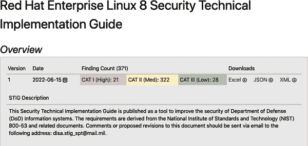

# 第十三章：保护你的系统

系统安全是将配置、软件、政策、规则和最佳实践应用于系统（无论是新的还是多年前的），以使系统在不因安全漏洞和妥协而导致显著停机时间的情况下运行。作为系统管理员，安全是你最重要和耗时的任务。

本章专注于预防安全问题。发现和减轻风险只是简单提及。你将学习如何保护新部署的系统和长期运行的系统。没有一个单一的处理方法是全面的，因为看似每天都会出现新的威胁和漏洞。你将学习如何将基本安全设置应用于你的 Linux 系统。因为许多大型公司都有自己的标准，我推荐的安全设置是一个很好的起点，但你应该始终遵守公司的安全协议和政策。

# 保护根账户

根用户账户是每个 Linux 系统上的超级账户，你必须保护对它的访问。如果有人入侵了这个账户，他们可以将你锁在外面，摧毁系统，窃取数据，或者继续控制它并用它来进入和攻击你网络内的其他系统。永远不要把根密码写下来或与系统管理员组外的任何人分享。如果你使用数据库或其他安全密码管理器来生成和存储密码，请确保在这些应用程序周围采取极端的安全措施。

除了保护常规用户账户（具有复杂性、长度和过期时间的密码）之外，作为系统管理员，你还有责任保护根账户。系统用户账户密码可以共享、写下、通过钓鱼窃取，或口头给予试图通过社会工程学策略利用用户的人。因此，无论密码多么复杂，仍然容易受到许多不同类型的攻击，并且应该用无密码密钥文件替换，其创建和使用在本章后面有详细介绍。

下一节将帮助你了解必须找到和保持的平衡，即保护系统的安全性并不至于将其严密锁定以至于用户会尝试绕过安全性，通过创建流氓系统或本地虚拟机来进行攻击，这些系统可能几乎没有任何安全措施。

# 在安全性和可用性之间找到平衡

如我们所言，安全是你的最大责任。然而，你也必须支持可用的系统。最安全的系统是关机并锁起来的，但它也是不可用的。因此，你必须在安全和可用性之间取得平衡。

系统必须具有用户、软件、文件和网络连接才能发挥作用。所有这些都会降低系统的安全性，但提高可用性。

你的工作是执行以下任务：

+   维护系统，使其免受网络攻击

+   保护系统免受粗心用户的影响

+   保护用户免受彼此的影响

+   保护系统的配置和数据，只允许具有适当访问权限的人访问。

在接下来的章节中，您将学习如何执行这些功能。

## 减少系统的攻击面

您是否曾在电视或电影中看过决斗的再现？请注意，参与者会相向而立，一只手伸出持有决斗手枪，另一只手则在身后。这种“决斗”姿势可以减少他们的可击中表面，使他们更难被命中。通过减小目标大小，您还可以减少致命打击的可能性。您应该通过同样的方式减少系统的攻击表面，只暴露必要的部分以支持正常用户操作。

安装新系统时，您必须仔细选择要安装的服务。例如，当我安装基于 Red Hat 的服务器系统时，我通常使用最小安装选项，通常仅包括 SSH 服务。根据需要添加服务和软件包，以保持系统的足迹小而专注于单一任务。我从不在服务器系统上安装图形用户界面(GUI)或图形显示管理器，因为这些用户友好界面固有的安全漏洞。

### 检查并移除 GUI

要检查您的系统是否具有图形显示管理器，请执行以下命令：

```
$ systemctl get-default
multi-user.target
```

如果回复不是`multi-user.target`，请运行以下命令进行纠正：

```
$ sudo systemctl set-default multi-user.target
```

检查 GUI 或图形显示管理器的安装情况：

```
$ rpm -qa | grep xorg | grep server
```

如果您收到任何回复，它可能看起来类似于以下内容：

```
xorg-x11-server-utils-7.7-27.el8.x86_64
```

您还可能看到类似`xorg-x11-server-common`和`xorg-x11-server-utils`的软件包。如果看到这些软件包之一，请执行以下命令将其移除。请使用与您系统安装的特定软件包名称对应的名称：

```
$ sudo yum remove xorg-x11-server-Xorg \
xorg-x11-server-common xorg-x11-server-utils
```

### 创建单一用途系统

每个系统至少需要一个 SSH 服务器。这是一种安全的连接和管理系统的方法。未使用的服务会使您的系统变得容易受攻击，并成为系统和网络广泛妥协的入口点。您应该使用服务器或最小安装选项安装系统，并在安装和设置后根据需要添加服务。

如果您的发行版没有服务器或最小安装选项，那么您必须选择性地卸载任何不明确需要用于系统指定目的的服务或软件包。让我们来看看如何创建单一用途系统。

虚拟化和云计算使企业能够专注于每个系统一个服务。由于硬件成本，我们曾将物理系统用作服务器而不是虚拟化主机，并且不得不在单个系统上堆叠多个服务。虚拟化主机系统可以为数十个虚拟机或数百个容器系统提供服务，每个执行单一的业务任务，如 Web 服务器、数据库服务器或应用服务器。

构建一个仅托管单一服务的系统比精简存在已久的系统要简单得多。然而，作为系统管理员职责的一部分，您应对管理的任何系统执行安全“扫描”。安全扫描或审核包括使用以下命令检查本地计算机上的监听端口： 

```
$ netstat -an | grep LISTEN | grep tcp
tcp        0      0 0.0.0.0:22              0.0.0.0:*               LISTEN    

$ netstat -an | grep LISTEN | grep udp
```

这两个命令提供了监听守护进程（服务）列表。接口`0.0.0.0`代表所有接口。仅在本地系统上可访问的服务监听`127.0.0.1`（`localhost`或`loopback`）。恶意行为者经常设置成外流服务伪装成 Web 服务、DNS 服务或其他合法服务来愚弄系统管理员和端口扫描器。您应检查系统中所有监听进程的合法性：

```
$ netstat -an | grep LISTEN | grep tcp
tcp        0      0 127.0.0.1:80            0.0.0.0:*               LISTEN    
tcp        0      0 0.0.0.0:22              0.0.0.0:*               LISTEN
```

例如，在*/etc/httpd/conf/httpd.conf*文件（或您特定的 Apache 配置文件）中，有两种可能的配置，但您只能使用其中一种。您必须注释掉您不希望使用的那一个。以下是*httpd.conf*的摘录：

```
# Listen: Allows you to bind Apache to specific IP addresses and/or
# ports, instead of the default. See also the <VirtualHost>
# directive.
#
# Change this to Listen on specific IP addresses as shown below to
# prevent Apache from glomming onto all bound IP addresses.
#
Listen 127.0.0.1:80
#Listen 80
```

您可以指定特定的网络接口和端口（`Listen 127.0.0.1:80`）或监听所有接口的端口（`Listen 80`）。前一种配置确保只有本地系统用户可以使用 Web 服务。虽然仅限本地的 Web 服务器不太实用，但它说明了如何限制对网络服务的访问。

执行`autoremove`命令可删除系统中未使用的软件：

```
$ sudo yum autoremove
$ sudo apt autoremove
```

此命令移除任何未完整卸载或未充分清理软件包残留的软件包依赖关系。

###### 警告

请记住，启用任何通过网络监听的守护进程或服务都会使您的系统面临潜在风险。必须通过安全协议、防火墙、访问控制列表和必要的 IP 限制来保护所有服务。

下一节讨论用户账户的安全性。

## 创建和保护用户账户

一旦在您的系统上创建用户帐户，系统的安全性就会降低。但是，正如您所知，用户帐户是必需的。除了 root 帐户以外几乎没有没有用户帐户的系统。服务帐户是常见的用户帐户，即使没有交互式外壳。没有外壳意味着没有人可以交互式地登录为该用户并发出外壳命令。大多数系统都有交互式外壳用户帐户，以便常规用户可以登录并发出命令，编译软件，连接到其他系统并使用存储和数据等资源。

交互式用户帐户的最大问题是弱密码。弱密码威胁您系统的安全性。至少有两种方法可以减轻这个问题。一种方法是通过制定和执行强密码策略来设置系统要求强密码。另一种方法是禁用密码使用，而改用 SSH 密钥文件，以便用户可以在不需要密码的情况下连接到其他系统。您还可以使用各种免费或商业工具配置多因素认证（MFA）。本书不涉及 MFA 的实施。

### 制定并执行强密码策略

在基于 Red Hat Enterprise Linux 的系统中，*/etc/security/pwquality.conf*文件是允许系统管理员设置和执行企业密码策略的配置文件。以下是该文件的完整列表：

```
# Configuration for systemwide password quality limits
# Defaults:
#
# Number of characters in the new password that must not be present in the
# old password.
# difok = 1
#
# Minimum acceptable size for the new password (plus one if
# credits are not disabled which is the default). (See pam_cracklib manual.)
# Cannot be set to lower value than 6.
# minlen = 8
#
# The maximum credit for having digits in the new password. If less than 0
# it is the minimum number of digits in the new password.
# dcredit = 0
#
# The maximum credit for having uppercase characters in the new password.
# If less than 0 it is the minimum number of uppercase characters in the new
# password.
# ucredit = 0
#
# The maximum credit for having lowercase characters in the new password.
# If less than 0 it is the minimum number of lowercase characters in the new
# password.
# lcredit = 0
#
# The maximum credit for having other characters in the new password.
# If less than 0 it is the minimum number of other characters in the new
# password.
# ocredit = 0
#
# The minimum number of required classes of characters for the new
# password (digits, uppercase, lowercase, others).
# minclass = 0
#
# The maximum number of allowed consecutive same characters in the new password.
# The check is disabled if the value is 0.
# maxrepeat = 0
#
# The maximum number of allowed consecutive characters of the same class in the
# new password.
# The check is disabled if the value is 0.
# maxclassrepeat = 0
#
# Whether to check for the words from the passwd entry GECOS string of the user.
# The check is enabled if the value is not 0.
# gecoscheck = 0
#
# Whether to check for the words from the cracklib dictionary.
# The check is enabled if the value is not 0.
# dictcheck = 1
#
# Whether to check if it contains the user name in some form.
# The check is enabled if the value is not 0.
# usercheck = 1
#
# Length of substrings from the username to check for in the password
# The check is enabled if the value is greater than 0 and usercheck is enabled.
# usersubstr = 0
#
# Whether the check is enforced by the PAM module and possibly other
# applications.
# The new password is rejected if it fails the check and the value is not 0.
# enforcing = 1
#
# Path to the cracklib dictionaries. Default is to use the cracklib default.
# dictpath =
#
# Prompt user at most N times before returning with error. The default is 1.
# retry = 3
#
# Enforces pwquality checks on the root user password.
# Enabled if the option is present.
# enforce_for_root
#
# Skip testing the password quality for users that are not present in the
# /etc/passwd file.
# Enabled if the option is present.
# local_users_only
```

### 通过无密码密钥文件连接到其他系统

通过数据包嗅探或键盘记录程序捕获密码是一种常见的系统妥协方法，当毫无戒心的用户使用密码从一个系统连接到另一个系统时。密码捕获的最佳方法之一是完全停止使用密码。使用密钥文件，用户可以在不需要交互输入密码的情况下从一个系统连接到另一个系统。

在系统之间设置密钥文件是微不足道但稍显耗时的。最终，这提高了安全性，因为没有密码在网络上传输，也没有写在便签上，或者简单到任何人都能猜出来。

#### 创建密钥文件

通过密钥文件的远程登录为您提供了比使用密码更安全的远程系统之间的连接。不详细讨论私钥/公钥身份验证的工作原理（您可以自行研究），使用密钥文件不会将加密或未加密的密码传递到另一个系统。对于攻击者来说，没有可用的数据（密码），因此无法对加密信息进行暴力破解攻击。创建私钥/公钥对非常简单。

下面的示例使用两个 Linux 系统，`server1`和`server2`。您可以在以下代码中看到，您尚未配置这两个系统之间的通过密钥文件的远程登录：

```
[khess@server1 ~]$ ssh server2
The authenticity of host 'server2 (192.168.1.20)' can't be established.
ECDSA key fingerprint is SHA256:dh2YOMWKu2pF/SivS++Y1u1FaE9LcadCKIl6shlSUuc.
Are you sure you want to continue connecting (yes/no/[fingerprint])? yes
Warning: Permanently added 'server2' (ECDSA) to the list of known hosts.
khess@server2's password:
Last login: Thu Aug 11 08:12:06 2022 from 192.168.1.234
[khess@server2 ~]$
```

在这两个系统上运行以下命令来设置您之间的私钥/公钥对：

```
[khess@server1 ~]$ ssh-keygen -t ecdsa -b 521
Generating public/private ecdsa key pair.
Enter file in which to save the key (/home/khess/.ssh/id_ecdsa):
Enter passphrase (empty for no passphrase):
Enter same passphrase again:
Your identification has been saved in /home/khess/.ssh/id_ecdsa.
Your public key has been saved in /home/khess/.ssh/id_ecdsa.pub.
The key fingerprint is:
SHA256:KGNaYYxQXO46dm2J7/8960FLAYQ5mb3e+wgRghX4BUk khess@server1
The key's randomart image is:
+---[ECDSA 521]---+
|.o...  oE@o      |
| ..+  .oB o.     |
|  . = ...o...    |
|   o . ..... .   |
|    * . S...o    |
|   = = .  .+..   |
|  = o +   . o.   |
| . o o     ooo   |
|     .o.....=+.  |
+----[SHA256]-----+
```

默认加密算法是 RSA，但 RSA 和 DSA 算法都已经过时，您不应该使用它们。较新的椭圆曲线数字签名算法（ECDSA）目前是最佳选择。虽然此算法接受 256 位和 384 位加密，但使用 521 位以获得最大保护。您可以选择提供一个密码来进一步保护您的密钥文件对。提供密码确保即使您的私钥被盗，也不能在没有密码的情况下使用它。

###### 注意

可用的三种密钥大小为 256、384 和 521。不，你在命令中看到的`521`不是错误。人们可能会认为下一个可用的密钥大小将是 512，但对于 ECDSA 来说，它是 521。

使用以下命令将 ID 从一个服务器复制到另一个服务器：

```
[khess@server1 ~]$ ssh-copy-id server2
/usr/bin/ssh-copy-id: INFO: Source of key(s) to be installed: "/home/khess/.ss...
/usr/bin/ssh-copy-id: INFO: attempting to log in with the new key(s), to filte...
/usr/bin/ssh-copy-id: INFO: 1 key(s) remain to be installed -- if you are prom...
khess@server2's password:

Number of key(s) added: 1

Now try logging into the machine, with:   "ssh 'server2'"
and check to ensure that only the key(s) you wanted were added.
```

正如消息所建议的那样，尝试登录到`server2`：

```
[khess@server1 ~]$ ssh server2
Last login: Fri Aug 12 14:10:46 2022 from 192.168.1.80
[khess@server2 ~]$
```

您已成功创建密钥对，现在可以从`server1`登录到`server2`而无需密码。您的下一个问题应该是：“这种无密码登录只能从`server1`到`server2`（单向），还是双向的（`server2`到`server1`）？”

要回答这个问题，请尝试从`server2`登录到`server1`：

```
[khess@server2 ~]$ ssh server1
The authenticity of host 'server1 (192.168.1.80)' can't be established.
ECDSA key fingerprint is SHA256:Aim3J/cp24ZIneGzoNyZpf3kWG17ZRrMQVicvOQRyPM.
Are you sure you want to continue connecting (yes/no/[fingerprint])? yes
Warning: Permanently added '192.168.1.80' (ECDSA) to the list of known hosts.
khess@192.168.1.80's password:

Last login: Thu Aug 11 08:08:04 2022 from 192.168.1.234
[khess@server1 ~]$
```

答案是否定的。密钥对是单向的。要设置双向登录（`server2`到`server1`），您必须为`server2`重复该过程：

```
[khess@server2 ~]$ ssh-keygen -t ecdsa -b 521
Generating public/private ecdsa key pair.
Enter file in which to save the key (/home/khess/.ssh/id_ecdsa):
Enter passphrase (empty for no passphrase):
Enter same passphrase again:
Your identification has been saved in /home/khess/.ssh/id_ecdsa
Your public key has been saved in /home/khess/.ssh/id_ecdsa.pub
The key fingerprint is:
SHA256:nlHb2YUMzW29H7XrZvubiP0RK8DnkB+I3bff9TBHsTo khess@server2
The key's randomart image is:
+---[ECDSA 521]---+
|            .o ..|
|             oo.=|
|          .   oo=|
|         .+o+o =o|
|        S..Bo+.+=|
|       . o  * +o=|
|        o    E++o|
|            o +BB|
|           . o+=O|
+----[SHA256]-----+

[khess@server2 ~]$ ssh-copy-id server1
/usr/bin/ssh-copy-id: INFO: Source of key(s) to be installed: "/home/khess/.ss...
/usr/bin/ssh-copy-id: INFO: attempting to log in with the new key(s), to filte...
/usr/bin/ssh-copy-id: INFO: 1 key(s) remain to be installed -- if you are prom...
khess@server1's password:

Number of key(s) added: 1

Now try logging into the machine, with:   "ssh 'server1'"
and check to make sure that only the key(s) you wanted were added.

[khess@server2 ~]$ ssh server1

Last login: Sun Aug 14 10:35:42 2022 from 192.168.1.20
[khess@server1 ~]$
```

现在您可以使用密钥对认证在`server1`和`server2`之间进行双向连接。如果您想了解更多关于 SSH、加密协议和安全相关主题的信息，请访问[OpenSSH 网站](https://oreil.ly/ontmn)。

#### 添加额外的 SSHD 安全性

你应该通过接受密钥文件认证来保护你的 SSHD，如果尚未设置。您可以通过执行以下命令进行检查：

```
$ sudo grep -i pubkey /etc/ssh/sshd_config
#PubkeyAuthentication yes
```

取消注释此行并重新启动 SSHD 服务。如果您过滤“password”一词，您将在*/etc/ssh/sshd_config*中找到以下行：

```
$ sudo grep -i password /etc/ssh/sshd_config
PasswordAuthentication yes
```

此行允许用户使用用户名和密码连接和登录。此行是设置基于密钥的身份验证的要求。（请参阅上一小节，在那里我们看到您必须通过用户名和密码登录以将您的密钥复制到远程系统。）

###### 警告

如果您将`PasswordAuthentication yes`更改为`Password​Authenti⁠cation no`，您将排除尚未配置其基于密钥的认证的用户，因为他们将无法使用用户名和密码登录。除非您使用某种自动化，否则您将需要手动配置每个用户帐户。

前面的警告是作为系统管理员必须做出的决策点之一——在可用性和安全性之间找到平衡。一方面，您试图通过从远程连接中删除密码来增加安全性是令人钦佩的。但另一方面，您必须保留密码身份验证，以便用户可以创建他们自己的密钥对进行安全连接。我的最佳建议是禁用密码并为您的用户处理此任务，因为如果您将这一重要的安全步骤留给用户，您的系统可能会在数月或数年内未受保护。如果您决定不禁用密码身份验证，请增加密码复杂性，缩短过期间隔至不超过 90 天，并强制执行不重复使用的密码。

# 实施高级安全措施

“高级”的定义肯定是一个有争议的问题。对我来说，高级意味着安全措施通常符合国家标准与技术研究所 (NIST) 800-53 和相关文件中描述的安全技术实施指南 (STIG)。所谓的“STIGging”系统保护它免受网络攻击和本地系统攻击。

###### 注意

请记住，即使使用 STIG 来保护系统也不是绝对安全的方法，但它是建立新系统的良好标准。最好使用它来保护您继承的系统。

STIG 通常用于参与国防部项目的政府承包商拥有的系统，这些系统必须遵守严格的数据处理规定。但它们适用于任何系统，无论是否托管敏感数据。您应尽可能地实施这些项目，特别是高严重性列表中的项目。图 13-1 显示了每个指南的编号和严重性以供参考。



###### 图 13-1\. 红帽企业 Linux 8 STIG 的发现和严重级别

下一节将讨论将这些控制项应用于您的系统。

## 应用 STIG 安全控制

应用一系列 STIG 控制是一项耗时的任务。然而，当您阅读这些控制项时，您会发现大多数必要的配置可以自动化完成以符合标准。而且，一些 STIG 提供了可下载的脚本，以便更轻松地实现合规性。尽管所示的 STIG 是针对红帽企业 Linux 的，但这些标准适用于企业和政府办公室中使用的所有 Linux 发行版。有关 Ubuntu STIG 的信息可在 [Ubuntu DISA 页面](https://oreil.ly/Bob4c) 上找到。

如果您为系统创建“黄金”镜像（我强烈建议这样做），您可以开发一个已经设置了安全控制的 STIG 镜像。新的、修订后的 STIG 会根据需要发布，并且通常只包含一些新的安全修复，您可以通过脚本或某些自动化工具将这些修复应用于您的系统。每年更新一次“黄金”镜像可能足以保持系统更新，以便轻松分发新的控制措施。

要实施 STIG 控制措施，请从第一类别（高严重性）控制措施开始，并首先应用这些控制措施。如果您认为某些系统可能存在漏洞，立即实施所有第一类别安全控制措施。目前，针对 Red Hat Enterprise Linux 8，只有 21 个这样的控制措施，因此所需的工作量是最少的。对于第二类别（中等严重性）控制措施，您应该使用审计工具，因为有超过 300 个第二类别控制措施。

## 安装和使用安全工具

有数十种商业和免费的安全工具可用于更好地保护您的系统。以下三种工具与 STIG 结合使用可以极大增强您系统的安全性。正如前文所述，您应该在将系统部署到实时网络之前至少安装并运行这些工具一次。初步运行将为您提供一个基线评估。保留这些初步报告以便将来与您运行的报告进行比较。

强烈建议使用以下几款安全工具。所有新系统应在系统生产部署之前安装这些工具，并完成初步运行。这些安全工具在许多企业环境中表现良好并得到广泛接受。

### Lynis

Lynis 是一个比安全内容自动化协议（SCAP）和 STIG 工具更轻量级的漏洞检测工具。但是，如果您必须符合国防部或其他政府安全标准，它并不能替代这些工具。Lynis 是一个安全审计工具，用于检查您服务器的系统和软件配置。

通过您的软件包管理器安装 Lynis 软件包，然后运行系统审核：

```
$ sudo lynis audit system
```

审计完成后，我通常使用 `grep` 搜索 `Suggestion`，如下所示，以获取推荐安全修复的列表。这个列表可能非常长。

```
$ sudo grep Suggestion /var/log/lynis.log > lynis_fixes.txt
```

您可以参考此列表，进行更正和修复，并重新运行系统审核。我建议继续这样做，直到没有更多建议的修复或者将列表推荐的修复不再适用于您的系统为止。以下是我的建议列表摘录：

```
2022-10-31 13:35:53 Suggestion: Install Apache mod_evasive to guard webserver ...
DoS/brute force attempts [test:HTTP-6640] [details:-] [solution:-]
2022-10-31 13:35:53 Suggestion: Install Apache modsecurity to guard webserver ...
web application attacks [test:HTTP-6643] [details:-] [solution:-]
2022-10-31 13:35:54 Suggestion: Consider hardening SSH configuration [test:SSH...
[details:AllowTcpForwarding (set YES to NO)] [solution:-]
2022-10-31 13:35:54 Suggestion: Consider hardening SSH configuration [test:SSH...
[details:ClientAliveCountMax (set 3 to 2)] [solution:-]
2022-10-31 13:35:54 Suggestion: Consider hardening SSH configuration [test:SSH...
[details:Compression (set YES to NO)] [solution:-]
2022-10-31 13:35:55 Suggestion: Consider hardening SSH configuration [test:SSH...
[details:LogLevel (set INFO to VERBOSE)] [solution:-]
2022-10-31 13:35:55 Suggestion: Consider hardening SSH configuration [test:SSH...
[details:MaxAuthTries (set 6 to 3)] [solution:-]
2022-10-31 13:35:55 Suggestion: Consider hardening SSH configuration [test:SSH...
[details:MaxSessions (set 10 to 2)] [solution:-]
2022-10-31 13:35:55 Suggestion: Consider hardening SSH configuration [test:SSH...
[details:PermitRootLogin (set YES to (FORCED-COMMANDS-ONLY|NO|PROHIBIT-PASSWOR...
2022-10-31 13:35:55 Suggestion: Consider hardening SSH configuration [test:SSH...
[details:Port (set 22 to )] [solution:-]
2022-10-31 13:35:55 Suggestion: Consider hardening SSH configuration [test:SSH...
[details:TCPKeepAlive (set YES to NO)] [solution:-]
2022-10-31 13:35:55 Suggestion: Consider hardening SSH configuration [test:SSH...
[details:X11Forwarding (set YES to NO)] [solution:-]
2022-10-31 13:35:55 Suggestion: Consider hardening SSH configuration [test:SSH...
[details:AllowAgentForwarding (set YES to NO)] [solution:-]
2022-10-31 13:35:58 Suggestion: Enable logging to an external logging host for...
purposes and additional protection [test:LOGG-2154] [details:-] [solution:-]
2022-10-31 13:35:59 Suggestion: Check what deleted files are still in use and ...
[test:LOGG-2190] [details:-] [solution:-]
2022-10-31 13:36:13 Suggestion: Add a legal banner to /etc/issue, to warn unau...
users [test:BANN-7126] [details:-] [solution:-]
2022-10-31 13:36:13 Suggestion: Add legal banner to /etc/issue.net, to warn un...
users [test:BANN-7130] [details:-] [solution:-]
```

我可以忽略的一个示例是*/etc/issue*和*/etc/issue.net*的法律声明。我的系统是私有虚拟机，只有我使用它们。您可能会看到一长串 SSH 加固建议。您应该实施这些建议。一些系统管理员从经过 Lynis“清理”的系统创建“黄金”映像，以便部署一个干净的映像。当然，应定期运行 Lynis 以维护此状态。定期报告的计划`cron`作业是一个很好的解决方案。

### Portsentry

Portsentry 在内存中运行，并尝试检测网络端口扫描，然后通过*hosts.deny*、防火墙规则、`ipchains`和`iptables`条目或丢弃的路由禁止违规主机的 IP 地址。

在*/etc/portsentry/portsentry.conf*中定义的以下端口是“激活”的。您可以随意添加自定义端口或删除端口号。在 Ubuntu 实现中，这是默认的端口列表：

```
# Use these if you just want to be aware:
TCP_PORTS="1,11,15,79,111,119,143,540,635,1080,1524,2000,5742,6667,12345,12346,20
034,27665,31337,32771,32772,32773,32774,40421,49724,54320"
UDP_PORTS="1,7,9,69,161,162,513,635,640,641,700,37444,34555,31335,32770,32771,327
72,32773,32774,31337,54321"
```

默认操作是将路由返回到扫描主机：

```
KILL_ROUTE="/sbin/route add -host $TARGET$ reject"
```

我还通过取消注释以下行使用*/etc/hosts.deny*条目：

```
KILL_HOSTS_DENY="ALL: $TARGET$ : DENY"
```

确保主机的路由被阻止并且 IP 地址在*/etc/hosts.deny*中被阻止。*/etc/hosts.deny*和*路由*中的条目看起来像扫描的结果（扫描主机为`192.168.1.234`）。

来自*/etc/hosts.deny*：

```
ALL: 192.168.1.234 : DENY
```

来自*路由*表：

```
Kernel IP routing table
Destination     Gateway         Genmask         Flags Metric Ref    Use Iface
default         Docsis-Gateway  0.0.0.0         UG    0      0        0 enp0s3
192.168.1.0     0.0.0.0         255.255.255.0   U     0      0        0 enp0s3
192.168.1.234   -               255.255.255.255 !H    0      -        0 -
```

下面是*/var/log/syslog*中标识违规系统的一些条目：

```
Oct 31 21:21:51 server2 portsentry[177518]: attackalert: Host: 192.168.1.234...
already blocked. Ignoring
Oct 31 21:21:51 server2 portsentry[177518]: attackalert: Connect from host: ...
to TCP port: 32772
Oct 31 21:21:51 server2 portsentry[177518]: attackalert: Host: 192.168.1.234...
already blocked. Ignoring
Oct 31 21:21:51 server2 portsentry[177518]: attackalert: Connect from host: ...
to TCP port: 32773
Oct 31 21:21:51 server2 portsentry[177518]: attackalert: Host: 192.168.1.234...
already blocked. Ignoring
Oct 31 21:21:51 server2 portsentry[177518]: attackalert: Connect from host: ...
to TCP port: 32774
Oct 31 21:21:51 server2 portsentry[177518]: attackalert: Host: 192.168.1.234...
already blocked. Ignoring
```

Portsentry 是一个非常有用的小工具，一直是我的安全层之一。您可以看到它有效地阻止了来自特定主机的连接。如果您有一个 DMZ 主机，应该在其上使用 Portsentry，因为它每天会被扫描多次。

### 高级入侵检测环境

高级入侵检测环境（AIDE）是用于检查文件完整性的入侵检测系统。从存储库安装 AIDE：

```
$ sudo dnf install aide
```

如果您不使用基于 Red Hat 的系统，安装过程将有所不同。在 Ubuntu（我认为在所有基于 Debian 的系统上都是如此），安装程序会引导您完成后缀配置，并在*/etc/aide*下创建多个配置文件。Ubuntu 的实现与基于 Red Hat Enterprise Linux 的实现不同。文本中已经注意到了这些差异。在使用 AIDE 之前，您必须首先使用以下命令初始化其数据库。此过程需要几分钟完成。

```
$ sudo aide --init
Start timestamp: 2022-10-31 09:19:12 -0400 (AIDE 0.16)
AIDE initialized database at /var/lib/aide/aide.db.new.gz

Number of entries:    156566

---------------------------------------------------
The attributes of the (uncompressed) database(s):
---------------------------------------------------

/var/lib/aide/aide.db.new.gz
  MD5      : WzAN0+7wHIA5a+vZkzwQVQ==
  SHA1     : 8FisYNVBvBy3bdg1NaeJY1vm7LI=
  RMD160   : fwBCNvM7WMl7j8TN3EhB5X72ozs=
  TIGER    : 2fM2gL5j7aZ+BpjS9QOx4CjJKEZlZLSC
  SHA256   : XTBnehGnObWiSXR4qEJDQqOO0eCAQzfJ
             4viTZDfmQYI=
  SHA512   : M+1T1KBw04F/hbWE2uSEs3mEsYI7QzoM
             godalkUZAWLoG5LgsJTiFjPXdSnZ/dRE
             n4A83aQWtART7O7uVNR//A==

End timestamp: 2022-10-31 09:21:17 -0400 (run time: 2m 5s)
```

您可以使用类似的命令（脚本）在 Ubuntu 上初始化 AIDE 数据库，执行`aide –init`：

```
$ sudo aideinit
Running aide --init...
Start timestamp: 2022-10-31 09:31:07 -0400 (AIDE 0.16.1)
AIDE initialized database at /var/lib/aide/aide.db.new
Verbose level: 6

Number of entries:    220642

---------------------------------------------------
The attributes of the (uncompressed) database(s):
---------------------------------------------------

/var/lib/aide/aide.db.new
  RMD160   : pxukBfZYMClQJluYftmJxyHvQ6c=
  TIGER    : aRgAX6JnizUa9yiTE29/uZ0HqMYioQcN
  SHA256   : lmV6LTtzpiLDUAw6qloEgfAT0sD7J74w
             2vqhj7nVLP0=
  SHA512   : VCfBAAxLvaA5CEtOJEPu2SeA/565gfUS
             T0BgFFwfXWG8RkksMbnHtm8pDtVlUSnc
             TqQhcebdU/qODLwPkGIzTg==
  CRC32    : 7jx94w==
  HAVAL    : vrZDJ+70DZkjj7t6BHzt3ph4UN4yoDnd
             8oxrBBy2hvA=
  GOST     : sDLorHAYPZb74dZmIpYYZjARR3znxOXI
             Sv0WSZiZV0g=

End timestamp: 2022-10-31 09:39:38 -0400 (run time: 8m 31s)
```

在基于 Red Hat Enterprise Linux 的系统上，您必须在检查系统之前执行最后一个任务：

```
$ sudo cp /var/lib/aide/aide.db.new.gz /var/lib/aide/aide.db.gz
$ sudo aide --check

Start timestamp: 2022-10-31 10:08:44 -0400 (AIDE 0.16)
AIDE found NO differences between database and filesystem. Looks okay!!

Number of entries:    156566

---------------------------------------------------
The attributes of the (uncompressed) database(s):
---------------------------------------------------

/var/lib/aide/aide.db.gz
  MD5      : WzAN0+7wHIA5a+vZkzwQVQ==
  SHA1     : 8FisYNVBvBy3bdg1NaeJY1vm7LI=
  RMD160   : fwBCNvM7WMl7j8TN3EhB5X72ozs=
  TIGER    : 2fM2gL5j7aZ+BpjS9QOx4CjJKEZlZLSC
  SHA256   : XTBnehGnObWiSXR4qEJDQqOO0eCAQzfJ
             4viTZDfmQYI=
  SHA512   : M+1T1KBw04F/hbWE2uSEs3mEsYI7QzoM
             godalkUZAWLoG5LgsJTiFjPXdSnZ/dRE
             n4A83aQWtART7O7uVNR//A==

End timestamp: 2022-10-31 10:10:53 -0400 (run time: 2m 9s)
```

您可以在 Ubuntu 系统上执行检查，而无需复制文件。Ubuntu 安装程序会为您完成此任务。但是，如果您运行`sudo aide --check`，您会收到错误`Couldn't open file /var/lib/aide/please-dont-call-aide-without-parameters/aide.db for reading`。

Ubuntu 系统显示了一份对变更的正面报告。虽然冗长，但它说明了当 AIDE 检测到变更时，您会看到的报告类型。报告提供了对文件所做更改的详细信息：

```
$ sudo aide.wrapper --check

Start timestamp: 2022-10-31 10:09:42 -0400 (AIDE 0.16.1)
AIDE found differences between database and filesystem!!
Verbose level: 6

Summary:
  Total number of entries:    220641
  Added entries:          1
  Removed entries:        1
  Changed entries:        5

---------------------------------------------------
Added entries:
---------------------------------------------------

f++++++++++++++++: /var/lib/aide/aide.db

---------------------------------------------------
Removed entries:
---------------------------------------------------

l----------------: /run/systemd/units/invocation:packagekit.service

---------------------------------------------------
Changed entries:
---------------------------------------------------

f =.... ....C..  : /run/samba/smbXsrv_open_global.tdb
f =.... ....C..  : /run/samba/smbd_cleanupd.tdb
d <.... mc.. ..  : /run/systemd/units
f =.... mc..C.. .: /var/log/journal/ae1c358b16f744999c9d4b7a80e.../system.journal
f >b... mc..C.. .: /var/log/sysstat/sa31

---------------------------------------------------
Detailed information about changes:
---------------------------------------------------

File: /run/samba/smbXsrv_open_global.tdb
  RMD160   : CCdm3M2ObTIu3vIXdx1vyH8emLc=     | AMx08YvCC7rmeUGhvjZ3OjLInKs=
  TIGER    : 814xHPLSSvskZzBYZ0xfLej4O5/LeQ2s | PE/hVYgRx4i17ckNePiFjVXgPQu0wOGG
  SHA256   : Y6KJgoFPHLYXfqBOom9NlbkXIYAmXmjQ | ahWfobXIOoIToffW0+jZjYYTg8W/JrFd
             /kRNN0Axa1o=                     | vrCgRinjC+g=
  SHA512   : kRDLUujEHcHUIyUVtv/u9BFldu+oCXFj | ZudqhTqoc3xOSp5RMntoJ0yUU6dkrifw
             9qbOjLft3SJK3btR0vfJtJHL1UW13LZC | R+2UDQM1zTopREoU/+N/jo9i80AcDqD6
             bUf44NCR1OSQ6s2DIfcb7A==         | j44U/ao6HhDEjE/aqoMT4Q==
  CRC32    : j0j0sA==                         | E7N72A==
  HAVAL    : giCwkv0n5oPDwHs/9k0HfPoGcAvkntQF | TJbUsmxe9Kt0+xK6R72Nk0R/2PT/XZVe
             39jkiW8nA3o=                     | Ml3VqYaXTGg=
  GOST     : P7uSZmTObQfp5nChg9W4svXupluCGaMS | GHF0TxYsXQfay3ayLi/KBck1hDcor92t
             xKp5tZQoPsQ=                     | zHzSyOiNZYk=

File: /run/samba/smbd_cleanupd.tdb
  RMD160   : D8RmZx6959xPvPKuRbEGMJdl9ww=     | uOtFZoKw8zVjcGZdhJkXcyL3kEg=
  TIGER    : xCRjkykka/bv2rf06KRdPtigjByvsQJB | r5sm3aHqZJ26jPmADp8tk1qvdPw1IfFF
  SHA256   : 7egAlq5dMozWAiYPYx3JH9r7kY1oyeOR | FVaSrvPfA5ivujOsuVcKgCdS20TQTGrw
             0DYEU4MZohA=                     | MFTjvyUFZWk=
  SHA512   : AqzJDePQwKxivNPtdJzX4suWBQnDSJhO | lYLskmVOAFSHs9dG2eVP9u4bEAWOcKM6
             hjUdEpFGKFaj0ODwuVumBHi/npByq2pZ | M0Tf73IXztE5kaP/9YHaOJRGata0GCZk
             +tMh5Kc5IevDpGPvrj5lxQ==         | t5viYSFd2ZIL9Alr31kACg==
  CRC32    : V4u1vg==                         | haAC6Q==
  HAVAL    : 0Ny4G+Y4tTaGHfFu7cXgW7yV2iPaO7xL | tR7ZgOfYNMjaKk0byAUOXAPx6/COqfVc
             ae5dMQFmNPY=                     | 4jpIEdYENd4=
  GOST     : dbrx9gce/697G9QVs4XcaoHXuS2fd3Nn | jewBI4vx9CPF6Xof7f2vdZOrzmzAcD2c
             ZNAX4+OndrQ=                     | yimBCewy/bE=

Directory: /run/systemd/units
  Size     : 1760                             | 1740
  Mtime    : 2022-10-31 09:30:13 -0400        | 2022-10-31 09:35:18 -0400
  Ctime    : 2022-10-31 09:30:13 -0400        | 2022-10-31 09:35:18 -0400

File: /var/log/journal/ae1c358b16f744999c9d4b7a80e92d66/system.journal
  Mtime    : 2022-10-31 09:35:18 -0400        | 2022-10-31 10:17:02 -0400
  Ctime    : 2022-10-31 09:35:18 -0400        | 2022-10-31 10:17:02 -0400
  RMD160   : oUjngLN5zL6EG9FssV5/Y7RDdG4=     | EekegpOq7Vf0fR82TtrvxJAwXP4=
  TIGER    : ZH3LLiOvM8ew7O3yw+SC/wHiDvkTemCF | N9DDL3wW44urrq0MJhwnclk4/c1jLuJW
  SHA256   : bfyPm9q1QlUlTm+JurRZnVMgAOYb0UFE | 5vU1pGWJ2WxMLZK7/f3qZ/Ix4o+NANoB
             qIjQofT4Jfo=                     | kNN6Q+9pwCk=
  SHA512   : oLscXcjp62ezwcSZ3E1EUkTrRCilblyM | Vd0CyIE+C+oGAOLsCfvfxdNlqKvasSC4
             9/g+mdsGNBxA681uxBJcyVZIPJZ1s/cX | dVF0zmryyzd5lDsod8aH8WNLEfpHlSzL
             SQV6E+nnc2KiL4teg1YdKg==         | j9+yt6iOJAKTtO3bIdqmEg==
  CRC32    : pe7DMw==                         | br312w==
  HAVAL    : izYRs/Df2Ae5PAbD9m7RsTOXvO2sTOV0 | wamyIlLjRTtgFpwgfIABPhAodrHuRHe1
             qv7063B7mFI=                     | ee/pSNw9Z/I=
  GOST     : FH3fMIAa0W2eV+aLNnkY+wjxhjr+LhqA | yYmdcHpvePslHVmsm1w2TpgqIo6Mh1QT
             CZbOX7wbKRA=                     | oFuber3PVDo=

File: /var/log/sysstat/sa31
  Size     : 131024                           | 139840
  Bcount   : 264                              | 288
  Mtime    : 2022-10-31 09:35:01 -0400        | 2022-10-31 10:15:01 -0400
  Ctime    : 2022-10-31 09:35:01 -0400        | 2022-10-31 10:15:01 -0400
  RMD160   : bFqT+RlB042AhIl9JaOaAI/fGPE=     | jO8DEa6NGNYnP6+U8BF/yUsweIs=
  TIGER    : /Pz1oVax6QHqhWivA3Cec/f0vHajjxx0 | XiMXwjskfSFf4NH8rRb4cWc6West9MQp
  SHA256   : t256G+V3hS8DvMj53EXw8W7e/MkwSAUe | T7r2xNaGWtzBp0Qab6seO1KNluyOmWa+
             9AYuduiSjVI=                     | 634jjyPpVCk=
  SHA512   : KSUTRzDpgc/s2jwJkQIb0uS+5cJsFqXl | iguQ86cwvpqL3WAmFJWA0tpzy43REGKh
             yGXoVuzd65YDpE8msRaBRCcqTIB740pf | DcySXGUBCSHXvmFHAK4P7Zk0tJB4etzj
             dgo3E6K/s8UaqI1biiC2tQ==         | Vpg8/WZL+0nSk3XaKZ6UwA==
  CRC32    : 07QWcA==                         | 8X9Ixg==
  HAVAL    : WnGG1i1qhDBdNIL7TGF9euydFem/oZC9 | v6IskRb6hSnVRiB5tqUSCysPtqn3ZKQp
             u7o3lSxAl0Q=                     | HPay7Epiak0=
  GOST     : vkWWBQUA+WBuEBvNAMLFerzUOkT5SWl9 | AZNTPCF3a1oSYHexxtKQoL0ksvP1Oyhx
             QTnod3FQCJQ=                     | H+BXGeFVW70=

---------------------------------------------------
The attributes of the (uncompressed) database(s):
---------------------------------------------------

/var/lib/aide/aide.db
  RMD160   : pxukBfZYMClQJluYftmJxyHvQ6c=
  TIGER    : aRgAX6JnizUa9yiTE29/uZ0HqMYioQcN
  SHA256   : lmV6LTtzpiLDUAw6qloEgfAT0sD7J74w
             2vqhj7nVLP0=
  SHA512   : VCfBAAxLvaA5CEtOJEPu2SeA/565gfUS
             T0BgFFwfXWG8RkksMbnHtm8pDtVlUSnc
             TqQhcebdU/qODLwPkGIzTg==
  CRC32    : 7jx94w==
  HAVAL    : vrZDJ+70DZkjj7t6BHzt3ph4UN4yoDnd
             8oxrBBy2hvA=
  GOST     : sDLorHAYPZb74dZmIpYYZjARR3znxOXI
             Sv0WSZiZV0g=

End timestamp: 2022-10-31 10:18:52 -0400 (run time: 9m 10s)
```

您还可以运行一个检查和更新数据库的更新，但输入和输出数据库必须不同。该命令的输出也相当冗长，因此被截断。但我在这里展示的是摘要而不是详细视图。此更新在 Ubuntu 系统上执行，但在基于 Red Hat Enterprise Linux 的系统上使用 `sudo aide.wrapper --update` 命令同样有效：

```
$ sudo aide.wrapper --update
Start timestamp: 2022-10-31 10:42:00 -0400 (AIDE 0.16.1)
AIDE found differences between database and filesystem!!
New AIDE database written to /var/lib/aide/aide.db.new
Verbose level: 6

Summary:
  Total number of entries:    220641
  Added entries:          1
  Removed entries:        1
  Changed entries:        9

---------------------------------------------------
Added entries:
---------------------------------------------------

f++++++++++++++++: /var/lib/aide/aide.db

---------------------------------------------------
Removed entries:
---------------------------------------------------

l----------------: /run/systemd/units/invocation:packagekit.service

---------------------------------------------------
Changed entries:
---------------------------------------------------

f =.... ....C..  : /run/samba/smbXsrv_open_global.tdb
f =.... ....C..  : /run/samba/smbd_cleanupd.tdb
d <.... mc.. ..  : /run/systemd/units
d =.... mc.. .. .: /var/lib/chrony
f =.... mci.C.. .: /var/lib/chrony/chrony.drift
d =.... mc.. .. .: /var/lib/snapd
f >.... mci.C.. .: /var/lib/snapd/state.json
f =.... mc..C.. .: /var/log/journal/ae1c358b16f744999c9d4b7a80e.../system.journal
f >b... mc..C.. .: /var/log/sysstat/sa31
```

如您所见，您可能会收到误报，因为一些文件经常更改，但为了保证文件完整性检查的工作是值得的。下一节是回应安全事件的概述，包括内部和外部系统漏洞的情况。

# 回应安全事件

安全事件范围从用户允许另一个用户访问其帐户，到聪明用户试图破解 root 用户的密码，再到恶意外部参与者或高级持续性威胁的全面安全漏洞。我目睹了这些情况，以及许多其他类型的安全事件。任何系统管理员执行的最不愉快的任务之一是应对安全事件。你能想象到的最糟糕的一天是当你发现安全漏洞或有人告诉你，“我们被黑了”。这些话会毁掉一个本来平静无事的日子。

一份写得好的安全政策是防范内部威胁的最佳防线，比如有人试图破解 root 用户密码或者在用户之间共享凭证。这些事件应该记录并报告给管理层，并采取政策驱动的措施来防止此类安全漏洞的未来发生。对于外部漏洞，情况则不同，因为企业政策不约束组织外的恶意参与者。

本节涵盖处理由内部和外部参与者引发的安全事件的主题。

## 制定书面安全政策

编写安全政策是一项可以管理的任务。许多示例可以在网上免费找到。快速搜索会找到数百种可能性。选择一个或多个通用的政策示例，并适应到你的组织。所有的安全事件都很严重，都应该予以重视。即使是友好同事之间简单地共享用户名和密码也是一种违规行为，应立即严肃处理。违反安全政策往往是受到警告、解雇甚至刑事起诉的理由。

每位员工应该收到一份书面安全政策副本，并签署表示他们已阅读并理解该政策及其违反后果。年度安全复习课程应强化公司的安全政策标准、期望和违规后果。

## 确认违规

您必须确认是否发生了违规行为，以及违规行为对知识产权、财务记录、员工信息和其他宝贵信息和数据造成了何种程度的损害。根据您从证券交易委员会、国防部和其他当局的具体监管要求，发现和确认后有些违规行为必须向执法部门报告。

如果您不属于众多监管机构的一员，您可能会发现您需要自行确认并处理违规行为。您应当联系一家处理违规发现的第三方安全公司，以协助您的努力。

第一步是将受损系统从网络中移除。拔掉它们的网络连接并禁用 WiFi 适配器。保持系统开启状态。将您的取证工具离线加载到受影响的系统上，并在执行任何缓解操作之前对系统进行磁盘克隆。复制的磁盘可能对执法部门追踪嫌疑人很有价值。

## 识别恶意行为者

通常情况下，识别内部行为者比识别外部来源要容易得多。包括 FBI、国土安全部、NSA 和其他机构的执法部门可能会在威胁来自外部来源时帮助进行调查。攻击者通过删除日志文件、分批窃取数据并在不被察觉的情况下在您的网络内部系统之间进行转移，以保持未被发现数月甚至数年的状态。

如果您怀疑一个恶意组织或外国政府支持的集体已经侵入了您的网络或窃取了知识产权，您最好的选择是联系执法部门和联邦调查局（FBI）。如果您的公司是国防部或其他机构保护的承包商，FBI 或 NSA 可能会在您发现发生违规之前与您联系。在这些情况下，最好向当局提供他们要求的任何信息、数据和访问权限。识别、阻止和起诉网络犯罪分子是政府机构的首要任务。

## 采取纠正措施

一旦确认了违规行为并评估了损害情况，就是时候采取纠正措施了，包括扫描和清理文件、启用基于主机的防火墙、加密数据和重新镜像系统。你所采取的措施将取决于违规的程度以及恶意行为者采取的行动。良好的备份、灾难恢复计划、加密数据和多层安全措施将有助于您从违规中恢复。

您应当向当地执法部门报告任何违规行为并采取任何建议的措施。如果违规行为仍在进行中，请通知执法部门违规行为仍在进行中，以便他们能够采取行动或代表您通知其他机构。

不幸的是，当攻击的广度和深度不明确时，建议离线重置关键系统，并在将其重新引入企业网络之前应用所有安全措施。

# 概要

网络和系统安全是持续的工作，而不是“安装完成就可以忘记”的情况。安全需要持续的警惕、高级培训、定期软件和硬件补丁、自动化系统软件以及来自多重安全层的安全性，包括 MFA、防火墙、加密、安全工具、安全开发和用户培训。明智的做法是聘请外部安全公司协助设计和保护您的网络和资产。
